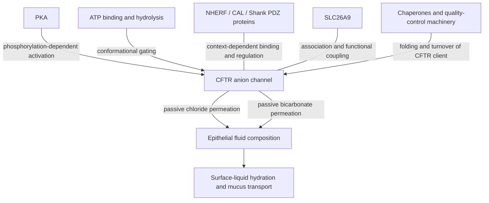

# Pathway Summary for CFTR

## Source correction — 2026-10-10

This page corrects the previously displayed pathway. The original published text and diagram remain unchanged as historical provenance in [CFTR-source-evidence.json](CFTR-source-evidence.json), rather than as current biological assertions. The [review](CFTR-ai-review.yaml) and [notes](CFTR-notes.md) document the evidence and remaining uncertainty.

CFTR conducts chloride and bicarbonate through an ATP-regulated pore. ATP hydrolysis controls channel conformation; it does not drive uphill transport of each permeating ion. Bicarbonate conduction and stable selectivity under the tested conditions are supported by PMID:19019741. The external-chloride-dependent selectivity model belongs to the separate oocyte study PMID:15010471.

## Channel activation and epithelial transport

CFTR is a phosphorylation-regulated anion channel concentrated at the apical membrane of many epithelia. PKA-dependent activation and nucleotide-dependent gating connect cellular signaling to chloride and bicarbonate permeation. Purified, reconstituted CFTR has ATPase activity, and monomers suffice for both channel and ATPase measurements; membrane self-association does not establish an obligatory dimeric pore [PMID:8910473, PMID:11524016]. The two nucleotide-binding folds have unequal catalytic and gating contributions, so a fixed ATP-turnover-to-opening ratio is not assumed [PMID:9931011].

The resulting anion flux contributes to epithelial fluid composition, airway-surface hydration and mucus clearance. Mucus hydration and transport are distinct from regulated mucus release. Human airway cultures rescued with CFTR show changes in chloride transport, benzamil-sensitive sodium transport and surface-liquid endpoints [PMID:19621064]. These findings retain physiological sodium coupling without asserting a defined direct CFTR-to-ENaC inhibitory contact or step.

## Pathway diagram

```mermaid
graph TD
    PKA[PKA] -->|phosphorylation-dependent activation| CFTR[CFTR anion channel]
    ATP[ATP binding and hydrolysis] -->|conformational gating| CFTR
    CFTR -->|passive chloride permeation| FLUID[Epithelial fluid composition]
    CFTR -->|passive bicarbonate permeation| FLUID
    FLUID --> HYDRATION[Surface-liquid hydration and mucus transport]
    NHERF[NHERF / CAL / Shank PDZ proteins] ---|context-dependent binding and regulation| CFTR
    SLC26A9[SLC26A9] ---|association and functional coupling| CFTR
    QC[Chaperones and quality-control machinery] -->|folding and turnover of CFTR client| CFTR
```

The diagram omits the earlier reversed ENaC inhibitory arrow. It also replaces the unsupported DRA-specific coupling and ClC-3B trafficking arrows with the interactions supported by their actual sources. It is a functional summary, not a claim that every displayed association is a purified binary interaction.

## Binding and regulatory context

- **NHERF2/E3KARP:** PMID:12369822 compares CFTR with DRA as ligands for the second PDZ domain of E3KARP. Its preserved CFTR partner is NHERF2, and that comparison alone does not establish CFTR–DRA functional coupling.
- **Shank2 and other PDZ partners:** Shank2 association depends on its PDZ domain and can suppress CFTR activity in the tested cellular systems. NHERF1 and Shank interactions can compete [PMID:14679199, PMID:17244609].
- **ClC-3B:** CFTR and ClC-3B share PDZ partners, and PDZK1 can promote their association. Their predominant localizations differ; this evidence does not establish that ClC-3B controls CFTR trafficking [PMID:12471024].
- **SLC26A9:** Co-immunoprecipitation and current measurements support contextual channel association and functional coupling. Proposed ER-retention mechanisms are not treated as demonstrated direct trafficking steps [PMID:19289574].
- **Quality control:** Chaperones and ubiquitin-system components recognize folding or trafficking states of CFTR. Their enzymatic and adaptor activities are not transferred to the CFTR client [PMID:16901789, PMID:17110338].

## Disease and experimental context

Loss of CFTR function causes cystic fibrosis. F508del commonly impairs folding and delivery to the cell surface, while other variants alter gating or permeation. Effects differ across airway, intestinal, pancreatic and sweat-duct epithelia; CFTR supports secretion in some tissues and salt reabsorption in others.

The older cited intervention studies are experimental context, not current treatment recommendations. Miglustat rescued F508del channel function in the tested preparations [PMID:16546175]; Aha1 depletion altered the folding environment and rescued mutant surface delivery [PMID:17110338]. LPA-dependent receptor complexes suppressed CFTR-dependent intestinal secretion in the cholera-toxin experiments [PMID:16203867]. These partner and perturbation results complement the intrinsic channel/ATPase functions without establishing additional catalytic activities for CFTR.
