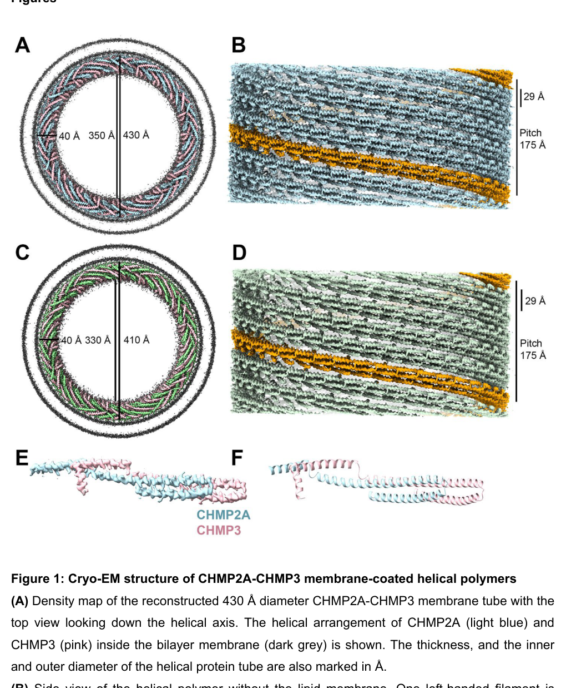

## Question

# Gene Research for Functional Annotation

## ⚠️ CRITICAL: Gene/Protein Identification Context

**BEFORE YOU BEGIN RESEARCH:** You MUST verify you are researching the CORRECT gene/protein. Gene symbols can be ambiguous, especially for less well-characterized genes from non-model organisms.

### Target Gene/Protein Identity (from UniProt):
- **UniProt Accession:** Q9H444
- **Protein Description:** RecName: Full=Charged multivesicular body protein 4b; AltName: Full=Chromatin-modifying protein 4b; Short=CHMP4b; AltName: Full=SNF7 homolog associated with Alix 1; AltName: Full=SNF7-2; Short=hSnf7-2; AltName: Full=Vacuolar protein sorting-associated protein 32-2; Short=Vps32-2; Short=hVps32-2;
- **Gene Information:** Name=CHMP4B; Synonyms=C20orf178, SHAX1;
- **Organism (full):** Homo sapiens (Human).
- **Protein Family:** Belongs to the SNF7 family. .
- **Key Domains:** Snf7_fam. (IPR005024); Snf7 (PF03357)

### MANDATORY VERIFICATION STEPS:

1. **Check if the gene symbol "CHMP4B" matches the protein description above**
2. **Verify the organism is correct:** Homo sapiens (Human).
3. **Check if protein family/domains align with what you find in literature**
4. **If you find literature for a DIFFERENT gene with the same or similar symbol, STOP**

### If Gene Symbol is Ambiguous or You Cannot Find Relevant Literature:

**DO NOT PROCEED WITH RESEARCH ON A DIFFERENT GENE.** Instead:
- State clearly: "The gene symbol 'CHMP4B' is ambiguous or literature is limited for this specific protein"
- Explain what you found (e.g., "Found extensive literature on a different gene with the same symbol in a different organism")
- Describe the protein based ONLY on the UniProt information provided above
- Suggest that the protein function can be inferred from domain/family information

### Research Target:

Please provide a comprehensive research report on the gene **CHMP4B** (gene ID: CHMP4B, UniProt: Q9H444) in human.

The research report should be a detailed narrative explaining the function, biological processes, and localization of the gene product. Citations should be given for all claims.

You should prioritize authoritative reviews and primary scientific literature when conducting research. You can supplement
this with annotations you find in gene/protein databases, but these can be outdated or inaccurate.

We are specifically interested in the primary function of the gene - for enzymes, what reaction is catalyzed, and what is the substrate specificity? For transporters, what is the substrate? For structural proteins or adapters, what is the broader structural role? For signaling molecules, what is the role in the pathway.

We are interested in where in or outside the cell the gene product carries out its function.

We are also interested in the signaling or biochemical pathways in which the gene functions. We are less interested in broad pleiotropic effects, except where these elucidate the precise role.

Include evidence where possible. We are interested in both experimental evidence as well as inference from structure, evolution, or bioinformatic analysis. Precise studies should be prioritized over high-throughput, where available.

## Output

Question: You are an expert researcher providing comprehensive, well-cited information.

Provide detailed information focusing on:
1. Key concepts and definitions with current understanding
2. Recent developments and latest research (prioritize 2023-2024 sources)
3. Current applications and real-world implementations
4. Expert opinions and analysis from authoritative sources
5. Relevant statistics and data from recent studies

Format as a comprehensive research report with proper citations. Include URLs and publication dates where available.
Always prioritize recent, authoritative sources and provide specific citations for all major claims.

# Gene Research for Functional Annotation

## ⚠️ CRITICAL: Gene/Protein Identification Context

**BEFORE YOU BEGIN RESEARCH:** You MUST verify you are researching the CORRECT gene/protein. Gene symbols can be ambiguous, especially for less well-characterized genes from non-model organisms.

### Target Gene/Protein Identity (from UniProt):
- **UniProt Accession:** Q9H444
- **Protein Description:** RecName: Full=Charged multivesicular body protein 4b; AltName: Full=Chromatin-modifying protein 4b; Short=CHMP4b; AltName: Full=SNF7 homolog associated with Alix 1; AltName: Full=SNF7-2; Short=hSnf7-2; AltName: Full=Vacuolar protein sorting-associated protein 32-2; Short=Vps32-2; Short=hVps32-2;
- **Gene Information:** Name=CHMP4B; Synonyms=C20orf178, SHAX1;
- **Organism (full):** Homo sapiens (Human).
- **Protein Family:** Belongs to the SNF7 family. .
- **Key Domains:** Snf7_fam. (IPR005024); Snf7 (PF03357)

### MANDATORY VERIFICATION STEPS:

1. **Check if the gene symbol "CHMP4B" matches the protein description above**
2. **Verify the organism is correct:** Homo sapiens (Human).
3. **Check if protein family/domains align with what you find in literature**
4. **If you find literature for a DIFFERENT gene with the same or similar symbol, STOP**

### If Gene Symbol is Ambiguous or You Cannot Find Relevant Literature:

**DO NOT PROCEED WITH RESEARCH ON A DIFFERENT GENE.** Instead:
- State clearly: "The gene symbol 'CHMP4B' is ambiguous or literature is limited for this specific protein"
- Explain what you found (e.g., "Found extensive literature on a different gene with the same symbol in a different organism")
- Describe the protein based ONLY on the UniProt information provided above
- Suggest that the protein function can be inferred from domain/family information

### Research Target:

Please provide a comprehensive research report on the gene **CHMP4B** (gene ID: CHMP4B, UniProt: Q9H444) in human.

The research report should be a detailed narrative explaining the function, biological processes, and localization of the gene product. Citations should be given for all claims.

You should prioritize authoritative reviews and primary scientific literature when conducting research. You can supplement
this with annotations you find in gene/protein databases, but these can be outdated or inaccurate.

We are specifically interested in the primary function of the gene - for enzymes, what reaction is catalyzed, and what is the substrate specificity? For transporters, what is the substrate? For structural proteins or adapters, what is the broader structural role? For signaling molecules, what is the role in the pathway.

We are interested in where in or outside the cell the gene product carries out its function.

We are also interested in the signaling or biochemical pathways in which the gene functions. We are less interested in broad pleiotropic effects, except where these elucidate the precise role.

Include evidence where possible. We are interested in both experimental evidence as well as inference from structure, evolution, or bioinformatic analysis. Precise studies should be prioritized over high-throughput, where available.

# Research Report: Human **CHMP4B** (UniProt **Q9H444**) — Functional Annotation and Current Evidence

## 0. Target verification (mandatory identity checks)
The literature reviewed here is consistent with the UniProt target provided: **CHMP4B** (charged multivesicular body protein 4B; also referred to as **Snf7/CHMP4B** in the ESCRT field) is a **human** ESCRT-III subunit in the **SNF7 family** (CHMP4A/B/C). (park2024escrtiiiaversatile pages 7-8, azad2023structuralbasisof pages 1-4)

## 1. Key concepts and definitions (current understanding)

### 1.1 ESCRT machinery and “reverse-topology” membrane scission
The **endosomal sorting complexes required for transport (ESCRT)** are an evolutionarily conserved set of protein assemblies that remodel membranes. A defining feature of ESCRT-driven fission is **reverse-topology scission**: membrane constriction and cutting occurs from the cytosolic side to sever a bud neck away from the cytosol (e.g., intralumenal vesicles inside endosomes, viral budding from the plasma membrane). ESCRT-III is generally the core membrane-remodeling module that polymerizes into higher-order filaments and, together with the **AAA ATPase VPS4**, produces constriction and fission. (park2024escrtiiiaversatile pages 5-7, azad2023structuralbasisof pages 1-4)

### 1.2 What CHMP4B is (and is not)
**CHMP4B is not an enzyme** and does not catalyze a chemical transformation; its primary function is **structural/mechanical**. CHMP4-family proteins are described as SNF7-like ESCRT-III subunits that transition from an autoinhibited conformation to an open, polymerization-competent state on membranes, contributing to **filament formation** that bends and constricts membranes. (park2024escrtiiiaversatile pages 1-2, park2024escrtiiiaversatile pages 2-4)

### 1.3 Domain/family features relevant to function
CHMP4B belongs to the **SNF7/CHMP4 family** within ESCRT-III; this family context is repeatedly emphasized in both mechanistic reviews and structural work, and CHMP4 homologs are explicitly described as the **human SNF7 family**. (park2024escrtiiiaversatile pages 7-8, azad2023structuralbasisof pages 1-4)

## 2. Core molecular function of CHMP4B

### 2.1 CHMP4B as a polymerizing ESCRT-III “foundation” subunit
A 2024 ESCRT-III review synthesizes evidence that **CHMP4B assembles into SNF7-like polymers** and functions upstream in ESCRT-III assembly, recruiting additional ESCRT-III subunits (notably CHMP2/CHMP3 modules) as polymers mature and as fission-competent architectures are formed. (park2024escrtiiiaversatile pages 5-7, park2024escrtiiiaversatile pages 4-5)

### 2.2 Cooperation with VPS4 and conversion of polymers into membrane scission
ESCRT-III-mediated constriction/scission is tightly linked to **VPS4**: ESCRT-III polymers display C-terminal motifs that engage VPS4 (via MIT–MIM interactions), and VPS4 ATP hydrolysis is central to remodeling/disassembling ESCRT-III assemblies in a way that promotes constriction and scission. (park2024escrtiiiaversatile pages 1-2, park2024escrtiiiaversatile pages 2-4)

While Azad et al. (2023) focus experimentally on a minimal CHMP2A–CHMP3 polymer system, the paper explicitly places CHMP4 proteins (including CHMP4B) in the canonical ESCRT-III hierarchy and frames CHMP4 + CHMP2/3 + VPS4 as a **minimal fission machinery** concept for ESCRT-III–driven membrane cleavage. (azad2023structuralbasisof pages 1-4)

**Mechanistic visual evidence (structural/biophysical):** Azad et al. provide figure panels showing ESCRT-III polymer architecture and VPS4-driven cleavage of membrane-coated ESCRT-III tubes, which supports the field’s current model of ESCRT-III/VPS4 as a mechanical membrane fission system. (azad2023structuralbasisof media fc67f4f2, azad2023structuralbasisof media f34c53c8, azad2023structuralbasisof media 8f04e8c5)

## 3. Cellular localization and pathways involving CHMP4B

### 3.1 Endosomes and multivesicular bodies (MVBs) / intralumenal vesicle (ILV) biogenesis
CHMP4B is repeatedly placed at **endosomes/MVBs** as part of ESCRT-III assemblies that sculpt intralumenal vesicles and drive scission events, consistent with its original functional context in endosomal sorting. (park2024escrtiiiaversatile pages 5-7, park2024escrtiiiaversatile pages 4-5)

### 3.2 Cytokinetic abscission (midbody/intercellular bridge)
ESCRT-III polymers are described as key to abscission, and the 2024 review explicitly includes CHMP4B among ESCRT-III proteins that localize to the **midbody** and participate in membrane constriction during cytokinesis. (park2024escrtiiiaversatile pages 7-8)

Supporting in vivo imaging evidence in 2024: Spada et al. report super-resolution imaging of **CHMP4B-GFP** together with **ALIX** and **ESCRT-I (VPS28)** in helical scaffolds in cells, consistent with CHMP4B’s incorporation into large ESCRT assemblies relevant to ESCRT-dependent processes including cytokinesis. (spada2024humanescrtiand pages 25-27)

### 3.3 Nuclear envelope (NE) reformation/repair
The 2024 ESCRT-III review summarizes evidence for ESCRT-III recruitment during **nuclear envelope reformation** at mitotic exit and connects CHMP4B recruitment to CHMP7-dependent pathways in this context. (park2024escrtiiiaversatile pages 7-8)

### 3.4 Membrane repair and organelle quality control (lysosome/plasma membrane)
The ESCRT-III review describes CHMP4B participation in membrane repair contexts, including lysosomal repair paradigms where ESCRT-III components are recruited to damaged membranes to restore compartment integrity or shed damaged membrane. (park2024escrtiiiaversatile pages 5-7, park2024escrtiiiaversatile pages 4-5)

### 3.5 Autophagy-related membrane sealing (closure/flux)
The ESCRT-III review also discusses CHMP4B roles in autophagy-related membrane remodeling (e.g., sealing/closure steps) and connects CHMP4B to autophagy-associated processes, consistent with broader ESCRT-III roles in sealing membrane openings. (park2024escrtiiiaversatile pages 7-8)

### 3.6 Viral infection and virus-associated membrane remodeling
ESCRT components are often co-opted by viruses. Butt et al. (2024) describe ESCRT-III (CHMP4) and VPS4 recruitment logic and discuss viral recruitment of VPS4 and ESCRT factors in herpesvirus contexts, highlighting the broader mechanism of ESCRT engagement in viral assembly/egress (though CHMP4B is not always specified as the isoform in that excerpt). (butt2024humancytomegalovirusdeploys pages 2-3)

## 4. Key molecular interactions (expert synthesis)

### 4.1 ALIX (PDCD6IP)–CHMP4B interface
The 2024 ESCRT-III review states that **ALIX binds CHMP4B** (via CHMP4 C-terminal regions), positioning ALIX as an adaptor that helps recruit/organize ESCRT-III assemblies for membrane remodeling outcomes. (park2024escrtiiiaversatile pages 5-7, park2024escrtiiiaversatile pages 1-2)

### 4.2 CHMP6 → CHMP4B → CHMP2/CHMP3 and VPS4
The same review describes assembly logic in which CHMP6 nucleates ESCRT-III polymerization that includes CHMP4B, and then CHMP2/CHMP3 modules are recruited; VPS4 is responsible for remodeling/disassembly in the cycle. (park2024escrtiiiaversatile pages 4-5, park2024escrtiiiaversatile pages 2-4)

### 4.3 In vivo ESCRT scaffolds containing CHMP4B
Spada et al. (2024, preprint) provide direct in vivo imaging evidence (STED) showing CHMP4B in helical ESCRT scaffolds with ALIX and ESCRT-I (VPS28), reinforcing that CHMP4B physically participates in higher-order assemblies rather than acting as an isolated factor. (spada2024humanescrtiand pages 25-27)

## 5. Recent developments (prioritizing 2023–2024)

### 5.1 High-resolution mechanistic models for ESCRT-III–mediated membrane cleavage
A major 2023 advance is structural/biophysical work demonstrating how ESCRT-III polymers assemble and how VPS4 can trigger membrane constriction and fission in minimal systems; this work supports and constrains mechanistic models that also underlie how SNF7-family CHMP4 proteins (including CHMP4B) fit into ordered ESCRT-III assembly pathways. (azad2023structuralbasisof pages 1-4, azad2023structuralbasisof media fc67f4f2)

### 5.2 2024 synthesis: expanding ESCRT-III/CHMP4B roles across cell biology and disease
A 2024 review emphasizes ESCRT-III as a versatile membrane remodeling machinery and places CHMP4B across multiple processes beyond MVB formation, including cytokinesis, autophagy-related sealing, nuclear envelope dynamics, and membrane repair, reflecting current expert consensus and highlighting ongoing disease relevance. 

- Publication: Park et al., *Animal Cells and Systems* (July 2024). URL: https://doi.org/10.1080/19768354.2024.2380294 (park2024escrtiiiaversatile pages 5-7)

### 5.3 2024: CHMP4B requirement in coronavirus replication-center formation
Kumar et al. (2024) report that ESCRT factors, including **CHMP4B**, are required early in the replication cycle of human coronavirus 229E. The study reports a statistically significant reduction in viral genome levels by RT-qPCR upon CHMP4B perturbation (**p = 0.024** for CHMP4B) and confirms reduced viral RNA levels by smFISH. 

- Publication: Kumar et al., *COVID* (Aug 2024). URL: https://doi.org/10.3390/covid4090095 (kumar2024escrtproteinvps4a pages 12-14)

## 6. Current applications and real-world implementations

### 6.1 Antiviral biology and host-factor targeting logic
Real-world application is primarily **mechanistic host-factor identification**: CHMP4B (and ESCRT-III/VPS4 more broadly) appears as a required host machinery for certain viral steps (e.g., replication-organelle formation in HCoV-229E), motivating exploration of ESCRT-interacting steps as antiviral leverage points. (kumar2024escrtproteinvps4a pages 12-14)

### 6.2 Quantitative disease-target association aggregation (translational prioritization)
Open Targets aggregates evidence linking CHMP4B to disease areas, including cataract phenotypes and viral disease/HIV infection associations. While these are not clinical trials or interventions per se, they are used in drug discovery workflows for **target prioritization** and hypothesis generation.

- Source: Open Targets platform output for CHMP4B (platform paper cited by the tool as 2025 NAR). (OpenTargets Search: -CHMP4B)

## 7. Disease relevance (human genetics and pathology)

### 7.1 Cataract genetics (strongest disease link in retrieved evidence)
Open Targets reports CHMP4B associations with **early-onset non-syndromic cataract** (association score **0.7111**) and **posterior polar cataract** (score **0.6563**), reflecting aggregated genetic/variant evidence and curated disease mappings in the platform. (OpenTargets Search: -CHMP4B)

### 7.2 Viral disease and HIV infection associations (pathway/screen-level)
Open Targets lists associations for CHMP4B with **viral disease** (score **0.5537**) and **HIV infection** (score **0.4620**) that are largely driven by pathway annotations and functional genetic screen evidence aggregated by the platform. (OpenTargets Search: -CHMP4B)

## 8. Statistics and data highlights (recent studies)
- **HCoV-229E replication requirement:** CHMP4B perturbation reduced viral genome readouts with **p = 0.024** (RT-qPCR), with supportive smFISH evidence for reduced viral RNA levels. (kumar2024escrtproteinvps4a pages 12-14)
- **Open Targets disease association scores:** early-onset non-syndromic cataract **0.7111**; posterior polar cataract **0.6563**; viral disease **0.5537**; HIV infection **0.4620**. (OpenTargets Search: -CHMP4B)

## 9. Evidence map summary table
The following table compiles the key functional-annotation claims and the supporting sources.

| Aspect | Concise statement | Supporting retrieved sources |
|---|---|---|
| Identity/domains | **CHMP4B** is the human **charged multivesicular body protein 4B** encoded by **CHMP4B** (UniProt **Q9H444**), a member of the **ESCRT-III/SNF7 family**. CHMP4-family proteins share the Snf7 core architecture with N-terminal membrane-interacting regions and C-terminal regulatory/MIM-containing tails that support polymerization and VPS4 engagement. (park2024escrtiiiaversatile pages 1-2, azad2023structuralbasisof pages 1-4, park2024escrtiiiaversatile pages 2-4) | Park 2024, https://doi.org/10.1080/19768354.2024.2380294; Azad 2023, https://doi.org/10.1038/s41594-022-00867-8 |
| Core molecular function | CHMP4B is a **membrane-remodeling adaptor/scaffold**, not an enzyme: it polymerizes on membranes as part of **ESCRT-III** to drive **reverse-topology membrane constriction and scission**, especially during intralumenal vesicle formation and related sealing/fission reactions; VPS4 ATPase then remodels/disassembles the polymer. (park2024escrtiiiaversatile pages 5-7, park2024escrtiiiaversatile pages 1-2, azad2023structuralbasisof pages 1-4, park2024escrtiiiaversatile pages 4-5, park2024escrtiiiaversatile pages 2-4) | Park 2024, https://doi.org/10.1080/19768354.2024.2380294; Azad 2023, https://doi.org/10.1038/s41594-022-00867-8 |
| Key interactions | CHMP4B interacts functionally with **ALIX/PDCD6IP** via the CHMP4 C-terminus, works sequentially with **CHMP6**, **CHMP2A**, and **CHMP3** during ESCRT-III assembly, and depends on **VPS4A/B** for ATP-driven remodeling/disassembly; 2024 imaging also visualized CHMP4B together with **ALIX** and **VPS28/ESCRT-I** in helical scaffolds. (park2024escrtiiiaversatile pages 5-7, park2024escrtiiiaversatile pages 4-5, park2024escrtiiiaversatile pages 2-4, spada2024humanescrtiand pages 25-27, butt2024humancytomegalovirusdeploys pages 2-3) | Park 2024, https://doi.org/10.1080/19768354.2024.2380294; Spada 2024, https://doi.org/10.1101/2024.05.01.592080; Butt 2024, https://doi.org/10.1371/journal.ppat.1012300 |
| Cellular localizations | CHMP4B functions at **endosomes/MVBs**, the **midbody/intercellular bridge** during cytokinetic abscission, the **reforming nuclear envelope** in mitotic exit, and some **plasma-membrane/lysosomal repair** contexts; recent work also places CHMP4B in membrane-remodeling assemblies relevant to viral budding and endolysosomal quality control. (park2024escrtiiiaversatile pages 5-7, park2024escrtiiiaversatile pages 7-8, park2024escrtiiiaversatile pages 4-5, spada2024humanescrtiand pages 25-27, butt2024humancytomegalovirusdeploys pages 2-3) | Park 2024, https://doi.org/10.1080/19768354.2024.2380294; Spada 2024, https://doi.org/10.1101/2024.05.01.592080; Butt 2024, https://doi.org/10.1371/journal.ppat.1012300 |
| Pathways/processes | Best-supported pathways are **MVB/ILV biogenesis**, **endosomal sorting**, **cytokinetic abscission**, **nuclear envelope reformation/repair**, **autophagosome or phagophore closure**, **endosomal microautophagy**, and **virus budding/virus replication organelle remodeling**. (park2024escrtiiiaversatile pages 5-7, park2024escrtiiiaversatile pages 7-8, park2024escrtiiiaversatile pages 4-5, kumar2024escrtproteinvps4a pages 12-14) | Park 2024, https://doi.org/10.1080/19768354.2024.2380294; Kumar 2024, https://doi.org/10.3390/covid4090095 |
| Recent 2023-2024 developments | Recent advances include: (i) refined structural models for minimal ESCRT-III/VPS4 membrane scission machinery, which place SNF7-family CHMP4 proteins upstream of CHMP2/3 polymer maturation; (ii) 2024 super-resolution visualization of **helical ESCRT-I/ALIX/CHMP4B scaffolds in vivo**; and (iii) growing evidence that CHMP4B participates in **autophagy-related sealing**, **lysosomal/endosomal repair**, and **coronavirus replication-center formation**. (azad2023structuralbasisof pages 1-4, park2024escrtiiiaversatile pages 4-5, spada2024humanescrtiand pages 25-27, kumar2024escrtproteinvps4a pages 12-14, azad2023structuralbasisof media fc67f4f2) | Azad 2023, https://doi.org/10.1038/s41594-022-00867-8; Park 2024, https://doi.org/10.1080/19768354.2024.2380294; Spada 2024, https://doi.org/10.1101/2024.05.01.592080; Kumar 2024, https://doi.org/10.3390/covid4090095 |
| Disease/application links | CHMP4B has the clearest human genetic disease link to **cataract**, including **early-onset non-syndromic cataract** and **posterior polar cataract** in Open Targets evidence aggregation. Applied/real-world relevance also comes from ESCRT dependence in **viral infection**, **extracellular vesicle biology**, and membrane-repair pathways that are being explored as therapeutic intervention points. (OpenTargets Search: -CHMP4B, kumar2024escrtproteinvps4a pages 12-14) | Open Targets query (2025 platform output for CHMP4B); Kumar 2024, https://doi.org/10.3390/covid4090095 |
| Quantitative/assay statistics | In Open Targets, CHMP4B shows association scores of **0.7111** for **early-onset non-syndromic cataract**, **0.6563** for **posterior polar cataract**, **0.5537** for **viral disease**, and **0.4620** for **HIV infection**; in a 2024 HCoV-229E study, CHMP4B perturbation significantly reduced viral genome readouts by RT-qPCR (**p = 0.024**), supporting a functional requirement in coronavirus replication-center biology. (OpenTargets Search: -CHMP4B, kumar2024escrtproteinvps4a pages 12-14) | Open Targets query (2025 platform output for CHMP4B); Kumar 2024, https://doi.org/10.3390/covid4090095 |

*Table: This table summarizes verified functional annotation for human CHMP4B/UniProt Q9H444, including identity, mechanism, localization, pathways, recent developments, and disease links. It is useful as a compact evidence map grounded in the retrieved sources.*

## 10. Limitations of the retrieved corpus (important for interpretation)
- The retrieved set contains strong mechanistic synthesis (2024 review) and several 2023–2024 mechanistic/functional studies, but it does **not** include a dedicated 2023–2024 human genetics primary paper directly detailing CHMP4B cataract variants; the cataract linkage here is therefore reported as **platform-aggregated evidence** rather than a newly read primary clinical genetics report. (OpenTargets Search: -CHMP4B)
- CHMP4B-specific quantitative effect sizes beyond p-values and platform association scores were limited in the retrieved texts; additional targeted retrieval (e.g., cataract family sequencing studies or lens-cell functional work) would be required for more clinical epidemiology statistics.

## Key sources (URLs and publication dates)
- Park J et al. **“ESCRT-III: a versatile membrane remodeling machinery and its implications in cellular processes and diseases”** (*Animal Cells and Systems*, **July 2024**). https://doi.org/10.1080/19768354.2024.2380294 (park2024escrtiiiaversatile pages 5-7)
- Azad K et al. **“Structural basis of CHMP2A–CHMP3 ESCRT-III polymer assembly and membrane cleavage”** (*Nature Structural & Molecular Biology*, **Jan 2023**). https://doi.org/10.1038/s41594-022-00867-8 (azad2023structuralbasisof pages 1-4)
- Spada SJ et al. **“Human ESCRT-I and ALIX function as scaffolding helical filaments in vivo”** (*bioRxiv*, **May 2024**). https://doi.org/10.1101/2024.05.01.592080 (spada2024humanescrtiand pages 25-27)
- Kumar R et al. **“ESCRT Protein VPS4A Is Required for the Formation of Replication Centers and Replication of Human Coronavirus 229E (HCoV-229E)”** (*COVID*, **Aug 2024**). https://doi.org/10.3390/covid4090095 (kumar2024escrtproteinvps4a pages 12-14)
- Butt BG et al. **“Human cytomegalovirus deploys molecular mimicry to recruit VPS4A to sites of virus assembly”** (*PLOS Pathogens*, **Jan 2024**). https://doi.org/10.1371/journal.ppat.1012300 (butt2024humancytomegalovirusdeploys pages 2-3)
- Open Targets Platform CHMP4B disease association output (tool-retrieved; platform paper referenced by tool: **Nucleic Acids Research**, **2025**). https://platform.opentargets.org/ (OpenTargets Search: -CHMP4B)

References

1. (park2024escrtiiiaversatile pages 7-8): Jisoo Park, Jongyoon Kim, Hyungsun Park, Taewan Kim, and Seongju Lee. Escrt-iii: a versatile membrane remodeling machinery and its implications in cellular processes and diseases. Animal Cells and Systems, 28:367-380, Jul 2024. URL: https://doi.org/10.1080/19768354.2024.2380294, doi:10.1080/19768354.2024.2380294. This article has 14 citations and is from a peer-reviewed journal.

2. (azad2023structuralbasisof pages 1-4): Kimi Azad, Delphine Guilligay, Cecile Boscheron, Sourav Maity, Nicola De Franceschi, Guidenn Sulbaran, Gregory Effantin, Haiyan Wang, Jean-Philippe Kleman, Patricia Bassereau, Guy Schoehn, Wouter H. Roos, Ambroise Desfosses, and Winfried Weissenhorn. Structural basis of chmp2a–chmp3 escrt-iii polymer assembly and membrane cleavage. Nature Structural &amp; Molecular Biology, 30:81-90, Jan 2023. URL: https://doi.org/10.1038/s41594-022-00867-8, doi:10.1038/s41594-022-00867-8. This article has 66 citations and is from a highest quality peer-reviewed journal.

3. (park2024escrtiiiaversatile pages 5-7): Jisoo Park, Jongyoon Kim, Hyungsun Park, Taewan Kim, and Seongju Lee. Escrt-iii: a versatile membrane remodeling machinery and its implications in cellular processes and diseases. Animal Cells and Systems, 28:367-380, Jul 2024. URL: https://doi.org/10.1080/19768354.2024.2380294, doi:10.1080/19768354.2024.2380294. This article has 14 citations and is from a peer-reviewed journal.

4. (park2024escrtiiiaversatile pages 1-2): Jisoo Park, Jongyoon Kim, Hyungsun Park, Taewan Kim, and Seongju Lee. Escrt-iii: a versatile membrane remodeling machinery and its implications in cellular processes and diseases. Animal Cells and Systems, 28:367-380, Jul 2024. URL: https://doi.org/10.1080/19768354.2024.2380294, doi:10.1080/19768354.2024.2380294. This article has 14 citations and is from a peer-reviewed journal.

5. (park2024escrtiiiaversatile pages 2-4): Jisoo Park, Jongyoon Kim, Hyungsun Park, Taewan Kim, and Seongju Lee. Escrt-iii: a versatile membrane remodeling machinery and its implications in cellular processes and diseases. Animal Cells and Systems, 28:367-380, Jul 2024. URL: https://doi.org/10.1080/19768354.2024.2380294, doi:10.1080/19768354.2024.2380294. This article has 14 citations and is from a peer-reviewed journal.

6. (park2024escrtiiiaversatile pages 4-5): Jisoo Park, Jongyoon Kim, Hyungsun Park, Taewan Kim, and Seongju Lee. Escrt-iii: a versatile membrane remodeling machinery and its implications in cellular processes and diseases. Animal Cells and Systems, 28:367-380, Jul 2024. URL: https://doi.org/10.1080/19768354.2024.2380294, doi:10.1080/19768354.2024.2380294. This article has 14 citations and is from a peer-reviewed journal.

7. (azad2023structuralbasisof media fc67f4f2): Kimi Azad, Delphine Guilligay, Cecile Boscheron, Sourav Maity, Nicola De Franceschi, Guidenn Sulbaran, Gregory Effantin, Haiyan Wang, Jean-Philippe Kleman, Patricia Bassereau, Guy Schoehn, Wouter H. Roos, Ambroise Desfosses, and Winfried Weissenhorn. Structural basis of chmp2a–chmp3 escrt-iii polymer assembly and membrane cleavage. Nature Structural &amp; Molecular Biology, 30:81-90, Jan 2023. URL: https://doi.org/10.1038/s41594-022-00867-8, doi:10.1038/s41594-022-00867-8. This article has 66 citations and is from a highest quality peer-reviewed journal.

8. (azad2023structuralbasisof media f34c53c8): Kimi Azad, Delphine Guilligay, Cecile Boscheron, Sourav Maity, Nicola De Franceschi, Guidenn Sulbaran, Gregory Effantin, Haiyan Wang, Jean-Philippe Kleman, Patricia Bassereau, Guy Schoehn, Wouter H. Roos, Ambroise Desfosses, and Winfried Weissenhorn. Structural basis of chmp2a–chmp3 escrt-iii polymer assembly and membrane cleavage. Nature Structural &amp; Molecular Biology, 30:81-90, Jan 2023. URL: https://doi.org/10.1038/s41594-022-00867-8, doi:10.1038/s41594-022-00867-8. This article has 66 citations and is from a highest quality peer-reviewed journal.

9. (azad2023structuralbasisof media 8f04e8c5): Kimi Azad, Delphine Guilligay, Cecile Boscheron, Sourav Maity, Nicola De Franceschi, Guidenn Sulbaran, Gregory Effantin, Haiyan Wang, Jean-Philippe Kleman, Patricia Bassereau, Guy Schoehn, Wouter H. Roos, Ambroise Desfosses, and Winfried Weissenhorn. Structural basis of chmp2a–chmp3 escrt-iii polymer assembly and membrane cleavage. Nature Structural &amp; Molecular Biology, 30:81-90, Jan 2023. URL: https://doi.org/10.1038/s41594-022-00867-8, doi:10.1038/s41594-022-00867-8. This article has 66 citations and is from a highest quality peer-reviewed journal.

10. (spada2024humanescrtiand pages 25-27): Stephanie J. Spada, Kevin M. Rose, Paola Sette, Sarah K. O’Connor, Vincent Dussupt, V. Siddartha Yerramilli, Kunio Nagashima, Virginie Helle Sjoelund, Phillip Cruz, Juraj Kabat, Sundar Ganesan, Margery Smelkinson, Aleksandra Nita-Lazar, Forrest Hoyt, Suzanne Scarlata, Vanessa Hirsch, Sonja M. Best, Michael E. Grigg, and Fadila Bouamr. Human escrt-i and alix function as scaffolding helical filaments in vivo. bioRxiv, May 2024. URL: https://doi.org/10.1101/2024.05.01.592080, doi:10.1101/2024.05.01.592080. This article has 1 citations.

11. (butt2024humancytomegalovirusdeploys pages 2-3): Benjamin G. Butt, Daniela Fischer, Alison R. Rep, Martin Schauflinger, Clarissa Read, Thomas Böck, Manuel Hirner, Stephen C. Graham, and Jens von Einem. Human cytomegalovirus deploys molecular mimicry to recruit vps4a to sites of virus assembly. PLOS Pathogens, Jan 2024. URL: https://doi.org/10.1371/journal.ppat.1012300, doi:10.1371/journal.ppat.1012300. This article has 6 citations and is from a highest quality peer-reviewed journal.

12. (kumar2024escrtproteinvps4a pages 12-14): Rinki Kumar, Rebecca Kaddis Maldonado, Neil D. Christensen, Maria C. Bewley, John M. Flanagan, Nicholas J. Buchkovich, and Leslie J. Parent. Escrt protein vps4a is required for the formation of replication centers and replication of human coronavirus 229e (hcov-229e). COVID, 4:1338-1354, Aug 2024. URL: https://doi.org/10.3390/covid4090095, doi:10.3390/covid4090095. This article has 0 citations.

13. (OpenTargets Search: -CHMP4B): Open Targets Query (-CHMP4B, 8 results). Buniello, A. et al. (2025). Open Targets Platform: facilitating therapeutic hypotheses building in drug discovery. Nucleic Acids Research.

## Artifacts

- [Edison artifact artifact-00](CHMP4B-deep-research-falcon_artifacts/artifact-00.md)

## Citations

1. azad2023structuralbasisof pages 1-4
2. park2024escrtiiiaversatile pages 7-8
3. spada2024humanescrtiand pages 25-27
4. butt2024humancytomegalovirusdeploys pages 2-3
5. park2024escrtiiiaversatile pages 5-7
6. park2024escrtiiiaversatile pages 1-2
7. park2024escrtiiiaversatile pages 2-4
8. park2024escrtiiiaversatile pages 4-5
9. https://doi.org/10.1080/19768354.2024.2380294
10. https://doi.org/10.3390/covid4090095
11. https://doi.org/10.1080/19768354.2024.2380294;
12. https://doi.org/10.1038/s41594-022-00867-8
13. https://doi.org/10.1101/2024.05.01.592080;
14. https://doi.org/10.1371/journal.ppat.1012300
15. https://doi.org/10.1038/s41594-022-00867-8;
16. https://doi.org/10.1101/2024.05.01.592080
17. https://platform.opentargets.org/
18. https://doi.org/10.1080/19768354.2024.2380294,
19. https://doi.org/10.1038/s41594-022-00867-8,
20. https://doi.org/10.1101/2024.05.01.592080,
21. https://doi.org/10.1371/journal.ppat.1012300,
22. https://doi.org/10.3390/covid4090095,