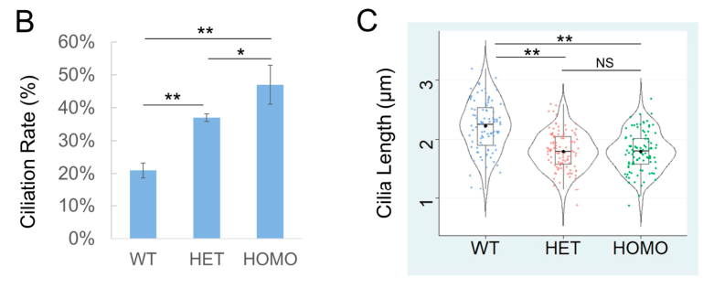

## Question

# Gene Research for Functional Annotation

## ⚠️ CRITICAL: Gene/Protein Identification Context

**BEFORE YOU BEGIN RESEARCH:** You MUST verify you are researching the CORRECT gene/protein. Gene symbols can be ambiguous, especially for less well-characterized genes from non-model organisms.

### Target Gene/Protein Identity (from UniProt):
- **UniProt Accession:** Q9UPZ9
- **Protein Description:** RecName: Full=Serine/threonine-protein kinase ICK; EC=2.7.11.1 {ECO:0000269|PubMed:10699974}; AltName: Full=Ciliogenesis associated kinase 1 {ECO:0000305}; AltName: Full=Intestinal cell kinase; Short=hICK; AltName: Full=Laryngeal cancer kinase 2; Short=LCK2; AltName: Full=MAK-related kinase; Short=MRK;
- **Gene Information:** Name=CILK1; Synonyms=ICK, KIAA0936;
- **Organism (full):** Homo sapiens (Human).
- **Protein Family:** Belongs to the protein kinase superfamily. CMGC Ser/Thr
- **Key Domains:** Kinase-like_dom_sf. (IPR011009); MAPK. (IPR050117); Prot_kinase_dom. (IPR000719); Protein_kinase_ATP_BS. (IPR017441); Ser/Thr_kinase_AS. (IPR008271)

### MANDATORY VERIFICATION STEPS:

1. **Check if the gene symbol "CILK1" matches the protein description above**
2. **Verify the organism is correct:** Homo sapiens (Human).
3. **Check if protein family/domains align with what you find in literature**
4. **If you find literature for a DIFFERENT gene with the same or similar symbol, STOP**

### If Gene Symbol is Ambiguous or You Cannot Find Relevant Literature:

**DO NOT PROCEED WITH RESEARCH ON A DIFFERENT GENE.** Instead:
- State clearly: "The gene symbol 'CILK1' is ambiguous or literature is limited for this specific protein"
- Explain what you found (e.g., "Found extensive literature on a different gene with the same symbol in a different organism")
- Describe the protein based ONLY on the UniProt information provided above
- Suggest that the protein function can be inferred from domain/family information

### Research Target:

Please provide a comprehensive research report on the gene **CILK1** (gene ID: CILK1, UniProt: Q9UPZ9) in human.

The research report should be a detailed narrative explaining the function, biological processes, and localization of the gene product. Citations should be given for all claims.

You should prioritize authoritative reviews and primary scientific literature when conducting research. You can supplement
this with annotations you find in gene/protein databases, but these can be outdated or inaccurate.

We are specifically interested in the primary function of the gene - for enzymes, what reaction is catalyzed, and what is the substrate specificity? For transporters, what is the substrate? For structural proteins or adapters, what is the broader structural role? For signaling molecules, what is the role in the pathway.

We are interested in where in or outside the cell the gene product carries out its function.

We are also interested in the signaling or biochemical pathways in which the gene functions. We are less interested in broad pleiotropic effects, except where these elucidate the precise role.

Include evidence where possible. We are interested in both experimental evidence as well as inference from structure, evolution, or bioinformatic analysis. Precise studies should be prioritized over high-throughput, where available.

## Output

Question: You are an expert researcher providing comprehensive, well-cited information.

Provide detailed information focusing on:
1. Key concepts and definitions with current understanding
2. Recent developments and latest research (prioritize 2023-2024 sources)
3. Current applications and real-world implementations
4. Expert opinions and analysis from authoritative sources
5. Relevant statistics and data from recent studies

Format as a comprehensive research report with proper citations. Include URLs and publication dates where available.
Always prioritize recent, authoritative sources and provide specific citations for all major claims.

# Gene Research for Functional Annotation

## ⚠️ CRITICAL: Gene/Protein Identification Context

**BEFORE YOU BEGIN RESEARCH:** You MUST verify you are researching the CORRECT gene/protein. Gene symbols can be ambiguous, especially for less well-characterized genes from non-model organisms.

### Target Gene/Protein Identity (from UniProt):
- **UniProt Accession:** Q9UPZ9
- **Protein Description:** RecName: Full=Serine/threonine-protein kinase ICK; EC=2.7.11.1 {ECO:0000269|PubMed:10699974}; AltName: Full=Ciliogenesis associated kinase 1 {ECO:0000305}; AltName: Full=Intestinal cell kinase; Short=hICK; AltName: Full=Laryngeal cancer kinase 2; Short=LCK2; AltName: Full=MAK-related kinase; Short=MRK;
- **Gene Information:** Name=CILK1; Synonyms=ICK, KIAA0936;
- **Organism (full):** Homo sapiens (Human).
- **Protein Family:** Belongs to the protein kinase superfamily. CMGC Ser/Thr
- **Key Domains:** Kinase-like_dom_sf. (IPR011009); MAPK. (IPR050117); Prot_kinase_dom. (IPR000719); Protein_kinase_ATP_BS. (IPR017441); Ser/Thr_kinase_AS. (IPR008271)

### MANDATORY VERIFICATION STEPS:

1. **Check if the gene symbol "CILK1" matches the protein description above**
2. **Verify the organism is correct:** Homo sapiens (Human).
3. **Check if protein family/domains align with what you find in literature**
4. **If you find literature for a DIFFERENT gene with the same or similar symbol, STOP**

### If Gene Symbol is Ambiguous or You Cannot Find Relevant Literature:

**DO NOT PROCEED WITH RESEARCH ON A DIFFERENT GENE.** Instead:
- State clearly: "The gene symbol 'CILK1' is ambiguous or literature is limited for this specific protein"
- Explain what you found (e.g., "Found extensive literature on a different gene with the same symbol in a different organism")
- Describe the protein based ONLY on the UniProt information provided above
- Suggest that the protein function can be inferred from domain/family information

### Research Target:

Please provide a comprehensive research report on the gene **CILK1** (gene ID: CILK1, UniProt: Q9UPZ9) in human.

The research report should be a detailed narrative explaining the function, biological processes, and localization of the gene product. Citations should be given for all claims.

You should prioritize authoritative reviews and primary scientific literature when conducting research. You can supplement
this with annotations you find in gene/protein databases, but these can be outdated or inaccurate.

We are specifically interested in the primary function of the gene - for enzymes, what reaction is catalyzed, and what is the substrate specificity? For transporters, what is the substrate? For structural proteins or adapters, what is the broader structural role? For signaling molecules, what is the role in the pathway.

We are interested in where in or outside the cell the gene product carries out its function.

We are also interested in the signaling or biochemical pathways in which the gene functions. We are less interested in broad pleiotropic effects, except where these elucidate the precise role.

Include evidence where possible. We are interested in both experimental evidence as well as inference from structure, evolution, or bioinformatic analysis. Precise studies should be prioritized over high-throughput, where available.

# Human CILK1 (ICK; UniProt Q9UPZ9): functional annotation research report

## Identity and principal function

The target specified by UniProt **Q9UPZ9** is human **CILK1**, formerly called *intestinal cell kinase* (**ICK**) and *MAK-related kinase* (**MRK**). The latter name denotes similarity, **not identity**, with the distinct kinase MAK. Published work identifies CILK1 as a broadly expressed serine/threonine kinase of the RCK subgroup, related to CDKs and MAPKs; this agrees with the supplied CMGC-kinase and protein-kinase-domain annotations. CCRK, also called **CDK20**, is a separate upstream kinase that activates CILK1. The accession and organism are those in the supplied UniProt record; the cited papers independently corroborate the gene/protein nomenclature and family rather than explicitly printing the accession. (wang2020functionalalterationsin pages 1-3, turner2023thescaffoldprotein pages 1-2, fu2006identificationofyinyang pages 1-2)

**Best-supported primary cellular role:** CILK1 is a phosphorylation-dependent regulator of **intraflagellar transport (IFT) at the primary-cilium tip**, especially the transition from outward, kinesin-driven transport to inward, dynein-driven transport. This preserves ciliary protein distribution, cilium morphology and the competence of cilium-dependent signaling. It is a kinase and transport regulator—not itself an IFT motor or structural axoneme protein. Ciliary loss-of-function phenotypes depend on cell type: elongation and protein accumulation are common in cultured cells, whereas particular developmental and photoreceptor contexts can lose cilia or axonemes. (chaya2014ickisessential pages 1-2, nakamura2020anterogradetraffickingof pages 1-2, chaya2024ccrkmakicksignalingis pages 13-14, satoda2022bromitbc1d32togetherwith pages 1-2)

## Catalytic reaction, specificity and regulation

CILK1 transfers the terminal phosphate of **ATP to a serine or threonine hydroxyl on a protein substrate**, producing a phosphoprotein and ADP. Kinase assays and site-specific phosphoprotein analyses establish this activity. A combinatorial peptide-library experiment found a preference for **R–P–X–S/T–P**, especially arginine three residues and proline two residues before the acceptor; the +1 proline is less obligatory, giving the broader motif **[R]–[P]–X–[S/T]–[P/A/S/T]**. This is a *preference*, not a rule that alone identifies substrates: the extended C-terminal region contributes to docking and substrate recognition. (fu2006identificationofyinyang pages 1-2, wu2012intestinalcellkinase pages 1-2, fu2019ciliogenesisassociatedkinase pages 2-4, turner2023thescaffoldprotein pages 1-2)

The N-terminal catalytic domain has a MAPK-like **TDY activation-loop motif**. CILK1 autophosphorylation at **Tyr159** provides basal activity; phosphorylation of **Thr157** by CCRK/CDK20 enables stronger activation. Early purified-protein experiments used radiolabeled ATP, kinase-dead controls and phosphopeptide mass spectrometry to test this ordered activation. Protein phosphatase **PP5** counteracts CCRK by dephosphorylating Thr157. Inhibitory regulation through Tyr15 phosphorylation has also been reported downstream of FGF-receptor signaling. Thus, TDY modification regulates the *enzyme*, whereas phosphorylation of KIF3A or Raptor modifies *downstream proteins*. (fu2005activationofa pages 14-17, fu2006identificationofyinyang pages 1-2, fu2019ciliogenesisassociatedkinase pages 1-2, turner2023thescaffoldprotein pages 1-2)

The following evidence summary separates experimentally phosphorylated proteins from CILK1-binding partners; in particular, binding or a ciliary phenotype does not establish a direct kinase substrate. (fu2006identificationofyinyang pages 1-2, nakamura2020anterogradetraffickingof pages 1-2, turner2023thescaffoldprotein pages 2-6)

| Candidate | Experimental biochemical evidence | Implicated pathway/localization | Important limits |
|---|---|---|---|
| **KIF3A — human Thr672 / mouse Thr674** | CILK1-dependent, site-specific phosphorylation was demonstrated in vitro and in cells; kinase-domain CILK1 variants abolish the signal (fu2019ciliogenesisassociatedkinase pages 6-8, wang2020functionalalterationsin pages 1-3). | KIF3A is part of heterotrimeric kinesin-2, the anterograde IFT motor. The modification was proposed to regulate transport or IFT-train remodeling at the ciliary tip (chaya2014ickisessential pages 10-12, mul2022mechanismsofregulation pages 14-15). | The site is **not required for gross ciliogenesis**: homozygous mouse T674A caused only an ~8% increase in MEF cilium length without major CILK1-loss phenotypes, and broader KIF3A-tail phosphosite mutants rescued ciliogenesis in Kif3a/Kif3b-null MEFs (gailey2021phosphositet674amutation pages 5-8, fasawe2024kif3ataildomain pages 7-9). Thus, KIF3A is a direct substrate, but this site cannot alone explain CILK1 function. |
| **Raptor — Thr908** | Identified from the CILK1 consensus motif; phosphorylation was supported by mass spectrometry, a phospho-specific antibody, and in-vitro and cellular assays. T908A preserved mTORC1 integrity but impaired insulin- or Rheb-stimulated activation under nutrient starvation (wu2012intestinalcellkinase pages 1-2). | Cytoplasmic mTORC1 signaling, nutrient and growth-factor responses, and proliferation. | A strong direct-substrate assignment, but **not demonstrated to be a ciliary-tip substrate**; its contribution to CILK1-dependent IFT and ciliopathy phenotypes remains unresolved (fu2019ciliogenesisassociatedkinase pages 8-9). |
| **GSK3β — Thr7** | Reported to be phosphorylated by CILK1 in vitro and in cells; Thr7 phosphorylation promotes inhibitory Ser9 phosphorylation and GSK3β autoinhibition (fu2019ciliogenesisassociatedkinase pages 8-9). | Proposed connection to GSK3β-dependent Hedgehog, metabolism, and ciliogenesis regulation. | The mechanistic link to ciliary transport remains inferential, and GSK3β has **not** been established as a substrate phosphorylated by CILK1 specifically at the ciliary tip (fu2019ciliogenesisassociatedkinase pages 8-9). |
| **Scythe/BAT3 — Thr1080** | Scythe binds CILK1; purified-protein phosphorylation at Thr1080 was supported by site-directed mutation and mass spectrometry and conforms to the R-P-X-S/T-P consensus (fu2006identificationofyinyang pages 1-2). | Anti-apoptotic and cell-regulatory protein; no firmly established ciliary compartment or pathway for this phosphorylation. | Evidence is principally biochemical and in vitro. Cellular phosphosite dependence and physiological relevance to ciliogenesis remain insufficiently established (fu2006identificationofyinyang pages 1-2, fu2019ciliogenesisassociatedkinase pages 8-9). |
| **KATNIP/KIAA0556 — regulatory partner, not an established substrate** | The CILK1 C-terminal intrinsically disordered region is necessary and sufficient for binding; KATNIP co-expression stabilizes CILK1, increases TDY phosphorylation, and enhances phosphorylation of CILK1 substrates (turner2023thescaffoldprotein pages 1-2, turner2023thescaffoldprotein pages 2-6). | Colocalizes with CILK1 at centrioles and basal bodies; functions as a scaffold or regulatory subunit that potentiates CILK1 control of cilium length (turner2023thescaffoldprotein pages 2-6, turner2023thescaffoldprotein pages 1-2). | No evidence reviewed here establishes KATNIP as a CILK1 phosphosubstrate. Binding alone is insufficient for activation, and the precise stabilization mechanism remains unresolved (turner2023thescaffoldprotein pages 2-6). |
| **IFT-B complex — transport partner, not an established substrate** | The non-catalytic C-terminal region of CILK1 interacts with IFT-B; live imaging showed bidirectional CILK1 movement resembling IFT particles (nakamura2020anterogradetraffickingof pages 1-2). | Delivers CILK1 anterogradely to the distal ciliary tip, where kinase activity supports IFT turnaround and retrograde trafficking (nakamura2020anterogradetraffickingof pages 1-2). | Interaction and transport do not establish phosphorylation of an IFT-B subunit by human CILK1. The relevant direct tip substrate or substrate set remains unknown. |
| **KLC3 — regulatory interactor, not an established substrate** | Co-immunoprecipitation and localization studies support CILK1–KLC3 interaction at ciliary bases; KLC3 reduction rescued abnormal trafficking and cyst progression in a collecting-duct-specific Cilk1-deficient mouse model (limerick2024anepilepsyassociatedcilk1 pages 11-11). | Renal ciliary recruitment of IFT-B and EGFR; implicated in cystogenesis associated with CILK1 deficiency. | No CILK1-dependent KLC3 phosphosite or direct kinase assay was reported in the evidence reviewed. These findings establish an interaction and pathway modifier in a mouse model, not a direct phosphosubstrate or validated human therapy. |

*Table: Biochemically supported CILK1 phosphosubstrates are separated from regulatory or transport-binding partners lacking evidence of direct phosphorylation. The table also highlights the limited physiological requirement for KIF3A Thr672/Thr674 and avoids assigning Raptor or GSK3β as proven ciliary-tip substrates.*

**Interpretive qualification on KIF3A:** Human KIF3A **Thr672** corresponds to mouse **Thr674**. Direct phosphorylation is well supported, but its *necessity for gross ciliogenesis* is not. Homozygous mouse **Kif3a-T674A** fibroblasts had an approximately **8%** increase in mean cilium length with preserved ciliation and no major Cilk1-null-like developmental defects. A 2024 rescue analysis in *Kif3a/Kif3b*-null mouse fibroblasts likewise found that tested KIF3A-tail phosphosite substitutions generally permitted ciliogenesis. Neither result refutes CILK1-dependent KIF3A phosphorylation; both constrain the claim that this single site explains CILK1’s principal ciliary phenotype. (gailey2021phosphositet674amutation pages 5-8, fasawe2024kif3ataildomain pages 7-9, wang2020functionalalterationsin pages 1-3)

## Site of action and ciliary pathway

CILK1 is **intracellular**, with experimentally observed pools at centrioles/the **basal body**, along the **primary-cilium axoneme**, and at its **distal tip**; nuclear and cytoplasmic localization has also been reported. Localization is dynamic and assay- or cell-type-dependent rather than restricted to a single compartment. In a 2023 microscopy study, CILK1 and its partner KATNIP colocalized at centrioles in **188/188 examined cells** across three experiments. In contrast, 2020 experiments found wild-type expressed CILK1 predominantly at the ciliary base, while epilepsy-associated variants redistributed along the axoneme. The basal-body-targeting and protein-interaction functions reside substantially in the C-terminal intrinsically disordered region. These observations locate important CILK1 activity **within the cell at the ciliary base and tip**, but do not place every known biochemical substrate at the tip. (turner2023thescaffoldprotein pages 1-2, wang2020functionalalterationsin pages 1-3, fu2019ciliogenesisassociatedkinase pages 9-10, chaya2024ccrkmakicksignalingis pages 1-2)

A direct transport study showed that the CILK1 C-terminal region binds **IFT-B**, and live imaging observed CILK1 moving both directions inside cilia. This supports IFT-B-associated **anterograde delivery to the tip**. CILK1-knockout cells then displayed impaired **retrograde trafficking of IFT particles and ciliary G-protein-coupled receptors**, with proteins collecting at enlarged tips; kinase activity, activating TDY phosphorylation and IFT-dependent delivery were needed in rescue tests. Mouse Ick loss likewise caused tip accumulation of **IFT-A, IFT-B and BBSome** components and mislocalization of Hedgehog machinery. These convergent perturbation and rescue findings make tip-associated IFT turnaround the strongest functional annotation, although the complete set of direct phosphosubstrates that executes turnaround remains unidentified. (nakamura2020anterogradetraffickingof pages 1-2, chaya2014ickisessential pages 1-2)

The upstream **BROMI/TBC1D32–CCRK/CDK20–FAM149B1** network helps control this process: deleting individual components in cultured cells yielded elongated cilia and tip accumulation of IFT machinery and CILK1. BROMI and FAM149B1 interact with CCRK; these findings support a regulatory complex, **not** direct phosphorylation of every complex member by CILK1. Separately, basal-body **KATNIP/KIAA0556** binds CILK1’s disordered C-terminal region and increases CILK1 abundance, TDY phosphorylation and downstream phosphorylation, strengthening cilium-length restriction. (satoda2022bromitbc1d32togetherwith pages 1-2, turner2023thescaffoldprotein pages 1-2, turner2023thescaffoldprotein pages 2-6)

**Signaling consequences are context-dependent.** IFT defects alter where **Smoothened and GLI** Hedgehog-pathway components reside, so CILK1 affects Hedgehog responses primarily through ciliary organization and trafficking; it should not be annotated as a proven direct GLI kinase on this evidence. For example, Ick-deficient developing neural tissue showed defective Hedgehog responses, whereas a specific 2024 epilepsy-associated Cilk1 variant increased Hedgehog readouts in mouse fibroblasts. Outside the established tip-transport mechanism, phosphorylation of **Raptor Thr908** supports an experimentally demonstrated connection to **mTORC1** activation, but not a demonstrated ciliary-tip mechanism. (chaya2014ickisessential pages 1-2, limerick2024anepilepsyassociatedcilk1 pages 4-8, wu2012intestinalcellkinase pages 1-2)

## Developments in 2023–2024 and quantitative findings

* **KATNIP regulation, 2023.** Binding through CILK1’s C-terminal disordered region stabilizes the protein and enhances activation-loop phosphorylation and substrate phosphorylation. In one experimental configuration, KATNIP co-expression increased measured CILK1 abundance approximately **fivefold** and TDY phosphorylation approximately **twofold**; effect sizes depend on expression conditions. This supplies a molecular explanation for why C-terminal variants can disrupt ciliary control while retaining measurable catalytic activity. (turner2023thescaffoldprotein pages 2-6, turner2023thescaffoldprotein pages 1-2, wang2020functionalalterationsin pages 1-3)
* **Epilepsy-associated variant, 2024.** Investigators modeled human **CILK1 A615T** with mouse **Cilk1 A612T**. In normally growing mouse embryonic fibroblasts, approximately **20%** of wild-type cells were ciliated; heterozygous mutants were ciliated at nearly twice that frequency and homozygous mutants at more than twice that frequency. Mean cilium length declined from **2.2 to 1.8 µm**—approximately **18%**. Counts were **1,167 wild-type, 1,295 heterozygous and 1,428 homozygous cells**, over three experiments; length analyses examined **93, 109 and 94 cilia**, respectively. Both mutant genotypes increased Smoothened/GLI1 responses to Smoothened agonist. In a separate human-cell co-expression experiment, KATNIP increased wild-type CILK1 protein by **more than 20-fold**, but was less than half as effective for A615T. These results concern engineered cells and a mouse-equivalent allele, **not measurements in the affected patients’ cilia**. The cropped original Figure 2 independently shows the directions of the ciliation and length differences. (limerick2024anepilepsyassociatedcilk1 pages 4-8, limerick2024anepilepsyassociatedcilk1 media 32006ff1, limerick2024anepilepsyassociatedcilk1 pages 8-9)
* **KIF3A reassessment, 2024.** Systematic rescue with KIF3A-tail mutants found phosphorylation dispensable for **gross cilium assembly in the tested mouse fibroblasts**, challenging a simple one-site KIF3A explanation for CILK1’s effects. The tests do not establish normal IFT dynamics or signaling in every tissue and do not identify the missing CILK1 tip substrate. (fasawe2024kif3ataildomain pages 1-3, fasawe2024kif3ataildomain pages 7-9, fasawe2024kif3ataildomain pages 13-14)
* **Photoreceptor pathway, 2024.** In mouse retina, **MAK and ICK/CILK1 cooperate downstream of CCRK**. Simultaneously disrupting MAK and ICK eliminated photoreceptor ciliary axonemes and caused severe retinal degeneration; retinal ICK gene delivery or **FGFR inhibition** improved outcomes in *Mak*-deficient mice. This is an important **preclinical proof of mechanism**, not an established intervention for human retinitis pigmentosa. The experiment also illustrates why the separate proteins MAK and CILK1 must not be conflated. (chaya2024ccrkmakicksignalingis pages 1-2, chaya2024ccrkmakicksignalingis pages 13-14)

## Human relevance and applications

Human **biallelic loss-of-function CILK1/ICK variants** have been linked to severe developmental ciliopathies including endocrine-cerebro-osteodysplasia and short-rib polydactyly syndrome; a reported **p.E80K** variant was accompanied by loss of kinase activity, abnormal cilia and impaired Hedgehog signaling in functional studies. **Heterozygous variants** have also been associated with juvenile myoclonic epilepsy, although particular variant mechanisms and their relationship to patient neuronal phenotypes require care in interpretation. These human findings make CILK1 a relevant gene for **rare-disease variant interpretation and functional testing**. Renal collecting-duct Cilk1 deletion causes ciliary trafficking abnormalities and cystic disease in mice; its interacting protein **KLC3** modifies IFT-B/EGFR recruitment and cyst progression in that model, but is not thereby established as a CILK1 phosphosubstrate or a validated patient treatment. Retinal ICK-delivery and FGFR-inhibitor experiments remain preclinical. (taylor2016aninactivatingmutation pages 2-2, wang2020functionalalterationsin pages 5-8, satoda2022bromitbc1d32togetherwith pages 1-2, chaya2024ccrkmakicksignalingis pages 13-14)

**Overall assessment.** Confidence is high that human CILK1 is an ATP-dependent, CCRK-regulated serine/threonine kinase whose ciliary localization and catalytic activity are required for normal IFT trafficking. Confidence is lower about **which direct phosphorylation event is necessary at the ciliary tip**, because the well-characterized KIF3A site alone does not reproduce the loss-of-CILK1 phenotype. Raptor/mTORC1 and other biochemical targets broaden CILK1’s potential intracellular functions but should not displace its best-established ciliary transport annotation. (fu2006identificationofyinyang pages 1-2, nakamura2020anterogradetraffickingof pages 1-2, gailey2021phosphositet674amutation pages 5-8, fu2019ciliogenesisassociatedkinase pages 8-9)

### Selected sources and publication dates

- Fu *et al.*, **2006**, original CCRK/PP5 and substrate-consensus study: https://doi.org/10.1128/MCB.00816-06. (fu2006identificationofyinyang pages 1-2)
- Wu *et al.*, **2012**, Raptor Thr908 and mTORC1: https://doi.org/10.1074/jbc.M111.302117. (wu2012intestinalcellkinase pages 1-2)
- Chaya *et al.*, **2014**, ICK, ciliary-tip transport and neural development: https://doi.org/10.1002/embj.201488175. (chaya2014ickisessential pages 1-2)
- Nakamura *et al.*, **2020**, IFT-dependent CILK1 delivery and retrograde trafficking: https://doi.org/10.1074/jbc.RA120.014142. (nakamura2020anterogradetraffickingof pages 1-2)
- Turner *et al.*, **2023**, KATNIP regulation: https://doi.org/10.1080/10985549.2023.2246870. (turner2023thescaffoldprotein pages 1-2)
- Fasawe *et al.*, **15 March 2024**, KIF3A-tail functional reassessment: https://doi.org/10.1016/j.isci.2024.109149. (fasawe2024kif3ataildomain pages 1-3)
- Limerick *et al.*, **26 July 2024**, A615T/A612T variant and Hedgehog signaling: https://doi.org/10.3390/cells13151258. (limerick2024anepilepsyassociatedcilk1 pages 1-2)
- Chaya *et al.*, **18 September 2024**, CCRK–MAK/ICK retinal pathway: https://doi.org/10.26508/lsa.202402880. (chaya2024ccrkmakicksignalingis pages 1-2)
- Flax *et al.*, **March 2024**, expert overview of ciliary kinases: https://doi.org/10.3389/fmolb.2024.1352781. (flax2024illuminationofunderstudied pages 6-7)

References

1. (wang2020functionalalterationsin pages 1-3): Eric J. Wang, Casey D. Gailey, David L. Brautigan, and Zheng Fu. Functional alterations in ciliogenesis-associated kinase 1 (cilk1) that result from mutations linked to juvenile myoclonic epilepsy. Cells, 9:694, Mar 2020. URL: https://doi.org/10.3390/cells9030694, doi:10.3390/cells9030694. This article has 19 citations.

2. (turner2023thescaffoldprotein pages 1-2): Jacob S. Turner, Ellie A. McCabe, Kevin W. Kuang, Casey D. Gailey, David L. Brautigan, Ana Limerick, Elena X. Wang, and Zheng Fu. The scaffold protein katnip enhances cilk1 control of primary cilia. Molecular and Cellular Biology, 43:472-480, Sep 2023. URL: https://doi.org/10.1080/10985549.2023.2246870, doi:10.1080/10985549.2023.2246870. This article has 8 citations and is from a domain leading peer-reviewed journal.

3. (fu2006identificationofyinyang pages 1-2): Zheng Fu, Katherine A. Larson, Raghu K. Chitta, Sirlester A. Parker, Benjamin E. Turk, Matthew W. Lawrence, Philipp Kaldis, Konstantin Galaktionov, Steven M. Cohn, Jeffrey Shabanowitz, Donald F. Hunt, and Thomas W. Sturgill. Identification of yin-yang regulators and a phosphorylation consensus for male germ cell-associated kinase (mak)-related kinase. Nov 2006. URL: https://doi.org/10.1128/mcb.00816-06, doi:10.1128/mcb.00816-06. This article has 98 citations and is from a domain leading peer-reviewed journal.

4. (chaya2014ickisessential pages 1-2): Taro Chaya, Yoshihiro Omori, Ryusuke Kuwahara, and Takahisa Furukawa. Ick is essential for cell type‐specific ciliogenesis and the regulation of ciliary transport. The EMBO Journal, 33:1227-1242, Jun 2014. URL: https://doi.org/10.1002/embj.201488175, doi:10.1002/embj.201488175. This article has 146 citations.

5. (nakamura2020anterogradetraffickingof pages 1-2): Kentaro Nakamura, Tatsuro Noguchi, Mariko Takahara, Yoshihiro Omori, Takahisa Furukawa, Yohei Katoh, and Kazuhisa Nakayama. Anterograde trafficking of ciliary map kinase–like ick/cilk1 by the intraflagellar transport machinery is required for intraciliary retrograde protein trafficking. Sep 2020. URL: https://doi.org/10.1074/jbc.ra120.014142, doi:10.1074/jbc.ra120.014142. This article has 44 citations and is from a domain leading peer-reviewed journal.

6. (chaya2024ccrkmakicksignalingis pages 13-14): Taro Chaya, Yamato Maeda, Ryotaro Tsutsumi, Makoto Ando, Yujie Ma, Naoko Kajimura, Teruyuki Tanaka, and Takahisa Furukawa. Ccrk-mak/ick signaling is a ciliary transport regulator essential for retinal photoreceptor survival. Life Science Alliance, 7:e202402880, Sep 2024. URL: https://doi.org/10.26508/lsa.202402880, doi:10.26508/lsa.202402880. This article has 7 citations and is from a peer-reviewed journal.

7. (satoda2022bromitbc1d32togetherwith pages 1-2): Yuuki Satoda, Tatsuro Noguchi, Taiju Fujii, Aoi Taniguchi, Yohei Katoh, and Kazuhisa Nakayama. Bromi/tbc1d32 together with ccrk/cdk20 and fam149b1/jbts36 contributes to intraflagellar transport turnaround involving ick/cilk1. Molecular Biology of the Cell, Aug 2022. URL: https://doi.org/10.1091/mbc.e22-03-0089, doi:10.1091/mbc.e22-03-0089. This article has 19 citations and is from a domain leading peer-reviewed journal.

8. (wu2012intestinalcellkinase pages 1-2): Di Wu, Jessica R. Chapman, Lifu Wang, Thurl E. Harris, Jeffrey Shabanowitz, Donald F. Hunt, and Zheng Fu. Intestinal cell kinase (ick) promotes activation of mtor complex 1 (mtorc1) through phosphorylation of raptor thr-908. Apr 2012. URL: https://doi.org/10.1074/jbc.m111.302117, doi:10.1074/jbc.m111.302117. This article has 46 citations and is from a domain leading peer-reviewed journal.

9. (fu2019ciliogenesisassociatedkinase pages 2-4): Zheng Fu, Casey D. Gailey, Eric J. Wang, and David L. Brautigan. Ciliogenesis associated kinase 1: targets and functions in various organ systems. FEBS Letters, 593:2990-3002, Nov 2019. URL: https://doi.org/10.1002/1873-3468.13600, doi:10.1002/1873-3468.13600. This article has 38 citations and is from a peer-reviewed journal.

10. (fu2005activationofa pages 14-17): Zheng Fu, Melanie J. Schroeder, Jeffrey Shabanowitz, Philipp Kaldis, Kasumi Togawa, Anil K. Rustgi, Donald F. Hunt, and Thomas W. Sturgill. Activation of a nuclear cdc2-related kinase within a mitogen-activated protein kinase-like tdy motif by autophosphorylation and cyclin-dependent protein kinase-activating kinase. Molecular and Cellular Biology, 25:6047-6064, Jul 2005. URL: https://doi.org/10.1128/mcb.25.14.6047-6064.2005, doi:10.1128/mcb.25.14.6047-6064.2005. This article has 87 citations and is from a domain leading peer-reviewed journal.

11. (fu2019ciliogenesisassociatedkinase pages 1-2): Zheng Fu, Casey D. Gailey, Eric J. Wang, and David L. Brautigan. Ciliogenesis associated kinase 1: targets and functions in various organ systems. FEBS Letters, 593:2990-3002, Nov 2019. URL: https://doi.org/10.1002/1873-3468.13600, doi:10.1002/1873-3468.13600. This article has 38 citations and is from a peer-reviewed journal.

12. (turner2023thescaffoldprotein pages 2-6): Jacob S. Turner, Ellie A. McCabe, Kevin W. Kuang, Casey D. Gailey, David L. Brautigan, Ana Limerick, Elena X. Wang, and Zheng Fu. The scaffold protein katnip enhances cilk1 control of primary cilia. Molecular and Cellular Biology, 43:472-480, Sep 2023. URL: https://doi.org/10.1080/10985549.2023.2246870, doi:10.1080/10985549.2023.2246870. This article has 8 citations and is from a domain leading peer-reviewed journal.

13. (fu2019ciliogenesisassociatedkinase pages 6-8): Zheng Fu, Casey D. Gailey, Eric J. Wang, and David L. Brautigan. Ciliogenesis associated kinase 1: targets and functions in various organ systems. FEBS Letters, 593:2990-3002, Nov 2019. URL: https://doi.org/10.1002/1873-3468.13600, doi:10.1002/1873-3468.13600. This article has 38 citations and is from a peer-reviewed journal.

14. (chaya2014ickisessential pages 10-12): Taro Chaya, Yoshihiro Omori, Ryusuke Kuwahara, and Takahisa Furukawa. Ick is essential for cell type‐specific ciliogenesis and the regulation of ciliary transport. The EMBO Journal, 33:1227-1242, Jun 2014. URL: https://doi.org/10.1002/embj.201488175, doi:10.1002/embj.201488175. This article has 146 citations.

15. (mul2022mechanismsofregulation pages 14-15): Wouter Mul, Aniruddha Mitra, and Erwin J. G. Peterman. Mechanisms of regulation in intraflagellar transport. Cells, 11:2737, Sep 2022. URL: https://doi.org/10.3390/cells11172737, doi:10.3390/cells11172737. This article has 34 citations.

16. (gailey2021phosphositet674amutation pages 5-8): Casey D. Gailey, Eric J. Wang, Li Jin, Sean Ahmadi, David L. Brautigan, Xudong Li, Wenhao Xu, Michael M. Scott, and Zheng Fu. Phosphosite <scp>t674a</scp> mutation in kinesin family member <scp>3a</scp> fails to reproduce tissue and ciliary defects characteristic of <scp>cilk1</scp> loss of function. Oct 2021. URL: https://doi.org/10.1002/dvdy.252, doi:10.1002/dvdy.252. This article has 19 citations and is from a peer-reviewed journal.

17. (fasawe2024kif3ataildomain pages 7-9): Ayoola S. Fasawe, Jessica M. Adams, and Martin F. Engelke. Kif3a tail domain phosphorylation is not required for ciliogenesis in mouse embryonic fibroblasts. Mar 2024. URL: https://doi.org/10.1016/j.isci.2024.109149, doi:10.1016/j.isci.2024.109149. This article has 1 citations and is from a peer-reviewed journal.

18. (fu2019ciliogenesisassociatedkinase pages 8-9): Zheng Fu, Casey D. Gailey, Eric J. Wang, and David L. Brautigan. Ciliogenesis associated kinase 1: targets and functions in various organ systems. FEBS Letters, 593:2990-3002, Nov 2019. URL: https://doi.org/10.1002/1873-3468.13600, doi:10.1002/1873-3468.13600. This article has 38 citations and is from a peer-reviewed journal.

19. (limerick2024anepilepsyassociatedcilk1 pages 11-11): Ana Limerick, Ellie A. McCabe, Jacob S. Turner, Kevin W. Kuang, David L. Brautigan, Yi Hao, Cheuk Ying Chu, Sean H. Fu, Sean Ahmadi, Wenhao Xu, and Zheng Fu. An epilepsy-associated cilk1 variant compromises katnip regulation and impairs primary cilia and hedgehog signaling. Cells, 13:1258, Jul 2024. URL: https://doi.org/10.3390/cells13151258, doi:10.3390/cells13151258. This article has 3 citations.

20. (fu2019ciliogenesisassociatedkinase pages 9-10): Zheng Fu, Casey D. Gailey, Eric J. Wang, and David L. Brautigan. Ciliogenesis associated kinase 1: targets and functions in various organ systems. FEBS Letters, 593:2990-3002, Nov 2019. URL: https://doi.org/10.1002/1873-3468.13600, doi:10.1002/1873-3468.13600. This article has 38 citations and is from a peer-reviewed journal.

21. (chaya2024ccrkmakicksignalingis pages 1-2): Taro Chaya, Yamato Maeda, Ryotaro Tsutsumi, Makoto Ando, Yujie Ma, Naoko Kajimura, Teruyuki Tanaka, and Takahisa Furukawa. Ccrk-mak/ick signaling is a ciliary transport regulator essential for retinal photoreceptor survival. Life Science Alliance, 7:e202402880, Sep 2024. URL: https://doi.org/10.26508/lsa.202402880, doi:10.26508/lsa.202402880. This article has 7 citations and is from a peer-reviewed journal.

22. (limerick2024anepilepsyassociatedcilk1 pages 4-8): Ana Limerick, Ellie A. McCabe, Jacob S. Turner, Kevin W. Kuang, David L. Brautigan, Yi Hao, Cheuk Ying Chu, Sean H. Fu, Sean Ahmadi, Wenhao Xu, and Zheng Fu. An epilepsy-associated cilk1 variant compromises katnip regulation and impairs primary cilia and hedgehog signaling. Cells, 13:1258, Jul 2024. URL: https://doi.org/10.3390/cells13151258, doi:10.3390/cells13151258. This article has 3 citations.

23. (limerick2024anepilepsyassociatedcilk1 media 32006ff1): Ana Limerick, Ellie A. McCabe, Jacob S. Turner, Kevin W. Kuang, David L. Brautigan, Yi Hao, Cheuk Ying Chu, Sean H. Fu, Sean Ahmadi, Wenhao Xu, and Zheng Fu. An epilepsy-associated cilk1 variant compromises katnip regulation and impairs primary cilia and hedgehog signaling. Cells, 13:1258, Jul 2024. URL: https://doi.org/10.3390/cells13151258, doi:10.3390/cells13151258. This article has 3 citations.

24. (limerick2024anepilepsyassociatedcilk1 pages 8-9): Ana Limerick, Ellie A. McCabe, Jacob S. Turner, Kevin W. Kuang, David L. Brautigan, Yi Hao, Cheuk Ying Chu, Sean H. Fu, Sean Ahmadi, Wenhao Xu, and Zheng Fu. An epilepsy-associated cilk1 variant compromises katnip regulation and impairs primary cilia and hedgehog signaling. Cells, 13:1258, Jul 2024. URL: https://doi.org/10.3390/cells13151258, doi:10.3390/cells13151258. This article has 3 citations.

25. (fasawe2024kif3ataildomain pages 1-3): Ayoola S. Fasawe, Jessica M. Adams, and Martin F. Engelke. Kif3a tail domain phosphorylation is not required for ciliogenesis in mouse embryonic fibroblasts. Mar 2024. URL: https://doi.org/10.1016/j.isci.2024.109149, doi:10.1016/j.isci.2024.109149. This article has 1 citations and is from a peer-reviewed journal.

26. (fasawe2024kif3ataildomain pages 13-14): Ayoola S. Fasawe, Jessica M. Adams, and Martin F. Engelke. Kif3a tail domain phosphorylation is not required for ciliogenesis in mouse embryonic fibroblasts. Mar 2024. URL: https://doi.org/10.1016/j.isci.2024.109149, doi:10.1016/j.isci.2024.109149. This article has 1 citations and is from a peer-reviewed journal.

27. (taylor2016aninactivatingmutation pages 2-2): S. Paige Taylor, Michaela Kunova Bosakova, Miroslav Varecha, Lukas Balek, Tomas Barta, Lukas Trantirek, Iva Jelinkova, Ivan Duran, Iva Vesela, Kimberly N. Forlenza, Jorge H. Martin, Ales Hampl, Michael Bamshad, Deborah Nickerson, Margie L. Jaworski, Jieun Song, Hyuk Wan Ko, Daniel H. Cohn, Deborah Krakow, and Pavel Krejci. An inactivating mutation in intestinal cell kinase, ick, impairs hedgehog signalling and causes short rib-polydactyly syndrome. Human molecular genetics, 25 18:3998-4011, Jul 2016. URL: https://doi.org/10.1093/hmg/ddw240, doi:10.1093/hmg/ddw240. This article has 46 citations and is from a domain leading peer-reviewed journal.

28. (wang2020functionalalterationsin pages 5-8): Eric J. Wang, Casey D. Gailey, David L. Brautigan, and Zheng Fu. Functional alterations in ciliogenesis-associated kinase 1 (cilk1) that result from mutations linked to juvenile myoclonic epilepsy. Cells, 9:694, Mar 2020. URL: https://doi.org/10.3390/cells9030694, doi:10.3390/cells9030694. This article has 19 citations.

29. (limerick2024anepilepsyassociatedcilk1 pages 1-2): Ana Limerick, Ellie A. McCabe, Jacob S. Turner, Kevin W. Kuang, David L. Brautigan, Yi Hao, Cheuk Ying Chu, Sean H. Fu, Sean Ahmadi, Wenhao Xu, and Zheng Fu. An epilepsy-associated cilk1 variant compromises katnip regulation and impairs primary cilia and hedgehog signaling. Cells, 13:1258, Jul 2024. URL: https://doi.org/10.3390/cells13151258, doi:10.3390/cells13151258. This article has 3 citations.

30. (flax2024illuminationofunderstudied pages 6-7): Raymond G. Flax, Peter Rosston, Cecilia Rocha, Brian Anderson, Jacob L. Capener, Thomas M. Durcan, David H. Drewry, Panagiotis Prinos, and Alison D. Axtman. Illumination of understudied ciliary kinases. Frontiers in Molecular Biosciences, Mar 2024. URL: https://doi.org/10.3389/fmolb.2024.1352781, doi:10.3389/fmolb.2024.1352781. This article has 12 citations.

## Artifacts

- [Edison artifact artifact-00](CILK1-deep-research-falcon_artifacts/artifact-00.md)

## Citations

1. wu2012intestinalcellkinase pages 1-2
2. fu2019ciliogenesisassociatedkinase pages 8-9
3. fu2006identificationofyinyang pages 1-2
4. turner2023thescaffoldprotein pages 2-6
5. nakamura2020anterogradetraffickingof pages 1-2
6. chaya2014ickisessential pages 1-2
7. turner2023thescaffoldprotein pages 1-2
8. chaya2024ccrkmakicksignalingis pages 1-2
9. flax2024illuminationofunderstudied pages 6-7
10. wang2020functionalalterationsin pages 1-3
11. chaya2024ccrkmakicksignalingis pages 13-14
12. fu2019ciliogenesisassociatedkinase pages 2-4
13. fu2005activationofa pages 14-17
14. fu2019ciliogenesisassociatedkinase pages 1-2
15. fu2019ciliogenesisassociatedkinase pages 6-8
16. chaya2014ickisessential pages 10-12
17. mul2022mechanismsofregulation pages 14-15
18. fu2019ciliogenesisassociatedkinase pages 9-10
19. taylor2016aninactivatingmutation pages 2-2
20. wang2020functionalalterationsin pages 5-8
21. R
22. P
23. S/T
24. P/A/S/T
25. https://doi.org/10.1128/MCB.00816-06.
26. https://doi.org/10.1074/jbc.M111.302117.
27. https://doi.org/10.1002/embj.201488175.
28. https://doi.org/10.1074/jbc.RA120.014142.
29. https://doi.org/10.1080/10985549.2023.2246870.
30. https://doi.org/10.1016/j.isci.2024.109149.
31. https://doi.org/10.3390/cells13151258.
32. https://doi.org/10.26508/lsa.202402880.
33. https://doi.org/10.3389/fmolb.2024.1352781.
34. https://doi.org/10.3390/cells9030694,
35. https://doi.org/10.1080/10985549.2023.2246870,
36. https://doi.org/10.1128/mcb.00816-06,
37. https://doi.org/10.1002/embj.201488175,
38. https://doi.org/10.1074/jbc.ra120.014142,
39. https://doi.org/10.26508/lsa.202402880,
40. https://doi.org/10.1091/mbc.e22-03-0089,
41. https://doi.org/10.1074/jbc.m111.302117,
42. https://doi.org/10.1002/1873-3468.13600,
43. https://doi.org/10.1128/mcb.25.14.6047-6064.2005,
44. https://doi.org/10.3390/cells11172737,
45. https://doi.org/10.1002/dvdy.252,
46. https://doi.org/10.1016/j.isci.2024.109149,
47. https://doi.org/10.3390/cells13151258,
48. https://doi.org/10.1093/hmg/ddw240,
49. https://doi.org/10.3389/fmolb.2024.1352781,