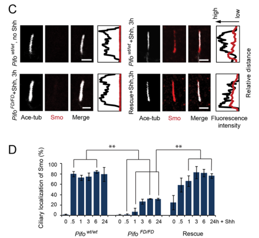

## Question

# Gene Research for Functional Annotation

## ⚠️ CRITICAL: Gene/Protein Identification Context

**BEFORE YOU BEGIN RESEARCH:** You MUST verify you are researching the CORRECT gene/protein. Gene symbols can be ambiguous, especially for less well-characterized genes from non-model organisms.

### Target Gene/Protein Identity (from UniProt):
- **UniProt Accession:** Q8TCI5
- **Protein Description:** RecName: Full=Ciliary microtubule-associated protein 3; AltName: Full=Protein pitchfork;
- **Gene Information:** Name=CIMAP3 {ECO:0000312|HGNC:HGNC:27009}; Synonyms=C1orf88, PIFO;
- **Organism (full):** Homo sapiens (Human).
- **Protein Family:** Not specified in UniProt
- **Key Domains:** CIMAP3. (IPR033602); SHIPPO-rpt. (IPR010736); SHIPPO-rpt (PF07004)

### MANDATORY VERIFICATION STEPS:

1. **Check if the gene symbol "CIMAP3" matches the protein description above**
2. **Verify the organism is correct:** Homo sapiens (Human).
3. **Check if protein family/domains align with what you find in literature**
4. **If you find literature for a DIFFERENT gene with the same or similar symbol, STOP**

### If Gene Symbol is Ambiguous or You Cannot Find Relevant Literature:

**DO NOT PROCEED WITH RESEARCH ON A DIFFERENT GENE.** Instead:
- State clearly: "The gene symbol 'CIMAP3' is ambiguous or literature is limited for this specific protein"
- Explain what you found (e.g., "Found extensive literature on a different gene with the same symbol in a different organism")
- Describe the protein based ONLY on the UniProt information provided above
- Suggest that the protein function can be inferred from domain/family information

### Research Target:

Please provide a comprehensive research report on the gene **CIMAP3** (gene ID: CIMAP3, UniProt: Q8TCI5) in human.

The research report should be a detailed narrative explaining the function, biological processes, and localization of the gene product. Citations should be given for all claims.

You should prioritize authoritative reviews and primary scientific literature when conducting research. You can supplement
this with annotations you find in gene/protein databases, but these can be outdated or inaccurate.

We are specifically interested in the primary function of the gene - for enzymes, what reaction is catalyzed, and what is the substrate specificity? For transporters, what is the substrate? For structural proteins or adapters, what is the broader structural role? For signaling molecules, what is the role in the pathway.

We are interested in where in or outside the cell the gene product carries out its function.

We are also interested in the signaling or biochemical pathways in which the gene functions. We are less interested in broad pleiotropic effects, except where these elucidate the precise role.

Include evidence where possible. We are interested in both experimental evidence as well as inference from structure, evolution, or bioinformatic analysis. Precise studies should be prioritized over high-throughput, where available.

## Output

Question: You are an expert researcher providing comprehensive, well-cited information.

Provide detailed information focusing on:
1. Key concepts and definitions with current understanding
2. Recent developments and latest research (prioritize 2023-2024 sources)
3. Current applications and real-world implementations
4. Expert opinions and analysis from authoritative sources
5. Relevant statistics and data from recent studies

Format as a comprehensive research report with proper citations. Include URLs and publication dates where available.
Always prioritize recent, authoritative sources and provide specific citations for all major claims.

# Gene Research for Functional Annotation

## ⚠️ CRITICAL: Gene/Protein Identification Context

**BEFORE YOU BEGIN RESEARCH:** You MUST verify you are researching the CORRECT gene/protein. Gene symbols can be ambiguous, especially for less well-characterized genes from non-model organisms.

### Target Gene/Protein Identity (from UniProt):
- **UniProt Accession:** Q8TCI5
- **Protein Description:** RecName: Full=Ciliary microtubule-associated protein 3; AltName: Full=Protein pitchfork;
- **Gene Information:** Name=CIMAP3 {ECO:0000312|HGNC:HGNC:27009}; Synonyms=C1orf88, PIFO;
- **Organism (full):** Homo sapiens (Human).
- **Protein Family:** Not specified in UniProt
- **Key Domains:** CIMAP3. (IPR033602); SHIPPO-rpt. (IPR010736); SHIPPO-rpt (PF07004)

### MANDATORY VERIFICATION STEPS:

1. **Check if the gene symbol "CIMAP3" matches the protein description above**
2. **Verify the organism is correct:** Homo sapiens (Human).
3. **Check if protein family/domains align with what you find in literature**
4. **If you find literature for a DIFFERENT gene with the same or similar symbol, STOP**

### If Gene Symbol is Ambiguous or You Cannot Find Relevant Literature:

**DO NOT PROCEED WITH RESEARCH ON A DIFFERENT GENE.** Instead:
- State clearly: "The gene symbol 'CIMAP3' is ambiguous or literature is limited for this specific protein"
- Explain what you found (e.g., "Found extensive literature on a different gene with the same symbol in a different organism")
- Describe the protein based ONLY on the UniProt information provided above
- Suggest that the protein function can be inferred from domain/family information

### Research Target:

Please provide a comprehensive research report on the gene **CIMAP3** (gene ID: CIMAP3, UniProt: Q8TCI5) in human.

The research report should be a detailed narrative explaining the function, biological processes, and localization of the gene product. Citations should be given for all claims.

You should prioritize authoritative reviews and primary scientific literature when conducting research. You can supplement
this with annotations you find in gene/protein databases, but these can be outdated or inaccurate.

We are specifically interested in the primary function of the gene - for enzymes, what reaction is catalyzed, and what is the substrate specificity? For transporters, what is the substrate? For structural proteins or adapters, what is the broader structural role? For signaling molecules, what is the role in the pathway.

We are interested in where in or outside the cell the gene product carries out its function.

We are also interested in the signaling or biochemical pathways in which the gene functions. We are less interested in broad pleiotropic effects, except where these elucidate the precise role.

Include evidence where possible. We are interested in both experimental evidence as well as inference from structure, evolution, or bioinformatic analysis. Precise studies should be prioritized over high-throughput, where available.

# Human CIMAP3 (PIFO): functional annotation and evidence

## Identity and scope

**CIMAP3 is the human gene encoding ciliary microtubule-associated protein 3, also called Pitchfork or PIFO**; the supplied UniProt accession is **Q8TCI5**, with **C1orf88** as an older gene name ([UniProt Q8TCI5](https://www.uniprot.org/uniprotkb/Q8TCI5/entry)). The original functional paper explicitly identifies human **C1ORF88** as the ortholog of mouse *Pifo*. **CIMAP2 is a different protein** and must not be substituted for CIMAP3: a later axoneme study contrasts the two by name. Most causal experiments below used mouse *Pifo* or expressed human PIFO, rather than deletion of endogenous human CIMAP3. (kinzel2010pitchforkregulatesprimary pages 2-4, leung2025structuraldiversityof pages 2-2, kinzel2010pitchforkregulatesprimary pages 8-9)

The supplied UniProt/InterPro annotations list a **CIMAP3 domain (IPR033602)** and **SHIPPO repeat (IPR010736; PF07004)**. These are domain annotations, not evidence that CIMAP3 catalyzes a reaction. Work on *other* SHIPPO-repeat proteins associates a conserved PGPGxY motif with axonemal-microtubule attachment, making microtubule association a plausible structural interpretation for CIMAP3; the precise contribution of its own repeat has not been established by those experiments. An N-terminal coiled coil predicted for the *long mouse isoform* should not be assigned automatically to human PIFO: the original authors specifically reported its absence from the human ortholog. (conde2024shippoproteinfunction pages 85-88, conde2024shippoproteinfunction pages 39-43, kinzel2010pitchforkregulatesprimary pages 2-4)

## Principal function: a cilium-associated regulator and microtubule-associated component

**The strongest functional characterization is of PIFO as an organizer of ciliary trafficking and remodeling, not an enzyme or transporter with a defined substrate.** At the base of primary cilia it facilitates cell-cycle-associated cilium disassembly; in a distinct signaling context, it helps deliver the Hedgehog transducer Smoothened (SMO) into primary cilia. More recent structural work places CIMAP3 alongside the outer surface of motile-cilium axonemal doublet microtubules, supporting an additional architectural association. Whether this axonemal occupancy directly stabilizes doublets, controls beating, or mediates either primary-cilium mechanism remains untested in the cited structural study. (kinzel2010pitchforkregulatesprimary pages 8-9, jung2016pitchforkandgprasp2 pages 6-8, leung2025structuraldiversityof pages 2-2)

| Primary source | Experimental species/system | Key finding | Evidence | Limitation |
|---|---|---|---|---|
| Kinzel et al., 2010 | Mouse embryonic node and primary limb-bud cells | Pifo accumulates at the basal body during cilium disassembly and supports ciliary retraction, basal-body release, and normal centriole duplication through an AURKA-associated mechanism. Heterozygous disruption caused persistent or duplicated cilia and abnormal spindle poles. (kinzel2010pitchforkregulatesprimary pages 8-9, kinzel2010pitchforkregulatesprimary pages 4-5) | Imaging, mutant phenotyping, serum-induced disassembly assays, co-immunoprecipitation, and AURKA-phosphorylation measurements. (kinzel2010pitchforkregulatesprimary pages 8-9) | Predominantly mouse evidence; AURKA association and activation do not establish that PIFO is an enzyme or directly phosphorylates any substrate. |
| Kinzel et al., 2010 | Human PIFO expressed in HEK293T cells; mouse limb-bud cells expressing human constructs | Both wild-type and R80K PIFO bound endogenous AURKA, but wild-type PIFO prolonged AURKA phosphorylation whereas R80K blocked it without destabilizing PIFO. R80K also impaired ciliary retraction and basal-body liberation. (kinzel2010pitchforkregulatesprimary pages 8-9) | Affinity precipitation, immunoblotting for activated AURKA, and dominant-mutant cellular phenotyping. (kinzel2010pitchforkregulatesprimary pages 8-9) | Overexpression-based assays; they support regulatory activity but neither prove direct AURKA activation nor establish R80K as a monogenic human disease allele. |
| Jung et al., 2016 | Mouse primary limb-bud cells, with human GPRASP2/PIFO interaction constructs | Pifo and Gprasp2 form an Hedgehog-induced trafficking complex with Smoothened. GPRASP2 directly binds the SMO ciliary-targeting motif and probably bridges SMO to Pifo; 70–80% of wild-type cells accumulated SMO in cilia within 30 minutes, whereas Pifo deletion nearly abolished trafficking and GLI1/GLI2 activation, both rescued by Venus-Pifo. (jung2016pitchforkandgprasp2 pages 2-4, jung2016pitchforkandgprasp2 pages 6-8) | SILAC interactomics, pull-down/co-IP, NMR, conditional deletion, live-cell imaging of more than 100 cilia per condition, and genetic rescue. (jung2016pitchforkandgprasp2 pages 2-4, jung2016pitchforkandgprasp2 pages 6-8) | Direct binding was demonstrated for GPRASP2–SMO, not PIFO–SMO; most causal evidence is from mouse cells and tagged proteins. |
| Leung et al., 2025 | Bovine sperm and oviduct, human oviduct and respiratory cilia, and porcine brain-ventricle cilia | Cryo-EM comparative mapping places CIMAP3 near the external surface of axonemal doublet microtubules in every mammalian axoneme examined. CIMAP2 occupies the same protofilament cleft but is sperm-specific, clearly distinguishing it from broadly distributed CIMAP3. (leung2025structuraldiversityof pages 2-2) | Comparative 96-nm axonemal-repeat cryo-EM reconstructions, supported by proteomic and expression data. (leung2025structuraldiversityof pages 2-2) | Structural occupancy supports a microtubule-associated architectural role but does not by itself define dynamics, binding affinity, signaling mechanism, or enzymatic activity. |

*Table: Primary evidence for CIMAP3/PIFO is separated by species and experimental system to prevent extrapolation from mouse or overexpression studies to endogenous human biology. The matrix also distinguishes broadly distributed CIMAP3 from sperm-specific CIMAP2.*

### Cilium disassembly and Aurora A

When a ciliated cell re-enters the cell cycle, its mother centriole must cease serving as a basal body and become available for centrosomal functions. In the mouse embryonic node and serum-restimulated cells, Pifo appears at the basal body during cilium assembly or disassembly, rather than remaining at the basal body of every mature cilium. Mouse *Pifo* insufficiency was associated with retained or duplicated cilia, impaired basal-body release, centriole overreplication, and occasional multipolar spindles. These observations identify **regulated ciliary retraction and basal-body liberation** as the best-supported cell-biological process involving PIFO. (kinzel2010pitchforkregulatesprimary pages 5-6, kinzel2010pitchforkregulatesprimary pages 8-9, kinzel2010pitchforkregulatesprimary pages 9-10)

The experimentally supported molecular link is **Aurora A kinase (AURKA)**. Expressed human wild-type PIFO and the R80K variant both co-precipitated endogenous AURKA in human HEK293T cells; wild-type PIFO prolonged AURKA phosphorylation after serum restimulation, whereas R80K inhibited it despite retaining detectable AURKA interaction and protein stability. In mouse primary limb-bud cultures, expressed R80K disrupted ciliary retraction and basal-body release. The proposed downstream **AURKA–HDAC6–axonemal-microtubule destabilization** sequence draws on the established cilium-resorption pathway; these experiments do **not** demonstrate that PIFO itself phosphorylates AURKA or HDAC6, nor establish the precise means by which it activates AURKA. (kinzel2010pitchforkregulatesprimary pages 8-9, kinzel2010pitchforkregulatesprimary pages 9-10, kinzel2010pitchforkregulatesprimary pages 1-2)

### Smoothened delivery and Hedgehog signaling

In the complementary trafficking role, Sonic Hedgehog stimulation favors assembly of a **Pifo–Gprasp2–Smo complex** associated with microtubule-motor machinery. Biochemistry and NMR support **direct recognition of SMO’s ciliary-targeting motif by GPRASP2**; under the tested conditions, human PIFO did not independently precipitate SMO, but SMO associated with PIFO when GPRASP2 was supplied. GPRASP2 is therefore the supported bridge, rather than PIFO being established as a direct SMO-binding receptor. Complex association increased within approximately **30 minutes**, peaked at **1–4 hours**, and subsequently declined. (jung2016pitchforkandgprasp2 pages 2-4, jung2016pitchforkandgprasp2 pages 4-6)

Crucially, deleting *Pifo* **after cilia had formed** in mouse primary limb-bud cells left their observed number and structure intact, yet strongly impaired ciliary SMO entry and Shh-induced **GLI1/GLI2** expression; re-expression of Venus-Pifo rescued these responses. Approximately **70–80% of wild-type cells** showed efficient ciliary SMO localization within **30 minutes** of ligand exposure, whereas *Pifo*-deficient cells responded poorly. The study analyzed **more than 100 cilia per condition** in its imaging experiments. Its microscopy and quantification of SMO loss and rescue provide visual support for a trafficking defect that is separable from a failure to build a cilium. These are mainly **mouse-cell** causal data, not proof that every human tissue uses PIFO identically. (jung2016pitchforkandgprasp2 pages 4-6, jung2016pitchforkandgprasp2 pages 6-8, jung2016pitchforkandgprasp2 media b1a51e69)

## Where CIMAP3/PIFO acts

Localization is **compartment- and state-dependent**. Mouse immunoelectron microscopy detected Pifo in Golgi/trans-Golgi-network vesicles and near the ciliary membrane and axoneme; immunofluorescence placed it near the ciliary necklace and at basal bodies during remodeling. Tagged PIFO moved in particles along cilia during disassembly. Co-precipitation with ciliary/vesicular and cytoskeletal proteins, including RAB-family proteins, ARL13B, tubulins and KIF3A, is consistent with transport-associated complexes, although co-precipitation alone cannot show that PIFO directly binds each component. A nuclear signal and mouse-isoform-specific nuclear partitioning were also reported, but a nuclear *function* was not established. (kinzel2010pitchforkregulatesprimary pages 1-2, kinzel2010pitchforkregulatesprimary pages 6-7, kinzel2010pitchforkregulatesprimary pages 7-8, kinzel2010pitchforkregulatesprimary pages 2-4)

A **January 2025 structural study** extended the localization picture: comparative cryo-electron-microscopy reconstructions put CIMAP3 **close to the external surface of axonemal doublet microtubules** across the mammalian motile axonemes the authors examined, including sperm and epithelial cilia; their comparison also refers to published human respiratory-cilium structural data. The authors distinguish broadly detected **CIMAP3** from **CIMAP2**, which occupies the same protofilament cleft but was sperm-specific in their comparison. Thus CIMAP3 is not confined to a transient primary-cilium basal-body pool. The available description does not establish a residue-level binding interface or a demonstrated CIMAP3-dependent mechanical effect. (leung2025structuraldiversityof pages 2-2)

## Recent evidence, quantitative phenotypes and interpretation

The **2023 review** literature continues to describe Pitchfork-mediated Aurora A activation as one route to ciliary disassembly; this remains a synthesis of earlier functional work, not a new CIMAP3-specific mechanism ([Arora *et al.*, *Journal of Biosciences*, March 2023](https://doi.org/10.1007/s12038-023-00326-6)). The **2024 SHIPPO-domain** material concerns other family members and cannot establish a CIMAP3-specific binding mechanism. The most consequential newer primary result retrieved is the **2025** comparative structural assignment of CIMAP3 in motile axonemes ([Leung *et al.*, *Nature*, January 2025](https://doi.org/10.1038/s41586-024-08337-5)). The decisive perturbation-and-rescue studies for the disassembly and Hedgehog roles remain the **2010** and **2016** papers, respectively. (conde2024shippoproteinfunction pages 39-43, conde2024shippoproteinfunction pages 85-88, leung2025structuraldiversityof pages 2-2, kinzel2010pitchforkregulatesprimary pages 8-9, jung2016pitchforkandgprasp2 pages 6-8)

In the 2010 mouse study, **99% of 270** examined wild-type node cilia arose from monociliated cells, whereas approximately **half of 544** examined cilia from heterozygous *Pifo* mutant embryos exhibited one of several reported abnormalities, including duplication or bifurcation. The authors examined **three wild-type and seven mutant embryos**; these are model-organism morphology data, not estimates of the frequency of human CIMAP3-related disease. In rapidly proliferating mutant embryonic stem-cell cultures, **2.5% of mitoses** showed multipolar spindles, arguing against a universal requirement for PIFO in all cell division. (kinzel2010pitchforkregulatesprimary pages 4-5, kinzel2010pitchforkregulatesprimary pages 8-9)

The same investigators reported heterozygous **R80K** in **two affected individuals** among cohorts totaling **206 people screened**—174 with severe ciliopathy phenotypes and 32 with laterality/cardiac findings—and did not detect it among **312 ethnically matched control chromosomes**. One case had situs inversus with kidney and liver findings; the other had double-outlet right ventricle. Together with mouse phenotypes and the variant’s experimental effect on AURKA signaling, this makes R80K a **candidate disease-associated variant**, *not* conclusive evidence that a single heterozygous CIMAP3 variant independently causes a defined human ciliopathy. The original mouse authors also cautioned that Pifo is not a universal cilium-disassembly factor. (kinzel2010pitchforkregulatesprimary pages 4-5, kinzel2010pitchforkregulatesprimary pages 5-6, kinzel2010pitchforkregulatesprimary pages 9-10)

**Functional-annotation conclusion.** The best-supported annotation is a **nonenzymatic, ciliary microtubule-associated regulator/adaptor** that participates in **AURKA-linked primary-cilium disassembly** and **GPRASP2-dependent SMO targeting during Hedgehog signaling**, with newer evidence for **physical association with motile-cilium axonemal doublets**. The direct molecular activity of the human SHIPPO repeat, the relationship between the axonemal and trafficking pools, and definitive human disease causality remain unresolved. The established applications are mechanistic studies of ciliary dynamics, Hedgehog trafficking and axoneme composition; the cited studies do not establish a CIMAP3-directed clinical therapy or diagnostic indication. (conde2024shippoproteinfunction pages 85-88, leung2025structuraldiversityof pages 2-2, kinzel2010pitchforkregulatesprimary pages 8-9, jung2016pitchforkandgprasp2 pages 2-4, jung2016pitchforkandgprasp2 pages 6-8, kinzel2010pitchforkregulatesprimary pages 5-6)

**Principal primary publications:** Kinzel *et al.*, “Pitchfork regulates primary cilia disassembly and left-right asymmetry,” *Developmental Cell*, **20 July 2010**, https://doi.org/10.1016/j.devcel.2010.06.005; Jung *et al.*, “Pitchfork and Gprasp2 Target Smoothened to the Primary Cilium for Hedgehog Pathway Activation,” *PLOS ONE*, **22 February 2016**, https://doi.org/10.1371/journal.pone.0149477; Leung *et al.*, “Structural diversity of axonemes across mammalian motile cilia,” *Nature*, **January 2025**, https://doi.org/10.1038/s41586-024-08337-5. (kinzel2010pitchforkregulatesprimary pages 1-2, jung2016pitchforkandgprasp2 pages 1-2, leung2025structuraldiversityof pages 2-2)

References

1. (kinzel2010pitchforkregulatesprimary pages 2-4): Doris Kinzel, Karsten Boldt, Erica E. Davis, Ingo Burtscher, Dietrich Trümbach, Bill Diplas, Tania Attié-Bitach, Wolfgang Wurst, Nicholas Katsanis, Marius Ueffing, and Heiko Lickert. Pitchfork regulates primary cilia disassembly and left-right asymmetry. Developmental cell, 19 1:66-77, Jul 2010. URL: https://doi.org/10.1016/j.devcel.2010.06.005, doi:10.1016/j.devcel.2010.06.005. This article has 193 citations and is from a highest quality peer-reviewed journal.

2. (leung2025structuraldiversityof pages 2-2): Miguel Ricardo Leung, Chen Sun, Jianwei Zeng, Jacob R. Anderson, Qingwei Niu, Wei Huang, Willem E. M. Noteborn, Alan Brown, Tzviya Zeev-Ben-Mordehai, and Rui Zhang. Structural diversity of axonemes across mammalian motile cilia. Nature, 637:1170-1177, Jan 2025. URL: https://doi.org/10.1038/s41586-024-08337-5, doi:10.1038/s41586-024-08337-5. This article has 87 citations and is from a highest quality peer-reviewed journal.

3. (kinzel2010pitchforkregulatesprimary pages 8-9): Doris Kinzel, Karsten Boldt, Erica E. Davis, Ingo Burtscher, Dietrich Trümbach, Bill Diplas, Tania Attié-Bitach, Wolfgang Wurst, Nicholas Katsanis, Marius Ueffing, and Heiko Lickert. Pitchfork regulates primary cilia disassembly and left-right asymmetry. Developmental cell, 19 1:66-77, Jul 2010. URL: https://doi.org/10.1016/j.devcel.2010.06.005, doi:10.1016/j.devcel.2010.06.005. This article has 193 citations and is from a highest quality peer-reviewed journal.

4. (conde2024shippoproteinfunction pages 85-88): J Sáez Conde. Shippo protein function in a protozoan and animal model system. Unknown journal, 2024.

5. (conde2024shippoproteinfunction pages 39-43): J Sáez Conde. Shippo protein function in a protozoan and animal model system. Unknown journal, 2024.

6. (jung2016pitchforkandgprasp2 pages 6-8): Bomi Jung, Daniela Padula, Ingo Burtscher, Cedric Landerer, Dominik Lutter, Fabian Theis, Ana C. Messias, Arie Geerlof, Michael Sattler, Elisabeth Kremmer, Karsten Boldt, Marius Ueffing, and Heiko Lickert. Pitchfork and gprasp2 target smoothened to the primary cilium for hedgehog pathway activation. PLoS ONE, 11:e0149477, Feb 2016. URL: https://doi.org/10.1371/journal.pone.0149477, doi:10.1371/journal.pone.0149477. This article has 32 citations and is from a peer-reviewed journal.

7. (kinzel2010pitchforkregulatesprimary pages 4-5): Doris Kinzel, Karsten Boldt, Erica E. Davis, Ingo Burtscher, Dietrich Trümbach, Bill Diplas, Tania Attié-Bitach, Wolfgang Wurst, Nicholas Katsanis, Marius Ueffing, and Heiko Lickert. Pitchfork regulates primary cilia disassembly and left-right asymmetry. Developmental cell, 19 1:66-77, Jul 2010. URL: https://doi.org/10.1016/j.devcel.2010.06.005, doi:10.1016/j.devcel.2010.06.005. This article has 193 citations and is from a highest quality peer-reviewed journal.

8. (jung2016pitchforkandgprasp2 pages 2-4): Bomi Jung, Daniela Padula, Ingo Burtscher, Cedric Landerer, Dominik Lutter, Fabian Theis, Ana C. Messias, Arie Geerlof, Michael Sattler, Elisabeth Kremmer, Karsten Boldt, Marius Ueffing, and Heiko Lickert. Pitchfork and gprasp2 target smoothened to the primary cilium for hedgehog pathway activation. PLoS ONE, 11:e0149477, Feb 2016. URL: https://doi.org/10.1371/journal.pone.0149477, doi:10.1371/journal.pone.0149477. This article has 32 citations and is from a peer-reviewed journal.

9. (kinzel2010pitchforkregulatesprimary pages 5-6): Doris Kinzel, Karsten Boldt, Erica E. Davis, Ingo Burtscher, Dietrich Trümbach, Bill Diplas, Tania Attié-Bitach, Wolfgang Wurst, Nicholas Katsanis, Marius Ueffing, and Heiko Lickert. Pitchfork regulates primary cilia disassembly and left-right asymmetry. Developmental cell, 19 1:66-77, Jul 2010. URL: https://doi.org/10.1016/j.devcel.2010.06.005, doi:10.1016/j.devcel.2010.06.005. This article has 193 citations and is from a highest quality peer-reviewed journal.

10. (kinzel2010pitchforkregulatesprimary pages 9-10): Doris Kinzel, Karsten Boldt, Erica E. Davis, Ingo Burtscher, Dietrich Trümbach, Bill Diplas, Tania Attié-Bitach, Wolfgang Wurst, Nicholas Katsanis, Marius Ueffing, and Heiko Lickert. Pitchfork regulates primary cilia disassembly and left-right asymmetry. Developmental cell, 19 1:66-77, Jul 2010. URL: https://doi.org/10.1016/j.devcel.2010.06.005, doi:10.1016/j.devcel.2010.06.005. This article has 193 citations and is from a highest quality peer-reviewed journal.

11. (kinzel2010pitchforkregulatesprimary pages 1-2): Doris Kinzel, Karsten Boldt, Erica E. Davis, Ingo Burtscher, Dietrich Trümbach, Bill Diplas, Tania Attié-Bitach, Wolfgang Wurst, Nicholas Katsanis, Marius Ueffing, and Heiko Lickert. Pitchfork regulates primary cilia disassembly and left-right asymmetry. Developmental cell, 19 1:66-77, Jul 2010. URL: https://doi.org/10.1016/j.devcel.2010.06.005, doi:10.1016/j.devcel.2010.06.005. This article has 193 citations and is from a highest quality peer-reviewed journal.

12. (jung2016pitchforkandgprasp2 pages 4-6): Bomi Jung, Daniela Padula, Ingo Burtscher, Cedric Landerer, Dominik Lutter, Fabian Theis, Ana C. Messias, Arie Geerlof, Michael Sattler, Elisabeth Kremmer, Karsten Boldt, Marius Ueffing, and Heiko Lickert. Pitchfork and gprasp2 target smoothened to the primary cilium for hedgehog pathway activation. PLoS ONE, 11:e0149477, Feb 2016. URL: https://doi.org/10.1371/journal.pone.0149477, doi:10.1371/journal.pone.0149477. This article has 32 citations and is from a peer-reviewed journal.

13. (jung2016pitchforkandgprasp2 media b1a51e69): Bomi Jung, Daniela Padula, Ingo Burtscher, Cedric Landerer, Dominik Lutter, Fabian Theis, Ana C. Messias, Arie Geerlof, Michael Sattler, Elisabeth Kremmer, Karsten Boldt, Marius Ueffing, and Heiko Lickert. Pitchfork and gprasp2 target smoothened to the primary cilium for hedgehog pathway activation. PLoS ONE, 11:e0149477, Feb 2016. URL: https://doi.org/10.1371/journal.pone.0149477, doi:10.1371/journal.pone.0149477. This article has 32 citations and is from a peer-reviewed journal.

14. (kinzel2010pitchforkregulatesprimary pages 6-7): Doris Kinzel, Karsten Boldt, Erica E. Davis, Ingo Burtscher, Dietrich Trümbach, Bill Diplas, Tania Attié-Bitach, Wolfgang Wurst, Nicholas Katsanis, Marius Ueffing, and Heiko Lickert. Pitchfork regulates primary cilia disassembly and left-right asymmetry. Developmental cell, 19 1:66-77, Jul 2010. URL: https://doi.org/10.1016/j.devcel.2010.06.005, doi:10.1016/j.devcel.2010.06.005. This article has 193 citations and is from a highest quality peer-reviewed journal.

15. (kinzel2010pitchforkregulatesprimary pages 7-8): Doris Kinzel, Karsten Boldt, Erica E. Davis, Ingo Burtscher, Dietrich Trümbach, Bill Diplas, Tania Attié-Bitach, Wolfgang Wurst, Nicholas Katsanis, Marius Ueffing, and Heiko Lickert. Pitchfork regulates primary cilia disassembly and left-right asymmetry. Developmental cell, 19 1:66-77, Jul 2010. URL: https://doi.org/10.1016/j.devcel.2010.06.005, doi:10.1016/j.devcel.2010.06.005. This article has 193 citations and is from a highest quality peer-reviewed journal.

16. (jung2016pitchforkandgprasp2 pages 1-2): Bomi Jung, Daniela Padula, Ingo Burtscher, Cedric Landerer, Dominik Lutter, Fabian Theis, Ana C. Messias, Arie Geerlof, Michael Sattler, Elisabeth Kremmer, Karsten Boldt, Marius Ueffing, and Heiko Lickert. Pitchfork and gprasp2 target smoothened to the primary cilium for hedgehog pathway activation. PLoS ONE, 11:e0149477, Feb 2016. URL: https://doi.org/10.1371/journal.pone.0149477, doi:10.1371/journal.pone.0149477. This article has 32 citations and is from a peer-reviewed journal.

## Artifacts

- [Edison artifact artifact-00](CIMAP3-deep-research-falcon_artifacts/artifact-00.md)

## Citations

1. kinzel2010pitchforkregulatesprimary pages 8-9
2. leung2025structuraldiversityof pages 2-2
3. kinzel2010pitchforkregulatesprimary pages 2-4
4. conde2024shippoproteinfunction pages 85-88
5. conde2024shippoproteinfunction pages 39-43
6. kinzel2010pitchforkregulatesprimary pages 4-5
7. kinzel2010pitchforkregulatesprimary pages 5-6
8. kinzel2010pitchforkregulatesprimary pages 9-10
9. kinzel2010pitchforkregulatesprimary pages 1-2
10. kinzel2010pitchforkregulatesprimary pages 6-7
11. kinzel2010pitchforkregulatesprimary pages 7-8
12. UniProt Q8TCI5
13. Arora *et al.*, *Journal of Biosciences*, March 2023
14. Leung *et al.*, *Nature*, January 2025
15. https://www.uniprot.org/uniprotkb/Q8TCI5/entry
16. https://doi.org/10.1007/s12038-023-00326-6
17. https://doi.org/10.1038/s41586-024-08337-5
18. https://doi.org/10.1016/j.devcel.2010.06.005;
19. https://doi.org/10.1371/journal.pone.0149477;
20. https://doi.org/10.1038/s41586-024-08337-5.
21. https://doi.org/10.1016/j.devcel.2010.06.005,
22. https://doi.org/10.1038/s41586-024-08337-5,
23. https://doi.org/10.1371/journal.pone.0149477,