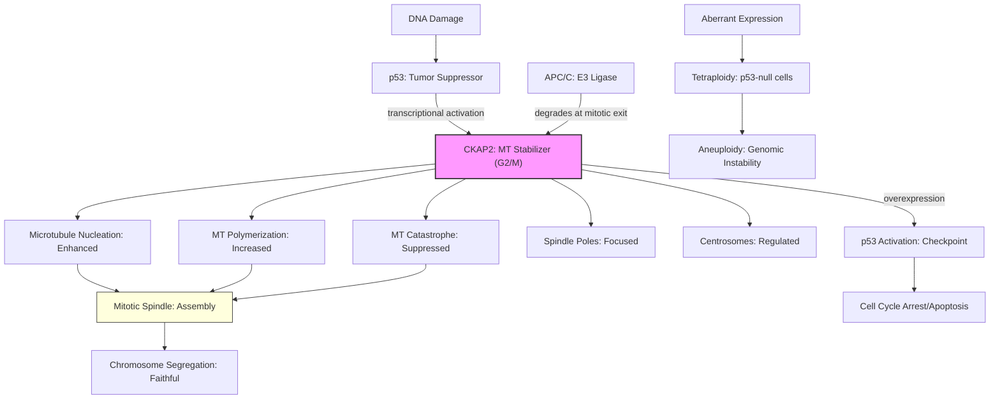

# Pathway Summary for CKAP2

## Overview
CKAP2 (Cytoskeleton-Associated Protein 2) is a potent microtubule-associated protein that functions as the most powerful known microtubule growth factor and stabilizer. Essential for faithful chromosome segregation during mitosis, CKAP2 promotes microtubule nucleation (~100-fold enhancement), dramatically increases growth rates (~20%), and suppresses catastrophic depolymerization [PMID:16061649]. The protein is cell cycle-regulated, peaking at G2/M phase and degraded by APC/C during mitotic exit.

## Core Pathways

### Mitotic Spindle Assembly Pathway
CKAP2 is critical for organizing bipolar mitotic spindle assembly and maintaining spindle pole integrity. The protein localizes to spindle microtubules, spindle poles, and centrosomes during mitosis, where it stabilizes microtubules and promotes their polymerization [PMID:16061649]. This ensures proper spindle formation essential for accurate chromosome segregation.

### p53-Mediated Cell Cycle Checkpoint
CKAP2 participates in a functional positive feedback loop with p53 to maintain genomic stability. DNA damage induces CKAP2 expression in a p53-dependent manner, and p53 directly activates the CKAP2 promoter [PMID:16061649]. In p53-competent cells, CKAP2 overexpression activates p53-mediated cell cycle arrest and apoptosis, functioning as part of the G1 tetraploidy checkpoint [PMID:16061649].

### Microtubule Dynamics Regulation
CKAP2 acts as a master regulator of microtubule dynamics by:
- Promoting microtubule nucleation (100-fold enhancement)
- Increasing microtubule growth rates (~20%)
- Suppressing catastrophic depolymerization events
- Stabilizing existing microtubules against depolymerization [PMID:16061649]

## Pathway Diagram

## Upstream Regulators
- **p53**: Transcriptionally activates CKAP2 in response to DNA damage [PMID:16061649]
- **Cell cycle machinery**: Expression peaks at G2/M phase through cell cycle-dependent regulation
- **APC/C**: Targets CKAP2 for degradation during mitotic exit

## Downstream Effects
- **Microtubule stabilization**: Prevents depolymerization and promotes growth [PMID:16061649]
- **Spindle assembly**: Essential for bipolar spindle formation and maintenance
- **Chromosome segregation**: Ensures faithful distribution of genetic material
- **Genomic stability**: Prevents aneuploidy through proper mitotic regulation

## Subcellular Localization
CKAP2 exhibits dynamic cell cycle-dependent localization:
- **Interphase**: Diffuse cytoplasmic with centrosome enrichment [PMID:21399614]
- **Mitosis**: Strongly enriched at mitotic spindle, spindle poles, and k-fibers [PMID:16061649]
- **G1 phase**: Absent, degraded by APC/C [PMID:16061649]

## Clinical Significance
CKAP2 dysfunction leads to:
- **Aneuploidy**: Aberrant chromosome numbers due to segregation errors
- **Tetraploidy**: In p53-null cells, CKAP2 overexpression induces tetraploidy with aberrant centrosome numbers [PMID:16061649]
- **Cancer implications**: Dysregulation contributes to genomic instability and tumorigenesis

## Functional Integration with Cell Cycle Control

### G1 Tetraploidy Checkpoint
CKAP2 participates in a surveillance mechanism preventing propagation of tetraploid cells:
1. Aberrant mitosis generates tetraploid cells
2. CKAP2 activates p53-dependent checkpoint
3. p53 induces cell cycle arrest or apoptosis
4. This positive feedback loop maintains genomic stability [PMID:16061649]

### Mitotic Regulation
- **Entry**: CKAP2 levels increase during G2/M transition
- **Progression**: Stabilizes spindle microtubules throughout mitosis
- **Exit**: Degraded by APC/C to allow spindle disassembly

## Molecular Mechanisms
CKAP2's microtubule regulation involves:
- **Direct binding**: Associates with microtubule lattice
- **Nucleation enhancement**: Dramatically increases new microtubule formation
- **Plus-end stabilization**: Reduces catastrophe frequency
- **Minus-end focusing**: Maintains spindle pole integrity

## Cross-pathway Connections
CKAP2 integrates multiple cellular processes:
- Links DNA damage response (p53 pathway) to mitotic machinery
- Coordinates microtubule dynamics with cell cycle progression
- Couples spindle assembly checkpoint to chromosome segregation
- Connects centrosome duplication control to mitotic fidelity