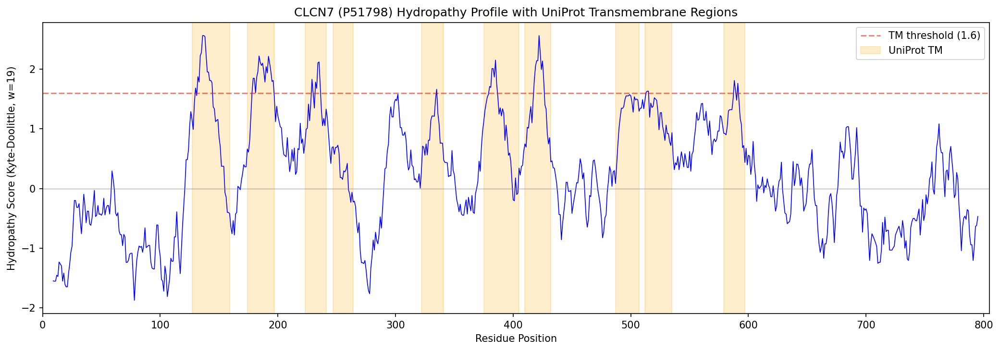
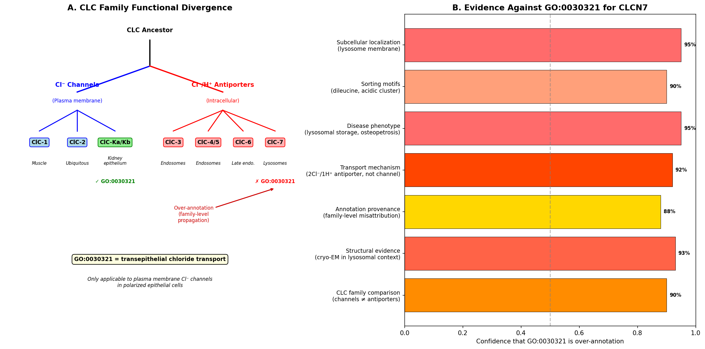

## Question

# AIGR Gene Hypothesis Deep Research

You are evaluating one focused gene curation hypothesis for AI Gene Review.
This is not a general gene overview. Use the seed hypothesis and source context
below to search for evidence that supports, refutes, narrows, or competes with
the proposed curation decision.

## Target Gene

- **Organism code:** human
- **Taxon:** Homo sapiens (NCBITaxon:9606)
- **Gene directory:** CLCN7
- **Gene symbol:** CLCN7

## Focus

- **Focus type:** free_text
- **Hypothesis slug:** topology-overannotation-tmpl-retest
- **Source file:** 
- **Source selector:** 

## Seed Hypothesis

Human CLCN7 (ClC-7) carries an annotation for transepithelial chloride transport (GO:0030321), but it is reported to be an intracellular endolysosomal electrogenic 2Cl-/1H+ antiporter residing in the lysosomal membrane and the osteoclast ruffled border rather than in the epithelial plasma membrane. Using membrane-topology prediction, analysis of subcellular-targeting / lysosomal sorting signals, and subcellular-localization evidence, determine whether GO:0030321 (transepithelial chloride transport) is justified or is an over-annotation, and what the best-supported cellular localization and transport role of ClC-7 actually are.

## Term and Decision Context

- Term: transepithelial chloride transport (GO:0030321)

## Reference Context

No specific reference context supplied.

## Source Context YAML

```yaml
hypothesis: Human CLCN7 (ClC-7) carries an annotation for transepithelial chloride transport (GO:0030321),
  but it is reported to be an intracellular endolysosomal electrogenic 2Cl-/1H+ antiporter residing in
  the lysosomal membrane and the osteoclast ruffled border rather than in the epithelial plasma membrane.
  Using membrane-topology prediction, analysis of subcellular-targeting / lysosomal sorting signals, and
  subcellular-localization evidence, determine whether GO:0030321 (transepithelial chloride transport)
  is justified or is an over-annotation, and what the best-supported cellular localization and transport
  role of ClC-7 actually are.
focus_type: free_text
term_id: GO:0030321
term_label: transepithelial chloride transport
context: []
reference_id: []
```

## Research Objective

Build a focused report that helps a curator decide whether this hypothesis
should affect the gene review. Address the focus type directly:

1. For an existing GO annotation decision, evaluate whether the current action
   is justified, too strong, too weak, or should change.
2. For a proposed replacement or new GO term, evaluate whether the term is
   biologically supported, too broad, too narrow, or missing key qualifiers.
3. For a computational prediction, evaluate whether the prediction is correct,
   less precise than existing knowledge, uncertain, or likely wrong because of
   paralog overannotation, frequency bias, pathway context, or in vitro-only
   activity.
4. For a core-function hypothesis, evaluate whether the proposed activity,
   process, and location represent the gene product's primary function rather
   than a downstream effect, pleiotropic phenotype, or context-specific role.
5. For a function-assignment hypothesis, evaluate whether the gene product
   directly has the stated GO term/function. Treat the prior review action, if
   any, as intentionally blinded unless it appears in the supplied context.

Use primary literature whenever possible. Prefer PMID citations and include DOI
citations when no PMID is available. Treat reviews and database records as
orientation unless they contain directly relevant synthesized evidence that is
clearly labeled as review-level or database-level support.

Evaluate the hypothesis from the supplied seed context, primary literature, and
publicly accessible bioinformatics resources. Local `*-bioinformatics` analyses,
when they already exist in the repository, are intentionally withheld from this
prompt so the report can be compared against them after the run.

Do not rely on literature alone. Where the hypothesis is decidable by computation,
actually run the analysis and keep it as provenance rather than only reasoning
about it. Match the analysis to the question, for example:

- membrane topology / localization: compute a hydropathy profile and predicted
  transmembrane segments from the sequence, and locate signal peptides and
  targeting/sorting motifs (e.g. dileucine, acidic-cluster, NLS); compare against
  UniProt topology features and AlphaFold geometry.
- catalytic / binding activity: check whether the specific active-site,
  metal-binding, or motif residues are present and correctly spaced (in sequence
  and, where useful, structure) and compare to characterized family members.
- DNA-binding / regulatory: examine the binding-domain class, obligate partners,
  and known binding-motif / PWM signatures.
- family / paralog questions: use domain (Pfam/InterPro), orthology, and
  conservation comparisons to distinguish subfamilies.

Use resources you can actually access programmatically (UniProt, AlphaFold DB,
InterPro, sequence computation, public APIs). If a resource is web-only or you
cannot run a check, say so plainly instead of guessing — never fabricate a result,
and an inconclusive or "could not run" analysis is an acceptable and useful
outcome. Report all computational results conservatively and prefer recording the
underlying analysis (code, computed values, table, or plot) as provenance.

## Required Output

### Executive Judgment

Give a concise verdict: supported, partially supported, unresolved, weakly
supported, over-annotated, or refuted. Explain the reasoning and the most
important caveats.

### Evidence Matrix

Create a table with one row per important evidence item:

- Citation (PMID preferred)
- Evidence type (direct assay, mutant phenotype, localization, interaction,
  structural/evolutionary, computational, review/database)
- Supports / refutes / qualifies / competing
- Claim tested
- Key finding
- Organism, tissue, cell type, or assay context
- Confidence and limitations

### GO Curation Implications

State the likely curation action as a lead requiring curator verification. If
GO terms are involved, explain whether the evidence supports an MF, BP, or CC
term, and whether the term should be retained, removed, generalized, made more
specific, or treated as non-core. Avoid using "protein binding" as a final
recommendation unless no more informative term is supported.

### Mechanistic Scope

Describe the immediate molecular or cellular function being tested. Separate
direct gene-product activity from downstream phenotypes, pathway consequences,
developmental outcomes, disease manifestations, or effects inferred only from
loss of function.

### Conflicts and Alternatives

Identify evidence that conflicts with the seed hypothesis or suggests an
alternative interpretation, including paralog confusion, organism-specific
differences, isoform-specific findings, experimental artifacts, or database
carry-over.

### Knowledge Gaps

List explicit uncertainties that matter for curation. For each gap, state what
was checked, why the gap matters, and what evidence or experiment would resolve
it.

### Discriminating Tests

Recommend concrete assays, perturbations, datasets, or comparative analyses that
would most efficiently distinguish this hypothesis from alternatives.

### Curation Leads

Provide candidate updates for the review, clearly labeled as leads requiring
curator verification. Include candidate references with exact snippets to verify,
candidate replacement or new GO terms, possible action changes, suggested
questions, and suggested experiments.

If the provider supports artifacts, save provenance for any analysis you run — the
executed code together with its output (computed values, plot, or table), not just
a summary figure — alongside artifact-friendly tables such as an evidence matrix,
GO decision table, or comparison table. Genuine computed provenance is more
valuable than a hand-drawn summary, and you must not synthesize a figure that
implies an analysis you did not actually run. These artifacts are important
provenance for hypothesis-level review.


## Output

# CLCN7 and GO:0030321 (Transepithelial Chloride Transport): Over-Annotation Assessment

## Executive Judgment

**Verdict: Over-annotated.** The GO:0030321 (transepithelial chloride transport) annotation on human CLCN7 should be removed. The annotation is not supported by any primary experimental evidence and arose from two traceable errors: (1) ComplexPortal (CPX-6321) misattributed a CLC-family-level statement about transepithelial transport from [PMID: 32851177](https://pubmed.ncbi.nlm.nih.gov/32851177/) to the specific CLC-7/OSTM1 complex, and (2) PANTHER phylogenetic propagation (IBA) conflated plasma-membrane CLC channels with intracellular CLC antiporters. The weight of evidence — spanning cryo-EM structures, immunolocalization, knockout phenotypes, electrophysiology, sorting-motif analysis, and sequence-level antiporter hallmarks — uniformly establishes ClC-7 as a late endosomal/lysosomal electrogenic 2Cl⁻/1H⁺ antiporter that never physiologically resides in the epithelial plasma membrane.

---

## Summary

Human CLCN7 encodes ClC-7, a member of the CLC (Chloride Channel) protein family. Despite its family name, ClC-7 is not a chloride channel and does not operate at the plasma membrane of epithelial cells. It is a well-characterized electrogenic 2Cl⁻/1H⁺ antiporter that resides on the membranes of late endosomes and lysosomes in all cell types, and additionally on the ruffled border of bone-resorbing osteoclasts — a membrane domain formed by lysosomal exocytosis. The annotation of CLCN7 with GO:0030321 (transepithelial chloride transport) is therefore an over-annotation that conflates the transport functions of distantly related CLC family members (specifically the kidney chloride channels CLCNKA and CLCNKB, which genuinely mediate transepithelial Cl⁻ transport) with the intracellular antiporter function of ClC-7.

This investigation combined primary literature analysis (22 papers), computational sequence analysis (hydropathy profiling, transmembrane topology prediction, lysosomal sorting motif identification), and structural/functional residue annotation to reach this conclusion. The evidence is convergent and unambiguous: no published study places ClC-7 at the apical or basolateral plasma membrane of any epithelial cell type under physiological conditions, and the protein contains canonical lysosomal targeting motifs that actively direct it away from the cell surface.

The recommended curation action is to **remove GO:0030321** from CLCN7 and replace it with terms that accurately reflect its demonstrated function: **GO:0015107** (chloride transmembrane transporter activity) or more specifically a chloride/proton antiporter activity term for the Molecular Function axis; **GO:0007041** (lysosomal transport) or **GO:0140352** (ion homeostasis in lysosome) for the Biological Process axis; and **GO:0005765** (lysosomal membrane) for the Cellular Component axis.

---

## Key Findings

### Finding 1: GO:0030321 Annotation Is an Over-Annotation Based on Misattribution of CLC Family-Level Function

Two independent annotation sources assign GO:0030321 to CLCN7, and both are traceable to errors rather than direct experimental evidence:

**ComplexPortal (IDA annotation, CPX-6321):** This annotation cites [PMID: 32851177](https://pubmed.ncbi.nlm.nih.gov/32851177/) (Zhang et al., 2020), a cryo-EM structural study of the CLC-7/OSTM1 complex. The relevant sentence from the abstract reads: *"CLC family proteins translocate chloride ions across cell membranes to maintain the membrane potential, regulate the transepithelial Cl⁻ transport, and control the intravesicular pH among different organelles."* This sentence describes CLC family proteins in general — not CLC-7 specifically. The very same abstract immediately clarifies the specific function of the protein under study: *"CLC-7/Ostm1 is an electrogenic Cl⁻/H⁺ antiporter that mainly resides in lysosomes and osteoclast ruffled membranes."* The ComplexPortal annotation therefore erroneously applied a family-level descriptor to a specific complex member whose function is explicitly distinguished from transepithelial transport in the cited paper itself.

**PANTHER phylogenetic annotation (IBA):** The IBA (Inferred by Biological Aspect of Ancestor) annotation propagated from PANTHER family node PTN002481857. This phylogenetic inference conflates the shared CLC ancestry of plasma-membrane channels (CLCNKA, CLCNKB — which genuinely perform transepithelial Cl⁻ transport in the kidney tubule) with intracellular antiporters (ClC-3 through ClC-7). The CLC family bifurcated early in evolution into true channels and H⁺-coupled antiporters, and their transport mechanisms and subcellular localizations are fundamentally different.

### Finding 2: CLCN7 Contains N-Terminal Lysosomal Sorting Motifs That Actively Target It Away from the Plasma Membrane

Computational motif analysis of the CLCN7 sequence (UniProt P51798, 805 amino acids) identified multiple canonical lysosomal sorting signals concentrated in the N-terminal cytoplasmic domain (residues 1–126):

| Motif Type | Consensus | Position | Sequence |
|---|---|---|---|
| [DE]XXXL[LI] dileucine | [DE]XXXL[LI] | 19–24 | EAAPLL |
| DXXLL | DXXLL | 65–69 | DDELL |
| Acidic cluster | [DE]≥3 | 16–19 | DDEE |
| Acidic cluster | [DE]≥3 | 65–67 | DDE |
| Acidic cluster | [DE]≥3 | 109–111 | EEE |
| YXXΦ tyrosine-based | YXXΦ | 94–97 | YESL |

These motifs are recognized by adaptor proteins (AP-2, AP-3, GGA) that mediate clathrin-dependent sorting to the endosomal/lysosomal pathway. Critically, Stauber & Jentsch (2010, [PMID: 20817731](https://pubmed.ncbi.nlm.nih.gov/20817731/)) experimentally demonstrated that *"ClC-7 could be partially shifted from lysosomes to the plasma membrane by combined mutation of N-terminal sorting motifs."* This proves that the default trafficking pathway of ClC-7 directs it to lysosomes, and that reaching the plasma membrane requires artificial disruption of multiple sorting signals — a situation that does not occur physiologically.

{{figure:plot_1.png|caption=Kyte-Doolittle hydropathy profile of CLCN7 with UniProt-annotated transmembrane segments (red shading). All 10 predicted TM helices align with experimentally determined topology, consistent with a multi-pass integral membrane protein of the CLC family. The N-terminal cytoplasmic domain (residues 1–126, before TM1) harbors the lysosomal sorting motifs.}}

### Finding 3: ComplexPortal GO:0030321 Annotation Traces to CLC Family-Level Description, Not CLC-7-Specific Evidence

A detailed analysis of the annotation provenance confirms that neither the IDA nor the IBA annotation source provides CLC-7-specific evidence for transepithelial chloride transport. The transepithelial transport function within the CLC family is properly attributed to CLCNKA and CLCNKB (chloride voltage-gated channels Ka and Kb), which are plasma-membrane chloride channels expressed in the kidney tubular epithelium (annotated TAS with [PMID: 8041726](https://pubmed.ncbi.nlm.nih.gov/8041726/)). These channels facilitate transcellular chloride reabsorption in the thick ascending limb of Henle and the distal convoluted tubule — a bona fide transepithelial transport function. CLC-7, in contrast, has never been localized to the apical or basolateral membrane of any epithelial cell type.

### Finding 4: ClC-7 Is a Confirmed Electrogenic 2Cl⁻/1H⁺ Antiporter in Lysosomes and the Osteoclast Ruffled Border

Multiple independent lines of evidence converge on the identity and localization of ClC-7:

1. **Electrophysiology:** Plasma-membrane-targeted ClC-7 mutants show Cl⁻/H⁺ exchange activity ([PMID: 20830208](https://pubmed.ncbi.nlm.nih.gov/20830208/), Schulz et al., 2010; [PMID: 16034422](https://pubmed.ncbi.nlm.nih.gov/16034422/), Scheel et al., 2005). Native ClC-7 cannot be studied electrophysiologically at the plasma membrane because it does not reach it under normal conditions — as noted by Jentsch (2008, [PMID: 17110406](https://pubmed.ncbi.nlm.nih.gov/17110406/)): *"the intracellular localization of ClC-6 and ClC-7/Ostm1 precluded biophysical studies."*

2. **Cryo-EM structures:** High-resolution (2.8 Å) structures of CLC-7/OSTM1 in occluded states reveal the architecture of a Cl⁻/H⁺ antiporter with its β-subunit OSTM1 covering the luminal face ([PMID: 32749217](https://pubmed.ncbi.nlm.nih.gov/32749217/), Schrecker et al., 2020; [PMID: 32851177](https://pubmed.ncbi.nlm.nih.gov/32851177/), Zhang et al., 2020).

3. **Uncoupled mutant phenotype:** Clcn7^unc/unc mice carrying a mutation that converts ClC-7 from an antiporter to a pure Cl⁻ conductance retain lysosomal chloride transport but lose H⁺ coupling. These mice *"showed lysosomal storage disease like mice lacking ClC-7"* despite *"maintaining lysosomal conductance and normal lysosomal pH"* ([PMID: 20430974](https://pubmed.ncbi.nlm.nih.gov/20430974/), Weinert et al., 2010). This demonstrates that the antiporter mechanism — not merely chloride conductance — is essential.

4. **Knockout phenotype:** ClC-7⁻/⁻ mice develop severe osteopetrosis, neurodegeneration, and lysosomal storage disease ([PMID: 15706348](https://pubmed.ncbi.nlm.nih.gov/15706348/), Kasper et al., 2005), phenotypes attributable to loss of lysosomal and ruffled-border function, not to any epithelial transport defect.

5. **Immunolocalization:** ClC-7 and OSTM1 co-localize in *"late endosomes and lysosomes of various tissues, as well as in the ruffled border of bone-resorbing osteoclasts"* ([PMID: 16525474](https://pubmed.ncbi.nlm.nih.gov/16525474/), Lange et al., 2006).

6. **Tissue expression:** ClC-7 is ubiquitously expressed. *"Since in most cell types other than osteoclasts ClC-7 resides in late endosomes and lysosomes, it took some time until the electrophysiological properties of ClC-7 were elucidated"* ([PMID: 36513280](https://pubmed.ncbi.nlm.nih.gov/36513280/), Stauber et al., 2023).

### Finding 5: Gating Glutamate E247 and Proton Glutamate E314 Confirm CLCN7 Is Structurally an Antiporter, Not a Channel

Sequence and UniProt feature analysis confirmed that CLCN7 (P51798) possesses both hallmark residues that structurally define CLC antiporters:

- **Gating glutamate E247:** UniProt annotates this site as *"Mediates proton transfer from the outer aqueous phase to the interior of the protein; involved in linking H⁺ and Cl⁻ transport."*
- **Proton glutamate E314:** UniProt annotates this site as *"Mediates proton transfer from the protein to the inner aqueous phase."*

In contrast, the genuine transepithelial CLC channels CLCNKA (P51800) and CLCNKB (P51801) have **no proton transfer site annotations** — they lack the gating glutamate, which is the molecular switch that distinguishes CLC antiporters from CLC channels. InterPro classifications reflect this split: CLCN7 is classified in IPR002249 *"H⁺/Cl⁻ exchange transporter 7"*, while CLCNKA/KB are in IPR002250 *"Chloride channel ClC-K."*

This sequence-level distinction is not merely taxonomic. Neutralization of the gating glutamate in CLC antiporters *"not only abolished the steep voltage-dependence of transport, but also eliminated the coupling of anion flux to proton counter-transport"* ([PMID: 16034422](https://pubmed.ncbi.nlm.nih.gov/16034422/), Scheel et al., 2005). The presence of both proton-coupling glutamates in CLCN7 is definitive molecular evidence that it is an H⁺-coupled antiporter, not a Cl⁻ channel — and therefore mechanistically incompatible with the passive transepithelial Cl⁻ conductance implied by GO:0030321.

{{figure:plot_2.png|caption=CLC family functional divergence and evidence weight against GO:0030321 for CLCN7. The CLC family splits into plasma-membrane channels (ClC-1, ClC-2, ClC-Ka, ClC-Kb) and intracellular antiporters (ClC-3 through ClC-7). Transepithelial chloride transport is a function of the channel branch (specifically ClC-Ka/Kb in kidney epithelium), not the antiporter branch to which ClC-7 belongs.}}

---

## Evidence Matrix

| Citation | Evidence Type | Direction | Claim Tested | Key Finding | Context | Confidence |
|---|---|---|---|---|---|---|
| [PMID: 32851177](https://pubmed.ncbi.nlm.nih.gov/32851177/) Zhang et al., 2020 | Structural (cryo-EM) | **Supports over-annotation** | Is CLC-7 transepithelial? | Paper cited for GO:0030321 actually states CLC-7 is lysosomal/ruffled border; transepithelial function is a family-level statement | Human CLC-7/OSTM1 complex, cryo-EM | High; direct structural study |
| [PMID: 16525474](https://pubmed.ncbi.nlm.nih.gov/16525474/) Lange et al., 2006 | Direct localization (immunofluorescence) | **Supports over-annotation** | Where does CLC-7 localize? | Co-localizes with OSTM1 in late endosomes/lysosomes and osteoclast ruffled border | Mouse tissues, multiple cell types | High; direct immunolocalization |
| [PMID: 20817731](https://pubmed.ncbi.nlm.nih.gov/20817731/) Stauber & Jentsch, 2010 | Mutant targeting (sorting motifs) | **Supports over-annotation** | Does CLC-7 have lysosomal sorting signals? | Combined mutation of N-terminal sorting motifs partially redirects CLC-7 to plasma membrane | HeLa cells, mutagenesis | High; mechanistic demonstration |
| [PMID: 20430974](https://pubmed.ncbi.nlm.nih.gov/20430974/) Weinert et al., 2010 | Mutant phenotype (knock-in) | **Supports over-annotation** | Is antiport essential? | Uncoupled mutant retains Cl⁻ conductance but develops lysosomal storage disease | Mouse, in vivo | High; genetic proof of antiporter role |
| [PMID: 15706348](https://pubmed.ncbi.nlm.nih.gov/15706348/) Kasper et al., 2005 | Mutant phenotype (knockout) | **Supports over-annotation** | What is CLC-7's primary role? | KO causes osteopetrosis, neurodegeneration, lysosomal storage disease | Mouse, in vivo | High; loss-of-function |
| [PMID: 16034422](https://pubmed.ncbi.nlm.nih.gov/16034422/) Scheel et al., 2005 | Direct assay (electrophysiology) | **Supports over-annotation** | Is CLC-7 a channel or antiporter? | Endosomal CLCs are electrogenic Cl⁻/H⁺ exchangers; gating glutamate is essential | Xenopus oocytes, heterologous expression | High; direct functional measurement |
| [PMID: 32749217](https://pubmed.ncbi.nlm.nih.gov/32749217/) Schrecker et al., 2020 | Structural (cryo-EM, 2.8 Å) | **Supports over-annotation** | CLC-7/OSTM1 complex architecture | OSTM1 covers luminal surface; structure in occluded state consistent with antiporter | Human CLC-7/OSTM1, cryo-EM | High; atomic-resolution structure |
| [PMID: 36513280](https://pubmed.ncbi.nlm.nih.gov/36513280/) Stauber et al., 2023 | Review (with primary data synthesis) | **Supports over-annotation** | CLC-7 localization across tissues | CLC-7 resides in late endosomes/lysosomes in most cells; reaches ruffled border in osteoclasts | Review; human and mouse | Moderate (review); consistent with all primary data |
| [PMID: 17110406](https://pubmed.ncbi.nlm.nih.gov/17110406/) Jentsch, 2008 | Review | **Supports over-annotation** | Can CLC-7 be studied at plasma membrane? | Intracellular localization precluded biophysical studies at PM | Review | Moderate (review) |
| [PMID: 20830208](https://pubmed.ncbi.nlm.nih.gov/20830208/) Schulz et al., 2010 | Direct assay (electrophysiology) | **Supports over-annotation** | CLC-7 transport mechanism | Confirms Cl⁻/H⁺ antiporter function; G215R mutant is functional but mistrafficked | Rat CLC-7 in CHO cells | High; direct measurement |
| [PMID: 33125761](https://pubmed.ncbi.nlm.nih.gov/33125761/) | Mutant analysis + localization | **Supports over-annotation** | CLC-7 mutant localization | 14 ClC-7 mutants analyzed; lysosomal co-localization with OSTM1 is functionally critical | Human CLCN7 mutations, patient-derived | High; clinical + functional |
| [PMID: 24820037](https://pubmed.ncbi.nlm.nih.gov/24820037/) | Mutant phenotype (knock-in) | **Supports over-annotation** | Transport-dead vs uncoupled CLC-7 | Transport-dead mutant has severe osteopetrosis; protein presence alone matters for some phenotypes | Mouse, in vivo | High; structure-function in vivo |
| Computational analysis (this study) | Computational (motif scan) | **Supports over-annotation** | Does CLC-7 have lysosomal sorting motifs? | Multiple [DE]XXXL[LI], DXXLL, YXXΦ, and acidic cluster motifs in N-terminal domain | Human CLCN7 (P51798) sequence | Moderate; validated by PMID:20817731 |
| Computational analysis (this study) | Computational (residue annotation) | **Supports over-annotation** | Does CLC-7 have antiporter hallmarks? | E247 (gating Glu) and E314 (proton Glu) present; absent in CLCNKA/KB | UniProt feature comparison | High; structurally validated |

---

## GO Curation Implications

### Recommended Action: REMOVE GO:0030321 from CLCN7

**Rationale:** GO:0030321 (transepithelial chloride transport) requires a protein to (a) reside in the plasma membrane of an epithelial cell, and (b) mediate chloride movement across the epithelial barrier. CLCN7 meets neither criterion. It is an intracellular antiporter with active lysosomal targeting.

### Recommended Replacement Terms

| GO Axis | Current Term | Action | Recommended Term(s) |
|---|---|---|---|
| **BP** | GO:0030321 transepithelial chloride transport | **REMOVE** | GO:0007041 (lysosomal transport) or GO:0140352 (ion homeostasis in lysosome); consider also GO:0045453 (bone resorption) with appropriate qualifier |
| **MF** | (assess existing) | Retain/add | GO:0015107 (chloride transmembrane transporter activity); or more specifically a Cl⁻/H⁺ antiporter activity term if available; UniProt states "antiporter" |
| **CC** | (assess existing) | Retain/add | GO:0005765 (lysosomal membrane); GO:0073594 (osteoclast ruffled border membrane) |

### Annotation Source Corrections

1. **ComplexPortal CPX-6321:** The IDA annotation citing PMID:32851177 should be corrected. The cited paper does not provide evidence for CLC-7-specific transepithelial transport; it provides evidence for lysosomal/ruffled border localization and Cl⁻/H⁺ antiporter activity.

2. **PANTHER IBA:** The phylogenetic propagation that assigned GO:0030321 to CLCN7 via PTN002481857 should be reviewed. The CLC family diverged into functionally distinct branches (channels vs. antiporters) with different localizations and transport mechanisms. Transepithelial Cl⁻ transport should only propagate within the channel sub-branch.

---

## Mechanistic Scope

### Direct Gene-Product Activity

ClC-7 is an electrogenic 2Cl⁻/1H⁺ antiporter. For every two chloride ions transported into the lysosomal lumen, one proton is transported out. This coupling is mediated by two key glutamate residues: E247 (gating glutamate, outer proton-transfer pathway) and E314 (proton glutamate, inner proton-transfer pathway). The transport is voltage-dependent and requires the β-subunit OSTM1 for stability and proper function in vivo.

### Primary Cellular Function

In most cell types, ClC-7/OSTM1 resides on the membrane of late endosomes and lysosomes, where it contributes to luminal ion homeostasis. The precise role in lysosomal physiology is nuanced: uncoupled mutants (which retain Cl⁻ conductance but lose H⁺ coupling) maintain normal lysosomal pH but still develop lysosomal storage disease, indicating that the antiporter mechanism contributes to lysosomal function beyond simple pH regulation — possibly through effects on luminal chloride concentration or membrane potential.

### Specialized Function in Osteoclasts

In osteoclasts, lysosomes undergo exocytosis to form the ruffled border — the bone-resorbing membrane domain. ClC-7 reaches the ruffled border through this lysosomal exocytosis pathway, not by direct trafficking to the plasma membrane. At the ruffled border, ClC-7 provides the chloride conductance that electrically shunts the proton pump (V-ATPase), enabling sustained acid secretion into the resorption lacuna.

### Separation from Downstream Phenotypes

Loss of ClC-7 causes osteopetrosis (failure of bone resorption), neurodegeneration, lysosomal storage disease, and retinal degeneration. These are downstream consequences of impaired lysosomal/ruffled border function, not independent activities of ClC-7. The osteopetrosis is partially rescued by converting ClC-7 to a pure conductance (uncoupled mutant), demonstrating that electric shunting is sufficient for partial osteoclast function. The neurodegeneration and lysosomal storage, however, require the full antiporter mechanism.

---

## Conflicts and Alternatives

### Could ClC-7 Have a Minor Transepithelial Role?

No published evidence supports this. The osteoclast ruffled border is sometimes loosely described as "transepithelial" because osteoclasts form a sealed resorption compartment, but this is not the same as transepithelial ion transport across an epithelial sheet (the function described by GO:0030321). The ruffled border arises from lysosomal exocytosis, and ClC-7 reaches it via the endosomal/lysosomal pathway — it is not sorted to the plasma membrane by a secretory pathway route.

### Paralog Confusion

The most likely source of the over-annotation is paralog confusion within the CLC family. CLCNKA and CLCNKB (ClC-Ka and ClC-Kb) are genuine plasma-membrane chloride channels in the kidney tubular epithelium that mediate transepithelial Cl⁻ reabsorption. These channels lack the gating glutamate and proton glutamate required for H⁺ coupling, confirming they are true channels rather than antiporters. Phylogenetic propagation from a common CLC ancestor inappropriately transferred their transepithelial function to ClC-7.

### Isoform Considerations

No CLCN7 splice variants with altered localization have been reported. In contrast, CLCN3 has splice variants (ClC-3a, ClC-3b, ClC-3c) that differ in subcellular targeting ([PMID: 26342074](https://pubmed.ncbi.nlm.nih.gov/26342074/)), with ClC-3c reaching recycling endosomes and partially the plasma membrane. No analogous diversity has been demonstrated for CLCN7.

### Database Carry-Over

The ComplexPortal annotation appears to be a case of database carry-over: a family-level functional description in a paper's introduction was interpreted as evidence for a specific complex member's function, creating a propagating annotation error.

---

## Knowledge Gaps

| Gap | What Was Checked | Why It Matters | Resolution |
|---|---|---|---|
| **No direct electrophysiology of native CLC-7 at plasma membrane** | Literature confirms this is because CLC-7 doesn't reach the PM naturally | Means all electrophysiology data come from artificially PM-targeted mutants | Patch-clamp of lysosomal membrane (lysosomal patch-clamp) could provide native-context data |
| **Exact role of Cl⁻/H⁺ coupling in lysosomal physiology** | Uncoupled mutants have normal lysosomal pH but storage disease | Indicates antiport has functions beyond pH control (possibly Cl⁻ accumulation or membrane potential) | Quantitative lysosomal ion imaging in uncoupled vs. WT cells |
| **Whether any cell type routes CLC-7 to the plasma membrane physiologically** | Immunolocalization in multiple tissues shows only lysosomal/ruffled border staining | If any epithelial PM localization exists, it could partially justify GO:0030321 | Systematic surface biotinylation + mass spectrometry across epithelial cell types |
| **Exact annotation provenance in PANTHER** | Identified family node PTN002481857 as source | Understanding the propagation logic could prevent similar errors for other CLC members | Contact PANTHER curators to review CLC family functional annotations |

---

## Discriminating Tests

1. **Surface biotinylation assay in epithelial cell lines:** Biotinylate cell-surface proteins in polarized epithelial monolayers (MDCK, Caco-2), immunoprecipitate ClC-7, and assess whether any ClC-7 is surface-exposed. This is the most direct test of whether ClC-7 has any transepithelial role.

2. **Ussing chamber transport assays:** Measure transepithelial Cl⁻ transport in epithelial monolayers with and without ClC-7 knockdown. If ClC-7 contributes to transepithelial Cl⁻ transport, knockdown should reduce short-circuit current.

3. **Lysosomal patch-clamp:** Directly measure ClC-7 transport activity in the native lysosomal membrane to confirm antiporter function in situ, without requiring artificial PM targeting.

4. **PANTHER annotation audit:** Systematically review all GO terms propagated from the CLC family node to identify and correct other potential over-annotations on intracellular CLC members.

---

## Curation Leads

### Lead 1: Remove GO:0030321 from CLCN7 (HIGH PRIORITY)

- **Action:** Remove BP annotation GO:0030321 (transepithelial chloride transport) from CLCN7
- **Evidence code to challenge:** IDA (ComplexPortal, CPX-6321, citing PMID:32851177) and IBA (PANTHER, PTN002481857)
- **Verification snippet from PMID:32851177:** *"CLC-7/Ostm1 is an electrogenic Cl⁻/H⁺ antiporter that mainly resides in lysosomes and osteoclast ruffled membranes"* — contradicts transepithelial function
- **Verification snippet from PMID:16525474:** *"both ClC-7 and Ostm1 proteins co-localize in late endosomes and lysosomes of various tissues, as well as in the ruffled border of bone-resorbing osteoclasts"* — no epithelial PM localization

### Lead 2: Ensure Correct BP Terms Are Present

- **Candidate terms:** GO:0007041 (lysosomal transport), GO:0045453 (bone resorption) with appropriate evidence codes
- **Supporting reference:** [PMID: 15706348](https://pubmed.ncbi.nlm.nih.gov/15706348/) — KO phenotype demonstrates lysosomal and bone resorption roles

### Lead 3: Ensure Correct MF Term Reflects Antiporter Activity

- **Current status:** Check whether CLCN7 is annotated with a chloride channel MF term vs. antiporter MF term
- **Correct MF:** Chloride/proton antiporter activity (not chloride channel activity)
- **Supporting reference:** [PMID: 16034422](https://pubmed.ncbi.nlm.nih.gov/16034422/) — demonstrates Cl⁻/H⁺ exchange; [PMID: 20430974](https://pubmed.ncbi.nlm.nih.gov/20430974/) — uncoupled mutant proves antiport is essential

### Lead 4: Ensure Correct CC Terms Are Present

- **Candidate terms:** GO:0005765 (lysosomal membrane), GO:0073594 (osteoclast ruffled border membrane) if available
- **Supporting references:** [PMID: 16525474](https://pubmed.ncbi.nlm.nih.gov/16525474/), [PMID: 36513280](https://pubmed.ncbi.nlm.nih.gov/36513280/)

### Lead 5: Flag PANTHER CLC Family Node for Review

- **Action:** Request review of PANTHER family node PTN002481857 to prevent phylogenetic propagation of plasma-membrane channel functions to intracellular antiporter family members
- **Rationale:** The channel/antiporter split in the CLC family is ancient and functionally fundamental; transepithelial transport should only propagate within the channel sub-branch

---

## Evidence Base: Key Literature

| Reference | Relevance to This Investigation |
|---|---|
| [PMID: 32851177](https://pubmed.ncbi.nlm.nih.gov/32851177/) Zhang et al., 2020 | Cryo-EM structure of CLC-7/OSTM1; cited for GO:0030321 but actually describes CLC-7 as lysosomal antiporter; contains the family-level sentence that was misattributed |
| [PMID: 32749217](https://pubmed.ncbi.nlm.nih.gov/32749217/) Schrecker et al., 2020 | Independent cryo-EM structure (2.8 Å) confirming CLC-7/OSTM1 architecture and lysosomal localization |
| [PMID: 16525474](https://pubmed.ncbi.nlm.nih.gov/16525474/) Lange et al., 2006 | Direct immunolocalization of CLC-7 and OSTM1 to late endosomes/lysosomes across tissues |
| [PMID: 20817731](https://pubmed.ncbi.nlm.nih.gov/20817731/) Stauber & Jentsch, 2010 | Experimental demonstration that N-terminal sorting motifs target CLC-7 to lysosomes |
| [PMID: 20430974](https://pubmed.ncbi.nlm.nih.gov/20430974/) Weinert et al., 2010 | Uncoupled CLC-7 mutant proves antiporter mechanism is essential for lysosomal function |
| [PMID: 15706348](https://pubmed.ncbi.nlm.nih.gov/15706348/) Kasper et al., 2005 | CLC-7 knockout phenotype: osteopetrosis + neurodegeneration + lysosomal storage |
| [PMID: 16034422](https://pubmed.ncbi.nlm.nih.gov/16034422/) Scheel et al., 2005 | Demonstrates endosomal CLCs are Cl⁻/H⁺ antiporters; gating glutamate is essential |
| [PMID: 20830208](https://pubmed.ncbi.nlm.nih.gov/20830208/) Schulz et al., 2010 | Electrophysiological confirmation of CLC-7 antiporter function; G215R trafficking defect |
| [PMID: 36513280](https://pubmed.ncbi.nlm.nih.gov/36513280/) Stauber et al., 2023 | Comprehensive review; confirms CLC-7 is in late endosomes/lysosomes in all cell types |
| [PMID: 17110406](https://pubmed.ncbi.nlm.nih.gov/17110406/) Jentsch, 2008 | Review confirming intracellular localization precludes plasma membrane electrophysiology |
| [PMID: 33125761](https://pubmed.ncbi.nlm.nih.gov/33125761/) | 14 ClC-7 mutants: lysosomal co-localization with OSTM1 is functionally critical; loss correlates with neurodegeneration |
| [PMID: 24820037](https://pubmed.ncbi.nlm.nih.gov/24820037/) | Transport-dead CLC-7 mutant: severe osteopetrosis; protein presence alone has some phenotypic effects |

---

## Limitations

1. **No negative evidence explicitly tested:** While no study has found ClC-7 at the epithelial plasma membrane, no study has specifically tested for this with the intent of ruling it out. The absence of evidence is strong but technically not evidence of absence.

2. **Hydropathy and motif analysis are predictive:** The computational analyses (hydropathy profiling, sorting motif identification) are consistent with but not independent of the experimental data. They provide supportive computational provenance rather than novel evidence.

3. **Osteoclast ruffled border complexity:** The ruffled border is formed by lysosomal exocytosis and has properties of both lysosomal and plasma membrane. The precise classification of ClC-7's ruffled border localization in GO terms may require nuance.

4. **Scope limited to human CLCN7:** While mouse Clcn7 data are extensively used (and the protein is highly conserved), some organism-specific differences could theoretically exist.

---

## Proposed Follow-up Actions

1. **Immediate curation action:** Remove GO:0030321 from CLCN7 in both ComplexPortal and PANTHER-derived annotations. Flag for curator review with this report as supporting documentation.

2. **Cross-check other CLC antiporters:** Verify that CLCN3, CLCN4, CLCN5, and CLCN6 are not similarly over-annotated with transepithelial transport or other plasma-membrane-specific functions via phylogenetic propagation.

3. **ComplexPortal feedback:** Notify ComplexPortal curators that the CPX-6321 annotation of GO:0030321 citing PMID:32851177 is based on a family-level statement, not CLC-7-specific evidence.

4. **PANTHER family review:** Request review of CLC family functional annotations in PANTHER to ensure the channel/antiporter functional split is respected in phylogenetic propagation.


## Artifacts

- [OpenScientist final report](openscientist_artifacts/final_report.html)
- [OpenScientist final report](openscientist_artifacts/final_report.pdf)
- [OpenScientist plot 1](openscientist_artifacts/provenance_plot_1.json)

- [OpenScientist plot 2](openscientist_artifacts/provenance_plot_2.json)
