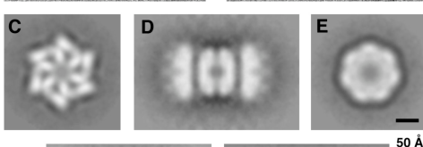

## Question

# Gene Research for Functional Annotation

## ⚠️ CRITICAL: Gene/Protein Identification Context

**BEFORE YOU BEGIN RESEARCH:** You MUST verify you are researching the CORRECT gene/protein. Gene symbols can be ambiguous, especially for less well-characterized genes from non-model organisms.

### Target Gene/Protein Identity (from UniProt):
- **UniProt Accession:** Q16740
- **Protein Description:** RecName: Full=ATP-dependent Clp protease proteolytic subunit, mitochondrial; EC=3.4.21.92 {ECO:0000269|PubMed:11923310, ECO:0000269|PubMed:15522782, ECO:0000269|PubMed:22354088}; AltName: Full=Caseinolytic mitochondrial matrix peptidase proteolytic subunit {ECO:0000312|HGNC:HGNC:2084}; AltName: Full=Endopeptidase Clp; Flags: Precursor;
- **Gene Information:** Name=CLPP {ECO:0000312|HGNC:HGNC:2084};
- **Organism (full):** Homo sapiens (Human).
- **Protein Family:** Belongs to the peptidase S14 family. .
- **Key Domains:** ClpP. (IPR001907); ClpP/crotonase-like_dom_sf. (IPR029045); ClpP/TepA. (IPR023562); ClpP_His_AS. (IPR033135); ClpP_Ser_AS. (IPR018215)

### MANDATORY VERIFICATION STEPS:

1. **Check if the gene symbol "CLPP" matches the protein description above**
2. **Verify the organism is correct:** Homo sapiens (Human).
3. **Check if protein family/domains align with what you find in literature**
4. **If you find literature for a DIFFERENT gene with the same or similar symbol, STOP**

### If Gene Symbol is Ambiguous or You Cannot Find Relevant Literature:

**DO NOT PROCEED WITH RESEARCH ON A DIFFERENT GENE.** Instead:
- State clearly: "The gene symbol 'CLPP' is ambiguous or literature is limited for this specific protein"
- Explain what you found (e.g., "Found extensive literature on a different gene with the same symbol in a different organism")
- Describe the protein based ONLY on the UniProt information provided above
- Suggest that the protein function can be inferred from domain/family information

### Research Target:

Please provide a comprehensive research report on the gene **CLPP** (gene ID: CLPP, UniProt: Q16740) in human.

The research report should be a detailed narrative explaining the function, biological processes, and localization of the gene product. Citations should be given for all claims.

You should prioritize authoritative reviews and primary scientific literature when conducting research. You can supplement
this with annotations you find in gene/protein databases, but these can be outdated or inaccurate.

We are specifically interested in the primary function of the gene - for enzymes, what reaction is catalyzed, and what is the substrate specificity? For transporters, what is the substrate? For structural proteins or adapters, what is the broader structural role? For signaling molecules, what is the role in the pathway.

We are interested in where in or outside the cell the gene product carries out its function.

We are also interested in the signaling or biochemical pathways in which the gene functions. We are less interested in broad pleiotropic effects, except where these elucidate the precise role.

Include evidence where possible. We are interested in both experimental evidence as well as inference from structure, evolution, or bioinformatic analysis. Precise studies should be prioritized over high-throughput, where available.

## Output

Question: You are an expert researcher providing comprehensive, well-cited information.

Provide detailed information focusing on:
1. Key concepts and definitions with current understanding
2. Recent developments and latest research (prioritize 2023-2024 sources)
3. Current applications and real-world implementations
4. Expert opinions and analysis from authoritative sources
5. Relevant statistics and data from recent studies

Format as a comprehensive research report with proper citations. Include URLs and publication dates where available.
Always prioritize recent, authoritative sources and provide specific citations for all major claims.

# Gene Research for Functional Annotation

## ⚠️ CRITICAL: Gene/Protein Identification Context

**BEFORE YOU BEGIN RESEARCH:** You MUST verify you are researching the CORRECT gene/protein. Gene symbols can be ambiguous, especially for less well-characterized genes from non-model organisms.

### Target Gene/Protein Identity (from UniProt):
- **UniProt Accession:** Q16740
- **Protein Description:** RecName: Full=ATP-dependent Clp protease proteolytic subunit, mitochondrial; EC=3.4.21.92 {ECO:0000269|PubMed:11923310, ECO:0000269|PubMed:15522782, ECO:0000269|PubMed:22354088}; AltName: Full=Caseinolytic mitochondrial matrix peptidase proteolytic subunit {ECO:0000312|HGNC:HGNC:2084}; AltName: Full=Endopeptidase Clp; Flags: Precursor;
- **Gene Information:** Name=CLPP {ECO:0000312|HGNC:HGNC:2084};
- **Organism (full):** Homo sapiens (Human).
- **Protein Family:** Belongs to the peptidase S14 family. .
- **Key Domains:** ClpP. (IPR001907); ClpP/crotonase-like_dom_sf. (IPR029045); ClpP/TepA. (IPR023562); ClpP_His_AS. (IPR033135); ClpP_Ser_AS. (IPR018215)

### MANDATORY VERIFICATION STEPS:

1. **Check if the gene symbol "CLPP" matches the protein description above**
2. **Verify the organism is correct:** Homo sapiens (Human).
3. **Check if protein family/domains align with what you find in literature**
4. **If you find literature for a DIFFERENT gene with the same or similar symbol, STOP**

### If Gene Symbol is Ambiguous or You Cannot Find Relevant Literature:

**DO NOT PROCEED WITH RESEARCH ON A DIFFERENT GENE.** Instead:
- State clearly: "The gene symbol 'CLPP' is ambiguous or literature is limited for this specific protein"
- Explain what you found (e.g., "Found extensive literature on a different gene with the same symbol in a different organism")
- Describe the protein based ONLY on the UniProt information provided above
- Suggest that the protein function can be inferred from domain/family information

### Research Target:

Please provide a comprehensive research report on the gene **CLPP** (gene ID: CLPP, UniProt: Q16740) in human.

The research report should be a detailed narrative explaining the function, biological processes, and localization of the gene product. Citations should be given for all claims.

You should prioritize authoritative reviews and primary scientific literature when conducting research. You can supplement
this with annotations you find in gene/protein databases, but these can be outdated or inaccurate.

We are specifically interested in the primary function of the gene - for enzymes, what reaction is catalyzed, and what is the substrate specificity? For transporters, what is the substrate? For structural proteins or adapters, what is the broader structural role? For signaling molecules, what is the role in the pathway.

We are interested in where in or outside the cell the gene product carries out its function.

We are also interested in the signaling or biochemical pathways in which the gene functions. We are less interested in broad pleiotropic effects, except where these elucidate the precise role.

Include evidence where possible. We are interested in both experimental evidence as well as inference from structure, evolution, or bioinformatic analysis. Precise studies should be prioritized over high-throughput, where available.

# Human CLPP (UniProt Q16740): functional annotation and research report

## Identity and principal function

**Identity verified.** The requested *Homo sapiens* gene **CLPP** encodes mitochondrial caseinolytic protease P, the **proteolytic** subunit of ClpXP; **CLPX** is a separate gene encoding its ATP-consuming substrate-recognition partner. The supplied Q16740 annotation identifies CLPP as a peptidase-S14-family protein with a ClpP domain and serine- and histidine-active-site signatures, consistent with the experimentally characterized human enzyme. It is not a bacterial ClpP or the human CLPX ATPase. Human CLPP is synthesized as a mitochondrial precursor and functions predominantly **inside the mitochondrial matrix**, where its active sites face the interior of a proteolytic chamber. (kang2002functionalproteolyticcomplexes pages 3-5, isermann2026mitochondrialclppin pages 2-2, jenkinson2013perraultsyndromeis pages 3-4)

**Catalyzed reaction:** CLPP hydrolyzes peptide bonds in proteins or accessible peptides, producing shorter peptide fragments. It is a chambered **serine endopeptidase**, not an ATPase: the ATP requirement for efficient degradation of folded proteins belongs chiefly to CLPX-mediated recognition, unfolding and delivery. Kang and colleagues identified the mature recombinant human enzyme’s catalytic **Ser97–His122–Asp171** triad; replacing Ser97 with alanine or cysteine abolished tested proteolysis without abolishing assembly with ClpX. Residue numbers in studies of the processed enzyme should not automatically be equated with precursor-sequence numbers. (kang2002functionalproteolyticcomplexes pages 18-20, kang2002functionalproteolyticcomplexes pages 20-22, isermann2026mitochondrialclppin pages 2-2)

Human ClpP forms two stacked **seven-membered rings**, or a 14-subunit core; one or two **six-membered ClpX rings** can cap it. Gated axial entrances protect most folded matrix proteins from indiscriminate cleavage. ClpX uses ATP to select and unfold appropriate clients and feed them into the ClpP chamber. Electron micrographs in **Figure 4** of Kang *et al.* show the sevenfold ClpP and sixfold ClpX rings and the capped complex; the visual evidence corroborates the authors’ biochemical assembly measurements. [Kang *et al.*, *Journal of Biological Chemistry*, June 2002, https://doi.org/10.1074/jbc.M201642200.] (kang2002functionalproteolyticcomplexes pages 15-16, kang2002functionalproteolyticcomplexes media a08ce313)

## Substrate specificity: what is established

**CLPP is not a nonspecific, free-ranging protein shredder.** Isolated human ClpP cleaved oxidized insulin B chain and the synthetic peptide FAPHMALVPV, although several commonly used short fluorogenic peptides were not cleaved under the reported conditions. ClpX increased cleavage of FAPHMALVPV approximately **20-fold**; cleavage occurred between its Met and Ala residues. Reconstituted human ClpXP degraded α-, β- and κ-casein, but not the bacterial ClpXP model substrates GFP–SsrA or λO. Exchanging human ClpX for bacterial ClpX changed protein-substrate recognition, directly implicating the **ATPase partner in substrate selection**. These assays establish enzymatic competence and selectivity, not that casein or insulin is an endogenous mitochondrial client. [Kang *et al.*, 2002, https://doi.org/10.1074/jbc.M201642200.] (kang2002functionalproteolyticcomplexes pages 13-15, kang2002functionalproteolyticcomplexes pages 15-16, kang2002functionalproteolyticcomplexes pages 1-3)

A substantial advance after the requested 2023–2024 priority window was the identification of a **phosphoserine-dependent recognition mechanism**. Feng *et al.* found that human ClpX preferentially recognizes serine-phosphorylated substrates through its **RKL loop**: replacing R401/K402 disrupted phosphoserine-selective degradation while preserving ATPase activity. Reconstituted assays compared phosphorylated and dephosphorylated α-casein; cellular experiments supported preferential turnover of phosphorylated **SDHA** without a corresponding change in total SDHA. Phosphorylated **NDUFA4** was another candidate. This identifies **a** human ClpXP degradation signal, not a universal sequence motif or proof that every phosphorylated matrix protein is degraded. [Feng *et al.*, *PNAS*, January 2025, https://doi.org/10.1073/pnas.2422447122.] (feng2025serinephosphorylationfacilitates pages 1-2, feng2025serinephosphorylationfacilitates pages 6-7, feng2025serinephosphorylationfacilitates pages 9-10, feng2025serinephosphorylationfacilitates pages 4-6)

For clarity, the following comparison separates demonstrated reactions and CLPP-dependent cellular regulation from proteins that merely accumulate when CLPP is removed. (szczepanowska2016clppcoordinatesmitoribosomal pages 10-12, szczepanowska2020asalvagepathway pages 1-2, key2023translationfidelityand pages 1-2)

| Physiological or clinical context | Protein substrate or molecular readout | Strongest evidence and quantitative result | Interpretation or limitation |
|---|---|---|---|
| Reconstituted human mitochondrial ClpXP | Caseins, GFP–SsrA and λO | Human ClpP formed a 14-subunit core of two heptameric rings capped by hexameric ClpX. hClpXP degraded α-, β- and κ-casein, but not GFP–SsrA or λO. α-Casein turnover was ≤0.4 min⁻¹ per ClpX hexamer; ClpX stimulated FAPHMALVPV cleavage about 20-fold. (kang2002functionalproteolyticcomplexes pages 13-15, kang2002functionalproteolyticcomplexes pages 15-16) | Establishes a bona fide ATP-dependent human protease and shows that ClpX determines protein-substrate selectivity. Caseins are experimental substrates, not demonstrated physiological mitochondrial clients. |
| Mouse mitoribosome biogenesis | ERAL1 on the 12S-rRNA-containing 28S small subunit | CLPP loss stabilized ERAL1, increased its association with small-subunit intermediates and produced about a fivefold excess of free 39S subunits. Moderate ERAL1 knockdown partially rescued 55S assembly, mitochondrial translation and respiratory-chain biogenesis; wild-type, but not catalytically inactive, CLPP restored assembly. (szczepanowska2016clppcoordinatesmitoribosomal pages 10-12, szczepanowska2016clppcoordinatesmitoribosomal pages 12-13, szczepanowska2016clppcoordinatesmitoribosomal pages 7-8) | Genetic, turnover, interaction and rescue evidence supports CLPXP-dependent ERAL1 removal during maturation. Purified ClpXP cleavage of ERAL1 was not shown, so it is most accurately described as a protease-regulated client rather than a definitively direct substrate. |
| Mouse respiratory complex-I quality control | N-module proteins NDUFV1, NDUFV2 and NDUFS1 | N-module components exchanged about six times more frequently than P-module proteins. CLPP depletion stabilized pulse-chased NDUFV2, and CLPP-deficient heart mitochondria accumulated the NDUFV1–NDUFV2–NDUFS1–NDUFA2 intermediate approximately 11-fold, while P-module intermediates were unchanged. (szczepanowska2020asalvagepathway pages 1-2, szczepanowska2020asalvagepathway pages 2-3) | Supports selective CLPXP-dependent turnover of the matrix-exposed NADH-oxidizing module and a complex-I salvage pathway. Most components remain putative substrates because purified-complex cleavage and the extraction mechanism were not demonstrated. |
| CLPP-null mouse tissues; 2023 complexomics | GFM1, MRPL38 and other mitoribosomal assembly factors | GFM1 accumulated about 10-fold and co-migrated with CLPX up to approximately 250 kDa; MRPL38 accumulated about threefold with altered migration. Other changes included MRPL55 at 15-fold in testis and MRPL18 at fourfold. (key2023translationfidelityand pages 1-2, key2023translationfidelityand pages 8-9) | These are candidate CLPX clients or assembly intermediates, not proven degradation substrates. Co-migration, co-immunoprecipitation and accumulation may reflect chaperoning, transcriptional adaptation or secondary remodeling. |
| Human mitochondrial phosphodegron recognition; 2025 | Phosphoserine-marked SDHA and NDUFA4 | Among 177 mitochondrial phosphorylation sites, 152 were pSer; 28 sites rose ≥2-fold after high-dose bortezomib. pSer-SDHA and pSer-NDUFA4 were enriched 4.6- and 3.8-fold, respectively. CLPX or CLPP depletion increased phosphorylated, but not total, SDHA; R401A/K402A mutation of the ClpX RKL loop abolished phosphoserine selectivity without abolishing ATPase activity. (feng2025serinephosphorylationfacilitates pages 6-7, feng2025serinephosphorylationfacilitates pages 9-10, feng2025serinephosphorylationfacilitates pages 4-6) | Provides biochemical and cellular evidence that phosphoserine can act as a human ClpX-recognition signal. SDHA is the strongest cellular example, but phosphorylation is unlikely to be the only mitochondrial ClpXP degron. |
| Human PRLTS3 fibroblasts and derived neural cells; 2026 | CHCHD2, ALAS1 and TFAM; PDIP38 adaptor | Patient-fibroblast proteomics followed by iPSC, neural-cell and biochemical validation identified CHCHD2, ALAS1 and TFAM as ClpXP substrates; efficient degradation required PDIP38. (aljghami2026identificationofsubstrates pages 1-2) | This newer evidence expands the validated human substrate set and supports adaptor-dependent selection. It postdates the requested 2023–2024 priority window and may not generalize to every tissue or stress state. |
| Recurrent H3 K27M-mutant diffuse midline glioma; 2024 pooled ONC201 study | Clinical response to pharmacological CLPP hyperactivation | Among 50 patients—46 adults and four children—the blinded RANO-HGG objective response rate was 20.0% (95% CI, 10.0–33.7), median time to response was 8.3 months and median response duration was 11.2 months. Grade-3 treatment-related events occurred in 20%, with no grade-4 events, treatment-related deaths or discontinuations. (arrillagaromany2024onc201(dordaviprone)in pages 1-2, arrillagaromany2024onc201(dordaviprone)in pages 4-5) | Supports CLPP hyperactivation as a therapeutic strategy but does not prove that CLPP alone caused each response. The pooled, single-arm, selected cohort excluded primary pontine and spinal tumors and required measurable disease, performance score ≥60 and ≥90 days since radiotherapy. |

*Table: Comparison of established CLPP functions, candidate substrates, newly validated recognition mechanisms and clinical pharmacology. Evidence types are separated to avoid treating accumulation or association alone as proof of direct proteolysis.*

## Where CLPP acts and the pathways it controls

**Mitochondrial gene expression.** In CLPP-deficient mouse heart and fibroblasts, the 12S-rRNA chaperone **ERAL1** persists on the developing **28S small mitoribosomal subunit**. Fully assembled **55S** mitoribosomes and mitochondrial protein synthesis decline. Reducing excess ERAL1 partially restores ribosome assembly and translation; restoring catalytically active, but not inactive, CLPP also improves assembly. The supported mechanism is timely **CLPXP-dependent control of ERAL1 turnover or removal**, permitting small-subunit maturation and subsequent synthesis of mitochondrially encoded oxidative-phosphorylation proteins. ERAL1 stabilization, CLPX association, turnover measurements and rescue form stronger evidence than abundance alone, although the cited experiments do not establish cleavage of purified ERAL1 by purified ClpXP. [Szczepanowska *et al.*, *EMBO Journal*, December 2016, https://doi.org/10.15252/embj.201694253.] (szczepanowska2016clppcoordinatesmitoribosomal pages 10-12, szczepanowska2016clppcoordinatesmitoribosomal pages 9-10, szczepanowska2016clppcoordinatesmitoribosomal pages 7-8)

**Respiratory-chain maintenance.** CLPXP also participates in preferential replacement of the **matrix-facing, NADH-oxidizing N-module of respiratory complex I**. In mammalian experiments, N-module proteins exchanged about **six times** as frequently as membrane-arm P-module proteins; CLPP depletion stabilized pulse-chased **NDUFV2** and produced an approximately **11-fold** accumulation of an NDUFV1/NDUFV2/NDUFS1/NDUFA2 assembly intermediate in heart mitochondria. The proposed *salvage pathway* discards faulty or spent N-module material while retaining more of the existing complex I. NDUFV1, NDUFV2 and NDUFS1 are strongly implicated, but the exact extraction/recognition steps and direct cleavage of every proposed subunit remain unresolved. These matrix-protein observations should not be extended to wholesale direct CLPP cleavage of membrane-embedded respiratory subunits. [Szczepanowska *et al.*, *Nature Communications*, April 2020, https://doi.org/10.1038/s41467-020-15467-7.] (szczepanowska2020asalvagepathway pages 1-2, szczepanowska2020asalvagepathway pages 2-3, szczepanowska2020asalvagepathway pages 10-11)

**Recent refinement, 2023–2024.** Endogenous complexome profiling of three **CLPP-null mouse tissues** detected altered CLPX-associated assemblies involving mitochondrial translation factors, ribosomal proteins and RNA-granule proteins. **GFM1** accumulated approximately **10-fold**, **MRPL38** approximately **threefold**, and testicular **MRPL55** approximately **15-fold**; CLPX co-immunoprecipitated with GFM1, MRPL38 and **OAT**. Testicular mitochondrially encoded **MTCO1–3** products fell below **30%** of control levels. These findings sharpen the link to mitochondrial translation and respiratory-complex assembly, but co-migration, binding and increased abundance do **not** establish that GFM1, MRPL38 or OAT are directly cut by CLPP; the authors noted transcriptional upregulation of many accumulating proteins. [Key *et al.*, *International Journal of Molecular Sciences*, December 2023, https://doi.org/10.3390/ijms242417503.] (key2023translationfidelityand pages 1-2, key2023translationfidelityand pages 8-9)

A separate mouse-cerebellum/fungal study reported lower arginine, histidine and citrulline with increased heme precursor protoporphyrin IX after CLPP loss. Its proposed **CLPX-mediated OAT activation** and consequent arginine depletion remain hypotheses rather than a demonstrated CLPP-catalyzed reaction or established human biochemical pathway. [Key *et al.*, *Biomolecules*, February 2024, https://doi.org/10.3390/biom14020241.] (key2024clppnulleukaryoteswith pages 1-2)

**Newest human substrate evidence, clearly distinguished from 2023–2024 work.** A September 2026 study of Perrault-syndrome patient fibroblasts, induced pluripotent cells and neural progenitors reported biochemical validation of **CHCHD2, ALAS1 and TFAM** as human ClpXP substrates, with efficient degradation requiring the adaptor **PDIP38**. This strengthens the case that substrate selection extends beyond a single degron and links CLPP to mitochondrial nucleoid and metabolic-protein regulation; its 2026 findings should not be retroactively treated as established in 2024. [Aljghami *et al.*, *Nature Communications*, September 2026, https://doi.org/10.1038/s41467-026-77888-0.] (aljghami2026identificationofsubstrates pages 1-2)

## Human disease and real-world application

**Inherited loss of function.** Biallelic pathogenic **CLPP** variants cause **Perrault syndrome type 3**, characteristically involving sensorineural hearing loss in both sexes and primary ovarian insufficiency in affected females, with variable neurological involvement. The original human genetic report established recessive CLPP causation; biochemical analysis of disease-associated variants subsequently showed distinct molecular routes to dysfunction. For example, **Y229D** impaired peptidase activity and ClpX docking, whereas **T145P** disrupted oligomeric assembly despite enhanced peptide-cleavage activity in one assay. Thus, a single in-vitro peptidase measurement cannot substitute for testing proper assembly and physiological protein turnover. [Jenkinson *et al.*, *American Journal of Human Genetics*, April 2013, https://doi.org/10.1016/j.ajhg.2013.02.013; Brodie *et al.*, *Scientific Reports*, August 2018, https://doi.org/10.1038/s41598-018-30311-1.] (jenkinson2013perraultsyndromeis pages 3-4, brodie2018perraultsyndrometype pages 1-2)

A **2025** two-family study and literature review reported hearing loss in **31/32 (97%)** evaluable patients, neurological disease in **16/29 (55%)**, and ovarian insufficiency in **15/21 (71%)** evaluable females among reported Perrault-type-3 cases. These are **fractions of small, differently ascertained case series**, not population penetrance estimates. Human CLPP-mutant fibroblast proteomics likewise detected CLPX accumulation and changes in nucleoid/RNA-associated proteins, consistent with the experimentally supported pathways but not proving every accumulating protein is a direct substrate. [Long *et al.*, *Human Genomics*, May 2025, https://doi.org/10.1186/s40246-025-00762-5; Key *et al.*, *Cells*, November 2021, https://doi.org/10.3390/cells10123354.] (long2025clppgenevariants pages 1-2, key2024clppnulleukaryoteswith pages 4-5)

**Pharmacological hyperactivation is different from inherited loss.** Dordaviprone (**ONC201**) binds an allosteric, ClpX-interacting hydrophobic region of human ClpP and favors an open, active protease conformation. Excessive mitochondrial protein degradation can impair respiration and trigger tumor-cell stress; genetic CLPP depletion attenuated ONC201 responses in H3K27M-mutant glioma models. A 2023 primary study also connected treatment to altered TCA metabolism, elevated 2-hydroxyglutarate and partial restoration of tumor **H3K27me3**. Those downstream epigenetic changes are context-specific consequences of drug treatment, **not CLPP’s physiological catalytic reaction**. ONC201 also has reported dopaminergic activity, so CLPP-dependent preclinical effects should not be presented as proof that every clinical response has a single exclusive mechanism. [Venneti *et al.*, *Cancer Discovery*, August 2023, https://doi.org/10.1158/2159-8290.CD-23-0131; Miciaccia *et al.*, *Pharmaceuticals*, January 2024, https://doi.org/10.3390/ph17010135.] (venneti2023clinicalefficacyof pages 12-13, miciaccia2024harmalinetohuman pages 2-5, venneti2023clinicalefficacyof pages 1-2)

In a **2024 pooled, single-arm** analysis of **50** patients with recurrent H3 K27M-mutant diffuse midline glioma—**46 adults and four children**—dordaviprone produced a blinded-review objective response rate of **20.0%** by RANO high-grade criteria (**95% CI 10.0–33.7%**), with a median response duration of **11.2 months**. Combined high-/low-grade criteria yielded **30.0%**. The analysis excluded primary pontine and spinal tumors and required measurable disease, a performance score of at least 60, and at least 90 days since radiation; these outcomes must not be generalized uncritically to all pediatric brainstem tumors or mistaken for randomized evidence. [Arrillaga-Romany *et al.*, *Journal of Clinical Oncology*, May 2024, https://doi.org/10.1200/JCO.23.01134.] (arrillagaromany2024onc201(dordaviprone)in pages 1-2, arrillagaromany2024onc201(dordaviprone)in pages 4-5)

**Current clinical status:** The US FDA granted **accelerated approval on 6 August 2025** for dordaviprone in adults and children **at least one year old** with **H3 K27M-mutant diffuse midline glioma** progressing after prior therapy. Accelerated approval does not establish a general indication for CLPP-related inherited disease or for other cancers. The randomized, placebo-controlled phase III **ACTION** trial of treatment after frontline radiotherapy, **NCT05580562**, was registered as recruiting with **510 estimated participants** in its April 2026 update; its specified primary outcome is overall survival, and this registration does **not** constitute an efficacy result. [ClinicalTrials.gov, https://clinicaltrials.gov/study/NCT05580562; clinical overview, April 2026, https://doi.org/10.3390/biomedicines14040934.] (karadimov2026tr107anovel pages 3-5, bihari2026diffusemidlinegliomas pages 1-2, NCT05580562 chunk 1)

**Assessment.** The most defensible functional annotation is **ATP-dependent, CLPX-guided proteolysis of selected mitochondrial-matrix proteins by the CLPP catalytic barrel**, with strong mechanistic links to mitoribosome maturation and respiratory complex-I quality control. ERAL1 regulation and N-module turnover have compelling mammalian genetic and kinetic support; claims of direct cleavage for other proteins require substrate-specific biochemical validation. Disease-causing deficiency and cancer-drug hyperactivation perturb the *same protease in opposite directions* and should not be conflated. (szczepanowska2016clppcoordinatesmitoribosomal pages 10-12, szczepanowska2020asalvagepathway pages 1-2, key2023translationfidelityand pages 1-2, venneti2023clinicalefficacyof pages 12-13)

References

1. (kang2002functionalproteolyticcomplexes pages 3-5): Sung Gyun Kang, Joaquin Ortega, Satyendra K. Singh, Nan Wang, Ning-na Huang, Alasdair C. Steven, and Michael R. Maurizi. Functional proteolytic complexes of the human mitochondrial atp-dependent protease, hclpxp*. The Journal of Biological Chemistry, 277:21095-21102, Jun 2002. URL: https://doi.org/10.1074/jbc.m201642200, doi:10.1074/jbc.m201642200. This article has 192 citations.

2. (isermann2026mitochondrialclppin pages 2-2): Lea Isermann and Aleksandra Trifunovic. Mitochondrial <scp>clpp</scp> in health and disease: mechanisms, therapeutic duality and emerging opportunities. Journal of Inherited Metabolic Disease, Sep 2026. URL: https://doi.org/10.1002/jimd.70247, doi:10.1002/jimd.70247. This article has 0 citations and is from a peer-reviewed journal.

3. (jenkinson2013perraultsyndromeis pages 3-4): Emma M. Jenkinson, Atteeq U. Rehman, Tom Walsh, Jill Clayton-Smith, Kwanghyuk Lee, Robert J. Morell, Meghan C. Drummond, Shaheen N. Khan, Muhammad Asif Naeem, Bushra Rauf, Neil Billington, Julie M. Schultz, Jill E. Urquhart, Ming K. Lee, Andrew Berry, Neil A. Hanley, Sarju Mehta, Deirdre Cilliers, Peter E. Clayton, Helen Kingston, Miriam J. Smith, Thomas T. Warner, Graeme C. Black, Dorothy Trump, Julian R.E. Davis, Wasim Ahmad, Suzanne M. Leal, Sheikh Riazuddin, Mary-Claire King, Thomas B. Friedman, and William G. Newman. Perrault syndrome is caused by recessive mutations in clpp, encoding a mitochondrial atp-dependent chambered protease. American journal of human genetics, 92 4:605-13, Apr 2013. URL: https://doi.org/10.1016/j.ajhg.2013.02.013, doi:10.1016/j.ajhg.2013.02.013. This article has 292 citations and is from a highest quality peer-reviewed journal.

4. (kang2002functionalproteolyticcomplexes pages 18-20): Sung Gyun Kang, Joaquin Ortega, Satyendra K. Singh, Nan Wang, Ning-na Huang, Alasdair C. Steven, and Michael R. Maurizi. Functional proteolytic complexes of the human mitochondrial atp-dependent protease, hclpxp*. The Journal of Biological Chemistry, 277:21095-21102, Jun 2002. URL: https://doi.org/10.1074/jbc.m201642200, doi:10.1074/jbc.m201642200. This article has 192 citations.

5. (kang2002functionalproteolyticcomplexes pages 20-22): Sung Gyun Kang, Joaquin Ortega, Satyendra K. Singh, Nan Wang, Ning-na Huang, Alasdair C. Steven, and Michael R. Maurizi. Functional proteolytic complexes of the human mitochondrial atp-dependent protease, hclpxp*. The Journal of Biological Chemistry, 277:21095-21102, Jun 2002. URL: https://doi.org/10.1074/jbc.m201642200, doi:10.1074/jbc.m201642200. This article has 192 citations.

6. (kang2002functionalproteolyticcomplexes pages 15-16): Sung Gyun Kang, Joaquin Ortega, Satyendra K. Singh, Nan Wang, Ning-na Huang, Alasdair C. Steven, and Michael R. Maurizi. Functional proteolytic complexes of the human mitochondrial atp-dependent protease, hclpxp*. The Journal of Biological Chemistry, 277:21095-21102, Jun 2002. URL: https://doi.org/10.1074/jbc.m201642200, doi:10.1074/jbc.m201642200. This article has 192 citations.

7. (kang2002functionalproteolyticcomplexes media a08ce313): Sung Gyun Kang, Joaquin Ortega, Satyendra K. Singh, Nan Wang, Ning-na Huang, Alasdair C. Steven, and Michael R. Maurizi. Functional proteolytic complexes of the human mitochondrial atp-dependent protease, hclpxp*. The Journal of Biological Chemistry, 277:21095-21102, Jun 2002. URL: https://doi.org/10.1074/jbc.m201642200, doi:10.1074/jbc.m201642200. This article has 192 citations.

8. (kang2002functionalproteolyticcomplexes pages 13-15): Sung Gyun Kang, Joaquin Ortega, Satyendra K. Singh, Nan Wang, Ning-na Huang, Alasdair C. Steven, and Michael R. Maurizi. Functional proteolytic complexes of the human mitochondrial atp-dependent protease, hclpxp*. The Journal of Biological Chemistry, 277:21095-21102, Jun 2002. URL: https://doi.org/10.1074/jbc.m201642200, doi:10.1074/jbc.m201642200. This article has 192 citations.

9. (kang2002functionalproteolyticcomplexes pages 1-3): Sung Gyun Kang, Joaquin Ortega, Satyendra K. Singh, Nan Wang, Ning-na Huang, Alasdair C. Steven, and Michael R. Maurizi. Functional proteolytic complexes of the human mitochondrial atp-dependent protease, hclpxp*. The Journal of Biological Chemistry, 277:21095-21102, Jun 2002. URL: https://doi.org/10.1074/jbc.m201642200, doi:10.1074/jbc.m201642200. This article has 192 citations.

10. (feng2025serinephosphorylationfacilitates pages 1-2): Yue Feng, Monica M. Goncalves, Yulia Jitkova, Alexander F. A. Keszei, Yongran Yan, Chaitra Sarathy, Jonathan St-Germain, Tristan M. G. Kenney, Matthew Tcheng, Vincent Trudel, Ross S. Mancini, Rahul Upadhyay, Rose Hurren, Marcela Gronda, Matthew Schultz, Kaylen Soriano, Kaitlin Lees, Neil C. Pomroy, S. Quinn W. Currie, Gilbert G. Privé, Mark A. Reed, Andrei K. Yudin, Linda Z. Penn, Cheryl H. Arrowsmith, Brian Raught, Mohammad T. Mazhab-Jafari, Siavash Vahidi, and Aaron D. Schimmer. Serine phosphorylation facilitates protein degradation by the human mitochondrial clpxp protease. Proceedings of the National Academy of Sciences of the United States of America, Jan 2025. URL: https://doi.org/10.1073/pnas.2422447122, doi:10.1073/pnas.2422447122. This article has 18 citations and is from a highest quality peer-reviewed journal.

11. (feng2025serinephosphorylationfacilitates pages 6-7): Yue Feng, Monica M. Goncalves, Yulia Jitkova, Alexander F. A. Keszei, Yongran Yan, Chaitra Sarathy, Jonathan St-Germain, Tristan M. G. Kenney, Matthew Tcheng, Vincent Trudel, Ross S. Mancini, Rahul Upadhyay, Rose Hurren, Marcela Gronda, Matthew Schultz, Kaylen Soriano, Kaitlin Lees, Neil C. Pomroy, S. Quinn W. Currie, Gilbert G. Privé, Mark A. Reed, Andrei K. Yudin, Linda Z. Penn, Cheryl H. Arrowsmith, Brian Raught, Mohammad T. Mazhab-Jafari, Siavash Vahidi, and Aaron D. Schimmer. Serine phosphorylation facilitates protein degradation by the human mitochondrial clpxp protease. Proceedings of the National Academy of Sciences of the United States of America, Jan 2025. URL: https://doi.org/10.1073/pnas.2422447122, doi:10.1073/pnas.2422447122. This article has 18 citations and is from a highest quality peer-reviewed journal.

12. (feng2025serinephosphorylationfacilitates pages 9-10): Yue Feng, Monica M. Goncalves, Yulia Jitkova, Alexander F. A. Keszei, Yongran Yan, Chaitra Sarathy, Jonathan St-Germain, Tristan M. G. Kenney, Matthew Tcheng, Vincent Trudel, Ross S. Mancini, Rahul Upadhyay, Rose Hurren, Marcela Gronda, Matthew Schultz, Kaylen Soriano, Kaitlin Lees, Neil C. Pomroy, S. Quinn W. Currie, Gilbert G. Privé, Mark A. Reed, Andrei K. Yudin, Linda Z. Penn, Cheryl H. Arrowsmith, Brian Raught, Mohammad T. Mazhab-Jafari, Siavash Vahidi, and Aaron D. Schimmer. Serine phosphorylation facilitates protein degradation by the human mitochondrial clpxp protease. Proceedings of the National Academy of Sciences of the United States of America, Jan 2025. URL: https://doi.org/10.1073/pnas.2422447122, doi:10.1073/pnas.2422447122. This article has 18 citations and is from a highest quality peer-reviewed journal.

13. (feng2025serinephosphorylationfacilitates pages 4-6): Yue Feng, Monica M. Goncalves, Yulia Jitkova, Alexander F. A. Keszei, Yongran Yan, Chaitra Sarathy, Jonathan St-Germain, Tristan M. G. Kenney, Matthew Tcheng, Vincent Trudel, Ross S. Mancini, Rahul Upadhyay, Rose Hurren, Marcela Gronda, Matthew Schultz, Kaylen Soriano, Kaitlin Lees, Neil C. Pomroy, S. Quinn W. Currie, Gilbert G. Privé, Mark A. Reed, Andrei K. Yudin, Linda Z. Penn, Cheryl H. Arrowsmith, Brian Raught, Mohammad T. Mazhab-Jafari, Siavash Vahidi, and Aaron D. Schimmer. Serine phosphorylation facilitates protein degradation by the human mitochondrial clpxp protease. Proceedings of the National Academy of Sciences of the United States of America, Jan 2025. URL: https://doi.org/10.1073/pnas.2422447122, doi:10.1073/pnas.2422447122. This article has 18 citations and is from a highest quality peer-reviewed journal.

14. (szczepanowska2016clppcoordinatesmitoribosomal pages 10-12): Karolina Szczepanowska, Priyanka Maiti, Alexandra Kukat, Eduard Hofsetz, Hendrik Nolte, Katharina Senft, Christina Becker, Benedetta Ruzzenente, Hue‐Tran Hornig‐Do, Rolf Wibom, Rudolf J Wiesner, Marcus Krüger, and Aleksandra Trifunovic. Clpp coordinates mitoribosomal assembly through the regulation of eral1 levels. The EMBO Journal, 35:2566-2583, Dec 2016. URL: https://doi.org/10.15252/embj.201694253, doi:10.15252/embj.201694253. This article has 190 citations.

15. (szczepanowska2020asalvagepathway pages 1-2): Karolina Szczepanowska, Katharina Senft, Juliana Heidler, Marija Herholz, Alexandra Kukat, Michaela Nicole Höhne, Eduard Hofsetz, Christina Becker, Sophie Kaspar, Heiko Giese, Klaus Zwicker, Sergio Guerrero-Castillo, Linda Baumann, Johanna Kauppila, Anastasia Rumyantseva, Stefan Müller, Christian K. Frese, Ulrich Brandt, Jan Riemer, Ilka Wittig, and Aleksandra Trifunovic. A salvage pathway maintains highly functional respiratory complex i. Nature Communications, Apr 2020. URL: https://doi.org/10.1038/s41467-020-15467-7, doi:10.1038/s41467-020-15467-7. This article has 135 citations and is from a highest quality peer-reviewed journal.

16. (key2023translationfidelityand pages 1-2): Jana Key, Suzana Gispert, Gabriele Koepf, Julia Steinhoff-Wagner, Marina Reichlmeir, and Georg Auburger. Translation fidelity and respiration deficits in clpp-deficient tissues: mechanistic insights from mitochondrial complexome profiling. International Journal of Molecular Sciences, 24:17503, Dec 2023. URL: https://doi.org/10.3390/ijms242417503, doi:10.3390/ijms242417503. This article has 9 citations.

17. (szczepanowska2016clppcoordinatesmitoribosomal pages 12-13): Karolina Szczepanowska, Priyanka Maiti, Alexandra Kukat, Eduard Hofsetz, Hendrik Nolte, Katharina Senft, Christina Becker, Benedetta Ruzzenente, Hue‐Tran Hornig‐Do, Rolf Wibom, Rudolf J Wiesner, Marcus Krüger, and Aleksandra Trifunovic. Clpp coordinates mitoribosomal assembly through the regulation of eral1 levels. The EMBO Journal, 35:2566-2583, Dec 2016. URL: https://doi.org/10.15252/embj.201694253, doi:10.15252/embj.201694253. This article has 190 citations.

18. (szczepanowska2016clppcoordinatesmitoribosomal pages 7-8): Karolina Szczepanowska, Priyanka Maiti, Alexandra Kukat, Eduard Hofsetz, Hendrik Nolte, Katharina Senft, Christina Becker, Benedetta Ruzzenente, Hue‐Tran Hornig‐Do, Rolf Wibom, Rudolf J Wiesner, Marcus Krüger, and Aleksandra Trifunovic. Clpp coordinates mitoribosomal assembly through the regulation of eral1 levels. The EMBO Journal, 35:2566-2583, Dec 2016. URL: https://doi.org/10.15252/embj.201694253, doi:10.15252/embj.201694253. This article has 190 citations.

19. (szczepanowska2020asalvagepathway pages 2-3): Karolina Szczepanowska, Katharina Senft, Juliana Heidler, Marija Herholz, Alexandra Kukat, Michaela Nicole Höhne, Eduard Hofsetz, Christina Becker, Sophie Kaspar, Heiko Giese, Klaus Zwicker, Sergio Guerrero-Castillo, Linda Baumann, Johanna Kauppila, Anastasia Rumyantseva, Stefan Müller, Christian K. Frese, Ulrich Brandt, Jan Riemer, Ilka Wittig, and Aleksandra Trifunovic. A salvage pathway maintains highly functional respiratory complex i. Nature Communications, Apr 2020. URL: https://doi.org/10.1038/s41467-020-15467-7, doi:10.1038/s41467-020-15467-7. This article has 135 citations and is from a highest quality peer-reviewed journal.

20. (key2023translationfidelityand pages 8-9): Jana Key, Suzana Gispert, Gabriele Koepf, Julia Steinhoff-Wagner, Marina Reichlmeir, and Georg Auburger. Translation fidelity and respiration deficits in clpp-deficient tissues: mechanistic insights from mitochondrial complexome profiling. International Journal of Molecular Sciences, 24:17503, Dec 2023. URL: https://doi.org/10.3390/ijms242417503, doi:10.3390/ijms242417503. This article has 9 citations.

21. (aljghami2026identificationofsubstrates pages 1-2): Mazen E. Aljghami, Trevor M. Morey, Mark F. Mabanglo, Jonathan J. Meyrick, Huw B. Thomas, Jiacheng Yu, Arveen Tahmasebi, King Lam Lai, Benjamin Bernard Armando Raymond, Matthias Trost, Robert W. Taylor, Raymond T. O’Keefe, William G. Newman, Uwe Richter, and Walid A. Houry. Identification of substrates of the human mitochondrial clpxp protease and its implications for perrault syndrome. Nature Communications, Sep 2026. URL: https://doi.org/10.1038/s41467-026-77888-0, doi:10.1038/s41467-026-77888-0. This article has 0 citations and is from a highest quality peer-reviewed journal.

22. (arrillagaromany2024onc201(dordaviprone)in pages 1-2): Isabel Arrillaga-Romany, Sharon L. Gardner, Yazmin Odia, Dolly Aguilera, Joshua E. Allen, Tracy Batchelor, Nicholas Butowski, Clark Chen, Timothy Cloughesy, Andrew Cluster, John de Groot, Karan S. Dixit, Jerome J. Graber, Aya M. Haggiagi, Rebecca A. Harrison, Albert Kheradpour, Lindsay B. Kilburn, Sylvia C. Kurz, Guangrong Lu, Tobey J. MacDonald, Minesh Mehta, Allen S. Melemed, Phioanh Leia Nghiemphu, Samuel C. Ramage, Nicole Shonka, Ashley Sumrall, Rohinton S. Tarapore, Lynne Taylor, Yoshie Umemura, and Patrick Y. Wen. Onc201 (dordaviprone) in recurrent h3 k27m–mutant diffuse midline glioma. Journal of Clinical Oncology, 42:1542-1552, May 2024. URL: https://doi.org/10.1200/jco.23.01134, doi:10.1200/jco.23.01134. This article has 146 citations and is from a highest quality peer-reviewed journal.

23. (arrillagaromany2024onc201(dordaviprone)in pages 4-5): Isabel Arrillaga-Romany, Sharon L. Gardner, Yazmin Odia, Dolly Aguilera, Joshua E. Allen, Tracy Batchelor, Nicholas Butowski, Clark Chen, Timothy Cloughesy, Andrew Cluster, John de Groot, Karan S. Dixit, Jerome J. Graber, Aya M. Haggiagi, Rebecca A. Harrison, Albert Kheradpour, Lindsay B. Kilburn, Sylvia C. Kurz, Guangrong Lu, Tobey J. MacDonald, Minesh Mehta, Allen S. Melemed, Phioanh Leia Nghiemphu, Samuel C. Ramage, Nicole Shonka, Ashley Sumrall, Rohinton S. Tarapore, Lynne Taylor, Yoshie Umemura, and Patrick Y. Wen. Onc201 (dordaviprone) in recurrent h3 k27m–mutant diffuse midline glioma. Journal of Clinical Oncology, 42:1542-1552, May 2024. URL: https://doi.org/10.1200/jco.23.01134, doi:10.1200/jco.23.01134. This article has 146 citations and is from a highest quality peer-reviewed journal.

24. (szczepanowska2016clppcoordinatesmitoribosomal pages 9-10): Karolina Szczepanowska, Priyanka Maiti, Alexandra Kukat, Eduard Hofsetz, Hendrik Nolte, Katharina Senft, Christina Becker, Benedetta Ruzzenente, Hue‐Tran Hornig‐Do, Rolf Wibom, Rudolf J Wiesner, Marcus Krüger, and Aleksandra Trifunovic. Clpp coordinates mitoribosomal assembly through the regulation of eral1 levels. The EMBO Journal, 35:2566-2583, Dec 2016. URL: https://doi.org/10.15252/embj.201694253, doi:10.15252/embj.201694253. This article has 190 citations.

25. (szczepanowska2020asalvagepathway pages 10-11): Karolina Szczepanowska, Katharina Senft, Juliana Heidler, Marija Herholz, Alexandra Kukat, Michaela Nicole Höhne, Eduard Hofsetz, Christina Becker, Sophie Kaspar, Heiko Giese, Klaus Zwicker, Sergio Guerrero-Castillo, Linda Baumann, Johanna Kauppila, Anastasia Rumyantseva, Stefan Müller, Christian K. Frese, Ulrich Brandt, Jan Riemer, Ilka Wittig, and Aleksandra Trifunovic. A salvage pathway maintains highly functional respiratory complex i. Nature Communications, Apr 2020. URL: https://doi.org/10.1038/s41467-020-15467-7, doi:10.1038/s41467-020-15467-7. This article has 135 citations and is from a highest quality peer-reviewed journal.

26. (key2024clppnulleukaryoteswith pages 1-2): Jana Key, Suzana Gispert, Arvind Reddy Kandi, Daniela Heinz, Andrea Hamann, Heinz D. Osiewacz, David Meierhofer, and Georg Auburger. Clpp-null eukaryotes with excess heme biosynthesis show reduced l-arginine levels, probably via clpx-mediated oat activation. Biomolecules, 14:241, Feb 2024. URL: https://doi.org/10.3390/biom14020241, doi:10.3390/biom14020241. This article has 4 citations.

27. (brodie2018perraultsyndrometype pages 1-2): Erica J. Brodie, Hanmiao Zhan, Tamanna Saiyed, Kaye N. Truscott, and David A. Dougan. Perrault syndrome type 3 caused by diverse molecular defects in clpp. Scientific Reports, Aug 2018. URL: https://doi.org/10.1038/s41598-018-30311-1, doi:10.1038/s41598-018-30311-1. This article has 49 citations and is from a peer-reviewed journal.

28. (long2025clppgenevariants pages 1-2): Xicui Long, Bingqian Yang, Wei Wang, Wan Peng, Xiaolu Wang, Wenyu Xiong, Man Liu, Huijun Yuan, and Yu Lu. Clpp gene variants causing perrault syndrome type 3 in han chinese families: a genotype-phenotype study. Human Genomics, May 2025. URL: https://doi.org/10.1186/s40246-025-00762-5, doi:10.1186/s40246-025-00762-5. This article has 4 citations and is from a peer-reviewed journal.

29. (key2024clppnulleukaryoteswith pages 4-5): Jana Key, Suzana Gispert, Arvind Reddy Kandi, Daniela Heinz, Andrea Hamann, Heinz D. Osiewacz, David Meierhofer, and Georg Auburger. Clpp-null eukaryotes with excess heme biosynthesis show reduced l-arginine levels, probably via clpx-mediated oat activation. Biomolecules, 14:241, Feb 2024. URL: https://doi.org/10.3390/biom14020241, doi:10.3390/biom14020241. This article has 4 citations.

30. (venneti2023clinicalefficacyof pages 12-13): Sriram Venneti, Abed Rahman Kawakibi, Sunjong Ji, Sebastian M. Waszak, Stefan R. Sweha, Mateus Mota, Matthew Pun, Akash Deogharkar, Chan Chung, Rohinton S. Tarapore, Samuel Ramage, Andrew Chi, Patrick Y. Wen, Isabel Arrillaga-Romany, Tracy T. Batchelor, Nicholas A. Butowski, Ashley Sumrall, Nicole Shonka, Rebecca A. Harrison, John de Groot, Minesh Mehta, Matthew D. Hall, Doured Daghistani, Timothy F. Cloughesy, Benjamin M. Ellingson, Kevin Beccaria, Pascale Varlet, Michelle M. Kim, Yoshie Umemura, Hugh Garton, Andrea Franson, Jonathan Schwartz, Rajan Jain, Maureen Kachman, Heidi Baum, Charles F. Burant, Sophie L. Mottl, Rodrigo T. Cartaxo, Vishal John, Dana Messinger, Tingting Qin, Erik Peterson, Peter Sajjakulnukit, Karthik Ravi, Alyssa Waugh, Dustin Walling, Yujie Ding, Ziyun Xia, Anna Schwendeman, Debra Hawes, Fusheng Yang, Alexander R. Judkins, Daniel Wahl, Costas A. Lyssiotis, Daniel de la Nava, Marta M. Alonso, Augustine Eze, Jasper Spitzer, Susanne V. Schmidt, Ryan J. Duchatel, Matthew D. Dun, Jason E. Cain, Li Jiang, Sylwia A. Stopka, Gerard Baquer, Michael S. Regan, Mariella G. Filbin, Nathalie Y.R. Agar, Lili Zhao, Chandan Kumar-Sinha, Rajen Mody, Arul Chinnaiyan, Ryo Kurokawa, Drew Pratt, Viveka N. Yadav, Jacques Grill, Cassie Kline, Sabine Mueller, Adam Resnick, Javad Nazarian, Joshua E. Allen, Yazmin Odia, Sharon L. Gardner, and Carl Koschmann. Clinical efficacy of onc201 in h3k27m-mutant diffuse midline gliomas is driven by disruption of integrated metabolic and epigenetic pathways. Cancer Discovery, 13:2370-2393, Aug 2023. URL: https://doi.org/10.1158/2159-8290.cd-23-0131, doi:10.1158/2159-8290.cd-23-0131. This article has 193 citations and is from a highest quality peer-reviewed journal.

31. (miciaccia2024harmalinetohuman pages 2-5): Morena Miciaccia, Francesca Rizzo, Antonella Centonze, Gianfranco Cavallaro, Marialessandra Contino, Domenico Armenise, Olga Maria Baldelli, Roberta Solidoro, Savina Ferorelli, Pasquale Scarcia, Gennaro Agrimi, Veronica Zingales, Elisa Cimetta, Simone Ronsisvalle, Federica Maria Sipala, Paola Loguercio Polosa, Cosimo Gianluca Fortuna, Maria Grazia Perrone, and Antonio Scilimati. Harmaline to human mitochondrial caseinolytic serine protease activation for pediatric diffuse intrinsic pontine glioma treatment. Pharmaceuticals, 17:135, Jan 2024. URL: https://doi.org/10.3390/ph17010135, doi:10.3390/ph17010135. This article has 24 citations.

32. (venneti2023clinicalefficacyof pages 1-2): Sriram Venneti, Abed Rahman Kawakibi, Sunjong Ji, Sebastian M. Waszak, Stefan R. Sweha, Mateus Mota, Matthew Pun, Akash Deogharkar, Chan Chung, Rohinton S. Tarapore, Samuel Ramage, Andrew Chi, Patrick Y. Wen, Isabel Arrillaga-Romany, Tracy T. Batchelor, Nicholas A. Butowski, Ashley Sumrall, Nicole Shonka, Rebecca A. Harrison, John de Groot, Minesh Mehta, Matthew D. Hall, Doured Daghistani, Timothy F. Cloughesy, Benjamin M. Ellingson, Kevin Beccaria, Pascale Varlet, Michelle M. Kim, Yoshie Umemura, Hugh Garton, Andrea Franson, Jonathan Schwartz, Rajan Jain, Maureen Kachman, Heidi Baum, Charles F. Burant, Sophie L. Mottl, Rodrigo T. Cartaxo, Vishal John, Dana Messinger, Tingting Qin, Erik Peterson, Peter Sajjakulnukit, Karthik Ravi, Alyssa Waugh, Dustin Walling, Yujie Ding, Ziyun Xia, Anna Schwendeman, Debra Hawes, Fusheng Yang, Alexander R. Judkins, Daniel Wahl, Costas A. Lyssiotis, Daniel de la Nava, Marta M. Alonso, Augustine Eze, Jasper Spitzer, Susanne V. Schmidt, Ryan J. Duchatel, Matthew D. Dun, Jason E. Cain, Li Jiang, Sylwia A. Stopka, Gerard Baquer, Michael S. Regan, Mariella G. Filbin, Nathalie Y.R. Agar, Lili Zhao, Chandan Kumar-Sinha, Rajen Mody, Arul Chinnaiyan, Ryo Kurokawa, Drew Pratt, Viveka N. Yadav, Jacques Grill, Cassie Kline, Sabine Mueller, Adam Resnick, Javad Nazarian, Joshua E. Allen, Yazmin Odia, Sharon L. Gardner, and Carl Koschmann. Clinical efficacy of onc201 in h3k27m-mutant diffuse midline gliomas is driven by disruption of integrated metabolic and epigenetic pathways. Cancer Discovery, 13:2370-2393, Aug 2023. URL: https://doi.org/10.1158/2159-8290.cd-23-0131, doi:10.1158/2159-8290.cd-23-0131. This article has 193 citations and is from a highest quality peer-reviewed journal.

33. (karadimov2026tr107anovel pages 3-5): George I. Karadimov, Yoo Sun Kim, Haiqing Fu, Sidhant Narula, Fathi Elloumi, Anjali Dhall, Frank Echtenkamp, Luowei Li, Edwin J. Iwanowicz, Lee M. Graves, King Chan, Thorkell Andresson, Robert W. Robey, Yoshimi Greer, Stanley Lipkowitz, Chuong D. Hoang, Jonathan M. Hernandez, Yves Pommier, Mirit I. Aladjem, Urbain Weyemi, Myriem Boufraqech, Suresh M. Kumar, and Jaydira del Rivero. Tr-107, a novel mitochondrial clpp agonist, induces robust antitumor activity against preclinical models of adrenocortical carcinoma. bioRxiv, Aug 2026. URL: https://doi.org/10.64898/2026.08.10.743339, doi:10.64898/2026.08.10.743339. This article has 0 citations.

34. (bihari2026diffusemidlinegliomas pages 1-2): Sanyukta Bihari, Dian Yang, Devarshi Mukherji, and A. Haggiagi. Diffuse midline gliomas: clinical, diagnostic, and therapeutic perspectives. Biomedicines, 14:934, Apr 2026. URL: https://doi.org/10.3390/biomedicines14040934, doi:10.3390/biomedicines14040934. This article has 4 citations.

35. (NCT05580562 chunk 1):  ONC201 in H3 K27M-mutant Diffuse Glioma Following Radiotherapy (the ACTION Study). Jazz Pharmaceuticals. 2023. ClinicalTrials.gov Identifier: NCT05580562

## Artifacts

- [Edison artifact artifact-00](CLPP-deep-research-falcon_artifacts/artifact-00.md)

## Citations

1. aljghami2026identificationofsubstrates pages 1-2
2. key2024clppnulleukaryoteswith pages 1-2
3. kang2002functionalproteolyticcomplexes pages 3-5
4. isermann2026mitochondrialclppin pages 2-2
5. jenkinson2013perraultsyndromeis pages 3-4
6. kang2002functionalproteolyticcomplexes pages 18-20
7. kang2002functionalproteolyticcomplexes pages 20-22
8. kang2002functionalproteolyticcomplexes pages 15-16
9. kang2002functionalproteolyticcomplexes pages 13-15
10. kang2002functionalproteolyticcomplexes pages 1-3
11. feng2025serinephosphorylationfacilitates pages 1-2
12. feng2025serinephosphorylationfacilitates pages 6-7
13. feng2025serinephosphorylationfacilitates pages 9-10
14. feng2025serinephosphorylationfacilitates pages 4-6
15. szczepanowska2016clppcoordinatesmitoribosomal pages 10-12
16. szczepanowska2020asalvagepathway pages 1-2
17. key2023translationfidelityand pages 1-2
18. szczepanowska2016clppcoordinatesmitoribosomal pages 12-13
19. szczepanowska2016clppcoordinatesmitoribosomal pages 7-8
20. szczepanowska2020asalvagepathway pages 2-3
21. key2023translationfidelityand pages 8-9
22. szczepanowska2016clppcoordinatesmitoribosomal pages 9-10
23. szczepanowska2020asalvagepathway pages 10-11
24. brodie2018perraultsyndrometype pages 1-2
25. long2025clppgenevariants pages 1-2
26. key2024clppnulleukaryoteswith pages 4-5
27. venneti2023clinicalefficacyof pages 12-13
28. miciaccia2024harmalinetohuman pages 2-5
29. venneti2023clinicalefficacyof pages 1-2
30. bihari2026diffusemidlinegliomas pages 1-2
31. Kang *et al.*, *Journal of Biological Chemistry*, June 2002, https://doi.org/10.1074/jbc.M201642200.
32. Kang *et al.*, 2002, https://doi.org/10.1074/jbc.M201642200.
33. Feng *et al.*, *PNAS*, January 2025, https://doi.org/10.1073/pnas.2422447122.
34. Szczepanowska *et al.*, *EMBO Journal*, December 2016, https://doi.org/10.15252/embj.201694253.
35. Szczepanowska *et al.*, *Nature Communications*, April 2020, https://doi.org/10.1038/s41467-020-15467-7.
36. Key *et al.*, *International Journal of Molecular Sciences*, December 2023, https://doi.org/10.3390/ijms242417503.
37. Key *et al.*, *Biomolecules*, February 2024, https://doi.org/10.3390/biom14020241.
38. Aljghami *et al.*, *Nature Communications*, September 2026, https://doi.org/10.1038/s41467-026-77888-0.
39. Jenkinson *et al.*, *American Journal of Human Genetics*, April 2013, https://doi.org/10.1016/j.ajhg.2013.02.013; Brodie *et al.*, *Scientific Reports*, August 2018, https://doi.org/10.1038/s41598-018-30311-1.
40. Long *et al.*, *Human Genomics*, May 2025, https://doi.org/10.1186/s40246-025-00762-5; Key *et al.*, *Cells*, November 2021, https://doi.org/10.3390/cells10123354.
41. Venneti *et al.*, *Cancer Discovery*, August 2023, https://doi.org/10.1158/2159-8290.CD-23-0131; Miciaccia *et al.*, *Pharmaceuticals*, January 2024, https://doi.org/10.3390/ph17010135.
42. Arrillaga-Romany *et al.*, *Journal of Clinical Oncology*, May 2024, https://doi.org/10.1200/JCO.23.01134.
43. ClinicalTrials.gov, https://clinicaltrials.gov/study/NCT05580562; clinical overview, April 2026, https://doi.org/10.3390/biomedicines14040934.
44. https://doi.org/10.1074/jbc.M201642200.]
45. https://doi.org/10.1073/pnas.2422447122.]
46. https://doi.org/10.15252/embj.201694253.]
47. https://doi.org/10.1038/s41467-020-15467-7.]
48. https://doi.org/10.3390/ijms242417503.]
49. https://doi.org/10.3390/biom14020241.]
50. https://doi.org/10.1038/s41467-026-77888-0.]
51. https://doi.org/10.1016/j.ajhg.2013.02.013;
52. https://doi.org/10.1038/s41598-018-30311-1.]
53. https://doi.org/10.1186/s40246-025-00762-5;
54. https://doi.org/10.3390/cells10123354.]
55. https://doi.org/10.1158/2159-8290.CD-23-0131;
56. https://doi.org/10.3390/ph17010135.]
57. https://doi.org/10.1200/JCO.23.01134.]
58. https://clinicaltrials.gov/study/NCT05580562;
59. https://doi.org/10.3390/biomedicines14040934.]
60. https://doi.org/10.1074/jbc.m201642200,
61. https://doi.org/10.1002/jimd.70247,
62. https://doi.org/10.1016/j.ajhg.2013.02.013,
63. https://doi.org/10.1073/pnas.2422447122,
64. https://doi.org/10.15252/embj.201694253,
65. https://doi.org/10.1038/s41467-020-15467-7,
66. https://doi.org/10.3390/ijms242417503,
67. https://doi.org/10.1038/s41467-026-77888-0,
68. https://doi.org/10.1200/jco.23.01134,
69. https://doi.org/10.3390/biom14020241,
70. https://doi.org/10.1038/s41598-018-30311-1,
71. https://doi.org/10.1186/s40246-025-00762-5,
72. https://doi.org/10.1158/2159-8290.cd-23-0131,
73. https://doi.org/10.3390/ph17010135,
74. https://doi.org/10.64898/2026.08.10.743339,
75. https://doi.org/10.3390/biomedicines14040934,