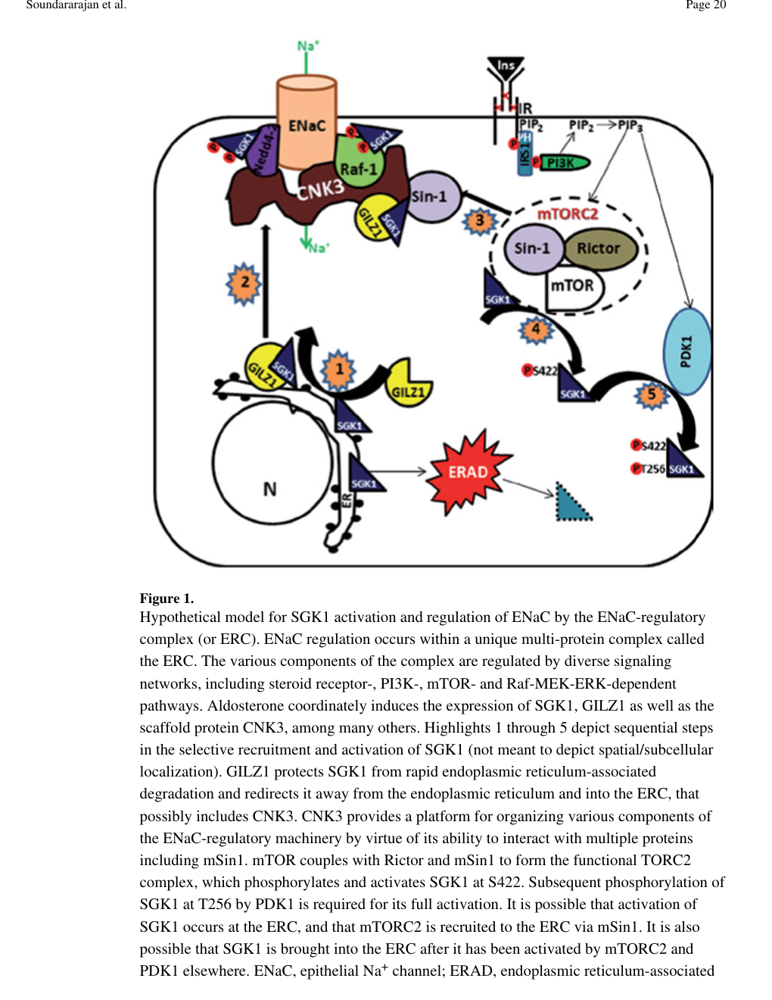

## Question

# Gene Research for Functional Annotation

## ⚠️ CRITICAL: Gene/Protein Identification Context

**BEFORE YOU BEGIN RESEARCH:** You MUST verify you are researching the CORRECT gene/protein. Gene symbols can be ambiguous, especially for less well-characterized genes from non-model organisms.

### Target Gene/Protein Identity (from UniProt):
- **UniProt Accession:** Q6P9H4
- **Protein Description:** RecName: Full=Connector enhancer of kinase suppressor of ras 3; Short=Connector enhancer of KSR 3; AltName: Full=CNK homolog protein 3; Short=CNK3; AltName: Full=CNKSR family member 3; AltName: Full=Maguin-like protein;
- **Gene Information:** Name=CNKSR3; Synonyms=MAGI1;
- **Organism (full):** Homo sapiens (Human).
- **Protein Family:** Belongs to the CNKSR family. .
- **Key Domains:** CNK1-3_SAM. (IPR049628); CNK2/3_dom. (IPR010599); CNKSR. (IPR051566); CRIC_domain. (IPR017874); PDZ. (IPR001478)

### MANDATORY VERIFICATION STEPS:

1. **Check if the gene symbol "CNKSR3" matches the protein description above**
2. **Verify the organism is correct:** Homo sapiens (Human).
3. **Check if protein family/domains align with what you find in literature**
4. **If you find literature for a DIFFERENT gene with the same or similar symbol, STOP**

### If Gene Symbol is Ambiguous or You Cannot Find Relevant Literature:

**DO NOT PROCEED WITH RESEARCH ON A DIFFERENT GENE.** Instead:
- State clearly: "The gene symbol 'CNKSR3' is ambiguous or literature is limited for this specific protein"
- Explain what you found (e.g., "Found extensive literature on a different gene with the same symbol in a different organism")
- Describe the protein based ONLY on the UniProt information provided above
- Suggest that the protein function can be inferred from domain/family information

### Research Target:

Please provide a comprehensive research report on the gene **CNKSR3** (gene ID: MAGI1, UniProt: Q6P9H4) in human.

The research report should be a detailed narrative explaining the function, biological processes, and localization of the gene product. Citations should be given for all claims.

You should prioritize authoritative reviews and primary scientific literature when conducting research. You can supplement
this with annotations you find in gene/protein databases, but these can be outdated or inaccurate.

We are specifically interested in the primary function of the gene - for enzymes, what reaction is catalyzed, and what is the substrate specificity? For transporters, what is the substrate? For structural proteins or adapters, what is the broader structural role? For signaling molecules, what is the role in the pathway.

We are interested in where in or outside the cell the gene product carries out its function.

We are also interested in the signaling or biochemical pathways in which the gene functions. We are less interested in broad pleiotropic effects, except where these elucidate the precise role.

Include evidence where possible. We are interested in both experimental evidence as well as inference from structure, evolution, or bioinformatic analysis. Precise studies should be prioritized over high-throughput, where available.

## Output

Question: You are an expert researcher providing comprehensive, well-cited information.

Provide detailed information focusing on:
1. Key concepts and definitions with current understanding
2. Recent developments and latest research (prioritize 2023-2024 sources)
3. Current applications and real-world implementations
4. Expert opinions and analysis from authoritative sources
5. Relevant statistics and data from recent studies

Format as a comprehensive research report with proper citations. Include URLs and publication dates where available.
Always prioritize recent, authoritative sources and provide specific citations for all major claims.

# Gene Research for Functional Annotation

## ⚠️ CRITICAL: Gene/Protein Identification Context

**BEFORE YOU BEGIN RESEARCH:** You MUST verify you are researching the CORRECT gene/protein. Gene symbols can be ambiguous, especially for less well-characterized genes from non-model organisms.

### Target Gene/Protein Identity (from UniProt):
- **UniProt Accession:** Q6P9H4
- **Protein Description:** RecName: Full=Connector enhancer of kinase suppressor of ras 3; Short=Connector enhancer of KSR 3; AltName: Full=CNK homolog protein 3; Short=CNK3; AltName: Full=CNKSR family member 3; AltName: Full=Maguin-like protein;
- **Gene Information:** Name=CNKSR3; Synonyms=MAGI1;
- **Organism (full):** Homo sapiens (Human).
- **Protein Family:** Belongs to the CNKSR family. .
- **Key Domains:** CNK1-3_SAM. (IPR049628); CNK2/3_dom. (IPR010599); CNKSR. (IPR051566); CRIC_domain. (IPR017874); PDZ. (IPR001478)

### MANDATORY VERIFICATION STEPS:

1. **Check if the gene symbol "CNKSR3" matches the protein description above**
2. **Verify the organism is correct:** Homo sapiens (Human).
3. **Check if protein family/domains align with what you find in literature**
4. **If you find literature for a DIFFERENT gene with the same or similar symbol, STOP**

### If Gene Symbol is Ambiguous or You Cannot Find Relevant Literature:

**DO NOT PROCEED WITH RESEARCH ON A DIFFERENT GENE.** Instead:
- State clearly: "The gene symbol 'CNKSR3' is ambiguous or literature is limited for this specific protein"
- Explain what you found (e.g., "Found extensive literature on a different gene with the same symbol in a different organism")
- Describe the protein based ONLY on the UniProt information provided above
- Suggest that the protein function can be inferred from domain/family information

### Research Target:

Please provide a comprehensive research report on the gene **CNKSR3** (gene ID: MAGI1, UniProt: Q6P9H4) in human.

The research report should be a detailed narrative explaining the function, biological processes, and localization of the gene product. Citations should be given for all claims.

You should prioritize authoritative reviews and primary scientific literature when conducting research. You can supplement
this with annotations you find in gene/protein databases, but these can be outdated or inaccurate.

We are specifically interested in the primary function of the gene - for enzymes, what reaction is catalyzed, and what is the substrate specificity? For transporters, what is the substrate? For structural proteins or adapters, what is the broader structural role? For signaling molecules, what is the role in the pathway.

We are interested in where in or outside the cell the gene product carries out its function.

We are also interested in the signaling or biochemical pathways in which the gene functions. We are less interested in broad pleiotropic effects, except where these elucidate the precise role.

Include evidence where possible. We are interested in both experimental evidence as well as inference from structure, evolution, or bioinformatic analysis. Precise studies should be prioritized over high-throughput, where available.

## Research report: CNKSR3 (UniProt Q6P9H4) functional annotation (Homo sapiens)

### 0) Target verification (critical disambiguation)
The research target here is **CNKSR family member 3 (CNKSR3)**, also called **CNK3** or **connector enhancer of kinase suppressor of Ras 3**, a **CNK-family multidomain scaffold/adaptor** implicated in aldosterone-dependent renal sodium handling. This identity is consistently used in mechanistic renal physiology literature describing a SAM–CRIC–PDZ protein regulating ENaC and MAPK signaling (soundararajan2012theroleof pages 5-7, soundararajan2012organizationofthe pages 11-12, soundararajan2012theroleof pages 4-5). 

The synonym string sometimes encountered in resources (e.g., “MAGI1”) is potentially misleading in this context: **MAGI1** is widely used for a different multi-PDZ tight-junction scaffold (not supported by the mechanistic CNK3/ENaC literature retrieved here). No mechanistic source in this evidence set uses MAGI1 as the accepted symbol for CNKSR3 (soundararajan2012theroleof pages 5-7, soundararajan2012organizationofthe pages 11-12).

### 1) Key concepts and definitions (current understanding)

#### 1.1 CNKSR3 is a modular scaffold/adaptor
CNKSR3 (CNK3) is described as the **third mammalian CNK isoform** with a modular architecture typical of scaffold proteins: **N-terminal SAM domain**, a **conserved CNK-specific region (CRIC)**, and a **PDZ domain** (soundararajan2012theroleof pages 5-7, soundararajan2012organizationofthe pages 11-12). Reviews further emphasize that CNKSR3 is **smaller than other CNK homologs** and **lacks the C-terminal region that harbors a pleckstrin homology (PH) domain** present in other family members (soundararajan2012theroleof pages 5-7, soundararajan2012theroleof pages 4-5). 

These domains support a “connector/enhancer” role rather than enzymatic catalysis:
- **SAM domain**: mediates protein–protein interactions via homo/heterodimerization (soundararajan2012organizationofthe pages 11-12).
- **CRIC domain**: a conserved interaction region in CNK proteins; has documented interaction roles in CNK-family contexts (soundararajan2012organizationofthe pages 11-12).
- **PDZ domain**: binds specific C-terminal motifs of partner proteins; PDZ-containing proteins frequently serve as **molecular scaffolds** assembling multi-protein complexes (soundararajan2012organizationofthe pages 11-12).

#### 1.2 ENaC-regulatory complex (ERC) concept
A central organizing concept in the CNKSR3 literature is the **ENaC-regulatory complex (ERC)**—a dynamic, multi-protein assembly at/near the plasma membrane that integrates aldosterone-driven signals (and other cues such as insulin/PI3K signaling) to control **ENaC surface expression and activity** (soundararajan2012theroleof pages 4-5, soundararajan2012theroleof pages 5-7, soundararajan2012organizationofthe media 483107b4). CNKSR3 is repeatedly proposed as a scaffold component of this ERC, coordinating stimulatory and inhibitory nodes (soundararajan2012theroleof pages 5-7, soundararajan2012organizationofthe pages 11-12).

### 2) Primary function, pathways, and cellular localization

#### 2.1 Primary function (physiology-level)
Across reviews and experimental summaries, CNKSR3 is positioned as an **aldosterone/mineralocorticoid receptor (MR)-regulated scaffold** that is **required for ENaC-mediated sodium transport** in aldosterone-responsive distal nephron epithelia (connecting tubule and cortical collecting duct) (soundararajan2012theroleof pages 5-7, valinsky2019aldosteroneandion pages 4-7, ziera2009identificationandfunctional pages 56-60). 

Importantly, CNKSR3 is **not an enzyme** and no catalytic reaction is attributed to it in this evidence set; rather it is a **regulatory adaptor** that shapes signaling and trafficking/regulatory protein assemblies controlling ENaC.

#### 2.2 Pathway role: aldosterone/MR → CNKSR3 → ENaC (via disinhibition)
A 2023 authoritative review of aldosterone renal action frames aldosterone-induced factors (including CNKSR3) as often acting via **disinhibition**—suppressing tonic inhibitory mechanisms (e.g., Raf-MAPK/ERK and Nedd4-2) rather than directly “turning on” transporters (johnston2023aldosteronerenalaction pages 34-36). Within this framework, CNKSR3 is described as participating in the dynamic assemblies that ultimately enhance ENaC-dependent Na+ reabsorption in response to aldosterone (johnston2023aldosteronerenalaction pages 34-36).

#### 2.3 Mechanistic linkage: suppression of Raf–MEK–ERK (MAPK) signaling
Mechanistically, CNKSR3 is repeatedly linked to modulation of the **Raf-1/MEK1/2/ERK1/2 (MAPK) cascade**:
- CNKSR3 expression is reported to **interfere with activation of the Raf-1/MEK/ERK pathway**, consistent with relief of ERK-mediated ENaC inhibition (soundararajan2012theroleof pages 5-7, soundararajan2012organizationofthe pages 11-12).
- In collecting-duct cell models, **CNKSR3 knockdown increases MEK/ERK phosphorylation**, and MEK inhibition (U0126) can increase ENaC-dependent transepithelial current in CNKSR3-silenced cells, supporting an ERK-dependent mechanism (ziera2009identificationandfunctional pages 60-63).

#### 2.4 Subcellular localization and interaction partners
The most directly stated localization in this evidence set is that CNKSR3 participates in a **plasma-membrane-localized ENaC regulatory complex**, consistent with a tethering/scaffold function (valinsky2019aldosteroneandion pages 4-7). In that context, CNKSR3 is reported to **interact with ENaC, SGK1, Raf-1, and Nedd4-2** in a membrane complex (valinsky2019aldosteroneandion pages 4-7). 

In addition, proteomics summarized in a 2012 review identified peptides from all three **PP2A** subunits as abundant CNK3 binding partners, suggesting phosphoregulation may be integrated into CNKSR3-centered scaffolding (soundararajan2012theroleof pages 5-7).

A schematic depiction of the ERC (including CNK3/CNKSR3 and core regulators such as SGK1, GILZ1, Nedd4-2, and Raf-1) is shown in Figure 1 of Soundararajan et al. 2012 (soundararajan2012organizationofthe media 483107b4).

### 3) Experimental evidence base (selected highlights)

#### 3.1 Direct MR target gene and aldosterone induction
Multiple sources converge on CNKSR3 being a **direct MR target gene**:
- Promoter-level regulation: CNKSR3’s promoter is described as harboring **two functional MR-binding loci** near the transcription start site (review summary) (soundararajan2012organizationofthe pages 11-12).
- ChIP and promoter-element mapping: ChIP-chip/ChIP-qPCR evidence identifies MR binding regions for cnksr3, and mutation analyses indicate **three of four** predicted GRE-like elements in a distal MR-binding region contribute to aldosterone responsiveness (ziera2009identificationandfunctional pages 63-65).
- Quantitative induction: In a review of aldosterone-ion channel regulation, aldosterone (1 nM) is reported to drive ~**3-fold** increase in CNKSR3 mRNA alongside MR binding at two promoter regions (valinsky2019aldosteroneandion pages 4-7).

#### 3.2 Requirement for ENaC-mediated sodium transport
Functional perturbation experiments support necessity:
- CNKSR3 knockdown: An **~80% reduction** in CNKSR3 mRNA was associated with an **~75% decrease** in ENaC-mediated short-circuit current (valinsky2019aldosteroneandion pages 4-7).
- Overexpression/knockdown in collecting-duct models: CNKSR3 overexpression increased ENaC-dependent transepithelial Na+ transport, while silencing “almost abrogated” transport in an aldosterone-responsive collecting-duct cell model (ziera2009identificationandfunctional pages 56-60).

### 4) Recent developments (prioritizing 2023–2024)

#### 4.1 2023: Integration into modern aldosterone physiology models
A 2023 **Comprehensive Physiology** review explicitly includes CNKSR3 among aldosterone-regulated genes participating in dynamic assemblies that increase Na+ absorption by suppressing tonic inhibitors of ENaC (johnston2023aldosteronerenalaction pages 34-36). 
- Publication date/URL: March 2023; https://doi.org/10.1002/cphy.c190043 (johnston2023aldosteronerenalaction pages 34-36).

#### 4.2 2024: Human genetic association with diabetic kidney disease (DKD)
A 2024 **Frontiers in Endocrinology** review summarizes genome-wide association evidence implicating a locus near **SCAF8/CNKSR3** in DKD risk:
- Variant: **rs12523822** near SCAF8/CNKSR3.
- Reported association: **OR = 0.73**, **p = 1.3×10−8** (meta-analysis of T1D+T2D DKD; **5,226 cases vs 8,510 controls**). A transethnic analysis reported a ~**43% lower risk** in American Indians (**p = 5.7×10−9**) (sandholm2023geneticandepigenetic pages 3-5).
The review further provides mechanistic plausibility by reiterating CNKSR3 as a **direct MR target**, **highly expressed in renal cortical collecting ducts**, **involved in transepithelial sodium transport**, and **upregulated by physiologic aldosterone** (sandholm2023geneticandepigenetic pages 3-5).
- Publication date/URL: May 2024; https://doi.org/10.3389/fendo.2023.1163001 (sandholm2023geneticandepigenetic pages 3-5).

#### 4.3 2024: Epigenetic study (Agent Orange exposure and T2D)
A 2024 epigenetic/genetic study in Korean veterans reported CNKSR3 among genes linked to significant CpGs in the context of Agent Orange exposure and type 2 diabetes (T2D). In the excerpt, CNKSR3 is described as **highly expressed in renal collecting ducts**, **regulating sodium transport**, and **upregulated by aldosterone** (seo2024epigeneticlinkbetween pages 9-10). The study reported **2,135 AO-related differentially methylated positions (DMPs)** overall, but the provided excerpt does not include CNKSR3-specific CpG identifiers or effect sizes (seo2024epigeneticlinkbetween pages 9-10).
- Publication date/URL: July 2024; https://doi.org/10.3389/fendo.2024.1375459 (seo2024epigeneticlinkbetween pages 9-10).

### 5) Current applications and real-world implementations

#### 5.1 Disease relevance: blood pressure and renal disease pathways
Given CNKSR3’s role in aldosterone/MR-dependent ENaC control (central to sodium balance and blood pressure regulation), the gene is mechanistically relevant to disorders of sodium handling, including hypertension-related phenotypes, though definitive clinical translation remains limited in the retrieved primary mechanistic evidence (valinsky2019aldosteroneandion pages 4-7, soundararajan2012organizationofthe pages 11-12).

#### 5.2 Human genetics–anchored translational relevance (DKD)
The DKD GWAS signal near SCAF8/CNKSR3 provides a human genetic anchor suggesting CNKSR3-regulated physiology may influence DKD susceptibility (sandholm2023geneticandepigenetic pages 3-5). This positions CNKSR3 as a **candidate gene for mechanistic follow-up** (e.g., eQTL colocalization in kidney, functional allelic assays in collecting-duct models), though the 2024 review itself emphasizes that many GWAS hits are noncoding and target-gene assignment requires additional regulatory mapping (sandholm2023geneticandepigenetic pages 3-5).

#### 5.3 Platform-level evidence: hypothesis generation for pregnancy-induced hypertension and glomerulonephritis
Open Targets aggregates GWAS credible-set evidence connecting CNKSR3 to **pregnancy-induced hypertension** and **glomerulonephritis** (OpenTargets Search: -CNKSR3). These are best treated as **hypothesis-generating associations** rather than confirmed mechanisms, but they are consistent with CNKSR3’s role in kidney sodium handling pathways.
- URL: https://platform.opentargets.org/target/ENSG00000153721 (OpenTargets Search: -CNKSR3).

### 6) Expert opinions and open questions (authoritative synthesis)
Renal physiology reviews characterize CNKSR3 as a plausible **hormone-induced scaffold** that helps organize ENaC regulatory machinery and suppress inhibitory signaling (Raf–MEK–ERK and/or Nedd4-2 mediated effects), thereby enabling aldosterone-stimulated sodium reabsorption (johnston2023aldosteronerenalaction pages 34-36, soundararajan2012theroleof pages 5-7, soundararajan2012organizationofthe pages 11-12). 

However, expert sources also explicitly highlight key remaining uncertainties:
- Whether CNKSR3 **directly binds ENaC** and whether it changes **ENaC surface expression versus open probability** remain unresolved in the summarized evidence (soundararajan2012organizationofthe pages 11-12, soundararajan2012organizationofthe pages 12-14).
- The precise ERC composition and how it varies by time/compartment (e.g., lipid raft association) are noted as open questions (soundararajan2012organizationofthe pages 12-14).

### 7) Relevant statistics and data summary
- Aldosterone induction (reviewed experimental summary): CNKSR3 mRNA ~**3-fold** increased after **1 nM aldosterone** with MR promoter binding (valinsky2019aldosteroneandion pages 4-7).
- Functional perturbation: **~80%** CNKSR3 knockdown → **~75%** decrease in ENaC-mediated short-circuit current (valinsky2019aldosteroneandion pages 4-7).
- Human genetics (DKD): **rs12523822 near SCAF8/CNKSR3**, **OR 0.73**, **p = 1.3×10−8** (5,226 cases/8,510 controls); transethnic American Indian result indicating ~**43% lower DKD risk**, **p = 5.7×10−9** (sandholm2023geneticandepigenetic pages 3-5).

### Evidence summary table
The following table compiles key mechanistic, interaction, and 2023–2024 translational evidence, including quantitative statistics and URLs/DOIs.

| Claim/Topic | Key findings | Evidence type (review/primary/GWAS/epigenetic/database) | Species/cell context | Quantitative data | Source (author year, journal) | URL/DOI |
|---|---|---|---|---|---|---|
| Identity verification | Target literature matches **CNKSR3/CNK3** = connector enhancer of kinase suppressor of Ras 3, a CNK-family scaffold; retrieved mechanistic sources do **not** support conflation with **MAGI1** | Review synthesis | Human/mammalian renal physiology literature | None reported | Soundararajan et al. 2012, *Mol Cell Endocrinol*; Soundararajan et al. 2012, *Crit Rev Biochem Mol Biol* (soundararajan2012organizationofthe pages 11-12, soundararajan2012theroleof pages 5-7) | https://doi.org/10.1016/j.mce.2011.11.003 ; https://doi.org/10.3109/10409238.2012.678285 |
| Domain architecture | CNKSR3 has **SAM**, **CRIC**, and **PDZ** domains; reviews note it is smaller than other CNKs and lacks the C-terminal **PH** domain present in other family members | Review | Mammalian CNK family; renal epithelial context | No effect size | Soundararajan et al. 2012, *Mol Cell Endocrinol*; Soundararajan et al. 2012, *Crit Rev Biochem Mol Biol* (soundararajan2012theroleof pages 5-7, soundararajan2012theroleof pages 4-5, soundararajan2012organizationofthe pages 11-12) | https://doi.org/10.1016/j.mce.2011.11.003 ; https://doi.org/10.3109/10409238.2012.678285 |
| Inferred molecular role | Modular architecture supports a **scaffold/adaptor** role organizing aldosterone-responsive ENaC-regulatory machinery and modulating **Raf-1/MEK/ERK** signaling | Review/primary summary | Renal collecting duct epithelial models | No single numeric estimate | Ziera 2009; Soundararajan et al. 2012 (soundararajan2012theroleof pages 5-7, ziera2009identificationandfunctional pages 56-60) | https://doi.org/10.14279/depositonce-2286 ; https://doi.org/10.1016/j.mce.2011.11.003 |
| Direct MR target gene | CNKSR3 is a **direct mineralocorticoid receptor (MR) target**; promoter harbors MR-binding loci and distal GRE cluster contributing to aldosterone responsiveness | Primary + review summary | HEK293-hMR+, M1-rMR+ cells; collecting duct | MR binding at **2 promoter regions**; **3 of 4** predicted GREs in distal region contributed in mutation analysis | Ziera 2009; Soundararajan et al. 2012 (ziera2009identificationandfunctional pages 63-65, soundararajan2012organizationofthe pages 11-12, soundararajan2012theroleof pages 5-7) | https://doi.org/10.14279/depositonce-2286 ; https://doi.org/10.3109/10409238.2012.678285 ; https://doi.org/10.1016/j.mce.2011.11.003 |
| Aldosterone induction | Aldosterone induces CNKSR3 transcript expression downstream of MR | Primary/review summary | Distal nephron/collecting duct models | **~3-fold** increase in CNKSR3 mRNA after **1 nM aldosterone**; qPCR induction after **4 h, 10 nM aldosterone** also reported | Valinsky et al. 2019, *Vitam Horm*; Ziera 2009 (valinsky2019aldosteroneandion pages 4-7, ziera2009identificationandfunctional pages 56-60) | https://doi.org/10.1016/bs.vh.2018.10.004 ; https://doi.org/10.14279/depositonce-2286 |
| Tissue/localization pattern | High expression in **connecting tubule (CNT)** and **cortical collecting duct (CCD)**, the aldosterone-sensitive nephron segments | Primary/review summary | Kidney distal nephron | No single numeric estimate | Ziera 2009; Soundararajan et al. 2012 (ziera2009identificationandfunctional pages 63-65, soundararajan2012theroleof pages 5-7, valinsky2019aldosteroneandion pages 4-7) | https://doi.org/10.14279/depositonce-2286 ; https://doi.org/10.1016/j.mce.2011.11.003 ; https://doi.org/10.1016/bs.vh.2018.10.004 |
| ENaC regulation: necessity | CNKSR3 is required for **ENaC-mediated Na+ transport**; knockdown strongly impairs amiloride-sensitive current | Primary/review summary | Collecting duct epithelial cells / short-circuit current assays | **~80%** CNKSR3 knockdown caused **~75%** decrease in ENaC-mediated short-circuit current; shRNA silencing “almost abrogated” transport | Valinsky et al. 2019; Ziera 2009 (valinsky2019aldosteroneandion pages 4-7, ziera2009identificationandfunctional pages 56-60) | https://doi.org/10.1016/bs.vh.2018.10.004 ; https://doi.org/10.14279/depositonce-2286 |
| ENaC regulation: sufficiency | CNKSR3 overexpression enhances aldosterone-dependent ENaC-mediated transepithelial Na+ transport | Primary | M1-rMR+ collecting duct model | Directional increase reported; no precise fold value in retrieved excerpts | Ziera 2009 (ziera2009identificationandfunctional pages 56-60, ziera2009identificationandfunctional pages 60-63) | https://doi.org/10.14279/depositonce-2286 |
| MAPK/ERK mechanism | CNKSR3 restrains **Raf-1/MEK/ERK** signaling; loss of CNKSR3 increases MEK1/2 and ERK1/2 phosphorylation, consistent with relief of tonic ENaC inhibition | Primary/review summary | M1-rMR+ cells; renal epithelial context | Knockdown increased phospho-MEK1/2 and phospho-ERK1/2; MEK inhibitor **U0126** markedly increased ΔISC in CNKSR3-silenced cells | Ziera 2009; Soundararajan et al. 2012; Valinsky et al. 2019 (ziera2009identificationandfunctional pages 60-63, soundararajan2012theroleof pages 5-7, valinsky2019aldosteroneandion pages 4-7) | https://doi.org/10.14279/depositonce-2286 ; https://doi.org/10.1016/j.mce.2011.11.003 ; https://doi.org/10.1016/bs.vh.2018.10.004 |
| Interaction partners / ERC | CNKSR3 is proposed/observed in an **ENaC regulatory complex (ERC)** with **ENaC, SGK1, Raf-1, Nedd4-2** at/near the plasma membrane; GILZ may cooperate functionally, though direct inclusion was not consistently detected | Review/primary summary | Distal nephron epithelial models | No stoichiometric values | Valinsky et al. 2019; Soundararajan et al. 2012 (valinsky2019aldosteroneandion pages 4-7, soundararajan2012theroleof pages 5-7, soundararajan2012organizationofthe media 483107b4) | https://doi.org/10.1016/bs.vh.2018.10.004 ; https://doi.org/10.1016/j.mce.2011.11.003 |
| Additional binding partners | Proteomics identified peptides from all three **PP2A** subunits as abundant CNKSR3-associated proteins, suggesting phosphoregulation-linked scaffolding | Review citing proteomics | Renal epithelial context | “Most abundant binding partners” in cited proteomics; no numeric enrichment in retrieved excerpt | Soundararajan et al. 2012 (soundararajan2012theroleof pages 5-7) | https://doi.org/10.1016/j.mce.2011.11.003 |
| Expert interpretation | Reviews argue CNKSR3 likely acts as a **hormone-induced scaffolding platform** that disinhibits ENaC by coordinating stimulatory and inhibitory nodes, but direct effects on ENaC surface abundance vs. channel open probability remain unresolved | Review/expert opinion | Renal physiology | No quantitative metric | Johnston et al. 2023, *Compr Physiol*; Soundararajan et al. 2012 (johnston2023aldosteronerenalaction pages 34-36, soundararajan2012organizationofthe pages 11-12) | https://doi.org/10.1002/cphy.c190043 ; https://doi.org/10.3109/10409238.2012.678285 |
| 2023 development | Recent renal physiology review places CNKSR3 among aldosterone-induced genes that increase Na+ transport mainly by **suppressing tonic inhibitory mechanisms** rather than directly activating transporters | Review | Kidney/aldosterone physiology | No CNKSR3-specific fold value in this review | Johnston et al. 2023, *Compr Physiol* (johnston2023aldosteronerenalaction pages 34-36) | https://doi.org/10.1002/cphy.c190043 |
| 2024 development: DKD genetics | A **GWAS/meta-analysis** implicated a locus near **SCAF8/CNKSR3** in diabetic kidney disease (DKD), giving human genetic support for kidney relevance | GWAS/review | Human, transethnic DKD cohorts | **rs12523822**; **OR 0.73**; **p = 1.3×10−8** in T1D+T2D DKD meta-analysis; **43% lower risk** in American Indians with **p = 5.7×10−9**; **5,226 cases / 8,510 controls**; final meta-analysis **13,736 participants** | Sandholm et al. 2024, *Front Endocrinol* (sandholm2023geneticandepigenetic pages 3-5) | https://doi.org/10.3389/fendo.2023.1163001 |
| 2024 development: epigenetics | Epigenetic study in Korean veterans linked significant T2D-associated CpGs to **CNKSR3**, highlighting it as a collecting-duct/aldosterone-responsive candidate in metabolic-kidney disease context | Epigenetic study | Human blood methylation/genotype analysis | Study reported **2,135 AO-related DMPs** overall; CNKSR3 named among genes with significant CpGs, but no CNKSR3-specific effect size/p-value in retrieved excerpt | Seo et al. 2024, *Front Endocrinol* (seo2024epigeneticlinkbetween pages 9-10) | https://doi.org/10.3389/fendo.2024.1375459 |
| Disease association aggregation | Open Targets links CNKSR3 to **pregnancy-induced hypertension** and **glomerulonephritis** via GWAS credible-set evidence; these are hypothesis-generating rather than definitive mechanistic proof | Database aggregation | Human disease genetics aggregation | Evidence size **5** for listed disease associations in retrieved output | Open Targets Platform query (2025 platform paper cited by tool) (OpenTargets Search: -CNKSR3) | https://platform.opentargets.org/target/ENSG00000153721 |

*Table: This table compiles the main mechanistic, experimental, and recent human genetics evidence for human CNKSR3 (UniProt Q6P9H4). It highlights domain structure, aldosterone/MR and ENaC functions, interaction partners, and 2023–2024 disease-relevant findings with quantitative statistics where available.*

### Visual evidence: ENaC-regulatory complex model
A schematic model of the ENaC-regulatory complex including CNK3/CNKSR3 and key interacting regulators is shown in Soundararajan et al. (2012), Figure 1 (soundararajan2012organizationofthe media 483107b4).

---

### Key references (publication dates and URLs)
- Johnston JG et al. **Aldosterone: Renal Action and Physiological Effects.** *Comprehensive Physiology* (Mar **2023**). https://doi.org/10.1002/cphy.c190043 (johnston2023aldosteronerenalaction pages 34-36)
- Sandholm N et al. **Genetic and epigenetic background of diabetic kidney disease.** *Frontiers in Endocrinology* (May **2024**; DOI minted 2023). https://doi.org/10.3389/fendo.2023.1163001 (sandholm2023geneticandepigenetic pages 3-5)
- Seo S et al. **Epigenetic link between Agent Orange exposure and type 2 diabetes in Korean veterans.** *Frontiers in Endocrinology* (Jul **2024**). https://doi.org/10.3389/fendo.2024.1375459 (seo2024epigeneticlinkbetween pages 9-10)
- Soundararajan R et al. **Organization of the ENaC-regulatory machinery.** *Critical Reviews in Biochemistry and Molecular Biology* (Jun **2012**). https://doi.org/10.3109/10409238.2012.678285 (soundararajan2012organizationofthe pages 11-12)
- Soundararajan R et al. **The role of the ENaC-regulatory complex in aldosterone-mediated sodium transport.** *Molecular and Cellular Endocrinology* (Mar **2012**). https://doi.org/10.1016/j.mce.2011.11.003 (soundararajan2012theroleof pages 5-7)
- Valinsky WC et al. **Aldosterone and Ion Channels.** *Vitamins and Hormones* (Jan **2019**). https://doi.org/10.1016/bs.vh.2018.10.004 (valinsky2019aldosteroneandion pages 4-7)
- Open Targets Platform: CNKSR3 target page (accessed 2026-05-30). https://platform.opentargets.org/target/ENSG00000153721 (OpenTargets Search: -CNKSR3)

### Limitations of this report
Some foundational primary results (notably the peer-reviewed FASEB Journal 2009 paper referenced by reviews) were not directly retrievable in this run, so several mechanistic claims rely on authoritative review summaries of those experiments. Where this occurs, the report labels the evidence as “review summary” and cites the reviewing source(s) (soundararajan2012theroleof pages 5-7, soundararajan2012organizationofthe pages 11-12, valinsky2019aldosteroneandion pages 4-7).

References

1. (soundararajan2012theroleof pages 5-7): Rama Soundararajan, David Pearce, and Tim Ziera. The role of the enac-regulatory complex in aldosterone-mediated sodium transport. Molecular and Cellular Endocrinology, 350:242-247, Mar 2012. URL: https://doi.org/10.1016/j.mce.2011.11.003, doi:10.1016/j.mce.2011.11.003. This article has 107 citations and is from a peer-reviewed journal.

2. (soundararajan2012organizationofthe pages 11-12): Rama Soundararajan, Ming Lu, and David Pearce. Organization of the enac-regulatory machinery. Critical Reviews in Biochemistry and Molecular Biology, 47:349-359, Jun 2012. URL: https://doi.org/10.3109/10409238.2012.678285, doi:10.3109/10409238.2012.678285. This article has 54 citations and is from a peer-reviewed journal.

3. (soundararajan2012theroleof pages 4-5): Rama Soundararajan, David Pearce, and Tim Ziera. The role of the enac-regulatory complex in aldosterone-mediated sodium transport. Molecular and Cellular Endocrinology, 350:242-247, Mar 2012. URL: https://doi.org/10.1016/j.mce.2011.11.003, doi:10.1016/j.mce.2011.11.003. This article has 107 citations and is from a peer-reviewed journal.

4. (soundararajan2012organizationofthe media 483107b4): Rama Soundararajan, Ming Lu, and David Pearce. Organization of the enac-regulatory machinery. Critical Reviews in Biochemistry and Molecular Biology, 47:349-359, Jun 2012. URL: https://doi.org/10.3109/10409238.2012.678285, doi:10.3109/10409238.2012.678285. This article has 54 citations and is from a peer-reviewed journal.

5. (valinsky2019aldosteroneandion pages 4-7): William C. Valinsky, Rhian M. Touyz, and Alvin Shrier. Aldosterone and ion channels. Vitamins and hormones, 109:105-131, Jan 2019. URL: https://doi.org/10.1016/bs.vh.2018.10.004, doi:10.1016/bs.vh.2018.10.004. This article has 23 citations.

6. (ziera2009identificationandfunctional pages 56-60): Tim Ziera. Identification and functional characterization of the novel mineralocorticoid receptor target gene cnksr3. ArXiv, Nov 2009. URL: https://doi.org/10.14279/depositonce-2286, doi:10.14279/depositonce-2286. This article has 0 citations.

7. (johnston2023aldosteronerenalaction pages 34-36): Jermaine G. Johnston, Amanda K. Welch, Brian D. Cain, Peter P. Sayeski, Michelle L. Gumz, and Charles S. Wingo. Aldosterone: renal action and physiological effects. Comprehensive Physiology, 13 2:4409-4491, Mar 2023. URL: https://doi.org/10.1002/cphy.c190043, doi:10.1002/cphy.c190043. This article has 35 citations and is from a peer-reviewed journal.

8. (ziera2009identificationandfunctional pages 60-63): Tim Ziera. Identification and functional characterization of the novel mineralocorticoid receptor target gene cnksr3. ArXiv, Nov 2009. URL: https://doi.org/10.14279/depositonce-2286, doi:10.14279/depositonce-2286. This article has 0 citations.

9. (ziera2009identificationandfunctional pages 63-65): Tim Ziera. Identification and functional characterization of the novel mineralocorticoid receptor target gene cnksr3. ArXiv, Nov 2009. URL: https://doi.org/10.14279/depositonce-2286, doi:10.14279/depositonce-2286. This article has 0 citations.

10. (sandholm2023geneticandepigenetic pages 3-5): Niina Sandholm, Emma H. Dahlström, and Per-Henrik Groop. Genetic and epigenetic background of diabetic kidney disease. Frontiers in Endocrinology, May 2024. URL: https://doi.org/10.3389/fendo.2023.1163001, doi:10.3389/fendo.2023.1163001. This article has 32 citations.

11. (seo2024epigeneticlinkbetween pages 9-10): Sujin Seo, Ye An Kim, Young Lee, Young Jin Kim, Bong-Jo Kim, Jae Hoon An, Heejin Jin, Ah Ra Do, Kyungtaek Park, Sungho Won, and Je Hyun Seo. Epigenetic link between agent orange exposure and type 2 diabetes in korean veterans. Frontiers in Endocrinology, Jul 2024. URL: https://doi.org/10.3389/fendo.2024.1375459, doi:10.3389/fendo.2024.1375459. This article has 1 citations.

12. (OpenTargets Search: -CNKSR3): Open Targets Query (-CNKSR3, 5 results). Buniello, A. et al. (2025). Open Targets Platform: facilitating therapeutic hypotheses building in drug discovery. Nucleic Acids Research.

13. (soundararajan2012organizationofthe pages 12-14): Rama Soundararajan, Ming Lu, and David Pearce. Organization of the enac-regulatory machinery. Critical Reviews in Biochemistry and Molecular Biology, 47:349-359, Jun 2012. URL: https://doi.org/10.3109/10409238.2012.678285, doi:10.3109/10409238.2012.678285. This article has 54 citations and is from a peer-reviewed journal.

## Artifacts

- [Edison artifact artifact-00](MAGI1-deep-research-falcon_artifacts/artifact-00.md)

## Citations

1. soundararajan2012organizationofthe pages 11-12
2. johnston2023aldosteronerenalaction pages 34-36
3. ziera2009identificationandfunctional pages 60-63
4. valinsky2019aldosteroneandion pages 4-7
5. soundararajan2012theroleof pages 5-7
6. ziera2009identificationandfunctional pages 63-65
7. ziera2009identificationandfunctional pages 56-60
8. sandholm2023geneticandepigenetic pages 3-5
9. seo2024epigeneticlinkbetween pages 9-10
10. soundararajan2012organizationofthe pages 12-14
11. soundararajan2012theroleof pages 4-5
12. https://doi.org/10.1002/cphy.c190043
13. https://doi.org/10.3389/fendo.2023.1163001
14. https://doi.org/10.3389/fendo.2024.1375459
15. https://platform.opentargets.org/target/ENSG00000153721
16. https://doi.org/10.1016/j.mce.2011.11.003
17. https://doi.org/10.3109/10409238.2012.678285
18. https://doi.org/10.14279/depositonce-2286
19. https://doi.org/10.1016/bs.vh.2018.10.004
20. https://doi.org/10.1016/j.mce.2011.11.003,
21. https://doi.org/10.3109/10409238.2012.678285,
22. https://doi.org/10.1016/bs.vh.2018.10.004,
23. https://doi.org/10.14279/depositonce-2286,
24. https://doi.org/10.1002/cphy.c190043,
25. https://doi.org/10.3389/fendo.2023.1163001,
26. https://doi.org/10.3389/fendo.2024.1375459,