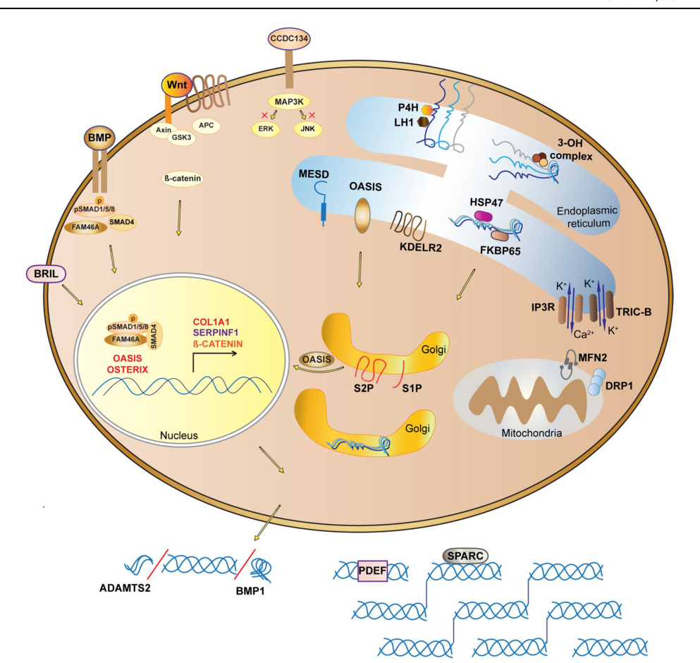

## Question

# Gene Research for Functional Annotation

## ⚠️ CRITICAL: Gene/Protein Identification Context

**BEFORE YOU BEGIN RESEARCH:** You MUST verify you are researching the CORRECT gene/protein. Gene symbols can be ambiguous, especially for less well-characterized genes from non-model organisms.

### Target Gene/Protein Identity (from UniProt):
- **UniProt Accession:** P08123
- **Protein Description:** RecName: Full=Collagen alpha-2(I) chain; AltName: Full=Alpha-2 type I collagen; Flags: Precursor;
- **Gene Information:** Name=COL1A2;
- **Organism (full):** Homo sapiens (Human).
- **Protein Family:** Belongs to the fibrillar collagen family.
- **Key Domains:** Collagen. (IPR008160); Collagen_superfamily. (IPR050149); Fib_collagen_C. (IPR000885); COLFI (PF01410); Collagen (PF01391)

### MANDATORY VERIFICATION STEPS:

1. **Check if the gene symbol "COL1A2" matches the protein description above**
2. **Verify the organism is correct:** Homo sapiens (Human).
3. **Check if protein family/domains align with what you find in literature**
4. **If you find literature for a DIFFERENT gene with the same or similar symbol, STOP**

### If Gene Symbol is Ambiguous or You Cannot Find Relevant Literature:

**DO NOT PROCEED WITH RESEARCH ON A DIFFERENT GENE.** Instead:
- State clearly: "The gene symbol 'COL1A2' is ambiguous or literature is limited for this specific protein"
- Explain what you found (e.g., "Found extensive literature on a different gene with the same symbol in a different organism")
- Describe the protein based ONLY on the UniProt information provided above
- Suggest that the protein function can be inferred from domain/family information

### Research Target:

Please provide a comprehensive research report on the gene **COL1A2** (gene ID: COL1A2, UniProt: P08123) in human.

The research report should be a detailed narrative explaining the function, biological processes, and localization of the gene product. Citations should be given for all claims.

You should prioritize authoritative reviews and primary scientific literature when conducting research. You can supplement
this with annotations you find in gene/protein databases, but these can be outdated or inaccurate.

We are specifically interested in the primary function of the gene - for enzymes, what reaction is catalyzed, and what is the substrate specificity? For transporters, what is the substrate? For structural proteins or adapters, what is the broader structural role? For signaling molecules, what is the role in the pathway.

We are interested in where in or outside the cell the gene product carries out its function.

We are also interested in the signaling or biochemical pathways in which the gene functions. We are less interested in broad pleiotropic effects, except where these elucidate the precise role.

Include evidence where possible. We are interested in both experimental evidence as well as inference from structure, evolution, or bioinformatic analysis. Precise studies should be prioritized over high-throughput, where available.

## Output

Question: You are an expert researcher providing comprehensive, well-cited information.

Provide detailed information focusing on:
1. Key concepts and definitions with current understanding
2. Recent developments and latest research (prioritize 2023-2024 sources)
3. Current applications and real-world implementations
4. Expert opinions and analysis from authoritative sources
5. Relevant statistics and data from recent studies

Format as a comprehensive research report with proper citations. Include URLs and publication dates where available.
Always prioritize recent, authoritative sources and provide specific citations for all major claims.

# Gene Research for Functional Annotation

## ⚠️ CRITICAL: Gene/Protein Identification Context

**BEFORE YOU BEGIN RESEARCH:** You MUST verify you are researching the CORRECT gene/protein. Gene symbols can be ambiguous, especially for less well-characterized genes from non-model organisms.

### Target Gene/Protein Identity (from UniProt):
- **UniProt Accession:** P08123
- **Protein Description:** RecName: Full=Collagen alpha-2(I) chain; AltName: Full=Alpha-2 type I collagen; Flags: Precursor;
- **Gene Information:** Name=COL1A2;
- **Organism (full):** Homo sapiens (Human).
- **Protein Family:** Belongs to the fibrillar collagen family.
- **Key Domains:** Collagen. (IPR008160); Collagen_superfamily. (IPR050149); Fib_collagen_C. (IPR000885); COLFI (PF01410); Collagen (PF01391)

### MANDATORY VERIFICATION STEPS:

1. **Check if the gene symbol "COL1A2" matches the protein description above**
2. **Verify the organism is correct:** Homo sapiens (Human).
3. **Check if protein family/domains align with what you find in literature**
4. **If you find literature for a DIFFERENT gene with the same or similar symbol, STOP**

### If Gene Symbol is Ambiguous or You Cannot Find Relevant Literature:

**DO NOT PROCEED WITH RESEARCH ON A DIFFERENT GENE.** Instead:
- State clearly: "The gene symbol 'COL1A2' is ambiguous or literature is limited for this specific protein"
- Explain what you found (e.g., "Found extensive literature on a different gene with the same symbol in a different organism")
- Describe the protein based ONLY on the UniProt information provided above
- Suggest that the protein function can be inferred from domain/family information

### Research Target:

Please provide a comprehensive research report on the gene **COL1A2** (gene ID: COL1A2, UniProt: P08123) in human.

The research report should be a detailed narrative explaining the function, biological processes, and localization of the gene product. Citations should be given for all claims.

You should prioritize authoritative reviews and primary scientific literature when conducting research. You can supplement
this with annotations you find in gene/protein databases, but these can be outdated or inaccurate.

We are specifically interested in the primary function of the gene - for enzymes, what reaction is catalyzed, and what is the substrate specificity? For transporters, what is the substrate? For structural proteins or adapters, what is the broader structural role? For signaling molecules, what is the role in the pathway.

We are interested in where in or outside the cell the gene product carries out its function.

We are also interested in the signaling or biochemical pathways in which the gene functions. We are less interested in broad pleiotropic effects, except where these elucidate the precise role.

Include evidence where possible. We are interested in both experimental evidence as well as inference from structure, evolution, or bioinformatic analysis. Precise studies should be prioritized over high-throughput, where available.

# Human COL1A2 (UniProt P08123): functional annotation and research report

**Identity verified.** Human **COL1A2** encodes the precursor of the **type I collagen α2(I) chain**, UniProt **P08123**. A study constructing recombinant human procollagen explicitly assigns P08123 to COL1A2, distinguishing it from **COL1A1/P02452** (α1(I)) and **COL2A1/P02458** (type II collagen). Its Gly–X–Y collagenous region and C-terminal fibrillar-collagen propeptide agree with the domain/family assignment supplied in the question. This report concerns the *Homo sapiens* protein, not a similarly named gene in another organism. [UniProt record](https://www.uniprot.org/uniprotkb/P08123/entry). (mariano2023productionofrecombinant pages 27-28)

## Primary function and location

COL1A2 is a **structural extracellular-matrix gene**, not an enzyme or transporter. One α2(I) chain associates with **two COL1A1-derived α1(I) chains** to make the usual type I procollagen heterotrimer, [α1(I)]₂α2(I). Its principal function is therefore as an integral component of mature type I collagen fibrils: these provide a load-bearing scaffold for connective tissues and, in bone, the organic framework associated with mineralized matrix. Bone, skin and fibrous connective tissues are major functional sites; tendon fibroblasts and skin fibroblasts also produce type I procollagen. The structural properties of the complete fibril should not automatically be attributed to an isolated α2 chain. (jovanovic2024updateonthe pages 4-5, mariano2023productionofrecombinant pages 1-5, kadler2017fellmuirlecture pages 2-3)

**Compartment matters.** The α2(I) *precursor* is made and assembled with α1(I) in the **endoplasmic reticulum (ER)**, passes through the secretory pathway, and is released as part of soluble procollagen. Its mature, sustained structural function is **outside the cell**, in pericellular/interstitial collagen fibrils—not in the cytosol or as a membrane receptor. The 2024 biosynthesis overview and its **Figure 1** depict these distinct intracellular and extracellular stages. [Jovanovic and Marini, *Calcified Tissue International*, published August 2024](https://doi.org/10.1007/s00223-024-01266-5). (jovanovic2024updateonthe pages 4-5, jovanovic2024updateonthe pages 5-7, jovanovic2024updateonthe media 672ccd5b)

## Molecular mechanism: from chain to fibril

The central collagenous sequence comprises repeating **Gly–X–Y** triplets. Glycine at every third position permits tight packing at the center of the three-chain helix; proline/lysine modifications and ER chaperones support folding. The **C-terminal propeptides recognize and bring together the component chains**, after which triple-helix folding proceeds toward the N terminus. Prolyl-4-hydroxylase and lysyl hydroxylase modify the nascent chains; proteins including HSP47 assist their folding and trafficking. Thus, COL1A2 contributes both a collagenous structural segment and a precursor propeptide needed for correct assembly. (jovanovic2024updateonthe pages 4-5, jovanovic2024updateonthe pages 5-7, mariano2023productionofrecombinant pages 1-5)

After secretion, **ADAMTS2-family N-proteinase activity** removes the N-propeptide and **BMP1/tolloid-like C-proteinase activity** removes the C-propeptide. This reduces precursor solubility and permits fibril formation; mature type I collagen can also assemble in mixed fibrils with collagens III and V. Extracellular lysyl-oxidase-mediated cross-linking helps stabilize collagenous matrices. These processing enzymes act **on** COL1A2-containing procollagen; they are not activities catalyzed **by** COL1A2. [Jovanovic and Marini, 2024](https://doi.org/10.1007/s00223-024-01266-5); [Kadler, fibrillogenesis review, February 2017](https://doi.org/10.1111/iep.12224). (jovanovic2024updateonthe pages 5-7, mariano2023productionofrecombinant pages 1-5, kadler2017fellmuirlecture pages 2-3)

A particularly precise biochemical result comes from a **2023 bioRxiv preprint** using a tagged, truncated *human* [α1(I)]₂α2(I) mini-procollagen. Mass spectrometry identified the established BMP1 cleavage site on **P08123 α2(I)** as **FYRA↓DQPR**, with the newly exposed D starting at reference residue **1120**. The α2-tagged construct allowed separation of heterotrimers from α1(I)-only homotrimers. Purified mini-procollagen I yielded **2.5 mg/L** of culture medium; its interaction with the processing enhancer **PCPE-1** gave *model-dependent*, apparent dissociation constants of **0.081 and 2.14 nM**. Importantly, the study’s *newly identified alternative* cleavage sites were on **α1 chains**, **not** COL1A2. These findings validate α2(I) processing in an engineered substrate, but should not be treated as measurements of full-length native tissue collagen or as peer-reviewed clinical evidence. [Mariano and colleagues, bioRxiv, November 2023 version](https://doi.org/10.1101/2022.11.10.516045). (mariano2023productionofrecombinant pages 15-19, mariano2023productionofrecombinant pages 5-8)

## Pathways and extracellular signaling

The direct biochemical pathway is **type I procollagen synthesis → secretion → propeptide removal → extracellular fibrillogenesis and matrix maturation**. At the transcriptional level, osteoblast-associated regulators promote collagen-gene expression; TGF-β/SMAD programs stimulate production of type I collagen during myofibroblast activation and repair. COL1A2 is principally a **matrix output** of these programs, rather than a SMAD enzyme, growth-factor receptor or signaling kinase. Excess deposition during fibrosis represents dysregulated use of its normal structural function. [Jovanovic and Marini, 2024](https://doi.org/10.1007/s00223-024-01266-5); [Younesi and colleagues, *Nature Reviews Molecular Cell Biology*, April 2024](https://doi.org/10.1038/s41580-024-00716-0). (jovanovic2024updateonthe pages 4-5, younesi2024fibroblastandmyofibroblast pages 7-8)

Assembled type I collagen can additionally present an extracellular surface to **collagen-binding integrins** and **discoidin domain receptor 2 (DDR2)**, linking the matrix to cell adhesion, mechanosensing and feedback on matrix remodeling. A 2024 experimental study found that added or endogenous type I collagen promoted a **DDR2–PIK3C2α complex and PIK3C2α phosphorylation** in mouse fibroblasts and fibroblasts from patients with idiopathic pulmonary fibrosis; fibroblast-specific pathway disruption reduced bleomycin-induced fibrosis in mice. **This experiment tested type I collagen, not a chain-resolved COL1A2 ligand**, so it does not establish a unique α2(I)-specific signaling motif or receptor activity. Likewise, α2β1 **integrin** is a receptor and should not be confused with the collagen **α2(I) chain**. [Ling and colleagues, *Journal of Pathology*, February 2024](https://doi.org/10.1002/path.6253); [Musiime and colleagues, collagen-assembly review, March 2021](https://doi.org/10.3390/cells10030662). (ling2024discoidindomainreceptor pages 1-3, musiime2021collagenassemblyat pages 1-2)

## Human genetic evidence defining α2(I)'s role

**Structural variants and osteogenesis imperfecta (OI).** Replacing an essential helical glycine with a larger residue can delay triple-helix folding and prolong exposure to modifying enzymes, producing abnormal collagen and variable bone fragility. Other disease mechanisms involve splicing, C-propeptide chain assembly and impaired propeptide cleavage. A 2024 expert review estimates that **COL1A1 and COL1A2 *together*** account for approximately **80–85% of OI cases in Western populations**; this is **not** a COL1A2-only frequency. Its synthesis of a genotype–phenotype analysis describes **222 reported α2(I) glycine substitutions**, including **63 classified as non-lethal** and **49 with a lethal outcome**. These are substitution/outcome counts, **not percentages of patients**, and location alone does not reliably predict an individual's severity. [Jovanovic and Marini, August 2024](https://doi.org/10.1007/s00223-024-01266-5). (jovanovic2024updateonthe pages 1-2, jovanovic2024updateonthe pages 4-5, jovanovic2024updateonthe pages 5-7)

**Complete chain loss reveals a different phenotype.** In a primary human study, fibroblasts from a child with a **homozygous COL1A2 frameshift** lacked detectable proα2(I), partially processed α2(I) and mature α2(I) chains, whereas α1(I) remained detectable. Radiolabeling and collagen SDS-PAGE of both cell layer and secreted medium, together with absent downstream COL1A2 cDNA consistent with nonsense-mediated decay, directly support α2-chain deficiency. The child had marked joint hypermobility and mitral-valve bulging; the authors emphasized surveillance because other complete-deficiency cases developed serious valve disease. When α2(I) is absent, α1(I)-only **homotrimeric** type I collagen can be produced. This supports the α2 chain's importance for normal heterotrimer composition and connective-tissue/valvular integrity, but does **not** imply that every COL1A2 variant causes valve disease. [Malfait and colleagues, *Journal of Medical Genetics*, June 2006](https://doi.org/10.1136/jmg.2005.038224); [Malfait and colleagues, EDS expert review, July 2020](https://doi.org/10.1038/s41572-020-0194-9). (malfait2006totalabsenceof pages 2-3, malfait2006totalabsenceof pages 3-4, malfait2020theehlers–danlossyndromes pages 9-10)

The clinical distinctions are consequential. **Biallelic COL1A2 loss-of-function** underlies rare *cardiac-valvular Ehlers–Danlos syndrome*; **COL1A2 or COL1A1 exon-6 defects** can prevent N-propeptide trimming and cause *arthrochalasia EDS*; and particular structural collagen variants can yield **OI–EDS overlap**. These are distinct from **COL3A1-related vascular EDS**, and COL1A2 is not an established explanation for common, genetically unresolved hypermobile EDS. [Zschocke, Demirdas and van Dijk, diagnostic review, November 2024](https://doi.org/10.1515/medgen-2024-2061). (zschocke2024geneticdiagnosisof pages 2-3, zschocke2024geneticdiagnosisof pages 3-5)

Experimental genetics further caution against equating **loss** of α2(I) with a **damaging mutant chain**. In a peer-reviewed mouse comparison, *Col1a2*-null animals producing α1(I) homotrimers generally lacked the striking skeletal fragility of *oim/oim* mice carrying a dysfunctional *Col1a2* allele; compound genotypes revealed an adverse interaction involving the mutant allele. Separately, 2024 embryonic-mouse matrix proteomics found reduced/altered COL1A2 distribution in *oim* forelimbs. These experiments illuminate chain incorporation and matrix composition, but their bone-mechanics and developmental measurements must not be presented as direct human outcomes. [Lee and colleagues, *Disease Models & Mechanisms*, September 2022](https://doi.org/10.1242/dmm.049428); [Jacobson and colleagues, *iScience*, January 2024](https://doi.org/10.1016/j.isci.2024.108838). (lee2022collagen(i)homotrimer pages 1-2, jacobson2024extracellularmatrixprotein pages 8-11)

The following evidence table separates chain-specific findings from results obtained with collagen I as a whole.

| Evidence level/date | Precise result | Significance / limits |
|---|---|---|
| **Authoritative review, 2024** — Jovanovic & Marini, *Calcified Tissue International*. [DOI](https://doi.org/10.1007/s00223-024-01266-5) | Normal type I procollagen is an **[(α1(I))₂α2(I)] heterotrimer** assembled in the ER; α2(I) is encoded by **COL1A2**. Combined **COL1A1/COL1A2** defects account for approximately **80–85% of OI in Western countries**. (jovanovic2024updateonthe pages 4-5, jovanovic2024updateonthe pages 1-2) | Establishes normal chain stoichiometry and disease relevance. The 80–85% estimate applies to **both collagen-I genes combined**, not to COL1A2 alone. |
| **Recombinant biochemical study; bioRxiv preprint, 2023** — Mariano et al. [DOI](https://doi.org/10.1101/2022.11.10.516045) | An α2(I)-tagged, truncated human Mini-I heterotrimer was produced at **2.5 mg/L**. TMT-ATOMS LC–MS/MS mapped the P08123 BMP1 site as **FYRA↓DQPR**, beginning at residue **1120**; SPR yielded two model-dependent apparent PCPE-1 affinities, **Kᴅ1 0.081 nM** and **Kᴅ2 2.14 nM**. Newly reported alternative sites were in **α1(I)/COL1A1**, not α2(I). (mariano2023productionofrecombinant pages 15-19, mariano2023productionofrecombinant pages 5-8, mariano2023productionofrecombinant pages 27-28) | Direct accession-specific processing evidence. Limited by preprint status, engineered tags and mutations, truncated helices, and a heterogeneous-ligand SPR model; it is not equivalent to full-length native procollagen. |
| **Primary human genetic/biochemical study, 2006** — Malfait et al., *Journal of Medical Genetics*. [DOI](https://doi.org/10.1136/jmg.2005.038224) | In a child with a homozygous **COL1A2** frameshift and nonsense-mediated decay, radiolabelled fibroblast-collagen SDS-PAGE showed complete absence of proα2(I), pNα2(I), and α2(I) from medium and cell layer. The phenotype included joint hypermobility and mitral-valve bulging; related complete-deficiency cases indicated risk of progressive valvular disease. (malfait2006totalabsenceof pages 3-4, malfait2006totalabsenceof pages 2-3) | Strong human evidence that α2(I) loss alters connective-tissue and valvular integrity. This rare biallelic-null phenotype should not be generalized to heterozygous structural variants, common hypermobile EDS, or COL3A1-related vascular EDS. |
| **Peer-reviewed mouse perturbation study, 2022** — Lee et al., *Disease Models & Mechanisms*. [DOI](https://doi.org/10.1242/dmm.049428) | **Col1a2-null** mice producing α1(I) homotrimers generally lacked the severe skeletal structural and biomechanical defects of **oim/oim** mice carrying a dysfunctional Col1a2 allele. Compound oim/null animals supported a detrimental interaction between homotrimeric collagen and the mutant allele. (lee2022collagen(i)homotrimer pages 1-2, lee2022collagen(i)homotrimer pages 8-10, lee2020collagen(i)homotrimer pages 5-9) | Separates α2-chain absence from mutant-chain toxicity and dominant-negative effects. Bone-mechanics results are mouse-specific and do not prove equivalent human outcomes. |
| **Expert diagnostic review, 2024** — Zschocke et al., *Medizinische Genetik*. [DOI](https://doi.org/10.1515/medgen-2024-2061) | Complete or partial loss of **COL1A2 or COL1A1 exon 6** prevents procollagen N-proteinase trimming, retaining the N-propeptide and causing **arthrochalasia EDS**. By contrast, biallelic COL1A2 null variants cause cardiac-valvular EDS, while other structural variants can cause OI/EDS overlap. (zschocke2024geneticdiagnosisof pages 2-3, zschocke2024geneticdiagnosisof pages 3-5) | Demonstrates strong domain and mechanism dependence: exon-6 processing defects, complete loss of α2(I), and helical structural variants are distinct molecular disorders requiring different variant analyses. |
| **Primary signaling study, 2024** — Ling et al., *Journal of Pathology*. [DOI](https://doi.org/10.1002/path.6253) | Type I collagen stimulated formation of a **DDR2–PIK3C2α complex** and PIK3C2α phosphorylation in murine and human IPF-derived fibroblasts. PIK3C2α inhibition or deletion reduced activation and increased apoptosis; fibroblast-specific deletion reduced bleomycin-induced fibrosis in mice. (ling2024discoidindomainreceptor pages 1-3, ling2024discoidindomainreceptor pages 4-6) | Shows that collagen I is also an extracellular signaling ligand, not merely a scaffold. The collagen preparation was **not chain-resolved**, so the effect cannot be assigned specifically to COL1A2 or the α2(I) chain. |

*Table: Key human, biochemical, animal, and signaling evidence for COL1A2/P08123, with quantitative results and explicit limitations. The table distinguishes α2(I)-specific findings from evidence concerning type I collagen generally.*

## Applications and interpretation as of 2024

**Clinical implementation** is principally **molecular diagnosis and mechanism-informed care**, not direct pharmacological activation of COL1A2. Sequencing collagen genes in appropriate OI/monogenic-EDS evaluations, assessing copy-number or exon-6/splicing changes when indicated, and using collagen biochemistry from cultured fibroblasts to resolve uncertain protein consequences can distinguish structural defects, abnormal processing and true α2-chain absence. Genetic results inform counseling and, for confirmed cardiac-valvular disease, appropriate cardiac assessment. OI management remains individualized and supportive; reviews discuss drugs, surgery and rehabilitation, while gene editing or cell replacement remain prospective approaches rather than established COL1A2 cures. [Zschocke and colleagues, November 2024](https://doi.org/10.1515/medgen-2024-2061); [Sun and colleagues, *ACS Pharmacology & Translational Science*, January 2024](https://doi.org/10.1021/acsptsci.3c00324); [Malfait and colleagues, 2006](https://doi.org/10.1136/jmg.2005.038224). (zschocke2024geneticdiagnosisof pages 3-5, sun2024emerginglandscapeof pages 9-10, sun2024emerginglandscapeof pages 1-2, malfait2006totalabsenceof pages 2-3)

**Research implementations** include α2-tagged recombinant procollagen substrates to study BMP1/PCPE-1 processing and candidate modulators, and collagen-based matrices or integrin-targeting materials for regenerative research. These uses do not establish a clinically approved α2(I)-specific therapy. Circulating type I collagen turnover markers such as PINP and CTX reflect broader matrix formation or resorption; they are **not validated measurements specific to COL1A2 expression or α2(I) function**. [Mariano and colleagues, 2023 preprint](https://doi.org/10.1101/2022.11.10.516045); [Tollabi and colleagues, bone-biomaterials review, September 2024](https://doi.org/10.1080/03008207.2024.2396002); [Demeuse and colleagues, biomarker review, May 2025](https://doi.org/10.1177/11772719251336274). (mariano2023productionofrecombinant pages 1-5, tollabi2024insightintothe pages 4-6, demeuse2025latestadvancesin pages 7-8)

**Bottom line:** The strongest functional annotation is **secreted fibrillar-collagen structural subunit**: human COL1A2/P08123 supplies the α2(I) chain needed for the customary type I collagen heterotrimer, assembled intracellularly but performing its principal load-bearing and matrix-presentation functions **extracellularly**. Direct biochemical cleavage studies and human loss-of-chain genetics substantiate that assignment; receptor signaling and fibrosis studies involving unspecified type I collagen are informative context, not proof of a unique α2(I)-chain signaling activity. (jovanovic2024updateonthe pages 4-5, mariano2023productionofrecombinant pages 15-19, malfait2006totalabsenceof pages 2-3, ling2024discoidindomainreceptor pages 1-3)

References

1. (mariano2023productionofrecombinant pages 27-28): Natacha Mariano, Cindy Dieryckx, Agnès Tessier, Jean-Baptiste Vincourt, Sandrine Vadon-Le Goff, and Catherine Moali. Production of recombinant heterotrimeric mini-procollagen i and homotrimeric mini-procollagen ii reveals new cleavage sites for bmp-1. bioRxiv, Nov 2023. URL: https://doi.org/10.1101/2022.11.10.516045, doi:10.1101/2022.11.10.516045. This article has 5 citations.

2. (jovanovic2024updateonthe pages 4-5): Milena Jovanovic and Joan C. Marini. Update on the genetics of osteogenesis imperfecta. Calcified Tissue International, 115:891-914, Aug 2024. URL: https://doi.org/10.1007/s00223-024-01266-5, doi:10.1007/s00223-024-01266-5. This article has 96 citations and is from a peer-reviewed journal.

3. (mariano2023productionofrecombinant pages 1-5): Natacha Mariano, Cindy Dieryckx, Agnès Tessier, Jean-Baptiste Vincourt, Sandrine Vadon-Le Goff, and Catherine Moali. Production of recombinant heterotrimeric mini-procollagen i and homotrimeric mini-procollagen ii reveals new cleavage sites for bmp-1. bioRxiv, Nov 2023. URL: https://doi.org/10.1101/2022.11.10.516045, doi:10.1101/2022.11.10.516045. This article has 5 citations.

4. (kadler2017fellmuirlecture pages 2-3): Karl E. Kadler. Fell muir lecture: collagen fibril formation in vitro and in vivo. International Journal of Experimental Pathology, 98:4-16, Feb 2017. URL: https://doi.org/10.1111/iep.12224, doi:10.1111/iep.12224. This article has 126 citations and is from a peer-reviewed journal.

5. (jovanovic2024updateonthe pages 5-7): Milena Jovanovic and Joan C. Marini. Update on the genetics of osteogenesis imperfecta. Calcified Tissue International, 115:891-914, Aug 2024. URL: https://doi.org/10.1007/s00223-024-01266-5, doi:10.1007/s00223-024-01266-5. This article has 96 citations and is from a peer-reviewed journal.

6. (jovanovic2024updateonthe media 672ccd5b): Milena Jovanovic and Joan C. Marini. Update on the genetics of osteogenesis imperfecta. Calcified Tissue International, 115:891-914, Aug 2024. URL: https://doi.org/10.1007/s00223-024-01266-5, doi:10.1007/s00223-024-01266-5. This article has 96 citations and is from a peer-reviewed journal.

7. (mariano2023productionofrecombinant pages 15-19): Natacha Mariano, Cindy Dieryckx, Agnès Tessier, Jean-Baptiste Vincourt, Sandrine Vadon-Le Goff, and Catherine Moali. Production of recombinant heterotrimeric mini-procollagen i and homotrimeric mini-procollagen ii reveals new cleavage sites for bmp-1. bioRxiv, Nov 2023. URL: https://doi.org/10.1101/2022.11.10.516045, doi:10.1101/2022.11.10.516045. This article has 5 citations.

8. (mariano2023productionofrecombinant pages 5-8): Natacha Mariano, Cindy Dieryckx, Agnès Tessier, Jean-Baptiste Vincourt, Sandrine Vadon-Le Goff, and Catherine Moali. Production of recombinant heterotrimeric mini-procollagen i and homotrimeric mini-procollagen ii reveals new cleavage sites for bmp-1. bioRxiv, Nov 2023. URL: https://doi.org/10.1101/2022.11.10.516045, doi:10.1101/2022.11.10.516045. This article has 5 citations.

9. (younesi2024fibroblastandmyofibroblast pages 7-8): Fereshteh Sadat Younesi, Andrew E. Miller, Thomas H. Barker, Fabio M. V. Rossi, and Boris Hinz. Fibroblast and myofibroblast activation in normal tissue repair and fibrosis. Nature Reviews Molecular Cell Biology, 25(8):617-638, Apr 2024. URL: https://doi.org/10.1038/s41580-024-00716-0, doi:10.1038/s41580-024-00716-0. This article has 838 citations and is from a domain leading peer-reviewed journal.

10. (ling2024discoidindomainreceptor pages 1-3): Song Ling, Doyun Kwak, Yoh Takuwa, Chunxi Ge, Renny Franceschi, and Kevin K Kim. Discoidin domain receptor 2 signaling through pik3c2α in fibroblasts promotes lung fibrosis. The Journal of Pathology, 262:505-516, Feb 2024. URL: https://doi.org/10.1002/path.6253, doi:10.1002/path.6253. This article has 9 citations.

11. (musiime2021collagenassemblyat pages 1-2): Moses Musiime, Joan Chang, Uwe Hansen, Karl E. Kadler, Cédric Zeltz, and Donald Gullberg. Collagen assembly at the cell surface: dogmas revisited. Cells, 10:662, Mar 2021. URL: https://doi.org/10.3390/cells10030662, doi:10.3390/cells10030662. This article has 95 citations.

12. (jovanovic2024updateonthe pages 1-2): Milena Jovanovic and Joan C. Marini. Update on the genetics of osteogenesis imperfecta. Calcified Tissue International, 115:891-914, Aug 2024. URL: https://doi.org/10.1007/s00223-024-01266-5, doi:10.1007/s00223-024-01266-5. This article has 96 citations and is from a peer-reviewed journal.

13. (malfait2006totalabsenceof pages 2-3): F. Malfait, S. Symoens, P. Coucke, L. Nunes, S. D. de Almeida, and A. De Paepe. Total absence of the α2(i) chain of collagen type i causes a rare form of ehlers-danlos syndrome with hypermobility and propensity to cardiac valvular problems. Journal of Medical Genetics, 43:e36-e36, Jun 2006. URL: https://doi.org/10.1136/jmg.2005.038224, doi:10.1136/jmg.2005.038224. This article has 160 citations and is from a domain leading peer-reviewed journal.

14. (malfait2006totalabsenceof pages 3-4): F. Malfait, S. Symoens, P. Coucke, L. Nunes, S. D. de Almeida, and A. De Paepe. Total absence of the α2(i) chain of collagen type i causes a rare form of ehlers-danlos syndrome with hypermobility and propensity to cardiac valvular problems. Journal of Medical Genetics, 43:e36-e36, Jun 2006. URL: https://doi.org/10.1136/jmg.2005.038224, doi:10.1136/jmg.2005.038224. This article has 160 citations and is from a domain leading peer-reviewed journal.

15. (malfait2020theehlers–danlossyndromes pages 9-10): Fransiska Malfait, Marco Castori, Clair A. Francomano, Cecilia Giunta, Tomoki Kosho, and Peter H. Byers. The ehlers–danlos syndromes. Nature Reviews Disease Primers, 6:1-25, Jul 2020. URL: https://doi.org/10.1038/s41572-020-0194-9, doi:10.1038/s41572-020-0194-9. This article has 415 citations.

16. (zschocke2024geneticdiagnosisof pages 2-3): Johannes Zschocke, Serwet Demirdas, and Fleur S. van Dijk. Genetic diagnosis of the ehlers-danlos syndromes. Medizinische Genetik, 36:235-245, Nov 2024. URL: https://doi.org/10.1515/medgen-2024-2061, doi:10.1515/medgen-2024-2061. This article has 8 citations.

17. (zschocke2024geneticdiagnosisof pages 3-5): Johannes Zschocke, Serwet Demirdas, and Fleur S. van Dijk. Genetic diagnosis of the ehlers-danlos syndromes. Medizinische Genetik, 36:235-245, Nov 2024. URL: https://doi.org/10.1515/medgen-2024-2061, doi:10.1515/medgen-2024-2061. This article has 8 citations.

18. (lee2022collagen(i)homotrimer pages 1-2): Katie J. Lee, Lisa Rambault, George Bou-Gharios, Peter D. Clegg, Riaz Akhtar, Gabriela Czanner, Rob van ‘t Hof, and Elizabeth G. Canty-Laird. Collagen (i) homotrimer potentiates the osteogenesis imperfecta (oim) mutant allele and reduces survival in male mice. Disease Models &amp; Mechanisms, Sep 2022. URL: https://doi.org/10.1242/dmm.049428, doi:10.1242/dmm.049428. This article has 18 citations and is from a domain leading peer-reviewed journal.

19. (jacobson2024extracellularmatrixprotein pages 8-11): Kathryn R. Jacobson, A. Saleh, Sarah N. Lipp, Chengzhe Tian, Audrey R. Watson, Callan M. Luetkemeyer, Alexander R. Ocken, Sabrina L. Spencer, Tamara L. Kinzer-Ursem, and S. Calve. Extracellular matrix protein composition dynamically changes during murine forelimb development. iScience, Jan 2024. URL: https://doi.org/10.1016/j.isci.2024.108838, doi:10.1016/j.isci.2024.108838. This article has 15 citations and is from a peer-reviewed journal.

20. (lee2022collagen(i)homotrimer pages 8-10): Katie J. Lee, Lisa Rambault, George Bou-Gharios, Peter D. Clegg, Riaz Akhtar, Gabriela Czanner, Rob van ‘t Hof, and Elizabeth G. Canty-Laird. Collagen (i) homotrimer potentiates the osteogenesis imperfecta (oim) mutant allele and reduces survival in male mice. Disease Models &amp; Mechanisms, Sep 2022. URL: https://doi.org/10.1242/dmm.049428, doi:10.1242/dmm.049428. This article has 18 citations and is from a domain leading peer-reviewed journal.

21. (lee2020collagen(i)homotrimer pages 5-9): Katie J. Lee, Lisa Rambault, George Bou-Gharios, Peter D. Clegg, Riaz Akhtar, Gabriela Czanner, Rob van ‘t Hof, and Elizabeth G. Canty-Laird. Collagen (i) homotrimer potentiates the osteogenesis imperfecta (oim) mutant allele and reduces survival in male mice. BioRxiv, Jul 2020. URL: https://doi.org/10.1101/2020.07.13.198283, doi:10.1101/2020.07.13.198283. This article has 9 citations.

22. (ling2024discoidindomainreceptor pages 4-6): Song Ling, Doyun Kwak, Yoh Takuwa, Chunxi Ge, Renny Franceschi, and Kevin K Kim. Discoidin domain receptor 2 signaling through pik3c2α in fibroblasts promotes lung fibrosis. The Journal of Pathology, 262:505-516, Feb 2024. URL: https://doi.org/10.1002/path.6253, doi:10.1002/path.6253. This article has 9 citations.

23. (sun2024emerginglandscapeof pages 9-10): Yu Sun, Lin Li, Jiajun Wang, Huiting Liu, and Hu Wang. Emerging landscape of osteogenesis imperfecta pathogenesis and therapeutic approaches. ACS pharmacology & translational science, 7 1:72-96, Jan 2024. URL: https://doi.org/10.1021/acsptsci.3c00324, doi:10.1021/acsptsci.3c00324. This article has 20 citations and is from a peer-reviewed journal.

24. (sun2024emerginglandscapeof pages 1-2): Yu Sun, Lin Li, Jiajun Wang, Huiting Liu, and Hu Wang. Emerging landscape of osteogenesis imperfecta pathogenesis and therapeutic approaches. ACS pharmacology & translational science, 7 1:72-96, Jan 2024. URL: https://doi.org/10.1021/acsptsci.3c00324, doi:10.1021/acsptsci.3c00324. This article has 20 citations and is from a peer-reviewed journal.

25. (tollabi2024insightintothe pages 4-6): Mohammad Tollabi, Zahra Poursalehi, Parichehr Mehrafshar, Rayhaneh Bakhtiari, Vahid Hosseinpour Sarmadi, Lobat Tayebi, and Seyed Mohammad Amin Haramshahi. Insight into the role of integrins and integrins-targeting biomaterials in bone regeneration. Connective Tissue Research, 65:343-363, Sep 2024. URL: https://doi.org/10.1080/03008207.2024.2396002, doi:10.1080/03008207.2024.2396002. This article has 24 citations and is from a peer-reviewed journal.

26. (demeuse2025latestadvancesin pages 7-8): Justine Demeuse, Alix Mackowiak, Elodie Grifnée, Philippe Massonnet, Loreen Huyghebaert, Thomas Dubrowski, Stéphanie Peeters, Caroline Le Goff, and Etienne Cavalier. Latest advances in structural insights and quantification techniques for type i collagen biomarkers: a path toward standardization? Biomarker Insights, May 2025. URL: https://doi.org/10.1177/11772719251336274, doi:10.1177/11772719251336274. This article has 5 citations and is from a peer-reviewed journal.

## Artifacts

- [Edison artifact artifact-00](COL1A2-deep-research-falcon_artifacts/artifact-00.md)

## Citations

1. mariano2023productionofrecombinant pages 27-28
2. jovanovic2024updateonthe pages 4-5
3. mariano2023productionofrecombinant pages 1-5
4. kadler2017fellmuirlecture pages 2-3
5. jovanovic2024updateonthe pages 5-7
6. mariano2023productionofrecombinant pages 15-19
7. mariano2023productionofrecombinant pages 5-8
8. younesi2024fibroblastandmyofibroblast pages 7-8
9. ling2024discoidindomainreceptor pages 1-3
10. musiime2021collagenassemblyat pages 1-2
11. jovanovic2024updateonthe pages 1-2
12. malfait2006totalabsenceof pages 2-3
13. malfait2006totalabsenceof pages 3-4
14. zschocke2024geneticdiagnosisof pages 2-3
15. zschocke2024geneticdiagnosisof pages 3-5
16. jacobson2024extracellularmatrixprotein pages 8-11
17. ling2024discoidindomainreceptor pages 4-6
18. sun2024emerginglandscapeof pages 9-10
19. sun2024emerginglandscapeof pages 1-2
20. tollabi2024insightintothe pages 4-6
21. demeuse2025latestadvancesin pages 7-8
22. UniProt record
23. α1(I)
24. Jovanovic and Marini, *Calcified Tissue International*, published August 2024
25. Jovanovic and Marini, 2024
26. Kadler, fibrillogenesis review, February 2017
27. Mariano and colleagues, bioRxiv, November 2023 version
28. Younesi and colleagues, *Nature Reviews Molecular Cell Biology*, April 2024
29. Ling and colleagues, *Journal of Pathology*, February 2024
30. Musiime and colleagues, collagen-assembly review, March 2021
31. Jovanovic and Marini, August 2024
32. Malfait and colleagues, *Journal of Medical Genetics*, June 2006
33. Malfait and colleagues, EDS expert review, July 2020
34. Zschocke, Demirdas and van Dijk, diagnostic review, November 2024
35. Lee and colleagues, *Disease Models & Mechanisms*, September 2022
36. Jacobson and colleagues, *iScience*, January 2024
37. DOI
38. (α1(I))₂α2(I)
39. Zschocke and colleagues, November 2024
40. Sun and colleagues, *ACS Pharmacology & Translational Science*, January 2024
41. Malfait and colleagues, 2006
42. Mariano and colleagues, 2023 preprint
43. Tollabi and colleagues, bone-biomaterials review, September 2024
44. Demeuse and colleagues, biomarker review, May 2025
45. https://www.uniprot.org/uniprotkb/P08123/entry
46. https://doi.org/10.1007/s00223-024-01266-5
47. https://doi.org/10.1111/iep.12224
48. https://doi.org/10.1101/2022.11.10.516045
49. https://doi.org/10.1038/s41580-024-00716-0
50. https://doi.org/10.1002/path.6253
51. https://doi.org/10.3390/cells10030662
52. https://doi.org/10.1136/jmg.2005.038224
53. https://doi.org/10.1038/s41572-020-0194-9
54. https://doi.org/10.1515/medgen-2024-2061
55. https://doi.org/10.1242/dmm.049428
56. https://doi.org/10.1016/j.isci.2024.108838
57. https://doi.org/10.1021/acsptsci.3c00324
58. https://doi.org/10.1080/03008207.2024.2396002
59. https://doi.org/10.1177/11772719251336274
60. https://doi.org/10.1101/2022.11.10.516045,
61. https://doi.org/10.1007/s00223-024-01266-5,
62. https://doi.org/10.1111/iep.12224,
63. https://doi.org/10.1038/s41580-024-00716-0,
64. https://doi.org/10.1002/path.6253,
65. https://doi.org/10.3390/cells10030662,
66. https://doi.org/10.1136/jmg.2005.038224,
67. https://doi.org/10.1038/s41572-020-0194-9,
68. https://doi.org/10.1515/medgen-2024-2061,
69. https://doi.org/10.1242/dmm.049428,
70. https://doi.org/10.1016/j.isci.2024.108838,
71. https://doi.org/10.1101/2020.07.13.198283,
72. https://doi.org/10.1021/acsptsci.3c00324,
73. https://doi.org/10.1080/03008207.2024.2396002,
74. https://doi.org/10.1177/11772719251336274,