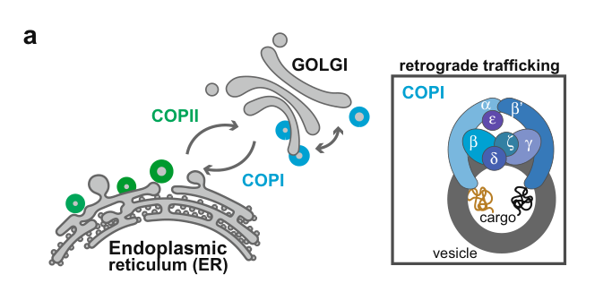

## Question

# Gene Research for Functional Annotation

## ⚠️ CRITICAL: Gene/Protein Identification Context

**BEFORE YOU BEGIN RESEARCH:** You MUST verify you are researching the CORRECT gene/protein. Gene symbols can be ambiguous, especially for less well-characterized genes from non-model organisms.

### Target Gene/Protein Identity (from UniProt):
- **UniProt Accession:** Q9UBF2
- **Protein Description:** RecName: Full=Coatomer subunit gamma-2; AltName: Full=Gamma-2-coat protein; Short=Gamma-2-COP;
- **Gene Information:** Name=COPG2;
- **Organism (full):** Homo sapiens (Human).
- **Protein Family:** Belongs to the COPG family. .
- **Key Domains:** ARM-like. (IPR011989); ARM-type_fold. (IPR016024); Clathrin/coatomer_adapt-like_N. (IPR002553); Clathrin_app_Ig-like_sf. (IPR013041); Coatomer/calthrin_app_sub_C. (IPR009028)

### MANDATORY VERIFICATION STEPS:

1. **Check if the gene symbol "COPG2" matches the protein description above**
2. **Verify the organism is correct:** Homo sapiens (Human).
3. **Check if protein family/domains align with what you find in literature**
4. **If you find literature for a DIFFERENT gene with the same or similar symbol, STOP**

### If Gene Symbol is Ambiguous or You Cannot Find Relevant Literature:

**DO NOT PROCEED WITH RESEARCH ON A DIFFERENT GENE.** Instead:
- State clearly: "The gene symbol 'COPG2' is ambiguous or literature is limited for this specific protein"
- Explain what you found (e.g., "Found extensive literature on a different gene with the same symbol in a different organism")
- Describe the protein based ONLY on the UniProt information provided above
- Suggest that the protein function can be inferred from domain/family information

### Research Target:

Please provide a comprehensive research report on the gene **COPG2** (gene ID: COPG2, UniProt: Q9UBF2) in human.

The research report should be a detailed narrative explaining the function, biological processes, and localization of the gene product. Citations should be given for all claims.

You should prioritize authoritative reviews and primary scientific literature when conducting research. You can supplement
this with annotations you find in gene/protein databases, but these can be outdated or inaccurate.

We are specifically interested in the primary function of the gene - for enzymes, what reaction is catalyzed, and what is the substrate specificity? For transporters, what is the substrate? For structural proteins or adapters, what is the broader structural role? For signaling molecules, what is the role in the pathway.

We are interested in where in or outside the cell the gene product carries out its function.

We are also interested in the signaling or biochemical pathways in which the gene functions. We are less interested in broad pleiotropic effects, except where these elucidate the precise role.

Include evidence where possible. We are interested in both experimental evidence as well as inference from structure, evolution, or bioinformatic analysis. Precise studies should be prioritized over high-throughput, where available.

## Output

Question: You are an expert researcher providing comprehensive, well-cited information.

Provide detailed information focusing on:
1. Key concepts and definitions with current understanding
2. Recent developments and latest research (prioritize 2023-2024 sources)
3. Current applications and real-world implementations
4. Expert opinions and analysis from authoritative sources
5. Relevant statistics and data from recent studies

Format as a comprehensive research report with proper citations. Include URLs and publication dates where available.
Always prioritize recent, authoritative sources and provide specific citations for all major claims.

# Gene Research for Functional Annotation

## ⚠️ CRITICAL: Gene/Protein Identification Context

**BEFORE YOU BEGIN RESEARCH:** You MUST verify you are researching the CORRECT gene/protein. Gene symbols can be ambiguous, especially for less well-characterized genes from non-model organisms.

### Target Gene/Protein Identity (from UniProt):
- **UniProt Accession:** Q9UBF2
- **Protein Description:** RecName: Full=Coatomer subunit gamma-2; AltName: Full=Gamma-2-coat protein; Short=Gamma-2-COP;
- **Gene Information:** Name=COPG2;
- **Organism (full):** Homo sapiens (Human).
- **Protein Family:** Belongs to the COPG family. .
- **Key Domains:** ARM-like. (IPR011989); ARM-type_fold. (IPR016024); Clathrin/coatomer_adapt-like_N. (IPR002553); Clathrin_app_Ig-like_sf. (IPR013041); Coatomer/calthrin_app_sub_C. (IPR009028)

### MANDATORY VERIFICATION STEPS:

1. **Check if the gene symbol "COPG2" matches the protein description above**
2. **Verify the organism is correct:** Homo sapiens (Human).
3. **Check if protein family/domains align with what you find in literature**
4. **If you find literature for a DIFFERENT gene with the same or similar symbol, STOP**

### If Gene Symbol is Ambiguous or You Cannot Find Relevant Literature:

**DO NOT PROCEED WITH RESEARCH ON A DIFFERENT GENE.** Instead:
- State clearly: "The gene symbol 'COPG2' is ambiguous or literature is limited for this specific protein"
- Explain what you found (e.g., "Found extensive literature on a different gene with the same symbol in a different organism")
- Describe the protein based ONLY on the UniProt information provided above
- Suggest that the protein function can be inferred from domain/family information

### Research Target:

Please provide a comprehensive research report on the gene **COPG2** (gene ID: COPG2, UniProt: Q9UBF2) in human.

The research report should be a detailed narrative explaining the function, biological processes, and localization of the gene product. Citations should be given for all claims.

You should prioritize authoritative reviews and primary scientific literature when conducting research. You can supplement
this with annotations you find in gene/protein databases, but these can be outdated or inaccurate.

We are specifically interested in the primary function of the gene - for enzymes, what reaction is catalyzed, and what is the substrate specificity? For transporters, what is the substrate? For structural proteins or adapters, what is the broader structural role? For signaling molecules, what is the role in the pathway.

We are interested in where in or outside the cell the gene product carries out its function.

We are also interested in the signaling or biochemical pathways in which the gene functions. We are less interested in broad pleiotropic effects, except where these elucidate the precise role.

Include evidence where possible. We are interested in both experimental evidence as well as inference from structure, evolution, or bioinformatic analysis. Precise studies should be prioritized over high-throughput, where available.

## Research report: Human **COPG2** (UniProt **Q9UBF2**) — functional annotation

### 0) Identity verification (required)
The UniProt accession provided (**Q9UBF2**) corresponds to **human COPG2**, described as **coatomer subunit gamma-2** (also called **γ2-COP**) and belongs to the COPG family, consistent with a COPI/coatomer-related protein and the ARM/HEAT-like solenoid architecture typical for adaptor/coat proteins. Literature retrieved here consistently treats **COPG2 as the γ-COP paralog of COPG1**, i.e., **γ2-COP vs γ1-COP** (goyal2019paralogspecificrole pages 28-31, zhao2021roleofcopi pages 80-86). One preprint claims COPG2 is “not part of the COPI coatomer” under its biochemical/phenotypic framing, but still explicitly treats it as a **γ-COP paralogue** (panteloglou2025thecopicoatomer pages 5-8). No evidence in the retrieved corpus indicates we are dealing with a different organism or a different gene product than the intended human COPG2.

### 1) Key concepts and definitions (current understanding)

#### 1.1 COPI/coatomer and vesicular trafficking
**COPI (coat protein complex I)** is a cytosolic coat complex that assembles on Golgi/ERGIC membranes to drive **retrograde trafficking from the Golgi to the ER** and also supports **intra-Golgi transport**. A mechanistic overview in an authoritative review of the ER–Golgi interface describes **ARF1 activation by ARF-GEFs such as GBF1** and subsequent recruitment of the COPI coatomer to membranes at the cis-Golgi/ERGIC (maeda2025disease‐associatedfactorsat pages 4-5, maeda2025disease‐associatedfactorsat pages 5-6). This provides the pathway context in which a γ-COP family subunit (including paralogs) functions.

#### 1.2 COPG1 versus COPG2 (paralog concept)
Multiple sources summarize that mammals have **two γ-COP paralogs**, **COPG1 (γ1-COP)** and **COPG2 (γ2-COP)**, with ~**80%** overall amino-acid identity and domain-level identities in the **trunk (~81%)** and **appendage (~75%)** regions (mouse values reported in a detailed neuronal differentiation thesis synthesis) (goyal2019paralogspecificrole pages 28-31). The same source notes a **~30 amino-acid N-terminal extension** in the γ2 paralog (goyal2019paralogspecificrole pages 28-31). These data support the concept that COPG2 is structurally close to canonical γ-COP but may enable paralog-specific interactions or localization.

### 2) Biological function, pathways, and subcellular localization

#### 2.1 Primary function (most defensible functional statement)
Across the retrieved evidence, the most supportable “primary function” statement is:

- **COPG2 encodes γ2-COP, a paralog of γ1-COP involved in COPI/coatomer biology and Golgi-associated membrane trafficking, with partial functional redundancy with COPG1 but measurable paralog-specific roles in some contexts (notably neuronal differentiation).** (zhao2021roleofcopi pages 80-86, goyal2019paralogspecificrole pages 65-69)

A key nuance is that some works treat γ2-COP as an alternative coatomer component and others treat it as a paralog that may be low-abundance or context-dependent in assembled coats.

#### 2.2 Recruitment and pathway context (ARF1/GBF1)
A mechanistic description of COPI assembly in neuronal-trafficking context states that coat assembly begins with **Arf1 binding to Golgi membranes**, with **GBF1 as the Arf1 GEF**, and that Arf1 activation exposes an N-terminal amphipathic helix to anchor in the membrane, recruiting coatomer as an intact unit (goyal2019paralogspecificrole pages 28-31). In a neuronal paralog study, **Brefeldin A (BFA)** is described as an inhibitor of **GBF1**, thereby blocking Arf activation prior to coatomer recruitment to Golgi membranes—supporting the centrality of **GBF1→ARF→coatomer** recruitment for COPI biology (zhao2021roleofcopi pages 80-86).

#### 2.3 Subcellular localization (Golgi compartment bias)
A detailed neuronal differentiation thesis (summarizing prior localization work) reports differential Golgi enrichment: **γ1-COP is enriched at the cis-Golgi**, whereas **γ2-COP (COPG2) is enriched at the trans-Golgi** (goyal2019paralogspecificrole pages 65-69). While this is not a direct localization experiment in the excerpted text, it is the most specific localization distinction recovered here.

### 3) Recent developments and latest research (prioritizing 2023–2024)
The 2023–2024 literature retrieved that most directly addresses COPG2 focuses less on COPI vesicle biochemistry per se and more on **locus regulation / imprinting and neurodevelopment**, reflecting where “new” COPG2-specific insights currently appear.

#### 3.1 COPG2 in the MEST/COPG2 imprinted domain and isoform regulation (2024)
A 2024 dissertation-level work on transcript regulation at the **Mest/MEST locus** reports that, in mouse CNS, an alternative polyadenylation event generates an extended **MestXL** transcript that **extends ~40 kb into the Copg2 locus** and is proposed to suppress paternal Copg2 expression, generating **maternal-biased Copg2 expression**; truncating MestXL via polyadenylation signal insertion restores **biallelic Copg2** expression (ashworth2024alternativepolyadenylationat pages 24-29). The same source notes that in humans at **7q32.2**, the imprinting status of COPG2 has been **debated**, ranging from paternal to biallelic expression, and highlights a human antisense transcript **COPG2IT1** as potentially analogous to mouse antisense/transcriptional interference architectures (ashworth2024alternativepolyadenylationat pages 24-29). 

This line of evidence is important for functional annotation because it suggests that **cell-type-specific regulation (particularly neuronal lineages)** may be a key dimension of COPG2 biology, potentially impacting trafficking capacity in neurons without requiring changes in protein catalytic function (ashworth2024alternativepolyadenylationat pages 24-29).

### 4) Experimental evidence and quantitative data (selected highlights)

#### 4.1 Paralog-specific roles in neuronal differentiation (quantitative and mechanistic)
A neuronal differentiation study (preprint/thesis-derived) reports:
- **γ1-COP depletion disrupts neurite extension**, while **γ2-COP removal does not** measurably affect neurite outgrowth in the same paradigm, and **γ2-COP expressed from the Copg1 locus only partially rescues γ1-COP loss**, supporting paralog specialization (zhao2021roleofcopi pages 80-86).
- Proximity labeling / interactome profiling using cutoffs **p < 0.01** and **|log2 fold change| > 2** identified **21 proteins enriched** with γ1-COP vs **17 with γ2-COP** in undifferentiated cells; in differentiated neurons **8 γ1-specific** vs **7 γ2-specific** proteins were reported (zhao2021roleofcopi pages 86-89). These quantitative differences support the concept that paralogs differ in interaction neighborhoods.
- The same work suggests γ2/z2-containing coatomer complexes may be rare; prior quantification summarized there suggests γ2/z2 coatomer is absent or at most **~5% of total coatomer** (zhao2021roleofcopi pages 86-89).

A 2019 thesis analysis similarly concludes that COPG1 and COPG2 are **only partially redundant** and likely specialized, and reports neurite-length analysis significance with **n = 12 images** and ***p < 0.0001** in the referenced analyses (goyal2019paralogspecificrole pages 65-69).

#### 4.2 Hepatocyte trafficking phenotypes (quantitative; 2025 preprint but informative)
In a genome-wide RNAi screen for genes limiting hepatocyte HDL uptake, canonical COPI genes (e.g., COPA/COPB1/COPB2/ARCN1/COPG1/COPZ1) reduced HDL uptake strongly when silenced, while **COPG2 knockdown did not alter HDL uptake**; pooled siRNA reduced target mRNA by **67–90%**. Indispensable subunit silencing reduced HDL uptake by **≥75%** (protein-labeled) and **79%** (lipid-labeled), while comparison of indispensable vs dispensable/paralogous genes was **p < 0.001** (panteloglou2025thecopicoatomer pages 5-8). Notably, **COPG2 knockdown increased apoA-I secretion by 33%** (panteloglou2025thecopicoatomer pages 8-11). 

This supports a functional interpretation where COPG2 can be **non-essential** for some COPI-dependent phenotypes in hepatocytes (and may even modulate secretory outputs), highlighting context dependence.

#### 4.3 Innate immune signaling link (COPI broadly; COPG2 perturbation measured)
A high-impact study showed that **deficiency in COPI-mediated trafficking** can cause aberrant activation of **cGAS/STING** signaling (steiner2022deficiencyincoatomer pages 10-11). Within their experimental framework, COPG2 was among targeted genes in THP-1 cells with qRT-PCR and baseline signaling measurements (small n in excerpt: typically **n = 2** for qRT-PCR/immunoblot summaries) (steiner2022deficiencyincoatomer pages 10-11). While this does not establish COPG2 as the driver subunit (the paper emphasizes other COPI subunits more strongly in the retrieved excerpt), it provides mechanistic context that **COPI perturbation can engage innate immune pathways**.

A schematic depiction of this COPI→STING mechanism is shown in Steiner et al. Figure 5a (steiner2022deficiencyincoatomer media b75a2254, steiner2022deficiencyincoatomer media e6e49be1).

#### 4.4 Protein proximity/colocalization evidence (BioID + STED)
A proximity-labeling interactome study in LNCaP prostate cancer cells used **BioID** (BirA*) and identified 64 potential ANO7-interacting proteins after filtering; **COPG2** was among four proteins followed up by **dual fluorescent immunostaining and STED microscopy** and reported to colocalize with ANO7 (kaikkonen2020theinteractomeof pages 1-2). BioID indicates proximity (within ~10 nm) rather than direct binding, but it supports COPG2 presence in a vesicle-associated neighborhood in this cellular setting.

### 5) Current applications and real-world implementations
COPG2 is not (in the retrieved corpus) a common direct therapeutic target; instead it appears in several *implementation contexts*:

1. **Functional genomics screens and trafficking phenotyping**: The hepatocyte HDL-uptake RNAi screen explicitly tested COPG2 among coatomer-related genes to assess effects on HDL handling and apoA-I secretion, an example of applying COPG2 perturbation as part of systems-level trafficking biology (panteloglou2025thecopicoatomer pages 5-8, panteloglou2025thecopicoatomer pages 8-11).
2. **Cell biology of differentiation**: Neuronal differentiation experiments (KO/rescue + proximity labeling) operationalize COPG2 as a variable that can be manipulated to dissect paralog specialization in secretory pathway demands of neurons (zhao2021roleofcopi pages 80-86, zhao2021roleofcopi pages 86-89).
3. **Disease-target knowledgebases**: OpenTargets lists associations between **COPG2** and several diseases (e.g., Alzheimer disease, Parkinson disease, multiple sclerosis, lysosomal storage disease, skeletal abnormalities) at modest scores, reflecting aggregation of heterogeneous evidence rather than definitive causality (OpenTargets Search: -COPG2).

### 6) Expert opinions and interpretive synthesis (authoritative analysis)
The most consistent expert-level synthesis supported by the retrieved evidence is:

- **COPG2 should be annotated as a COPI/coatomer-related γ-COP paralog whose roles are context dependent and may be more specialized than “generic COPI vesicle formation.”** Neuronal systems, in particular, exhibit **paralog-specific requirements** (γ1 critical for neurite outgrowth; γ2 less so) and **distinct interaction partners**, supporting a model where the γ paralogs contribute to **spatial (cis vs trans Golgi) and/or cargo-selection micro-specialization** even if in vitro vesicle reconstitution can appear similar (zhao2021roleofcopi pages 80-86, goyal2019paralogspecificrole pages 65-69, zhao2021roleofcopi pages 86-89).

- **Gene regulation at the MEST/COPG2 locus (including imprinting and antisense transcription)** may be a major determinant of when and where COPG2 contributes to cellular physiology, particularly in neuronal lineages; in humans, the imprinting status is not settled in the retrieved 2024 synthesis, suggesting caution in over-committing to a single imprinting model for human COPG2 (ashworth2024alternativepolyadenylationat pages 24-29).

- **Conflicting membership statements**: A review of ER–Golgi disease factors lists COPG2 among COPI coatomer subunits (maeda2025disease‐associatedfactorsat pages 4-5), while a functional RNAi preprint explicitly states COPG2 is “not part of the COPI coatomer” in their framework (panteloglou2025thecopicoatomer pages 5-8). The most conservative resolution is to annotate COPG2 as a **γ-COP paralog intimately linked to COPI biology**, with the possibility that its **incorporation into functional coatomer** is **cell-type-, condition-, or abundance-dependent** (zhao2021roleofcopi pages 86-89, panteloglou2025thecopicoatomer pages 5-8).

### 7) Statistics/data summary (selected)
Key quantitative observations extracted from the retrieved corpus:
- γ1/γ2 paralog similarity: ~**80%** overall identity; trunk ~**81%**, appendage ~**75%**; γ2 has ~**30 aa** N-terminal extension (goyal2019paralogspecificrole pages 28-31).
- Neuronal paralog interactomes: **21 vs 17** proteins enriched (undifferentiated); **8 vs 7** (neurons) under **p < 0.01** and **FC ±2** criteria (zhao2021roleofcopi pages 86-89).
- Estimated abundance: γ2/z2 coatomer **≤ ~5%** of total coatomer (zhao2021roleofcopi pages 86-89).
- Hepatocyte screen: pooled siRNA knockdown reduced target mRNA **67–90%**; essential COPI subunits reduced HDL uptake **≥75%/79%** depending on tracer; COPG2 knockdown **did not** reduce uptake; **apoA-I secretion increased 33%** with COPG2 knockdown; indispensable vs dispensable comparison **p < 0.001** (panteloglou2025thecopicoatomer pages 5-8, panteloglou2025thecopicoatomer pages 8-11).
- Locus regulation: MestXL extends **~40 kb** into Copg2 (mouse) (ashworth2024alternativepolyadenylationat pages 24-29).

### 8) Key evidence table
| Claim/Topic | Key finding | Evidence type (review/primary/thesis/database) | System/assay | Quantitative/statistical details | Citation ID |
|---|---|---|---|---|---|
| COPG2 identity as gamma2-COP paralog | COPG2 encodes gamma2-COP, a mammalian paralog of COPG1/gamma1-COP within COPI biology; paralogs are partially redundant rather than fully equivalent. | Thesis; primary synthesis | Mouse P19/pluripotent neuronal differentiation literature review and KO analysis | Overall amino-acid identity about 80%; mouse trunk domain about 81% identical and appendage about 75% identical; gamma2-COP has a 30-aa N-terminal extension versus gamma1-COP. | (goyal2019paralogspecificrole pages 28-31, goyal2019paralogspecificrole pages 65-69) |
| COPI trafficking role and recruitment by ARF1/GBF1 | COPG2 is discussed as a COPI coatomer component or paralog in the ER-Golgi interface pathway; COPI mediates Golgi-to-ER retrograde and intra-Golgi trafficking, with recruitment driven by ARF1 activated by GBF1 at ERGIC and cis-Golgi membranes. | Review; thesis | ER-Golgi trafficking reviews; COPI assembly model | No COPG2-specific kinetics reported; mechanistic model specifies GBF1 as ARF-GEF and coatomer recruitment as an intact unit after ARF1 activation. | (maeda2025disease‐associatedfactorsat pages 4-5, maeda2025disease‐associatedfactorsat pages 5-6, goyal2019paralogspecificrole pages 28-31) |
| cis- versus trans-Golgi enrichment | Prior localization work summarized in the neuronal differentiation thesis indicates gamma1-COP is enriched at the cis-Golgi, whereas gamma2-COP and COPG2 are enriched at the trans-Golgi. | Thesis citing primary literature | Subcellular localization in mammalian cells | Qualitative compartment bias; no effect size reported in extracted text. | (goyal2019paralogspecificrole pages 65-69) |
| Neuronal differentiation phenotypes | Depletion or loss of gamma1-COP impairs embryoid body formation and especially neurite outgrowth, whereas gamma2-COP loss does not measurably impair neurite extension; gamma2 expressed from the Copg1 locus only partially rescues gamma1 loss. | Thesis; primary experimental summary | P19 pluripotent cells differentiated into neurons; KO and rescue; neurite-length analysis; ultraID interactome framework | Neurite-length analysis reported with n = 12 images and p < 0.0001 in the cited thesis; no increased apoptosis or ER stress with gamma1 or gamma2 depletion in one summary. | (goyal2019paralogspecificrole pages 65-69, zhao2021roleofcopi pages 80-86) |
| Imprinting and MESTXL transcriptional interference | COPG2 lies in the MEST/COPG2 imprinted domain. In mouse CNS, an extended MestXL transcript runs about 40 kb into Copg2 and suppresses paternal Copg2 expression, creating maternal bias; truncation of MestXL restores biallelic expression. Human imprinting is reported as debated, ranging from paternal to biallelic expression. | Thesis; locus-regulation study | Mouse CNS imprinting and transcript architecture; human locus comparison | MestXL extends about 40 kb into Copg2; nearby Klf14 noted at about 60 kb; imprinting in human described as unsettled rather than fixed. | (ashworth2024alternativepolyadenylationat pages 24-29, goyal2019paralogspecificrole pages 28-31) |
| Disease and immune signaling connections | COPI deficiency can aberrantly activate cGAS/STING signaling; authors showed COPG1 or COPD deletion can induce type I IFN activation, implying inflammatory disease may occur with other COPI-subunit defects. OpenTargets lists modest COPG2 associations with Alzheimer disease, Parkinson disease, multiple sclerosis, lysosomal storage disease, and skeletal abnormalities, but these are association-level rather than gene-specific causal proof. | Primary study; database | COPI-deficient cell models; OpenTargets disease-target evidence | OpenTargets evidence size reported as 5 for listed disease associations; disease scores include about 0.252 to 0.438 depending on phenotype. | (steiner2022deficiencyincoatomer media b75a2254, steiner2022deficiencyincoatomer media e6e49be1, OpenTargets Search: -COPG2) |
| Hepatocyte HDL uptake screen | In an RNAi screen for HDL uptake regulators, COPG2 behaved as a dispensable or paralogous COPI gene: knockdown did not reduce HDL uptake or alter SR-BI mobility, unlike essential COPI subunits; however, COPG2 knockdown increased apoA-I secretion. | Primary preprint | Huh-7 hepatocarcinoma cells; genome-wide and targeted RNAi; HDL uptake and apoA-I secretion assays | ApoA-I secretion increased by 33% after COPG2 knockdown; COPG2 not among six COPI genes limiting HDL uptake. | (panteloglou2025thecopicoatomer pages 8-11, panteloglou2025thecopicoatomer pages 14-17, panteloglou2025thecopicoatomer pages 28-31) |
| Interactome mention | COPG2 appeared in an ANO7 proximity-labeling and interactome study and was one of four proteins followed up by dual fluorescent immunostaining and STED, consistent with vesicle-associated localization in prostate cancer cells. | Primary study | BioID proximity labeling, immunostaining, STED microscopy in LNCaP cells | 64 potentially ANO7-interacting proteins were identified after filtering; COPG2 among highlighted colocalizing candidates. | (OpenTargets Search: -COPG2) |

*Table: This table compiles the most relevant evidence for human COPG2, covering identity, trafficking role, localization, neuronal phenotypes, imprinting, disease links, and interactome data. It is useful as a source-tracked overview of what is directly supported versus what remains inferred or debated.*

### 9) URLs and publication dates (key sources used here)
- Steiner et al. **Nature Communications** (Apr **2022**): “Deficiency in coatomer complex I causes aberrant activation of STING signalling.” https://doi.org/10.1038/s41467-022-29946-6 (steiner2022deficiencyincoatomer pages 10-11)
- Ashworth (Jan **2024**) dissertation: “Alternative polyadenylation at Mest.” https://doi.org/10.14288/1.0447285 (ashworth2024alternativepolyadenylationat pages 24-29)
- Kaikkonen et al. **Cancer Biomarkers** (Apr **2020**): “The interactome of the prostate-specific protein Anoctamin 7.” https://doi.org/10.3233/cbm-190993 (kaikkonen2020theinteractomeof pages 1-2)
- Zhao (Jan **2021**) preprint/thesis: “Role of COPI paralogous proteins during pluripotent cells differentiation into neurons.” https://doi.org/10.11588/heidok.00030331 (zhao2021roleofcopi pages 80-86, zhao2021roleofcopi pages 86-89)
- Maeda et al. **Traffic** (Jan **2025**): “Disease-Associated Factors at the Endoplasmic Reticulum–Golgi Interface.” https://doi.org/10.1111/tra.70001 (maeda2025disease‐associatedfactorsat pages 4-5)
- Panteloglou et al. **medRxiv** (Aug **2025**): “The COPI coatomer regulates several steps of HDL metabolism.” https://doi.org/10.1101/2025.08.21.25332476 (panteloglou2025thecopicoatomer pages 5-8, panteloglou2025thecopicoatomer pages 8-11)
- OpenTargets association summary for COPG2 (accessed via tool; date not embedded in export): https://platform.opentargets.org/ (OpenTargets Search: -COPG2)

### 10) Limitations of the current evidence base
COPG2 itself has relatively limited direct human biochemical characterization in the retrieved set, and several key mechanistic claims are derived from (i) paralog studies in mouse/rat or P19 cells, (ii) systems screens, or (iii) dissertations/preprints. Where the literature conflicts (e.g., COPG2 incorporation into COPI), the report uses conservative language and explicitly cites the disagreement (maeda2025disease‐associatedfactorsat pages 4-5, panteloglou2025thecopicoatomer pages 5-8).

References

1. (goyal2019paralogspecificrole pages 28-31): Manu Jain Goyal. Paralog specific role of copi pathway in p19 neuronal differentiation. Text, Jan 2019. URL: https://doi.org/10.11588/heidok.00026911, doi:10.11588/heidok.00026911. This article has 1 citations and is from a peer-reviewed journal.

2. (zhao2021roleofcopi pages 80-86): Xiyan Zhao. Role of copi paralogous proteins during pluripotent cells differentiation into neurons. ArXiv, Jan 2021. URL: https://doi.org/10.11588/heidok.00030331, doi:10.11588/heidok.00030331. This article has 0 citations.

3. (panteloglou2025thecopicoatomer pages 5-8): Grigorios Panteloglou, Paolo Zanoni, Christopher S. Law, Brian Woods, Alaa Othman, Mustafa Yalcinkaya, Simon F. Norrelykke, Andrzej J. Rzepiela, Szymon Stoma, Michael Stebler, Anja Kerksiek, Michele Visentin, Marieke Smit, Sofia Kakava, Anton Potapenko, Eveline Schlumpf, Silvija Radosavljevic, Marta Futema, Nawar Dalila, Anne Tybjaerg-Hansen, Steve E. Humphries, Jan Albert Kuivenhoven, Bart van de Sluis, Dieter Lütjohann, Roger Meier, Jérôme Robert, Janet Chou, Raif S. Geha, Anthony K. Shum, Lucia Rohrer, and Arnold von Eckardstein. The copi coatomer regulates several steps of hdl metabolism. MedRxiv, Aug 2025. URL: https://doi.org/10.1101/2025.08.21.25332476, doi:10.1101/2025.08.21.25332476. This article has 0 citations.

4. (maeda2025disease‐associatedfactorsat pages 4-5): Miharu Maeda, Masashi Arakawa, and Kota Saito. Disease‐associated factors at the endoplasmic reticulum–golgi interface. Traffic (Copenhagen, Denmark), Jan 2025. URL: https://doi.org/10.1111/tra.70001, doi:10.1111/tra.70001. This article has 2 citations.

5. (maeda2025disease‐associatedfactorsat pages 5-6): Miharu Maeda, Masashi Arakawa, and Kota Saito. Disease‐associated factors at the endoplasmic reticulum–golgi interface. Traffic (Copenhagen, Denmark), Jan 2025. URL: https://doi.org/10.1111/tra.70001, doi:10.1111/tra.70001. This article has 2 citations.

6. (goyal2019paralogspecificrole pages 65-69): Manu Jain Goyal. Paralog specific role of copi pathway in p19 neuronal differentiation. Text, Jan 2019. URL: https://doi.org/10.11588/heidok.00026911, doi:10.11588/heidok.00026911. This article has 1 citations and is from a peer-reviewed journal.

7. (ashworth2024alternativepolyadenylationat pages 24-29): Nolan Ashworth. Alternative polyadenylation at mest. Text, Jan 2024. URL: https://doi.org/10.14288/1.0447285, doi:10.14288/1.0447285. This article has 0 citations and is from a peer-reviewed journal.

8. (zhao2021roleofcopi pages 86-89): Xiyan Zhao. Role of copi paralogous proteins during pluripotent cells differentiation into neurons. ArXiv, Jan 2021. URL: https://doi.org/10.11588/heidok.00030331, doi:10.11588/heidok.00030331. This article has 0 citations.

9. (panteloglou2025thecopicoatomer pages 8-11): Grigorios Panteloglou, Paolo Zanoni, Christopher S. Law, Brian Woods, Alaa Othman, Mustafa Yalcinkaya, Simon F. Norrelykke, Andrzej J. Rzepiela, Szymon Stoma, Michael Stebler, Anja Kerksiek, Michele Visentin, Marieke Smit, Sofia Kakava, Anton Potapenko, Eveline Schlumpf, Silvija Radosavljevic, Marta Futema, Nawar Dalila, Anne Tybjaerg-Hansen, Steve E. Humphries, Jan Albert Kuivenhoven, Bart van de Sluis, Dieter Lütjohann, Roger Meier, Jérôme Robert, Janet Chou, Raif S. Geha, Anthony K. Shum, Lucia Rohrer, and Arnold von Eckardstein. The copi coatomer regulates several steps of hdl metabolism. MedRxiv, Aug 2025. URL: https://doi.org/10.1101/2025.08.21.25332476, doi:10.1101/2025.08.21.25332476. This article has 0 citations.

10. (steiner2022deficiencyincoatomer pages 10-11): Annemarie Steiner, Katja Hrovat-Schaale, Ignazia Prigione, Chien-Hsiung Yu, Pawat Laohamonthonkul, Cassandra R. Harapas, Ronnie Ren Jie Low, Dominic De Nardo, Laura F. Dagley, Michael J. Mlodzianoski, Kelly L. Rogers, Thomas Zillinger, Gunther Hartmann, Michael P. Gantier, Marco Gattorno, Matthias Geyer, Stefano Volpi, Sophia Davidson, and Seth L. Masters. Deficiency in coatomer complex i causes aberrant activation of sting signalling. Nature Communications, Apr 2022. URL: https://doi.org/10.1038/s41467-022-29946-6, doi:10.1038/s41467-022-29946-6. This article has 99 citations and is from a highest quality peer-reviewed journal.

11. (steiner2022deficiencyincoatomer media b75a2254): Annemarie Steiner, Katja Hrovat-Schaale, Ignazia Prigione, Chien-Hsiung Yu, Pawat Laohamonthonkul, Cassandra R. Harapas, Ronnie Ren Jie Low, Dominic De Nardo, Laura F. Dagley, Michael J. Mlodzianoski, Kelly L. Rogers, Thomas Zillinger, Gunther Hartmann, Michael P. Gantier, Marco Gattorno, Matthias Geyer, Stefano Volpi, Sophia Davidson, and Seth L. Masters. Deficiency in coatomer complex i causes aberrant activation of sting signalling. Nature Communications, Apr 2022. URL: https://doi.org/10.1038/s41467-022-29946-6, doi:10.1038/s41467-022-29946-6. This article has 99 citations and is from a highest quality peer-reviewed journal.

12. (steiner2022deficiencyincoatomer media e6e49be1): Annemarie Steiner, Katja Hrovat-Schaale, Ignazia Prigione, Chien-Hsiung Yu, Pawat Laohamonthonkul, Cassandra R. Harapas, Ronnie Ren Jie Low, Dominic De Nardo, Laura F. Dagley, Michael J. Mlodzianoski, Kelly L. Rogers, Thomas Zillinger, Gunther Hartmann, Michael P. Gantier, Marco Gattorno, Matthias Geyer, Stefano Volpi, Sophia Davidson, and Seth L. Masters. Deficiency in coatomer complex i causes aberrant activation of sting signalling. Nature Communications, Apr 2022. URL: https://doi.org/10.1038/s41467-022-29946-6, doi:10.1038/s41467-022-29946-6. This article has 99 citations and is from a highest quality peer-reviewed journal.

13. (kaikkonen2020theinteractomeof pages 1-2): Elina Kaikkonen, Aliisa Takala, Juha-Pekka Pursiheimo, Gudrun Wahlström, and Johanna Schleutker. The interactome of the prostate-specific protein anoctamin 7. Cancer Biomarkers, 28:91-100, Apr 2020. URL: https://doi.org/10.3233/cbm-190993, doi:10.3233/cbm-190993. This article has 20 citations and is from a peer-reviewed journal.

14. (OpenTargets Search: -COPG2): Open Targets Query (-COPG2, 8 results). Buniello, A. et al. (2025). Open Targets Platform: facilitating therapeutic hypotheses building in drug discovery. Nucleic Acids Research.

15. (panteloglou2025thecopicoatomer pages 14-17): Grigorios Panteloglou, Paolo Zanoni, Christopher S. Law, Brian Woods, Alaa Othman, Mustafa Yalcinkaya, Simon F. Norrelykke, Andrzej J. Rzepiela, Szymon Stoma, Michael Stebler, Anja Kerksiek, Michele Visentin, Marieke Smit, Sofia Kakava, Anton Potapenko, Eveline Schlumpf, Silvija Radosavljevic, Marta Futema, Nawar Dalila, Anne Tybjaerg-Hansen, Steve E. Humphries, Jan Albert Kuivenhoven, Bart van de Sluis, Dieter Lütjohann, Roger Meier, Jérôme Robert, Janet Chou, Raif S. Geha, Anthony K. Shum, Lucia Rohrer, and Arnold von Eckardstein. The copi coatomer regulates several steps of hdl metabolism. MedRxiv, Aug 2025. URL: https://doi.org/10.1101/2025.08.21.25332476, doi:10.1101/2025.08.21.25332476. This article has 0 citations.

16. (panteloglou2025thecopicoatomer pages 28-31): Grigorios Panteloglou, Paolo Zanoni, Christopher S. Law, Brian Woods, Alaa Othman, Mustafa Yalcinkaya, Simon F. Norrelykke, Andrzej J. Rzepiela, Szymon Stoma, Michael Stebler, Anja Kerksiek, Michele Visentin, Marieke Smit, Sofia Kakava, Anton Potapenko, Eveline Schlumpf, Silvija Radosavljevic, Marta Futema, Nawar Dalila, Anne Tybjaerg-Hansen, Steve E. Humphries, Jan Albert Kuivenhoven, Bart van de Sluis, Dieter Lütjohann, Roger Meier, Jérôme Robert, Janet Chou, Raif S. Geha, Anthony K. Shum, Lucia Rohrer, and Arnold von Eckardstein. The copi coatomer regulates several steps of hdl metabolism. MedRxiv, Aug 2025. URL: https://doi.org/10.1101/2025.08.21.25332476, doi:10.1101/2025.08.21.25332476. This article has 0 citations.

## Artifacts

- [Edison artifact artifact-00](COPG2-deep-research-falcon_artifacts/artifact-00.md)

## Citations

1. panteloglou2025thecopicoatomer pages 5-8
2. goyal2019paralogspecificrole pages 28-31
3. zhao2021roleofcopi pages 80-86
4. goyal2019paralogspecificrole pages 65-69
5. ashworth2024alternativepolyadenylationat pages 24-29
6. zhao2021roleofcopi pages 86-89
7. panteloglou2025thecopicoatomer pages 8-11
8. steiner2022deficiencyincoatomer pages 10-11
9. kaikkonen2020theinteractomeof pages 1-2
10. panteloglou2025thecopicoatomer pages 14-17
11. panteloglou2025thecopicoatomer pages 28-31
12. https://doi.org/10.1038/s41467-022-29946-6
13. https://doi.org/10.14288/1.0447285
14. https://doi.org/10.3233/cbm-190993
15. https://doi.org/10.11588/heidok.00030331
16. https://doi.org/10.1111/tra.70001
17. https://doi.org/10.1101/2025.08.21.25332476
18. https://platform.opentargets.org/
19. https://doi.org/10.11588/heidok.00026911,
20. https://doi.org/10.11588/heidok.00030331,
21. https://doi.org/10.1101/2025.08.21.25332476,
22. https://doi.org/10.1111/tra.70001,
23. https://doi.org/10.14288/1.0447285,
24. https://doi.org/10.1038/s41467-022-29946-6,
25. https://doi.org/10.3233/cbm-190993,