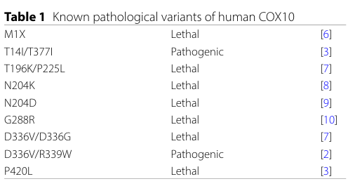

## Question

# Gene Research for Functional Annotation

## ⚠️ CRITICAL: Gene/Protein Identification Context

**BEFORE YOU BEGIN RESEARCH:** You MUST verify you are researching the CORRECT gene/protein. Gene symbols can be ambiguous, especially for less well-characterized genes from non-model organisms.

### Target Gene/Protein Identity (from UniProt):
- **UniProt Accession:** Q12887
- **Protein Description:** RecName: Full=Protoheme IX farnesyltransferase, mitochondrial; EC=2.5.1.141 {ECO:0000250|UniProtKB:P24009}; AltName: Full=Heme O synthase; Flags: Precursor;
- **Gene Information:** Name=COX10;
- **Organism (full):** Homo sapiens (Human).
- **Protein Family:** Belongs to the UbiA prenyltransferase family.
- **Key Domains:** Protohaem_IX_farnesylTrfase. (IPR006369); Protohaem_IX_farnesylTrfase_mt. (IPR016315); UbiA_prenyltransferase. (IPR000537); UbiA_prenylTrfase_CS. (IPR030470); UbiA_sf. (IPR044878)

### MANDATORY VERIFICATION STEPS:

1. **Check if the gene symbol "COX10" matches the protein description above**
2. **Verify the organism is correct:** Homo sapiens (Human).
3. **Check if protein family/domains align with what you find in literature**
4. **If you find literature for a DIFFERENT gene with the same or similar symbol, STOP**

### If Gene Symbol is Ambiguous or You Cannot Find Relevant Literature:

**DO NOT PROCEED WITH RESEARCH ON A DIFFERENT GENE.** Instead:
- State clearly: "The gene symbol 'COX10' is ambiguous or literature is limited for this specific protein"
- Explain what you found (e.g., "Found extensive literature on a different gene with the same symbol in a different organism")
- Describe the protein based ONLY on the UniProt information provided above
- Suggest that the protein function can be inferred from domain/family information

### Research Target:

Please provide a comprehensive research report on the gene **COX10** (gene ID: COX10, UniProt: Q12887) in human.

The research report should be a detailed narrative explaining the function, biological processes, and localization of the gene product. Citations should be given for all claims.

You should prioritize authoritative reviews and primary scientific literature when conducting research. You can supplement
this with annotations you find in gene/protein databases, but these can be outdated or inaccurate.

We are specifically interested in the primary function of the gene - for enzymes, what reaction is catalyzed, and what is the substrate specificity? For transporters, what is the substrate? For structural proteins or adapters, what is the broader structural role? For signaling molecules, what is the role in the pathway.

We are interested in where in or outside the cell the gene product carries out its function.

We are also interested in the signaling or biochemical pathways in which the gene functions. We are less interested in broad pleiotropic effects, except where these elucidate the precise role.

Include evidence where possible. We are interested in both experimental evidence as well as inference from structure, evolution, or bioinformatic analysis. Precise studies should be prioritized over high-throughput, where available.

## Output

Question: You are an expert researcher providing comprehensive, well-cited information.

Provide detailed information focusing on:
1. Key concepts and definitions with current understanding
2. Recent developments and latest research (prioritize 2023-2024 sources)
3. Current applications and real-world implementations
4. Expert opinions and analysis from authoritative sources
5. Relevant statistics and data from recent studies

Format as a comprehensive research report with proper citations. Include URLs and publication dates where available.
Always prioritize recent, authoritative sources and provide specific citations for all major claims.

# Gene Research for Functional Annotation

## ⚠️ CRITICAL: Gene/Protein Identification Context

**BEFORE YOU BEGIN RESEARCH:** You MUST verify you are researching the CORRECT gene/protein. Gene symbols can be ambiguous, especially for less well-characterized genes from non-model organisms.

### Target Gene/Protein Identity (from UniProt):
- **UniProt Accession:** Q12887
- **Protein Description:** RecName: Full=Protoheme IX farnesyltransferase, mitochondrial; EC=2.5.1.141 {ECO:0000250|UniProtKB:P24009}; AltName: Full=Heme O synthase; Flags: Precursor;
- **Gene Information:** Name=COX10;
- **Organism (full):** Homo sapiens (Human).
- **Protein Family:** Belongs to the UbiA prenyltransferase family.
- **Key Domains:** Protohaem_IX_farnesylTrfase. (IPR006369); Protohaem_IX_farnesylTrfase_mt. (IPR016315); UbiA_prenyltransferase. (IPR000537); UbiA_prenylTrfase_CS. (IPR030470); UbiA_sf. (IPR044878)

### MANDATORY VERIFICATION STEPS:

1. **Check if the gene symbol "COX10" matches the protein description above**
2. **Verify the organism is correct:** Homo sapiens (Human).
3. **Check if protein family/domains align with what you find in literature**
4. **If you find literature for a DIFFERENT gene with the same or similar symbol, STOP**

### If Gene Symbol is Ambiguous or You Cannot Find Relevant Literature:

**DO NOT PROCEED WITH RESEARCH ON A DIFFERENT GENE.** Instead:
- State clearly: "The gene symbol 'COX10' is ambiguous or literature is limited for this specific protein"
- Explain what you found (e.g., "Found extensive literature on a different gene with the same symbol in a different organism")
- Describe the protein based ONLY on the UniProt information provided above
- Suggest that the protein function can be inferred from domain/family information

### Research Target:

Please provide a comprehensive research report on the gene **COX10** (gene ID: COX10, UniProt: Q12887) in human.

The research report should be a detailed narrative explaining the function, biological processes, and localization of the gene product. Citations should be given for all claims.

You should prioritize authoritative reviews and primary scientific literature when conducting research. You can supplement
this with annotations you find in gene/protein databases, but these can be outdated or inaccurate.

We are specifically interested in the primary function of the gene - for enzymes, what reaction is catalyzed, and what is the substrate specificity? For transporters, what is the substrate? For structural proteins or adapters, what is the broader structural role? For signaling molecules, what is the role in the pathway.

We are interested in where in or outside the cell the gene product carries out its function.

We are also interested in the signaling or biochemical pathways in which the gene functions. We are less interested in broad pleiotropic effects, except where these elucidate the precise role.

Include evidence where possible. We are interested in both experimental evidence as well as inference from structure, evolution, or bioinformatic analysis. Precise studies should be prioritized over high-throughput, where available.

## Research report: Human **COX10** (UniProt **Q12887**) – functional annotation

### 0) Mandatory target verification (gene/protein identity)
The UniProt accession **Q12887** corresponds to human **COX10**, annotated as **protoheme IX farnesyltransferase, mitochondrial** (also called **heme O synthase**), a **UbiA-family intramembrane prenyltransferase** required for heme A production used by **cytochrome c oxidase (Complex IV)**. This identity matches the literature describing “heme O synthase/COX10” as the enzyme that attaches a farnesyl tail to protoheme IX (heme b), the first step of heme A synthesis. (li2016bringingbioactivecompounds pages 9-11, guaragnella2024morethanjust pages 7-8)

### 1) Key concepts and definitions (current understanding)

#### 1.1 COX10 biochemical function (reaction, substrates, products)
**COX10 catalyzes conversion of heme b (protoheme IX) to heme o** by transferring a **farnesyl moiety from farnesyl diphosphate** to the **vinyl group at C2 (pyrrole ring A) of heme b**, producing heme o (a prenylated heme intermediate). (ali2025mechanismsofheme pages 2-3, rivett2021biosynthesisandtrafficking pages 34-38)

Mechanistic understanding from structural/biochemical synthesis reviews: the reaction is proposed to involve **Mg2+-assisted ionization of farnesyl diphosphate** to form a stabilized **farnesyl cation**, followed by **attack of the heme vinyl** to form the C–C bond; **pyrophosphate release** is implied by the diphosphate ionization step and the described donor chemistry. The precise ordering of donor ionization, condensation, and hydroxyl incorporation into the final hydroxyethylfarnesyl substituent remains unresolved. (rivett2021biosynthesisandtrafficking pages 34-38)

**Substrate specificity (current consensus):** COX10/HOS uses **heme b** as the prenyl acceptor and **farnesyl diphosphate** as prenyl donor; some organisms can incorporate alternative prenyl chains (e.g., C15/C20 variants) but the canonical mitochondrial pathway uses the farnesyl donor. (rivett2021biosynthesisandtrafficking pages 34-38)

#### 1.2 Pathway context: heme A biosynthesis and Complex IV biogenesis
Heme A is produced by a two-step pathway in mitochondria:
1) **COX10 (heme o synthase): heme b → heme o** (prenylation), and
2) **COX15 (heme a synthase): heme o → heme a** (oxidation of the pyrrole ring D methyl at C8 to an aldehyde). (ali2025mechanismsofheme pages 2-3, ali2025mechanismsofheme pages 3-4)

Heme A is uniquely used by **cytochrome c oxidase (Complex IV)** and is required not only for catalysis but also for proper maturation/stability of the catalytic core subunit **COX1**. (li2016bringingbioactivecompounds pages 9-11, swenson2020fromsynthesisto pages 8-10)

A recurring current concept is that heme A biosynthesis is integrated into the **COX1 assembly line** rather than occurring as a fully independent metabolic module; for example, early COX1 assembly intermediates influence COX10 organization (see below). (swenson2020fromsynthesisto pages 10-12)

### 2) Cellular localization, membrane topology, and molecular organization

#### 2.1 Subcellular compartment
COX10 is an **integral mitochondrial inner membrane protein**. (voges2024phenotypicassessmentof pages 1-2, guaragnella2024morethanjust pages 7-8)

#### 2.2 Topology and oligomeric state (best current model)
Because COX10 is a hydrophobic, polytopic membrane enzyme, detailed experimental topology in humans remains limited in the cited sources; however, widely cited mitochondrial heme reviews describe COX10 as:
- **~46 kDa**, evolutionarily conserved,
- predicted **8–9 transmembrane helices**, with the **catalytic site facing the matrix**, and
- assembling into **homo-oligomeric complexes (~300 kDa)**. (swenson2020fromsynthesisto pages 10-12)

This organization is functionally relevant because **COX10 multimerization** is influenced by the status of early complex IV assembly intermediates (below). (swenson2020fromsynthesisto pages 10-12)

### 3) Recent developments and latest research (prioritized 2023–2024)

#### 3.1 Integration with Complex IV assembly modules (2023 review synthesis)
A 2023 FEBS Letters review on COX1 translation/early assembly highlights that proteins involved in metal center and cofactor insertion connect to the COX1 assembly machinery, and reports COX10 grouping with other metallo-chaperones (including COX15/COX11) and being detected in the **SURF1 interactome**, consistent with coordination between heme A synthesis and COX1 maturation. Publication date: **May 2023**. URL: https://doi.org/10.1002/1873-3468.14671 (dennerlein2023cytochromecoxidase pages 6-7)

#### 3.2 Functional interpretation of human COX10 variants at scale (2024)
A 2024 BMC Research Notes study directly addresses a major translational bottleneck—classification of newly observed COX10 alleles—by expressing human COX10 variants in a **yeast Cox10-null** system and measuring respiratory growth and COX activity. Publication date: **Aug 2024**. URL: https://doi.org/10.1186/s13104-024-06879-5 (voges2024phenotypicassessmentof pages 1-2, voges2024phenotypicassessmentof pages 2-4)

Key quantitative outcomes (2024):
- **ClinVar listed 102 COX10 variants** as of **17 Jun 2024**, with **nearly three-quarters** categorized as **variants of uncertain significance (VUS)**. (voges2024phenotypicassessmentof pages 1-2)
- The authors tested **25 human COX10 variants**; **11/25** supported **~50% or more** of reference cytochrome c oxidase activity and also grew robustly on nonfermentable medium. (voges2024phenotypicassessmentof pages 1-2)
- Several “uncertain significance” alleles were functional (e.g., **S103A, D152Y, A174T, F209L, C343R, V356M**) and several were nonfunctional (e.g., **I127T, D132Y**), illustrating that clinical annotation can disagree with functional phenotype. (voges2024phenotypicassessmentof pages 2-4)

The table/figure summaries from this paper are available as extracted visuals (Table 1 and Figure 1). (voges2024phenotypicassessmentof media d9125d2f, voges2024phenotypicassessmentof media 7a41da9d)

#### 3.3 Yeast as an expert-endorsed platform for COX deficiency variant interpretation (2024 review)
A 2024 International Journal of Molecular Sciences review emphasizes that yeast genetics has historically enabled identification of COX assembly genes and is still valuable for **testing pathogenicity of patient variants**, citing COX10 among heme A biosynthetic factors where functional complementation can establish orthology and variant effects. Publication date: **Mar 2024**. URL: https://doi.org/10.3390/ijms25073814 (guaragnella2024morethanjust pages 7-8)

### 4) Functional role in protein networks: interaction partners and assembly logic

#### 4.1 COX10–COX15 functional coupling and stabilization
COX10 and COX15 are described as interacting/working together for heme A synthesis, and a small assembly factor **COA2** is described as stabilizing the COX10 complex. (guaragnella2024morethanjust pages 7-8)

More broadly, mitochondrial heme reviews describe COX10 oligomerization as depending on newly synthesized **COX1** and early COX1 assembly intermediates, consistent with heme A production being tuned to the assembly state of complex IV. (swenson2020fromsynthesisto pages 10-12)

#### 4.2 Human cell evidence for association with metallochaperone assemblies (authoritative primary research)
A high-impact human cell study (Nature Communications; publication date **Jun 2022**; URL: https://doi.org/10.1038/s41467-022-31413-1) reports that human COX10 is trapped together with COX15 and multiple copper/metallochaperone factors (e.g., COX11, SCO1/2, COA3, COX16, PET191, COX19), linking heme A biosynthesis with copper delivery modules and early assembly intermediates. COX10 silencing impacted levels of PET191/COX19 and impaired formation of early metallochaperone complexes, supporting a systems-level role in complex IV biogenesis beyond a standalone enzymatic step. (nyvltova2022coordinationofmetal pages 8-9)

### 5) Disease relevance, applications, and real-world implementations

#### 5.1 Disease mechanism (mitochondrial respiratory chain / Leigh spectrum)
Loss-of-function COX10 alleles disrupt heme A supply to cytochrome c oxidase, leading to **complex IV deficiency**; COX10 mutations are repeatedly discussed as causes of severe mitochondrial disease presentations including **Leigh(-like) syndromes** and other complex IV deficiency phenotypes. (voges2024phenotypicassessmentof pages 1-2, guaragnella2024morethanjust pages 7-8)

#### 5.2 Current applications
**A) Clinical variant interpretation and functional genomics**
The 2024 yeast expression/phenotyping pipeline is a directly deployable functional genomics approach for clarifying whether a COX10 variant is likely to be loss-of-function, addressing the high fraction of ClinVar VUS in COX10. (voges2024phenotypicassessmentof pages 1-2, voges2024phenotypicassessmentof pages 2-4)

**B) Mechanistic assignment of pathogenicity using model systems**
The 2024 review of yeast approaches frames Saccharomyces cerevisiae as a practical platform to: (i) demonstrate gene orthology, (ii) test the functional consequence of patient variants, and (iii) connect variant effects to specific steps in complex IV assembly (including heme A synthesis via COX10/COX15). (guaragnella2024morethanjust pages 7-8)

### 6) Data-driven summary (selected statistics and experimentally grounded statements)

| Topic | Current understanding | Key sources |
|---|---|---|
| Identity / names / family | Human **COX10** (UniProt **Q12887**) corresponds to **protoheme IX farnesyltransferase, mitochondrial**, also called **heme O synthase**; it belongs to the **UbiA intramembrane aromatic prenyltransferase family** that catalyzes membrane-embedded prenyl transfer reactions. Orthology between human COX10 and yeast Cox10 was established by functional complementation. (guaragnella2024morethanjust pages 7-8, li2016bringingbioactivecompounds pages 9-11) | (guaragnella2024morethanjust pages 7-8, li2016bringingbioactivecompounds pages 9-11) |
| Enzymatic reaction | COX10 catalyzes the **first committed step of heme a biosynthesis**, transferring a **farnesyl group from farnesyl diphosphate** to the **vinyl group at C2 / pyrrole ring A of heme b (protoheme IX)** to form **heme o**; **pyrophosphate release is mechanistically implied** by donor ionization and Mg2+-assisted departure. This converts the C2 vinyl into a hydroxyethylfarnesyl substituent. (ali2025mechanismsofheme pages 2-3, rivett2021biosynthesisandtrafficking pages 34-38, swenson2020fromsynthesisto pages 8-10, rivett2021biosynthesisandtrafficking pages 7-9) | (ali2025mechanismsofheme pages 2-3, rivett2021biosynthesisandtrafficking pages 34-38, swenson2020fromsynthesisto pages 8-10, rivett2021biosynthesisandtrafficking pages 7-9) |
| Subcellular localization / topology | COX10 is an **integral mitochondrial inner membrane** protein; reviews describe it as a **large polytopic membrane enzyme** with predicted **~8–9 transmembrane helices** and a **matrix-facing catalytic site**. It can assemble into **homo-oligomeric complexes of ~300 kDa**. (voges2024phenotypicassessmentof pages 1-2, swenson2020fromsynthesisto pages 10-12, ali2025mechanismsofheme pages 3-4) | (voges2024phenotypicassessmentof pages 1-2, swenson2020fromsynthesisto pages 10-12, ali2025mechanismsofheme pages 3-4) |
| Pathway role | COX10 acts upstream of **COX15** in the two-step pathway **heme b → heme o → heme a**. Heme a is then incorporated into **COX1 / cytochrome c oxidase (complex IV)**, where it is essential for core subunit folding, maturation, and catalytic function. COX10 abundance appears limiting relative to COX15, suggesting COX10 may be rate-limiting for heme a production in some settings. (guaragnella2024morethanjust pages 7-8, ali2025mechanismsofheme pages 3-4, swenson2020fromsynthesisto pages 10-12) | (guaragnella2024morethanjust pages 7-8, ali2025mechanismsofheme pages 3-4, swenson2020fromsynthesisto pages 10-12) |
| Key interactions / assembly modules | COX10 function is linked to **COX15**, **COA2**, and **COX1 assembly intermediates**. Human studies place COX10 in complexes with **COX15** and copper/metallochaperone factors including **COX11, SCO1, SCO2, COA3, COX16, PET191, and COX19**; COX10 was also detected in the **SURF1 interactome**, supporting integration of heme a biosynthesis with complex IV assembly. (guaragnella2024morethanjust pages 7-8, nyvltova2022coordinationofmetal pages 8-9, ali2025mechanismsofheme pages 3-4, dennerlein2023cytochromecoxidase pages 6-7) | (guaragnella2024morethanjust pages 7-8, nyvltova2022coordinationofmetal pages 8-9, ali2025mechanismsofheme pages 3-4, dennerlein2023cytochromecoxidase pages 6-7) |
| 2024 functional variant data | A 2024 yeast complementation study reported that **ClinVar listed 102 COX10 variants** as of **17 Jun 2024**, with **nearly three-quarters** classified as **uncertain significance**. The authors tested **25 human variants**; **11/25** retained **~50% or more** of reference COX activity and supported respiratory growth. Examples classified as functional in that assay included **S103A, P104L, A328T, R431W, S103A, D152Y, A174T, F209L, C343R, V356M**; examples with poor/nonfunctional behavior included **T87I, I127T, D132Y, D336V, R339W**. Variants with ~50% activity supported glycerol growth, whereas variants with **<25%** activity generally failed to grow on nonfermentable medium. (voges2024phenotypicassessmentof pages 1-2, voges2024phenotypicassessmentof pages 2-4) | (voges2024phenotypicassessmentof pages 1-2, voges2024phenotypicassessmentof pages 2-4) |

*Table: This table condenses the main functional annotation points for human COX10, including identity, catalytic reaction, mitochondrial localization, pathway role in heme a and complex IV biogenesis, interaction partners, and the most relevant 2024 human variant assay statistics.*

Additionally, the extracted figure/table images summarizing variant growth and COX activity in Voges et al. 2024 can be used as primary visual evidence of allele-specific functional outcomes. (voges2024phenotypicassessmentof media d9125d2f, voges2024phenotypicassessmentof media 7a41da9d)

### 7) Limitations and open questions (expert synthesis)
Even with improved structural modeling and interaction mapping, multiple mechanistic questions remain unresolved in authoritative reviews:
- how **heme b** is physically transferred from **ferrochelatase (FECH)** to COX10’s membrane-embedded active site, and
- whether/how **heme o** is directly handed off to COX15 versus trafficked through other intermediates. (ali2025mechanismsofheme pages 2-3, swenson2020fromsynthesisto pages 10-12, ali2025mechanismsofheme pages 3-4)

These open points are important for interpreting why some partial-loss COX10 variants may produce heterogeneous clinical phenotypes and for identifying potential therapeutic leverage points (e.g., stabilizing assembly intermediates vs. altering cofactor flux). (guaragnella2024morethanjust pages 7-8, nyvltova2022coordinationofmetal pages 8-9)

### Key URLs (most relevant; with publication month/year)
- Dennerlein et al., **May 2023**, FEBS Letters: https://doi.org/10.1002/1873-3468.14671 (dennerlein2023cytochromecoxidase pages 6-7)
- Guaragnella et al., **Mar 2024**, IJMS: https://doi.org/10.3390/ijms25073814 (guaragnella2024morethanjust pages 7-8)
- Voges et al., **Aug 2024**, BMC Research Notes: https://doi.org/10.1186/s13104-024-06879-5 (voges2024phenotypicassessmentof pages 1-2)
- Nývltová et al., **Jun 2022**, Nat Commun: https://doi.org/10.1038/s41467-022-31413-1 (nyvltova2022coordinationofmetal pages 8-9)
- Rivett et al., **Aug 2021**, Crit Rev Biochem Mol Biol: https://doi.org/10.1080/10409238.2021.1957668 (rivett2021biosynthesisandtrafficking pages 34-38)
- Swenson et al., **Feb 2020**, Cells: https://doi.org/10.3390/cells9030579 (swenson2020fromsynthesisto pages 10-12)
- Li, **Apr 2016**, Trends Biochem Sci: https://doi.org/10.1016/j.tibs.2016.01.007 (li2016bringingbioactivecompounds pages 9-11)

References

1. (li2016bringingbioactivecompounds pages 9-11): Weikai Li. Bringing bioactive compounds into membranes: the ubia superfamily of intramembrane aromatic prenyltransferases. Trends in biochemical sciences, 41 4:356-370, Apr 2016. URL: https://doi.org/10.1016/j.tibs.2016.01.007, doi:10.1016/j.tibs.2016.01.007. This article has 131 citations and is from a domain leading peer-reviewed journal.

2. (guaragnella2024morethanjust pages 7-8): Nicoletta Guaragnella, T. Cervelli, Bel é m Sampaio-Marques, Chenelle A. Caron-Godon, Emma Collington, Jessica L. Wolf, Genna Coletta, and D. M. Glerum. More than just bread and wine: using yeast to understand inherited cytochrome oxidase deficiencies in humans. International Journal of Molecular Sciences, 25:3814, Mar 2024. URL: https://doi.org/10.3390/ijms25073814, doi:10.3390/ijms25073814. This article has 5 citations.

3. (ali2025mechanismsofheme pages 2-3): Saieeda Fabia Ali, Adrianna E. White, Amy Medlock, and Oleh Khalimonchuk. Mechanisms of heme transport in the mitochondria. Biochemical Society Transactions, 53:603-614, May 2025. URL: https://doi.org/10.1042/bst20253013, doi:10.1042/bst20253013. This article has 3 citations and is from a peer-reviewed journal.

4. (rivett2021biosynthesisandtrafficking pages 34-38): Elise D. Rivett, Lim Heo, Michael Feig, and Eric L. Hegg. Biosynthesis and trafficking of heme o and heme a: new structural insights and their implications for reaction mechanisms and prenylated heme transfer. Critical Reviews in Biochemistry and Molecular Biology, 56:640-668, Aug 2021. URL: https://doi.org/10.1080/10409238.2021.1957668, doi:10.1080/10409238.2021.1957668. This article has 23 citations and is from a peer-reviewed journal.

5. (ali2025mechanismsofheme pages 3-4): Saieeda Fabia Ali, Adrianna E. White, Amy Medlock, and Oleh Khalimonchuk. Mechanisms of heme transport in the mitochondria. Biochemical Society Transactions, 53:603-614, May 2025. URL: https://doi.org/10.1042/bst20253013, doi:10.1042/bst20253013. This article has 3 citations and is from a peer-reviewed journal.

6. (swenson2020fromsynthesisto pages 8-10): Samantha A. Swenson, Courtney M. Moore, Jason R. Marcero, Amy E. Medlock, Amit R. Reddi, and Oleh Khalimonchuk. From synthesis to utilization: the ins and outs of mitochondrial heme. Cells, 9:579, Feb 2020. URL: https://doi.org/10.3390/cells9030579, doi:10.3390/cells9030579. This article has 177 citations.

7. (swenson2020fromsynthesisto pages 10-12): Samantha A. Swenson, Courtney M. Moore, Jason R. Marcero, Amy E. Medlock, Amit R. Reddi, and Oleh Khalimonchuk. From synthesis to utilization: the ins and outs of mitochondrial heme. Cells, 9:579, Feb 2020. URL: https://doi.org/10.3390/cells9030579, doi:10.3390/cells9030579. This article has 177 citations.

8. (voges2024phenotypicassessmentof pages 1-2): Thomas-Shadi Voges, Eun Bi Lim, Abigail MacKenzie, Kyle Mudler, Rebecca DeSouza, Nmesoma E. Onyejekwe, and Stephen D. Johnston. Phenotypic assessment of cox10 variants and their implications for leigh syndrome. BMC Research Notes, Aug 2024. URL: https://doi.org/10.1186/s13104-024-06879-5, doi:10.1186/s13104-024-06879-5. This article has 1 citations and is from a peer-reviewed journal.

9. (dennerlein2023cytochromecoxidase pages 6-7): Sven Dennerlein, Peter Rehling, and Ricarda Richter‐Dennerlein. Cytochrome <i>c</i> oxidase biogenesis – from translation to early assembly of the core subunit <scp>cox1</scp>. FEBS Letters, 597:1569-1578, May 2023. URL: https://doi.org/10.1002/1873-3468.14671, doi:10.1002/1873-3468.14671. This article has 31 citations and is from a peer-reviewed journal.

10. (voges2024phenotypicassessmentof pages 2-4): Thomas-Shadi Voges, Eun Bi Lim, Abigail MacKenzie, Kyle Mudler, Rebecca DeSouza, Nmesoma E. Onyejekwe, and Stephen D. Johnston. Phenotypic assessment of cox10 variants and their implications for leigh syndrome. BMC Research Notes, Aug 2024. URL: https://doi.org/10.1186/s13104-024-06879-5, doi:10.1186/s13104-024-06879-5. This article has 1 citations and is from a peer-reviewed journal.

11. (voges2024phenotypicassessmentof media d9125d2f): Thomas-Shadi Voges, Eun Bi Lim, Abigail MacKenzie, Kyle Mudler, Rebecca DeSouza, Nmesoma E. Onyejekwe, and Stephen D. Johnston. Phenotypic assessment of cox10 variants and their implications for leigh syndrome. BMC Research Notes, Aug 2024. URL: https://doi.org/10.1186/s13104-024-06879-5, doi:10.1186/s13104-024-06879-5. This article has 1 citations and is from a peer-reviewed journal.

12. (voges2024phenotypicassessmentof media 7a41da9d): Thomas-Shadi Voges, Eun Bi Lim, Abigail MacKenzie, Kyle Mudler, Rebecca DeSouza, Nmesoma E. Onyejekwe, and Stephen D. Johnston. Phenotypic assessment of cox10 variants and their implications for leigh syndrome. BMC Research Notes, Aug 2024. URL: https://doi.org/10.1186/s13104-024-06879-5, doi:10.1186/s13104-024-06879-5. This article has 1 citations and is from a peer-reviewed journal.

13. (nyvltova2022coordinationofmetal pages 8-9): Eva Nývltová, Jonathan V. Dietz, Javier Seravalli, Oleh Khalimonchuk, and Antoni Barrientos. Coordination of metal center biogenesis in human cytochrome c oxidase. Nature Communications, Jun 2022. URL: https://doi.org/10.1038/s41467-022-31413-1, doi:10.1038/s41467-022-31413-1. This article has 109 citations and is from a highest quality peer-reviewed journal.

14. (rivett2021biosynthesisandtrafficking pages 7-9): Elise D. Rivett, Lim Heo, Michael Feig, and Eric L. Hegg. Biosynthesis and trafficking of heme o and heme a: new structural insights and their implications for reaction mechanisms and prenylated heme transfer. Critical Reviews in Biochemistry and Molecular Biology, 56:640-668, Aug 2021. URL: https://doi.org/10.1080/10409238.2021.1957668, doi:10.1080/10409238.2021.1957668. This article has 23 citations and is from a peer-reviewed journal.

## Artifacts

- [Edison artifact artifact-00](COX10-deep-research-falcon_artifacts/artifact-00.md)

## Citations

1. rivett2021biosynthesisandtrafficking pages 34-38
2. swenson2020fromsynthesisto pages 10-12
3. dennerlein2023cytochromecoxidase pages 6-7
4. voges2024phenotypicassessmentof pages 1-2
5. voges2024phenotypicassessmentof pages 2-4
6. guaragnella2024morethanjust pages 7-8
7. nyvltova2022coordinationofmetal pages 8-9
8. li2016bringingbioactivecompounds pages 9-11
9. ali2025mechanismsofheme pages 2-3
10. ali2025mechanismsofheme pages 3-4
11. swenson2020fromsynthesisto pages 8-10
12. rivett2021biosynthesisandtrafficking pages 7-9
13. https://doi.org/10.1002/1873-3468.14671
14. https://doi.org/10.1186/s13104-024-06879-5
15. https://doi.org/10.3390/ijms25073814
16. https://doi.org/10.1038/s41467-022-31413-1
17. https://doi.org/10.1080/10409238.2021.1957668
18. https://doi.org/10.3390/cells9030579
19. https://doi.org/10.1016/j.tibs.2016.01.007
20. https://doi.org/10.1016/j.tibs.2016.01.007,
21. https://doi.org/10.3390/ijms25073814,
22. https://doi.org/10.1042/bst20253013,
23. https://doi.org/10.1080/10409238.2021.1957668,
24. https://doi.org/10.3390/cells9030579,
25. https://doi.org/10.1186/s13104-024-06879-5,
26. https://doi.org/10.1002/1873-3468.14671,
27. https://doi.org/10.1038/s41467-022-31413-1,