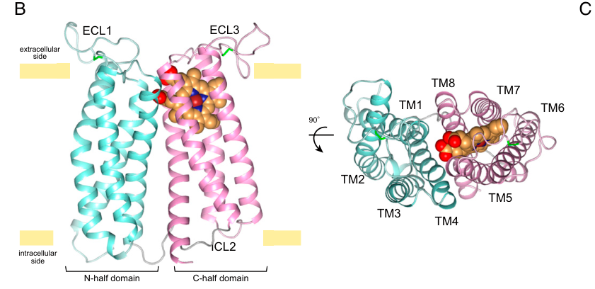

## Question

# Gene Research for Functional Annotation

## ⚠️ CRITICAL: Gene/Protein Identification Context

**BEFORE YOU BEGIN RESEARCH:** You MUST verify you are researching the CORRECT gene/protein. Gene symbols can be ambiguous, especially for less well-characterized genes from non-model organisms.

### Target Gene/Protein Identity (from UniProt):
- **UniProt Accession:** Q7KZN9
- **Protein Description:** RecName: Full=Heme A synthase COX15; Short=HAS; EC=1.17.99.9 {ECO:0000250|UniProtKB:P40086}; AltName: Full=Cytochrome c oxidase assembly protein COX15 homolog;
- **Gene Information:** Name=COX15;
- **Organism (full):** Homo sapiens (Human).
- **Protein Family:** Belongs to the COX15/CtaA family. Type 2 subfamily.
- **Key Domains:** COX15/CtaA_fam. (IPR003780); HemeA_Synthase_type2. (IPR023754); Peptidase_S1_PA. (IPR009003); COX15-CtaA (PF02628)

### MANDATORY VERIFICATION STEPS:

1. **Check if the gene symbol "COX15" matches the protein description above**
2. **Verify the organism is correct:** Homo sapiens (Human).
3. **Check if protein family/domains align with what you find in literature**
4. **If you find literature for a DIFFERENT gene with the same or similar symbol, STOP**

### If Gene Symbol is Ambiguous or You Cannot Find Relevant Literature:

**DO NOT PROCEED WITH RESEARCH ON A DIFFERENT GENE.** Instead:
- State clearly: "The gene symbol 'COX15' is ambiguous or literature is limited for this specific protein"
- Explain what you found (e.g., "Found extensive literature on a different gene with the same symbol in a different organism")
- Describe the protein based ONLY on the UniProt information provided above
- Suggest that the protein function can be inferred from domain/family information

### Research Target:

Please provide a comprehensive research report on the gene **COX15** (gene ID: COX15, UniProt: Q7KZN9) in human.

The research report should be a detailed narrative explaining the function, biological processes, and localization of the gene product. Citations should be given for all claims.

You should prioritize authoritative reviews and primary scientific literature when conducting research. You can supplement
this with annotations you find in gene/protein databases, but these can be outdated or inaccurate.

We are specifically interested in the primary function of the gene - for enzymes, what reaction is catalyzed, and what is the substrate specificity? For transporters, what is the substrate? For structural proteins or adapters, what is the broader structural role? For signaling molecules, what is the role in the pathway.

We are interested in where in or outside the cell the gene product carries out its function.

We are also interested in the signaling or biochemical pathways in which the gene functions. We are less interested in broad pleiotropic effects, except where these elucidate the precise role.

Include evidence where possible. We are interested in both experimental evidence as well as inference from structure, evolution, or bioinformatic analysis. Precise studies should be prioritized over high-throughput, where available.

## Output

Question: You are an expert researcher providing comprehensive, well-cited information.

Provide detailed information focusing on:
1. Key concepts and definitions with current understanding
2. Recent developments and latest research (prioritize 2023-2024 sources)
3. Current applications and real-world implementations
4. Expert opinions and analysis from authoritative sources
5. Relevant statistics and data from recent studies

Format as a comprehensive research report with proper citations. Include URLs and publication dates where available.
Always prioritize recent, authoritative sources and provide specific citations for all major claims.

# Gene Research for Functional Annotation

## ⚠️ CRITICAL: Gene/Protein Identification Context

**BEFORE YOU BEGIN RESEARCH:** You MUST verify you are researching the CORRECT gene/protein. Gene symbols can be ambiguous, especially for less well-characterized genes from non-model organisms.

### Target Gene/Protein Identity (from UniProt):
- **UniProt Accession:** Q7KZN9
- **Protein Description:** RecName: Full=Heme A synthase COX15; Short=HAS; EC=1.17.99.9 {ECO:0000250|UniProtKB:P40086}; AltName: Full=Cytochrome c oxidase assembly protein COX15 homolog;
- **Gene Information:** Name=COX15;
- **Organism (full):** Homo sapiens (Human).
- **Protein Family:** Belongs to the COX15/CtaA family. Type 2 subfamily.
- **Key Domains:** COX15/CtaA_fam. (IPR003780); HemeA_Synthase_type2. (IPR023754); Peptidase_S1_PA. (IPR009003); COX15-CtaA (PF02628)

### MANDATORY VERIFICATION STEPS:

1. **Check if the gene symbol "COX15" matches the protein description above**
2. **Verify the organism is correct:** Homo sapiens (Human).
3. **Check if protein family/domains align with what you find in literature**
4. **If you find literature for a DIFFERENT gene with the same or similar symbol, STOP**

### If Gene Symbol is Ambiguous or You Cannot Find Relevant Literature:

**DO NOT PROCEED WITH RESEARCH ON A DIFFERENT GENE.** Instead:
- State clearly: "The gene symbol 'COX15' is ambiguous or literature is limited for this specific protein"
- Explain what you found (e.g., "Found extensive literature on a different gene with the same symbol in a different organism")
- Describe the protein based ONLY on the UniProt information provided above
- Suggest that the protein function can be inferred from domain/family information

### Research Target:

Please provide a comprehensive research report on the gene **COX15** (gene ID: COX15, UniProt: Q7KZN9) in human.

The research report should be a detailed narrative explaining the function, biological processes, and localization of the gene product. Citations should be given for all claims.

You should prioritize authoritative reviews and primary scientific literature when conducting research. You can supplement
this with annotations you find in gene/protein databases, but these can be outdated or inaccurate.

We are specifically interested in the primary function of the gene - for enzymes, what reaction is catalyzed, and what is the substrate specificity? For transporters, what is the substrate? For structural proteins or adapters, what is the broader structural role? For signaling molecules, what is the role in the pathway.

We are interested in where in or outside the cell the gene product carries out its function.

We are also interested in the signaling or biochemical pathways in which the gene functions. We are less interested in broad pleiotropic effects, except where these elucidate the precise role.

Include evidence where possible. We are interested in both experimental evidence as well as inference from structure, evolution, or bioinformatic analysis. Precise studies should be prioritized over high-throughput, where available.

# Research report: Human **COX15** (UniProt **Q7KZN9**) — functional annotation

## Executive summary
COX15 encodes a mitochondrial inner-membrane heme A synthase required for biosynthesis of **heme A**—the specialized prosthetic group of cytochrome c oxidase (complex IV)—and thus is essential for complex IV assembly and activity. COX15 catalyzes the terminal conversion of **heme O → heme A** via oxidation/formylation at the **C8 methyl** position of the porphyrin macrocycle; genetic and biochemical evidence links this reaction to mitochondrial ferredoxin/ferredoxin-reductase electron transfer and to oligomeric organization of the enzyme in the inner membrane. Pathogenic COX15 variants cause isolated complex IV deficiency, including fatal infantile hypertrophic cardiomyopathy and Leigh syndrome, and are diagnosed in practice through genome sequencing supported by functional assays (e.g., heme profiling, complex IV activity measures). (guaragnella2024morethanjust pages 7-8, antonicka2003mutationsincox15 pages 1-2, antonicka2003mutationsincox15 pages 7-8, swenson2016analysisofoligomerization pages 1-2)

## 1. Key concepts and definitions (current understanding)

### 1.1 What is heme A and why it matters
Heme A is a prenylated, formylated heme found in heme–copper oxidases, including mitochondrial cytochrome c oxidase (complex IV), where it contributes to the heme a/a3 centers needed for electron transfer and oxygen reduction. Loss of heme A impairs assembly of functional complex IV and reduces oxidative phosphorylation capacity. Human genetic evidence directly supports that impaired heme A biosynthesis results in isolated complex IV deficiency. (antonicka2003mutationsincox15 pages 1-2, antonicka2003mutationsincox15 pages 8-12)

### 1.2 COX15 definition and pathway position
**COX15** functions in the **second (terminal) step of heme A biosynthesis**: COX10 synthesizes heme O from protoheme (heme B), and COX15 converts heme O to heme A. Loss of COX15 leads to heme A depletion with heme O accumulation, consistent with substrate specificity for heme O in vivo. (guaragnella2024morethanjust pages 7-8, antonicka2003mutationsincox15 pages 7-8, barros2001involvementofmitochondrial pages 1-2)

### 1.3 Reaction catalyzed and substrate specificity
Across eukaryotes and bacterial homologs (CtaA/HAS), the heme A synthase reaction corresponds to oxidation of the **C8 methyl** of heme O to a **formyl group** to form heme A. Structural modeling from a bacterial homolog supports a defined substrate-binding pocket that recognizes the heme O prenyl side chain and positions a conserved acidic residue near the C8 methyl. (niwa2018crystalstructureof pages 1-2, niwa2018crystalstructureof pages 3-4, niwa2018crystalstructureof pages 4-5)

### 1.4 Electron donors/cofactors: ferredoxin system
Genetic evidence in yeast indicates the Cox15-catalyzed oxidation step proceeds “in conjunction with” mitochondrial **ferredoxin (Yah1)** and **ferredoxin reductase (Arh1)**, consistent with a three-component monooxygenase-like system providing reducing equivalents for heme O oxidation en route to heme A. A key observation supporting physical/functional coupling is the natural Cox15–ferredoxin gene fusion in Schizosaccharomyces pombe, and engineered Cox15–Yah1 fusion complementation of cox15 and yah1 defects. (barros2001involvementofmitochondrial pages 1-2, swenson2016analysisofoligomerization pages 1-2, carr2003assemblyofcytochrome pages 2-3)

### 1.5 Oxygen source for the heme A formyl group
A mechanistic nuance emphasized in recent review-level synthesis is that labeling evidence indicates the oxygen in the C8 formyl group of heme A is derived from **water rather than direct incorporation of molecular O2**, implying a mechanism more complex than simple oxygen insertion by a classical monooxygenase. (guaragnella2024morethanjust pages 7-8, guaragnella2024morethanjust pages 20-21)

## 2. Molecular mechanism and structure-informed inference

### 2.1 Structural framework from homologous heme A synthases
A crystal structure of bacterial heme A synthase (CtaA/HAS homolog) reveals an integral membrane protein with two four-helix-bundle-like halves and a bound cofactor heme; a conserved glutamate (Glu57 in Bacillus subtilis HAS) is positioned near the substrate heme O C8 methyl, supporting its assignment as a catalytic residue for the formylation chemistry. (niwa2018crystalstructureof pages 1-2, niwa2018crystalstructureof pages 3-4)

The figure panels retrieved below highlight the overall architecture and the active-site geometry placing Glu57 near the substrate C8 methyl and showing histidine ligation of the heme iron. (niwa2018crystalstructureof media bfd6f714, niwa2018crystalstructureof media 67c337b5)

### 2.2 Conserved histidines and oligomerization (eukaryotic Cox15)
Eukaryotic Cox15 forms stable homotypic oligomers in the inner membrane, and oligomerization is evolutionarily conserved and largely hydrophobically driven. Functional mutagenesis indicates that **four invariant histidines** are essential for heme a biosynthetic activity (consistent with heme binding/chemistry), and a short **matrix-exposed linker** between N- and C-terminal domains is required for both oligomerization and function. These findings support a model in which oligomeric organization helps create functional catalytic units and/or facilitates prenylated heme transfer to the assembling complex IV machinery. (swenson2016analysisofoligomerization pages 1-2, swenson2016analysisofoligomerization pages 8-9, swenson2016analysisofoligomerization pages 6-8)

### 2.3 Disease-associated residue mechanisms: stability vs catalysis
Disease-linked substitutions map to distinct mechanistic classes: a COX15 **S344P**-type change is associated with protein instability/folding defects, whereas **R217W**-type changes are associated with impaired catalytic function and altered oligomeric properties (consistent with disrupted heme binding/transfer interfaces). Yeast modeling and patient fibroblast protein steady-state analyses support this split. (swenson2016analysisofoligomerization pages 1-2, swenson2016analysisofoligomerization pages 8-9, swenson2016analysisofoligomerization pages 10-12)

## 3. Cellular localization and topology

### 3.1 Subcellular localization
COX15 is an **integral mitochondrial inner membrane** protein, consistent with the fact that its hydrophobic substrates (heme O/heme A) and partner enzyme COX10 are also membrane-associated. (guaragnella2024morethanjust pages 7-8, barros2001involvementofmitochondrial pages 1-2)

### 3.2 Membrane topology (evidence and limitations)
Yeast Cox15 is described as a low-abundance intrinsic inner-membrane protein with ~7 putative transmembrane segments, and topology work in yeast supports that the **C-terminus faces the intermembrane space (IMS)** (proteinase K accessibility of a C-terminal tag in mitoplasts). While this strongly constrains a plausible topology model for eukaryotic COX15-like proteins, precise residue-level topology and orientation of all functional loops in human COX15 remains less directly resolved in the accessible evidence base and is still an active area for refinement through structural approaches. (barros2001involvementofmitochondrial pages 1-2, rumley2011characterizationofcox15p pages 77-82)

## 4. Biological pathway integration: coupling heme A production to complex IV assembly

### 4.1 COX10–COX15 module and early assembly steps
COX10 and COX15 physically interact in a functional heme A biosynthesis module; recent synthesis also highlights additional factors (e.g., COA2 in yeast) that stabilize this module and promote multimerization. (guaragnella2024morethanjust pages 7-8)

### 4.2 Linking heme A synthesis to COX1 hemylation and module progression
Multiple assembly factors connect heme A biosynthesis to the COX1 module, including:
- **PET117**, which is required for COX15 oligomerization and helps couple heme a synthase activity to cytochrome oxidase assembly. (guaragnella2024morethanjust pages 4-5, guaragnella2024morethanjust pages 8-9)
- **SURF1**, which is supported to bind heme A and is proposed to deliver heme A to nascent/assembling COX1 (based on heterologous expression evidence summarized in recent reviews). (guaragnella2024morethanjust pages 8-9)

### 4.3 Coordination with other metal centers (2023 mechanistic insight)
A 2023 human-cell study emphasized that heme a biosynthesis and copper-center assembly are coordinated to prevent accumulation of potentially cytotoxic, partially metallated intermediates. The authors report that metallochaperone complexes can “trap” COX10/COX15 with copper chaperones until copper loading progresses, and they provide quantitative phenotypes showing that loss of certain copper-handling factors can preserve substantial heme a/a3 spectral signal while abolishing holo-complex IV and respiration, underscoring decoupling risks and the need for coordinated assembly. (nyvltova2023coordinationofmetal pages 1-2, nyvltova2023coordinationofmetal pages 8-9)

## 5. Human genetics, disease relevance, and quantitative data

### 5.1 Classic human evidence: COX15 deficiency causes heme A depletion and complex IV deficiency
A landmark human genetics and functional complementation study established COX15 as a cause of isolated complex IV deficiency with **early-onset fatal hypertrophic cardiomyopathy**.

Key quantitative findings in affected heart mitochondria included:
- **Heme A reduced to ~6% of control** with **increased heme O** accumulation, consistent with a block at the heme O→heme A step. (antonicka2003mutationsincox15 pages 7-8, antonicka2003mutationsincox15 pages 8-12)
- **Complex IV activity reduced by ~50–70%** and **fully assembled complex IV reduced by ~50%** in patient fibroblasts, with more severe impact in heart tissue. (antonicka2003mutationsincox15 pages 1-2, antonicka2003mutationsincox15 pages 8-12)

Causality was strengthened by **retroviral COX15 complementation** in patient fibroblasts, which increased heme A and restored complex IV activity/assembly to substantial levels. (antonicka2003mutationsincox15 pages 1-2, antonicka2003mutationsincox15 pages 8-12)

### 5.2 Broader phenotypic spectrum
COX15 variants are also implicated in Leigh syndrome and other neurocardiomyopathic presentations in the broader literature synthesis, consistent with high-energy tissue vulnerability (heart/brain). (guaragnella2024morethanjust pages 20-21, rumley2011characterizationofcox15p pages 53-56)

### 5.3 Recent statistics from large mitochondrial diagnostics cohorts (contextual)
A 2024 French network cohort report (genetically confirmed cases) provides recent quantitative context for mitochondrial disease genetics:
- In a cohort of **397** genetically confirmed patients, **81%** were classified as primary mitochondrial disorders and **19%** as mimics; **501 variants across 172 genes** were reported, with **50% novel** variants. (rouzier2024primarymitochondrialdisorders pages 4-6)
- The paper cites prevalence/risk estimates from prior work: combined childhood/adult PMD prevalence **≥20 per 100,000**, and a modeled combined lifetime risk for 249 autosomal recessive mitochondrial disorders of **48.4 (40.3–58.5) per 100,000** (European gnomAD-based modeling). (rouzier2024primarymitochondrialdisorders pages 1-2)

These statistics are relevant to COX15 because COX15 belongs to the nuclear-encoded mitochondrial gene set routinely interrogated by targeted panels and WES/WGS; the same report discusses the increasing value of WES/WGS for heterogeneous PMD presentations. (rouzier2024primarymitochondrialdisorders pages 1-2, rouzier2024primarymitochondrialdisorders pages 2-4)

## 6. Recent developments and latest research (prioritizing 2023–2024)

### 6.1 2024: New upstream regulator of heme O synthesis (COA8–COX10)
A 2024 study (preprint) identifies **COA8** as a **COX10-binding** factor required not only for COX10 stability but also for its catalytic function in the first step of heme A synthesis. The work provides quantitative heme readouts showing reduced heme A/heme B ratios in COA8-null cells and strong heme A depletion in a functionally disruptive COA8 variant context, connecting upstream heme O production to downstream heme A availability and complex IV assembly intermediates. This strengthens a systems view in which COX10/COX15 operate within a tightly regulated module feeding COX1 maturation. (brischigliaro2024coa8isa pages 8-11, brischigliaro2024coa8isa pages 1-4)

### 6.2 2023: Coordinated metal-center assembly to prevent toxic intermediates
The 2023 mechanistic work described above proposes that copper chaperone assemblies cooperate with heme a biosynthetic enzymes to control metalation order and minimize reactive incomplete intermediates, providing quantitative readouts (e.g., residual hemes a+a3 despite loss of holo-complex IV in specific knockouts). (nyvltova2023coordinationofmetal pages 1-2, nyvltova2023coordinationofmetal pages 8-9)

### 6.3 2024: Emerging diagnostics—live-cell complex IV activity measurement
A 2024 PNAS paper demonstrates a **noninvasive live-cell assay** for complex IV activity in human fibroblasts using scanning electrochemical microscopy with the redox mediator TMPD, extracting a quantitative kinetic parameter (apparent heterogeneous rate constant) via modeling. While not COX15-specific, this is directly applicable to COX15 deficiency workups because COX15 pathogenicity manifests as complex IV dysfunction measurable in patient fibroblasts and could reduce reliance on invasive muscle biopsy. (thind2024cytochromecoxidase pages 1-2)

### 6.4 2024: Review synthesis and expert analysis on COX assembly
A 2024 review focusing on yeast-to-human translation for cytochrome c oxidase deficiencies consolidates evidence that COX15 is required for heme A production, that PET117 couples heme a synthase activity to assembly, and that SURF1-family proteins likely bind/deliver heme A to COX1. It also emphasizes practical constraints: COX15 and substrates are hydrophobic and membrane integrated, limiting direct biochemical assays; structural modeling and integrative approaches are expected to drive near-term progress. (guaragnella2024morethanjust pages 7-8, guaragnella2024morethanjust pages 8-9)

## 7. Current applications and real-world implementation

### 7.1 Variant interpretation workflows for suspected COX15 disease
Real-world clinical pipelines increasingly pair:
- Genomic testing (large targeted panels, WES/WGS of nuclear mitochondrial genes)
with
- Functional corroboration in patient-derived cells/tissues (e.g., complex IV activity, BN-PAGE assembly state, heme profiling by HPLC/ESI-MS).

This approach is exemplified by COX15 discovery/validation using functional complementation and heme measurements, and is consistent with modern multi-omic diagnostic paradigms highlighted in large network efforts. (antonicka2003mutationsincox15 pages 1-2, antonicka2003mutationsincox15 pages 2-4, rouzier2024primarymitochondrialdisorders pages 2-4)

### 7.2 Functional assays used for COX15/heme A defects
- **Mitochondrial heme profiling (HPLC/ESI-MS)** can detect heme A depletion and heme O accumulation in COX15 deficiency (including in heart mitochondria), and this approach has been adapted for patient materials in later work summarized in 2024 review literature. (antonicka2003mutationsincox15 pages 7-8, guaragnella2024morethanjust pages 7-8)
- **Complex IV activity and assembly assays** (enzymology, BN-PAGE) provide direct downstream functional readouts and can show partial rescue upon COX15 complementation in patient fibroblasts. (antonicka2003mutationsincox15 pages 8-12, antonicka2003mutationsincox15 pages 2-4)
- **Live-cell electrochemical COX activity assay** (SECM) is an emerging method for fibroblast-based COX deficiency detection. (thind2024cytochromecoxidase pages 1-2)

## 8. Expert synthesis and open questions

### 8.1 What is well supported
- COX15 is the heme A synthase catalyzing the heme O→heme A conversion and is required for complex IV assembly/function in humans; this is supported by patient heme measurements, complex IV deficiency phenotypes, and genetic complementation. (antonicka2003mutationsincox15 pages 7-8, antonicka2003mutationsincox15 pages 8-12)
- Electron delivery via mitochondrial ferredoxin/ferredoxin reductase is strongly implicated by yeast genetics and fusion constructs, supporting a conserved need for reducing equivalents for the oxidation chemistry. (barros2001involvementofmitochondrial pages 1-2, swenson2016analysisofoligomerization pages 1-2, carr2003assemblyofcytochrome pages 2-3)
- COX15 functions in a broader assembly module (COX10–COX15–PET117–SURF1 and copper chaperones) coordinating cofactor production and insertion into COX1. (guaragnella2024morethanjust pages 8-9, nyvltova2023coordinationofmetal pages 8-9)

### 8.2 What remains uncertain or actively refined
- High-resolution structure of **human** COX15 and direct in vitro reconstitution of its catalytic cycle are still limited by membrane-protein handling and prenylated heme chemistry challenges; current mechanistic assignments lean heavily on homolog structures and genetic/functional inference. (guaragnella2024morethanjust pages 7-8, niwa2018crystalstructureof pages 1-2)
- Precise topology and the sidedness of specific catalytic loops in human COX15 (beyond inner-membrane integration and strong eukaryotic topology constraints) remain incompletely resolved in the evidence assembled here. (rumley2011characterizationofcox15p pages 77-82)

## Summary table
The following table provides a compact functional-annotation view with key evidence and URLs.

| Aspect | Summary for human COX15 (UniProt Q7KZN9) | Representative evidence (year; DOI/URL) |
|---|---|---|
| Verified identity | Human **COX15** encodes **heme A synthase** / cytochrome c oxidase assembly protein COX15 homolog, a member of the **COX15/CtaA family** required for heme A production and complex IV biogenesis; this matches the UniProt description and distinguishes it from unrelated similarly named proteins in other taxa. (guaragnella2024morethanjust pages 7-8, antonicka2003mutationsincox15 pages 1-2) | Antonicka et al., 2003; https://doi.org/10.1086/345489 (antonicka2003mutationsincox15 pages 1-2) · Guaragnella et al., 2024; https://doi.org/10.3390/ijms25073814 (guaragnella2024morethanjust pages 7-8) |
| Reaction catalyzed | COX15 catalyzes the **final step of heme A biosynthesis**, converting **heme O → heme A** by oxidation/formylation of the **C8 methyl** to a **formyl** group; mechanistic work supports an initial hydroxylation/oxidation sequence. (guaragnella2024morethanjust pages 7-8, niwa2018crystalstructureof pages 1-2, barros2001involvementofmitochondrial pages 1-2, carr2003assemblyofcytochrome pages 2-3) | Niwa et al., 2018; https://doi.org/10.1073/pnas.1813346115 (niwa2018crystalstructureof pages 1-2) · Barros et al., 2001; https://doi.org/10.1016/S0014-5793(01)02249-9 (barros2001involvementofmitochondrial pages 1-2) |
| Substrate / product specificity | Primary substrate is **heme O**; product is **heme A**. Loss of COX15 causes **heme A depletion** with **heme O accumulation**, supporting substrate specificity for the heme O intermediate rather than general porphyrin oxidation. (guaragnella2024morethanjust pages 7-8, antonicka2003mutationsincox15 pages 7-8, antonicka2003mutationsincox15 pages 8-12) | Antonicka et al., 2003; https://doi.org/10.1086/345489 (antonicka2003mutationsincox15 pages 7-8, antonicka2003mutationsincox15 pages 8-12) · Guaragnella et al., 2024; https://doi.org/10.3390/ijms25073814 (guaragnella2024morethanjust pages 7-8) |
| Electron donors / cofactors | COX15 functions with **mitochondrial ferredoxin** and **ferredoxin reductase** as electron-transfer partners in the oxidation step; structural studies of bacterial HAS also support a **heme cofactor** and conserved catalytic residues. In yeast nomenclature these partners are **Yah1/Arh1**; the human system is functionally analogous. (guaragnella2024morethanjust pages 20-21, barros2001involvementofmitochondrial pages 1-2, swenson2016analysisofoligomerization pages 1-2, barros2001involvementofmitochondrial pages 4-5, niwa2018crystalstructureof pages 1-2) | Barros et al., 2001; https://doi.org/10.1016/S0014-5793(01)02249-9 (barros2001involvementofmitochondrial pages 1-2, barros2001involvementofmitochondrial pages 4-5) · Niwa et al., 2018; https://doi.org/10.1073/pnas.1813346115 (niwa2018crystalstructureof pages 1-2) |
| Catalytic / structural features | COX15/HAS is an **integral membrane enzyme** with two 4-helix bundle-like domains in bacterial structures; a **conserved glutamate** (Glu57 in B. subtilis homolog) is positioned near the C8 methyl of substrate heme O, and conserved **histidines** are required for activity/heme binding. Eukaryotic Cox15 forms stable **oligomers** important for function. (niwa2018crystalstructureof pages 3-4, niwa2018crystalstructureof pages 4-5, niwa2018crystalstructureof media bfd6f714, swenson2016analysisofoligomerization pages 1-2, swenson2016analysisofoligomerization pages 6-8) | Niwa et al., 2018; https://doi.org/10.1073/pnas.1813346115 (niwa2018crystalstructureof pages 3-4, niwa2018crystalstructureof pages 4-5, niwa2018crystalstructureof media bfd6f714) · Swenson et al., 2016; https://doi.org/10.1074/jbc.M115.707539 (swenson2016analysisofoligomerization pages 1-2, swenson2016analysisofoligomerization pages 6-8) |
| Pathway role | COX15 acts in the **heme A biosynthetic branch** downstream of **COX10** (heme O synthase). Heme A is the specialized prosthetic group required for **cytochrome c oxidase/complex IV** catalytic center formation and maturation of the **COX1 module**. (guaragnella2024morethanjust pages 7-8, guaragnella2024morethanjust pages 20-21, brischigliaro2024coa8isa pages 1-4) | Guaragnella et al., 2024; https://doi.org/10.3390/ijms25073814 (guaragnella2024morethanjust pages 7-8, guaragnella2024morethanjust pages 20-21) · Brischigliaro et al., 2024 preprint; https://doi.org/10.1101/2024.04.02.587738 (brischigliaro2024coa8isa pages 1-4) |
| Role in complex IV assembly | COX15 is not only biosynthetic but also functionally tied to **complex IV assembly**: heme A production is coupled to **COX1 hemylation** and early COX assembly intermediates. Assembly factors such as **PET117** and **SURF1** help connect heme A synthesis with delivery/insertion into assembling COX1. (guaragnella2024morethanjust pages 20-21, guaragnella2024morethanjust pages 4-5, guaragnella2024morethanjust pages 8-9) | Guaragnella et al., 2024; https://doi.org/10.3390/ijms25073814 (guaragnella2024morethanjust pages 20-21, guaragnella2024morethanjust pages 4-5, guaragnella2024morethanjust pages 8-9) |
| Localization / topology | COX15 is a **mitochondrial inner membrane** protein. Evidence from yeast ortholog studies indicates the **C terminus faces the intermembrane space**, with predicted **7–8 transmembrane helices**; catalytic/accessory interactions also implicate matrix-side access to ferredoxin-dependent electron transfer. Precise human topology remains incompletely resolved. (guaragnella2024morethanjust pages 7-8, barros2001involvementofmitochondrial pages 1-2, swenson2016analysisofoligomerization pages 1-2, rumley2011characterizationofcox15p pages 77-82) | Barros et al., 2001; https://doi.org/10.1016/S0014-5793(01)02249-9 (barros2001involvementofmitochondrial pages 1-2) · Rumley, 2011; https://doi.org/10.7939/R3GF0N70P (rumley2011characterizationofcox15p pages 77-82) |
| Key interacting factors: COX10 | **COX10** synthesizes heme O and forms a functional complex with COX15; recent human work further shows upstream regulation of COX10 by **COA8**, reinforcing a heme A biosynthesis module feeding complex IV assembly. (guaragnella2024morethanjust pages 7-8, brischigliaro2024coa8isa pages 8-11, brischigliaro2024coa8isa pages 1-4) | Guaragnella et al., 2024; https://doi.org/10.3390/ijms25073814 (guaragnella2024morethanjust pages 7-8) · Brischigliaro et al., 2024 preprint; https://doi.org/10.1101/2024.04.02.587738 (brischigliaro2024coa8isa pages 8-11, brischigliaro2024coa8isa pages 1-4) |
| Key interacting factors: PET117 | **PET117** is required for **COX15 oligomerization/activity** and couples heme a synthase function to cytochrome oxidase assembly; PET117 mutations cause COX deficiency, underscoring this linkage. (guaragnella2024morethanjust pages 20-21, guaragnella2024morethanjust pages 4-5, guaragnella2024morethanjust pages 8-9) | Guaragnella et al., 2024; https://doi.org/10.3390/ijms25073814 (guaragnella2024morethanjust pages 20-21, guaragnella2024morethanjust pages 4-5, guaragnella2024morethanjust pages 8-9) |
| Key interacting factors: SURF1 | **SURF1** is thought to bind/deliver **heme A** to nascent **COX1** rather than catalyze synthesis itself; thus it is functionally downstream of COX15 in COX1 metal-center maturation. (guaragnella2024morethanjust pages 7-8, guaragnella2024morethanjust pages 4-5, guaragnella2024morethanjust pages 8-9) | Guaragnella et al., 2024; https://doi.org/10.3390/ijms25073814 (guaragnella2024morethanjust pages 7-8, guaragnella2024morethanjust pages 8-9) |
| Key interacting factors: ferredoxin / ferredoxin reductase | COX15-dependent oxidation is linked to **mitochondrial ferredoxin** plus **ferredoxin reductase**; gene-fusion and complementation studies strongly support a direct functional partnership in heme O hydroxylation/oxidation. (barros2001involvementofmitochondrial pages 1-2, barros2001involvementofmitochondrial pages 2-4, barros2001involvementofmitochondrial pages 4-5, carr2003assemblyofcytochrome pages 2-3) | Barros et al., 2001; https://doi.org/10.1016/S0014-5793(01)02249-9 (barros2001involvementofmitochondrial pages 1-2, barros2001involvementofmitochondrial pages 2-4, barros2001involvementofmitochondrial pages 4-5) · Carr & Winge, 2003; https://doi.org/10.1021/ar0200807 (carr2003assemblyofcytochrome pages 2-3) |
| Human disease evidence | Pathogenic human COX15 variants cause **isolated complex IV deficiency** with phenotypes including **fatal infantile hypertrophic cardiomyopathy** and **Leigh syndrome**. Patient tissues/fibroblasts show markedly reduced heme A, impaired complex IV assembly/activity, and partial rescue after COX15 complementation. (antonicka2003mutationsincox15 pages 1-2, antonicka2003mutationsincox15 pages 7-8, antonicka2003mutationsincox15 pages 8-12, rumley2011characterizationofcox15p pages 53-56) | Antonicka et al., 2003; https://doi.org/10.1086/345489 (antonicka2003mutationsincox15 pages 1-2, antonicka2003mutationsincox15 pages 7-8, antonicka2003mutationsincox15 pages 8-12) |
| Representative pathogenic variant mechanisms | Human disease-associated substitutions include **R217W** (primarily catalytic/heme-binding defect, altered oligomerization) and **S344P** (protein instability/folding defect). Yeast modeling supports these distinct mechanisms. (swenson2016analysisofoligomerization pages 1-2, swenson2016analysisofoligomerization pages 8-9, swenson2016analysisofoligomerization pages 10-12) | Swenson et al., 2016; https://doi.org/10.1074/jbc.M115.707539 (swenson2016analysisofoligomerization pages 1-2, swenson2016analysisofoligomerization pages 8-9, swenson2016analysisofoligomerization pages 10-12) |
| Recent developments (2023–2024) | Recent work emphasizes **coordination of heme a synthesis with copper-site biogenesis** in human complex IV, identifies **COA8 as a COX10-binding factor** affecting heme A levels/cIV assembly, and advances **functional diagnostics** for COX deficiency in living fibroblasts by electrochemical microscopy. (nyvltova2023coordinationofmetal pages 1-2, nyvltova2023coordinationofmetal pages 8-9, brischigliaro2024coa8isa pages 8-11, thind2024cytochromecoxidase pages 1-2) | Nývltová et al., 2023; https://doi.org/10.25376/hra.21892989 (nyvltova2023coordinationofmetal pages 1-2, nyvltova2023coordinationofmetal pages 8-9) · Brischigliaro et al., 2024 preprint; https://doi.org/10.1101/2024.04.02.587738 (brischigliaro2024coa8isa pages 8-11) · Thind et al., 2024; https://doi.org/10.1073/pnas.2310288120 (thind2024cytochromecoxidase pages 1-2) |

*Table: This table summarizes the validated identity, biochemical function, pathway context, localization, interacting factors, and disease evidence for human COX15 (Q7KZN9). It is designed as a compact reference for functional annotation with representative source citations and URLs.*

## Key figure evidence (structure-informed mechanism)
- Active-site and overall architecture panels for a heme A synthase homolog (CtaA/HAS) supporting the catalytic-residue placement and substrate geometry used for inference here. (niwa2018crystalstructureof media bfd6f714, niwa2018crystalstructureof media 67c337b5)

---

## Source URLs and publication dates (selected)
- Antonicka et al. **2003-01**. *Mutations in COX15 produce a defect in the mitochondrial heme biosynthetic pathway…* **Am J Hum Genet**. https://doi.org/10.1086/345489 (antonicka2003mutationsincox15 pages 1-2)
- Guaragnella et al. **2024-03**. *Using yeast to understand inherited cytochrome oxidase deficiencies in humans.* **IJMS**. https://doi.org/10.3390/ijms25073814 (guaragnella2024morethanjust pages 7-8)
- Nývltová et al. **2023-01**. *Coordination of metal center biogenesis in human cytochrome c oxidase.* https://doi.org/10.25376/hra.21892989 (nyvltova2023coordinationofmetal pages 1-2)
- Brischigliaro et al. **2024-04**. *COA8 is a COX10-binding protein involved in early biogenesis of cytochrome c oxidase.* bioRxiv. https://doi.org/10.1101/2024.04.02.587738 (brischigliaro2024coa8isa pages 1-4)
- Thind et al. **2024-12**. *COX deficiency detection in human fibroblasts using scanning electrochemical microscopy.* **PNAS**. https://doi.org/10.1073/pnas.2310288120 (thind2024cytochromecoxidase pages 1-2)
- Niwa et al. **2018-11**. *Crystal structure of heme A synthase from Bacillus subtilis.* **PNAS**. https://doi.org/10.1073/pnas.1813346115 (niwa2018crystalstructureof pages 1-2)
- Swenson et al. **2016-05**. *Oligomerization properties of heme a synthase…* **J Biol Chem**. https://doi.org/10.1074/jbc.M115.707539 (swenson2016analysisofoligomerization pages 1-2)
- Rouzier et al. **2024-05**. *Primary mitochondrial disorders and mimics: Insights from a large French cohort.* **Ann Clin Transl Neurol**. https://doi.org/10.1002/acn3.52062 (rouzier2024primarymitochondrialdisorders pages 1-2)

References

1. (guaragnella2024morethanjust pages 7-8): Nicoletta Guaragnella, T. Cervelli, Bel é m Sampaio-Marques, Chenelle A. Caron-Godon, Emma Collington, Jessica L. Wolf, Genna Coletta, and D. M. Glerum. More than just bread and wine: using yeast to understand inherited cytochrome oxidase deficiencies in humans. International Journal of Molecular Sciences, 25:3814, Mar 2024. URL: https://doi.org/10.3390/ijms25073814, doi:10.3390/ijms25073814. This article has 5 citations.

2. (antonicka2003mutationsincox15 pages 1-2): Hana Antonicka, Andre Mattman, Christopher G. Carlson, D. Moira Glerum, Kristen C. Hoffbuhr, Scot C. Leary, Nancy G. Kennaway, and Eric A. Shoubridge. Mutations in cox15 produce a defect in the mitochondrial heme biosynthetic pathway, causing early-onset fatal hypertrophic cardiomyopathy. American journal of human genetics, 72 1:101-14, Jan 2003. URL: https://doi.org/10.1086/345489, doi:10.1086/345489. This article has 416 citations and is from a highest quality peer-reviewed journal.

3. (antonicka2003mutationsincox15 pages 7-8): Hana Antonicka, Andre Mattman, Christopher G. Carlson, D. Moira Glerum, Kristen C. Hoffbuhr, Scot C. Leary, Nancy G. Kennaway, and Eric A. Shoubridge. Mutations in cox15 produce a defect in the mitochondrial heme biosynthetic pathway, causing early-onset fatal hypertrophic cardiomyopathy. American journal of human genetics, 72 1:101-14, Jan 2003. URL: https://doi.org/10.1086/345489, doi:10.1086/345489. This article has 416 citations and is from a highest quality peer-reviewed journal.

4. (swenson2016analysisofoligomerization pages 1-2): Samantha Swenson, Andrew Cannon, Nicholas J. Harris, Nicholas G. Taylor, Jennifer L. Fox, and Oleh Khalimonchuk. Analysis of oligomerization properties of heme a synthase provides insights into its function in eukaryotes. Journal of Biological Chemistry, 291:10411-10425, May 2016. URL: https://doi.org/10.1074/jbc.m115.707539, doi:10.1074/jbc.m115.707539. This article has 34 citations and is from a domain leading peer-reviewed journal.

5. (antonicka2003mutationsincox15 pages 8-12): Hana Antonicka, Andre Mattman, Christopher G. Carlson, D. Moira Glerum, Kristen C. Hoffbuhr, Scot C. Leary, Nancy G. Kennaway, and Eric A. Shoubridge. Mutations in cox15 produce a defect in the mitochondrial heme biosynthetic pathway, causing early-onset fatal hypertrophic cardiomyopathy. American journal of human genetics, 72 1:101-14, Jan 2003. URL: https://doi.org/10.1086/345489, doi:10.1086/345489. This article has 416 citations and is from a highest quality peer-reviewed journal.

6. (barros2001involvementofmitochondrial pages 1-2): Mario H. Barros, Christopher G. Carlson, D.Moira Glerum, and Alexander Tzagoloff. Involvement of mitochondrial ferredoxin and cox15p in hydroxylation of heme o. FEBS Letters, 492:133-138, Mar 2001. URL: https://doi.org/10.1016/s0014-5793(01)02249-9, doi:10.1016/s0014-5793(01)02249-9. This article has 192 citations and is from a peer-reviewed journal.

7. (niwa2018crystalstructureof pages 1-2): Satomi Niwa, Kazuki Takeda, Masayuki Kosugi, Erika Tsutsumi, Tatsushi Mogi, and Kunio Miki. Crystal structure of heme a synthase from bacillus subtilis. Proceedings of the National Academy of Sciences, 115:11953-11957, Nov 2018. URL: https://doi.org/10.1073/pnas.1813346115, doi:10.1073/pnas.1813346115. This article has 22 citations and is from a highest quality peer-reviewed journal.

8. (niwa2018crystalstructureof pages 3-4): Satomi Niwa, Kazuki Takeda, Masayuki Kosugi, Erika Tsutsumi, Tatsushi Mogi, and Kunio Miki. Crystal structure of heme a synthase from bacillus subtilis. Proceedings of the National Academy of Sciences, 115:11953-11957, Nov 2018. URL: https://doi.org/10.1073/pnas.1813346115, doi:10.1073/pnas.1813346115. This article has 22 citations and is from a highest quality peer-reviewed journal.

9. (niwa2018crystalstructureof pages 4-5): Satomi Niwa, Kazuki Takeda, Masayuki Kosugi, Erika Tsutsumi, Tatsushi Mogi, and Kunio Miki. Crystal structure of heme a synthase from bacillus subtilis. Proceedings of the National Academy of Sciences, 115:11953-11957, Nov 2018. URL: https://doi.org/10.1073/pnas.1813346115, doi:10.1073/pnas.1813346115. This article has 22 citations and is from a highest quality peer-reviewed journal.

10. (carr2003assemblyofcytochrome pages 2-3): Heather S. Carr and Dennis R. Winge. Assembly of cytochrome c oxidase within the mitochondrion. Accounts of chemical research, 36 5:309-16, Mar 2003. URL: https://doi.org/10.1021/ar0200807, doi:10.1021/ar0200807. This article has 327 citations and is from a domain leading peer-reviewed journal.

11. (guaragnella2024morethanjust pages 20-21): Nicoletta Guaragnella, T. Cervelli, Bel é m Sampaio-Marques, Chenelle A. Caron-Godon, Emma Collington, Jessica L. Wolf, Genna Coletta, and D. M. Glerum. More than just bread and wine: using yeast to understand inherited cytochrome oxidase deficiencies in humans. International Journal of Molecular Sciences, 25:3814, Mar 2024. URL: https://doi.org/10.3390/ijms25073814, doi:10.3390/ijms25073814. This article has 5 citations.

12. (niwa2018crystalstructureof media bfd6f714): Satomi Niwa, Kazuki Takeda, Masayuki Kosugi, Erika Tsutsumi, Tatsushi Mogi, and Kunio Miki. Crystal structure of heme a synthase from bacillus subtilis. Proceedings of the National Academy of Sciences, 115:11953-11957, Nov 2018. URL: https://doi.org/10.1073/pnas.1813346115, doi:10.1073/pnas.1813346115. This article has 22 citations and is from a highest quality peer-reviewed journal.

13. (niwa2018crystalstructureof media 67c337b5): Satomi Niwa, Kazuki Takeda, Masayuki Kosugi, Erika Tsutsumi, Tatsushi Mogi, and Kunio Miki. Crystal structure of heme a synthase from bacillus subtilis. Proceedings of the National Academy of Sciences, 115:11953-11957, Nov 2018. URL: https://doi.org/10.1073/pnas.1813346115, doi:10.1073/pnas.1813346115. This article has 22 citations and is from a highest quality peer-reviewed journal.

14. (swenson2016analysisofoligomerization pages 8-9): Samantha Swenson, Andrew Cannon, Nicholas J. Harris, Nicholas G. Taylor, Jennifer L. Fox, and Oleh Khalimonchuk. Analysis of oligomerization properties of heme a synthase provides insights into its function in eukaryotes. Journal of Biological Chemistry, 291:10411-10425, May 2016. URL: https://doi.org/10.1074/jbc.m115.707539, doi:10.1074/jbc.m115.707539. This article has 34 citations and is from a domain leading peer-reviewed journal.

15. (swenson2016analysisofoligomerization pages 6-8): Samantha Swenson, Andrew Cannon, Nicholas J. Harris, Nicholas G. Taylor, Jennifer L. Fox, and Oleh Khalimonchuk. Analysis of oligomerization properties of heme a synthase provides insights into its function in eukaryotes. Journal of Biological Chemistry, 291:10411-10425, May 2016. URL: https://doi.org/10.1074/jbc.m115.707539, doi:10.1074/jbc.m115.707539. This article has 34 citations and is from a domain leading peer-reviewed journal.

16. (swenson2016analysisofoligomerization pages 10-12): Samantha Swenson, Andrew Cannon, Nicholas J. Harris, Nicholas G. Taylor, Jennifer L. Fox, and Oleh Khalimonchuk. Analysis of oligomerization properties of heme a synthase provides insights into its function in eukaryotes. Journal of Biological Chemistry, 291:10411-10425, May 2016. URL: https://doi.org/10.1074/jbc.m115.707539, doi:10.1074/jbc.m115.707539. This article has 34 citations and is from a domain leading peer-reviewed journal.

17. (rumley2011characterizationofcox15p pages 77-82): Alina C. Rumley. Characterization of cox15p, a cytochrome c oxidase assembly factor and component of the eukaryotic heme a synthase. Text, Nov 2011. URL: https://doi.org/10.7939/r3gf0n70p, doi:10.7939/r3gf0n70p. This article has 0 citations and is from a peer-reviewed journal.

18. (guaragnella2024morethanjust pages 4-5): Nicoletta Guaragnella, T. Cervelli, Bel é m Sampaio-Marques, Chenelle A. Caron-Godon, Emma Collington, Jessica L. Wolf, Genna Coletta, and D. M. Glerum. More than just bread and wine: using yeast to understand inherited cytochrome oxidase deficiencies in humans. International Journal of Molecular Sciences, 25:3814, Mar 2024. URL: https://doi.org/10.3390/ijms25073814, doi:10.3390/ijms25073814. This article has 5 citations.

19. (guaragnella2024morethanjust pages 8-9): Nicoletta Guaragnella, T. Cervelli, Bel é m Sampaio-Marques, Chenelle A. Caron-Godon, Emma Collington, Jessica L. Wolf, Genna Coletta, and D. M. Glerum. More than just bread and wine: using yeast to understand inherited cytochrome oxidase deficiencies in humans. International Journal of Molecular Sciences, 25:3814, Mar 2024. URL: https://doi.org/10.3390/ijms25073814, doi:10.3390/ijms25073814. This article has 5 citations.

20. (nyvltova2023coordinationofmetal pages 1-2): Eva Nývltová, Dietz Johnathan V., Javier Seravalli, Oleh Khalimonchuk, and Antonio Barrientos. Coordination of metal center biogenesis in human cytochrome c oxidase. Text, Jan 2023. URL: https://doi.org/10.25376/hra.21892989, doi:10.25376/hra.21892989. This article has 109 citations and is from a peer-reviewed journal.

21. (nyvltova2023coordinationofmetal pages 8-9): Eva Nývltová, Dietz Johnathan V., Javier Seravalli, Oleh Khalimonchuk, and Antonio Barrientos. Coordination of metal center biogenesis in human cytochrome c oxidase. Text, Jan 2023. URL: https://doi.org/10.25376/hra.21892989, doi:10.25376/hra.21892989. This article has 109 citations and is from a peer-reviewed journal.

22. (rumley2011characterizationofcox15p pages 53-56): Alina C. Rumley. Characterization of cox15p, a cytochrome c oxidase assembly factor and component of the eukaryotic heme a synthase. Text, Nov 2011. URL: https://doi.org/10.7939/r3gf0n70p, doi:10.7939/r3gf0n70p. This article has 0 citations and is from a peer-reviewed journal.

23. (rouzier2024primarymitochondrialdisorders pages 4-6): Cécile Rouzier, Emmanuelle Pion, Annabelle Chaussenot, Céline Bris, Samira Ait‐El‐Mkadem Saadi, Valérie Desquiret‐Dumas, Naïg Gueguen, Konstantina Fragaki, Patrizia Amati‐Bonneau, Giulia Barcia, Pauline Gaignard, Julie Steffann, Alessandra Pennisi, Jean‐Paul Bonnefont, Elise Lebigot, Sylvie Bannwarth, Bruno Francou, Benoit Rucheton, Damien Sternberg, Marie‐Laure Martin‐Negrier, Aurélien Trimouille, Gaëlle Hardy, Stéphane Allouche, Cécile Acquaviva‐Bourdain, Cécile Pagan, Anne‐Sophie Lebre, Pascal Reynier, Mireille Cossee, Shahram Attarian, Véronique Paquis‐Flucklinger, and Vincent Procaccio. Primary mitochondrial disorders and mimics: insights from a large french cohort. Annals of Clinical and Translational Neurology, 11:1478-1491, May 2024. URL: https://doi.org/10.1002/acn3.52062, doi:10.1002/acn3.52062. This article has 10 citations and is from a peer-reviewed journal.

24. (rouzier2024primarymitochondrialdisorders pages 1-2): Cécile Rouzier, Emmanuelle Pion, Annabelle Chaussenot, Céline Bris, Samira Ait‐El‐Mkadem Saadi, Valérie Desquiret‐Dumas, Naïg Gueguen, Konstantina Fragaki, Patrizia Amati‐Bonneau, Giulia Barcia, Pauline Gaignard, Julie Steffann, Alessandra Pennisi, Jean‐Paul Bonnefont, Elise Lebigot, Sylvie Bannwarth, Bruno Francou, Benoit Rucheton, Damien Sternberg, Marie‐Laure Martin‐Negrier, Aurélien Trimouille, Gaëlle Hardy, Stéphane Allouche, Cécile Acquaviva‐Bourdain, Cécile Pagan, Anne‐Sophie Lebre, Pascal Reynier, Mireille Cossee, Shahram Attarian, Véronique Paquis‐Flucklinger, and Vincent Procaccio. Primary mitochondrial disorders and mimics: insights from a large french cohort. Annals of Clinical and Translational Neurology, 11:1478-1491, May 2024. URL: https://doi.org/10.1002/acn3.52062, doi:10.1002/acn3.52062. This article has 10 citations and is from a peer-reviewed journal.

25. (rouzier2024primarymitochondrialdisorders pages 2-4): Cécile Rouzier, Emmanuelle Pion, Annabelle Chaussenot, Céline Bris, Samira Ait‐El‐Mkadem Saadi, Valérie Desquiret‐Dumas, Naïg Gueguen, Konstantina Fragaki, Patrizia Amati‐Bonneau, Giulia Barcia, Pauline Gaignard, Julie Steffann, Alessandra Pennisi, Jean‐Paul Bonnefont, Elise Lebigot, Sylvie Bannwarth, Bruno Francou, Benoit Rucheton, Damien Sternberg, Marie‐Laure Martin‐Negrier, Aurélien Trimouille, Gaëlle Hardy, Stéphane Allouche, Cécile Acquaviva‐Bourdain, Cécile Pagan, Anne‐Sophie Lebre, Pascal Reynier, Mireille Cossee, Shahram Attarian, Véronique Paquis‐Flucklinger, and Vincent Procaccio. Primary mitochondrial disorders and mimics: insights from a large french cohort. Annals of Clinical and Translational Neurology, 11:1478-1491, May 2024. URL: https://doi.org/10.1002/acn3.52062, doi:10.1002/acn3.52062. This article has 10 citations and is from a peer-reviewed journal.

26. (brischigliaro2024coa8isa pages 8-11): Michele Brischigliaro, Kristyna Cunatova, Alfredo Cabrera-Orefice, Jimin Pei, Cinzia Franchin, Marco Roverso, Suleva Povea-Cabello, Sara Bogialli, Giorgio Arrigoni, Susanne Arnold, Qian Cong, Massimo Zeviani, Carlo Viscomi, and Erika Fernandez-Vizarra. Coa8 is a cox10-binding protein involved in the early biogenesis of cytochrome c oxidase. bioRxiv, Apr 2024. URL: https://doi.org/10.1101/2024.04.02.587738, doi:10.1101/2024.04.02.587738. This article has 1 citations.

27. (brischigliaro2024coa8isa pages 1-4): Michele Brischigliaro, Kristyna Cunatova, Alfredo Cabrera-Orefice, Jimin Pei, Cinzia Franchin, Marco Roverso, Suleva Povea-Cabello, Sara Bogialli, Giorgio Arrigoni, Susanne Arnold, Qian Cong, Massimo Zeviani, Carlo Viscomi, and Erika Fernandez-Vizarra. Coa8 is a cox10-binding protein involved in the early biogenesis of cytochrome c oxidase. bioRxiv, Apr 2024. URL: https://doi.org/10.1101/2024.04.02.587738, doi:10.1101/2024.04.02.587738. This article has 1 citations.

28. (thind2024cytochromecoxidase pages 1-2): Shubhneet Thind, Dhésmon Lima, Evan Booy, Dao Trinh, Sean A. McKenna, and Sabine Kuss. Cytochrome c oxidase deficiency detection in human fibroblasts using scanning electrochemical microscopy. Proceedings of the National Academy of Sciences of the United States of America, Dec 2024. URL: https://doi.org/10.1073/pnas.2310288120, doi:10.1073/pnas.2310288120. This article has 23 citations and is from a highest quality peer-reviewed journal.

29. (antonicka2003mutationsincox15 pages 2-4): Hana Antonicka, Andre Mattman, Christopher G. Carlson, D. Moira Glerum, Kristen C. Hoffbuhr, Scot C. Leary, Nancy G. Kennaway, and Eric A. Shoubridge. Mutations in cox15 produce a defect in the mitochondrial heme biosynthetic pathway, causing early-onset fatal hypertrophic cardiomyopathy. American journal of human genetics, 72 1:101-14, Jan 2003. URL: https://doi.org/10.1086/345489, doi:10.1086/345489. This article has 416 citations and is from a highest quality peer-reviewed journal.

30. (barros2001involvementofmitochondrial pages 4-5): Mario H. Barros, Christopher G. Carlson, D.Moira Glerum, and Alexander Tzagoloff. Involvement of mitochondrial ferredoxin and cox15p in hydroxylation of heme o. FEBS Letters, 492:133-138, Mar 2001. URL: https://doi.org/10.1016/s0014-5793(01)02249-9, doi:10.1016/s0014-5793(01)02249-9. This article has 192 citations and is from a peer-reviewed journal.

31. (barros2001involvementofmitochondrial pages 2-4): Mario H. Barros, Christopher G. Carlson, D.Moira Glerum, and Alexander Tzagoloff. Involvement of mitochondrial ferredoxin and cox15p in hydroxylation of heme o. FEBS Letters, 492:133-138, Mar 2001. URL: https://doi.org/10.1016/s0014-5793(01)02249-9, doi:10.1016/s0014-5793(01)02249-9. This article has 192 citations and is from a peer-reviewed journal.

## Artifacts

- [Edison artifact artifact-00](COX15-deep-research-falcon_artifacts/artifact-00.md)

## Citations

1. guaragnella2024morethanjust pages 7-8
2. guaragnella2024morethanjust pages 8-9
3. rouzier2024primarymitochondrialdisorders pages 4-6
4. rouzier2024primarymitochondrialdisorders pages 1-2
5. thind2024cytochromecoxidase pages 1-2
6. niwa2018crystalstructureof pages 1-2
7. barros2001involvementofmitochondrial pages 1-2
8. carr2003assemblyofcytochrome pages 2-3
9. nyvltova2023coordinationofmetal pages 1-2
10. swenson2016analysisofoligomerization pages 1-2
11. niwa2018crystalstructureof pages 3-4
12. niwa2018crystalstructureof pages 4-5
13. guaragnella2024morethanjust pages 20-21
14. swenson2016analysisofoligomerization pages 8-9
15. swenson2016analysisofoligomerization pages 6-8
16. swenson2016analysisofoligomerization pages 10-12
17. guaragnella2024morethanjust pages 4-5
18. nyvltova2023coordinationofmetal pages 8-9
19. rouzier2024primarymitochondrialdisorders pages 2-4
20. barros2001involvementofmitochondrial pages 4-5
21. barros2001involvementofmitochondrial pages 2-4
22. https://doi.org/10.1086/345489
23. https://doi.org/10.3390/ijms25073814
24. https://doi.org/10.1073/pnas.1813346115
25. https://doi.org/10.1016/S0014-5793(01
26. https://doi.org/10.1074/jbc.M115.707539
27. https://doi.org/10.1101/2024.04.02.587738
28. https://doi.org/10.7939/R3GF0N70P
29. https://doi.org/10.1021/ar0200807
30. https://doi.org/10.25376/hra.21892989
31. https://doi.org/10.1073/pnas.2310288120
32. https://doi.org/10.1002/acn3.52062
33. https://doi.org/10.3390/ijms25073814,
34. https://doi.org/10.1086/345489,
35. https://doi.org/10.1074/jbc.m115.707539,
36. https://doi.org/10.1016/s0014-5793(01
37. https://doi.org/10.1073/pnas.1813346115,
38. https://doi.org/10.1021/ar0200807,
39. https://doi.org/10.7939/r3gf0n70p,
40. https://doi.org/10.25376/hra.21892989,
41. https://doi.org/10.1002/acn3.52062,
42. https://doi.org/10.1101/2024.04.02.587738,
43. https://doi.org/10.1073/pnas.2310288120,