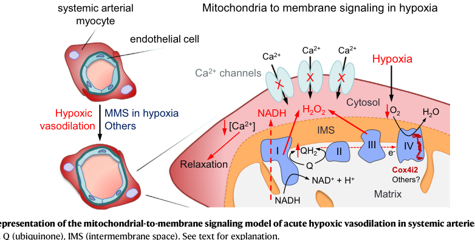

## Question

# Gene Research for Functional Annotation

## ⚠️ CRITICAL: Gene/Protein Identification Context

**BEFORE YOU BEGIN RESEARCH:** You MUST verify you are researching the CORRECT gene/protein. Gene symbols can be ambiguous, especially for less well-characterized genes from non-model organisms.

### Target Gene/Protein Identity (from UniProt):
- **UniProt Accession:** Q96KJ9
- **Protein Description:** RecName: Full=Cytochrome c oxidase subunit 4 isoform 2, mitochondrial; AltName: Full=Cytochrome c oxidase subunit IV isoform 2; Short=COX IV-2; Flags: Precursor;
- **Gene Information:** Name=COX4I2 {ECO:0000312|HGNC:HGNC:16232}; Synonyms=COX4L2 {ECO:0000312|HGNC:HGNC:16232};
- **Organism (full):** Homo sapiens (Human).
- **Protein Family:** Belongs to the cytochrome c oxidase IV family.
- **Key Domains:** Cyt_c_oxidase_su4. (IPR013288); Cyt_c_oxidase_su4_fam. (IPR004203); Cyt_c_oxidase_su4_sf. (IPR036639); COX4 (PF02936)

### MANDATORY VERIFICATION STEPS:

1. **Check if the gene symbol "COX4I2" matches the protein description above**
2. **Verify the organism is correct:** Homo sapiens (Human).
3. **Check if protein family/domains align with what you find in literature**
4. **If you find literature for a DIFFERENT gene with the same or similar symbol, STOP**

### If Gene Symbol is Ambiguous or You Cannot Find Relevant Literature:

**DO NOT PROCEED WITH RESEARCH ON A DIFFERENT GENE.** Instead:
- State clearly: "The gene symbol 'COX4I2' is ambiguous or literature is limited for this specific protein"
- Explain what you found (e.g., "Found extensive literature on a different gene with the same symbol in a different organism")
- Describe the protein based ONLY on the UniProt information provided above
- Suggest that the protein function can be inferred from domain/family information

### Research Target:

Please provide a comprehensive research report on the gene **COX4I2** (gene ID: COX4I2, UniProt: Q96KJ9) in human.

The research report should be a detailed narrative explaining the function, biological processes, and localization of the gene product. Citations should be given for all claims.

You should prioritize authoritative reviews and primary scientific literature when conducting research. You can supplement
this with annotations you find in gene/protein databases, but these can be outdated or inaccurate.

We are specifically interested in the primary function of the gene - for enzymes, what reaction is catalyzed, and what is the substrate specificity? For transporters, what is the substrate? For structural proteins or adapters, what is the broader structural role? For signaling molecules, what is the role in the pathway.

We are interested in where in or outside the cell the gene product carries out its function.

We are also interested in the signaling or biochemical pathways in which the gene functions. We are less interested in broad pleiotropic effects, except where these elucidate the precise role.

Include evidence where possible. We are interested in both experimental evidence as well as inference from structure, evolution, or bioinformatic analysis. Precise studies should be prioritized over high-throughput, where available.

## Output

Question: You are an expert researcher providing comprehensive, well-cited information.

Provide detailed information focusing on:
1. Key concepts and definitions with current understanding
2. Recent developments and latest research (prioritize 2023-2024 sources)
3. Current applications and real-world implementations
4. Expert opinions and analysis from authoritative sources
5. Relevant statistics and data from recent studies

Format as a comprehensive research report with proper citations. Include URLs and publication dates where available.
Always prioritize recent, authoritative sources and provide specific citations for all major claims.

# Gene Research for Functional Annotation

## ⚠️ CRITICAL: Gene/Protein Identification Context

**BEFORE YOU BEGIN RESEARCH:** You MUST verify you are researching the CORRECT gene/protein. Gene symbols can be ambiguous, especially for less well-characterized genes from non-model organisms.

### Target Gene/Protein Identity (from UniProt):
- **UniProt Accession:** Q96KJ9
- **Protein Description:** RecName: Full=Cytochrome c oxidase subunit 4 isoform 2, mitochondrial; AltName: Full=Cytochrome c oxidase subunit IV isoform 2; Short=COX IV-2; Flags: Precursor;
- **Gene Information:** Name=COX4I2 {ECO:0000312|HGNC:HGNC:16232}; Synonyms=COX4L2 {ECO:0000312|HGNC:HGNC:16232};
- **Organism (full):** Homo sapiens (Human).
- **Protein Family:** Belongs to the cytochrome c oxidase IV family.
- **Key Domains:** Cyt_c_oxidase_su4. (IPR013288); Cyt_c_oxidase_su4_fam. (IPR004203); Cyt_c_oxidase_su4_sf. (IPR036639); COX4 (PF02936)

### MANDATORY VERIFICATION STEPS:

1. **Check if the gene symbol "COX4I2" matches the protein description above**
2. **Verify the organism is correct:** Homo sapiens (Human).
3. **Check if protein family/domains align with what you find in literature**
4. **If you find literature for a DIFFERENT gene with the same or similar symbol, STOP**

### If Gene Symbol is Ambiguous or You Cannot Find Relevant Literature:

**DO NOT PROCEED WITH RESEARCH ON A DIFFERENT GENE.** Instead:
- State clearly: "The gene symbol 'COX4I2' is ambiguous or literature is limited for this specific protein"
- Explain what you found (e.g., "Found extensive literature on a different gene with the same symbol in a different organism")
- Describe the protein based ONLY on the UniProt information provided above
- Suggest that the protein function can be inferred from domain/family information

### Research Target:

Please provide a comprehensive research report on the gene **COX4I2** (gene ID: COX4I2, UniProt: Q96KJ9) in human.

The research report should be a detailed narrative explaining the function, biological processes, and localization of the gene product. Citations should be given for all claims.

You should prioritize authoritative reviews and primary scientific literature when conducting research. You can supplement
this with annotations you find in gene/protein databases, but these can be outdated or inaccurate.

We are specifically interested in the primary function of the gene - for enzymes, what reaction is catalyzed, and what is the substrate specificity? For transporters, what is the substrate? For structural proteins or adapters, what is the broader structural role? For signaling molecules, what is the role in the pathway.

We are interested in where in or outside the cell the gene product carries out its function.

We are also interested in the signaling or biochemical pathways in which the gene functions. We are less interested in broad pleiotropic effects, except where these elucidate the precise role.

Include evidence where possible. We are interested in both experimental evidence as well as inference from structure, evolution, or bioinformatic analysis. Precise studies should be prioritized over high-throughput, where available.

# Comprehensive Research Report: Human **COX4I2** (UniProt **Q96KJ9**) — Functional Annotation and Current Evidence

## 0. Target verification (mandatory identity check)

The queried gene **COX4I2** corresponds to **cytochrome c oxidase subunit 4 isoform 2 (COX IV-2)**, a nuclear-encoded accessory/regulatory subunit of **mitochondrial complex IV (cytochrome c oxidase)**, consistent with UniProt accession **Q96KJ9** and membership in the **COX4/cytochrome c oxidase subunit IV family**. The primary literature and reviews retrieved here consistently discuss **COX4I2/COX4i2** as a complex IV subunit isoform involved in oxygen-dependent regulation and oxygen-sensing physiology, with no conflicting “same symbol different protein” cases in the evidence set. (reguera2020cytochromecoxidase pages 1-3, cunatova2020roleofcytochrome pages 5-7)

## 1. Key concepts and definitions (current understanding)

### 1.1 What COX4I2 is

**COX4I2** encodes an **alternative isoform** of the COX4 subunit of cytochrome c oxidase (complex IV). COX4 is one of the larger nuclear-encoded complex IV subunits with a **matrix-facing extrinsic domain** that contributes to complex IV regulation, and structural interactions that influence cytochrome c docking/architecture near COX2. (reguera2020cytochromecoxidase pages 1-3, cunatova2020roleofcytochrome pages 5-7)

### 1.2 Where COX4I2 acts in the cell

COX4I2 is synthesized in the cytosol as a **mitochondrial precursor** and becomes incorporated into complex IV in the **inner mitochondrial membrane**, with functional surfaces facing the matrix and the intermembrane space as part of the assembled oxidase. (reguera2020cytochromecoxidase pages 1-3)

### 1.3 Primary molecular function (what it *does*)

COX4I2 **does not create a new catalytic reaction**; complex IV’s canonical chemistry remains the terminal step of the respiratory chain (electron transfer to O2 with reduction to water and proton pumping). Instead, COX4I2 is best understood as a **regulatory/kinetic tuning subunit** that changes how complex IV responds to oxygen tension and cellular metabolic state (e.g., ATP/ADP control), thereby influencing downstream signaling (NADH/ROS) in specialized O2-sensing contexts. (reguera2020cytochromecoxidase pages 1-3, cunatova2020roleofcytochrome pages 5-7, cunatova2020roleofcytochrome pages 7-8)

## 2. Mechanistic function and experimental evidence

### 2.1 COX4I2 decreases apparent oxygen affinity of complex IV

A controlled **isoform-exchange** system in human cells (HEK293 COX4i1/2 knockout background with single-isoform knock-in) showed that replacing COX4I1 with **COX4I2** produced a **~2-fold increase in p50** (oxygen partial pressure at half-maximal respiration), indicating a **decrease in complex IV oxygen affinity** while leaving overall complex IV activity and cytochrome c affinity broadly similar. (reguera2020cytochromecoxidase pages 15-17, reguera2020cytochromecoxidase pages 1-3, cunatova2020roleofcytochrome pages 7-8)

### 2.2 Metabolic and redox phenotypes associated with COX4I2 under normoxia

In the same engineered human-cell context, COX4I2 expression was associated with:

* **OCR/ECAR ratio ~1.4-fold higher** (greater relative reliance on oxidative metabolism). (reguera2020cytochromecoxidase pages 13-15)
* **NAD+/NADH ~20% higher** (a more oxidized NAD pool). (reguera2020cytochromecoxidase pages 13-15)
* **Basal ROS ~1.5-fold lower** under normoxia. (reguera2020cytochromecoxidase pages 13-15)

These data support a model in which COX4I2 can re-shape electron transport chain behavior and cellular redox state, consistent with a “tuning” rather than catalytic role. (reguera2020cytochromecoxidase pages 13-15, reguera2020cytochromecoxidase pages 15-17)

### 2.3 COX4I2 and oxygen-sensing signaling in specialized tissues

Mechanistically, COX4I2 is repeatedly implicated in “mitochondria-to-membrane signaling,” where **hypoxia slows electron transport**, promoting **NADH and ROS/H2O2 accumulation** that modulate ion channels and excitability/contractility in oxygen-sensing cells. (morenodominguez2020acuteo2 pages 1-2, colinas2023constitutiveexpressionof pages 8-11)

## 3. Regulation and expression: hypoxia/HIF pathways

### 3.1 Hypoxia-inducible regulation

COX4I2 expression is **oxygen-regulated** and commonly described as hypoxia-inducible, with **HIF-1α** acting on promoter hypoxia response elements and additional factors (e.g., RBPJ, CHCHD2/MNRR1, CXXC5) implicated in transcriptional control. (cunatova2020roleofcytochrome pages 5-7, cunatova2020roleofcytochrome pages 7-8)

### 3.2 HIF-dependent “atypical subunit programs” in O2-sensing cells

In carotid body glomus cells, HIF2α-dependent gene expression includes atypical mitochondrial subunits such as **Cox4i2**, and HIF2α deficiency reduces expression of these subunits while disrupting acute hypoxia responses; genetic deletion of **Cox4i2** is reported to mimic the defective hypoxic responses of HIF2α loss. (morenodominguez2020acuteo2 pages 1-2)

In vascular smooth muscle, recent work supports a parallel concept: **HIF1α** maintains expression of atypical complex IV subunit isoforms (including Cox4i2) that enable acute O2 modulation of ion channels and vascular responses. (morenodominguez2024hif1αdependentmitochondrialacute pages 7-8, morenodominguez2024hif1αdependentmitochondrialacute pages 9-10)

## 4. Recent developments (priority 2023–2024)

### 4.1 2024: COX4I2 is required for acute hypoxic vasodilation signaling (Nature Communications)

A 2024 **Nature Communications** study (published Aug 2024) provides direct genetic evidence connecting Cox4i2 to **acute O2 modulation of L-type Ca2+ channels** in arterial smooth muscle cells and to **hypoxic vasodilation**. The authors generated conditional Cox4i2-deficient mouse models (including smooth muscle–specific and inducible Cre strategies) and observed that hypoxic modulation of Ca2+ currents was strongly inhibited in Cox4i2-deficient myocytes. Reported sample sizes include electrophysiology WT **n=11/4 cells/mice** vs COX4I2-UBC **n=10/4**, and vascular ring force experiments **n=12/4 rings/mice** for key assays. (morenodominguez2024hif1αdependentmitochondrialacute pages 9-10, morenodominguez2024hif1αdependentmitochondrialacute pages 11-12)

The study also supports the upstream regulatory role of HIF1α in maintaining Cox4i2 (and Cox8b) expression in vascular smooth muscle, aligning transcriptional programming with acute O2 responsiveness. (morenodominguez2024hif1αdependentmitochondrialacute pages 7-8)

**Visual evidence** from this paper (Figure 9 and Figure 10; cropped) shows the knockout phenotypes and the proposed mitochondrial-to-membrane signaling schematic. (morenodominguez2024hif1αdependentmitochondrialacute media 61867096, morenodominguez2024hif1αdependentmitochondrialacute media add88729)

### 4.2 2023: HIF2α–COX4I2 program in carotid body oxygen sensing (peer-reviewed chapter)

A 2023 peer-reviewed chapter emphasizes that glomus-cell complex IV exhibits unusually low apparent O2 affinity attributed to specific subunit isoforms including **Cox4i2**, and notes that conditional deletion of Cox4i2 produces a phenotype similar to HIF2α deficiency (marked loss of hypoxic responsiveness). Importantly, it explicitly states that the precise molecular mechanism by which Cox4i2 (and related subunits) changes enzyme kinetics remains incompletely understood and requires future work. (colinas2023constitutiveexpressionof pages 8-11)

## 5. Physiological roles and pathways

### 5.1 Carotid body acute O2 sensing and ventilatory control

A key 2020 Science Signaling paper provides direct evidence that **COX4I2 is necessary for the hypoxic ventilatory response (HVR)**. The work reports plethysmography in wild-type versus COX4I2-null mice showing selective impairment of the HVR, with quantified respiratory frequency across conditions; reported group sizes include **Nx n=12**, **Hx n=12**, **CO2 n=8**. Cellular readouts include hypoxia-induced autofluorescence/ROS-related measures with explicit cell/mouse counts (e.g., WT **n=16/4** vs KO **n=15/5** for a glomus-cell metric). (morenodominguez2020acuteo2 pages 7-8, morenodominguez2020acuteo2 pages 1-2)

### 5.2 Pulmonary vascular O2 sensing and hypoxic pulmonary vasoconstriction

Synthesized evidence in pulmonary vascular contexts indicates Cox4i2 deficiency abolishes **hypoxic pulmonary vasoconstriction (HPV)** and prevents hypoxia-induced mitochondrial hyperpolarization and ROS increases in pulmonary artery smooth muscle cells, placing Cox4i2 upstream of membrane depolarization and Ca2+-dependent contraction. (alebrahimdehkordi2021theroleof pages 101-104)

### 5.3 Proposed integrated pathway: “mitochondria-to-membrane signaling”

Across carotid body glomus cells and vascular smooth muscle, a convergent model is supported in which COX4I2-containing complex IV promotes a regime where hypoxia produces rapid changes in ETC redox state, leading to signaling molecules (notably **NADH and H2O2/ROS**) that modulate ion channels (K+ and Ca2+ channels) and thereby control secretion (glomus cells) or tone (smooth muscle). (morenodominguez2024hif1αdependentmitochondrialacute pages 9-10, morenodominguez2024hif1αdependentmitochondrialacute pages 11-12, morenodominguez2020acuteo2 pages 1-2, colinas2023constitutiveexpressionof pages 8-11)

## 6. Current applications and real-world implementations

### 6.1 Clinical trial biomarker usage (not an intervention target)

A Phase 2 interventional clinical trial record (**NCT02845063**, first posted 2016; terminated) includes **COX4I2** explicitly among **molecular outcome measures** in skeletal muscle, listing COX4I2 in both an mRNA panel and a protein panel. In this trial, COX4I2 is treated as a **measured biomarker** rather than an intervention target or genotype. (NCT02845063 chunk 1)

URL: https://clinicaltrials.gov/study/NCT02845063 (trial identifier in evidence: NCT02845063) (NCT02845063 chunk 1)

### 6.2 Disease association resources

Open Targets lists limited evidence linking COX4I2 to several traits/diseases (e.g., **hypertension**) with modest association scores (e.g., hypertension score ~0.109) and small evidence counts (evidence_size=5 in the retrieved output). This indicates possible relevance but does not constitute strong causal validation on its own. (OpenTargets Search: -COX4I2)

URL: https://platform.opentargets.org/target/ENSG00000131055 (OpenTargets Search: -COX4I2)

## 7. Expert opinions, consensus points, and uncertainties

### 7.1 Consensus themes

Authoritative reviews converge on the idea that COX4I2 supports **specialized oxygen-sensing phenotypes** by tuning complex IV oxygen affinity and regulatory behavior (ATP sensitivity/redox control), rather than altering complex IV’s catalytic identity. (cunatova2020roleofcytochrome pages 5-7, cunatova2020roleofcytochrome pages 7-8)

A 2025 review synthesis explicitly frames COX4I2 as enriched in lung/vascular smooth muscle and carotid body, and discusses that isoform exchange decreases oxygen affinity, offering a plausible molecular handle for acute oxygen sensing. It also highlights upstream transcriptional regulators (RBPJ, CXXC5, CHCHD2) controlling COX4-2 expression. (gao2025thecarotidbody pages 7-8, gao2025thecarotidbody pages 4-6)

### 7.2 Open questions and controversies

A recurring issue is a quantitative mismatch between biochemical oxygen-affinity shifts measured in simplified systems and the oxygen tensions that gate physiological responses; reviews note that additional context (other atypical subunits and mitochondrial organization) likely shapes effective oxygen sensitivity. (gao2025thecarotidbody pages 4-6, colinas2023constitutiveexpressionof pages 8-11)

## 8. Summary of quantitative findings (selected statistics)

* **Complex IV oxygen affinity:** COX4I2-containing complex IV shows **~2× higher p50** (lower O2 affinity) than COX4I1 in engineered human cells. (reguera2020cytochromecoxidase pages 15-17, reguera2020cytochromecoxidase pages 1-3)
* **Metabolic/redox changes (normoxia, human cell model):** OCR/ECAR **1.4× higher**, NAD+/NADH **~20% higher**, basal ROS **~1.5× lower** with COX4I2. (reguera2020cytochromecoxidase pages 13-15)
* **Ventilatory physiology (mouse):** COX4I2-null mice show selective impairment of HVR with group sizes **n=12** (normoxia), **n=12** (hypoxia), **n=8** (hypercapnia) in reported respiratory-frequency analyses. (morenodominguez2020acuteo2 pages 7-8)
* **Vascular physiology (2024):** COX4I2 conditional deletion in smooth muscle/myocytes strongly inhibits hypoxic modulation of L-type Ca2+ currents; representative electrophysiology sizes **WT n=11/4** vs **KO n=10/4 cells/mice**, and vascular ring assays **n=12/4 rings/mice**. (morenodominguez2024hif1αdependentmitochondrialacute pages 9-10, morenodominguez2024hif1αdependentmitochondrialacute pages 11-12)

## Evidence map table

| Topic | Key claim | Evidence type/model | Quantitative/statistical detail | Primary source (authors, journal, year) | URL/DOI | PaperQA citation id |
|---|---|---|---|---|---|---|
| Function | COX4I2 is the alternative nuclear-encoded COX4 subunit of cytochrome c oxidase (complex IV), localized in the inner mitochondrial membrane; its matrix-facing domain is regulatory and its C-terminal region contributes to cytochrome c docking architecture. | Human cell/biochemical literature synthesis; structural-functional interpretation | No single pooled statistic; review-level synthesis of domain orientation and regulatory role | Reguera et al., *Cells*, 2020 | https://doi.org/10.3390/cells9020443 | (reguera2020cytochromecoxidase pages 1-3) |
| Localization | COX4I2 is a mitochondrial precursor protein incorporated into complex IV in the inner mitochondrial membrane; expression is enriched in lung, heart, and brain, with especially high expression in pulmonary artery smooth muscle cells. | Human HEK293 knock-in work and review synthesis | Tissue enrichment described qualitatively; no unified fold-change reported in retrieved excerpts | Reguera et al., *Cells*, 2020; Čunátová et al., *Physiological Research*, 2020 | https://doi.org/10.3390/cells9020443; https://doi.org/10.33549/physiolres.934446 | (reguera2020cytochromecoxidase pages 1-3, cunatova2020roleofcytochrome pages 5-7, reguera2020cytochromecoxidase pages 13-15) |
| Function | Replacing COX4I1 with COX4I2 lowers complex IV oxygen affinity while leaving overall COX activity, cytochrome c affinity, and maximal respiration broadly similar. | HEK293 COX4i1/2 double-KO followed by single-isoform knock-in | p50 increased about 2-fold in COX4I2 versus COX4I1 cells, indicating decreased O2 affinity | Reguera et al., *Cells*, 2020 | https://doi.org/10.3390/cells9020443 | (reguera2020cytochromecoxidase pages 15-17, reguera2020cytochromecoxidase pages 1-3, cunatova2020roleofcytochrome pages 7-8) |
| Function/Metabolism | COX4I2-containing cells are biased toward oxidative metabolism and a more oxidized redox state under normoxia. | HEK293 isoform-specific knock-in lines | OCR/ECAR ratio 1.4-fold higher; NAD+/NADH ratio ~20% higher in COX4I2 cells | Reguera et al., *Cells*, 2020 | https://doi.org/10.3390/cells9020443 | (reguera2020cytochromecoxidase pages 13-15, reguera2020cytochromecoxidase pages 15-17) |
| Function/ROS | COX4I2 expression is associated with lower mitochondrial ROS in normoxia, but is also linked in specialized oxygen-sensing tissues to hypoxia-evoked ROS signaling. | HEK293 knock-in metabolic phenotyping; physiology literature synthesis | Basal ROS production ~1.5-fold decreased in COX4I2 knock-in cells under normoxia | Reguera et al., *Cells*, 2020 | https://doi.org/10.3390/cells9020443 | (reguera2020cytochromecoxidase pages 13-15, reguera2020cytochromecoxidase pages 15-17) |
| Regulation | COX4I2 is oxygen-regulated and induced by hypoxia through HIF pathways; HIF-1α acts on promoter hypoxia-response elements/ORE, while RBPJ, CHCHD2 (MNRR1), and CXXC5 also regulate promoter activity. | Review of human/mammalian mechanistic studies | Regulatory elements described qualitatively; no single summary effect size | Čunátová et al., *Physiological Research*, 2020 | https://doi.org/10.33549/physiolres.934446 | (cunatova2020roleofcytochrome pages 5-7, cunatova2020roleofcytochrome pages 7-8) |
| Regulation | In COX4I1 deficiency, COX4I2 can be upregulated as a compensatory hypoxia-like response mediated by HIF-1α. | Human fibroblast/patient-cell study summary | Retrieved excerpt gives no specific fold-change in COX4I2, but reports HIF-1α stabilization and nuclear localization with COX4I2 upregulation | Douiev et al., *Cells*, 2021 | https://doi.org/10.3390/cells10020452 | (douiev2021upregulationofcox42 pages 15-15) |
| Physiology | COX4I2 is required for acute arterial O2 sensing that modulates L-type Ca2+ channels and contributes to hypoxic vasodilation. | Conditional mouse genetics (COX4I2-SM, COX4I2-UBC), acutely dispersed femoral artery myocytes, arterial ring assays | Hypoxic modulation of Ca2+ currents was strongly inhibited in COX4I2-deficient myocytes; reported sample sizes include WT n=11/4 cells/mice vs COX4I2-UBC n=10/4 for electrophysiology, and n=12/4 rings/mice for vascular force assays | Moreno-Domínguez et al., *Nature Communications*, 2024 | https://doi.org/10.1038/s41467-024-51023-3 | (morenodominguez2024hif1αdependentmitochondrialacute pages 9-10, morenodominguez2024hif1αdependentmitochondrialacute pages 11-12) |
| Regulation/Physiology | HIF1α maintains expression of atypical complex IV subunits including COX4I2 in vascular smooth muscle, linking constitutive transcriptional programming to acute O2 responsiveness. | Conditional Hif1α smooth-muscle knockout mouse study | HIF1α-SM deletion selectively decreased Hif1α mRNA and downregulated Cox4i2/Cox8b; representative Ca2+ current experiments report sample sizes such as n=14/4 cells/mice in some measures | Moreno-Domínguez et al., *Nature Communications*, 2024 | https://doi.org/10.1038/s41467-024-51023-3 | (morenodominguez2024hif1αdependentmitochondrialacute pages 7-8) |
| Physiology | In carotid body glomus cells, COX4I2 is part of the HIF2α-dependent atypical ETC program required for acute hypoxia signaling and the hypoxic ventilatory response (HVR). | Conditional knockout and whole-animal plethysmography; glomus-cell autofluorescence/ROS assays | Respiratory frequency quantified in WT vs COX4I2-null mice during normoxia/hypoxia/hypercapnia with Nx n=12, Hx n=12, CO2 n=8; glomus-cell NADPH autofluorescence WT n=16/4 vs KO n=15/5 cells/mice | Moreno-Domínguez et al., *Science Signaling*, 2020 | https://doi.org/10.1126/scisignal.aay9452 | (morenodominguez2020acuteo2 pages 7-8, morenodominguez2020acuteo2 pages 1-2) |
| Physiology | Genetic deletion of Cox4i2 phenocopies key defective hypoxic responses seen after Epas1/HIF2α loss in glomus cells, supporting a causal role in acute O2 sensing rather than a generic mitochondrial defect. | Conditional catecholaminergic-tissue knockout framework | Qualitative phenocopy claim; no additional pooled numeric effect size in retrieved excerpt | Moreno-Domínguez et al., *Science Signaling*, 2020; Colinas et al., *Advances in Experimental Medicine and Biology*, 2023 | https://doi.org/10.1126/scisignal.aay9452; https://doi.org/10.1007/978-3-031-32371-3_17 | (morenodominguez2020acuteo2 pages 1-2, colinas2023constitutiveexpressionof pages 8-11) |
| Physiology | In pulmonary vasculature models, Cox4i2 deficiency abolishes hypoxic pulmonary vasoconstriction and prevents hypoxia-induced mitochondrial hyperpolarization, ROS increase, and membrane depolarization in PASMCs. | Mouse knockout/PASMC physiology summary | Qualitative effect in retrieved excerpt; one mechanistic threshold noted for mouse PASMC L-type Ca2+ channel activation at about −30 to −20 mV | Alebrahimdehkordi, dissertation/review synthesis, 2021 | https://doi.org/10.22029/jlupub-29 | (alebrahimdehkordi2021theroleof pages 101-104) |
| Expert analysis | Reviews argue COX4I2 fine-tunes complex IV for low-O2 environments and specialized oxygen-sensing cells by altering ATP regulation, redox signaling, and O2 affinity rather than catalytic identity. | Authoritative review/expert synthesis | Review cites two-fold reduction in O2 affinity upon COX4I1→COX4I2 exchange and links this to oxygen sensing | Čunátová et al., *Physiological Research*, 2020; López-Barneo & Ortega-Sáenz, *Crit Rev Biochem Mol Biol*, 2022 | https://doi.org/10.33549/physiolres.934446; https://doi.org/10.1080/10409238.2021.2004575 | (cunatova2020roleofcytochrome pages 5-7, cunatova2020roleofcytochrome pages 7-8) |
| Disease | Current disease-link databases show limited but nonzero associations for COX4I2, including hypertension and rare phenotype terms, but evidence is sparse and based partly on older literature/variant assertions rather than strong target-validation datasets. | Open Targets knowledgebase aggregation | Open Targets reported evidence_size=5 for hypertension and for several phenotype/rare-disease terms; hypertension association score ~0.109 | Open Targets Platform query for COX4I2 | https://platform.opentargets.org/target/ENSG00000131055 | (OpenTargets Search: -COX4I2) |

*Table: This table summarizes key functional-annotation facts for human COX4I2, emphasizing experimentally supported roles in complex IV oxygen handling, hypoxia regulation, vascular and carotid-body physiology, and current disease-association evidence. It is useful as a compact evidence map linking specific claims to primary studies and citation IDs.*

## Key figure support

Cropped figures illustrating COX4I2 knockout effects (electrophysiology/vasodilation) and the proposed mitochondrial-to-membrane signaling model are available from the 2024 Nature Communications study. (morenodominguez2024hif1αdependentmitochondrialacute media 61867096, morenodominguez2024hif1αdependentmitochondrialacute media add88729)

## References (URLs and dates where available)

* Moreno-Domínguez A. et al. **Hif1α-dependent mitochondrial acute O2 sensing and signaling to myocyte Ca2+ channels mediate arterial hypoxic vasodilation.** *Nature Communications* **15** (Aug 2024). DOI/URL: https://doi.org/10.1038/s41467-024-51023-3 (morenodominguez2024hif1αdependentmitochondrialacute pages 9-10, morenodominguez2024hif1αdependentmitochondrialacute pages 11-12)
* Colinas O. et al. **Constitutive expression of HIF2α confers acute O2 sensitivity to carotid body glomus cells.** *Advances in Experimental Medicine and Biology* (Jan 2023). DOI/URL: https://doi.org/10.1007/978-3-031-32371-3_17 (colinas2023constitutiveexpressionof pages 8-11)
* Reguera D.P. et al. **Cytochrome c oxidase subunit 4 isoform exchange results in modulation of oxygen affinity.** *Cells* **9**:443 (Feb 2020). DOI/URL: https://doi.org/10.3390/cells9020443 (reguera2020cytochromecoxidase pages 15-17, reguera2020cytochromecoxidase pages 13-15)
* Moreno-Domínguez A. et al. **Acute O2 sensing through HIF2α-dependent expression of atypical cytochrome oxidase subunits in arterial chemoreceptors.** *Science Signaling* (Jan 2020). DOI/URL: https://doi.org/10.1126/scisignal.aay9452 (morenodominguez2020acuteo2 pages 7-8, morenodominguez2020acuteo2 pages 1-2)
* Čunátová K. et al. **Role of cytochrome c oxidase nuclear-encoded subunits in health and disease.** *Physiological Research* (Nov 2020). DOI/URL: https://doi.org/10.33549/physiolres.934446 (cunatova2020roleofcytochrome pages 5-7, cunatova2020roleofcytochrome pages 7-8)
* ClinicalTrials.gov **NCT02845063**: Effect of ACE Genotype on Cardiovascular Rehabilitation (first posted 2016; terminated). URL: https://clinicaltrials.gov/study/NCT02845063 (NCT02845063 chunk 1)
* Open Targets Platform: **COX4I2 (ENSG00000131055)**. URL: https://platform.opentargets.org/target/ENSG00000131055 (OpenTargets Search: -COX4I2)

References

1. (reguera2020cytochromecoxidase pages 1-3): David Pajuelo Reguera, Kristýna Čunátová, Marek Vrbacký, Alena Pecinová, Josef Houštěk, Tomáš Mráček, and Petr Pecina. Cytochrome c oxidase subunit 4 isoform exchange results in modulation of oxygen affinity. Cells, 9:443, Feb 2020. URL: https://doi.org/10.3390/cells9020443, doi:10.3390/cells9020443. This article has 102 citations.

2. (cunatova2020roleofcytochrome pages 5-7): K Čunátová, D Pajuelo Reguera, J Houštěk, T Mráček, and P Pecina. Role of cytochrome c oxidase nuclear-encoded subunits in health and disease. Physiological research, Nov 2020. URL: https://doi.org/10.33549/physiolres.934446, doi:10.33549/physiolres.934446. This article has 81 citations and is from a peer-reviewed journal.

3. (cunatova2020roleofcytochrome pages 7-8): K Čunátová, D Pajuelo Reguera, J Houštěk, T Mráček, and P Pecina. Role of cytochrome c oxidase nuclear-encoded subunits in health and disease. Physiological research, Nov 2020. URL: https://doi.org/10.33549/physiolres.934446, doi:10.33549/physiolres.934446. This article has 81 citations and is from a peer-reviewed journal.

4. (reguera2020cytochromecoxidase pages 15-17): David Pajuelo Reguera, Kristýna Čunátová, Marek Vrbacký, Alena Pecinová, Josef Houštěk, Tomáš Mráček, and Petr Pecina. Cytochrome c oxidase subunit 4 isoform exchange results in modulation of oxygen affinity. Cells, 9:443, Feb 2020. URL: https://doi.org/10.3390/cells9020443, doi:10.3390/cells9020443. This article has 102 citations.

5. (reguera2020cytochromecoxidase pages 13-15): David Pajuelo Reguera, Kristýna Čunátová, Marek Vrbacký, Alena Pecinová, Josef Houštěk, Tomáš Mráček, and Petr Pecina. Cytochrome c oxidase subunit 4 isoform exchange results in modulation of oxygen affinity. Cells, 9:443, Feb 2020. URL: https://doi.org/10.3390/cells9020443, doi:10.3390/cells9020443. This article has 102 citations.

6. (morenodominguez2020acuteo2 pages 1-2): Alejandro Moreno-Domínguez, Patricia Ortega-Sáenz, Lin Gao, Olalla Colinas, Paula García-Flores, Victoria Bonilla-Henao, Julián Aragonés, Maik Hüttemann, Lawrence I. Grossman, Norbert Weissmann, Natascha Sommer, and José López-Barneo. Acute o 2 sensing through hif2α-dependent expression of atypical cytochrome oxidase subunits in arterial chemoreceptors. Science Signaling, Jan 2020. URL: https://doi.org/10.1126/scisignal.aay9452, doi:10.1126/scisignal.aay9452. This article has 110 citations and is from a domain leading peer-reviewed journal.

7. (colinas2023constitutiveexpressionof pages 8-11): Olalla Colinas, Alejandro Moreno-Domínguez, Patricia Ortega-Sáenz, and José López-Barneo. Constitutive expression of hif2α confers acute o2 sensitivity to carotid body glomus cells. Advances in Experimental Medicine and Biology, pages 153-162, Jan 2023. URL: https://doi.org/10.1007/978-3-031-32371-3\_17, doi:10.1007/978-3-031-32371-3\_17. This article has 10 citations and is from a peer-reviewed journal.

8. (morenodominguez2024hif1αdependentmitochondrialacute pages 7-8): Alejandro Moreno-Domínguez, Olalla Colinas, Ignacio Arias-Mayenco, José M. Cabeza, Juan L. López-Ogayar, Navdeep S. Chandel, Norbert Weissmann, Natascha Sommer, Alberto Pascual, and José López-Barneo. Hif1α-dependent mitochondrial acute o2 sensing and signaling to myocyte ca2+ channels mediate arterial hypoxic vasodilation. Nature Communications, Aug 2024. URL: https://doi.org/10.1038/s41467-024-51023-3, doi:10.1038/s41467-024-51023-3. This article has 20 citations and is from a highest quality peer-reviewed journal.

9. (morenodominguez2024hif1αdependentmitochondrialacute pages 9-10): Alejandro Moreno-Domínguez, Olalla Colinas, Ignacio Arias-Mayenco, José M. Cabeza, Juan L. López-Ogayar, Navdeep S. Chandel, Norbert Weissmann, Natascha Sommer, Alberto Pascual, and José López-Barneo. Hif1α-dependent mitochondrial acute o2 sensing and signaling to myocyte ca2+ channels mediate arterial hypoxic vasodilation. Nature Communications, Aug 2024. URL: https://doi.org/10.1038/s41467-024-51023-3, doi:10.1038/s41467-024-51023-3. This article has 20 citations and is from a highest quality peer-reviewed journal.

10. (morenodominguez2024hif1αdependentmitochondrialacute pages 11-12): Alejandro Moreno-Domínguez, Olalla Colinas, Ignacio Arias-Mayenco, José M. Cabeza, Juan L. López-Ogayar, Navdeep S. Chandel, Norbert Weissmann, Natascha Sommer, Alberto Pascual, and José López-Barneo. Hif1α-dependent mitochondrial acute o2 sensing and signaling to myocyte ca2+ channels mediate arterial hypoxic vasodilation. Nature Communications, Aug 2024. URL: https://doi.org/10.1038/s41467-024-51023-3, doi:10.1038/s41467-024-51023-3. This article has 20 citations and is from a highest quality peer-reviewed journal.

11. (morenodominguez2024hif1αdependentmitochondrialacute media 61867096): Alejandro Moreno-Domínguez, Olalla Colinas, Ignacio Arias-Mayenco, José M. Cabeza, Juan L. López-Ogayar, Navdeep S. Chandel, Norbert Weissmann, Natascha Sommer, Alberto Pascual, and José López-Barneo. Hif1α-dependent mitochondrial acute o2 sensing and signaling to myocyte ca2+ channels mediate arterial hypoxic vasodilation. Nature Communications, Aug 2024. URL: https://doi.org/10.1038/s41467-024-51023-3, doi:10.1038/s41467-024-51023-3. This article has 20 citations and is from a highest quality peer-reviewed journal.

12. (morenodominguez2024hif1αdependentmitochondrialacute media add88729): Alejandro Moreno-Domínguez, Olalla Colinas, Ignacio Arias-Mayenco, José M. Cabeza, Juan L. López-Ogayar, Navdeep S. Chandel, Norbert Weissmann, Natascha Sommer, Alberto Pascual, and José López-Barneo. Hif1α-dependent mitochondrial acute o2 sensing and signaling to myocyte ca2+ channels mediate arterial hypoxic vasodilation. Nature Communications, Aug 2024. URL: https://doi.org/10.1038/s41467-024-51023-3, doi:10.1038/s41467-024-51023-3. This article has 20 citations and is from a highest quality peer-reviewed journal.

13. (morenodominguez2020acuteo2 pages 7-8): Alejandro Moreno-Domínguez, Patricia Ortega-Sáenz, Lin Gao, Olalla Colinas, Paula García-Flores, Victoria Bonilla-Henao, Julián Aragonés, Maik Hüttemann, Lawrence I. Grossman, Norbert Weissmann, Natascha Sommer, and José López-Barneo. Acute o 2 sensing through hif2α-dependent expression of atypical cytochrome oxidase subunits in arterial chemoreceptors. Science Signaling, Jan 2020. URL: https://doi.org/10.1126/scisignal.aay9452, doi:10.1126/scisignal.aay9452. This article has 110 citations and is from a domain leading peer-reviewed journal.

14. (alebrahimdehkordi2021theroleof pages 101-104): The role of mitochondrial reactive oxygen species in oxygen sensing in the pulmonary vasculature – use of novel genetic tools This article has 0 citations.

15. (NCT02845063 chunk 1):  Effect of ACE Genotype on Cardiovascular Rehabilitation. Balgrist University Hospital. 2016. ClinicalTrials.gov Identifier: NCT02845063

16. (OpenTargets Search: -COX4I2): Open Targets Query (-COX4I2, 5 results). Buniello, A. et al. (2025). Open Targets Platform: facilitating therapeutic hypotheses building in drug discovery. Nucleic Acids Research.

17. (gao2025thecarotidbody pages 7-8): Lin Gao, Alejandro Moreno-Domínguez, Patricia Ortega-Sáenz, and José López-Barneo. The carotid body oxygen sensor. Jun 2025. URL: https://doi.org/10.1016/j.conb.2025.103022, doi:10.1016/j.conb.2025.103022. This article has 3 citations and is from a peer-reviewed journal.

18. (gao2025thecarotidbody pages 4-6): Lin Gao, Alejandro Moreno-Domínguez, Patricia Ortega-Sáenz, and José López-Barneo. The carotid body oxygen sensor. Jun 2025. URL: https://doi.org/10.1016/j.conb.2025.103022, doi:10.1016/j.conb.2025.103022. This article has 3 citations and is from a peer-reviewed journal.

19. (douiev2021upregulationofcox42 pages 15-15): Liza Douiev, Chaya Miller, Shmuel Ruppo, Hadar Benyamini, Bassam Abu-Libdeh, and Ann Saada. Upregulation of cox4-2 via hif-1α in mitochondrial cox4-1 deficiency. Cells, 10:452, Feb 2021. URL: https://doi.org/10.3390/cells10020452, doi:10.3390/cells10020452. This article has 33 citations.

## Artifacts

- [Edison artifact artifact-00](COX4I2-deep-research-falcon_artifacts/artifact-00.md)

## Citations

1. reguera2020cytochromecoxidase pages 1-3
2. reguera2020cytochromecoxidase pages 13-15
3. colinas2023constitutiveexpressionof pages 8-11
4. alebrahimdehkordi2021theroleof pages 101-104
5. cunatova2020roleofcytochrome pages 5-7
6. cunatova2020roleofcytochrome pages 7-8
7. reguera2020cytochromecoxidase pages 15-17
8. gao2025thecarotidbody pages 7-8
9. gao2025thecarotidbody pages 4-6
10. https://clinicaltrials.gov/study/NCT02845063
11. https://platform.opentargets.org/target/ENSG00000131055
12. https://doi.org/10.3390/cells9020443
13. https://doi.org/10.3390/cells9020443;
14. https://doi.org/10.33549/physiolres.934446
15. https://doi.org/10.3390/cells10020452
16. https://doi.org/10.1038/s41467-024-51023-3
17. https://doi.org/10.1126/scisignal.aay9452
18. https://doi.org/10.1126/scisignal.aay9452;
19. https://doi.org/10.1007/978-3-031-32371-3_17
20. https://doi.org/10.22029/jlupub-29
21. https://doi.org/10.33549/physiolres.934446;
22. https://doi.org/10.1080/10409238.2021.2004575
23. https://doi.org/10.3390/cells9020443,
24. https://doi.org/10.33549/physiolres.934446,
25. https://doi.org/10.1126/scisignal.aay9452,
26. https://doi.org/10.1007/978-3-031-32371-3\_17,
27. https://doi.org/10.1038/s41467-024-51023-3,
28. https://doi.org/10.1016/j.conb.2025.103022,
29. https://doi.org/10.3390/cells10020452,