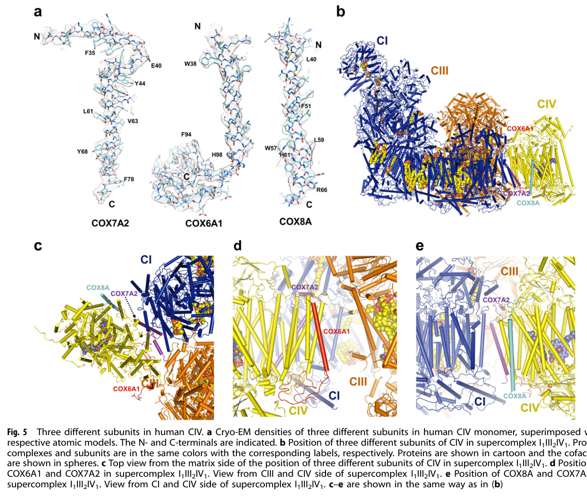

## Question

# Gene Research for Functional Annotation

## ⚠️ CRITICAL: Gene/Protein Identification Context

**BEFORE YOU BEGIN RESEARCH:** You MUST verify you are researching the CORRECT gene/protein. Gene symbols can be ambiguous, especially for less well-characterized genes from non-model organisms.

### Target Gene/Protein Identity (from UniProt):
- **UniProt Accession:** P12074
- **Protein Description:** RecName: Full=Cytochrome c oxidase subunit 6A1, mitochondrial; AltName: Full=Cytochrome c oxidase polypeptide VIa-liver; AltName: Full=Cytochrome c oxidase subunit VIA-liver; Short=COX VIa-L; Flags: Precursor;
- **Gene Information:** Name=COX6A1; Synonyms=COX6AL;
- **Organism (full):** Homo sapiens (Human).
- **Protein Family:** Belongs to the cytochrome c oxidase subunit 6A family.
- **Key Domains:** Cyt_c_oxidase_su6a. (IPR001349); Cyt_c_oxidase_su6a_CS. (IPR018507); Cyt_c_oxidase_su6a_sf. (IPR036418); COX6A (PF02046)

### MANDATORY VERIFICATION STEPS:

1. **Check if the gene symbol "COX6A1" matches the protein description above**
2. **Verify the organism is correct:** Homo sapiens (Human).
3. **Check if protein family/domains align with what you find in literature**
4. **If you find literature for a DIFFERENT gene with the same or similar symbol, STOP**

### If Gene Symbol is Ambiguous or You Cannot Find Relevant Literature:

**DO NOT PROCEED WITH RESEARCH ON A DIFFERENT GENE.** Instead:
- State clearly: "The gene symbol 'COX6A1' is ambiguous or literature is limited for this specific protein"
- Explain what you found (e.g., "Found extensive literature on a different gene with the same symbol in a different organism")
- Describe the protein based ONLY on the UniProt information provided above
- Suggest that the protein function can be inferred from domain/family information

### Research Target:

Please provide a comprehensive research report on the gene **COX6A1** (gene ID: COX6A1, UniProt: P12074) in human.

The research report should be a detailed narrative explaining the function, biological processes, and localization of the gene product. Citations should be given for all claims.

You should prioritize authoritative reviews and primary scientific literature when conducting research. You can supplement
this with annotations you find in gene/protein databases, but these can be outdated or inaccurate.

We are specifically interested in the primary function of the gene - for enzymes, what reaction is catalyzed, and what is the substrate specificity? For transporters, what is the substrate? For structural proteins or adapters, what is the broader structural role? For signaling molecules, what is the role in the pathway.

We are interested in where in or outside the cell the gene product carries out its function.

We are also interested in the signaling or biochemical pathways in which the gene functions. We are less interested in broad pleiotropic effects, except where these elucidate the precise role.

Include evidence where possible. We are interested in both experimental evidence as well as inference from structure, evolution, or bioinformatic analysis. Precise studies should be prioritized over high-throughput, where available.

## Output

Question: You are an expert researcher providing comprehensive, well-cited information.

Provide detailed information focusing on:
1. Key concepts and definitions with current understanding
2. Recent developments and latest research (prioritize 2023-2024 sources)
3. Current applications and real-world implementations
4. Expert opinions and analysis from authoritative sources
5. Relevant statistics and data from recent studies

Format as a comprehensive research report with proper citations. Include URLs and publication dates where available.
Always prioritize recent, authoritative sources and provide specific citations for all major claims.

# Gene Research for Functional Annotation

## ⚠️ CRITICAL: Gene/Protein Identification Context

**BEFORE YOU BEGIN RESEARCH:** You MUST verify you are researching the CORRECT gene/protein. Gene symbols can be ambiguous, especially for less well-characterized genes from non-model organisms.

### Target Gene/Protein Identity (from UniProt):
- **UniProt Accession:** P12074
- **Protein Description:** RecName: Full=Cytochrome c oxidase subunit 6A1, mitochondrial; AltName: Full=Cytochrome c oxidase polypeptide VIa-liver; AltName: Full=Cytochrome c oxidase subunit VIA-liver; Short=COX VIa-L; Flags: Precursor;
- **Gene Information:** Name=COX6A1; Synonyms=COX6AL;
- **Organism (full):** Homo sapiens (Human).
- **Protein Family:** Belongs to the cytochrome c oxidase subunit 6A family.
- **Key Domains:** Cyt_c_oxidase_su6a. (IPR001349); Cyt_c_oxidase_su6a_CS. (IPR018507); Cyt_c_oxidase_su6a_sf. (IPR036418); COX6A (PF02046)

### MANDATORY VERIFICATION STEPS:

1. **Check if the gene symbol "COX6A1" matches the protein description above**
2. **Verify the organism is correct:** Homo sapiens (Human).
3. **Check if protein family/domains align with what you find in literature**
4. **If you find literature for a DIFFERENT gene with the same or similar symbol, STOP**

### If Gene Symbol is Ambiguous or You Cannot Find Relevant Literature:

**DO NOT PROCEED WITH RESEARCH ON A DIFFERENT GENE.** Instead:
- State clearly: "The gene symbol 'COX6A1' is ambiguous or literature is limited for this specific protein"
- Explain what you found (e.g., "Found extensive literature on a different gene with the same symbol in a different organism")
- Describe the protein based ONLY on the UniProt information provided above
- Suggest that the protein function can be inferred from domain/family information

### Research Target:

Please provide a comprehensive research report on the gene **COX6A1** (gene ID: COX6A1, UniProt: P12074) in human.

The research report should be a detailed narrative explaining the function, biological processes, and localization of the gene product. Citations should be given for all claims.

You should prioritize authoritative reviews and primary scientific literature when conducting research. You can supplement
this with annotations you find in gene/protein databases, but these can be outdated or inaccurate.

We are specifically interested in the primary function of the gene - for enzymes, what reaction is catalyzed, and what is the substrate specificity? For transporters, what is the substrate? For structural proteins or adapters, what is the broader structural role? For signaling molecules, what is the role in the pathway.

We are interested in where in or outside the cell the gene product carries out its function.

We are also interested in the signaling or biochemical pathways in which the gene functions. We are less interested in broad pleiotropic effects, except where these elucidate the precise role.

Include evidence where possible. We are interested in both experimental evidence as well as inference from structure, evolution, or bioinformatic analysis. Precise studies should be prioritized over high-throughput, where available.

## Research report: Human **COX6A1** (UniProt **P12074**) — functional annotation

### 0) Target identity verification (critical)
The sources synthesized here explicitly discuss **human COX6A1** as **cytochrome c oxidase subunit 6A1 (COX VIa-L)**, a **nuclear-encoded accessory subunit of mitochondrial respiratory chain complex IV (cytochrome c oxidase; CIV)**, and distinguish it from the paralog/isoform **COX6A2 (heart/muscle isoform)**. This matches the user-provided UniProt identity (P12074; *Homo sapiens*). (cunatova2020roleofcytochrome pages 7-8, zong2018structureofthe pages 2-3)

### 1) Key concepts & current understanding

#### 1.1 Cytochrome c oxidase (Complex IV) and oxidative phosphorylation
Cytochrome c oxidase (COX; Complex IV) is the **terminal enzyme of the mitochondrial electron transport chain**, catalyzing electron transfer to oxygen and contributing to the proton gradient that powers ATP synthesis in oxidative phosphorylation (OXPHOS). (cunatova2020roleofcytochrome pages 1-3)

#### 1.2 What COX6A1 is (definition) and what it is not
COX6A1 is a **nuclear-encoded structural (stoichiometric) subunit** of mammalian COX/CIV that surrounds the catalytic core. Reviews emphasize that these nuclear-encoded subunits (including COX6A) are generally **not the catalytic center** but **modulate COX activity and/or stability/assembly**. (cunatova2020roleofcytochrome pages 3-5, cunatova2020roleofcytochrome pages 1-3)

#### 1.3 Subcellular localization and structural placement
High-resolution cryo-EM of **intact human CIV (14-subunit monomer)** resolved COX6A1 as one of the assigned subunits and showed that, compared with bovine heart CIV dimer structures, **human COX6A1 replaces bovine COX6A2** (consistent with tissue/isoform specificity and sample origin). (zong2018structureofthe pages 2-3)

**Visual evidence (structural context):** Zong et al. Fig. 5 highlights COX6A1 as a “different subunit” in human CIV and shows its position/labeling in the structure and within the I1III2IV1 supercomplex context. (zong2018structureofthe media dbae7933)

#### 1.4 Isoform biology (COX6A1 vs COX6A2)
An authoritative review summarizes that the COX6A family has **two tissue-specific isoforms**: 
- **COX6A1 (COX6A-L; “liver type”)**: described as **ubiquitously expressed**
- **COX6A2 (COX6A-H; “heart type”)**: largely **restricted to heart and skeletal muscle**, with **developmental switching** in muscle (from L to H) reported. (cunatova2020roleofcytochrome pages 7-8)

#### 1.5 Proposed mechanistic roles (expert review synthesis)
Review-level synthesis assigns several plausible functional roles to COX6A isoforms:
- **Quaternary-structure contribution**: COX6A contacts COX1 of the opposite monomer in dimeric models and is proposed to **stabilize dimeric/quaternary structure**. (cunatova2020roleofcytochrome pages 7-8)
- **Bioenergetic regulation**: functional differences between COX6A isoforms are described, including effects on **proton pumping/efficiency** and **allosteric regulation** (e.g., an N-terminal ADP-binding site described for the heart isoform, and palmitate effects on proton pumping described for the liver isoform). (cunatova2020roleofcytochrome pages 7-8)
- **Assembly dynamics**: COX6A is discussed as a **late-incorporating nuclear-encoded subunit** in modular/sequential assembly models, supporting a concept that CIV composition can be dynamic (including potential isoform exchange/quality control). (cunatova2020roleofcytochrome pages 3-5)

### 2) Recent developments & latest research (prioritizing 2023–2024)

#### 2.1 2023 — COX6A1 in microglia immunometabolism and Alzheimer’s disease models
Sangineto et al. (Redox Biology; **Oct 2023**, https://doi.org/10.1016/j.redox.2023.102846) report that inflammatory stimulation of human microglia-like cells and microglia from AD-model mice is accompanied by increased expression of mitochondrial biogenesis markers (e.g., TFAM, PGC-1α) and **multiple ETC subunits including COX6A1**, measured by qPCR (n=3 experiments performed in triplicate). They further show that succinate dehydrogenase (SDH) inhibition with **dimethyl malonate (DMM)** modulates these mitochondrial/biogenesis-associated transcriptional responses and reduces inflammatory readouts in vivo. (sangineto2023metabolicreprogrammingin pages 7-9, sangineto2023metabolicreprogrammingin pages 9-11)

Interpretation: COX6A1 behaves here as part of a coordinated **mitochondrial/OXPHOS transcriptional program** linked to inflammatory microglial states, reinforcing its use as a marker of mitochondrial respiratory remodeling rather than a specific, unique signaling node on its own. (sangineto2023metabolicreprogrammingin pages 7-9)

#### 2.2 2024 — COX6A1 as a predictive feature for AML ex vivo drug response (knowledge-graph ML)
Qin et al. (iScience; **Sep 20, 2024**, https://doi.org/10.1016/j.isci.2024.110755) develop knowledge-graph-guided feature engineering for AML drug response prediction. They report that the **relative expression feature CD300E–COX6A1** is predictive of **sensitivity to multiple drugs** (including **selumetinib, trametinib, axitinib, dasatinib, tanespimycin, and JNJ-28312141**), and specifically note that **COX6A1 expression shows low variance** while CD300E shows high variance in Beat AML. They compare IC50 distributions between groups defined by relative expression (CD300E > COX6A1 vs CD300E < COX6A1) using **rank-sum tests** and observe significant differences (boxplots in their Fig. 5 panels). (qin2024knowledgegraphsfacilitate pages 9-10)

Interpretation: In this implementation, COX6A1 can serve as a comparatively stable “reference” gene in a ratio feature, where variation in the paired immune/monocytic marker gene (CD300E) helps stratify drug sensitivity—an example of a practical biomarker engineering approach using COX6A1. (qin2024knowledgegraphsfacilitate pages 9-10)

### 3) Mechanistic functional evidence (primary experimental studies)

#### 3.1 COX6A1 loss can impair Complex IV function and trigger apoptosis (drug-induced liver injury model)
Luo et al. (Autophagy; **Dec 2021**, https://doi.org/10.1080/15548627.2020.1851492) provide mechanistic evidence that **gefitinib** induces autophagy in hepatocytes and that this autophagy can **selectively reduce COX6A1** (rescued by lysosomal inhibition with chloroquine), without evidence of bulk mitophagy or decreased mitochondrial mass/mtDNA in their tested conditions. COX6A1 reduction is linked to **decreased complex IV activity** and increased apoptosis, while **COX6A1 overexpression rescues apoptosis and RCC IV dysfunction**. (luo2021plk1(pololike pages 4-6, luo2021plk1(pololike pages 8-11, luo2021plk1(pololike pages 13-14)

They further report that this autophagy-driven pathway is **PLK1-dependent**, and that **PLK1 inhibition (BI-2536) or Plk1 knockdown** mitigates gefitinib hepatotoxicity in vivo by preventing COX6A1 degradation; mouse experiments commonly used **n=6 per group**, with significance thresholds indicated (*p<0.05; **p<0.01; ***p<0.001). (luo2021plk1(pololike pages 11-13, luo2021plk1(pololike pages 1-3)

Quantitative/statistical details available from the text excerpts include pharmacokinetic context for gefitinib exposure (reported plasma Cmax ~492–679 ng/mL (1.0–1.5 μM), some individuals >2.0 μM, and reported liver:plasma ratio ~20.83 ± 8.49 at 2 h), and explicit group sizes/statistical conventions for in vivo tests. (luo2021plk1(pololike pages 11-13)

### 4) Current applications & real-world implementations

#### 4.1 Translational toxicology: mitigating gefitinib hepatotoxicity
Luo et al. propose a practical intervention principle: preventing PLK1-dependent autophagic degradation of COX6A1 (e.g., with BI-2536) can reduce gefitinib-associated liver injury in vivo while not compromising anticancer activity in their model system. This positions COX6A1 as a mechanistically anchored **biomarker and potential intervention node** in a specific drug-toxicity context. (luo2021plk1(pololike pages 1-3, luo2021plk1(pololike pages 11-13)

#### 4.2 Precision oncology (AML): feature-engineered biomarkers incorporating COX6A1
In the Beat AML ex vivo screening setting, COX6A1 is part of a “relative expression” biomarker pair used for prediction across multiple drugs; the authors frame such features as potentially assayable biomarkers, while acknowledging that patient-level clinical response validation remains necessary before clinical deployment. (qin2024knowledgegraphsfacilitate pages 9-10)

### 5) Expert opinion and authoritative synthesis
Čunátová et al. (Physiological Research; **Nov 2020**, https://doi.org/10.33549/physiolres.934446) provide an expert synthesis that nuclear-encoded COX subunits (including COX6A) represent a regulatory/stabilizing layer around the catalytic core, that tissue- and development-specific isoforms can tune CIV function, and that assembly is dynamic with late-incorporating subunits. This review-level perspective supports annotating COX6A1 primarily as an **accessory structural subunit with modulatory roles**, rather than an enzyme with its own substrate specificity. (cunatova2020roleofcytochrome pages 3-5, cunatova2020roleofcytochrome pages 7-8)

Zong et al. (Cell Research; **Jul 2018**, https://doi.org/10.1038/s41422-018-0071-1) add a structural “expert view” that CIV subunit isoform diversity—including COX6A1—contributes to CIV “plasticity” and raises unresolved questions about which isoforms/subunits contribute to supercomplex interactions. (zong2018structureofthe pages 2-3)

### 6) Disease associations (curated resources) and evidence landscape
Open Targets (target: COX6A1; Ensembl ENSG00000111775) lists disease associations with evidence counts (5 each in the retrieved result) including **peripheral neuropathy**, **neurodegenerative disease**, **Charcot-Marie-Tooth disease recessive intermediate D**, **mitochondrial disease**, and **distal hereditary motor neuropathy type 5**. The association display includes supporting study identifiers and cited literature PMIDs (e.g., 25152455; 34031600 within the Open Targets evidence rows). (OpenTargets Search: -COX6A1)

Interpretation: these curated links suggest that COX6A1 is considered in inherited/neuromuscular/mitochondrial disease contexts; however, the present evidence set does not include direct primary-genetic case reports for COX6A1 variants, so clinical variant-level conclusions should be validated against the cited PMIDs and ClinGen/OMIM-style sources beyond this context. (OpenTargets Search: -COX6A1)

### 7) Summary table (evidence-grounded)
| Aspect | Key points | Best supporting sources |
|---|---|---|
| identity | COX6A1 in this evidence base corresponds to the human cytochrome c oxidase subunit 6A1, a nuclear-encoded accessory subunit of mitochondrial complex IV (cytochrome c oxidase). Structural work on human complex IV identifies COX6A1 as the human isoform replacing bovine COX6A2 in the resolved 14-subunit enzyme. | (cunatova2020roleofcytochrome pages 1-3, zong2018structureofthe pages 2-3) |
| subcellular localization | COX6A1 is a mitochondrial complex IV subunit embedded in the inner mitochondrial membrane context of cytochrome c oxidase/respirasome assemblies. Structural data place COX6A1 within human CIV purified from mitochondrial supercomplexes, supporting mitochondrial localization at the respiratory chain. | (zong2018structureofthe pages 2-3) |
| complex/pathway role | COX6A1 functions within complex IV of the oxidative phosphorylation system, the terminal respiratory-chain complex that transfers electrons to oxygen and helps generate the proton gradient for ATP synthesis. Reviews further place COX6A among late-incorporating nuclear subunits that modulate assembled CIV and may contribute to holoenzyme/supercomplex stability. | (cunatova2020roleofcytochrome pages 1-3, cunatova2020roleofcytochrome pages 3-5) |
| molecular function | COX6A1 is not the catalytic center itself; rather, it is an accessory/modulatory subunit of CIV. Evidence summarized in reviews indicates COX6A isoforms can influence proton pumping efficiency and allosteric regulation of cytochrome c oxidase, while COX6A also contacts the opposite protomer in dimeric models and is proposed to stabilize quaternary structure. | (cunatova2020roleofcytochrome pages 7-8, cunatova2020roleofcytochrome pages 3-5) |
| isoforms/tissue specificity | The COX6A family has two mammalian isoforms: COX6A1 (liver-type/COX6A-L) and COX6A2 (heart-type/COX6A-H). COX6A1 is described as ubiquitously expressed, whereas COX6A2 is largely restricted to heart and skeletal muscle, with developmental isoform switching reported in muscle. | (cunatova2020roleofcytochrome pages 7-8, zong2018structureofthe pages 2-3) |
| regulation | Experimental data show COX6A1 can be selectively downregulated by PLK1-dependent autophagy during gefitinib hepatotoxicity, with lysosomal inhibition rescuing COX6A1 levels. In inflammatory microglia and AD-model microglia, COX6A1 transcript levels rise with broader mitochondrial biogenesis/respiratory remodeling and are reduced by SDH inhibition with dimethyl malonate. | (luo2021plk1(pololike pages 4-6, luo2021plk1(pololike pages 11-13, luo2021plk1(pololike pages 8-11, sangineto2023metabolicreprogrammingin pages 7-9) |
| disease links | Disease-focused resources associate COX6A1 with peripheral neuropathy, Charcot-Marie-Tooth disease recessive intermediate D, distal hereditary motor neuropathy type 5, and mitochondrial disease. Functional experimental evidence also links COX6A1 loss to impaired complex IV activity and apoptosis in drug-induced liver injury models. | (OpenTargets Search: -COX6A1, luo2021plk1(pololike pages 1-3, luo2021plk1(pololike pages 8-11) |
| applications/biomarker evidence | COX6A1 has emerging translational relevance as a mechanistic marker in gefitinib hepatotoxicity, where preserving COX6A1 mitigates liver injury in vivo. In AML machine-learning models, low-variance COX6A1 expression paired with CD300E formed a relative-expression feature predictive of sensitivity to several drugs including selumetinib, trametinib, axitinib, dasatinib, tanespimycin, and JNJ-28312141. | (luo2021plk1(pololike pages 11-13, qin2024knowledgegraphsfacilitate pages 9-10) |

*Table: This table summarizes the core functional annotation of human COX6A1 using only the cited evidence contexts. It highlights its identity, mitochondrial complex IV role, isoform biology, regulatory mechanisms, disease links, and emerging biomarker applications.*

### 8) Key structural figure (COX6A1 in human Complex IV)
Zong et al. Figure 5 panel excerpt visually documents COX6A1 as one of the human CIV subunits replacing bovine isoforms and shows its position/labeling within the complex/supercomplex context. (zong2018structureofthe media dbae7933)

### 9) Limitations of this synthesis
This report is constrained to the retrieved full-text evidence. While it supports COX6A1’s role as an accessory CIV subunit and highlights 2023–2024 translational/omics usage, it likely under-covers human Mendelian disease case literature and detailed structure–function mutagenesis specific to COX6A1. (OpenTargets Search: -COX6A1, cunatova2020roleofcytochrome pages 3-5)

References

1. (cunatova2020roleofcytochrome pages 7-8): K Čunátová, D Pajuelo Reguera, J Houštěk, T Mráček, and P Pecina. Role of cytochrome c oxidase nuclear-encoded subunits in health and disease. Physiological Research, pages 947-965, Nov 2020. URL: https://doi.org/10.33549/physiolres.934446, doi:10.33549/physiolres.934446. This article has 52 citations and is from a peer-reviewed journal.

2. (zong2018structureofthe pages 2-3): Shuai Zong, Meng Wu, Jinke Gu, Tianya Liu, Runyu Guo, and Maojun Yang. Structure of the intact 14-subunit human cytochrome c oxidase. Cell Research, 28:1026-1034, Jul 2018. URL: https://doi.org/10.1038/s41422-018-0071-1, doi:10.1038/s41422-018-0071-1. This article has 306 citations and is from a domain leading peer-reviewed journal.

3. (cunatova2020roleofcytochrome pages 1-3): K Čunátová, D Pajuelo Reguera, J Houštěk, T Mráček, and P Pecina. Role of cytochrome c oxidase nuclear-encoded subunits in health and disease. Physiological Research, pages 947-965, Nov 2020. URL: https://doi.org/10.33549/physiolres.934446, doi:10.33549/physiolres.934446. This article has 52 citations and is from a peer-reviewed journal.

4. (cunatova2020roleofcytochrome pages 3-5): K Čunátová, D Pajuelo Reguera, J Houštěk, T Mráček, and P Pecina. Role of cytochrome c oxidase nuclear-encoded subunits in health and disease. Physiological Research, pages 947-965, Nov 2020. URL: https://doi.org/10.33549/physiolres.934446, doi:10.33549/physiolres.934446. This article has 52 citations and is from a peer-reviewed journal.

5. (zong2018structureofthe media dbae7933): Shuai Zong, Meng Wu, Jinke Gu, Tianya Liu, Runyu Guo, and Maojun Yang. Structure of the intact 14-subunit human cytochrome c oxidase. Cell Research, 28:1026-1034, Jul 2018. URL: https://doi.org/10.1038/s41422-018-0071-1, doi:10.1038/s41422-018-0071-1. This article has 306 citations and is from a domain leading peer-reviewed journal.

6. (sangineto2023metabolicreprogrammingin pages 7-9): Moris Sangineto, Martina Ciarnelli, Tommaso Cassano, Antonio Radesco, Archana Moola, Vidyasagar Naik Bukke, Antonino Romano, Rosanna Villani, Hina Kanwal, Nazzareno Capitanio, Loren Duda, Carlo Avolio, and Gaetano Serviddio. Metabolic reprogramming in inflammatory microglia indicates a potential way of targeting inflammation in alzheimer's disease. Oct 2023. URL: https://doi.org/10.1016/j.redox.2023.102846, doi:10.1016/j.redox.2023.102846. This article has 122 citations and is from a domain leading peer-reviewed journal.

7. (sangineto2023metabolicreprogrammingin pages 9-11): Moris Sangineto, Martina Ciarnelli, Tommaso Cassano, Antonio Radesco, Archana Moola, Vidyasagar Naik Bukke, Antonino Romano, Rosanna Villani, Hina Kanwal, Nazzareno Capitanio, Loren Duda, Carlo Avolio, and Gaetano Serviddio. Metabolic reprogramming in inflammatory microglia indicates a potential way of targeting inflammation in alzheimer's disease. Oct 2023. URL: https://doi.org/10.1016/j.redox.2023.102846, doi:10.1016/j.redox.2023.102846. This article has 122 citations and is from a domain leading peer-reviewed journal.

8. (qin2024knowledgegraphsfacilitate pages 9-10): GUANGRONG QIN, Yue Zhang, Jeffrey Tyner, Christopher Kemp, and Ilya Shmulevich. Knowledge graphs facilitate prediction of drug response for acute myeloid leukemia. iScience, Aug 2024. URL: https://doi.org/10.1016/j.isci.2024.110755, doi:10.1016/j.isci.2024.110755. This article has 5 citations and is from a peer-reviewed journal.

9. (luo2021plk1(pololike pages 4-6): Peihua Luo, Hao Yan, Jiangxia Du, Xueqin Chen, Jinjin Shao, Ying Zhang, Zhifei Xu, Ying Jin, Nengming Lin, Bo Yang, and Qiaojun He. Plk1 (polo like kinase 1)-dependent autophagy facilitates gefitinib-induced hepatotoxicity by degrading cox6a1 (cytochrome c oxidase subunit 6a1). Autophagy, 17:3221-3237, Dec 2021. URL: https://doi.org/10.1080/15548627.2020.1851492, doi:10.1080/15548627.2020.1851492. This article has 81 citations and is from a domain leading peer-reviewed journal.

10. (luo2021plk1(pololike pages 8-11): Peihua Luo, Hao Yan, Jiangxia Du, Xueqin Chen, Jinjin Shao, Ying Zhang, Zhifei Xu, Ying Jin, Nengming Lin, Bo Yang, and Qiaojun He. Plk1 (polo like kinase 1)-dependent autophagy facilitates gefitinib-induced hepatotoxicity by degrading cox6a1 (cytochrome c oxidase subunit 6a1). Autophagy, 17:3221-3237, Dec 2021. URL: https://doi.org/10.1080/15548627.2020.1851492, doi:10.1080/15548627.2020.1851492. This article has 81 citations and is from a domain leading peer-reviewed journal.

11. (luo2021plk1(pololike pages 13-14): Peihua Luo, Hao Yan, Jiangxia Du, Xueqin Chen, Jinjin Shao, Ying Zhang, Zhifei Xu, Ying Jin, Nengming Lin, Bo Yang, and Qiaojun He. Plk1 (polo like kinase 1)-dependent autophagy facilitates gefitinib-induced hepatotoxicity by degrading cox6a1 (cytochrome c oxidase subunit 6a1). Autophagy, 17:3221-3237, Dec 2021. URL: https://doi.org/10.1080/15548627.2020.1851492, doi:10.1080/15548627.2020.1851492. This article has 81 citations and is from a domain leading peer-reviewed journal.

12. (luo2021plk1(pololike pages 11-13): Peihua Luo, Hao Yan, Jiangxia Du, Xueqin Chen, Jinjin Shao, Ying Zhang, Zhifei Xu, Ying Jin, Nengming Lin, Bo Yang, and Qiaojun He. Plk1 (polo like kinase 1)-dependent autophagy facilitates gefitinib-induced hepatotoxicity by degrading cox6a1 (cytochrome c oxidase subunit 6a1). Autophagy, 17:3221-3237, Dec 2021. URL: https://doi.org/10.1080/15548627.2020.1851492, doi:10.1080/15548627.2020.1851492. This article has 81 citations and is from a domain leading peer-reviewed journal.

13. (luo2021plk1(pololike pages 1-3): Peihua Luo, Hao Yan, Jiangxia Du, Xueqin Chen, Jinjin Shao, Ying Zhang, Zhifei Xu, Ying Jin, Nengming Lin, Bo Yang, and Qiaojun He. Plk1 (polo like kinase 1)-dependent autophagy facilitates gefitinib-induced hepatotoxicity by degrading cox6a1 (cytochrome c oxidase subunit 6a1). Autophagy, 17:3221-3237, Dec 2021. URL: https://doi.org/10.1080/15548627.2020.1851492, doi:10.1080/15548627.2020.1851492. This article has 81 citations and is from a domain leading peer-reviewed journal.

14. (OpenTargets Search: -COX6A1): Open Targets Query (-COX6A1, 5 results). Buniello, A. et al. (2025). Open Targets Platform: facilitating therapeutic hypotheses building in drug discovery. Nucleic Acids Research.

## Artifacts

- [Edison artifact artifact-00](COX6A1-deep-research-falcon_artifacts/artifact-00.md)

## Citations

1. cunatova2020roleofcytochrome pages 1-3
2. zong2018structureofthe pages 2-3
3. cunatova2020roleofcytochrome pages 7-8
4. cunatova2020roleofcytochrome pages 3-5
5. sangineto2023metabolicreprogrammingin pages 7-9
6. qin2024knowledgegraphsfacilitate pages 9-10
7. sangineto2023metabolicreprogrammingin pages 9-11
8. https://doi.org/10.1016/j.redox.2023.102846
9. https://doi.org/10.1016/j.isci.2024.110755
10. https://doi.org/10.1080/15548627.2020.1851492
11. https://doi.org/10.33549/physiolres.934446
12. https://doi.org/10.1038/s41422-018-0071-1
13. https://doi.org/10.33549/physiolres.934446,
14. https://doi.org/10.1038/s41422-018-0071-1,
15. https://doi.org/10.1016/j.redox.2023.102846,
16. https://doi.org/10.1016/j.isci.2024.110755,
17. https://doi.org/10.1080/15548627.2020.1851492,