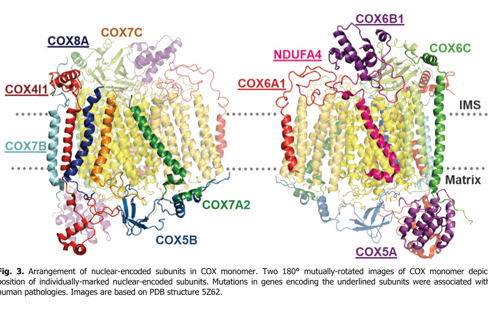

## Question

# Gene Research for Functional Annotation

## ⚠️ CRITICAL: Gene/Protein Identification Context

**BEFORE YOU BEGIN RESEARCH:** You MUST verify you are researching the CORRECT gene/protein. Gene symbols can be ambiguous, especially for less well-characterized genes from non-model organisms.

### Target Gene/Protein Identity (from UniProt):
- **UniProt Accession:** P14854
- **Protein Description:** RecName: Full=Cytochrome c oxidase subunit 6B1; AltName: Full=Cytochrome c oxidase subunit VIb isoform 1; Short=COX VIb-1;
- **Gene Information:** Name=COX6B1; Synonyms=COX6B;
- **Organism (full):** Homo sapiens (Human).
- **Protein Family:** Belongs to the cytochrome c oxidase subunit 6B family.
- **Key Domains:** COX6B-like. (IPR048280); CX6/COA6-like_sf. (IPR036549); Cyt_c_oxidase_su6B. (IPR003213); COX6B (PF02297)

### MANDATORY VERIFICATION STEPS:

1. **Check if the gene symbol "COX6B1" matches the protein description above**
2. **Verify the organism is correct:** Homo sapiens (Human).
3. **Check if protein family/domains align with what you find in literature**
4. **If you find literature for a DIFFERENT gene with the same or similar symbol, STOP**

### If Gene Symbol is Ambiguous or You Cannot Find Relevant Literature:

**DO NOT PROCEED WITH RESEARCH ON A DIFFERENT GENE.** Instead:
- State clearly: "The gene symbol 'COX6B1' is ambiguous or literature is limited for this specific protein"
- Explain what you found (e.g., "Found extensive literature on a different gene with the same symbol in a different organism")
- Describe the protein based ONLY on the UniProt information provided above
- Suggest that the protein function can be inferred from domain/family information

### Research Target:

Please provide a comprehensive research report on the gene **COX6B1** (gene ID: COX6B1, UniProt: P14854) in human.

The research report should be a detailed narrative explaining the function, biological processes, and localization of the gene product. Citations should be given for all claims.

You should prioritize authoritative reviews and primary scientific literature when conducting research. You can supplement
this with annotations you find in gene/protein databases, but these can be outdated or inaccurate.

We are specifically interested in the primary function of the gene - for enzymes, what reaction is catalyzed, and what is the substrate specificity? For transporters, what is the substrate? For structural proteins or adapters, what is the broader structural role? For signaling molecules, what is the role in the pathway.

We are interested in where in or outside the cell the gene product carries out its function.

We are also interested in the signaling or biochemical pathways in which the gene functions. We are less interested in broad pleiotropic effects, except where these elucidate the precise role.

Include evidence where possible. We are interested in both experimental evidence as well as inference from structure, evolution, or bioinformatic analysis. Precise studies should be prioritized over high-throughput, where available.

## Output

Question: You are an expert researcher providing comprehensive, well-cited information.

Provide detailed information focusing on:
1. Key concepts and definitions with current understanding
2. Recent developments and latest research (prioritize 2023-2024 sources)
3. Current applications and real-world implementations
4. Expert opinions and analysis from authoritative sources
5. Relevant statistics and data from recent studies

Format as a comprehensive research report with proper citations. Include URLs and publication dates where available.
Always prioritize recent, authoritative sources and provide specific citations for all major claims.

# Gene Research for Functional Annotation

## ⚠️ CRITICAL: Gene/Protein Identification Context

**BEFORE YOU BEGIN RESEARCH:** You MUST verify you are researching the CORRECT gene/protein. Gene symbols can be ambiguous, especially for less well-characterized genes from non-model organisms.

### Target Gene/Protein Identity (from UniProt):
- **UniProt Accession:** P14854
- **Protein Description:** RecName: Full=Cytochrome c oxidase subunit 6B1; AltName: Full=Cytochrome c oxidase subunit VIb isoform 1; Short=COX VIb-1;
- **Gene Information:** Name=COX6B1; Synonyms=COX6B;
- **Organism (full):** Homo sapiens (Human).
- **Protein Family:** Belongs to the cytochrome c oxidase subunit 6B family.
- **Key Domains:** COX6B-like. (IPR048280); CX6/COA6-like_sf. (IPR036549); Cyt_c_oxidase_su6B. (IPR003213); COX6B (PF02297)

### MANDATORY VERIFICATION STEPS:

1. **Check if the gene symbol "COX6B1" matches the protein description above**
2. **Verify the organism is correct:** Homo sapiens (Human).
3. **Check if protein family/domains align with what you find in literature**
4. **If you find literature for a DIFFERENT gene with the same or similar symbol, STOP**

### If Gene Symbol is Ambiguous or You Cannot Find Relevant Literature:

**DO NOT PROCEED WITH RESEARCH ON A DIFFERENT GENE.** Instead:
- State clearly: "The gene symbol 'COX6B1' is ambiguous or literature is limited for this specific protein"
- Explain what you found (e.g., "Found extensive literature on a different gene with the same symbol in a different organism")
- Describe the protein based ONLY on the UniProt information provided above
- Suggest that the protein function can be inferred from domain/family information

### Research Target:

Please provide a comprehensive research report on the gene **COX6B1** (gene ID: COX6B1, UniProt: P14854) in human.

The research report should be a detailed narrative explaining the function, biological processes, and localization of the gene product. Citations should be given for all claims.

You should prioritize authoritative reviews and primary scientific literature when conducting research. You can supplement
this with annotations you find in gene/protein databases, but these can be outdated or inaccurate.

We are specifically interested in the primary function of the gene - for enzymes, what reaction is catalyzed, and what is the substrate specificity? For transporters, what is the substrate? For structural proteins or adapters, what is the broader structural role? For signaling molecules, what is the role in the pathway.

We are interested in where in or outside the cell the gene product carries out its function.

We are also interested in the signaling or biochemical pathways in which the gene functions. We are less interested in broad pleiotropic effects, except where these elucidate the precise role.

Include evidence where possible. We are interested in both experimental evidence as well as inference from structure, evolution, or bioinformatic analysis. Precise studies should be prioritized over high-throughput, where available.

## Research report: Human **COX6B1** (UniProt **P14854**) — functional annotation and recent literature

### 0. Target verification (mandatory)
The literature assembled here consistently matches the UniProt target **P14854**: **COX6B1**, the nuclear-encoded **cytochrome c oxidase subunit VIb isoform 1** (COX VIb-1) in **Homo sapiens**, an accessory subunit of mitochondrial **complex IV (cytochrome c oxidase, COX)**. Reviews distinguish it from the paralog **COX6B2** (testis-enriched; sometimes expressed in cancers), confirming the correct gene/protein identity and organism context. (gladyck2021regulationofcox pages 12-13, cunatova2020roleofcytochrome pages 7-8, sinkler2017tissueandconditionspecific pages 8-9)

---

### 1. Key concepts, definitions, and current understanding

#### 1.1 Cytochrome c oxidase (complex IV) and what COX6B1 is (and is not)
Cytochrome c oxidase (complex IV; COX/CCO) is the terminal enzyme of the mitochondrial electron transport chain. Its catalytic core transfers electrons from cytochrome c to molecular oxygen and contributes to the proton gradient used for ATP synthesis. COX6B1 is **not catalytic**; it is a **small, nuclear-encoded accessory subunit** that modulates structure/assembly and function of the complex. (sinkler2017tissueandconditionspecific pages 1-2, gladyck2021regulationofcox pages 12-13)

#### 1.2 Subcellular localization and topology
COX6B1 is positioned on the **intermembrane-space (IMS)-facing side** of complex IV. Structural placement from reviews and figure evidence shows COX6B1 exposed on the IMS side and situated at/near the **dimer interface**. (cunatova2020roleofcytochrome pages 7-8, gladyck2021regulationofcox pages 12-13, cunatova2020roleofcytochrome media a8606d54)

#### 1.3 COX dimerization, cooperativity, and cytochrome c interaction kinetics
A consistent model is that COX6B1 **bridges the two monomers** in the COX dimer and supports dimer stability and cooperative function. Experimental removal/loss of COX6B1 (e.g., during mild solubilization) leads to **monomerization** of COX and is associated with a **~two-fold increase in enzyme activity** without changing proton stoichiometry, interpreted as loss of inter-monomer cooperativity and altered cytochrome c binding kinetics. (cunatova2020roleofcytochrome pages 7-8, sinkler2017tissueandconditionspecific pages 8-9)

#### 1.4 Isoforms and paralogs
COX VIb exists as (at least) a broadly expressed somatic isoform (**COX6B1**) and a testis-enriched isoform (**COX6B2**). This matters for interpretation of studies in reproductive tissues and cancers where COX6B2 may be induced. (cunatova2020roleofcytochrome pages 7-8, sinkler2017tissueandconditionspecific pages 8-9)

---

### 2. Recent developments and latest research (prioritizing 2023–2024)

#### 2.1 2024: COX6B1 as part of OXPHOS-based prognostic models (uveal melanoma)
A 2024 study built an oxidative phosphorylation (OXPHOS)-gene prognostic risk score model for **uveal melanoma** using **80 TCGA-UVM** samples and external validation sets. **COX6B1** was one of **9** OXPHOS-related genes in the final model. Reported performance included **AUC > 0.88** for predicting **1–5 year survival**, and an external-dataset **median risk-score cutoff of 16.213** for stratifying high- vs low-risk groups. This is a real-world example of COX6B1 being operationalized as a feature in transcriptomic prognostic modeling (though not validated as a standalone biomarker in this paper). (zhan2024constructionofoxidative pages 1-2, zhan2024constructionofoxidative pages 2-4)

#### 2.2 2024: Isoform context from mouse genetics (COX6B2) and implications for interpreting COX6B1
A 2024 CRISPR study knocked out **Cox6b2** (testis-enriched paralog) in mice. The abstract reports male **subfertility** with **low sperm motility**, while sperm mitochondrial respiration appeared normal by oxygen consumption rate. This reinforces that VIb biology is isoform-dependent and that COX6B1 (somatic) may compensate in testis contexts. The paper reports CRISPR production statistics (e.g., electroporated eggs and mutant pups), highlighting feasibility of isoform-specific functional dissection in vivo. (shimada2024disruptionoftestisenriched pages 1-2)

#### 2.3 2023: Conceptual linkage of Cox6b1 to supercomplex biology during dietary restriction
A 2023 review on dietary energy restriction discussed respiratory-chain supercomplex (SC) formation and notes Cox6b1 as involved in respiratory function and potentially complex IV regulation, in the context of dietary restriction–associated SC formation in mouse liver mitochondria. This source is conceptually relevant but does not provide COX6B1-specific quantitative measurements. (shimokawa2023mechanismsunderlyingretardation pages 5-8)

#### 2.4 Important caveat about “latest mechanistic” COX6B1 literature
Within the retrieved corpus, most COX6B1-specific mechanistic and disease-variant work is concentrated in authoritative reviews (2017–2021) plus a newer mechanistic preprint (2025) rather than 2023–2024 primary mechanistic papers. This does not imply the field is inactive; it reflects the accessible set in this tool-assisted retrieval. (cunatova2025cox6b1securesa pages 6-8, cunatova2020roleofcytochrome pages 7-8, sinkler2017tissueandconditionspecific pages 8-9)

---

### 3. Primary function, biological processes, and pathways

#### 3.1 Pathway context: oxidative phosphorylation and complex IV biogenesis
COX6B1 functions within the **oxidative phosphorylation** pathway as a complex IV accessory subunit that contributes to **quaternary structure** (dimerization) and is linked to **assembly/biogenesis** of the complex. Complex IV is embedded in the inner mitochondrial membrane, with domains projecting into IMS and matrix; COX6B1 is among the small nuclear-encoded subunits imported into mitochondria. (weraarpachai2012identificationandcharacterization pages 41-45, cunatova2020roleofcytochrome pages 7-8)

#### 3.2 Assembly biology: late incorporation model vs essential early checkpoint
Earlier patient-cell–based interpretations suggested COX6B1 is added late in assembly (consistent with mutant COX6B1 showing reduced incorporation and accumulation of an assembly intermediate designated S3). (cunatova2020roleofcytochrome pages 10-11)

More recent mechanistic work (preprint) using COX6B1 knockout/complementation in human cells argues COX6B1 is also essential for an **early, redox-sensitive step** in biogenesis—particularly affecting **MT-CO2 maturation/metalation**, with altered abundance/association of copper-delivery/assembly factors (e.g., COA6/SCO1/SCO2). The authors report that an AOX-based redox rescue permits partial accumulation of assembly intermediates, but the rescued CIV subassembly has **~5%** of wild-type CIV activity. (cunatova2025cox6b1securesa pages 6-8)

These two views can be reconciled as COX6B1 being: (i) structurally important at the mature/dimer stage and (ii) functionally required to stabilize or enable specific early assembly transitions that become especially evident under knockout perturbations. (cunatova2020roleofcytochrome pages 10-11, cunatova2025cox6b1securesa pages 6-8)

#### 3.3 Structural placement and interfaces (expert synthesis)
Structural/functional reviews place COX6B1 atop the dimer on the IMS side, bridging monomers and contacting core subunits (notably II/III) in ways that can affect cytochrome c docking kinetics and/or local assembly of COX2-related modules. (gladyck2021regulationofcox pages 12-13, cunatova2020roleofcytochrome pages 7-8)

---

### 4. Disease relevance (clinical genetics and mechanisms)

#### 4.1 Pathogenic variants and clinical phenotypes
Pathogenic **homozygous missense** variants in a conserved arginine in the N-terminus region are repeatedly highlighted. Depending on numbering conventions these appear as **R19H/R19C** or **R20H/R20C**. Reported phenotypes include **infantile/early-onset encephalomyopathy** with isolated complex IV deficiency; more severe presentations include **hydrocephalus** and **hypertrophic cardiomyopathy** (notably with Arg→Cys). (sinkler2017tissueandconditionspecific pages 8-9, cunatova2020roleofcytochrome pages 10-11, sinkler2017tissueandconditionspecific pages 3-5)

#### 4.2 Molecular mechanism in patient-derived material
A 2020 review summarizes evidence that patient fibroblasts and muscle with **Arg20His** show reduced COX6B1 steady-state levels and decreased incorporation into assembling complex IV, with accumulation of assembly intermediate **S3** and selective reduction in complex IV activity (other OXPHOS complexes relatively unaffected). Importantly, **wild-type COX6B1 complementation restores** complex IV content and activity, supporting causality. (cunatova2020roleofcytochrome pages 10-11)

---

### 5. Current applications and real-world implementations

#### 5.1 Clinical testing / diagnostics
COX6B1 is clinically relevant as a bona fide nuclear gene for **isolated complex IV deficiency**. Practical implementation is typically through genomic testing (e.g., exome/genome sequencing panels for mitochondrial disease) followed by functional validation (complex IV activity assays, BN-PAGE assembly profiling, and complementation in patient cells as summarized). (cunatova2020roleofcytochrome pages 10-11, sinkler2017tissueandconditionspecific pages 3-5)

#### 5.2 Cancer and systems-biology applications
COX6B1 is frequently used as an OXPHOS/mitochondrial respiration gene in transcriptomic signatures. In uveal melanoma, it contributed to a multigene OXPHOS risk model with strong ROC performance (AUC > 0.88 for 1–5 year survival prediction). These applications are real-world in the sense of computational prognostics, but remain translational until prospectively validated and clinically deployed. (zhan2024constructionofoxidative pages 1-2)

#### 5.3 Model systems for functional dissection
Functional studies referenced in the assembled evidence include: (i) patient-cell rescue by wild-type COX6B1, (ii) KO/complementation approaches in human cell lines for assembly dissection, and (iii) paralog-specific KO mice (Cox6b2) for isoform physiology. (cunatova2020roleofcytochrome pages 10-11, cunatova2025cox6b1securesa pages 6-8, shimada2024disruptionoftestisenriched pages 1-2)

---

### 6. Relevant statistics and quantitative findings (from the retrieved sources)

1. **~Two-fold activity increase** of complex IV upon COX6B1/VIb loss/removal during solubilization, with **no change in proton translocation stoichiometry** (supports a regulatory/cooperative role). (cunatova2020roleofcytochrome pages 7-8)
2. In a COX6B1 KO context with AOX-based redox rescue, a complex IV subassembly (“IVsub”) retains **~5%** of wild-type CIV activity (quantifies severity of functional deficit despite partial assembly). (cunatova2025cox6b1securesa pages 6-8)
3. **Uveal melanoma prognostic model (2024)** incorporating COX6B1 reports **AUC > 0.88** for predicting **1–5 year** survival; external dataset median cutoff **16.213** for risk stratification. (zhan2024constructionofoxidative pages 1-2, zhan2024constructionofoxidative pages 2-4)
4. **Mouse Cox6b2 KO production statistics** (2024) illustrate feasibility of isoform KO generation: for Cox6b2, **100** electroporated eggs, **94** transplanted, **21** mice born, **4** with Cox6b2 mutations (and analogous reported numbers for Cox8c). (shimada2024disruptionoftestisenriched pages 1-2)

---

### 7. Visual evidence (figures/tables)
Two key schematics from a 2020 review provide visual support:
- A figure showing **COX6B1 labeled on the IMS side** of complex IV among nuclear-encoded subunits (supports localization/topology). (cunatova2020roleofcytochrome media a8606d54)
- A figure summarizing **alternative assembly models** where COX6B appears either as a late-added component (sequential model) or preassembled within a module (modular model), relevant to reconciling late-incorporation views with newer early-checkpoint findings. (cunatova2020roleofcytochrome media 5dad9122)

---

### 8. Evidence map (summary table)
The following table consolidates core annotation claims and their supporting evidence.

| Annotation area | Key claim | Supporting evidence (brief) | Citation IDs |
|---|---|---|---|
| Identity / isoforms | COX6B1 (UniProt P14854) is the human, nuclear-encoded somatic/ubiquitous cytochrome c oxidase subunit VIb1; it is distinct from the testis-enriched paralog COX6B2. | Reviews identify COX6B1 as COX VIb1/Cox12p, broadly expressed across tissues, while COX6B2 is testes-specific; COX6B1 is the relevant human somatic isoform for complex IV. | (gladyck2021regulationofcox pages 12-13, cunatova2020roleofcytochrome pages 7-8, sinkler2017tissueandconditionspecific pages 8-9) |
| Subcellular localization / topology | COX6B1 is an intermembrane-space-facing subunit of mitochondrial complex IV, positioned on the outer/IMS side of the holoenzyme. | Structural and review sources place VIb1 on the IMS side of cytochrome c oxidase, where it is exposed at the dimer interface; figure evidence also shows COX6B1 on the IMS side. | (gladyck2021regulationofcox pages 12-13, cunatova2020roleofcytochrome pages 7-8, cunatova2020roleofcytochrome media a8606d54) |
| Primary molecular function within complex IV | COX6B1 is an accessory structural/regulatory subunit of complex IV rather than a catalytic center; it supports cytochrome c oxidase function and is positioned near the cytochrome c interaction region. | COX catalyzes electron transfer from cytochrome c to O2 in the core subunits, while COX6B1 is a small nuclear-encoded subunit modeled near the cytochrome c binding site and required for proper complex IV activity. | (gladyck2021regulationofcox pages 12-13, sinkler2017tissueandconditionspecific pages 1-2) |
| Role in dimerization / cooperativity | COX6B1 helps bridge the two complex IV monomers, stabilizing the dimer and modulating inter-monomer cooperativity; removal/absence can monomerize COX and increase activity about twofold. | Reviews report that VIb connects monomers on the IMS side; mild solubilization causing COX6B1 loss leads to monomerization and ~2-fold higher activity without changing proton stoichiometry, consistent with altered cytochrome c binding cooperativity. | (cunatova2020roleofcytochrome pages 7-8, sinkler2017tissueandconditionspecific pages 8-9) |
| Role in assembly (early vs late) | Earlier models placed COX6B1 as a late-added subunit, but recent mechanistic work indicates it is also essential for an early redox-sensitive assembly step involving MT-CO2 maturation/metalation. | Patient-cell and review data linked mutant COX6B1 to reduced incorporation and accumulation of late intermediate S3; newer KO/complementation data show total loss of complex IV, block at MT-CO2 maturation, altered COA6/SCO factors, and support an indispensable early assembly role. | (cunatova2020roleofcytochrome pages 10-11, cunatova2025cox6b1securesa pages 6-8, cunatova2025cox6b1securesa pages 1-3, cunatova2020roleofcytochrome media 5dad9122) |
| Disease-causing variants / phenotypes | Pathogenic homozygous missense variants in conserved Arg20/Arg19 region (reported as R20H/R20C or R19H/R19C depending on numbering) cause isolated complex IV deficiency with severe infantile mitochondrial disease. | Reported phenotypes include infantile encephalomyopathy; hydrocephalus and hypertrophic cardiomyopathy with the more severe Arg20Cys variant; mutant cells show reduced COX6B1 steady-state levels, poor incorporation into holoenzyme, and reduced complex IV activity, rescued by WT COX6B1 expression. | (sinkler2017tissueandconditionspecific pages 8-9, cunatova2020roleofcytochrome pages 10-11, sinkler2017tissueandconditionspecific pages 3-5) |
| Recent applications (biomarker / prognostic) | Recent studies use COX6B1 in translational contexts mainly as a biomarker/prognostic-gene component rather than a validated standalone clinical marker. | In 2024 uveal melanoma, COX6B1 was one of 9 OXPHOS-related genes in a prognostic model built from 80 TCGA-UVM cases, with 1–5 year AUC values all >0.88 and external validation in GSE22138/GSE39717; a 2023 dietary-restriction review also discusses Cox6b1 conceptually in complex IV/supercomplex regulation, but without COX6B1-specific quantitative biomarker metrics. | (zhan2024constructionofoxidative pages 1-2, zhan2024constructionofoxidative pages 2-4, shimokawa2023mechanismsunderlyingretardation pages 5-8) |

*Table: This table summarizes the main functional annotation points for human COX6B1, including identity, localization, molecular role, assembly biology, disease relevance, and recent translational uses. It is useful as a compact evidence map tied directly to the available context sources.*

---

## Key references (URLs and publication dates)
- Čunátová K et al. *Role of cytochrome c oxidase nuclear-encoded subunits in health and disease.* **Physiological Research**. **Nov 2020**. https://doi.org/10.33549/physiolres.934446 (cunatova2020roleofcytochrome pages 7-8, cunatova2020roleofcytochrome pages 10-11)
- Gladyck S et al. *Regulation of COX assembly and function by twin CX9C proteins—implications for human disease.* **Cells**. **Jan 2021**. https://doi.org/10.3390/cells10020197 (gladyck2021regulationofcox pages 12-13)
- Sinkler CA et al. *Tissue- and condition-specific isoforms of mammalian cytochrome c oxidase subunits: from function to human disease.* **Oxidative Medicine and Cellular Longevity**. **May 2017**. https://doi.org/10.1155/2017/1534056 (sinkler2017tissueandconditionspecific pages 8-9, sinkler2017tissueandconditionspecific pages 1-2, sinkler2017tissueandconditionspecific pages 3-5)
- Zhan Z et al. *Construction of oxidative phosphorylation-related prognostic risk score model in uveal melanoma.* **BMC Ophthalmology**. **May 2024**. https://doi.org/10.1186/s12886-024-03441-6 (zhan2024constructionofoxidative pages 1-2, zhan2024constructionofoxidative pages 2-4)
- Shimada K et al. *Disruption of testis-enriched cytochrome c oxidase subunit COX6B2 but not COX8C leads to subfertility.* **Experimental Animals**. **Jan 2024** (published online **10 Jul 2023**). https://doi.org/10.1538/expanim.23-0055 (shimada2024disruptionoftestisenriched pages 1-2)
- Shimokawa I. *Mechanisms underlying retardation of aging by dietary energy restriction.* **Pathology International**. **Nov 2023**. https://doi.org/10.1111/pin.13387 (shimokawa2023mechanismsunderlyingretardation pages 5-8)

*Note*: A mechanistic COX6B1 assembly preprint (bioRxiv, Jun 2025) provides detailed knockout/variant/rescue quantitation but is outside the requested 2023–2024 priority window; it is included only to contextualize the most explicit recent mechanistic model in the retrieved evidence. https://doi.org/10.1101/2025.03.25.645161 (cunatova2025cox6b1securesa pages 6-8)

References

1. (gladyck2021regulationofcox pages 12-13): Stephanie Gladyck, Siddhesh Aras, Maik Hüttemann, and Lawrence I. Grossman. Regulation of cox assembly and function by twin cx9c proteins—implications for human disease. Cells, 10:197, Jan 2021. URL: https://doi.org/10.3390/cells10020197, doi:10.3390/cells10020197. This article has 31 citations.

2. (cunatova2020roleofcytochrome pages 7-8): K Čunátová, D Pajuelo Reguera, J Houštěk, T Mráček, and P Pecina. Role of cytochrome c oxidase nuclear-encoded subunits in health and disease. Physiological Research, pages 947-965, Nov 2020. URL: https://doi.org/10.33549/physiolres.934446, doi:10.33549/physiolres.934446. This article has 52 citations and is from a peer-reviewed journal.

3. (sinkler2017tissueandconditionspecific pages 8-9): Christopher A. Sinkler, Hasini Kalpage, Joseph Shay, Icksoo Lee, Moh H. Malek, Lawrence I. Grossman, and Maik Hüttemann. Tissue- and condition-specific isoforms of mammalian cytochrome c oxidase subunits: from function to human disease. Oxidative Medicine and Cellular Longevity, May 2017. URL: https://doi.org/10.1155/2017/1534056, doi:10.1155/2017/1534056. This article has 153 citations.

4. (sinkler2017tissueandconditionspecific pages 1-2): Christopher A. Sinkler, Hasini Kalpage, Joseph Shay, Icksoo Lee, Moh H. Malek, Lawrence I. Grossman, and Maik Hüttemann. Tissue- and condition-specific isoforms of mammalian cytochrome c oxidase subunits: from function to human disease. Oxidative Medicine and Cellular Longevity, May 2017. URL: https://doi.org/10.1155/2017/1534056, doi:10.1155/2017/1534056. This article has 153 citations.

5. (cunatova2020roleofcytochrome media a8606d54): K Čunátová, D Pajuelo Reguera, J Houštěk, T Mráček, and P Pecina. Role of cytochrome c oxidase nuclear-encoded subunits in health and disease. Physiological Research, pages 947-965, Nov 2020. URL: https://doi.org/10.33549/physiolres.934446, doi:10.33549/physiolres.934446. This article has 52 citations and is from a peer-reviewed journal.

6. (zhan2024constructionofoxidative pages 1-2): Zhiyun Zhan, Kun Lin, and Tingting Wang. Construction of oxidative phosphorylation-related prognostic risk score model in uveal melanoma. BMC Ophthalmology, May 2024. URL: https://doi.org/10.1186/s12886-024-03441-6, doi:10.1186/s12886-024-03441-6. This article has 7 citations and is from a peer-reviewed journal.

7. (zhan2024constructionofoxidative pages 2-4): Zhiyun Zhan, Kun Lin, and Tingting Wang. Construction of oxidative phosphorylation-related prognostic risk score model in uveal melanoma. BMC Ophthalmology, May 2024. URL: https://doi.org/10.1186/s12886-024-03441-6, doi:10.1186/s12886-024-03441-6. This article has 7 citations and is from a peer-reviewed journal.

8. (shimada2024disruptionoftestisenriched pages 1-2): Keisuke Shimada, Yonggang Lu, and Masahito Ikawa. Disruption of testis-enriched cytochrome c oxidase subunit cox6b2 but not cox8c leads to subfertility. Experimental Animals, 73:1-10, Jan 2024. URL: https://doi.org/10.1538/expanim.23-0055, doi:10.1538/expanim.23-0055. This article has 10 citations and is from a peer-reviewed journal.

9. (shimokawa2023mechanismsunderlyingretardation pages 5-8): Isao Shimokawa. Mechanisms underlying retardation of aging by dietary energy restriction. Pathology International, 73:579-592, Nov 2023. URL: https://doi.org/10.1111/pin.13387, doi:10.1111/pin.13387. This article has 4 citations and is from a peer-reviewed journal.

10. (cunatova2025cox6b1securesa pages 6-8): Kristýna Čunátová, Marek Vrbacký, Michal Knězů, Alena Pecinová, Lukáš Alán, Josef Houštěk, Erika Fernández-Vizarra, Tomáš Mráček, and Petr Pecina. Cox6b1 secures a redox-sensitive step in early cytochrome c oxidase assembly. bioRxiv, Jun 2025. URL: https://doi.org/10.1101/2025.03.25.645161, doi:10.1101/2025.03.25.645161. This article has 0 citations.

11. (weraarpachai2012identificationandcharacterization pages 41-45): W Weraarpachai. Identification and characterization of novel genes involved in cytochrome c oxidase deficiencies. Unknown journal, 2012.

12. (cunatova2020roleofcytochrome pages 10-11): K Čunátová, D Pajuelo Reguera, J Houštěk, T Mráček, and P Pecina. Role of cytochrome c oxidase nuclear-encoded subunits in health and disease. Physiological Research, pages 947-965, Nov 2020. URL: https://doi.org/10.33549/physiolres.934446, doi:10.33549/physiolres.934446. This article has 52 citations and is from a peer-reviewed journal.

13. (sinkler2017tissueandconditionspecific pages 3-5): Christopher A. Sinkler, Hasini Kalpage, Joseph Shay, Icksoo Lee, Moh H. Malek, Lawrence I. Grossman, and Maik Hüttemann. Tissue- and condition-specific isoforms of mammalian cytochrome c oxidase subunits: from function to human disease. Oxidative Medicine and Cellular Longevity, May 2017. URL: https://doi.org/10.1155/2017/1534056, doi:10.1155/2017/1534056. This article has 153 citations.

14. (cunatova2020roleofcytochrome media 5dad9122): K Čunátová, D Pajuelo Reguera, J Houštěk, T Mráček, and P Pecina. Role of cytochrome c oxidase nuclear-encoded subunits in health and disease. Physiological Research, pages 947-965, Nov 2020. URL: https://doi.org/10.33549/physiolres.934446, doi:10.33549/physiolres.934446. This article has 52 citations and is from a peer-reviewed journal.

15. (cunatova2025cox6b1securesa pages 1-3): Kristýna Čunátová, Marek Vrbacký, Michal Knězů, Alena Pecinová, Lukáš Alán, Josef Houštěk, Erika Fernández-Vizarra, Tomáš Mráček, and Petr Pecina. Cox6b1 secures a redox-sensitive step in early cytochrome c oxidase assembly. bioRxiv, Jun 2025. URL: https://doi.org/10.1101/2025.03.25.645161, doi:10.1101/2025.03.25.645161. This article has 0 citations.

## Artifacts

- [Edison artifact artifact-00](COX6B1-deep-research-falcon_artifacts/artifact-00.md)

## Citations

1. shimada2024disruptionoftestisenriched pages 1-2
2. shimokawa2023mechanismsunderlyingretardation pages 5-8
3. cunatova2020roleofcytochrome pages 10-11
4. zhan2024constructionofoxidative pages 1-2
5. cunatova2020roleofcytochrome pages 7-8
6. gladyck2021regulationofcox pages 12-13
7. sinkler2017tissueandconditionspecific pages 8-9
8. sinkler2017tissueandconditionspecific pages 1-2
9. zhan2024constructionofoxidative pages 2-4
10. weraarpachai2012identificationandcharacterization pages 41-45
11. sinkler2017tissueandconditionspecific pages 3-5
12. https://doi.org/10.33549/physiolres.934446
13. https://doi.org/10.3390/cells10020197
14. https://doi.org/10.1155/2017/1534056
15. https://doi.org/10.1186/s12886-024-03441-6
16. https://doi.org/10.1538/expanim.23-0055
17. https://doi.org/10.1111/pin.13387
18. https://doi.org/10.1101/2025.03.25.645161
19. https://doi.org/10.3390/cells10020197,
20. https://doi.org/10.33549/physiolres.934446,
21. https://doi.org/10.1155/2017/1534056,
22. https://doi.org/10.1186/s12886-024-03441-6,
23. https://doi.org/10.1538/expanim.23-0055,
24. https://doi.org/10.1111/pin.13387,
25. https://doi.org/10.1101/2025.03.25.645161,