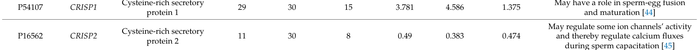

## Question

# Gene Research for Functional Annotation

## ⚠️ CRITICAL: Gene/Protein Identification Context

**BEFORE YOU BEGIN RESEARCH:** You MUST verify you are researching the CORRECT gene/protein. Gene symbols can be ambiguous, especially for less well-characterized genes from non-model organisms.

### Target Gene/Protein Identity (from UniProt):
- **UniProt Accession:** P16562
- **Protein Description:** RecName: Full=Cysteine-rich secretory protein 2; Short=CRISP-2; AltName: Full=Cancer/testis antigen 36; Short=CT36; AltName: Full=Testis-specific protein TPX-1; Flags: Precursor;
- **Gene Information:** Name=CRISP2; Synonyms=GAPDL5, TPX1;
- **Organism (full):** Homo sapiens (Human).
- **Protein Family:** Belongs to the CRISP family. .
- **Key Domains:** Allrgn_V5/Tpx1_CS. (IPR018244); CAP_dom. (IPR014044); CAP_sf. (IPR035940); Crisp-like_dom. (IPR042076); CRISP-related. (IPR001283)

### MANDATORY VERIFICATION STEPS:

1. **Check if the gene symbol "CRISP2" matches the protein description above**
2. **Verify the organism is correct:** Homo sapiens (Human).
3. **Check if protein family/domains align with what you find in literature**
4. **If you find literature for a DIFFERENT gene with the same or similar symbol, STOP**

### If Gene Symbol is Ambiguous or You Cannot Find Relevant Literature:

**DO NOT PROCEED WITH RESEARCH ON A DIFFERENT GENE.** Instead:
- State clearly: "The gene symbol 'CRISP2' is ambiguous or literature is limited for this specific protein"
- Explain what you found (e.g., "Found extensive literature on a different gene with the same symbol in a different organism")
- Describe the protein based ONLY on the UniProt information provided above
- Suggest that the protein function can be inferred from domain/family information

### Research Target:

Please provide a comprehensive research report on the gene **CRISP2** (gene ID: CRISP2, UniProt: P16562) in human.

The research report should be a detailed narrative explaining the function, biological processes, and localization of the gene product. Citations should be given for all claims.

You should prioritize authoritative reviews and primary scientific literature when conducting research. You can supplement
this with annotations you find in gene/protein databases, but these can be outdated or inaccurate.

We are specifically interested in the primary function of the gene - for enzymes, what reaction is catalyzed, and what is the substrate specificity? For transporters, what is the substrate? For structural proteins or adapters, what is the broader structural role? For signaling molecules, what is the role in the pathway.

We are interested in where in or outside the cell the gene product carries out its function.

We are also interested in the signaling or biochemical pathways in which the gene functions. We are less interested in broad pleiotropic effects, except where these elucidate the precise role.

Include evidence where possible. We are interested in both experimental evidence as well as inference from structure, evolution, or bioinformatic analysis. Precise studies should be prioritized over high-throughput, where available.

## Output

Question: You are an expert researcher providing comprehensive, well-cited information.

Provide detailed information focusing on:
1. Key concepts and definitions with current understanding
2. Recent developments and latest research (prioritize 2023-2024 sources)
3. Current applications and real-world implementations
4. Expert opinions and analysis from authoritative sources
5. Relevant statistics and data from recent studies

Format as a comprehensive research report with proper citations. Include URLs and publication dates where available.
Always prioritize recent, authoritative sources and provide specific citations for all major claims.

# Gene Research for Functional Annotation

## ⚠️ CRITICAL: Gene/Protein Identification Context

**BEFORE YOU BEGIN RESEARCH:** You MUST verify you are researching the CORRECT gene/protein. Gene symbols can be ambiguous, especially for less well-characterized genes from non-model organisms.

### Target Gene/Protein Identity (from UniProt):
- **UniProt Accession:** P16562
- **Protein Description:** RecName: Full=Cysteine-rich secretory protein 2; Short=CRISP-2; AltName: Full=Cancer/testis antigen 36; Short=CT36; AltName: Full=Testis-specific protein TPX-1; Flags: Precursor;
- **Gene Information:** Name=CRISP2; Synonyms=GAPDL5, TPX1;
- **Organism (full):** Homo sapiens (Human).
- **Protein Family:** Belongs to the CRISP family. .
- **Key Domains:** Allrgn_V5/Tpx1_CS. (IPR018244); CAP_dom. (IPR014044); CAP_sf. (IPR035940); Crisp-like_dom. (IPR042076); CRISP-related. (IPR001283)

### MANDATORY VERIFICATION STEPS:

1. **Check if the gene symbol "CRISP2" matches the protein description above**
2. **Verify the organism is correct:** Homo sapiens (Human).
3. **Check if protein family/domains align with what you find in literature**
4. **If you find literature for a DIFFERENT gene with the same or similar symbol, STOP**

### If Gene Symbol is Ambiguous or You Cannot Find Relevant Literature:

**DO NOT PROCEED WITH RESEARCH ON A DIFFERENT GENE.** Instead:
- State clearly: "The gene symbol 'CRISP2' is ambiguous or literature is limited for this specific protein"
- Explain what you found (e.g., "Found extensive literature on a different gene with the same symbol in a different organism")
- Describe the protein based ONLY on the UniProt information provided above
- Suggest that the protein function can be inferred from domain/family information

### Research Target:

Please provide a comprehensive research report on the gene **CRISP2** (gene ID: CRISP2, UniProt: P16562) in human.

The research report should be a detailed narrative explaining the function, biological processes, and localization of the gene product. Citations should be given for all claims.

You should prioritize authoritative reviews and primary scientific literature when conducting research. You can supplement
this with annotations you find in gene/protein databases, but these can be outdated or inaccurate.

We are specifically interested in the primary function of the gene - for enzymes, what reaction is catalyzed, and what is the substrate specificity? For transporters, what is the substrate? For structural proteins or adapters, what is the broader structural role? For signaling molecules, what is the role in the pathway.

We are interested in where in or outside the cell the gene product carries out its function.

We are also interested in the signaling or biochemical pathways in which the gene functions. We are less interested in broad pleiotropic effects, except where these elucidate the precise role.

Include evidence where possible. We are interested in both experimental evidence as well as inference from structure, evolution, or bioinformatic analysis. Precise studies should be prioritized over high-throughput, where available.

# Research report: Human **CRISP2** (UniProt **P16562**) functional annotation

## 0) Scope, identity verification, and ambiguity check

### Target identity (verified)
The requested target—**human CRISP2** (cysteine-rich secretory protein 2; CRISP-2; TPX-1/TPX1; CT36)—is correctly matched to **UniProt accession P16562**. A human sperm study explicitly maps mass-spectrometry peptides onto the two UniProt isoforms **P16562-1** and **P16562-2**, confirming that the reviewed literature is aligned to the same protein identity (masai2025novelinsightsinto pages 11-11, masai2025novelinsightsinto pages 14-15). Reported aliases in the human study include **TPX1** and **AA1** (masai2025novelinsightsinto pages 38-40), consistent with the provided UniProt description.

### Family/domain context
CRISP2 belongs to the **CRISP family** within the broader **CAP superfamily** (also called SCP/PR-1/Antigen 5). Authoritative reviews define CRISPs as typically **two-domain proteins** comprising an N-terminal **CAP domain** plus a C-terminal **cysteine-rich CRISP domain** (CRD/ICR + hinge) stabilized by multiple disulfide bonds; the N-terminal CAP domain is often implicated in protein–protein/cell–cell interactions in reproduction, while the C-terminal CRISP domain has been linked to **ion-channel regulatory activity** (gibbs2008thecapsuperfamily pages 4-4, gibbs2008thecapsuperfamily pages 3-4, gibbs2008thecapsuperfamily pages 4-5).

## 1) Key concepts and definitions (current understanding)

### 1.1 CAP superfamily and CRISP domain architecture
- The **CAP domain** is a conserved, disulfide-stabilized module widely distributed across taxa and associated with diverse extracellular and reproductive functions (gibbs2008thecapsuperfamily pages 3-4). 
- **CRISPs** are a CAP-subfamily defined by an additional C-terminal **CRISP domain** with a characteristic conserved cysteine pattern (10 strictly conserved cysteines forming 5 disulfide bonds) and a hinge region with distinctive cysteine spacing (gibbs2008thecapsuperfamily pages 4-5). 

### 1.2 Functional framing of CRISP2
CRISP2 is best understood as a **non-enzymatic structural/interaction protein** in sperm biology rather than a metabolic enzyme: it is positioned in reviews as a reproductive tract–associated CAP/CRISP protein implicated in **sperm development**, **capacitation-associated signaling**, and **gamete interaction**, with proposed **ion-channel/Ca2+ modulation** roles (gibbs2008thecapsuperfamily pages 17-17, gibbs2008thecapsuperfamily pages 18-19).

## 2) Expression and localization (where CRISP2 acts)

### 2.1 Tissue and cell-type specificity
An authoritative review notes CRISP2 is produced during **spermatogenesis** and localizes to key sperm compartments (acrosome, accessory tail structures, developing germ-cell membrane) (gibbs2008thecapsuperfamily pages 17-17). A recent human-focused primary study further refines this with direct tissue imaging and biochemical characterization (masai2025novelinsightsinto pages 1-1).

### 2.2 Subcellular localization during human spermatogenesis
In human testis sections, immunostaining shows CRISP2 signal across germ-cell stages:
- **Primary spermatocytes:** faint nuclear puncta.
- **Round spermatids:** more intense, homogeneous nuclear signal.
- **Early elongated spermatids:** intense nuclear spots with additional cytoplasmic signal.
- **Late elongated spermatids:** CRISP2 also seen in the **flagellum** and the **equatorial segment (EqS)** of the acrosome; late nuclei may appear negative, possibly reflecting chromatin condensation.
These observations were supported by antibody controls and confocal imaging (masai2025novelinsightsinto pages 6-7, masai2025novelinsightsinto pages 7-8).

### 2.3 Localization in epididymis and ejaculated sperm
In human epididymis, CRISP2 staining is observed in sperm within the lumen (including a dense spot at the basal head region and along the flagellum), while the epididymal epithelium is negative (masai2025novelinsightsinto pages 5-6). In ejaculated sperm, CRISP2 is reported in the **cytoplasmic droplet**, **flagellum**, and **EqS**, consistent with roles in motility and gamete fusion (masai2025novelinsightsinto pages 1-1).

## 3) Molecular mechanism and pathways

### 3.1 Ion-channel/Ca2+ signaling links (conceptual and proteomics-supported)
Review-level synthesis places CRISP2 in sperm Ca2+ signaling through **ryanodine receptor (RyR)-mediated Ca2+ release** and broader ion-channel modulation (gibbs2008thecapsuperfamily pages 17-17, gibbs2008thecapsuperfamily pages 18-19). A 2023 ejaculate-based shotgun proteomics study explicitly annotates CRISP2 as potentially regulating **ion channels** and thereby **calcium fluxes during sperm capacitation** (shkrigunov2023theapplicationof pages 8-9).

### 3.2 Sterol binding/export activity and regulation by A1BG (2024 mechanistic advance)
A major 2024 development is biochemical evidence that CRISP2 participates in **sterol binding and sterol export** in a yeast-based functional model and that this activity can be strongly regulated by A1BG:
- **Binding partner/regulator:** Human **A1BG** binds CRISP2 with high affinity (MST Kd values reported around **13.72 ± 2.5 nM**; also **~10.3 ± 2.4 nM** under Mg2+ conditions) (atab2024alpha1bglycoprotein(a1bg) pages 2-4, atab2024alpha1bglycoprotein(a1bg) pages 12-13).
- **Functional inhibition:** Coexpression of A1BG with CRISP2 (or related CAP proteins) reduced sterol secretion by **>50%** in vivo (yeast export assay) (atab2024alpha1bglycoprotein(a1bg) pages 2-4, atab2024alpha1bglycoprotein(a1bg) pages 1-2).
- **Ligand binding:** CRISP2 binds cholesterol sulfate with reported Kd values ranging from low micromolar to nanomolar depending on assay conditions; binding is blocked by A1BG (atab2024alpha1bglycoprotein(a1bg) pages 2-4, atab2024alpha1bglycoprotein(a1bg) pages 12-13, atab2024alpha1bglycoprotein(a1bg) pages 9-11).
- **Cation dependence:** The A1BG–CRISP2 interaction is **Mg2+-dependent**; Zn2+ cannot substitute in restoring binding after EDTA chelation (atab2024alpha1bglycoprotein(a1bg) pages 11-12, atab2024alpha1bglycoprotein(a1bg) pages 12-13).

Mechanistically, these findings reinforce the CAP-domain concept of ligand binding and extend CRISP2 beyond purely “ion-channel regulator” framing toward **lipid/sterol handling** that may be relevant in reproductive tract fluids and sperm membranes (atab2024alpha1bglycoprotein(a1bg) pages 1-2, atab2024alpha1bglycoprotein(a1bg) pages 2-4).

### 3.3 Protein complexes and interaction landscape
- A human immunoprecipitation/MS study detected P16562 peptides repeatedly and lists co-detected proteins (including **ACR** and **ACRBP**) in CRISP2-associated material, supporting that CRISP2 participates in **stable complexes** in sperm extracts (masai2025novelinsightsinto pages 38-40).
- Review-level evidence reports CRISP2 binding partners including **MAP3K11/MLK3** (co-localizing in the acrosome) and **GGN1** (in the tail), supporting a model in which CRISP2 is integrated into signaling/structural complexes (gibbs2008thecapsuperfamily pages 17-17).

## 4) Recent developments and latest research (prioritizing 2023–2024)

### 4.1 Quantitative detection of CRISP2 in human ejaculate/sperm proteomics (2023)
A 2023 study evaluating ejaculate-based shotgun proteomics quantified CRISP2 (P16562) across ejaculate, seminal plasma, and spermatozoa:
- **Validated unique peptides:** ejaculate 11; plasma 30; spermatozoa 8.
- **NSAF (spectrum counting):** ejaculate 0.49; plasma 0.383; spermatozoa 0.474.
The same source summarizes CRISP2 as potentially regulating ion-channel activity and Ca2+ flux during capacitation (shkrigunov2023theapplicationof pages 8-9). A table image excerpt corroborates these values (shkrigunov2023theapplicationof media 5dc187ee).

### 4.2 miRNA-linked regulation in infertility phenotypes (2024 synthesis)
A 2024 Frontiers in Endocrinology review compiling clinical miRNA studies summarizes that:
- **miR-27b** is reported upregulated in a semen-based comparison (n=24 vs 24) and is listed as targeting **CRISP2**, associated with effects on sperm morphology and progressive motility (shi2024micrornasinspermatogenesis pages 3-4).
- The review also states that high **miR-27b** expression is associated with reduced progressive motility and shows a **negative association with CRISP2 protein levels** (shi2024micrornasinspermatogenesis pages 4-5).
Evidence in the review is largely summarized (often without effect sizes in table form), so the quantitative strength of these associations depends on the original primary studies (shi2024micrornasinspermatogenesis pages 4-5, shi2024micrornasinspermatogenesis pages 19-20).

### 4.3 Clinical context for biomarker translation (2024)
A 2024 prospective seminal plasma proteomics study on azoospermia provides clinically relevant statistics (not CRISP2-specific but directly relevant to implementation of testis-derived protein markers):
- Azoospermia affects **nearly 2%** of men and accounts for **5–20%** of male infertility.
- **NOA** comprises about **90%** of azoospermia cases.
- Sperm retrieval success is **>90%** in obstructive azoospermia but only **~50%** in NOA.
This underpins the value of non-invasive seminal plasma protein biomarkers to avoid unnecessary surgery and to triage patients for retrieval attempts (fietz2024proteomicbiomarkersin pages 2-3, fietz2024proteomicbiomarkersin pages 1-2).

## 5) Current applications and real-world implementation

### 5.1 Male infertility screening panels (proteomics)
CRISP2 is already operationally used as a measured component in high-throughput LC-MS/MS datasets of ejaculate, seminal plasma, and spermatozoa, enabling quantitative comparisons and pathway enrichment in male infertility screening pipelines (shkrigunov2023theapplicationof pages 8-9).

### 5.2 Seminal plasma proteomics for clinical decision support in azoospermia
Seminal plasma proteomics is being developed as a **non-invasive tool** to distinguish OA vs NOA and predict intratesticular sperm presence to rationalize surgery recommendations (fietz2024proteomicbiomarkersin pages 2-3, fietz2024proteomicbiomarkersin pages 1-2). While CRISP2 is not the primary marker highlighted in the pages examined, it is cited among infertility-related proteins in referenced work within this literature context (fietz2024proteomicbiomarkersin pages 12-12).

## 6) Expert opinion and authoritative analysis (translation readiness)

A 2024 expert review argues that sperm/ejaculate proteomics has substantial potential to improve diagnostics, guide ART, and identify non-hormonal contraceptive targets; however, translation is constrained by the need for reliable, reproducible, affordable assays and extensive validation and regulatory work (parkes2024bringingproteomicsto pages 28-29, parkes2024bringingproteomicsto pages 6-7). The authors highlight a persistent gap between biomarker discovery and clinical adoption and stress the importance of integrating proteomics with clinical phenotypes, genetics, and robust in vivo validation (parkes2024bringingproteomicsto pages 29-31).

## 7) Relevant statistics and quantitative data summary

- **CRISP2 abundance in ejaculate-based proteomics (2023):** validated unique peptides 11/30/8 and NSAF 0.49/0.383/0.474 (ejaculate/plasma/spermatozoa) (shkrigunov2023theapplicationof pages 8-9, shkrigunov2023theapplicationof media 5dc187ee).
- **A1BG–CRISP2 binding affinity (2024):** MST Kd ≈ **13.72 ± 2.5 nM** (and ~10.3 ± 2.4 nM under Mg2+ conditions) (atab2024alpha1bglycoprotein(a1bg) pages 2-4, atab2024alpha1bglycoprotein(a1bg) pages 12-13).
- **A1BG inhibition of CRISP2-mediated sterol export (2024):** **>50%** reduction in secretion in yeast assays (atab2024alpha1bglycoprotein(a1bg) pages 2-4, atab2024alpha1bglycoprotein(a1bg) pages 1-2).
- **Clinical burden relevant to biomarker deployment (2024):** azoospermia nearly 2% of men; 5–20% of male infertility; NOA ~90% of azoospermia; NOA retrieval ~50% vs OA >90% (fietz2024proteomicbiomarkersin pages 2-3, fietz2024proteomicbiomarkersin pages 1-2).

## 8) Evidence-grounded summary table

| Category | Key points | Evidence type (review/primary/proteomics) | Top citations (pqac-IDs) |
|---|---|---|---|
| Identity/domains | Human CRISP2 is UniProt P16562; recent human sperm work explicitly maps peptides to isoforms P16562-1 and P16562-2. It is a CAP superfamily/CRISP-family protein with an N-terminal CAP domain and a C-terminal cysteine-rich CRISP domain (including hinge/ICR features); the family is linked to ion-channel regulation and reproduction. | Primary + review | (masai2025novelinsightsinto pages 11-11, masai2025novelinsightsinto pages 38-40, gibbs2008thecapsuperfamily pages 3-4, gibbs2008thecapsuperfamily pages 4-4, gibbs2008thecapsuperfamily pages 4-5) |
| Expression | CRISP2 is the mammalian CRISP most tightly associated with testicular germ cells and spermatogenesis. In human tissue, expression is seen through spermatogenic stages and not in epididymal epithelium; in sperm proteomics it is repeatedly detected in ejaculated sperm. | Primary + review + proteomics | (masai2025novelinsightsinto pages 11-12, masai2025novelinsightsinto pages 6-7, masai2025novelinsightsinto pages 12-13, masai2025novelinsightsinto pages 1-1, shkrigunov2023theapplicationof pages 8-9) |
| Subcellular localization | In human testis, hCRISP2 localizes to nuclei of primary spermatocytes, round spermatids, and early elongated spermatids; later also to cytoplasm, flagellum, and equatorial segment. In ejaculated sperm, signal is reported in cytoplasmic droplet, flagellum, equatorial segment, and basal head/connecting-piece regions. Evidence comes from immunofluorescence/confocal z-stacks, antibody controls, western blotting, immunoprecipitation, and MS. | Primary | (masai2025novelinsightsinto pages 6-7, masai2025novelinsightsinto pages 8-9, masai2025novelinsightsinto pages 12-13, masai2025novelinsightsinto pages 1-1, masai2025novelinsightsinto pages 7-8, masai2025novelinsightsinto pages 5-6) |
| Molecular mechanisms | Current understanding supports CRISP2 as a structural/functional sperm protein rather than an enzyme. Review-level evidence places CRISP2 in Ca2+ signaling via regulation of ryanodine receptor-mediated Ca2+ flux and more broadly in ion-channel modulation relevant to motility, capacitation, and acrosome reaction. A 2024 JBC study also shows CRISP2 can bind sterol and mediate sterol export, adding a biochemical activity within the CAP domain framework. | Review + primary | (gibbs2008thecapsuperfamily pages 17-17, gibbs2008thecapsuperfamily pages 18-19, atab2024alpha1bglycoprotein(a1bg) pages 1-2, atab2024alpha1bglycoprotein(a1bg) pages 2-4, atab2024alpha1bglycoprotein(a1bg) pages 9-11) |
| Binding partners/regulators | CRISP2 is reported in sperm protein complexes and has literature-supported interactions with MAP3K11/MLK3 and GGN1; human sperm IP-MS recovered CRISP2 with co-detected proteins including ACR and ACRBP. In 2024, A1BG was shown to bind CRISP2 with high affinity and inhibit its sterol-binding/export activity; interaction requires Mg2+ and maps mainly to A1BG Ig3. | Primary + review + proteomics | (masai2025novelinsightsinto pages 38-40, gibbs2008thecapsuperfamily pages 17-17, atab2024alpha1bglycoprotein(a1bg) pages 1-2, atab2024alpha1bglycoprotein(a1bg) pages 11-12, atab2024alpha1bglycoprotein(a1bg) pages 5-7) |
| Disease/phenotype links | The strongest human disease link is male infertility, especially sperm motility-related phenotypes. Recent review summaries cite miR-27b/miR-27b-3p and miR-509-5p as CRISP2-related regulators in azoospermia/NOA or asthenozoospermia contexts; higher miR-27b is associated with impaired sperm morphology/progressive motility and inverse association with CRISP2 protein. Open Targets currently lists only weak target–disease association evidence for CRISP2 in male infertility. | Review + database | (shi2024micrornasinspermatogenesis pages 9-10, shi2024micrornasinspermatogenesis pages 3-4, shi2024micrornasinspermatogenesis pages 4-5, shi2024micrornasinspermatogenesis pages 19-20, OpenTargets Search: male infertility,asthenozoospermia,azoospermia,infertility-CRISP2) |
| Applications/biomarkers | CRISP2 is already used in sperm/ejaculate proteomics panels as a testis-specific or fertility-relevant protein and is discussed as a candidate biomarker for male infertility screening, though direct clinical implementation remains limited. Its localization and sperm-specificity also keep it of interest as a prospective fertility or contraceptive target. | Proteomics + review | (shkrigunov2023theapplicationof pages 8-9, atab2024alpha1bglycoprotein(a1bg) pages 1-2) |
| Key quantitative data | Human ejaculate proteomics (2023) reported CRISP2 validated unique peptides: ejaculate 11, seminal plasma 30, spermatozoa 8; NSAF values 0.49, 0.383, and 0.474, respectively. In 2024 biochemical studies, A1BG bound CRISP2 with Kd about 13.72 ± 2.5 nM (also ~10.3 ± 2.4 nM under Mg2+ conditions), Ig3 bound with Kd about 13.8 ± 1.14 nM, and A1BG coexpression inhibited CRISP2/Pry-family sterol secretion by >50%; CRISP2 bound cholesterol sulfate with reported Kd values in low micromolar to nanomolar/Mg2+-dependent assay ranges depending on assay conditions. | Proteomics + primary | (shkrigunov2023theapplicationof pages 8-9, atab2024alpha1bglycoprotein(a1bg) pages 11-12, atab2024alpha1bglycoprotein(a1bg) pages 2-4, atab2024alpha1bglycoprotein(a1bg) pages 5-7, atab2024alpha1bglycoprotein(a1bg) pages 12-13) |

*Table: This table summarizes the current evidence-based functional annotation of human CRISP2 (UniProt P16562), including identity, localization, mechanisms, fertility links, and quantitative findings. It emphasizes recent 2023-2024 data where available while anchoring claims to authoritative reviews and primary studies.*

## 9) Conclusions and research gaps

1. **Primary biological role:** The strongest supported functional annotation for human CRISP2 is as a **sperm-associated CAP/CRISP family protein** involved in spermatogenesis and sperm functional competence, with roles tied to **sperm structure (flagellum/connecting piece)** and **fertilization interfaces (EqS)** (masai2025novelinsightsinto pages 1-1, gibbs2008thecapsuperfamily pages 17-17).
2. **Mechanistic hypotheses with mixed maturity:** Ion-channel/Ca2+ regulatory roles are strongly embedded in review consensus and appear in proteomics functional annotation, but direct, human-specific mechanistic studies remain relatively sparse in the retrieved set (gibbs2008thecapsuperfamily pages 18-19, shkrigunov2023theapplicationof pages 8-9).
3. **Notable 2024 mechanistic advance:** Sterol-binding/export activity and regulation by A1BG provides a concrete biochemical mechanism and quantified interaction parameters that can inform future reproductive physiology studies (atab2024alpha1bglycoprotein(a1bg) pages 2-4, atab2024alpha1bglycoprotein(a1bg) pages 12-13).
4. **Clinical translation:** CRISP2 is measurable and present in proteomics workflows used for infertility research; however, robust clinical test development will require targeted assay validation and clear phenotype-linked performance metrics (as emphasized by expert review) (parkes2024bringingproteomicsto pages 28-29, parkes2024bringingproteomicsto pages 6-7).

## Key source URLs (with publication dates)
- Endocrine Reviews (Dec 2008): https://doi.org/10.1210/er.2008-0032 (gibbs2008thecapsuperfamily pages 1-2)
- Int. J. Dev. Biol. (2008): https://doi.org/10.1387/ijdb.072545lb (burnett2008crispproteinsand pages 1-2)
- Biomedicines (Dec 2023): https://doi.org/10.3390/biomedicines12010049 (shkrigunov2023theapplicationof pages 8-9)
- Frontiers in Endocrinology (Feb 2024): https://doi.org/10.3389/fendo.2024.1293368 (shi2024micrornasinspermatogenesis pages 3-4)
- Expert Review of Proteomics (Apr 2024): https://doi.org/10.1080/14789450.2024.2327553 (parkes2024bringingproteomicsto pages 29-31)
- Frontiers in Endocrinology (Apr 2024): https://doi.org/10.3389/fendo.2024.1327800 (fietz2024proteomicbiomarkersin pages 1-2)
- J. Biol. Chem. (Dec 2024): https://doi.org/10.1016/j.jbc.2024.107910 (atab2024alpha1bglycoprotein(a1bg) pages 2-4)
- Biology of Reproduction (Mar 2025; human localization/biochemistry): https://doi.org/10.1093/biolre/ioaf051 (masai2025novelinsightsinto pages 1-1)

References

1. (masai2025novelinsightsinto pages 11-11): Thibault Masai, Amandine Delnatte, Marie Dendievel, Denis Nonclercq, Annica Frau, Jean-François Simon, Vanessa Arcolia, Ruddy Wattiez, Baptiste Leroy, Patricia S Cuasnicu, Pascale Lybaert, and Elise Hennebert. Novel insights into human crisp2: localization in reproductive tissues and sperm, and molecular characterization. Biology of reproduction, 112:1167-1184, Mar 2025. URL: https://doi.org/10.1093/biolre/ioaf051, doi:10.1093/biolre/ioaf051. This article has 1 citations and is from a peer-reviewed journal.

2. (masai2025novelinsightsinto pages 14-15): Thibault Masai, Amandine Delnatte, Marie Dendievel, Denis Nonclercq, Annica Frau, Jean-François Simon, Vanessa Arcolia, Ruddy Wattiez, Baptiste Leroy, Patricia S Cuasnicu, Pascale Lybaert, and Elise Hennebert. Novel insights into human crisp2: localization in reproductive tissues and sperm, and molecular characterization. Biology of reproduction, 112:1167-1184, Mar 2025. URL: https://doi.org/10.1093/biolre/ioaf051, doi:10.1093/biolre/ioaf051. This article has 1 citations and is from a peer-reviewed journal.

3. (masai2025novelinsightsinto pages 38-40): Thibault Masai, Amandine Delnatte, Marie Dendievel, Denis Nonclercq, Annica Frau, Jean-François Simon, Vanessa Arcolia, Ruddy Wattiez, Baptiste Leroy, Patricia S Cuasnicu, Pascale Lybaert, and Elise Hennebert. Novel insights into human crisp2: localization in reproductive tissues and sperm, and molecular characterization. Biology of reproduction, 112:1167-1184, Mar 2025. URL: https://doi.org/10.1093/biolre/ioaf051, doi:10.1093/biolre/ioaf051. This article has 1 citations and is from a peer-reviewed journal.

4. (gibbs2008thecapsuperfamily pages 4-4): Gerard M. Gibbs, Kim Roelants, and Moira K. O'Bryan. The cap superfamily: cysteine-rich secretory proteins, antigen 5, and pathogenesis-related 1 proteins—roles in reproduction, cancer, and immune defense. Endocrine Reviews, 29:865-897, Dec 2008. URL: https://doi.org/10.1210/er.2008-0032, doi:10.1210/er.2008-0032. This article has 615 citations and is from a domain leading peer-reviewed journal.

5. (gibbs2008thecapsuperfamily pages 3-4): Gerard M. Gibbs, Kim Roelants, and Moira K. O'Bryan. The cap superfamily: cysteine-rich secretory proteins, antigen 5, and pathogenesis-related 1 proteins—roles in reproduction, cancer, and immune defense. Endocrine Reviews, 29:865-897, Dec 2008. URL: https://doi.org/10.1210/er.2008-0032, doi:10.1210/er.2008-0032. This article has 615 citations and is from a domain leading peer-reviewed journal.

6. (gibbs2008thecapsuperfamily pages 4-5): Gerard M. Gibbs, Kim Roelants, and Moira K. O'Bryan. The cap superfamily: cysteine-rich secretory proteins, antigen 5, and pathogenesis-related 1 proteins—roles in reproduction, cancer, and immune defense. Endocrine Reviews, 29:865-897, Dec 2008. URL: https://doi.org/10.1210/er.2008-0032, doi:10.1210/er.2008-0032. This article has 615 citations and is from a domain leading peer-reviewed journal.

7. (gibbs2008thecapsuperfamily pages 17-17): Gerard M. Gibbs, Kim Roelants, and Moira K. O'Bryan. The cap superfamily: cysteine-rich secretory proteins, antigen 5, and pathogenesis-related 1 proteins—roles in reproduction, cancer, and immune defense. Endocrine Reviews, 29:865-897, Dec 2008. URL: https://doi.org/10.1210/er.2008-0032, doi:10.1210/er.2008-0032. This article has 615 citations and is from a domain leading peer-reviewed journal.

8. (gibbs2008thecapsuperfamily pages 18-19): Gerard M. Gibbs, Kim Roelants, and Moira K. O'Bryan. The cap superfamily: cysteine-rich secretory proteins, antigen 5, and pathogenesis-related 1 proteins—roles in reproduction, cancer, and immune defense. Endocrine Reviews, 29:865-897, Dec 2008. URL: https://doi.org/10.1210/er.2008-0032, doi:10.1210/er.2008-0032. This article has 615 citations and is from a domain leading peer-reviewed journal.

9. (masai2025novelinsightsinto pages 1-1): Thibault Masai, Amandine Delnatte, Marie Dendievel, Denis Nonclercq, Annica Frau, Jean-François Simon, Vanessa Arcolia, Ruddy Wattiez, Baptiste Leroy, Patricia S Cuasnicu, Pascale Lybaert, and Elise Hennebert. Novel insights into human crisp2: localization in reproductive tissues and sperm, and molecular characterization. Biology of reproduction, 112:1167-1184, Mar 2025. URL: https://doi.org/10.1093/biolre/ioaf051, doi:10.1093/biolre/ioaf051. This article has 1 citations and is from a peer-reviewed journal.

10. (masai2025novelinsightsinto pages 6-7): Thibault Masai, Amandine Delnatte, Marie Dendievel, Denis Nonclercq, Annica Frau, Jean-François Simon, Vanessa Arcolia, Ruddy Wattiez, Baptiste Leroy, Patricia S Cuasnicu, Pascale Lybaert, and Elise Hennebert. Novel insights into human crisp2: localization in reproductive tissues and sperm, and molecular characterization. Biology of reproduction, 112:1167-1184, Mar 2025. URL: https://doi.org/10.1093/biolre/ioaf051, doi:10.1093/biolre/ioaf051. This article has 1 citations and is from a peer-reviewed journal.

11. (masai2025novelinsightsinto pages 7-8): Thibault Masai, Amandine Delnatte, Marie Dendievel, Denis Nonclercq, Annica Frau, Jean-François Simon, Vanessa Arcolia, Ruddy Wattiez, Baptiste Leroy, Patricia S Cuasnicu, Pascale Lybaert, and Elise Hennebert. Novel insights into human crisp2: localization in reproductive tissues and sperm, and molecular characterization. Biology of reproduction, 112:1167-1184, Mar 2025. URL: https://doi.org/10.1093/biolre/ioaf051, doi:10.1093/biolre/ioaf051. This article has 1 citations and is from a peer-reviewed journal.

12. (masai2025novelinsightsinto pages 5-6): Thibault Masai, Amandine Delnatte, Marie Dendievel, Denis Nonclercq, Annica Frau, Jean-François Simon, Vanessa Arcolia, Ruddy Wattiez, Baptiste Leroy, Patricia S Cuasnicu, Pascale Lybaert, and Elise Hennebert. Novel insights into human crisp2: localization in reproductive tissues and sperm, and molecular characterization. Biology of reproduction, 112:1167-1184, Mar 2025. URL: https://doi.org/10.1093/biolre/ioaf051, doi:10.1093/biolre/ioaf051. This article has 1 citations and is from a peer-reviewed journal.

13. (shkrigunov2023theapplicationof pages 8-9): Timur Shkrigunov, Victor Zgoda, Peter Klimenko, Anna Kozlova, Maria Klimenko, Andrey Lisitsa, Mark Kurtser, and Natalia Petushkova. The application of ejaculate-based shotgun proteomics for male infertility screening. Biomedicines, 12:49, Dec 2023. URL: https://doi.org/10.3390/biomedicines12010049, doi:10.3390/biomedicines12010049. This article has 2 citations.

14. (atab2024alpha1bglycoprotein(a1bg) pages 2-4): Ola El Atab, Barkha Gupta, Zhu Han, Jiri Stribny, Oluwatoyin A. Asojo, and Roger Schneiter. Alpha-1-b glycoprotein (a1bg) inhibits sterol-binding and export by crisp2. Journal of Biological Chemistry, 300:107910, Dec 2024. URL: https://doi.org/10.1016/j.jbc.2024.107910, doi:10.1016/j.jbc.2024.107910. This article has 4 citations and is from a domain leading peer-reviewed journal.

15. (atab2024alpha1bglycoprotein(a1bg) pages 12-13): Ola El Atab, Barkha Gupta, Zhu Han, Jiri Stribny, Oluwatoyin A. Asojo, and Roger Schneiter. Alpha-1-b glycoprotein (a1bg) inhibits sterol-binding and export by crisp2. Journal of Biological Chemistry, 300:107910, Dec 2024. URL: https://doi.org/10.1016/j.jbc.2024.107910, doi:10.1016/j.jbc.2024.107910. This article has 4 citations and is from a domain leading peer-reviewed journal.

16. (atab2024alpha1bglycoprotein(a1bg) pages 1-2): Ola El Atab, Barkha Gupta, Zhu Han, Jiri Stribny, Oluwatoyin A. Asojo, and Roger Schneiter. Alpha-1-b glycoprotein (a1bg) inhibits sterol-binding and export by crisp2. Journal of Biological Chemistry, 300:107910, Dec 2024. URL: https://doi.org/10.1016/j.jbc.2024.107910, doi:10.1016/j.jbc.2024.107910. This article has 4 citations and is from a domain leading peer-reviewed journal.

17. (atab2024alpha1bglycoprotein(a1bg) pages 9-11): Ola El Atab, Barkha Gupta, Zhu Han, Jiri Stribny, Oluwatoyin A. Asojo, and Roger Schneiter. Alpha-1-b glycoprotein (a1bg) inhibits sterol-binding and export by crisp2. Journal of Biological Chemistry, 300:107910, Dec 2024. URL: https://doi.org/10.1016/j.jbc.2024.107910, doi:10.1016/j.jbc.2024.107910. This article has 4 citations and is from a domain leading peer-reviewed journal.

18. (atab2024alpha1bglycoprotein(a1bg) pages 11-12): Ola El Atab, Barkha Gupta, Zhu Han, Jiri Stribny, Oluwatoyin A. Asojo, and Roger Schneiter. Alpha-1-b glycoprotein (a1bg) inhibits sterol-binding and export by crisp2. Journal of Biological Chemistry, 300:107910, Dec 2024. URL: https://doi.org/10.1016/j.jbc.2024.107910, doi:10.1016/j.jbc.2024.107910. This article has 4 citations and is from a domain leading peer-reviewed journal.

19. (shkrigunov2023theapplicationof media 5dc187ee): Timur Shkrigunov, Victor Zgoda, Peter Klimenko, Anna Kozlova, Maria Klimenko, Andrey Lisitsa, Mark Kurtser, and Natalia Petushkova. The application of ejaculate-based shotgun proteomics for male infertility screening. Biomedicines, 12:49, Dec 2023. URL: https://doi.org/10.3390/biomedicines12010049, doi:10.3390/biomedicines12010049. This article has 2 citations.

20. (shi2024micrornasinspermatogenesis pages 3-4): Ziyan Shi, Miao Yu, Tingchao Guo, Yu Sui, Zhiying Tian, Xiang Ni, Xinren Chen, Miao Jiang, Jingyi Jiang, Yongping Lu, and Meina Lin. Micrornas in spermatogenesis dysfunction and male infertility: clinical phenotypes, mechanisms and potential diagnostic biomarkers. Frontiers in Endocrinology, Feb 2024. URL: https://doi.org/10.3389/fendo.2024.1293368, doi:10.3389/fendo.2024.1293368. This article has 56 citations.

21. (shi2024micrornasinspermatogenesis pages 4-5): Ziyan Shi, Miao Yu, Tingchao Guo, Yu Sui, Zhiying Tian, Xiang Ni, Xinren Chen, Miao Jiang, Jingyi Jiang, Yongping Lu, and Meina Lin. Micrornas in spermatogenesis dysfunction and male infertility: clinical phenotypes, mechanisms and potential diagnostic biomarkers. Frontiers in Endocrinology, Feb 2024. URL: https://doi.org/10.3389/fendo.2024.1293368, doi:10.3389/fendo.2024.1293368. This article has 56 citations.

22. (shi2024micrornasinspermatogenesis pages 19-20): Ziyan Shi, Miao Yu, Tingchao Guo, Yu Sui, Zhiying Tian, Xiang Ni, Xinren Chen, Miao Jiang, Jingyi Jiang, Yongping Lu, and Meina Lin. Micrornas in spermatogenesis dysfunction and male infertility: clinical phenotypes, mechanisms and potential diagnostic biomarkers. Frontiers in Endocrinology, Feb 2024. URL: https://doi.org/10.3389/fendo.2024.1293368, doi:10.3389/fendo.2024.1293368. This article has 56 citations.

23. (fietz2024proteomicbiomarkersin pages 2-3): Daniela Fietz, Raouda Sgaier, Liza O’Donnell, Peter G. Stanton, Laura F. Dagley, Andrew I. Webb, Hans-Christian Schuppe, Thorsten Diemer, and Adrian Pilatz. Proteomic biomarkers in seminal plasma as predictors of reproductive potential in azoospermic men. Frontiers in Endocrinology, Apr 2024. URL: https://doi.org/10.3389/fendo.2024.1327800, doi:10.3389/fendo.2024.1327800. This article has 17 citations.

24. (fietz2024proteomicbiomarkersin pages 1-2): Daniela Fietz, Raouda Sgaier, Liza O’Donnell, Peter G. Stanton, Laura F. Dagley, Andrew I. Webb, Hans-Christian Schuppe, Thorsten Diemer, and Adrian Pilatz. Proteomic biomarkers in seminal plasma as predictors of reproductive potential in azoospermic men. Frontiers in Endocrinology, Apr 2024. URL: https://doi.org/10.3389/fendo.2024.1327800, doi:10.3389/fendo.2024.1327800. This article has 17 citations.

25. (fietz2024proteomicbiomarkersin pages 12-12): Daniela Fietz, Raouda Sgaier, Liza O’Donnell, Peter G. Stanton, Laura F. Dagley, Andrew I. Webb, Hans-Christian Schuppe, Thorsten Diemer, and Adrian Pilatz. Proteomic biomarkers in seminal plasma as predictors of reproductive potential in azoospermic men. Frontiers in Endocrinology, Apr 2024. URL: https://doi.org/10.3389/fendo.2024.1327800, doi:10.3389/fendo.2024.1327800. This article has 17 citations.

26. (parkes2024bringingproteomicsto pages 28-29): Rachel Parkes and Thomas X. Garcia. Bringing proteomics to bear on male fertility: key lessons. Expert Review of Proteomics, 21:181-203, Apr 2024. URL: https://doi.org/10.1080/14789450.2024.2327553, doi:10.1080/14789450.2024.2327553. This article has 7 citations and is from a peer-reviewed journal.

27. (parkes2024bringingproteomicsto pages 6-7): Rachel Parkes and Thomas X. Garcia. Bringing proteomics to bear on male fertility: key lessons. Expert Review of Proteomics, 21:181-203, Apr 2024. URL: https://doi.org/10.1080/14789450.2024.2327553, doi:10.1080/14789450.2024.2327553. This article has 7 citations and is from a peer-reviewed journal.

28. (parkes2024bringingproteomicsto pages 29-31): Rachel Parkes and Thomas X. Garcia. Bringing proteomics to bear on male fertility: key lessons. Expert Review of Proteomics, 21:181-203, Apr 2024. URL: https://doi.org/10.1080/14789450.2024.2327553, doi:10.1080/14789450.2024.2327553. This article has 7 citations and is from a peer-reviewed journal.

29. (masai2025novelinsightsinto pages 11-12): Thibault Masai, Amandine Delnatte, Marie Dendievel, Denis Nonclercq, Annica Frau, Jean-François Simon, Vanessa Arcolia, Ruddy Wattiez, Baptiste Leroy, Patricia S Cuasnicu, Pascale Lybaert, and Elise Hennebert. Novel insights into human crisp2: localization in reproductive tissues and sperm, and molecular characterization. Biology of reproduction, 112:1167-1184, Mar 2025. URL: https://doi.org/10.1093/biolre/ioaf051, doi:10.1093/biolre/ioaf051. This article has 1 citations and is from a peer-reviewed journal.

30. (masai2025novelinsightsinto pages 12-13): Thibault Masai, Amandine Delnatte, Marie Dendievel, Denis Nonclercq, Annica Frau, Jean-François Simon, Vanessa Arcolia, Ruddy Wattiez, Baptiste Leroy, Patricia S Cuasnicu, Pascale Lybaert, and Elise Hennebert. Novel insights into human crisp2: localization in reproductive tissues and sperm, and molecular characterization. Biology of reproduction, 112:1167-1184, Mar 2025. URL: https://doi.org/10.1093/biolre/ioaf051, doi:10.1093/biolre/ioaf051. This article has 1 citations and is from a peer-reviewed journal.

31. (masai2025novelinsightsinto pages 8-9): Thibault Masai, Amandine Delnatte, Marie Dendievel, Denis Nonclercq, Annica Frau, Jean-François Simon, Vanessa Arcolia, Ruddy Wattiez, Baptiste Leroy, Patricia S Cuasnicu, Pascale Lybaert, and Elise Hennebert. Novel insights into human crisp2: localization in reproductive tissues and sperm, and molecular characterization. Biology of reproduction, 112:1167-1184, Mar 2025. URL: https://doi.org/10.1093/biolre/ioaf051, doi:10.1093/biolre/ioaf051. This article has 1 citations and is from a peer-reviewed journal.

32. (atab2024alpha1bglycoprotein(a1bg) pages 5-7): Ola El Atab, Barkha Gupta, Zhu Han, Jiri Stribny, Oluwatoyin A. Asojo, and Roger Schneiter. Alpha-1-b glycoprotein (a1bg) inhibits sterol-binding and export by crisp2. Journal of Biological Chemistry, 300:107910, Dec 2024. URL: https://doi.org/10.1016/j.jbc.2024.107910, doi:10.1016/j.jbc.2024.107910. This article has 4 citations and is from a domain leading peer-reviewed journal.

33. (shi2024micrornasinspermatogenesis pages 9-10): Ziyan Shi, Miao Yu, Tingchao Guo, Yu Sui, Zhiying Tian, Xiang Ni, Xinren Chen, Miao Jiang, Jingyi Jiang, Yongping Lu, and Meina Lin. Micrornas in spermatogenesis dysfunction and male infertility: clinical phenotypes, mechanisms and potential diagnostic biomarkers. Frontiers in Endocrinology, Feb 2024. URL: https://doi.org/10.3389/fendo.2024.1293368, doi:10.3389/fendo.2024.1293368. This article has 56 citations.

34. (OpenTargets Search: male infertility,asthenozoospermia,azoospermia,infertility-CRISP2): Open Targets Query (male infertility,asthenozoospermia,azoospermia,infertility-CRISP2, 1 results). Buniello, A. et al. (2025). Open Targets Platform: facilitating therapeutic hypotheses building in drug discovery. Nucleic Acids Research.

35. (gibbs2008thecapsuperfamily pages 1-2): Gerard M. Gibbs, Kim Roelants, and Moira K. O'Bryan. The cap superfamily: cysteine-rich secretory proteins, antigen 5, and pathogenesis-related 1 proteins—roles in reproduction, cancer, and immune defense. Endocrine Reviews, 29:865-897, Dec 2008. URL: https://doi.org/10.1210/er.2008-0032, doi:10.1210/er.2008-0032. This article has 615 citations and is from a domain leading peer-reviewed journal.

36. (burnett2008crispproteinsand pages 1-2): Lindsey A. Burnett, Xueyu Xiang, Allan L. Bieber, and Douglas E. Chandler. Crisp proteins and sperm chemotaxis: discovery in amphibians and explorations in mammals. The International journal of developmental biology, 52 5-6:489-501, Jan 2008. URL: https://doi.org/10.1387/ijdb.072545lb, doi:10.1387/ijdb.072545lb. This article has 27 citations.

## Artifacts

- [Edison artifact artifact-00](CRISP2-deep-research-falcon_artifacts/artifact-00.md)

## Citations

1. masai2025novelinsightsinto pages 38-40
2. gibbs2008thecapsuperfamily pages 3-4
3. gibbs2008thecapsuperfamily pages 4-5
4. gibbs2008thecapsuperfamily pages 17-17
5. masai2025novelinsightsinto pages 1-1
6. masai2025novelinsightsinto pages 5-6
7. shkrigunov2023theapplicationof pages 8-9
8. shi2024micrornasinspermatogenesis pages 3-4
9. shi2024micrornasinspermatogenesis pages 4-5
10. fietz2024proteomicbiomarkersin pages 12-12
11. parkes2024bringingproteomicsto pages 29-31
12. gibbs2008thecapsuperfamily pages 1-2
13. burnett2008crispproteinsand pages 1-2
14. fietz2024proteomicbiomarkersin pages 1-2
15. masai2025novelinsightsinto pages 11-11
16. masai2025novelinsightsinto pages 14-15
17. gibbs2008thecapsuperfamily pages 4-4
18. gibbs2008thecapsuperfamily pages 18-19
19. masai2025novelinsightsinto pages 6-7
20. masai2025novelinsightsinto pages 7-8
21. shi2024micrornasinspermatogenesis pages 19-20
22. fietz2024proteomicbiomarkersin pages 2-3
23. parkes2024bringingproteomicsto pages 28-29
24. parkes2024bringingproteomicsto pages 6-7
25. masai2025novelinsightsinto pages 11-12
26. masai2025novelinsightsinto pages 12-13
27. masai2025novelinsightsinto pages 8-9
28. shi2024micrornasinspermatogenesis pages 9-10
29. https://doi.org/10.1210/er.2008-0032
30. https://doi.org/10.1387/ijdb.072545lb
31. https://doi.org/10.3390/biomedicines12010049
32. https://doi.org/10.3389/fendo.2024.1293368
33. https://doi.org/10.1080/14789450.2024.2327553
34. https://doi.org/10.3389/fendo.2024.1327800
35. https://doi.org/10.1016/j.jbc.2024.107910
36. https://doi.org/10.1093/biolre/ioaf051
37. https://doi.org/10.1093/biolre/ioaf051,
38. https://doi.org/10.1210/er.2008-0032,
39. https://doi.org/10.3390/biomedicines12010049,
40. https://doi.org/10.1016/j.jbc.2024.107910,
41. https://doi.org/10.3389/fendo.2024.1293368,
42. https://doi.org/10.3389/fendo.2024.1327800,
43. https://doi.org/10.1080/14789450.2024.2327553,
44. https://doi.org/10.1387/ijdb.072545lb,