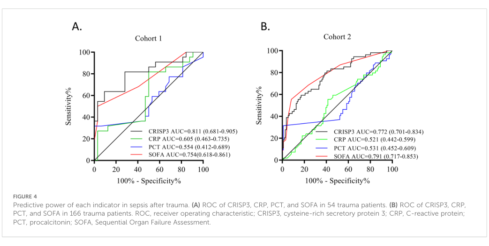

## Question

# Gene Research for Functional Annotation

## ⚠️ CRITICAL: Gene/Protein Identification Context

**BEFORE YOU BEGIN RESEARCH:** You MUST verify you are researching the CORRECT gene/protein. Gene symbols can be ambiguous, especially for less well-characterized genes from non-model organisms.

### Target Gene/Protein Identity (from UniProt):
- **UniProt Accession:** P54108
- **Protein Description:** RecName: Full=Cysteine-rich secretory protein 3; Short=CRISP-3; AltName: Full=Specific granule protein of 28 kDa; Short=SGP28; Flags: Precursor;
- **Gene Information:** Name=CRISP3;
- **Organism (full):** Homo sapiens (Human).
- **Protein Family:** Belongs to the CRISP family. .
- **Key Domains:** Allrgn_V5/Tpx1_CS. (IPR018244); CAP_dom. (IPR014044); CAP_sf. (IPR035940); Crisp-like_dom. (IPR042076); CRISP-related. (IPR001283)

### MANDATORY VERIFICATION STEPS:

1. **Check if the gene symbol "CRISP3" matches the protein description above**
2. **Verify the organism is correct:** Homo sapiens (Human).
3. **Check if protein family/domains align with what you find in literature**
4. **If you find literature for a DIFFERENT gene with the same or similar symbol, STOP**

### If Gene Symbol is Ambiguous or You Cannot Find Relevant Literature:

**DO NOT PROCEED WITH RESEARCH ON A DIFFERENT GENE.** Instead:
- State clearly: "The gene symbol 'CRISP3' is ambiguous or literature is limited for this specific protein"
- Explain what you found (e.g., "Found extensive literature on a different gene with the same symbol in a different organism")
- Describe the protein based ONLY on the UniProt information provided above
- Suggest that the protein function can be inferred from domain/family information

### Research Target:

Please provide a comprehensive research report on the gene **CRISP3** (gene ID: CRISP3, UniProt: P54108) in human.

The research report should be a detailed narrative explaining the function, biological processes, and localization of the gene product. Citations should be given for all claims.

You should prioritize authoritative reviews and primary scientific literature when conducting research. You can supplement
this with annotations you find in gene/protein databases, but these can be outdated or inaccurate.

We are specifically interested in the primary function of the gene - for enzymes, what reaction is catalyzed, and what is the substrate specificity? For transporters, what is the substrate? For structural proteins or adapters, what is the broader structural role? For signaling molecules, what is the role in the pathway.

We are interested in where in or outside the cell the gene product carries out its function.

We are also interested in the signaling or biochemical pathways in which the gene functions. We are less interested in broad pleiotropic effects, except where these elucidate the precise role.

Include evidence where possible. We are interested in both experimental evidence as well as inference from structure, evolution, or bioinformatic analysis. Precise studies should be prioritized over high-throughput, where available.

## Output

Question: You are an expert researcher providing comprehensive, well-cited information.

Provide detailed information focusing on:
1. Key concepts and definitions with current understanding
2. Recent developments and latest research (prioritize 2023-2024 sources)
3. Current applications and real-world implementations
4. Expert opinions and analysis from authoritative sources
5. Relevant statistics and data from recent studies

Format as a comprehensive research report with proper citations. Include URLs and publication dates where available.
Always prioritize recent, authoritative sources and provide specific citations for all major claims.

# Gene Research for Functional Annotation

## ⚠️ CRITICAL: Gene/Protein Identification Context

**BEFORE YOU BEGIN RESEARCH:** You MUST verify you are researching the CORRECT gene/protein. Gene symbols can be ambiguous, especially for less well-characterized genes from non-model organisms.

### Target Gene/Protein Identity (from UniProt):
- **UniProt Accession:** P54108
- **Protein Description:** RecName: Full=Cysteine-rich secretory protein 3; Short=CRISP-3; AltName: Full=Specific granule protein of 28 kDa; Short=SGP28; Flags: Precursor;
- **Gene Information:** Name=CRISP3;
- **Organism (full):** Homo sapiens (Human).
- **Protein Family:** Belongs to the CRISP family. .
- **Key Domains:** Allrgn_V5/Tpx1_CS. (IPR018244); CAP_dom. (IPR014044); CAP_sf. (IPR035940); Crisp-like_dom. (IPR042076); CRISP-related. (IPR001283)

### MANDATORY VERIFICATION STEPS:

1. **Check if the gene symbol "CRISP3" matches the protein description above**
2. **Verify the organism is correct:** Homo sapiens (Human).
3. **Check if protein family/domains align with what you find in literature**
4. **If you find literature for a DIFFERENT gene with the same or similar symbol, STOP**

### If Gene Symbol is Ambiguous or You Cannot Find Relevant Literature:

**DO NOT PROCEED WITH RESEARCH ON A DIFFERENT GENE.** Instead:
- State clearly: "The gene symbol 'CRISP3' is ambiguous or literature is limited for this specific protein"
- Explain what you found (e.g., "Found extensive literature on a different gene with the same symbol in a different organism")
- Describe the protein based ONLY on the UniProt information provided above
- Suggest that the protein function can be inferred from domain/family information

### Research Target:

Please provide a comprehensive research report on the gene **CRISP3** (gene ID: CRISP3, UniProt: P54108) in human.

The research report should be a detailed narrative explaining the function, biological processes, and localization of the gene product. Citations should be given for all claims.

You should prioritize authoritative reviews and primary scientific literature when conducting research. You can supplement
this with annotations you find in gene/protein databases, but these can be outdated or inaccurate.

We are specifically interested in the primary function of the gene - for enzymes, what reaction is catalyzed, and what is the substrate specificity? For transporters, what is the substrate? For structural proteins or adapters, what is the broader structural role? For signaling molecules, what is the role in the pathway.

We are interested in where in or outside the cell the gene product carries out its function.

We are also interested in the signaling or biochemical pathways in which the gene functions. We are less interested in broad pleiotropic effects, except where these elucidate the precise role.

Include evidence where possible. We are interested in both experimental evidence as well as inference from structure, evolution, or bioinformatic analysis. Precise studies should be prioritized over high-throughput, where available.

## Research Report: Human **CRISP3** (UniProt **P54108**) — Functional Annotation and Current Evidence

### 1) Target identity verification (mandatory)
The gene symbol **CRISP3** in this report refers specifically to **human cysteine-rich secretory protein 3 (CRISP-3)**, also known as **specific granule protein of 28 kDa (SGP28)**, a secreted glycoprotein detected in multiple body fluids and in neutrophil granules. A primary human seminal-plasma study explicitly identifies **CRISP-3 (cysteine-rich secretory protein 3) as UniProt accession P54108**, matching the user-provided UniProt record. (belardin2019cysteine‐richsecretoryprotein pages 1-2)

### 2) Key concepts and definitions (current understanding)

#### 2.1 CRISP3 as a CAP/CRISP-family secreted protein (not an enzyme)
CRISP3 belongs to the vertebrate **CRISP (cysteine-rich secretory protein)** family within the **CAP superfamily**. Contemporary mechanistic work frames CRISP proteins as **ligand-binding/interaction proteins** with an **N-terminal CAP domain** and a **C-terminal cysteine-rich (CRISP) domain**, rather than catalytic enzymes with a defined substrate/reaction. (miya2024mammaliancysteine‐richsecretory pages 11-12, atab2024alpha1bglycoprotein(a1bg) pages 1-2)

#### 2.2 Glycoforms and secreted forms
Human seminal plasma CRISP3 is commonly detected as two bands corresponding to **~29 kDa (unglycosylated)** and **~31 kDa (glycosylated)** forms, consistent with secreted glycoprotein biology and post-translational modification. (belardin2019cysteine‐richsecretoryprotein pages 1-2, udby2005characterizationandlocalization pages 3-5)

### 3) Localization, expression, and where the protein acts

#### 3.1 Cellular localization: neutrophil granules and secretion
CRISP3/SGP28 is localized to **neutrophil granules** (including specific and gelatinase granules) and is measurable in circulation and secretions, supporting a role in extracellular or luminal environments after degranulation/secretion. (bjartell2007associationofcysteinerich pages 1-2, udby2005characterizationandlocalization pages 1-2)

#### 3.2 Tissue localization in the human male reproductive tract
A dedicated localization study in humans showed that CRISP3 localizes to **secretory epithelium throughout the male genital tract**, with **particularly strong staining in the cauda epididymis and ampulla/vas deferens**, and that seminal plasma CRISP3 is **free in solution (not prostasome-associated)**. (udby2005characterizationandlocalization pages 5-8, udby2005characterizationandlocalization pages 1-2)

#### 3.3 Presence in body fluids (quantitative data)
Reported concentrations (compiled from an authoritative dissertation-style synthesis of the field) include CRISP3 levels in multiple fluids: **saliva ~22 µg/mL**, **plasma ~6 µg/mL**, **sweat ~0.15 µg/mL**, and **seminal plasma ~11 µg/mL**; neutrophils were reported at **~0.18 µg per 10^6 neutrophils**. (edstrom2010antimicrobialactivityof pages 28-31)

### 4) Molecular functions, binding partners, and pathways

#### 4.1 PMCA4b (ATP2B4) interaction: CRISP3 in Ca2+ homeostasis (2024)
A 2024 mechanistic study identified the plasma-membrane Ca2+ exporter **PMCA4b** as a binding partner for CRISP-family proteins and demonstrated that **human CRISP3 interacts with PMCA4b via the N-terminal CAP domain**. Unlike hCRISP1 and rat CRISP4, **hCRISP3 did not inhibit PMCA4b-mediated Ca2+ extrusion** in their assay system, implying functional divergence among paralogs. (miya2024mammaliancysteine‐richsecretory pages 11-12, miya2024mammaliancysteine‐richsecretory pages 1-2, miya2024mammaliancysteine‐richsecretory pages 13-13)

**Interpretation:** This supports a model in which CRISP3 can physically associate with membrane Ca2+ handling machinery, potentially influencing sperm and/or immune-cell physiology through protein–protein interaction rather than enzymatic catalysis. (miya2024mammaliancysteine‐richsecretory pages 11-12, miya2024mammaliancysteine‐richsecretory pages 1-2)

#### 4.2 PSP94/MSMB binding in seminal plasma
CRISP3 binds **beta-microseminoprotein (MSMB; also called PSP94)** in human seminal plasma, a reproducible interaction that suggests CRISP3 participates in seminal plasma protein complexes. (edstrom2010antimicrobialactivityof pages 28-31)

#### 4.3 A1BG binding and sterol-binding/export inhibition (2024)
A 2024 Journal of Biological Chemistry study reported that CRISP3 is an abundant seminal plasma protein that can bind **alpha-1-B glycoprotein (A1BG)** with **nanomolar affinity**, and showed that coexpression of A1BG with **CRISP3** (and other CAP/CRISP proteins) can reduce sterol secretion/export by **>50%** in cellular systems; this work situates CRISP proteins within a conserved sterol-binding/export functional axis across CAP-family proteins. (atab2024alpha1bglycoprotein(a1bg) pages 1-2)

**Interpretation:** This provides a plausible biochemical function for CRISP3’s CAP domain as a ligand-binding module whose activity can be regulated by specific plasma partners (A1BG). (atab2024alpha1bglycoprotein(a1bg) pages 1-2)

### 5) Recent developments and latest research (prioritizing 2023–2024)

#### 5.1 CRISP3 as a sepsis-associated plasma biomarker (Frontiers in Immunology, 2024-11)
A 2024 study integrated public transcriptomic datasets and two retrospective trauma cohorts to evaluate CRISP3 in sepsis.

* Transcriptomic meta-analysis (23 datasets): **SMD 0.90 (95% CI 0.50–1.30), p < 0.001**, consistent with increased CRISP3 expression in sepsis. (zhang2024upregulationofcrisp3 pages 1-2)
* Trauma cohort 1 (n=54): admission CRISP3 associated with sepsis incidence (**OR 1.004 [1.002–1.006], p < 0.001**) and ROC performance **AUC 0.811 (0.681–0.905)**. (zhang2024upregulationofcrisp3 pages 1-2, zhang2024upregulationofcrisp3 media cc8c57b2)
* Trauma cohort 2 (n=166): validation association (**OR 1.002 [1.001–1.003], p < 0.001**) and **AUC 0.772 (0.701–0.834)**. (zhang2024upregulationofcrisp3 pages 1-2, zhang2024upregulationofcrisp3 media cc8c57b2)

The ROC curves with AUCs are shown in the paper’s Figure 4. (zhang2024upregulationofcrisp3 media cc8c57b2)

#### 5.2 Mechanistic interactome expansion for CRISP-family proteins (Andrology, 2024-10)
The 2024 PMCA4b-interaction study provides a concrete CRISP3 binding partner and domain mapping (CAP domain-mediated interaction), moving CRISP3 biology beyond purely correlative expression studies and toward mechanistic hypotheses related to **Ca2+ handling**. (miya2024mammaliancysteine‐richsecretory pages 11-12, miya2024mammaliancysteine‐richsecretory pages 1-2)

### 6) Disease associations and real-world applications

#### 6.1 Prostate cancer biology and biomarker potential
CRISP3 is strongly linked to prostate cancer molecular subtypes:

* **TMPRSS2–ERG fusion association and ERG targeting (PLoS ONE, 2011-07):** CRISP3 showed **>50-fold** higher expression in fusion-positive tumors versus fusion-negative tumors in the discovery set, with fusion-negative expression similar to non-malignant tissue; CRISP3 and ERG were strongly correlated (e.g., **rs ~0.65**, p<0.001) and CRISP3 was shown by ChIP to be a **direct ERG target**. (ribeiro2011cysteinerichsecretoryprotein3 pages 1-2, ribeiro2011cysteinerichsecretoryprotein3 pages 8-9)
* In an independent analysis within that work, CRISP3 protein overexpression by IHC was observed in **~63% of carcinomas**. (ribeiro2011cysteinerichsecretoryprotein3 pages 1-2)

Earlier large-cohort outcome work after radical prostatectomy (Clinical Cancer Research, 2007-07) reported that **CRISP3 positivity associated with worse recurrence-free probability** (univariate **HR 1.53, P=0.010**; remained significant on multivariable analysis P=0.007), though it did not materially improve prediction beyond PSA/stage/grade in their model. (bjartell2007associationofcysteinerich pages 1-2)

**Real-world implementation context:** These data support CRISP3 as a tissue (IHC) and transcript marker associated with specific prostate cancer biology (ERG-driven). However, the evidence in this context does not establish CRISP3 as a stand-alone clinically adopted test; rather, it is best viewed as an investigational or adjunct biomarker within molecular stratification frameworks. (bjartell2007associationofcysteinerich pages 1-2, ribeiro2011cysteinerichsecretoryprotein3 pages 1-2)

#### 6.2 Seminal plasma marker of inflammation-related male reproductive pathology (Andrology, 2019-10)
In varicocele, seminal plasma CRISP3 levels were markedly elevated and decreased after surgery:

* Varicocele vs control: **67.5-fold increase** (29 kDa band) and **5.2-fold increase** (31 kDa band). (belardin2019cysteine‐richsecretoryprotein pages 1-2)
* Post-varicocelectomy: **5.6-fold decrease** (29 kDa) and **4.3-fold decrease** (31 kDa), alongside improved semen parameters, supporting CRISP3 as an inflammation-linked seminal marker candidate. (belardin2019cysteine‐richsecretoryprotein pages 1-2)

#### 6.3 Sepsis risk prediction (Frontiers in Immunology, 2024-11)
The 2024 sepsis study suggests CRISP3 could be used as a **risk-prediction biomarker at admission** in trauma patients, with ROC/AUC performance competitive with or better than some conventional laboratory markers in that dataset. (zhang2024upregulationofcrisp3 pages 1-2, zhang2024upregulationofcrisp3 media cc8c57b2)

### 7) Expert synthesis and interpretation (authoritative analysis)

1. **Primary molecular role:** The strongest mechanistic evidence positions CRISP3 as a **secreted, interaction-driven CAP/CRISP protein** participating in extracellular complexes (e.g., with MSMB/PSP94, A1BG) and binding to a membrane Ca2+ exporter (PMCA4b), consistent with a functional repertoire in **ligand binding, complex formation, and modulation of membrane/extracellular physiology** rather than enzymatic catalysis. (miya2024mammaliancysteine‐richsecretory pages 11-12, atab2024alpha1bglycoprotein(a1bg) pages 1-2, edstrom2010antimicrobialactivityof pages 28-31)

2. **Physiologic contexts:** CRISP3’s dual association with **neutrophil granules** and **male reproductive tract secretions** supports two plausible biology axes: (i) **innate immune degranulation/secreted protein biology**, and (ii) **reproductive tract secretory milieu** and sperm environment. (udby2005characterizationandlocalization pages 1-2, udby2005characterizationandlocalization pages 5-8)

3. **Disease translation:** The most mature 2024 translation is as a **sepsis-associated biomarker** with quantified ORs and AUCs in two cohorts; in oncology, the most mechanistically grounded link is **ERG-driven CRISP3 overexpression in TMPRSS2–ERG prostate cancer**, suggesting utility as a marker of that transcriptional program and potentially of tumor microenvironment interactions. (zhang2024upregulationofcrisp3 pages 1-2, ribeiro2011cysteinerichsecretoryprotein3 pages 8-9, ribeiro2011cysteinerichsecretoryprotein3 pages 1-2)

### 8) Consolidated evidence table
| Category | Key findings | Quantitative/statistical data | Key sources (author year, journal) | URL |
|---|---|---|---|---|
| Identity/features | Human CRISP3 is verified as cysteine-rich secretory protein 3, also called SGP28, matching UniProt P54108; it is a secreted CRISP/CAP-family glycoprotein detected as ~29 kDa unglycosylated and ~31 kDa glycosylated forms in seminal plasma (belardin2019cysteine‐richsecretoryprotein pages 1-2, udby2005characterizationandlocalization pages 1-2) | Two seminal-plasma isoforms: 29 kDa and 31 kDa; human CRISP3 is described as a 245-aa extracellular/secreted protein in prostate-cancer literature (belardin2019cysteine‐richsecretoryprotein pages 1-2, ribeiro2011cysteinerichsecretoryprotein3 pages 8-9) | Belardin 2019, *Andrology*; Udby 2005, *Journal of Andrology*; Ribeiro 2011, *PLoS ONE* | https://doi.org/10.1111/andr.12555; https://doi.org/10.2164/jandrol.04132; https://doi.org/10.1371/journal.pone.0022317 |
| Localization & expression | CRISP3 is present in neutrophil specific/gelatinase granules, plasma, saliva, sweat, and seminal plasma; in the male tract it localizes to secretory epithelium throughout, with strongest expression in cauda epididymis and ampulla/vas deferens, and seminal-plasma CRISP3 is free in solution rather than prostasome-associated (bjartell2007associationofcysteinerich pages 1-2, udby2005characterizationandlocalization pages 1-2, edstrom2010antimicrobialactivityof pages 28-31, udby2005characterizationandlocalization pages 5-8) | Reported concentrations: saliva ~22 µg/mL, plasma ~6 µg/mL, sweat ~0.15 µg/mL, seminal plasma ~11 µg/mL; tissue levels low in testis/caput-corpus epididymis (~0.025 mg CRISP3 per mg protein) and high in cauda epididymis/vas deferens (~4.5 mg/mg protein) (edstrom2010antimicrobialactivityof pages 28-31, udby2005characterizationandlocalization pages 5-8) | Udby 2005, *Journal of Andrology*; Bjartell 2007, *Clinical Cancer Research*; Edström 2010 (thesis/monograph context) | https://doi.org/10.2164/jandrol.04132; https://doi.org/10.1158/1078-0432.ccr-06-3031 |
| Binding partners/mechanisms | Recent mechanistic work shows human CRISP3 binds PMCA4b via its N-terminal CAP domain; unlike hCRISP1/rCRISP4 it did not inhibit PMCA4b-mediated Ca2+ extrusion. CRISP3 also interacts with PSP94/MSMB in seminal plasma, and A1BG binds CRISP-family proteins with nanomolar affinity and inhibits sterol binding/export, supporting roles in extracellular ligand binding rather than a defined enzymatic reaction (miya2024mammaliancysteine‐richsecretory pages 11-12, miya2024mammaliancysteine‐richsecretory pages 1-2, atab2024alpha1bglycoprotein(a1bg) pages 1-2, edstrom2010antimicrobialactivityof pages 28-31) | A1BG coexpression blocked sterol secretion by >50%; CRISP3-A1BG interaction described as nanomolar affinity; PMCA4b interaction mapped to the CAP domain, while hCRISP3 did not reduce PMCA4b Ca2+ clearance in the 2024 assay system (miya2024mammaliancysteine‐richsecretory pages 11-12, miya2024mammaliancysteine‐richsecretory pages 1-2, atab2024alpha1bglycoprotein(a1bg) pages 1-2) | Miya 2024, *Andrology*; Atab 2024, *Journal of Biological Chemistry* | https://doi.org/10.1111/andr.13549; https://doi.org/10.1016/j.jbc.2024.107910 |
| Disease/biomarker applications | In sepsis, plasma CRISP3 is elevated and shows biomarker potential in trauma cohorts. In prostate cancer, CRISP3 is a direct ERG target and is strongly overexpressed in TMPRSS2-ERG fusion-positive tumors. In varicocele-associated infertility, seminal CRISP3 rises markedly and falls after surgery, supporting use as an inflammation-linked seminal biomarker (zhang2024upregulationofcrisp3 pages 1-2, zhang2024upregulationofcrisp3 media cc8c57b2, ribeiro2011cysteinerichsecretoryprotein3 pages 8-9, ribeiro2011cysteinerichsecretoryprotein3 pages 5-6, ribeiro2011cysteinerichsecretoryprotein3 pages 1-2, belardin2019cysteine‐richsecretoryprotein pages 1-2) | Sepsis: meta-analysis of 23 datasets SMD 0.90 (95% CI 0.50-1.30), p<0.001; cohort 1 OR 1.004 (1.002-1.006), AUC 0.811 (0.681-0.905); cohort 2 OR 1.002 (1.001-1.003), AUC 0.772 (0.701-0.834). Prostate cancer: >50-fold upregulation in fusion-positive tumors, ~53-fold vs TMPRSS2-ERG-negative, 63% IHC overexpression, ERG-CRISP3 correlation rs=0.65, p<0.001. Varicocele: seminal CRISP3 increased 67.5-fold (29 kDa) and 5.2-fold (31 kDa); after varicocelectomy decreased 5.6-fold and 4.3-fold (zhang2024upregulationofcrisp3 pages 1-2, zhang2024upregulationofcrisp3 media cc8c57b2, ribeiro2011cysteinerichsecretoryprotein3 pages 8-9, ribeiro2011cysteinerichsecretoryprotein3 pages 5-6, ribeiro2011cysteinerichsecretoryprotein3 pages 1-2, belardin2019cysteine‐richsecretoryprotein pages 1-2) | Zhang 2024, *Frontiers in Immunology*; Ribeiro 2011, *PLoS ONE*; Bjartell 2007, *Clinical Cancer Research*; Belardin 2019, *Andrology* | https://doi.org/10.3389/fimmu.2024.1492538; https://doi.org/10.1371/journal.pone.0022317; https://doi.org/10.1158/1078-0432.ccr-06-3031; https://doi.org/10.1111/andr.12555 |

*Table: This table compiles core evidence for human CRISP3 (UniProt P54108), spanning identity, localization, binding partners, and disease/biomarker relevance. It emphasizes recent 2024 studies while anchoring them to foundational localization and prostate-cancer literature.*

### 9) Key figure (recent quantitative performance)
Zhang et al. (2024) Figure 4 provides ROC curves and AUCs for admission plasma CRISP3 predicting sepsis in two trauma cohorts. (zhang2024upregulationofcrisp3 media cc8c57b2)

### 10) References (URLs and publication dates)

* Zhang A-q et al. **Upregulation of CRISP3 and its clinical values in adult sepsis**. *Frontiers in Immunology*. **Nov 2024**. https://doi.org/10.3389/fimmu.2024.1492538 (zhang2024upregulationofcrisp3 pages 1-2)
* Miya V et al. **Mammalian CRISPs interact with plasma membrane Ca2+ exporter PMCA4b**. *Andrology*. **Oct 2024**. https://doi.org/10.1111/andr.13549 (miya2024mammaliancysteine‐richsecretory pages 11-12)
* El Atab O et al. **A1BG inhibits sterol-binding and export by CRISP proteins**. *Journal of Biological Chemistry*. **Dec 2024**. https://doi.org/10.1016/j.jbc.2024.107910 (atab2024alpha1bglycoprotein(a1bg) pages 1-2)
* Ribeiro FR et al. **CRISP3 is strongly up-regulated in TMPRSS2-ERG fusion prostate carcinoma and is an ERG target**. *PLoS ONE*. **Jul 2011**. https://doi.org/10.1371/journal.pone.0022317 (ribeiro2011cysteinerichsecretoryprotein3 pages 1-2)
* Bjartell AS et al. **CRISP3 and β-microseminoprotein with outcome after radical prostatectomy**. *Clinical Cancer Research*. **Jul 2007**. https://doi.org/10.1158/1078-0432.ccr-06-3031 (bjartell2007associationofcysteinerich pages 1-2)
* Udby L et al. **Characterization and localization of CRISP-3 in the human male reproductive tract**. *Journal of Andrology*. **May 2005**. https://doi.org/10.2164/jandrol.04132 (udby2005characterizationandlocalization pages 1-2)
* Belardin LB et al. **CRISP-3: inflammation role in adult varicocoele**. *Andrology*. **Oct 2019**. https://doi.org/10.1111/andr.12555 (belardin2019cysteine‐richsecretoryprotein pages 1-2)

### 11) Limitations of the current evidence base (scope control)
Although CRISP3 is well supported as a secreted CAP/CRISP protein with specific binding partners and strong disease associations, the evidence assembled here does not yet establish a single, universally accepted “primary physiologic function” analogous to a catalytic enzyme reaction; rather, current best evidence supports **context-dependent interaction roles** (immune granules, reproductive secretions, cancer microenvironments). (miya2024mammaliancysteine‐richsecretory pages 11-12, atab2024alpha1bglycoprotein(a1bg) pages 1-2, udby2005characterizationandlocalization pages 5-8)

References

1. (belardin2019cysteine‐richsecretoryprotein pages 1-2): L. B. Belardin, M. Camargo, P. Intasqui, M. P. Antoniassi, R. Fraietta, and R. Bertolla. Cysteine‐rich secretory protein 3: inflammation role in adult varicocoele. Andrology, 7:53-61, Oct 2019. URL: https://doi.org/10.1111/andr.12555, doi:10.1111/andr.12555. This article has 30 citations and is from a peer-reviewed journal.

2. (miya2024mammaliancysteine‐richsecretory pages 11-12): Vaidehi Miya, Chandan Kumar, Ananya A. Breed, Susan Idicula‐Thomas, and Bhakti R. Pathak. Mammalian cysteine‐rich secretory proteins interact with plasma membrane ca2+ exporter pmca4b. Andrology, 12:1096-1110, Oct 2024. URL: https://doi.org/10.1111/andr.13549, doi:10.1111/andr.13549. This article has 2 citations and is from a peer-reviewed journal.

3. (atab2024alpha1bglycoprotein(a1bg) pages 1-2): Ola El Atab, Barkha Gupta, Zhu Han, Jiri Stribny, Oluwatoyin A. Asojo, and Roger Schneiter. Alpha-1-b glycoprotein (a1bg) inhibits sterol-binding and export by crisp2. Journal of Biological Chemistry, 300:107910, Dec 2024. URL: https://doi.org/10.1016/j.jbc.2024.107910, doi:10.1016/j.jbc.2024.107910. This article has 4 citations and is from a domain leading peer-reviewed journal.

4. (udby2005characterizationandlocalization pages 3-5): Lene Udby, Anders Bjartell, Johan Malm, Arne Egesten, Åke Lundwall, Jack B. Cowland, Niels Borregaard, and Lars Kjeldsen. Characterization and localization of cysteine-rich secretory protein 3 (crisp-3) in the human male reproductive tract. Journal of andrology, 26 3:333-42, May 2005. URL: https://doi.org/10.2164/jandrol.04132, doi:10.2164/jandrol.04132. This article has 107 citations.

5. (bjartell2007associationofcysteinerich pages 1-2): Anders S. Bjartell, Hikmat Al-Ahmadie, Angel M. Serio, James A. Eastham, Scott E. Eggener, Samson W. Fine, Lene Udby, William L. Gerald, Andrew J. Vickers, Hans Lilja, Victor E. Reuter, and Peter T. Scardino. Association of cysteine-rich secretory protein 3 and β-microseminoprotein with outcome after radical prostatectomy. Clinical Cancer Research, 13:4130-4138, Jul 2007. URL: https://doi.org/10.1158/1078-0432.ccr-06-3031, doi:10.1158/1078-0432.ccr-06-3031. This article has 131 citations and is from a highest quality peer-reviewed journal.

6. (udby2005characterizationandlocalization pages 1-2): Lene Udby, Anders Bjartell, Johan Malm, Arne Egesten, Åke Lundwall, Jack B. Cowland, Niels Borregaard, and Lars Kjeldsen. Characterization and localization of cysteine-rich secretory protein 3 (crisp-3) in the human male reproductive tract. Journal of andrology, 26 3:333-42, May 2005. URL: https://doi.org/10.2164/jandrol.04132, doi:10.2164/jandrol.04132. This article has 107 citations.

7. (udby2005characterizationandlocalization pages 5-8): Lene Udby, Anders Bjartell, Johan Malm, Arne Egesten, Åke Lundwall, Jack B. Cowland, Niels Borregaard, and Lars Kjeldsen. Characterization and localization of cysteine-rich secretory protein 3 (crisp-3) in the human male reproductive tract. Journal of andrology, 26 3:333-42, May 2005. URL: https://doi.org/10.2164/jandrol.04132, doi:10.2164/jandrol.04132. This article has 107 citations.

8. (edstrom2010antimicrobialactivityof pages 28-31): A Edström. Antimicrobial activity of human seminal plasma and seminal plasma proteins. Unknown journal, 2010.

9. (miya2024mammaliancysteine‐richsecretory pages 1-2): Vaidehi Miya, Chandan Kumar, Ananya A. Breed, Susan Idicula‐Thomas, and Bhakti R. Pathak. Mammalian cysteine‐rich secretory proteins interact with plasma membrane ca2+ exporter pmca4b. Andrology, 12:1096-1110, Oct 2024. URL: https://doi.org/10.1111/andr.13549, doi:10.1111/andr.13549. This article has 2 citations and is from a peer-reviewed journal.

10. (miya2024mammaliancysteine‐richsecretory pages 13-13): Vaidehi Miya, Chandan Kumar, Ananya A. Breed, Susan Idicula‐Thomas, and Bhakti R. Pathak. Mammalian cysteine‐rich secretory proteins interact with plasma membrane ca2+ exporter pmca4b. Andrology, 12:1096-1110, Oct 2024. URL: https://doi.org/10.1111/andr.13549, doi:10.1111/andr.13549. This article has 2 citations and is from a peer-reviewed journal.

11. (zhang2024upregulationofcrisp3 pages 1-2): An-qiang Zhang, Da-lin Wen, Xin-xin Ma, Fei Zhang, Guo-sheng Chen, Kelimu Maimaiti, Gang Xu, Jian-xin Jiang, and Hong-xiang Lu. Upregulation of crisp3 and its clinical values in adult sepsis: a comprehensive analysis based on microarrays and a two-retrospective-cohort study. Frontiers in Immunology, Nov 2024. URL: https://doi.org/10.3389/fimmu.2024.1492538, doi:10.3389/fimmu.2024.1492538. This article has 2 citations and is from a peer-reviewed journal.

12. (zhang2024upregulationofcrisp3 media cc8c57b2): An-qiang Zhang, Da-lin Wen, Xin-xin Ma, Fei Zhang, Guo-sheng Chen, Kelimu Maimaiti, Gang Xu, Jian-xin Jiang, and Hong-xiang Lu. Upregulation of crisp3 and its clinical values in adult sepsis: a comprehensive analysis based on microarrays and a two-retrospective-cohort study. Frontiers in Immunology, Nov 2024. URL: https://doi.org/10.3389/fimmu.2024.1492538, doi:10.3389/fimmu.2024.1492538. This article has 2 citations and is from a peer-reviewed journal.

13. (ribeiro2011cysteinerichsecretoryprotein3 pages 1-2): Franclim R. Ribeiro, Paula Paulo, Vera L. Costa, João D. Barros-Silva, João Ramalho-Carvalho, Carmen Jerónimo, Rui Henrique, Guro E. Lind, Rolf I. Skotheim, Ragnhild A. Lothe, and Manuel R. Teixeira. Cysteine-rich secretory protein-3 (crisp3) is strongly up-regulated in prostate carcinomas with the tmprss2-erg fusion gene. PLoS ONE, 6:e22317, Jul 2011. URL: https://doi.org/10.1371/journal.pone.0022317, doi:10.1371/journal.pone.0022317. This article has 61 citations and is from a peer-reviewed journal.

14. (ribeiro2011cysteinerichsecretoryprotein3 pages 8-9): Franclim R. Ribeiro, Paula Paulo, Vera L. Costa, João D. Barros-Silva, João Ramalho-Carvalho, Carmen Jerónimo, Rui Henrique, Guro E. Lind, Rolf I. Skotheim, Ragnhild A. Lothe, and Manuel R. Teixeira. Cysteine-rich secretory protein-3 (crisp3) is strongly up-regulated in prostate carcinomas with the tmprss2-erg fusion gene. PLoS ONE, 6:e22317, Jul 2011. URL: https://doi.org/10.1371/journal.pone.0022317, doi:10.1371/journal.pone.0022317. This article has 61 citations and is from a peer-reviewed journal.

15. (ribeiro2011cysteinerichsecretoryprotein3 pages 5-6): Franclim R. Ribeiro, Paula Paulo, Vera L. Costa, João D. Barros-Silva, João Ramalho-Carvalho, Carmen Jerónimo, Rui Henrique, Guro E. Lind, Rolf I. Skotheim, Ragnhild A. Lothe, and Manuel R. Teixeira. Cysteine-rich secretory protein-3 (crisp3) is strongly up-regulated in prostate carcinomas with the tmprss2-erg fusion gene. PLoS ONE, 6:e22317, Jul 2011. URL: https://doi.org/10.1371/journal.pone.0022317, doi:10.1371/journal.pone.0022317. This article has 61 citations and is from a peer-reviewed journal.

## Artifacts

- [Edison artifact artifact-00](CRISP3-deep-research-falcon_artifacts/artifact-00.md)

## Citations

1. edstrom2010antimicrobialactivityof pages 28-31
2. bjartell2007associationofcysteinerich pages 1-2
3. udby2005characterizationandlocalization pages 1-2
4. udby2005characterizationandlocalization pages 3-5
5. udby2005characterizationandlocalization pages 5-8
6. 1.002–1.006
7. 1.001–1.003
8. https://doi.org/10.1111/andr.12555;
9. https://doi.org/10.2164/jandrol.04132;
10. https://doi.org/10.1371/journal.pone.0022317
11. https://doi.org/10.1158/1078-0432.ccr-06-3031
12. https://doi.org/10.1111/andr.13549;
13. https://doi.org/10.1016/j.jbc.2024.107910
14. https://doi.org/10.3389/fimmu.2024.1492538;
15. https://doi.org/10.1371/journal.pone.0022317;
16. https://doi.org/10.1158/1078-0432.ccr-06-3031;
17. https://doi.org/10.1111/andr.12555
18. https://doi.org/10.3389/fimmu.2024.1492538
19. https://doi.org/10.1111/andr.13549
20. https://doi.org/10.2164/jandrol.04132
21. https://doi.org/10.1111/andr.12555,
22. https://doi.org/10.1111/andr.13549,
23. https://doi.org/10.1016/j.jbc.2024.107910,
24. https://doi.org/10.2164/jandrol.04132,
25. https://doi.org/10.1158/1078-0432.ccr-06-3031,
26. https://doi.org/10.3389/fimmu.2024.1492538,
27. https://doi.org/10.1371/journal.pone.0022317,