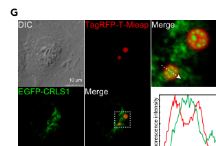

## Question

# Gene Research for Functional Annotation

## ⚠️ CRITICAL: Gene/Protein Identification Context

**BEFORE YOU BEGIN RESEARCH:** You MUST verify you are researching the CORRECT gene/protein. Gene symbols can be ambiguous, especially for less well-characterized genes from non-model organisms.

### Target Gene/Protein Identity (from UniProt):
- **UniProt Accession:** Q9UJA2
- **Protein Description:** RecName: Full=Cardiolipin synthase (CMP-forming); Short=CLS; EC=2.7.8.41 {ECO:0000269|PubMed:16678169, ECO:0000269|PubMed:16716149}; AltName: Full=Protein GCD10 homolog;
- **Gene Information:** Name=CRLS1; Synonyms=C20orf155, CLS1;
- **Organism (full):** Homo sapiens (Human).
- **Protein Family:** Belongs to the CDP-alcohol phosphatidyltransferase class-I
- **Key Domains:** CDP-alcohol_PTase-I. (IPR050324); CDP-OH_P_trans. (IPR000462); CDP-OH_PTrfase_TM_dom. (IPR043130); CDP-OH_P_transf (PF01066)

### MANDATORY VERIFICATION STEPS:

1. **Check if the gene symbol "CRLS1" matches the protein description above**
2. **Verify the organism is correct:** Homo sapiens (Human).
3. **Check if protein family/domains align with what you find in literature**
4. **If you find literature for a DIFFERENT gene with the same or similar symbol, STOP**

### If Gene Symbol is Ambiguous or You Cannot Find Relevant Literature:

**DO NOT PROCEED WITH RESEARCH ON A DIFFERENT GENE.** Instead:
- State clearly: "The gene symbol 'CRLS1' is ambiguous or literature is limited for this specific protein"
- Explain what you found (e.g., "Found extensive literature on a different gene with the same symbol in a different organism")
- Describe the protein based ONLY on the UniProt information provided above
- Suggest that the protein function can be inferred from domain/family information

### Research Target:

Please provide a comprehensive research report on the gene **CRLS1** (gene ID: CRLS1, UniProt: Q9UJA2) in human.

The research report should be a detailed narrative explaining the function, biological processes, and localization of the gene product. Citations should be given for all claims.

You should prioritize authoritative reviews and primary scientific literature when conducting research. You can supplement
this with annotations you find in gene/protein databases, but these can be outdated or inaccurate.

We are specifically interested in the primary function of the gene - for enzymes, what reaction is catalyzed, and what is the substrate specificity? For transporters, what is the substrate? For structural proteins or adapters, what is the broader structural role? For signaling molecules, what is the role in the pathway.

We are interested in where in or outside the cell the gene product carries out its function.

We are also interested in the signaling or biochemical pathways in which the gene functions. We are less interested in broad pleiotropic effects, except where these elucidate the precise role.

Include evidence where possible. We are interested in both experimental evidence as well as inference from structure, evolution, or bioinformatic analysis. Precise studies should be prioritized over high-throughput, where available.

## Output

Question: You are an expert researcher providing comprehensive, well-cited information.

Provide detailed information focusing on:
1. Key concepts and definitions with current understanding
2. Recent developments and latest research (prioritize 2023-2024 sources)
3. Current applications and real-world implementations
4. Expert opinions and analysis from authoritative sources
5. Relevant statistics and data from recent studies

Format as a comprehensive research report with proper citations. Include URLs and publication dates where available.
Always prioritize recent, authoritative sources and provide specific citations for all major claims.

# Gene Research for Functional Annotation

## ⚠️ CRITICAL: Gene/Protein Identification Context

**BEFORE YOU BEGIN RESEARCH:** You MUST verify you are researching the CORRECT gene/protein. Gene symbols can be ambiguous, especially for less well-characterized genes from non-model organisms.

### Target Gene/Protein Identity (from UniProt):
- **UniProt Accession:** Q9UJA2
- **Protein Description:** RecName: Full=Cardiolipin synthase (CMP-forming); Short=CLS; EC=2.7.8.41 {ECO:0000269|PubMed:16678169, ECO:0000269|PubMed:16716149}; AltName: Full=Protein GCD10 homolog;
- **Gene Information:** Name=CRLS1; Synonyms=C20orf155, CLS1;
- **Organism (full):** Homo sapiens (Human).
- **Protein Family:** Belongs to the CDP-alcohol phosphatidyltransferase class-I
- **Key Domains:** CDP-alcohol_PTase-I. (IPR050324); CDP-OH_P_trans. (IPR000462); CDP-OH_PTrfase_TM_dom. (IPR043130); CDP-OH_P_transf (PF01066)

### MANDATORY VERIFICATION STEPS:

1. **Check if the gene symbol "CRLS1" matches the protein description above**
2. **Verify the organism is correct:** Homo sapiens (Human).
3. **Check if protein family/domains align with what you find in literature**
4. **If you find literature for a DIFFERENT gene with the same or similar symbol, STOP**

### If Gene Symbol is Ambiguous or You Cannot Find Relevant Literature:

**DO NOT PROCEED WITH RESEARCH ON A DIFFERENT GENE.** Instead:
- State clearly: "The gene symbol 'CRLS1' is ambiguous or literature is limited for this specific protein"
- Explain what you found (e.g., "Found extensive literature on a different gene with the same symbol in a different organism")
- Describe the protein based ONLY on the UniProt information provided above
- Suggest that the protein function can be inferred from domain/family information

### Research Target:

Please provide a comprehensive research report on the gene **CRLS1** (gene ID: CRLS1, UniProt: Q9UJA2) in human.

The research report should be a detailed narrative explaining the function, biological processes, and localization of the gene product. Citations should be given for all claims.

You should prioritize authoritative reviews and primary scientific literature when conducting research. You can supplement
this with annotations you find in gene/protein databases, but these can be outdated or inaccurate.

We are specifically interested in the primary function of the gene - for enzymes, what reaction is catalyzed, and what is the substrate specificity? For transporters, what is the substrate? For structural proteins or adapters, what is the broader structural role? For signaling molecules, what is the role in the pathway.

We are interested in where in or outside the cell the gene product carries out its function.

We are also interested in the signaling or biochemical pathways in which the gene functions. We are less interested in broad pleiotropic effects, except where these elucidate the precise role.

Include evidence where possible. We are interested in both experimental evidence as well as inference from structure, evolution, or bioinformatic analysis. Precise studies should be prioritized over high-throughput, where available.

# Human CRLS1: functional annotation research report

**Identity verified.** The target is human **CRLS1**, also described in the original literature as **C20orf155**, **hCLS1** or human cardiolipin synthase; the supplied UniProt accession is **[Q9UJA2](https://www.uniprot.org/uniprotkb/Q9UJA2/entry)**. Independent investigators identified the human gene by homology to established yeast and plant cardiolipin synthases, then confirmed its function experimentally. Its conserved phosphatidyltransferase motif and assignment to the **CDP-alcohol phosphatidyltransferase class-I** family accord with the supplied domain annotation. This is the human enzyme, not the similarly named yeast *CLS1/CRD1* gene used in functional comparisons. (houtkooper2006identificationandcharacterization pages 38-40, chen2006identificationandfunctional pages 2-3)

## Primary molecular function and substrate specificity

CRLS1 catalyzes the **terminal reaction of de novo cardiolipin biosynthesis**:

**phosphatidylglycerol (PG) + CDP-diacylglycerol (CDP-DAG) → cardiolipin + CMP.**

PG accepts a phosphatidyl group from CDP-DAG, forming cardiolipin, a four-acyl-chain diphosphatidylglycerol. CRLS1 is therefore a **CMP-forming phosphatidyltransferase** (EC 2.7.8.41), *not* the enzyme that makes CDP-DAG or the enzyme that remodels cardiolipin acyl chains. The latter distinction matters: characteristic linoleate-rich cardiolipin cannot be explained by stringent CRLS1 selection for linoleate-containing precursors alone. (houtkooper2006identificationandcharacterization pages 17-19, chen2006identificationandfunctional pages 4-6, houtkooper2006identificationandcharacterization pages 43-45)

The reaction assignment is supported more strongly than sequence prediction alone. In one 2006 study, expression of human C20orf155 restored growth and cardiolipin production in cardiolipin-deficient *Saccharomyces cerevisiae crd1Δ* cells; the mutant without human enzyme had **undetectable cardiolipin and approximately 35-fold excess PG**. Mitochondria from complemented cells synthesized cardiolipin from supplied PG and CDP-DAG. Independently, recombinant human hCLS1 in COS-7 cells produced radiolabeled cardiolipin **only when both substrates were available** and increased cardiolipin synthesis in intact cells without increasing the assayed upstream PG-synthesis activity. These tests establish substrate-dependent catalytic function rather than merely correlated expression. The reports appeared in *FEBS Letters*, **May 2006**, [doi:10.1016/j.febslet.2006.04.054](https://doi.org/10.1016/j.febslet.2006.04.054), and *Biochemical Journal*, **September 2006**, [doi:10.1042/BJ20060303](https://doi.org/10.1042/BJ20060303). (houtkooper2006identificationandcharacterization pages 40-43, chen2006identificationandfunctional pages 4-6, chen2006identificationandfunctional pages 1-2)

**Which molecular species are substrates?** Human CRLS1 accepts multiple acyl-chain forms of each obligatory substrate, but its preferences differ between the two. In mitochondrial fractions expressing the human enzyme, **dioleoyl- and dilinoleoyl-PG** supported relatively strong activity; **dimyristoyl-PG** was very poor. Conversely, a **dimyristoyl CDP-DAG** species competed effectively with labeled dioleoyl CDP-DAG, while dipalmitoyl CDP-DAG competed less effectively; mixed palmitoyl/oleoyl and dioleoyl CDP-DAG were both effective. Thus, a good CDP-DAG species need not be a good PG species. These are **in-vitro relative preferences and competition results**, not proof that dimyristoyl CDP-DAG predominates in human mitochondria. The activity had an alkaline optimum and was supported by Mg²⁺, Mn²⁺ or Co²⁺ under assay conditions; the approximately **1 mM PG and 4.5 µM CDP-DAG** values at maximal measured activity must not be presented as measured physiological concentrations or definitive Michaelis constants. (houtkooper2006identificationandcharacterization pages 43-45)

## Localization and place in the pathway

CRLS1 acts **inside mitochondria, at the inner mitochondrial membrane (IMM)**, where most cardiolipin resides. In COS-7 expression experiments, tagged human hCLS1 colocalized with mitochondrial staining rather than the ER marker calnexin and was recovered in mitochondrial rather than microsomal fractions. These experiments directly establish **mitochondrial**, but do not alone resolve **IMM leaflet**, localization. IMM assignment is supported by the mitochondrial cardiolipin-synthesis literature and an expert review; a **matrix-facing catalytic site** is consistent with earlier mammalian submitochondrial work but should be treated as an inference for **human CRLS1**, rather than as a leaflet orientation mapped directly in those human tagging experiments. See *Journal of Inherited Metabolic Disease*, **2025**, [doi:10.1002/jimd.12766](https://doi.org/10.1002/jimd.12766). (chen2006identificationandfunctional pages 4-6, schlame1997cardiolipinsynthasefrom pages 1-2, messina2025mitochondrialmembranesynthesis pages 2-4)

In the dedicated pathway, mitochondrial phosphatidic acid is converted to **CDP-DAG by TAMM41**; **PGS1** uses CDP-DAG to form phosphatidylglycerophosphate; **PTPMT1** produces PG; and **CRLS1 consumes PG and another CDP-DAG molecule to form nascent cardiolipin**. Subsequent acyl-chain remodeling, notably involving **tafazzin/TAZ**, produces tissue-dependent mature cardiolipin compositions. The pathway is distinct from ER-associated phosphatidylinositol synthesis and from lysocardiolipin reacylation. A 2024 *Cell Metabolism* review places cardiolipin biosynthesis in the IMM and estimates cardiolipin at approximately **5–15% of mammalian IMM lipids**, varying by tissue and species: **September 2024**, [doi:10.1016/j.cmet.2024.07.024](https://doi.org/10.1016/j.cmet.2024.07.024). (decker2024mitochondrialmembranelipids pages 3-4, blunsom2020cdpdiacylglycerolsynthases(cds) pages 1-2, messina2025mitochondrialmembranesynthesis pages 2-4)

## Human functional and disease evidence

The most direct in-vivo human relevance comes from a **2022** study of **four affected people from three families** with biallelic CRLS1 variants. Three individuals with homozygous **p.Ile109Asn** had severe infantile multisystem disease; a fourth, with **p.Ala172Asp/p.Leu217Phe**, had progressive neurodevelopmental and sensory impairment. Patient fibroblasts showed decreased cardiolipin, altered cardiolipin acyl composition and accumulation of its CRLS1 substrate PG. The **PG-to-cardiolipin ratio increased approximately 15-fold in one subject and 4-fold in another**. Expression of wild-type CRLS1 rescued patient-cell abnormalities to varying degrees. One subject’s fibroblasts had approximately **20% lower complex-IV-linked respiratory activity**, and affected mitochondria had disordered cristae. Together, genotype, substrate/product lipidomics and rescue provide unusually convergent support for **autosomal-recessive CRLS1-related mitochondrial disease**; the tiny cohort does not define population prevalence or a uniform clinical course. Lee *et al.*, *Human Molecular Genetics*, **February 2022**, [doi:10.1093/hmg/ddac040](https://doi.org/10.1093/hmg/ddac040). (lee2022deleteriousvariantsin pages 1-2, lee2022deleteriousvariantsin pages 7-8, lee2022deleteriousvariantsin pages 5-6)

For functional annotation, these abnormalities are best understood as consequences of **insufficient cardiolipin synthesis**. Cardiolipin contributes to IMM curvature and crista organization and supports respiratory proteins; CRLS1 itself is **not thereby established as a respiratory-complex subunit or a direct cytokine-signaling enzyme**. (decker2024mitochondrialmembranelipids pages 3-4, lee2022deleteriousvariantsin pages 1-2, reynolds2023cardiolipincoordinatesinflammatory pages 5-8)

## Recent mechanistic developments and applications

**Inflammatory metabolic adaptation, 2023.** In mouse-derived macrophages, CRLS1 knockdown depleted cardiolipin and interfered with lipopolysaccharide-triggered **complex-II disassembly, SDHB sequestration and degradation**, the respiratory-to-glycolytic shift and inflammatory cytokine production. Pharmacological complex-II inhibition partially rescued the cytokine defect. This identifies a **downstream cardiolipin-dependent metabolic mechanism**; it does not add a second catalytic reaction to CRLS1’s annotation. Reynolds *et al.*, *Science Advances*, **3 February 2023**, [doi:10.1126/sciadv.ade8701](https://doi.org/10.1126/sciadv.ade8701). (reynolds2023cardiolipincoordinatesinflammatory pages 8-10, reynolds2023cardiolipincoordinatesinflammatory pages 5-8, reynolds2023cardiolipincoordinatesinflammatory pages 1-2)

**Muscle maintenance, 2024.** In aged mouse skeletal muscle, cardiolipin and Crls1 decreased. Crls1 knockdown lowered cardiolipin and impaired mitochondrial structure, respiration or muscle regeneration, whereas **AAV9-mediated Crls1 overexpression improved regeneration in old mice** after experimental injury. These reciprocal interventions strengthen the causal case in muscle but remain **mouse and cultured-myoblast studies**, not a demonstrated human treatment. Yoo *et al.*, *Experimental & Molecular Medicine*, **April 2024**, [doi:10.1038/s12276-024-01199-x](https://doi.org/10.1038/s12276-024-01199-x). (yoo2024agedependentlossof pages 5-6, yoo2024agedependentlossof pages 9-10, yoo2024agedependentlossof pages 1-2)

**Spatial organization, 2024.** In human-derived A549 cells, fluorescently tagged CRLS1 partitioned into a distinct phase of **Mieap-associated intramitochondrial condensates** alongside other cardiolipin-metabolic enzymes. The cropped **Figure 4G** shows the EGFP-CRLS1 signal relative to Mieap’s signal. Mieap perturbation also changed cellular cardiolipin and mitochondrial phenotypes, but **localization in an engineered condensate does not establish direct Mieap–CRLS1 binding or activation of CRLS1 catalysis**. Ikari *et al.*, *iScience*, **16 February 2024**, [doi:10.1016/j.isci.2024.108916](https://doi.org/10.1016/j.isci.2024.108916). (ikari2024mieapformsmembraneless pages 8-9, ikari2024mieapformsmembraneless pages 9-10, ikari2024mieapformsmembraneless media 164ae3f6)

**Human-cell stress response, 2024.** Cultured human renal proximal-tubule cells exposed to **2% oxygen for 24 hours**, then reoxygenated for **24 hours**, showed increased CRLS1 transcript/protein and cardiolipin, alongside diminished ADP-dependent respiration and greater reactive oxygen species. This indicates regulation of the cardiolipin pathway during oxygen stress, **not** that CRLS1 induction itself caused the respiratory impairment or that the response has been demonstrated in patients with kidney injury. Strazdauskas *et al.*, *International Journal of Molecular Sciences*, **June 2024**, [doi:10.3390/ijms25116223](https://doi.org/10.3390/ijms25116223). (strazdauskas2024invitrohypoxiareoxygenation pages 1-2, strazdauskas2024invitrohypoxiareoxygenation pages 9-10)

**Metabolic research applications.** CRLS1 overexpression increased energy consumption in experimental mouse and human adipocytes; conditional mouse adipose Crls1 loss impaired thermogenic responses and insulin sensitivity. Human subcutaneous-adipose CRLS1 expression correlated with insulin-sensitivity measures, but that observation is **associational**. These results make CRLS1 a useful experimental handle on mitochondrial lipid supply in adipose biology; they do not establish an approved CRLS1-directed therapy. Sustarsic *et al.*, *Cell Metabolism*, **3 July 2018**, [doi:10.1016/j.cmet.2018.05.003](https://doi.org/10.1016/j.cmet.2018.05.003). (sustarsic2018cardiolipinsynthesisin pages 1-3, sustarsic2018cardiolipinsynthesisin pages 9-12, sustarsic2018cardiolipinsynthesisin pages 6-9)

The principal experiments, their biological systems and the strength of their conclusions are summarized here:

| Experiment/context | Specific CRLS1-relevant result | Interpretation and qualification | DOI URL |
|---|---|---|---|
| **2006 human biochemical identification:** CRLS1/C20orf155 expressed in COS-7 cells and cardiolipin-deficient yeast | Recombinant human CRLS1 required both phosphatidylglycerol (PG) and CDP-diacylglycerol (CDP-DAG) to produce cardiolipin; expression restored cardiolipin and growth in *crd1Δ* yeast. FLAG-CRLS1 colocalized with mitochondria and was recovered in the mitochondrial, not microsomal, fraction. (chen2006identificationandfunctional pages 4-6, houtkooper2006identificationandcharacterization pages 40-43) | **Direct evidence for molecular function and mitochondrial localization.** These experiments establish the terminal cardiolipin-synthase reaction but do not directly map CRLS1 topology within the human inner mitochondrial membrane. | [10.1042/BJ20060303](https://doi.org/10.1042/BJ20060303); [10.1016/j.febslet.2006.04.054](https://doi.org/10.1016/j.febslet.2006.04.054) |
| **2022 human disease study:** four affected individuals from three families with biallelic CRLS1 variants | Patient fibroblasts had reduced cardiolipin, altered acyl-chain profiles, and substrate accumulation; PG/CL ratios increased approximately **15-fold** in Subject 1 and **4-fold** in Subject 2. Wild-type CRLS1 expression rescued mitochondrial phenotypes to varying degrees. (lee2022deleteriousvariantsin pages 1-2, lee2022deleteriousvariantsin pages 8-9, lee2022deleteriousvariantsin pages 7-8) | **Direct human disease-gene and functional evidence.** Supports autosomal-recessive multisystem mitochondrial disease caused by CRLS1 deficiency; the cohort was very small, so phenotype-genotype estimates remain provisional. | [10.1093/hmg/ddac040](https://doi.org/10.1093/hmg/ddac040) |
| **2023 mouse macrophage model:** CRLS1-knockdown immortalized bone-marrow-derived macrophages stimulated with LPS | Cardiolipin depletion prevented LPS-induced Complex II disassembly, SDHB sequestration and mitophagic degradation, metabolic remodeling, and normal inflammatory cytokine production; pharmacological Complex II inhibition partially rescued the cytokine defect. (reynolds2023cardiolipincoordinatesinflammatory pages 8-10, reynolds2023cardiolipincoordinatesinflammatory pages 5-8, reynolds2023cardiolipincoordinatesinflammatory pages 1-2) | **Mechanistic downstream evidence in murine cells.** Establishes a cardiolipin-dependent role in inflammatory metabolic adaptation, not an additional direct catalytic activity of CRLS1 in Complex II or cytokine signaling. | [10.1126/sciadv.ade8701](https://doi.org/10.1126/sciadv.ade8701) |
| **2024 mouse skeletal muscle:** aged muscle, C2C12 cells, and AAV9-mediated Crls1 manipulation after cardiotoxin injury | Aged mouse muscle had reduced Crls1 and cardiolipin. AAV9-shCrls1 reduced cardiolipin, fiber size, muscle mass, and regeneration, whereas AAV9-mCrls1 overexpression improved regeneration in old mice; C2C12 knockdown impaired respiration, complex IV expression, and cristae. (yoo2024agedependentlossof pages 9-10, yoo2024agedependentlossof pages 5-6, yoo2024agedependentlossof pages 1-2) | **Causal intervention evidence in mouse muscle**, including reciprocal loss- and gain-of-function results. It does not establish the efficacy or safety of CRLS1 gene therapy in humans. | [10.1038/s12276-024-01199-x](https://doi.org/10.1038/s12276-024-01199-x) |
| **2024 human A549 and other cell lines:** EGFP-CRLS1 and Mieap biomolecular condensates | EGFP-CRLS1 remained mitochondrial and partitioned into the Mieap-depleted phase of Mieap condensates; Mieap-deficient cells exhibited lower cardiolipin, abnormal cristae, reduced respiration and ATP production, and increased ROS. (ikari2024mieapformsmembraneless pages 9-10, ikari2024mieapformsmembraneless pages 8-9, ikari2024mieapformsmembraneless media 164ae3f6) | **Imaging and cell-biological evidence for spatial organization of cardiolipin metabolism.** CRLS1 recruitment was observed in overexpression-based condensate experiments; it does not by itself prove direct binding to Mieap or activation of CRLS1 catalysis. | [10.1016/j.isci.2024.108916](https://doi.org/10.1016/j.isci.2024.108916) |
| **2024 human renal RPTEC/TERT1 cells:** 24 h at 2% O₂ followed by 24 h reoxygenation | Hypoxia/reoxygenation increased CRLS1 mRNA and protein and raised total cardiolipin; ADP-dependent respiration and oxidative-phosphorylation capacity declined, with incomplete respiratory recovery after reoxygenation and increased ROS. (strazdauskas2024invitrohypoxiareoxygenation pages 10-11, strazdauskas2024invitrohypoxiareoxygenation pages 1-2, strazdauskas2024invitrohypoxiareoxygenation pages 9-10) | **Human-cell stress-response association.** CRLS1 induction may represent compensatory cardiolipin synthesis or remodeling, but the study did not show causally that CRLS1 caused or prevented the respiratory changes; it was an in-vitro model, not an intact kidney or clinical cohort. | [10.3390/ijms25116223](https://doi.org/10.3390/ijms25116223) |

*Table: Evidence supporting CRLS1 function, disease relevance, and downstream biology across direct human biochemical studies, patients, and experimental models. The qualifications distinguish established catalytic function from cardiolipin-mediated phenotypes and model-specific findings.*

**Annotation conclusion.** The best-supported primary function of human **CRLS1/Q9UJA2** is **IMM-associated, CMP-forming synthesis of cardiolipin from PG and CDP-DAG**. Its importance for cristae, oxidative phosphorylation, inflammatory adaptation and tissue physiology follows principally from the properties and abundance of its lipid product. Human patient lipidomics and genetic rescue firmly support that assignment; specific leaflet topology, physiological acyl-species selectivity and therapeutic benefit from increasing CRLS1 require more direct human evidence. (chen2006identificationandfunctional pages 4-6, houtkooper2006identificationandcharacterization pages 43-45, messina2025mitochondrialmembranesynthesis pages 2-4, lee2022deleteriousvariantsin pages 7-8)

References

1. (houtkooper2006identificationandcharacterization pages 38-40): Riekelt H. Houtkooper, Hana Akbari, Henk van Lenthe, Willem Kulik, Ronald J.A. Wanders, Margrit Frentzen, and Frédéric M. Vaz. Identification and characterization of human cardiolipin synthase. FEBS Letters, 580:3059-3064, May 2006. URL: https://doi.org/10.1016/j.febslet.2006.04.054, doi:10.1016/j.febslet.2006.04.054. This article has 131 citations and is from a peer-reviewed journal.

2. (chen2006identificationandfunctional pages 2-3): Daohong Chen, Xing-Yue Zhang, and Yuguang Shi. Identification and functional characterization of hcls1, a human cardiolipin synthase localized in mitochondria. The Biochemical journal, 398 2:169-76, Sep 2006. URL: https://doi.org/10.1042/bj20060303, doi:10.1042/bj20060303. This article has 118 citations.

3. (houtkooper2006identificationandcharacterization pages 17-19): Riekelt H. Houtkooper, Hana Akbari, Henk van Lenthe, Willem Kulik, Ronald J.A. Wanders, Margrit Frentzen, and Frédéric M. Vaz. Identification and characterization of human cardiolipin synthase. FEBS Letters, 580:3059-3064, May 2006. URL: https://doi.org/10.1016/j.febslet.2006.04.054, doi:10.1016/j.febslet.2006.04.054. This article has 131 citations and is from a peer-reviewed journal.

4. (chen2006identificationandfunctional pages 4-6): Daohong Chen, Xing-Yue Zhang, and Yuguang Shi. Identification and functional characterization of hcls1, a human cardiolipin synthase localized in mitochondria. The Biochemical journal, 398 2:169-76, Sep 2006. URL: https://doi.org/10.1042/bj20060303, doi:10.1042/bj20060303. This article has 118 citations.

5. (houtkooper2006identificationandcharacterization pages 43-45): Riekelt H. Houtkooper, Hana Akbari, Henk van Lenthe, Willem Kulik, Ronald J.A. Wanders, Margrit Frentzen, and Frédéric M. Vaz. Identification and characterization of human cardiolipin synthase. FEBS Letters, 580:3059-3064, May 2006. URL: https://doi.org/10.1016/j.febslet.2006.04.054, doi:10.1016/j.febslet.2006.04.054. This article has 131 citations and is from a peer-reviewed journal.

6. (houtkooper2006identificationandcharacterization pages 40-43): Riekelt H. Houtkooper, Hana Akbari, Henk van Lenthe, Willem Kulik, Ronald J.A. Wanders, Margrit Frentzen, and Frédéric M. Vaz. Identification and characterization of human cardiolipin synthase. FEBS Letters, 580:3059-3064, May 2006. URL: https://doi.org/10.1016/j.febslet.2006.04.054, doi:10.1016/j.febslet.2006.04.054. This article has 131 citations and is from a peer-reviewed journal.

7. (chen2006identificationandfunctional pages 1-2): Daohong Chen, Xing-Yue Zhang, and Yuguang Shi. Identification and functional characterization of hcls1, a human cardiolipin synthase localized in mitochondria. The Biochemical journal, 398 2:169-76, Sep 2006. URL: https://doi.org/10.1042/bj20060303, doi:10.1042/bj20060303. This article has 118 citations.

8. (schlame1997cardiolipinsynthasefrom pages 1-2): Michael Schlame and Karl Y Hostetler. Cardiolipin synthase from mammalian mitochondria. Biochimica et biophysica acta, 1348 1-2:207-13, Sep 1997. URL: https://doi.org/10.1016/s0005-2760(97)00119-7, doi:10.1016/s0005-2760(97)00119-7. This article has 111 citations.

9. (messina2025mitochondrialmembranesynthesis pages 2-4): Martina Messina, Frédéric M. Vaz, and Shamima Rahman. Mitochondrial membrane synthesis, remodelling and cellular trafficking. Journal of Inherited Metabolic Disease, Jun 2025. URL: https://doi.org/10.1002/jimd.12766, doi:10.1002/jimd.12766. This article has 21 citations and is from a peer-reviewed journal.

10. (decker2024mitochondrialmembranelipids pages 3-4): Stephen Thomas Decker and Katsuhiko Funai. Mitochondrial membrane lipids in the regulation of bioenergetic flux. Cell Metabolism, 36:1963-1978, Sep 2024. URL: https://doi.org/10.1016/j.cmet.2024.07.024, doi:10.1016/j.cmet.2024.07.024. This article has 183 citations and is from a highest quality peer-reviewed journal.

11. (blunsom2020cdpdiacylglycerolsynthases(cds) pages 1-2): Nicholas J. Blunsom and Shamshad Cockcroft. Cdp-diacylglycerol synthases (cds): gateway to phosphatidylinositol and cardiolipin synthesis. Frontiers in Cell and Developmental Biology, Feb 2020. URL: https://doi.org/10.3389/fcell.2020.00063, doi:10.3389/fcell.2020.00063. This article has 148 citations.

12. (lee2022deleteriousvariantsin pages 1-2): Richard G Lee, Shanti Balasubramaniam, Maike Stentenbach, Tom Kralj, Tim McCubbin, Benjamin Padman, Janine Smith, Lisa G Riley, Archana Priyadarshi, Liuyu Peng, Madison R Nuske, Richard Webster, Ken Peacock, Philip Roberts, Zornitza Stark, Gabrielle Lemire, Yoko A Ito, Kym M Boycott, Michael T Geraghty, Jan Bert van Klinken, Sacha Ferdinandusse, Ying Zhou, Rebecca Walsh, Esteban Marcellin, David R Thorburn, Tony Rosciolli, Janice Fletcher, Oliver Rackham, Frédéric M Vaz, Gavin E Reid, and Aleksandra Filipovska. Deleterious variants in crls1 lead to cardiolipin deficiency and cause an autosomal recessive multi-system mitochondrial disease. Human Molecular Genetics, 31:3597-3612, Feb 2022. URL: https://doi.org/10.1093/hmg/ddac040, doi:10.1093/hmg/ddac040. This article has 48 citations and is from a domain leading peer-reviewed journal.

13. (lee2022deleteriousvariantsin pages 7-8): Richard G Lee, Shanti Balasubramaniam, Maike Stentenbach, Tom Kralj, Tim McCubbin, Benjamin Padman, Janine Smith, Lisa G Riley, Archana Priyadarshi, Liuyu Peng, Madison R Nuske, Richard Webster, Ken Peacock, Philip Roberts, Zornitza Stark, Gabrielle Lemire, Yoko A Ito, Kym M Boycott, Michael T Geraghty, Jan Bert van Klinken, Sacha Ferdinandusse, Ying Zhou, Rebecca Walsh, Esteban Marcellin, David R Thorburn, Tony Rosciolli, Janice Fletcher, Oliver Rackham, Frédéric M Vaz, Gavin E Reid, and Aleksandra Filipovska. Deleterious variants in crls1 lead to cardiolipin deficiency and cause an autosomal recessive multi-system mitochondrial disease. Human Molecular Genetics, 31:3597-3612, Feb 2022. URL: https://doi.org/10.1093/hmg/ddac040, doi:10.1093/hmg/ddac040. This article has 48 citations and is from a domain leading peer-reviewed journal.

14. (lee2022deleteriousvariantsin pages 5-6): Richard G Lee, Shanti Balasubramaniam, Maike Stentenbach, Tom Kralj, Tim McCubbin, Benjamin Padman, Janine Smith, Lisa G Riley, Archana Priyadarshi, Liuyu Peng, Madison R Nuske, Richard Webster, Ken Peacock, Philip Roberts, Zornitza Stark, Gabrielle Lemire, Yoko A Ito, Kym M Boycott, Michael T Geraghty, Jan Bert van Klinken, Sacha Ferdinandusse, Ying Zhou, Rebecca Walsh, Esteban Marcellin, David R Thorburn, Tony Rosciolli, Janice Fletcher, Oliver Rackham, Frédéric M Vaz, Gavin E Reid, and Aleksandra Filipovska. Deleterious variants in crls1 lead to cardiolipin deficiency and cause an autosomal recessive multi-system mitochondrial disease. Human Molecular Genetics, 31:3597-3612, Feb 2022. URL: https://doi.org/10.1093/hmg/ddac040, doi:10.1093/hmg/ddac040. This article has 48 citations and is from a domain leading peer-reviewed journal.

15. (reynolds2023cardiolipincoordinatesinflammatory pages 5-8): Mack B. Reynolds, Hanna S. Hong, Britton C Michmerhuizen, Anna-Lisa E. Lawrence, Li Zhang, Jason S. Knight, Costas A. Lyssiotis, Basel H. Abuaita, and Mary X. O’Riordan. Cardiolipin coordinates inflammatory metabolic reprogramming through regulation of complex ii disassembly and degradation. Science Advances, Feb 2023. URL: https://doi.org/10.1126/sciadv.ade8701, doi:10.1126/sciadv.ade8701. This article has 54 citations and is from a highest quality peer-reviewed journal.

16. (reynolds2023cardiolipincoordinatesinflammatory pages 8-10): Mack B. Reynolds, Hanna S. Hong, Britton C Michmerhuizen, Anna-Lisa E. Lawrence, Li Zhang, Jason S. Knight, Costas A. Lyssiotis, Basel H. Abuaita, and Mary X. O’Riordan. Cardiolipin coordinates inflammatory metabolic reprogramming through regulation of complex ii disassembly and degradation. Science Advances, Feb 2023. URL: https://doi.org/10.1126/sciadv.ade8701, doi:10.1126/sciadv.ade8701. This article has 54 citations and is from a highest quality peer-reviewed journal.

17. (reynolds2023cardiolipincoordinatesinflammatory pages 1-2): Mack B. Reynolds, Hanna S. Hong, Britton C Michmerhuizen, Anna-Lisa E. Lawrence, Li Zhang, Jason S. Knight, Costas A. Lyssiotis, Basel H. Abuaita, and Mary X. O’Riordan. Cardiolipin coordinates inflammatory metabolic reprogramming through regulation of complex ii disassembly and degradation. Science Advances, Feb 2023. URL: https://doi.org/10.1126/sciadv.ade8701, doi:10.1126/sciadv.ade8701. This article has 54 citations and is from a highest quality peer-reviewed journal.

18. (yoo2024agedependentlossof pages 5-6): Youngbum Yoo, MyeongHoon Yeon, Won-Kyung Kim, Hyeon-Bin Shin, Seung-Min Lee, Mee-Sup Yoon, Hyunju Ro, and Young-Kyo Seo. Age-dependent loss of crls1 causes myopathy and skeletal muscle regeneration failure. Experimental & Molecular Medicine, 56:922-934, Apr 2024. URL: https://doi.org/10.1038/s12276-024-01199-x, doi:10.1038/s12276-024-01199-x. This article has 15 citations and is from a peer-reviewed journal.

19. (yoo2024agedependentlossof pages 9-10): Youngbum Yoo, MyeongHoon Yeon, Won-Kyung Kim, Hyeon-Bin Shin, Seung-Min Lee, Mee-Sup Yoon, Hyunju Ro, and Young-Kyo Seo. Age-dependent loss of crls1 causes myopathy and skeletal muscle regeneration failure. Experimental & Molecular Medicine, 56:922-934, Apr 2024. URL: https://doi.org/10.1038/s12276-024-01199-x, doi:10.1038/s12276-024-01199-x. This article has 15 citations and is from a peer-reviewed journal.

20. (yoo2024agedependentlossof pages 1-2): Youngbum Yoo, MyeongHoon Yeon, Won-Kyung Kim, Hyeon-Bin Shin, Seung-Min Lee, Mee-Sup Yoon, Hyunju Ro, and Young-Kyo Seo. Age-dependent loss of crls1 causes myopathy and skeletal muscle regeneration failure. Experimental & Molecular Medicine, 56:922-934, Apr 2024. URL: https://doi.org/10.1038/s12276-024-01199-x, doi:10.1038/s12276-024-01199-x. This article has 15 citations and is from a peer-reviewed journal.

21. (ikari2024mieapformsmembraneless pages 8-9): Naoki Ikari, Katsuko Honjo, Yoko Sagami, Yasuyuki Nakamura, and Hirofumi Arakawa. Mieap forms membrane-less organelles involved in cardiolipin metabolism. iScience, 27:108916, Feb 2024. URL: https://doi.org/10.1016/j.isci.2024.108916, doi:10.1016/j.isci.2024.108916. This article has 10 citations and is from a peer-reviewed journal.

22. (ikari2024mieapformsmembraneless pages 9-10): Naoki Ikari, Katsuko Honjo, Yoko Sagami, Yasuyuki Nakamura, and Hirofumi Arakawa. Mieap forms membrane-less organelles involved in cardiolipin metabolism. iScience, 27:108916, Feb 2024. URL: https://doi.org/10.1016/j.isci.2024.108916, doi:10.1016/j.isci.2024.108916. This article has 10 citations and is from a peer-reviewed journal.

23. (ikari2024mieapformsmembraneless media 164ae3f6): Naoki Ikari, Katsuko Honjo, Yoko Sagami, Yasuyuki Nakamura, and Hirofumi Arakawa. Mieap forms membrane-less organelles involved in cardiolipin metabolism. iScience, 27:108916, Feb 2024. URL: https://doi.org/10.1016/j.isci.2024.108916, doi:10.1016/j.isci.2024.108916. This article has 10 citations and is from a peer-reviewed journal.

24. (strazdauskas2024invitrohypoxiareoxygenation pages 1-2): Arvydas Strazdauskas, Sonata Trumbeckaite, Valdas Jakstas, Justina Dambrauskiene, Ausra Mieldazyte, Kristupas Klimkaitis, and Rasa Baniene. In vitro hypoxia/reoxygenation induces mitochondrial cardiolipin remodeling in human kidney cells. International Journal of Molecular Sciences, 25:6223, Jun 2024. URL: https://doi.org/10.3390/ijms25116223, doi:10.3390/ijms25116223. This article has 12 citations.

25. (strazdauskas2024invitrohypoxiareoxygenation pages 9-10): Arvydas Strazdauskas, Sonata Trumbeckaite, Valdas Jakstas, Justina Dambrauskiene, Ausra Mieldazyte, Kristupas Klimkaitis, and Rasa Baniene. In vitro hypoxia/reoxygenation induces mitochondrial cardiolipin remodeling in human kidney cells. International Journal of Molecular Sciences, 25:6223, Jun 2024. URL: https://doi.org/10.3390/ijms25116223, doi:10.3390/ijms25116223. This article has 12 citations.

26. (sustarsic2018cardiolipinsynthesisin pages 1-3): Elahu G. Sustarsic, Tao Ma, Matthew D. Lynes, Michael Larsen, Iuliia Karavaeva, Jesper F. Havelund, Carsten H. Nielsen, Mark P. Jedrychowski, Marta Moreno-Torres, Morten Lundh, Kaja Plucinska, Naja Z. Jespersen, Trisha J. Grevengoed, Barbara Kramar, Julia Peics, Jakob B. Hansen, Farnaz Shamsi, Isabel Forss, Ditte Neess, Susanne Keipert, Jianing Wang, Katharina Stohlmann, Ivan Brandslund, Cramer Christensen, Marit E. Jørgensen, Allan Linneberg, Oluf Pedersen, Michael A. Kiebish, Klaus Qvortrup, Xianlin Han, Bente Klarlund Pedersen, Martin Jastroch, Susanne Mandrup, Andreas Kjær, Steven P. Gygi, Torben Hansen, Matthew P. Gillum, Niels Grarup, Brice Emanuelli, Søren Nielsen, Camilla Scheele, Yu-Hua Tseng, Nils J. Færgeman, and Zachary Gerhart-Hines. Cardiolipin synthesis in brown and beige fat mitochondria is essential for systemic energy homeostasis. Cell Metabolism, 28:159-174.e11, Jul 2018. URL: https://doi.org/10.1016/j.cmet.2018.05.003, doi:10.1016/j.cmet.2018.05.003. This article has 212 citations and is from a highest quality peer-reviewed journal.

27. (sustarsic2018cardiolipinsynthesisin pages 9-12): Elahu G. Sustarsic, Tao Ma, Matthew D. Lynes, Michael Larsen, Iuliia Karavaeva, Jesper F. Havelund, Carsten H. Nielsen, Mark P. Jedrychowski, Marta Moreno-Torres, Morten Lundh, Kaja Plucinska, Naja Z. Jespersen, Trisha J. Grevengoed, Barbara Kramar, Julia Peics, Jakob B. Hansen, Farnaz Shamsi, Isabel Forss, Ditte Neess, Susanne Keipert, Jianing Wang, Katharina Stohlmann, Ivan Brandslund, Cramer Christensen, Marit E. Jørgensen, Allan Linneberg, Oluf Pedersen, Michael A. Kiebish, Klaus Qvortrup, Xianlin Han, Bente Klarlund Pedersen, Martin Jastroch, Susanne Mandrup, Andreas Kjær, Steven P. Gygi, Torben Hansen, Matthew P. Gillum, Niels Grarup, Brice Emanuelli, Søren Nielsen, Camilla Scheele, Yu-Hua Tseng, Nils J. Færgeman, and Zachary Gerhart-Hines. Cardiolipin synthesis in brown and beige fat mitochondria is essential for systemic energy homeostasis. Cell Metabolism, 28:159-174.e11, Jul 2018. URL: https://doi.org/10.1016/j.cmet.2018.05.003, doi:10.1016/j.cmet.2018.05.003. This article has 212 citations and is from a highest quality peer-reviewed journal.

28. (sustarsic2018cardiolipinsynthesisin pages 6-9): Elahu G. Sustarsic, Tao Ma, Matthew D. Lynes, Michael Larsen, Iuliia Karavaeva, Jesper F. Havelund, Carsten H. Nielsen, Mark P. Jedrychowski, Marta Moreno-Torres, Morten Lundh, Kaja Plucinska, Naja Z. Jespersen, Trisha J. Grevengoed, Barbara Kramar, Julia Peics, Jakob B. Hansen, Farnaz Shamsi, Isabel Forss, Ditte Neess, Susanne Keipert, Jianing Wang, Katharina Stohlmann, Ivan Brandslund, Cramer Christensen, Marit E. Jørgensen, Allan Linneberg, Oluf Pedersen, Michael A. Kiebish, Klaus Qvortrup, Xianlin Han, Bente Klarlund Pedersen, Martin Jastroch, Susanne Mandrup, Andreas Kjær, Steven P. Gygi, Torben Hansen, Matthew P. Gillum, Niels Grarup, Brice Emanuelli, Søren Nielsen, Camilla Scheele, Yu-Hua Tseng, Nils J. Færgeman, and Zachary Gerhart-Hines. Cardiolipin synthesis in brown and beige fat mitochondria is essential for systemic energy homeostasis. Cell Metabolism, 28:159-174.e11, Jul 2018. URL: https://doi.org/10.1016/j.cmet.2018.05.003, doi:10.1016/j.cmet.2018.05.003. This article has 212 citations and is from a highest quality peer-reviewed journal.

29. (lee2022deleteriousvariantsin pages 8-9): Richard G Lee, Shanti Balasubramaniam, Maike Stentenbach, Tom Kralj, Tim McCubbin, Benjamin Padman, Janine Smith, Lisa G Riley, Archana Priyadarshi, Liuyu Peng, Madison R Nuske, Richard Webster, Ken Peacock, Philip Roberts, Zornitza Stark, Gabrielle Lemire, Yoko A Ito, Kym M Boycott, Michael T Geraghty, Jan Bert van Klinken, Sacha Ferdinandusse, Ying Zhou, Rebecca Walsh, Esteban Marcellin, David R Thorburn, Tony Rosciolli, Janice Fletcher, Oliver Rackham, Frédéric M Vaz, Gavin E Reid, and Aleksandra Filipovska. Deleterious variants in crls1 lead to cardiolipin deficiency and cause an autosomal recessive multi-system mitochondrial disease. Human Molecular Genetics, 31:3597-3612, Feb 2022. URL: https://doi.org/10.1093/hmg/ddac040, doi:10.1093/hmg/ddac040. This article has 48 citations and is from a domain leading peer-reviewed journal.

30. (strazdauskas2024invitrohypoxiareoxygenation pages 10-11): Arvydas Strazdauskas, Sonata Trumbeckaite, Valdas Jakstas, Justina Dambrauskiene, Ausra Mieldazyte, Kristupas Klimkaitis, and Rasa Baniene. In vitro hypoxia/reoxygenation induces mitochondrial cardiolipin remodeling in human kidney cells. International Journal of Molecular Sciences, 25:6223, Jun 2024. URL: https://doi.org/10.3390/ijms25116223, doi:10.3390/ijms25116223. This article has 12 citations.

## Artifacts

- [Edison artifact artifact-00](CRLS1-deep-research-falcon_artifacts/artifact-00.md)

## Citations

1. houtkooper2006identificationandcharacterization pages 43-45
2. houtkooper2006identificationandcharacterization pages 38-40
3. chen2006identificationandfunctional pages 2-3
4. houtkooper2006identificationandcharacterization pages 17-19
5. chen2006identificationandfunctional pages 4-6
6. houtkooper2006identificationandcharacterization pages 40-43
7. chen2006identificationandfunctional pages 1-2
8. schlame1997cardiolipinsynthasefrom pages 1-2
9. messina2025mitochondrialmembranesynthesis pages 2-4
10. decker2024mitochondrialmembranelipids pages 3-4
11. lee2022deleteriousvariantsin pages 1-2
12. lee2022deleteriousvariantsin pages 7-8
13. lee2022deleteriousvariantsin pages 5-6
14. reynolds2023cardiolipincoordinatesinflammatory pages 5-8
15. reynolds2023cardiolipincoordinatesinflammatory pages 8-10
16. reynolds2023cardiolipincoordinatesinflammatory pages 1-2
17. yoo2024agedependentlossof pages 5-6
18. yoo2024agedependentlossof pages 9-10
19. yoo2024agedependentlossof pages 1-2
20. ikari2024mieapformsmembraneless pages 8-9
21. ikari2024mieapformsmembraneless pages 9-10
22. strazdauskas2024invitrohypoxiareoxygenation pages 1-2
23. strazdauskas2024invitrohypoxiareoxygenation pages 9-10
24. sustarsic2018cardiolipinsynthesisin pages 1-3
25. sustarsic2018cardiolipinsynthesisin pages 9-12
26. sustarsic2018cardiolipinsynthesisin pages 6-9
27. lee2022deleteriousvariantsin pages 8-9
28. strazdauskas2024invitrohypoxiareoxygenation pages 10-11
29. Q9UJA2
30. doi:10.1016/j.febslet.2006.04.054
31. doi:10.1042/BJ20060303
32. doi:10.1002/jimd.12766
33. doi:10.1016/j.cmet.2024.07.024
34. doi:10.1093/hmg/ddac040
35. doi:10.1126/sciadv.ade8701
36. doi:10.1038/s12276-024-01199-x
37. doi:10.1016/j.isci.2024.108916
38. doi:10.3390/ijms25116223
39. doi:10.1016/j.cmet.2018.05.003
40. 10.1042/BJ20060303
41. 10.1016/j.febslet.2006.04.054
42. 10.1093/hmg/ddac040
43. 10.1126/sciadv.ade8701
44. 10.1038/s12276-024-01199-x
45. 10.1016/j.isci.2024.108916
46. 10.3390/ijms25116223
47. https://www.uniprot.org/uniprotkb/Q9UJA2/entry
48. https://doi.org/10.1016/j.febslet.2006.04.054
49. https://doi.org/10.1042/BJ20060303
50. https://doi.org/10.1002/jimd.12766
51. https://doi.org/10.1016/j.cmet.2024.07.024
52. https://doi.org/10.1093/hmg/ddac040
53. https://doi.org/10.1126/sciadv.ade8701
54. https://doi.org/10.1038/s12276-024-01199-x
55. https://doi.org/10.1016/j.isci.2024.108916
56. https://doi.org/10.3390/ijms25116223
57. https://doi.org/10.1016/j.cmet.2018.05.003
58. https://doi.org/10.1016/j.febslet.2006.04.054,
59. https://doi.org/10.1042/bj20060303,
60. https://doi.org/10.1016/s0005-2760(97
61. https://doi.org/10.1002/jimd.12766,
62. https://doi.org/10.1016/j.cmet.2024.07.024,
63. https://doi.org/10.3389/fcell.2020.00063,
64. https://doi.org/10.1093/hmg/ddac040,
65. https://doi.org/10.1126/sciadv.ade8701,
66. https://doi.org/10.1038/s12276-024-01199-x,
67. https://doi.org/10.1016/j.isci.2024.108916,
68. https://doi.org/10.3390/ijms25116223,
69. https://doi.org/10.1016/j.cmet.2018.05.003,