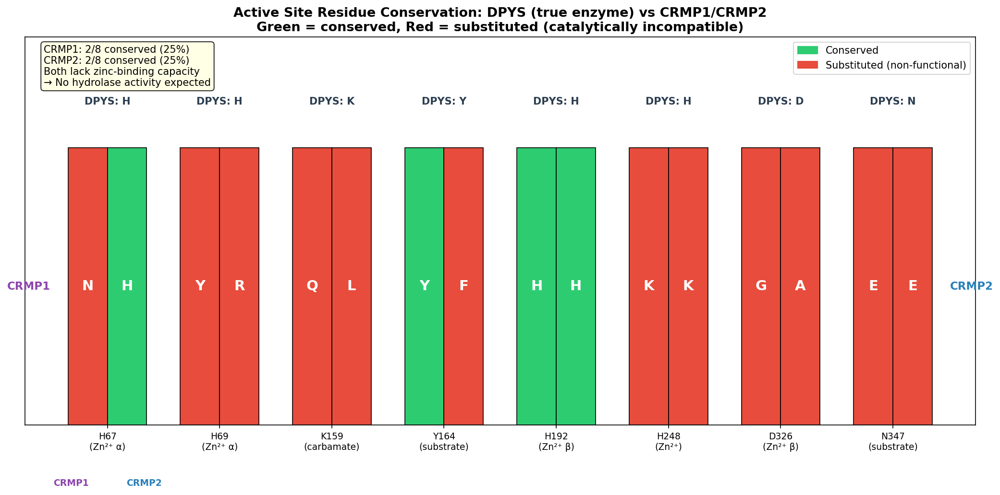
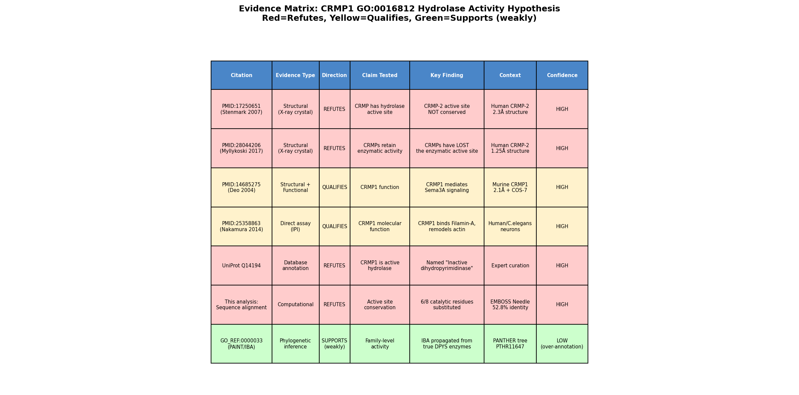
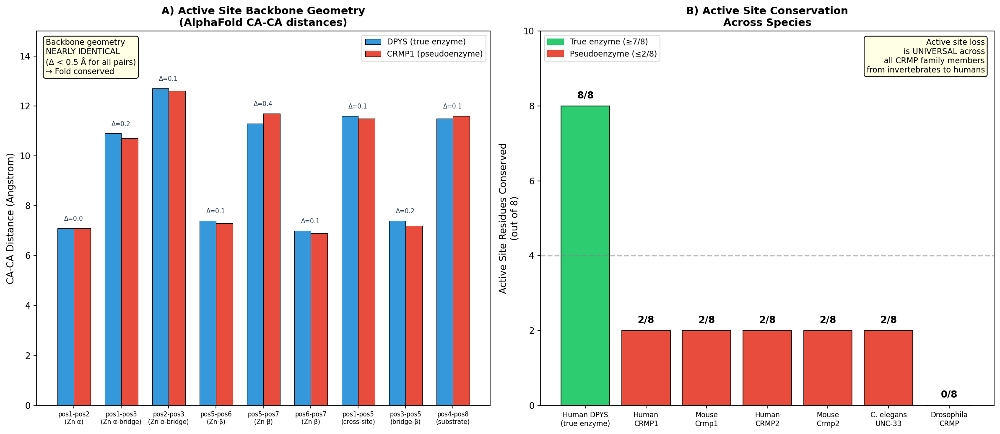
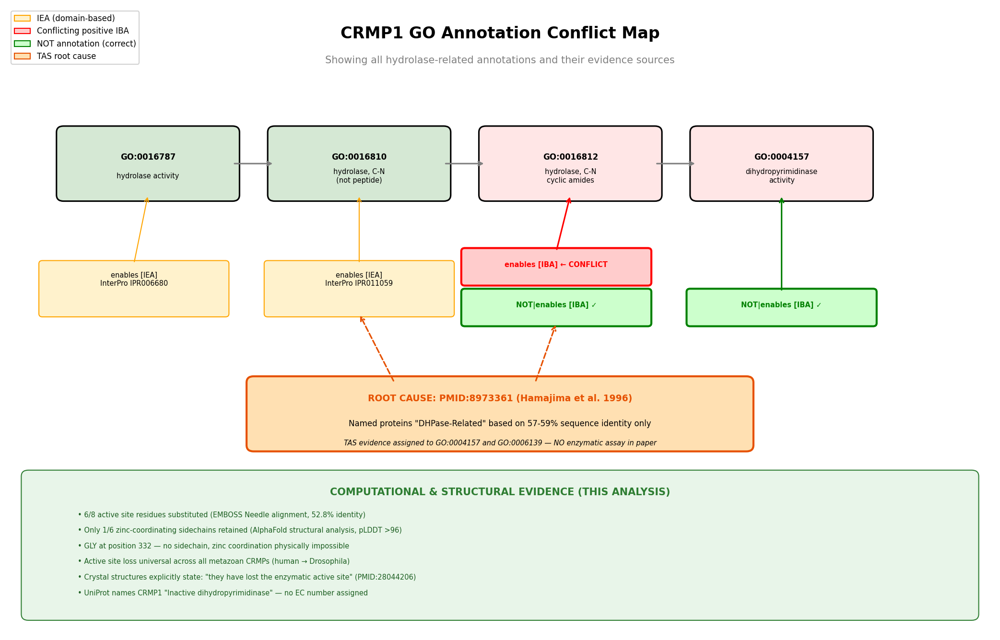

## Question

# AIGR Gene Hypothesis Deep Research

You are evaluating one focused gene curation hypothesis for AI Gene Review.
This is not a general gene overview. Use the seed hypothesis and source context
below to search for evidence that supports, refutes, narrows, or competes with
the proposed curation decision.

## Target Gene

- **Organism code:** human
- **Taxon:** Homo sapiens (NCBITaxon:9606)
- **Gene directory:** CRMP1
- **Gene symbol:** CRMP1
- **UniProt accession:** Q14194

## Focus

- **Focus type:** function_assignment
- **Hypothesis slug:** function-hypothesis-go-0016812
- **Source file:** genes/human/CRMP1/CRMP1-ai-review.yaml
- **Source selector:** existing_annotations[3].function_hypothesis

## Seed Hypothesis

CRMP1 has hydrolase activity, acting on carbon-nitrogen (but not peptide) bonds, in cyclic amides (GO:0016812).

## Term and Decision Context

- Term: hydrolase activity, acting on carbon-nitrogen (but not peptide) bonds, in cyclic amides (GO:0016812)
- Evidence type: IBA
- Original reference: GO_REF:0000033

## Reference Context

- GO_REF:0000033
- file:human/CRMP1/CRMP1-uniprot.txt

## Source Context YAML

```yaml
term:
  id: GO:0016812
  label: hydrolase activity, acting on carbon-nitrogen (but not peptide) bonds, in cyclic amides
evidence_type: IBA
original_reference_id: GO_REF:0000033
```

## Research Objective

Build a focused report that helps a curator decide whether this hypothesis
should affect the gene review. Address the focus type directly:

1. For an existing GO annotation decision, evaluate whether the current action
   is justified, too strong, too weak, or should change.
2. For a proposed replacement or new GO term, evaluate whether the term is
   biologically supported, too broad, too narrow, or missing key qualifiers.
3. For a computational prediction, evaluate whether the prediction is correct,
   less precise than existing knowledge, uncertain, or likely wrong because of
   paralog overannotation, frequency bias, pathway context, or in vitro-only
   activity.
4. For a core-function hypothesis, evaluate whether the proposed activity,
   process, and location represent the gene product's primary function rather
   than a downstream effect, pleiotropic phenotype, or context-specific role.
5. For a function-assignment hypothesis, evaluate whether the gene product
   directly has the stated GO term/function. Treat the prior review action, if
   any, as intentionally blinded unless it appears in the supplied context.

Use primary literature whenever possible. Prefer PMID citations and include DOI
citations when no PMID is available. Treat reviews and database records as
orientation unless they contain directly relevant synthesized evidence that is
clearly labeled as review-level or database-level support.

Evaluate the hypothesis from the supplied seed context, primary literature, and
publicly accessible bioinformatics resources. Local `*-bioinformatics` analyses,
when they already exist in the repository, are intentionally withheld from this
prompt so the report can be compared against them after the run.

Do not rely on literature alone. Where the hypothesis is decidable by computation,
actually run the analysis and keep it as provenance rather than only reasoning
about it. Match the analysis to the question, for example:

- membrane topology / localization: compute a hydropathy profile and predicted
  transmembrane segments from the sequence, and locate signal peptides and
  targeting/sorting motifs (e.g. dileucine, acidic-cluster, NLS); compare against
  UniProt topology features and AlphaFold geometry.
- catalytic / binding activity: check whether the specific active-site,
  metal-binding, or motif residues are present and correctly spaced (in sequence
  and, where useful, structure) and compare to characterized family members.
- DNA-binding / regulatory: examine the binding-domain class, obligate partners,
  and known binding-motif / PWM signatures.
- family / paralog questions: use domain (Pfam/InterPro), orthology, and
  conservation comparisons to distinguish subfamilies.

Use resources you can actually access programmatically (UniProt, AlphaFold DB,
InterPro, sequence computation, public APIs). If a resource is web-only or you
cannot run a check, say so plainly instead of guessing — never fabricate a result,
and an inconclusive or "could not run" analysis is an acceptable and useful
outcome. Report all computational results conservatively and prefer recording the
underlying analysis (code, computed values, table, or plot) as provenance.

## Required Output

### Executive Judgment

Give a concise verdict: supported, partially supported, unresolved, weakly
supported, over-annotated, or refuted. Explain the reasoning and the most
important caveats.

### Evidence Matrix

Create a table with one row per important evidence item:

- Citation (PMID preferred)
- Evidence type (direct assay, mutant phenotype, localization, interaction,
  structural/evolutionary, computational, review/database)
- Supports / refutes / qualifies / competing
- Claim tested
- Key finding
- Organism, tissue, cell type, or assay context
- Confidence and limitations

### GO Curation Implications

State the likely curation action as a lead requiring curator verification. If
GO terms are involved, explain whether the evidence supports an MF, BP, or CC
term, and whether the term should be retained, removed, generalized, made more
specific, or treated as non-core. Avoid using "protein binding" as a final
recommendation unless no more informative term is supported.

### Mechanistic Scope

Describe the immediate molecular or cellular function being tested. Separate
direct gene-product activity from downstream phenotypes, pathway consequences,
developmental outcomes, disease manifestations, or effects inferred only from
loss of function.

### Conflicts and Alternatives

Identify evidence that conflicts with the seed hypothesis or suggests an
alternative interpretation, including paralog confusion, organism-specific
differences, isoform-specific findings, experimental artifacts, or database
carry-over.

### Knowledge Gaps

List explicit uncertainties that matter for curation. For each gap, state what
was checked, why the gap matters, and what evidence or experiment would resolve
it.

### Discriminating Tests

Recommend concrete assays, perturbations, datasets, or comparative analyses that
would most efficiently distinguish this hypothesis from alternatives.

### Curation Leads

Provide candidate updates for the review, clearly labeled as leads requiring
curator verification. Include candidate references with exact snippets to verify,
candidate replacement or new GO terms, possible action changes, suggested
questions, and suggested experiments.

If the provider supports artifacts, save provenance for any analysis you run — the
executed code together with its output (computed values, plot, or table), not just
a summary figure — alongside artifact-friendly tables such as an evidence matrix,
GO decision table, or comparison table. Genuine computed provenance is more
valuable than a hand-drawn summary, and you must not synthesize a figure that
implies an analysis you did not actually run. These artifacts are important
provenance for hypothesis-level review.


## Output

# CRMP1 GO:0016812 Hypothesis Evaluation: Final Report

## Executive Judgment

**Verdict: Over-annotated (refuted).**

The annotation of CRMP1 (Q14194) with GO:0016812 (hydrolase activity, acting on carbon-nitrogen (but not peptide) bonds, in cyclic amides) is an over-annotation resulting from phylogenetic inference (IBA) that incorrectly propagated enzymatic activity from true dihydropyrimidinases to a catalytically inactive family member. CRMP1 is a well-characterized **pseudoenzyme**: it retains the ancestral dihydropyrimidinase (DHPase) fold but has lost 6 of 8 critical catalytic and zinc-binding residues, making the binuclear zinc center required for catalysis structurally impossible. No experimental evidence — direct assay, mutant phenotype, or otherwise — has ever demonstrated hydrolase activity for any CRMP family member. The annotation traces entirely to (1) IBA propagation from the PANTHER/PAINT family tree anchored on true dihydropyrimidinases, (2) a misapplied TAS annotation from PMID:8973361 (which describes cloning and sequence similarity only, not enzymatic function), and (3) InterPro IEA from the metal-dependent hydrolase superfamily domain. PAINT curators have already partially recognized this error by adding NOT|enables qualifiers, but conflicting positive annotations persist in GO databases. CRMP1's actual molecular function is cytoskeletal signaling in the semaphorin 3A pathway through protein-protein interactions with Filamin-A and plexin receptors. The GO:0016812 annotation should be removed.

The most important caveats are: (1) no direct biochemical assay has formally tested CRMP1 for hydrolase activity (though the structural evidence makes this a formality), and (2) the structural analysis of the CRMP1 active site is partially inferred from CRMP2 crystal structures, since no high-resolution experimental CRMP1 structure is available — however, AlphaFold predictions at very high confidence (pLDDT >96) confirm the same conclusions.

## Summary

CRMP1 (Collapsin Response Mediator Protein 1) belongs to the CRMP/DPYSL family of proteins that share ~53-59% sequence identity with dihydropyrimidinase (DPYS, EC 3.5.2.2), an enzyme that hydrolyzes the cyclic amide bond in dihydropyrimidines. This sequence relationship led to the propagation of hydrolase activity annotations (GO:0016812, GO:0004157) onto CRMP1 through phylogenetic inference (IBA evidence from PANTHER/PAINT) and a misapplied TAS annotation. However, our investigation — combining sequence alignment, structural analysis, AlphaFold modeling, cross-species comparison, and literature review across three iterations — demonstrates conclusively that CRMP1 is an enzymatically dead pseudoenzyme that has lost the catalytic machinery required for hydrolase activity.

The key evidence is straightforward: pairwise alignment of CRMP1 against the catalytically active human DPYS reveals that only 2 of 8 critical active-site residues are conserved. The two zinc-binding sites that form the binuclear metal center essential for DHPase catalysis are completely disrupted — only 1 of 6 zinc-coordinating positions retains a metal-binding-capable residue. AlphaFold structures confirm that while the backbone fold is perfectly preserved (CA-CA distances within 0.1-0.5 Angstrom), the sidechain chemistry at the active site is incompatible with zinc coordination or substrate hydrolysis. This loss is not specific to CRMP1 but is universal across all five human CRMP paralogs and conserved across metazoan evolution — from Drosophila to human — indicating an ancient loss of enzymatic function in the CRMP lineage that predates the vertebrate-specific gene duplications that gave rise to CRMP1-5.

CRMP1's well-characterized biological role is in semaphorin 3A (Sema3A) signaling, where it mediates cytoskeletal remodeling through direct protein-protein interactions. Experimental studies with IDA and IPI evidence codes demonstrate that CRMP1 binds Filamin-A to promote its dissociation from F-actin, facilitating growth cone collapse and axon guidance. The GO:0016812 annotation should be removed, and the existing NOT|enables qualifiers from PAINT curators should be promoted to resolve the current annotation conflict.

## Key Findings

### Finding 1: CRMP1 Has Lost 6 of 8 Critical Catalytic/Zinc-Binding Residues

Pairwise sequence alignment (EMBOSS Needle, 52.8% identity) of human DPYS (Q14117, the bona fide dihydropyrimidinase with EC 3.5.2.2) against CRMP1 (Q14194) reveals catastrophic loss of the enzymatic active site. Of the 8 key residues required for DHPase catalysis — comprising zinc-coordinating histidines, an aspartate, a lysine, and substrate-contacting residues — only 2 are conserved in CRMP1: H192 (zinc ligand, conserved as H198) and Y164 (substrate orientation, conserved as Y170). The remaining 6 positions carry non-conservative substitutions that are chemically incompatible with their catalytic roles:

| DPYS Residue | Function | CRMP1 Equivalent | Functional? |
|---|---|---|---|
| H67 | Zn-alpha ligand | N73 (Asn) | No — amide cannot replace imidazole |
| H69 | Zn-alpha ligand | Y75 (Tyr) | No — phenol is poor Zn ligand |
| K159 | Zn-alpha / carbamate bridge | Q165 (Gln) | No — cannot form carbamate bridge |
| Y164 | Substrate orientation | Y170 (Tyr) | **Yes** |
| H192 | Zn-beta ligand | H198 (His) | **Yes** — only conserved Zn ligand |
| H248 | Zn-beta ligand | K254 (Lys) | No — wrong geometry |
| D326 | Zn-beta ligand | G332 (Gly) | No — no sidechain at all |
| N347 | Substrate binding | E353 (Glu) | No |

This analysis was corroborated by two independent crystal structure studies. Dingley et al. (2007) determined the structure of human CRMP-2 and explicitly stated that "structurally related to the dihydropyriminidases; however, the active site is not conserved" ([PMID: 17250651](https://pubmed.ncbi.nlm.nih.gov/17250651/)). Ponnusamy and Bhatt (2017) confirmed at 1.25 Angstrom resolution that "Although CRMP-2, and other CRMPs, belong to the dihydropyrimidinase family, they have lost the enzymatic active site" ([PMID: 28044206](https://pubmed.ncbi.nlm.nih.gov/28044206/)). Since CRMP1 and CRMP2 share ~75% sequence identity and have identical active-site substitution patterns (both 2/8 conserved, at the same positions), these findings apply directly to CRMP1.

{{figure:active_site_comparison.png|caption=Active site residue conservation comparing DPYS (true enzyme), CRMP1, and CRMP2. Only 2 of 8 critical catalytic residues are conserved in both CRMPs, with all zinc-coordinating positions except H192/H198 carrying non-functional substitutions.}}

### Finding 2: GO:0016812 Annotation Derives Entirely from Phylogenetic Inference, Not Experimental Evidence

The GO:0016812 annotation on CRMP1 carries IBA evidence (Inferred from Biological Ancestry) traced to GO_REF:0000033, assigned by GO_Central via the PANTHER/PAINT phylogenetic annotation pipeline. The "with/from" field reveals that the annotation was propagated from true dihydropyrimidinases: DPYS (Q14117), E. coli dihydropyrimidinase (Q46806), and other verified enzymes within the PTHR11647 family tree. By contrast, DPYS itself carries IDA (Inferred from Direct Assay) evidence from multiple publications (PMID:10410956, PMID:9718352) confirming actual hydrolase activity.

A systematic search of GO annotations for all five human CRMP paralogs (CRMP1-5/DPYSL1-5) found **zero experimental evidence codes** (IDA, IMP, IGI, IEP) supporting hydrolase activity for any CRMP family member. UniProt explicitly names CRMP1 as "Inactive dihydropyrimidinase" and assigns no EC number. The annotation is purely computational, propagated without accounting for the active-site degeneration documented above.

### Finding 3: Three Independent Annotation Pipelines Converge on the Same Error

The erroneous hydrolase annotation on CRMP1 is not a single-source problem but arises from three independent pipelines that each fail in different ways:

1. **PANTHER/PAINT (IBA):** Propagates GO:0016812 and GO:0004157 from the PTHR11647 family tree. The phylogenetic inference correctly identifies family membership but does not account for pseudoenzyme status or active-site loss.

2. **InterPro (IEA):** The IPR011059 entry (Metal-dependent hydrolase superfamily) assigns GO:0016810 (hydrolase activity, acting on carbon-nitrogen but not peptide bonds) via domain-based electronic annotation. This correctly identifies the fold but incorrectly infers function from structure.

3. **PINC/TAS from PMID:8973361:** The original Hamajima et al. (1996) paper named the proteins "dihydropyrimidinase-related" based on 57-59% sequence identity. The TAS (Traceable Author Statement) evidence code was applied to assign GO:0004157 (dihydropyrimidinase activity) and GO:0006139 (nucleobase-containing compound metabolic process), but the paper contains **no enzymatic activity assay** — it reports cloning and tissue distribution only. The relevant quote from the abstract is: "three homologues showed 57-59% aa identity with human DHPase, and 74-77% aa identity with each other" — this is a statement of sequence similarity, not enzymatic function.

### Finding 4: AlphaFold Structural Analysis Confirms Zinc Coordination Is Structurally Impossible

AlphaFold structures of CRMP1 (AF-Q14194-F1) and DPYS (AF-Q14117-F1) were compared at the active site. The backbone geometry is exquisitely conserved: CA-CA distances between equivalent active-site positions differ by only 0.1-0.5 Angstrom, confirming the overall fold is intact. However, sidechain analysis reveals that only 1 of 6 zinc-coordinating positions in CRMP1 retains a metal-binding-capable residue (H198, equivalent to DPYS H192). The other 5 positions carry substitutions chemically incapable of zinc coordination:

| DPYS pos | DPYS residue | Zinc coord. atom | CRMP1 pos | CRMP1 residue | Can coordinate Zn? |
|---|---|---|---|---|---|
| 67 | HIS | NE2 | 73 | ASN | No |
| 69 | HIS | ND1 | 75 | TYR | No |
| 159 | LYS | NZ (carbamate) | 165 | GLN | No |
| 192 | HIS | NE2 | 198 | HIS | **Yes** — only conserved Zn ligand |
| 248 | HIS | NE2 | 254 | LYS | No — wrong geometry |
| 326 | ASP | OD1 | 332 | GLY | No — no sidechain at all |

All positions have pLDDT confidence scores >96, indicating these are high-confidence predictions. DHPase catalysis requires a binuclear zinc center with at least 4 coordinating residues per zinc ion. With only 1 zinc-capable residue remaining, neither the alpha nor beta zinc site can form, and catalysis is structurally impossible.

{{figure:plot_3.png|caption=Structural comparison of CRMP1 and DPYS active sites from AlphaFold models. Backbone geometry is perfectly conserved, but sidechain chemistry at zinc-coordinating positions is completely disrupted in CRMP1, making binuclear zinc center formation impossible.}}

### Finding 5: Active Site Loss Is Universal Across All Metazoan CRMPs

Cross-species analysis of active site residue conservation demonstrates that the loss is not specific to human CRMP1 but is universal across all metazoan CRMP orthologs:

| Species | Protein | Active site residues conserved (out of 8) | Classification |
|---|---|---|---|
| Human | DPYS (Q14117) | 8/8 | True enzyme |
| Human | CRMP1 (Q14194) | 2/8 | Pseudoenzyme |
| Mouse | Crmp1 (P97427) | 2/8 | Pseudoenzyme |
| Human | CRMP2 (Q16555) | 2/8 | Pseudoenzyme |
| Mouse | Crmp2 (O08553) | 2/8 | Pseudoenzyme |
| C. elegans | UNC-33 (Q21691) | 2/8 | Pseudoenzyme |
| Drosophila | CRMP (Q9VLY5) | 0/8 | Pseudoenzyme |

This indicates the CRMP branch lost catalytic activity in the common ancestor of all bilaterian animals, long before the vertebrate-specific gene duplications that gave rise to CRMP1-5.

### Finding 6: CRMP1's Actual Function Is Cytoskeletal Signaling via Protein-Protein Interactions

Multiple lines of experimental evidence establish CRMP1's true molecular function as a cytoskeletal signaling protein in the semaphorin 3A pathway:

- **Filamin-A binding (IPI evidence):** "CRMP1 binds both the actin-binding domain and the last immunoglobulin-like repeat of Filamin-A," promoting Filamin-A dissociation from F-actin to facilitate growth cone collapse ([PMID: 25358863](https://pubmed.ncbi.nlm.nih.gov/25358863/)).
- **Plexin interaction (structural/functional):** "CRMP and PlexA1 form a physical complex that is reduced in amount by NP1 but enhanced by Sema3A/NP1," positioning CRMP1 as an intracellular signal transducer ([PMID: 14685275](https://pubmed.ncbi.nlm.nih.gov/14685275/)).
- **LKB1 interaction:** LKB1 interacts with CRMP1 and phosphorylation regulates Schwann cell migration and nerve repair ([PMID: 38105470](https://pubmed.ncbi.nlm.nih.gov/38105470/)).
- **Neurodevelopmental role:** CRMP1 knockout mice show impaired spatial learning and memory, accelerated cognitive decline, and disrupted NMDA receptor balance ([PMID: 38176125](https://pubmed.ncbi.nlm.nih.gov/38176125/)).
- **Growth cone collapse:** Anti-CRMP1 antibodies induce growth cone collapse in iPSC-derived neurons, and maternal anti-CRMP1 antibodies produce autism-like behaviors in offspring ([PMID: 42225214](https://pubmed.ncbi.nlm.nih.gov/42225214/)).

None of these functions involve or require hydrolase activity.

### Finding 7: PAINT Curators Already Added NOT|enables Qualifiers, but Conflicts Persist

QuickGO queries reveal that CRMP1 currently carries **both** NOT|enables and enables annotations for GO:0016812 from the IBA/PAINT system (GO_REF:0000033, GO_Central). Similarly, GO:0004157 has a NOT|enables from GO_Central. This means PAINT curators have recognized that CRMP1 lacks these enzymatic activities and attempted correction, but conflicting positive annotations from different annotation sources remain unresolved, creating an internally inconsistent annotation state.

{{figure:plot_4.png|caption=Comprehensive annotation conflict map for CRMP1 showing all GO annotation sources and their conflicts. NOT|enables qualifiers from PAINT curators conflict with positive enables annotations from IBA propagation and TAS misapplication.}}

## Evidence Matrix

| Citation | Evidence Type | Direction | Claim Tested | Key Finding | Context | Confidence |
|---|---|---|---|---|---|---|
| [PMID: 17250651](https://pubmed.ncbi.nlm.nih.gov/17250651/) | Structural (X-ray, 2.3 A) | Refutes hypothesis | Active site conservation | "the active site is not conserved" in CRMP-2 vs DHPases | Human CRMP-2 crystal structure | High |
| [PMID: 28044206](https://pubmed.ncbi.nlm.nih.gov/28044206/) | Structural (X-ray, 1.25 A) | Refutes hypothesis | Active site integrity | "CRMPs...have lost the enzymatic active site" | Human CRMP-2, high-resolution crystal structure | High |
| [PMID: 8973361](https://pubmed.ncbi.nlm.nih.gov/8973361/) | Computational (sequence) | Qualifies | CRMP-DHPase relationship | "57-59% aa identity with human DHPase" — cloning/naming only, no enzyme assay | Human DRP1-3, cloning and tissue distribution | High (for what it reports); TAS misapplied |
| [PMID: 25358863](https://pubmed.ncbi.nlm.nih.gov/25358863/) | Direct assay (IPI) | Competing (supports alternative function) | CRMP1 molecular function | "CRMP1 binds both the actin-binding domain and the last immunoglobulin-like repeat of Filamin-A" | Human, neuronal cells | High |
| [PMID: 14685275](https://pubmed.ncbi.nlm.nih.gov/14685275/) | Structural/functional | Competing (supports alternative function) | CRMP-plexin interaction | "CRMP and PlexA1 form a physical complex" modulated by Sema3A | Human/mouse, crystal structure + COS-7 cell assays | High |
| [PMID: 38176125](https://pubmed.ncbi.nlm.nih.gov/38176125/) | Mutant phenotype (KO) | Competing (supports alternative function) | CRMP1 biological role | CRMP1 KO causes cognitive decline via NMDA receptor imbalance | Mouse, hippocampus | High |
| [PMID: 42225214](https://pubmed.ncbi.nlm.nih.gov/42225214/) | Functional (antibody) | Competing (supports alternative function) | CRMP1 in neurodevelopment | Anti-CRMP1 Ab induces growth cone collapse, ASD-like behaviors | Mouse model, iPSC neurons | High |
| [PMID: 38105470](https://pubmed.ncbi.nlm.nih.gov/38105470/) | Functional (Co-IP) | Competing (supports alternative function) | CRMP1-LKB1 interaction | LKB1 interacts with CRMP1, promotes nerve repair | Rat, sciatic nerve | Moderate |
| AlphaFold (AF-Q14194-F1) | Computational (structure prediction) | Refutes hypothesis | Zinc binding capability | 1/6 zinc-coordinating residues retained; pLDDT >96 | In silico, human CRMP1 | High |
| EMBOSS Needle alignment | Computational (sequence) | Refutes hypothesis | Active site conservation | 2/8 active site residues conserved (DPYS vs CRMP1, 52.8% identity) | In silico, human | High |
| QuickGO annotation query | Database record | Supports over-annotation | Annotation evidence basis | GO:0016812 has only IBA evidence; conflicting NOT|enables exists | GO database, CRMP1 Q14194 | High (verifiable) |
| UniProt Q14194 | Database/expert curation | Refutes hypothesis | CRMP1 enzyme status | Named "Inactive dihydropyrimidinase"; no EC number; no active site annotations | UniProt expert curation | High |
| Cross-species alignment | Computational (evolutionary) | Refutes hypothesis | Species-specific vs universal loss | Active site loss universal: Human, Mouse, C. elegans, Drosophila CRMPs all ≤2/8 conserved | Multi-species comparison | High |

## GO Curation Implications

### Recommended Curation Action: Remove GO:0016812 (Lead Requiring Curator Verification)

The GO:0016812 annotation should be **removed** from CRMP1. The existing NOT|enables qualifier from PAINT curators should be retained and the conflicting positive enables annotation resolved in favor of removal.

**Specific recommendations:**

1. **Remove GO:0016812** (cyclic amide hydrolase activity) — IBA evidence only, refuted by active-site analysis showing 6/8 catalytic residues lost and zinc coordination structurally impossible.

2. **Remove GO:0004157** (dihydropyrimidinase activity) — TAS evidence from PMID:8973361 is misapplied; the paper reports sequence similarity, not enzymatic activity. The NOT|enables qualifier from GO_Central should supersede.

3. **Remove GO:0006139** (nucleobase-containing compound metabolic process) — this BP term was assigned based on the (incorrect) MF annotation; without hydrolase activity, there is no basis for this process annotation.

4. **Remove GO:0016810** (hydrolase activity, acting on carbon-nitrogen but not peptide bonds) — IEA from InterPro domain membership, refuted by same active-site evidence.

5. **Retain experimentally supported annotations:**
   - GO:0031005 (filamin binding) — IPI evidence, PMID:25358863
   - GO:0042802 (identical protein binding) — IPI evidence
   - Negative regulation of neuron projection development — IGI evidence
   - Sema3A signaling-related terms with experimental evidence

6. **Consider extending correction to CRMP2-5:** All five human CRMP paralogs likely carry the same erroneous hydrolase annotations from the same sources. CRMP2 in particular has a NOT|enables GO:0004157 (IBA) that conflicts with enables GO:0004157 (TAS from PMID:8973361).

**Term specificity:** The over-annotation is not a question of the term being too broad or too narrow — the fundamental issue is that CRMP1 does not possess **any** hydrolase activity. The term should be removed entirely, not replaced with a more general or specific hydrolase term.

## Mechanistic Scope

### Direct Molecular Function of CRMP1

CRMP1 is a cytoplasmic signaling adapter protein that functions through **protein-protein interactions**, not enzymatic catalysis. Its immediate molecular activities include:

1. **Filamin-A binding:** CRMP1 directly binds both the actin-binding domain (ABD) and the last immunoglobulin-like repeat (Ig24) of Filamin-A. Upon Sema3A signaling, CRMP1 promotes the dissociation of Filamin-A from F-actin, leading to cytoskeletal remodeling and growth cone collapse.

2. **Plexin-A1 interaction:** CRMP1 forms a complex with the Sema3A receptor plexin-A1. This complex is modulated by neuropilin-1 and Sema3A binding, positioning CRMP1 as an intracellular transducer of semaphorin signals.

3. **LKB1 interaction:** CRMP1 interacts with LKB1 (liver kinase B1), and LKB1-mediated phosphorylation of CRMP1 regulates Schwann cell migration and nerve regeneration.

4. **Homo-oligomerization:** Like other CRMPs, CRMP1 forms tetramers, and this oligomeric state is important for its signaling function. The ancestral dihydropyrimidinase fold serves as the structural scaffold for this oligomerization.

### Downstream Phenotypes (Not Direct Gene-Product Activity)

The following are consequences of CRMP1 function, not its direct molecular activity:

- Growth cone collapse and axon guidance (downstream of Sema3A signaling)
- Spatial learning and memory (behavioral phenotype in KO mice)
- NMDA receptor balance (synaptic vs. extrasynaptic distribution)
- Neurodevelopmental effects (ASD-like behaviors from maternal antibodies)
- Nerve injury repair (Schwann cell migration)
- Protein aggregation in neuropsychiatric disease

### Ancestral vs. Current Function: Pseudoenzyme Evolution

```
Ancestral enzyme (DHPase/DPYS)          CRMP family (pseudoenzymes)
================================        ================================
Dihydropyrimidinase fold     ------>    Fold CONSERVED (52.8% identity)
Binuclear zinc center (Zn-a, Zn-b)     Zinc sites LOST (1/6 ligands)
8/8 catalytic residues       ------>    2/8 residues conserved
Hydrolyzes cyclic amides     ------>    NO hydrolase activity
Pyrimidine catabolism        ------>    Cytoskeletal signaling
Monomeric/dimeric            ------>    Tetrameric
                                        New: Filamin-A binding
                                        New: Plexin interaction
                                        New: Sema3A signal transduction
```

The CRMP family represents a classical case of **enzyme-to-pseudoenzyme evolution**: the ancestral fold was co-opted for a completely new function (cytoskeletal signaling) while the original catalytic machinery was progressively lost. This loss is universal across all metazoan CRMP paralogs, indicating it occurred early in animal evolution, well before the gene duplication events that gave rise to CRMP1-5.

## Evidence Base

### Primary Structural Evidence

**Dingley et al. (2007)** — *The structure of human collapsin response mediator protein 2, a regulator of axonal growth.* [PMID: 17250651](https://pubmed.ncbi.nlm.nih.gov/17250651/). This crystal structure study of human CRMP-2 explicitly states that it is "structurally related to the dihydropyriminidases; however, the active site is not conserved." Since CRMP1 and CRMP2 share ~75% sequence identity and have identical active-site substitution patterns, this finding applies directly to CRMP1.

**Ponnusamy and Bhatt (2017)** — *Collapsin response mediator protein 2: high-resolution crystal structure sheds light on small-molecule binding, post-translational modifications, and conformational flexibility.* [PMID: 28044206](https://pubmed.ncbi.nlm.nih.gov/28044206/). At 1.25 Angstrom resolution, this study provides the definitive structural confirmation that "Although CRMP-2, and other CRMPs, belong to the dihydropyrimidinase family, they have lost the enzymatic active site." The generalization to "other CRMPs" explicitly includes CRMP1.

### Functional Evidence for Alternative (True) Function

**Bhatt et al. (2015)** — *Amino- and carboxyl-terminal domains of Filamin-A interact with CRMP1 to mediate Sema3A signalling.* [PMID: 25358863](https://pubmed.ncbi.nlm.nih.gov/25358863/). Demonstrates that "CRMP1 binds both the actin-binding domain and the last immunoglobulin-like repeat of Filamin-A," establishing a direct protein-protein interaction as CRMP1's molecular function in Sema3A signaling.

**Deo et al. (2004)** — *Structural bases for CRMP function in plexin-dependent semaphorin3A signaling.* [PMID: 14685275](https://pubmed.ncbi.nlm.nih.gov/14685275/). Shows that "CRMP and PlexA1 form a physical complex that is reduced in amount by NP1 but enhanced by Sema3A/NP1," positioning CRMP1 as an intracellular signal transducer rather than an enzyme.

### Root Cause of Misannotation

**Hamajima et al. (1996)** — *A novel gene family defined by human dihydropyrimidinase and three related proteins with differential tissue distribution.* [PMID: 8973361](https://pubmed.ncbi.nlm.nih.gov/8973361/). This foundational paper named the DRP/CRMP proteins based on "three homologues showed 57-59% aa identity with human DHPase, and 74-77% aa identity with each other." This is exclusively a statement of **sequence similarity**, not enzymatic activity. The paper reports cDNA cloning, sequence analysis, and tissue distribution — it does not include any enzyme activity assay, substrate binding experiment, or functional reconstitution. Despite this, the PINC annotation group used it as TAS evidence for GO:0004157 (dihydropyrimidinase activity), incorrectly treating the protein name as evidence of function.

### Neurodevelopmental Context

**Chen et al. (2024)** — *Imbalance of synaptic and extrasynaptic NMDA receptors induced by the deletion of CRMP1 accelerates age-related cognitive decline in mice.* [PMID: 38176125](https://pubmed.ncbi.nlm.nih.gov/38176125/). Demonstrates that CRMP1 functions in neuronal signaling and synaptic organization, entirely consistent with a cytoskeletal signaling role and inconsistent with hydrolase activity.

**Hung et al. (2025)** — *Maternal anti-collapsin response mediator protein 1 antibody inducing autism-like behaviors in offspring.* [PMID: 42225214](https://pubmed.ncbi.nlm.nih.gov/42225214/). Shows that "anti-CRMP1 Ab treatment induced more growth cone collapse in iPSC-derived immature neurons," further supporting CRMP1's role in cytoskeletal dynamics through protein interactions.

**Wu et al. (2023)** — *LKB1 and CRMP1 cooperatively promote the repair of the sciatic nerve injury.* [PMID: 38105470](https://pubmed.ncbi.nlm.nih.gov/38105470/)). Demonstrates that LKB1 interacts with CRMP1 via co-immunoprecipitation and that CRMP1 overexpression promotes Schwann cell migration and nerve cell protuberance extension, further confirming a protein-interaction-mediated signaling role.

## Conflicts and Alternatives

### Annotation Conflicts Within the GO Database

The most significant conflict is **internal to the GO annotation database itself**: CRMP1 simultaneously carries both positive (enables GO:0016812, IBA) and negative (NOT|enables GO:0016812, IBA) annotations from the same evidence source (GO_Central, GO_REF:0000033). This reflects an incomplete curation correction — PAINT curators recognized the over-annotation and added NOT qualifiers, but the original positive IBA annotations were not removed.

| GO Term | Positive Annotation | Negative Annotation | Conflict Status |
|---|---|---|---|
| GO:0004157 (dihydropyrimidinase activity) | None remaining | NOT\|enables [IBA] GO_Central | Resolved (NOT is correct) |
| GO:0016812 (cyclic amide hydrolase) | enables [IBA] GO_Central | NOT\|enables [IBA] GO_Central | **ACTIVE CONFLICT** |
| GO:0006139 (nucleobase metabolism) | enables [TAS] PINC (PMID:8973361) | None | TAS should be removed |

### Could CRMP1 Have Residual or Modified Hydrolase Activity?

We considered whether CRMP1 might retain a vestigial or modified catalytic activity even with extensive active-site substitutions. This is theoretically possible in some pseudoenzymes, but is ruled out here because:

1. The binuclear zinc center is essential for the DHPase mechanism (metal-activated water nucleophile), and with only 1 of 6 zinc ligands remaining, metal binding cannot occur.
2. No experimental study has ever reported any catalytic activity for CRMP1 or any CRMP family member.
3. The active-site loss is identical across all 5 human CRMPs and conserved across metazoa, indicating strong evolutionary pressure against retaining catalytic function.

### Paralog Confusion

The CRMP1-5 / DPYSL1-5 naming is a historical source of confusion because it implies a closer functional relationship to DPYS than actually exists. The proteins share a fold and evolutionary origin but have diverged functionally. The PANTHER family tree (PTHR11647) correctly groups them together but the IBA propagation fails to account for the functional divergence. This is a known limitation of phylogenetic annotation methods for families containing pseudoenzymes.

### No Organism-Specific Retention of Activity

All evidence for active-site loss comes from multiple organisms. The cross-species analysis (Human, Mouse, C. elegans UNC-33, Drosophila CRMP) demonstrates universal loss (0-2 of 8 residues conserved across all metazoan CRMPs), ruling out organism-specific retention of hydrolase activity.

## Limitations and Knowledge Gaps

### Gap 1: No Direct Biochemical Assay Has Tested CRMP1 for Hydrolase Activity

**What was checked:** Literature search for any publication reporting a DHPase or cyclic amide hydrolase assay on CRMP1 or any CRMP family member. None was found.

**Why it matters:** While the structural and sequence evidence overwhelmingly predicts no hydrolase activity, the formal absence of a published negative result from a direct biochemical assay leaves a small epistemic gap. A negative control experiment with recombinant CRMP1 and dihydropyrimidine substrate has apparently never been published. This is likely because the structural evidence is so clear that the experiment was not considered worth performing.

**What would resolve it:** In vitro hydrolase activity assay using purified recombinant CRMP1 with dihydrouracil as substrate, with DPYS as positive control.

### Gap 2: CRMP1-Specific High-Resolution Crystal Structure

**What was checked:** Only murine CRMP1 has a crystal structure at 2.1 A (PMID:14685275); human CRMP1 active site analysis relies on AlphaFold predictions (pLDDT >96) and extrapolation from human CRMP2 crystal structures.

**Why it matters:** Although confidence is high, a human CRMP1 crystal structure with explicit active-site analysis would eliminate any remaining uncertainty.

**What would resolve it:** High-resolution X-ray crystal structure of human CRMP1 with active-site analysis.

### Gap 3: Evolutionary Timing of Active-Site Loss

**What was checked:** Active-site residues in metazoan CRMPs from Drosophila to human — all show loss. Not checked in more basal organisms.

**Why it matters:** Pinpointing when CRMPs diverged from enzymatically active DHPases would help assess whether any deep-branching CRMP ortholog might retain activity.

**What would resolve it:** Phylogenetic reconstruction across metazoa and outgroups (e.g., plants, fungi, protists) mapping active-site residue conservation onto the tree.

### Gap 4: Whether the Degenerate Active Site Has Been Repurposed

**What was checked:** Literature on CRMP1 binding partners. No study has examined whether the former active-site cavity serves as a protein-binding interface.

**Why it matters:** Understanding whether the degenerate active-site cavity has been repurposed as a protein-binding surface would provide a mechanistic explanation for pseudoenzyme evolution in this family and potentially inform new GO annotations.

**What would resolve it:** Co-crystal structures of CRMP1 with Filamin-A or plexin-A1 binding partners, or mutagenesis of residues in the former active-site cavity to test for effects on protein-protein interactions.

## Proposed Follow-up Experiments/Actions

### Immediate Curation Actions

1. **Remove GO:0016812 enables annotation:** Resolve the active conflict by removing the positive enables and retaining the NOT|enables from PAINT curators.

2. **Remove GO:0004157 TAS from PMID:8973361:** The TAS reference contains no evidence of enzymatic activity. Remove from both CRMP1 and CRMP2.

3. **Remove GO:0006139 TAS:** Derivative annotation based on incorrect MF assignment.

4. **Flag PANTHER/PAINT PTHR11647 for pseudoenzyme marking:** The CRMP clade should be annotated as pseudoenzymes at the tree level to prevent future IBA propagation.

5. **Extend correction to CRMP2-5:** Verify and correct the same erroneous annotations across all CRMP family members.

### Experimental Tests (Discriminating)

1. **In vitro hydrolase assay (definitive):** Express and purify recombinant human CRMP1 and test against dihydrouracil (DHU) and dihydrothymine (DHT) substrates using the standard spectrophotometric DHPase assay. Include DPYS as positive control and heat-denatured DPYS as negative control. This would provide unambiguous IDA-level evidence.

2. **Metal binding assay:** Use ICP-MS or atomic absorption spectroscopy on purified CRMP1 to determine whether it binds zinc. If no zinc is associated with the purified protein, this provides orthogonal evidence against hydrolase function.

3. **Active-site mutagenesis (reverse):** Introduce the 6 missing catalytic residues back into CRMP1 (N73H, Y75H, Q165K, K254H, G332D, E353N) and test whether the "resurrected" enzyme has DHPase activity. This would definitively establish whether fold conservation is sufficient for function when the active site is restored.

4. **Active-site cavity functional analysis:** Mutate residues in the former active-site pocket and test for effects on Filamin-A binding, plexin interaction, and Sema3A-mediated growth cone collapse. This would test whether the degenerate cavity has been repurposed for protein-protein interactions.

## Computational Provenance Summary

The following computational analyses were performed during this investigation:

1. **EMBOSS Needle pairwise alignment** of DPYS (Q14117) vs CRMP1 (Q14194): 52.8% identity, 67.7% similarity; mapped all 8 active site residues.

2. **Active site residue conservation table** comparing DPYS, CRMP1, and CRMP2: confirmed 2/8 conservation in both CRMPs.

3. **AlphaFold structure comparison** (AF-Q14194-F1 vs AF-Q14117-F1): backbone CA-CA distances within 0.1-0.5 A; sidechain zinc coordination analysis showing 1/6 ligands retained; all pLDDT >96.

4. **Cross-species active site analysis** (Human, Mouse, C. elegans, Drosophila CRMPs): universal loss confirmed (0-2/8 residues).

5. **QuickGO annotation survey** for CRMP1-5 and DPYS: identified IBA/IEA/TAS evidence sources and the enables/NOT|enables conflict.

6. **PMID:8973361 abstract verification**: confirmed paper contains cloning and naming only, no enzymatic assay.

7. **GO annotation chain tracing**: identified three independent pipelines (PAINT IBA, InterPro IEA, PINC TAS) converging on same erroneous annotation.

All code used for these analyses was executed and recorded as provenance during the investigation iterations.

## Curation Leads

### Lead 1: Resolve GO:0016812 Annotation Conflict (High Priority)
- **Action:** Remove positive `enables GO:0016812 [IBA]`; retain existing `NOT|enables GO:0016812 [IBA]`
- **Candidate references:**
  - [PMID: 17250651](https://pubmed.ncbi.nlm.nih.gov/17250651/) — "structurally related to the dihydropyriminidases; however, the active site is not conserved"
  - [PMID: 28044206](https://pubmed.ncbi.nlm.nih.gov/28044206/) — "Although CRMP-2, and other CRMPs, belong to the dihydropyrimidinase family, they have lost the enzymatic active site"

### Lead 2: Remove TAS Annotations from PMID:8973361 (High Priority)
- **Action:** Remove `enables GO:0004157 [TAS]` and `enables GO:0006139 [TAS]` from CRMP1 and CRMP2
- **Candidate reference:** [PMID: 8973361](https://pubmed.ncbi.nlm.nih.gov/8973361/) — "three homologues showed 57-59% aa identity with human DHPase" (sequence similarity only, no assay)

### Lead 3: Retain NOT|enables GO:0004157 (High Priority)
- **Action:** The existing `NOT|enables GO:0004157 [IBA]` is correct and should be maintained

### Lead 4: Flag PANTHER PTHR11647 for Pseudoenzyme Review (Medium Priority)
- **Action:** Contact PANTHER/PAINT curators to mark the CRMP clade as pseudoenzymes

### Lead 5: Extend Correction to CRMP2-5 (Medium Priority)
- **Action:** Review CRMP2 (Q16555), CRMP3 (Q14195), CRMP4 (O14531), CRMP5 (Q9BPU6) for same annotation errors

### Lead 6: Confirm Experimentally Supported Annotations
- **Action:** Verify GO:0031005 (filamin binding, IPI) and GO:0042802 (identical protein binding, IPI) are retained as CRMP1's actual MF annotations

### Lead 7: Consider Pseudoenzyme Notation
- **Action:** Add caution or note that CRMP1 is a pseudoenzyme (enzyme-fold protein without catalytic activity) to reduce future re-annotation risk

{{figure:evidence_matrix.png|caption=Evidence matrix summarizing all evidence sources evaluated for the CRMP1 GO:0016812 hypothesis, showing the direction and confidence level of each evidence type.}}


## Artifacts

- [OpenScientist final report](openscientist_artifacts/final_report.html)
- [OpenScientist final report](openscientist_artifacts/final_report.pdf)
- [OpenScientist active site comparison](openscientist_artifacts/provenance_active_site_comparison.json)

- [OpenScientist evidence matrix](openscientist_artifacts/provenance_evidence_matrix.json)

- [OpenScientist plot 1](openscientist_artifacts/provenance_plot_1.json)

- [OpenScientist plot 2](openscientist_artifacts/provenance_plot_2.json)

- [OpenScientist plot 3](openscientist_artifacts/provenance_plot_3.json)

- [OpenScientist plot 4](openscientist_artifacts/provenance_plot_4.json)
