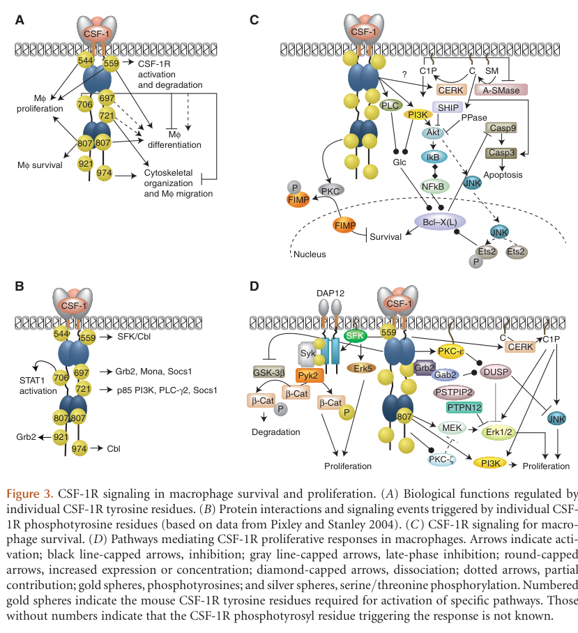

## Question

# Gene Research for Functional Annotation

## ⚠️ CRITICAL: Gene/Protein Identification Context

**BEFORE YOU BEGIN RESEARCH:** You MUST verify you are researching the CORRECT gene/protein. Gene symbols can be ambiguous, especially for less well-characterized genes from non-model organisms.

### Target Gene/Protein Identity (from UniProt):
- **UniProt Accession:** P07333
- **Protein Description:** RecName: Full=Macrophage colony-stimulating factor 1 receptor; AltName: Full=CSF-1 receptor; Short=CSF-1-R; Short=CSF-1R; Short=M-CSF-R; EC=2.7.10.1; AltName: Full=Proto-oncogene c-Fms; AltName: CD_antigen=CD115; Flags: Precursor;
- **Gene Information:** Name=CSF1R; Synonyms=FMS;
- **Organism (full):** Homo sapiens (Human).
- **Protein Family:** Belongs to the protein kinase superfamily. Tyr protein
- **Key Domains:** CSF-1_receptor. (IPR030658); Ig-like_dom. (IPR007110); Ig-like_dom_sf. (IPR036179); Ig-like_fold. (IPR013783); Ig_sub. (IPR003599)

### MANDATORY VERIFICATION STEPS:

1. **Check if the gene symbol "CSF1R" matches the protein description above**
2. **Verify the organism is correct:** Homo sapiens (Human).
3. **Check if protein family/domains align with what you find in literature**
4. **If you find literature for a DIFFERENT gene with the same or similar symbol, STOP**

### If Gene Symbol is Ambiguous or You Cannot Find Relevant Literature:

**DO NOT PROCEED WITH RESEARCH ON A DIFFERENT GENE.** Instead:
- State clearly: "The gene symbol 'CSF1R' is ambiguous or literature is limited for this specific protein"
- Explain what you found (e.g., "Found extensive literature on a different gene with the same symbol in a different organism")
- Describe the protein based ONLY on the UniProt information provided above
- Suggest that the protein function can be inferred from domain/family information

### Research Target:

Please provide a comprehensive research report on the gene **CSF1R** (gene ID: CSF1R, UniProt: P07333) in human.

The research report should be a detailed narrative explaining the function, biological processes, and localization of the gene product. Citations should be given for all claims.

You should prioritize authoritative reviews and primary scientific literature when conducting research. You can supplement
this with annotations you find in gene/protein databases, but these can be outdated or inaccurate.

We are specifically interested in the primary function of the gene - for enzymes, what reaction is catalyzed, and what is the substrate specificity? For transporters, what is the substrate? For structural proteins or adapters, what is the broader structural role? For signaling molecules, what is the role in the pathway.

We are interested in where in or outside the cell the gene product carries out its function.

We are also interested in the signaling or biochemical pathways in which the gene functions. We are less interested in broad pleiotropic effects, except where these elucidate the precise role.

Include evidence where possible. We are interested in both experimental evidence as well as inference from structure, evolution, or bioinformatic analysis. Precise studies should be prioritized over high-throughput, where available.

## Output

Question: You are an expert researcher providing comprehensive, well-cited information.

Provide detailed information focusing on:
1. Key concepts and definitions with current understanding
2. Recent developments and latest research (prioritize 2023-2024 sources)
3. Current applications and real-world implementations
4. Expert opinions and analysis from authoritative sources
5. Relevant statistics and data from recent studies

Format as a comprehensive research report with proper citations. Include URLs and publication dates where available.
Always prioritize recent, authoritative sources and provide specific citations for all major claims.

# Gene Research for Functional Annotation

## ⚠️ CRITICAL: Gene/Protein Identification Context

**BEFORE YOU BEGIN RESEARCH:** You MUST verify you are researching the CORRECT gene/protein. Gene symbols can be ambiguous, especially for less well-characterized genes from non-model organisms.

### Target Gene/Protein Identity (from UniProt):
- **UniProt Accession:** P07333
- **Protein Description:** RecName: Full=Macrophage colony-stimulating factor 1 receptor; AltName: Full=CSF-1 receptor; Short=CSF-1-R; Short=CSF-1R; Short=M-CSF-R; EC=2.7.10.1; AltName: Full=Proto-oncogene c-Fms; AltName: CD_antigen=CD115; Flags: Precursor;
- **Gene Information:** Name=CSF1R; Synonyms=FMS;
- **Organism (full):** Homo sapiens (Human).
- **Protein Family:** Belongs to the protein kinase superfamily. Tyr protein
- **Key Domains:** CSF-1_receptor. (IPR030658); Ig-like_dom. (IPR007110); Ig-like_dom_sf. (IPR036179); Ig-like_fold. (IPR013783); Ig_sub. (IPR003599)

### MANDATORY VERIFICATION STEPS:

1. **Check if the gene symbol "CSF1R" matches the protein description above**
2. **Verify the organism is correct:** Homo sapiens (Human).
3. **Check if protein family/domains align with what you find in literature**
4. **If you find literature for a DIFFERENT gene with the same or similar symbol, STOP**

### If Gene Symbol is Ambiguous or You Cannot Find Relevant Literature:

**DO NOT PROCEED WITH RESEARCH ON A DIFFERENT GENE.** Instead:
- State clearly: "The gene symbol 'CSF1R' is ambiguous or literature is limited for this specific protein"
- Explain what you found (e.g., "Found extensive literature on a different gene with the same symbol in a different organism")
- Describe the protein based ONLY on the UniProt information provided above
- Suggest that the protein function can be inferred from domain/family information

### Research Target:

Please provide a comprehensive research report on the gene **CSF1R** (gene ID: CSF1R, UniProt: P07333) in human.

The research report should be a detailed narrative explaining the function, biological processes, and localization of the gene product. Citations should be given for all claims.

You should prioritize authoritative reviews and primary scientific literature when conducting research. You can supplement
this with annotations you find in gene/protein databases, but these can be outdated or inaccurate.

We are specifically interested in the primary function of the gene - for enzymes, what reaction is catalyzed, and what is the substrate specificity? For transporters, what is the substrate? For structural proteins or adapters, what is the broader structural role? For signaling molecules, what is the role in the pathway.

We are interested in where in or outside the cell the gene product carries out its function.

We are also interested in the signaling or biochemical pathways in which the gene functions. We are less interested in broad pleiotropic effects, except where these elucidate the precise role.

Include evidence where possible. We are interested in both experimental evidence as well as inference from structure, evolution, or bioinformatic analysis. Precise studies should be prioritized over high-throughput, where available.

# Human CSF1R: functional annotation and research report

**Identity verified.** The requested **Homo sapiens CSF1R** (UniProt **[P07333](https://www.uniprot.org/uniprotkb/P07333/entry)**) encodes the macrophage colony-stimulating factor 1 receptor, also called **CSF-1R, c-FMS/FMS and CD115**. Its documented architecture matches the supplied annotation: five extracellular immunoglobulin-like domains, one membrane-spanning segment, and an intracellular, kinase-insert-containing **class III receptor tyrosine kinase**. The report concerns this receptor, not its ligand **CSF1** or a receptor with a similar name. (stanley2014csf1receptorsignaling pages 1-2, felix2015structureandassembly pages 1-3)

## Primary molecular function and location

CSF1R converts an **extracellular growth-factor signal into intracellular protein-tyrosine phosphorylation**. Its two established activating ligands are **CSF1** (M-CSF), which has soluble and membrane-associated forms, and **IL-34**. Each ligand is dimeric; structural and solution studies of human complexes support a ligand dimer engaging **two CSF1R molecules**. Ligand recognition occurs chiefly at extracellular Ig-like domains **D2–D3**, while receptor–receptor contacts involving **D4** stabilize the assembly. Although their binding surfaces overlap, CSF1 and IL-34 differ structurally and in tissue distribution and can produce different signaling kinetics. These findings identify *ligand recognition*, rather than binding a transported substrate, as the receptor’s extracellular specificity. (stanley2014csf1receptorsignaling pages 4-5, felix2015structureandassembly pages 1-3, stanley2014csf1receptorsignaling pages 5-6, felix2013humanil34and pages 1-2)

The **catalytic site faces the cytosol**. CSF1R uses ATP to phosphorylate tyrosine residues on proteins—schematically, **ATP + protein tyrosine → ADP + protein phosphotyrosine**. ATP binds between the two kinase lobes; ligand-mediated juxtaposition enables receptor **trans-autophosphorylation**, relieving juxtamembrane autoinhibition and generating phosphotyrosine docking sites for signaling proteins. Thus, its demonstrated substrate class is *protein tyrosines*, especially tyrosines on the receptor itself; downstream phosphorylation observed after stimulation should not automatically be attributed to direct catalysis by CSF1R rather than associated kinases. The human juxtamembrane **Tyr561** corresponds to **mouse Tyr559**. Other residue numbers below are explicitly from mouse experiments and should not be assigned to human P07333 without sequence mapping. (mouchemore2012csf1signalingin pages 3-5, stanley2014csf1receptorsignaling pages 6-8, felix2015structureandassembly pages 1-3, yu2008csf1receptorstructurefunction pages 1-2)

The active receptor initially functions at the **plasma membrane**, where its ectodomain encounters ligand and its intracellular domain engages cytosolic effectors. In macrophage experiments, SRC-family kinase recruitment and **CBL-dependent ubiquitination** accompany internalization of the receptor–ligand complex. Internalized CSF1R can continue to support **ERK1/2 and AKT** signaling; subsequent passage through multivesicular bodies to **lysosomes** degrades receptor and ligand. Accordingly, CSF1R is not a secreted kinase: its principal signaling locations are the **cell surface and intracellular endocytic membranes**. (mun2020themcsfreceptor pages 3-5, stanley2014csf1receptorsignaling pages 6-8, stanley2014csf1receptorsignaling pages 8-9)

## Mechanistic pathways and experimental evidence

The receptor’s phosphotyrosines organize distinct signaling outputs. In **mouse CSF1R**, Tyr559 recruits **SRC-family kinases**, linking activation to CBL-mediated trafficking; Tyr697 recruits **GRB2**, connecting the receptor to SOS and MAPK/ERK-associated proliferation; and Tyr721 recruits **PI3K p85** and **PLC-γ2**. PI3K–AKT is particularly important for macrophage survival, whereas Tyr721–PI3K also contributes to chemotaxis. MEK–ERK, SRC and PLC-associated signaling contribute to proliferation, differentiation and cytoskeletal responses in cell- and developmental-stage-dependent ways; they are not interchangeable outputs of a single phosphosite. The published pathway diagram explicitly labels these residues as **mouse**, not human, positions. (stanley2014csf1receptorsignaling pages 8-9, stanley2014csf1receptorsignaling pages 9-11, yu2008csf1receptorstructurefunction pages 1-2, stanley2014csf1receptorsignaling media 43d67fd4)

A particularly discriminating experiment reintroduced wild-type or tyrosine-mutant CSF1R into **CSF1R-deficient mouse bone-marrow macrophages**. Wild-type receptor restored CSF1-dependent survival, proliferation, differentiation and characteristic morphology, whereas a receptor with all eight tested intracellular tyrosines replaced did not. **Y559F** and activation-loop **Y807F** particularly impaired proliferation and differentiation; other substitutions altered morphology. This supports a causal, phosphosite-dependent signaling function rather than an annotation inferred solely from sequence similarity. The kinase fold and Ig-like ectodomain also place CSF1R within the evolutionarily related class III receptor family, but the ligand assignments and several functional outputs have **direct biochemical or genetic** support. (stanley2014csf1receptorsignaling pages 1-2, yu2008csf1receptorstructurefunction pages 1-2)

The best-established biological role is to provide **trophic, proliferative and differentiation signaling to mononuclear phagocytes**. This includes monocytes/macrophages and tissue populations such as **microglia** and epidermal **Langerhans cells**; in osteoclast-lineage cells, CSF1R signaling supports formation and bone-resorbing function. Mouse receptor-loss phenotypes are more severe than CSF1-ligand-loss phenotypes, consistent with signaling supplied by the second ligand, IL-34. Ligand availability is anatomically important: neuronal IL-34 supports microglia in particular CNS regions, while keratinocyte-derived IL-34 supports epidermal Langerhans cells. These tissue effects reflect signaling *in receptor-expressing cells*, not evidence that CSF1R itself is a secreted bone- or brain-matrix protein. (munozgarcia2021thetwincytokines pages 2-4, mun2020themcsfreceptor pages 5-7, chitu2015thepdgfrreceptor pages 33-36, dorion2024anadaptedprotocol pages 1-2)

**Specificity qualification:** IL-34 also binds **PTPRZ1/PTP-ζ** and interacts with syndecan-1; a study demonstrated PTPRZ1-dependent IL-34 responses in **CSF1R-deficient human glioblastoma cells**. Consequently, an observed IL-34 response alone does not establish CSF1R involvement: receptor blockade, deletion or direct receptor-activation measurements are more informative. (mun2020themcsfreceptor pages 5-7, stanley2014csf1receptorsignaling pages 17-18)

The following table connects molecular evidence to biological and translational observations; its phosphosite annotations distinguish mouse from human numbering. (stanley2014csf1receptorsignaling pages 6-8, stanley2014csf1receptorsignaling media 43d67fd4)

| Aspect | Precise molecular role / location | Strongest evidence and caveat |
|---|---|---|
| Identity and architecture | Human **CSF1R** (**UniProt P07333**; FMS/c-FMS; CD115) is a plasma-membrane class III receptor tyrosine kinase with **five extracellular Ig-like domains**, one transmembrane helix, a juxtamembrane regulatory region, and an intracellular kinase split by a kinase insert. | Structural and receptor reviews support this architecture. The target is human CSF1R, not a similarly named protein ([Stanley & Chitu, 2014-06](https://doi.org/10.1101/cshperspect.a021857); [Felix et al., 2015-09](https://doi.org/10.1016/j.str.2015.06.019)). (stanley2014csf1receptorsignaling pages 1-2, felix2015structureandassembly pages 1-3) |
| Ligands and extracellular complex | Homodimeric **CSF1/M-CSF** or **IL-34** binds principally to CSF1R domains D2-D3. One ligand dimer engages **two receptor chains**, and D4 receptor-receptor contacts stabilize the signaling complex. | Human crystallography, SAXS, EM, and light scattering support this stoichiometry. CSF1 and IL-34 use overlapping but nonidentical interfaces and can differ in signaling kinetics ([Felix et al., 2013-04](https://doi.org/10.1016/j.str.2013.01.018); [Felix et al., 2015-09](https://doi.org/10.1016/j.str.2015.06.019)). IL-34 also interacts with PTPRZ1, so not every IL-34 effect demonstrates CSF1R activity. (felix2015structureandassembly pages 1-3, stanley2014csf1receptorsignaling pages 5-6, felix2013humanil34and pages 1-2) |
| Enzymatic activity and activation | The cytosolic kinase binds ATP and transfers its gamma phosphate to protein tyrosines: **ATP + protein-L-tyrosine -> ADP + protein-L-tyrosine phosphate**. Ligand-driven receptor juxtaposition causes trans-autophosphorylation, relieves juxtamembrane autoinhibition, and creates docking sites. | Structural analysis places ATP in the interlobe cleft and substrate recognition in the C-lobe. **Human Tyr561 corresponds to mouse Tyr559**; residue numbers must not be transferred uncritically between species ([Stanley & Chitu, 2014-06](https://doi.org/10.1101/cshperspect.a021857)). (mun2020themcsfreceptor pages 3-5, stanley2014csf1receptorsignaling pages 6-8) |
| Mouse phosphosite pathways | In **mouse CSF1R**, pTyr697 recruits GRB2/Mona and links through SOS to ERK signaling; pTyr721 recruits p85 PI3K and PLC-gamma-2, supporting PI3K-AKT survival and chemotaxis. Mouse pTyr559 recruits SRC-family kinases and CBL. | Assignments derive chiefly from mouse macrophage mutagenesis and biochemistry. The labels **Y697, Y721, and Y559 here are mouse sites**, not asserted human coordinates ([Yu et al., 2008-09](https://doi.org/10.1189/jlb.0308171); [Stanley & Chitu, 2014-06](https://doi.org/10.1101/cshperspect.a021857)). (stanley2014csf1receptorsignaling pages 8-9, stanley2014csf1receptorsignaling pages 9-11, yu2008csf1receptorstructurefunction pages 1-2, stanley2014csf1receptorsignaling media 43d67fd4) |
| Trafficking and signal termination | Activated surface CSF1R recruits SRC/CBL, becomes multi-ubiquitinated and internalized, enters multivesicular bodies, and is delivered with ligand to lysosomes for degradation. Internalized receptor can sustain ERK1/2 and AKT signaling before degradation. | Time-resolved macrophage studies support surface phosphorylation, CBL-dependent ubiquitination, internalization, and lysosomal delivery. Internalization therefore does not mean immediate signal termination. (stanley2014csf1receptorsignaling pages 16-17, stanley2014csf1receptorsignaling pages 6-8, stanley2014csf1receptorsignaling pages 8-9) |
| Macrophages, osteoclasts, and microglia | CSF1R supplies trophic and differentiation signals for macrophage survival, proliferation, differentiation, and motility; osteoclast formation and bone resorption; and microglial development and homeostasis. | Wild-type receptor rescued survival, proliferation, differentiation, and morphology in CSF1R-null mouse macrophages, whereas mutation of all eight intracellular tyrosines did not. Y559F and Y807F strongly impaired responses. Knockout phenotypes support osteoclast and microglial functions, although tissue outcomes are ligand- and context-dependent ([Yu et al., 2008-09](https://doi.org/10.1189/jlb.0308171); [Mun et al., 2020-08](https://doi.org/10.1038/s12276-020-0484-z)). (mun2020themcsfreceptor pages 5-7, mouchemore2012csf1signalingin pages 5-5, yu2008csf1receptorstructurefunction pages 1-2, dorion2024anadaptedprotocol pages 1-2) |
| 2024 human patient-cell evidence | iPSC-derived microglia from an ALSP patient carrying **CSF1R p.V784M** showed reduced receptor surface expression and autophosphorylation, impaired migration, transiently reduced P2RY12, increased myelin uptake, and a heightened Pam3CSK4 response. | The optimized protocol produced approximately **threefold greater yield** than the earlier method; knockdown, inhibition, and isogenic models supported CSF1R haploinsufficiency. This was an **in-vitro disease model**, not patient treatment ([Dorion et al., 2024-04](https://doi.org/10.1186/s13024-024-00723-x)). (dorion2024anadaptedprotocol pages 1-2) |
| Clinical implementation: TGCT | CSF1R inhibition treats symptomatic tenosynovial giant-cell tumor driven by excess CSF1 signaling. In phase 3 MOTION, week-25 RECIST response was **33/83 (40%)** with vimseltinib versus **0/40** with placebo; difference 40 percentage points (95% CI 29-51; p<0.0001). | Randomized, double-blind evidence in adults for whom surgery risked severe morbidity or functional limitation. No cholestatic hepatotoxicity or drug-induced liver injury was observed, although AST elevations occurred. Published [2024-06-22](https://doi.org/10.1016/S0140-6736(24)00885-7). (gelderblom2024vimseltinibversusplacebo pages 2-4, gelderblom2024vimseltinibversusplacebo pages 21-24, gelderblom2024vimseltinibversusplacebo pages 8-10, gelderblom2024vimseltinibversusplacebo pages 10-11) |

*Table: Compact evidence table linking human CSF1R identity, molecular mechanism, localization, biological functions, recent patient-cell findings, and clinical translation. Species-specific phosphosite numbering and evidentiary limitations are explicitly distinguished.*

## Recent human evidence, particularly 2024

**Patient-derived microglia.** In a study published **April 2024**, Dorion and colleagues established iPSC-derived microglia from a person with CSF1R-related adult-onset leukoencephalopathy with axonal spheroids and pigmented glia (**ALSP**) carrying **p.V784M**. The cells had **reduced surface CSF1R and receptor autophosphorylation**, impaired migration, reduced P2RY12 expression at a measured time point, increased myelin internalization and a heightened response to Pam3CSK4. CSF1R knockdown, inhibition and additional isogenic genotypes supported deficient receptor signaling as a cause of reduced P2RY12. Their improved differentiation protocol yielded approximately **three times** as many cells as its predecessor. These are **human-cell mechanistic results**, not evidence of successful treatment of ALSP patients. [Dorion et al., *Molecular Neurodegeneration*, April 2024](https://doi.org/10.1186/s13024-024-00723-x). (dorion2024anadaptedprotocol pages 1-2)

**Causal correction and transplantation model.** In a study published **August 2024**, Chadarevian and colleagues compared microglia derived from a patient carrying **CSF1R p.L786S** with an **isogenic CRISPR-corrected** line. Mutant cells proliferated poorly; six weeks after transplantation into a susceptible mouse model, they remained near the injection site, whereas corrected human cells spread widely, restored a more homeostatic **P2RY12-positive** phenotype and markedly reduced measured axonal swellings and other pathology. This is strong preclinical evidence that competent receptor signaling matters for microglial maintenance and that correcting it can restore function **in a mouse xenograft model**; it is **not** a demonstrated human microglial-transplant therapy. [Chadarevian et al., *Neuron*, August 2024](https://doi.org/10.1016/j.neuron.2024.05.023). (chadarevian2024therapeuticpotentialof pages 11-13)

**Human genetics.** Schmitz and colleagues identified **six previously unreported CSF1R variants in seven people** with ALSP, underscoring the value of CSF1R sequencing in appropriate white-matter-disease presentations. Genetic association and clinical imaging expand the disease spectrum, but the functional impact of an individual new variant requires careful interpretation rather than assuming that every missense change abolishes kinase activity. [Schmitz et al., *Journal of Neurology*, July 2024](https://doi.org/10.1007/s00415-024-12557-0). (schmitz2024novelvariantsin pages 1-2)

## Established clinical application and limits of translation

The clearest real-world therapeutic implementation is **CSF1R inhibition for symptomatic tenosynovial giant-cell tumour (TGCT)** when surgery is unsuitable or would cause substantial morbidity. This is mechanistically consistent with excess **CSF1 ligand** recruiting CSF1R-dependent cells in the tumour environment; it should not be confused with treating **CSF1R-deficient ALSP** by further inhibiting the receptor. (gelderblom2024vimseltinibversusplacebo pages 2-4, schmitz2024novelvariantsin pages 1-2, tap2019pexidartinibversusplacebo pages 2-4)

In the randomized, double-blind **MOTION** trial, reported **June 22, 2024**, week-25 independently reviewed RECIST 1.1 objective responses occurred in **33/83 patients (40%)** receiving the CSF1R inhibitor **vimseltinib**, versus **0/40** receiving placebo: a **40-percentage-point difference** (95% CI **29–51**; **p<0.0001**). Investigators reported increased AST in **23%** of treated participants but **no observed cholestatic hepatotoxicity or drug-induced liver injury** in this trial; that absence does not establish zero risk in wider use. The US FDA subsequently approved vimseltinib on **February 14, 2025**, for qualifying adults with symptomatic TGCT. [Gelderblom et al., *The Lancet*, June 2024](https://doi.org/10.1016/S0140-6736(24)00885-7); [Dou et al., May 2025](https://doi.org/10.5582/irdr.2025.01010). (gelderblom2024vimseltinibversusplacebo pages 2-4, gelderblom2024vimseltinibversusplacebo pages 21-24, gelderblom2024vimseltinibversusplacebo pages 10-11, dou2025vimseltinibanovel pages 1-2)

The earlier **ENLIVEN** phase 3 trial found a week-25 RECIST response of **39% with pexidartinib versus 0% with placebo**; pexidartinib became the first US-approved systemic TGCT treatment in **August 2019**. Its safety profile illustrates why inhibiting a broadly functional myeloid receptor requires clinical judgment: a pooled analysis of **140 TGCT patients** found **five (4%) serious mixed or cholestatic liver injuries**, alongside frequent, usually reversible aminotransferase elevations. Pexidartinib therefore requires specific liver-risk monitoring under a US **REMS** program. [Tap et al., *The Lancet*, June 2019](https://doi.org/10.1016/S0140-6736(19)30764-0); [Lewis et al., *The Oncologist*, 2021](https://doi.org/10.1002/onco.13629). (tap2019pexidartinibversusplacebo pages 9-11, lewis2021pexidartiniblong‐termhepatic pages 1-2, tap2019pexidartinibversusplacebo pages 2-4, palmerini2025medicalmanagementof pages 7-8)

**Interpretation.** The most defensible primary annotation is **“CSF1/IL-34-activated, ATP-dependent cell-surface and endosomal receptor protein-tyrosine kinase that organizes trophic and differentiation signaling in myeloid cells.”** Human ligand-complex structures, receptor biochemistry, loss-and-rescue experiments, and 2024 patient-derived microglial studies converge on this mechanism. Clinical success in CSF1-driven TGCT establishes druggability, while the microglial genetic findings caution that **inhibition and restoration of CSF1R function address biologically different conditions**. (felix2015structureandassembly pages 1-3, dorion2024anadaptedprotocol pages 1-2, gelderblom2024vimseltinibversusplacebo pages 21-24, yu2008csf1receptorstructurefunction pages 1-2, chadarevian2024therapeuticpotentialof pages 11-13)

References

1. (stanley2014csf1receptorsignaling pages 1-2): E. R. Stanley and V. Chitu. Csf-1 receptor signaling in myeloid cells. Cold Spring Harbor perspectives in biology, 6 6:a021857-a021857, Jun 2014. URL: https://doi.org/10.1101/cshperspect.a021857, doi:10.1101/cshperspect.a021857. This article has 1001 citations and is from a peer-reviewed journal.

2. (felix2015structureandassembly pages 1-3): Jan Felix, Steven De Munck, Kenneth Verstraete, Leander Meuris, Nico Callewaert, Jonathan Elegheert, and Savvas N. Savvides. Structure and assembly mechanism of the signaling complex mediated by human csf-1. Structure, 23 9:1621-1631, Sep 2015. URL: https://doi.org/10.1016/j.str.2015.06.019, doi:10.1016/j.str.2015.06.019. This article has 58 citations and is from a domain leading peer-reviewed journal.

3. (stanley2014csf1receptorsignaling pages 4-5): E. R. Stanley and V. Chitu. Csf-1 receptor signaling in myeloid cells. Cold Spring Harbor perspectives in biology, 6 6:a021857-a021857, Jun 2014. URL: https://doi.org/10.1101/cshperspect.a021857, doi:10.1101/cshperspect.a021857. This article has 1001 citations and is from a peer-reviewed journal.

4. (stanley2014csf1receptorsignaling pages 5-6): E. R. Stanley and V. Chitu. Csf-1 receptor signaling in myeloid cells. Cold Spring Harbor perspectives in biology, 6 6:a021857-a021857, Jun 2014. URL: https://doi.org/10.1101/cshperspect.a021857, doi:10.1101/cshperspect.a021857. This article has 1001 citations and is from a peer-reviewed journal.

5. (felix2013humanil34and pages 1-2): Jan Felix, Jonathan Elegheert, Irina Gutsche, Alexander Shkumatov, Yurong Wen, Nathalie Bracke, Erwin Pannecoucke, Isabel Vandenberghe, Bart Devreese, Dmitri Svergun, Ewald Pauwels, Bjorn Vergauwen, and Savvas Savvides. Human il-34 and csf-1 establish structurally similar extracellular assemblies with their common hematopoietic receptor. Structure, 21 4:528-39, Apr 2013. URL: https://doi.org/10.1016/j.str.2013.01.018, doi:10.1016/j.str.2013.01.018. This article has 90 citations and is from a domain leading peer-reviewed journal.

6. (mouchemore2012csf1signalingin pages 3-5): Kellie A. Mouchemore and Fiona J. Pixley. Csf-1 signaling in macrophages: pleiotrophy through phosphotyrosine-based signaling pathways. Critical Reviews in Clinical Laboratory Sciences, 49:49-61, Apr 2012. URL: https://doi.org/10.3109/10408363.2012.666845, doi:10.3109/10408363.2012.666845. This article has 89 citations and is from a peer-reviewed journal.

7. (stanley2014csf1receptorsignaling pages 6-8): E. R. Stanley and V. Chitu. Csf-1 receptor signaling in myeloid cells. Cold Spring Harbor perspectives in biology, 6 6:a021857-a021857, Jun 2014. URL: https://doi.org/10.1101/cshperspect.a021857, doi:10.1101/cshperspect.a021857. This article has 1001 citations and is from a peer-reviewed journal.

8. (yu2008csf1receptorstructurefunction pages 1-2): Wenfeng Yu, Jian Chen, Ying Xiong, Fiona J Pixley, Xu-Ming Dai, Yee-Guide Yeung, and E Richard Stanley. Csf-1 receptor structure/function in maccsf1r–/– macrophages: regulation of proliferation, differentiation, and morphology. Jun 2008. URL: https://doi.org/10.1189/jlb.0308171, doi:10.1189/jlb.0308171. This article has 111 citations and is from a peer-reviewed journal.

9. (mun2020themcsfreceptor pages 3-5): Se Hwan Mun, Peter Sang Uk Park, and Kyung-Hyun Park-Min. The m-csf receptor in osteoclasts and beyond. Experimental & Molecular Medicine, 52:1239-1254, Aug 2020. URL: https://doi.org/10.1038/s12276-020-0484-z, doi:10.1038/s12276-020-0484-z. This article has 323 citations and is from a peer-reviewed journal.

10. (stanley2014csf1receptorsignaling pages 8-9): E. R. Stanley and V. Chitu. Csf-1 receptor signaling in myeloid cells. Cold Spring Harbor perspectives in biology, 6 6:a021857-a021857, Jun 2014. URL: https://doi.org/10.1101/cshperspect.a021857, doi:10.1101/cshperspect.a021857. This article has 1001 citations and is from a peer-reviewed journal.

11. (stanley2014csf1receptorsignaling pages 9-11): E. R. Stanley and V. Chitu. Csf-1 receptor signaling in myeloid cells. Cold Spring Harbor perspectives in biology, 6 6:a021857-a021857, Jun 2014. URL: https://doi.org/10.1101/cshperspect.a021857, doi:10.1101/cshperspect.a021857. This article has 1001 citations and is from a peer-reviewed journal.

12. (stanley2014csf1receptorsignaling media 43d67fd4): E. R. Stanley and V. Chitu. Csf-1 receptor signaling in myeloid cells. Cold Spring Harbor perspectives in biology, 6 6:a021857-a021857, Jun 2014. URL: https://doi.org/10.1101/cshperspect.a021857, doi:10.1101/cshperspect.a021857. This article has 1001 citations and is from a peer-reviewed journal.

13. (munozgarcia2021thetwincytokines pages 2-4): Javier Muñoz-Garcia, Denis Cochonneau, Stéphane Télétchéa, Emilie Moranton, Didier Lanoe, Régis Brion, Frédéric Lézot, Marie-Françoise Heymann, and Dominique Heymann. The twin cytokines interleukin-34 and csf-1: masterful conductors of macrophage homeostasis. Theranostics, 11:1568-1593, Jan 2021. URL: https://doi.org/10.7150/thno.50683, doi:10.7150/thno.50683. This article has 184 citations and is from a domain leading peer-reviewed journal.

14. (mun2020themcsfreceptor pages 5-7): Se Hwan Mun, Peter Sang Uk Park, and Kyung-Hyun Park-Min. The m-csf receptor in osteoclasts and beyond. Experimental & Molecular Medicine, 52:1239-1254, Aug 2020. URL: https://doi.org/10.1038/s12276-020-0484-z, doi:10.1038/s12276-020-0484-z. This article has 323 citations and is from a peer-reviewed journal.

15. (chitu2015thepdgfrreceptor pages 33-36): V. Chitu, Cristina I. Caescu, E. Stanley, J. Lennartsson, L. Rönnstrand, and C. Heldin. The pdgfr receptor family. ArXiv, pages 373-538, 2015. URL: https://doi.org/10.1007/978-3-319-11888-8\_10, doi:10.1007/978-3-319-11888-8\_10. This article has 9 citations.

16. (dorion2024anadaptedprotocol pages 1-2): Marie-France Dorion, Diana Casas, Irina Shlaifer, Moein Yaqubi, Peter Fleming, Nathan Karpilovsky, Carol X.-Q. Chen, Michael Nicouleau, Valerio E. C. Piscopo, Emma J. MacDougall, Aeshah Alluli, Taylor M. Goldsmith, Alexandria Schneider, Samuel Dorion, Nathalia Aprahamian, Adam MacDonald, Rhalena A. Thomas, Roy W. R. Dudley, Jeffrey A. Hall, Edward A. Fon, Jack P. Antel, Jo Anne Stratton, Thomas M. Durcan, Roberta La Piana, and Luke M. Healy. An adapted protocol to derive microglia from stem cells and its application in the study of csf1r-related disorders. Molecular Neurodegeneration, Apr 2024. URL: https://doi.org/10.1186/s13024-024-00723-x, doi:10.1186/s13024-024-00723-x. This article has 26 citations and is from a highest quality peer-reviewed journal.

17. (stanley2014csf1receptorsignaling pages 17-18): E. R. Stanley and V. Chitu. Csf-1 receptor signaling in myeloid cells. Cold Spring Harbor perspectives in biology, 6 6:a021857-a021857, Jun 2014. URL: https://doi.org/10.1101/cshperspect.a021857, doi:10.1101/cshperspect.a021857. This article has 1001 citations and is from a peer-reviewed journal.

18. (stanley2014csf1receptorsignaling pages 16-17): E. R. Stanley and V. Chitu. Csf-1 receptor signaling in myeloid cells. Cold Spring Harbor perspectives in biology, 6 6:a021857-a021857, Jun 2014. URL: https://doi.org/10.1101/cshperspect.a021857, doi:10.1101/cshperspect.a021857. This article has 1001 citations and is from a peer-reviewed journal.

19. (mouchemore2012csf1signalingin pages 5-5): Kellie A. Mouchemore and Fiona J. Pixley. Csf-1 signaling in macrophages: pleiotrophy through phosphotyrosine-based signaling pathways. Critical Reviews in Clinical Laboratory Sciences, 49:49-61, Apr 2012. URL: https://doi.org/10.3109/10408363.2012.666845, doi:10.3109/10408363.2012.666845. This article has 89 citations and is from a peer-reviewed journal.

20. (gelderblom2024vimseltinibversusplacebo pages 2-4): Hans Gelderblom, Vivek Bhadri, Silvia Stacchiotti, Sebastian Bauer, Andrew J Wagner, Michiel van de Sande, Nicholas M Bernthal, Antonio López Pousa, Albiruni Abdul Razak, Antoine Italiano, Mahbubl Ahmed, Axel Le Cesne, Gabriel Tinoco, Kjetil Boye, Javier Martín-Broto, Emanuela Palmerini, Salvatore Tafuto, Sarah Pratap, Benjamin C Powers, Peter Reichardt, Antonio Casado Herráez, Piotr Rutkowski, Christopher Tait, Fiona Zarins, Brooke Harrow, Maitreyi G Sharma, Rodrigo Ruiz-Soto, Matthew L Sherman, Jean-Yves Blay, William D Tap, Herbert Loong, Antonella Brunello, Andreas Krieg, Mark Algulnik, Richard Riedel, Scott Okuno, Elizabeth Loggers, Thierry Alcindor, Virginia Ferraresi, César Serrano, R. Lor Randall, Breelyn Wilky, and Vinod Ravi. Vimseltinib versus placebo for tenosynovial giant cell tumour (motion): a multicentre, randomised, double-blind, placebo-controlled, phase 3 trial. The Lancet, 403:2709-2719, Jun 2024. URL: https://doi.org/10.1016/s0140-6736(24)00885-7, doi:10.1016/s0140-6736(24)00885-7. This article has 113 citations and is from a highest quality peer-reviewed journal.

21. (gelderblom2024vimseltinibversusplacebo pages 21-24): Hans Gelderblom, Vivek Bhadri, Silvia Stacchiotti, Sebastian Bauer, Andrew J Wagner, Michiel van de Sande, Nicholas M Bernthal, Antonio López Pousa, Albiruni Abdul Razak, Antoine Italiano, Mahbubl Ahmed, Axel Le Cesne, Gabriel Tinoco, Kjetil Boye, Javier Martín-Broto, Emanuela Palmerini, Salvatore Tafuto, Sarah Pratap, Benjamin C Powers, Peter Reichardt, Antonio Casado Herráez, Piotr Rutkowski, Christopher Tait, Fiona Zarins, Brooke Harrow, Maitreyi G Sharma, Rodrigo Ruiz-Soto, Matthew L Sherman, Jean-Yves Blay, William D Tap, Herbert Loong, Antonella Brunello, Andreas Krieg, Mark Algulnik, Richard Riedel, Scott Okuno, Elizabeth Loggers, Thierry Alcindor, Virginia Ferraresi, César Serrano, R. Lor Randall, Breelyn Wilky, and Vinod Ravi. Vimseltinib versus placebo for tenosynovial giant cell tumour (motion): a multicentre, randomised, double-blind, placebo-controlled, phase 3 trial. The Lancet, 403:2709-2719, Jun 2024. URL: https://doi.org/10.1016/s0140-6736(24)00885-7, doi:10.1016/s0140-6736(24)00885-7. This article has 113 citations and is from a highest quality peer-reviewed journal.

22. (gelderblom2024vimseltinibversusplacebo pages 8-10): Hans Gelderblom, Vivek Bhadri, Silvia Stacchiotti, Sebastian Bauer, Andrew J Wagner, Michiel van de Sande, Nicholas M Bernthal, Antonio López Pousa, Albiruni Abdul Razak, Antoine Italiano, Mahbubl Ahmed, Axel Le Cesne, Gabriel Tinoco, Kjetil Boye, Javier Martín-Broto, Emanuela Palmerini, Salvatore Tafuto, Sarah Pratap, Benjamin C Powers, Peter Reichardt, Antonio Casado Herráez, Piotr Rutkowski, Christopher Tait, Fiona Zarins, Brooke Harrow, Maitreyi G Sharma, Rodrigo Ruiz-Soto, Matthew L Sherman, Jean-Yves Blay, William D Tap, Herbert Loong, Antonella Brunello, Andreas Krieg, Mark Algulnik, Richard Riedel, Scott Okuno, Elizabeth Loggers, Thierry Alcindor, Virginia Ferraresi, César Serrano, R. Lor Randall, Breelyn Wilky, and Vinod Ravi. Vimseltinib versus placebo for tenosynovial giant cell tumour (motion): a multicentre, randomised, double-blind, placebo-controlled, phase 3 trial. The Lancet, 403:2709-2719, Jun 2024. URL: https://doi.org/10.1016/s0140-6736(24)00885-7, doi:10.1016/s0140-6736(24)00885-7. This article has 113 citations and is from a highest quality peer-reviewed journal.

23. (gelderblom2024vimseltinibversusplacebo pages 10-11): Hans Gelderblom, Vivek Bhadri, Silvia Stacchiotti, Sebastian Bauer, Andrew J Wagner, Michiel van de Sande, Nicholas M Bernthal, Antonio López Pousa, Albiruni Abdul Razak, Antoine Italiano, Mahbubl Ahmed, Axel Le Cesne, Gabriel Tinoco, Kjetil Boye, Javier Martín-Broto, Emanuela Palmerini, Salvatore Tafuto, Sarah Pratap, Benjamin C Powers, Peter Reichardt, Antonio Casado Herráez, Piotr Rutkowski, Christopher Tait, Fiona Zarins, Brooke Harrow, Maitreyi G Sharma, Rodrigo Ruiz-Soto, Matthew L Sherman, Jean-Yves Blay, William D Tap, Herbert Loong, Antonella Brunello, Andreas Krieg, Mark Algulnik, Richard Riedel, Scott Okuno, Elizabeth Loggers, Thierry Alcindor, Virginia Ferraresi, César Serrano, R. Lor Randall, Breelyn Wilky, and Vinod Ravi. Vimseltinib versus placebo for tenosynovial giant cell tumour (motion): a multicentre, randomised, double-blind, placebo-controlled, phase 3 trial. The Lancet, 403:2709-2719, Jun 2024. URL: https://doi.org/10.1016/s0140-6736(24)00885-7, doi:10.1016/s0140-6736(24)00885-7. This article has 113 citations and is from a highest quality peer-reviewed journal.

24. (chadarevian2024therapeuticpotentialof pages 11-13): Jean Paul Chadarevian, Jonathan Hasselmann, Alina Lahian, Joia K. Capocchi, Adrian Escobar, Tau En Lim, Lauren Le, Christina Tu, Jasmine Nguyen, Sepideh Kiani Shabestari, William Carlen-Jones, Sunil Gandhi, Guojun Bu, David A. Hume, Clare Pridans, Zbigniew K. Wszolek, Robert C. Spitale, Hayk Davtyan, and Mathew Blurton-Jones. Therapeutic potential of human microglia transplantation in a chimeric model of csf1r-related leukoencephalopathy. Aug 2024. URL: https://doi.org/10.1016/j.neuron.2024.05.023, doi:10.1016/j.neuron.2024.05.023. This article has 90 citations and is from a highest quality peer-reviewed journal.

25. (schmitz2024novelvariantsin pages 1-2): Anne S. Schmitz, Janani Raju, Wolfgang Köhler, Stephan Klebe, Khaled Cheheb, Franziska Reschke, Saskia Biskup, Tobias B. Haack, Benjamin Roeben, Melanie Kellner, Nils Rahner, Thomas Bloch, Johannes Lemke, Benjamin Bender, Ludger Schöls, Holger Hengel, and Stefanie N. Hayer. Novel variants in csf1r associated with adult-onset leukoencephalopathy with axonal spheroids and pigmented glia (alsp). Journal of Neurology, 271:6025-6037, Jul 2024. URL: https://doi.org/10.1007/s00415-024-12557-0, doi:10.1007/s00415-024-12557-0. This article has 10 citations and is from a domain leading peer-reviewed journal.

26. (tap2019pexidartinibversusplacebo pages 2-4): W. Tap, H. Gelderblom, E. Palmerini, J. Desai, S. Bauer, J. Blay, T. Alcindor, K. Ganjoo, J. Martin Broto, C. Ryan, D. Thomas, C. Peterfy, J. Healey, M. V. D. van de Sande, H. Gelhorn, D. Shuster, Qiang Wang, A. Yver, Henry H. Hsu, P. Lin, S. Tong-Starksen, S. Stacchiotti, and A. Wagner. Pexidartinib for advanced tenosynovial giant cell tumor: results of the randomized phase 3 enliven study. Lancet (London, England), 394:478-487, Jun 2019. URL: https://doi.org/10.1016/s0140-6736(19)30764-0, doi:10.1016/s0140-6736(19)30764-0. This article has 360 citations.

27. (dou2025vimseltinibanovel pages 1-2): Fangzhou Dou, Daoran Lu, and Jianjun Gao. Vimseltinib: a novel colony stimulating factor 1 receptor (csf1r) inhibitor approved for treatment of tenosynovial giant cell tumors (tgcts). Intractable & rare diseases research, 14 2:143-144, May 2025. URL: https://doi.org/10.5582/irdr.2025.01010, doi:10.5582/irdr.2025.01010. This article has 9 citations.

28. (tap2019pexidartinibversusplacebo pages 9-11): W. Tap, H. Gelderblom, E. Palmerini, J. Desai, S. Bauer, J. Blay, T. Alcindor, K. Ganjoo, J. Martin Broto, C. Ryan, D. Thomas, C. Peterfy, J. Healey, M. V. D. van de Sande, H. Gelhorn, D. Shuster, Qiang Wang, A. Yver, Henry H. Hsu, P. Lin, S. Tong-Starksen, S. Stacchiotti, and A. Wagner. Pexidartinib for advanced tenosynovial giant cell tumor: results of the randomized phase 3 enliven study. Lancet (London, England), 394:478-487, Jun 2019. URL: https://doi.org/10.1016/s0140-6736(19)30764-0, doi:10.1016/s0140-6736(19)30764-0. This article has 360 citations.

29. (lewis2021pexidartiniblong‐termhepatic pages 1-2): James H. Lewis, Hans Gelderblom, Michiel Sande, Silvia Stacchiotti, John H. Healey, William D. Tap, Andrew J. Wagner, Antonio Lopez Pousa, Mihaela Druta, Chia-Chi Lin, Hideo A. Baba, Youngsook Choi, Qiang Wang, Dale E. Shuster, and Sebastian Bauer. Pexidartinib long‐term hepatic safety profile in patients with tenosynovial giant cell tumors. The Oncologist, 26:e863-e873, Dec 2021. URL: https://doi.org/10.1002/onco.13629, doi:10.1002/onco.13629. This article has 69 citations.

30. (palmerini2025medicalmanagementof pages 7-8): Emanuela Palmerini, Jonathan C. Trent, and Francis John Hornicek Jr. Medical management of tenosynovial giant cell tumor. Current Oncology Reports, 27:844-855, May 2025. URL: https://doi.org/10.1007/s11912-025-01679-x, doi:10.1007/s11912-025-01679-x. This article has 13 citations and is from a peer-reviewed journal.

## Artifacts

- [Edison artifact artifact-00](CSF1R-deep-research-falcon_artifacts/artifact-00.md)

## Citations

1. dorion2024anadaptedprotocol pages 1-2
2. chadarevian2024therapeuticpotentialof pages 11-13
3. schmitz2024novelvariantsin pages 1-2
4. felix2015structureandassembly pages 1-3
5. mun2020themcsfreceptor pages 3-5
6. munozgarcia2021thetwincytokines pages 2-4
7. mun2020themcsfreceptor pages 5-7
8. chitu2015thepdgfrreceptor pages 33-36
9. gelderblom2024vimseltinibversusplacebo pages 2-4
10. gelderblom2024vimseltinibversusplacebo pages 21-24
11. gelderblom2024vimseltinibversusplacebo pages 8-10
12. gelderblom2024vimseltinibversusplacebo pages 10-11
13. tap2019pexidartinibversusplacebo pages 2-4
14. dou2025vimseltinibanovel pages 1-2
15. tap2019pexidartinibversusplacebo pages 9-11
16. palmerini2025medicalmanagementof pages 7-8
17. P07333
18. Stanley & Chitu, 2014-06
19. Felix et al., 2015-09
20. Felix et al., 2013-04
21. Yu et al., 2008-09
22. Mun et al., 2020-08
23. Dorion et al., 2024-04
24. 2024-06-22
25. Dorion et al., *Molecular Neurodegeneration*, April 2024
26. Chadarevian et al., *Neuron*, August 2024
27. Schmitz et al., *Journal of Neurology*, July 2024
28. Gelderblom et al., *The Lancet*, June 2024
29. Dou et al., May 2025
30. Tap et al., *The Lancet*, June 2019
31. Lewis et al., *The Oncologist*, 2021
32. https://www.uniprot.org/uniprotkb/P07333/entry
33. https://doi.org/10.1101/cshperspect.a021857
34. https://doi.org/10.1016/j.str.2015.06.019
35. https://doi.org/10.1016/j.str.2013.01.018
36. https://doi.org/10.1189/jlb.0308171
37. https://doi.org/10.1038/s12276-020-0484-z
38. https://doi.org/10.1186/s13024-024-00723-x
39. https://doi.org/10.1016/S0140-6736(24
40. https://doi.org/10.1016/j.neuron.2024.05.023
41. https://doi.org/10.1007/s00415-024-12557-0
42. https://doi.org/10.5582/irdr.2025.01010
43. https://doi.org/10.1016/S0140-6736(19
44. https://doi.org/10.1002/onco.13629
45. https://doi.org/10.1101/cshperspect.a021857,
46. https://doi.org/10.1016/j.str.2015.06.019,
47. https://doi.org/10.1016/j.str.2013.01.018,
48. https://doi.org/10.3109/10408363.2012.666845,
49. https://doi.org/10.1189/jlb.0308171,
50. https://doi.org/10.1038/s12276-020-0484-z,
51. https://doi.org/10.7150/thno.50683,
52. https://doi.org/10.1007/978-3-319-11888-8\_10,
53. https://doi.org/10.1186/s13024-024-00723-x,
54. https://doi.org/10.1016/s0140-6736(24
55. https://doi.org/10.1016/j.neuron.2024.05.023,
56. https://doi.org/10.1007/s00415-024-12557-0,
57. https://doi.org/10.1016/s0140-6736(19
58. https://doi.org/10.5582/irdr.2025.01010,
59. https://doi.org/10.1002/onco.13629,
60. https://doi.org/10.1007/s11912-025-01679-x,