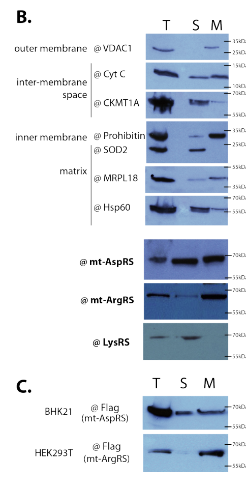

## Question

# Gene Research for Functional Annotation

## ⚠️ CRITICAL: Gene/Protein Identification Context

**BEFORE YOU BEGIN RESEARCH:** You MUST verify you are researching the CORRECT gene/protein. Gene symbols can be ambiguous, especially for less well-characterized genes from non-model organisms.

### Target Gene/Protein Identity (from UniProt):
- **UniProt Accession:** Q6PI48
- **Protein Description:** RecName: Full=Aspartate--tRNA ligase, mitochondrial; EC=6.1.1.12 {ECO:0000269|PubMed:15779907, ECO:0000269|PubMed:23275545, ECO:0000269|PubMed:40814755}; AltName: Full=Aspartyl-tRNA synthetase {ECO:0000303|PubMed:15779907, ECO:0000303|PubMed:39039092}; Short=AspRS {ECO:0000303|PubMed:15779907}; Flags: Precursor;
- **Gene Information:** Name=DARS2 {ECO:0000312|HGNC:HGNC:25538};
- **Organism (full):** Homo sapiens (Human).
- **Protein Family:** Belongs to the class-II aminoacyl-tRNA synthetase family.
- **Key Domains:** Aa-tRNA-synt_II. (IPR004364); aa-tRNA-synth_II. (IPR006195); aa-tRNA-synth_II/BPL/LPL. (IPR045864); Asp-tRNA-ligase_1. (IPR004524); Asp-tRNA-ligase_1_N. (IPR047089)

### MANDATORY VERIFICATION STEPS:

1. **Check if the gene symbol "DARS2" matches the protein description above**
2. **Verify the organism is correct:** Homo sapiens (Human).
3. **Check if protein family/domains align with what you find in literature**
4. **If you find literature for a DIFFERENT gene with the same or similar symbol, STOP**

### If Gene Symbol is Ambiguous or You Cannot Find Relevant Literature:

**DO NOT PROCEED WITH RESEARCH ON A DIFFERENT GENE.** Instead:
- State clearly: "The gene symbol 'DARS2' is ambiguous or literature is limited for this specific protein"
- Explain what you found (e.g., "Found extensive literature on a different gene with the same symbol in a different organism")
- Describe the protein based ONLY on the UniProt information provided above
- Suggest that the protein function can be inferred from domain/family information

### Research Target:

Please provide a comprehensive research report on the gene **DARS2** (gene ID: DARS2, UniProt: Q6PI48) in human.

The research report should be a detailed narrative explaining the function, biological processes, and localization of the gene product. Citations should be given for all claims.

You should prioritize authoritative reviews and primary scientific literature when conducting research. You can supplement
this with annotations you find in gene/protein databases, but these can be outdated or inaccurate.

We are specifically interested in the primary function of the gene - for enzymes, what reaction is catalyzed, and what is the substrate specificity? For transporters, what is the substrate? For structural proteins or adapters, what is the broader structural role? For signaling molecules, what is the role in the pathway.

We are interested in where in or outside the cell the gene product carries out its function.

We are also interested in the signaling or biochemical pathways in which the gene functions. We are less interested in broad pleiotropic effects, except where these elucidate the precise role.

Include evidence where possible. We are interested in both experimental evidence as well as inference from structure, evolution, or bioinformatic analysis. Precise studies should be prioritized over high-throughput, where available.

## Output

Question: You are an expert researcher providing comprehensive, well-cited information.

Provide detailed information focusing on:
1. Key concepts and definitions with current understanding
2. Recent developments and latest research (prioritize 2023-2024 sources)
3. Current applications and real-world implementations
4. Expert opinions and analysis from authoritative sources
5. Relevant statistics and data from recent studies

Format as a comprehensive research report with proper citations. Include URLs and publication dates where available.
Always prioritize recent, authoritative sources and provide specific citations for all major claims.

# Gene Research for Functional Annotation

## ⚠️ CRITICAL: Gene/Protein Identification Context

**BEFORE YOU BEGIN RESEARCH:** You MUST verify you are researching the CORRECT gene/protein. Gene symbols can be ambiguous, especially for less well-characterized genes from non-model organisms.

### Target Gene/Protein Identity (from UniProt):
- **UniProt Accession:** Q6PI48
- **Protein Description:** RecName: Full=Aspartate--tRNA ligase, mitochondrial; EC=6.1.1.12 {ECO:0000269|PubMed:15779907, ECO:0000269|PubMed:23275545, ECO:0000269|PubMed:40814755}; AltName: Full=Aspartyl-tRNA synthetase {ECO:0000303|PubMed:15779907, ECO:0000303|PubMed:39039092}; Short=AspRS {ECO:0000303|PubMed:15779907}; Flags: Precursor;
- **Gene Information:** Name=DARS2 {ECO:0000312|HGNC:HGNC:25538};
- **Organism (full):** Homo sapiens (Human).
- **Protein Family:** Belongs to the class-II aminoacyl-tRNA synthetase family.
- **Key Domains:** Aa-tRNA-synt_II. (IPR004364); aa-tRNA-synth_II. (IPR006195); aa-tRNA-synth_II/BPL/LPL. (IPR045864); Asp-tRNA-ligase_1. (IPR004524); Asp-tRNA-ligase_1_N. (IPR047089)

### MANDATORY VERIFICATION STEPS:

1. **Check if the gene symbol "DARS2" matches the protein description above**
2. **Verify the organism is correct:** Homo sapiens (Human).
3. **Check if protein family/domains align with what you find in literature**
4. **If you find literature for a DIFFERENT gene with the same or similar symbol, STOP**

### If Gene Symbol is Ambiguous or You Cannot Find Relevant Literature:

**DO NOT PROCEED WITH RESEARCH ON A DIFFERENT GENE.** Instead:
- State clearly: "The gene symbol 'DARS2' is ambiguous or literature is limited for this specific protein"
- Explain what you found (e.g., "Found extensive literature on a different gene with the same symbol in a different organism")
- Describe the protein based ONLY on the UniProt information provided above
- Suggest that the protein function can be inferred from domain/family information

### Research Target:

Please provide a comprehensive research report on the gene **DARS2** (gene ID: DARS2, UniProt: Q6PI48) in human.

The research report should be a detailed narrative explaining the function, biological processes, and localization of the gene product. Citations should be given for all claims.

You should prioritize authoritative reviews and primary scientific literature when conducting research. You can supplement
this with annotations you find in gene/protein databases, but these can be outdated or inaccurate.

We are specifically interested in the primary function of the gene - for enzymes, what reaction is catalyzed, and what is the substrate specificity? For transporters, what is the substrate? For structural proteins or adapters, what is the broader structural role? For signaling molecules, what is the role in the pathway.

We are interested in where in or outside the cell the gene product carries out its function.

We are also interested in the signaling or biochemical pathways in which the gene functions. We are less interested in broad pleiotropic effects, except where these elucidate the precise role.

Include evidence where possible. We are interested in both experimental evidence as well as inference from structure, evolution, or bioinformatic analysis. Precise studies should be prioritized over high-throughput, where available.

# Human DARS2 (UniProt Q6PI48): Functional-Annotation Research Report

## Executive summary

**Identity is verified.** In human literature, **DARS2** is the nuclear gene encoding **mitochondrial aspartyl-tRNA synthetase** (mt-AspRS; aspartate—tRNA ligase, EC 6.1.1.12), matching UniProt **Q6PI48** and the supplied *Homo sapiens* annotation. It must not be confused with **DARS/DARS1**, which encodes the cytosolic aspartyl-tRNA synthetase and is associated with HBSL rather than the canonical DARS2-associated disorder LBSL. Human mitochondria generally use an aaRS complement distinct from the cytosolic system. (berge2013pathogenicmutationscausing pages 1-4, guang2023mutationsindars2 pages 1-2, gonzalezserrano2018threehumanaminoacyltrna pages 1-2)

DARS2’s established primary function is ATP-dependent aminoacylation of mitochondrial tRNA-Asp with L-aspartate. This produces Asp-tRNA-Asp for mitochondrial ribosomes and thereby supports synthesis of all 13 mtDNA-encoded oxidative-phosphorylation subunits. The protein is a nuclear-encoded, mitochondrial-targeted, homodimeric **class-II aminoacyl-tRNA synthetase** with an anticodon-recognition region and conserved class-II catalytic motifs. (berge2013pathogenicmutationscausing pages 1-4, johnson2024targeteddegradationofa pages 31-36)

## 1. Identity, family, and domain verification

The literature aligns with the supplied protein-family annotation: DARS2/mt-AspRS is a **class-II aaRS**, is active as a homodimer, and contains an anticodon-binding region plus a catalytic domain built around conserved class-II motifs 1–3. These features agree with the supplied InterPro assignments **Aa-tRNA-synt_II**, **aa-tRNA-synth_II/BPL/LPL**, **Asp-tRNA-ligase_1**, and **Asp-tRNA-ligase_1_N**. Motif 1 contributes to the dimer interface, while motifs 2 and 3 contribute to the catalytic platform and ATP/tRNA interactions. (berge2013pathogenicmutationscausing pages 1-4, johnson2024targeteddegradationofa pages 31-36)

The “precursor” designation is also appropriate. DARS2 is translated on cytosolic ribosomes with an N-terminal mitochondrial targeting sequence, imported into mitochondria, and proteolytically processed to mature forms. Proteomic work and subsequent localization studies indicate multiple processed N termini and coexisting mature products, although their individual biological roles remain unresolved. (johnson2024targeteddegradationofa pages 31-36, gonzalezserrano2018threehumanaminoacyltrna pages 6-7, gonzalezserrano2018threehumanaminoacyltrna pages 1-2)

## 2. Primary biochemical function and substrate specificity

The overall aminoacylation reaction is:

**L-aspartate + ATP + mitochondrial tRNA-Asp → L-aspartyl–mt-tRNA-Asp + AMP + pyrophosphate.**

Mechanistically, the enzyme first activates L-aspartate with ATP to form an enzyme-bound aspartyl-adenylate intermediate and pyrophosphate. It then transfers aspartate to the terminal adenosine of cognate mitochondrial tRNA-Asp. The resulting charged tRNA delivers aspartate during mitochondrial translation. Class-II architecture and conserved ATP-contacting residues support this two-step mechanism. (johnson2024targeteddegradationofa pages 31-36, berge2013pathogenicmutationscausing pages 4-7)

Direct assays used purified mature mt-AspRS and mitochondrial tRNA-Asp, providing stronger evidence than annotation by homology alone. Representative pathogenic substitutions produced markedly different aminoacylation defects: **R263Q, 1.9 nmol·mg⁻¹·min⁻¹ and a 135-fold loss; L626Q, 6.0 and a 43-fold loss; D560V, 42.6 and a sixfold loss**. Other tested variants retained near-normal measured catalysis but reduced expression, stability, import efficiency, solubility, or dimer formation. Thus, pathogenicity cannot be inferred from catalytic activity alone. (berge2013pathogenicmutationscausing pages 8-10, berge2013pathogenicmutationscausing pages 4-7)

## 3. Cellular and submitochondrial localization

DARS2 acts principally **inside mitochondria**. Most tested pathogenic variants still colocalized with mitochondrial markers; S45G is a notable context-dependent exception, having impaired import in isolated-mitochondria assays but detectable targeting and processing in intact cells. This suggests reduced import efficiency rather than an absolute targeting failure. (berge2013pathogenicmutationscausing pages 8-10, gonzalezserrano2018threehumanaminoacyltrna pages 7-8)

Within mitochondria, mt-AspRS has a **dual distribution**: a soluble pool and a membrane-associated pool. Fractionation cannot completely resolve matrix from intermembrane-space proteins, but the soluble fraction is compatible with the matrix-facing translation role. The membrane pool is not an integral transmembrane species: high salt, urea, alkaline carbonate, and hydroxylamine release mt-AspRS, supporting peripheral, predominantly electrostatic/ionic membrane anchoring. Most disease variants did not materially change this distribution; Q184K and R263Q reduced the soluble fraction, while Q184K also increased insoluble residual material. (gonzalezserrano2018threehumanaminoacyltrna pages 6-7, gonzalezserrano2018threehumanaminoacyltrna pages 4-6, gonzalezserrano2018threehumanaminoacyltrna pages 3-4)

The fractionation and extraction blots directly show endogenous and tagged mt-AspRS in soluble and membrane fractions and its chemical release from membranes. (gonzalezserrano2018threehumanaminoacyltrna media 5f5438fe, gonzalezserrano2018threehumanaminoacyltrna media 2c267643)

## 4. Biological process and pathway placement

DARS2 belongs to the **mitochondrial translation pathway**, not a conventional receptor-signaling cascade. Aminoacylated mt-tRNA-Asp enters the mitoribosome and enables decoding of aspartate codons during synthesis of the **13 proteins encoded by mitochondrial DNA**. Those proteins are hydrophobic core subunits of respiratory-chain/OXPHOS complexes; DARS2 therefore links amino-acid activation and tRNA charging directly to electron transport, proton pumping, membrane potential, and ATP production. (berge2013pathogenicmutationscausing pages 1-4, gonzalezserrano2018threehumanaminoacyltrna pages 1-2)

Patient fibroblast studies support this chain of causality: DARS2 mutations selectively reduced synthesis of mtDNA-encoded respiratory-chain proteins while leaving nuclear-encoded protein synthesis comparatively intact; oxygen consumption and respiratory-control ratio declined, and mitochondria became more fragmented and less interconnected. Nevertheless, respiratory-chain assays in muscle or fibroblasts can sometimes appear normal, probably because hypomorphic alleles retain activity and because vulnerability is cell-type dependent. (diodato2014themitochondrialaminoacyl pages 4-5)

Complete Dars2 loss is embryonically lethal in mice, demonstrating nonredundancy. Neuron-specific knockout causes OXPHOS defects, cortical and hippocampal atrophy, apoptosis, inflammatory responses, and behavioral abnormalities, whereas oligodendrocyte-restricted knockout produces a much milder phenotype. These findings support neuronal metabolic vulnerability rather than a simple model in which primary oligodendrocyte failure alone explains white-matter disease. (karim2016organisationsousmitochondrialede pages 33-37, johnson2024targeteddegradationofa pages 31-36)

## 5. Disease mechanism and functional evidence

Biallelic DARS2 variants cause **leukoencephalopathy with brainstem and spinal-cord involvement and lactate elevation (LBSL)**. Typical manifestations include ataxia, spasticity, impaired dexterity, pyramidal dysfunction, and variably peripheral neuropathy, epilepsy, sensory deficits, or cognitive effects. MRI tract distribution and genetic testing are more reliable than lactate alone because lactate elevation can be absent. More than 60 clinically relevant variants had already been catalogued by 2014. (karim2016organisationsousmitochondrialede pages 33-37, gonzalezserrano2018threehumanaminoacyltrna pages 2-3)

Most patients are compound heterozygotes. A recurrent intron-2/polypyrimidine-tract allele causes skipping of the 67-bp exon 3, a frameshift, premature termination, and nonsense-mediated decay, but remains “leaky”: some correctly spliced transcript and functional protein survive. A second allele commonly carries a missense or another damaging variant. The apparent requirement for residual DARS2 function is consistent with embryonic lethality after complete loss. (berge2013pathogenicmutationscausing pages 1-4, guang2023mutationsindars2 pages 1-2, diodato2014themitochondrialaminoacyl pages 4-5)

Variants act through multiple mechanisms—loss of catalytic activity, defective dimerization, lower abundance, instability, aggregation, or reduced import—and molecular severity does not consistently predict clinical severity. This absence of a simple genotype–phenotype relationship is an important expert caution for variant interpretation. (berge2013pathogenicmutationscausing pages 8-10, berge2013pathogenicmutationscausing pages 4-7)

## 6. Recent developments, 2023–2024

### 6.1 Neural organoids and cell-specific splicing — August 2023

Guang and colleagues studied cerebral organoids from **seven LBSL patients and three controls**, followed by validation in induced neurons. They found broad, mutation-dependent dysregulation of RNA metabolism, splicing, translation, and metabolic transcripts. DARS2 exon-3 exclusion increased after neuronal differentiation, reduced DARS2 protein, and accompanied impaired neuronal growth. Some single patient cells had a percent-spliced-in value of zero and expressed only exon-3-lacking transcripts, showing that the commonly invoked “leaky” rescue is not uniform across neural cells. The recurrent c.492+2T>C allele similarly caused exon-5 skipping while preserving some full-length transcript. (guang2023mutationsindars2 pages 13-14, guang2023mutationsindars2 pages 1-2)

This study offers a plausible explanation for tissue specificity: neural differentiation changes splice-isoform usage and can reduce residual DARS2 below a functional threshold. Its suggestion that DARS2 may regulate transcription or splicing beyond aminoacylation remains **hypothesis-generating**; global transcript changes may be secondary to mitochondrial stress or altered cell state. Published August 2023: https://doi.org/10.1038/s41598-023-40107-7. (guang2023mutationsindars2 pages 13-14)

### 6.2 Extracellular DARS2 and innate immunity — July 2024

Johnson and colleagues reported an unexpected, noncanonical extracellular role. LPS or Pam3CSK4 stimulation promoted release of DARS2 into culture supernatants and exosomes. Recombinant human DARS2 increased IL-1β, IL-6, and TNF-α secretion by human CD14⁺-derived macrophages, while epithelial DARS2 knockdown reduced cytokine release after *Pseudomonas aeruginosa* infection and impaired scratch-wound closure. The cytokine knockdown experiments used 8–14 biological samples across three experiments; recombinant-protein macrophage experiments used three independent samples. (johnson2024targeteddegradationof pages 6-7, johnson2024targeteddegradationof pages 7-8)

The same study identified FBXO24 as an infection-induced F-box component that binds DARS2 and promotes its ubiquitylation/degradation. Acetylation, particularly involving K368, stabilized DARS2; FBXO24 depletion increased maximal and spare respiratory capacity, whereas FBXO24 overexpression suppressed respiration and ATP production. A virtual-screen-derived FBXO24 inhibitor prolonged cellular DARS2 and showed immunostimulatory activity, but this remains a preclinical proof of concept rather than a validated treatment. (johnson2024targeteddegradationof pages 4-5, johnson2024targeteddegradationof pages 6-7)

Clinical sampling included **50 infected patients—10 noncritically ill and 40 critically ill**—with plasma DARS2 elevated relative to controls at days 1, 7, and 21 after admission; a culture-positive *P. aeruginosa* subgroup also showed elevation at day 7. These data suggest potential biomarker or host-directed therapeutic applications, but they do not yet establish diagnostic specificity, favorable risk–benefit, or whether extracellular DARS2 is protective versus injurious in different inflammatory contexts. Published July 2024 in *Nature Communications* 15:6172: https://doi.org/10.1038/s41467-024-50031-7. (johnson2024targeteddegradationof pages 1-2, johnson2024targeteddegradationof pages 7-8)

## 7. Current applications and translational relevance

1. **Molecular diagnosis:** DARS2 sequencing and splice analysis are used to confirm LBSL in patients with the characteristic MRI pattern. Because splice defects are cell-type dependent, blood or fibroblast RNA may underestimate the neural defect. (karim2016organisationsousmitochondrialede pages 33-37, guang2023mutationsindars2 pages 13-14)
2. **Variant classification:** Recombinant aminoacylation, protein-stability, dimerization, import, localization, and patient-cell mitochondrial assays provide complementary functional evidence. A normal catalytic assay does not exclude pathogenicity. (berge2013pathogenicmutationscausing pages 8-10, berge2013pathogenicmutationscausing pages 4-7)
3. **Disease modeling:** Patient iPSCs, induced neurons, cerebral organoids, and conditional knockout mice model neural splicing thresholds and cell-type vulnerability. These platforms are more mechanistically informative than undifferentiated fibroblasts alone. (karim2016organisationsousmitochondrialede pages 33-37, guang2023mutationsindars2 pages 1-2)
4. **Therapeutic concepts:** Potential strategies include increasing correctly spliced DARS2, gene replacement, stabilizing residual enzyme, and correcting downstream mitochondrial stress. No disease-modifying DARS2/LBSL therapy is established in the examined evidence. FBXO24 inhibition and recombinant DARS2 are much earlier-stage concepts directed at infection/immunity rather than treatment of LBSL. (johnson2024targeteddegradationof pages 1-2, johnson2024targeteddegradationof pages 7-8)

## 8. Evidence summary

The following table separates established canonical annotation from recent noncanonical observations.

| Topic | Functional annotation | Evidence type/key quantitative result | Source/year/DOI URL |
|---|---|---|---|
| Target identity | **Human DARS2 / UniProt Q6PI48** encodes mitochondrial aspartyl-tRNA synthetase (mt-AspRS), not the cytosolic aspartyl-tRNA synthetase encoded by **DARS1/DARS**. | Independent biochemical and disease literature consistently assigns mitochondrial AspRS and LBSL to DARS2; mitochondrial and cytosolic aaRS systems are distinct. (berge2013pathogenicmutationscausing pages 1-4, guang2023mutationsindars2 pages 1-2, gonzalezserrano2018threehumanaminoacyltrna pages 1-2) | van Berge et al., 2013, [doi:10.1042/BJ20121564](https://doi.org/10.1042/BJ20121564); Guang et al., 2023, [doi:10.1038/s41598-023-40107-7](https://doi.org/10.1038/s41598-023-40107-7) |
| Protein family and architecture | **Established canonical annotation:** class-II aminoacyl-tRNA synthetase; homodimeric mt-AspRS containing an N-terminal/anticodon-recognition region and a class-II catalytic platform with conserved motifs 1–3. | Structural homology and biochemical dimerization studies; disease substitutions can impair catalysis, stability, or dimer formation. (berge2013pathogenicmutationscausing pages 1-4, johnson2024targeteddegradationofa pages 31-36, berge2013pathogenicmutationscausing pages 8-10) | van Berge et al., 2013, [doi:10.1042/BJ20121564](https://doi.org/10.1042/BJ20121564) |
| Catalytic reaction and specificity | **Primary function:** ATP-dependent attachment of **L-aspartate** to cognate human mitochondrial **tRNA-Asp**, yielding Asp-tRNA-Asp for mitochondrial translation. Overall reaction: L-aspartate + ATP + mt-tRNA-Asp → L-aspartyl-mt-tRNA-Asp + AMP + PPᵢ, through an aspartyl-adenylate intermediate. | Direct aminoacylation assays used purified mature mt-AspRS and mitochondrial tRNA-Asp; class-II active-site evidence supports ATP and tRNA binding. (johnson2024targeteddegradationofa pages 31-36, berge2013pathogenicmutationscausing pages 4-7) | van Berge et al., 2013, [doi:10.1042/BJ20121564](https://doi.org/10.1042/BJ20121564) |
| Mitochondrial import and localization | Nuclear-encoded DARS2 is translated in the cytosol as a precursor bearing an N-terminal mitochondrial targeting sequence, imported and proteolytically matured in mitochondria. It occupies both a soluble mitochondrial pool and a **peripherally membrane-associated** pool rather than behaving as an integral membrane protein. | Mitochondrial colocalization, processing, fractionation, and chemical extraction. Urea, KCl, alkaline carbonate, and hydroxylamine released membrane-associated mt-AspRS, supporting salt-sensitive electrostatic/ionic anchoring; most tested disease variants did not materially alter this distribution. (berge2013pathogenicmutationscausing pages 8-10, gonzalezserrano2018threehumanaminoacyltrna pages 3-4, gonzalezserrano2018threehumanaminoacyltrna pages 7-8, gonzalezserrano2018threehumanaminoacyltrna media 5f5438fe) | González-Serrano et al., 2018, [doi:10.1074/jbc.RA118.003400](https://doi.org/10.1074/jbc.RA118.003400) |
| Mitochondrial translation and OXPHOS | Charged mt-tRNA-Asp supplies aspartate during mitoribosomal synthesis of the **13 mtDNA-encoded proteins**, all essential subunits of respiratory-chain/OXPHOS complexes. DARS2 deficiency can therefore reduce mitochondrial protein synthesis, respiration, respiratory control, and normal mitochondrial dynamics. | Patient fibroblasts showed selective reduction of mtDNA-encoded protein synthesis, decreased oxygen consumption and respiratory-control ratio, and increased mitochondrial fragmentation; effects can be tissue- and cell-type-dependent. (berge2013pathogenicmutationscausing pages 1-4, diodato2014themitochondrialaminoacyl pages 4-5) | Lin et al., 2019, [doi:10.1371/journal.pone.0224173](https://doi.org/10.1371/journal.pone.0224173); Diodato et al., 2014, [doi:10.1155/2014/787956](https://doi.org/10.1155/2014/787956) |
| Variant functional measurements | Pathogenic variants can reduce catalytic efficiency by different mechanisms rather than producing one uniform defect. | With mitochondrial tRNA-Asp, **R263Q: 1.9 nmol·mg⁻¹·min⁻¹ (135-fold loss); L626Q: 6.0 (43-fold loss); D560V: 42.6 (6-fold loss)**. Other tested variants retained near-normal measured catalysis but could reduce abundance, stability, import, or dimerization. (berge2013pathogenicmutationscausing pages 8-10, berge2013pathogenicmutationscausing pages 4-7) | van Berge et al., 2013, [doi:10.1042/BJ20121564](https://doi.org/10.1042/BJ20121564) |
| 2023 neural-organoid development | **Recent mechanistic evidence:** LBSL-associated DARS2 variants cause cell- and mutation-dependent exon skipping, reduced neuronal DARS2 protein, altered neuronal growth, and broad dysregulation of RNA metabolism, splicing, translation, and metabolism. These observations do not yet prove that DARS2 directly regulates nuclear transcription or splicing. | Cerebral organoids from **7 patients and 3 controls**; exon 3 is 67 bp and its exclusion causes a frameshift/premature stop. Some single cells had PSI = 0 and expressed only exon-3-lacking transcripts; exon-3 exclusion increased after neuronal differentiation. (guang2023mutationsindars2 pages 13-14, guang2023mutationsindars2 pages 1-2) | Guang et al., published August 2023, [doi:10.1038/s41598-023-40107-7](https://doi.org/10.1038/s41598-023-40107-7) |
| 2024 extracellular immune activity | **Emerging noncanonical role:** inflammatory stimulation releases DARS2, including in exosomes; extracellular recombinant DARS2 stimulates macrophage cytokine production. FBXO24 promotes DARS2 ubiquitylation/degradation, whereas DARS2 acetylation—particularly involving K368—supports stability. This is experimental pneumonia evidence, not yet an established physiological function or approved therapy. | Plasma study included **50 infected patients**—10 noncritically ill and 40 critically ill—and found increased DARS2 versus controls at days 1, 7, and 21. Recombinant DARS2 increased IL-1β, IL-6, and TNFα in human CD14⁺-derived macrophages (**n=3**); epithelial-cell DARS2 knockdown reduced infection-induced cytokines across **n=8–14** samples. (johnson2024targeteddegradationof pages 1-2, johnson2024targeteddegradationof pages 6-7, johnson2024targeteddegradationof pages 7-8) | Johnson et al., accepted June 26 and published July 2024, *Nature Communications* 15:6172, [doi:10.1038/s41467-024-50031-7](https://doi.org/10.1038/s41467-024-50031-7) |

*Table: Evidence table distinguishing DARS2’s established mitochondrial aminoacylation function from recent, still-emerging transcriptomic and extracellular immune observations. Quantitative biochemical, organoid, localization, and pneumonia findings are linked to primary sources.*

## Conclusions

The best-supported annotation is that human **DARS2/Q6PI48** is a mitochondrial, class-II, homodimeric aspartyl-tRNA synthetase whose essential function is ATP-dependent charging of mitochondrial tRNA-Asp. Its immediate pathway is mitochondrial translation, with downstream consequences for respiratory-chain assembly and oxidative phosphorylation. The enzyme is imported as a precursor and occupies both soluble and peripherally membrane-associated mitochondrial pools. LBSL variants are usually hypomorphic and disrupt catalysis, folding/stability, dimerization, import, or splicing in different combinations.

The most important recent advance is recognition that residual DARS2 is strongly cell- and differentiation-state dependent, particularly in neural cells. The extracellular immune activity reported in 2024 is compelling but should be regarded as an emerging moonlighting function, not a replacement for the well-established mitochondrial aminoacylation annotation.

References

1. (berge2013pathogenicmutationscausing pages 1-4): Laura van Berge, Josta Kevenaar, Emiel Polder, Agnès Gaudry, Catherine Florentz, Marie Sissler, Marjo S. van der Knaap, and Gert C. Scheper. Pathogenic mutations causing lbsl affect mitochondrial aspartyl-trna synthetase in diverse ways. The Biochemical journal, 450 2:345-50, Mar 2013. URL: https://doi.org/10.1042/bj20121564, doi:10.1042/bj20121564. This article has 46 citations.

2. (guang2023mutationsindars2 pages 1-2): S. Guang, B. M. O’Brien, A. S. Fine, M. Ying, A. Fatemi, and C. L. Nemeth. Mutations in dars2 result in global dysregulation of mrna metabolism and splicing. Aug 2023. URL: https://doi.org/10.1038/s41598-023-40107-7, doi:10.1038/s41598-023-40107-7. This article has 16 citations and is from a peer-reviewed journal.

3. (gonzalezserrano2018threehumanaminoacyltrna pages 1-2): Ligia Elena González-Serrano, Loukmane Karim, Florian Pierre, Hagen Schwenzer, Agnès Rötig, Arnold Munnich, and Marie Sissler. Three human aminoacyl-trna synthetases have distinct sub-mitochondrial localizations that are unaffected by disease-associated mutations. Journal of Biological Chemistry, 293(35):13604-13615, Aug 2018. URL: https://doi.org/10.1074/jbc.ra118.003400, doi:10.1074/jbc.ra118.003400. This article has 15 citations and is from a domain leading peer-reviewed journal.

4. (johnson2024targeteddegradationofa pages 31-36): BS Johnson. Targeted degradation of mitochondrial aspartyl-trna synthetase (dars2) modulates immune responses in experimental pneumonia. Unknown journal, 2024.

5. (gonzalezserrano2018threehumanaminoacyltrna pages 6-7): Ligia Elena González-Serrano, Loukmane Karim, Florian Pierre, Hagen Schwenzer, Agnès Rötig, Arnold Munnich, and Marie Sissler. Three human aminoacyl-trna synthetases have distinct sub-mitochondrial localizations that are unaffected by disease-associated mutations. Journal of Biological Chemistry, 293(35):13604-13615, Aug 2018. URL: https://doi.org/10.1074/jbc.ra118.003400, doi:10.1074/jbc.ra118.003400. This article has 15 citations and is from a domain leading peer-reviewed journal.

6. (berge2013pathogenicmutationscausing pages 4-7): Laura van Berge, Josta Kevenaar, Emiel Polder, Agnès Gaudry, Catherine Florentz, Marie Sissler, Marjo S. van der Knaap, and Gert C. Scheper. Pathogenic mutations causing lbsl affect mitochondrial aspartyl-trna synthetase in diverse ways. The Biochemical journal, 450 2:345-50, Mar 2013. URL: https://doi.org/10.1042/bj20121564, doi:10.1042/bj20121564. This article has 46 citations.

7. (berge2013pathogenicmutationscausing pages 8-10): Laura van Berge, Josta Kevenaar, Emiel Polder, Agnès Gaudry, Catherine Florentz, Marie Sissler, Marjo S. van der Knaap, and Gert C. Scheper. Pathogenic mutations causing lbsl affect mitochondrial aspartyl-trna synthetase in diverse ways. The Biochemical journal, 450 2:345-50, Mar 2013. URL: https://doi.org/10.1042/bj20121564, doi:10.1042/bj20121564. This article has 46 citations.

8. (gonzalezserrano2018threehumanaminoacyltrna pages 7-8): Ligia Elena González-Serrano, Loukmane Karim, Florian Pierre, Hagen Schwenzer, Agnès Rötig, Arnold Munnich, and Marie Sissler. Three human aminoacyl-trna synthetases have distinct sub-mitochondrial localizations that are unaffected by disease-associated mutations. Journal of Biological Chemistry, 293(35):13604-13615, Aug 2018. URL: https://doi.org/10.1074/jbc.ra118.003400, doi:10.1074/jbc.ra118.003400. This article has 15 citations and is from a domain leading peer-reviewed journal.

9. (gonzalezserrano2018threehumanaminoacyltrna pages 4-6): Ligia Elena González-Serrano, Loukmane Karim, Florian Pierre, Hagen Schwenzer, Agnès Rötig, Arnold Munnich, and Marie Sissler. Three human aminoacyl-trna synthetases have distinct sub-mitochondrial localizations that are unaffected by disease-associated mutations. Journal of Biological Chemistry, 293(35):13604-13615, Aug 2018. URL: https://doi.org/10.1074/jbc.ra118.003400, doi:10.1074/jbc.ra118.003400. This article has 15 citations and is from a domain leading peer-reviewed journal.

10. (gonzalezserrano2018threehumanaminoacyltrna pages 3-4): Ligia Elena González-Serrano, Loukmane Karim, Florian Pierre, Hagen Schwenzer, Agnès Rötig, Arnold Munnich, and Marie Sissler. Three human aminoacyl-trna synthetases have distinct sub-mitochondrial localizations that are unaffected by disease-associated mutations. Journal of Biological Chemistry, 293(35):13604-13615, Aug 2018. URL: https://doi.org/10.1074/jbc.ra118.003400, doi:10.1074/jbc.ra118.003400. This article has 15 citations and is from a domain leading peer-reviewed journal.

11. (gonzalezserrano2018threehumanaminoacyltrna media 5f5438fe): Ligia Elena González-Serrano, Loukmane Karim, Florian Pierre, Hagen Schwenzer, Agnès Rötig, Arnold Munnich, and Marie Sissler. Three human aminoacyl-trna synthetases have distinct sub-mitochondrial localizations that are unaffected by disease-associated mutations. Journal of Biological Chemistry, 293(35):13604-13615, Aug 2018. URL: https://doi.org/10.1074/jbc.ra118.003400, doi:10.1074/jbc.ra118.003400. This article has 15 citations and is from a domain leading peer-reviewed journal.

12. (gonzalezserrano2018threehumanaminoacyltrna media 2c267643): Ligia Elena González-Serrano, Loukmane Karim, Florian Pierre, Hagen Schwenzer, Agnès Rötig, Arnold Munnich, and Marie Sissler. Three human aminoacyl-trna synthetases have distinct sub-mitochondrial localizations that are unaffected by disease-associated mutations. Journal of Biological Chemistry, 293(35):13604-13615, Aug 2018. URL: https://doi.org/10.1074/jbc.ra118.003400, doi:10.1074/jbc.ra118.003400. This article has 15 citations and is from a domain leading peer-reviewed journal.

13. (diodato2014themitochondrialaminoacyl pages 4-5): Daria Diodato, Daniele Ghezzi, and Valeria Tiranti. The mitochondrial aminoacyl trna synthetases: genes and syndromes. International Journal of Cell Biology, 2014:1-11, Feb 2014. URL: https://doi.org/10.1155/2014/787956, doi:10.1155/2014/787956. This article has 178 citations and is from a peer-reviewed journal.

14. (karim2016organisationsousmitochondrialede pages 33-37): L Karim. Organisation sous-mitochondriale de l'aspartyl-arnt synthétase humaine et implication dans le syndrome lbsl. Unknown journal, 2016.

15. (gonzalezserrano2018threehumanaminoacyltrna pages 2-3): Ligia Elena González-Serrano, Loukmane Karim, Florian Pierre, Hagen Schwenzer, Agnès Rötig, Arnold Munnich, and Marie Sissler. Three human aminoacyl-trna synthetases have distinct sub-mitochondrial localizations that are unaffected by disease-associated mutations. Journal of Biological Chemistry, 293(35):13604-13615, Aug 2018. URL: https://doi.org/10.1074/jbc.ra118.003400, doi:10.1074/jbc.ra118.003400. This article has 15 citations and is from a domain leading peer-reviewed journal.

16. (guang2023mutationsindars2 pages 13-14): S. Guang, B. M. O’Brien, A. S. Fine, M. Ying, A. Fatemi, and C. L. Nemeth. Mutations in dars2 result in global dysregulation of mrna metabolism and splicing. Aug 2023. URL: https://doi.org/10.1038/s41598-023-40107-7, doi:10.1038/s41598-023-40107-7. This article has 16 citations and is from a peer-reviewed journal.

17. (johnson2024targeteddegradationof pages 6-7): Benjamin S. Johnson, Daniela Farkas, Rabab El-Mergawy, Jessica A. Adair, Ajit Elhance, Moemen Eltobgy, Francesca M. Coan, Lexie Chafin, Jessica A. Joseph, Alex Cornwell, Finny J. Johns, Lorena Rosas, Mauricio Rojas, Laszlo Farkas, Joseph S. Bednash, James D. Londino, Prabir Ray, Anuradha Ray, Valerian Kagan, Janet S. Lee, Bill B. Chen, and Rama K. Mallampalli. Targeted degradation of extracellular mitochondrial aspartyl-trna synthetase modulates immune responses. Nature Communications, Jul 2024. URL: https://doi.org/10.1038/s41467-024-50031-7, doi:10.1038/s41467-024-50031-7. This article has 11 citations and is from a highest quality peer-reviewed journal.

18. (johnson2024targeteddegradationof pages 7-8): Benjamin S. Johnson, Daniela Farkas, Rabab El-Mergawy, Jessica A. Adair, Ajit Elhance, Moemen Eltobgy, Francesca M. Coan, Lexie Chafin, Jessica A. Joseph, Alex Cornwell, Finny J. Johns, Lorena Rosas, Mauricio Rojas, Laszlo Farkas, Joseph S. Bednash, James D. Londino, Prabir Ray, Anuradha Ray, Valerian Kagan, Janet S. Lee, Bill B. Chen, and Rama K. Mallampalli. Targeted degradation of extracellular mitochondrial aspartyl-trna synthetase modulates immune responses. Nature Communications, Jul 2024. URL: https://doi.org/10.1038/s41467-024-50031-7, doi:10.1038/s41467-024-50031-7. This article has 11 citations and is from a highest quality peer-reviewed journal.

19. (johnson2024targeteddegradationof pages 4-5): Benjamin S. Johnson, Daniela Farkas, Rabab El-Mergawy, Jessica A. Adair, Ajit Elhance, Moemen Eltobgy, Francesca M. Coan, Lexie Chafin, Jessica A. Joseph, Alex Cornwell, Finny J. Johns, Lorena Rosas, Mauricio Rojas, Laszlo Farkas, Joseph S. Bednash, James D. Londino, Prabir Ray, Anuradha Ray, Valerian Kagan, Janet S. Lee, Bill B. Chen, and Rama K. Mallampalli. Targeted degradation of extracellular mitochondrial aspartyl-trna synthetase modulates immune responses. Nature Communications, Jul 2024. URL: https://doi.org/10.1038/s41467-024-50031-7, doi:10.1038/s41467-024-50031-7. This article has 11 citations and is from a highest quality peer-reviewed journal.

20. (johnson2024targeteddegradationof pages 1-2): Benjamin S. Johnson, Daniela Farkas, Rabab El-Mergawy, Jessica A. Adair, Ajit Elhance, Moemen Eltobgy, Francesca M. Coan, Lexie Chafin, Jessica A. Joseph, Alex Cornwell, Finny J. Johns, Lorena Rosas, Mauricio Rojas, Laszlo Farkas, Joseph S. Bednash, James D. Londino, Prabir Ray, Anuradha Ray, Valerian Kagan, Janet S. Lee, Bill B. Chen, and Rama K. Mallampalli. Targeted degradation of extracellular mitochondrial aspartyl-trna synthetase modulates immune responses. Nature Communications, Jul 2024. URL: https://doi.org/10.1038/s41467-024-50031-7, doi:10.1038/s41467-024-50031-7. This article has 11 citations and is from a highest quality peer-reviewed journal.

## Artifacts

- [Edison artifact artifact-00](DARS2-deep-research-falcon_artifacts/artifact-00.md)

## Citations

1. diodato2014themitochondrialaminoacyl pages 4-5
2. berge2013pathogenicmutationscausing pages 1-4
3. gonzalezserrano2018threehumanaminoacyltrna pages 1-2
4. johnson2024targeteddegradationofa pages 31-36
5. gonzalezserrano2018threehumanaminoacyltrna pages 6-7
6. berge2013pathogenicmutationscausing pages 4-7
7. berge2013pathogenicmutationscausing pages 8-10
8. gonzalezserrano2018threehumanaminoacyltrna pages 7-8
9. gonzalezserrano2018threehumanaminoacyltrna pages 4-6
10. gonzalezserrano2018threehumanaminoacyltrna pages 3-4
11. karim2016organisationsousmitochondrialede pages 33-37
12. gonzalezserrano2018threehumanaminoacyltrna pages 2-3
13. johnson2024targeteddegradationof pages 6-7
14. johnson2024targeteddegradationof pages 7-8
15. johnson2024targeteddegradationof pages 4-5
16. johnson2024targeteddegradationof pages 1-2
17. doi:10.1042/BJ20121564
18. doi:10.1038/s41598-023-40107-7
19. doi:10.1074/jbc.RA118.003400
20. doi:10.1371/journal.pone.0224173
21. doi:10.1155/2014/787956
22. doi:10.1038/s41467-024-50031-7
23. https://doi.org/10.1038/s41598-023-40107-7.
24. https://doi.org/10.1038/s41467-024-50031-7.
25. https://doi.org/10.1042/BJ20121564
26. https://doi.org/10.1038/s41598-023-40107-7
27. https://doi.org/10.1074/jbc.RA118.003400
28. https://doi.org/10.1371/journal.pone.0224173
29. https://doi.org/10.1155/2014/787956
30. https://doi.org/10.1038/s41467-024-50031-7
31. https://doi.org/10.1042/bj20121564,
32. https://doi.org/10.1038/s41598-023-40107-7,
33. https://doi.org/10.1074/jbc.ra118.003400,
34. https://doi.org/10.1155/2014/787956,
35. https://doi.org/10.1038/s41467-024-50031-7,