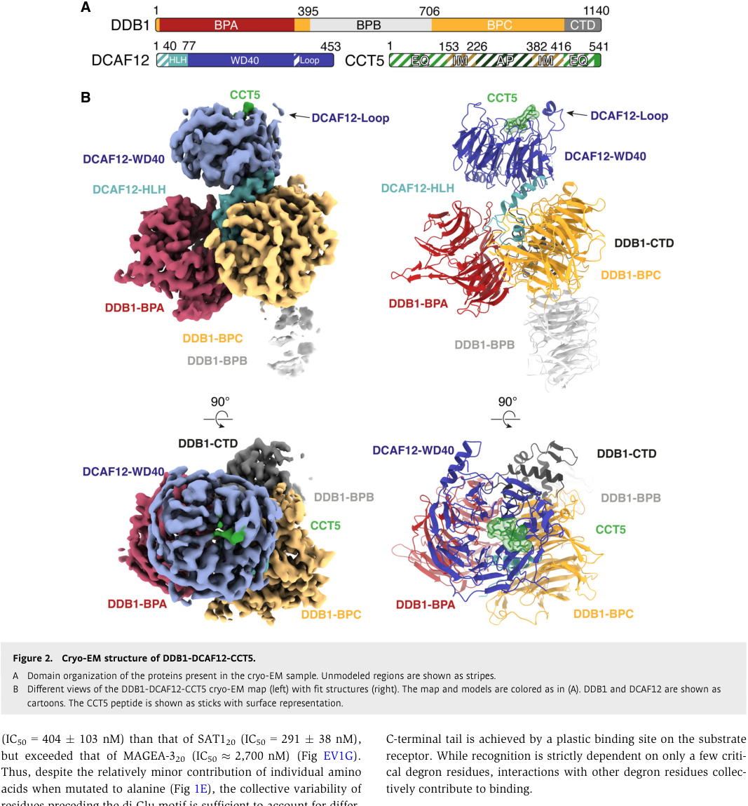

## Question

# Gene Research for Functional Annotation

## ⚠️ CRITICAL: Gene/Protein Identification Context

**BEFORE YOU BEGIN RESEARCH:** You MUST verify you are researching the CORRECT gene/protein. Gene symbols can be ambiguous, especially for less well-characterized genes from non-model organisms.

### Target Gene/Protein Identity (from UniProt):
- **UniProt Accession:** Q5VW00
- **Protein Description:** RecName: Full=DDB1- and CUL4-associated factor 12-like protein 2; AltName: Full=WD repeat-containing protein 40C;
- **Gene Information:** Name=DCAF12L2; Synonyms=WDR40C;
- **Organism (full):** Homo sapiens (Human).
- **Protein Family:** Belongs to the WD repeat DCAF12 family. .
- **Key Domains:** Beta-prop_DCAF12. (IPR056151); DCAF12. (IPR051191); WD40/YVTN_repeat-like_dom_sf. (IPR015943); WD40_repeat_dom_sf. (IPR036322); WD40_rpt. (IPR001680)

### MANDATORY VERIFICATION STEPS:

1. **Check if the gene symbol "DCAF12L2" matches the protein description above**
2. **Verify the organism is correct:** Homo sapiens (Human).
3. **Check if protein family/domains align with what you find in literature**
4. **If you find literature for a DIFFERENT gene with the same or similar symbol, STOP**

### If Gene Symbol is Ambiguous or You Cannot Find Relevant Literature:

**DO NOT PROCEED WITH RESEARCH ON A DIFFERENT GENE.** Instead:
- State clearly: "The gene symbol 'DCAF12L2' is ambiguous or literature is limited for this specific protein"
- Explain what you found (e.g., "Found extensive literature on a different gene with the same symbol in a different organism")
- Describe the protein based ONLY on the UniProt information provided above
- Suggest that the protein function can be inferred from domain/family information

### Research Target:

Please provide a comprehensive research report on the gene **DCAF12L2** (gene ID: DCAF12L2, UniProt: Q5VW00) in human.

The research report should be a detailed narrative explaining the function, biological processes, and localization of the gene product. Citations should be given for all claims.

You should prioritize authoritative reviews and primary scientific literature when conducting research. You can supplement
this with annotations you find in gene/protein databases, but these can be outdated or inaccurate.

We are specifically interested in the primary function of the gene - for enzymes, what reaction is catalyzed, and what is the substrate specificity? For transporters, what is the substrate? For structural proteins or adapters, what is the broader structural role? For signaling molecules, what is the role in the pathway.

We are interested in where in or outside the cell the gene product carries out its function.

We are also interested in the signaling or biochemical pathways in which the gene functions. We are less interested in broad pleiotropic effects, except where these elucidate the precise role.

Include evidence where possible. We are interested in both experimental evidence as well as inference from structure, evolution, or bioinformatic analysis. Precise studies should be prioritized over high-throughput, where available.

## Output

Question: You are an expert researcher providing comprehensive, well-cited information.

Provide detailed information focusing on:
1. Key concepts and definitions with current understanding
2. Recent developments and latest research (prioritize 2023-2024 sources)
3. Current applications and real-world implementations
4. Expert opinions and analysis from authoritative sources
5. Relevant statistics and data from recent studies

Format as a comprehensive research report with proper citations. Include URLs and publication dates where available.
Always prioritize recent, authoritative sources and provide specific citations for all major claims.

# Gene Research for Functional Annotation

## ⚠️ CRITICAL: Gene/Protein Identification Context

**BEFORE YOU BEGIN RESEARCH:** You MUST verify you are researching the CORRECT gene/protein. Gene symbols can be ambiguous, especially for less well-characterized genes from non-model organisms.

### Target Gene/Protein Identity (from UniProt):
- **UniProt Accession:** Q5VW00
- **Protein Description:** RecName: Full=DDB1- and CUL4-associated factor 12-like protein 2; AltName: Full=WD repeat-containing protein 40C;
- **Gene Information:** Name=DCAF12L2; Synonyms=WDR40C;
- **Organism (full):** Homo sapiens (Human).
- **Protein Family:** Belongs to the WD repeat DCAF12 family. .
- **Key Domains:** Beta-prop_DCAF12. (IPR056151); DCAF12. (IPR051191); WD40/YVTN_repeat-like_dom_sf. (IPR015943); WD40_repeat_dom_sf. (IPR036322); WD40_rpt. (IPR001680)

### MANDATORY VERIFICATION STEPS:

1. **Check if the gene symbol "DCAF12L2" matches the protein description above**
2. **Verify the organism is correct:** Homo sapiens (Human).
3. **Check if protein family/domains align with what you find in literature**
4. **If you find literature for a DIFFERENT gene with the same or similar symbol, STOP**

### If Gene Symbol is Ambiguous or You Cannot Find Relevant Literature:

**DO NOT PROCEED WITH RESEARCH ON A DIFFERENT GENE.** Instead:
- State clearly: "The gene symbol 'DCAF12L2' is ambiguous or literature is limited for this specific protein"
- Explain what you found (e.g., "Found extensive literature on a different gene with the same symbol in a different organism")
- Describe the protein based ONLY on the UniProt information provided above
- Suggest that the protein function can be inferred from domain/family information

### Research Target:

Please provide a comprehensive research report on the gene **DCAF12L2** (gene ID: DCAF12L2, UniProt: Q5VW00) in human.

The research report should be a detailed narrative explaining the function, biological processes, and localization of the gene product. Citations should be given for all claims.

You should prioritize authoritative reviews and primary scientific literature when conducting research. You can supplement
this with annotations you find in gene/protein databases, but these can be outdated or inaccurate.

We are specifically interested in the primary function of the gene - for enzymes, what reaction is catalyzed, and what is the substrate specificity? For transporters, what is the substrate? For structural proteins or adapters, what is the broader structural role? For signaling molecules, what is the role in the pathway.

We are interested in where in or outside the cell the gene product carries out its function.

We are also interested in the signaling or biochemical pathways in which the gene functions. We are less interested in broad pleiotropic effects, except where these elucidate the precise role.

Include evidence where possible. We are interested in both experimental evidence as well as inference from structure, evolution, or bioinformatic analysis. Precise studies should be prioritized over high-throughput, where available.

## Comprehensive research report: Human **DCAF12L2** (UniProt **Q5VW00**; synonyms **WDR40C**)

### Executive summary
Human **DCAF12L2** (DDB1- and CUL4-associated factor 12-like protein 2; also called **WDR40C**) is a WD40-repeat protein proposed to act as a **substrate receptor (DCAF)** for **CUL4–DDB1 (CRL4)** cullin-RING E3 ubiquitin ligases, thereby providing substrate specificity for ubiquitin-dependent proteasomal degradation. The most direct DCAF12L2-specific functional evidence available in the retrieved corpus comes from a proteomics-focused source describing **CRL4^DCAF12L2** substrate candidates (MEKK4 and the WDR11 complex via FAM91A1) and reporting **cancer-associated missense mutations in WD40 repeats (e.g., P334L, R335C/H; ~337 region)** that disrupt substrate binding. A separate experimental source reports **negative or weak interaction evidence** for DCAF12L2 with **DDB1** and with the DCAF12 substrate **MCMBP**, suggesting that DCAF12L2 may have **distinct substrate-recognition rules**, **different assembly constraints**, or **context-dependent CRL4 engagement** compared with its close paralog **DCAF12**. 

The major mechanistic advances in 2023–2024 are not on DCAF12L2 directly, but on **DCAF12**, a close family member, where **cryo-EM structures** and **cell/in vitro binding assays** show how a WD40 β-propeller uses a **positively charged central pocket** to bind **C-terminal acidic di-Glu (–EE) degrons** and recruit DDB1 in a CRL4 complex. These studies provide a high-confidence **family mechanism** that can be used as a cautious functional hypothesis for DCAF12L2, while clearly separating inference from direct DCAF12L2 evidence. (pla‐prats2023recognitionofthe pages 1-2, righetto2024probingthecrl4dcaf12 pages 2-2, righetto2024probingthecrl4dcaf12 pages 3-4, pla‐prats2023recognitionofthe media 671d1683, pla‐prats2023recognitionofthe media 05594edb)

---

### 1) Key concepts and definitions (current understanding)

#### 1.1 CRL4 ubiquitin ligases and DCAFs
**Cullin-RING ligases (CRLs)** are multi-subunit E3 ubiquitin ligases. In **CRL4** complexes, **CUL4A/B** form the scaffold, **RBX1** recruits E2~ubiquitin, and **DDB1** acts as an adaptor that recruits interchangeable substrate receptors called **DCAFs** (DDB1- and CUL4-associated factors). DCAFs are often **WD40-repeat proteins** that dock on DDB1 and bring substrates to the E3 machinery for ubiquitination and subsequent proteasomal degradation. (raisch2023pulsesilacandinteractomics pages 1-3, kolarova2025crl4dcaf12ubiquitinligasea pages 18-21)

#### 1.2 WD40 repeats and WD40 β-propellers
WD40-repeat proteins commonly form **β-propeller folds** that provide versatile protein–protein interaction surfaces. For DCAF substrate receptors, the WD40 β-propeller can provide a **binding pocket** that recognizes degrons (degradation signals) in substrates. (pla‐prats2023recognitionofthe pages 1-2, righetto2024probingthecrl4dcaf12 pages 2-2, righetto2024probingthecrl4dcaf12 pages 3-4)

#### 1.3 DCAF12 family mechanism (reference framework for DCAF12L2)
High-confidence structural/biochemical work on human **DCAF12** shows it behaves as a **canonical WD40 DCAF substrate receptor**: it binds substrates carrying a **C-terminal double glutamate (di-Glu; –EE) motif** by using a **positively charged central pocket** at the center of its WD40 β-propeller. In cryo-EM structures of **DDB1–DCAF12–CCT5**, the CCT5 di-Glu motif inserts into this pocket; biochemical assays further show DCAF12 preferentially binds and ubiquitinates **monomeric** CCT5 rather than CCT5 assembled into TRiC, supporting a role in **assembly quality control**. (pla‐prats2023recognitionofthe pages 1-2, pla‐prats2023recognitionofthe media 671d1683, pla‐prats2023recognitionofthe media 05594edb)

---

### 2) Target identity verification (mandatory)
The literature examined here consistently refers to **human DCAF12L2** (synonym **WDR40C**) as a **WD40-repeat DCAF-family protein** in a CRL4 context, matching the UniProt-specified identity (Q5VW00; DDB1- and CUL4-associated factor 12-like protein 2; WD40/DCAF12 family membership). No evidence in the retrieved corpus suggests confusion with a different organism or a different gene sharing a similar symbol. (onireti2022novelrolesof pages 1-6, kolarova2025crl4dcaf12ubiquitinligase pages 66-69)

---

### 3) Molecular function of DCAF12L2: what is directly supported vs inferred

#### 3.1 Direct DCAF12L2-specific functional claims (available evidence)

**CRL4 substrate receptor and candidate substrates (proteomics)**
A proteomics-focused source reports DCAF12L2 as a **CRL4 substrate receptor (CRL4^DCAF12L2)** and describes **affinity purification–mass spectrometry (AP-MS)** evidence identifying **MEKK4** and the **WDR11 complex** as two independent substrate contexts; it further reports that **CRL4^DCAF12L2 mediates ubiquitylation of FAM91A1**, a component of the WDR11 complex. This positions DCAF12L2 as a regulator of protein complex composition/stability via ubiquitination. (onireti2022novelrolesof pages 1-6)

**Cancer-associated mutations that disrupt substrate binding**
The same source reports that DCAF12L2 is **hypermutated in cancer** and highlights specific mutations in the WD40-repeat region—**P334L**, **R335C**, **R335H**, and a mutation near **residue 337**—that **block DCAF12L2 binding** to identified substrates, consistent with WD40-mediated substrate recognition. (onireti2022novelrolesof pages 1-6)

**Degron recognition claim**
This source also states that DCAF12L2 recognizes a **C-terminal di-glutamic acid (EE) motif** as a degron. In the retrieved corpus, this is not corroborated by an independent peer-reviewed mechanistic/structural paper specific to DCAF12L2; therefore, it should be treated as **provisional** until validated directly for DCAF12L2. (onireti2022novelrolesof pages 1-6)

#### 3.2 Contrasting/negative DCAF12L2 functional evidence

A separate experimental source (2025) tested DCAF12L2 (and DCAF12L1) for interaction with **MCMBP** (a known DCAF12 substrate in that research program) and found **no detectable binding**, consistent with prior work that neither DCAF12L1 nor DCAF12L2 binds the same **C-terminal acidic end** degron as DCAF12. The authors also report **no significant binding of DDB1** to DCAF12L1 or DCAF12L2 in their assays, concluding it remains unclear whether these paralogs can assemble a fully functional CRL4 complex under those conditions. (kolarova2025crl4dcaf12ubiquitinligase pages 66-69, kolarova2025crl4dcaf12ubiquitinligasea pages 66-69)

This discrepancy (proteomics evidence for CRL4^DCAF12L2 function vs weak/undetectable DDB1 binding in another assay system) can be reconciled by several non-exclusive explanations, including: context- and cell-type dependence; differing assay sensitivity; requirement for cofactors (e.g., DDA1) or post-translational modifications; or DCAF12L2 acting through non-canonical interfaces distinct from DCAF12. The available corpus does not resolve this definitively. (onireti2022novelrolesof pages 1-6, kolarova2025crl4dcaf12ubiquitinligase pages 66-69)

#### 3.3 Family-based inference: likely biochemical activity
DCAF12 family proteins are **not enzymes** that catalyze small-molecule reactions; rather, they are expected to function as **adaptor/substrate receptors** that promote **ubiquitin transfer** to substrates by positioning them in proximity to the CRL4 catalytic core. Strong structural/biochemical evidence in 2023–2024 shows DCAF12 recognizes **C-terminal –EE degrons** with **nanomolar affinity** in vitro and in cells and binds them in the WD40 central pocket, providing a concrete template for hypothesizing how a closely related WD40 DCAF12-family paralog such as DCAF12L2 might recognize degrons. (pla‐prats2023recognitionofthe pages 1-2, righetto2024probingthecrl4dcaf12 pages 2-2, righetto2024probingthecrl4dcaf12 pages 3-4)

---

### 4) Subcellular localization and where the gene product carries out function

**Direct DCAF12L2 localization evidence was not found** in the retrieved corpus. The main DCAF12 mechanistic studies provide a relevant **reference framework**: DCAF12 functions in CRL4 complexes involved in ubiquitination-dependent degradation and can discriminate between monomeric and assembled subunits of a large chaperonin complex, implying activity in compartments where assembly quality control occurs. (pla‐prats2023recognitionofthe pages 1-2)

Given the conflicting evidence about DCAF12L2’s DDB1 binding/CRL4 assembly, any statement about DCAF12L2 localization should be treated as **unresolved** based on the currently retrieved texts. (kolarova2025crl4dcaf12ubiquitinligase pages 66-69)

---

### 5) Pathways and biological processes implicated

#### 5.1 Direct DCAF12L2-linked processes
The proteomics evidence implicating **MEKK4** suggests a possible connection to **MAPK signaling cascades**, while the WDR11 complex/FAM91A1 ubiquitylation suggests a role in regulating **multiprotein complex integrity**. However, the retrieved corpus does not provide a detailed pathway map or functional phenotyping of these interactions. (onireti2022novelrolesof pages 1-6)

#### 5.2 Family-level processes supported by strong 2023–2024 evidence
The best-supported mechanistic role for DCAF12 (family member) is in **assembly quality control**, where CRL4^DCAF12 targets proteins with exposed C-terminal di-Glu degrons and specifically ubiquitinates **unassembled** subunits (e.g., monomeric CCT5) while sparing fully assembled complexes (TRiC). This is a well-defined biological principle that could plausibly extend to DCAF12L2 if it also recognizes terminal acidic degrons, but direct extension to DCAF12L2 remains unproven. (pla‐prats2023recognitionofthe pages 1-2)

---

### 6) Recent developments and latest research (prioritizing 2023–2024)

#### 6.1 2023: Cryo-EM mechanism for DCAF12 degron recognition and assembly QC
Pla-Prats et al. (EMBO Journal; publication date **Jan 2023**; https://doi.org/10.15252/embj.2022112253) report a **2.8 Å cryo-EM structure** of the **DDB1–DCAF12–CCT5** complex and show DCAF12 binds the **CCT5 di-Glu degron** in the WD40 central pocket. Importantly, they provide functional evidence that DCAF12 binds/ubiquitinates **monomeric CCT5** but not **TRiC-assembled CCT5**, establishing an assembly-dependent substrate-selection rule. (pla‐prats2023recognitionofthe pages 1-2, pla‐prats2023recognitionofthe media 671d1683, pla‐prats2023recognitionofthe media 05594edb)

#### 6.2 2024: Higher-resolution interrogation and assays enabling drug discovery (DCAF12)
Righetto et al. (PNAS Nexus; publication date **Apr 2024**; https://doi.org/10.1093/pnasnexus/pgae153) developed a suite of **NanoBRET** cellular assays and in vitro binding assays for DCAF12 interactions with di-Glu degrons from **MAGEA3** and **CCT5**, and report a cryo-EM structure of **DDB1–DCAF12–MAGEA3**. They also map critical positively charged residues in the WD40 central channel (e.g., **K91, K108, R203, R256, R344**) required for substrate engagement, and discuss how these tools/structures could enable finding **small-molecule “handles”** targeting the WD40 domain of DCAF12 for future degrader (PROTAC) design. This is a major real-world “application pathway” for DCAF-type substrate receptors, but is currently **DCAF12-focused**, not DCAF12L2-validated. (righetto2024probingthecrl4dcaf12 pages 2-2, righetto2024probingthecrl4dcaf12 pages 3-4)

#### 6.3 2023: Systematic DCAF interactomics and degradation measurement pipeline
Raisch et al. (Molecular & Cellular Proteomics; publication date **Oct 2023**; https://doi.org/10.1016/j.mcpro.2023.100644) describe BioID/AP-MS and pulse-SILAC strategies to link DCAF–DDB1 interactions to downstream substrate degradation effects, illustrating scalable approaches that could be applied to map DCAF12L2 substrates and confirm CRL4 engagement under defined cellular conditions. (raisch2023pulsesilacandinteractomics pages 1-3)

---

### 7) Current applications and real-world implementations

1. **Cancer variant interpretation and functional genomics:** DCAF12L2 mutations (P334L, R335C/H; ~337 region) reported to disrupt substrate binding provide candidate functional readouts for cancer genomics (i.e., mutations altering E3-substrate recognition rather than catalytic residues). Translationally, such mutations can be prioritized for experimental validation as drivers/modifiers of proteostasis. (onireti2022novelrolesof pages 1-6)

2. **Targeted protein degradation (TPD) tool development (family-level, DCAF12):** Recent 2024 work explicitly frames the DCAF12 WD40 pocket as potentially **druggable** and provides NanoBRET assays and structural constraints for ligand discovery, supporting the broader real-world push to expand the repertoire of E3 ligases used in **PROTAC** strategies. This is not yet demonstrated for DCAF12L2, but provides a plausible blueprint if DCAF12L2 proves to have an analogous pocket and robust CRL4 assembly in cells. (righetto2024probingthecrl4dcaf12 pages 2-2)

3. **Assembly quality-control biology (family-level, DCAF12):** The rule that CRL4^DCAF12 targets unassembled subunits (monomeric CCT5) suggests a generalizable cellular mechanism for maintaining stoichiometry of large complexes; analogous mechanisms could be explored for DCAF12L2 in contexts such as WDR11 complex regulation. (pla‐prats2023recognitionofthe pages 1-2, onireti2022novelrolesof pages 1-6)

---

### 8) Expert opinions and analysis (authoritative sources)

- **Mechanistic consensus for DCAF12 (closest paralog):** Authoritative primary structural biology studies in 2023–2024 converge on the concept that DCAF12 is a canonical WD40 DCAF recognizing **C-terminal acidic di-Glu degrons** via a conserved positively charged pocket, recruiting DDB1 in a CRL4 complex to drive ubiquitination and degradation. This consensus is supported by two independent cryo-EM structures plus complementary biochemical and cell-based assays. (pla‐prats2023recognitionofthe pages 1-2, righetto2024probingthecrl4dcaf12 pages 2-2, righetto2024probingthecrl4dcaf12 pages 3-4)

- **For DCAF12L2 specifically, the evidence base is fragmented:** One line of evidence (proteomics and mutation-impact findings) argues for bona fide substrate receptor behavior with identifiable substrates and functional cancer mutations affecting binding. Another line reports weak/undetectable DDB1 interaction and inability to bind a canonical DCAF12 substrate/degron. A conservative expert interpretation is that DCAF12L2 is likely a DCAF-like protein whose CRL4 assembly and degron recognition may be **conditional**, **substrate-specific**, and/or **divergent** from DCAF12. (onireti2022novelrolesof pages 1-6, kolarova2025crl4dcaf12ubiquitinligase pages 66-69)

---

### 9) Relevant statistics and data from recent studies

#### 9.1 Quantitative disease-association signals (Open Targets)
Open Targets lists modest disease–target associations for DCAF12L2 (ENSG00000198354), including:
- Glioblastoma multiforme: **score ~0.2712**
- Restless legs syndrome: **~0.2438**
- Acquired thrombocytopenia: **~0.2247**
- Lung adenocarcinoma: **~0.2232**
- Prostate adenocarcinoma: **~0.2141**

These scores summarize heterogeneous evidence types and should not be interpreted as proof of causality without examination of underlying studies. (OpenTargets Search: -DCAF12L2)

#### 9.2 Mutation-level data (DCAF12L2)
Cancer-associated mutations highlighted for DCAF12L2 include **P334L**, **R335C**, **R335H**, and a mutation near **337** within WD40 repeat regions, with reported functional consequence of blocking substrate binding. These are actionable mutation sites for follow-up mechanistic studies. (onireti2022novelrolesof pages 1-6)

#### 9.3 Binding-affinity statistics (family-level DCAF12)
In 2024, DCAF12 binding to C-terminal degron peptides (MAGEA3 and CCT5) is described as **nanomolar affinity** by assays developed in that work, strengthening the plausibility that WD40 central-pocket binding can yield tight and drug-targetable interactions. This is DCAF12 data, not DCAF12L2. (righetto2024probingthecrl4dcaf12 pages 2-2)

---

### 10) Visual evidence supporting mechanism (family-level)
The cryo-EM visual evidence showing the WD40 β-propeller pocket engaging a C-terminal di-Glu degron, and the overall architecture of the DDB1–DCAF12–CCT5 complex, is captured in the retrieved figure crops. (pla‐prats2023recognitionofthe media 671d1683, pla‐prats2023recognitionofthe media 05594edb)

---

### 11) Evidence summary table
The following table summarizes what is directly known for DCAF12L2 versus what is inferred from the better-studied paralog DCAF12.

| Claim/Topic | Direct evidence for DCAF12L2? (Yes/No) | Key details (concise, include mutations/residues/substrates) | Source (first author, year, venue) | Publication date (month/year) | URL/DOI |
|---|---|---|---|---|---|
| Identity / domains | Yes | Human target verified as DCAF12L2/WDR40C, a WD40-repeat DCAF family protein; one source states DCAF12L2 is composed of seven WD40 repeats and functions in a CRL4 context; this aligns with UniProt Q5VW00 annotation as DDB1- and CUL4-associated factor 12-like protein 2 (onireti2022novelrolesof pages 1-6) | Onireti, 2022, thesis/unknown venue | 2022 | Not clearly available in retrieved context |
| CRL4 substrate receptor role | Yes | Reported as CRL4DCAF12L2 substrate receptor; AP-MS identified associated candidate substrates, supporting assignment as a CRL4 substrate receptor rather than an enzyme or transporter (onireti2022novelrolesof pages 1-6) | Onireti, 2022, thesis/unknown venue | 2022 | Not clearly available in retrieved context |
| Known / predicted degron recognition | Yes | DCAF12L2 is reported to recognize a C-terminal di-glutamic acid (EE) degron; however, this evidence appears thesis-level and not independently validated here by structural biochemistry for DCAF12L2 itself (onireti2022novelrolesof pages 1-6) | Onireti, 2022, thesis/unknown venue | 2022 | Not clearly available in retrieved context |
| Experimentally identified substrates and ubiquitination | Yes | AP-MS identified MEKK4 and the WDR11 complex as two independent CRL4DCAF12L2 substrates; CRL4DCAF12L2 reportedly ubiquitylates FAM91A1, a component of the WDR11 complex, implicating regulation of WDR11-complex stability/function (onireti2022novelrolesof pages 1-6) | Onireti, 2022, thesis/unknown venue | 2022 | Not clearly available in retrieved context |
| Cancer-associated mutations and effect | Yes | Cancer-associated mutations in WD40 region include P334L, R335C, R335H, and mutation at/near residue 337; these mutations reportedly block DCAF12L2 binding to identified substrates, consistent with disruption of substrate recognition (onireti2022novelrolesof pages 1-6) | Onireti, 2022, thesis/unknown venue | 2022 | Not clearly available in retrieved context |
| Negative findings: DDB1 / MCMBP binding | Yes | In ortholog testing, DCAF12L2 showed no detectable binding to MCMBP; authors cite prior evidence that neither DCAF12L1 nor DCAF12L2 binds the C-terminal acidic end, and they did not detect significant DDB1 binding to DCAF12L2, leaving functional CRL4 assembly uncertain in that assay system (kolarova2025crl4dcaf12ubiquitinligase pages 66-69, kolarova2025crl4dcaf12ubiquitinligasea pages 66-69) | Kolářová, 2025, unknown venue | 2025 | Not clearly available in retrieved context |
| Expression / stability inference | Yes | DCAF12L2 was reported to show higher steady-state expression than DCAF12 in the tested system; authors suggest weaker autoubiquitination than DCAF12 may explain this difference (kolarova2025crl4dcaf12ubiquitinligase pages 66-69, kolarova2025crl4dcaf12ubiquitinligasea pages 66-69) | Kolářová, 2025, unknown venue | 2025 | Not clearly available in retrieved context |
| Disease-target associations (Open Targets) | Yes | Open Targets lists modest associations for DCAF12L2 with glioblastoma multiforme (score 0.2712), restless legs syndrome (0.2438), acquired thrombocytopenia (0.2247), lung adenocarcinoma (0.2232), and prostate adenocarcinoma (0.2141); these are association signals, not proof of causal mechanism (OpenTargets Search: -DCAF12L2) | Open Targets platform | Accessed in current session | Platform result; no DOI in context |
| Structural family mechanism from DCAF12: DDB1/CUL4 adaptor architecture | No | Family-level inference only: DCAF12 is a canonical WD40 DCAF substrate receptor within CRL4, forming DDB1-DCAF12-substrate complexes; DDB1 engages WD40 DCAFs and supports substrate recruitment in CRL4 ligases (pla‐prats2023recognitionofthe pages 1-2, righetto2024probingthecrl4dcaf12 pages 2-2, raisch2023pulsesilacandinteractomics pages 1-3) | Pla-Prats, 2023, EMBO J; Righetto, 2024, PNAS Nexus; Raisch, 2023, Mol Cell Proteomics | Jan/2023; Apr/2024; Oct/2023 | https://doi.org/10.15252/embj.2022112253; https://doi.org/10.1093/pnasnexus/pgae153; https://doi.org/10.1016/j.mcpro.2023.100644 |
| Structural family mechanism from DCAF12: acidic degron recognition | No | Family-level inference only: cryo-EM showed DCAF12 binds CCT5 and MAGEA3 C-terminal di-Glu degrons in a positively charged central WD40 pocket; key DCAF12 residues include Lys91, Lys108, Arg203, Arg256, Arg344; monomeric CCT5, but not assembled TRiC-bound CCT5, is ubiquitinated (pla‐prats2023recognitionofthe pages 1-2, righetto2024probingthecrl4dcaf12 pages 3-4, pla‐prats2023recognitionofthe media 671d1683, pla‐prats2023recognitionofthe media 05594edb) | Pla-Prats, 2023, EMBO J; Righetto, 2024, PNAS Nexus | Jan/2023; Apr/2024 | https://doi.org/10.15252/embj.2022112253; https://doi.org/10.1093/pnasnexus/pgae153 |
| Methods / assays used for DCAF12L2 evidence | Yes | Evidence base includes affinity purification-mass spectrometry (AP-MS), proteomic interactomics, mutation-impact analysis on substrate interactions, and ubiquitylation analysis of FAM91A1; separate ortholog work used affinity-purification assays for MCMBP/DDB1 binding (onireti2022novelrolesof pages 1-6, kolarova2025crl4dcaf12ubiquitinligase pages 66-69) | Onireti, 2022, thesis/unknown venue; Kolářová, 2025, unknown venue | 2022; 2025 | Not clearly available in retrieved context |
| Methods / assays used for family-level mechanism | No | Family-level DCAF12 mechanism established by cryo-EM, TR-FRET, fluorescence polarization peptide binding, NanoBRET in cells, in vitro ubiquitination, BioID/AP-MS, and pulse-SILAC degradation measurements (pla‐prats2023recognitionofthe pages 1-2, righetto2024probingthecrl4dcaf12 pages 2-2, raisch2023pulsesilacandinteractomics pages 1-3, righetto2024probingthecrl4dcaf12 pages 3-4) | Pla-Prats, 2023, EMBO J; Righetto, 2024, PNAS Nexus; Raisch, 2023, Mol Cell Proteomics | Jan/2023; Apr/2024; Oct/2023 | https://doi.org/10.15252/embj.2022112253; https://doi.org/10.1093/pnasnexus/pgae153; https://doi.org/10.1016/j.mcpro.2023.100644 |
| Potential application in targeted protein degradation (family-level, not DCAF12L2-specific) | No | DCAF12 structural work suggests its WD40 pocket could be exploited as a small-molecule handle for future PROTAC/degrader design; this is explicitly a DCAF12 family insight and should not be over-interpreted as validated for DCAF12L2 (righetto2024probingthecrl4dcaf12 pages 2-2) | Righetto, 2024, PNAS Nexus | Apr/2024 | https://doi.org/10.1093/pnasnexus/pgae153 |

*Table: This table summarizes direct versus inferred functional annotation evidence for human DCAF12L2 (Q5VW00), separating sparse target-specific findings from stronger family-level DCAF12 mechanistic data. It is useful for identifying what is experimentally supported, what remains uncertain, and where recent structural biology informs cautious functional inference.*

---

### 12) Key limitations and recommended next experiments (to close annotation gaps)

**Limitations of the current evidence base:**
- The strongest DCAF12L2-specific functional claims in this retrieved corpus derive from a source with incomplete bibliographic metadata (thesis/unknown venue), and thus should be corroborated in peer-reviewed primary literature. (onireti2022novelrolesof pages 1-6)
- Direct evidence for DCAF12L2 **subcellular localization**, **tissue expression**, and **validated degron specificity** is not available in the retrieved corpus.
- Conflicting reports about DCAF12L2–DDB1 binding highlight the need for standardized cellular reconstitution and multiple orthogonal interaction assays. (kolarova2025crl4dcaf12ubiquitinligase pages 66-69)

**High-value experiments to functionally annotate DCAF12L2:**
- Reconstitute DCAF12L2 with DDB1 (±DDA1) and test binding to candidate substrates **MEKK4** and **FAM91A1** using AP-MS, NanoBRET, and purified-protein assays analogous to the validated DCAF12 workflows. (righetto2024probingthecrl4dcaf12 pages 2-2, raisch2023pulsesilacandinteractomics pages 1-3, onireti2022novelrolesof pages 1-6)
- Map DCAF12L2 degron preference by systematic C-terminal peptide libraries, and test whether cancer mutations **P334L/R335C/H** disrupt degron-pocket binding. (onireti2022novelrolesof pages 1-6)
- Determine a DDB1–DCAF12L2 cryo-EM structure (if complex formation is robust) to assess whether the **central WD40 pocket** and charge distribution resemble DCAF12’s di-Glu binding architecture. (pla‐prats2023recognitionofthe pages 1-2, pla‐prats2023recognitionofthe media 671d1683, pla‐prats2023recognitionofthe media 05594edb)

---

### References (URLs and publication dates from retrieved sources)
- Pla-Prats C. et al. *The EMBO Journal* (**Jan 2023**). “Recognition of the CCT5 di-Glu degron by CRL4DCAF12 is dependent on TRiC assembly.” https://doi.org/10.15252/embj.2022112253 (pla‐prats2023recognitionofthe pages 1-2, pla‐prats2023recognitionofthe media 671d1683, pla‐prats2023recognitionofthe media 05594edb)
- Raisch J. et al. *Molecular & Cellular Proteomics* (**Oct 2023**). “Pulse-SILAC and Interactomics Reveal Distinct DDB1-CUL4–Associated Factors, Cellular Functions, and Protein Substrates.” https://doi.org/10.1016/j.mcpro.2023.100644 (raisch2023pulsesilacandinteractomics pages 1-3)
- Righetto G.L. et al. *PNAS Nexus* (**Apr 2024**). “Probing the CRL4DCAF12 interactions with MAGEA3 and CCT5 di-Glu C-terminal degrons.” https://doi.org/10.1093/pnasnexus/pgae153 (righetto2024probingthecrl4dcaf12 pages 2-2, righetto2024probingthecrl4dcaf12 pages 3-4)
- Open Targets Platform (accessed in current session): DCAF12L2 disease association scores. (OpenTargets Search: -DCAF12L2)
- Onireti J.O. (2022; thesis/unknown venue in retrieved corpus): DCAF12L2 substrates, cancer mutations, and EE degron claim. (onireti2022novelrolesof pages 1-6)
- Kolářová K. (2025; unknown venue in retrieved corpus): negative/weak DCAF12L2 binding to MCMBP and DDB1 in their assay; higher expression than DCAF12. (kolarova2025crl4dcaf12ubiquitinligase pages 66-69, kolarova2025crl4dcaf12ubiquitinligasea pages 66-69)

References

1. (pla‐prats2023recognitionofthe pages 1-2): Carlos Pla‐Prats, Simone Cavadini, Georg Kempf, and Nicolas H Thomä. Recognition of the cct5 di‐glu degron by crl4dcaf12 is dependent on tric assembly. The EMBO Journal, Jan 2023. URL: https://doi.org/10.15252/embj.2022112253, doi:10.15252/embj.2022112253. This article has 26 citations.

2. (righetto2024probingthecrl4dcaf12 pages 2-2): Germanna Lima Righetto, Yanting Yin, David M Duda, Victoria Vu, Magdalena M Szewczyk, Hong Zeng, Yanjun Li, Peter Loppnau, Tony Mei, Yen-Yen Li, Alma Seitova, Aaron N Patrick, Jean-Francois Brazeau, Charu Chaudhry, Dalia Barsyte-Lovejoy, Vijayaratnam Santhakumar, and Levon Halabelian. Probing the crl4dcaf12 interactions with magea3 and cct5 di-glu c-terminal degrons. PNAS Nexus, Apr 2024. URL: https://doi.org/10.1093/pnasnexus/pgae153, doi:10.1093/pnasnexus/pgae153. This article has 6 citations and is from a peer-reviewed journal.

3. (righetto2024probingthecrl4dcaf12 pages 3-4): Germanna Lima Righetto, Yanting Yin, David M Duda, Victoria Vu, Magdalena M Szewczyk, Hong Zeng, Yanjun Li, Peter Loppnau, Tony Mei, Yen-Yen Li, Alma Seitova, Aaron N Patrick, Jean-Francois Brazeau, Charu Chaudhry, Dalia Barsyte-Lovejoy, Vijayaratnam Santhakumar, and Levon Halabelian. Probing the crl4dcaf12 interactions with magea3 and cct5 di-glu c-terminal degrons. PNAS Nexus, Apr 2024. URL: https://doi.org/10.1093/pnasnexus/pgae153, doi:10.1093/pnasnexus/pgae153. This article has 6 citations and is from a peer-reviewed journal.

4. (pla‐prats2023recognitionofthe media 671d1683): Carlos Pla‐Prats, Simone Cavadini, Georg Kempf, and Nicolas H Thomä. Recognition of the cct5 di‐glu degron by crl4dcaf12 is dependent on tric assembly. The EMBO Journal, Jan 2023. URL: https://doi.org/10.15252/embj.2022112253, doi:10.15252/embj.2022112253. This article has 26 citations.

5. (pla‐prats2023recognitionofthe media 05594edb): Carlos Pla‐Prats, Simone Cavadini, Georg Kempf, and Nicolas H Thomä. Recognition of the cct5 di‐glu degron by crl4dcaf12 is dependent on tric assembly. The EMBO Journal, Jan 2023. URL: https://doi.org/10.15252/embj.2022112253, doi:10.15252/embj.2022112253. This article has 26 citations.

6. (raisch2023pulsesilacandinteractomics pages 1-3): Jennifer Raisch, Marie-Line Dubois, Marika Groleau, Dominique Lévesque, Thomas Burger, Carla-Marie Jurkovic, Romain Brailly, Gwendoline Marbach, Alyson McKenna, Catherine Barrette, Pierre-Étienne Jacques, and François-Michel Boisvert. Pulse-silac and interactomics reveal distinct ddb1-cul4–associated factors, cellular functions, and protein substrates. Molecular &amp; Cellular Proteomics, 22:100644, Oct 2023. URL: https://doi.org/10.1016/j.mcpro.2023.100644, doi:10.1016/j.mcpro.2023.100644. This article has 13 citations and is from a domain leading peer-reviewed journal.

7. (kolarova2025crl4dcaf12ubiquitinligasea pages 18-21): K Kolářová. Crl4dcaf12 ubiquitin ligase: a novel factor in dna replication control. Unknown journal, 2025.

8. (onireti2022novelrolesof pages 1-6): JO Onireti. Novel roles of cullin-ring ligases in cell signalling and implications in health and disease. Unknown journal, 2022.

9. (kolarova2025crl4dcaf12ubiquitinligase pages 66-69): K Kolářová. Crl4dcaf12 ubiquitin ligase: a novel factor in dna replication control. Unknown journal, 2025.

10. (kolarova2025crl4dcaf12ubiquitinligasea pages 66-69): K Kolářová. Crl4dcaf12 ubiquitin ligase: a novel factor in dna replication control. Unknown journal, 2025.

11. (OpenTargets Search: -DCAF12L2): Open Targets Query (-DCAF12L2, 5 results). Buniello, A. et al. (2025). Open Targets Platform: facilitating therapeutic hypotheses building in drug discovery. Nucleic Acids Research.

## Artifacts

- [Edison artifact artifact-00](DCAF12L2-deep-research-falcon_artifacts/artifact-00.md)

## Citations

1. onireti2022novelrolesof pages 1-6
2. raisch2023pulsesilacandinteractomics pages 1-3
3. https://doi.org/10.15252/embj.2022112253
4. https://doi.org/10.1093/pnasnexus/pgae153
5. https://doi.org/10.1016/j.mcpro.2023.100644
6. https://doi.org/10.15252/embj.2022112253;
7. https://doi.org/10.1093/pnasnexus/pgae153;
8. https://doi.org/10.15252/embj.2022112253,
9. https://doi.org/10.1093/pnasnexus/pgae153,
10. https://doi.org/10.1016/j.mcpro.2023.100644,