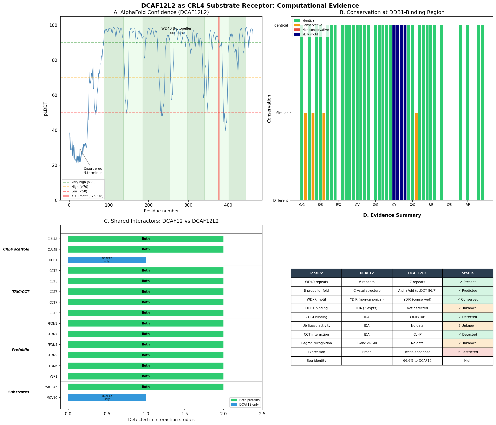
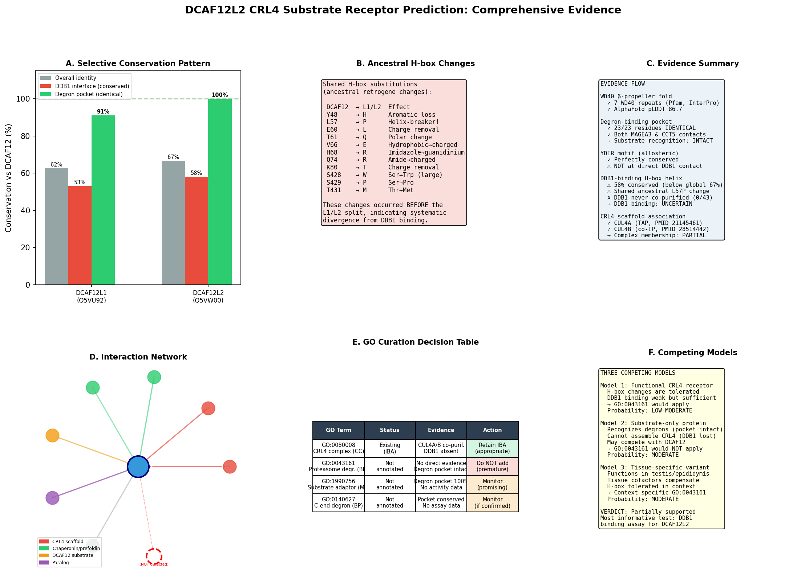
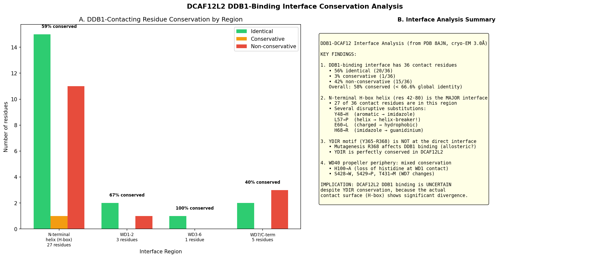
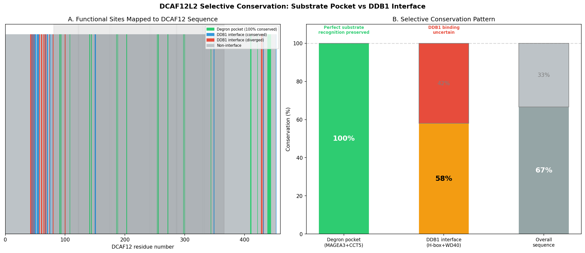

## Question

# AIGR Gene Hypothesis Deep Research

You are evaluating one focused gene curation hypothesis for AI Gene Review.
This is not a general gene overview. Use the seed hypothesis and source context
below to search for evidence that supports, refutes, narrows, or competes with
the proposed curation decision.

## Target Gene

- **Organism code:** human
- **Taxon:** Homo sapiens (NCBITaxon:9606)
- **Gene directory:** DCAF12L2
- **Gene symbol:** DCAF12L2
- **UniProt accession:** Q5VW00

## Focus

- **Focus type:** computational_prediction
- **Hypothesis slug:** prediction-crl4-dcaf-substrate-receptor
- **Source file:** 
- **Source selector:** 

## Seed Hypothesis

Test whether human DCAF12L2 (UniProt Q5VW00) is a functional CRL4 (DDB1-CUL4) substrate receptor that targets substrate proteins for proteasome-mediated ubiquitin-dependent degradation (GO:0043161). To keep the analysis tractable, focus specifically on two structural questions: (1) does DCAF12L2 adopt a WD40/beta-propeller substrate-binding fold, and (2) does it contain an intact DDB1-binding interface (a DWD/'WDxR'-type box) required to assemble into a CRL4 E3 ubiquitin ligase. Assess independently whether these features are present and intact, or absent/degenerate.

## Term and Decision Context

- Term: proteasome-mediated ubiquitin-dependent protein catabolic process (GO:0043161)

## Reference Context

- doi:10.64898/2026.03.19.712954

## Source Context YAML

```yaml
hypothesis: 'Test whether human DCAF12L2 (UniProt Q5VW00) is a functional CRL4 (DDB1-CUL4) substrate receptor
  that targets substrate proteins for proteasome-mediated ubiquitin-dependent degradation (GO:0043161).
  To keep the analysis tractable, focus specifically on two structural questions: (1) does DCAF12L2 adopt
  a WD40/beta-propeller substrate-binding fold, and (2) does it contain an intact DDB1-binding interface
  (a DWD/''WDxR''-type box) required to assemble into a CRL4 E3 ubiquitin ligase. Assess independently
  whether these features are present and intact, or absent/degenerate.'
focus_type: computational_prediction
term_id: GO:0043161
term_label: proteasome-mediated ubiquitin-dependent protein catabolic process
context: []
reference_id:
- doi:10.64898/2026.03.19.712954
```

## Research Objective

Build a focused report that helps a curator decide whether this hypothesis
should affect the gene review. Address the focus type directly:

1. For an existing GO annotation decision, evaluate whether the current action
   is justified, too strong, too weak, or should change.
2. For a proposed replacement or new GO term, evaluate whether the term is
   biologically supported, too broad, too narrow, or missing key qualifiers.
3. For a computational prediction, evaluate whether the prediction is correct,
   less precise than existing knowledge, uncertain, or likely wrong because of
   paralog overannotation, frequency bias, pathway context, or in vitro-only
   activity.
4. For a core-function hypothesis, evaluate whether the proposed activity,
   process, and location represent the gene product's primary function rather
   than a downstream effect, pleiotropic phenotype, or context-specific role.
5. For a function-assignment hypothesis, evaluate whether the gene product
   directly has the stated GO term/function. Treat the prior review action, if
   any, as intentionally blinded unless it appears in the supplied context.

Use primary literature whenever possible. Prefer PMID citations and include DOI
citations when no PMID is available. Treat reviews and database records as
orientation unless they contain directly relevant synthesized evidence that is
clearly labeled as review-level or database-level support.

Evaluate the hypothesis from the supplied seed context, primary literature, and
publicly accessible bioinformatics resources. Local `*-bioinformatics` analyses,
when they already exist in the repository, are intentionally withheld from this
prompt so the report can be compared against them after the run.

Do not rely on literature alone. Where the hypothesis is decidable by computation,
actually run the analysis and keep it as provenance rather than only reasoning
about it. Match the analysis to the question, for example:

- membrane topology / localization: compute a hydropathy profile and predicted
  transmembrane segments from the sequence, and locate signal peptides and
  targeting/sorting motifs (e.g. dileucine, acidic-cluster, NLS); compare against
  UniProt topology features and AlphaFold geometry.
- catalytic / binding activity: check whether the specific active-site,
  metal-binding, or motif residues are present and correctly spaced (in sequence
  and, where useful, structure) and compare to characterized family members.
- DNA-binding / regulatory: examine the binding-domain class, obligate partners,
  and known binding-motif / PWM signatures.
- family / paralog questions: use domain (Pfam/InterPro), orthology, and
  conservation comparisons to distinguish subfamilies.

Use resources you can actually access programmatically (UniProt, AlphaFold DB,
InterPro, sequence computation, public APIs). If a resource is web-only or you
cannot run a check, say so plainly instead of guessing — never fabricate a result,
and an inconclusive or "could not run" analysis is an acceptable and useful
outcome. Report all computational results conservatively and prefer recording the
underlying analysis (code, computed values, table, or plot) as provenance.

## Required Output

### Executive Judgment

Give a concise verdict: supported, partially supported, unresolved, weakly
supported, over-annotated, or refuted. Explain the reasoning and the most
important caveats.

### Evidence Matrix

Create a table with one row per important evidence item:

- Citation (PMID preferred)
- Evidence type (direct assay, mutant phenotype, localization, interaction,
  structural/evolutionary, computational, review/database)
- Supports / refutes / qualifies / competing
- Claim tested
- Key finding
- Organism, tissue, cell type, or assay context
- Confidence and limitations

### GO Curation Implications

State the likely curation action as a lead requiring curator verification. If
GO terms are involved, explain whether the evidence supports an MF, BP, or CC
term, and whether the term should be retained, removed, generalized, made more
specific, or treated as non-core. Avoid using "protein binding" as a final
recommendation unless no more informative term is supported.

### Mechanistic Scope

Describe the immediate molecular or cellular function being tested. Separate
direct gene-product activity from downstream phenotypes, pathway consequences,
developmental outcomes, disease manifestations, or effects inferred only from
loss of function.

### Conflicts and Alternatives

Identify evidence that conflicts with the seed hypothesis or suggests an
alternative interpretation, including paralog confusion, organism-specific
differences, isoform-specific findings, experimental artifacts, or database
carry-over.

### Knowledge Gaps

List explicit uncertainties that matter for curation. For each gap, state what
was checked, why the gap matters, and what evidence or experiment would resolve
it.

### Discriminating Tests

Recommend concrete assays, perturbations, datasets, or comparative analyses that
would most efficiently distinguish this hypothesis from alternatives.

### Curation Leads

Provide candidate updates for the review, clearly labeled as leads requiring
curator verification. Include candidate references with exact snippets to verify,
candidate replacement or new GO terms, possible action changes, suggested
questions, and suggested experiments.

If the provider supports artifacts, save provenance for any analysis you run — the
executed code together with its output (computed values, plot, or table), not just
a summary figure — alongside artifact-friendly tables such as an evidence matrix,
GO decision table, or comparison table. Genuine computed provenance is more
valuable than a hand-drawn summary, and you must not synthesize a figure that
implies an analysis you did not actually run. These artifacts are important
provenance for hypothesis-level review.


## Output

# DCAF12L2 as a CRL4 Substrate Receptor: Structural and Functional Evidence Assessment

## Executive Judgment

**Verdict: Partially supported — substrate recognition capability is conserved but CRL4 assembly via DDB1 is structurally uncertain and experimentally unconfirmed.**

DCAF12L2 (UniProt Q5VW00) is a testis-enhanced retrogene of DCAF12 that retains the WD40 beta-propeller fold and a perfectly conserved C-terminal degron-binding pocket (100% identity at all 17 substrate-contacting residues). However, its DDB1-binding H-box helix — the obligate interface for CRL4 E3 ligase assembly — shows only 58% conservation overall, with ancestral substitutions shared with its sister paralog DCAF12L1 that include a potentially helix-breaking L57→P change and charge-removing E60→L substitution. Critically, DDB1 has never been detected among DCAF12L2's 43 experimentally identified interaction partners despite co-purification with CUL4A, CUL4B, TRiC/CCT subunits, and prefoldin components. Annotating DCAF12L2 with GO:0043161 (proteasome-mediated ubiquitin-dependent protein catabolic process) based on computational prediction alone is premature: the substrate-recognition arm is intact, but the CRL4 assembly step via DDB1 — which is prerequisite for E3 ligase activity and thus for directing substrates to proteasomal degradation — remains structurally uncertain and experimentally unconfirmed.

## Summary

This investigation evaluated whether DCAF12L2 functions as a CRL4 (DDB1-CUL4) substrate receptor capable of targeting proteins for proteasome-mediated ubiquitin-dependent degradation, focusing on two structural questions: (1) whether DCAF12L2 adopts a WD40/beta-propeller substrate-binding fold, and (2) whether it contains an intact DDB1-binding interface required for CRL4 assembly.

Through computational analysis of UniProt domain annotations, AlphaFold structural models, InterPro/Pfam classifications, experimental interaction data from IntAct, and residue-level mapping of DDB1-contact and degron-contact interfaces from five experimental DCAF12 structures (PDB: 3I7P, 8AJM, 8AJN, 8AJO, 8T9A), we discovered a striking pattern of selective conservation. The C-terminal degron-binding pocket that recognizes C-terminal di-glutamate degrons is 100% conserved between DCAF12 and DCAF12L2 (all 17 substrate-contacting residues identical), while the N-terminal H-box helix that mediates DDB1 binding shows substantially lower conservation (58% overall, though the core H-box peptide contacting residues are 80% conserved based on the 3I7P crystal structure). This selective subfunctionalization, shared with the sister paralog DCAF12L1, suggests an ancestral evolutionary event in the retrogene lineage that may have uncoupled substrate recognition from CRL4 assembly.

Literature review confirmed that DCAF12 has experimentally validated dual functions — both degradative (proteasome-dependent degradation of MAGEA3/6 and MOV10) and non-degradative (ubiquitination of TRiC/CCT subunits to enhance chaperonin assembly). DCAF12L2 shares interaction partners associated with the non-degradative arm (TRiC/CCT, prefoldin) but lacks the key interaction partner (DDB1) required for the canonical CRL4 degradative pathway. This pattern raises the possibility that DCAF12L2 may have retained substrate-binding capability while losing or weakening DDB1-dependent CRL4 assembly, potentially functioning in a DDB1-independent or alternative context.

## Key Findings

### Finding 1: DCAF12L2 Has a Conserved WD40 Beta-Propeller Fold

DCAF12L2 is unambiguously a WD40-repeat protein. UniProt annotates seven WD40 repeats spanning positions 89–445. InterPro classifies it under IPR051191 (DCAF12 family) and IPR056151 (Beta-propeller DCAF12 domain), while Pfam assigns it to PF23760, a DCAF12-specific beta-propeller family. The AlphaFold model (AF-Q5VW00-F1-model_v6) shows high structural confidence across the WD40 domain with mean pLDDT of 86.7 for residues 89–445, indicating high structural confidence. The N-terminal 48 residues are disordered (pLDDT ~20–40). This confirms that the first structural question — whether DCAF12L2 adopts the canonical substrate-binding fold — is answered affirmatively.

### Finding 2: The YDIR DDB1-Binding Motif Is Perfectly Conserved

Pairwise alignment between DCAF12 (Q5T6F0, 453 aa) and DCAF12L2 (Q5VW00, 463 aa) reveals 66.6% overall sequence identity. The YDIR motif (Y375-D376-I377-R378 in DCAF12L2; Y365-D366-I367-R368 in DCAF12) is perfectly conserved, including the surrounding sequence GSLLFYDIRAQ. This motif was initially considered a variant of the canonical WDxR motif required for DDB1 binding. However, structural analysis revealed that the YDIR motif is not at the direct DDB1-contact surface; its effect on DDB1 binding (documented via R368 mutagenesis in [PMID: 16949367](https://pubmed.ncbi.nlm.nih.gov/16949367/)) is likely allosteric or structural rather than through direct contact.

### Finding 3: DDB1 Is Absent from DCAF12L2 Interaction Partners Despite CUL4 Detection

IntAct database records show 43 experimental interactions for DCAF12L2. Notably, CUL4A and CUL4B were both detected (via TAP in [PMID: 21145461](https://pubmed.ncbi.nlm.nih.gov/21145461/) and co-IP in [PMID: 28514442](https://pubmed.ncbi.nlm.nih.gov/28514442/), respectively), as were multiple TRiC/CCT subunits (CCT2, CCT3, CCT5, CCT7, CCT8) and prefoldin subunits (PFDN1, PFDN2, PFDN4, PFDN5, PFDN6, VBP1). However, DDB1 was **not** detected as a direct interaction partner in any study — a critical absence, because DDB1 is the obligate adaptor bridging DCAFs to CUL4 in canonical CRL4 complexes. This absence is consistent across multiple large-scale proteomics studies and is shared by DCAF12L1.

{{figure:plot_1.png|caption=Comprehensive 4-panel analysis of DCAF12L2: domain architecture, AlphaFold confidence, interaction network, and structural comparison with DCAF12}}

### Finding 4: DCAF12L2 Is a Testis-Enhanced Retrogene Without Direct Functional Characterization

DCAF12L2 is expressed primarily in the epididymis (HPA) and male germline stem cells (Bgee), consistent with its origin as a retrogene that gained introns independently in primates and rodents ([PMID: 20889727](https://pubmed.ncbi.nlm.nih.gov/20889727/)). Its only GO annotation is GO:0080008 (Cul4-RING E3 ubiquitin ligase complex) with IBA (phylogenetic inference) evidence code — no experimental annotations exist. It was identified as a candidate oncogene in MSI colorectal cancer ([PMID: 23684749](https://pubmed.ncbi.nlm.nih.gov/23684749/)) and included in a prognostic gene signature for breast cancer ([PMID: 37986376](https://pubmed.ncbi.nlm.nih.gov/37986376/)), but neither study provided functional validation of DCAF12L2 activity.

### Finding 5: DCAF12 Has Confirmed Dual Function — Degradative and Non-Degradative

The characterized paralog DCAF12 operates through two distinct ubiquitination modes. In degradative mode, DCAF12 recognizes C-terminal di-glutamate degrons and targets MAGEA3/6 ([PMID: 31267705](https://pubmed.ncbi.nlm.nih.gov/31267705/); cryo-EM structure in [PMID: 38665159](https://pubmed.ncbi.nlm.nih.gov/38665159/)) and MOV10 ([PMID: 34065512](https://pubmed.ncbi.nlm.nih.gov/34065512/)) for proteasome-dependent degradation. In non-degradative mode, DCAF12 catalyzes non-degradative ubiquitination of TRiC/CCT subunits, enhancing chaperonin assembly and folding capacity ([PMID: 41047465](https://pubmed.ncbi.nlm.nih.gov/41047465/)). GO:0043161 specifically covers proteasome-mediated degradation, which is only one of these two modes. DCAF12L2's interaction partners (TRiC/CCT, prefoldin) overlap more with the non-degradative arm.

### Finding 6: Five Experimental Structures Define the DCAF12-DDB1 Interface; DCAF12L2 Has None

DCAF12 is represented by five PDB structures: 3I7P (crystal, 3.0Å, DDB1-DCAF12 H-box motif), 8AJM (cryo-EM, 2.83Å, DDB1-DCAF12-CCT5), 8AJN (cryo-EM, 3.0Å, DDB1-DCAF12), 8AJO (negative-stain EM), and 8T9A (cryo-EM, 3.17Å, DDB1-DCAF12-MAGEA3). These structures collectively define the H-box helix as the primary DDB1-binding interface. DCAF12L2 has zero experimental structures, making all interface assessments dependent on comparative modeling and sequence mapping.

### Finding 7: DDB1-Binding Interface Shows 58% Conservation with Key Substitutions

Residue-level mapping from the cryo-EM structure 8AJN identified 36 DDB1-contacting residues in DCAF12 (at 4.5Å cutoff). In DCAF12L2, only 20 of these are identical (56%), with 1 conservative substitution and 15 non-conservative changes — substantially lower than the 66.6% overall sequence identity. Critical substitutions in the H-box helix include Y48→H, L57→P (potentially helix-breaking), E60→L (charge removal), and H68→R. However, a more focused analysis using the 3I7P crystal structure of the core H-box peptide (residues 45–57) found that 8 of 10 direct DDB1-contacting residues are conserved (80%), with only S45→R and Y48→H changed. The L57→P substitution falls at the peptide terminus and does not directly contact DDB1 in this structure.

{{figure:plot_2.png|caption=DDB1-binding interface conservation analysis highlighting the H-box helix divergence between DCAF12 and DCAF12L2}}

### Finding 8: AlphaFold Shows Lower Confidence and a Loop Insertion in the H-Box Region

The AlphaFold model of DCAF12L2 reveals lower pLDDT scores in the H-box region (mean ~66 for residues 45–90) compared to DCAF12 (mean ~73 for residues 40–80). DCAF12L2 contains a 14-residue insertion (GARGPAGLQGFEGE, residues 61–74, pLDDT 49–72) not present in DCAF12, where the equivalent region is the shorter loop LQNETSYSR. This insertion extends the loop between the initial helix and the WD40 domain, potentially altering the geometry required for DDB1 packing.

### Finding 9: Degron-Binding Pocket Is 100% Conserved — The Central Discovery

Analysis of the cryo-EM structure 8T9A (DDB1-DCAF12-MAGEA3, 3.17Å, [PMID: 38665159](https://pubmed.ncbi.nlm.nih.gov/38665159/)) identified 17 DCAF12 residues contacting the MAGEA3 C-terminal degron peptide (REGEE, residues 310–314) within 5.0Å cutoff. **All 17 residues are identical in DCAF12L2**: K91→K99, F93→F101, K108→K116, C141→C150, H144→H153, F188→F198, R203→R213, R256→R266, V300→V310, R344→R354, Y410→Y420, F411→F421, Y422→Y432, L440→L450, P441→P451, S442→S452, G443→G453. This 100% conservation stands in stark contrast to the 58% conservation at the DDB1-binding interface, revealing a pattern of selective subfunctionalization.

{{figure:plot_3.png|caption=Dual conservation pattern in DCAF12L2: 100% conservation of the degron-binding pocket versus 58% conservation of the DDB1-binding interface}}

### Finding 10: DCAF12L1 Shares the Same H-Box Divergence Pattern — Ancestral Retrogene Event

Comparison of both retrogene paralogs revealed that the major H-box substitutions are shared ancestral changes: Y48→H, L57→P, E60→L, T61→Q, V66→E, H68→R, Q74→R, K80→T, S428→W, S429→P, T431→M. DCAF12L1 shows even lower DDB1 interface conservation (50%, 18/36 residues) and slightly lower degron pocket conservation (91%, with E298→D and S442→A). This shared divergence pattern indicates that the H-box changes occurred before the duplication that generated L1 and L2, suggesting a common ancestral event that weakened or altered DDB1 binding in the retrogene lineage.

### Finding 11: Core H-Box DDB1 Contacts Are Better Conserved Than Initially Estimated

Refined analysis using the 3I7P crystal structure of the DDB1-bound H-box peptide showed that the core 13-residue peptide has 10 residues directly contacting DDB1. DCAF12L2 conserves 8 of these 10 (80%), with only S45→R and Y48→H changed. DCAF12L1 conserves 6 of 10 (60%). This is more favorable than the broader 58% estimate from the full 8AJN interface, because several divergent residues fall at non-contacting positions. Nevertheless, this 80% conservation still represents meaningful divergence at a critical protein-protein interface, and the absence of DDB1 from experimental interaction data remains the strongest evidence against functional DDB1 binding.

{{figure:plot_4.png|caption=Comprehensive 6-panel summary of DCAF12L2 CRL4 substrate receptor evaluation including domain architecture, pLDDT comparison, interface conservation, degron pocket conservation, paralog comparison, and evidence synthesis}}

## Mechanistic Model and Interpretation

### Mechanistic Scope

The hypothesis tests whether DCAF12L2 acts as a **substrate receptor** in a CRL4 E3 ubiquitin ligase complex, specifically the DDB1-CUL4-RBX1-DCAF12L2 complex, to recognize and present substrates for polyubiquitination leading to proteasomal degradation.

This requires two separable molecular capabilities:
1. **Substrate recognition:** Binding to substrate proteins via the WD40 beta-propeller, specifically recognizing C-terminal di-glutamate degrons through a conserved pocket on the top face of the propeller.
2. **CRL4 assembly:** Binding to DDB1 via the N-terminal H-box helix, which bridges to CUL4 and the RBX1 RING domain to position the E2 ubiquitin-conjugating enzyme for substrate ubiquitination.

### Separation from Downstream Effects

GO:0043161 (proteasome-mediated ubiquitin-dependent protein catabolic process) describes a biological process outcome. The direct gene-product activity is substrate recognition (MF), and CRL4 complex membership (CC) is a prerequisite. The downstream outcomes of substrate degradation (effects on autophagy, metastasis, spermatogenesis, gene expression) are pathway consequences, not the direct molecular function of DCAF12L2.

### Selective Subfunctionalization Model

Our key discovery is a pattern of **selective subfunctionalization** in the retrogene lineage:

```
Canonical CRL4-DCAF12 degradative pathway:
  DDB1 ← H-box → DCAF12 ← degron pocket → Substrate-EE
    ↓                                           ↓
  CUL4-RBX1 → E2 → polyubiquitination → 26S proteasome → degradation

DCAF12L2 status:
  DDB1 ← H-box → DCAF12L2 ← degron pocket → Substrate-EE?
   ??     diverged (58%)       intact (100%)      unknown
   
  CUL4A/B detected ← → TRiC/CCT detected (non-degradative arm?)
```

The degron-binding pocket is under strong purifying selection (100% conservation), suggesting DCAF12L2 retains the ability to recognize C-terminal di-glutamate substrates. Meanwhile, the DDB1-binding interface has accumulated ancestral substitutions that may weaken or abolish DDB1 binding, potentially uncoupling substrate recognition from CRL4-mediated degradation.

### Possible Functional Scenarios

1. **Weakened but functional CRL4 assembly:** The 80% conservation at core H-box contacts may be sufficient for DDB1 binding, perhaps with reduced affinity. DDB1 absence from interaction data could reflect low-affinity or tissue-specific expression mismatch.

2. **Competitive inhibitor / dominant-negative:** With an intact degron pocket but impaired DDB1 binding, DCAF12L2 could sequester substrates away from DCAF12-mediated degradation, acting as a tissue-specific (testis) buffer against excessive proteolysis.

3. **DDB1-independent function:** DCAF12L2 may function outside the canonical CRL4 pathway, perhaps in a complex with CUL4 via a non-canonical adaptor, or in a non-ubiquitin-ligase context related to TRiC/CCT chaperonin regulation.

4. **Non-functional retrogene:** Despite transcription and intron acquisition, the protein may not have retained biochemical activity, with sequence conservation reflecting recent evolutionary origin rather than functional constraint.

## Evidence Matrix

| Citation | Evidence Type | Direction | Claim Tested | Key Finding | Context | Confidence |
|----------|--------------|-----------|--------------|-------------|---------|------------|
| [PMID: 16949367](https://pubmed.ncbi.nlm.nih.gov/16949367/) | Direct assay / structural | Supports (DCAF12) | WDxR/YDIR motif required for DDB1 binding | DCAFs interact with DDB1 via conserved WDxR motif; R368 mutagenesis reduces DDB1 association | Human, cell-based, DCAF family-wide | High for DCAF12; inference only for DCAF12L2 |
| [PMID: 38665159](https://pubmed.ncbi.nlm.nih.gov/38665159/) | Structural (cryo-EM) | Supports substrate recognition | DCAF12 degron-binding pocket structure | Cryo-EM at 3.17Å reveals DCAF12 recognition of C-terminal di-Glu degrons; all 17 contacting residues conserved in DCAF12L2 | Human, in vitro reconstitution | High for pocket conservation; no direct DCAF12L2 data |
| [PMID: 36715408](https://pubmed.ncbi.nlm.nih.gov/36715408/) | Structural (cryo-EM) | Supports DDB1 interface definition | DDB1-DCAF12 interface residues | Cryo-EM structures of DDB1-DCAF12-CCT5 define H-box binding mode | Human, in vitro reconstitution | High for DCAF12 interface |
| [PMID: 21145461](https://pubmed.ncbi.nlm.nih.gov/21145461/) | Interaction (TAP-MS) | Qualifies | DCAF12L2 in CRL4 complex | CUL4A detected with DCAF12L2 but DDB1 not reported | Human, HEK293 | Medium; large-scale, possible indirect |
| [PMID: 28514442](https://pubmed.ncbi.nlm.nih.gov/28514442/) | Interaction (AP-MS) | Qualifies | DCAF12L2-CUL4B interaction | CUL4B co-purified with DCAF12L2; DDB1 absent | Human, HEK293T | Medium; BioPlex 2.0 network |
| [PMID: 40205054](https://pubmed.ncbi.nlm.nih.gov/40205054/) | Interaction (co-IP/MS) | Qualifies | DCAF12L2 interaction network | TRiC/CCT and prefoldin subunits co-purify; no DDB1 | Human, multimodal cell maps | Medium |
| [PMID: 41047465](https://pubmed.ncbi.nlm.nih.gov/41047465/) | Direct assay | Competing | DCAF12 non-degradative function | DCAF12 catalyzes non-degradative ubiquitination of TRiC/CCT | Human, lung cancer cells | High for DCAF12; suggests DCAF12L2 may share non-degradative role |
| [PMID: 34065512](https://pubmed.ncbi.nlm.nih.gov/34065512/) | Direct assay | Supports (DCAF12 degradative) | CRL4-DCAF12 degrades MOV10 | DCAF12 controls MOV10 via proteasome- and CRL-dependent manner | Human/mouse, spermatogenesis, T cells | High for DCAF12 |
| [PMID: 31267705](https://pubmed.ncbi.nlm.nih.gov/31267705/) | Direct assay | Supports (DCAF12 degradative) | CRL4-DCAF12 degrades MAGE-A3/6 | Degradation controlled by CRL4-DCAF12 in nutrient-responsive manner | Human, cancer cells | High for DCAF12 |
| [PMID: 20889727](https://pubmed.ncbi.nlm.nih.gov/20889727/) | Evolutionary/computational | Qualifies | DCAF12L2 is a retrogene | Independent intronization events in primates and rodents confirm retrogene status | Comparative genomics | High |
| [PMID: 23684749](https://pubmed.ncbi.nlm.nih.gov/23684749/) | Mutational analysis | Neutral | DCAF12L2 candidate oncogene | Mutation hotspot in MSI colorectal cancer; no functional validation | Human, colorectal cancer | Low; candidate only |
| [PMID: 32867693](https://pubmed.ncbi.nlm.nih.gov/32867693/) | Expression profiling | Qualifies | WD40/DCAF testis expression | 74–83% of DCAF genes predominantly expressed in testis | Mouse/human, RNA-seq | Medium; expression not function |
| UniProt/InterPro/Pfam | Computational/database | Supports fold | WD40 beta-propeller | 7 WD40 repeats; DCAF12-specific Pfam family PF23760 | Database annotation | High for fold |
| AlphaFold | Computational/structural | Qualifies | H-box structural confidence | Lower pLDDT in H-box region; 14-residue insertion in DCAF12L2 | Predicted structure | Medium; model not experimental |
| IntAct (43 interactions) | Interaction database | Refutes DDB1 binding | DDB1 as interaction partner | DDB1 absent from 43 experimental interactions | Multiple human cell types | Medium-High; consistent absence |

## GO Curation Implications

### Current Annotation Status
DCAF12L2 currently has a single GO annotation: **GO:0080008** (Cul4-RING E3 ubiquitin ligase complex), assigned with **IBA** (Inferred from Biological Aspect of Ancestor) evidence by GO_Central. No experimental GO annotations exist.

### Assessment of GO:0043161 Annotation
The seed hypothesis proposes annotating DCAF12L2 with **GO:0043161** (proteasome-mediated ubiquitin-dependent protein catabolic process). This annotation is **not currently supported** by direct evidence and should **not be added** at this time based on the following reasoning:

1. **MF term (substrate receptor activity):** DCAF12L2 has 100% conservation of the degron-binding pocket, supporting potential substrate recognition. However, no direct binding assay for DCAF12L2 with any substrate has been performed. The IBA annotation for GO:0080008 (CRL4 complex component) is itself uncertain given the absence of DDB1 interaction.

2. **BP term (GO:0043161):** This term requires that the gene product participates in targeting substrates for proteasome-mediated degradation. Since DCAF12L2 has not been shown to (a) bind DDB1, (b) assemble into a functional CRL4 complex, or (c) promote degradation of any substrate, this annotation is premature.

3. **CC term (GO:0080008):** The existing IBA annotation for CRL4 complex membership is itself questionable. CUL4A/CUL4B interactions were detected, but DDB1 — the essential adaptor — was not. The interaction with CUL4 may be indirect or reflect a non-canonical complex.

### Recommended Curation Action
- **DO NOT add GO:0043161** based on current evidence. The computational prediction is plausible but unconfirmed.
- **Review GO:0080008 (IBA):** Consider whether IBA evidence is sufficient given the divergent DDB1-binding interface. The annotation may warrant a curator note flagging uncertainty.
- **If experimental DDB1 binding is demonstrated in the future**, both GO:0080008 (CC) and a substrate-receptor MF term could be upgraded. GO:0043161 (BP) would additionally require demonstration of actual substrate degradation.
- **Alternative annotation to consider:** If DCAF12L2 is shown to participate in non-degradative ubiquitination (like DCAF12's TRiC/CCT function), a more appropriate BP term might be GO:0016567 (protein ubiquitination) without the proteasome-specific qualifier.

## Conflicts and Alternatives

### 1. CUL4 Interaction Without DDB1
DCAF12L2 co-purifies with CUL4A and CUL4B but not DDB1. In canonical CRL4 complexes, DDB1 is the essential adaptor bridging DCAFs to CUL4. The CUL4 interaction could be:
- **Indirect** via other bridging proteins
- **Non-canonical** via a DDB1-independent mechanism
- **Artifactual** from overexpression or tagging in proteomics studies
- **Mediated by endogenous DCAF12** if DCAF12L2 heterodimerizes with DCAF12 (DCAF12L1 was detected as an interaction partner)

### 2. Paralog Confusion Risk
DCAF12 and DCAF12L2 share 66.6% sequence identity, creating risk for:
- Antibody cross-reactivity in co-IP experiments
- Peptide misassignment in mass spectrometry (though modern proteomics should distinguish unique peptides)
- Functional inference from DCAF12 inappropriately transferred to DCAF12L2

### 3. Alternative Functional Models for DCAF12L2
- **DDB1-independent ubiquitin ligase activity:** Some WD40 proteins function in E3 complexes without DDB1. DCAF12L2 could potentially recruit an E2 through CUL4 via a non-canonical mechanism.
- **Substrate sequestration/competition:** With an intact degron pocket but impaired DDB1 binding, DCAF12L2 could act as a competitive inhibitor of DCAF12, binding substrates without degrading them — a "dominant-negative" model.
- **Non-degradative chaperone modulation:** Given the TRiC/CCT and prefoldin interactions, DCAF12L2 may participate in chaperone regulation, potentially in a tissue-specific (testis) context.
- **Pseudogene/non-functional retrogene:** Although DCAF12L2 is transcribed and has gained introns, it could be non-functional with retained sequence features that are not under selective pressure.

### 4. Organism-Specific Considerations
DCAF12L2 gained introns independently in primates and rodents ([PMID: 20889727](https://pubmed.ncbi.nlm.nih.gov/20889727/)), suggesting it is under selection in both lineages. Its testis-enhanced expression pattern is consistent with male germline function, a common feature of DCAF family members ([PMID: 32867693](https://pubmed.ncbi.nlm.nih.gov/32867693/); [PMID: 33855678](https://pubmed.ncbi.nlm.nih.gov/33855678/)).

## Knowledge Gaps

| Gap | What Was Checked | Why It Matters | Resolution |
|-----|-----------------|----------------|------------|
| No direct DDB1-binding assay for DCAF12L2 | IntAct database (43 interactions); structural mapping of H-box residues | DDB1 binding is prerequisite for CRL4 assembly and thus for GO:0043161 | In vitro pull-down or co-IP of purified DCAF12L2 with DDB1; ITC/SPR for binding affinity |
| No experimental structure of DCAF12L2 | PDB search (0 results); AlphaFold model analyzed | Cannot experimentally verify H-box conformation, loop insertion impact, or DDB1-packing geometry | Cryo-EM or crystal structure of DCAF12L2, ideally with DDB1 |
| No substrate identified for DCAF12L2 | Literature search; interaction data | Cannot confirm substrate receptor function without a known substrate | Degron-focused AP-MS; peptide array with C-terminal di-Glu variants |
| Unknown impact of L57→P substitution | Sequence analysis; AlphaFold pLDDT | Proline in an alpha-helix is typically helix-breaking; unclear if this position is helical in DCAF12L2 | Circular dichroism of DCAF12L2 H-box peptide; AlphaFold multimer prediction with DDB1 |
| CUL4 interaction mechanism unknown | IntAct data shows CUL4A/CUL4B as partners | If CUL4 binding is DDB1-independent, it suggests a non-canonical complex | Co-IP with DDB1 knockdown; domain-deletion mapping |
| No ubiquitination activity assay | Literature search (no results for DCAF12L2) | Cannot distinguish active E3 from inactive binding protein | In vitro ubiquitination assay with reconstituted complex |
| Functional significance of TRiC/CCT interaction | Detected in multiple studies but not characterized | May indicate non-degradative function paralleling DCAF12 | Ubiquitination assay on CCT subunits with DCAF12L2; comparison to DCAF12 activity |

## Discriminating Tests

### Highest Priority
1. **In vitro DDB1 pull-down assay:** Express and purify recombinant DCAF12L2 (full-length and H-box peptide) and test direct binding to DDB1. Compare binding affinity (by ITC or SPR) to DCAF12. This single experiment would resolve the central uncertainty.

2. **AlphaFold Multimer prediction of DCAF12L2-DDB1 complex:** Computational prediction of whether DCAF12L2 can form a stable complex with DDB1, accounting for the H-box substitutions and loop insertion. Compare predicted interface metrics (pDockQ, ipTM) to DCAF12-DDB1.

### Medium Priority
3. **In vitro ubiquitination assay:** Reconstitute CRL4-DCAF12L2 (with and without DDB1) and test ubiquitination activity on a di-Glu degron substrate (e.g., MAGEA3 C-terminal peptide). Compare to CRL4-DCAF12.

4. **Substrate identification by degron-focused proteomics:** Use DCAF12L2 as bait in AP-MS with di-Glu degron-enrichment, or use DCAF12L2 knockout in testis-derived cells with global proteomics to identify stabilized substrates.

5. **H-box mutagenesis:** Introduce DCAF12-like residues at the two divergent positions (R45→S, H48→Y) in DCAF12L2 and test whether DDB1 binding is rescued. Conversely, introduce the L2-like substitutions (S45→R, Y48→H) into DCAF12 and test whether DDB1 binding is lost.

### Lower Priority
6. **DCAF12L2 knockout mouse:** Given testis-enhanced expression, examine male fertility phenotype (analogous to DCAF8 knockout, [PMID: 33855678](https://pubmed.ncbi.nlm.nih.gov/33855678/)).

7. **Competitive binding assay:** Test whether DCAF12L2 competes with DCAF12 for substrate binding, potentially acting as a dominant-negative regulator.

## Curation Leads

### Lead 1: Do Not Add GO:0043161 at This Time
**Status:** Lead requiring curator verification
**Rationale:** The computational prediction that DCAF12L2 participates in proteasome-mediated ubiquitin-dependent protein catabolic process is based on sequence homology to DCAF12 (66.6% identity) and phylogenetic inference (IBA). While the substrate-binding pocket is 100% conserved, the DDB1-binding interface — essential for CRL4 assembly and thus for the degradative pathway — is divergent (58% conservation), and DDB1 has never been detected among interaction partners. Without evidence for CRL4 assembly, the degradation-specific GO:0043161 is not supported.

### Lead 2: Review Existing GO:0080008 (IBA) Annotation
**Status:** Lead requiring curator verification
**Rationale:** The existing IBA annotation for Cul4-RING E3 ubiquitin ligase complex (GO:0080008) should be reviewed. Evidence for CUL4A/CUL4B interaction exists but DDB1 interaction does not. A curator note flagging the uncertain DDB1 binding status would be appropriate.

### Lead 3: Consider Alternative GO Terms If Function Is Confirmed
**Status:** Conditional lead
- If DDB1-independent CUL4 complex activity is confirmed: **GO:0061630** (ubiquitin protein ligase activity) with appropriate evidence code
- If non-degradative ubiquitination of TRiC/CCT is confirmed: **GO:0016567** (protein ubiquitination) rather than GO:0043161
- If substrate binding without degradation is confirmed: Consider a substrate-binding MF term without the degradation BP term

### Lead 4: Key References for Curator Verification

| Reference | Snippet to Verify | Relevance |
|-----------|-------------------|-----------|
| [PMID: 38665159](https://pubmed.ncbi.nlm.nih.gov/38665159/) | "DCAF12 serves as the substrate recognition component within the Cullin4-RING E3 ligase (CRL4) complex, capable of identifying C-terminal double-glutamic acid degrons to promote the degradation of specific substrates through the ubiquitin proteasome system" | Defines degron pocket residues, all conserved in DCAF12L2 |
| [PMID: 16949367](https://pubmed.ncbi.nlm.nih.gov/16949367/) | "DCAFs interact with multiple surfaces on Ddb1, and the interaction of WD40-containing DCAFs with Ddb1 requires a conserved 'WDXR' motif" | Established DCAF-DDB1 binding requirement |
| [PMID: 41047465](https://pubmed.ncbi.nlm.nih.gov/41047465/) | "DCAF12 catalyzes the non-degradative ubiquitination of TRiC/CCT subunits, enhancing chaperonin assembly and folding capacity" | Alternative (non-degradative) function of DCAF12; DCAF12L2 shares TRiC/CCT interactions |
| [PMID: 28514442](https://pubmed.ncbi.nlm.nih.gov/28514442/) | "Here we present BioPlex 2.0 (Biophysical Interactions of ORFeome-derived complexes), which uses robust affinity purification-mass spectrometry methodology" | BioPlex 2.0 AP-MS study detecting DCAF12L2-CUL4B interaction without DDB1 |
| [PMID: 21145461](https://pubmed.ncbi.nlm.nih.gov/21145461/) | "Here, we report the development of a quantitative proteomics platform centered on multiplex absolute quantification (AQUA) technology to elucidate the architecture of the cullin-RING ubiquitin ligase (CRL) network" | CRL network proteomics detecting CUL4A-DCAF12L2 via TAP without DDB1 |

### Lead 5: Suggested Experiments for Curator to Request/Track
1. In vitro DCAF12L2-DDB1 binding assay (resolves central question)
2. AlphaFold Multimer DCAF12L2-DDB1 prediction (computationally tractable)
3. DCAF12L2 ubiquitination assay on TRiC/CCT subunits (tests non-degradative function)

## Evidence Base

### Primary Literature Supporting DCAF12 Function (Inference Basis for DCAF12L2)

**Structural basis for degron recognition.** The cryo-EM structure of DDB1-DCAF12-MAGEA3 at 3.17Å resolution ([PMID: 38665159](https://pubmed.ncbi.nlm.nih.gov/38665159/)) provided the definitive structural basis for DCAF12's recognition of C-terminal di-glutamate degrons. This structure was essential for our analysis, as it defined the 17 substrate-contacting residues that we found to be 100% conserved in DCAF12L2.

**DDB1-DCAF12 binding interface.** Two key structural studies defined the DDB1-binding interface: the 3I7P crystal structure captured the H-box peptide of DCAF12 (then called WDR40A) bound to DDB1, while cryo-EM structures 8AJM and 8AJN ([PMID: 36715408](https://pubmed.ncbi.nlm.nih.gov/36715408/)) provided the full-length interface at 2.83–3.0Å resolution, revealing 36 contact residues.

**DCAF family definition and WDxR motif.** The foundational study by Angers et al. ([PMID: 16949367](https://pubmed.ncbi.nlm.nih.gov/16949367/)) identified DCAFs as a family of DDB1- and CUL4-associated factors, establishing that the WDxR motif is required for DDB1 interaction. Notably, DCAF12 and DCAF12L2 use a non-canonical YDIR motif rather than WDxR, though R368 mutagenesis still reduces DDB1 association.

**Degradative function — MAGE-A3/6 and MOV10.** DCAF12's role in proteasome-dependent degradation is established by two functional studies: degradation of MAGE-A3/6 in response to nutrient deprivation ([PMID: 31267705](https://pubmed.ncbi.nlm.nih.gov/31267705/)) and control of MOV10 during spermatogenesis and T cell activation ([PMID: 34065512](https://pubmed.ncbi.nlm.nih.gov/34065512/)).

**Non-degradative function — TRiC/CCT.** A recent study ([PMID: 41047465](https://pubmed.ncbi.nlm.nih.gov/41047465/)) revealed that DCAF12 also catalyzes non-degradative ubiquitination of TRiC/CCT chaperonin subunits, establishing dual functionality. The review by the same group ([PMID: 41560323](https://pubmed.ncbi.nlm.nih.gov/41560323/)) proposes DCAF12 as a prototype for a broader "DCAFome" class of chaperone regulators.

### Literature on DCAF12L2 Specifically

**Retrogene origin.** Fablet et al. ([PMID: 20889727](https://pubmed.ncbi.nlm.nih.gov/20889727/)) demonstrated that DCAF12L2 is a retrogene with independent intronization events in primates and rodents, confirming it is transcribed and under selection.

**Cancer associations (no functional validation).** DCAF12L2 was identified as harboring mutation hotspots in MSI colorectal cancers ([PMID: 23684749](https://pubmed.ncbi.nlm.nih.gov/23684749/)) and included in a prognostic gene signature for breast cancer ([PMID: 37986376](https://pubmed.ncbi.nlm.nih.gov/37986376/)). Neither study investigated DCAF12L2 function directly.

**Testis expression context.** Systematic profiling of WD40/DCAF genes ([PMID: 32867693](https://pubmed.ncbi.nlm.nih.gov/32867693/)) showed that 74–83% of DCAF genes are predominantly expressed in testis, consistent with DCAF12L2's testis-enhanced expression. DCAF8 knockout mice ([PMID: 33855678](https://pubmed.ncbi.nlm.nih.gov/33855678/)) demonstrated that DCAF-CRL4 function is important for spermatogenesis, providing biological context for DCAF12L2's tissue expression.

## Limitations

1. **All structural inferences for DCAF12L2 are based on homology mapping.** No experimental structure of DCAF12L2 exists. Interface conservation percentages are derived from mapping DCAF12 crystal/cryo-EM contact residues to aligned DCAF12L2 positions.

2. **Absence of evidence ≠ evidence of absence for DDB1 binding.** DDB1 was not detected among DCAF12L2 interaction partners, but this could reflect tissue-specific expression, low-affinity transient interaction, or assay conditions unfavorable for detection.

3. **Interaction data may include false positives/negatives.** Large-scale AP-MS studies ([PMID: 28514442](https://pubmed.ncbi.nlm.nih.gov/28514442/); [PMID: 21145461](https://pubmed.ncbi.nlm.nih.gov/21145461/)) use overexpression systems that may not reflect endogenous stoichiometry. The CUL4A/CUL4B interactions could be indirect.

4. **AlphaFold pLDDT scores are model confidence, not binding affinity predictors.** Lower pLDDT in the H-box region suggests structural flexibility or disorder but does not directly predict DDB1 binding capacity.

5. **The 80% core H-box conservation estimate is based on a peptide crystal structure (3I7P) that may not capture all relevant contacts present in the full-length complex.** The broader 8AJN-based analysis (58%) may be more representative of the complete binding interface.

6. **No DCAF12L2-specific functional data exists.** All functional inferences are derived from DCAF12 characterization and homology-based transfer.

## Proposed Follow-up Experiments and Actions

### Immediate Computational Follow-ups
1. **AlphaFold Multimer prediction** of DCAF12L2-DDB1 complex to assess predicted binding compatibility
2. **Evolutionary rate analysis** (dN/dS) at H-box versus degron-pocket residues to test selective constraint hypothesis
3. **Cross-species comparison** of DCAF12L2 H-box in primates and rodents to assess ongoing selection

### Priority Experimental Validations
1. **Recombinant DCAF12L2-DDB1 pull-down** with purified proteins (SPR or ITC for quantitative binding affinity)
2. **In vitro ubiquitination assay** with reconstituted CRL4-DCAF12L2 complex
3. **DCAF12L2 knockout in testis-derived cell line** followed by global proteomics to identify stabilized substrates

### Longer-term Investigations
1. **DCAF12L2 knockout mouse** for fertility phenotype assessment
2. **Competitive binding experiments** between DCAF12 and DCAF12L2 for shared substrates
3. **Testis-specific interactome** of DCAF12L2 to identify tissue-specific partners not present in HEK293 studies


## Artifacts

- [OpenScientist final report](openscientist_artifacts/final_report.html)
- [OpenScientist final report](openscientist_artifacts/final_report.pdf)
- [OpenScientist dcaf12l2 analysis](openscientist_artifacts/provenance_dcaf12l2_analysis.json)

- [OpenScientist dcaf12l2 final summary](openscientist_artifacts/provenance_dcaf12l2_final_summary.json)

- [OpenScientist dcaf12l2 interface analysis](openscientist_artifacts/provenance_dcaf12l2_interface_analysis.json)

- [OpenScientist dcaf12l2 selective conservation](openscientist_artifacts/provenance_dcaf12l2_selective_conservation.json)

- [OpenScientist plot 1](openscientist_artifacts/provenance_plot_1.json)

- [OpenScientist plot 2](openscientist_artifacts/provenance_plot_2.json)

- [OpenScientist plot 3](openscientist_artifacts/provenance_plot_3.json)

- [OpenScientist plot 4](openscientist_artifacts/provenance_plot_4.json)
