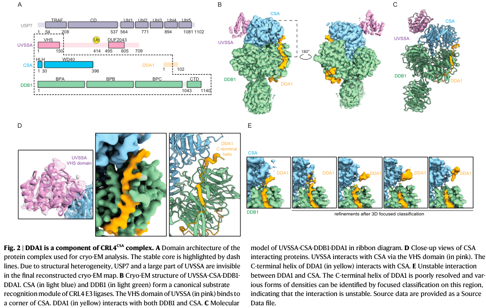

## Question

# Gene Research for Functional Annotation

## ⚠️ CRITICAL: Gene/Protein Identification Context

**BEFORE YOU BEGIN RESEARCH:** You MUST verify you are researching the CORRECT gene/protein. Gene symbols can be ambiguous, especially for less well-characterized genes from non-model organisms.

### Target Gene/Protein Identity (from UniProt):
- **UniProt Accession:** Q9BW61
- **Protein Description:** RecName: Full=DET1- and DDB1-associated protein 1 {ECO:0000303|PubMed:17452440}; AltName: Full=Placenta cross-immune reaction antigen 1 {ECO:0000303|Ref.2}; Short=PCIA-1 {ECO:0000303|Ref.2};
- **Gene Information:** Name=DDA1 {ECO:0000303|PubMed:17452440, ECO:0000312|HGNC:HGNC:28360}; Synonyms=C19orf58 {ECO:0000312|HGNC:HGNC:28360}, PCIA1 {ECO:0000303|Ref.2};
- **Organism (full):** Homo sapiens (Human).
- **Protein Family:** Belongs to the DDA1 family. .
- **Key Domains:** DDA1-like. (IPR033575); DDA1_dom. (IPR018276); DDA1 (PF10172)

### MANDATORY VERIFICATION STEPS:

1. **Check if the gene symbol "DDA1" matches the protein description above**
2. **Verify the organism is correct:** Homo sapiens (Human).
3. **Check if protein family/domains align with what you find in literature**
4. **If you find literature for a DIFFERENT gene with the same or similar symbol, STOP**

### If Gene Symbol is Ambiguous or You Cannot Find Relevant Literature:

**DO NOT PROCEED WITH RESEARCH ON A DIFFERENT GENE.** Instead:
- State clearly: "The gene symbol 'DDA1' is ambiguous or literature is limited for this specific protein"
- Explain what you found (e.g., "Found extensive literature on a different gene with the same symbol in a different organism")
- Describe the protein based ONLY on the UniProt information provided above
- Suggest that the protein function can be inferred from domain/family information

### Research Target:

Please provide a comprehensive research report on the gene **DDA1** (gene ID: DDA1, UniProt: Q9BW61) in human.

The research report should be a detailed narrative explaining the function, biological processes, and localization of the gene product. Citations should be given for all claims.

You should prioritize authoritative reviews and primary scientific literature when conducting research. You can supplement
this with annotations you find in gene/protein databases, but these can be outdated or inaccurate.

We are specifically interested in the primary function of the gene - for enzymes, what reaction is catalyzed, and what is the substrate specificity? For transporters, what is the substrate? For structural proteins or adapters, what is the broader structural role? For signaling molecules, what is the role in the pathway.

We are interested in where in or outside the cell the gene product carries out its function.

We are also interested in the signaling or biochemical pathways in which the gene functions. We are less interested in broad pleiotropic effects, except where these elucidate the precise role.

Include evidence where possible. We are interested in both experimental evidence as well as inference from structure, evolution, or bioinformatic analysis. Precise studies should be prioritized over high-throughput, where available.

## Output

Question: You are an expert researcher providing comprehensive, well-cited information.

Provide detailed information focusing on:
1. Key concepts and definitions with current understanding
2. Recent developments and latest research (prioritize 2023-2024 sources)
3. Current applications and real-world implementations
4. Expert opinions and analysis from authoritative sources
5. Relevant statistics and data from recent studies

Format as a comprehensive research report with proper citations. Include URLs and publication dates where available.
Always prioritize recent, authoritative sources and provide specific citations for all major claims.

# Gene Research for Functional Annotation

## ⚠️ CRITICAL: Gene/Protein Identification Context

**BEFORE YOU BEGIN RESEARCH:** You MUST verify you are researching the CORRECT gene/protein. Gene symbols can be ambiguous, especially for less well-characterized genes from non-model organisms.

### Target Gene/Protein Identity (from UniProt):
- **UniProt Accession:** Q9BW61
- **Protein Description:** RecName: Full=DET1- and DDB1-associated protein 1 {ECO:0000303|PubMed:17452440}; AltName: Full=Placenta cross-immune reaction antigen 1 {ECO:0000303|Ref.2}; Short=PCIA-1 {ECO:0000303|Ref.2};
- **Gene Information:** Name=DDA1 {ECO:0000303|PubMed:17452440, ECO:0000312|HGNC:HGNC:28360}; Synonyms=C19orf58 {ECO:0000312|HGNC:HGNC:28360}, PCIA1 {ECO:0000303|Ref.2};
- **Organism (full):** Homo sapiens (Human).
- **Protein Family:** Belongs to the DDA1 family. .
- **Key Domains:** DDA1-like. (IPR033575); DDA1_dom. (IPR018276); DDA1 (PF10172)

### MANDATORY VERIFICATION STEPS:

1. **Check if the gene symbol "DDA1" matches the protein description above**
2. **Verify the organism is correct:** Homo sapiens (Human).
3. **Check if protein family/domains align with what you find in literature**
4. **If you find literature for a DIFFERENT gene with the same or similar symbol, STOP**

### If Gene Symbol is Ambiguous or You Cannot Find Relevant Literature:

**DO NOT PROCEED WITH RESEARCH ON A DIFFERENT GENE.** Instead:
- State clearly: "The gene symbol 'DDA1' is ambiguous or literature is limited for this specific protein"
- Explain what you found (e.g., "Found extensive literature on a different gene with the same symbol in a different organism")
- Describe the protein based ONLY on the UniProt information provided above
- Suggest that the protein function can be inferred from domain/family information

### Research Target:

Please provide a comprehensive research report on the gene **DDA1** (gene ID: DDA1, UniProt: Q9BW61) in human.

The research report should be a detailed narrative explaining the function, biological processes, and localization of the gene product. Citations should be given for all claims.

You should prioritize authoritative reviews and primary scientific literature when conducting research. You can supplement
this with annotations you find in gene/protein databases, but these can be outdated or inaccurate.

We are specifically interested in the primary function of the gene - for enzymes, what reaction is catalyzed, and what is the substrate specificity? For transporters, what is the substrate? For structural proteins or adapters, what is the broader structural role? For signaling molecules, what is the role in the pathway.

We are interested in where in or outside the cell the gene product carries out its function.

We are also interested in the signaling or biochemical pathways in which the gene functions. We are less interested in broad pleiotropic effects, except where these elucidate the precise role.

Include evidence where possible. We are interested in both experimental evidence as well as inference from structure, evolution, or bioinformatic analysis. Precise studies should be prioritized over high-throughput, where available.

## Research report: Human **DDA1** (DET1- and DDB1-associated protein 1; UniProt **Q9BW61**) — functional annotation

### 0) Target verification and symbol disambiguation
The protein targeted here is **human DDA1** (DET1- and DDB1-associated protein 1; UniProt Q9BW61), a small conserved factor that binds **DDB1** and is discussed in the context of **CUL4–DDB1 (CRL4) ubiquitin ligases** and **DET1** complexes (shabek2018structuralinsightsinto pages 1-3, pick2007mammaliandet1regulates pages 1-2). Literature using similar strings such as **“dDA1”** (a Drosophila dopamine receptor) or “DDA-1” (a small molecule name) does not correspond to this protein and was excluded.

### 1) Key concepts and definitions (current understanding)

#### 1.1 Cullin–RING ligases (CRLs) and CRL4 architecture
Cullin–RING ligases are multi-subunit **E3 ubiquitin ligases** that promote substrate ubiquitination and subsequent proteasomal degradation. **CRL4** complexes are built around a **CUL4A/B** scaffold, a RING catalytic subunit (**RBX1**), and the adaptor **DDB1**, which recruits substrate receptors (often WD40 proteins, “DCAFs”) (shabek2018structuralinsightsinto pages 1-3, schiffmacher2024thesmallcrl4csa pages 1-2). In CRL4 systems, accessory components can tune assembly, geometry, and/or activity.

#### 1.2 What DDA1 is (functional definition)
**DDA1 is not an enzyme** (no independent catalytic reaction is described). Instead, it is best supported as a **small structural/regulatory subunit** of certain DDB1–CUL4 E3 ligase assemblies that can modulate ligase architecture and ubiquitination output in a **context-dependent** manner (pick2007mammaliandet1regulates pages 1-2, shabek2018structuralinsightsinto pages 1-3, schiffmacher2024thesmallcrl4csa pages 3-3).

### 2) Molecular function and binding partners (mechanistic evidence)

#### 2.1 Core binding: DDA1 directly binds DDB1 via its N-terminus
A major, repeatedly observed biochemical feature of human DDA1 is **direct binding to DDB1** through an extreme N-terminal segment.

* **Minimal binding element and interface**: Shabek et al. mapped DDB1 binding to a conserved **N-terminal 28-aa segment** (DDA1-NT), solved the **DDB1–DDA1-NT crystal structure at ~3.1 Å**, and localized binding to a groove on the **BPA propeller** of DDB1 (shabek2018structuralinsightsinto pages 1-3, shabek2018structuralinsightsinto pages 3-4). Key residues contributing to binding include **Pro9, Asn15, Phe16, Arg18, Phe19** (shabek2018structuralinsightsinto pages 3-4).
* **Affinity**: Bio-layer interferometry reported **Kd ~45 nM** for DDA1-NT binding to DDB1 (shabek2018structuralinsightsinto pages 1-3). A separate structural review summarizing additional biochemical results reports **full-length DDA1 Kd ≈ 28 nM** vs **DDA1-Nt Kd ≈ 663 nM**, implying additional contacts outside residues 1–28 can strengthen binding (ruble2019crl3andcrl4a pages 36-40).

These findings strongly support that DDA1’s primary biochemical role is as a **high-affinity DDB1-binding module** that integrates into CRL4 assemblies (shabek2018structuralinsightsinto pages 1-3, shabek2018structuralinsightsinto pages 3-4).

#### 2.2 Complex membership: DDA1 in DET1–DDB1–DDA1 (“DDD”) and in CRL4CSA

* **DDD complex (DET1–DDB1–DDA1)**: In mammalian systems, DDA1 is reported as a stable member of a conserved **DDD core complex** with DET1 and DDB1 (pick2007mammaliandet1regulates pages 1-2). In this context, the DDD core recruits a canonical E2 (UBE2E family), forming a **DDD–E2** assembly (pick2007mammaliandet1regulates pages 1-2).
* **CRL4CSA (TC-NER ligase)**: Recent work (2023–2024) identifies DDA1 as a **CSA-interacting factor** and an **integral component of CRL4CSA** (the CSA substrate-receptor CRL4 complex) that functions in **transcription-coupled nucleotide excision repair (TC-NER)** (schiffmacher2024thesmallcrl4csa pages 1-2, pines2023dda1anovel pages 5-7).

### 3) Pathways and biological processes

#### 3.1 Regulation of CRL4 ubiquitin ligase activity (foundational evidence)
Pick et al. provide biochemical evidence that the **DDD core complex** can **antagonize Cul4A-dependent polyubiquitin chain assembly in vitro**, via effects on the E2 when incorporated into the DDD complex (pick2007mammaliandet1regulates pages 1-2). In cells, overexpression of DET1 (a DDD component) blocks **UV-induced CDT1 degradation**, consistent with negative regulation of a CRL4-dependent pathway controlling replication licensing after UV damage (pick2007mammaliandet1regulates pages 1-2).

Interpretation: DDA1 is part of a regulatory module (with DET1/DDB1/E2) that can **down-modulate CRL4 ubiquitination output** in certain assay contexts (pick2007mammaliandet1regulates pages 1-2).

#### 3.2 Transcription-coupled nucleotide excision repair (TC-NER): a 2023–2024 mechanistic link
The most direct, recent pathway-level function for human DDA1 is in TC-NER via CRL4CSA.

* **Discovery and role**: DDA1 was identified as a **CSA interactor** by single-step complex isolation/MS and shown by cryo-EM to be an **integral CRL4CSA component**; functionally, DDA1 was concluded to **coordinate ubiquitination dynamics during TC-NER** and be **required for efficient turnover/progression** of the repair process (schiffmacher2024thesmallcrl4csa pages 1-2).
* **Structural/mechanistic detail**: The CSA–DDB1–DDA1-containing complex was solved by cryo-EM at **~3.4 Å**, resolving the DDA1 N-terminus and supporting a **limited interface with CSA**; AlphaFold2-multimer models were consistent with the cryo-EM conformation (schiffmacher2024thesmallcrl4csa pages 3-3). DDA1’s DDB1-contact in this complex involved **DDA1 residues 2–75** (pines2023dda1anovel pages 5-7).
* **Biophysical effect on complex stability**: DDA1 provided a modest, reproducible **~1 °C** thermal stabilization of CSA–DDB1 measured by nanoDSF, and truncation removing a CSA-interacting helix had a similar stabilization, implying stabilization is driven mainly by **DDA1–DDB1** contacts (schiffmacher2024thesmallcrl4csa pages 3-3).

A representative cryo-EM structural visualization of the CSA–DDB1–DDA1 complex is shown in extracted figure panels (schiffmacher2024thesmallcrl4csa media 97e65fd6, schiffmacher2024thesmallcrl4csa media ae42f398, schiffmacher2024thesmallcrl4csa media 9d6dd208).

### 4) Subcellular localization
Direct microscopy-based localization of DDA1 alone was not captured in the retrieved text excerpts. However, multiple independent lines of evidence place DDA1 functionally within **nuclear DNA repair-associated CRL4 complexes**:

* DDA1 is embedded in the **CRL4CSA** ligase that operates at **RNA polymerase II stalled at DNA lesions** during **TC-NER**, a nuclear chromatin-associated process (schiffmacher2024thesmallcrl4csa pages 1-2, pines2023dda1anovel pages 5-7).

Accordingly, the best-supported localization inference from the available evidence is that DDA1 acts at least in part in the **nucleus** as a component of CRL4CSA during TC-NER (schiffmacher2024thesmallcrl4csa pages 1-2).

### 5) Recent developments (prioritizing 2023–2024)

#### 5.1 2024 Nature Communications: DDA1 as a “small CRL4CSA component” that regulates TC-NER dynamics
Schiffmacher et al. (published July 2024) advance the field by (i) placing DDA1 inside the TC-NER E3 ligase at structural resolution, (ii) arguing DDA1–CSA binding is **low-affinity/transient**, and (iii) connecting DDA1 to **dynamic ubiquitination regulation** during repair (schiffmacher2024thesmallcrl4csa pages 3-3, schiffmacher2024thesmallcrl4csa pages 1-2). The work reports practical biochemical conditions for CRL4CSA in vitro ubiquitination (e.g., **1.5 µM UVSSA**, **0.2 µM UBA1**, **1 µM UBE2E1**, **20 µM ubiquitin**, **30 °C**, **20 min**) and nanoDSF conditions (e.g., **2 µM** protein; 20–90 °C ramp at 1 °C/min) that can be reused for reconstitution studies (schiffmacher2024thesmallcrl4csa pages 14-15).

Ubiquitination assay panels from the same article were also extracted as figure evidence (schiffmacher2024thesmallcrl4csa media 97e65fd6, schiffmacher2024thesmallcrl4csa media ae42f398, schiffmacher2024thesmallcrl4csa media 9d6dd208).

#### 5.2 2024 assay development and tool-building for DDB1 interaction antagonists
Yong et al. (May 2024) developed **fluorescence polarization peptide-displacement assays** with full-length DDB1 to screen for antagonists of DDB1 interactions (drug discovery relevance for antiviral/anticancer strategies). While the authors did not observe significant affinity for DDA1-derived peptides in their FP format (“data not shown”), the work provides a scalable platform and quantitative assay performance metrics (e.g., **Z-factor 0.73**, DMSO tolerance to 2% for 30 min) (yong2024developmentofpeptide pages 7-8). The study reports a peptide-probe affinity **Kd = 68 nM** (FITC-DCAF15 L49A peptide binding DDB1), illustrating the achievable assay sensitivity for DDB1-interactor interfaces in general (yong2024developmentofpeptide pages 1-2).

### 6) Current applications and real-world implementations

#### 6.1 Targeted protein degradation (TPD) and molecular glues: DDA1 in DCAF15:DDA1:DDB1 complexes
DDA1 is a constitutive component of the **DCAF15:DDA1:DDB1** ligase system used by sulfonamide “molecular glues” (e.g., **E7820**, **indisulam**) that recruit the splicing factor **RBM39** for degradation.

A 2024 native mass spectrometry (nMS) study demonstrates practical analytical workflows and reveals **stoichiometric rearrangements** relevant to TPD development: the DCAF15:DDA1:DDB1 complex **self-associates into dimers/trimers at low salt (100 mM ammonium acetate)** and shifts to **single copies at higher salt (500 mM)** or upon addition of molecular glue + RBM39, yielding a **1:1:1 ternary complex** (jackson2024nativemassspectrometry pages 1-2). The paper also provides typical experimental concentrations (e.g., ~**10 µM** E3 and POI; ~**200 µM** molecular glue) that reflect current implementation practice for nMS-based TPD characterization (jackson2024nativemassspectrometry pages 1-2).

Interpretation: while DDA1 is not typically the pharmacologic “handle” itself in these systems, it is a **required architectural component** of ligase assemblies that are actively used in therapeutic discovery workflows (jackson2024nativemassspectrometry pages 1-2).

#### 6.2 Drug discovery aimed at DDB1 interaction surfaces
The DDA1–DDB1 interface is structurally defined at near-atomic resolution and has **nanomolar affinity**, supporting feasibility for rational ligand discovery that perturbs DDB1-protein interactions (shabek2018structuralinsightsinto pages 1-3, ruble2019crl3andcrl4a pages 36-40). The development of DDB1 interaction displacement assays (even when not directly capturing DDA1 peptide binding in FP format) indicates active efforts to build **screening infrastructure** for DDB1 interface modulators (yong2024developmentofpeptide pages 7-8, yong2024developmentofpeptide pages 1-2).

### 7) Expert interpretation and synthesis (authoritative analysis grounded in evidence)
A consistent theme across structural and functional studies is that DDA1’s principal role is as an **auxiliary CRL4 subunit** that can influence **ligase assembly/stability and ubiquitination dynamics** rather than acting as a substrate receptor itself (shabek2018structuralinsightsinto pages 1-3, schiffmacher2024thesmallcrl4csa pages 3-3). The reported **context dependence** (inhibitory effects in some reconstitutions/complex contexts, apparently neutral effects in others) suggests that DDA1’s contribution is likely mediated by **geometry and dynamics** of DDB1/CUL4 modules, by the particular **DCAF/substrate** present, and/or by additional regulatory factors (pick2007mammaliandet1regulates pages 1-2, schiffmacher2024thesmallcrl4csa pages 3-3).

In TC-NER, DDA1 appears to act as a **modulator of CRL4CSA dynamics**, with both structural incorporation and measurable stabilization of CSA–DDB1, aligning with a model where DDA1 helps tune the residence time and ubiquitination progression on lesion-stalled transcription complexes (schiffmacher2024thesmallcrl4csa pages 3-3, schiffmacher2024thesmallcrl4csa pages 1-2).

### 8) Disease associations and statistics (recently curated evidence)
OpenTargets currently lists multiple disease associations for DDA1 with modest overall scores, including (examples): **neurodegenerative disease (score ~0.3696)**, **atrial fibrillation (~0.1274)**, **hypertension (~0.1170)**, **neoplasm (~0.1101)**, and **lung cancer (~0.0799)**, each supported by 4 evidence items in the OpenTargets snapshot returned here (OpenTargets Search: -DDA1). The OpenTargets record links to PubMed IDs including **28211159**, **26942699**, and **34031600** (OpenTargets Search: -DDA1). 

Interpretation: these associations indicate emerging or exploratory links (genetic/functional screens/literature) rather than definitive causal roles, and should be followed up by disease-focused primary literature beyond this limited snapshot (OpenTargets Search: -DDA1).

---

### Summary table (evidence map)
The following table consolidates identity checks, mechanisms, quantitative parameters (affinities/resolutions/assay conditions), and translational applications.

| Aspect | Key findings | Best supporting sources | Publication details |
|---|---|---|---|
| identity/domains | • Verified target is human **DDA1 / DET1- and DDB1-associated protein 1** (UniProt Q9BW61), not Drosophila dDA1 receptor or chemical "DDA-1" • Conserved **DDA1 family** protein and basal CRL4-associated component • UniProt-consistent function in DDB1/CUL4 systems supported by multiple human studies (shabek2018structuralinsightsinto pages 1-3, pick2007mammaliandet1regulates pages 1-2) | (shabek2018structuralinsightsinto pages 1-3, pick2007mammaliandet1regulates pages 1-2) | 2018, *Cell Discovery*, https://doi.org/10.1038/s41421-018-0064-8; 2007, *Molecular and Cellular Biology*, https://doi.org/10.1128/mcb.02432-06 |
| complex membership | • Stable member of mammalian **DET1–DDB1–DDA1 (DDD)** core complex • Also an integral component of **CRL4^CSA** in TC-NER; binds CSA and DDB1 • Present in **DCAF15:DDA1:DDB1** ligase assemblies used by molecular glues, but not detected in CRL4^DDB2 in the cited TC-NER proteomics (pick2007mammaliandet1regulates pages 1-2, pines2023dda1anovel pages 5-7, schiffmacher2024thesmallcrl4csa pages 1-2, jackson2024nativemassspectrometry pages 1-2) | (pick2007mammaliandet1regulates pages 1-2, pines2023dda1anovel pages 5-7, schiffmacher2024thesmallcrl4csa pages 1-2, jackson2024nativemassspectrometry pages 1-2) | 2007, *Molecular and Cellular Biology*, https://doi.org/10.1128/mcb.02432-06; 2023, *Research Square*, https://doi.org/10.21203/rs.3.rs-3385435/v1; 2024, *Nature Communications*, https://doi.org/10.1038/s41467-024-50584-7; 2024, *bioRxiv*, https://doi.org/10.1101/2023.02.03.526954 |
| molecular function | • Functions as a **small structural/regulatory subunit** of DDB1-CUL4 E3 ligases rather than an enzyme with its own catalytic reaction • In DDD-E2 context, negatively regulates **Cul4A-dependent polyubiquitin chain assembly** in vitro • In TC-NER, coordinates **ubiquitination dynamics** and supports efficient turnover/progression at stalled RNAPII (pick2007mammaliandet1regulates pages 1-2, pines2023dda1anovel pages 1-5, schiffmacher2024thesmallcrl4csa pages 1-2) | (pick2007mammaliandet1regulates pages 1-2, pines2023dda1anovel pages 1-5, schiffmacher2024thesmallcrl4csa pages 1-2) | 2007, *Molecular and Cellular Biology*, https://doi.org/10.1128/mcb.02432-06; 2023, *Research Square*, https://doi.org/10.21203/rs.3.rs-3385435/v1; 2024, *Nature Communications*, https://doi.org/10.1038/s41467-024-50584-7 |
| structural determinants | • **N-terminal 1–28 aa** (or broader 2–75 aa in CRL4^CSA map) mediates direct DDB1 engagement • DDB1-binding site lies on the **BPA propeller**; key residues include **Pro9, Asn15, Phe16, Arg18, Phe19** • Reported affinities/resolution: **Kd ~45 nM** for DDA1-NT by BLI; alternate summaries report **FL Kd 28 nM vs NT Kd 663 nM**; crystal/cryo-EM resolutions **3.1–3.4 Å** (shabek2018structuralinsightsinto pages 1-3, shabek2018structuralinsightsinto pages 3-4, ruble2019crl3andcrl4a pages 36-40, schiffmacher2024thesmallcrl4csa pages 3-3) | (shabek2018structuralinsightsinto pages 1-3, shabek2018structuralinsightsinto pages 3-4, ruble2019crl3andcrl4a pages 36-40, schiffmacher2024thesmallcrl4csa pages 3-3) | 2018, *Cell Discovery*, https://doi.org/10.1038/s41421-018-0064-8; 2024, *Nature Communications*, https://doi.org/10.1038/s41467-024-50584-7 |
| localization/compartment | • Functional evidence places DDA1 mainly in **nuclear CRL4 complexes** involved in DNA repair • TC-NER role implies action at **DNA damage-stalled RNA polymerase II/chromatin** • Direct localization evidence in retrieved texts is limited; compartment inference is strongest from CRL4^CSA structure/function rather than standalone imaging of DDA1 (pines2023dda1anovel pages 1-5, schiffmacher2024thesmallcrl4csa pages 1-2, pines2023dda1anovel pages 5-7) | (pines2023dda1anovel pages 1-5, schiffmacher2024thesmallcrl4csa pages 1-2, pines2023dda1anovel pages 5-7) | 2023, *Research Square*, https://doi.org/10.21203/rs.3.rs-3385435/v1; 2024, *Nature Communications*, https://doi.org/10.1038/s41467-024-50584-7 |
| pathways/biological processes | • Participates in **CRL4 ubiquitin ligase regulation** • Key human pathway link is **transcription-coupled nucleotide excision repair (TC-NER)**, affecting ubiquitination of TC-NER factors such as RNAPII/UVSSA/CSB through CRL4^CSA context • Foundational work also links DDA1-containing complexes to **UV-induced CDT1 stability** and broader CRL4 control (pick2007mammaliandet1regulates pages 1-2, pines2023dda1anovel pages 1-5, schiffmacher2024thesmallcrl4csa pages 1-2) | (pick2007mammaliandet1regulates pages 1-2, pines2023dda1anovel pages 1-5, schiffmacher2024thesmallcrl4csa pages 1-2) | 2007, *Molecular and Cellular Biology*, https://doi.org/10.1128/mcb.02432-06; 2023, *Research Square*, https://doi.org/10.21203/rs.3.rs-3385435/v1; 2024, *Nature Communications*, https://doi.org/10.1038/s41467-024-50584-7 |
| recent 2023-2024 advances | • 2023 preprint/2024 paper established DDA1 as a **CSA-interacting protein** and **integral CRL4^CSA component** • Cryo-EM of CSA–DDB1–DDA1-containing complex reached **3.4 Å** • DDA1 gave a modest but reproducible **~1 °C thermal stabilization** of CSA-DDB1; assays used **2 µM** protein in nanoDSF and in vitro ubiquitination conditions including **1.5 µM UVSSA, 0.2 µM UBA1, 1 µM UBE2E1, 20 µM ubiquitin** (pines2023dda1anovel pages 5-7, schiffmacher2024thesmallcrl4csa pages 3-3, schiffmacher2024thesmallcrl4csa pages 14-15, schiffmacher2024thesmallcrl4csa media 97e65fd6) | (pines2023dda1anovel pages 5-7, schiffmacher2024thesmallcrl4csa pages 3-3, schiffmacher2024thesmallcrl4csa pages 14-15, schiffmacher2024thesmallcrl4csa media 97e65fd6) | 2023, *Research Square*, https://doi.org/10.21203/rs.3.rs-3385435/v1; 2024, *Nature Communications*, https://doi.org/10.1038/s41467-024-50584-7 |
| applications | • **Drug-discovery assays** now use DDB1-interaction peptides/FP displacement to find antagonists of DDB1 complexes relevant to antiviral/anticancer discovery • DDA1-containing **DCAF15:DDA1:DDB1** complexes are used in **targeted protein degradation** studies with RBM39 molecular glues (E7820, indisulam) • Native MS can resolve DDA1-containing ternary complexes and stoichiometric changes, enabling practical TPD analytics (jackson2024nativemassspectrometry pages 1-2, yong2024developmentofpeptide pages 7-8, yong2024developmentofpeptide pages 1-2) | (jackson2024nativemassspectrometry pages 1-2, yong2024developmentofpeptide pages 7-8, yong2024developmentofpeptide pages 1-2) | 2024, *bioRxiv*, https://doi.org/10.1101/2023.02.03.526954; 2024, *Biochemistry*, https://doi.org/10.1021/acs.biochem.4c00044 |
| quantitative statistics | • DDA1–DDB1 affinity: **Kd ~45 nM** (BLI, DDA1-NT); alternate reported values **28 nM FL** and **663 nM NT** • Structures: **3.1 Å** DDB1–DDA1-NT crystal; **3.4 Å** CRL4^CSA cryo-EM • Screening/TPD metrics: **FITC-DCAF15 L49A Kd 68 nM**, **Z-factor 0.73**, DCAF15:DDA1:DDB1 self-association at **100 mM** ammonium acetate and dissociation/1:1:1 ternary complex at **500 mM** ammonium acetate or upon MG+POI addition; OpenTargets association scores include **neurodegenerative disease 0.3696**, **atrial fibrillation 0.1274**, **hypertension 0.1170**, **neoplasm 0.1101**, **lung cancer 0.0799** (shabek2018structuralinsightsinto pages 1-3, ruble2019crl3andcrl4a pages 36-40, schiffmacher2024thesmallcrl4csa pages 3-3, jackson2024nativemassspectrometry pages 1-2, yong2024developmentofpeptide pages 7-8, OpenTargets Search: -DDA1) | (shabek2018structuralinsightsinto pages 1-3, ruble2019crl3andcrl4a pages 36-40, schiffmacher2024thesmallcrl4csa pages 3-3, jackson2024nativemassspectrometry pages 1-2, yong2024developmentofpeptide pages 7-8, OpenTargets Search: -DDA1) | 2018, *Cell Discovery*, https://doi.org/10.1038/s41421-018-0064-8; 2024, *Nature Communications*, https://doi.org/10.1038/s41467-024-50584-7; 2024, *bioRxiv*, https://doi.org/10.1101/2023.02.03.526954; 2024, *Biochemistry*, https://doi.org/10.1021/acs.biochem.4c00044; OpenTargets platform context (OpenTargets Search: -DDA1) |

*Table: This table summarizes the strongest available functional annotation evidence for human DDA1 (UniProt Q9BW61), emphasizing experimentally supported complex membership, structural mechanism, TC-NER function, and translational relevance. It consolidates recent and foundational quantitative findings useful for downstream gene/protein annotation.*

### Key primary sources (with URLs and publication dates)
* Pick et al., **2007-07**. *Molecular and Cellular Biology*. “Mammalian DET1 regulates Cul4A activity and forms stable complexes with E2 ubiquitin-conjugating enzymes.” https://doi.org/10.1128/mcb.02432-06 (pick2007mammaliandet1regulates pages 1-2)
* Shabek et al., **2018-12**. *Cell Discovery*. “Structural insights into DDA1 function as a core component of the CRL4-DDB1 ubiquitin ligase.” https://doi.org/10.1038/s41421-018-0064-8 (shabek2018structuralinsightsinto pages 1-3)
* Pines et al., **2023-10** (preprint). *Research Square*. “DDA1, a novel factor in transcription-coupled repair, modulates CRL4CSA dynamics at DNA damage-stalled RNA polymerase II.” https://doi.org/10.21203/rs.3.rs-3385435/v1 (pines2023dda1anovel pages 5-7)
* Schiffmacher et al., **2024-07**. *Nature Communications*. “The small CRL4CSA ubiquitin ligase component DDA1 regulates transcription-coupled repair dynamics.” https://doi.org/10.1038/s41467-024-50584-7 (schiffmacher2024thesmallcrl4csa pages 1-2)
* Yong et al., **2024-05**. *Biochemistry*. “Development of Peptide Displacement Assays to Screen for Antagonists of DDB1 Interactions.” https://doi.org/10.1021/acs.biochem.4c00044 (yong2024developmentofpeptide pages 1-2)
* Jackson & Beveridge, **2024-06** (preprint). *bioRxiv*. “Native Mass Spectrometry of Complexes Formed by Molecular Glues Reveals Stoichiometric Rearrangement of E3 Ligases.” https://doi.org/10.1101/2023.02.03.526954 (jackson2024nativemassspectrometry pages 1-2)

### Figures extracted from primary literature
* Cryo-EM structure/model and ubiquitination assay panels from Schiffmacher et al. (schiffmacher2024thesmallcrl4csa media 97e65fd6, schiffmacher2024thesmallcrl4csa media ae42f398, schiffmacher2024thesmallcrl4csa media 9d6dd208).

References

1. (shabek2018structuralinsightsinto pages 1-3): Nitzan Shabek, James Ruble, Claire J. Waston, Kenneth C. Garbutt, Thomas R. Hinds, Ti Li, and Ning Zheng. Structural insights into dda1 function as a core component of the crl4-ddb1 ubiquitin ligase. Cell Discovery, Dec 2018. URL: https://doi.org/10.1038/s41421-018-0064-8, doi:10.1038/s41421-018-0064-8. This article has 39 citations and is from a peer-reviewed journal.

2. (pick2007mammaliandet1regulates pages 1-2): Elah Pick, On-Sun Lau, Tomohiko Tsuge, Suchithra Menon, Yingchun Tong, Naoshi Dohmae, Scott M. Plafker, Xing Wang Deng, and Ning Wei. Mammalian det1 regulates cul4a activity and forms stable complexes with e2 ubiquitin-conjugating enzymes. Jul 2007. URL: https://doi.org/10.1128/mcb.02432-06, doi:10.1128/mcb.02432-06. This article has 72 citations and is from a domain leading peer-reviewed journal.

3. (schiffmacher2024thesmallcrl4csa pages 1-2): Diana A. Llerena Schiffmacher, Shun-Hsiao Lee, Katarzyna W. Kliza, Arjan F. Theil, Masaki Akita, Angela Helfricht, Karel Bezstarosti, Camila Gonzalo-Hansen, Haico van Attikum, Matty Verlaan-de Vries, Alfred C. O. Vertegaal, Jan H. J. Hoeijmakers, Jurgen A. Marteijn, Hannes Lans, Jeroen A. A. Demmers, Michiel Vermeulen, Titia K. Sixma, Tomoo Ogi, Wim Vermeulen, and Alex Pines. The small crl4csa ubiquitin ligase component dda1 regulates transcription-coupled repair dynamics. Nature Communications, Jul 2024. URL: https://doi.org/10.1038/s41467-024-50584-7, doi:10.1038/s41467-024-50584-7. This article has 17 citations and is from a highest quality peer-reviewed journal.

4. (schiffmacher2024thesmallcrl4csa pages 3-3): Diana A. Llerena Schiffmacher, Shun-Hsiao Lee, Katarzyna W. Kliza, Arjan F. Theil, Masaki Akita, Angela Helfricht, Karel Bezstarosti, Camila Gonzalo-Hansen, Haico van Attikum, Matty Verlaan-de Vries, Alfred C. O. Vertegaal, Jan H. J. Hoeijmakers, Jurgen A. Marteijn, Hannes Lans, Jeroen A. A. Demmers, Michiel Vermeulen, Titia K. Sixma, Tomoo Ogi, Wim Vermeulen, and Alex Pines. The small crl4csa ubiquitin ligase component dda1 regulates transcription-coupled repair dynamics. Nature Communications, Jul 2024. URL: https://doi.org/10.1038/s41467-024-50584-7, doi:10.1038/s41467-024-50584-7. This article has 17 citations and is from a highest quality peer-reviewed journal.

5. (shabek2018structuralinsightsinto pages 3-4): Nitzan Shabek, James Ruble, Claire J. Waston, Kenneth C. Garbutt, Thomas R. Hinds, Ti Li, and Ning Zheng. Structural insights into dda1 function as a core component of the crl4-ddb1 ubiquitin ligase. Cell Discovery, Dec 2018. URL: https://doi.org/10.1038/s41421-018-0064-8, doi:10.1038/s41421-018-0064-8. This article has 39 citations and is from a peer-reviewed journal.

6. (ruble2019crl3andcrl4a pages 36-40): J Ruble. Crl3 and crl4 are functionally diverse ubiquitination complexes that regulate fundamental cell processes from human dna damage repair to plant pathogen …. Unknown journal, 2019.

7. (pines2023dda1anovel pages 5-7): Alex Pines, Diana Llerena Schiffmacher, Shun-Hsiao Lee, Katarzyna Kliza, Arjan Theil, Masaki Akita, Angela Helfricht, Karel Bezstarosti, Camila Gonzalo-Hansen, Haico van Attikum, Matty Verlaan-de Vries, Alfred Vertegaal, Jan Hoeijmakers, Jurgen Marteijn, Hannes Lans, Jeroen Demmers, Michiel Vermeulen, Titia Sixma, Tomoo Ogi, and Wim Vermeulen. Dda1, a novel factor in transcription-coupled repair, modulates crl4csa dynamics at dna damage-stalled rna polymerase ii. Research Square, Oct 2023. URL: https://doi.org/10.21203/rs.3.rs-3385435/v1, doi:10.21203/rs.3.rs-3385435/v1. This article has 4 citations.

8. (schiffmacher2024thesmallcrl4csa media 97e65fd6): Diana A. Llerena Schiffmacher, Shun-Hsiao Lee, Katarzyna W. Kliza, Arjan F. Theil, Masaki Akita, Angela Helfricht, Karel Bezstarosti, Camila Gonzalo-Hansen, Haico van Attikum, Matty Verlaan-de Vries, Alfred C. O. Vertegaal, Jan H. J. Hoeijmakers, Jurgen A. Marteijn, Hannes Lans, Jeroen A. A. Demmers, Michiel Vermeulen, Titia K. Sixma, Tomoo Ogi, Wim Vermeulen, and Alex Pines. The small crl4csa ubiquitin ligase component dda1 regulates transcription-coupled repair dynamics. Nature Communications, Jul 2024. URL: https://doi.org/10.1038/s41467-024-50584-7, doi:10.1038/s41467-024-50584-7. This article has 17 citations and is from a highest quality peer-reviewed journal.

9. (schiffmacher2024thesmallcrl4csa media ae42f398): Diana A. Llerena Schiffmacher, Shun-Hsiao Lee, Katarzyna W. Kliza, Arjan F. Theil, Masaki Akita, Angela Helfricht, Karel Bezstarosti, Camila Gonzalo-Hansen, Haico van Attikum, Matty Verlaan-de Vries, Alfred C. O. Vertegaal, Jan H. J. Hoeijmakers, Jurgen A. Marteijn, Hannes Lans, Jeroen A. A. Demmers, Michiel Vermeulen, Titia K. Sixma, Tomoo Ogi, Wim Vermeulen, and Alex Pines. The small crl4csa ubiquitin ligase component dda1 regulates transcription-coupled repair dynamics. Nature Communications, Jul 2024. URL: https://doi.org/10.1038/s41467-024-50584-7, doi:10.1038/s41467-024-50584-7. This article has 17 citations and is from a highest quality peer-reviewed journal.

10. (schiffmacher2024thesmallcrl4csa media 9d6dd208): Diana A. Llerena Schiffmacher, Shun-Hsiao Lee, Katarzyna W. Kliza, Arjan F. Theil, Masaki Akita, Angela Helfricht, Karel Bezstarosti, Camila Gonzalo-Hansen, Haico van Attikum, Matty Verlaan-de Vries, Alfred C. O. Vertegaal, Jan H. J. Hoeijmakers, Jurgen A. Marteijn, Hannes Lans, Jeroen A. A. Demmers, Michiel Vermeulen, Titia K. Sixma, Tomoo Ogi, Wim Vermeulen, and Alex Pines. The small crl4csa ubiquitin ligase component dda1 regulates transcription-coupled repair dynamics. Nature Communications, Jul 2024. URL: https://doi.org/10.1038/s41467-024-50584-7, doi:10.1038/s41467-024-50584-7. This article has 17 citations and is from a highest quality peer-reviewed journal.

11. (schiffmacher2024thesmallcrl4csa pages 14-15): Diana A. Llerena Schiffmacher, Shun-Hsiao Lee, Katarzyna W. Kliza, Arjan F. Theil, Masaki Akita, Angela Helfricht, Karel Bezstarosti, Camila Gonzalo-Hansen, Haico van Attikum, Matty Verlaan-de Vries, Alfred C. O. Vertegaal, Jan H. J. Hoeijmakers, Jurgen A. Marteijn, Hannes Lans, Jeroen A. A. Demmers, Michiel Vermeulen, Titia K. Sixma, Tomoo Ogi, Wim Vermeulen, and Alex Pines. The small crl4csa ubiquitin ligase component dda1 regulates transcription-coupled repair dynamics. Nature Communications, Jul 2024. URL: https://doi.org/10.1038/s41467-024-50584-7, doi:10.1038/s41467-024-50584-7. This article has 17 citations and is from a highest quality peer-reviewed journal.

12. (yong2024developmentofpeptide pages 7-8): Darren Yong, Shabbir Ahmad, Mark F. Mabanglo, Levon Halabelian, Matthieu Schapira, Suzanne Ackloo, Sumera Perveen, Pegah Ghiabi, and Masoud Vedadi. Development of peptide displacement assays to screen for antagonists of ddb1 interactions. Biochemistry, 63:1297-1306, May 2024. URL: https://doi.org/10.1021/acs.biochem.4c00044, doi:10.1021/acs.biochem.4c00044. This article has 4 citations and is from a peer-reviewed journal.

13. (yong2024developmentofpeptide pages 1-2): Darren Yong, Shabbir Ahmad, Mark F. Mabanglo, Levon Halabelian, Matthieu Schapira, Suzanne Ackloo, Sumera Perveen, Pegah Ghiabi, and Masoud Vedadi. Development of peptide displacement assays to screen for antagonists of ddb1 interactions. Biochemistry, 63:1297-1306, May 2024. URL: https://doi.org/10.1021/acs.biochem.4c00044, doi:10.1021/acs.biochem.4c00044. This article has 4 citations and is from a peer-reviewed journal.

14. (jackson2024nativemassspectrometry pages 1-2): Cara Jackson and Rebecca Beveridge. Native mass spectrometry of complexes formed by molecular glues reveals stoichiometric rearrangement of e3 ligases. bioRxiv, Jun 2024. URL: https://doi.org/10.1101/2023.02.03.526954, doi:10.1101/2023.02.03.526954. This article has 15 citations.

15. (OpenTargets Search: -DDA1): Open Targets Query (-DDA1, 5 results). Buniello, A. et al. (2025). Open Targets Platform: facilitating therapeutic hypotheses building in drug discovery. Nucleic Acids Research.

16. (pines2023dda1anovel pages 1-5): Alex Pines, Diana Llerena Schiffmacher, Shun-Hsiao Lee, Katarzyna Kliza, Arjan Theil, Masaki Akita, Angela Helfricht, Karel Bezstarosti, Camila Gonzalo-Hansen, Haico van Attikum, Matty Verlaan-de Vries, Alfred Vertegaal, Jan Hoeijmakers, Jurgen Marteijn, Hannes Lans, Jeroen Demmers, Michiel Vermeulen, Titia Sixma, Tomoo Ogi, and Wim Vermeulen. Dda1, a novel factor in transcription-coupled repair, modulates crl4csa dynamics at dna damage-stalled rna polymerase ii. Research Square, Oct 2023. URL: https://doi.org/10.21203/rs.3.rs-3385435/v1, doi:10.21203/rs.3.rs-3385435/v1. This article has 4 citations.

## Artifacts

- [Edison artifact artifact-00](DDA1-deep-research-falcon_artifacts/artifact-00.md)

## Citations

1. shabek2018structuralinsightsinto pages 3-4
2. shabek2018structuralinsightsinto pages 1-3
3. yong2024developmentofpeptide pages 7-8
4. yong2024developmentofpeptide pages 1-2
5. jackson2024nativemassspectrometry pages 1-2
6. https://doi.org/10.1038/s41421-018-0064-8;
7. https://doi.org/10.1128/mcb.02432-06
8. https://doi.org/10.1128/mcb.02432-06;
9. https://doi.org/10.21203/rs.3.rs-3385435/v1;
10. https://doi.org/10.1038/s41467-024-50584-7;
11. https://doi.org/10.1101/2023.02.03.526954
12. https://doi.org/10.1038/s41467-024-50584-7
13. https://doi.org/10.1101/2023.02.03.526954;
14. https://doi.org/10.1021/acs.biochem.4c00044
15. https://doi.org/10.1021/acs.biochem.4c00044;
16. https://doi.org/10.1038/s41421-018-0064-8
17. https://doi.org/10.21203/rs.3.rs-3385435/v1
18. https://doi.org/10.1038/s41421-018-0064-8,
19. https://doi.org/10.1128/mcb.02432-06,
20. https://doi.org/10.1038/s41467-024-50584-7,
21. https://doi.org/10.21203/rs.3.rs-3385435/v1,
22. https://doi.org/10.1021/acs.biochem.4c00044,
23. https://doi.org/10.1101/2023.02.03.526954,