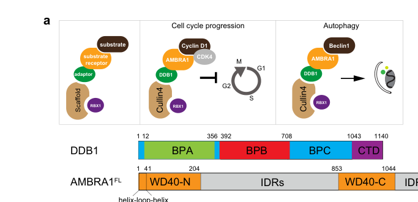

## Question

# Gene Research for Functional Annotation

## ⚠️ CRITICAL: Gene/Protein Identification Context

**BEFORE YOU BEGIN RESEARCH:** You MUST verify you are researching the CORRECT gene/protein. Gene symbols can be ambiguous, especially for less well-characterized genes from non-model organisms.

### Target Gene/Protein Identity (from UniProt):
- **UniProt Accession:** Q16531
- **Protein Description:** RecName: Full=DNA damage-binding protein 1; AltName: Full=DDB p127 subunit; AltName: Full=DNA damage-binding protein a; Short=DDBa; AltName: Full=Damage-specific DNA-binding protein 1; AltName: Full=HBV X-associated protein 1; Short=XAP-1; AltName: Full=UV-damaged DNA-binding factor; AltName: Full=UV-damaged DNA-binding protein 1; Short=UV-DDB 1; AltName: Full=XPE-binding factor; Short=XPE-BF; AltName: Full=Xeroderma pigmentosum group E-complementing protein; Short=XPCe;
- **Gene Information:** Name=DDB1; Synonyms=XAP1;
- **Organism (full):** Homo sapiens (Human).
- **Protein Family:** Belongs to the DDB1 family. .
- **Key Domains:** Beta-prop_RSE1/DDB1/CPSF1_1st. (IPR018846); Beta-prop_RSE1/DDB1/CPSF1_2nd. (IPR058543); RSE1/DDB1/CFT1. (IPR050358); RSE1/DDB1/CPSF1_C. (IPR004871); WD40/YVTN_repeat-like_dom_sf. (IPR015943)

### MANDATORY VERIFICATION STEPS:

1. **Check if the gene symbol "DDB1" matches the protein description above**
2. **Verify the organism is correct:** Homo sapiens (Human).
3. **Check if protein family/domains align with what you find in literature**
4. **If you find literature for a DIFFERENT gene with the same or similar symbol, STOP**

### If Gene Symbol is Ambiguous or You Cannot Find Relevant Literature:

**DO NOT PROCEED WITH RESEARCH ON A DIFFERENT GENE.** Instead:
- State clearly: "The gene symbol 'DDB1' is ambiguous or literature is limited for this specific protein"
- Explain what you found (e.g., "Found extensive literature on a different gene with the same symbol in a different organism")
- Describe the protein based ONLY on the UniProt information provided above
- Suggest that the protein function can be inferred from domain/family information

### Research Target:

Please provide a comprehensive research report on the gene **DDB1** (gene ID: DDB1, UniProt: Q16531) in human.

The research report should be a detailed narrative explaining the function, biological processes, and localization of the gene product. Citations should be given for all claims.

You should prioritize authoritative reviews and primary scientific literature when conducting research. You can supplement
this with annotations you find in gene/protein databases, but these can be outdated or inaccurate.

We are specifically interested in the primary function of the gene - for enzymes, what reaction is catalyzed, and what is the substrate specificity? For transporters, what is the substrate? For structural proteins or adapters, what is the broader structural role? For signaling molecules, what is the role in the pathway.

We are interested in where in or outside the cell the gene product carries out its function.

We are also interested in the signaling or biochemical pathways in which the gene functions. We are less interested in broad pleiotropic effects, except where these elucidate the precise role.

Include evidence where possible. We are interested in both experimental evidence as well as inference from structure, evolution, or bioinformatic analysis. Precise studies should be prioritized over high-throughput, where available.

## Output

Question: You are an expert researcher providing comprehensive, well-cited information.

Provide detailed information focusing on:
1. Key concepts and definitions with current understanding
2. Recent developments and latest research (prioritize 2023-2024 sources)
3. Current applications and real-world implementations
4. Expert opinions and analysis from authoritative sources
5. Relevant statistics and data from recent studies

Format as a comprehensive research report with proper citations. Include URLs and publication dates where available.
Always prioritize recent, authoritative sources and provide specific citations for all major claims.

# Gene Research for Functional Annotation

## ⚠️ CRITICAL: Gene/Protein Identification Context

**BEFORE YOU BEGIN RESEARCH:** You MUST verify you are researching the CORRECT gene/protein. Gene symbols can be ambiguous, especially for less well-characterized genes from non-model organisms.

### Target Gene/Protein Identity (from UniProt):
- **UniProt Accession:** Q16531
- **Protein Description:** RecName: Full=DNA damage-binding protein 1; AltName: Full=DDB p127 subunit; AltName: Full=DNA damage-binding protein a; Short=DDBa; AltName: Full=Damage-specific DNA-binding protein 1; AltName: Full=HBV X-associated protein 1; Short=XAP-1; AltName: Full=UV-damaged DNA-binding factor; AltName: Full=UV-damaged DNA-binding protein 1; Short=UV-DDB 1; AltName: Full=XPE-binding factor; Short=XPE-BF; AltName: Full=Xeroderma pigmentosum group E-complementing protein; Short=XPCe;
- **Gene Information:** Name=DDB1; Synonyms=XAP1;
- **Organism (full):** Homo sapiens (Human).
- **Protein Family:** Belongs to the DDB1 family. .
- **Key Domains:** Beta-prop_RSE1/DDB1/CPSF1_1st. (IPR018846); Beta-prop_RSE1/DDB1/CPSF1_2nd. (IPR058543); RSE1/DDB1/CFT1. (IPR050358); RSE1/DDB1/CPSF1_C. (IPR004871); WD40/YVTN_repeat-like_dom_sf. (IPR015943)

### MANDATORY VERIFICATION STEPS:

1. **Check if the gene symbol "DDB1" matches the protein description above**
2. **Verify the organism is correct:** Homo sapiens (Human).
3. **Check if protein family/domains align with what you find in literature**
4. **If you find literature for a DIFFERENT gene with the same or similar symbol, STOP**

### If Gene Symbol is Ambiguous or You Cannot Find Relevant Literature:

**DO NOT PROCEED WITH RESEARCH ON A DIFFERENT GENE.** Instead:
- State clearly: "The gene symbol 'DDB1' is ambiguous or literature is limited for this specific protein"
- Explain what you found (e.g., "Found extensive literature on a different gene with the same symbol in a different organism")
- Describe the protein based ONLY on the UniProt information provided above
- Suggest that the protein function can be inferred from domain/family information

### Research Target:

Please provide a comprehensive research report on the gene **DDB1** (gene ID: DDB1, UniProt: Q16531) in human.

The research report should be a detailed narrative explaining the function, biological processes, and localization of the gene product. Citations should be given for all claims.

You should prioritize authoritative reviews and primary scientific literature when conducting research. You can supplement
this with annotations you find in gene/protein databases, but these can be outdated or inaccurate.

We are specifically interested in the primary function of the gene - for enzymes, what reaction is catalyzed, and what is the substrate specificity? For transporters, what is the substrate? For structural proteins or adapters, what is the broader structural role? For signaling molecules, what is the role in the pathway.

We are interested in where in or outside the cell the gene product carries out its function.

We are also interested in the signaling or biochemical pathways in which the gene functions. We are less interested in broad pleiotropic effects, except where these elucidate the precise role.

Include evidence where possible. We are interested in both experimental evidence as well as inference from structure, evolution, or bioinformatic analysis. Precise studies should be prioritized over high-throughput, where available.

# Research Report: Human **DDB1** (UniProt **Q16531**) — Functional Annotation, Pathways, and Translational Relevance

## 0) Target verification (gene/protein identity)
The literature analyzed here consistently refers to **human DNA damage-binding protein 1 (DDB1)** as a **triple β-propeller WD40-like adaptor** that serves as (i) the non-DNA-binding subunit of the **UV-DDB** damage-recognition factor and (ii) the core adaptor of **CUL4A/B–RING E3 ubiquitin ligases (CRL4)**, matching the provided UniProt entry (Q16531) in name, organism, family, and domain architecture (raisch2023pulsesilacandinteractomics pages 1-3, liu2023structureofthe pages 1-2).

## 1) Key concepts and definitions (current understanding)

### 1.1 DDB1 as an adaptor in CRL4 ubiquitin ligases
**DDB1’s primary biochemical role is not catalytic**; rather, it is an **E3-ligase adaptor/scaffold** that couples the **CUL4A/B** cullin scaffold to **substrate receptors** (commonly termed **DCAFs**, for “DDB1- and CUL4-associated factors”), enabling substrate selection for ubiquitination by CRL4 complexes (raisch2023pulsesilacandinteractomics pages 1-3, liu2023structureofthe pages 1-2).

Mechanistically, DDB1 is described as containing **three WD40-like β-propeller domains (BPA/BPB/BPC)**. In a CRL4 context, **BPB contacts the N-terminus of CUL4A/B**, while DDB1 also provides an **H-box interaction surface** used to bind WD40 substrate receptors (DCAFs), thereby organizing a modular ubiquitin ligase in which receptor identity largely determines substrate specificity (raisch2023pulsesilacandinteractomics pages 1-3).

### 1.2 UV-DDB (DDB1–DDB2) and global-genome NER
**UV-DDB** is a lesion-recognition factor in **global-genome nucleotide excision repair (GG-NER)** composed of **DDB1 and DDB2**; within this heterodimer, DDB2 is the principal DNA-damage-binding subunit, whereas DDB1 acts as the partner subunit that supports downstream steps, including coupling to ubiquitination machinery (raja2023understandingtherole pages 1-6, raisch2023pulsesilacandinteractomics pages 16-17).

### 1.3 DCAFs and the “CRL4–DDB1–DCAF” modular paradigm
A key concept for functional annotation is that a substantial number of WD40 proteins can be candidate DCAFs, but only a subset appear to be robust DDB1/CUL4-associated receptors under particular conditions. A 2023 systematic analysis characterized **58 DCAFs** and observed that DDB1/CUL4A/B were detected as interactors for **15/58** tested putative DCAFs, with **10** enriched for both DDB1 and CUL4A/B (raisch2023pulsesilacandinteractomics pages 8-11). In the same study, only **14/58 (23%)** DCAFs were enriched in DDB1/CUL4 assays (raisch2023pulsesilacandinteractomics pages 14-15). This emphasizes that DDB1’s functional output is highly dependent on which DCAF/receptor is engaged, and often on stimulus context (e.g., UV damage for DDB2) (raisch2023pulsesilacandinteractomics pages 8-11).

## 2) Molecular function, structure, and localization

### 2.1 Structural basis for receptor binding and scaffold function
A high-resolution recent example of DDB1’s scaffold role is provided by **Liu et al., Nature Communications (published Nov 2023; https://doi.org/10.1038/s41467-023-43174-6)**, which solved a **cryo-EM structure at 3.08 Å** of DDB1 bound to the substrate receptor **AMBRA1** (liu2023structureofthe pages 1-2). The structure shows how DDB1’s double-propeller architecture engages AMBRA1 features to form a platform for substrate recruitment and ubiquitination, and functional assays show that DDB1-binding-defective AMBRA1 mutants disrupt Cyclin D1 ubiquitination and promote cell-cycle progression (liu2023structureofthe pages 1-2).

### 2.2 Subcellular localization (evidence and limitations)
In the retrieved full-text evidence, **direct, explicit localization statements for DDB1** (e.g., nuclear vs cytosolic partitioning) were limited. However, the 2023 proteomics work notes functional specialization and distinct localization tendencies of the CUL4 paralogs (**CUL4B nuclear; CUL4A cytoplasmic**), implying DDB1-containing CRL4 assemblies can act in different cellular compartments depending on scaffold usage (raisch2023pulsesilacandinteractomics pages 1-3). Where more granular DDB1 localization is needed, additional sources (e.g., OpenCell resource articles) would be appropriate; the Raisch et al. study explicitly points to endogenous tagging/localization resources as useful for mapping subcellular associations (raisch2023pulsesilacandinteractomics pages 16-17).

## 3) Biological processes and pathways involving DDB1

### 3.1 DNA damage recognition and repair: GG-NER and ubiquitination-linked steps
DDB1 participates in DNA damage response through its presence in UV-DDB and CRL4 complexes. The proteomics synthesis and cited literature indicate UV-induced ubiquitination steps in GG-NER can involve **UV-DDB–ubiquitin ligase activity**, including **UV-induced ubiquitylation of XPC** mediated by UV-DDB-associated ligase machinery (raisch2023pulsesilacandinteractomics pages 16-17, raisch2023pulsesilacandinteractomics pages 17-17). In this framework, DDB1’s mechanistic role is to help assemble the relevant CRL4 complex and engage the appropriate receptor/adaptors that connect lesion recognition to ubiquitylation-mediated remodeling of repair factors (raisch2023pulsesilacandinteractomics pages 16-17).

### 3.2 Noncanonical DNA repair roles: UV-DDB promotes base excision repair enzyme activity
A 2023 mechanistic synthesis on UV-DDB in oxidative DNA repair reports noncanonical roles for UV-DDB (DDB1–DDB2) in **base excision repair (BER)**. UV-DDB was reported to stimulate several BER enzymes, including **OGG1 (~3-fold), MUTYH (4–5-fold), and APE1 (8-fold)**, and specifically to stimulate **SMUG1 excision activity by 4–5-fold**. Single-molecule analysis indicated UV-DDB can reduce SMUG1 residence time on DNA, decreasing SMUG1 half-life on DNA by **>8-fold** (raja2023understandingtherole pages 1-6). Although this evidence centers on UV-DDB as a complex, it places DDB1 within a broader conceptual role in DNA repair beyond canonical UV-lesion GG-NER (raja2023understandingtherole pages 1-6).

### 3.3 Chromatin/replication-related roles: cohesion and genome stability
DDB1-containing CRL4 complexes are implicated in genomic stability through chromatin-associated mechanisms. The 2023 DDB1/CUL4 interactomics synthesis highlights CRL4–DDB1 involvement in chromatin-linked processes including **replication-coupled sister chromatid cohesion**, via regulation of the cohesin acetyltransferase pathway (e.g., Esco2-linked regulation is cited in the evidence synthesis) (raisch2023pulsesilacandinteractomics pages 16-17, raisch2023pulsesilacandinteractomics pages 17-17).

### 3.4 Host–pathogen interfaces: influenza A virus rewiring of CRL4/DDB1 interactomes
A recent **Mol Cell Proteomics** study (published Nov 2024; https://doi.org/10.1016/j.mcpro.2024.100856) reported that during **influenza A virus (IAV)** infection, the **CRL4 interactome is rewired**, with functional consequences tied to viral replication. In their model, **DDB1** together with **DCAF11** and **DCAF12L1** mediates **non-degradative poly-ubiquitination** of the viral polymerase subunit **PB2**, and these components were required for optimal in vitro infection. The study reports IAV-induced disruption of CRL4 interactions including a **global loss of DDB1 and DCAF11 interactions** and increased DCAF12L1 associations (dugied2024profilingcullin4e3ligases pages 1-3).

## 4) Recent developments (2023–2024 emphasis) and emerging research themes

### 4.1 Systems-level mapping of DDB1–CUL4 receptor usage and substrates (2023)
A central 2023 advance for functional annotation is the integration of **BioID**, **AP-MS**, and **pulse-SILAC** to profile DDB1/CUL4-associated receptor usage and candidate substrates. This work (published Oct 2023; https://doi.org/10.1016/j.mcpro.2023.100644) both supports canonical roles (DNA repair) and expands cell-biology contexts via network mapping. It provides quantitative constraints on receptor engagement (e.g., **14/58 enriched DCAFs**) and suggests that DDB1’s functional diversification is largely encoded through conditional recruitment of distinct DCAFs and subcomplexes (raisch2023pulsesilacandinteractomics pages 14-15, raisch2023pulsesilacandinteractomics pages 8-11).

### 4.2 Structural biology of non-canonical DDB1 receptors in cell-cycle regulation (2023)
The 3.08 Å cryo-EM structure of DDB1 bound to AMBRA1 provides a contemporary structural framework for understanding how intrinsically disordered or dynamic receptor proteins can stabilize upon DDB1 engagement to assemble active CRL4 ligases. HDX-MS showed extensive AMBRA1 stabilization upon DDB1 interaction (203 peptides; 98.8% coverage), offering detailed, experimentally supported structure–function annotation for this DDB1 receptor axis (liu2023structureofthe pages 1-2).

### 4.3 Molecular glues and targeted protein degradation: DDB1 as an induced-proximity node (2024)
A high-impact 2024 review in **Cell Chemical Biology** (published Jun 2024; https://doi.org/10.1016/j.chembiol.2024.04.002) summarizes extensive medicinal chemistry and structural work on small molecules that promote target recruitment to ubiquitin ligases. For DDB1-linked degradation, it highlights cyclin K degraders that form ternary complexes with **CDK12–cyclin K and DDB1/CRL4** and identifies **Arg928 of DDB1** as a validated **hotspot residue** enabling π-cation (and related) interactions used by “molecular glue” chemotypes (konstantinidou2024moleculargluesfor pages 10-11). The summarized dataset is quantitatively substantial: **>90 compounds** screened by TR-FRET for ternary complex formation, **40** with **<100 nM** biochemical affinity, and **28** ternary complex crystal structures solved; biochemical ternary affinity correlated with cellular degradation (konstantinidou2024moleculargluesfor pages 10-11).

## 5) Current applications and real-world implementations

### 5.1 DDB1-directed PROTAC-like degraders (chemoproteomics-enabled)
A 2024 dissertation/monograph on chemoproteomic platforms reports a DDB1-directed induced-proximity strategy: cysteine chemoproteomics identified a covalent DDB1 recruiter (EN223) binding DDB1 at **Cys173**, which was elaborated into heterobifunctional degraders that induced degradation of **BRD4** (preferentially the short isoform) and the **androgen receptor (AR)** in prostate cancer cells. Mechanistically, degradation was shown to be **proteasome-, NEDDylation-, and DDB1-dependent**, consistent with functional recruitment of the **CUL4A–DDB1** axis (meyers2024leveragingchemoproteomicplatforms pages 71-75). This provides a direct bridge from DDB1 functional annotation (core adaptor of CRL4) to therapeutic modality development (targeted protein degradation) (meyers2024leveragingchemoproteomicplatforms pages 71-75, meyers2024leveragingchemoproteomicplatforms pages 1-6).

### 5.2 Molecular glue–style engagement of DDB1: cyclin K degradation and drug discovery strategy
The 2024 molecular-glue review frames DDB1 as an actionable interface for induced proximity, with explicit expert analysis that **Arg928** is a “hotspot residue” and that successful glues typically combine (i) a kinase hinge-binding motif and (ii) an aromatic “gluing” moiety that extends to engage DDB1. The extent of the interface contribution (~20% of the PPI interface) and the strong structure–activity and structure–function linkages (28 structures) underpin a rational design approach for DDB1-involving degraders (konstantinidou2024moleculargluesfor pages 10-11).

### 5.3 Host-directed antiviral strategies (conceptual)
The IAV CRL4 interactome rewiring data suggest DDB1-centered complexes may be leveraged as **host-directed antiviral intervention points**, since DDB1 and specific DCAFs were mechanistically required for aspects of infection and virus-linked ubiquitination patterns (dugied2024profilingcullin4e3ligases pages 1-3). While not yet a therapeutic, this constitutes a real-world application direction in infection biology (dugied2024profilingcullin4e3ligases pages 1-3).

## 6) Statistics and quantitative highlights (recent evidence)

- **CRLs’ proteostasis contribution:** Cullin-RING ligases are described as accounting for approximately **~20%** of proteasomal protein degradation (raisch2023pulsesilacandinteractomics pages 1-3).
- **DCAF landscape and selectivity:** In a targeted evaluation of **58 DCAFs**, DDB1/CUL4A/B interactors were found for **15/58**, with **10** enriched for both DDB1 and CUL4A/B (raisch2023pulsesilacandinteractomics pages 8-11). In a related analysis, only **14/58 (23%)** DCAFs were enriched in DDB1/CUL4 assays (raisch2023pulsesilacandinteractomics pages 14-15).
- **Noncanonical BER stimulation by UV-DDB:** UV-DDB stimulated BER enzyme activities with fold-changes of **~3× (OGG1), 4–5× (MUTYH), 8× (APE1), 4–5× (SMUG1)**, and reduced SMUG1 DNA residence time with **>8×** decrease in half-life (raja2023understandingtherole pages 1-6).
- **Molecular glue screening/structures (DDB1 hotspot Arg928):** **>90** compounds screened, **40** with **<100 nM** biochemical affinity, and **28** ternary complex crystal structures (konstantinidou2024moleculargluesfor pages 10-11).
- **DDB1-directed PROTAC recruiter:** Covalent recruiter binds DDB1 at **Cys173**, enabling DDB1-dependent degradation of **BRD4** and **AR** (meyers2024leveragingchemoproteomicplatforms pages 71-75).

## 7) Visual evidence (structure and complex organization)
The following figure panels from Liu et al. (Nature Communications, Nov 2023) illustrate DDB1’s adaptor architecture and its receptor-binding role in CRL4 assemblies: schematic architecture of the CRL4–DDB1–RBX1–AMBRA1 complex and cryo-EM structural views of the DDB1–AMBRA1 interface (liu2023structureofthe media 06cbf119, liu2023structureofthe media 0d66b2f6, liu2023structureofthe media 6096d8f9).

## 8) Summary of core functional annotation
DDB1 (Q16531) is best annotated as an **essential, multi-domain adaptor/scaffold** that (i) supports **UV-damage recognition/NER** via the UV-DDB complex and (ii) acts as the **central adaptor of CRL4 E3 ubiquitin ligases**, recruiting diverse **DCAF** substrate receptors to drive ubiquitin-mediated remodeling or degradation of target proteins. Recent structural biology (cryo-EM 3.08 Å DDB1–AMBRA1) and systems proteomics (DDB1–CUL4–DCAF interactome/degradome) support a model in which DDB1’s pleiotropic phenotypes arise from **context-specific assembly** of distinct CRL4 receptor modules. Translationally, DDB1 is increasingly viewed as an **induced-proximity node** for targeted protein degradation, both via DDB1-surface hotspots (Arg928) exploited by molecular glues and via direct covalent recruitment (Cys173) enabling DDB1-dependent degradation of clinically relevant proteins such as BRD4 and AR (raisch2023pulsesilacandinteractomics pages 1-3, liu2023structureofthe pages 1-2, meyers2024leveragingchemoproteomicplatforms pages 71-75, konstantinidou2024moleculargluesfor pages 10-11).

---

## Evidence map (complexes, functions, and quantitative highlights)

| Complex/Axis | DDB1 role | Key partner(s) | Biological process | Type of evidence (structure/proteomics/review) | Quantitative/statistical highlight | Key citation IDs |
|---|---|---|---|---|---|---|
| UV-DDB / GG-NER | Non-DNA-binding subunit of UV-DDB; scaffolds damage-recognition machinery with DDB2 and links lesion sensing to ubiquitylation steps | DDB2, XPC, CUL4 | Recognition of UV-induced DNA lesions and initiation of global-genome nucleotide excision repair | Review/proteomics-supported functional synthesis | DDB2-associated DCAF interaction can be stimulus-specific under UV damage; myc-BirA*-DDB2 cells showed 12 proteins decreased at 16 h in pulse-SILAC workflow (raisch2023pulsesilacandinteractomics pages 8-11) | (raisch2023pulsesilacandinteractomics pages 16-17, raja2023understandingtherole pages 1-6, raisch2023pulsesilacandinteractomics pages 8-11) |
| CRL4 core adaptor axis | Central adaptor linking CUL4A/B scaffold to WD40 substrate receptors (DCAFs) through H-box recognition; organizes CRL4 E3 ligase architecture | CUL4A, CUL4B, ROC1/RBX1, DCAFs | Ubiquitin-dependent proteostasis across DNA repair, replication, cell cycle, tumorigenesis | Structure + proteomics | CRLs account for ~20% of proteasomal protein degradation; 58 DCAFs characterized, 15/58 showed DDB1/CUL4 interactions, and 10 were enriched for both DDB1 and CUL4A/B (raisch2023pulsesilacandinteractomics pages 1-3, raisch2023pulsesilacandinteractomics pages 8-11) | (raisch2023pulsesilacandinteractomics pages 1-3, raisch2023pulsesilacandinteractomics pages 8-11) |
| DDB1 structural architecture | Triple WD40-like β-propeller adaptor (BPA/BPB/BPC); BPB contacts CUL4 N-terminus and creates receptor-binding scaffold | CUL4A/B, substrate receptors such as AMBRA1 | Assembly of multi-subunit E3 ligase complexes | Structure | Cryo-EM structure of DDB1-AMBRA1 solved at 3.08 Å; HDX-MS covered 203 peptides and 98.8% of AMBRA1 sequence (liu2023structureofthe pages 1-2) | (liu2023structureofthe pages 1-2, liu2023structureofthe media 06cbf119) |
| CRL4-AMBRA1 | Adaptor that binds AMBRA1 substrate receptor and enables substrate ubiquitination | AMBRA1, Cyclin D1, CUL4A/B-RBX1 | Cell-cycle regulation and coupling of ubiquitin ligase function to AMBRA1 biology | Structure + functional biochemistry | DDB1-binding-defective AMBRA1 mutants blocked Cyclin D1 ubiquitination in vitro and increased cell-cycle progression; structure resolved at 3.08 Å (liu2023structureofthe pages 1-2) | (liu2023structureofthe pages 1-2, liu2023structureofthe media 06cbf119) |
| DDB1-CUL4 interactome / DCAF network | Hub for selective assembly with a limited subset of bona fide DCAFs and associated substrates | DDA1, ERCC8, DDB2, multiple WD40 DCAFs | Mapping substrate-receptor usage, chromatin-linked and vesicle/secretory functions | Proteomics | Only 14/58 DCAFs (23%) were enriched in DDB1/CUL4 assays; reciprocal interactomes supported seven high-confidence DCAFs; DDA1 proximity labeling enriched 12 DCAFs (raisch2023pulsesilacandinteractomics pages 14-15) | (raisch2023pulsesilacandinteractomics pages 14-15) |
| Replication / cohesion chromatin axis | CRL4-DDB1 complex component supporting chromatin-associated regulation beyond DNA damage recognition | Esco2, DDA1, CUL4 | Replication-coupled sister chromatid cohesion and genome stability | Proteomics/literature synthesis | Reported as a genomic-stability pathway linked to DDB1-CUL4 complexes; no direct effect size given in provided context (raisch2023pulsesilacandinteractomics pages 16-17, raisch2023pulsesilacandinteractomics pages 17-17) | (raisch2023pulsesilacandinteractomics pages 16-17, raisch2023pulsesilacandinteractomics pages 17-17) |
| Noncanonical oxidative DNA repair support via UV-DDB | Within UV-DDB, supports DDB2-centered stimulation of BER enzymes at oxidative lesions | DDB2, SMUG1, OGG1, MUTYH, APE1 | Base excision repair of oxidative damage / lesion handoff | Primary mechanistic study summarized in provided context | UV-DDB stimulated OGG1 ~3-fold, MUTYH 4–5-fold, APE1 8-fold, and SMUG1 4–5-fold; reduced SMUG1 DNA residence time by >8-fold (raja2023understandingtherole pages 1-6) | (raja2023understandingtherole pages 1-6) |
| Influenza A virus–rewired CRL4 axis | Core adaptor in host CRL4 complexes rewired during infection; supports non-degradative ubiquitination of viral factor PB2 | DCAF11, DCAF12L1, PB2 | Host–virus interaction and antiviral/ proviral ubiquitin signaling | Proteomics | IAV caused a global loss of DDB1 and DCAF11 interactions while increasing DCAF12L1 associations; DDB1/DCAF11/DCAF12L1 required for optimal in vitro infection (dugied2024profilingcullin4e3ligases pages 1-3) | (dugied2024profilingcullin4e3ligases pages 1-3) |
| Induced proximity / DDB1-directed degraders | Direct small-molecule engagement point for induced-proximity chemistry; can serve as recruiter in DDB1-dependent degradation | C173-targeting covalent ligand, BRD4, AR, CUL4A-DDB1 | Targeted protein degradation / chemical biology applications | Chemoproteomics + cellular degradation | Covalent recruiter bound DDB1 at C173 and supported BRD4 and AR degradation that was proteasome-, NEDDylation-, and DDB1-dependent; DDB1 noted as essential, potentially limiting resistance (meyers2024leveragingchemoproteomicplatforms pages 71-75, meyers2024leveragingchemoproteomicplatforms pages 1-6) | (meyers2024leveragingchemoproteomicplatforms pages 71-75, meyers2024leveragingchemoproteomicplatforms pages 1-6) |
| CDK12–cyclin K–DDB1 molecular glue axis | DDB1 provides a gluable surface in ternary complexes that drive cyclin K degradation | CDK12, cyclin K, CRL4 | Molecular-glue-induced targeted degradation | Review of structural/biochemical studies | >90 compounds screened; 40 had <100 nM biochemical affinity; 28 ternary crystal structures solved; DDB1 Arg928 identified as hotspot residue and degraders contributed ~20% of the PPI interface (konstantinidou2024moleculargluesfor pages 10-11) | (konstantinidou2024moleculargluesfor pages 10-11) |

*Table: This table summarizes the main experimentally supported DDB1 complexes, adaptor roles, and biological functions relevant to human DDB1/Q16531. It emphasizes recent structural, proteomic, and induced-proximity findings, including quantitative highlights useful for functional annotation.*

References

1. (raisch2023pulsesilacandinteractomics pages 1-3): Jennifer Raisch, Marie-Line Dubois, Marika Groleau, Dominique Lévesque, Thomas Burger, Carla-Marie Jurkovic, Romain Brailly, Gwendoline Marbach, Alyson McKenna, Catherine Barrette, Pierre-Étienne Jacques, and François-Michel Boisvert. Pulse-silac and interactomics reveal distinct ddb1-cul4–associated factors, cellular functions, and protein substrates. Molecular &amp; Cellular Proteomics, 22:100644, Oct 2023. URL: https://doi.org/10.1016/j.mcpro.2023.100644, doi:10.1016/j.mcpro.2023.100644. This article has 14 citations and is from a domain leading peer-reviewed journal.

2. (liu2023structureofthe pages 1-2): Ming Liu, Yang Wang, Fei Teng, Xinyi Mai, Xi Wang, Ming-Yuan Su, and Goran Stjepanovic. Structure of the ddb1-ambra1 e3 ligase receptor complex linked to cell cycle regulation. Nature Communications, Nov 2023. URL: https://doi.org/10.1038/s41467-023-43174-6, doi:10.1038/s41467-023-43174-6. This article has 21 citations and is from a highest quality peer-reviewed journal.

3. (raja2023understandingtherole pages 1-6): SJ Raja. Understanding the role of uv-ddb in the smug1-mediated repair of oxidative dna damage. Unknown journal, 2023.

4. (raisch2023pulsesilacandinteractomics pages 16-17): Jennifer Raisch, Marie-Line Dubois, Marika Groleau, Dominique Lévesque, Thomas Burger, Carla-Marie Jurkovic, Romain Brailly, Gwendoline Marbach, Alyson McKenna, Catherine Barrette, Pierre-Étienne Jacques, and François-Michel Boisvert. Pulse-silac and interactomics reveal distinct ddb1-cul4–associated factors, cellular functions, and protein substrates. Molecular &amp; Cellular Proteomics, 22:100644, Oct 2023. URL: https://doi.org/10.1016/j.mcpro.2023.100644, doi:10.1016/j.mcpro.2023.100644. This article has 14 citations and is from a domain leading peer-reviewed journal.

5. (raisch2023pulsesilacandinteractomics pages 8-11): Jennifer Raisch, Marie-Line Dubois, Marika Groleau, Dominique Lévesque, Thomas Burger, Carla-Marie Jurkovic, Romain Brailly, Gwendoline Marbach, Alyson McKenna, Catherine Barrette, Pierre-Étienne Jacques, and François-Michel Boisvert. Pulse-silac and interactomics reveal distinct ddb1-cul4–associated factors, cellular functions, and protein substrates. Molecular &amp; Cellular Proteomics, 22:100644, Oct 2023. URL: https://doi.org/10.1016/j.mcpro.2023.100644, doi:10.1016/j.mcpro.2023.100644. This article has 14 citations and is from a domain leading peer-reviewed journal.

6. (raisch2023pulsesilacandinteractomics pages 14-15): Jennifer Raisch, Marie-Line Dubois, Marika Groleau, Dominique Lévesque, Thomas Burger, Carla-Marie Jurkovic, Romain Brailly, Gwendoline Marbach, Alyson McKenna, Catherine Barrette, Pierre-Étienne Jacques, and François-Michel Boisvert. Pulse-silac and interactomics reveal distinct ddb1-cul4–associated factors, cellular functions, and protein substrates. Molecular &amp; Cellular Proteomics, 22:100644, Oct 2023. URL: https://doi.org/10.1016/j.mcpro.2023.100644, doi:10.1016/j.mcpro.2023.100644. This article has 14 citations and is from a domain leading peer-reviewed journal.

7. (raisch2023pulsesilacandinteractomics pages 17-17): Jennifer Raisch, Marie-Line Dubois, Marika Groleau, Dominique Lévesque, Thomas Burger, Carla-Marie Jurkovic, Romain Brailly, Gwendoline Marbach, Alyson McKenna, Catherine Barrette, Pierre-Étienne Jacques, and François-Michel Boisvert. Pulse-silac and interactomics reveal distinct ddb1-cul4–associated factors, cellular functions, and protein substrates. Molecular &amp; Cellular Proteomics, 22:100644, Oct 2023. URL: https://doi.org/10.1016/j.mcpro.2023.100644, doi:10.1016/j.mcpro.2023.100644. This article has 14 citations and is from a domain leading peer-reviewed journal.

8. (dugied2024profilingcullin4e3ligases pages 1-3): Guillaume Dugied, Thibaut Douche, Melanie dos Santos, Quentin Giai Gianetto.Q, Camille Cassonnet, Françoise Vuillier, Patricia Cassonnet, Yves Jacob, Sylvie van der Werf, Anastassia Komarova, Mariette Matondo, Marwah Karim, and Caroline Demeret. Profiling cullin4-e3 ligases interactomes and their rewiring in influenza a virus infection. Nov 2024. URL: https://doi.org/10.1016/j.mcpro.2024.100856, doi:10.1016/j.mcpro.2024.100856. This article has 3 citations and is from a domain leading peer-reviewed journal.

9. (konstantinidou2024moleculargluesfor pages 10-11): Markella Konstantinidou and Michelle R. Arkin. Molecular glues for protein-protein interactions: progressing toward a new dream. Jun 2024. URL: https://doi.org/10.1016/j.chembiol.2024.04.002, doi:10.1016/j.chembiol.2024.04.002. This article has 159 citations and is from a domain leading peer-reviewed journal.

10. (meyers2024leveragingchemoproteomicplatforms pages 71-75): ML Meyers. Leveraging chemo-proteomic platforms to expand the scope of induced proximity based. Unknown journal, 2024.

11. (meyers2024leveragingchemoproteomicplatforms pages 1-6): ML Meyers. Leveraging chemo-proteomic platforms to expand the scope of induced proximity based. Unknown journal, 2024.

12. (liu2023structureofthe media 06cbf119): Ming Liu, Yang Wang, Fei Teng, Xinyi Mai, Xi Wang, Ming-Yuan Su, and Goran Stjepanovic. Structure of the ddb1-ambra1 e3 ligase receptor complex linked to cell cycle regulation. Nature Communications, Nov 2023. URL: https://doi.org/10.1038/s41467-023-43174-6, doi:10.1038/s41467-023-43174-6. This article has 21 citations and is from a highest quality peer-reviewed journal.

13. (liu2023structureofthe media 0d66b2f6): Ming Liu, Yang Wang, Fei Teng, Xinyi Mai, Xi Wang, Ming-Yuan Su, and Goran Stjepanovic. Structure of the ddb1-ambra1 e3 ligase receptor complex linked to cell cycle regulation. Nature Communications, Nov 2023. URL: https://doi.org/10.1038/s41467-023-43174-6, doi:10.1038/s41467-023-43174-6. This article has 21 citations and is from a highest quality peer-reviewed journal.

14. (liu2023structureofthe media 6096d8f9): Ming Liu, Yang Wang, Fei Teng, Xinyi Mai, Xi Wang, Ming-Yuan Su, and Goran Stjepanovic. Structure of the ddb1-ambra1 e3 ligase receptor complex linked to cell cycle regulation. Nature Communications, Nov 2023. URL: https://doi.org/10.1038/s41467-023-43174-6, doi:10.1038/s41467-023-43174-6. This article has 21 citations and is from a highest quality peer-reviewed journal.

## Artifacts

- [Edison artifact artifact-00](DDB1-deep-research-falcon_artifacts/artifact-00.md)

## Citations

1. raisch2023pulsesilacandinteractomics pages 1-3
2. raisch2023pulsesilacandinteractomics pages 8-11
3. raisch2023pulsesilacandinteractomics pages 14-15
4. liu2023structureofthe pages 1-2
5. raisch2023pulsesilacandinteractomics pages 16-17
6. raja2023understandingtherole pages 1-6
7. konstantinidou2024moleculargluesfor pages 10-11
8. meyers2024leveragingchemoproteomicplatforms pages 71-75
9. raisch2023pulsesilacandinteractomics pages 17-17
10. meyers2024leveragingchemoproteomicplatforms pages 1-6
11. https://doi.org/10.1038/s41467-023-43174-6
12. https://doi.org/10.1016/j.mcpro.2024.100856
13. https://doi.org/10.1016/j.mcpro.2023.100644
14. https://doi.org/10.1016/j.chembiol.2024.04.002
15. https://doi.org/10.1016/j.mcpro.2023.100644,
16. https://doi.org/10.1038/s41467-023-43174-6,
17. https://doi.org/10.1016/j.mcpro.2024.100856,
18. https://doi.org/10.1016/j.chembiol.2024.04.002,