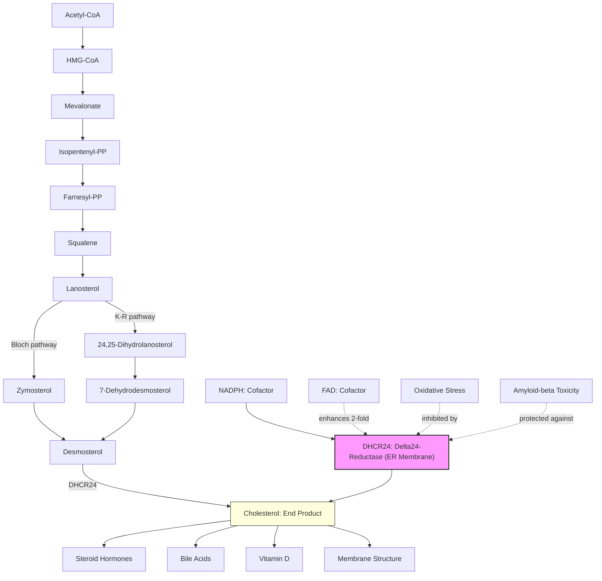

# Pathway Summary for DHCR24

## Overview
DHCR24 (Delta(24)-sterol reductase, also known as seladin-1) is the terminal enzyme in cholesterol biosynthesis that catalyzes the reduction of the delta-24 double bond of sterol intermediates, primarily converting desmosterol to cholesterol. This FAD-dependent, NADPH-requiring enzyme is localized to the endoplasmic reticulum membrane and also confers neuroprotection against oxidative stress and amyloid-beta toxicity [PMID:11519011, PMID:11007892]. Mutations in DHCR24 cause desmosterolosis, a rare disorder characterized by multiple congenital anomalies and elevated desmosterol levels.

## Core Pathways

### Cholesterol Biosynthesis Pathway (Bloch Pathway)
DHCR24 catalyzes the final step in the Bloch pathway of cholesterol biosynthesis, converting desmosterol to cholesterol. This pathway is the predominant route in most tissues and involves the reduction of the delta-24 double bond as the terminal step [PMID:11519011]. The enzyme is strictly dependent on NADPH and enhanced by FAD cofactor.

### Alternative Cholesterol Biosynthesis (Kandutsch-Russell Pathway)
DHCR24 also functions in the alternative Kandutsch-Russell pathway, where it can act earlier in the biosynthetic sequence on lanosterol and other intermediates. This flexibility allows cells to produce cholesterol through multiple routes depending on metabolic conditions [PMID:11519011].

### Neuroprotection and Anti-Apoptotic Signaling
Beyond its metabolic role, DHCR24 (as seladin-1) provides neuroprotection against oxidative stress and amyloid-beta toxicity. The protein was originally identified as selectively down-regulated in Alzheimer's disease brain regions, suggesting a protective role against neurodegeneration [PMID:11007892].

## Pathway Diagram

## Upstream Regulation
- **Transcriptional control**: SREBP-2 regulates DHCR24 expression in response to cellular cholesterol levels
- **Cofactor availability**: Requires NADPH (obligatory) and FAD (enhancing) for catalytic activity [PMID:11519011]
- **Substrate availability**: Dependent on upstream enzymes in cholesterol biosynthesis pathway

## Downstream Effects
- **Cholesterol production**: Essential for membrane structure, lipid rafts, and cellular functions [PMID:11519011]
- **Steroid hormone synthesis**: Provides cholesterol precursor for all steroid hormones
- **Bile acid synthesis**: Cholesterol converted to bile acids for digestion and cholesterol elimination
- **Vitamin D synthesis**: Cholesterol derivative converted to vitamin D3 in skin
- **Neuroprotection**: Protects neurons from oxidative damage and apoptotic signals [PMID:11007892]

## Subcellular Localization
- **Primary site**: Endoplasmic reticulum membrane (integral membrane protein) [PMID:11007892]
- **Minor site**: Golgi membrane (lesser amount) [PMID:11007892]
- **Topology**: N-terminal transmembrane domain anchors protein with catalytic domain facing cytoplasm

## Clinical Significance

### Desmosterolosis
Mutations in DHCR24 cause this rare autosomal recessive disorder characterized by:
- Multiple congenital anomalies
- Elevated desmosterol levels
- Developmental abnormalities
- Neurological symptoms

### Alzheimer's Disease
DHCR24 (seladin-1) is selectively down-regulated in vulnerable brain regions:
- Reduced expression correlates with neurodegeneration [PMID:11007892]
- Loss of neuroprotective function may contribute to disease progression
- Potential therapeutic target for AD treatment

## Enzymatic Properties
- **Substrate specificity**: Desmosterol (primary), lanosterol, zymosterol [PMID:11519011]
- **Cofactor requirements**: NADPH (obligatory), FAD (2-fold enhancement) [PMID:11519011]
- **Reaction mechanism**: Reduction of delta-24 double bond in sterol side chain
- **EC number**: 1.3.1.72

## Integration with Cellular Metabolism
DHCR24 connects multiple metabolic processes:
1. **Lipid metabolism**: Terminal step in cholesterol biosynthesis
2. **Steroid metabolism**: Provides precursor for all steroid hormones
3. **Cell survival pathways**: Neuroprotective signaling independent of enzymatic activity
4. **Membrane homeostasis**: Controls cholesterol levels for membrane integrity

## Regulatory Mechanisms
- **Feedback inhibition**: End-product (cholesterol) regulation via SREBP pathway
- **Post-translational**: Protein stability and ER retention signals
- **Tissue-specific expression**: Higher in brain, liver, and steroidogenic tissues