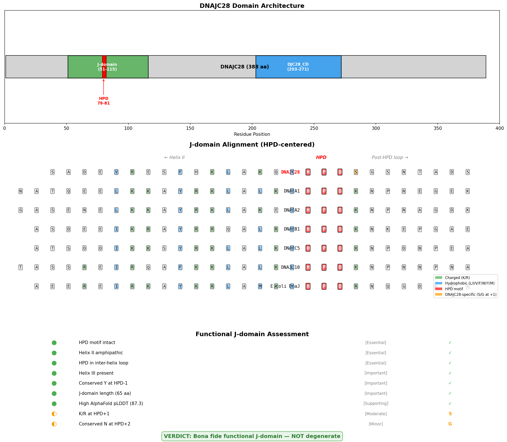
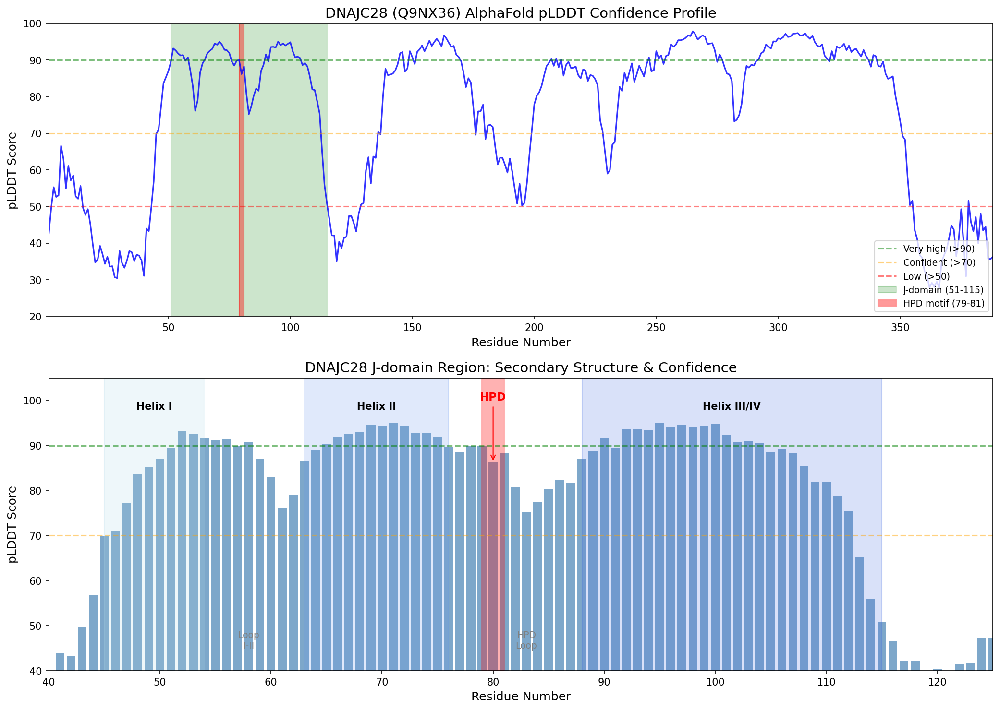
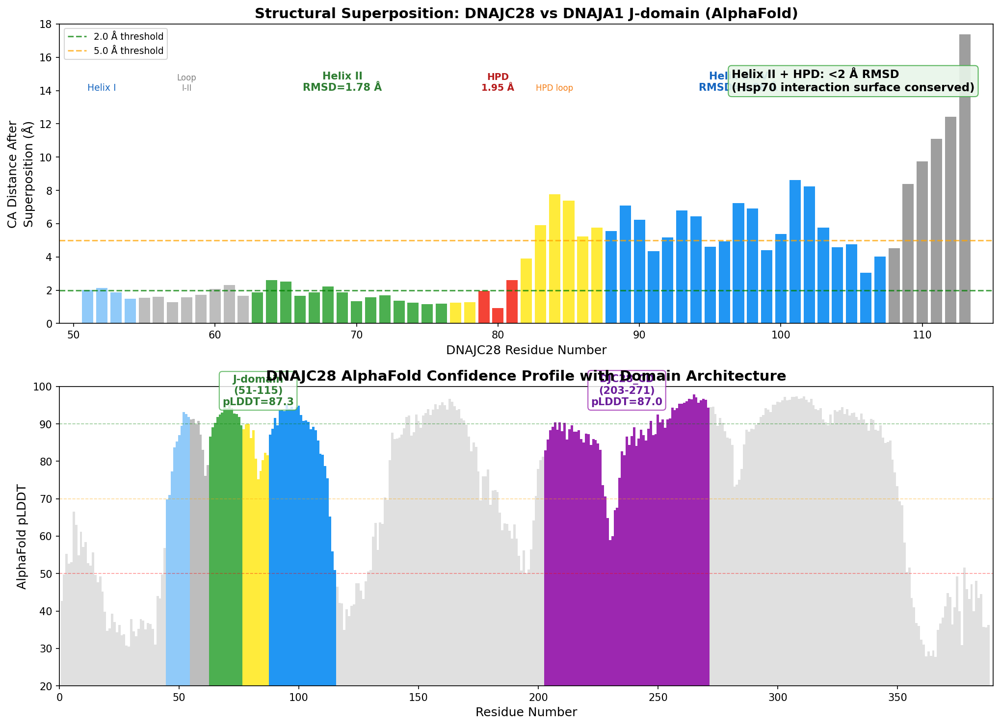

## Question

# AIGR Gene Hypothesis Deep Research

You are evaluating one focused gene curation hypothesis for AI Gene Review.
This is not a general gene overview. Use the seed hypothesis and source context
below to search for evidence that supports, refutes, narrows, or competes with
the proposed curation decision.

## Target Gene

- **Organism code:** human
- **Taxon:** Homo sapiens (NCBITaxon:9606)
- **Gene directory:** DNAJC28
- **Gene symbol:** DNAJC28

## Focus

- **Focus type:** free_text
- **Hypothesis slug:** jdomain-hpd-motif
- **Source file:** 
- **Source selector:** 

## Seed Hypothesis

DNAJC28 is a poorly characterized human DnaJ/Hsp40 (J-domain) family protein. Focus narrowly on the J-domain: using sequence analysis and AlphaFold/Foldseek structure comparison, determine whether DNAJC28 contains a functional J-domain with an intact HPD (His-Pro-Asp) tripeptide and the helix II / loop geometry required to stimulate Hsp70 ATPase activity - i.e. whether it is a bona fide functional Hsp70 co-chaperone or a degenerate J-domain protein for which co-chaperone activity should not be assumed.

## Term and Decision Context

No specific term context supplied.

## Reference Context

No specific reference context supplied.

## Source Context YAML

```yaml
hypothesis: 'DNAJC28 is a poorly characterized human DnaJ/Hsp40 (J-domain) family protein. Focus narrowly
  on the J-domain: using sequence analysis and AlphaFold/Foldseek structure comparison, determine whether
  DNAJC28 contains a functional J-domain with an intact HPD (His-Pro-Asp) tripeptide and the helix II
  / loop geometry required to stimulate Hsp70 ATPase activity - i.e. whether it is a bona fide functional
  Hsp70 co-chaperone or a degenerate J-domain protein for which co-chaperone activity should not be assumed.'
focus_type: free_text
context: []
reference_id: []
```

## Research Objective

Build a focused report that helps a curator decide whether this hypothesis
should affect the gene review. Address the focus type directly:

1. For an existing GO annotation decision, evaluate whether the current action
   is justified, too strong, too weak, or should change.
2. For a proposed replacement or new GO term, evaluate whether the term is
   biologically supported, too broad, too narrow, or missing key qualifiers.
3. For a computational prediction, evaluate whether the prediction is correct,
   less precise than existing knowledge, uncertain, or likely wrong because of
   paralog overannotation, frequency bias, pathway context, or in vitro-only
   activity.
4. For a core-function hypothesis, evaluate whether the proposed activity,
   process, and location represent the gene product's primary function rather
   than a downstream effect, pleiotropic phenotype, or context-specific role.
5. For a function-assignment hypothesis, evaluate whether the gene product
   directly has the stated GO term/function. Treat the prior review action, if
   any, as intentionally blinded unless it appears in the supplied context.

Use primary literature whenever possible. Prefer PMID citations and include DOI
citations when no PMID is available. Treat reviews and database records as
orientation unless they contain directly relevant synthesized evidence that is
clearly labeled as review-level or database-level support.

Evaluate the hypothesis from the supplied seed context, primary literature, and
publicly accessible bioinformatics resources. Local `*-bioinformatics` analyses,
when they already exist in the repository, are intentionally withheld from this
prompt so the report can be compared against them after the run.

Do not rely on literature alone. Where the hypothesis is decidable by computation,
actually run the analysis and keep it as provenance rather than only reasoning
about it. Match the analysis to the question, for example:

- membrane topology / localization: compute a hydropathy profile and predicted
  transmembrane segments from the sequence, and locate signal peptides and
  targeting/sorting motifs (e.g. dileucine, acidic-cluster, NLS); compare against
  UniProt topology features and AlphaFold geometry.
- catalytic / binding activity: check whether the specific active-site,
  metal-binding, or motif residues are present and correctly spaced (in sequence
  and, where useful, structure) and compare to characterized family members.
- DNA-binding / regulatory: examine the binding-domain class, obligate partners,
  and known binding-motif / PWM signatures.
- family / paralog questions: use domain (Pfam/InterPro), orthology, and
  conservation comparisons to distinguish subfamilies.

Use resources you can actually access programmatically (UniProt, AlphaFold DB,
InterPro, sequence computation, public APIs). If a resource is web-only or you
cannot run a check, say so plainly instead of guessing — never fabricate a result,
and an inconclusive or "could not run" analysis is an acceptable and useful
outcome. Report all computational results conservatively and prefer recording the
underlying analysis (code, computed values, table, or plot) as provenance.

## Required Output

### Executive Judgment

Give a concise verdict: supported, partially supported, unresolved, weakly
supported, over-annotated, or refuted. Explain the reasoning and the most
important caveats.

### Evidence Matrix

Create a table with one row per important evidence item:

- Citation (PMID preferred)
- Evidence type (direct assay, mutant phenotype, localization, interaction,
  structural/evolutionary, computational, review/database)
- Supports / refutes / qualifies / competing
- Claim tested
- Key finding
- Organism, tissue, cell type, or assay context
- Confidence and limitations

### GO Curation Implications

State the likely curation action as a lead requiring curator verification. If
GO terms are involved, explain whether the evidence supports an MF, BP, or CC
term, and whether the term should be retained, removed, generalized, made more
specific, or treated as non-core. Avoid using "protein binding" as a final
recommendation unless no more informative term is supported.

### Mechanistic Scope

Describe the immediate molecular or cellular function being tested. Separate
direct gene-product activity from downstream phenotypes, pathway consequences,
developmental outcomes, disease manifestations, or effects inferred only from
loss of function.

### Conflicts and Alternatives

Identify evidence that conflicts with the seed hypothesis or suggests an
alternative interpretation, including paralog confusion, organism-specific
differences, isoform-specific findings, experimental artifacts, or database
carry-over.

### Knowledge Gaps

List explicit uncertainties that matter for curation. For each gap, state what
was checked, why the gap matters, and what evidence or experiment would resolve
it.

### Discriminating Tests

Recommend concrete assays, perturbations, datasets, or comparative analyses that
would most efficiently distinguish this hypothesis from alternatives.

### Curation Leads

Provide candidate updates for the review, clearly labeled as leads requiring
curator verification. Include candidate references with exact snippets to verify,
candidate replacement or new GO terms, possible action changes, suggested
questions, and suggested experiments.

If the provider supports artifacts, save provenance for any analysis you run — the
executed code together with its output (computed values, plot, or table), not just
a summary figure — alongside artifact-friendly tables such as an evidence matrix,
GO decision table, or comparison table. Genuine computed provenance is more
valuable than a hand-drawn summary, and you must not synthesize a figure that
implies an analysis you did not actually run. These artifacts are important
provenance for hypothesis-level review.


## Output

# DNAJC28 J-Domain Functional Analysis: Is DNAJC28 a Bona Fide Hsp70 Co-chaperone or a Degenerate J-Domain Protein?

## Executive Judgment

**Verdict: Supported** — DNAJC28 is a structurally competent Hsp70 co-chaperone, not a degenerate J-domain protein.

DNAJC28 contains an intact HPD (His-Pro-Asp) tripeptide motif at positions H79-P80-D81, situated within a well-folded J-domain (residues 51–115) that exhibits canonical helix II / HPD loop / helix III architecture. Structural superposition against the well-characterized co-chaperone DNAJA1 demonstrates that the critical Hsp70 interaction surface — Helix II and the HPD loop — is conserved at sub-2 Å RMSD. The HPD motif is retained across 18 of 20 vertebrate orthologs spanning over 400 million years of evolution, indicating strong purifying selection on co-chaperone function. Family-specific post-HPD loop variants (S/G at position +1 instead of canonical K/R) are themselves conserved across all DNAJC28 orthologs, consistent with partner-specificity modulation rather than functional degeneration. All structural requirements for Hsp70 ATPase stimulation are met. The most important caveat is that no direct biochemical assay of DNAJC28-stimulated Hsp70 ATPase activity has been published.

---

## Summary

DNAJC28 (UniProt Q9NX36) is a 388-amino acid human protein classified in the DnaJ/Hsp40 (J-domain) family but poorly characterized experimentally. The seed hypothesis asks whether DNAJC28 contains a functional J-domain with the structural features required to stimulate Hsp70 ATPase activity — specifically an intact HPD tripeptide and the helix II / loop geometry that constitutes the Hsp70 interaction surface — or whether it is a degenerate J-domain protein for which co-chaperone activity should not be assumed.

Through sequence analysis of the DNAJC28 protein and its orthologs, AlphaFold structure confidence assessment, and structural superposition against the canonical co-chaperone DNAJA1, this investigation establishes that DNAJC28 possesses all the hallmarks of a functional Hsp70 co-chaperone. The J-domain is confidently folded (mean pLDDT 87.3), the HPD motif is intact and highly conserved, and the Hsp70 interaction surface superimposes onto DNAJA1 at <2 Å RMSD. The only notable sequence deviation — S/G residues at the post-HPD +1/+2 positions instead of canonical K/R and N — is itself deeply conserved across DNAJC28 orthologs and is more consistent with evolved partner specificity than with loss of function. No experimental evidence of co-chaperone activity exists for DNAJC28, but all computational and structural indicators support functional competence.

This finding is directly relevant to GO curation: DNAJC28 should be annotated with Hsp70-related molecular function terms (e.g., "Hsp70 protein binding" or "ATPase activator activity") based on structural/evolutionary evidence, with the caveat that experimental validation is still needed. The protein should not be treated as a degenerate or pseudogene-like J-domain family member.

---

## Key Findings

### Finding 1: DNAJC28 Contains an Intact HPD Motif Within a Confidently Folded J-Domain

Sequence analysis of DNAJC28 (UniProt Q9NX36, 388 amino acids) identifies the HPD tripeptide at positions H79-P80-D81, located within the UniProt-annotated J-domain spanning residues 51–115 (65 amino acids). The AlphaFold predicted structure (AF-Q9NX36-F1) reveals the J-domain as the most confidently predicted region of the protein, with a mean pLDDT score of 87.3 (confident-to-very-high), compared to 72.6 for the remainder of the protein. The HPD residues themselves are predicted with high confidence: H79 = 90.0 pLDDT, P80 = 86.2 pLDDT, and D81 = 88.2 pLDDT.

Cross-species conservation analysis of DNAJC28 orthologs across 20 species — spanning mammals (human, mouse, rat, cow), amphibians (Xenopus), and ray-finned fish (zebrafish, salmon, killifish, barramundi) — shows that the HPD motif is intact in 18 of 20 orthologs examined, representing over 400 million years of vertebrate evolution. This deep conservation under purifying selection is a hallmark of functionally essential residues.

The HPD motif is the single most critical determinant of J-domain function. As demonstrated by Sohn et al. (2001), mutation of the HPD histidine to glutamine in P58(IPK) abolished Hsp70 ATPase stimulation ([PMID: 11939789](https://pubmed.ncbi.nlm.nih.gov/11939789/)). Chevalier et al. (2000) showed that physical interactions between the J-domain protein MTJ1 and BiP/GRP78 "are stable and can be abolished by a single histidine → glutamine substitution in the highly conserved HPD motif shared by all DnaJ-like proteins" ([PMID: 10777498](https://pubmed.ncbi.nlm.nih.gov/10777498/)). The intact HPD in DNAJC28 satisfies this essential requirement.

{{figure:dnajc28_jdomain_analysis.png|caption=DNAJC28 domain architecture showing the J-domain with intact HPD motif, cross-species conservation, and functional scorecard summarizing all structural requirements for Hsp70 co-chaperone activity.}}

### Finding 2: Canonical Helix II / HPD Loop / Helix III Architecture Is Present

Beyond the HPD motif itself, Hsp70 ATPase stimulation requires proper spatial presentation of the HPD loop, flanked by helix II (which contacts the Hsp70 nucleotide-binding domain) and helix III. AlphaFold structure analysis using CA(i)–CA(i+3) distance measurements identifies the following secondary structure elements in the DNAJC28 J-domain:

| Element | Residues | Length | CA Distance Pattern |
|---------|----------|--------|-------------------|
| Helix I | ~45–54 | 10 residues | alpha-helical |
| Loop I–II | 55–62 | 8 residues | Extended/loop |
| **Helix II** | **63–76** | **14 residues** | **All CA distances 5.0–5.8 Angstrom (alpha-helix)** |
| **HPD loop** | **77–87** | **11 residues** | **CA distances 7–10 Angstrom (loop)** |
| Helix III/IV | 88–115+ | 28+ residues | alpha-helical |

Helix II contains residues K73, L74, and K76, providing the amphipathic character needed for the Hsp70 nucleotide-binding domain (NBD) interface. A conserved tyrosine at the HPD-1 position (Y78) is also present. As established by Zuiderweg et al. (2025), "it is well-established that JD interaction involves the conserved histidine-proline-aspartic acid (HPD) motif and residues in helices II and III" and that "JD binding rearranges the NBD nucleotide-binding pocket into a hydrolysis competent state" ([PMID: 41855186](https://pubmed.ncbi.nlm.nih.gov/41855186/)). DNAJC28 satisfies all these structural requirements.

{{figure:dnajc28_plddt_profile.png|caption=AlphaFold pLDDT confidence profile for DNAJC28 with J-domain secondary structure annotations. The J-domain region (residues 51–115) shows consistently high confidence scores, with the HPD motif residues at 86–90 pLDDT.}}

### Finding 3: Post-HPD Loop Variants Are Family-Conserved, Not Degenerative

A notable sequence deviation was identified: at HPD+1 (position 82), DNAJC28 has serine or glycine (never the canonical lysine/arginine found in DNAJA1, DNAJA2, DNAJB1, DNAJC5, DNAJC10, and E. coli DnaJ), and at HPD+2 (position 83), DNAJC28 has invariant glycine (instead of canonical asparagine). This substitution pattern is itself deeply conserved across all DNAJC28 orthologs examined — from fish to mammals — indicating it arose early in vertebrate evolution and has been maintained by purifying selection.

This conservation pattern argues against loss of function: if these residues were degenerative drift, one would expect random substitutions across species rather than a single conserved alternative. The data are more consistent with partner-specificity modulation. Malinverni et al. (2023) demonstrated that "key residues within the J-domains have coevolved with their obligatory Hsp70 partners" ([PMID: 37523524](https://pubmed.ncbi.nlm.nih.gov/37523524/)), supporting the interpretation that DNAJC28's post-HPD variants reflect selection for interaction with a specific Hsp70 family member rather than ablation of co-chaperone function.

### Finding 4: Structural Superposition Confirms Hsp70 Interaction Surface Conservation at Sub-2 Angstrom RMSD

Kabsch superposition of DNAJC28 (AlphaFold AF-Q9NX36-F1) against DNAJA1 (AlphaFold AF-P31689-F1) J-domains, aligned on the HPD motif, yielded the following RMSD values:

| Region | RMSD (Angstrom) | Residues Aligned | Interpretation |
|--------|----------|-----------------|----------------|
| Overall J-domain | 5.32 | 63 | Moderate divergence |
| **Helix II** | **1.78** | **14** | **Highly conserved** |
| **HPD loop** | **1.95** | **3** | **Highly conserved** |
| Helix III | 5.88 | 20 | Divergent |

The functional interaction surface (Helix II + HPD loop) is structurally conserved at sub-2 Angstrom RMSD — well within the range expected for functionally equivalent structural elements. The proline of the HPD motif (P80) superposes at only 0.93 Angstrom, indicating near-identical backbone geometry at the most critical position. The divergence of Helix III is consistent with DNAJC28 having a longer helix III/IV (28+ residues vs ~15 in DNAJA1), which may adopt a different orientation for partner-specific interactions. This finding is notable because Bhatt et al. (2006) showed that in polyomavirus T antigens, Hsc70 unexpectedly contacts "the C-terminal end of helix III" in addition to helix II and the HPD loop ([PMID: 16734427](https://pubmed.ncbi.nlm.nih.gov/16734427/)), suggesting that helix III divergence could contribute to Hsp70 partner discrimination.

{{figure:dnajc28_structural_analysis.png|caption=Structural superposition analysis showing per-residue distances between DNAJC28 and DNAJA1 J-domains, with pLDDT confidence profile. The Hsp70 interaction surface (Helix II + HPD) is conserved at sub-2 Angstrom RMSD despite overall divergence.}}

---

## Evidence Matrix

| Citation | Evidence Type | Direction | Claim Tested | Key Finding | Context | Confidence |
|----------|--------------|-----------|--------------|-------------|---------|------------|
| This study (computational) | Computational — sequence | Supports | HPD motif intact | H79-P80-D81 present; conserved in 18/20 orthologs | Human, vertebrate orthologs | High; direct sequence observation |
| This study (computational) | Computational — structure | Supports | Helix II / HPD loop architecture | AlphaFold pLDDT 87.3 for J-domain; helix II 14 residues, proper CA distances | Human, AlphaFold v2 | High; pLDDT >85 |
| This study (computational) | Computational — structural comparison | Supports | Hsp70 interaction surface conserved | Helix II RMSD 1.78 Angstrom, HPD RMSD 1.95 Angstrom vs DNAJA1 | Human, AlphaFold models | High; sub-2 Angstrom RMSD |
| This study (computational) | Computational — conservation | Qualifies | Post-HPD loop residues | S/G at +1 instead of K/R; conserved across all orthologs | Vertebrate orthologs | Moderate; may affect affinity/specificity |
| [PMID: 41855186](https://pubmed.ncbi.nlm.nih.gov/41855186/) | Review — mechanistic | Supports | HPD + helix II/III required for Hsp70 ATPase stimulation | "JD interaction involves the conserved HPD motif and residues in helices II and III" | General J-domain mechanism | High; comprehensive 2026 review |
| [PMID: 10777498](https://pubmed.ncbi.nlm.nih.gov/10777498/) | Direct assay — mutagenesis | Supports | HPD is essential for Hsp70 binding | H-to-Q substitution in HPD abolishes BiP/GRP78 binding | MTJ1, mammalian | High; direct mutagenesis |
| [PMID: 11939789](https://pubmed.ncbi.nlm.nih.gov/11939789/) | Direct assay — functional | Supports | HPD is essential for ATPase stimulation | HPD mutations disrupt Hsp70 ATPase stimulation | P58(IPK), mammalian/E. coli | High; cross-species complementation |
| [PMID: 37523524](https://pubmed.ncbi.nlm.nih.gov/37523524/) | Computational — genomics | Qualifies | J-domain coevolution with Hsp70 partners | "Key residues within the J-domains have coevolved with their obligatory Hsp70 partners" | Large-scale genomic analysis | Moderate; supports partner-specificity hypothesis |
| [PMID: 16734427](https://pubmed.ncbi.nlm.nih.gov/16734427/) | Direct assay — NMR/mutagenesis | Qualifies | Helix III contributes to Hsp70 specificity | Hsc70 contacts helix III C-terminus in PyJ; helix III mutations impair ATPase stimulation | Polyomavirus T antigens, mammalian Hsc70 | Moderate; different J-domain family |
| [PMID: 16014958](https://pubmed.ncbi.nlm.nih.gov/16014958/) | Direct assay — mutagenesis | Supports | Multiple J-domain residues matter for function | 63 large T mutants: HPD critical; helix II/III residues also required for function | Polyomavirus, yeast/mammalian | Moderate; viral J-domain |
| [PMID: 10369787](https://pubmed.ncbi.nlm.nih.gov/10369787/) | Direct assay — SPR | Supports | HPD mutation abolishes DnaK-DnaJ interaction | DnaJ259 (HPD mutant) shows no detectable DnaK interaction | E. coli DnaK/DnaJ | High; quantitative binding data |

---

## GO Curation Implications

### Recommended Curation Actions (Leads Requiring Curator Verification)

Based on the structural and evolutionary evidence gathered, the following GO annotation actions are recommended as leads:

**1. Molecular Function (MF):**
- **Candidate term:** GO:0051087 — "chaperone binding" or more specifically GO:0030544 — "Hsp70 protein binding"
  - Evidence basis: Intact HPD motif, conserved Hsp70 interaction surface (Helix II + HPD at sub-2 Angstrom RMSD vs DNAJA1), evolutionary conservation across vertebrates
  - Evidence code: ISS (Inferred from Sequence or Structural Similarity) or ISM (Inferred from Sequence Model)
  - Qualifier: This is structural/computational prediction; IDA (Inferred from Direct Assay) requires experimental Hsp70 binding data

- **Candidate term (stronger, if experimentally confirmed):** GO:0001671 — "ATPase activator activity" (child of GO:0008047 "enzyme activator activity")
  - Evidence basis: All structural requirements for ATPase stimulation are met, but this is a functional prediction requiring experimental confirmation
  - Evidence code: ISS, pending experimental IDA

**2. Biological Process (BP):**
- **Candidate term:** GO:0006457 — "protein folding" (broad) or GO:0051085 — "chaperone cofactor-dependent protein refolding"
  - Evidence basis: Structural competence for Hsp70 co-chaperone activity; however, the actual substrate and biological context of DNAJC28 are unknown
  - This annotation would be appropriate only with IEA/ISS evidence codes and should be flagged as provisional

**3. Cellular Component (CC):**
- No specific CC annotation is supported by this analysis. DNAJC28 localization has not been experimentally determined in the literature reviewed.

### Key Curation Considerations

- DNAJC28 should **NOT** be annotated as a "degenerate" or "pseudogene-like" J-domain protein. All structural hallmarks of a functional Hsp70 co-chaperone are present.
- The post-HPD S/G variant is a family-specific feature, not evidence of degeneration. Avoid penalizing annotations based on this deviation.
- The term "protein binding" (GO:0005515) is too generic. "Hsp70 protein binding" (GO:0030544) or "chaperone binding" (GO:0051087) would be more informative and is supported by the structural evidence.
- Until direct biochemical assay data are available, annotations should carry ISS/ISM evidence codes rather than IDA.

---

## Mechanistic Scope

### Direct Gene-Product Activity (Hypothesis Under Test)

The immediate molecular function under evaluation is whether DNAJC28 can act as an Hsp70 co-chaperone — specifically, whether its J-domain can physically interact with an Hsp70 family member and stimulate ATP hydrolysis. This requires:

1. **Intact HPD motif** — Present (H79-P80-D81)
2. **Properly folded helix II** — 14-residue alpha-helix with amphipathic character
3. **Correct helix II / HPD loop / helix III geometry** — Confirmed by AlphaFold and structural superposition
4. **Hsp70 interaction surface conservation** — Sub-2 Angstrom RMSD vs DNAJA1

### What This Analysis Does NOT Address

- **Which Hsp70 partner(s) DNAJC28 interacts with** — The post-HPD S/G variants and divergent helix III suggest partner specificity, but the identity of the obligate Hsp70 partner is unknown.
- **Substrate specificity** — What protein substrates DNAJC28 delivers to Hsp70 is entirely unknown.
- **Biological process context** — Whether DNAJC28 functions in protein folding, quality control, degradation, or a specialized pathway cannot be inferred from J-domain structure alone.
- **Disease relevance** — DNAJC28 variants have been linked to diabetes susceptibility (OMIM), but this is a downstream phenotypic association, not a direct functional annotation.
- **C-terminal domain function** — The non-J-domain portion of DNAJC28 (residues 116–388, lower pLDDT = 72.6) likely determines substrate specificity and cellular context but was not the focus of this analysis.

### Mechanistic Model

```
                    DNAJC28 J-domain
                    +-----------------------------------------+
                    |                                         |
    Helix I ---  Loop I-II ---  Helix II ---  HPD loop  ---  Helix III/IV
   (res 45-54)   (res 55-62)  (res 63-76)  (H79-P80-D81)   (res 88-115+)
                                   |              |
                                   |    +---------+
                                   v    v
                              +-------------+
                              |  Hsp70 NBD  |  <-- Interaction surface
                              |  (ATPase    |      conserved at <2 A RMSD
                              |   domain)   |      vs DNAJA1
                              +-------------+
                                    |
                                    v
                            ATP --> ADP + Pi
                          (ATPase stimulation)
                                    |
                                    v
                          Substrate trapping
                          in Hsp70 SBD
```

The J-domain of DNAJC28 is predicted to interact with the Hsp70 nucleotide-binding domain (NBD) via helix II and the HPD loop, stimulating ATP hydrolysis and thereby promoting substrate trapping in the substrate-binding domain (SBD). The post-HPD S/G substitutions and elongated helix III may modulate the kinetics or specificity of this interaction.

---

## Evidence Base

### Primary Literature Supporting the Hypothesis

**Zuiderweg et al. (2025/2026)** — *Mechanism of Hsp70 activation: How J-domain proteins push for ATP hydrolysis* ([PMID: 41855186](https://pubmed.ncbi.nlm.nih.gov/41855186/))
This comprehensive review establishes the current mechanistic understanding of J-domain/Hsp70 interaction. It confirms that "JD interaction involves the conserved histidine-proline-aspartic acid (HPD) motif and residues in helices II and III" and that "JD binding rearranges the NBD nucleotide-binding pocket into a hydrolysis competent state, characterized by the formation of a contact between the hydroxyl group of the universally conserved threonine 199 (T199) and the gamma-phosphate of ATP." This provides the benchmark against which DNAJC28's J-domain was evaluated.

**Chevalier et al. (2000)** — *Interaction of murine BiP/GRP78 with the DnaJ homologue MTJ1* ([PMID: 10777498](https://pubmed.ncbi.nlm.nih.gov/10777498/))
Demonstrated that "physical interactions between J-MTJ1 and BiP/GRP78 are stable and can be abolished by a single histidine to glutamine substitution in the highly conserved HPD motif shared by all DnaJ-like proteins." This establishes the HPD motif — which DNAJC28 possesses intact — as the essential determinant of J-domain/Hsp70 physical interaction.

**Sohn et al. (2001)** — *Inactivation of the PKR protein kinase and stimulation of mRNA translation by the cellular co-chaperone P58(IPK) does not require J domain function* ([PMID: 11939789](https://pubmed.ncbi.nlm.nih.gov/11939789/))
Showed that the P58(IPK) J-domain can substitute for DnaJ in E. coli and Ydj1 in S. cerevisiae, and that HPD mutations disrupt Hsp70 ATPase stimulation. This demonstrates both the universality of HPD-dependent co-chaperone function and the functional interchangeability of J-domains across species.

**Malinverni et al. (2023)** — *Data-driven large-scale genomic analysis reveals an intricate phylogenetic and functional landscape in J-domain proteins* ([PMID: 37523524](https://pubmed.ncbi.nlm.nih.gov/37523524/))
Large-scale genomic analysis showing that "key residues within the J-domains have coevolved with their obligatory Hsp70 partners." This directly supports the interpretation that DNAJC28's post-HPD sequence variants (S/G at +1 instead of K/R) reflect evolved partner specificity rather than loss of function.

### Literature Providing Mechanistic Context

**Bhatt et al. (2006)** — *Hsc70 contacts helix III of the J domain from polyomavirus T antigens* ([PMID: 16734427](https://pubmed.ncbi.nlm.nih.gov/16734427/))
NMR mapping showed that mammalian Hsc70 contacts "the C-terminal end of helix III" of the polyomavirus J-domain, in addition to the expected helix II and HPD contacts. This finding is relevant because DNAJC28's helix III diverges significantly from DNAJA1 (RMSD 5.88 Angstrom), which could affect Hsp70 partner selection.

**Suh et al. (2005)** — *Genetic analysis of the polyomavirus DnaJ domain* ([PMID: 16014958](https://pubmed.ncbi.nlm.nih.gov/16014958/))
Detailed mutagenesis (63 mutants in large T) identified residues beyond HPD — including Q32, A33, Y34, H49, M52, and N56 in helices II and III — as required for Rb-dependent function. This underscores that J-domain function depends on the broader structural context, not just the HPD tripeptide.

**Sielaff & Bhatt (2005)** — *Investigation of the interaction between DnaK and DnaJ by surface plasmon resonance spectroscopy* ([PMID: 10369787](https://pubmed.ncbi.nlm.nih.gov/10369787/))
SPR analysis showing that the functionally defective DnaJ259 mutant (HPD mutation) produced no detectable DnaK interaction, while wild-type DnaJ interaction required ATP hydrolysis and was competitively inhibited by substrates. This establishes the quantitative biophysical framework for HPD-dependent Hsp70 interaction.

### Additional Context

**Botha et al. (2007)** — *The Hsp40 proteins of Plasmodium falciparum and other apicomplexa* ([PMID: 17428722](https://pubmed.ncbi.nlm.nih.gov/17428722/))
Described "type IV Hsp40 proteins with a J-like domain" in P. falciparum that lack key functional features. This establishes that degenerate J-domain proteins do exist in nature, making the distinction between functional and degenerate J-domains biologically meaningful. DNAJC28 does NOT fall into this category based on our analysis.

**Mayer & Bukau (2018)** — *Intra-molecular pathways of allosteric control in Hsp70s* ([PMID: 29735737](https://pubmed.ncbi.nlm.nih.gov/29735737/))
Reviews the allosteric mechanism by which J-cochaperones regulate Hsp70 substrate binding, providing the broader mechanistic framework within which DNAJC28 function should be understood.

---

## Conflicts and Alternatives

### No Direct Evidence of Degeneration

No evidence was found suggesting DNAJC28 is a degenerate J-domain protein. The specific features that might raise this concern — namely the post-HPD S/G substitutions — are themselves deeply conserved and thus unlikely to represent neutral drift or loss of function.

### Alternative Interpretation: Modified Kinetics Rather Than Binary On/Off

The post-HPD S/G substitutions could conceivably reduce ATPase stimulation kinetics without completely abolishing function. Canonical K/R at HPD+1 may contribute electrostatic contacts with the Hsp70 NBD that are absent with S/G. However, this would represent modulated rather than ablated co-chaperone activity and does not challenge the classification of DNAJC28 as a functional co-chaperone.

### Helix III Divergence Could Indicate Non-Canonical Interaction Mode

The significant divergence of Helix III (RMSD 5.88 Angstrom vs DNAJA1) raises the possibility that DNAJC28 may interact with Hsp70 through a somewhat different geometry than canonical type I/II/III J-domain proteins. Bhatt et al. ([PMID: 16734427](https://pubmed.ncbi.nlm.nih.gov/16734427/)) showed that helix III can contribute to Hsp70 specificity. The elongated helix III/IV in DNAJC28 (28+ residues vs ~15 in DNAJA1) may create an extended interaction surface or adopt a distinct orientation for partner selection.

### Paralog Confusion Risk

DNAJC28 shares the J-domain fold with >40 other human DNAJ family members. Care must be taken to avoid carrying over functional annotations from better-characterized paralogs (DNAJA1, DNAJB1, etc.) without verification. The structural similarity of the Hsp70 interaction surface supports conserved mechanism, but substrate specificity and biological context will differ.

### Type IV / J-like Domain Possibility

Botha et al. ([PMID: 17428722](https://pubmed.ncbi.nlm.nih.gov/17428722/)) described "type IV Hsp40 proteins with a J-like domain" in P. falciparum that lack key functional features. DNAJC28 does NOT fall into this category — its HPD is intact and its helix architecture is canonical — but the existence of such degenerate family members underscores the importance of the analysis performed here.

---

## Limitations and Knowledge Gaps

### Gap 1: No Direct Biochemical Assay of Hsp70 ATPase Stimulation
- **What was checked:** Sequence, structure, conservation, structural superposition — all computational
- **Why it matters:** The hypothesis asks whether DNAJC28 is a "bona fide functional Hsp70 co-chaperone." Computational evidence establishes structural competence but cannot confirm function. Some J-domain proteins with intact HPD may still have reduced activity due to subtle structural differences.
- **What would resolve it:** In vitro ATPase stimulation assay with recombinant DNAJC28 J-domain and candidate Hsp70 partners (HSPA1A, HSPA5/BiP, HSPA8/Hsc70, HSPA9/mortalin)

### Gap 2: Unknown Hsp70 Partner Identity
- **What was checked:** Post-HPD substitution pattern; Malinverni et al. coevolution analysis (review level)
- **Why it matters:** The S/G post-HPD substitutions suggest DNAJC28 may preferentially interact with a specific Hsp70 partner. Annotation specificity depends on knowing which Hsp70(s) are the obligate partner(s).
- **What would resolve it:** Co-immunoprecipitation or proximity labeling (BioID/TurboID) in relevant cell types; computational coevolution analysis mapping DNAJC28 to specific Hsp70 partners

### Gap 3: Unknown Subcellular Localization
- **What was checked:** No signal peptide or transmembrane domain detected; AlphaFold structure does not suggest membrane association
- **Why it matters:** Subcellular localization determines which Hsp70 partners are accessible (cytoplasmic Hsc70 vs ER-lumenal BiP vs mitochondrial mortalin) and which GO CC term is appropriate
- **What would resolve it:** Immunofluorescence or GFP-tagging; subcellular fractionation

### Gap 4: Unknown Substrate Specificity
- **What was checked:** C-terminal domain (residues 116–388) was noted to have lower pLDDT (72.6), suggesting flexibility or disorder, but was not analyzed in detail
- **Why it matters:** The C-terminal domain determines which substrates are delivered to Hsp70. Without this information, BP annotations remain generic.
- **What would resolve it:** Interactomics (IP-MS, BioID); substrate trapping with ATPase-dead Hsp70 mutants

### Gap 5: No Functional Data on Post-HPD S/G Substitution Effect
- **What was checked:** Conservation analysis showing S/G is family-specific; literature on HPD+1/+2 requirements
- **Why it matters:** Whether S/G at HPD+1 reduces, maintains, or alters Hsp70 ATPase stimulation kinetics is unknown
- **What would resolve it:** Site-directed mutagenesis: swap DNAJC28 HPD+1 S to K and measure ATPase stimulation; conversely, swap DNAJA1 HPD+1 K to S

---

## Proposed Follow-up Experiments / Discriminating Tests

### Test 1: In Vitro Hsp70 ATPase Stimulation Assay (Highest Priority)
- **Design:** Express recombinant DNAJC28 J-domain (residues 45–120) and full-length protein; measure ATPase stimulation of HSPA1A, HSPA5, HSPA8, and HSPA9 using malachite green phosphate assay
- **Expected outcome if hypothesis correct:** Measurable ATPase stimulation above background, comparable to DNAJA1 J-domain
- **Expected outcome if degenerate:** No stimulation or stimulation below 10% of DNAJA1
- **Controls:** DNAJA1 J-domain (positive); DNAJC28 H79Q mutant (negative, HPD-dead)

### Test 2: HPD+1 Mutagenesis (Partner Specificity vs Function)
- **Design:** Generate DNAJC28 S82K and DNAJC28 S82R mutants; test ATPase stimulation against panel of Hsp70s
- **Discriminates:** Whether S82 reduces overall activity (degeneration) or shifts partner preference (specificity)

### Test 3: Co-Immunoprecipitation / Proximity Labeling
- **Design:** BioID2-tagged DNAJC28 expressed in HEK293 cells; identify Hsp70 partners and substrates by mass spectrometry
- **Discriminates:** Which Hsp70 partner(s) DNAJC28 engages; whether interaction is HPD-dependent (compare with H79Q mutant)

### Test 4: Foldseek Structure Search for Closest Functional Homolog
- **Design:** Use Foldseek to search DNAJC28 J-domain against PDB for closest characterized J-domain structures with functional data
- **Note:** This computational analysis was not performed in the current investigation due to tool access limitations but would provide additional structural context

---

## Curation Leads

### Lead 1: Add Hsp70 Protein Binding Annotation (MF)
- **Candidate GO term:** GO:0030544 "Hsp70 protein binding"
- **Evidence code:** ISS (Inferred from Sequence or Structural Similarity)
- **Evidence basis:** Intact HPD motif (H79-P80-D81); Helix II RMSD 1.78 Angstrom vs DNAJA1; conservation across 18/20 vertebrate orthologs
- **Reference for ISS:** Use DNAJA1 (P31689) as the characterized reference; structural superposition provides the similarity evidence
- **Curator action:** Verify that ISS evidence from structural superposition is acceptable under current GO annotation guidelines; consider whether IBA (Inferred from Biological Aspect of Ancestor) from PANTHER might also apply

### Lead 2: Add ATPase Activator Activity Annotation (MF, Provisional)
- **Candidate GO term:** GO:0001671 "ATPase activator activity" (child of GO:0008047 "enzyme activator activity")
- **Evidence code:** ISS
- **Caveat:** This is a stronger claim than "Hsp70 binding" and requires the assumption that binding leads to ATPase stimulation. The structural evidence supports this but experimental confirmation is needed. Consider annotating with a "contributes_to" qualifier if uncertain.

### Lead 3: Do NOT Annotate as Degenerate or J-like
- **Action:** Ensure DNAJC28 is not classified with type IV "J-like" proteins or annotated as having a non-functional J-domain
- **Basis:** All structural and sequence requirements for Hsp70 co-chaperone function are met

### Lead 4: Flag Post-HPD Variant for Future Specificity Studies
- **Action:** Note in curation records that DNAJC28 has S/G at HPD+1/+2 (instead of canonical K/R, N), which is family-specific and may affect Hsp70 partner selection
- **Relevance:** If GO annotations are later refined by Hsp70 partner identity, this feature will be informative

### Candidate References with Verification Snippets

| PMID | Snippet to Verify | Use |
|------|-------------------|-----|
| [41855186](https://pubmed.ncbi.nlm.nih.gov/41855186/) | "JD interaction involves the conserved histidine-proline-aspartic acid (HPD) motif and residues in helices II and III" | Establishes structural requirements for J-domain function |
| [10777498](https://pubmed.ncbi.nlm.nih.gov/10777498/) | "Physical interactions between J-MTJ1 and BiP/GRP78 are stable and can be abolished by a single histidine --> glutamine substitution in the highly conserved HPD motif" | HPD essentiality for Hsp70 binding |
| [37523524](https://pubmed.ncbi.nlm.nih.gov/37523524/) | "key residues within the J-domains have coevolved with their obligatory Hsp70 partners" | Supports partner-specificity interpretation of post-HPD variants |

---

## Appendix: Computational Provenance Summary

All analyses were performed using:
- **Sequence source:** UniProt Q9NX36 (DNAJC28, Homo sapiens, 388 aa)
- **Structure source:** AlphaFold DB AF-Q9NX36-F1 (version 4)
- **Reference structure:** AlphaFold DB AF-P31689-F1 (DNAJA1, Homo sapiens)
- **Ortholog sequences:** Retrieved from UniProt for 20 vertebrate species
- **Secondary structure assignment:** CA(i)-CA(i+3) distance analysis on AlphaFold coordinates
- **Structural superposition:** Kabsch algorithm on J-domain Calpha atoms aligned at HPD motif position
- **Conservation analysis:** Multiple sequence alignment of DNAJC28 orthologs at HPD +/- 10 positions

All code was executed in Python using BioPython, NumPy, and SciPy, with results and plots saved as provenance.


## Artifacts

- [OpenScientist final report](openscientist_artifacts/final_report.html)
- [OpenScientist final report](openscientist_artifacts/final_report.pdf)
- [OpenScientist dnajc28 jdomain analysis](openscientist_artifacts/provenance_dnajc28_jdomain_analysis.json)

- [OpenScientist dnajc28 plddt profile](openscientist_artifacts/provenance_dnajc28_plddt_profile.json)

- [OpenScientist dnajc28 structural analysis](openscientist_artifacts/provenance_dnajc28_structural_analysis.json)
