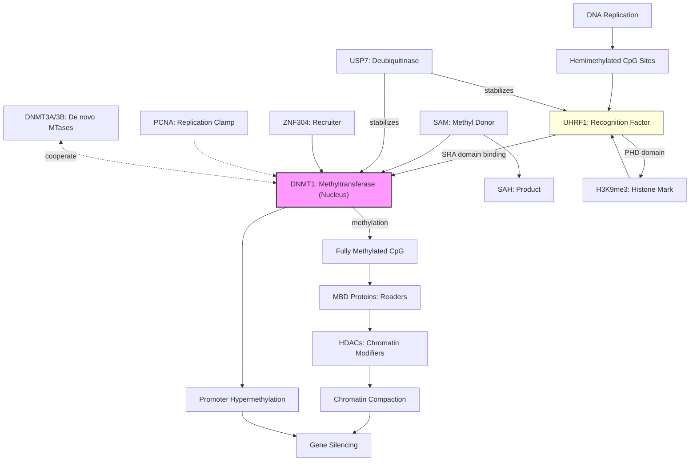

# Pathway Summary for DNMT1

## Overview
DNMT1 is the predominant mammalian maintenance DNA methyltransferase responsible for preserving CpG methylation patterns during DNA replication. It methylates cytosine residues at CpG dinucleotides using S-adenosyl-L-methionine (SAM) as the methyl donor, with a 2-fold preference for hemimethylated sites [PMID:18754681]. DNMT1 plays essential roles in genomic imprinting, X-chromosome inactivation, heterochromatin formation, and silencing of repetitive elements.

## Core Pathways

### DNA Methylation Maintenance Pathway
DNMT1 functions as the primary maintenance methyltransferase during DNA replication, copying methylation patterns from parent to daughter strands. The enzyme recognizes hemimethylated CpG sites created during replication and methylates the unmethylated cytosine on the newly synthesized strand [PMID:8940105]. This process requires coordination with replication machinery and chromatin factors.

### UHRF1-Dependent Methylation Pathway
UHRF1 acts as an essential cofactor that recruits DNMT1 to hemimethylated DNA. UHRF1's SRA domain recognizes hemimethylated CpG sites, while its PHD domain binds H3K9me3, linking DNA methylation to histone modifications [PMID:21745816]. USP7 deubiquitinase stabilizes both DNMT1 and UHRF1, forming a regulatory complex at methylated chromatin.

### Transcriptional Silencing Pathway
DNMT1-mediated CpG island methylation leads to gene silencing through multiple mechanisms. Methylated DNA recruits methyl-CpG binding proteins (MBDs) which associate with histone deacetylases and chromatin remodeling complexes [PMID:24623306]. This creates a repressive chromatin environment that blocks transcription factor access and RNA polymerase activity.

## Pathway Diagram

## Upstream Regulators
- **UHRF1**: Essential E3 ubiquitin ligase that recognizes hemimethylated DNA and recruits DNMT1 [PMID:21745816]
- **USP7**: Deubiquitinase that stabilizes DNMT1 and stimulates its activity [PMID:21745816]
- **PCNA**: Replication processivity factor that recruits DNMT1 to replication foci
- **ZNF304**: Zinc finger protein that recruits DNMT1 for targeted gene silencing [PMID:24623306]

## Downstream Effects
- **CpG methylation maintenance**: Preserves methylation patterns across cell divisions [PMID:8940105]
- **Gene silencing**: Represses transcription through promoter hypermethylation [PMID:24623306]
- **Heterochromatin formation**: Contributes to constitutive heterochromatin assembly
- **Genomic stability**: Silences repetitive elements and transposons
- **X-inactivation**: Maintains silencing of inactive X chromosome
- **Imprinting control**: Preserves parent-of-origin specific methylation

## Protein Domains and Functions
- **RFTS domain**: Autoinhibitory domain that regulates activity
- **CXXC domain**: Recognizes unmethylated CpG sites, essential for activity [PMID:18754681]
- **BAH domains**: Mediate protein-protein interactions
- **Catalytic domain**: C-terminal methyltransferase domain using SAM cofactor

## Clinical Significance

### Cancer
DNMT1 overexpression in cancer leads to:
- Tumor suppressor gene hypermethylation and silencing
- CpG island methylator phenotype (CIMP)
- Therapeutic target for DNA methyltransferase inhibitors (azacitidine, decitabine)

### Hereditary Sensory and Autonomic Neuropathy Type 1E
Mutations in DNMT1 cause HSAN1E characterized by:
- Adult-onset sensory neuropathy
- Hearing loss and dementia
- Aberrant DNA methylation patterns

## Regulatory Mechanisms
- **Cell cycle regulation**: Expression and localization change during S-phase [PMID:16791210]
- **Post-translational modifications**: Phosphorylation, ubiquitination affect stability and activity
- **Protein-protein interactions**: Multiple partners modulate function and targeting
- **Autoinhibition**: RFTS domain blocks catalytic activity until properly targeted

## Integration with Epigenetic Networks
DNMT1 coordinates with multiple epigenetic systems:
1. **Histone modifications**: Links H3K9me3 to DNA methylation via UHRF1
2. **Chromatin remodeling**: Cooperates with SNF2H and other remodelers
3. **De novo methylation**: Interacts with DNMT3A/3B for methylation establishment
4. **Methyl-CpG readers**: Creates binding sites for MBD proteins and MECP2

## Cofactor Requirements
- **SAM (S-adenosyl-L-methionine)**: Obligatory methyl donor
- **Hemimethylated DNA**: Preferred substrate (2-fold preference)
- **UHRF1**: Essential for targeting to hemimethylated sites [PMID:21745816]