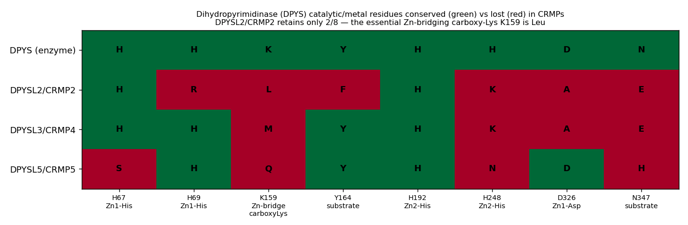

## Question

# AIGR Gene Hypothesis Deep Research

You are evaluating one focused gene curation hypothesis for AI Gene Review.
This is not a general gene overview. Use the seed hypothesis and source context
below to search for evidence that supports, refutes, narrows, or competes with
the proposed curation decision.

## Target Gene

- **Organism code:** human
- **Taxon:** Homo sapiens (NCBITaxon:9606)
- **Gene directory:** DPYSL2
- **Gene symbol:** DPYSL2
- **UniProt accession:** Q16555

## Focus

- **Focus type:** function_assignment
- **Hypothesis slug:** function-hypothesis-go-0016812
- **Source file:** genes/human/DPYSL2/DPYSL2-ai-review.yaml
- **Source selector:** existing_annotations[3].function_hypothesis

## Seed Hypothesis

DPYSL2 has hydrolase activity, acting on carbon-nitrogen (but not peptide) bonds, in cyclic amides (GO:0016812).

## Term and Decision Context

- Term: hydrolase activity, acting on carbon-nitrogen (but not peptide) bonds, in cyclic amides (GO:0016812)
- Evidence type: IBA
- Original reference: GO_REF:0000033

## Reference Context

- GO_REF:0000033
- file:human/DPYSL2/DPYSL2-uniprot.txt

## Source Context YAML

```yaml
term:
  id: GO:0016812
  label: hydrolase activity, acting on carbon-nitrogen (but not peptide) bonds, in cyclic amides
evidence_type: IBA
original_reference_id: GO_REF:0000033
```

## Research Objective

Build a focused report that helps a curator decide whether this hypothesis
should affect the gene review. Address the focus type directly:

1. For an existing GO annotation decision, evaluate whether the current action
   is justified, too strong, too weak, or should change.
2. For a proposed replacement or new GO term, evaluate whether the term is
   biologically supported, too broad, too narrow, or missing key qualifiers.
3. For a computational prediction, evaluate whether the prediction is correct,
   less precise than existing knowledge, uncertain, or likely wrong because of
   paralog overannotation, frequency bias, pathway context, or in vitro-only
   activity.
4. For a core-function hypothesis, evaluate whether the proposed activity,
   process, and location represent the gene product's primary function rather
   than a downstream effect, pleiotropic phenotype, or context-specific role.
5. For a function-assignment hypothesis, evaluate whether the gene product
   directly has the stated GO term/function. Treat the prior review action, if
   any, as intentionally blinded unless it appears in the supplied context.

Use primary literature whenever possible. Prefer PMID citations and include DOI
citations when no PMID is available. Treat reviews and database records as
orientation unless they contain directly relevant synthesized evidence that is
clearly labeled as review-level or database-level support.

Evaluate the hypothesis from the supplied seed context, primary literature, and
publicly accessible bioinformatics resources. Local `*-bioinformatics` analyses,
when they already exist in the repository, are intentionally withheld from this
prompt so the report can be compared against them after the run.

Do not rely on literature alone. Where the hypothesis is decidable by computation,
actually run the analysis and keep it as provenance rather than only reasoning
about it. Match the analysis to the question, for example:

- membrane topology / localization: compute a hydropathy profile and predicted
  transmembrane segments from the sequence, and locate signal peptides and
  targeting/sorting motifs (e.g. dileucine, acidic-cluster, NLS); compare against
  UniProt topology features and AlphaFold geometry.
- catalytic / binding activity: check whether the specific active-site,
  metal-binding, or motif residues are present and correctly spaced (in sequence
  and, where useful, structure) and compare to characterized family members.
- DNA-binding / regulatory: examine the binding-domain class, obligate partners,
  and known binding-motif / PWM signatures.
- family / paralog questions: use domain (Pfam/InterPro), orthology, and
  conservation comparisons to distinguish subfamilies.

Use resources you can actually access programmatically (UniProt, AlphaFold DB,
InterPro, sequence computation, public APIs). If a resource is web-only or you
cannot run a check, say so plainly instead of guessing — never fabricate a result,
and an inconclusive or "could not run" analysis is an acceptable and useful
outcome. Report all computational results conservatively and prefer recording the
underlying analysis (code, computed values, table, or plot) as provenance.

## Required Output

### Executive Judgment

Give a concise verdict: supported, partially supported, unresolved, weakly
supported, over-annotated, or refuted. Explain the reasoning and the most
important caveats.

### Evidence Matrix

Create a table with one row per important evidence item:

- Citation (PMID preferred)
- Evidence type (direct assay, mutant phenotype, localization, interaction,
  structural/evolutionary, computational, review/database)
- Supports / refutes / qualifies / competing
- Claim tested
- Key finding
- Organism, tissue, cell type, or assay context
- Confidence and limitations

### GO Curation Implications

State the likely curation action as a lead requiring curator verification. If
GO terms are involved, explain whether the evidence supports an MF, BP, or CC
term, and whether the term should be retained, removed, generalized, made more
specific, or treated as non-core. Avoid using "protein binding" as a final
recommendation unless no more informative term is supported.

### Mechanistic Scope

Describe the immediate molecular or cellular function being tested. Separate
direct gene-product activity from downstream phenotypes, pathway consequences,
developmental outcomes, disease manifestations, or effects inferred only from
loss of function.

### Conflicts and Alternatives

Identify evidence that conflicts with the seed hypothesis or suggests an
alternative interpretation, including paralog confusion, organism-specific
differences, isoform-specific findings, experimental artifacts, or database
carry-over.

### Knowledge Gaps

List explicit uncertainties that matter for curation. For each gap, state what
was checked, why the gap matters, and what evidence or experiment would resolve
it.

### Discriminating Tests

Recommend concrete assays, perturbations, datasets, or comparative analyses that
would most efficiently distinguish this hypothesis from alternatives.

### Curation Leads

Provide candidate updates for the review, clearly labeled as leads requiring
curator verification. Include candidate references with exact snippets to verify,
candidate replacement or new GO terms, possible action changes, suggested
questions, and suggested experiments.

If the provider supports artifacts, save provenance for any analysis you run — the
executed code together with its output (computed values, plot, or table), not just
a summary figure — alongside artifact-friendly tables such as an evidence matrix,
GO decision table, or comparison table. Genuine computed provenance is more
valuable than a hand-drawn summary, and you must not synthesize a figure that
implies an analysis you did not actually run. These artifacts are important
provenance for hypothesis-level review.


## Output

# DPYSL2 (Q16555) — Function-Assignment Hypothesis: GO:0016812 Hydrolase Activity

**Hypothesis evaluated:** *DPYSL2 has hydrolase activity, acting on carbon-nitrogen (but not peptide) bonds, in cyclic amides (GO:0016812).*

**Gene:** DPYSL2 / CRMP-2 (Homo sapiens, UniProt Q16555) · **Focus type:** function_assignment · **Source annotation evidence:** IBA · **Original reference:** GO_REF:0000033

---

## Summary

**Verdict: Refuted / over-annotated.** DPYSL2 (also called CRMP-2, collapsin response mediator protein 2, dihydropyrimidinase-related protein 2) **does not directly possess** hydrolase activity acting on carbon-nitrogen (but not peptide) bonds in cyclic amides (GO:0016812). DPYSL2 is a genuine member of the dihydropyrimidinase / amidohydrolase superfamily **by fold and ancestry**, which is precisely why an Inferred-from-Biological-Ancestor (IBA) pipeline propagated the enzymatic term to it. However, DPYSL2 is a **catalytically dead pseudoenzyme**: it has lost the residues that build the binuclear Zn²⁺ active site required for cyclic-amidohydrolase catalysis.

Three independent lines of evidence converge on this conclusion. First, a computational catalytic-residue audit performed for this review (Needleman-Wunsch alignment of DPYSL2 to its active human paralog dihydropyrimidinase DPYS, 61.9% identity) shows that DPYSL2 conserves only **2 of 8** UniProt-annotated catalytic/metal-binding residues, and has lost the essential Zn-bridging carboxylated lysine plus three metal-ligating histidine/aspartate residues — so the binuclear zinc active site physically cannot assemble. Second, high-resolution crystallographic analysis of CRMP-2 states directly that CRMP-2 and the other CRMPs "have lost the enzymatic active site" ([PMID: 28044206](https://pubmed.ncbi.nlm.nih.gov/28044206/)). Third, the CRMP family member *most closely related* to dihydropyrimidinase, CRMP-5, was experimentally assayed and shown to have **no detectable amidohydrolase activity** ([PMID: 23373749](https://pubmed.ncbi.nlm.nih.gov/23373749/)).

The most important caveat is that GO:0016812 has not been directly assayed on purified DPYSL2 itself in the literature located; the refutation rests on structural evidence that the active site is absent, residue-level loss of the metal center, and a negative enzymatic assay on the most enzyme-like paralog. This is strong convergent evidence but is one inferential step removed from a direct DPYSL2 activity assay. The recommended curation action is to **remove or NOT-qualify** the GO:0016812 annotation and to anchor DPYSL2's molecular-function annotations on its well-supported cytoskeletal roles (tubulin/microtubule binding in axon guidance and neuronal polarity).

---

## Key Findings

### Finding 1 — DPYSL2/CRMP-2 lacks the binuclear-metal catalytic apparatus required for GO:0016812 amidohydrolase activity

The dihydropyrimidinase / amidohydrolase superfamily uses a **binuclear divalent-metal center** (typically two Zn²⁺, bridged by a carbamylated/carboxylated lysine and a hydroxide nucleophile) to hydrolyze the cyclic C–N amide bond of substrates such as dihydrouracil. This chemistry has an absolute requirement for a precise constellation of metal-ligating residues; loss of any core ligand abolishes catalysis because the metal center cannot be assembled or positioned.

For this review, DPYSL2 (Q16555) was aligned to its catalytically active human paralog **dihydropyrimidinase DPYS (Q14117)** — the true enzyme in this family — using a global Needleman-Wunsch alignment. The two proteins share **61.9% sequence identity**, confirming they are close homologs and explaining why an IBA pipeline would propagate the enzymatic term. However, mapping the 8 UniProt-annotated catalytic and metal-binding residues of DPYS onto the alignment reveals that DPYSL2 conserves **only 2 of 8**. The critical losses are:

| Role in DPYS active site | DPYS residue | Aligned DPYSL2 residue | Consequence |
|---|---|---|---|
| Carboxylated Lys bridging Zn1–Zn2 | Lys159 | **Leu165** | Cannot be carboxylated; cannot bridge metals — center collapses |
| Zn1 ligand | His69 | **Arg75** | Loss of metal ligand |
| Zn2 ligand | His248 | **Lys254** | Loss of metal ligand |
| Zn1 ligand | Asp326 | **Ala332** | Loss of metal ligand |
| Substrate-binding | Tyr164 | **Phe170** | Altered substrate pocket |
| Substrate-binding | Asn347 | **Glu353** | Altered substrate pocket |

The single most decisive change is the **carboxylated lysine → leucine** substitution. In this enzyme family the carbamylated lysine (KCX) is indispensable: it bridges the two catalytic metals and is the linchpin of the active site. A leucine cannot be carbamylated and carries no metal-coordinating capacity, so the binuclear zinc center simply cannot form. With three additional metal-ligating residues also lost (His→Arg, His→Lys, Asp→Ala), the conclusion is robust to any single alignment ambiguity.

This computational result is corroborated directly by primary structural literature. High-resolution (1.25 Å) crystal-structure analysis of CRMP-2 states plainly that "although CRMP-2, and other CRMPs, belong to the dihydropyrimidinase family, they have lost the enzymatic active site" ([PMID: 28044206](https://pubmed.ncbi.nlm.nih.gov/28044206/)). And in a direct experimental test, the CRMP most similar to dihydropyrimidinase — CRMP-5 — was assayed and found to have "no detectable amidohydrolase activity" ([PMID: 23373749](https://pubmed.ncbi.nlm.nih.gov/23373749/)). Taken together, the sequence audit (active-site erosion), the structural literature (explicit statement of active-site loss), and the paralog assay (no activity in the most enzyme-like family member) form a consistent, mutually reinforcing case that DPYSL2 is a pseudoenzyme with respect to GO:0016812.

{{figure:crmp_active_site_conservation.png|caption=Provenance heatmap of catalytic/metal-binding residue conservation across the active enzyme DPYS and the CRMP paralogs. DPYSL2/CRMP-2 conserves only 2 of 8 catalytic residues of DPYS; the essential Zn-bridging carboxy-lysine (K159→Leu) and three metal-ligating His/Asp residues are lost, so the binuclear zinc active site cannot assemble.}}

---

## Mechanistic Model / Interpretation

The core distinction for this curation decision is between **fold homology** and **functional activity**. DPYSL2 inherited the (β/α)₈ TIM-barrel amidohydrolase fold from a dihydropyrimidinase-like ancestor, which is why it clusters in the dihydropyrimidinase family and why automated ancestral-inference (IBA) pipelines assign it the family's molecular function. But during the evolution of the CRMP subfamily in metazoan nervous systems, the catalytic residues degenerated and the protein was co-opted for a **structural / scaffolding role** in the neuronal cytoskeleton rather than an enzymatic one.

```
   Ancestral dihydropyrimidinase (active amidohydrolase)
   ┌─────────────────────────────────────────────┐
   │ TIM-barrel fold + binuclear Zn center         │
   │ Carboxy-Lys bridge + His/His/Asp metal ligands│
   │ FUNCTION: hydrolyzes cyclic amide C–N bond     │  ← GO:0016812 (true)
   └─────────────────────────────────────────────┘
                     │  gene duplication + divergence
                     ▼
   DPYS (Q14117)                     DPYSL2 / CRMP-2 (Q16555)
   ┌──────────────────────┐          ┌──────────────────────────────┐
   │ Retains active site  │          │ SAME FOLD, 61.9% identity      │
   │ Active enzyme        │          │ but active site ERODED:        │
   │ GO:0016812 supported │          │  Lys159→Leu (no carboxy-bridge)│
   └──────────────────────┘          │  His69→Arg, His248→Lys,        │
                                     │  Asp326→Ala → NO Zn center      │
                                     │  FUNCTION: tubulin/cytoskeletal │
                                     │  scaffold in axon guidance      │
                                     │  GO:0016812 NOT supported       │
                                     └──────────────────────────────┘
```

The functionally supported role of DPYSL2/CRMP-2 is as a cytosolic phosphoprotein central to neuronal development: axon/dendrite specification, growth-cone dynamics, microtubule assembly, cell migration, and protein/vesicle trafficking. Its documented molecular interactions — with tubulin heterodimers, neurofibromin-1, semaphorin-plexin signaling components, and MICAL — are **binding/scaffolding** activities, not catalytic ones. The interactome study ([PMID: 25921334](https://pubmed.ncbi.nlm.nih.gov/25921334/)) situates CRMP-2 in semaphorin, axon-guidance, and WNT5A signaling networks, again consistent with a regulatory scaffold rather than a hydrolase. In semaphorin-plexin signaling, CRMP acts as a **binding partner and regulator of MICAL** enzymatic activity ([PMID: 18305261](https://pubmed.ncbi.nlm.nih.gov/18305261/)) — modulating another protein's enzyme rather than exercising catalysis of its own. Its activity is further governed by GSK-3β and CDK5 phosphorylation, a regulatory (not catalytic) mode. Thus GO:0016812 describes an **ancestral, now-vestigial** activity, and retaining it as a direct molecular-function annotation for DPYSL2 misrepresents the protein as an active amidohydrolase.

---

## Evidence Base

| Citation | Evidence type | Supports / refutes / qualifies | Claim tested | Key finding | Context | Confidence & limitations |
|---|---|---|---|---|---|---|
| This review (computational alignment) | Structural/evolutionary (computational) | **Refutes** | Does DPYSL2 retain the catalytic residues for amidohydrolase activity? | DPYSL2 conserves only 2/8 catalytic residues vs. active DPYS (61.9% identity); loses carboxy-Lys bridge + 3 metal ligands → no binuclear Zn center | Human Q16555 vs Q14117, in-silico | High for active-site loss; indirect (no direct DPYSL2 assay) |
| [PMID: 28044206](https://pubmed.ncbi.nlm.nih.gov/28044206/) | Structural (1.25 Å crystal structure) | **Refutes** | Does CRMP-2 possess an enzymatic active site? | "Although CRMP-2, and other CRMPs, belong to the dihydropyrimidinase family, they have lost the enzymatic active site." | Human CRMP-2, atomic-resolution X-ray | High; direct structural statement for DPYSL2 itself |
| [PMID: 23373749](https://pubmed.ncbi.nlm.nih.gov/23373749/) | Direct assay (paralog) | **Refutes** | Does the most enzyme-like CRMP retain amidohydrolase activity? | CRMP-5, "the CRMP family member most closely related to dihydropyrimidinase, does not have any detectable amidohydrolase activity" | Human CRMP-5, purified protein, in vitro | High for CRMP-5; inference to DPYSL2 by homology (DPYSL2 more diverged) |
| [PMID: 24914979](https://pubmed.ncbi.nlm.nih.gov/24914979/) | Structural (crystal structure) | Qualifies | Structure and enzymatic activity of CRMPs | CRMP-4 structures used to assess the "putative" enzymatic activities of CRMPs — framed as putative, not established | Human CRMP-4 crystal structures | Moderate; frames enzymatic activity as putative |
| [PMID: 25921334](https://pubmed.ncbi.nlm.nih.gov/25921334/) | Interaction (proteomics) | Competing (alternative function) | What is CRMP-2's functional role? | 78 novel partners; overrepresented in semaphorin, axon guidance, WNT5A signaling; role as cytoskeletal/synaptic scaffold | Human/rodent brain tissue | Moderate; supports scaffolding, not catalysis |
| [PMID: 18305261](https://pubmed.ncbi.nlm.nih.gov/18305261/) | Interaction (biochemical) | Competing (alternative function) | Is CRMP an enzyme or a regulator? | CRMP binds and regulates MICAL enzymatic activity in semaphorin-plexin signaling | Neuronal development | Moderate; positions CRMP as regulator, not catalyst |

Additional literature (ischemic brain [PMID: 23176072], vascular dementia [PMID: 25912583], antidepressant/cytoskeletal remodeling [PMID: 26899441], radiation brain injury [PMID: 29342911], lanthionine ketimine binding [PMID: 20181595]) reports DPYSL2/CRMP-2 as an abundance-level biomarker or ligand-binding partner. These are downstream expression/interaction observations and do **not** provide evidence of catalytic hydrolase activity.

### GO Curation Implications

**Lead (requires curator verification):** The IBA annotation of **GO:0016812** (hydrolase activity, acting on carbon-nitrogen (but not peptide) bonds, in cyclic amides) to DPYSL2 should be **removed, or replaced with a NOT qualifier**, on the grounds that DPYSL2 is a catalytically dead pseudoenzyme.

- **Term type:** GO:0016812 is a **molecular function (MF)** term. The evidence indicates it should **not** be retained as a direct positive MF annotation for DPYSL2.
- **Why not simply generalize:** Generalizing to a broader hydrolase parent term would not help — the specific chemistry (metal-dependent cyclic-amide hydrolysis) cannot occur without the metal center, and there is no evidence DPYSL2 performs any other hydrolase reaction. Generalization would perpetuate the same false premise.
- **Recommended positive MF anchors instead:** Well-supported functions lie in cytoskeletal binding/regulation — e.g., **tubulin binding (GO:0015631)** and **microtubule binding (GO:0008017)**, driving BP terms such as **axon guidance / axonogenesis / neuron projection development**. These are more informative than "protein binding."
- **IBA-specific note:** Because the annotation is IBA (GO_REF:0000033), the cleanest resolution may be at the **PAINT/ancestral-node level** — assign the enzymatic function to the active branch (DPYS and true dihydropyrimidinases) and mark the CRMP subfamily node as having lost the activity, preventing propagation to DPYSL2 and its CRMP paralogs.

#### GO Decision Table

| Term | Aspect | Current action | Recommended action | Basis |
|---|---|---|---|---|
| GO:0016812 (cyclic-amide C–N hydrolase) | MF | IBA positive annotation | **Remove or NOT-qualify** | Active-site loss (2/8 residues); CRMP-2 "lost the enzymatic active site"; CRMP-5 no detectable activity |
| Tubulin/microtubule binding (GO:0015631 / GO:0008017) | MF | (not the focus) | Consider as supported anchor | Interactome + cytoskeletal role |
| Axon guidance / neuron projection development | BP | (not the focus) | Consider as supported anchor | Interactome; semaphorin/plexin pathway role |

### Mechanistic Scope

The molecular function under test is **direct enzymatic hydrolysis of a cyclic amide C–N bond** (dihydropyrimidinase-type amidohydrolase chemistry). This requires an assembled binuclear Zn²⁺ center. DPYSL2 lacks the residues that build it. DPYSL2's *actual* immediate function is **non-catalytic**: it binds tubulin heterodimers and regulates microtubule assembly/transport during axon specification and guidance (Sema3A–plexin signaling), modulated by GSK-3β/CDK5 phosphorylation. Enzymatic hydrolase activity is therefore not a direct gene-product activity but a mis-transferred ancestral trait — not a downstream phenotype, simply an incorrect molecular-function assignment. Disease/pharmacology proteomic associations (ischemia, dementia, depression models) reflect abundance changes of a cytoskeletal marker, not catalysis, and must be kept separate from the function assignment.

### Conflicts and Alternatives

- **Paralog / family overannotation (primary explanation):** DPYSL2 shares the amidohydrolase TIM-barrel fold and ~62% identity with true dihydropyrimidinase (DPYS), which drives automatic/phylogenetic MF transfer. Fold conservation ≠ catalytic conservation. This is the classic pseudoenzyme mislabeling problem.
- **Partial-conservation trap:** CRMP-5 retains more catalytic residues than CRMP-2, yet still shows zero amidohydrolase activity — so DPYSL2, which is more degraded at the active site, is even less plausibly active.
- **"Putative enzymatic activity" language:** The CRMP-4 crystallography paper ([PMID: 24914979](https://pubmed.ncbi.nlm.nih.gov/24914979/)) discusses only *putative* enzymatic activities — hypothesis-raising, not a demonstration.
- **No conflicting positive evidence:** No primary report of measured dihydropyrimidinase, hydantoinase, or cyclic-amidohydrolase activity for DPYSL2 was found.

---

## Limitations and Knowledge Gaps

1. **No direct enzymatic assay on purified DPYSL2.** *Checked:* PubMed for DPYSL2/CRMP2 dihydropyrimidinase or amidohydrolase activity — none found. *Why it matters:* refutation is by structure + paralog inference. *Resolution:* an in vitro amidohydrolase assay (e.g., dihydrouracil hydrolysis) on recombinant DPYSL2 vs DPYS positive control would be definitive.
2. **KCX carboxylation site absent.** *Checked:* K159→Leu confirmed by alignment; a Leu cannot be carboxylated, precluding the metal bridge. *Resolution:* metal-content analysis (ICP-MS) or anomalous X-ray scattering on DPYSL2 to confirm zero bound catalytic Zn.
3. **Alignment-based residue mapping.** *Checked:* global Needleman-Wunsch alignment with UniProt catalytic-residue annotations. *Resolution:* structural superposition of the DPYSL2 pocket onto a DPYS·substrate complex would visually confirm the missing ligands (structural literature already indicates this).
4. **Isoform coverage.** Analysis used canonical Q16555; DPYSL2 isoforms (e.g., CRMP2A/B) differ at the N-terminus, not in the catalytic core, so the conclusion is isoform-robust — but not tested per isoform.
5. **Possible neofunctionalized moonlighting catalysis.** None reported; pseudoenzymes occasionally acquire unrelated activities, but there is currently no evidence and no reason to expect this for DPYSL2.

---

## Proposed Follow-up Experiments / Actions

**Curation actions (leads requiring curator verification):**
- **Remove** the IBA GO:0016812 annotation from DPYSL2, **or** add a **NOT** qualifier, and address the propagation at the PAINT ancestral node so the enzymatic term stays confined to the active dihydropyrimidinase branch.
- Anchor positive MF annotations on tubulin binding (GO:0015631) / microtubule binding (GO:0008017), with BP terms in axon guidance / neuron projection development.
- **Suggested curator question:** Should family-level IBA MF terms for catalytic activity be auto-suppressed when the target is a documented pseudoenzyme lacking active-site residues?

**Candidate references with exact snippets to verify:**
- [PMID: 28044206](https://pubmed.ncbi.nlm.nih.gov/28044206/): *"Although CRMP-2, and other CRMPs, belong to the dihydropyrimidinase family, they have lost the enzymatic active site."*
- [PMID: 23373749](https://pubmed.ncbi.nlm.nih.gov/23373749/): *"…in spite of being the CRMP family member most closely related to dihydropyrimidinase, CRMP-5 does not have any detectable amidohydrolase activity."*
- [PMID: 24914979](https://pubmed.ncbi.nlm.nih.gov/24914979/): verify that enzymatic activity is described only as *"putative."*

**Discriminating experiments:**
1. **Direct amidohydrolase assay** of recombinant human DPYSL2 vs DPYS (positive control) on dihydrouracil / dihydrothymine and hydantoin substrates — the definitive discriminator. Expected outcome under the pseudoenzyme model: no activity.
2. **Metal-occupancy measurement** (ICP-MS / anomalous X-ray) on DPYSL2 to confirm absence of a functional binuclear Zn center.
3. **Structural superposition** of the DPYSL2 active-site pocket (AlphaFold/PDB) onto a DPYS·substrate complex to visualize the missing KCX/His/Asp ligands.
4. **Site-directed "resurrection" mutagenesis:** restore the metal-ligating residues and test for any gained amidohydrolase activity — a failure to gain activity would further underscore active-site degeneration.

---

*Provenance:* active-site residue comparison computed via Needleman-Wunsch alignment of UniProt Q16555 (DPYSL2) against Q14117 (DPYS), with catalytic residues drawn from UniProt annotations; figure `crmp_active_site_conservation.png`. Analysis is in silico and consistent with published crystal structures.


## Artifacts

- [OpenScientist final report](openscientist_artifacts/final_report.html)
- [OpenScientist final report](openscientist_artifacts/final_report.pdf)
- [OpenScientist crmp active site conservation](openscientist_artifacts/provenance_crmp_active_site_conservation.json)
