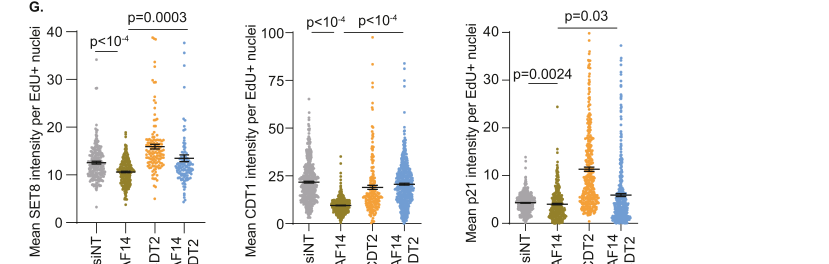

## Question

# Gene Research for Functional Annotation

## ⚠️ CRITICAL: Gene/Protein Identification Context

**BEFORE YOU BEGIN RESEARCH:** You MUST verify you are researching the CORRECT gene/protein. Gene symbols can be ambiguous, especially for less well-characterized genes from non-model organisms.

### Target Gene/Protein Identity (from UniProt):
- **UniProt Accession:** Q9NZJ0
- **Protein Description:** RecName: Full=Denticleless protein homolog; AltName: Full=DDB1- and CUL4-associated factor 2; AltName: Full=Lethal(2) denticleless protein homolog; AltName: Full=Retinoic acid-regulated nuclear matrix-associated protein;
- **Gene Information:** Name=DTL; Synonyms=CDT2, CDW1, DCAF2, L2DTL, RAMP;
- **Organism (full):** Homo sapiens (Human).
- **Protein Family:** Belongs to the WD repeat cdt2 family. .
- **Key Domains:** WD-repeat_CDT2_adapter. (IPR051865); WD40/YVTN_repeat-like_dom_sf. (IPR015943); WD40_repeat_CS. (IPR019775); WD40_repeat_dom_sf. (IPR036322); WD40_rpt. (IPR001680)

### MANDATORY VERIFICATION STEPS:

1. **Check if the gene symbol "DTL" matches the protein description above**
2. **Verify the organism is correct:** Homo sapiens (Human).
3. **Check if protein family/domains align with what you find in literature**
4. **If you find literature for a DIFFERENT gene with the same or similar symbol, STOP**

### If Gene Symbol is Ambiguous or You Cannot Find Relevant Literature:

**DO NOT PROCEED WITH RESEARCH ON A DIFFERENT GENE.** Instead:
- State clearly: "The gene symbol 'DTL' is ambiguous or literature is limited for this specific protein"
- Explain what you found (e.g., "Found extensive literature on a different gene with the same symbol in a different organism")
- Describe the protein based ONLY on the UniProt information provided above
- Suggest that the protein function can be inferred from domain/family information

### Research Target:

Please provide a comprehensive research report on the gene **DTL** (gene ID: DTL, UniProt: Q9NZJ0) in human.

The research report should be a detailed narrative explaining the function, biological processes, and localization of the gene product. Citations should be given for all claims.

You should prioritize authoritative reviews and primary scientific literature when conducting research. You can supplement
this with annotations you find in gene/protein databases, but these can be outdated or inaccurate.

We are specifically interested in the primary function of the gene - for enzymes, what reaction is catalyzed, and what is the substrate specificity? For transporters, what is the substrate? For structural proteins or adapters, what is the broader structural role? For signaling molecules, what is the role in the pathway.

We are interested in where in or outside the cell the gene product carries out its function.

We are also interested in the signaling or biochemical pathways in which the gene functions. We are less interested in broad pleiotropic effects, except where these elucidate the precise role.

Include evidence where possible. We are interested in both experimental evidence as well as inference from structure, evolution, or bioinformatic analysis. Precise studies should be prioritized over high-throughput, where available.

## Output

Question: You are an expert researcher providing comprehensive, well-cited information.

Provide detailed information focusing on:
1. Key concepts and definitions with current understanding
2. Recent developments and latest research (prioritize 2023-2024 sources)
3. Current applications and real-world implementations
4. Expert opinions and analysis from authoritative sources
5. Relevant statistics and data from recent studies

Format as a comprehensive research report with proper citations. Include URLs and publication dates where available.
Always prioritize recent, authoritative sources and provide specific citations for all major claims.

# Gene Research for Functional Annotation

## ⚠️ CRITICAL: Gene/Protein Identification Context

**BEFORE YOU BEGIN RESEARCH:** You MUST verify you are researching the CORRECT gene/protein. Gene symbols can be ambiguous, especially for less well-characterized genes from non-model organisms.

### Target Gene/Protein Identity (from UniProt):
- **UniProt Accession:** Q9NZJ0
- **Protein Description:** RecName: Full=Denticleless protein homolog; AltName: Full=DDB1- and CUL4-associated factor 2; AltName: Full=Lethal(2) denticleless protein homolog; AltName: Full=Retinoic acid-regulated nuclear matrix-associated protein;
- **Gene Information:** Name=DTL; Synonyms=CDT2, CDW1, DCAF2, L2DTL, RAMP;
- **Organism (full):** Homo sapiens (Human).
- **Protein Family:** Belongs to the WD repeat cdt2 family. .
- **Key Domains:** WD-repeat_CDT2_adapter. (IPR051865); WD40/YVTN_repeat-like_dom_sf. (IPR015943); WD40_repeat_CS. (IPR019775); WD40_repeat_dom_sf. (IPR036322); WD40_rpt. (IPR001680)

### MANDATORY VERIFICATION STEPS:

1. **Check if the gene symbol "DTL" matches the protein description above**
2. **Verify the organism is correct:** Homo sapiens (Human).
3. **Check if protein family/domains align with what you find in literature**
4. **If you find literature for a DIFFERENT gene with the same or similar symbol, STOP**

### If Gene Symbol is Ambiguous or You Cannot Find Relevant Literature:

**DO NOT PROCEED WITH RESEARCH ON A DIFFERENT GENE.** Instead:
- State clearly: "The gene symbol 'DTL' is ambiguous or literature is limited for this specific protein"
- Explain what you found (e.g., "Found extensive literature on a different gene with the same symbol in a different organism")
- Describe the protein based ONLY on the UniProt information provided above
- Suggest that the protein function can be inferred from domain/family information

### Research Target:

Please provide a comprehensive research report on the gene **DTL** (gene ID: DTL, UniProt: Q9NZJ0) in human.

The research report should be a detailed narrative explaining the function, biological processes, and localization of the gene product. Citations should be given for all claims.

You should prioritize authoritative reviews and primary scientific literature when conducting research. You can supplement
this with annotations you find in gene/protein databases, but these can be outdated or inaccurate.

We are specifically interested in the primary function of the gene - for enzymes, what reaction is catalyzed, and what is the substrate specificity? For transporters, what is the substrate? For structural proteins or adapters, what is the broader structural role? For signaling molecules, what is the role in the pathway.

We are interested in where in or outside the cell the gene product carries out its function.

We are also interested in the signaling or biochemical pathways in which the gene functions. We are less interested in broad pleiotropic effects, except where these elucidate the precise role.

Include evidence where possible. We are interested in both experimental evidence as well as inference from structure, evolution, or bioinformatic analysis. Precise studies should be prioritized over high-throughput, where available.

# Research report: Human **DTL** / **CDT2** / **DCAF2** (UniProt **Q9NZJ0**) — functional annotation

## 0) Target verification (mandatory)
The literature analyzed matches the UniProt target: **DTL** in **Homo sapiens** is explicitly referred to as **CDT2**, **DCAF2**, and **RAMP**, and is described as a **DDB1–CUL4-associated factor (DCAF)** that functions as the **substrate receptor/adaptor** in the **CRL4^CDT2** (CUL4–DDB1) cullin–RING E3 ubiquitin ligase. This is consistent with UniProt’s “Denticleless protein homolog / DDB1- and CUL4-associated factor 2” description and WD40/DCAF-family expectation. (tang2023pancanceranalysisand pages 1-2, dong2023dtlisa pages 1-4)

## 1) Key concepts and definitions (current understanding)

### 1.1 DTL as a CRL4 substrate receptor (DCAF)
**DTL/CDT2/DCAF2** is best understood as a **substrate-recognition component** that confers specificity to a **CUL4–DDB1 E3 ubiquitin ligase complex (CRL4^CDT2)**. In this complex, DTL binds substrate proteins and promotes their **polyubiquitination**, leading to **proteasomal degradation**. This activity is central to **S-phase control** and genome maintenance. (tiradoclass2024dcaf14regulatescdt2 pages 14-15, tiradoclass2024dcaf14regulatescdt2 pages 1-2)

### 1.2 PCNA-coupled proteolysis and the PIP-degron
A defining mechanistic concept for DTL is **PCNA-coupled proteolysis**. In this model, **chromatin-bound PCNA** (the DNA sliding clamp) acts as a recruitment/scaffolding platform that enables CRL4^CDT2 to ubiquitinate substrates **specifically during DNA synthesis and repair synthesis**. Canonical CRL4^CDT2 substrates contain a **PIP-degron**: a PCNA-interacting PIP motif plus an adjacent basic signature (often described as Arg/Lys residues downstream of the PIP box) that transforms PCNA binding into a degradation signal for CRL4^CDT2. (tiradoclass2024dcaf14regulatescdt2 pages 1-2, tiradoclass2024dcaf14regulatescdt2 pages 11-12)

Experimental support for PCNA as the in situ platform includes proximity ligation assay (PLA) evidence showing **CDT2 proximity to PCNA** in replicating cells. (tiradoclass2023dcaf14regulatescdt2 media 8d746bde)

### 1.3 What “primary function” means for DTL
DTL is **not an enzyme that catalyzes a chemical transformation** (i.e., it is not the catalytic E3). Rather, its **primary biochemical function** is to act as the **adaptor/substrate receptor** that enables **CRL4-dependent ubiquitination** of selected proteins—particularly proteins that are engaged with PCNA on chromatin—thereby coupling replication/repair to proteostasis. (tiradoclass2024dcaf14regulatescdt2 pages 14-15, tiradoclass2024dcaf14regulatescdt2 pages 1-2)

## 2) Molecular function: key substrates, partners, and pathways

### 2.1 Canonical substrates (high-confidence)
Across mechanistic and experimental descriptions, the best-established DTL/CRL4^CDT2 substrates are:

- **CDT1** (replication licensing factor)
- **p21 / CDKN1A** (CDK inhibitor)
- **SET8 / PR-Set7 / KMT5A** (histone H4K20 monomethyltransferase)

Their regulated degradation during S-phase and/or after DNA damage is repeatedly emphasized as core to DTL’s role in **replication licensing control, cell-cycle progression, and genome stability**. (tiradoclass2024dcaf14regulatescdt2 pages 14-15, tiradoclass2024dcaf14regulatescdt2 pages 1-2)

SET8 is highlighted as the **sole H4K20 monomethyltransferase**, connecting DTL to chromatin regulation and replication-fork stability. (tiradoclass2024dcaf14regulatescdt2 pages 11-12)

### 2.2 Additional reported substrates/targets in recent disease-focused studies
Recent studies expand the universe of DTL-linked ubiquitination targets beyond the “canonical trio,” often in cancer contexts:

- **SLTM**: In hepatocellular carcinoma (HCC), DTL was reported to promote **ubiquitin-mediated degradation of SLTM**, derepressing **Notch1** and contributing to proliferation/metastasis and **sorafenib resistance**. (Cell Death & Disease, published Oct 2024; URL in paper metadata) (chen2024hypoxiainduceddtlpromotes pages 13-14)
- **RUVBL1**: In breast cancer models, DTL promoted **ubiquitination of RUVBL1**, strengthening RUVBL1 association with **RUVBL2 and β-catenin**, thereby increasing transcriptional output of **NHEJ pathway genes** and associating with **radiation resistance**. (Cell Death & Disease, published Apr 2024; URL in paper metadata) (tian2024ruvbl1ubiquitinationby pages 1-2)

These findings support the view that DTL may participate in **context-dependent substrate selection** beyond classic PCNA/PIP-degron substrates, especially in cancer signaling and therapy response. (chen2024hypoxiainduceddtlpromotes pages 13-14, tian2024ruvbl1ubiquitinationby pages 1-2)

### 2.3 Cellular localization and site of action
Mechanistically, DTL function is tightly linked to **chromatin-bound PCNA at replication forks**, implying predominant nuclear/chromatin action during DNA replication/repair synthesis. This is directly supported by PCNA–CDT2 proximity (PLA) in replicating cells. (tiradoclass2023dcaf14regulatescdt2 media 8d746bde)

In clinical tissue, DTL has also been described with variable subcellular distribution. For example, in an HCC study, DTL was mainly cytoplasmic in paracancer tissue but elevated in **both cytoplasm and nucleus** in tumors, and **nuclear-localized DTL** associated with worse survival compared with cytoplasmic localization. (dong2023dtlisa pages 4-7)

### 2.4 Pathways and biological processes
In the primary literature examined here, DTL is consistently placed in pathways centered on:

- **DNA replication licensing and prevention of re-replication** (through degradation of CDT1, p21, SET8) (tiradoclass2024dcaf14regulatescdt2 pages 1-2, tiradoclass2024dcaf14regulatescdt2 pages 11-12)
- **DNA damage response and genome stability**, including replication stress responses (tiradoclass2024dcaf14regulatescdt2 pages 1-2, tiradoclass2024dcaf14regulatescdt2 pages 11-12)
- **Replication fork stability/protection**, particularly through SET8-dependent mechanisms (tiradoclass2024dcaf14regulatescdt2 pages 11-12, tiradoclass2024dcaf14regulatescdt2 pages 8-11)

Supporting systems-level analyses from a pan-cancer study (Tang et al., BMC Cancer, Apr 2023; URL in metadata) found DTL-associated gene-set enrichments including **cell cycle**, **G2M checkpoint**, **E2F targets**, **mTORC1 signaling**, **pyrimidine metabolism**, and **oocyte meiosis**. (tang2023pancanceranalysisand pages 1-2)

## 3) Recent developments (prioritizing 2023–2024)

### 3.1 DCAF14 as a regulator of CRL4^CDT2 at stalled forks (Nov 2023)
Tirado-Class et al. (Life Science Alliance, Nov 2023; https://doi.org/10.26508/lsa.202302230) provide mechanistic evidence that **DCAF14 restrains/controls CRL4^CDT2 activity** to protect stalled replication forks. Loss of DCAF14 caused **increased turnover of CDT2 substrates** (SET8, CDT1, p21), reduced SET8-linked chromatin marks, and replication-stress phenotypes including **nascent strand degradation** and increased DNA breakage signals, which could be rescued by **CDT2 depletion** and by inhibitors of cullin activation (MLN4924) or the proteasome (MG132). (tiradoclass2024dcaf14regulatescdt2 pages 4-6, tiradoclass2024dcaf14regulatescdt2 pages 11-12)

Quantitatively, the study reports extensive imaging- and fiber-assay replication with large cell counts in some assays (e.g., analyses using **≥3,500 nuclei** for one imaging assay; fiber assays quantifying **≥100 fibers**), supporting robustness of phenotypes at the cellular level. (tiradoclass2024dcaf14regulatescdt2 pages 4-6, tiradoclass2024dcaf14regulatescdt2 pages 8-11)

A key figure from this paper documents both (i) **CDT2–PCNA proximity** and (ii) **DCAF14-dependent control of CDT2 substrate stability**, providing visual evidence for the PCNA platform and regulatory axis. (tiradoclass2023dcaf14regulatescdt2 media 8d746bde, tiradoclass2023dcaf14regulatescdt2 media 6181f623)

### 3.2 2024 cancer-mechanism studies: therapy resistance and pathway rewiring
Two 2024 studies in Cell Death & Disease provide mechanistic links between DTL activity and therapy resistance:

- **Breast cancer radiotherapy resistance (Apr 2024):** DTL-mediated ubiquitination of RUVBL1 promoted a RUVBL1/2–β-catenin transcriptional program favoring **NHEJ** and attenuating TIP60-mediated chromatin acetylation associated with **HR**, aligning with a shift toward radiation tolerance. The study used an in vivo radiation design with **7 mice per group** receiving **five 3-Gy fractions** (every 2 days), with tumors collected **4 hours** after the final dose. (https://doi.org/10.1038/s41419-024-06651-4) (tian2024ruvbl1ubiquitinationby pages 1-2)

- **HCC hypoxia and sorafenib resistance (Oct 2024):** DTL was reported to be transcriptionally activated by **HIF-1α** under hypoxia and to promote HCC proliferation/metastasis and **sorafenib resistance**, mechanistically via **SLTM ubiquitination/degradation** and subsequent **Notch pathway activation**. The work includes a clinical cohort of **n = 209**. (https://doi.org/10.1038/s41419-024-07089-4) (chen2024hypoxiainduceddtlpromotes pages 13-14)

Together, these studies suggest that DTL can participate in oncogenic programs by shaping protein stability networks beyond replication licensing alone, potentially linking DTL to transcriptional rewiring and DNA repair pathway choice in tumors. (chen2024hypoxiainduceddtlpromotes pages 13-14, tian2024ruvbl1ubiquitinationby pages 1-2)

## 4) Current applications and real-world implementations

### 4.1 Biomarker applications (diagnosis/prognosis and immune context)
A pan-cancer analysis and validation study (Tang et al., **BMC Cancer**, published Apr 2023; https://doi.org/10.1186/s12885-023-10755-z) concludes that DTL is broadly overexpressed in tumors (with exceptions noted) and that DTL expression correlates with prognosis and immune features across cancers; the authors frame DTL as a candidate **diagnostic/prognostic** and **immunotherapy** biomarker. (tang2023pancanceranalysisand pages 1-2)

In HCC, a 2023 study using TCGA analysis plus tissue IHC reported that higher DTL expression associates with poorer survival and that **nuclear-localized DTL** tracks with worse prognosis. (dong2023dtlisa pages 4-7)

### 4.2 Therapeutic/targeting relevance (pathway tractability)
Although no DTL-specific inhibitors were evaluated in the cited primary studies, several lines of evidence support tractability of the **DTL/CRL4^CDT2 axis**:

- In replication-stress experiments, inhibition of cullin activation via **neddylation inhibitor MLN4924 (pevonedistat)** stabilized CRL4^CDT2 substrates (e.g., CDT1/p21) and reduced cullin neddylation, functioning as a pharmacologic tool to suppress CRL activity. (tiradoclass2024dcaf14regulatescdt2 pages 4-6)
- Proteasome inhibition (e.g., MG132) similarly stabilized CDT2 substrates, consistent with DTL’s role in ubiquitin–proteasome-mediated proteolysis. (tiradoclass2024dcaf14regulatescdt2 pages 4-6)

From an application standpoint, these observations support a real-world paradigm: targeting **upstream cullin activation**, the **proteasome**, or potentially the **PCNA-coupled recruitment interface** can modulate DTL-dependent substrate turnover, which may be exploitable in tumors with DTL-driven replication stress tolerance or therapy resistance. (tiradoclass2024dcaf14regulatescdt2 pages 4-6, tian2024ruvbl1ubiquitinationby pages 1-2)

## 5) Expert opinions/authoritative analysis (from authoritative sources in the retrieved set)

- The 2023 BMC Cancer pan-cancer analysis emphasizes DTL as a genomic-stability-linked factor that recognizes and degrades substrates as part of CRL4, and connects DTL overexpression to cell-cycle promotion and genomic instability—an interpretation consistent with DTL’s canonical replication licensing role. (tang2023pancanceranalysisand pages 1-2)
- The 2023 Life Science Alliance study provides a mechanistic “expert” framing that unregulated CDT2-mediated turnover of SET8 can be deleterious under replication stress, implying that DTL activity must be tuned at stalled forks for genome stability. (tiradoclass2024dcaf14regulatescdt2 pages 11-12)

## 6) Relevant statistics and recent data points

### 6.1 HCC clinical genomics and tissue studies (2023)
Dong et al. (Current Cancer Drug Targets, published Nov 2023; https://doi.org/10.2174/1568009623666230511100246) report:

- TCGA comparison: **DTL mRNA 8.51 vs 4.88** in tumor vs adjacent tissue, based on **474 tumor** and **50 adjacent** samples. (dong2023dtlisa pages 4-7)
- Survival analysis cohort with complete data: **n = 363**, split into **181 low** and **182 high** DTL expression groups; high DTL associated with poorer overall survival, with the paper reporting a large difference in a survival metric (34.97 vs 74.83) between groups. (dong2023dtlisa pages 4-7)
- IHC cohort: tissue microarray with **94 HCC** and **86 adjacent** tissues, follow-up **4–6.7 years**; DTL showed tumor-associated **nuclear localization** and this nuclear localization was associated with shorter survival. (dong2023dtlisa pages 1-4, dong2023dtlisa pages 4-7)

### 6.2 Therapy resistance model parameters (2024)
- Breast cancer radiotherapy model: **7 mice per group**, fractionated radiation of **3 Gy × 5 doses**. (tian2024ruvbl1ubiquitinationby pages 1-2)
- HCC hypoxia/sorafenib resistance study: clinical cohort **n = 209**. (chen2024hypoxiainduceddtlpromotes pages 13-14)

### 6.3 Replication-stress experimental scale (Nov 2023)
Replication fork protection work reported high-throughput cellular quantification (e.g., **≥3,500 nuclei** in one imaging analysis; **≥100 fibers** in fiber assays), strengthening the evidentiary weight of the fork-protection phenotype upon CDT2 dysregulation. (tiradoclass2024dcaf14regulatescdt2 pages 4-6, tiradoclass2024dcaf14regulatescdt2 pages 8-11)

## 7) Functional annotation summary (recommended)

| Aspect | Findings |
|---|---|
| identity/domains | - Human **DTL** corresponds to UniProt **Q9NZJ0** and is explicitly identified in recent literature as **CDT2/DCAF2/RAMP**, a **DDB1- and CUL4-associated factor (DCAF)** within the CRL4 system (tang2023pancanceranalysisand pages 1-2, dong2023dtlisa pages 1-4)   - It belongs to the **WD40/DCAF substrate-receptor class**, consistent with the UniProt WD-repeat family/domain assignment and literature describing DTL/CDT2 as a WD40-containing CRL4 receptor (tang2023pancanceranalysisand pages 1-2, gao2024hypoxiainduceddtlpromotes pages 13-16) |
| complex | - DTL functions as the **substrate receptor/adaptor** of the **CRL4^CDT2** E3 ubiquitin ligase built around **CUL4–DDB1** (tiradoclass2024dcaf14regulatescdt2 pages 14-15, tiradoclass2024dcaf14regulatescdt2 pages 1-2)   - This complex mediates ubiquitin-dependent proteolysis of replication- and repair-linked proteins to preserve genome stability (tiradoclass2024dcaf14regulatescdt2 pages 14-15, tang2023pancanceranalysisand pages 1-2) |
| mechanism | - Core mechanism is **PCNA-coupled proteolysis**: DTL recognizes substrates engaged with **chromatin-bound PCNA** and promotes their ubiquitination and proteasomal degradation (tiradoclass2024dcaf14regulatescdt2 pages 14-15, tiradoclass2024dcaf14regulatescdt2 pages 1-2)   - Canonical substrates carry a **PIP-degron** (PIP box plus basic residue motif), which binds PCNA with higher affinity than standard PIP motifs and creates a degron for CRL4^CDT2 (tiradoclass2024dcaf14regulatescdt2 pages 1-2, tiradoclass2024dcaf14regulatescdt2 pages 11-12)   - Image-based PLA data support **CDT2 proximity to PCNA at replication forks**, reinforcing PCNA as the recruitment platform (tiradoclass2023dcaf14regulatescdt2 media 8d746bde) |
| key substrates | - Best-established substrates are **CDT1**, **p21/CDKN1A**, and **SET8/PR-Set7/KMT5A** (tiradoclass2024dcaf14regulatescdt2 pages 14-15, tiradoclass2024dcaf14regulatescdt2 pages 1-2)   - Additional reported substrates/targets in disease contexts include **E2F1**, **PDCD4**, **SLTM**, and **RUVBL1** (chen2024hypoxiainduceddtlpromotes pages 13-14, tian2024ruvbl1ubiquitinationby pages 1-2)   - SET8 turnover is especially important because SET8 is the **sole H4K20 monomethyltransferase**, linking DTL to chromatin state and fork protection (tiradoclass2024dcaf14regulatescdt2 pages 11-12) |
| localization | - DTL acts mainly in the **nucleus/on chromatin at replication forks** through association with PCNA during DNA synthesis and repair synthesis (tiradoclass2024dcaf14regulatescdt2 pages 14-15, tiradoclass2023dcaf14regulatescdt2 media 8d746bde)   - In HCC tissue, DTL protein was reported as mainly **cytoplasmic in paracancer tissue** but elevated in **both cytoplasm and nucleus** in tumors; stronger nuclear localization associated with worse survival (dong2023dtlisa pages 4-7) |
| pathways/biological processes | - Principal functions cluster in **DNA replication licensing**, **S-phase progression**, **DNA damage responses**, **replication stress tolerance**, and **genome stability maintenance** (tiradoclass2024dcaf14regulatescdt2 pages 1-2, tang2023pancanceranalysisand pages 1-2)   - By degrading CDT1, p21, and SET8, DTL helps prevent **re-replication**, coordinate checkpoint/cell-cycle transitions, and regulate chromatin during replication (tiradoclass2024dcaf14regulatescdt2 pages 1-2, tiradoclass2024dcaf14regulatescdt2 pages 11-12)   - GSEA/pan-cancer analyses linked DTL to **cell cycle**, **G2/M checkpoint**, **E2F targets**, **mTORC1 signaling**, **oocyte meiosis**, and **pyrimidine metabolism** (tang2023pancanceranalysisand pages 1-2) |
| recent 2023-2024 developments | - **2023:** DCAF14 was shown to restrain CRL4^CDT2 activity; loss of DCAF14 causes excessive degradation of SET8/p21/CDT1 and **fork collapse under replication stress** (tiradoclass2024dcaf14regulatescdt2 pages 4-6, tiradoclass2024dcaf14regulatescdt2 pages 11-12)   - **2024:** In breast cancer, DTL-mediated **RUVBL1 ubiquitination** promoted a shift toward **NHEJ gene transcription** and radiation resistance (tian2024ruvbl1ubiquitinationby pages 1-2)   - **2024:** In HCC, **hypoxia/HIF-1α-induced DTL** promoted proliferation, metastasis, and **sorafenib resistance** via **SLTM degradation** and Notch activation (chen2024hypoxiainduceddtlpromotes pages 13-14) |
| disease/clinical relevance | - DTL is repeatedly reported as **overexpressed across many tumor types** and associated with poor prognosis, proliferation, genomic instability, and aggressive disease biology (tang2023pancanceranalysisand pages 1-2, chen2024hypoxiainduceddtlpromotes pages 13-14)   - HCC-focused studies linked high DTL expression to poorer overall survival and to cell-cycle/proliferative programs (dong2023dtlisa pages 4-7, dong2023dtlisa pages 1-4)   - Pan-cancer analyses also associate DTL with **immune infiltration** and possible relevance to **immunotherapy response** (tang2023pancanceranalysisand pages 1-2) |
| actionable/therapeutic angles | - **Cullin/neddylation inhibition** (e.g., **MLN4924/pevonedistat**) stabilizes CRL4^CDT2 substrates and is widely used experimentally to blunt DTL-dependent proteolysis, supporting pathway tractability (tiradoclass2024dcaf14regulatescdt2 pages 4-6, tiradoclass2024dcaf14regulatescdt2 pages 11-12)   - Recent cancer studies propose DTL as a candidate **biomarker** and possible **therapeutic target** in HCC and breast cancer, including potential radiosensitization by targeting the **DTL–RUVBL1/2–β-catenin** axis (chen2024hypoxiainduceddtlpromotes pages 13-14, tian2024ruvbl1ubiquitinationby pages 1-2)   - Indirect strategies include modulating upstream regulators such as **HIF-1α** or **E2F1**, or targeting the **PCNA-coupled degradation interface** (chen2024hypoxiainduceddtlpromotes pages 13-14, dong2023dtlisa pages 1-4) |
| key quantitative stats | - **HCC TCGA dataset:** DTL mRNA reported as **8.51 vs 4.88** in tumor vs adjacent tissue, from **474 cancer** and **50 adjacent** samples; survival analysis used **n=363** patients split into **181 low** and **182 high** DTL groups (dong2023dtlisa pages 4-7)   - **HCC protein cohort:** tissue microarray included **94 HCC** and **86 adjacent** specimens; follow-up was **4–6.7 years** (dong2023dtlisa pages 1-4)   - **2024 HCC study:** clinical cohort size **n=209**; **2024 breast cancer RT study:** **7 mice/group**, five **3 Gy** fractions, tumors collected **4 h** after the final irradiation (chen2024hypoxiainduceddtlpromotes pages 13-14, tian2024ruvbl1ubiquitinationby pages 1-2) |

*Table: This table summarizes verified identity, mechanism, substrates, localization, pathways, and recent disease-relevant findings for human DTL/CDT2/DCAF2. It is useful as a compact evidence map for functional annotation and translational interpretation.*

## 8) Notes on evidence gaps
Some clinically oriented papers in the retrieved set describe DTL as a biomarker but (in the accessible extracted pages) do **not** provide hazard ratios, ROC AUC values, or detailed multivariable model coefficients; therefore, such statistics cannot be reported here without additional full-text extraction beyond the available context. (tang2023pancanceranalysisand pages 1-2)

## 9) Key references (recent prioritized; publication date + URL)
- Tirado-Class N. et al. **“DCAF14 regulates CDT2 to promote SET8-dependent replication fork protection.”** *Life Science Alliance* (Nov **2023**). https://doi.org/10.26508/lsa.202302230 (tiradoclass2024dcaf14regulatescdt2 pages 4-6)
- Tang Y. et al. **“Pan-cancer analysis and experimental validation of DTL as a potential diagnosis, prognosis and immunotherapy biomarker.”** *BMC Cancer* (Apr **2023**). https://doi.org/10.1186/s12885-023-10755-z (tang2023pancanceranalysisand pages 1-2)
- Tian J. et al. **“RUVBL1 ubiquitination by DTL … enhances radiation resistance in breast cancer.”** *Cell Death & Disease* (Apr **2024**). https://doi.org/10.1038/s41419-024-06651-4 (tian2024ruvbl1ubiquitinationby pages 1-2)
- Chen Z-X. et al. **“Hypoxia-induced DTL … sorafenib resistance … Notch pathway activation.”** *Cell Death & Disease* (Oct **2024**). https://doi.org/10.1038/s41419-024-07089-4 (chen2024hypoxiainduceddtlpromotes pages 13-14)
- Dong R. et al. **“DTL is a Novel Downstream Gene of E2F1 that Promotes the Progression of Hepatocellular Carcinoma.”** *Current Cancer Drug Targets* (Nov **2023**). https://doi.org/10.2174/1568009623666230511100246 (dong2023dtlisa pages 4-7)

## 10) OpenTargets snapshot (database context; not a substitute for mechanistic literature)
OpenTargets lists disease associations for DTL with modest association scores across several indications (e.g., neurodegenerative disease, diabetes mellitus/type 2 diabetes, gout, migraine), supported by limited evidence items and PubMed links; these associations should be interpreted as hypothesis-generating rather than definitive functional annotation. (OpenTargets Search: -DTL)

References

1. (tang2023pancanceranalysisand pages 1-2): Yumei Tang, Ye Lei, Peng Gao, Junting Jia, Huijun Du, Qitong Wang, Zhixin Yan, Chen Zhang, Guojun Liang, Yanfeng Wang, Weijun Ma, Nianzeng Xing, Le Cheng, and Laifeng Ren. Pan-cancer analysis and experimental validation of dtl as a potential diagnosis, prognosis and immunotherapy biomarker. BMC Cancer, Apr 2023. URL: https://doi.org/10.1186/s12885-023-10755-z, doi:10.1186/s12885-023-10755-z. This article has 17 citations and is from a peer-reviewed journal.

2. (dong2023dtlisa pages 1-4): Ruiqiang Dong, Danhua Zhang, Baowei Han, Lingxue Xu, Danfeng Zhang, Zhenguo Cheng, and Xinguang Qiu. Dtl is a novel downstream gene of e2f1 that promotes the progression of hepatocellular carcinoma. Current Cancer Drug Targets, 23:817-828, Nov 2023. URL: https://doi.org/10.2174/1568009623666230511100246, doi:10.2174/1568009623666230511100246. This article has 4 citations and is from a peer-reviewed journal.

3. (tiradoclass2024dcaf14regulatescdt2 pages 14-15): Neysha Tirado-Class, Caitlin Hathaway, Anthony Nelligan, Thuan Nguyen, and Huzefa Dungrawala. Dcaf14 regulates cdt2 to promote set8-dependent replication fork protection. Life Science Alliance, 7:e202302230, Nov 2023. URL: https://doi.org/10.26508/lsa.202302230, doi:10.26508/lsa.202302230. This article has 1 citations and is from a peer-reviewed journal.

4. (tiradoclass2024dcaf14regulatescdt2 pages 1-2): Neysha Tirado-Class, Caitlin Hathaway, Anthony Nelligan, Thuan Nguyen, and Huzefa Dungrawala. Dcaf14 regulates cdt2 to promote set8-dependent replication fork protection. Life Science Alliance, 7:e202302230, Nov 2023. URL: https://doi.org/10.26508/lsa.202302230, doi:10.26508/lsa.202302230. This article has 1 citations and is from a peer-reviewed journal.

5. (tiradoclass2024dcaf14regulatescdt2 pages 11-12): Neysha Tirado-Class, Caitlin Hathaway, Anthony Nelligan, Thuan Nguyen, and Huzefa Dungrawala. Dcaf14 regulates cdt2 to promote set8-dependent replication fork protection. Life Science Alliance, 7:e202302230, Nov 2023. URL: https://doi.org/10.26508/lsa.202302230, doi:10.26508/lsa.202302230. This article has 1 citations and is from a peer-reviewed journal.

6. (tiradoclass2023dcaf14regulatescdt2 media 8d746bde): Neysha Tirado-Class, Caitlin Hathaway, Anthony Nelligan, Thuan Nguyen, and Huzefa Dungrawala. Dcaf14 regulates cdt2 to promote set8-dependent replication fork protection. Life Science Alliance, 7:e202302230, Nov 2023. URL: https://doi.org/10.26508/lsa.202302230, doi:10.26508/lsa.202302230. This article has 1 citations and is from a peer-reviewed journal.

7. (chen2024hypoxiainduceddtlpromotes pages 13-14): Zi-Xiong Chen, Mao-Yuan Mu, Guang Yang, Han Qi, Xiao-Bo Fu, Gui-Song Wang, Wei-Wei Jiang, Bi-Jun Huang, and Fei Gao. Hypoxia-induced dtl promotes the proliferation, metastasis, and sorafenib resistance of hepatocellular carcinoma through ubiquitin-mediated degradation of sltm and subsequent notch pathway activation. Cell Death &amp; Disease, Oct 2024. URL: https://doi.org/10.1038/s41419-024-07089-4, doi:10.1038/s41419-024-07089-4. This article has 19 citations and is from a peer-reviewed journal.

8. (tian2024ruvbl1ubiquitinationby pages 1-2): Jie Tian, Mingxin Wen, Peng Gao, Maoxiao Feng, and Guangwei Wei. Ruvbl1 ubiquitination by dtl promotes ruvbl1/2-β-catenin-mediated transcriptional regulation of nhej pathway and enhances radiation resistance in breast cancer. Cell Death &amp; Disease, Apr 2024. URL: https://doi.org/10.1038/s41419-024-06651-4, doi:10.1038/s41419-024-06651-4. This article has 19 citations and is from a peer-reviewed journal.

9. (dong2023dtlisa pages 4-7): Ruiqiang Dong, Danhua Zhang, Baowei Han, Lingxue Xu, Danfeng Zhang, Zhenguo Cheng, and Xinguang Qiu. Dtl is a novel downstream gene of e2f1 that promotes the progression of hepatocellular carcinoma. Current Cancer Drug Targets, 23:817-828, Nov 2023. URL: https://doi.org/10.2174/1568009623666230511100246, doi:10.2174/1568009623666230511100246. This article has 4 citations and is from a peer-reviewed journal.

10. (tiradoclass2024dcaf14regulatescdt2 pages 8-11): Neysha Tirado-Class, Caitlin Hathaway, Anthony Nelligan, Thuan Nguyen, and Huzefa Dungrawala. Dcaf14 regulates cdt2 to promote set8-dependent replication fork protection. Life Science Alliance, 7:e202302230, Nov 2023. URL: https://doi.org/10.26508/lsa.202302230, doi:10.26508/lsa.202302230. This article has 1 citations and is from a peer-reviewed journal.

11. (tiradoclass2024dcaf14regulatescdt2 pages 4-6): Neysha Tirado-Class, Caitlin Hathaway, Anthony Nelligan, Thuan Nguyen, and Huzefa Dungrawala. Dcaf14 regulates cdt2 to promote set8-dependent replication fork protection. Life Science Alliance, 7:e202302230, Nov 2023. URL: https://doi.org/10.26508/lsa.202302230, doi:10.26508/lsa.202302230. This article has 1 citations and is from a peer-reviewed journal.

12. (tiradoclass2023dcaf14regulatescdt2 media 6181f623): Neysha Tirado-Class, Caitlin Hathaway, Anthony Nelligan, Thuan Nguyen, and Huzefa Dungrawala. Dcaf14 regulates cdt2 to promote set8-dependent replication fork protection. Life Science Alliance, 7:e202302230, Nov 2023. URL: https://doi.org/10.26508/lsa.202302230, doi:10.26508/lsa.202302230. This article has 1 citations and is from a peer-reviewed journal.

13. (gao2024hypoxiainduceddtlpromotes pages 13-16): Fei Gao, Zi-Xiong Chen, Mao-Yuan Mu, Guang Yang, Han Qi, Xiao-Bo Fu, Gui-Song Wang, Wei-Wei Jiang, and Bi-Jun Huang. Hypoxia-induced dtl promotes the proliferation, metastasis, and sorafenib resistance of hepatocellular carcinoma through notch signaling pathway. Unknown journal, Jan 2024. URL: https://doi.org/10.21203/rs.3.rs-3691309/v1, doi:10.21203/rs.3.rs-3691309/v1.

14. (OpenTargets Search: -DTL): Open Targets Query (-DTL, 5 results). Buniello, A. et al. (2025). Open Targets Platform: facilitating therapeutic hypotheses building in drug discovery. Nucleic Acids Research.

## Artifacts

- [Edison artifact artifact-00](DTL-deep-research-falcon_artifacts/artifact-00.md)

## Citations

1. chen2024hypoxiainduceddtlpromotes pages 13-14
2. dong2023dtlisa pages 4-7
3. tang2023pancanceranalysisand pages 1-2
4. dong2023dtlisa pages 1-4
5. gao2024hypoxiainduceddtlpromotes pages 13-16
6. https://doi.org/10.26508/lsa.202302230
7. https://doi.org/10.1038/s41419-024-06651-4
8. https://doi.org/10.1038/s41419-024-07089-4
9. https://doi.org/10.1186/s12885-023-10755-z
10. https://doi.org/10.2174/1568009623666230511100246
11. https://doi.org/10.1186/s12885-023-10755-z,
12. https://doi.org/10.2174/1568009623666230511100246,
13. https://doi.org/10.26508/lsa.202302230,
14. https://doi.org/10.1038/s41419-024-07089-4,
15. https://doi.org/10.1038/s41419-024-06651-4,
16. https://doi.org/10.21203/rs.3.rs-3691309/v1,