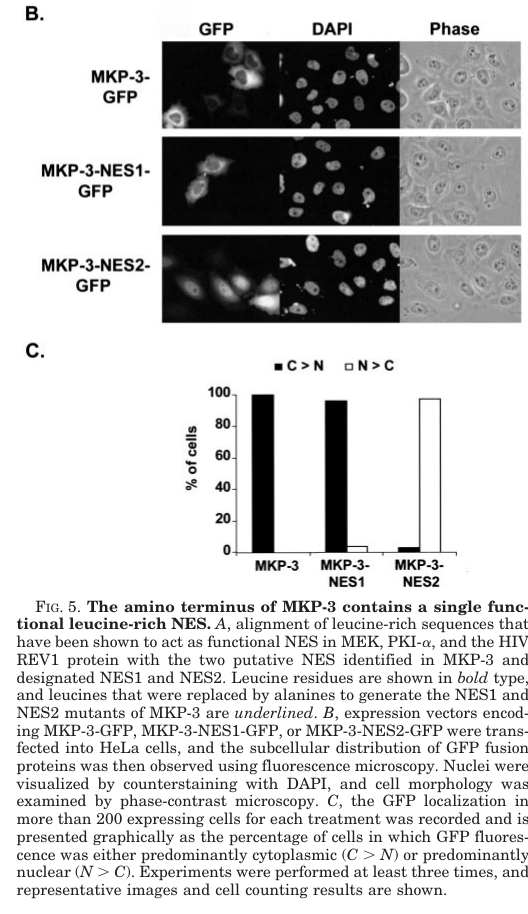

## Question

# Gene Research for Functional Annotation

## ⚠️ CRITICAL: Gene/Protein Identification Context

**BEFORE YOU BEGIN RESEARCH:** You MUST verify you are researching the CORRECT gene/protein. Gene symbols can be ambiguous, especially for less well-characterized genes from non-model organisms.

### Target Gene/Protein Identity (from UniProt):
- **UniProt Accession:** Q16828
- **Protein Description:** RecName: Full=Dual specificity protein phosphatase 6; EC=3.1.3.16; EC=3.1.3.48; AltName: Full=Dual specificity protein phosphatase PYST1; AltName: Full=Mitogen-activated protein kinase phosphatase 3; Short=MAP kinase phosphatase 3; Short=MKP-3;
- **Gene Information:** Name=DUSP6; Synonyms=MKP3, PYST1;
- **Organism (full):** Homo sapiens (Human).
- **Protein Family:** Belongs to the protein-tyrosine phosphatase family. Non-
- **Key Domains:** Dual-sp_phosphatase_cat-dom. (IPR000340); MKP. (IPR008343); Prot-tyrosine_phosphatase-like. (IPR029021); Rhodanese-like_dom. (IPR001763); Rhodanese-like_dom_sf. (IPR036873)

### MANDATORY VERIFICATION STEPS:

1. **Check if the gene symbol "DUSP6" matches the protein description above**
2. **Verify the organism is correct:** Homo sapiens (Human).
3. **Check if protein family/domains align with what you find in literature**
4. **If you find literature for a DIFFERENT gene with the same or similar symbol, STOP**

### If Gene Symbol is Ambiguous or You Cannot Find Relevant Literature:

**DO NOT PROCEED WITH RESEARCH ON A DIFFERENT GENE.** Instead:
- State clearly: "The gene symbol 'DUSP6' is ambiguous or literature is limited for this specific protein"
- Explain what you found (e.g., "Found extensive literature on a different gene with the same symbol in a different organism")
- Describe the protein based ONLY on the UniProt information provided above
- Suggest that the protein function can be inferred from domain/family information

### Research Target:

Please provide a comprehensive research report on the gene **DUSP6** (gene ID: DUSP6, UniProt: Q16828) in human.

The research report should be a detailed narrative explaining the function, biological processes, and localization of the gene product. Citations should be given for all claims.

You should prioritize authoritative reviews and primary scientific literature when conducting research. You can supplement
this with annotations you find in gene/protein databases, but these can be outdated or inaccurate.

We are specifically interested in the primary function of the gene - for enzymes, what reaction is catalyzed, and what is the substrate specificity? For transporters, what is the substrate? For structural proteins or adapters, what is the broader structural role? For signaling molecules, what is the role in the pathway.

We are interested in where in or outside the cell the gene product carries out its function.

We are also interested in the signaling or biochemical pathways in which the gene functions. We are less interested in broad pleiotropic effects, except where these elucidate the precise role.

Include evidence where possible. We are interested in both experimental evidence as well as inference from structure, evolution, or bioinformatic analysis. Precise studies should be prioritized over high-throughput, where available.

## Output

Question: You are an expert researcher providing comprehensive, well-cited information.

Provide detailed information focusing on:
1. Key concepts and definitions with current understanding
2. Recent developments and latest research (prioritize 2023-2024 sources)
3. Current applications and real-world implementations
4. Expert opinions and analysis from authoritative sources
5. Relevant statistics and data from recent studies

Format as a comprehensive research report with proper citations. Include URLs and publication dates where available.
Always prioritize recent, authoritative sources and provide specific citations for all major claims.

# Gene Research for Functional Annotation

## ⚠️ CRITICAL: Gene/Protein Identification Context

**BEFORE YOU BEGIN RESEARCH:** You MUST verify you are researching the CORRECT gene/protein. Gene symbols can be ambiguous, especially for less well-characterized genes from non-model organisms.

### Target Gene/Protein Identity (from UniProt):
- **UniProt Accession:** Q16828
- **Protein Description:** RecName: Full=Dual specificity protein phosphatase 6; EC=3.1.3.16; EC=3.1.3.48; AltName: Full=Dual specificity protein phosphatase PYST1; AltName: Full=Mitogen-activated protein kinase phosphatase 3; Short=MAP kinase phosphatase 3; Short=MKP-3;
- **Gene Information:** Name=DUSP6; Synonyms=MKP3, PYST1;
- **Organism (full):** Homo sapiens (Human).
- **Protein Family:** Belongs to the protein-tyrosine phosphatase family. Non-
- **Key Domains:** Dual-sp_phosphatase_cat-dom. (IPR000340); MKP. (IPR008343); Prot-tyrosine_phosphatase-like. (IPR029021); Rhodanese-like_dom. (IPR001763); Rhodanese-like_dom_sf. (IPR036873)

### MANDATORY VERIFICATION STEPS:

1. **Check if the gene symbol "DUSP6" matches the protein description above**
2. **Verify the organism is correct:** Homo sapiens (Human).
3. **Check if protein family/domains align with what you find in literature**
4. **If you find literature for a DIFFERENT gene with the same or similar symbol, STOP**

### If Gene Symbol is Ambiguous or You Cannot Find Relevant Literature:

**DO NOT PROCEED WITH RESEARCH ON A DIFFERENT GENE.** Instead:
- State clearly: "The gene symbol 'DUSP6' is ambiguous or literature is limited for this specific protein"
- Explain what you found (e.g., "Found extensive literature on a different gene with the same symbol in a different organism")
- Describe the protein based ONLY on the UniProt information provided above
- Suggest that the protein function can be inferred from domain/family information

### Research Target:

Please provide a comprehensive research report on the gene **DUSP6** (gene ID: DUSP6, UniProt: Q16828) in human.

The research report should be a detailed narrative explaining the function, biological processes, and localization of the gene product. Citations should be given for all claims.

You should prioritize authoritative reviews and primary scientific literature when conducting research. You can supplement
this with annotations you find in gene/protein databases, but these can be outdated or inaccurate.

We are specifically interested in the primary function of the gene - for enzymes, what reaction is catalyzed, and what is the substrate specificity? For transporters, what is the substrate? For structural proteins or adapters, what is the broader structural role? For signaling molecules, what is the role in the pathway.

We are interested in where in or outside the cell the gene product carries out its function.

We are also interested in the signaling or biochemical pathways in which the gene functions. We are less interested in broad pleiotropic effects, except where these elucidate the precise role.

Include evidence where possible. We are interested in both experimental evidence as well as inference from structure, evolution, or bioinformatic analysis. Precise studies should be prioritized over high-throughput, where available.

# Human DUSP6 (UniProt Q16828): functional annotation and research assessment

## Identity and principal function

**Identity verified.** Human **DUSP6** encodes dual-specificity protein phosphatase 6, also called **MKP-3** and **PYST1**. These names refer to the same protein, not to DUSP1/MKP-1 or the nuclear ERK phosphatase DUSP5. The characterized human protein has 381 amino acids, an N-terminal, rhodanese-like regulatory region that binds ERK, and a C-terminal protein-tyrosine-phosphatase-like catalytic domain. This architecture agrees with the family and domain annotations supplied for Q16828. The original PYST1 study cloned a human cDNA and tested its recombinant protein and cellular activity. (muhammad2018dualspecificityphosphatase6 pages 4-5, groom1996differentialregulationof pages 1-2, farooq2001solutionstructureof pages 1-3)

**Functional assignment:** DUSP6 is principally a **cytoplasmic, ERK1/2-selective MAP kinase phosphatase**. It hydrolyses phosphate from the phosphothreonine and phosphotyrosine of the ERK activation-loop **TEY** motif—Thr183/Tyr185 in the ERK2 numbering used in the cited mechanistic review—thereby switching off ERK kinase activity. In reaction terms, phospho-ERK + H₂O → less-phosphorylated ERK + inorganic phosphate, repeated for the two phosphorylated residues. “Dual specificity” describes the two *residue classes* it can dephosphorylate; it does **not** imply equal activity against all MAP kinases. (muhammad2018dualspecificityphosphatase6 pages 4-5, marchetti2005extracellularsignalregulatedkinases pages 1-1, groom1996differentialregulationof pages 1-2)

Human PYST1 purified from bacteria dephosphorylated and inactivated ERK in vitro; expressed PYST1 blocked serum-induced ERK2 activation and associated with endogenous MAP kinase in cells. Its activity toward JNK/SAPK and p38 was very low in the direct comparisons, and it did not block stress-induced JNK1 or p38 activation in the tested cells. Thus ERK1/2, rather than JNK or p38, is the well-established primary substrate pair. These experiments establish **preference**, not an absolute impossibility of other substrates under different conditions. (groom1996differentialregulationof pages 1-2, groom1996differentialregulationof pages 6-7)

## Molecular mechanism and cellular location

The N-terminal **kinase-interaction/ERK-binding region** docks ERK2, while the C-terminal phosphatase carries the catalytic **HCX₅R** motif. Structural and biochemical work identifies **Cys293** as the catalytic nucleophile, **Arg299** as important for phosphate engagement and **Asp262** in acid–base catalysis. An NMR structure defined a folded ERK-binding region spanning approximately residues 1–154; ERK2 binding promotes communication with the catalytic domain and was reported to increase phosphatase activity by approximately **30-fold**. Docking therefore contributes both to substrate recognition and to activation of the enzyme. The supplied InterPro rhodanese-like assignments describe domain-fold relationships; they should not be read as evidence that DUSP6’s principal function is rhodanese sulfur transfer. (muhammad2018dualspecificityphosphatase6 pages 4-5, farooq2001solutionstructureof pages 1-3, farooq2001solutionstructureof pages 3-4)

DUSP6 acts **predominantly inside the cell, in the cytoplasm**, where it encounters and inactivates ERK and can restrain ERK accumulation in the nucleus. It is not strictly immobile: a leucine-rich N-terminal nuclear-export signal drives **CRM1-dependent nuclear–cytoplasmic shuttling**. In a human HeLa-cell GFP-localization experiment, wild-type MKP-3 showed clear nuclear exclusion in **100%** of scored cells; mutation of export-signal **Leu167/Leu170** reduced that fraction to **3%**, without abolishing its measured phosphatase activity. ERK2 cytoplasmic retention required both the export signal and ERK docking. The localization result and its quantification can also be inspected in Karlsson and colleagues’ cropped **Figure 5B–C**. (karlsson2004bothnuclearcytoplasmicshuttling pages 1-2, karlsson2004bothnuclearcytoplasmicshuttling pages 4-5, karlsson2004bothnuclearcytoplasmicshuttling media cd7ef382)

## Pathway role and biological evidence

The best-defined circuit is **growth factor/FGFR → RAS–RAF–MEK → activated ERK1/2 → DUSP6 induction → ERK1/2 dephosphorylation**. DUSP6 is thus an ERK-output-dependent **negative-feedback regulator**, shaping the strength, duration and intracellular distribution of growth-factor signaling rather than functioning as an upstream ERK kinase. In mouse NIH-3T3 cells, blocking MEK/ERK suppressed FGF-induced *Dusp6* promoter activity; mutating a conserved **Ets-binding site** abolished induction, and promoter ChIP detected Ets-family binding, including Ets2. A mouse-promoter reporter in chick neural plate required FGFR–ERK signaling and that Ets site. These are informative **mouse-cell and chick-embryo** experiments, not direct experiments in human embryos. (ekerot2008negativefeedbackregulationof pages 1-2, ekerot2008negativefeedbackregulationof pages 6-8, ekerot2008negativefeedbackregulationof pages 8-9)

Mouse genetics provides independent evidence for pathway direction: loss of *Dusp6* increased embryonic phospho-ERK and ERK-responsive transcription and caused variably penetrant dwarfism, premature coronal-suture fusion and hearing loss. ERK also phosphorylates DUSP6 at **Ser159/Ser197**, promoting its proteasomal turnover, an additional layer of feedback distinct from the Ets-dependent induction of *DUSP6* transcription. The developmental phenotypes are **ortholog evidence**, not documented phenotypes of a human Q16828 knockout. (li2007dusp6(mkp3)is pages 1-2, marchetti2005extracellularsignalregulatedkinases pages 1-1)

## Developments in 2023–2024 and applications

A **2024 pancreatic ductal adenocarcinoma study** substantially refined the substrate annotation. In the tested pancreatic-cancer systems, DUSP6 bound the **intracellular C-terminal region of HER2**; DUSP6 depletion increased HER2 phosphorylation, whereas active—but not catalytic-dead **C293S**—DUSP6 reduced it. Crucially, recombinant DUSP6 directly lowered **phospho-HER2 Y877** on isolated HER2 in a cell-free assay, and HER2 increased DUSP6 phosphatase activity by approximately **threefold**. A HER2 TEY-like sequence contributed to binding; that **docking observation should not be confused with the separately assayed Y877 dephosphorylation**, especially because the publication’s reported motif positions are not entirely consistent. MAPK inhibition destabilized DUSP6 and increased HER2 activation. Combining MAPK-pathway inhibition with the HER2-directed antibody–drug conjugate trastuzumab deruxtecan yielded sustained regression in most of the tested patient-derived pancreatic xenografts. This establishes a **context-dependent additional direct substrate**, not a change to ERK1/2’s status as DUSP6’s canonical substrates or evidence that DUSP6 itself resides at the cell surface. (bulle2024combinedkrasmapkpathway pages 1-2, bulle2024combinedkrasmapkpathway pages 4-5, bulle2024combinedkrasmapkpathway pages 5-5)

Other recent findings concern **pathway dependence more than additional proven substrates**. In HER2-positive breast-cancer models, DUSP6 was induced when drug-tolerant cells resumed growth during HER2-inhibitor exposure. Perturbation experiments linked DUSP6 to neuregulin–HER3-dependent tolerance; combining the experimental inhibitor **BCI** with lapatinib or neratinib suppressed resistance in two xenograft models, each with **10 mice per treatment group**. That study did **not** demonstrate that HER3, or HER2 in those breast-cancer cells, was directly dephosphorylated by purified DUSP6. Separately, 2024 experiments in ASCL1-high neuroendocrine lung-cancer cells found that DUSP6 inhibition increased nuclear phospho-ERK and impaired survival. Adapted DUSP6-knockout cells could recover growth with increased DUSP4, highlighting compensatory feedback. (momeny2024dusp6inhibitionovercomes pages 10-11, momeny2024dusp6inhibitionovercomes pages 1-2, martinvega2024ascl1restrainserk12 pages 10-11, martinvega2024ascl1restrainserk12 pages 11-13)

A **2023 study** of myeloproliferative neoplasms and secondary acute myeloid leukemia examined CD34-positive samples from **14 myelofibrosis patients, six secondary-AML patients and five normal-marrow donors**; its longitudinal single-cell analysis covered **52,564 CD34-positive cells** from three progressing patients and two healthy donors. Increased DUSP6 was associated with progression. Genetic suppression impaired JAK2-mutant-cell viability, while pharmacological perturbation showed activity in mouse disease models and patient-derived xenografts. The reported signaling effects included RSK1–S6 and JAK/STAT outputs, but those pathway effects should **not** automatically be annotated as additional *direct biochemical substrates* of DUSP6. (kong2022dusp6mediatesresistance pages 1-4, kong2022dusp6mediatesresistance pages 42-45, kong2022dusp6mediatesresistance pages 31-34, kong2022dusp6mediatesresistance pages 37-42)

For comparison across evidence types, the following matrix separates direct biochemistry, localization experiments, ortholog studies and preclinical disease findings.

| Molecular question | Best direct evidence/model | Inference or limitation |
|---|---|---|
| Does human DUSP6 remove both phosphates from activated ERK1/2? | Recombinant human PYST1/DUSP6 preferentially dephosphorylated and inactivated ERK2, showed little activity toward JNK/SAPK or p38, and blocked serum-induced ERK2 activation in cells. Its N-terminal ERK-binding domain docks ERK2 and stimulates the C-terminal phosphatase approximately 30-fold; key catalytic residues include Asp262, Cys293 and Arg299. These results support removal of phosphothreonine and phosphotyrosine from the ERK activation-loop TEY motif. (groom1996differentialregulationof pages 1-2, groom1996differentialregulationof pages 6-7, farooq2001solutionstructureof pages 1-3, farooq2001solutionstructureof pages 3-4) | ERK1/2 are the established physiological substrates. “Dual specificity” denotes phospho-Thr and phospho-Tyr chemistry, not broad MAPK promiscuity. Evidence for JNK or p38 as physiologically important human DUSP6 substrates is weak. |
| Where does DUSP6 act, and does it control ERK localization? | In human HeLa cells, wild-type DUSP6–GFP was excluded from nuclei in 100% of scored cells, whereas mutation of Leu167 and Leu170 in the functional N-terminal nuclear-export signal left only 3% with clear nuclear exclusion. Leptomycin-B experiments established CRM1-dependent shuttling; cytoplasmic retention of ERK2 required both the ERK-binding motif and export signal. (karlsson2004bothnuclearcytoplasmicshuttling pages 1-2, karlsson2004bothnuclearcytoplasmicshuttling pages 4-5, karlsson2004bothnuclearcytoplasmicshuttling media cd7ef382) | DUSP6 is predominantly cytoplasmic, not absolutely restricted to the cytoplasm, and can shuttle through the nucleus. It both dephosphorylates ERK and helps retain or return ERK to the cytoplasm. |
| Is DUSP6 an ERK-pathway negative-feedback regulator downstream of FGF? | In mouse NIH-3T3 cells, MEK/ERK inhibition suppressed FGF-responsive Dusp6 promoter activity, mutation of a conserved Ets site abolished induction, and ChIP detected Ets1/Ets2 at the promoter. A mouse promoter reporter reproduced endogenous expression in chick neural plate and required FGFR–ERK signaling and the Ets site. Mouse Dusp6 loss increased phospho-ERK and caused skeletal dwarfism, craniosynostosis and hearing loss. (ekerot2008negativefeedbackregulationof pages 6-8, ekerot2008negativefeedbackregulationof pages 8-9, li2007dusp6(mkp3)is pages 1-2) | Strong conserved-ortholog evidence supports the human pathway annotation, but these promoter and developmental experiments used mouse cells, chick embryos and mice rather than human embryos. DUSP6 limits ERK signal amplitude and duration downstream of FGF. |
| Are substrates beyond ERK experimentally supported? | In 2024 pancreatic ductal adenocarcinoma experiments, DUSP6 knockdown increased HER2 phosphorylation, whereas wild-type but not C293S catalytic-dead DUSP6 reduced it. Recombinant DUSP6 directly reduced phospho-HER2 Y877 on purified FLAG-HER2, and HER2 stimulated DUSP6 activity about threefold. A HER2 C-terminal TEY-like motif contributed to binding. (bulle2024combinedkrasmapkpathway pages 4-5, bulle2024combinedkrasmapkpathway pages 5-5) | HER2 is a plausible direct noncanonical substrate in the tested PDAC systems. The TEY-like docking motif and measured Y877 dephosphorylation are distinct findings, and the publication contains an apparent residue-numbering inconsistency. This evidence neither displaces ERK1/2 as canonical substrates nor implies cell-surface localization of DUSP6. |
| Does DUSP6 promote HER2-inhibitor tolerance in breast cancer? | In HER2-positive breast-cancer models, DUSP6 was induced as drug-tolerant cells resumed proliferation. Overexpression increased apoptosis resistance, whereas genetic or pharmacological targeting impaired tolerance through the neuregulin–HER3 axis. In two resistant xenograft models, BCI plus lapatinib or neratinib suppressed tumors using 10 mice per group and 50 mg/kg of each agent. (momeny2024dusp6inhibitionovercomes pages 10-11, momeny2024dusp6inhibitionovercomes pages 5-6, momeny2024dusp6inhibitionovercomes pages 1-2) | These are preclinical cell, zebrafish and mouse findings. This study did not demonstrate direct HER2 dephosphorylation, BCI is not DUSP6-specific, and clinical efficacy remains unproven. |
| Is ASCL1-high neuroendocrine lung cancer dependent on DUSP6? | In ASCL1-high H889 and HCC1833 models, DUSP6 inhibition prolonged ERK1/2 activation, increased nuclear phospho-ERK and reduced proliferation and survival. DUSP6 knockout impaired HCC1833 survival, but adapted clones recovered with increased DUSP4; BCI also affected DUSP6-negative H82 cells. (martinvega2024ascl1restrainserk12 pages 10-11, martinvega2024ascl1restrainserk12 pages 11-13, martinvega2024ascl1restrainserk12 pages 1-3, martinvega2024ascl1restrainserk12 pages 8-10) | The results support a context-specific requirement to keep ERK below a toxic threshold. Adaptation and BCI activity in DUSP6-negative cells reveal bypass and off-target liabilities. This is experimental target validation, not an approved treatment. |
| Does DUSP6 contribute to MPN progression, secondary AML and JAK2-inhibitor resistance? | Human analyses included CD34-positive samples from normal marrow (n=5), myelofibrosis (n=14) and secondary AML (n=6), plus 52,564 CD34-positive cells from three serially sampled patients and two healthy donors. DUSP6 knockdown reduced JAK2-mutant-cell viability; BCI suppressed disease features in Jak2-V617F and MPL-W515L mouse models and reduced secondary-AML xenograft engraftment, with stronger effects alongside ruxolitinib. (kong2022dusp6mediatesresistance pages 1-4, kong2022dusp6mediatesresistance pages 42-45, kong2022dusp6mediatesresistance pages 31-34, kong2022dusp6mediatesresistance pages 37-42, kong2022dusp6mediatesresistance pages 18-22) | DUSP6 was linked to RSK1–S6 and JAK/STAT outputs in addition to ERK feedback. Because BCI also inhibits DUSP1, pharmacological effects cannot be assigned exclusively to DUSP6. No DUSP6-targeted therapy is clinically approved. |
| Is current DUSP6 pharmacology selective and clinically implemented? | A 2023 authoritative pharmacology review reported similar cellular BCI potency against DUSP6/MKP3 and DUSP1/MKP1—approximately 11.5 and 12.3 μM, respectively—and noted the absence of direct structural confirmation for the proposed allosteric binding mode. (shillingford2023mitogenactivatedproteinkinase pages 8-9) | BCI is best treated as a preclinical pathway probe requiring genetic corroboration, not as a selective clinical-grade DUSP6 inhibitor. No approved DUSP6-directed drug or validated routine clinical application was identified. |

*Table: Evidence linking human DUSP6/Q16828’s canonical ERK phosphatase activity and localization to conserved feedback biology and recent disease-model findings. Ortholog and preclinical evidence is distinguished from direct human biochemistry and approved clinical use.*

## Interpretation and clinical status

The strongest, most transferable annotation is **intracellular ERK1/2 dephosphorylation and spatial negative-feedback control of growth-factor signaling**. HER2 dephosphorylation has direct biochemical support in the specific 2024 pancreatic-cancer system, whereas many proposed disease effects remain cell-state- or model-dependent. DUSP6 expression can consequently indicate strong upstream ERK signaling **even though DUSP6 itself inhibits ERK**; high expression alone is not proof that inhibiting the phosphatase will benefit every cancer. (ekerot2008negativefeedbackregulationof pages 8-9, bulle2024combinedkrasmapkpathway pages 4-5, martinvega2024ascl1restrainserk12 pages 8-10)

Therapeutic targeting remains **preclinical** in the cited work. In a 2023 expert pharmacology review, BCI inhibited DUSP6/MKP-3 and DUSP1/MKP-1 in cells at similar reported concentrations—approximately **11.5 and 12.3 μM**, respectively—and the proposed allosteric binding mechanism lacked direct structural confirmation at that time. Effects of BCI alone therefore cannot establish DUSP6-specific causality; genetic perturbation and orthogonal compounds are important controls. The xenograft combinations described above are experimental applications, **not approved DUSP6-directed treatments or demonstrated patient benefit**. (shillingford2023mitogenactivatedproteinkinase pages 8-9, momeny2024dusp6inhibitionovercomes pages 10-11, martinvega2024ascl1restrainserk12 pages 11-13)

### Selected primary and authoritative sources

- Groom LA *et al.* **July 1996**, *EMBO Journal*: human PYST1 cloning, cytoplasmic localization and ERK-selective phosphatase experiments. https://doi.org/10.1002/j.1460-2075.1996.tb00731.x (groom1996differentialregulationof pages 1-2, groom1996differentialregulationof pages 3-5)
- Farooq A *et al.* **February 2001**, *Molecular Cell*: ERK2-binding-domain NMR structure and substrate-coupled activation. https://doi.org/10.1016/S1097-2765(01)00186-1 (farooq2001solutionstructureof pages 1-3, farooq2001solutionstructureof pages 3-4)
- Karlsson M *et al.* **October 2004**, *Journal of Biological Chemistry*: nuclear export and cytoplasmic ERK anchoring. https://doi.org/10.1074/jbc.M406720200 (karlsson2004bothnuclearcytoplasmicshuttling pages 1-2, karlsson2004bothnuclearcytoplasmicshuttling pages 4-5)
- Li C *et al.* **January 2007**, *Development*: *Dusp6* loss and FGF–ERK feedback in mice. https://doi.org/10.1242/dev.02701 (li2007dusp6(mkp3)is pages 1-2)
- Ekerot M *et al.* **May 2008**, *Biochemical Journal*: FGF–ERK–Ets-dependent *Dusp6* transcription. https://doi.org/10.1042/BJ20071512 (ekerot2008negativefeedbackregulationof pages 1-2, ekerot2008negativefeedbackregulationof pages 8-9)
- Shillingford SR and Bennett AM. **January 2023**, *Annual Review of Pharmacology and Toxicology*: expert evaluation of phosphatase inhibitors and BCI selectivity. https://doi.org/10.1146/annurev-pharmtox-051921-121923 (shillingford2023mitogenactivatedproteinkinase pages 8-9)
- Kong T *et al.* **2023**, *Nature Cancer*: DUSP6 in JAK2-inhibitor resistance and leukemic progression. https://doi.org/10.1038/s43018-022-00486-8 (kong2022dusp6mediatesresistance pages 1-4, kong2022dusp6mediatesresistance pages 18-22)
- Bulle A *et al.* **March 2024**, *Nature Communications*: direct HER2 phosphatase evidence and pancreatic-cancer combination models. https://doi.org/10.1038/s41467-024-46811-w (bulle2024combinedkrasmapkpathway pages 1-2, bulle2024combinedkrasmapkpathway pages 4-5)
- Momeny M *et al.* **June 2024**, *EMBO Molecular Medicine*: neuregulin/HER3-dependent tolerance in HER2-positive breast-cancer models. https://doi.org/10.1038/s44321-024-00088-0 (momeny2024dusp6inhibitionovercomes pages 10-11, momeny2024dusp6inhibitionovercomes pages 1-2)
- Martin-Vega A *et al.* **2024**, *Molecular Cancer Therapeutics*: ASCL1, DUSP6 and ERK localization in neuroendocrine lung-cancer models. https://doi.org/10.1158/1535-7163.MCT-24-0355 (martinvega2024ascl1restrainserk12 pages 10-11, martinvega2024ascl1restrainserk12 pages 1-3)

References

1. (muhammad2018dualspecificityphosphatase6 pages 4-5): Khairi Ahmad Muhammad, Ainina Abdollah Nur, Husna Shafie Nurul, Mohd Yusof Narazah, and Razila Abdul Razak Siti. Dual-specificity phosphatase 6 (dusp6): a review of its molecular characteristics and clinical relevance in cancer. Cancer Biology & Medicine, 15:14-28, Feb 2018. URL: https://doi.org/10.20892/j.issn.2095-3941.2017.0107, doi:10.20892/j.issn.2095-3941.2017.0107. This article has 175 citations.

2. (groom1996differentialregulationof pages 1-2): L. A. Groom, A. A. Sneddon, D. R. Alessi, S. Dowd, and S. M. Keyse. Differential regulation of the map, sap and rk/p38 kinases by pyst1, a novel cytosolic dual‐specificity phosphatase. The EMBO Journal, 15:3621-3632, Jul 1996. URL: https://doi.org/10.1002/j.1460-2075.1996.tb00731.x, doi:10.1002/j.1460-2075.1996.tb00731.x. This article has 515 citations.

3. (farooq2001solutionstructureof pages 1-3): Amjad Farooq, Gaurav Chaturvedi, Shiraz Mujtaba, Olga Plotnikova, Lei Zeng, Christophe Dhalluin, Robert Ashton, and Ming-Ming Zhou. Solution structure of erk2 binding domain of mapk phosphatase mkp-3: structural insights into mkp-3 activation by erk2. Molecular cell, 7 2:387-99, Feb 2001. URL: https://doi.org/10.1016/s1097-2765(01)00186-1, doi:10.1016/s1097-2765(01)00186-1. This article has 175 citations and is from a highest quality peer-reviewed journal.

4. (marchetti2005extracellularsignalregulatedkinases pages 1-1): Sandrine Marchetti, Clotilde Gimond, Jean-Claude Chambard, Thomas Touboul, Danièle Roux, Jacques Pouysségur, and Gilles Pagès. Extracellular signal-regulated kinases phosphorylate mitogen-activated protein kinase phosphatase 3/dusp6 at serines 159 and 197, two sites critical for its proteasomal degradation. Molecular and Cellular Biology, 25:854-864, Jan 2005. URL: https://doi.org/10.1128/mcb.25.2.854-864.2005, doi:10.1128/mcb.25.2.854-864.2005. This article has 205 citations and is from a domain leading peer-reviewed journal.

5. (groom1996differentialregulationof pages 6-7): L. A. Groom, A. A. Sneddon, D. R. Alessi, S. Dowd, and S. M. Keyse. Differential regulation of the map, sap and rk/p38 kinases by pyst1, a novel cytosolic dual‐specificity phosphatase. The EMBO Journal, 15:3621-3632, Jul 1996. URL: https://doi.org/10.1002/j.1460-2075.1996.tb00731.x, doi:10.1002/j.1460-2075.1996.tb00731.x. This article has 515 citations.

6. (farooq2001solutionstructureof pages 3-4): Amjad Farooq, Gaurav Chaturvedi, Shiraz Mujtaba, Olga Plotnikova, Lei Zeng, Christophe Dhalluin, Robert Ashton, and Ming-Ming Zhou. Solution structure of erk2 binding domain of mapk phosphatase mkp-3: structural insights into mkp-3 activation by erk2. Molecular cell, 7 2:387-99, Feb 2001. URL: https://doi.org/10.1016/s1097-2765(01)00186-1, doi:10.1016/s1097-2765(01)00186-1. This article has 175 citations and is from a highest quality peer-reviewed journal.

7. (karlsson2004bothnuclearcytoplasmicshuttling pages 1-2): Maria Karlsson, Joanne Mathers, Robin J. Dickinson, Margret Mandl, and Stephen M. Keyse. Both nuclear-cytoplasmic shuttling of the dual specificity phosphatase mkp-3 and its ability to anchor map kinase in the cytoplasm are mediated by a conserved nuclear export signal. Journal of Biological Chemistry, 279:41882-41891, Oct 2004. URL: https://doi.org/10.1074/jbc.m406720200, doi:10.1074/jbc.m406720200. This article has 194 citations and is from a domain leading peer-reviewed journal.

8. (karlsson2004bothnuclearcytoplasmicshuttling pages 4-5): Maria Karlsson, Joanne Mathers, Robin J. Dickinson, Margret Mandl, and Stephen M. Keyse. Both nuclear-cytoplasmic shuttling of the dual specificity phosphatase mkp-3 and its ability to anchor map kinase in the cytoplasm are mediated by a conserved nuclear export signal. Journal of Biological Chemistry, 279:41882-41891, Oct 2004. URL: https://doi.org/10.1074/jbc.m406720200, doi:10.1074/jbc.m406720200. This article has 194 citations and is from a domain leading peer-reviewed journal.

9. (karlsson2004bothnuclearcytoplasmicshuttling media cd7ef382): Maria Karlsson, Joanne Mathers, Robin J. Dickinson, Margret Mandl, and Stephen M. Keyse. Both nuclear-cytoplasmic shuttling of the dual specificity phosphatase mkp-3 and its ability to anchor map kinase in the cytoplasm are mediated by a conserved nuclear export signal. Journal of Biological Chemistry, 279:41882-41891, Oct 2004. URL: https://doi.org/10.1074/jbc.m406720200, doi:10.1074/jbc.m406720200. This article has 194 citations and is from a domain leading peer-reviewed journal.

10. (ekerot2008negativefeedbackregulationof pages 1-2): Maria Ekerot, Marios P. Stavridis, Laurent Delavaine, Michael P. Mitchell, Christopher Staples, David M. Owens, Iain D. Keenan, Robin J. Dickinson, Kate G. Storey, and Stephen M. Keyse. Negative-feedback regulation of fgf signalling by dusp6/mkp-3 is driven by erk1/2 and mediated by ets factor binding to a conserved site within the <i>dusp6</i>/<i>mkp</i>-<i>3</i> gene promoter. Biochemical Journal, 412:287-298, May 2008. URL: https://doi.org/10.1042/bj20071512, doi:10.1042/bj20071512. This article has 263 citations and is from a domain leading peer-reviewed journal.

11. (ekerot2008negativefeedbackregulationof pages 6-8): Maria Ekerot, Marios P. Stavridis, Laurent Delavaine, Michael P. Mitchell, Christopher Staples, David M. Owens, Iain D. Keenan, Robin J. Dickinson, Kate G. Storey, and Stephen M. Keyse. Negative-feedback regulation of fgf signalling by dusp6/mkp-3 is driven by erk1/2 and mediated by ets factor binding to a conserved site within the <i>dusp6</i>/<i>mkp</i>-<i>3</i> gene promoter. Biochemical Journal, 412:287-298, May 2008. URL: https://doi.org/10.1042/bj20071512, doi:10.1042/bj20071512. This article has 263 citations and is from a domain leading peer-reviewed journal.

12. (ekerot2008negativefeedbackregulationof pages 8-9): Maria Ekerot, Marios P. Stavridis, Laurent Delavaine, Michael P. Mitchell, Christopher Staples, David M. Owens, Iain D. Keenan, Robin J. Dickinson, Kate G. Storey, and Stephen M. Keyse. Negative-feedback regulation of fgf signalling by dusp6/mkp-3 is driven by erk1/2 and mediated by ets factor binding to a conserved site within the <i>dusp6</i>/<i>mkp</i>-<i>3</i> gene promoter. Biochemical Journal, 412:287-298, May 2008. URL: https://doi.org/10.1042/bj20071512, doi:10.1042/bj20071512. This article has 263 citations and is from a domain leading peer-reviewed journal.

13. (li2007dusp6(mkp3)is pages 1-2): Chaoying Li, Daryl A. Scott, Ekaterina Hatch, Xiaoyan Tian, and Suzanne L. Mansour. Dusp6 (mkp3) is a negative feedback regulator of fgf-stimulated erk signaling during mouse development. Development, 134:167-176, Jan 2007. URL: https://doi.org/10.1242/dev.02701, doi:10.1242/dev.02701. This article has 377 citations and is from a domain leading peer-reviewed journal.

14. (bulle2024combinedkrasmapkpathway pages 1-2): Ashenafi Bulle, Peng Liu, Kuljeet Seehra, Sapana Bansod, Yali Chen, Kiran Zahra, Vikas Somani, Iftikhar Ali Khawar, Hung-Po Chen, Paarth B. Dodhiawala, Lin Li, Yutong Geng, Chia-Kuei Mo, Jay Mahsl, Li Ding, Ramaswamy Govindan, Sherri Davies, Jacqueline Mudd, William G. Hawkins, Ryan C. Fields, David G. DeNardo, Deborah Knoerzer, Jason M. Held, Patrick M. Grierson, Andrea Wang-Gillam, Marianna B. Ruzinova, and Kian-Huat Lim. Combined kras-mapk pathway inhibitors and her2-directed drug conjugate is efficacious in pancreatic cancer. Nature Communications, Mar 2024. URL: https://doi.org/10.1038/s41467-024-46811-w, doi:10.1038/s41467-024-46811-w. This article has 47 citations and is from a highest quality peer-reviewed journal.

15. (bulle2024combinedkrasmapkpathway pages 4-5): Ashenafi Bulle, Peng Liu, Kuljeet Seehra, Sapana Bansod, Yali Chen, Kiran Zahra, Vikas Somani, Iftikhar Ali Khawar, Hung-Po Chen, Paarth B. Dodhiawala, Lin Li, Yutong Geng, Chia-Kuei Mo, Jay Mahsl, Li Ding, Ramaswamy Govindan, Sherri Davies, Jacqueline Mudd, William G. Hawkins, Ryan C. Fields, David G. DeNardo, Deborah Knoerzer, Jason M. Held, Patrick M. Grierson, Andrea Wang-Gillam, Marianna B. Ruzinova, and Kian-Huat Lim. Combined kras-mapk pathway inhibitors and her2-directed drug conjugate is efficacious in pancreatic cancer. Nature Communications, Mar 2024. URL: https://doi.org/10.1038/s41467-024-46811-w, doi:10.1038/s41467-024-46811-w. This article has 47 citations and is from a highest quality peer-reviewed journal.

16. (bulle2024combinedkrasmapkpathway pages 5-5): Ashenafi Bulle, Peng Liu, Kuljeet Seehra, Sapana Bansod, Yali Chen, Kiran Zahra, Vikas Somani, Iftikhar Ali Khawar, Hung-Po Chen, Paarth B. Dodhiawala, Lin Li, Yutong Geng, Chia-Kuei Mo, Jay Mahsl, Li Ding, Ramaswamy Govindan, Sherri Davies, Jacqueline Mudd, William G. Hawkins, Ryan C. Fields, David G. DeNardo, Deborah Knoerzer, Jason M. Held, Patrick M. Grierson, Andrea Wang-Gillam, Marianna B. Ruzinova, and Kian-Huat Lim. Combined kras-mapk pathway inhibitors and her2-directed drug conjugate is efficacious in pancreatic cancer. Nature Communications, Mar 2024. URL: https://doi.org/10.1038/s41467-024-46811-w, doi:10.1038/s41467-024-46811-w. This article has 47 citations and is from a highest quality peer-reviewed journal.

17. (momeny2024dusp6inhibitionovercomes pages 10-11): Majid Momeny, Mari Tienhaara, Mukund Sharma, Deepankar Chakroborty, Roosa Varjus, Iina Takala, Joni Merisaari, Artur Padzik, Andreas Vogt, Ilkka Paatero, Klaus Elenius, Teemu D Laajala, Kari J Kurppa, and Jukka Westermarck. Dusp6 inhibition overcomes neuregulin/her3-driven therapy tolerance in her2+ breast cancer. EMBO Molecular Medicine, 16:1603-1629, Jun 2024. URL: https://doi.org/10.1038/s44321-024-00088-0, doi:10.1038/s44321-024-00088-0. This article has 32 citations and is from a highest quality peer-reviewed journal.

18. (momeny2024dusp6inhibitionovercomes pages 1-2): Majid Momeny, Mari Tienhaara, Mukund Sharma, Deepankar Chakroborty, Roosa Varjus, Iina Takala, Joni Merisaari, Artur Padzik, Andreas Vogt, Ilkka Paatero, Klaus Elenius, Teemu D Laajala, Kari J Kurppa, and Jukka Westermarck. Dusp6 inhibition overcomes neuregulin/her3-driven therapy tolerance in her2+ breast cancer. EMBO Molecular Medicine, 16:1603-1629, Jun 2024. URL: https://doi.org/10.1038/s44321-024-00088-0, doi:10.1038/s44321-024-00088-0. This article has 32 citations and is from a highest quality peer-reviewed journal.

19. (martinvega2024ascl1restrainserk12 pages 10-11): Ana Martin-Vega, Svetlana A. Earnest, Alexander Augustyn, Chonlarat Wichaidit, Luc Girard, Michael Peyton, John D. Minna, Jane E. Johnson, and Melanie H. Cobb. Ascl1 restrains erk1/2 to promote survival of a subset of neuroendocrine lung cancers. Molecular cancer therapeutics, 23:1789-1800, Sep 2024. URL: https://doi.org/10.1158/1535-7163.mct-24-0355, doi:10.1158/1535-7163.mct-24-0355. This article has 6 citations and is from a peer-reviewed journal.

20. (martinvega2024ascl1restrainserk12 pages 11-13): Ana Martin-Vega, Svetlana A. Earnest, Alexander Augustyn, Chonlarat Wichaidit, Luc Girard, Michael Peyton, John D. Minna, Jane E. Johnson, and Melanie H. Cobb. Ascl1 restrains erk1/2 to promote survival of a subset of neuroendocrine lung cancers. Molecular cancer therapeutics, 23:1789-1800, Sep 2024. URL: https://doi.org/10.1158/1535-7163.mct-24-0355, doi:10.1158/1535-7163.mct-24-0355. This article has 6 citations and is from a peer-reviewed journal.

21. (kong2022dusp6mediatesresistance pages 1-4): Tim Kong, A. B. Laranjeira, Kangning Yang, Daniel A. C. Fisher, LaYow Yu, Laure Poittevin De La Frégonnière, Anthony Z. Wang, M. Ruzinova, Jared S. Fowles, M. Fulbright, Maggie J Cox, Hamza Celik, Grant A. Challen, Sidong Huang, and S. Oh. Dusp6 mediates resistance to jak2 inhibition and drives leukemic progression. Nature Cancer, 4:108-127, Dec 2023. URL: https://doi.org/10.1038/s43018-022-00486-8, doi:10.1038/s43018-022-00486-8. This article has 65 citations and is from a highest quality peer-reviewed journal.

22. (kong2022dusp6mediatesresistance pages 42-45): Tim Kong, A. B. Laranjeira, Kangning Yang, Daniel A. C. Fisher, LaYow Yu, Laure Poittevin De La Frégonnière, Anthony Z. Wang, M. Ruzinova, Jared S. Fowles, M. Fulbright, Maggie J Cox, Hamza Celik, Grant A. Challen, Sidong Huang, and S. Oh. Dusp6 mediates resistance to jak2 inhibition and drives leukemic progression. Nature Cancer, 4:108-127, Dec 2023. URL: https://doi.org/10.1038/s43018-022-00486-8, doi:10.1038/s43018-022-00486-8. This article has 65 citations and is from a highest quality peer-reviewed journal.

23. (kong2022dusp6mediatesresistance pages 31-34): Tim Kong, A. B. Laranjeira, Kangning Yang, Daniel A. C. Fisher, LaYow Yu, Laure Poittevin De La Frégonnière, Anthony Z. Wang, M. Ruzinova, Jared S. Fowles, M. Fulbright, Maggie J Cox, Hamza Celik, Grant A. Challen, Sidong Huang, and S. Oh. Dusp6 mediates resistance to jak2 inhibition and drives leukemic progression. Nature Cancer, 4:108-127, Dec 2023. URL: https://doi.org/10.1038/s43018-022-00486-8, doi:10.1038/s43018-022-00486-8. This article has 65 citations and is from a highest quality peer-reviewed journal.

24. (kong2022dusp6mediatesresistance pages 37-42): Tim Kong, A. B. Laranjeira, Kangning Yang, Daniel A. C. Fisher, LaYow Yu, Laure Poittevin De La Frégonnière, Anthony Z. Wang, M. Ruzinova, Jared S. Fowles, M. Fulbright, Maggie J Cox, Hamza Celik, Grant A. Challen, Sidong Huang, and S. Oh. Dusp6 mediates resistance to jak2 inhibition and drives leukemic progression. Nature Cancer, 4:108-127, Dec 2023. URL: https://doi.org/10.1038/s43018-022-00486-8, doi:10.1038/s43018-022-00486-8. This article has 65 citations and is from a highest quality peer-reviewed journal.

25. (momeny2024dusp6inhibitionovercomes pages 5-6): Majid Momeny, Mari Tienhaara, Mukund Sharma, Deepankar Chakroborty, Roosa Varjus, Iina Takala, Joni Merisaari, Artur Padzik, Andreas Vogt, Ilkka Paatero, Klaus Elenius, Teemu D Laajala, Kari J Kurppa, and Jukka Westermarck. Dusp6 inhibition overcomes neuregulin/her3-driven therapy tolerance in her2+ breast cancer. EMBO Molecular Medicine, 16:1603-1629, Jun 2024. URL: https://doi.org/10.1038/s44321-024-00088-0, doi:10.1038/s44321-024-00088-0. This article has 32 citations and is from a highest quality peer-reviewed journal.

26. (martinvega2024ascl1restrainserk12 pages 1-3): Ana Martin-Vega, Svetlana A. Earnest, Alexander Augustyn, Chonlarat Wichaidit, Luc Girard, Michael Peyton, John D. Minna, Jane E. Johnson, and Melanie H. Cobb. Ascl1 restrains erk1/2 to promote survival of a subset of neuroendocrine lung cancers. Molecular cancer therapeutics, 23:1789-1800, Sep 2024. URL: https://doi.org/10.1158/1535-7163.mct-24-0355, doi:10.1158/1535-7163.mct-24-0355. This article has 6 citations and is from a peer-reviewed journal.

27. (martinvega2024ascl1restrainserk12 pages 8-10): Ana Martin-Vega, Svetlana A. Earnest, Alexander Augustyn, Chonlarat Wichaidit, Luc Girard, Michael Peyton, John D. Minna, Jane E. Johnson, and Melanie H. Cobb. Ascl1 restrains erk1/2 to promote survival of a subset of neuroendocrine lung cancers. Molecular cancer therapeutics, 23:1789-1800, Sep 2024. URL: https://doi.org/10.1158/1535-7163.mct-24-0355, doi:10.1158/1535-7163.mct-24-0355. This article has 6 citations and is from a peer-reviewed journal.

28. (kong2022dusp6mediatesresistance pages 18-22): Tim Kong, A. B. Laranjeira, Kangning Yang, Daniel A. C. Fisher, LaYow Yu, Laure Poittevin De La Frégonnière, Anthony Z. Wang, M. Ruzinova, Jared S. Fowles, M. Fulbright, Maggie J Cox, Hamza Celik, Grant A. Challen, Sidong Huang, and S. Oh. Dusp6 mediates resistance to jak2 inhibition and drives leukemic progression. Nature Cancer, 4:108-127, Dec 2023. URL: https://doi.org/10.1038/s43018-022-00486-8, doi:10.1038/s43018-022-00486-8. This article has 65 citations and is from a highest quality peer-reviewed journal.

29. (shillingford2023mitogenactivatedproteinkinase pages 8-9): Shanelle R. Shillingford and Anton M. Bennett. Mitogen-activated protein kinase phosphatases: no longer undruggable? Annual review of pharmacology and toxicology, 63:617-636, Jan 2023. URL: https://doi.org/10.1146/annurev-pharmtox-051921-121923, doi:10.1146/annurev-pharmtox-051921-121923. This article has 33 citations and is from a highest quality peer-reviewed journal.

30. (groom1996differentialregulationof pages 3-5): L. A. Groom, A. A. Sneddon, D. R. Alessi, S. Dowd, and S. M. Keyse. Differential regulation of the map, sap and rk/p38 kinases by pyst1, a novel cytosolic dual‐specificity phosphatase. The EMBO Journal, 15:3621-3632, Jul 1996. URL: https://doi.org/10.1002/j.1460-2075.1996.tb00731.x, doi:10.1002/j.1460-2075.1996.tb00731.x. This article has 515 citations.

## Artifacts

- [Edison artifact artifact-00](DUSP6-deep-research-falcon_artifacts/artifact-00.md)

## Citations

1. shillingford2023mitogenactivatedproteinkinase pages 8-9
2. groom1996differentialregulationof pages 1-2
3. farooq2001solutionstructureof pages 1-3
4. marchetti2005extracellularsignalregulatedkinases pages 1-1
5. groom1996differentialregulationof pages 6-7
6. farooq2001solutionstructureof pages 3-4
7. karlsson2004bothnuclearcytoplasmicshuttling pages 1-2
8. karlsson2004bothnuclearcytoplasmicshuttling pages 4-5
9. ekerot2008negativefeedbackregulationof pages 1-2
10. ekerot2008negativefeedbackregulationof pages 6-8
11. ekerot2008negativefeedbackregulationof pages 8-9
12. bulle2024combinedkrasmapkpathway pages 1-2
13. bulle2024combinedkrasmapkpathway pages 4-5
14. bulle2024combinedkrasmapkpathway pages 5-5
15. groom1996differentialregulationof pages 3-5
16. https://doi.org/10.1002/j.1460-2075.1996.tb00731.x
17. https://doi.org/10.1016/S1097-2765(01
18. https://doi.org/10.1074/jbc.M406720200
19. https://doi.org/10.1242/dev.02701
20. https://doi.org/10.1042/BJ20071512
21. https://doi.org/10.1146/annurev-pharmtox-051921-121923
22. https://doi.org/10.1038/s43018-022-00486-8
23. https://doi.org/10.1038/s41467-024-46811-w
24. https://doi.org/10.1038/s44321-024-00088-0
25. https://doi.org/10.1158/1535-7163.MCT-24-0355
26. https://doi.org/10.20892/j.issn.2095-3941.2017.0107,
27. https://doi.org/10.1002/j.1460-2075.1996.tb00731.x,
28. https://doi.org/10.1016/s1097-2765(01
29. https://doi.org/10.1128/mcb.25.2.854-864.2005,
30. https://doi.org/10.1074/jbc.m406720200,
31. https://doi.org/10.1042/bj20071512,
32. https://doi.org/10.1242/dev.02701,
33. https://doi.org/10.1038/s41467-024-46811-w,
34. https://doi.org/10.1038/s44321-024-00088-0,
35. https://doi.org/10.1158/1535-7163.mct-24-0355,
36. https://doi.org/10.1038/s43018-022-00486-8,
37. https://doi.org/10.1146/annurev-pharmtox-051921-121923,