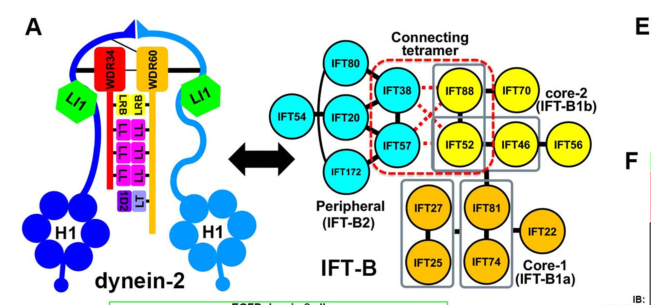

## Question

# Gene Research for Functional Annotation

## ⚠️ CRITICAL: Gene/Protein Identification Context

**BEFORE YOU BEGIN RESEARCH:** You MUST verify you are researching the CORRECT gene/protein. Gene symbols can be ambiguous, especially for less well-characterized genes from non-model organisms.

### Target Gene/Protein Identity (from UniProt):
- **UniProt Accession:** Q8NCM8
- **Protein Description:** RecName: Full=Cytoplasmic dynein 2 heavy chain 1; AltName: Full=Cytoplasmic dynein 2 heavy chain; AltName: Full=Dynein cytoplasmic heavy chain 2; AltName: Full=Dynein heavy chain 11; Short=hDHC11; AltName: Full=Dynein heavy chain isotype 1B;
- **Gene Information:** Name=DYNC2H1; Synonyms=DHC1B, DHC2, DNCH2, DYH1B, KIAA1997;
- **Organism (full):** Homo sapiens (Human).
- **Protein Family:** Belongs to the dynein heavy chain family. .
- **Key Domains:** AAA+_ATPase. (IPR003593); AAA_9. (IPR035706); AAA_lid_11. (IPR041658); AAA_lid_11_sf. (IPR042219); DHC. (IPR026983)

### MANDATORY VERIFICATION STEPS:

1. **Check if the gene symbol "DYNC2H1" matches the protein description above**
2. **Verify the organism is correct:** Homo sapiens (Human).
3. **Check if protein family/domains align with what you find in literature**
4. **If you find literature for a DIFFERENT gene with the same or similar symbol, STOP**

### If Gene Symbol is Ambiguous or You Cannot Find Relevant Literature:

**DO NOT PROCEED WITH RESEARCH ON A DIFFERENT GENE.** Instead:
- State clearly: "The gene symbol 'DYNC2H1' is ambiguous or literature is limited for this specific protein"
- Explain what you found (e.g., "Found extensive literature on a different gene with the same symbol in a different organism")
- Describe the protein based ONLY on the UniProt information provided above
- Suggest that the protein function can be inferred from domain/family information

### Research Target:

Please provide a comprehensive research report on the gene **DYNC2H1** (gene ID: DYNC2H1, UniProt: Q8NCM8) in human.

The research report should be a detailed narrative explaining the function, biological processes, and localization of the gene product. Citations should be given for all claims.

You should prioritize authoritative reviews and primary scientific literature when conducting research. You can supplement
this with annotations you find in gene/protein databases, but these can be outdated or inaccurate.

We are specifically interested in the primary function of the gene - for enzymes, what reaction is catalyzed, and what is the substrate specificity? For transporters, what is the substrate? For structural proteins or adapters, what is the broader structural role? For signaling molecules, what is the role in the pathway.

We are interested in where in or outside the cell the gene product carries out its function.

We are also interested in the signaling or biochemical pathways in which the gene functions. We are less interested in broad pleiotropic effects, except where these elucidate the precise role.

Include evidence where possible. We are interested in both experimental evidence as well as inference from structure, evolution, or bioinformatic analysis. Precise studies should be prioritized over high-throughput, where available.

## Output

Question: You are an expert researcher providing comprehensive, well-cited information.

Provide detailed information focusing on:
1. Key concepts and definitions with current understanding
2. Recent developments and latest research (prioritize 2023-2024 sources)
3. Current applications and real-world implementations
4. Expert opinions and analysis from authoritative sources
5. Relevant statistics and data from recent studies

Format as a comprehensive research report with proper citations. Include URLs and publication dates where available.
Always prioritize recent, authoritative sources and provide specific citations for all major claims.

# Gene Research for Functional Annotation

## ⚠️ CRITICAL: Gene/Protein Identification Context

**BEFORE YOU BEGIN RESEARCH:** You MUST verify you are researching the CORRECT gene/protein. Gene symbols can be ambiguous, especially for less well-characterized genes from non-model organisms.

### Target Gene/Protein Identity (from UniProt):
- **UniProt Accession:** Q8NCM8
- **Protein Description:** RecName: Full=Cytoplasmic dynein 2 heavy chain 1; AltName: Full=Cytoplasmic dynein 2 heavy chain; AltName: Full=Dynein cytoplasmic heavy chain 2; AltName: Full=Dynein heavy chain 11; Short=hDHC11; AltName: Full=Dynein heavy chain isotype 1B;
- **Gene Information:** Name=DYNC2H1; Synonyms=DHC1B, DHC2, DNCH2, DYH1B, KIAA1997;
- **Organism (full):** Homo sapiens (Human).
- **Protein Family:** Belongs to the dynein heavy chain family. .
- **Key Domains:** AAA+_ATPase. (IPR003593); AAA_9. (IPR035706); AAA_lid_11. (IPR041658); AAA_lid_11_sf. (IPR042219); DHC. (IPR026983)

### MANDATORY VERIFICATION STEPS:

1. **Check if the gene symbol "DYNC2H1" matches the protein description above**
2. **Verify the organism is correct:** Homo sapiens (Human).
3. **Check if protein family/domains align with what you find in literature**
4. **If you find literature for a DIFFERENT gene with the same or similar symbol, STOP**

### If Gene Symbol is Ambiguous or You Cannot Find Relevant Literature:

**DO NOT PROCEED WITH RESEARCH ON A DIFFERENT GENE.** Instead:
- State clearly: "The gene symbol 'DYNC2H1' is ambiguous or literature is limited for this specific protein"
- Explain what you found (e.g., "Found extensive literature on a different gene with the same symbol in a different organism")
- Describe the protein based ONLY on the UniProt information provided above
- Suggest that the protein function can be inferred from domain/family information

### Research Target:

Please provide a comprehensive research report on the gene **DYNC2H1** (gene ID: DYNC2H1, UniProt: Q8NCM8) in human.

The research report should be a detailed narrative explaining the function, biological processes, and localization of the gene product. Citations should be given for all claims.

You should prioritize authoritative reviews and primary scientific literature when conducting research. You can supplement
this with annotations you find in gene/protein databases, but these can be outdated or inaccurate.

We are specifically interested in the primary function of the gene - for enzymes, what reaction is catalyzed, and what is the substrate specificity? For transporters, what is the substrate? For structural proteins or adapters, what is the broader structural role? For signaling molecules, what is the role in the pathway.

We are interested in where in or outside the cell the gene product carries out its function.

We are also interested in the signaling or biochemical pathways in which the gene functions. We are less interested in broad pleiotropic effects, except where these elucidate the precise role.

Include evidence where possible. We are interested in both experimental evidence as well as inference from structure, evolution, or bioinformatic analysis. Precise studies should be prioritized over high-throughput, where available.

# Human DYNC2H1: functional annotation research report

**Identity and scope.** The target is human **DYNC2H1**, the cytoplasmic **dynein-2 heavy chain** specified as UniProt **Q8NCM8** in the question. Published nomenclature also uses DHC1B, DHC2 and DNCH2. DYNC2H1 is distinct from **DYNC1H1**, the heavy chain of cytoplasmic dynein-1: dynein-2 specializes in transport *within cilia*, whereas dynein-1 performs much of the minus-end-directed transport elsewhere in the cell. Dynein-family comparisons and human dynein-2 structural work support the supplied AAA+ ATPase and dynein-heavy-chain domain classification; the cited papers do not independently establish the UniProt accession-to-sequence mapping, for which the supplied UniProt identifier remains the reference. (hou2015dyneinandintraflagellar pages 17-17, roberts2018emergingmechanismsof pages 4-5, mukhopadhyay2024structureandtethering pages 3-4)

## Primary biochemical function

DYNC2H1 is the **ATP-hydrolyzing, force-generating subunit of the retrograde intraflagellar-transport (IFT) motor**. Its immediate chemical substrate is **ATP**, not an IFT cargo: ATP hydrolysis drives conformational changes that move dynein-2 along **microtubules toward their minus ends**. Within a cilium, that direction is **from tip toward base**. Its relevant *transported material* is the returning IFT train, including IFT-A and IFT-B machinery and associated ciliary cargo; membrane proteins can be linked to that transport through other IFT components and adaptors. DYNC2H1 should therefore be annotated as a **motor ATPase**, not as a membrane transporter or a Hedgehog-pathway enzyme. (hou2015dyneinandintraflagellar pages 1-2, hiyamizu2023multipleinteractionsof pages 1-2, roberts2018emergingmechanismsof pages 6-7)

The heavy-chain motor contains a ring of six AAA+ modules, a force-transmitting linker and a stalk ending in a microtubule-binding domain; its amino-terminal tail supports dimerization and accessory-subunit binding. **AAA1 is the principal ATP-hydrolysis site.** Other nucleotide-binding modules have regulatory or less well-defined catalytic roles, so it would be misleading to assign an independently demonstrated, equivalent ATP-turnover rate to every AAA+ module of human DYNC2H1. The microtubule is the motor’s *track and binding partner*, not its chemical substrate. (roberts2018emergingmechanismsof pages 4-5, roberts2018emergingmechanismsof pages 7-8, roberts2018emergingmechanismsof pages 6-7)

There is direct human-protein evidence, beyond domain inference. Toropova, Mladenov and Roberts ([2017](https://doi.org/10.1038/nsmb.3391)) measured microtubule-stimulated ATPase activity and microtubule gliding using recombinant dynein-2 motor constructs. One autoinhibition-disrupting construct had a fitted ATPase **kcat of 4.7 ± 0.3 s⁻¹**, basal activity of **1.6 ± 0.1 s⁻¹**, and microtubule-concentration **Km of 8.0 ± 2.2 μM**. These are **construct- and assay-specific values**, not turnover or transport rates measured inside human cilia. The study showed that pairing motor domains can trap the mechanical linker and microtubule-binding elements in an inhibited configuration. This provides a mechanism by which kinesin-2 can carry dynein-2 *outward* to the tip without substantial opposition from the return motor. (toropova2017intraflagellartransportdynein pages 1-6, roberts2018emergingmechanismsof pages 8-9, roberts2018emergingmechanismsof pages 9-9)

## Complex architecture, localization and IFT cycle

Human dynein-2 is assembled around a **homodimer of two DYNC2H1 molecules**, each providing a motor domain. Its associated components include light-intermediate chain **DYNC2LI1**, distinct intermediate chains **WDR34** and **WDR60**, and dynein light chains. The different intermediate chains organize the two otherwise identical heavy-chain tails asymmetrically and help target the motor to IFT trains. A **3.9-Å cryo-electron microscopy structure**, reported by Mukhopadhyay and colleagues ([March 2024](https://doi.org/10.1038/s44318-024-00060-1)), resolved different WDR34–DYNC2H1 and WDR60–DYNC2H1 contacts at equivalent sites. These findings establish a motor-complex role for DYNC2H1 rather than an independent scaffold-only role. (mukhopadhyay2024structureandtethering pages 1-3, mukhopadhyay2024structureandtethering pages 3-4, vuolo2020cytoplasmicdynein2at pages 2-3)

**Where it works:** DYNC2H1 is an **intracellular protein**, assembled or recruited near the **basal body/ciliary base** and transported into the cilium with anterograde IFT trains. Its characteristic force-producing activity takes place **along axonemal microtubules inside the cilium**, on the tip-to-base return trip. It is not itself an extracellular protein or an axonemal dynein arm that beats the cilium. In a 2024 dynein-2 assembly study, loss of the centrosomal protein CEP170 reduced DYNC2H1/DHC2 staining both **at ciliary bases and within cilia**, without reducing total DHC2 expression; this supports a localization and assembly effect rather than simple loss of protein production. The authors could not establish which dynein-2 subunit binds CEP170 directly. (roberts2018emergingmechanismsof pages 1-2, weijman2024rolesforcep170 pages 11-13, weijman2024rolesforcep170 pages 7-11)

Mechanistically, kinesin-2 takes IFT trains and inactive dynein-2 from the base to the tip; train remodeling then precedes dynein-2-powered return. Human-cell interaction experiments by Hiyamizu and colleagues ([February 2023](https://doi.org/10.1242/jcs.260462)) found that the **DYNC2H1 amino-terminal tail–DYNC2LI1 module** binds the IFT-B protein **IFT54**, while **IFT57** contacts several dynein-2 subunits. WDR60 provides further IFT-B contacts. Thus **multiple connections**, rather than a single uniquely established cargo-binding site on DYNC2H1, attach the large motor to IFT trains. The study’s Figure 1 illustrates the dynein-2/IFT-B architecture and the DYNC2H1-tail–DYNC2LI1/IFT54 interaction. (hiyamizu2023multipleinteractionsof pages 1-2, hiyamizu2023multipleinteractionsof pages 3-4, hiyamizu2023multipleinteractionsof media 075e4fd3)

The 2024 Mukhopadhyay study adds cell-based evidence for how that attachment affects transport: deletion of either WDR34 or WDR60 reduced **retrograde IFT velocity and frequency** in ciliated mammalian cells, and loss of WDR60 caused **IFT88 accumulation at ciliary tips** and reduced DYNC2H1 targeting into cilia. Cilia could form without either intermediate chain individually, but combined loss produced markedly shorter cilia. Transferring the amino-terminal **WDR60 residues 1–470** onto WDR34 rescued ciliary length and IFT88-distribution defects, supporting the interpretation of that region as a transferable IFT-train tether. These are experiments on *DYNC2H1-associated subunits*, not proof that WDR60 itself hydrolyzes ATP. (mukhopadhyay2024structureandtethering pages 1-3, mukhopadhyay2024structureandtethering pages 5-7)

## Biological processes and signaling

The most specific biological-process annotation is **retrograde IFT**, which recycles train components and helps control ciliary composition, assembly and maintenance. Defective return transport can leave IFT proteins concentrated near ciliary tips; the resulting cilia can remain present but be swollen or functionally abnormal. Genetic evidence from homologous motors in *Chlamydomonas* and *C. elegans*, together with experiments in mammalian cells and human patient fibroblasts, supports this assignment. Species should not be conflated: nematode CHE-3 and algal DHC1b establish conserved motor function, while human experiments directly connect **DYNC2H1 variation** with abnormal ciliary trafficking. (pfister2006geneticanalysisof pages 5-6, hou2015dyneinandintraflagellar pages 1-2, mukhopadhyay2024structureandtethering pages 5-7, schmidts2013exomesequencingidentifies pages 10-11)

DYNC2H1 affects **Hedgehog signaling indirectly by maintaining transport through the signaling compartment, the primary cilium**. Ciliary localization and turnover of pathway proteins, including Smoothened and GLI-associated machinery, depend on a functioning cilium and its trafficking system; DYNC2H1 is **not** a Hedgehog receptor, transcription factor or ligand-processing enzyme. Its signaling effect should not be reduced to a universal claim that it only activates or only represses Hedgehog. For example, the *Dync2h1* **meimei** mouse mutant had widened cilia at both cervical and thoracic levels, but motor-neuron induction was strongly impaired anteriorly while remaining robust posteriorly. The interpretation is **context-dependent Hedgehog output downstream of defective ciliary transport**, not a separately demonstrated direct enzymatic action on GLI. (legue2020mutationsinciliary pages 4-6, legue2020mutationsinciliary pages 1-2, legue2020mutationsinciliary pages 2-4)

## Human evidence and practical applications

Biallelic DYNC2H1 variants cause a spectrum of **skeletal ciliopathies**, particularly short-rib thoracic dysplasia/Jeune asphyxiating thoracic dystrophy, sometimes with polydactyly. In a selected 2013 Jeune cohort, investigators found **34 DYNC2H1 variants in 29 of 71 affected individuals (41%)**, from **19 of 57 families (33%)**. Patient fibroblasts accumulated the anterograde-IFT marker **IFT88 near ciliary tips**, providing a cellular correlate of impaired return transport. The **41% is a proportion within that clinically selected cohort**, not the population frequency of DYNC2H1 disease. The investigators reported considerable thoracic-phenotype variability even among affected siblings, cautioning against deterministic prediction from a variant alone. (schmidts2013exomesequencingidentifies pages 2-3, schmidts2013exomesequencingidentifies pages 10-11, schmidts2013exomesequencingidentifies pages 1-2)

The phenotype is not confined to skeleton. Vig and colleagues ([December 2020](https://doi.org/10.1038/s41436-020-0915-1)) studied **five unrelated individuals** with nonsyndromic inherited retinal degeneration and found hypomorphic or retina-predominant DYNC2H1 variants. Their fibroblast, retinal-organoid and **in-vitro motility** experiments linked selected variants to disturbed motor function and ciliary IFT88 distribution. This supports an allele- and tissue-dependent role in **photoreceptor ciliary transport**; five probands do not establish how often retinal-only disease occurs. (vig2020dync2h1hypomorphicor pages 1-2)

The established real-world use of this functional knowledge is **molecular diagnosis and variant interpretation**, especially when prenatal imaging shows short limbs and a narrow chest. Peng and colleagues ([December 2023](https://doi.org/10.1186/s12920-023-01753-y)) reported three new DYNC2H1 variants while investigating four unrelated fetuses with skeletal dysplasia. Nakajima and colleagues ([December 2024](https://doi.org/10.1038/s41439-024-00302-y)) identified pathogenic or likely pathogenic DYNC2H1 variants **in trans** in a fetus whose unusual ossification defects had made its short-rib thoracic dysplasia difficult to classify clinically. Conversely, the mechanistic studies identify targets for *research* into motor assembly and ciliary transport, **not a demonstrated DYNC2H1-specific treatment**. (peng2023clinicalfeaturesand pages 1-2, nakajima2024unclassifiableshortribthoracic pages 1-2, weijman2024rolesforcep170 pages 11-13)

The principal studies, measurements and evidentiary limits are summarized below.

| Study (year; URL) | Direct finding with numbers | Annotation inference / limitations |
|---|---|---|
| Toropova, Mladenov & Roberts (2017), [Nature Structural & Molecular Biology](https://doi.org/10.1038/nsmb.3391) | Recombinant human dynein-2 constructs demonstrated microtubule-stimulated ATPase activity and microtubule gliding. For the autoinhibition-disrupting DQR motor mutant, kcat was 4.7 ± 0.3 s⁻¹, basal ATPase activity was 1.6 ± 0.1 s⁻¹, and Km(MT) was 8.0 ± 2.2 μM. A motor construct reached a fitted gliding Vmax of 219.3 ± 3.3 nm/s under the stated assay condition. Dimerization stacked the motor domains and trapped linker and stalk elements, suppressing activity and facilitating kinesin-II transport of dynein-2 (toropova2017intraflagellartransportdynein pages 1-6, roberts2018emergingmechanismsof pages 8-9, roberts2018emergingmechanismsof pages 9-9). | Directly supports annotation of DYNC2H1 as an ATP-powered, microtubule-based motor and identifies intrinsic autoinhibition. Measurements came from engineered recombinant constructs in vitro, not intact cilia; assay-specific rates should not be treated as in-cilium transport velocities. |
| Hiyamizu et al. (2023), [Journal of Cell Science](https://doi.org/10.1242/jcs.260462) | Human-cell interaction assays showed that the DYNC2H1 N-terminal nonmotor tail, residues 1–1090, associated strongly with IFT54 when complexed with DYNC2LI1. IFT57 contacted DYNC2H1(N), DYNC2LI1, WDR60 and WDR34; WDR60–IFT54 was the strongest individual interaction detected. Proteomics found IFT54 and IFT57 enriched in all 7 WDR60 experiments, supporting multiple dynein-2–IFT-B contacts (hiyamizu2023multipleinteractionsof pages 1-2, hiyamizu2023multipleinteractionsof pages 4-6, hiyamizu2023multipleinteractionsof pages 3-4, hiyamizu2023multipleinteractionsof media 075e4fd3). | Supports loading of the DYNC2H1 motor onto anterograde IFT-B trains through multivalent contacts, including a DYNC2H1–DYNC2LI1 module. Most data were co-expression, precipitation and rescue assays; they establish physical and functional association rather than proving that one contact alone carries the motor in vivo. |
| Mukhopadhyay et al. (2024), [The EMBO Journal](https://doi.org/10.1038/s44318-024-00060-1) | A 3.9 Å cryo-EM reconstruction resolved a dynein-2 complex containing two identical DYNC2H1 heavy chains associated asymmetrically with WDR34 and WDR60. CRISPR single knockouts still formed cilia, whereas double loss produced significantly shorter cilia; single losses reduced retrograde IFT velocity and frequency, and WDR60 or double knockout caused tip accumulation of IFT88. WDR60 residues 1–470 transplanted onto WDR34 rescued ciliary length and IFT88 distribution, identifying a modular IFT-train tether (mukhopadhyay2024structureandtethering pages 1-3, mukhopadhyay2024structureandtethering pages 5-7, mukhopadhyay2024structureandtethering pages 3-4). | Strong structural and mammalian-cell evidence that DYNC2H1 supplies two motor heads while distinct intermediate chains assemble, target and tether the motor. Cell experiments used IMCD-3 models rather than human tissue; WDR34 and WDR60 phenotypes annotate regulation of DYNC2H1, not separate catalytic activity. |
| Weijman et al. (2024), [Journal of Cell Science/preprint DOI](https://doi.org/10.1101/2023.11.20.567836) | CEP170 loss reduced DYNC2H1/DHC2 signal throughout cilia, assessed in 85 wild-type versus 55 knockout cells, and at the basal body, assessed in 269 wild-type versus 80 knockout cells; both comparisons had p < 0.0001. Total DHC2 expression was unchanged. In CEP170-null cells, WDR60-associated dynein-2 components generally had log₂ relative abundance below zero; IFT88 accumulated at ciliary tips and Smoothened responses were altered (weijman2024rolesforcep170 pages 1-3, weijman2024rolesforcep170 pages 11-13, weijman2024rolesforcep170 pages 7-11). | Places DYNC2H1 at the ciliary base and within the axoneme and implicates centrosomal or subdistal-appendage CEP170 in holoenzyme assembly or stabilization. The experiments support a modulatory assembly role; they do not establish direct CEP170–DYNC2H1 binding or make CEP170 indispensable for ciliogenesis. |
| Schmidts et al. (2013), [Journal of Medical Genetics](https://doi.org/10.1136/jmedgenet-2012-101284) | Screening 71 affected individuals identified 34 DYNC2H1 variants in 29 of 71 patients, or 41%, representing 19 of 57 families, or 33%. Patient fibroblasts accumulated IFT88 distally in cilia, linking biallelic variants to defective retrograde IFT. No patient carried two early-termination alleles, and missense variants clustered partly around AAA3–AAA4 and the microtubule-binding stalk (schmidts2013exomesequencingidentifies pages 2-3, schmidts2013exomesequencingidentifies pages 10-11, schmidts2013exomesequencingidentifies pages 3-4). | Human genetic and cellular evidence identifies DYNC2H1 dysfunction as a major cause of Jeune or asphyxiating thoracic dystrophy and validates retrograde IFT as its primary function. The 41% value is cohort-specific, not population prevalence; selection favored Jeune cases without major extraskeletal disease. |
| Vig et al. (2020), [Genetics in Medicine](https://doi.org/10.1038/s41436-020-0915-1) | Five unrelated probands with nonsyndromic inherited retinal degeneration carried four novel and one previously reported DYNC2H1 variants. A truncating and a splice-donor allele impaired dynein-2 motility in vitro and disturbed ciliary IFT88 distribution; retinal organoids showed increasing expression during differentiation of a retina-predominant DYNC2H1 transcript affected in other probands (vig2020dync2h1hypomorphicor pages 1-2). | Extends DYNC2H1 function to transport in photoreceptor sensory cilia and supports allele and tissue dependence: hypomorphic or retina-predominant defects can cause isolated retinal disease. Five probands do not establish frequency, and retinal degeneration should not be generalized to all DYNC2H1 genotypes. |
| Peng et al. (2023), [BMC Medical Genomics](https://doi.org/10.1186/s12920-023-01753-y) | Among four unrelated fetuses with narrow thoraces and shortened long bones, exome sequencing after negative chromosome and pathogenic copy-number testing identified three novel DYNC2H1 variants: p.Arg2270Gln, p.Gln1045Ter and p.Arg113Trp. These findings supported prenatal diagnosis of DYNC2H1-associated short-rib thoracic dysplasia (peng2023clinicalfeaturesand pages 1-2). | Demonstrates a clinical application: integrating fetal imaging with exome sequencing and segregation analysis. This is diagnostic association rather than a functional motor assay, and the small heterogeneous series cannot define variant penetrance or prognosis. |
| Nakajima et al. (2024), [Human Genome Variation](https://doi.org/10.1038/s41439-024-00302-y) | Targeted sequencing resolved an initially unclassifiable fetal skeletal dysplasia by finding compound-heterozygous DYNC2H1 variants in trans: likely pathogenic p.Glu1135Val and pathogenic p.His1896Tyrfs*9. The fetus had an extremely narrow thorax, short ribs, polydactyly and unusually severe acromesomelic ossification defects (nakajima2024unclassifiableshortribthoracic pages 1-2). | Shows that molecular testing can identify DYNC2H1 disease despite an atypical radiographic presentation and broadens the observed short-rib thoracic dysplasia phenotype. It is a single case and supplies no direct evidence about the biochemical effect of either variant. |

*Table: Key biochemical, structural, cellular and human-genetic evidence supporting the functional annotation of DYNC2H1 as the dynein-2 motor heavy chain. Limitations distinguish direct motor evidence from disease association and model-system inference.*

**Functional annotation conclusion.** Human **DYNC2H1/Q8NCM8** encodes the **AAA+ ATPase heavy-chain motor of dynein-2**. Its defining activity is ATP-dependent, minus-end-directed movement of the retrograde IFT apparatus **inside cilia, from tip to base**. Interactions of its tail and accessory chains with IFT-B organize ciliary entry and train attachment; failures of that transport change ciliary composition and thereby perturb cilium-dependent signaling and development. That causal chain is supported by human motor biochemistry, structural and cell experiments, patient-derived cilia and human genetics, with organism-, allele- and tissue-specific limitations noted above. (toropova2017intraflagellartransportdynein pages 1-6, hiyamizu2023multipleinteractionsof pages 3-4, mukhopadhyay2024structureandtethering pages 1-3, mukhopadhyay2024structureandtethering pages 5-7, schmidts2013exomesequencingidentifies pages 10-11, vig2020dync2h1hypomorphicor pages 1-2)

References

1. (hou2015dyneinandintraflagellar pages 17-17): Yuqing Hou and George B. Witman. Dynein and intraflagellar transport. Experimental cell research, 334 1:26-34, May 2015. URL: https://doi.org/10.1016/j.yexcr.2015.02.017, doi:10.1016/j.yexcr.2015.02.017. This article has 81 citations and is from a peer-reviewed journal.

2. (roberts2018emergingmechanismsof pages 4-5): Anthony J. Roberts. Emerging mechanisms of dynein transport in the cytoplasm versus the cilium. Biochemical Society Transactions, 46:967-982, Jul 2018. URL: https://doi.org/10.1042/bst20170568, doi:10.1042/bst20170568. This article has 77 citations and is from a peer-reviewed journal.

3. (mukhopadhyay2024structureandtethering pages 3-4): Aakash G Mukhopadhyay, Katerina Toropova, Lydia Daly, Jennifer N Wells, Laura Vuolo, Miroslav Mladenov, Marian Seda, Dagan Jenkins, David J Stephens, and Anthony J Roberts. Structure and tethering mechanism of dynein-2 intermediate chains in intraflagellar transport. The EMBO Journal, 43:1257-1272, Mar 2024. URL: https://doi.org/10.1038/s44318-024-00060-1, doi:10.1038/s44318-024-00060-1. This article has 18 citations.

4. (hou2015dyneinandintraflagellar pages 1-2): Yuqing Hou and George B. Witman. Dynein and intraflagellar transport. Experimental cell research, 334 1:26-34, May 2015. URL: https://doi.org/10.1016/j.yexcr.2015.02.017, doi:10.1016/j.yexcr.2015.02.017. This article has 81 citations and is from a peer-reviewed journal.

5. (hiyamizu2023multipleinteractionsof pages 1-2): Shunya Hiyamizu, Hantian Qiu, Laura Vuolo, Nicola L. Stevenson, Caroline Shak, Kate J. Heesom, Yuki Hamada, Yuta Tsurumi, Shuhei Chiba, Yohei Katoh, David J. Stephens, and Kazuhisa Nakayama. Multiple interactions of the dynein-2 complex with the ift-b complex are required for effective intraflagellar transport. Journal of Cell Science, Feb 2023. URL: https://doi.org/10.1242/jcs.260462, doi:10.1242/jcs.260462. This article has 21 citations and is from a domain leading peer-reviewed journal.

6. (roberts2018emergingmechanismsof pages 6-7): Anthony J. Roberts. Emerging mechanisms of dynein transport in the cytoplasm versus the cilium. Biochemical Society Transactions, 46:967-982, Jul 2018. URL: https://doi.org/10.1042/bst20170568, doi:10.1042/bst20170568. This article has 77 citations and is from a peer-reviewed journal.

7. (roberts2018emergingmechanismsof pages 7-8): Anthony J. Roberts. Emerging mechanisms of dynein transport in the cytoplasm versus the cilium. Biochemical Society Transactions, 46:967-982, Jul 2018. URL: https://doi.org/10.1042/bst20170568, doi:10.1042/bst20170568. This article has 77 citations and is from a peer-reviewed journal.

8. (toropova2017intraflagellartransportdynein pages 1-6): Katerina Toropova, Miroslav Mladenov, and Anthony J Roberts. Intraflagellar transport dynein is autoinhibited by trapping of its mechanical and track-binding elements. Apr 2017. URL: https://doi.org/10.1038/nsmb.3391, doi:10.1038/nsmb.3391. This article has 106 citations and is from a highest quality peer-reviewed journal.

9. (roberts2018emergingmechanismsof pages 8-9): Anthony J. Roberts. Emerging mechanisms of dynein transport in the cytoplasm versus the cilium. Biochemical Society Transactions, 46:967-982, Jul 2018. URL: https://doi.org/10.1042/bst20170568, doi:10.1042/bst20170568. This article has 77 citations and is from a peer-reviewed journal.

10. (roberts2018emergingmechanismsof pages 9-9): Anthony J. Roberts. Emerging mechanisms of dynein transport in the cytoplasm versus the cilium. Biochemical Society Transactions, 46:967-982, Jul 2018. URL: https://doi.org/10.1042/bst20170568, doi:10.1042/bst20170568. This article has 77 citations and is from a peer-reviewed journal.

11. (mukhopadhyay2024structureandtethering pages 1-3): Aakash G Mukhopadhyay, Katerina Toropova, Lydia Daly, Jennifer N Wells, Laura Vuolo, Miroslav Mladenov, Marian Seda, Dagan Jenkins, David J Stephens, and Anthony J Roberts. Structure and tethering mechanism of dynein-2 intermediate chains in intraflagellar transport. The EMBO Journal, 43:1257-1272, Mar 2024. URL: https://doi.org/10.1038/s44318-024-00060-1, doi:10.1038/s44318-024-00060-1. This article has 18 citations.

12. (vuolo2020cytoplasmicdynein2at pages 2-3): Laura Vuolo, Nicola L. Stevenson, Aakash G. Mukhopadhyay, Anthony J. Roberts, and David J. Stephens. Cytoplasmic dynein-2 at a glance. Journal of Cell Science, Mar 2020. URL: https://doi.org/10.1242/jcs.240614, doi:10.1242/jcs.240614. This article has 42 citations and is from a domain leading peer-reviewed journal.

13. (roberts2018emergingmechanismsof pages 1-2): Anthony J. Roberts. Emerging mechanisms of dynein transport in the cytoplasm versus the cilium. Biochemical Society Transactions, 46:967-982, Jul 2018. URL: https://doi.org/10.1042/bst20170568, doi:10.1042/bst20170568. This article has 77 citations and is from a peer-reviewed journal.

14. (weijman2024rolesforcep170 pages 11-13): Johannes F Weijman, Laura Vuolo, Caroline Shak, Anna Pugnetti, Aakash G Mukhopadhyay, Lorna R Hodgson, Kate J Heesom, Anthony J Roberts, and David J Stephens. Roles for cep170 in cilia function and dynein-2 assembly. Journal of Cell Science, Nov 2024. URL: https://doi.org/10.1101/2023.11.20.567836, doi:10.1101/2023.11.20.567836. This article has 18 citations and is from a domain leading peer-reviewed journal.

15. (weijman2024rolesforcep170 pages 7-11): Johannes F Weijman, Laura Vuolo, Caroline Shak, Anna Pugnetti, Aakash G Mukhopadhyay, Lorna R Hodgson, Kate J Heesom, Anthony J Roberts, and David J Stephens. Roles for cep170 in cilia function and dynein-2 assembly. Journal of Cell Science, Nov 2024. URL: https://doi.org/10.1101/2023.11.20.567836, doi:10.1101/2023.11.20.567836. This article has 18 citations and is from a domain leading peer-reviewed journal.

16. (hiyamizu2023multipleinteractionsof pages 3-4): Shunya Hiyamizu, Hantian Qiu, Laura Vuolo, Nicola L. Stevenson, Caroline Shak, Kate J. Heesom, Yuki Hamada, Yuta Tsurumi, Shuhei Chiba, Yohei Katoh, David J. Stephens, and Kazuhisa Nakayama. Multiple interactions of the dynein-2 complex with the ift-b complex are required for effective intraflagellar transport. Journal of Cell Science, Feb 2023. URL: https://doi.org/10.1242/jcs.260462, doi:10.1242/jcs.260462. This article has 21 citations and is from a domain leading peer-reviewed journal.

17. (hiyamizu2023multipleinteractionsof media 075e4fd3): Shunya Hiyamizu, Hantian Qiu, Laura Vuolo, Nicola L. Stevenson, Caroline Shak, Kate J. Heesom, Yuki Hamada, Yuta Tsurumi, Shuhei Chiba, Yohei Katoh, David J. Stephens, and Kazuhisa Nakayama. Multiple interactions of the dynein-2 complex with the ift-b complex are required for effective intraflagellar transport. Journal of Cell Science, Feb 2023. URL: https://doi.org/10.1242/jcs.260462, doi:10.1242/jcs.260462. This article has 21 citations and is from a domain leading peer-reviewed journal.

18. (mukhopadhyay2024structureandtethering pages 5-7): Aakash G Mukhopadhyay, Katerina Toropova, Lydia Daly, Jennifer N Wells, Laura Vuolo, Miroslav Mladenov, Marian Seda, Dagan Jenkins, David J Stephens, and Anthony J Roberts. Structure and tethering mechanism of dynein-2 intermediate chains in intraflagellar transport. The EMBO Journal, 43:1257-1272, Mar 2024. URL: https://doi.org/10.1038/s44318-024-00060-1, doi:10.1038/s44318-024-00060-1. This article has 18 citations.

19. (pfister2006geneticanalysisof pages 5-6): K. Kevin Pfister, Paresh R Shah, Holger Hummerich, Andreas Russ, James Cotton, Azlina Ahmad Annuar, Stephen M King, and Elizabeth M. C Fisher. Genetic analysis of the cytoplasmic dynein subunit families. PLoS Genetics, 2:e1, Jan 2006. URL: https://doi.org/10.1371/journal.pgen.0020001, doi:10.1371/journal.pgen.0020001. This article has 407 citations and is from a domain leading peer-reviewed journal.

20. (schmidts2013exomesequencingidentifies pages 10-11): Miriam Schmidts, Heleen H Arts, Ernie M H F Bongers, Zhimin Yap, Machteld M Oud, Dinu Antony, Lonneke Duijkers, Richard D Emes, Jim Stalker, Jan-Bart L Yntema, Vincent Plagnol, Alexander Hoischen, Christian Gilissen, Elisabeth Forsythe, Ekkehart Lausch, Joris A Veltman, Nel Roeleveld, Andrea Superti-Furga, Anna Kutkowska-Kazmierczak, Erik-Jan Kamsteeg, Nursel Elçioğlu, Merel C van Maarle, Luitgard M Graul-Neumann, Koenraad Devriendt, Sarah F Smithson, Diana Wellesley, Nienke E Verbeek, Raoul C M Hennekam, Hulya Kayserili, Peter J Scambler, Philip L Beales, Nine VAM Knoers, Ronald Roepman, and Hannah M Mitchison. Exome sequencing identifies <i>dync2h1</i> mutations as a common cause of asphyxiating thoracic dystrophy (jeune syndrome) without major polydactyly, renal or retinal involvement. Journal of Medical Genetics, 50:309-323, Mar 2013. URL: https://doi.org/10.1136/jmedgenet-2012-101284, doi:10.1136/jmedgenet-2012-101284. This article has 187 citations and is from a domain leading peer-reviewed journal.

21. (legue2020mutationsinciliary pages 4-6): Emilie Legué and Karel F. Liem. Mutations in ciliary trafficking genes affect sonic hedgehog-dependent neural tube patterning differentially along the anterior–posterior axis. Neuroscience, 450:3-14, Dec 2020. URL: https://doi.org/10.1016/j.neuroscience.2020.07.015, doi:10.1016/j.neuroscience.2020.07.015. This article has 14 citations and is from a domain leading peer-reviewed journal.

22. (legue2020mutationsinciliary pages 1-2): Emilie Legué and Karel F. Liem. Mutations in ciliary trafficking genes affect sonic hedgehog-dependent neural tube patterning differentially along the anterior–posterior axis. Neuroscience, 450:3-14, Dec 2020. URL: https://doi.org/10.1016/j.neuroscience.2020.07.015, doi:10.1016/j.neuroscience.2020.07.015. This article has 14 citations and is from a domain leading peer-reviewed journal.

23. (legue2020mutationsinciliary pages 2-4): Emilie Legué and Karel F. Liem. Mutations in ciliary trafficking genes affect sonic hedgehog-dependent neural tube patterning differentially along the anterior–posterior axis. Neuroscience, 450:3-14, Dec 2020. URL: https://doi.org/10.1016/j.neuroscience.2020.07.015, doi:10.1016/j.neuroscience.2020.07.015. This article has 14 citations and is from a domain leading peer-reviewed journal.

24. (schmidts2013exomesequencingidentifies pages 2-3): Miriam Schmidts, Heleen H Arts, Ernie M H F Bongers, Zhimin Yap, Machteld M Oud, Dinu Antony, Lonneke Duijkers, Richard D Emes, Jim Stalker, Jan-Bart L Yntema, Vincent Plagnol, Alexander Hoischen, Christian Gilissen, Elisabeth Forsythe, Ekkehart Lausch, Joris A Veltman, Nel Roeleveld, Andrea Superti-Furga, Anna Kutkowska-Kazmierczak, Erik-Jan Kamsteeg, Nursel Elçioğlu, Merel C van Maarle, Luitgard M Graul-Neumann, Koenraad Devriendt, Sarah F Smithson, Diana Wellesley, Nienke E Verbeek, Raoul C M Hennekam, Hulya Kayserili, Peter J Scambler, Philip L Beales, Nine VAM Knoers, Ronald Roepman, and Hannah M Mitchison. Exome sequencing identifies <i>dync2h1</i> mutations as a common cause of asphyxiating thoracic dystrophy (jeune syndrome) without major polydactyly, renal or retinal involvement. Journal of Medical Genetics, 50:309-323, Mar 2013. URL: https://doi.org/10.1136/jmedgenet-2012-101284, doi:10.1136/jmedgenet-2012-101284. This article has 187 citations and is from a domain leading peer-reviewed journal.

25. (schmidts2013exomesequencingidentifies pages 1-2): Miriam Schmidts, Heleen H Arts, Ernie M H F Bongers, Zhimin Yap, Machteld M Oud, Dinu Antony, Lonneke Duijkers, Richard D Emes, Jim Stalker, Jan-Bart L Yntema, Vincent Plagnol, Alexander Hoischen, Christian Gilissen, Elisabeth Forsythe, Ekkehart Lausch, Joris A Veltman, Nel Roeleveld, Andrea Superti-Furga, Anna Kutkowska-Kazmierczak, Erik-Jan Kamsteeg, Nursel Elçioğlu, Merel C van Maarle, Luitgard M Graul-Neumann, Koenraad Devriendt, Sarah F Smithson, Diana Wellesley, Nienke E Verbeek, Raoul C M Hennekam, Hulya Kayserili, Peter J Scambler, Philip L Beales, Nine VAM Knoers, Ronald Roepman, and Hannah M Mitchison. Exome sequencing identifies <i>dync2h1</i> mutations as a common cause of asphyxiating thoracic dystrophy (jeune syndrome) without major polydactyly, renal or retinal involvement. Journal of Medical Genetics, 50:309-323, Mar 2013. URL: https://doi.org/10.1136/jmedgenet-2012-101284, doi:10.1136/jmedgenet-2012-101284. This article has 187 citations and is from a domain leading peer-reviewed journal.

26. (vig2020dync2h1hypomorphicor pages 1-2): Anjali Vig, James A. Poulter, Daniele Ottaviani, Erika Tavares, Katerina Toropova, Anna Maria Tracewska, Antonio Mollica, Jasmine Kang, Oshini Kehelwathugoda, Tara Paton, Jason T. Maynes, Gabrielle Wheway, Gavin Arno, J.C. Ambrose, P. Arumugam, E.L. Baple, M. Bleda, F. Boardman-Pretty, J.M. Boissiere, C.R. Boustred, H. Brittain, M.J. Caulfield, G.C. Chan, C.E.H. Craig, L.C. Daugherty, A. de Burca, A. Devereau, G. Elgar, R.E. Foulger, T. Fowler, P. Furió-Tarí, J.M. Hackett, D. Halai, A. Hamblin, S. Henderson, J.E. Holman, T.J.P. Hubbard, K. Ibáñez, R. Jackson, L.J. Jones, D. Kasperaviciute, M. Kayikci, L. Lahnstein, K. Lawson, S.E.A. Leigh, I.U.S. Leong, F.J. Lopez, F. Maleady-Crowe, J. Mason, E.M. McDonagh, L. Moutsianas, M. Mueller, N. Murugaesu, A.C. Need, C.A. Odhams, C. Patch, D. Perez-Gil, D. Polychronopoulos, J. Pullinger, T. Rahim, A. Rendon, P. Riesgo-Ferreiro, T. Rogers, M. Ryten, K. Savage, K. Sawant, R.H. Scott, A. Siddiq, A. Sieghart, D. Smedley, K.R. Smith, A. Sosinsky, W. Spooner, H.E. Stevens, A. Stuckey, R. Sultana, E.R.A. Thomas, S.R. Thompson, C. Tregidgo, A. Tucci, E. Walsh, S.A. Watters, M.J. Welland, E. Williams, K. Witkowska, S.M. Wood, M. Zarowiecki, Kamron N. Khan, Martin McKibbin, Carmel Toomes, Manir Ali, Matteo Di Scipio, Shuning Li, Jamie Ellingford, Graeme Black, Andrew Webster, Małgorzata Rydzanicz, Piotr Stawiński, Rafał Płoski, Ajoy Vincent, Michael E. Cheetham, Chris F. Inglehearn, Anthony Roberts, and Elise Heon. Dync2h1 hypomorphic or retina-predominant variants cause nonsyndromic retinal degeneration. Dec 2020. URL: https://doi.org/10.1038/s41436-020-0915-1, doi:10.1038/s41436-020-0915-1. This article has 56 citations and is from a highest quality peer-reviewed journal.

27. (peng2023clinicalfeaturesand pages 1-2): Ying Peng, Lin Zhou, Jing Chen, Xiaoliang Huang, Jialun Pang, Jing Liu, Wanglan Tang, Shuting Yang, Changbiao Liang, and Wanqin Xie. Clinical features and genetic analysis of a case series of skeletal ciliopathies in a prenatal setting. BMC Medical Genomics, Dec 2023. URL: https://doi.org/10.1186/s12920-023-01753-y, doi:10.1186/s12920-023-01753-y. This article has 6 citations and is from a peer-reviewed journal.

28. (nakajima2024unclassifiableshortribthoracic pages 1-2): Erika Nakajima, Yuko Yokohama, Saori Sugiyama, Mio Taketazu, Kenrokuro Mitsube, Takahiro Yamada, Anna Hammarsjö, Giedre Grigelioniene, Gen Nishimura, and Yoshio Makita. Unclassifiable short-rib thoracic dysplasia diagnosed using targeted gene panel sequencing. Human Genome Variation, Dec 2024. URL: https://doi.org/10.1038/s41439-024-00302-y, doi:10.1038/s41439-024-00302-y. This article has 0 citations.

29. (hiyamizu2023multipleinteractionsof pages 4-6): Shunya Hiyamizu, Hantian Qiu, Laura Vuolo, Nicola L. Stevenson, Caroline Shak, Kate J. Heesom, Yuki Hamada, Yuta Tsurumi, Shuhei Chiba, Yohei Katoh, David J. Stephens, and Kazuhisa Nakayama. Multiple interactions of the dynein-2 complex with the ift-b complex are required for effective intraflagellar transport. Journal of Cell Science, Feb 2023. URL: https://doi.org/10.1242/jcs.260462, doi:10.1242/jcs.260462. This article has 21 citations and is from a domain leading peer-reviewed journal.

30. (weijman2024rolesforcep170 pages 1-3): Johannes F Weijman, Laura Vuolo, Caroline Shak, Anna Pugnetti, Aakash G Mukhopadhyay, Lorna R Hodgson, Kate J Heesom, Anthony J Roberts, and David J Stephens. Roles for cep170 in cilia function and dynein-2 assembly. Journal of Cell Science, Nov 2024. URL: https://doi.org/10.1101/2023.11.20.567836, doi:10.1101/2023.11.20.567836. This article has 18 citations and is from a domain leading peer-reviewed journal.

31. (schmidts2013exomesequencingidentifies pages 3-4): Miriam Schmidts, Heleen H Arts, Ernie M H F Bongers, Zhimin Yap, Machteld M Oud, Dinu Antony, Lonneke Duijkers, Richard D Emes, Jim Stalker, Jan-Bart L Yntema, Vincent Plagnol, Alexander Hoischen, Christian Gilissen, Elisabeth Forsythe, Ekkehart Lausch, Joris A Veltman, Nel Roeleveld, Andrea Superti-Furga, Anna Kutkowska-Kazmierczak, Erik-Jan Kamsteeg, Nursel Elçioğlu, Merel C van Maarle, Luitgard M Graul-Neumann, Koenraad Devriendt, Sarah F Smithson, Diana Wellesley, Nienke E Verbeek, Raoul C M Hennekam, Hulya Kayserili, Peter J Scambler, Philip L Beales, Nine VAM Knoers, Ronald Roepman, and Hannah M Mitchison. Exome sequencing identifies <i>dync2h1</i> mutations as a common cause of asphyxiating thoracic dystrophy (jeune syndrome) without major polydactyly, renal or retinal involvement. Journal of Medical Genetics, 50:309-323, Mar 2013. URL: https://doi.org/10.1136/jmedgenet-2012-101284, doi:10.1136/jmedgenet-2012-101284. This article has 187 citations and is from a domain leading peer-reviewed journal.

## Artifacts

- [Edison artifact artifact-00](DYNC2H1-deep-research-falcon_artifacts/artifact-00.md)

## Citations

1. peng2023clinicalfeaturesand pages 1-2
2. nakajima2024unclassifiableshortribthoracic pages 1-2
3. hou2015dyneinandintraflagellar pages 17-17
4. roberts2018emergingmechanismsof pages 4-5
5. mukhopadhyay2024structureandtethering pages 3-4
6. hou2015dyneinandintraflagellar pages 1-2
7. hiyamizu2023multipleinteractionsof pages 1-2
8. roberts2018emergingmechanismsof pages 6-7
9. roberts2018emergingmechanismsof pages 7-8
10. toropova2017intraflagellartransportdynein pages 1-6
11. roberts2018emergingmechanismsof pages 8-9
12. roberts2018emergingmechanismsof pages 9-9
13. mukhopadhyay2024structureandtethering pages 1-3
14. roberts2018emergingmechanismsof pages 1-2
15. hiyamizu2023multipleinteractionsof pages 3-4
16. mukhopadhyay2024structureandtethering pages 5-7
17. pfister2006geneticanalysisof pages 5-6
18. schmidts2013exomesequencingidentifies pages 10-11
19. legue2020mutationsinciliary pages 4-6
20. legue2020mutationsinciliary pages 1-2
21. legue2020mutationsinciliary pages 2-4
22. schmidts2013exomesequencingidentifies pages 2-3
23. schmidts2013exomesequencingidentifies pages 1-2
24. hiyamizu2023multipleinteractionsof pages 4-6
25. schmidts2013exomesequencingidentifies pages 3-4
26. 2017
27. March 2024
28. February 2023
29. December 2020
30. December 2023
31. December 2024
32. Nature Structural & Molecular Biology
33. Journal of Cell Science
34. The EMBO Journal
35. Journal of Cell Science/preprint DOI
36. Journal of Medical Genetics
37. Genetics in Medicine
38. BMC Medical Genomics
39. Human Genome Variation
40. https://doi.org/10.1038/nsmb.3391
41. https://doi.org/10.1038/s44318-024-00060-1
42. https://doi.org/10.1242/jcs.260462
43. https://doi.org/10.1038/s41436-020-0915-1
44. https://doi.org/10.1186/s12920-023-01753-y
45. https://doi.org/10.1038/s41439-024-00302-y
46. https://doi.org/10.1101/2023.11.20.567836
47. https://doi.org/10.1136/jmedgenet-2012-101284
48. https://doi.org/10.1016/j.yexcr.2015.02.017,
49. https://doi.org/10.1042/bst20170568,
50. https://doi.org/10.1038/s44318-024-00060-1,
51. https://doi.org/10.1242/jcs.260462,
52. https://doi.org/10.1038/nsmb.3391,
53. https://doi.org/10.1242/jcs.240614,
54. https://doi.org/10.1101/2023.11.20.567836,
55. https://doi.org/10.1371/journal.pgen.0020001,
56. https://doi.org/10.1136/jmedgenet-2012-101284,
57. https://doi.org/10.1016/j.neuroscience.2020.07.015,
58. https://doi.org/10.1038/s41436-020-0915-1,
59. https://doi.org/10.1186/s12920-023-01753-y,
60. https://doi.org/10.1038/s41439-024-00302-y,