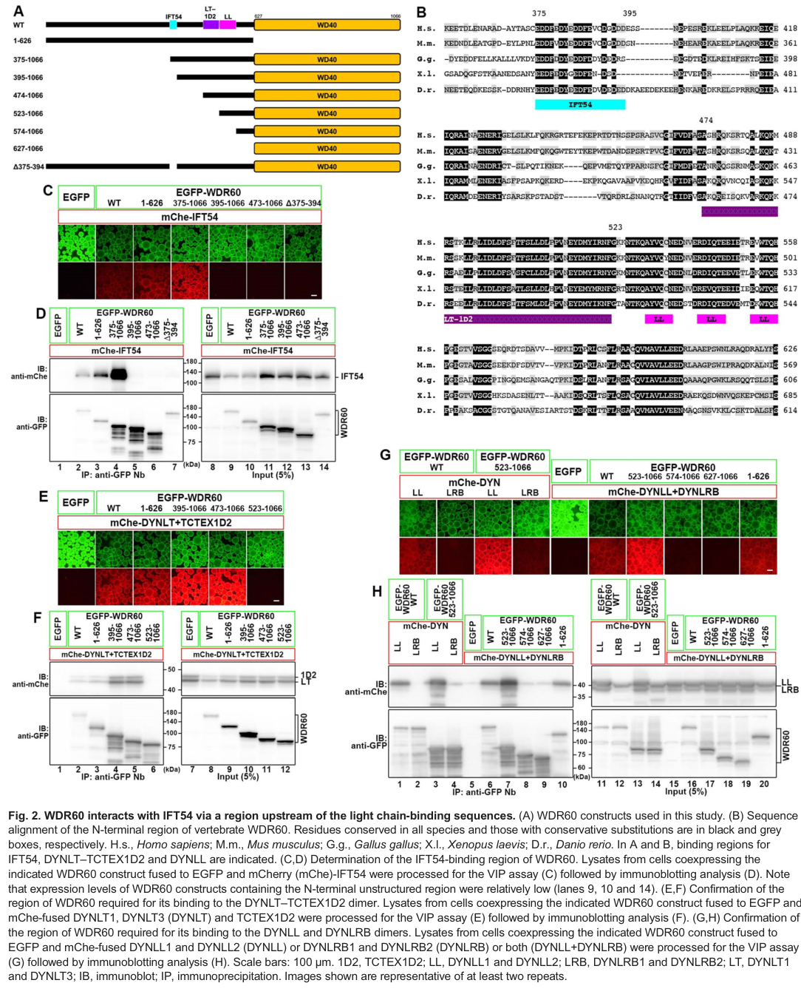

## Question

# Gene Research for Functional Annotation

## ⚠️ CRITICAL: Gene/Protein Identification Context

**BEFORE YOU BEGIN RESEARCH:** You MUST verify you are researching the CORRECT gene/protein. Gene symbols can be ambiguous, especially for less well-characterized genes from non-model organisms.

### Target Gene/Protein Identity (from UniProt):
- **UniProt Accession:** Q8WVS4
- **Protein Description:** RecName: Full=Cytoplasmic dynein 2 intermediate chain 1; AltName: Full=Dynein 2 intermediate chain 1; AltName: Full=WD repeat-containing protein 60;
- **Gene Information:** Name=DYNC2I1 {ECO:0000312|HGNC:HGNC:21862}; Synonyms=WDR60;
- **Organism (full):** Homo sapiens (Human).
- **Protein Family:** Belongs to the dynein light intermediate chain family.
- **Key Domains:** DYNC2I1. (IPR042505); WD40/YVTN_repeat-like_dom_sf. (IPR015943); WD40_repeat_dom_sf. (IPR036322); WD40_rpt. (IPR001680)

### MANDATORY VERIFICATION STEPS:

1. **Check if the gene symbol "DYNC2I1" matches the protein description above**
2. **Verify the organism is correct:** Homo sapiens (Human).
3. **Check if protein family/domains align with what you find in literature**
4. **If you find literature for a DIFFERENT gene with the same or similar symbol, STOP**

### If Gene Symbol is Ambiguous or You Cannot Find Relevant Literature:

**DO NOT PROCEED WITH RESEARCH ON A DIFFERENT GENE.** Instead:
- State clearly: "The gene symbol 'DYNC2I1' is ambiguous or literature is limited for this specific protein"
- Explain what you found (e.g., "Found extensive literature on a different gene with the same symbol in a different organism")
- Describe the protein based ONLY on the UniProt information provided above
- Suggest that the protein function can be inferred from domain/family information

### Research Target:

Please provide a comprehensive research report on the gene **DYNC2I1** (gene ID: DYNC2I1, UniProt: Q8WVS4) in human.

The research report should be a detailed narrative explaining the function, biological processes, and localization of the gene product. Citations should be given for all claims.

You should prioritize authoritative reviews and primary scientific literature when conducting research. You can supplement
this with annotations you find in gene/protein databases, but these can be outdated or inaccurate.

We are specifically interested in the primary function of the gene - for enzymes, what reaction is catalyzed, and what is the substrate specificity? For transporters, what is the substrate? For structural proteins or adapters, what is the broader structural role? For signaling molecules, what is the role in the pathway.

We are interested in where in or outside the cell the gene product carries out its function.

We are also interested in the signaling or biochemical pathways in which the gene functions. We are less interested in broad pleiotropic effects, except where these elucidate the precise role.

Include evidence where possible. We are interested in both experimental evidence as well as inference from structure, evolution, or bioinformatic analysis. Precise studies should be prioritized over high-throughput, where available.

## Output

Question: You are an expert researcher providing comprehensive, well-cited information.

Provide detailed information focusing on:
1. Key concepts and definitions with current understanding
2. Recent developments and latest research (prioritize 2023-2024 sources)
3. Current applications and real-world implementations
4. Expert opinions and analysis from authoritative sources
5. Relevant statistics and data from recent studies

Format as a comprehensive research report with proper citations. Include URLs and publication dates where available.
Always prioritize recent, authoritative sources and provide specific citations for all major claims.

# Gene Research for Functional Annotation

## ⚠️ CRITICAL: Gene/Protein Identification Context

**BEFORE YOU BEGIN RESEARCH:** You MUST verify you are researching the CORRECT gene/protein. Gene symbols can be ambiguous, especially for less well-characterized genes from non-model organisms.

### Target Gene/Protein Identity (from UniProt):
- **UniProt Accession:** Q8WVS4
- **Protein Description:** RecName: Full=Cytoplasmic dynein 2 intermediate chain 1; AltName: Full=Dynein 2 intermediate chain 1; AltName: Full=WD repeat-containing protein 60;
- **Gene Information:** Name=DYNC2I1 {ECO:0000312|HGNC:HGNC:21862}; Synonyms=WDR60;
- **Organism (full):** Homo sapiens (Human).
- **Protein Family:** Belongs to the dynein light intermediate chain family.
- **Key Domains:** DYNC2I1. (IPR042505); WD40/YVTN_repeat-like_dom_sf. (IPR015943); WD40_repeat_dom_sf. (IPR036322); WD40_rpt. (IPR001680)

### MANDATORY VERIFICATION STEPS:

1. **Check if the gene symbol "DYNC2I1" matches the protein description above**
2. **Verify the organism is correct:** Homo sapiens (Human).
3. **Check if protein family/domains align with what you find in literature**
4. **If you find literature for a DIFFERENT gene with the same or similar symbol, STOP**

### If Gene Symbol is Ambiguous or You Cannot Find Relevant Literature:

**DO NOT PROCEED WITH RESEARCH ON A DIFFERENT GENE.** Instead:
- State clearly: "The gene symbol 'DYNC2I1' is ambiguous or literature is limited for this specific protein"
- Explain what you found (e.g., "Found extensive literature on a different gene with the same symbol in a different organism")
- Describe the protein based ONLY on the UniProt information provided above
- Suggest that the protein function can be inferred from domain/family information

### Research Target:

Please provide a comprehensive research report on the gene **DYNC2I1** (gene ID: DYNC2I1, UniProt: Q8WVS4) in human.

The research report should be a detailed narrative explaining the function, biological processes, and localization of the gene product. Citations should be given for all claims.

You should prioritize authoritative reviews and primary scientific literature when conducting research. You can supplement
this with annotations you find in gene/protein databases, but these can be outdated or inaccurate.

We are specifically interested in the primary function of the gene - for enzymes, what reaction is catalyzed, and what is the substrate specificity? For transporters, what is the substrate? For structural proteins or adapters, what is the broader structural role? For signaling molecules, what is the role in the pathway.

We are interested in where in or outside the cell the gene product carries out its function.

We are also interested in the signaling or biochemical pathways in which the gene functions. We are less interested in broad pleiotropic effects, except where these elucidate the precise role.

Include evidence where possible. We are interested in both experimental evidence as well as inference from structure, evolution, or bioinformatic analysis. Precise studies should be prioritized over high-throughput, where available.

# Human DYNC2I1/WDR60: functional-annotation research report

## Identity and principal function

**Gene identification was checked before interpreting the literature.** Human **DYNC2I1 is WDR60**, the *intermediate chain* of cytoplasmic dynein-2. It is distinct from **DYNC2I2/WDR34**, the second intermediate chain, and **DYNC2LI1**, a *light* intermediate chain. Primary structural and interaction studies explicitly distinguish all three. The accession **Q8WVS4** is the UniProt identifier supplied in the question; the retrieved publications corroborate the gene–protein identity and WD40 architecture but did not independently state that accession. (mukhopadhyay2024structureandtethering pages 3-4, hiyamizu2023multipleinteractionsof pages 3-4)

**The primary function of WDR60 is to assemble and position the dynein-2 motor and help tether it to intraflagellar-transport (IFT) trains.** Dynein-2 powers transport from the ciliary tip toward the base along axonemal microtubules. WDR60 is a **non-catalytic adapter/structural subunit**, not an ATP-hydrolyzing enzyme or a transporter with its own molecular substrate: the two **DYNC2H1 heavy chains** provide ATPase-driven force, whereas WDR60 helps connect and target the motor. During the IFT cycle, dynein-2 is delivered toward the tip on kinesin-driven anterograde trains and subsequently supports retrograde return of IFT machinery and associated cargo. This is a ciliary role, not the general cytoplasmic cargo-transport role of dynein-1. (mukhopadhyay2024structureandtethering pages 1-3, rao2024structureandfunction pages 15-16)

## Molecular mechanism and recent developments

A **2024 cryo-electron microscopy structure at 3.9 Å** resolved WDR60’s C-terminal **seven-bladed WD40-like β-propeller** against a DYNC2H1 heavy-chain tail. WDR60 and WDR34 occupy corresponding sites on the two heavy chains but use different interfaces. WDR60’s blade-3 insert contacts heavy-chain bundle 4 and favors a relatively straight bundle-3/4 arrangement; WDR34 instead makes a distinctive β-propeller-pore interaction associated with a bent arrangement. These observations directly establish a structural role for WDR60 and explain why the two intermediate chains are not interchangeable despite partnering with identical heavy chains. Mukhopadhyay *et al.*, *The EMBO Journal*, March 2024, https://doi.org/10.1038/s44318-024-00060-1. (mukhopadhyay2024structureandtethering pages 3-4)

WDR60’s extended, relatively flexible **N terminus** contributes a second function: connecting dynein-2 to IFT trains assembling at the ciliary base. In 2024 cell-based tests, removal of the first **470 residues** prevented effective rescue of WDR60-null ciliary defects, whereas transferring those residues onto WDR34 restored the tested **IFT88-distribution** phenotype. Thus, the extension has transferable tethering activity, although that experiment does not make the two complete proteins functionally equivalent. Mukhopadhyay *et al.*, March 2024, https://doi.org/10.1038/s44318-024-00060-1. (mukhopadhyay2024structureandtethering pages 7-9, mukhopadhyay2024structureandtethering pages 1-3)

**Binding specificity was refined in 2023.** Hiyamizu *et al.* found that WDR60 interacts with the IFT-B protein **IFT54/TRAF3IP1** through a region including WDR60 residues **375–394**, upstream of its light-chain-binding region; IFT57 and the DYNC2H1–DYNC2LI1 pair provide additional dynein-2–IFT-B connections. Broad N-terminal WDR60 truncations impaired ciliary trafficking in knockout-and-rescue assays. Importantly, deleting **only residues 375–394** substantially preserved function: the IFT54 contact is contributory, **not a uniquely indispensable single attachment site**. The mapped constructs and rescue assays are shown in the retrieved Figure 2 and Figure 4 regions. Hiyamizu *et al.*, *Journal of Cell Science*, February 2023, https://doi.org/10.1242/jcs.260462. (hiyamizu2023multipleinteractionsof pages 6-8, hiyamizu2023multipleinteractionsof pages 3-4, hiyamizu2023multipleinteractionsof pages 12-13, hiyamizu2023multipleinteractionsof media 63423d12, hiyamizu2023multipleinteractionsof media 5cd4f89f)

The experimental progression and its principal limitations are summarized below. (mukhopadhyay2024structureandtethering pages 7-9, hiyamizu2023multipleinteractionsof pages 12-13, mcinerneyleo2013shortribpolydactylyand pages 1-2, weijman2024rolesforcep170 pages 7-11)

| Publication/date + URL | Experiment | Precise inference and limitation |
|---|---|---|
| Mukhopadhyay et al., *EMBO Journal*, March 2024. [DOI](https://doi.org/10.1038/s44318-024-00060-1) | A 3.9 Å cryo-EM structure of human dynein-2 showed the C-terminal seven-bladed WD40-like β-propeller of WDR60/DYNC2I1 binding one DYNC2H1 heavy-chain tail. WDR60 uses a blade-3 insert to contact DYNC2H1 bundle 4 and stabilize a straighter bundle-3/4 conformation. CRISPR/rescue experiments showed that deleting the WDR60 N-terminal 470 residues impaired rescue, whereas grafting residues 1–470 onto WDR34 restored IFT88 distribution. (mukhopadhyay2024structureandtethering pages 7-9, mukhopadhyay2024structureandtethering pages 3-4, mukhopadhyay2024structureandtethering pages 1-3) | Establishes WDR60 as a non-catalytic structural subunit and a modular, flexible tether connecting dynein-2 to IFT trains. The graft supports tethering sufficiency in the tested cellular assay, not complete functional equivalence between WDR60 and WDR34. The force-generating ATPase remains DYNC2H1. |
| Hiyamizu et al., *Journal of Cell Science*, February 2023. [DOI](https://doi.org/10.1242/jcs.260462) | Interaction mapping identified WDR60 residues 375–394 as part of the IFT54-binding interface, upstream of the light-chain-binding regions. In WDR60-knockout RPE1 cells, broad N-terminal truncations—especially WDR60(395–1066)—caused defective IFT/TZ passage and failed or incomplete rescue; however, the specific Δ375–394 mutant produced nearly normal phenotypes. Figure 2 maps the interface and Figure 4 tests cilium length and IFT88 rescue. (hiyamizu2023multipleinteractionsof pages 6-8, hiyamizu2023multipleinteractionsof pages 12-13, hiyamizu2023multipleinteractionsof pages 8-11, hiyamizu2023multipleinteractionsof media 63423d12, hiyamizu2023multipleinteractionsof media 5cd4f89f) | WDR60–IFT54 binding contributes to dynein-2 loading on IFT-B, but it is not the sole attachment. The mild phenotype of Δ375–394 demonstrates redundancy through other WDR60 regions and contacts involving WDR34, DYNC2LI1 and DYNC2H1; it would be incorrect to claim that deleting this site alone abolishes WDR60 function. |
| Vuolo et al., *eLife*, October 2018. [DOI](https://doi.org/10.7554/eLife.39655) | CRISPR knockout in human hTERT-RPE1 cells showed that WDR60-null cells still formed an axoneme and primary cilium, but cilia were shorter, frequently had bulbous tips, and accumulated IFT88, IFT54, IFT57 and other IFT proteins at the tip or along the axoneme. Co-immunoprecipitation/proteomics showed weakened association among dynein-2 subunits and with IFT/BBSome proteins. (vuolo2018dynein2intermediatechains pages 12-13, vuolo2018dynein2intermediatechains pages 15-16, vuolo2018dynein2intermediatechains pages 3-5, vuolo2018dynein2intermediatechains pages 5-6) | Supports a role in dynein-2 holoenzyme assembly, IFT engagement and retrograde cargo clearance rather than an absolute requirement for initial axoneme extension. Knockout phenotypes can include secondary transition-zone and membrane-protein defects, so not every observed ciliary change is necessarily a direct WDR60 interaction. |
| McInerney-Leo et al., *American Journal of Human Genetics*, September 2013. [DOI](https://doi.org/10.1016/j.ajhg.2013.06.022) | Exome sequencing and segregation identified biallelic WDR60 variants in an Australian family with short-rib polydactyly syndrome type III and a Spanish family with Jeune syndrome. Three mutation-positive individuals were examined in fibroblast ciliogenesis experiments; affected cells showed reduced ciliation after serum starvation and abnormal accumulation of IFT proteins at centrosomes/basal bodies. (mcinerneyleo2013shortribpolydactylyand pages 6-7, mcinerneyleo2013shortribpolydactylyand pages 1-2, mcinerneyleo2013shortribpolydactylyand pages 5-6) | Establishes recessive WDR60 dysfunction as a cause of a variable skeletal-ciliopathy spectrum. Shared p.Thr749Met plus truncating alleles and variable severity support hypomorphic/allele-dependent effects, but the small number of families does not yield a population prevalence or robust genotype–phenotype rule. |
| Weijman et al., *Journal of Cell Science*, November 2024. [DOI record](https://doi.org/10.1101/2023.11.20.567836) | Across WDR60- and WDR34-based proteomic datasets, CEP170 associated with dynein-2. CEP170 knockout reduced DYNC2H1 localization at the basal body/cilium and reduced recovery of dynein-2 components with HA-WDR60, while causing IFT88 and Hedgehog-related SMO-localization defects. (weijman2024rolesforcep170 pages 7-11, weijman2024rolesforcep170 pages 11-13, weijman2024rolesforcep170 pages 1-3) | Supports CEP170 as a factor that promotes dynein-2 assembly, stability or localization. Co-immunoprecipitation does **not** prove a direct binary CEP170–WDR60 interaction, and association with both WDR60 and WDR34 means the phenotype cannot be assigned specifically to WDR60 alone. |

*Table: Key human structural, biochemical, cellular and genetic evidence defining WDR60/DYNC2I1 as a non-catalytic dynein-2 assembly and IFT-tethering subunit. Limitations distinguish direct findings from broader mechanistic inference.*

## Location and biological processes

**Site of action:** WDR60 acts in the dynein-2 complex at the **base of the primary cilium**, where IFT trains are assembled and loaded, and in association with transport machinery along the **ciliary axoneme**. Human-cell imaging detected WDR60 with WDR34 at the ciliary base and axoneme; patient-derived human chondrocytes showed WDR60 at the ciliary base. The transition zone is the selective boundary the transport machinery crosses, rather than evidence that WDR60 is itself a permanently resident transition-zone scaffold. (vuolo2018dynein2intermediatechains pages 9-10, mcinerneyleo2013shortribpolydactylyand pages 1-2, mcinerneyleo2013shortribpolydactylyand pages 5-6, rao2024structureandfunction pages 15-16)

**Transport and ciliary maintenance:** In human hTERT-RPE1 cells, WDR60 knockout weakened dynein-2 subunit assembly and association with IFT components. Unlike WDR34 knockout, it generally **permitted axoneme extension**, but the resulting cilia were shorter and could develop bulbous tips containing accumulated material. IFT-B proteins **IFT88, IFT54 and IFT57**, together with IFT-A proteins **IFT140 and IFT43**, accumulated abnormally along cilia or at their tips. These observations support impaired IFT turnover and retrograde clearance; the studies also report effects on efficient bidirectional IFT, so a static accumulation pattern alone should not be treated as a direct measurement of retrograde motor speed. Vuolo *et al.*, *eLife*, October 2018, https://doi.org/10.7554/eLife.39655. (vuolo2018dynein2intermediatechains pages 12-13, vuolo2018dynein2intermediatechains pages 3-5, vuolo2018dynein2intermediatechains pages 15-16, vuolo2018dynein2intermediatechains pages 5-6)

The newer genetics qualifies an overly absolute interpretation of either single-chain knockout: **2024 experiments found that cells could assemble cilia without either WDR60 or WDR34 individually, but loss of both prevented effective cilium assembly and abolished detectable retrograde IFT in that model**. WDR60 loss more strongly disturbed ciliary cargo distribution, consistent with its distinctive IFT-targeting extension. These findings demonstrate partial shared capacity alongside unequal, nonredundant functions. Mukhopadhyay *et al.*, March 2024, https://doi.org/10.1038/s44318-024-00060-1. (mukhopadhyay2024structureandtethering pages 1-3, mukhopadhyay2024structureandtethering pages 7-9)

## Signaling consequences: important, but downstream

WDR60 enables the ciliary trafficking environment required for **Hedgehog signaling**; it is **not itself a Hedgehog receptor or a signal-transducing enzyme**. In human WDR60-null RPE1 cells, the Hedgehog-related receptors **SMO** and **GPR161** were abnormally elevated in cilia under basal conditions and after stimulation with the Smoothened agonist SAG. Reintroducing wild-type WDR60 restored their measured ciliary levels. An earlier experiment also observed inappropriate SMO entry into unstimulated WDR60-null cilia. Hiyamizu *et al.*, February 2023, https://doi.org/10.1242/jcs.260462; Vuolo *et al.*, October 2018, https://doi.org/10.7554/eLife.39655. (hiyamizu2023multipleinteractionsof pages 8-11, vuolo2018dynein2intermediatechains pages 6-7)

WDR60 loss additionally altered the spatial distribution of transition-zone proteins, including **RPGRIP1L** and **TMEM67**, and reduced measured ciliary abundance of **SSTR3, 5HT6 and ARL13B**; not every tested membrane-associated protein changed. These are useful readouts of disrupted ciliary compartmentalization, but do not establish that WDR60 binds each receptor directly. Vuolo *et al.*, October 2018, https://doi.org/10.7554/eLife.39655. (vuolo2018dynein2intermediatechains pages 5-6, vuolo2018dynein2intermediatechains pages 17-19, vuolo2018dynein2intermediatechains pages 6-7)

## Human disease relevance and applications

**Human genetics provides independent functional evidence.** McInerney-Leo *et al.* identified biallelic **WDR60** variants segregating in a family with severe **short-rib polydactyly syndrome** and another with **Jeune/asphyxiating thoracic dystrophy**, illustrating a clinically variable skeletal-ciliopathy spectrum. Patient fibroblasts showed reduced ciliogenesis after serum starvation; the three mutation-positive individuals discussed in the cell experiments are **not** a population-prevalence estimate. The shared **p.Thr749Met** allele occurred with different additional variants, and the small sample cannot support a general genotype–phenotype rule. McInerney-Leo *et al.*, *American Journal of Human Genetics*, September 2013, https://doi.org/10.1016/j.ajhg.2013.06.022. (mcinerneyleo2013shortribpolydactylyand pages 6-7, mcinerneyleo2013shortribpolydactylyand pages 1-2, mcinerneyleo2013shortribpolydactylyand pages 5-6)

The established real-world application is **interpretation of suspected recessive skeletal-ciliopathy variants**, supported by segregation, ciliation and IFT-localization assays, and rescue experiments rather than by a presumed WDR60 enzymatic activity. For example, a patient-associated truncation **Q631\*** removes the WD-repeat region and disrupts several dynein-2/IFT associations in experimental assays. These functional tests help assess mechanism but do not, alone, determine the clinical significance of every variant. Vuolo *et al.*, October 2018, https://doi.org/10.7554/eLife.39655. (vuolo2018dynein2intermediatechains pages 8-9, mcinerneyleo2013shortribpolydactylyand pages 1-2)

A further **2024** study associated the basal-body protein **CEP170** with dynein-2 complexes recovered using WDR60 or WDR34. CEP170 deletion reduced recovery of dynein-2 components with WDR60 and altered heavy-chain localization and ciliary IFT readouts. This extends the emerging assembly model, but **co-immunoprecipitation does not prove direct CEP170–WDR60 binding**, nor are the resulting phenotypes specific to WDR60 alone. Weijman *et al.*, *Journal of Cell Science*, 2024; available DOI record https://doi.org/10.1101/2023.11.20.567836. (weijman2024rolesforcep170 pages 7-11, weijman2024rolesforcep170 pages 11-13, weijman2024rolesforcep170 pages 1-3)

**Overall annotation:** human DYNC2I1/WDR60 is best classified as a **WD40-containing, non-catalytic dynein-2 intermediate-chain adapter** that stabilizes the motor’s heavy-chain organization and promotes its productive attachment to IFT machinery at primary cilia. Defective attachment or assembly compromises ciliary transport and secondarily alters ciliary gating, receptor distribution and developmental signaling. The exact way intermediate-chain contacts control activation of dynein-2 for the return journey remains unresolved, as emphasized by a 2024 review of dynein non-catalytic subunits. Rao and Gennerich, *Cells*, February 2024, https://doi.org/10.3390/cells13040330. (mukhopadhyay2024structureandtethering pages 3-4, mukhopadhyay2024structureandtethering pages 7-9, rao2024structureandfunction pages 15-16)

References

1. (mukhopadhyay2024structureandtethering pages 3-4): Aakash G Mukhopadhyay, Katerina Toropova, Lydia Daly, Jennifer N Wells, Laura Vuolo, Miroslav Mladenov, Marian Seda, Dagan Jenkins, David J Stephens, and Anthony J Roberts. Structure and tethering mechanism of dynein-2 intermediate chains in intraflagellar transport. The EMBO Journal, 43:1257-1272, Mar 2024. URL: https://doi.org/10.1038/s44318-024-00060-1, doi:10.1038/s44318-024-00060-1. This article has 18 citations.

2. (hiyamizu2023multipleinteractionsof pages 3-4): Shunya Hiyamizu, Hantian Qiu, Laura Vuolo, Nicola L. Stevenson, Caroline Shak, Kate J. Heesom, Yuki Hamada, Yuta Tsurumi, Shuhei Chiba, Yohei Katoh, David J. Stephens, and Kazuhisa Nakayama. Multiple interactions of the dynein-2 complex with the ift-b complex are required for effective intraflagellar transport. Journal of Cell Science, Feb 2023. URL: https://doi.org/10.1242/jcs.260462, doi:10.1242/jcs.260462. This article has 21 citations and is from a domain leading peer-reviewed journal.

3. (mukhopadhyay2024structureandtethering pages 1-3): Aakash G Mukhopadhyay, Katerina Toropova, Lydia Daly, Jennifer N Wells, Laura Vuolo, Miroslav Mladenov, Marian Seda, Dagan Jenkins, David J Stephens, and Anthony J Roberts. Structure and tethering mechanism of dynein-2 intermediate chains in intraflagellar transport. The EMBO Journal, 43:1257-1272, Mar 2024. URL: https://doi.org/10.1038/s44318-024-00060-1, doi:10.1038/s44318-024-00060-1. This article has 18 citations.

4. (rao2024structureandfunction pages 15-16): Lu Rao and Arne Gennerich. Structure and function of dynein’s non-catalytic subunits. Cells, 13:330, Feb 2024. URL: https://doi.org/10.3390/cells13040330, doi:10.3390/cells13040330. This article has 15 citations.

5. (mukhopadhyay2024structureandtethering pages 7-9): Aakash G Mukhopadhyay, Katerina Toropova, Lydia Daly, Jennifer N Wells, Laura Vuolo, Miroslav Mladenov, Marian Seda, Dagan Jenkins, David J Stephens, and Anthony J Roberts. Structure and tethering mechanism of dynein-2 intermediate chains in intraflagellar transport. The EMBO Journal, 43:1257-1272, Mar 2024. URL: https://doi.org/10.1038/s44318-024-00060-1, doi:10.1038/s44318-024-00060-1. This article has 18 citations.

6. (hiyamizu2023multipleinteractionsof pages 6-8): Shunya Hiyamizu, Hantian Qiu, Laura Vuolo, Nicola L. Stevenson, Caroline Shak, Kate J. Heesom, Yuki Hamada, Yuta Tsurumi, Shuhei Chiba, Yohei Katoh, David J. Stephens, and Kazuhisa Nakayama. Multiple interactions of the dynein-2 complex with the ift-b complex are required for effective intraflagellar transport. Journal of Cell Science, Feb 2023. URL: https://doi.org/10.1242/jcs.260462, doi:10.1242/jcs.260462. This article has 21 citations and is from a domain leading peer-reviewed journal.

7. (hiyamizu2023multipleinteractionsof pages 12-13): Shunya Hiyamizu, Hantian Qiu, Laura Vuolo, Nicola L. Stevenson, Caroline Shak, Kate J. Heesom, Yuki Hamada, Yuta Tsurumi, Shuhei Chiba, Yohei Katoh, David J. Stephens, and Kazuhisa Nakayama. Multiple interactions of the dynein-2 complex with the ift-b complex are required for effective intraflagellar transport. Journal of Cell Science, Feb 2023. URL: https://doi.org/10.1242/jcs.260462, doi:10.1242/jcs.260462. This article has 21 citations and is from a domain leading peer-reviewed journal.

8. (hiyamizu2023multipleinteractionsof media 63423d12): Shunya Hiyamizu, Hantian Qiu, Laura Vuolo, Nicola L. Stevenson, Caroline Shak, Kate J. Heesom, Yuki Hamada, Yuta Tsurumi, Shuhei Chiba, Yohei Katoh, David J. Stephens, and Kazuhisa Nakayama. Multiple interactions of the dynein-2 complex with the ift-b complex are required for effective intraflagellar transport. Journal of Cell Science, Feb 2023. URL: https://doi.org/10.1242/jcs.260462, doi:10.1242/jcs.260462. This article has 21 citations and is from a domain leading peer-reviewed journal.

9. (hiyamizu2023multipleinteractionsof media 5cd4f89f): Shunya Hiyamizu, Hantian Qiu, Laura Vuolo, Nicola L. Stevenson, Caroline Shak, Kate J. Heesom, Yuki Hamada, Yuta Tsurumi, Shuhei Chiba, Yohei Katoh, David J. Stephens, and Kazuhisa Nakayama. Multiple interactions of the dynein-2 complex with the ift-b complex are required for effective intraflagellar transport. Journal of Cell Science, Feb 2023. URL: https://doi.org/10.1242/jcs.260462, doi:10.1242/jcs.260462. This article has 21 citations and is from a domain leading peer-reviewed journal.

10. (mcinerneyleo2013shortribpolydactylyand pages 1-2): Aideen M. McInerney-Leo, Miriam Schmidts, Claudio R. Cortés, Paul J. Leo, Blanca Gener, Andrew D. Courtney, Brooke Gardiner, Jessica A. Harris, Yeping Lu, Mhairi Marshall, Peter J. Scambler, Philip L. Beales, Matthew A. Brown, Andreas Zankl, Hannah M. Mitchison, Emma L. Duncan, and Carol Wicking. Short-rib polydactyly and jeune syndromes are caused by mutations in wdr60. American journal of human genetics, 93 3:515-23, Sep 2013. URL: https://doi.org/10.1016/j.ajhg.2013.06.022, doi:10.1016/j.ajhg.2013.06.022. This article has 152 citations and is from a highest quality peer-reviewed journal.

11. (weijman2024rolesforcep170 pages 7-11): Johannes F Weijman, Laura Vuolo, Caroline Shak, Anna Pugnetti, Aakash G Mukhopadhyay, Lorna R Hodgson, Kate J Heesom, Anthony J Roberts, and David J Stephens. Roles for cep170 in cilia function and dynein-2 assembly. Journal of Cell Science, Nov 2024. URL: https://doi.org/10.1101/2023.11.20.567836, doi:10.1101/2023.11.20.567836. This article has 18 citations and is from a domain leading peer-reviewed journal.

12. (hiyamizu2023multipleinteractionsof pages 8-11): Shunya Hiyamizu, Hantian Qiu, Laura Vuolo, Nicola L. Stevenson, Caroline Shak, Kate J. Heesom, Yuki Hamada, Yuta Tsurumi, Shuhei Chiba, Yohei Katoh, David J. Stephens, and Kazuhisa Nakayama. Multiple interactions of the dynein-2 complex with the ift-b complex are required for effective intraflagellar transport. Journal of Cell Science, Feb 2023. URL: https://doi.org/10.1242/jcs.260462, doi:10.1242/jcs.260462. This article has 21 citations and is from a domain leading peer-reviewed journal.

13. (vuolo2018dynein2intermediatechains pages 12-13): Laura Vuolo, Nicola L Stevenson, Kate J Heesom, and David J Stephens. Dynein-2 intermediate chains play crucial but distinct roles in primary cilia formation and function. Oct 2018. URL: https://doi.org/10.7554/elife.39655, doi:10.7554/elife.39655. This article has 63 citations and is from a domain leading peer-reviewed journal.

14. (vuolo2018dynein2intermediatechains pages 15-16): Laura Vuolo, Nicola L Stevenson, Kate J Heesom, and David J Stephens. Dynein-2 intermediate chains play crucial but distinct roles in primary cilia formation and function. Oct 2018. URL: https://doi.org/10.7554/elife.39655, doi:10.7554/elife.39655. This article has 63 citations and is from a domain leading peer-reviewed journal.

15. (vuolo2018dynein2intermediatechains pages 3-5): Laura Vuolo, Nicola L Stevenson, Kate J Heesom, and David J Stephens. Dynein-2 intermediate chains play crucial but distinct roles in primary cilia formation and function. Oct 2018. URL: https://doi.org/10.7554/elife.39655, doi:10.7554/elife.39655. This article has 63 citations and is from a domain leading peer-reviewed journal.

16. (vuolo2018dynein2intermediatechains pages 5-6): Laura Vuolo, Nicola L Stevenson, Kate J Heesom, and David J Stephens. Dynein-2 intermediate chains play crucial but distinct roles in primary cilia formation and function. Oct 2018. URL: https://doi.org/10.7554/elife.39655, doi:10.7554/elife.39655. This article has 63 citations and is from a domain leading peer-reviewed journal.

17. (mcinerneyleo2013shortribpolydactylyand pages 6-7): Aideen M. McInerney-Leo, Miriam Schmidts, Claudio R. Cortés, Paul J. Leo, Blanca Gener, Andrew D. Courtney, Brooke Gardiner, Jessica A. Harris, Yeping Lu, Mhairi Marshall, Peter J. Scambler, Philip L. Beales, Matthew A. Brown, Andreas Zankl, Hannah M. Mitchison, Emma L. Duncan, and Carol Wicking. Short-rib polydactyly and jeune syndromes are caused by mutations in wdr60. American journal of human genetics, 93 3:515-23, Sep 2013. URL: https://doi.org/10.1016/j.ajhg.2013.06.022, doi:10.1016/j.ajhg.2013.06.022. This article has 152 citations and is from a highest quality peer-reviewed journal.

18. (mcinerneyleo2013shortribpolydactylyand pages 5-6): Aideen M. McInerney-Leo, Miriam Schmidts, Claudio R. Cortés, Paul J. Leo, Blanca Gener, Andrew D. Courtney, Brooke Gardiner, Jessica A. Harris, Yeping Lu, Mhairi Marshall, Peter J. Scambler, Philip L. Beales, Matthew A. Brown, Andreas Zankl, Hannah M. Mitchison, Emma L. Duncan, and Carol Wicking. Short-rib polydactyly and jeune syndromes are caused by mutations in wdr60. American journal of human genetics, 93 3:515-23, Sep 2013. URL: https://doi.org/10.1016/j.ajhg.2013.06.022, doi:10.1016/j.ajhg.2013.06.022. This article has 152 citations and is from a highest quality peer-reviewed journal.

19. (weijman2024rolesforcep170 pages 11-13): Johannes F Weijman, Laura Vuolo, Caroline Shak, Anna Pugnetti, Aakash G Mukhopadhyay, Lorna R Hodgson, Kate J Heesom, Anthony J Roberts, and David J Stephens. Roles for cep170 in cilia function and dynein-2 assembly. Journal of Cell Science, Nov 2024. URL: https://doi.org/10.1101/2023.11.20.567836, doi:10.1101/2023.11.20.567836. This article has 18 citations and is from a domain leading peer-reviewed journal.

20. (weijman2024rolesforcep170 pages 1-3): Johannes F Weijman, Laura Vuolo, Caroline Shak, Anna Pugnetti, Aakash G Mukhopadhyay, Lorna R Hodgson, Kate J Heesom, Anthony J Roberts, and David J Stephens. Roles for cep170 in cilia function and dynein-2 assembly. Journal of Cell Science, Nov 2024. URL: https://doi.org/10.1101/2023.11.20.567836, doi:10.1101/2023.11.20.567836. This article has 18 citations and is from a domain leading peer-reviewed journal.

21. (vuolo2018dynein2intermediatechains pages 9-10): Laura Vuolo, Nicola L Stevenson, Kate J Heesom, and David J Stephens. Dynein-2 intermediate chains play crucial but distinct roles in primary cilia formation and function. Oct 2018. URL: https://doi.org/10.7554/elife.39655, doi:10.7554/elife.39655. This article has 63 citations and is from a domain leading peer-reviewed journal.

22. (vuolo2018dynein2intermediatechains pages 6-7): Laura Vuolo, Nicola L Stevenson, Kate J Heesom, and David J Stephens. Dynein-2 intermediate chains play crucial but distinct roles in primary cilia formation and function. Oct 2018. URL: https://doi.org/10.7554/elife.39655, doi:10.7554/elife.39655. This article has 63 citations and is from a domain leading peer-reviewed journal.

23. (vuolo2018dynein2intermediatechains pages 17-19): Laura Vuolo, Nicola L Stevenson, Kate J Heesom, and David J Stephens. Dynein-2 intermediate chains play crucial but distinct roles in primary cilia formation and function. Oct 2018. URL: https://doi.org/10.7554/elife.39655, doi:10.7554/elife.39655. This article has 63 citations and is from a domain leading peer-reviewed journal.

24. (vuolo2018dynein2intermediatechains pages 8-9): Laura Vuolo, Nicola L Stevenson, Kate J Heesom, and David J Stephens. Dynein-2 intermediate chains play crucial but distinct roles in primary cilia formation and function. Oct 2018. URL: https://doi.org/10.7554/elife.39655, doi:10.7554/elife.39655. This article has 63 citations and is from a domain leading peer-reviewed journal.

## Artifacts

- [Edison artifact artifact-00](DYNC2I1-deep-research-falcon_artifacts/artifact-00.md)

## Citations

1. mukhopadhyay2024structureandtethering pages 3-4
2. hiyamizu2023multipleinteractionsof pages 3-4
3. mukhopadhyay2024structureandtethering pages 1-3
4. rao2024structureandfunction pages 15-16
5. mukhopadhyay2024structureandtethering pages 7-9
6. hiyamizu2023multipleinteractionsof pages 6-8
7. hiyamizu2023multipleinteractionsof pages 12-13
8. mcinerneyleo2013shortribpolydactylyand pages 1-2
9. hiyamizu2023multipleinteractionsof pages 8-11
10. mcinerneyleo2013shortribpolydactylyand pages 6-7
11. mcinerneyleo2013shortribpolydactylyand pages 5-6
12. DOI
13. DOI record
14. https://doi.org/10.1038/s44318-024-00060-1.
15. https://doi.org/10.1242/jcs.260462.
16. https://doi.org/10.1038/s44318-024-00060-1
17. https://doi.org/10.1242/jcs.260462
18. https://doi.org/10.7554/eLife.39655
19. https://doi.org/10.1016/j.ajhg.2013.06.022
20. https://doi.org/10.1101/2023.11.20.567836
21. https://doi.org/10.7554/eLife.39655.
22. https://doi.org/10.1242/jcs.260462;
23. https://doi.org/10.1016/j.ajhg.2013.06.022.
24. https://doi.org/10.1101/2023.11.20.567836.
25. https://doi.org/10.3390/cells13040330.
26. https://doi.org/10.1038/s44318-024-00060-1,
27. https://doi.org/10.1242/jcs.260462,
28. https://doi.org/10.3390/cells13040330,
29. https://doi.org/10.1016/j.ajhg.2013.06.022,
30. https://doi.org/10.1101/2023.11.20.567836,
31. https://doi.org/10.7554/elife.39655,