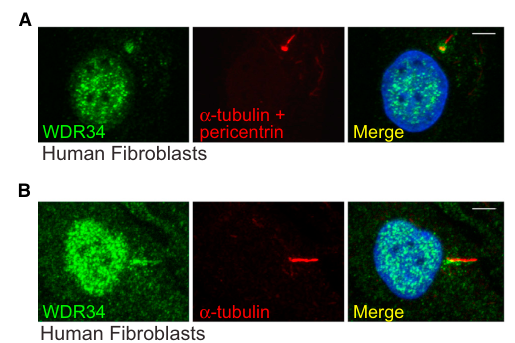

## Question

# Gene Research for Functional Annotation

## ⚠️ CRITICAL: Gene/Protein Identification Context

**BEFORE YOU BEGIN RESEARCH:** You MUST verify you are researching the CORRECT gene/protein. Gene symbols can be ambiguous, especially for less well-characterized genes from non-model organisms.

### Target Gene/Protein Identity (from UniProt):
- **UniProt Accession:** Q96EX3
- **Protein Description:** RecName: Full=Cytoplasmic dynein 2 intermediate chain 2; AltName: Full=Dynein 2 intermediate chain 2; AltName: Full=WD repeat-containing protein 34;
- **Gene Information:** Name=DYNC2I2 {ECO:0000312|HGNC:HGNC:28296}; Synonyms=WDR34;
- **Organism (full):** Homo sapiens (Human).
- **Protein Family:** Belongs to the dynein light intermediate chain family.
- **Key Domains:** Dynein_IC. (IPR050687); WD40/YVTN_repeat-like_dom_sf. (IPR015943); WD40_repeat_dom_sf. (IPR036322); WD40_rpt. (IPR001680); DNAI3_WD (PF28639)

### MANDATORY VERIFICATION STEPS:

1. **Check if the gene symbol "DYNC2I2" matches the protein description above**
2. **Verify the organism is correct:** Homo sapiens (Human).
3. **Check if protein family/domains align with what you find in literature**
4. **If you find literature for a DIFFERENT gene with the same or similar symbol, STOP**

### If Gene Symbol is Ambiguous or You Cannot Find Relevant Literature:

**DO NOT PROCEED WITH RESEARCH ON A DIFFERENT GENE.** Instead:
- State clearly: "The gene symbol 'DYNC2I2' is ambiguous or literature is limited for this specific protein"
- Explain what you found (e.g., "Found extensive literature on a different gene with the same symbol in a different organism")
- Describe the protein based ONLY on the UniProt information provided above
- Suggest that the protein function can be inferred from domain/family information

### Research Target:

Please provide a comprehensive research report on the gene **DYNC2I2** (gene ID: DYNC2I2, UniProt: Q96EX3) in human.

The research report should be a detailed narrative explaining the function, biological processes, and localization of the gene product. Citations should be given for all claims.

You should prioritize authoritative reviews and primary scientific literature when conducting research. You can supplement
this with annotations you find in gene/protein databases, but these can be outdated or inaccurate.

We are specifically interested in the primary function of the gene - for enzymes, what reaction is catalyzed, and what is the substrate specificity? For transporters, what is the substrate? For structural proteins or adapters, what is the broader structural role? For signaling molecules, what is the role in the pathway.

We are interested in where in or outside the cell the gene product carries out its function.

We are also interested in the signaling or biochemical pathways in which the gene functions. We are less interested in broad pleiotropic effects, except where these elucidate the precise role.

Include evidence where possible. We are interested in both experimental evidence as well as inference from structure, evolution, or bioinformatic analysis. Precise studies should be prioritized over high-throughput, where available.

## Output

Question: You are an expert researcher providing comprehensive, well-cited information.

Provide detailed information focusing on:
1. Key concepts and definitions with current understanding
2. Recent developments and latest research (prioritize 2023-2024 sources)
3. Current applications and real-world implementations
4. Expert opinions and analysis from authoritative sources
5. Relevant statistics and data from recent studies

Format as a comprehensive research report with proper citations. Include URLs and publication dates where available.
Always prioritize recent, authoritative sources and provide specific citations for all major claims.

# Gene Research for Functional Annotation

## ⚠️ CRITICAL: Gene/Protein Identification Context

**BEFORE YOU BEGIN RESEARCH:** You MUST verify you are researching the CORRECT gene/protein. Gene symbols can be ambiguous, especially for less well-characterized genes from non-model organisms.

### Target Gene/Protein Identity (from UniProt):
- **UniProt Accession:** Q96EX3
- **Protein Description:** RecName: Full=Cytoplasmic dynein 2 intermediate chain 2; AltName: Full=Dynein 2 intermediate chain 2; AltName: Full=WD repeat-containing protein 34;
- **Gene Information:** Name=DYNC2I2 {ECO:0000312|HGNC:HGNC:28296}; Synonyms=WDR34;
- **Organism (full):** Homo sapiens (Human).
- **Protein Family:** Belongs to the dynein light intermediate chain family.
- **Key Domains:** Dynein_IC. (IPR050687); WD40/YVTN_repeat-like_dom_sf. (IPR015943); WD40_repeat_dom_sf. (IPR036322); WD40_rpt. (IPR001680); DNAI3_WD (PF28639)

### MANDATORY VERIFICATION STEPS:

1. **Check if the gene symbol "DYNC2I2" matches the protein description above**
2. **Verify the organism is correct:** Homo sapiens (Human).
3. **Check if protein family/domains align with what you find in literature**
4. **If you find literature for a DIFFERENT gene with the same or similar symbol, STOP**

### If Gene Symbol is Ambiguous or You Cannot Find Relevant Literature:

**DO NOT PROCEED WITH RESEARCH ON A DIFFERENT GENE.** Instead:
- State clearly: "The gene symbol 'DYNC2I2' is ambiguous or literature is limited for this specific protein"
- Explain what you found (e.g., "Found extensive literature on a different gene with the same symbol in a different organism")
- Describe the protein based ONLY on the UniProt information provided above
- Suggest that the protein function can be inferred from domain/family information

### Research Target:

Please provide a comprehensive research report on the gene **DYNC2I2** (gene ID: DYNC2I2, UniProt: Q96EX3) in human.

The research report should be a detailed narrative explaining the function, biological processes, and localization of the gene product. Citations should be given for all claims.

You should prioritize authoritative reviews and primary scientific literature when conducting research. You can supplement
this with annotations you find in gene/protein databases, but these can be outdated or inaccurate.

We are specifically interested in the primary function of the gene - for enzymes, what reaction is catalyzed, and what is the substrate specificity? For transporters, what is the substrate? For structural proteins or adapters, what is the broader structural role? For signaling molecules, what is the role in the pathway.

We are interested in where in or outside the cell the gene product carries out its function.

We are also interested in the signaling or biochemical pathways in which the gene functions. We are less interested in broad pleiotropic effects, except where these elucidate the precise role.

Include evidence where possible. We are interested in both experimental evidence as well as inference from structure, evolution, or bioinformatic analysis. Precise studies should be prioritized over high-throughput, where available.

# Human DYNC2I2/WDR34: functional annotation research report

## Identity and principal function

**Identity verified.** The specified human UniProt entry, [Q96EX3](https://www.uniprot.org/uniprotkb/Q96EX3/entry), corresponds to **DYNC2I2**, also called **WDR34**, the cytoplasmic dynein-2 intermediate chain 2. The primary literature explicitly distinguishes it from **WDR60/DYNC2I1**, the *other* dynein-2 intermediate chain. WDR34’s N-terminal light-chain-binding region and C-terminal WD40 β-propeller agree with the domain architecture supplied for Q96EX3. This report concerns human WDR34, not WDR60 or an axonemal dynein intermediate chain. (shak2023diseaseassociatedmutationsin pages 1-4, mukhopadhyay2024structureandtethering pages 3-4)

**Primary annotation:** WDR34 is a **non-catalytic structural and interaction subunit** of the dynein-2 motor. It helps assemble and organize the motor, anchors one DYNC2H1 heavy chain, recruits light chains, and supports transport of intraflagellar-transport (IFT) machinery within cilia. **WDR34 does not itself catalyze an ATP-dependent reaction or transport a specific small-molecule substrate**; the DYNC2H1 heavy chains provide motor activity, moving IFT assemblies toward the microtubule minus ends at the ciliary base. Its relevant transported material includes IFT complexes and associated ciliary cargo rather than a WDR34-specific substrate. (mukhopadhyay2024structureandtethering pages 3-4, tsurumi2019interactionsofthe pages 1-2, mukhopadhyay2024structureandtethering pages 1-3)

## Molecular mechanism and biological process

Dynein-2 contains two DYNC2H1 heavy chains partnered asymmetrically with WDR34 and WDR60, plus DYNC2LI1 and dynein light chains. During the IFT cycle, kinesin-2 carries trains containing inactive dynein-2 from the ciliary base toward the tip; dynein-2 subsequently powers **retrograde IFT from tip to base**. This recycling sustains cilium assembly and composition and contributes to trafficking across the transition zone, the selective barrier at the ciliary base. It is distinct from dynein-1’s general cytoplasmic transport role. (shak2023diseaseassociatedmutationsin pages 1-4, mukhopadhyay2024structureandtethering pages 1-3, hiyamizu2023multipleinteractionsof pages 12-13)

**Motor assembly is WDR34’s most precisely established biochemical role.** A **3.9 Å cryo-electron-microscopy structure**, reported by Mukhopadhyay and colleagues in **March 2024**, resolves the C-terminal, seven-bladed β-propellers of WDR34 and WDR60 at equivalent positions on different DYNC2H1 chains. The chains engage their heavy-chain partners differently: DYNC2H1 **K477** enters the WDR34 propeller pore, and WDR34 **E355** contacts heavy-chain **R587**. These observations establish a physical scaffold role, while cautioning against treating the two intermediate chains as interchangeable. [Mukhopadhyay *et al.*, *EMBO Journal* **43**, 1257–1272 (2024)](https://doi.org/10.1038/s44318-024-00060-1). (mukhopadhyay2024structureandtethering pages 3-4, mukhopadhyay2024structureandtethering pages 1-3)

WDR34 also recruits light chains through experimentally mapped, distinct N-terminal regions: approximately **residues 80–93** for DYNLL1/2 and **116–131** for DYNLRB1/2. Deleting either region prevented WDR34 from correcting abnormal ciliary IFT88 and GPR161 distribution in WDR34-knockout cells. An isolated N-terminal fragment retaining these sites but lacking the WD40 region interfered with ciliogenesis and trafficking, consistent with dominant-negative sequestration; the precise sequestration mechanism remains an interpretation. [Tsurumi *et al.*, *Molecular Biology of the Cell* **30**, 658–670 (March 2019)](https://doi.org/10.1091/mbc.E18-10-0678). (tsurumi2019interactionsofthe pages 7-9, tsurumi2019interactionsofthe pages 1-2)

The dynein-2 complex makes **multiple associations with anterograde IFT-B trains**. A **February 2023** interaction study associated WDR34’s C-terminal WD40 region with IFT57, alongside other dynein-2–IFT-B associations. This is evidence from tagged-protein interaction assays, **not proof of a purified, direct WDR34–IFT57 binary interface**. In contrast, WDR60’s extended N terminus has a particularly prominent role in tethering dynein-2 to IFT-B; transplanting **WDR60 residues 1–470** onto WDR34 restored ciliary defects in the 2024 study. Thus, WDR34 contributes to motor architecture and effective IFT loading, but the strongest experimentally supported long N-terminal train-tethering function belongs to **WDR60**, not WDR34. [Hiyamizu *et al.*, *Journal of Cell Science* **136** (February 2023)](https://doi.org/10.1242/jcs.260462); [Mukhopadhyay *et al.* (2024)](https://doi.org/10.1038/s44318-024-00060-1). (hiyamizu2023multipleinteractionsof pages 4-6, mukhopadhyay2024structureandtethering pages 7-9, mukhopadhyay2024structureandtethering pages 5-7)

## Where WDR34 acts

WDR34 acts predominantly **inside the cell, at the centrosome/basal body and within the primary cilium**, rather than as an extracellular or secreted protein. Immunofluorescence detected endogenous WDR34 around basal bodies in ciliated human fibroblasts, occasionally along the axoneme; tagged human WDR34 was also detected along axonemes in ciliated IMCD3 cells. The localization experiments further detected centriolar staining and some nuclear-envelope-associated staining, but the latter observation does not establish a separate primary nuclear-envelope function. The ciliary base is the relevant loading site; within the axoneme, WDR34 functions as part of moving dynein-2 assemblies. See the experimentally examined **Figure 3** localization and DYNLL1-interaction panels in [Schmidts *et al.*, *American Journal of Human Genetics* **93**, 932–944 (7 November 2013)](https://doi.org/10.1016/j.ajhg.2013.10.003). (schmidts2013mutationsinthe pages 7-8, schmidts2013mutationsinthe media 7eb94636, schmidts2013mutationsinthe media a59d1f60)

## Functional evidence and 2023–2024 developments

The strongest recent functional measurements come from live imaging in **2024**. In IMCD3 cells, loss of WDR34 reduced both retrograde IFT88 **velocity (*p* < 0.001)** and **frequency (*p* < 0.005)**, while leaving anterograde velocity unchanged. WDR60 loss caused stronger retrograde defects; either *single* knockout nevertheless retained cilia of approximately normal mean length. In contrast, combined WDR34/WDR60 loss produced short cilia averaging **1.5 ± 0.1 µm**, comparable to DYNC2H1 knockout. These data show that WDR34 is important for efficient retrograde transport but that its requirement for axoneme extension is **context-dependent**, rather than invariably absolute. [Mukhopadhyay *et al.* (2024)](https://doi.org/10.1038/s44318-024-00060-1). (mukhopadhyay2024structureandtethering pages 5-7, mukhopadhyay2024structureandtethering pages 4-5)

Earlier human RPE1 knockout experiments reported a more pronounced WDR34-specific block at **axoneme extension after ciliary-vesicle docking**, with reduced DYNC2H1/DYNC2LI1 at the ciliary base and accumulation of IFT machinery. Some WDR34-deficient cells still formed rudimentary cilia, and subsequent studies reported different cilium lengths in different knockout models. The responsible difference has not been definitively resolved; **cell background and the nature of the engineered allele or residual fragment** are plausible considerations. These observations should not be flattened into either “WDR34 is always indispensable for making any cilium” or “WDR34 affects only mature cilia.” [Vuolo *et al.*, *eLife* **7**, e39655 (October 2018)](https://doi.org/10.7554/eLife.39655); [Shak *et al.*, *Journal of Cell Science* **136** (2023)](https://doi.org/10.1242/jcs.260535). (vuolo2018dynein2intermediatechains pages 13-15, shak2023diseaseassociatedmutationsin pages 4-6, mukhopadhyay2024structureandtethering pages 7-9)

A **2023 disease-allele rescue study** demonstrated that patient-associated WDR34 variants do **not** all disrupt the same step. Proteomics detected allele-dependent loss of dynein-2 subunit interactions; **G393S and S410I** broadly weakened assembly and failed to normalize cilium length, while other variants had more selective IFT88 or Smoothened-localization defects. For example, **T354M** restored cilium length and basal Smoothened exclusion yet retained abnormal IFT88 distribution and a reduced stimulated Smoothened response. Consequently, normal cilium length alone cannot establish intact WDR34-dependent transport. [Shak *et al.*, *Journal of Cell Science* **136** (August 2023)](https://doi.org/10.1242/jcs.260535). (shak2023diseaseassociatedmutationsin pages 13-15, shak2023diseaseassociatedmutationsin pages 10-13, shak2023diseaseassociatedmutationsin pages 6-9)

### Evidence at a glance

The following matrix separates direct measurements from structural models and other mechanistic interpretations.

| Experiment/source (publication date; DOI) | Direct observation and quantitative data | Functional implication / limitation |
|---|---|---|
| Mukhopadhyay *et al.*, **March 2024**, cryo-EM of recombinant mammalian dynein-2; [10.1038/s44318-024-00060-1](https://doi.org/10.1038/s44318-024-00060-1) | The **3.9 Å** structure resolved C-terminal seven-bladed β-propellers of WDR34/DYNC2I2 and WDR60/DYNC2I1 at equivalent sites on the two DYNC2H1 chains. WDR34 accommodates DYNC2H1 **K477** in its propeller pore and is associated with a bent heavy-chain conformation; WDR60 instead uses a blade-3 insertion to stabilize a straighter conformation. WDR34 **E355** and WDR60 **D881** contact DYNC2H1 R587. (mukhopadhyay2024structureandtethering pages 3-4, mukhopadhyay2024structureandtethering pages 1-3) | Directly establishes WDR34 as a non-catalytic, structurally asymmetric dynein-2 intermediate chain. It anchors one heavy chain and helps organize the motor scaffold. The structure does not establish every proposed dynein–IFT-train contact. |
| Mukhopadhyay *et al.*, **March 2024**, IMCD3 CRISPR knockouts and live IFT88 imaging; [10.1038/s44318-024-00060-1](https://doi.org/10.1038/s44318-024-00060-1) | WDR34 knockout significantly reduced retrograde IFT88 velocity (**p < 0.001**) and frequency (**p < 0.005**); WDR60 loss had stronger effects (**p < 0.0001** for both). Anterograde velocity was unchanged in both single knockouts. Single knockouts retained normal mean cilium length, but the double knockout produced short cilia averaging **1.5 ± 0.1 µm**, comparable to DYNC2H1 knockout, with progressive IFT88 accumulation. (mukhopadhyay2024structureandtethering pages 5-7, mukhopadhyay2024structureandtethering pages 4-5) | WDR34 supports retrograde IFT while overlapping partly with WDR60 in ciliogenesis. WDR60 contributes more strongly to dynein-2 targeting and cargo distribution; cell context may explain variation among earlier knockout phenotypes. |
| Hiyamizu *et al.*, **February 2023**, dynein-2–IFT-B interaction screen; [10.1242/jcs.260462](https://doi.org/10.1242/jcs.260462) | VIP assays with co-expressed tagged proteins mapped an **IFT57 association to the C-terminal WD40 region of WDR34**. Multiple associations between dynein-2 and IFT-B subunits were also detected. (hiyamizu2023multipleinteractionsof pages 4-6) | Supports WDR34 participation in multivalent loading of inactive dynein-2 onto anterograde IFT-B trains. Because this was a lysate-based association assay rather than purified binary binding or a resolved interface, it does **not** prove a direct WDR34–IFT57 contact. |
| Tsurumi *et al.*, **March 2019**, domain deletion and knockout rescue; [10.1091/mbc.E18-10-0678](https://doi.org/10.1091/mbc.E18-10-0678) | WDR34 residues **80–93** were associated with DYNLL1/2 binding and residues **116–131** with DYNLRB1/2 binding. Full-length WDR34 rescued abnormal ciliary IFT88 accumulation, whereas deletion of either region failed to normalize IFT88 or GPR161 trafficking. The isolated N-terminal fragment, residues **1–146**, caused dominant-negative short or vestigial cilia and IFT88/GPR161 accumulation. (tsurumi2019interactionsofthe pages 7-9, tsurumi2019interactionsofthe pages 1-2) | WDR34 is a scaffold that recruits dynein light chains through distinct N-terminal motifs; both interactions are required for effective retrograde ciliary trafficking. Dominant-negative fragment effects may reflect sequestration of light chains or WDR60. |
| Schmidts *et al.*, **7 November 2013**, human genetics, localization and interaction assays; [10.1016/j.ajhg.2013.10.003](https://doi.org/10.1016/j.ajhg.2013.10.003) | Sequencing identified **11 WDR34 variants in nine unrelated Jeune asphyxiating thoracic dystrophy families**. Endogenous WDR34 concentrated around basal bodies and centrioles in human fibroblasts and was occasionally detected along the axoneme; tagged WDR34 also localized to the IMCD3 axoneme. Co-immunoprecipitation supported interaction with DYNLL1. (schmidts2013mutationsinthe pages 7-8, schmidts2013mutationsinthe media 7eb94636, schmidts2013mutationsinthe pages 1-2) | Provides foundational genetic and cellular evidence that human WDR34 is a ciliary dynein-2 component whose disruption causes recessive skeletal ciliopathy. Tagged-protein localization and in-vitro co-immunoprecipitation require cautious interpretation, although endogenous basal-body localization was observed. |
| Huber *et al.*, **7 November 2013**, patient-fibroblast phenotyping; [10.1016/j.ajhg.2013.10.007](https://doi.org/10.1016/j.ajhg.2013.10.007) | Fibroblasts carrying disease-associated **p.Thr354Met** or **p.Arg447Trp** WDR34 variants had short, bulbous primary cilia. Mean cilium lengths were approximately **2.63 µm** and **1.28 µm**, respectively, versus **3.74 µm** in controls. (huber2013wdr34mutationsthat pages 1-2, huber2013wdr34mutationsthat pages 3-5) | Connects WDR34 variants to defective axoneme elongation and/or retrograde IFT in patient cells. Proposed NF-κB regulation through TAK1, TAB2 and TRAF6 is secondary or hypothesis-generating evidence and does not supersede dynein-2/IFT as the established primary function. |
| Shak *et al.*, **August 2023**, disease-allele rescue, proteomics and ciliary assays; [10.1242/jcs.260535](https://doi.org/10.1242/jcs.260535) | Stable expression of clinical variants in WDR34-knockout cells produced allele-specific effects. **G393S** and **S410I** broadly weakened association with dynein-2 subunits, failed to restore normal cilium length and showed weak SAG-induced Smoothened responses; **C148F** also impaired assembly or stability and SAG response. **T354M** restored cilium length and basal Smoothened exclusion despite persistent IFT88-distribution and stimulated-Smoothened defects. Most WD-domain mutants reduced DYNLRB1 association by **more than half**. (shak2023diseaseassociatedmutationsin pages 13-15, shak2023diseaseassociatedmutationsin pages 10-13, shak2023diseaseassociatedmutationsin pages 6-9) | Pathogenicity cannot be reduced to one readout: variants may impair holoenzyme assembly, IFT88 distribution, transition-zone function or Smoothened trafficking to different degrees. The results caution against inferring complete loss of dynein-2 assembly solely from a Hedgehog or cargo-localization defect. |

*Table: Compact evidence matrix distinguishing direct structural, genetic and cell-biological observations from mechanistic interpretations and assay limitations. It emphasizes quantitative findings relevant to annotating human WDR34/DYNC2I2 as a dynein-2 intermediate-chain scaffold.*

## Signaling pathways and disease relevance

WDR34 acts **upstream of cilium-dependent Hedgehog signaling**, principally by maintaining the dynein-2/IFT system that positions signaling proteins correctly. In WDR34-deficient cells, altered distribution of IFT88 and of the Hedgehog transducer **Smoothened (SMO)**, including abnormal basal ciliary SMO accumulation in some models, connects the transport defect to pathway behavior. GPR161 trafficking is likewise sensitive to disruption of WDR34 light-chain recruitment. These are consequences of altered ciliary transport and composition; WDR34 is **not established as a Hedgehog receptor, enzyme or direct signal transducer**. Effects of individual variants on SMO vary, so neither a uniform signaling phenotype nor a simple genotype–phenotype rule is justified. (shak2023diseaseassociatedmutationsin pages 10-13, tsurumi2019interactionsofthe pages 7-9)

The human disease association has unusually direct evidence. An original sequencing study identified **11 WDR34 mutations in nine unrelated families** with **Jeune asphyxiating thoracic dystrophy**, a short-rib skeletal ciliopathy. A separate study linked recessive WDR34 variants to severe short-rib polydactyly/asphyxiating thoracic dysplasia and found short, bulbous cilia in patient fibroblasts: mean lengths were approximately **2.63 µm** and **1.28 µm** for two affected lines versus **3.74 µm** in controls. These human findings connect molecular disruption of ciliary transport to skeletal-development disease, without showing that every variant has the same mechanism or severity. [Schmidts *et al.* (2013)](https://doi.org/10.1016/j.ajhg.2013.10.003); [Huber *et al.*, *American Journal of Human Genetics* **93**, 926–931 (November 2013)](https://doi.org/10.1016/j.ajhg.2013.10.007). (schmidts2013mutationsinthe pages 1-2, huber2013wdr34mutationsthat pages 1-2, huber2013wdr34mutationsthat pages 3-5)

Mouse findings support developmental importance but should not be substituted for human biochemical evidence: **2023** Wdr34-disrupted homozygous embryos died at approximately **E10.5–E11.5** and exhibited neural-tube defects, compared with **E13.5–E14.5** for the Wdr60-disrupted model. Reported changes in planar-cell-polarity components and earlier proposals of NF-κB regulation may identify additional consequences or interactions; **neither establishes PCP or NF-κB signaling as WDR34’s primary molecular function**. [Yan *et al.*, *Frontiers in Cell and Developmental Biology* **11** (May 2023)](https://doi.org/10.3389/fcell.2023.1084245); [Huber *et al.* (2013)](https://doi.org/10.1016/j.ajhg.2013.10.007). (yan2023deficiencyofwdr60 pages 1-2, huber2013wdr34mutationsthat pages 1-2)

## Present-day use and annotation assessment

In practice, **DYNC2I2/WDR34 is a disease-gene candidate for molecular diagnosis of skeletal ciliopathies**, including Jeune syndrome and severe short-rib polydactyly phenotypes. Patient-variant interpretation can be strengthened by testing dynein-2 subunit assembly, ciliary IFT88 distribution, cilium morphology, and basal versus agonist-stimulated SMO trafficking, rather than relying on a single assay. The cited 2023 work implements this approach with stable expression of clinical alleles in WDR34-knockout cells; it is a **research functional-assessment strategy**, not an established WDR34-targeted therapy. (schmidts2013mutationsinthe pages 1-2, shak2023diseaseassociatedmutationsin pages 13-15, shak2023diseaseassociatedmutationsin pages 6-9)

**Bottom line:** the best-supported functional annotation for human Q96EX3 is **a WD40-containing dynein-2 intermediate-chain scaffold operating at the ciliary base and within cilia to assemble and position the retrograde IFT motor**. Defective WDR34 impairs IFT and ciliary cargo distribution, with downstream developmental Hedgehog-signaling and skeletal-ciliopathy consequences. The precise severity of ciliogenesis defects and the contribution of any non-ciliary signaling role remain dependent on model and allele. (mukhopadhyay2024structureandtethering pages 3-4, mukhopadhyay2024structureandtethering pages 5-7, shak2023diseaseassociatedmutationsin pages 6-9, schmidts2013mutationsinthe pages 7-8)

References

1. (shak2023diseaseassociatedmutationsin pages 1-4): Caroline Shak, Laura Vuolo, Borhan Uddin, Yohei Katoh, Tom Brown, Aakash G. Mukhopadhyay, Kate Heesom, Anthony J. Roberts, Nicola Stevenson, Kazuhisa Nakayama, and David J. Stephens. Disease-associated mutations in wdr34 lead to diverse impacts on the assembly and function of dynein-2. Journal of Cell Science, Aug 2023. URL: https://doi.org/10.1101/2022.03.31.486414, doi:10.1101/2022.03.31.486414. This article has 9 citations and is from a domain leading peer-reviewed journal.

2. (mukhopadhyay2024structureandtethering pages 3-4): Aakash G Mukhopadhyay, Katerina Toropova, Lydia Daly, Jennifer N Wells, Laura Vuolo, Miroslav Mladenov, Marian Seda, Dagan Jenkins, David J Stephens, and Anthony J Roberts. Structure and tethering mechanism of dynein-2 intermediate chains in intraflagellar transport. The EMBO Journal, 43:1257-1272, Mar 2024. URL: https://doi.org/10.1038/s44318-024-00060-1, doi:10.1038/s44318-024-00060-1. This article has 18 citations.

3. (tsurumi2019interactionsofthe pages 1-2): Yuta Tsurumi, Yuki Hamada, Yohei Katoh, and Kazuhisa Nakayama. Interactions of the dynein-2 intermediate chain wdr34 with the light chains are required for ciliary retrograde protein trafficking. Molecular Biology of the Cell, 30:658-670, Mar 2019. URL: https://doi.org/10.1091/mbc.e18-10-0678, doi:10.1091/mbc.e18-10-0678. This article has 48 citations and is from a domain leading peer-reviewed journal.

4. (mukhopadhyay2024structureandtethering pages 1-3): Aakash G Mukhopadhyay, Katerina Toropova, Lydia Daly, Jennifer N Wells, Laura Vuolo, Miroslav Mladenov, Marian Seda, Dagan Jenkins, David J Stephens, and Anthony J Roberts. Structure and tethering mechanism of dynein-2 intermediate chains in intraflagellar transport. The EMBO Journal, 43:1257-1272, Mar 2024. URL: https://doi.org/10.1038/s44318-024-00060-1, doi:10.1038/s44318-024-00060-1. This article has 18 citations.

5. (hiyamizu2023multipleinteractionsof pages 12-13): Shunya Hiyamizu, Hantian Qiu, Laura Vuolo, Nicola L. Stevenson, Caroline Shak, Kate J. Heesom, Yuki Hamada, Yuta Tsurumi, Shuhei Chiba, Yohei Katoh, David J. Stephens, and Kazuhisa Nakayama. Multiple interactions of the dynein-2 complex with the ift-b complex are required for effective intraflagellar transport. Journal of Cell Science, Feb 2023. URL: https://doi.org/10.1242/jcs.260462, doi:10.1242/jcs.260462. This article has 21 citations and is from a domain leading peer-reviewed journal.

6. (tsurumi2019interactionsofthe pages 7-9): Yuta Tsurumi, Yuki Hamada, Yohei Katoh, and Kazuhisa Nakayama. Interactions of the dynein-2 intermediate chain wdr34 with the light chains are required for ciliary retrograde protein trafficking. Molecular Biology of the Cell, 30:658-670, Mar 2019. URL: https://doi.org/10.1091/mbc.e18-10-0678, doi:10.1091/mbc.e18-10-0678. This article has 48 citations and is from a domain leading peer-reviewed journal.

7. (hiyamizu2023multipleinteractionsof pages 4-6): Shunya Hiyamizu, Hantian Qiu, Laura Vuolo, Nicola L. Stevenson, Caroline Shak, Kate J. Heesom, Yuki Hamada, Yuta Tsurumi, Shuhei Chiba, Yohei Katoh, David J. Stephens, and Kazuhisa Nakayama. Multiple interactions of the dynein-2 complex with the ift-b complex are required for effective intraflagellar transport. Journal of Cell Science, Feb 2023. URL: https://doi.org/10.1242/jcs.260462, doi:10.1242/jcs.260462. This article has 21 citations and is from a domain leading peer-reviewed journal.

8. (mukhopadhyay2024structureandtethering pages 7-9): Aakash G Mukhopadhyay, Katerina Toropova, Lydia Daly, Jennifer N Wells, Laura Vuolo, Miroslav Mladenov, Marian Seda, Dagan Jenkins, David J Stephens, and Anthony J Roberts. Structure and tethering mechanism of dynein-2 intermediate chains in intraflagellar transport. The EMBO Journal, 43:1257-1272, Mar 2024. URL: https://doi.org/10.1038/s44318-024-00060-1, doi:10.1038/s44318-024-00060-1. This article has 18 citations.

9. (mukhopadhyay2024structureandtethering pages 5-7): Aakash G Mukhopadhyay, Katerina Toropova, Lydia Daly, Jennifer N Wells, Laura Vuolo, Miroslav Mladenov, Marian Seda, Dagan Jenkins, David J Stephens, and Anthony J Roberts. Structure and tethering mechanism of dynein-2 intermediate chains in intraflagellar transport. The EMBO Journal, 43:1257-1272, Mar 2024. URL: https://doi.org/10.1038/s44318-024-00060-1, doi:10.1038/s44318-024-00060-1. This article has 18 citations.

10. (schmidts2013mutationsinthe pages 7-8): Miriam Schmidts, Julia Vodopiutz, Sonia Christou-Savina, Claudio R. Cortés, Aideen M. McInerney-Leo, Richard D. Emes, Heleen H. Arts, Beyhan Tüysüz, Jason D’Silva, Paul J. Leo, Tom C. Giles, Machteld M. Oud, Jessica A. Harris, Marije Koopmans, Mhairi Marshall, Nursel Elçioglu, Alma Kuechler, Detlef Bockenhauer, Anthony T. Moore, Louise C. Wilson, Andreas R. Janecke, Matthew E. Hurles, Warren Emmet, Brooke Gardiner, Berthold Streubel, Belinda Dopita, Andreas Zankl, Hülya Kayserili, Peter J. Scambler, Matthew A. Brown, Philip L. Beales, Carol Wicking, Emma L. Duncan, and Hannah M. Mitchison. Mutations in the gene encoding ift dynein complex component wdr34 cause jeune asphyxiating thoracic dystrophy. American journal of human genetics, 93 5:932-44, Nov 2013. URL: https://doi.org/10.1016/j.ajhg.2013.10.003, doi:10.1016/j.ajhg.2013.10.003. This article has 153 citations and is from a highest quality peer-reviewed journal.

11. (schmidts2013mutationsinthe media 7eb94636): Miriam Schmidts, Julia Vodopiutz, Sonia Christou-Savina, Claudio R. Cortés, Aideen M. McInerney-Leo, Richard D. Emes, Heleen H. Arts, Beyhan Tüysüz, Jason D’Silva, Paul J. Leo, Tom C. Giles, Machteld M. Oud, Jessica A. Harris, Marije Koopmans, Mhairi Marshall, Nursel Elçioglu, Alma Kuechler, Detlef Bockenhauer, Anthony T. Moore, Louise C. Wilson, Andreas R. Janecke, Matthew E. Hurles, Warren Emmet, Brooke Gardiner, Berthold Streubel, Belinda Dopita, Andreas Zankl, Hülya Kayserili, Peter J. Scambler, Matthew A. Brown, Philip L. Beales, Carol Wicking, Emma L. Duncan, and Hannah M. Mitchison. Mutations in the gene encoding ift dynein complex component wdr34 cause jeune asphyxiating thoracic dystrophy. American journal of human genetics, 93 5:932-44, Nov 2013. URL: https://doi.org/10.1016/j.ajhg.2013.10.003, doi:10.1016/j.ajhg.2013.10.003. This article has 153 citations and is from a highest quality peer-reviewed journal.

12. (schmidts2013mutationsinthe media a59d1f60): Miriam Schmidts, Julia Vodopiutz, Sonia Christou-Savina, Claudio R. Cortés, Aideen M. McInerney-Leo, Richard D. Emes, Heleen H. Arts, Beyhan Tüysüz, Jason D’Silva, Paul J. Leo, Tom C. Giles, Machteld M. Oud, Jessica A. Harris, Marije Koopmans, Mhairi Marshall, Nursel Elçioglu, Alma Kuechler, Detlef Bockenhauer, Anthony T. Moore, Louise C. Wilson, Andreas R. Janecke, Matthew E. Hurles, Warren Emmet, Brooke Gardiner, Berthold Streubel, Belinda Dopita, Andreas Zankl, Hülya Kayserili, Peter J. Scambler, Matthew A. Brown, Philip L. Beales, Carol Wicking, Emma L. Duncan, and Hannah M. Mitchison. Mutations in the gene encoding ift dynein complex component wdr34 cause jeune asphyxiating thoracic dystrophy. American journal of human genetics, 93 5:932-44, Nov 2013. URL: https://doi.org/10.1016/j.ajhg.2013.10.003, doi:10.1016/j.ajhg.2013.10.003. This article has 153 citations and is from a highest quality peer-reviewed journal.

13. (mukhopadhyay2024structureandtethering pages 4-5): Aakash G Mukhopadhyay, Katerina Toropova, Lydia Daly, Jennifer N Wells, Laura Vuolo, Miroslav Mladenov, Marian Seda, Dagan Jenkins, David J Stephens, and Anthony J Roberts. Structure and tethering mechanism of dynein-2 intermediate chains in intraflagellar transport. The EMBO Journal, 43:1257-1272, Mar 2024. URL: https://doi.org/10.1038/s44318-024-00060-1, doi:10.1038/s44318-024-00060-1. This article has 18 citations.

14. (vuolo2018dynein2intermediatechains pages 13-15): Laura Vuolo, Nicola L Stevenson, Kate J Heesom, and David J Stephens. Dynein-2 intermediate chains play crucial but distinct roles in primary cilia formation and function. Oct 2018. URL: https://doi.org/10.7554/elife.39655, doi:10.7554/elife.39655. This article has 63 citations and is from a domain leading peer-reviewed journal.

15. (shak2023diseaseassociatedmutationsin pages 4-6): Caroline Shak, Laura Vuolo, Borhan Uddin, Yohei Katoh, Tom Brown, Aakash G. Mukhopadhyay, Kate Heesom, Anthony J. Roberts, Nicola Stevenson, Kazuhisa Nakayama, and David J. Stephens. Disease-associated mutations in wdr34 lead to diverse impacts on the assembly and function of dynein-2. Journal of Cell Science, Aug 2023. URL: https://doi.org/10.1101/2022.03.31.486414, doi:10.1101/2022.03.31.486414. This article has 9 citations and is from a domain leading peer-reviewed journal.

16. (shak2023diseaseassociatedmutationsin pages 13-15): Caroline Shak, Laura Vuolo, Borhan Uddin, Yohei Katoh, Tom Brown, Aakash G. Mukhopadhyay, Kate Heesom, Anthony J. Roberts, Nicola Stevenson, Kazuhisa Nakayama, and David J. Stephens. Disease-associated mutations in wdr34 lead to diverse impacts on the assembly and function of dynein-2. Journal of Cell Science, Aug 2023. URL: https://doi.org/10.1101/2022.03.31.486414, doi:10.1101/2022.03.31.486414. This article has 9 citations and is from a domain leading peer-reviewed journal.

17. (shak2023diseaseassociatedmutationsin pages 10-13): Caroline Shak, Laura Vuolo, Borhan Uddin, Yohei Katoh, Tom Brown, Aakash G. Mukhopadhyay, Kate Heesom, Anthony J. Roberts, Nicola Stevenson, Kazuhisa Nakayama, and David J. Stephens. Disease-associated mutations in wdr34 lead to diverse impacts on the assembly and function of dynein-2. Journal of Cell Science, Aug 2023. URL: https://doi.org/10.1101/2022.03.31.486414, doi:10.1101/2022.03.31.486414. This article has 9 citations and is from a domain leading peer-reviewed journal.

18. (shak2023diseaseassociatedmutationsin pages 6-9): Caroline Shak, Laura Vuolo, Borhan Uddin, Yohei Katoh, Tom Brown, Aakash G. Mukhopadhyay, Kate Heesom, Anthony J. Roberts, Nicola Stevenson, Kazuhisa Nakayama, and David J. Stephens. Disease-associated mutations in wdr34 lead to diverse impacts on the assembly and function of dynein-2. Journal of Cell Science, Aug 2023. URL: https://doi.org/10.1101/2022.03.31.486414, doi:10.1101/2022.03.31.486414. This article has 9 citations and is from a domain leading peer-reviewed journal.

19. (schmidts2013mutationsinthe pages 1-2): Miriam Schmidts, Julia Vodopiutz, Sonia Christou-Savina, Claudio R. Cortés, Aideen M. McInerney-Leo, Richard D. Emes, Heleen H. Arts, Beyhan Tüysüz, Jason D’Silva, Paul J. Leo, Tom C. Giles, Machteld M. Oud, Jessica A. Harris, Marije Koopmans, Mhairi Marshall, Nursel Elçioglu, Alma Kuechler, Detlef Bockenhauer, Anthony T. Moore, Louise C. Wilson, Andreas R. Janecke, Matthew E. Hurles, Warren Emmet, Brooke Gardiner, Berthold Streubel, Belinda Dopita, Andreas Zankl, Hülya Kayserili, Peter J. Scambler, Matthew A. Brown, Philip L. Beales, Carol Wicking, Emma L. Duncan, and Hannah M. Mitchison. Mutations in the gene encoding ift dynein complex component wdr34 cause jeune asphyxiating thoracic dystrophy. American journal of human genetics, 93 5:932-44, Nov 2013. URL: https://doi.org/10.1016/j.ajhg.2013.10.003, doi:10.1016/j.ajhg.2013.10.003. This article has 153 citations and is from a highest quality peer-reviewed journal.

20. (huber2013wdr34mutationsthat pages 1-2): Céline Huber, Sulin Wu, Ashley S. Kim, Sabine Sigaudy, Anna Sarukhanov, Valérie Serre, Genevieve Baujat, Kim-Hanh Le Quan Sang, David L. Rimoin, Daniel H. Cohn, Arnold Munnich, Deborah Krakow, and Valérie Cormier-Daire. Wdr34 mutations that cause short-rib polydactyly syndrome type iii/severe asphyxiating thoracic dysplasia reveal a role for the nf-κb pathway in cilia. American journal of human genetics, 93 5:926-31, Nov 2013. URL: https://doi.org/10.1016/j.ajhg.2013.10.007, doi:10.1016/j.ajhg.2013.10.007. This article has 108 citations and is from a highest quality peer-reviewed journal.

21. (huber2013wdr34mutationsthat pages 3-5): Céline Huber, Sulin Wu, Ashley S. Kim, Sabine Sigaudy, Anna Sarukhanov, Valérie Serre, Genevieve Baujat, Kim-Hanh Le Quan Sang, David L. Rimoin, Daniel H. Cohn, Arnold Munnich, Deborah Krakow, and Valérie Cormier-Daire. Wdr34 mutations that cause short-rib polydactyly syndrome type iii/severe asphyxiating thoracic dysplasia reveal a role for the nf-κb pathway in cilia. American journal of human genetics, 93 5:926-31, Nov 2013. URL: https://doi.org/10.1016/j.ajhg.2013.10.007, doi:10.1016/j.ajhg.2013.10.007. This article has 108 citations and is from a highest quality peer-reviewed journal.

22. (yan2023deficiencyofwdr60 pages 1-2): Lu Yan, Hailing Yin, Yiwei Mi, Yu Wu, and Yufang Zheng. Deficiency of wdr60 and wdr34 cause distinct neural tube malformation phenotypes in early embryos. Frontiers in Cell and Developmental Biology, May 2023. URL: https://doi.org/10.3389/fcell.2023.1084245, doi:10.3389/fcell.2023.1084245. This article has 8 citations.

## Artifacts

- [Edison artifact artifact-00](DYNC2I2-deep-research-falcon_artifacts/artifact-00.md)

## Citations

1. hiyamizu2023multipleinteractionsof pages 4-6
2. shak2023diseaseassociatedmutationsin pages 1-4
3. mukhopadhyay2024structureandtethering pages 3-4
4. tsurumi2019interactionsofthe pages 1-2
5. mukhopadhyay2024structureandtethering pages 1-3
6. hiyamizu2023multipleinteractionsof pages 12-13
7. tsurumi2019interactionsofthe pages 7-9
8. mukhopadhyay2024structureandtethering pages 7-9
9. mukhopadhyay2024structureandtethering pages 5-7
10. schmidts2013mutationsinthe pages 7-8
11. mukhopadhyay2024structureandtethering pages 4-5
12. shak2023diseaseassociatedmutationsin pages 4-6
13. shak2023diseaseassociatedmutationsin pages 13-15
14. shak2023diseaseassociatedmutationsin pages 10-13
15. shak2023diseaseassociatedmutationsin pages 6-9
16. schmidts2013mutationsinthe pages 1-2
17. Q96EX3
18. Mukhopadhyay *et al.*, *EMBO Journal* **43**, 1257–1272 (2024)
19. Tsurumi *et al.*, *Molecular Biology of the Cell* **30**, 658–670 (March 2019)
20. Hiyamizu *et al.*, *Journal of Cell Science* **136** (February 2023)
21. Mukhopadhyay *et al.* (2024)
22. Schmidts *et al.*, *American Journal of Human Genetics* **93**, 932–944 (7 November 2013)
23. Vuolo *et al.*, *eLife* **7**, e39655 (October 2018)
24. Shak *et al.*, *Journal of Cell Science* **136** (2023)
25. Shak *et al.*, *Journal of Cell Science* **136** (August 2023)
26. 10.1038/s44318-024-00060-1
27. 10.1242/jcs.260462
28. 10.1091/mbc.E18-10-0678
29. 10.1016/j.ajhg.2013.10.003
30. 10.1016/j.ajhg.2013.10.007
31. 10.1242/jcs.260535
32. Schmidts *et al.* (2013)
33. Huber *et al.*, *American Journal of Human Genetics* **93**, 926–931 (November 2013)
34. Yan *et al.*, *Frontiers in Cell and Developmental Biology* **11** (May 2023)
35. Huber *et al.* (2013)
36. https://www.uniprot.org/uniprotkb/Q96EX3/entry
37. https://doi.org/10.1038/s44318-024-00060-1
38. https://doi.org/10.1091/mbc.E18-10-0678
39. https://doi.org/10.1242/jcs.260462
40. https://doi.org/10.1016/j.ajhg.2013.10.003
41. https://doi.org/10.7554/eLife.39655
42. https://doi.org/10.1242/jcs.260535
43. https://doi.org/10.1016/j.ajhg.2013.10.007
44. https://doi.org/10.3389/fcell.2023.1084245
45. https://doi.org/10.1101/2022.03.31.486414,
46. https://doi.org/10.1038/s44318-024-00060-1,
47. https://doi.org/10.1091/mbc.e18-10-0678,
48. https://doi.org/10.1242/jcs.260462,
49. https://doi.org/10.1016/j.ajhg.2013.10.003,
50. https://doi.org/10.7554/elife.39655,
51. https://doi.org/10.1016/j.ajhg.2013.10.007,
52. https://doi.org/10.3389/fcell.2023.1084245,