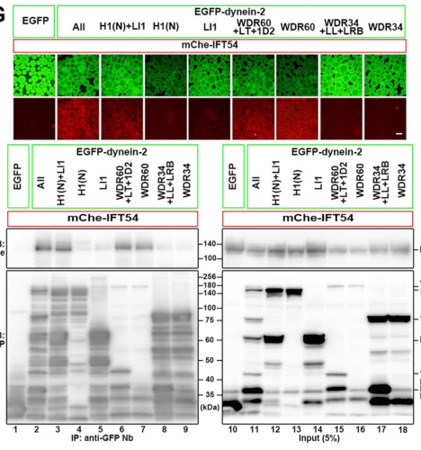

## Question

# Gene Research for Functional Annotation

## ⚠️ CRITICAL: Gene/Protein Identification Context

**BEFORE YOU BEGIN RESEARCH:** You MUST verify you are researching the CORRECT gene/protein. Gene symbols can be ambiguous, especially for less well-characterized genes from non-model organisms.

### Target Gene/Protein Identity (from UniProt):
- **UniProt Accession:** Q8TCX1
- **Protein Description:** RecName: Full=Cytoplasmic dynein 2 light intermediate chain 1; Short=Dynein 2 light intermediate chain {ECO:0000303|PubMed:11907264};
- **Gene Information:** Name=DYNC2LI1; Synonyms=D2LIC {ECO:0000303|PubMed:11907264}, LIC3 {ECO:0000303|PubMed:31451806}; ORFNames=CGI-60;
- **Organism (full):** Homo sapiens (Human).
- **Protein Family:** Belongs to the dynein light intermediate chain family.
- **Key Domains:** DYNC2LI1. (IPR040045); Dynein_light_int_chain. (IPR022780); P-loop_NTPase. (IPR027417); DLIC (PF05783)

### MANDATORY VERIFICATION STEPS:

1. **Check if the gene symbol "DYNC2LI1" matches the protein description above**
2. **Verify the organism is correct:** Homo sapiens (Human).
3. **Check if protein family/domains align with what you find in literature**
4. **If you find literature for a DIFFERENT gene with the same or similar symbol, STOP**

### If Gene Symbol is Ambiguous or You Cannot Find Relevant Literature:

**DO NOT PROCEED WITH RESEARCH ON A DIFFERENT GENE.** Instead:
- State clearly: "The gene symbol 'DYNC2LI1' is ambiguous or literature is limited for this specific protein"
- Explain what you found (e.g., "Found extensive literature on a different gene with the same symbol in a different organism")
- Describe the protein based ONLY on the UniProt information provided above
- Suggest that the protein function can be inferred from domain/family information

### Research Target:

Please provide a comprehensive research report on the gene **DYNC2LI1** (gene ID: DYNC2LI1, UniProt: Q8TCX1) in human.

The research report should be a detailed narrative explaining the function, biological processes, and localization of the gene product. Citations should be given for all claims.

You should prioritize authoritative reviews and primary scientific literature when conducting research. You can supplement
this with annotations you find in gene/protein databases, but these can be outdated or inaccurate.

We are specifically interested in the primary function of the gene - for enzymes, what reaction is catalyzed, and what is the substrate specificity? For transporters, what is the substrate? For structural proteins or adapters, what is the broader structural role? For signaling molecules, what is the role in the pathway.

We are interested in where in or outside the cell the gene product carries out its function.

We are also interested in the signaling or biochemical pathways in which the gene functions. We are less interested in broad pleiotropic effects, except where these elucidate the precise role.

Include evidence where possible. We are interested in both experimental evidence as well as inference from structure, evolution, or bioinformatic analysis. Precise studies should be prioritized over high-throughput, where available.

## Output

Question: You are an expert researcher providing comprehensive, well-cited information.

Provide detailed information focusing on:
1. Key concepts and definitions with current understanding
2. Recent developments and latest research (prioritize 2023-2024 sources)
3. Current applications and real-world implementations
4. Expert opinions and analysis from authoritative sources
5. Relevant statistics and data from recent studies

Format as a comprehensive research report with proper citations. Include URLs and publication dates where available.
Always prioritize recent, authoritative sources and provide specific citations for all major claims.

# Gene Research for Functional Annotation

## ⚠️ CRITICAL: Gene/Protein Identification Context

**BEFORE YOU BEGIN RESEARCH:** You MUST verify you are researching the CORRECT gene/protein. Gene symbols can be ambiguous, especially for less well-characterized genes from non-model organisms.

### Target Gene/Protein Identity (from UniProt):
- **UniProt Accession:** Q8TCX1
- **Protein Description:** RecName: Full=Cytoplasmic dynein 2 light intermediate chain 1; Short=Dynein 2 light intermediate chain {ECO:0000303|PubMed:11907264};
- **Gene Information:** Name=DYNC2LI1; Synonyms=D2LIC {ECO:0000303|PubMed:11907264}, LIC3 {ECO:0000303|PubMed:31451806}; ORFNames=CGI-60;
- **Organism (full):** Homo sapiens (Human).
- **Protein Family:** Belongs to the dynein light intermediate chain family.
- **Key Domains:** DYNC2LI1. (IPR040045); Dynein_light_int_chain. (IPR022780); P-loop_NTPase. (IPR027417); DLIC (PF05783)

### MANDATORY VERIFICATION STEPS:

1. **Check if the gene symbol "DYNC2LI1" matches the protein description above**
2. **Verify the organism is correct:** Homo sapiens (Human).
3. **Check if protein family/domains align with what you find in literature**
4. **If you find literature for a DIFFERENT gene with the same or similar symbol, STOP**

### If Gene Symbol is Ambiguous or You Cannot Find Relevant Literature:

**DO NOT PROCEED WITH RESEARCH ON A DIFFERENT GENE.** Instead:
- State clearly: "The gene symbol 'DYNC2LI1' is ambiguous or literature is limited for this specific protein"
- Explain what you found (e.g., "Found extensive literature on a different gene with the same symbol in a different organism")
- Describe the protein based ONLY on the UniProt information provided above
- Suggest that the protein function can be inferred from domain/family information

### Research Target:

Please provide a comprehensive research report on the gene **DYNC2LI1** (gene ID: DYNC2LI1, UniProt: Q8TCX1) in human.

The research report should be a detailed narrative explaining the function, biological processes, and localization of the gene product. Citations should be given for all claims.

You should prioritize authoritative reviews and primary scientific literature when conducting research. You can supplement
this with annotations you find in gene/protein databases, but these can be outdated or inaccurate.

We are specifically interested in the primary function of the gene - for enzymes, what reaction is catalyzed, and what is the substrate specificity? For transporters, what is the substrate? For structural proteins or adapters, what is the broader structural role? For signaling molecules, what is the role in the pathway.

We are interested in where in or outside the cell the gene product carries out its function.

We are also interested in the signaling or biochemical pathways in which the gene functions. We are less interested in broad pleiotropic effects, except where these elucidate the precise role.

Include evidence where possible. We are interested in both experimental evidence as well as inference from structure, evolution, or bioinformatic analysis. Precise studies should be prioritized over high-throughput, where available.

# Human DYNC2LI1: functional annotation and research report

## Identity and principal function

**DYNC2LI1** encodes the human cytoplasmic dynein-2 **light intermediate chain**, also called **LIC3** or **D2LIC**; the specified UniProt accession **Q8TCX1** matches this protein. It is not DYNC1LI1, a dynein-1 light intermediate chain, nor DYNC2H1, the force-generating dynein-2 heavy chain. Its conserved Ras-like/P-loop-related region and dynein light-intermediate-chain family assignment are consistent with the reported protein architecture and interactions. The evidence identifies DYNC2LI1 primarily as a **non-catalytic structural and interaction subunit** of the ciliary dynein-2 motor, rather than an enzyme with an established substrate or reaction of its own. (rao2024structureandfunction pages 2-4, qiu2022combinationsofdeletion pages 2-4)

Dynein-2 carries intraflagellar transport (IFT) machinery **from the ciliary tip toward the cell body** along axonemal microtubules. DYNC2LI1 associates with the nonmotor tail of DYNC2H1, helps maintain the assembled motor, and participates in its connection to IFT trains. Dynein-2 first travels toward the tip as cargo on kinesin-powered anterograde trains; after remodeling at the tip, it powers retrograde return of the trains and associated material. The ATP-driven motor activity belongs to the heavy-chain-containing complex, not to a demonstrated DYNC2LI1 ATPase. (hiyamizu2023multipleinteractionsof pages 1-2, qiu2022combinationsofdeletion pages 1-2, taylor2015mutationsindync2li1 pages 4-5)

**Biochemical qualification.** The DYNC2LI1 N-terminal Ras-like domain and C-terminal region both contribute to association with DYNC2H1: deletion experiments weaken heavy-chain co-precipitation when the C-terminal region is removed. A Ras-like or P-loop-related annotation does **not** establish that human DYNC2LI1 itself binds a particular nucleotide, hydrolyzes GTP, or catalyzes ATP hydrolysis. A 2024 review discusses GTP binding by *dynein-1* LIC; that result should not be transferred to LIC3 without a DYNC2LI1-specific assay. (qiu2022combinationsofdeletion pages 2-4, rao2024structureandfunction pages 8-10)

## Cellular location and pathway

Human-cell immunofluorescence places DYNC2LI1 prominently at the **basal-body/transition-zone region of primary cilia**; it is also detected at centrosomes during mitosis. Its established trafficking function concerns the cilium and its IFT machinery, rather than secretion outside the cell or general dynein-1-dependent cytoplasmic cargo transport. Patient-cell and depletion experiments link its loss to accumulation of the IFT-B proteins **IFT88** and **IFT57** within cilia, especially at abnormal distal tips—evidence consistent with inadequate retrograde clearance. (kessler2015dync2li1mutationsbroaden pages 5-8, taylor2015mutationsindync2li1 pages 4-5)

A principal downstream consequence is disturbed **cilium-dependent Hedgehog signaling**, important during skeletal development. In DYNC2LI1-mutant patient fibroblasts, SMO entered cilia inappropriately without pathway stimulation and GLI3 processing was altered; nevertheless, stimulation still induced GLI1 and PTCH1 transcripts. In variant-rescue experiments, damaging truncations also impaired stimulus-dependent exit of the ciliary Hedgehog-pathway regulator GPR161. Thus, the evidence supports a trafficking-dependent alteration of pathway regulation, **not** a claim that DYNC2LI1 directly binds Hedgehog ligands or catalyzes a signaling reaction. (qiu2022combinationsofdeletion pages 5-6, taylor2015mutationsindync2li1 pages 5-6, taylor2015mutationsindync2li1 pages 4-5)

## Mechanistic advances, particularly 2023–2024

A **February 2023** biochemical study mapped *multiple* contacts between human dynein-2 and IFT-B. In its immunoprecipitation assays, DYNC2LI1 alone showed a weak association with **IFT54**, whereas substantially more IFT54 was recovered when DYNC2LI1 was co-expressed with the DYNC2H1 N-terminal tail; **IFT57** associated with DYNC2LI1 and several other dynein-2 components. The study’s Figure 1G–H provides visual evidence for the stronger assembled-tail association. These are complex-association results, not proof that purified human DYNC2LI1 binds IFT54 directly. Hiyamizu *et al.*, *Journal of Cell Science* **136**, jcs260462 (2023), https://doi.org/10.1242/jcs.260462. (hiyamizu2023multipleinteractionsof pages 3-4, hiyamizu2023multipleinteractionsof media d73d752f)

A **March 2024** structural and cell-biological study resolved how the dynein-2 intermediate chains **WDR34 and WDR60** engage the heavy chains and identified a flexible WDR60 extension that helps tether dynein-2 to IFT trains. Purified-protein experiments supported direct binding between **WDR60 residues 375–388** and the IFT54 CH domain; transplanting WDR60’s N-terminal extension onto WDR34 rescued ciliary phenotypes. **That directly validated IFT54-binding segment is WDR60’s, not DYNC2LI1’s**; the study refines the environment in which LIC3 functions without assigning it the WDR60 interface. Mukhopadhyay *et al.*, *EMBO Journal* **43**, 1257–1272 (2024), https://doi.org/10.1038/s44318-024-00060-1. (mukhopadhyay2024structureandtethering pages 5-7, mukhopadhyay2024structureandtethering pages 9-11)

Another **2024** study implicated **CEP170** in dynein-2 assembly and basal-body localization. CEP170 loss reduced recovery of assembled dynein-2 components and basal-body heavy-chain signal, but its ciliary phenotype was comparatively modest; the investigators could **not** assign a direct CEP170 interaction to DYNC2LI1. This is evidence about regulation of the larger complex, not a newly established LIC3-binding partner. Weijman *et al.*, *Journal of Cell Science* (2024; retrieved version at https://doi.org/10.1101/2023.11.20.567836). (weijman2024rolesforcep170 pages 3-7, weijman2024rolesforcep170 pages 11-13, weijman2024rolesforcep170 pages 7-11)

The following evidence summary distinguishes direct DYNC2LI1 observations from results concerning other motor subunits:

| Study/date and URL | Approach | Key finding | Interpretation/limitation |
|---|---|---|---|
| Taylor et al., June 2015 — https://doi.org/10.1038/ncomms8092 | Exome sequencing in three SRPS families; patient fibroblast imaging, immunoblotting, IFT and Hedgehog assays; wild-type rescue | Biallelic **DYNC2LI1** variants reduced DYNC2LI1 and DYNC2H1, produced variable/hyperelongated cilia, and raised axonemal IFT88 **3–4-fold**. GLI3 full-length:repressor ratio rose **2–3-fold**, although SAG still induced **GLI1/PTCH1** transcripts. Wild-type DYNC2LI1 rescued ciliary-length and IFT defects. (taylor2015mutationsindync2li1 pages 1-2, taylor2015mutationsindync2li1 pages 6-7, taylor2015mutationsindync2li1 pages 5-6, taylor2015mutationsindync2li1 pages 4-5) | Direct human genetic and cellular evidence that DYNC2LI1 stabilizes dynein-2 and supports retrograde IFT and Hedgehog regulation. Preserved transcriptional response and cilium formation indicate residual, hypomorphic function rather than complete pathway loss. (taylor2015mutationsindync2li1 pages 5-6, taylor2015mutationsindync2li1 pages 4-5) |
| Kessler et al., July 2015 — https://doi.org/10.1038/srep11649 | Human fibroblast immunolocalization and siRNA depletion; cilium morphology and IFT-B staining | DYNC2LI1 localized mainly to the **basal-body/transition-zone region**. Ciliation was nearly unchanged (**85% control vs 84% knockdown**), but median cilium length fell from **1.83 to 1.42 µm** and bulbous tips increased from **6% to 14%**, with distal IFT57/IFT88 accumulation. (kessler2015dync2li1mutationsbroaden pages 5-8) | Supports a retrograde-IFT role without an absolute requirement for initiating ciliogenesis. The shorter-cilium result differs from Taylor’s hyperelongated patient cells, plausibly because allele-specific residual activity and acute knockdown are not equivalent perturbations. (kessler2015dync2li1mutationsbroaden pages 5-8, taylor2015mutationsindync2li1 pages 5-6) |
| Qiu et al., January 2022 — https://doi.org/10.1038/s41598-021-03950-0 | Human DYNC2LI1-knockout cells rescued with wild-type, missense, truncation or deletion alleles; interaction, IFT88 and SAG-induced GPR161-exit assays | Wild type and missense L117V, P120S and T221I largely restored normal cilia and IFT88 localization; several truncations and Δ302–332 did not. Pathogenic deletion-plus-missense combinations reproduced compound-heterozygous defects, and truncations failed to support SAG-triggered **GPR161 exit**. (qiu2022combinationsofdeletion pages 1-2, qiu2022combinationsofdeletion pages 5-6, qiu2022combinationsofdeletion pages 2-4) | Establishes allele- and combination-dependent loss of function and implicates both the Ras-like domain and C-terminal region in DYNC2H1 association. It does **not** establish nucleotide hydrolysis by DYNC2LI1. (qiu2022combinationsofdeletion pages 5-6, qiu2022combinationsofdeletion pages 2-4) |
| Hiyamizu et al., February 2023 — https://doi.org/10.1242/jcs.260462 | HEK293T visible immunoprecipitation, co-immunoprecipitation and proteomics mapping dynein-2–IFT-B contacts | DYNC2LI1 alone interacted only weakly with IFT54, whereas substantially more IFT54 co-precipitated when DYNC2LI1 was complexed with the DYNC2H1 N-terminal tail. IFT57 robustly associated with DYNC2LI1 and several other dynein-2 subunits. (hiyamizu2023multipleinteractionsof pages 3-4, hiyamizu2023multipleinteractionsof media d73d752f) | Supports a **multivalent** dynein-2–IFT-B interface. These co-precipitation assays do not prove a direct purified human DYNC2LI1–IFT54 interaction; complex assembly or bridging proteins may strengthen the signal. (hiyamizu2023multipleinteractionsof pages 3-4, hiyamizu2023multipleinteractionsof pages 2-3) |
| Mukhopadhyay et al., March 2024 — https://doi.org/10.1038/s44318-024-00060-1 | Cryo-EM/integrative structural analysis, AlphaFold-Multimer prediction, purified-protein pull-downs and CRISPR rescue | A **3.9 Å** dynein-2 structure resolved asymmetric WDR34/WDR60 engagement. Purified-protein experiments supported direct binding of **WDR60 residues 375–388** to the IFT54 CH domain; transferring the WDR60 N-terminal extension to WDR34 rescued ciliary phenotypes. (mukhopadhyay2024structureandtethering pages 5-7) | Refines how dynein-2 is tethered to anterograde IFT trains, but the validated IFT54 interface belongs to **WDR60**, not DYNC2LI1; it must not be cited as direct LIC3–IFT54 evidence. (mukhopadhyay2024structureandtethering pages 9-11, mukhopadhyay2024structureandtethering pages 5-7) |
| Weijman et al., November 2024 — https://doi.org/10.1101/2023.11.20.567836 | CEP170 knockout, proteomics and WDR34/WDR60 immunoprecipitation; dynein-2 localization, IFT imaging and ciliary signaling assays | CEP170 associated reproducibly with dynein-2 preparations, and its loss reduced recovery/assembly of holoenzyme components and DHC2 at the basal body. Cilia still formed and retrograde IFT velocity/event number were largely preserved, although IFT88-tip accumulation and signaling/disassembly defects occurred. (weijman2024rolesforcep170 pages 3-7, weijman2024rolesforcep170 pages 11-13, weijman2024rolesforcep170 pages 7-11) | CEP170 is best viewed as a modest dynein-2 assembly/stability modulator. The study could not identify the directly bound subunit and provides **no proven CEP170–DYNC2LI1 interaction**. (weijman2024rolesforcep170 pages 11-13, weijman2024rolesforcep170 pages 1-3) |

*Table: Human genetic, cellular, biochemical and structural evidence defining DYNC2LI1 function, with quantitative findings and explicit limits on interaction claims. The table distinguishes LIC3-specific results from effects mediated by other dynein-2 subunits.*

## Human genetics, measured phenotypes, and applications

Biallelic DYNC2LI1 variants cause **autosomal-recessive skeletal ciliopathy**. Exome sequencing identified disease-segregating variants in **three families** with severe short-rib polydactyly syndrome; another family with compound-heterozygous **p.Arg208Ter/p.Thr221Ile** variants had a Jeune-like phenotype overlapping the Ellis–van Creveld clinical spectrum. Reported manifestations include narrow thorax and short ribs, shortened limbs, polydactyly, and other skeletal abnormalities. These clinical similarities do not make DYNC2LI1 interchangeable with the distinct disease genes **DYNC2H1**, **EVC**, or **EVC2**. Taylor *et al.*, *Nature Communications* **6** (June 2015), https://doi.org/10.1038/ncomms8092; Kessler *et al.*, *Scientific Reports* **5** (July 2015), https://doi.org/10.1038/srep11649. (taylor2015mutationsindync2li1 pages 1-2, kessler2015dync2li1mutationsbroaden pages 5-8, kessler2015dync2li1mutationsbroaden pages 2-3)

The cell-level measurements sharpen the annotation. Taylor *et al.* found **three- to fourfold greater ciliary IFT88** and a **two- to threefold increase in the GLI3 full-length:repressor ratio** in mutant fibroblasts; cilia were often unusually long or variable, and introducing wild-type DYNC2LI1 improved the transport and length phenotypes. In contrast, Kessler *et al.* observed **85% versus 84% ciliation** in control versus DYNC2LI1-depleted fibroblasts, but median ciliary length declined from **1.83 to 1.42 μm** and bulbous tips increased from **6% to 14%**. These differing length phenotypes show why cilium length alone is not a specific functional readout across patient alleles and acute depletion. (kessler2015dync2li1mutationsbroaden pages 5-8, taylor2015mutationsindync2li1 pages 6-7, taylor2015mutationsindync2li1 pages 5-6, taylor2015mutationsindync2li1 pages 4-5)

A **January 2022** knockout-and-rescue study demonstrated the importance of **variant combinations**. Several truncation/deletion constructs failed to restore normal ciliary IFT88 distribution or GPR161 exit, whereas tested missense constructs could appear functional when expressed individually; pairing a disease-associated deletion with a missense allele recreated defects consistent with compound heterozygosity. This provides a practical rationale for evaluating **both alleles and cellular function**, rather than assigning pathogenicity solely from a single missense-variant assay. Qiu *et al.*, *Scientific Reports* **12** (2022), https://doi.org/10.1038/s41598-021-03950-0. (qiu2022combinationsofdeletion pages 1-2, qiu2022combinationsofdeletion pages 5-6)

**Current implementation** is principally diagnostic and experimental: DYNC2LI1 belongs in molecular evaluation of suspected short-rib thoracic dysplasia/skeletal ciliopathy, with exome-based identification, segregation analysis, and—where feasible—IFT localization or variant-rescue assays to interpret uncertain alleles. The retrieved studies establish a disease mechanism and diagnostic utility; they do **not** establish a DYNC2LI1-specific approved treatment. Overall, the strongest functional annotation is **dynein-2 complex stabilization and coupling to ciliary IFT, enabling retrograde transport and appropriate ciliary Hedgehog-pathway regulation**. (taylor2015mutationsindync2li1 pages 1-2, qiu2022combinationsofdeletion pages 1-2, qiu2022combinationsofdeletion pages 5-6, taylor2015mutationsindync2li1 pages 4-5)

References

1. (rao2024structureandfunction pages 2-4): Lu Rao and Arne Gennerich. Structure and function of dynein’s non-catalytic subunits. Cells, 13:330, Feb 2024. URL: https://doi.org/10.3390/cells13040330, doi:10.3390/cells13040330. This article has 15 citations.

2. (qiu2022combinationsofdeletion pages 2-4): Hantian Qiu, Yuta Tsurumi, Yohei Katoh, and Kazuhisa Nakayama. Combinations of deletion and missense variations of the dynein-2 dync2li1 subunit found in skeletal ciliopathies cause ciliary defects. Scientific Reports, Jan 2022. URL: https://doi.org/10.1038/s41598-021-03950-0, doi:10.1038/s41598-021-03950-0. This article has 14 citations and is from a peer-reviewed journal.

3. (hiyamizu2023multipleinteractionsof pages 1-2): Shunya Hiyamizu, Hantian Qiu, Laura Vuolo, Nicola L. Stevenson, Caroline Shak, Kate J. Heesom, Yuki Hamada, Yuta Tsurumi, Shuhei Chiba, Yohei Katoh, David J. Stephens, and Kazuhisa Nakayama. Multiple interactions of the dynein-2 complex with the ift-b complex are required for effective intraflagellar transport. Journal of Cell Science, Feb 2023. URL: https://doi.org/10.1242/jcs.260462, doi:10.1242/jcs.260462. This article has 21 citations and is from a domain leading peer-reviewed journal.

4. (qiu2022combinationsofdeletion pages 1-2): Hantian Qiu, Yuta Tsurumi, Yohei Katoh, and Kazuhisa Nakayama. Combinations of deletion and missense variations of the dynein-2 dync2li1 subunit found in skeletal ciliopathies cause ciliary defects. Scientific Reports, Jan 2022. URL: https://doi.org/10.1038/s41598-021-03950-0, doi:10.1038/s41598-021-03950-0. This article has 14 citations and is from a peer-reviewed journal.

5. (taylor2015mutationsindync2li1 pages 4-5): S. Paige Taylor, Tiago J. Dantas, Ivan Duran, Sulin Wu, Ralph S. Lachman, Michael J. Bamshad, Jay Shendure, Deborah A. Nickerson, Stanley F. Nelson, Daniel H. Cohn, Richard B. Vallee, and Deborah Krakow. Mutations in dync2li1 disrupt cilia function and cause short rib polydactyly syndrome. Nature Communications, Jun 2015. URL: https://doi.org/10.1038/ncomms8092, doi:10.1038/ncomms8092. This article has 116 citations and is from a highest quality peer-reviewed journal.

6. (rao2024structureandfunction pages 8-10): Lu Rao and Arne Gennerich. Structure and function of dynein’s non-catalytic subunits. Cells, 13:330, Feb 2024. URL: https://doi.org/10.3390/cells13040330, doi:10.3390/cells13040330. This article has 15 citations.

7. (kessler2015dync2li1mutationsbroaden pages 5-8): Kristin Kessler, Ina Wunderlich, Steffen Uebe, Nathalie S. Falk, Andreas Gießl, Johann Helmut Brandstätter, Bernt Popp, Patricia Klinger, Arif B. Ekici, Heinrich Sticht, Helmuth-Günther Dörr, André Reis, Ronald Roepman, Eva Seemanová, and Christian T. Thiel. Dync2li1 mutations broaden the clinical spectrum of dynein-2 defects. Scientific Reports, Jul 2015. URL: https://doi.org/10.1038/srep11649, doi:10.1038/srep11649. This article has 48 citations and is from a peer-reviewed journal.

8. (qiu2022combinationsofdeletion pages 5-6): Hantian Qiu, Yuta Tsurumi, Yohei Katoh, and Kazuhisa Nakayama. Combinations of deletion and missense variations of the dynein-2 dync2li1 subunit found in skeletal ciliopathies cause ciliary defects. Scientific Reports, Jan 2022. URL: https://doi.org/10.1038/s41598-021-03950-0, doi:10.1038/s41598-021-03950-0. This article has 14 citations and is from a peer-reviewed journal.

9. (taylor2015mutationsindync2li1 pages 5-6): S. Paige Taylor, Tiago J. Dantas, Ivan Duran, Sulin Wu, Ralph S. Lachman, Michael J. Bamshad, Jay Shendure, Deborah A. Nickerson, Stanley F. Nelson, Daniel H. Cohn, Richard B. Vallee, and Deborah Krakow. Mutations in dync2li1 disrupt cilia function and cause short rib polydactyly syndrome. Nature Communications, Jun 2015. URL: https://doi.org/10.1038/ncomms8092, doi:10.1038/ncomms8092. This article has 116 citations and is from a highest quality peer-reviewed journal.

10. (hiyamizu2023multipleinteractionsof pages 3-4): Shunya Hiyamizu, Hantian Qiu, Laura Vuolo, Nicola L. Stevenson, Caroline Shak, Kate J. Heesom, Yuki Hamada, Yuta Tsurumi, Shuhei Chiba, Yohei Katoh, David J. Stephens, and Kazuhisa Nakayama. Multiple interactions of the dynein-2 complex with the ift-b complex are required for effective intraflagellar transport. Journal of Cell Science, Feb 2023. URL: https://doi.org/10.1242/jcs.260462, doi:10.1242/jcs.260462. This article has 21 citations and is from a domain leading peer-reviewed journal.

11. (hiyamizu2023multipleinteractionsof media d73d752f): Shunya Hiyamizu, Hantian Qiu, Laura Vuolo, Nicola L. Stevenson, Caroline Shak, Kate J. Heesom, Yuki Hamada, Yuta Tsurumi, Shuhei Chiba, Yohei Katoh, David J. Stephens, and Kazuhisa Nakayama. Multiple interactions of the dynein-2 complex with the ift-b complex are required for effective intraflagellar transport. Journal of Cell Science, Feb 2023. URL: https://doi.org/10.1242/jcs.260462, doi:10.1242/jcs.260462. This article has 21 citations and is from a domain leading peer-reviewed journal.

12. (mukhopadhyay2024structureandtethering pages 5-7): Aakash G Mukhopadhyay, Katerina Toropova, Lydia Daly, Jennifer N Wells, Laura Vuolo, Miroslav Mladenov, Marian Seda, Dagan Jenkins, David J Stephens, and Anthony J Roberts. Structure and tethering mechanism of dynein-2 intermediate chains in intraflagellar transport. The EMBO Journal, 43:1257-1272, Mar 2024. URL: https://doi.org/10.1038/s44318-024-00060-1, doi:10.1038/s44318-024-00060-1. This article has 18 citations.

13. (mukhopadhyay2024structureandtethering pages 9-11): Aakash G Mukhopadhyay, Katerina Toropova, Lydia Daly, Jennifer N Wells, Laura Vuolo, Miroslav Mladenov, Marian Seda, Dagan Jenkins, David J Stephens, and Anthony J Roberts. Structure and tethering mechanism of dynein-2 intermediate chains in intraflagellar transport. The EMBO Journal, 43:1257-1272, Mar 2024. URL: https://doi.org/10.1038/s44318-024-00060-1, doi:10.1038/s44318-024-00060-1. This article has 18 citations.

14. (weijman2024rolesforcep170 pages 3-7): Johannes F Weijman, Laura Vuolo, Caroline Shak, Anna Pugnetti, Aakash G Mukhopadhyay, Lorna R Hodgson, Kate J Heesom, Anthony J Roberts, and David J Stephens. Roles for cep170 in cilia function and dynein-2 assembly. Journal of Cell Science, Nov 2024. URL: https://doi.org/10.1101/2023.11.20.567836, doi:10.1101/2023.11.20.567836. This article has 18 citations and is from a domain leading peer-reviewed journal.

15. (weijman2024rolesforcep170 pages 11-13): Johannes F Weijman, Laura Vuolo, Caroline Shak, Anna Pugnetti, Aakash G Mukhopadhyay, Lorna R Hodgson, Kate J Heesom, Anthony J Roberts, and David J Stephens. Roles for cep170 in cilia function and dynein-2 assembly. Journal of Cell Science, Nov 2024. URL: https://doi.org/10.1101/2023.11.20.567836, doi:10.1101/2023.11.20.567836. This article has 18 citations and is from a domain leading peer-reviewed journal.

16. (weijman2024rolesforcep170 pages 7-11): Johannes F Weijman, Laura Vuolo, Caroline Shak, Anna Pugnetti, Aakash G Mukhopadhyay, Lorna R Hodgson, Kate J Heesom, Anthony J Roberts, and David J Stephens. Roles for cep170 in cilia function and dynein-2 assembly. Journal of Cell Science, Nov 2024. URL: https://doi.org/10.1101/2023.11.20.567836, doi:10.1101/2023.11.20.567836. This article has 18 citations and is from a domain leading peer-reviewed journal.

17. (taylor2015mutationsindync2li1 pages 1-2): S. Paige Taylor, Tiago J. Dantas, Ivan Duran, Sulin Wu, Ralph S. Lachman, Michael J. Bamshad, Jay Shendure, Deborah A. Nickerson, Stanley F. Nelson, Daniel H. Cohn, Richard B. Vallee, and Deborah Krakow. Mutations in dync2li1 disrupt cilia function and cause short rib polydactyly syndrome. Nature Communications, Jun 2015. URL: https://doi.org/10.1038/ncomms8092, doi:10.1038/ncomms8092. This article has 116 citations and is from a highest quality peer-reviewed journal.

18. (taylor2015mutationsindync2li1 pages 6-7): S. Paige Taylor, Tiago J. Dantas, Ivan Duran, Sulin Wu, Ralph S. Lachman, Michael J. Bamshad, Jay Shendure, Deborah A. Nickerson, Stanley F. Nelson, Daniel H. Cohn, Richard B. Vallee, and Deborah Krakow. Mutations in dync2li1 disrupt cilia function and cause short rib polydactyly syndrome. Nature Communications, Jun 2015. URL: https://doi.org/10.1038/ncomms8092, doi:10.1038/ncomms8092. This article has 116 citations and is from a highest quality peer-reviewed journal.

19. (hiyamizu2023multipleinteractionsof pages 2-3): Shunya Hiyamizu, Hantian Qiu, Laura Vuolo, Nicola L. Stevenson, Caroline Shak, Kate J. Heesom, Yuki Hamada, Yuta Tsurumi, Shuhei Chiba, Yohei Katoh, David J. Stephens, and Kazuhisa Nakayama. Multiple interactions of the dynein-2 complex with the ift-b complex are required for effective intraflagellar transport. Journal of Cell Science, Feb 2023. URL: https://doi.org/10.1242/jcs.260462, doi:10.1242/jcs.260462. This article has 21 citations and is from a domain leading peer-reviewed journal.

20. (weijman2024rolesforcep170 pages 1-3): Johannes F Weijman, Laura Vuolo, Caroline Shak, Anna Pugnetti, Aakash G Mukhopadhyay, Lorna R Hodgson, Kate J Heesom, Anthony J Roberts, and David J Stephens. Roles for cep170 in cilia function and dynein-2 assembly. Journal of Cell Science, Nov 2024. URL: https://doi.org/10.1101/2023.11.20.567836, doi:10.1101/2023.11.20.567836. This article has 18 citations and is from a domain leading peer-reviewed journal.

21. (kessler2015dync2li1mutationsbroaden pages 2-3): Kristin Kessler, Ina Wunderlich, Steffen Uebe, Nathalie S. Falk, Andreas Gießl, Johann Helmut Brandstätter, Bernt Popp, Patricia Klinger, Arif B. Ekici, Heinrich Sticht, Helmuth-Günther Dörr, André Reis, Ronald Roepman, Eva Seemanová, and Christian T. Thiel. Dync2li1 mutations broaden the clinical spectrum of dynein-2 defects. Scientific Reports, Jul 2015. URL: https://doi.org/10.1038/srep11649, doi:10.1038/srep11649. This article has 48 citations and is from a peer-reviewed journal.

## Artifacts

- [Edison artifact artifact-00](DYNC2LI1-deep-research-falcon_artifacts/artifact-00.md)

## Citations

1. mukhopadhyay2024structureandtethering pages 5-7
2. rao2024structureandfunction pages 2-4
3. qiu2022combinationsofdeletion pages 2-4
4. hiyamizu2023multipleinteractionsof pages 1-2
5. qiu2022combinationsofdeletion pages 1-2
6. rao2024structureandfunction pages 8-10
7. qiu2022combinationsofdeletion pages 5-6
8. hiyamizu2023multipleinteractionsof pages 3-4
9. mukhopadhyay2024structureandtethering pages 9-11
10. hiyamizu2023multipleinteractionsof pages 2-3
11. https://doi.org/10.1242/jcs.260462.
12. https://doi.org/10.1038/s44318-024-00060-1.
13. https://doi.org/10.1101/2023.11.20.567836
14. https://doi.org/10.1038/ncomms8092
15. https://doi.org/10.1038/srep11649
16. https://doi.org/10.1038/s41598-021-03950-0
17. https://doi.org/10.1242/jcs.260462
18. https://doi.org/10.1038/s44318-024-00060-1
19. https://doi.org/10.1038/ncomms8092;
20. https://doi.org/10.1038/srep11649.
21. https://doi.org/10.1038/s41598-021-03950-0.
22. https://doi.org/10.3390/cells13040330,
23. https://doi.org/10.1038/s41598-021-03950-0,
24. https://doi.org/10.1242/jcs.260462,
25. https://doi.org/10.1038/ncomms8092,
26. https://doi.org/10.1038/srep11649,
27. https://doi.org/10.1038/s44318-024-00060-1,
28. https://doi.org/10.1101/2023.11.20.567836,