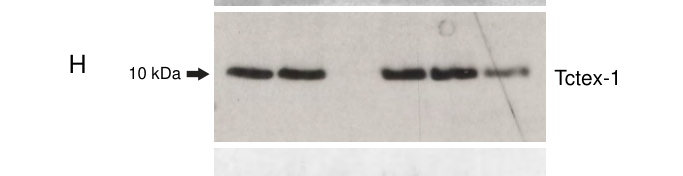

## Question

# Gene Research for Functional Annotation

## ⚠️ CRITICAL: Gene/Protein Identification Context

**BEFORE YOU BEGIN RESEARCH:** You MUST verify you are researching the CORRECT gene/protein. Gene symbols can be ambiguous, especially for less well-characterized genes from non-model organisms.

### Target Gene/Protein Identity (from UniProt):
- **UniProt Accession:** P63172
- **Protein Description:** RecName: Full=Dynein light chain Tctex-type 1; AltName: Full=Protein CW-1; AltName: Full=T-complex testis-specific protein 1 homolog;
- **Gene Information:** Name=DYNLT1; Synonyms=TCTEL1, TCTEX-1, TCTEX1;
- **Organism (full):** Homo sapiens (Human).
- **Protein Family:** Belongs to the dynein light chain Tctex-type family.
- **Key Domains:** Tctex-1-like. (IPR005334); Tctex-1-like_sf. (IPR038586); Tctex-1 (PF03645)

### MANDATORY VERIFICATION STEPS:

1. **Check if the gene symbol "DYNLT1" matches the protein description above**
2. **Verify the organism is correct:** Homo sapiens (Human).
3. **Check if protein family/domains align with what you find in literature**
4. **If you find literature for a DIFFERENT gene with the same or similar symbol, STOP**

### If Gene Symbol is Ambiguous or You Cannot Find Relevant Literature:

**DO NOT PROCEED WITH RESEARCH ON A DIFFERENT GENE.** Instead:
- State clearly: "The gene symbol 'DYNLT1' is ambiguous or literature is limited for this specific protein"
- Explain what you found (e.g., "Found extensive literature on a different gene with the same symbol in a different organism")
- Describe the protein based ONLY on the UniProt information provided above
- Suggest that the protein function can be inferred from domain/family information

### Research Target:

Please provide a comprehensive research report on the gene **DYNLT1** (gene ID: DYNLT1, UniProt: P63172) in human.

The research report should be a detailed narrative explaining the function, biological processes, and localization of the gene product. Citations should be given for all claims.

You should prioritize authoritative reviews and primary scientific literature when conducting research. You can supplement
this with annotations you find in gene/protein databases, but these can be outdated or inaccurate.

We are specifically interested in the primary function of the gene - for enzymes, what reaction is catalyzed, and what is the substrate specificity? For transporters, what is the substrate? For structural proteins or adapters, what is the broader structural role? For signaling molecules, what is the role in the pathway.

We are interested in where in or outside the cell the gene product carries out its function.

We are also interested in the signaling or biochemical pathways in which the gene functions. We are less interested in broad pleiotropic effects, except where these elucidate the precise role.

Include evidence where possible. We are interested in both experimental evidence as well as inference from structure, evolution, or bioinformatic analysis. Precise studies should be prioritized over high-throughput, where available.

## Output

Question: You are an expert researcher providing comprehensive, well-cited information.

Provide detailed information focusing on:
1. Key concepts and definitions with current understanding
2. Recent developments and latest research (prioritize 2023-2024 sources)
3. Current applications and real-world implementations
4. Expert opinions and analysis from authoritative sources
5. Relevant statistics and data from recent studies

Format as a comprehensive research report with proper citations. Include URLs and publication dates where available.
Always prioritize recent, authoritative sources and provide specific citations for all major claims.

# Gene Research for Functional Annotation

## ⚠️ CRITICAL: Gene/Protein Identification Context

**BEFORE YOU BEGIN RESEARCH:** You MUST verify you are researching the CORRECT gene/protein. Gene symbols can be ambiguous, especially for less well-characterized genes from non-model organisms.

### Target Gene/Protein Identity (from UniProt):
- **UniProt Accession:** P63172
- **Protein Description:** RecName: Full=Dynein light chain Tctex-type 1; AltName: Full=Protein CW-1; AltName: Full=T-complex testis-specific protein 1 homolog;
- **Gene Information:** Name=DYNLT1; Synonyms=TCTEL1, TCTEX-1, TCTEX1;
- **Organism (full):** Homo sapiens (Human).
- **Protein Family:** Belongs to the dynein light chain Tctex-type family.
- **Key Domains:** Tctex-1-like. (IPR005334); Tctex-1-like_sf. (IPR038586); Tctex-1 (PF03645)

### MANDATORY VERIFICATION STEPS:

1. **Check if the gene symbol "DYNLT1" matches the protein description above**
2. **Verify the organism is correct:** Homo sapiens (Human).
3. **Check if protein family/domains align with what you find in literature**
4. **If you find literature for a DIFFERENT gene with the same or similar symbol, STOP**

### If Gene Symbol is Ambiguous or You Cannot Find Relevant Literature:

**DO NOT PROCEED WITH RESEARCH ON A DIFFERENT GENE.** Instead:
- State clearly: "The gene symbol 'DYNLT1' is ambiguous or literature is limited for this specific protein"
- Explain what you found (e.g., "Found extensive literature on a different gene with the same symbol in a different organism")
- Describe the protein based ONLY on the UniProt information provided above
- Suggest that the protein function can be inferred from domain/family information

### Research Target:

Please provide a comprehensive research report on the gene **DYNLT1** (gene ID: DYNLT1, UniProt: P63172) in human.

The research report should be a detailed narrative explaining the function, biological processes, and localization of the gene product. Citations should be given for all claims.

You should prioritize authoritative reviews and primary scientific literature when conducting research. You can supplement
this with annotations you find in gene/protein databases, but these can be outdated or inaccurate.

We are specifically interested in the primary function of the gene - for enzymes, what reaction is catalyzed, and what is the substrate specificity? For transporters, what is the substrate? For structural proteins or adapters, what is the broader structural role? For signaling molecules, what is the role in the pathway.

We are interested in where in or outside the cell the gene product carries out its function.

We are also interested in the signaling or biochemical pathways in which the gene functions. We are less interested in broad pleiotropic effects, except where these elucidate the precise role.

Include evidence where possible. We are interested in both experimental evidence as well as inference from structure, evolution, or bioinformatic analysis. Precise studies should be prioritized over high-throughput, where available.

# Human DYNLT1 (UniProt P63172): functional annotation research report

## Identity and principal function

**Identity verified.** The requested human protein is DYNLT1, also called Tctex-1 or TCTEX1, a member of the Tctex-type dynein light-chain family. The supplied UniProt accession is **P63172**. Human-cell studies explicitly identify Tctex-1 as DYNLT1; **DYNLT3/Tctex-3** and **TCTEX1D2** are different light chains and must not be treated as synonyms. The Tctex-1-like domains specified in the question are consistent with this protein-family assignment. (palmer2011arolefor pages 2-4, asante2014subunitcompositionof pages 4-5, indu2015aberrantexpressionof pages 1-2)

**Functional conclusion.** DYNLT1 is principally a **non-enzymatic, dimer-forming structural and interaction subunit of cytoplasmic dynein**. It helps organize the intermediate-chain/light-chain region of dynein and provides binding surfaces for selected protein partners. It is not the ATP-hydrolyzing, force-generating heavy chain, nor a transporter with an intrinsic substrate. DYNLT1 occurs in both dynein-1, which supports intracellular microtubule-based transport, and dynein-2, the motor associated with retrograde intraflagellar transport (IFT). A distinct pool phosphorylated at **Thr94** dissociates from dynein and regulates actin-dependent primary-cilium resorption. These are related but experimentally distinguishable functions. (pfister2006geneticanalysisof pages 7-8, saito2017tctex‐1controlsciliary pages 1-2, asante2014subunitcompositionof pages 4-5)

The following evidence matrix separates direct DYNLT1 findings from complex-level inference and observations concerning other light chains.

| Function/site | Specific experiment and quantitative evidence | Confidence/interpretation |
|---|---|---|
| **Dynein-1 subunit/adaptor interface** — cytoplasmic microtubule motor | Biochemical mapping places the DYNLT1-binding site within a **19-aa N-terminal region of the DYNC1I intermediate chain**; DYNLT1 forms a dimer in dynein-1. (pfister2006geneticanalysisof pages 7-8) | **High for complex membership and interface.** DYNLT1 is a non-enzymatic light chain that helps organize the intermediate-chain region and can provide interaction surfaces; it does not generate motor force. |
| **Dynein-2 association** — cilia and retrograde intraflagellar-transport machinery | In human hTERT-RPE1 cells, affinity purification of mGFP-WDR34 recovered endogenous Tctex-1/DYNLT1, whereas GFP control did not; dynein-1 IC74, dynactin and LIS1 were absent from the WDR34 pull-down. (asante2014subunitcompositionof pages 4-5, asante2014subunitcompositionof media 67c8e335) | **High for association with human dynein-2**, but the pull-down alone does not prove a direct DYNLT1–WDR34 contact or assign phenotypes of other subunits to DYNLT1. |
| **Dynein-2 light-chain architecture** | Purified human **DYNLT1–DYNLT2B/TCTEX1D2** had a SEC-MALS mass of **28.1 kDa**, supporting a heterodimer, and its crystal structure was solved at **2 Å**. Density at the base of the cryo-EM light-chain tower was compatible with this pair but too weak for atomic modeling. AlphaFold-Multimer predicted contacts with WDR34 residues P37–50 and WDR60 residues D469–P512. (mukhopadhyay2024structureandtethering pages 3-4) | **High for the isolated heterodimer; moderate for placement; computational for WDR34/WDR60 interfaces.** WDR60- or TCTEX1D2-specific functional results must not be attributed to DYNLT1. |
| **Primary-cilium length control** — ciliary compartment | DYNLT1 depletion in hTERT-RPE1 cells increased ciliary axoneme and membrane length. Mean lengths were **2.7 μm** after DYNLT1 siRNA, **2.5 μm** after partial DYNC2H1 depletion, **4.2 μm** after combined depletion and **1.8 μm** in control cells. Strong combined depletion prevented cilium formation in **over 95% of 200 cells across three experiments**. (palmer2011arolefor pages 4-5) | **Moderate-to-high cellular evidence.** The phenotype supports ciliary length regulation, but the original study could not directly co-immunoprecipitate DYNLT1 with DYNC2H1; later dynein-2 proteomics and structural work strengthen complex assignment. |
| **Dynein-independent ciliary resorption** — transition zone/ciliary pocket | Thr94-phosphorylated DYNLT1 is excluded from dynein and recruited near the ciliary transition zone. T94E accelerated serum-induced resorption; T94A impaired Cdc42 activation. DYNLT1 associated with ANXA2, F-actin, Arp2/3 and Cdc42; actin disruption, ANXA2/ARPC2 depletion, dynamin inhibition or dominant-negative Rab5 blocked resorption, while active Cdc42 rescued DYNLT1 depletion. (saito2017tctex‐1controlsciliary pages 1-2, saito2017tctex‐1controlsciliary pages 6-7, saito2017tctex‐1controlsciliary pages 3-6) | **High mechanistic cell-biological evidence**, principally in RPE-1 cells. This phospho-T94 pool is functionally distinct from dynein-bound DYNLT1 and couples branched-actin remodeling and early-endosomal uptake to cilium disassembly. |
| **Rhodopsin cargo recognition** — photoreceptor polarized trafficking | DYNLT1 binds the rhodopsin C-terminal domain and is required for rhodopsin trafficking; the close paralog **DYNLT3 does not bind this tail**. (pfister2006geneticanalysisof pages 7-8) | **Moderate-to-high cargo-specific evidence.** This is a useful example of paralog-selective binding, but photoreceptor observations should not be generalized to every dynein cargo. |
| **OX1R signaling/trafficking** — post-internalization endosomes | Yeast two-hybrid and co-immunoprecipitation mapped OX1R binding to the DYNLT1 C-terminal region and the receptor’s last 10 residues. In OX1R-expressing HEK293 cells, DYNLT1 overexpression shortened orexin-A-induced ERK1/2 activation, whereas knockdown prolonged it. Surface receptor abundance and initial internalization were unchanged, but OX1R residence in early endosomes decreased. (duguay2011dyneinlightchain pages 1-2) | **Moderate evidence from a heterologous cell model.** Supports regulation of post-endocytic receptor sorting and signal termination, not OX1R uptake itself; physiological confirmation in orexin-responsive neurons is limited. |
| **Human sperm localization and infertility association** — sperm head, mid-piece and tail | The cohort comprised **14 fertile controls and 58 infertile men**: 15 asthenozoospermic, 20 oligozoospermic and 23 teratozoospermic. Several infertile samples had reduced or undetectable DYNLT1; fertile sperm showed head, mid-piece and tail staining, whereas infertile sperm frequently lacked all staining or specifically tail staining. (indu2015aberrantexpressionof pages 1-2) | **Observational human association only.** The modest cohort and absence of causal genetic or intervention evidence preclude use as a validated diagnostic biomarker or proof that DYNLT1 deficiency causes infertility. |

*Table: Evidence matrix separating DYNLT1’s dynein-bound structural roles from its phospho-Thr94 dynein-independent activity and cargo-specific observations. Confidence notes prevent attribution of WDR60-, DYNLT2B/TCTEX1D2-, or cohort-level effects directly to DYNLT1.*

## Molecular mechanism and current structural understanding

**Dynein-1.** DYNLT1 associates with the dynein intermediate chain; biochemical mapping places its binding region within **19 amino acids near the N terminus of DYNC1I**. Its dimeric architecture and capacity to bind selected partners support an adaptor/assembly role rather than independent motor activity. Cytoplasmic dynein-1 association was directly detectable in the human cilium-length study even though that study could not directly detect DYNLT1 bound to the dynein-2 heavy chain. (pfister2006geneticanalysisof pages 7-8, palmer2011arolefor pages 4-5)

**Dynein-2: experimental versus predicted interfaces.** In human hTERT-RPE1 cells, WDR34 affinity purification recovered Tctex-1/DYNLT1 together with dynein-2 components, whereas dynein-1 intermediate chain IC74 and the dynein-1-associated factors dynactin and LIS1 were not recovered. The study’s Figure 2, particularly panels H and J, documents recovery of **DYNLT1 and, separately, TCTEX1D2** in WDR34-containing material; co-purification establishes complex association, not necessarily direct binding of DYNLT1 to WDR34. (asante2014subunitcompositionof pages 4-5, asante2014subunitcompositionof media 67c8e335)

The most informative **recent DYNLT1-specific structural advance** is the March 2024 EMBO Journal study by Mukhopadhyay and colleagues. Purified human **DYNLT1–DYNLT2B/TCTEX1D2** formed a **28.1-kDa heterodimer** by size-exclusion chromatography/multi-angle light scattering, and its isolated crystal structure was resolved at **2 Å**. In the larger dynein-2 cryo-EM reconstruction, a density at the base of the light-chain assembly was compatible with this heterodimer but too weak for atomic model building. Contacts with WDR34 residues **P37–50** and WDR60 residues **D469–P512** came from **AlphaFold-Multimer modeling**, not direct atomic resolution of those interfaces in the intact motor. The same article reported a **3.9-Å** dynein-2 structure and substantial functional effects of WDR60, but those effects must not be interpreted as DYNLT1-specific loss-of-function results. [Mukhopadhyay *et al.*, 2024, https://doi.org/10.1038/s44318-024-00060-1.] (mukhopadhyay2024structureandtethering pages 3-4)

## Where DYNLT1 acts and in which pathways

**Cytoplasm and polarized intracellular trafficking.** As a cytoplasmic dynein-1 light chain, DYNLT1 acts within intracellular motor/partner complexes. Cargo selectivity is illustrated by its binding to the **rhodopsin C-terminal region** in photoreceptor trafficking: the close paralog DYNLT3 does **not** bind that rhodopsin region. This is evidence for selective protein-cargo recognition, not for a universal DYNLT1-dependent mechanism for every dynein cargo. [Pfister *et al.*, January 2006, https://doi.org/10.1371/journal.pgen.0020001.] (pfister2006geneticanalysisof pages 7-8)

**Primary cilium and its base.** Dynein-2 operates in the ciliary IFT system; human dynein-2 intermediate-chain experiments place the complex at centrosomal/pericentrosomal structures and primary cilia. That complex localization should not be read as direct imaging of every DYNLT1 molecule inside the axoneme. In serum-starved human hTERT-RPE1 cells, DYNLT1 depletion increased both ciliary-axoneme and ciliary-membrane length. Mean lengths were **1.8 μm** after control siRNA, **2.7 μm** after DYNLT1 depletion, **2.5 μm** after partial dynein-2 heavy-chain depletion, and **4.2 μm** after combined depletion. Strong combined depletion prevented cilia formation in **more than 95% of 200 cells** across three experiments. The authors explicitly cautioned that they could not directly demonstrate a DYNLT1–dynein-2-heavy-chain interaction; subsequent dynein-2 purification and structural work substantially strengthened the complex-membership interpretation. [Palmer *et al.*, October 2011, https://doi.org/10.1016/j.ejcb.2011.05.003; Asante *et al.*, November 2014, https://doi.org/10.1242/jcs.159038.] (palmer2011arolefor pages 4-5, asante2014subunitcompositionof pages 4-5)

**Transition zone and ciliary pocket: a separate, dynein-independent pathway.** Following Thr94 phosphorylation, DYNLT1 is not associated with the dynein complex. The phosphorylated protein accumulates at the **ciliary transition zone** before S-phase entry. In cultured ciliated cells, a phosphomimetic **T94E** accelerates cilium disassembly and S-phase entry, whereas a nonphosphorylatable **T94A** fails to rescue DYNLT1-depletion defects. The S-phase effect is dispensable in non-ciliated cells, linking this phenotype specifically to cilium dynamics rather than establishing DYNLT1 as a general cell-cycle enzyme. Neural-progenitor experiments further implicate transition-zone phospho-DYNLT1 in G1 duration and progenitor fate. [Li *et al.*, March 2011, https://doi.org/10.1038/ncb2218; Saito *et al.*, June 2017, https://doi.org/10.15252/embr.201744204.] (saito2017tctex‐1controlsciliary pages 1-2, saito2017tctex‐1controlsciliary pages 6-7)

Mechanistic follow-up in RPE-1 cells connected phospho-Thr94 DYNLT1 to **annexin A2, F-actin, Arp2/3-dependent branched actin, Cdc42 activation, dynamin-dependent uptake, and Rab5-associated early endosomes** at the ciliary pocket. Perturbing actin, annexin A2, ARPC2, dynamin or Rab5 impaired resorption; constitutively active Cdc42 rescued DYNLT1-depletion defects. Thus, this DYNLT1 pool promotes periciliary membrane remodeling and endocytosis during the initial phase of cilium removal. These experiments should not be collapsed into a claim that dynein-2 itself directly activates Cdc42. [Saito *et al.*, June 2017, https://doi.org/10.15252/embr.201744204.] (saito2017tctex‐1controlsciliary pages 1-2, saito2017tctex‐1controlsciliary pages 6-7, saito2017tctex‐1controlsciliary pages 3-6)

**Endosomal receptor signaling.** DYNLT1 interacts with the intracellular tail of **orexin receptor 1 (OX1R)**: interaction assays implicated the DYNLT1 C-terminal region and the receptor’s final ten residues. In engineered HEK293 cells, more DYNLT1 shortened orexin-A-induced **ERK1/2** activation, whereas DYNLT1 reduction prolonged it. Initial OX1R surface abundance and ligand-induced internalization were unchanged; receptor localization in **early endosomes after internalization** was reduced. The supported interpretation is modulation of *post-endocytic receptor distribution and signaling duration*, not inhibition of initial receptor uptake or demonstrated control of sleep in humans. [Duguay *et al.*, October 20, 2011, https://doi.org/10.1371/journal.pone.0026430.] (duguay2011dyneinlightchain pages 1-2)

**Renal-cell efferocytosis.** In epithelial-cell experiments, DYNLT1 interacted with the phagocytic receptor **KIM-1**, dissociated from it within approximately **90 minutes** of efferocytosis onset, and was required for efficient uptake of apoptotic cells; it was *not* required for KIM-1 delivery to the cell surface. Although KIM-1 altered DYNLT1 Thr94 phosphorylation and bound the T94E variant less efficiently, T94E expression did **not** alter KIM-1-mediated efferocytosis. The phosphorylation result therefore does not establish that Thr94 is the operative switch in this pathway. [Ismail *et al.*, October 2018, https://doi.org/10.1002/jcp.26578.] (ismail2018tctex‐1anovel pages 1-2)

## Human relevance, applications and evidence limits

DYNLT1 is presently most concretely useful as a **mechanistic handle** for studying dynein subunit assembly, ciliary trafficking and resorption, and selective receptor/cargo interactions. In human sperm, a study of **14 fertile controls** and **58 men with infertility phenotypes**—15 asthenozoospermic, 20 oligozoospermic and 23 teratozoospermic—reported reduced or undetectable DYNLT1 in several affected samples. Control sperm showed staining in the **head, mid-piece and tail**, whereas affected samples frequently lacked staining altogether or in the tail. This is an **association**, not proof that DYNLT1 loss causes infertility or an established diagnostic test. [Indu *et al.*, December 2015, https://doi.org/10.1074/mcp.m115.050005.] (indu2015aberrantexpressionof pages 1-2, indu2015aberrantexpressionof pages 7-9)

**Assessment of evidence strength.** Complex membership, the isolated 2024 heterodimer structure, human-cell ciliary phenotypes, and the phospho-Thr94 resorption pathway have direct experimental support. Exact DYNLT1 contacts within intact dynein-2 remain partly modeled; ciliary-length changes need not arise exclusively from its motor-bound pool. Orexin signaling and KIM-1 results come principally from cellular models, while the sperm observation is clinical but noncausal. Finally, findings specific to **TCTEX1D2, DYNLT3, WDR34 or WDR60** cannot be assigned to DYNLT1 without a DYNLT1-specific experiment. (mukhopadhyay2024structureandtethering pages 3-4, ismail2018tctex‐1anovel pages 1-2, hou2015dyneinandintraflagellar pages 6-7, palmer2011arolefor pages 4-5)

References

1. (palmer2011arolefor pages 2-4): Krysten J. Palmer, Lucy MacCarthy-Morrogh, Nicola Smyllie, and David J. Stephens. A role for tctex-1 (dynlt1) in controlling primary cilium length. European journal of cell biology, 90 10:865-71, Oct 2011. URL: https://doi.org/10.1016/j.ejcb.2011.05.003, doi:10.1016/j.ejcb.2011.05.003. This article has 52 citations and is from a peer-reviewed journal.

2. (asante2014subunitcompositionof pages 4-5): David Asante, Nicola L. Stevenson, and David J. Stephens. Subunit composition of the human cytoplasmic dynein-2 complex. Journal of Cell Science, 127:4774-4787, Nov 2014. URL: https://doi.org/10.1242/jcs.159038, doi:10.1242/jcs.159038. This article has 128 citations and is from a domain leading peer-reviewed journal.

3. (indu2015aberrantexpressionof pages 1-2): Sivankutty Indu, SreejaC. Sekhar, Jeeva Sengottaiyan, Anil Kumar, SathyM. Pillai, Malini Laloraya, and PradeepG. Kumar. Aberrant expression of dynein light chain 1 (dynlt1) is associated with human male factor infertility*. Molecular &amp; Cellular Proteomics, 14:3185-3195, Dec 2015. URL: https://doi.org/10.1074/mcp.m115.050005, doi:10.1074/mcp.m115.050005. This article has 21 citations and is from a domain leading peer-reviewed journal.

4. (pfister2006geneticanalysisof pages 7-8): K. Kevin Pfister, Paresh R Shah, Holger Hummerich, Andreas Russ, James Cotton, Azlina Ahmad Annuar, Stephen M King, and Elizabeth M. C Fisher. Genetic analysis of the cytoplasmic dynein subunit families. PLoS Genetics, 2:e1, Jan 2006. URL: https://doi.org/10.1371/journal.pgen.0020001, doi:10.1371/journal.pgen.0020001. This article has 407 citations and is from a domain leading peer-reviewed journal.

5. (saito2017tctex‐1controlsciliary pages 1-2): Masaki Saito, Wataru Otsu, Kuo‐Shun Hsu, Jen‐Zen Chuang, Teruyuki Yanagisawa, Vincent Shieh, Taku Kaitsuka, Fan‐Yan Wei, Kazuhito Tomizawa, and Ching‐Hwa Sung. Tctex‐1 controls ciliary resorption by regulating branched actin polymerization and endocytosis. EMBO reports, 18:1460-1472, Jun 2017. URL: https://doi.org/10.15252/embr.201744204, doi:10.15252/embr.201744204. This article has 77 citations and is from a highest quality peer-reviewed journal.

6. (asante2014subunitcompositionof media 67c8e335): David Asante, Nicola L. Stevenson, and David J. Stephens. Subunit composition of the human cytoplasmic dynein-2 complex. Journal of Cell Science, 127:4774-4787, Nov 2014. URL: https://doi.org/10.1242/jcs.159038, doi:10.1242/jcs.159038. This article has 128 citations and is from a domain leading peer-reviewed journal.

7. (mukhopadhyay2024structureandtethering pages 3-4): Aakash G Mukhopadhyay, Katerina Toropova, Lydia Daly, Jennifer N Wells, Laura Vuolo, Miroslav Mladenov, Marian Seda, Dagan Jenkins, David J Stephens, and Anthony J Roberts. Structure and tethering mechanism of dynein-2 intermediate chains in intraflagellar transport. The EMBO Journal, 43:1257-1272, Mar 2024. URL: https://doi.org/10.1038/s44318-024-00060-1, doi:10.1038/s44318-024-00060-1. This article has 18 citations.

8. (palmer2011arolefor pages 4-5): Krysten J. Palmer, Lucy MacCarthy-Morrogh, Nicola Smyllie, and David J. Stephens. A role for tctex-1 (dynlt1) in controlling primary cilium length. European journal of cell biology, 90 10:865-71, Oct 2011. URL: https://doi.org/10.1016/j.ejcb.2011.05.003, doi:10.1016/j.ejcb.2011.05.003. This article has 52 citations and is from a peer-reviewed journal.

9. (saito2017tctex‐1controlsciliary pages 6-7): Masaki Saito, Wataru Otsu, Kuo‐Shun Hsu, Jen‐Zen Chuang, Teruyuki Yanagisawa, Vincent Shieh, Taku Kaitsuka, Fan‐Yan Wei, Kazuhito Tomizawa, and Ching‐Hwa Sung. Tctex‐1 controls ciliary resorption by regulating branched actin polymerization and endocytosis. EMBO reports, 18:1460-1472, Jun 2017. URL: https://doi.org/10.15252/embr.201744204, doi:10.15252/embr.201744204. This article has 77 citations and is from a highest quality peer-reviewed journal.

10. (saito2017tctex‐1controlsciliary pages 3-6): Masaki Saito, Wataru Otsu, Kuo‐Shun Hsu, Jen‐Zen Chuang, Teruyuki Yanagisawa, Vincent Shieh, Taku Kaitsuka, Fan‐Yan Wei, Kazuhito Tomizawa, and Ching‐Hwa Sung. Tctex‐1 controls ciliary resorption by regulating branched actin polymerization and endocytosis. EMBO reports, 18:1460-1472, Jun 2017. URL: https://doi.org/10.15252/embr.201744204, doi:10.15252/embr.201744204. This article has 77 citations and is from a highest quality peer-reviewed journal.

11. (duguay2011dyneinlightchain pages 1-2): David Duguay, Erika Bélanger-Nelson, Valérie Mongrain, Anna Beben, Armen Khatchadourian, and Nicolas Cermakian. Dynein light chain tctex-type 1 modulates orexin signaling through its interaction with orexin 1 receptor. PLoS ONE, 6:e26430, Oct 2011. URL: https://doi.org/10.1371/journal.pone.0026430, doi:10.1371/journal.pone.0026430. This article has 33 citations and is from a peer-reviewed journal.

12. (ismail2018tctex‐1anovel pages 1-2): Ola Z. Ismail, Saranga Sriranganathan, Xizhong Zhang, Joseph V. Bonventre, Antonis S. Zervos, and Lakshman Gunaratnam. Tctex‐1, a novel interaction partner of kidney injury molecule‐1, is required for efferocytosis. Journal of Cellular Physiology, 233:6877-6895, Oct 2018. URL: https://doi.org/10.1002/jcp.26578, doi:10.1002/jcp.26578. This article has 13 citations and is from a peer-reviewed journal.

13. (indu2015aberrantexpressionof pages 7-9): Sivankutty Indu, SreejaC. Sekhar, Jeeva Sengottaiyan, Anil Kumar, SathyM. Pillai, Malini Laloraya, and PradeepG. Kumar. Aberrant expression of dynein light chain 1 (dynlt1) is associated with human male factor infertility*. Molecular &amp; Cellular Proteomics, 14:3185-3195, Dec 2015. URL: https://doi.org/10.1074/mcp.m115.050005, doi:10.1074/mcp.m115.050005. This article has 21 citations and is from a domain leading peer-reviewed journal.

14. (hou2015dyneinandintraflagellar pages 6-7): Yuqing Hou and George B. Witman. Dynein and intraflagellar transport. Experimental cell research, 334 1:26-34, May 2015. URL: https://doi.org/10.1016/j.yexcr.2015.02.017, doi:10.1016/j.yexcr.2015.02.017. This article has 81 citations and is from a peer-reviewed journal.

## Artifacts

- [Edison artifact artifact-00](DYNLT1-deep-research-falcon_artifacts/artifact-00.md)

## Citations

1. pfister2006geneticanalysisof pages 7-8
2. mukhopadhyay2024structureandtethering pages 3-4
3. palmer2011arolefor pages 4-5
4. duguay2011dyneinlightchain pages 1-2
5. indu2015aberrantexpressionof pages 1-2
6. palmer2011arolefor pages 2-4
7. asante2014subunitcompositionof pages 4-5
8. indu2015aberrantexpressionof pages 7-9
9. hou2015dyneinandintraflagellar pages 6-7
10. Mukhopadhyay *et al.*, 2024, https://doi.org/10.1038/s44318-024-00060-1.
11. Pfister *et al.*, January 2006, https://doi.org/10.1371/journal.pgen.0020001.
12. Palmer *et al.*, October 2011, https://doi.org/10.1016/j.ejcb.2011.05.003; Asante *et al.*, November 2014, https://doi.org/10.1242/jcs.159038.
13. Li *et al.*, March 2011, https://doi.org/10.1038/ncb2218; Saito *et al.*, June 2017, https://doi.org/10.15252/embr.201744204.
14. Saito *et al.*, June 2017, https://doi.org/10.15252/embr.201744204.
15. Duguay *et al.*, October 20, 2011, https://doi.org/10.1371/journal.pone.0026430.
16. Ismail *et al.*, October 2018, https://doi.org/10.1002/jcp.26578.
17. Indu *et al.*, December 2015, https://doi.org/10.1074/mcp.m115.050005.
18. https://doi.org/10.1038/s44318-024-00060-1.]
19. https://doi.org/10.1371/journal.pgen.0020001.]
20. https://doi.org/10.1016/j.ejcb.2011.05.003;
21. https://doi.org/10.1242/jcs.159038.]
22. https://doi.org/10.1038/ncb2218;
23. https://doi.org/10.15252/embr.201744204.]
24. https://doi.org/10.1371/journal.pone.0026430.]
25. https://doi.org/10.1002/jcp.26578.]
26. https://doi.org/10.1074/mcp.m115.050005.]
27. https://doi.org/10.1016/j.ejcb.2011.05.003,
28. https://doi.org/10.1242/jcs.159038,
29. https://doi.org/10.1074/mcp.m115.050005,
30. https://doi.org/10.1371/journal.pgen.0020001,
31. https://doi.org/10.15252/embr.201744204,
32. https://doi.org/10.1038/s44318-024-00060-1,
33. https://doi.org/10.1371/journal.pone.0026430,
34. https://doi.org/10.1002/jcp.26578,
35. https://doi.org/10.1016/j.yexcr.2015.02.017,