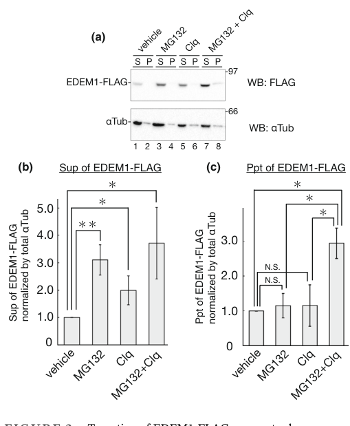

## Question

# Gene Research for Functional Annotation

## ⚠️ CRITICAL: Gene/Protein Identification Context

**BEFORE YOU BEGIN RESEARCH:** You MUST verify you are researching the CORRECT gene/protein. Gene symbols can be ambiguous, especially for less well-characterized genes from non-model organisms.

### Target Gene/Protein Identity (from UniProt):
- **UniProt Accession:** Q92611
- **Protein Description:** RecName: Full=ER degradation-enhancing alpha-mannosidase-like protein 1;
- **Gene Information:** Name=EDEM1; Synonyms=EDEM, KIAA0212;
- **Organism (full):** Homo sapiens (Human).
- **Protein Family:** Belongs to the glycosyl hydrolase 47 family. .
- **Key Domains:** 6hp_glycosidase-like_sf. (IPR012341); EDEM1/2/3. (IPR044674); Glyco_hydro_47. (IPR001382); Seven-hairpin_glycosidases. (IPR036026); Glyco_hydro_47 (PF01532)

### MANDATORY VERIFICATION STEPS:

1. **Check if the gene symbol "EDEM1" matches the protein description above**
2. **Verify the organism is correct:** Homo sapiens (Human).
3. **Check if protein family/domains align with what you find in literature**
4. **If you find literature for a DIFFERENT gene with the same or similar symbol, STOP**

### If Gene Symbol is Ambiguous or You Cannot Find Relevant Literature:

**DO NOT PROCEED WITH RESEARCH ON A DIFFERENT GENE.** Instead:
- State clearly: "The gene symbol 'EDEM1' is ambiguous or literature is limited for this specific protein"
- Explain what you found (e.g., "Found extensive literature on a different gene with the same symbol in a different organism")
- Describe the protein based ONLY on the UniProt information provided above
- Suggest that the protein function can be inferred from domain/family information

### Research Target:

Please provide a comprehensive research report on the gene **EDEM1** (gene ID: EDEM1, UniProt: Q92611) in human.

The research report should be a detailed narrative explaining the function, biological processes, and localization of the gene product. Citations should be given for all claims.

You should prioritize authoritative reviews and primary scientific literature when conducting research. You can supplement
this with annotations you find in gene/protein databases, but these can be outdated or inaccurate.

We are specifically interested in the primary function of the gene - for enzymes, what reaction is catalyzed, and what is the substrate specificity? For transporters, what is the substrate? For structural proteins or adapters, what is the broader structural role? For signaling molecules, what is the role in the pathway.

We are interested in where in or outside the cell the gene product carries out its function.

We are also interested in the signaling or biochemical pathways in which the gene functions. We are less interested in broad pleiotropic effects, except where these elucidate the precise role.

Include evidence where possible. We are interested in both experimental evidence as well as inference from structure, evolution, or bioinformatic analysis. Precise studies should be prioritized over high-throughput, where available.

## Output

Question: You are an expert researcher providing comprehensive, well-cited information.

Provide detailed information focusing on:
1. Key concepts and definitions with current understanding
2. Recent developments and latest research (prioritize 2023-2024 sources)
3. Current applications and real-world implementations
4. Expert opinions and analysis from authoritative sources
5. Relevant statistics and data from recent studies

Format as a comprehensive research report with proper citations. Include URLs and publication dates where available.
Always prioritize recent, authoritative sources and provide specific citations for all major claims.

# Gene Research for Functional Annotation

## ⚠️ CRITICAL: Gene/Protein Identification Context

**BEFORE YOU BEGIN RESEARCH:** You MUST verify you are researching the CORRECT gene/protein. Gene symbols can be ambiguous, especially for less well-characterized genes from non-model organisms.

### Target Gene/Protein Identity (from UniProt):
- **UniProt Accession:** Q92611
- **Protein Description:** RecName: Full=ER degradation-enhancing alpha-mannosidase-like protein 1;
- **Gene Information:** Name=EDEM1; Synonyms=EDEM, KIAA0212;
- **Organism (full):** Homo sapiens (Human).
- **Protein Family:** Belongs to the glycosyl hydrolase 47 family. .
- **Key Domains:** 6hp_glycosidase-like_sf. (IPR012341); EDEM1/2/3. (IPR044674); Glyco_hydro_47. (IPR001382); Seven-hairpin_glycosidases. (IPR036026); Glyco_hydro_47 (PF01532)

### MANDATORY VERIFICATION STEPS:

1. **Check if the gene symbol "EDEM1" matches the protein description above**
2. **Verify the organism is correct:** Homo sapiens (Human).
3. **Check if protein family/domains align with what you find in literature**
4. **If you find literature for a DIFFERENT gene with the same or similar symbol, STOP**

### If Gene Symbol is Ambiguous or You Cannot Find Relevant Literature:

**DO NOT PROCEED WITH RESEARCH ON A DIFFERENT GENE.** Instead:
- State clearly: "The gene symbol 'EDEM1' is ambiguous or literature is limited for this specific protein"
- Explain what you found (e.g., "Found extensive literature on a different gene with the same symbol in a different organism")
- Describe the protein based ONLY on the UniProt information provided above
- Suggest that the protein function can be inferred from domain/family information

### Research Target:

Please provide a comprehensive research report on the gene **EDEM1** (gene ID: EDEM1, UniProt: Q92611) in human.

The research report should be a detailed narrative explaining the function, biological processes, and localization of the gene product. Citations should be given for all claims.

You should prioritize authoritative reviews and primary scientific literature when conducting research. You can supplement
this with annotations you find in gene/protein databases, but these can be outdated or inaccurate.

We are specifically interested in the primary function of the gene - for enzymes, what reaction is catalyzed, and what is the substrate specificity? For transporters, what is the substrate? For structural proteins or adapters, what is the broader structural role? For signaling molecules, what is the role in the pathway.

We are interested in where in or outside the cell the gene product carries out its function.

We are also interested in the signaling or biochemical pathways in which the gene functions. We are less interested in broad pleiotropic effects, except where these elucidate the precise role.

Include evidence where possible. We are interested in both experimental evidence as well as inference from structure, evolution, or bioinformatic analysis. Precise studies should be prioritized over high-throughput, where available.

# Research Report: Human **EDEM1** (UniProt **Q92611**) — Functional Annotation and Current Understanding

## 1) Target identity verification (critical)
The gene symbol **EDEM1** in human refers to **“ER degradation-enhancing alpha-mannosidase-like protein 1”**, an ER quality-control factor implicated in glycoprotein surveillance and ER-associated degradation (ERAD), consistent with the UniProt entry **Q92611** (human) and with the functional framing in mechanistic studies of ERAD and glycoprotein demannosylation. (chiritoiu2020edem1drivesmisfolded pages 1-3, shenkman2018mannosidaseactivityof pages 1-2)

## 2) Key concepts and definitions (current understanding)

### 2.1 ER-associated degradation (ERAD)
ERAD is a conserved proteostasis pathway in which misfolded proteins in the ER are recognized and triaged for retrotranslocation, ubiquitination, and proteasomal degradation. In mammalian ERAD for luminal glycoproteins (ERAD-L), glycan processing and lectin recognition help distinguish terminally misfolded proteins from folding intermediates. (chiritoiu2020edem1drivesmisfolded pages 3-5, fasana2024ertolysosomeassociateddegradationacts pages 7-8)

### 2.2 EDEM1 in ER glycoprotein quality control
EDEM1 is classically described as a factor that helps **extract terminally misfolded glycoproteins from the calnexin folding cycle** and promote their delivery to downstream ERAD machinery (e.g., HRD1–SEL1L), including ER luminal lectins such as OS-9/XTP3-B. (chiritoiu2020edem1drivesmisfolded pages 1-3, chiritoiu2020edem1drivesmisfolded pages 3-5)

### 2.3 “Mannose trimming” as an ERAD signal
A central concept in glycoprotein ERAD is that progressive demannosylation of N-glycans (removal of specific α1,2-mannose residues) can generate a degradation signal that increases affinity for ERAD lectins and supports commitment to disposal. EDEM1 belongs to the **glycoside hydrolase family 47 (GH47) mannosidase-like** proteins that participate in this process. (shenkman2018mannosidaseactivityof pages 1-2, manica2021edem3domainscooperate pages 1-2)

## 3) Molecular function: enzymatic reaction and substrate specificity

### 3.1 Enzymatic activity (reaction type)
Direct in vitro evidence indicates that **EDEM1 has bona fide mannosidase activity**, i.e., it trims **α1,2-linked mannose residues** from N-linked high-mannose glycans on glycoproteins. (shenkman2018mannosidaseactivityof pages 1-2, shenkman2018mannosidaseactivityof pages 5-6)

### 3.2 Substrate selectivity: unfolded/misfolded glycoproteins
A key mechanistic result is that EDEM1’s mannosidase activity is strongly **dependent on the conformational state of the substrate glycoprotein**: activity is modest on free glycans or native glycoproteins but increases substantially on **denatured/unfolded glycoproteins**, resolving how slow background trimming can become selective for misfolded species. (shenkman2018mannosidaseactivityof pages 4-4, shenkman2018mannosidaseactivityof pages 1-2)

Experimentally, EDEM1 was observed to trim oligomannose structures consistent with steps **from M8 toward shorter M7–M5 species**, with cellular data supporting prominent contributions to **M8→M7** and **M6→M5** trimming steps. (shenkman2018mannosidaseactivityof pages 4-5, shenkman2018mannosidaseactivityof pages 5-6)

### 3.3 Catalytic requirement (functional residue)
Mutation of a conserved catalytic residue (EDEM1 **E488Q**) abrogates mannosidase activity and yields a dominant-negative functional effect on ERAD substrate degradation, supporting that catalytic trimming can be functionally important in ERAD routing for at least some clients. (shenkman2018mannosidaseactivityof pages 4-4)

### 3.4 Dual recognition modes: glycans and polypeptide features
EDEM1 also engages substrates through **protein–protein interactions** beyond pure glycan recognition. For example, knockdown of EDEM1 markedly decreased interaction of an ERAD substrate with the ERAD lectin **OS-9** to ~20% of control (≈80% reduction), consistent with EDEM1 contributing to formation/exposure of lectin-binding glycan signals and/or stabilizing substrate handoff. (shenkman2018mannosidaseactivityof pages 4-4, shenkman2018mannosidaseactivityof pages 1-2)

## 4) Subcellular localization and topology
EDEM1 functions in the **endoplasmic reticulum** within ER quality-control/ERAD-associated complexes. (chiritoiu2020edem1drivesmisfolded pages 1-3, chiritoiu2020edem1drivesmisfolded pages 3-5)

A 2024 study focused on EDEM1’s own turnover provides biochemical evidence that EDEM1 can exist in **both soluble and membrane-associated (including a type II transmembrane) forms**, consistent with post-translational processing that yields distinct topologies. Fractionation data supported substantial membrane association (example soluble/pellet distributions reported as ~20/80 or 35/65 depending on conditions/cofactors). (katsuki2024turnoverofedem1 pages 1-2, katsuki2024turnoverofedem1 pages 10-11)

Microscopy evidence from the same study shows ER localization under mannosidase inhibition (kifunensine) and relocalization to ubiquitin-positive aggresome-like structures upon proteasome inhibition. (katsuki2024turnoverofedem1 media 21e83ca5)

## 5) Pathways and molecular interactions

### 5.1 Placement in ERAD handoff networks
EDEM1 physically associates with multiple components of ER quality-control and ERAD machinery, including **SEL1L, HRD1, OS-9, XTP3-B**, and ER chaperones/co-chaperones (e.g., ERdj proteins), supporting a role as an organizing/processing factor that helps route clients through the ERAD-L pipeline. (chiritoiu2020edem1drivesmisfolded pages 3-5)

### 5.2 Dynamic complexes and autoregulation
EDEM1 is not only an ERAD factor but also becomes a substrate of ER proteostasis pathways. Perturbations to ERAD (e.g., inhibition of mannose trimming) can shift complex composition/distribution and affect EDEM1 stability. (chiritoiu2020edem1drivesmisfolded pages 3-5)

## 6) Recent developments (prioritizing 2023–2024)

### 6.1 2024: EDEM1 turnover is mediated by multiple degradation routes (ERAD and autophagy)
Katsuki et al. (Genes to Cells, **Apr 2024**, https://doi.org/10.1111/gtc.13117) report that EDEM1, itself an ERAD-accelerating factor, is turned over rapidly in cells (cycloheximide chase **half-life ~3 h**) and can be degraded via **both ERAD/proteasome and autophagy**, with distinct folded/aggregated states contributing to route choice. (katsuki2024turnoverofedem1 pages 2-3, katsuki2024turnoverofedem1 media 21e83ca5)

Mechanistically, the study identifies ERAD components that contribute to EDEM1 clearance, including **SEL1L/Hrd1**, the deubiquitinase **YOD1**, and other factors (e.g., XTP3B, ERdj3, VIMP, BAG6, JB12), while **OS9** binds EDEM1 but did not drive turnover in their overexpression assays. (katsuki2024turnoverofedem1 pages 1-2, katsuki2024turnoverofedem1 pages 6-7)

### 6.2 2024: ERAD dysfunction (including EDEM1 loss/inhibition) activates a compensatory ER-to-lysosome route (ERLAD/ER-phagy-like)
Fasana et al. (EMBO Reports, **May 2024**, https://doi.org/10.1038/s44319-024-00165-y) demonstrate that genetic or pharmacologic inhibition of ERAD components—including **silencing EDEM1** or inhibiting luminal α1,2-mannosidases with **kifunensine (KIF)**—can redirect canonical ERAD clients such as **NHK** and **BACE457Δ** to **LAMP1-positive endolysosomes** via ER-to-lysosome-associated degradation (ERLAD). (fasana2024ertolysosomeassociateddegradationacts pages 3-4, fasana2024ertolysosomeassociateddegradationacts pages 9-10)

Importantly, this compensatory route requires the ER-phagy receptor **FAM134B** and its LC3-interacting region (LIR), and depends on **LC3 lipidation machinery** (e.g., ATG7) but is reported to be independent of classical autophagosome biogenesis factors (e.g., ATG13) in their assays. (fasana2024ertolysosomeassociateddegradationacts pages 7-8, fasana2024ertolysosomeassociateddegradationacts pages 6-7)

### 6.3 2023: Authoritative expert synthesis of ERAD substrate processing
A recent high-authority review (Christianson et al., Nature Reviews Molecular Cell Biology, **Aug 2023**, https://doi.org/10.1038/s41580-023-00633-8) situates EDEM1 among the luminal processing factors that cooperate with chaperones and lectins to deliver misfolded proteins to HRD1–SEL1L-dependent ERAD, reinforcing consensus pathway placement and mechanistic framing. (fasana2024ertolysosomeassociateddegradationacts pages 10-11)

## 7) Applications and real-world implementations

### 7.1 Experimental/biotechnology implementations (current practice)
In practice, EDEM1 is widely used as:
- A **node/marker** of ER proteostasis pathways (ER stress/UPR–ERAD axis) in perturbation experiments; and
- A mechanistic handle to shift the fate of misfolded glycoproteins between **proteasomal ERAD** and **lysosomal ERLAD/ER-phagy-like disposal** when ERAD is compromised. (katsuki2024turnoverofedem1 pages 1-2, fasana2024ertolysosomeassociateddegradationacts pages 7-8)

### 7.2 Disease-relevant pathway context (preclinical)
Although this report did not identify established clinical EDEM1-targeting therapies in the retrieved sources, EDEM1 is directly relevant to disease-linked proteostasis by controlling disposal of misfolded glycoproteins and by engaging compensatory lysosomal routes under ERAD impairment. (fasana2024ertolysosomeassociateddegradationacts pages 3-4, fasana2024ertolysosomeassociateddegradationacts pages 6-7)

## 8) Quantitative statistics and data highlights (from recent primary studies)

- **EDEM1 turnover half-life (~3 h)** by cycloheximide chase in human cells expressing EDEM1-FLAG (Genes to Cells, 2024). (katsuki2024turnoverofedem1 pages 2-3, katsuki2024turnoverofedem1 media 21e83ca5)
- **EDEM1 knockdown reduces OS-9 association** with an ERAD substrate to ~20% of control (≈80% reduction), supporting a role in lectin-mediated targeting. (shenkman2018mannosidaseactivityof pages 4-4)
- Under ERAD inhibition, **NHK retention at 120 min** increased (examples reported: mock 37–49% vs PS341 52–73% or KIF 53–80%), and further increased when lysosomes were blocked, consistent with rerouting to lysosomes. (fasana2024ertolysosomeassociateddegradationacts pages 3-4)
- Under ERAD inhibition, **BACE457Δ retention at 120 min** increased (mock 36–54% vs PS341 70–84% or KIF 72–75%), and ERLAD delivery required FAM134B. (fasana2024ertolysosomeassociateddegradationacts pages 9-10)
- ERLAD quantification used image-based **LysoQuant** analyses with reported **cell counts (n) across conditions** and strong significance in key comparisons (e.g., ****P < 0.0001 in one-way ANOVA with Dunnett’s test). (fasana2024ertolysosomeassociateddegradationacts pages 7-8, fasana2024ertolysosomeassociateddegradationacts pages 3-4)

## 9) Expert interpretation and synthesis
Overall, EDEM1 is best understood as a **misfolding-selective GH47 mannosidase-like factor** that helps commit certain ER clients to degradation by coupling (i) preferential action on unfolded glycoprotein substrates with (ii) lectin/chaperone-mediated handoff to core ERAD machinery. The recent 2024 literature adds an important systems-level perspective: EDEM1 is tightly regulated at the protein level by the same pathways it supports (ERAD and autophagy), and when EDEM1-dependent ERAD processes are impaired, cells can compensate by engaging **FAM134B/LC3-dependent ERLAD** to deliver ERAD clients to lysosomes. (shenkman2018mannosidaseactivityof pages 4-4, katsuki2024turnoverofedem1 pages 1-2, fasana2024ertolysosomeassociateddegradationacts pages 7-8)

## Summary evidence table
| Aspect | Key findings (1-3 bullets) | Evidence & quantitative details | Key sources (first author year, journal) | URL |
|---|---|---|---|---|
| Definition / target verification | • Human **EDEM1** corresponds to **ER degradation-enhancing alpha-mannosidase-like protein 1** (UniProt **Q92611**). • Member of **glycosyl hydrolase family 47** / mannosidase-like ER quality-control proteins. • Functions in ER glycoprotein quality control and ER-associated degradation (ERAD). | Experimental/review context consistently places EDEM1 in mammalian ERAD as a GH47 mannosidase-like factor acting on misfolded glycoproteins rather than an unrelated protein; family assignment and ERAD role are concordant across mechanistic studies and reviews (chiritoiu2020edem1drivesmisfolded pages 1-3, shenkman2018mannosidaseactivityof pages 1-2, manica2021edem3domainscooperate pages 1-2). | Shenkman 2018, *Communications Biology*; Chiritoiu 2020, *IJMS* | https://doi.org/10.1038/s42003-018-0174-8 ; https://doi.org/10.3390/ijms21103468 |
| Primary molecular function / enzymatic activity | • **Bona fide mannosidase activity** demonstrated in vitro for human EDEM1. • Activity is **much stronger on unfolded/denatured glycoproteins** than on free glycans or native glycoproteins. • Catalytic residue **E488** is required for activity and ERAD support. | EDEM1 shows only modest trimming on free N-glycans/native glycoproteins but **>3-fold higher activity on denatured glycoproteins**; trims oligomannose species from **M8 toward M5**, contributing especially to **M8→M7** and **M6→M5** steps. **E488Q** mutant loses mannosidase activity and acts dominant-negatively on ERAD substrate degradation (shenkman2018mannosidaseactivityof pages 4-4, shenkman2018mannosidaseactivityof pages 4-5, shenkman2018mannosidaseactivityof pages 1-2, shenkman2018mannosidaseactivityof pages 5-6). | Shenkman 2018, *Communications Biology*; Lamriben 2018, *JBC* | https://doi.org/10.1038/s42003-018-0174-8 ; https://doi.org/10.1074/jbc.ra118.004183 |
| Substrate specificity / recognition mode | • Prefers **misfolded or unfolded glycoproteins** rather than properly folded substrates. • Recognition is not purely glycan-based: EDEM1 also uses **protein–protein interactions** and redox-sensitive contacts. • N- and C-terminal **intrinsically disordered regions (IDRs)** contribute to substrate/partner binding. | EDEM1 mannosidase activity rises sharply when glycoprotein substrate is denatured; knockdown reduces OS-9 association of ERAD substrate **H2a to ~20% of control** (~80% reduction). The mannosidase-like domain can bind ERAD clients in a **thiol/redox-sensitive** manner; IDRs are required for interaction with ERAD factor **ERdj5** and for efficient client binding/degradation (shenkman2018mannosidaseactivityof pages 4-4, shenkman2018mannosidaseactivityof pages 1-2, manica2021edem3domainscooperate pages 1-2). | Shenkman 2018, *Communications Biology*; Lamriben 2018, *JBC*; Chiritoiu 2020, *IJMS* | https://doi.org/10.1038/s42003-018-0174-8 ; https://doi.org/10.1074/jbc.ra118.004183 ; https://doi.org/10.3390/ijms21103468 |
| Localization / topology | • EDEM1 is an **ER-resident** quality-control factor. • 2024 work indicates **both soluble and membrane-associated / transmembrane forms** can exist. • Membrane-associated form appears more aggregation-prone and can be selectively handled by some turnover factors. | Katsuki et al. report EDEM1 has **five N-glycans**, undergoes **post-translational signal-sequence cleavage**, and yields **soluble and type II transmembrane forms**; alkaline extraction/fractionation showed substantial membrane association (**S/P ~20/80 or 35/65** depending on condition/cofactors). Figure-based evidence shows ER localization under KIF and aggresome relocalization with proteasome inhibition (katsuki2024turnoverofedem1 pages 1-2, katsuki2024turnoverofedem1 pages 10-11, katsuki2024turnoverofedem1 media 21e83ca5). | Katsuki 2024, *Genes to Cells*; Chiritoiu 2020, *IJMS* | https://doi.org/10.1111/gtc.13117 ; https://doi.org/10.3390/ijms21103468 |
| Pathway role in ER quality control / ERAD | • EDEM1 helps extract terminally misfolded proteins from the **calnexin cycle** and route them to **HRD1–SEL1L ERAD**. • Associates with ERAD lectins/chaperones including **OS-9, XTP3-B, SEL1L, HRD1, ERdj proteins**. • Can contribute to degradation of some **nonglycosylated** misfolded proteins via protein-based recognition. | Co-complexing with **SEL1L, OS-9, XTP3-B, HRD1, PSMC6, ERdj4/5, calnexin, UGGTs** supports placement in luminal ERAD handoff complexes; catalytic and noncatalytic substrate engagement both contribute to routing. Earlier work also supports shared ERAD machinery for glycosylated and nonglycosylated substrates involving EDEM1 (chiritoiu2020edem1drivesmisfolded pages 1-3, chiritoiu2020edem1drivesmisfolded pages 3-5, manica2021edem3domainscooperate pages 1-2). | Chiritoiu 2020, *IJMS*; Christianson 2023, *Nat Rev Mol Cell Biol*; Shenkman 2013, *JBC* | https://doi.org/10.3390/ijms21103468 ; https://doi.org/10.1038/s41580-023-00633-8 ; https://doi.org/10.1074/jbc.m112.438275 |
| Regulation by ER stress / UPR | • **UPR/ER stress induces EDEM1 expression**. • EDEM1 itself is also tightly controlled post-translationally by degradation pathways. • Perturbing ERAD can modestly raise EDEM1 and BiP levels. | Katsuki 2024 states EDEM1 gene expression is **upregulated by ER stress/UPR**; protein turnover is fast (**half-life ~3 h** by CHX chase). Chiritoiu 2020 found **kifunensine** and **SEL1L depletion** increase EDEM1 stability/abundance, with mild **BiP** upregulation during ERAD perturbation (katsuki2024turnoverofedem1 pages 1-2, katsuki2024turnoverofedem1 pages 2-3, chiritoiu2020edem1drivesmisfolded pages 3-5, katsuki2024turnoverofedem1 media 21e83ca5). | Katsuki 2024, *Genes to Cells*; Chiritoiu 2020, *IJMS* | https://doi.org/10.1111/gtc.13117 ; https://doi.org/10.3390/ijms21103468 |
| Turnover and autoregulation (2024 emphasis) | • EDEM1 is itself degraded by **ERAD and autophagy**. • **SEL1L/Hrd1, YOD1, XTP3B, ERdj3, VIMP, BAG6, JB12** participate in EDEM1 turnover. • **OS9 binds EDEM1** but did not measurably drive its turnover in the 2024 study. | CHX chase: **~3 h half-life**. **KIF** or **MG132** stabilizes EDEM1. **SEL1L knockout** upregulates EDEM1; **Hrd1 C329S** impairs turnover; **XTP3B** overexpression lowers EDEM1 in a **KIF-sensitive** manner; inactive **YOD1 C160S** increases ubiquitinated, detergent-insoluble EDEM1. Statistical analyses reported from **3–4 independent experiments**, with significance including **P < 0.05** and **P < 0.01** (katsuki2024turnoverofedem1 pages 1-2, katsuki2024turnoverofedem1 pages 10-11, katsuki2024turnoverofedem1 pages 6-7, katsuki2024turnoverofedem1 pages 2-3, katsuki2024turnoverofedem1 media 21e83ca5). | Katsuki 2024, *Genes to Cells* | https://doi.org/10.1111/gtc.13117 |
| Backup lysosomal disposal / ER-phagy-ERLAD | • When ERAD is impaired, EDEM1-linked pathways connect to **ER-phagy / ER-to-lysosome-associated degradation (ERLAD)** as a failsafe. • **FAM134B** and **LC3 lipidation** are required for rerouting canonical ERAD clients. • Supports a model in which EDEM1 loss/inhibition does not fully block disposal but shifts it to lysosomes. | Fasana 2024: **EDEM1 silencing** redirects **NHK** to degradative endolysosomes; pharmacologic ERAD inhibition (**KIF**, **PS341**) reroutes **NHK** and **BACE457Δ** to **LAMP1+** compartments. Delivery requires **FAM134B** and its **LIR motif**; **ATG7** deletion blocks delivery, whereas **ATG13** deletion does not. Example pulse-chase retentions at 120 min under ERAD inhibition: NHK mock **37–49%** vs **KIF 53–80%**, **PS341 52–73%**, and even higher with lysosome block; BACE457Δ mock **36–54%** vs **KIF 72–75%**, **PS341 70–84%**. LysoQuant analyses used multiple cell counts and **N=2–3** experiments; several comparisons reached ******P < 0.0001** (fasana2024ertolysosomeassociateddegradationacts pages 1-2, fasana2024ertolysosomeassociateddegradationacts pages 7-8, fasana2024ertolysosomeassociateddegradationacts pages 3-4, fasana2024ertolysosomeassociateddegradationacts pages 9-10, fasana2024ertolysosomeassociateddegradationacts pages 6-7). | Fasana 2024, *EMBO Reports*; Chiritoiu 2020, *IJMS* | https://doi.org/10.1038/s44319-024-00165-y ; https://doi.org/10.3390/ijms21103468 |
| Real-world / disease-linked applications | • EDEM1 level or activity is being used mainly as a **proteostasis/ER stress marker** in cell biology and disease models. • Manipulating EDEM1 can alter fate of disease-relevant clients such as **APP** and viral proteins. • No approved EDEM1-targeted therapy was identified; current use is mechanistic and preclinical. | In human cell models, EDEM1 overproduction reduces **APP** levels and decreases **Aβ40/Aβ42** secretion, supporting relevance to Alzheimer-related proteostasis; recent literature also cites EDEM1 in viral exploitation and stress-pathway studies, but translation remains preclinical. The strongest current “implementation” is use of EDEM1 as a pathway node/marker in ERAD- and UPR-focused experiments rather than a clinical biomarker or drug target (chiritoiu2020edem1drivesmisfolded pages 1-3, katsuki2024turnoverofedem1 pages 1-2). | Nowakowska-Gołacka 2021, *IJMS*; Katsuki 2024, *Genes to Cells* | https://doi.org/10.3390/ijms23010117 ; https://doi.org/10.1111/gtc.13117 |

*Table: This table summarizes core evidence for the identity, function, localization, regulation, pathway role, and applications of human EDEM1 (UniProt Q92611). It emphasizes the most informative mechanistic studies, especially Katsuki 2024 on EDEM1 turnover and Fasana 2024 on ERLAD compensation when ERAD is impaired.*

## Key recent references (with publication date and URL)
- Katsuki R. et al. **Apr 2024**. *Genes to Cells*. “Turnover of EDEM1… mediated by multiple degradation routes.” https://doi.org/10.1111/gtc.13117 (katsuki2024turnoverofedem1 pages 1-2)
- Fasana E. et al. **May 2024**. *EMBO Reports*. “ER-to-lysosome-associated degradation acts as failsafe mechanism upon ERAD dysfunction.” https://doi.org/10.1038/s44319-024-00165-y (fasana2024ertolysosomeassociateddegradationacts pages 1-2)
- Christianson J.C. et al. **Aug 2023**. *Nature Reviews Molecular Cell Biology*. “Mechanisms of substrate processing during ER-associated protein degradation.” https://doi.org/10.1038/s41580-023-00633-8 (fasana2024ertolysosomeassociateddegradationacts pages 10-11)
- Shenkman M. et al. **Oct 2018**. *Communications Biology*. “Mannosidase activity of EDEM1 and EDEM2 depends on an unfolded state…” https://doi.org/10.1038/s42003-018-0174-8 (shenkman2018mannosidaseactivityof pages 1-2)
- Chiritoiu M. et al. **May 2020**. *International Journal of Molecular Sciences*. “EDEM1 drives misfolded protein degradation via ERAD and exploits ER-phagy…” https://doi.org/10.3390/ijms21103468 (chiritoiu2020edem1drivesmisfolded pages 1-3)

References

1. (chiritoiu2020edem1drivesmisfolded pages 1-3): Marioara Chiritoiu, Gabriela N. Chiritoiu, Cristian V. A. Munteanu, Florin Pastrama, N. Erwin Ivessa, and Stefana M. Petrescu. Edem1 drives misfolded protein degradation via erad and exploits er-phagy as back-up mechanism when erad is impaired. International Journal of Molecular Sciences, 21:3468, May 2020. URL: https://doi.org/10.3390/ijms21103468, doi:10.3390/ijms21103468. This article has 38 citations.

2. (shenkman2018mannosidaseactivityof pages 1-2): Marina Shenkman, Efrat Ron, Rivka Yehuda, Ron Benyair, Isam Khalaila, and Gerardo Z. Lederkremer. Mannosidase activity of edem1 and edem2 depends on an unfolded state of their glycoprotein substrates. Communications Biology, Oct 2018. URL: https://doi.org/10.1038/s42003-018-0174-8, doi:10.1038/s42003-018-0174-8. This article has 71 citations and is from a peer-reviewed journal.

3. (chiritoiu2020edem1drivesmisfolded pages 3-5): Marioara Chiritoiu, Gabriela N. Chiritoiu, Cristian V. A. Munteanu, Florin Pastrama, N. Erwin Ivessa, and Stefana M. Petrescu. Edem1 drives misfolded protein degradation via erad and exploits er-phagy as back-up mechanism when erad is impaired. International Journal of Molecular Sciences, 21:3468, May 2020. URL: https://doi.org/10.3390/ijms21103468, doi:10.3390/ijms21103468. This article has 38 citations.

4. (fasana2024ertolysosomeassociateddegradationacts pages 7-8): Elisa Fasana, Ilaria Fregno, Carmela Galli, Tatiana Soldà, and Maurizio Molinari. Er-to-lysosome-associated degradation acts as failsafe mechanism upon erad dysfunction. EMBO Reports, 25:2773-2785, May 2024. URL: https://doi.org/10.1038/s44319-024-00165-y, doi:10.1038/s44319-024-00165-y. This article has 37 citations and is from a highest quality peer-reviewed journal.

5. (manica2021edem3domainscooperate pages 1-2): Georgiana Manica, Simona Ghenea, Cristian V. A. Munteanu, Eliza C. Martin, Cristian Butnaru, Marius Surleac, Gabriela N. Chiritoiu, Petruta R. Alexandru, Andrei-Jose Petrescu, and Stefana M. Petrescu. Edem3 domains cooperate to perform its overall cell functioning. International Journal of Molecular Sciences, 22:2172, Feb 2021. URL: https://doi.org/10.3390/ijms22042172, doi:10.3390/ijms22042172. This article has 17 citations.

6. (shenkman2018mannosidaseactivityof pages 5-6): Marina Shenkman, Efrat Ron, Rivka Yehuda, Ron Benyair, Isam Khalaila, and Gerardo Z. Lederkremer. Mannosidase activity of edem1 and edem2 depends on an unfolded state of their glycoprotein substrates. Communications Biology, Oct 2018. URL: https://doi.org/10.1038/s42003-018-0174-8, doi:10.1038/s42003-018-0174-8. This article has 71 citations and is from a peer-reviewed journal.

7. (shenkman2018mannosidaseactivityof pages 4-4): Marina Shenkman, Efrat Ron, Rivka Yehuda, Ron Benyair, Isam Khalaila, and Gerardo Z. Lederkremer. Mannosidase activity of edem1 and edem2 depends on an unfolded state of their glycoprotein substrates. Communications Biology, Oct 2018. URL: https://doi.org/10.1038/s42003-018-0174-8, doi:10.1038/s42003-018-0174-8. This article has 71 citations and is from a peer-reviewed journal.

8. (shenkman2018mannosidaseactivityof pages 4-5): Marina Shenkman, Efrat Ron, Rivka Yehuda, Ron Benyair, Isam Khalaila, and Gerardo Z. Lederkremer. Mannosidase activity of edem1 and edem2 depends on an unfolded state of their glycoprotein substrates. Communications Biology, Oct 2018. URL: https://doi.org/10.1038/s42003-018-0174-8, doi:10.1038/s42003-018-0174-8. This article has 71 citations and is from a peer-reviewed journal.

9. (katsuki2024turnoverofedem1 pages 1-2): Riko Katsuki, Mai Kanuka, Ren Ohta, Shusei Yoshida, and Taku Tamura. Turnover of edem1, an erad‐enhancing factor, is mediated by multiple degradation routes. Genes to Cells, 29:486-502, Apr 2024. URL: https://doi.org/10.1111/gtc.13117, doi:10.1111/gtc.13117. This article has 5 citations and is from a peer-reviewed journal.

10. (katsuki2024turnoverofedem1 pages 10-11): Riko Katsuki, Mai Kanuka, Ren Ohta, Shusei Yoshida, and Taku Tamura. Turnover of edem1, an erad‐enhancing factor, is mediated by multiple degradation routes. Genes to Cells, 29:486-502, Apr 2024. URL: https://doi.org/10.1111/gtc.13117, doi:10.1111/gtc.13117. This article has 5 citations and is from a peer-reviewed journal.

11. (katsuki2024turnoverofedem1 media 21e83ca5): Riko Katsuki, Mai Kanuka, Ren Ohta, Shusei Yoshida, and Taku Tamura. Turnover of edem1, an erad‐enhancing factor, is mediated by multiple degradation routes. Genes to Cells, 29:486-502, Apr 2024. URL: https://doi.org/10.1111/gtc.13117, doi:10.1111/gtc.13117. This article has 5 citations and is from a peer-reviewed journal.

12. (katsuki2024turnoverofedem1 pages 2-3): Riko Katsuki, Mai Kanuka, Ren Ohta, Shusei Yoshida, and Taku Tamura. Turnover of edem1, an erad‐enhancing factor, is mediated by multiple degradation routes. Genes to Cells, 29:486-502, Apr 2024. URL: https://doi.org/10.1111/gtc.13117, doi:10.1111/gtc.13117. This article has 5 citations and is from a peer-reviewed journal.

13. (katsuki2024turnoverofedem1 pages 6-7): Riko Katsuki, Mai Kanuka, Ren Ohta, Shusei Yoshida, and Taku Tamura. Turnover of edem1, an erad‐enhancing factor, is mediated by multiple degradation routes. Genes to Cells, 29:486-502, Apr 2024. URL: https://doi.org/10.1111/gtc.13117, doi:10.1111/gtc.13117. This article has 5 citations and is from a peer-reviewed journal.

14. (fasana2024ertolysosomeassociateddegradationacts pages 3-4): Elisa Fasana, Ilaria Fregno, Carmela Galli, Tatiana Soldà, and Maurizio Molinari. Er-to-lysosome-associated degradation acts as failsafe mechanism upon erad dysfunction. EMBO Reports, 25:2773-2785, May 2024. URL: https://doi.org/10.1038/s44319-024-00165-y, doi:10.1038/s44319-024-00165-y. This article has 37 citations and is from a highest quality peer-reviewed journal.

15. (fasana2024ertolysosomeassociateddegradationacts pages 9-10): Elisa Fasana, Ilaria Fregno, Carmela Galli, Tatiana Soldà, and Maurizio Molinari. Er-to-lysosome-associated degradation acts as failsafe mechanism upon erad dysfunction. EMBO Reports, 25:2773-2785, May 2024. URL: https://doi.org/10.1038/s44319-024-00165-y, doi:10.1038/s44319-024-00165-y. This article has 37 citations and is from a highest quality peer-reviewed journal.

16. (fasana2024ertolysosomeassociateddegradationacts pages 6-7): Elisa Fasana, Ilaria Fregno, Carmela Galli, Tatiana Soldà, and Maurizio Molinari. Er-to-lysosome-associated degradation acts as failsafe mechanism upon erad dysfunction. EMBO Reports, 25:2773-2785, May 2024. URL: https://doi.org/10.1038/s44319-024-00165-y, doi:10.1038/s44319-024-00165-y. This article has 37 citations and is from a highest quality peer-reviewed journal.

17. (fasana2024ertolysosomeassociateddegradationacts pages 10-11): Elisa Fasana, Ilaria Fregno, Carmela Galli, Tatiana Soldà, and Maurizio Molinari. Er-to-lysosome-associated degradation acts as failsafe mechanism upon erad dysfunction. EMBO Reports, 25:2773-2785, May 2024. URL: https://doi.org/10.1038/s44319-024-00165-y, doi:10.1038/s44319-024-00165-y. This article has 37 citations and is from a highest quality peer-reviewed journal.

18. (fasana2024ertolysosomeassociateddegradationacts pages 1-2): Elisa Fasana, Ilaria Fregno, Carmela Galli, Tatiana Soldà, and Maurizio Molinari. Er-to-lysosome-associated degradation acts as failsafe mechanism upon erad dysfunction. EMBO Reports, 25:2773-2785, May 2024. URL: https://doi.org/10.1038/s44319-024-00165-y, doi:10.1038/s44319-024-00165-y. This article has 37 citations and is from a highest quality peer-reviewed journal.

## Artifacts

- [Edison artifact artifact-00](EDEM1-deep-research-falcon_artifacts/artifact-00.md)

## Citations

1. shenkman2018mannosidaseactivityof pages 4-4
2. fasana2024ertolysosomeassociateddegradationacts pages 10-11
3. fasana2024ertolysosomeassociateddegradationacts pages 3-4
4. fasana2024ertolysosomeassociateddegradationacts pages 9-10
5. fasana2024ertolysosomeassociateddegradationacts pages 1-2
6. shenkman2018mannosidaseactivityof pages 1-2
7. fasana2024ertolysosomeassociateddegradationacts pages 7-8
8. shenkman2018mannosidaseactivityof pages 5-6
9. shenkman2018mannosidaseactivityof pages 4-5
10. fasana2024ertolysosomeassociateddegradationacts pages 6-7
11. https://doi.org/10.1111/gtc.13117
12. https://doi.org/10.1038/s44319-024-00165-y
13. https://doi.org/10.1038/s41580-023-00633-8
14. https://doi.org/10.1038/s42003-018-0174-8
15. https://doi.org/10.3390/ijms21103468
16. https://doi.org/10.1074/jbc.ra118.004183
17. https://doi.org/10.1074/jbc.m112.438275
18. https://doi.org/10.3390/ijms23010117
19. https://doi.org/10.3390/ijms21103468,
20. https://doi.org/10.1038/s42003-018-0174-8,
21. https://doi.org/10.1038/s44319-024-00165-y,
22. https://doi.org/10.3390/ijms22042172,
23. https://doi.org/10.1111/gtc.13117,