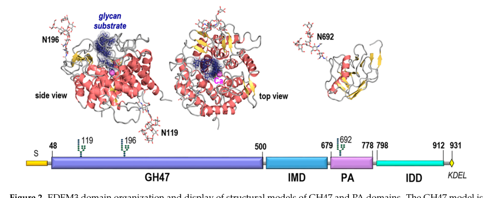

## Question

# Gene Research for Functional Annotation

## ⚠️ CRITICAL: Gene/Protein Identification Context

**BEFORE YOU BEGIN RESEARCH:** You MUST verify you are researching the CORRECT gene/protein. Gene symbols can be ambiguous, especially for less well-characterized genes from non-model organisms.

### Target Gene/Protein Identity (from UniProt):
- **UniProt Accession:** Q9BZQ6
- **Protein Description:** RecName: Full=ER degradation-enhancing alpha-mannosidase-like protein 3; EC=3.2.1.113 {ECO:0000250|UniProtKB:P32906}; AltName: Full=Alpha-1,2-mannosidase EDEM3; Flags: Precursor;
- **Gene Information:** Name=EDEM3; Synonyms=C1orf22;
- **Organism (full):** Homo sapiens (Human).
- **Protein Family:** Belongs to the glycosyl hydrolase 47 family. .
- **Key Domains:** 6hp_glycosidase-like_sf. (IPR012341); EDEM1/2/3. (IPR044674); EDEM3_PA. (IPR037322); Glyco_hydro_47. (IPR001382); PA_dom_sf. (IPR046450)

### MANDATORY VERIFICATION STEPS:

1. **Check if the gene symbol "EDEM3" matches the protein description above**
2. **Verify the organism is correct:** Homo sapiens (Human).
3. **Check if protein family/domains align with what you find in literature**
4. **If you find literature for a DIFFERENT gene with the same or similar symbol, STOP**

### If Gene Symbol is Ambiguous or You Cannot Find Relevant Literature:

**DO NOT PROCEED WITH RESEARCH ON A DIFFERENT GENE.** Instead:
- State clearly: "The gene symbol 'EDEM3' is ambiguous or literature is limited for this specific protein"
- Explain what you found (e.g., "Found extensive literature on a different gene with the same symbol in a different organism")
- Describe the protein based ONLY on the UniProt information provided above
- Suggest that the protein function can be inferred from domain/family information

### Research Target:

Please provide a comprehensive research report on the gene **EDEM3** (gene ID: EDEM3, UniProt: Q9BZQ6) in human.

The research report should be a detailed narrative explaining the function, biological processes, and localization of the gene product. Citations should be given for all claims.

You should prioritize authoritative reviews and primary scientific literature when conducting research. You can supplement
this with annotations you find in gene/protein databases, but these can be outdated or inaccurate.

We are specifically interested in the primary function of the gene - for enzymes, what reaction is catalyzed, and what is the substrate specificity? For transporters, what is the substrate? For structural proteins or adapters, what is the broader structural role? For signaling molecules, what is the role in the pathway.

We are interested in where in or outside the cell the gene product carries out its function.

We are also interested in the signaling or biochemical pathways in which the gene functions. We are less interested in broad pleiotropic effects, except where these elucidate the precise role.

Include evidence where possible. We are interested in both experimental evidence as well as inference from structure, evolution, or bioinformatic analysis. Precise studies should be prioritized over high-throughput, where available.

## Output

Question: You are an expert researcher providing comprehensive, well-cited information.

Provide detailed information focusing on:
1. Key concepts and definitions with current understanding
2. Recent developments and latest research (prioritize 2023-2024 sources)
3. Current applications and real-world implementations
4. Expert opinions and analysis from authoritative sources
5. Relevant statistics and data from recent studies

Format as a comprehensive research report with proper citations. Include URLs and publication dates where available.
Always prioritize recent, authoritative sources and provide specific citations for all major claims.

# Gene Research for Functional Annotation

## ⚠️ CRITICAL: Gene/Protein Identification Context

**BEFORE YOU BEGIN RESEARCH:** You MUST verify you are researching the CORRECT gene/protein. Gene symbols can be ambiguous, especially for less well-characterized genes from non-model organisms.

### Target Gene/Protein Identity (from UniProt):
- **UniProt Accession:** Q9BZQ6
- **Protein Description:** RecName: Full=ER degradation-enhancing alpha-mannosidase-like protein 3; EC=3.2.1.113 {ECO:0000250|UniProtKB:P32906}; AltName: Full=Alpha-1,2-mannosidase EDEM3; Flags: Precursor;
- **Gene Information:** Name=EDEM3; Synonyms=C1orf22;
- **Organism (full):** Homo sapiens (Human).
- **Protein Family:** Belongs to the glycosyl hydrolase 47 family. .
- **Key Domains:** 6hp_glycosidase-like_sf. (IPR012341); EDEM1/2/3. (IPR044674); EDEM3_PA. (IPR037322); Glyco_hydro_47. (IPR001382); PA_dom_sf. (IPR046450)

### MANDATORY VERIFICATION STEPS:

1. **Check if the gene symbol "EDEM3" matches the protein description above**
2. **Verify the organism is correct:** Homo sapiens (Human).
3. **Check if protein family/domains align with what you find in literature**
4. **If you find literature for a DIFFERENT gene with the same or similar symbol, STOP**

### If Gene Symbol is Ambiguous or You Cannot Find Relevant Literature:

**DO NOT PROCEED WITH RESEARCH ON A DIFFERENT GENE.** Instead:
- State clearly: "The gene symbol 'EDEM3' is ambiguous or literature is limited for this specific protein"
- Explain what you found (e.g., "Found extensive literature on a different gene with the same symbol in a different organism")
- Describe the protein based ONLY on the UniProt information provided above
- Suggest that the protein function can be inferred from domain/family information

### Research Target:

Please provide a comprehensive research report on the gene **EDEM3** (gene ID: EDEM3, UniProt: Q9BZQ6) in human.

The research report should be a detailed narrative explaining the function, biological processes, and localization of the gene product. Citations should be given for all claims.

You should prioritize authoritative reviews and primary scientific literature when conducting research. You can supplement
this with annotations you find in gene/protein databases, but these can be outdated or inaccurate.

We are specifically interested in the primary function of the gene - for enzymes, what reaction is catalyzed, and what is the substrate specificity? For transporters, what is the substrate? For structural proteins or adapters, what is the broader structural role? For signaling molecules, what is the role in the pathway.

We are interested in where in or outside the cell the gene product carries out its function.

We are also interested in the signaling or biochemical pathways in which the gene functions. We are less interested in broad pleiotropic effects, except where these elucidate the precise role.

Include evidence where possible. We are interested in both experimental evidence as well as inference from structure, evolution, or bioinformatic analysis. Precise studies should be prioritized over high-throughput, where available.

# Research report: Functional annotation of human **EDEM3** (UniProt **Q9BZQ6**, gene **EDEM3/C1orf22**)

## 0. Target verification (critical identity check)
The UniProt accession **Q9BZQ6** corresponds to **human EDEM3** (ER degradation-enhancing α-mannosidase-like protein 3), an ER quality-control factor belonging to **glycosyl hydrolase family 47 (GH47)** and annotated as an **α-1,2-mannosidase-like** enzyme involved in glycoprotein ER-associated degradation (gpERAD). This matches the requested protein description and organism (**Homo sapiens**). (manica2021edem3domainscooperate pages 1-2, słominskawojewodzka2015theroleof pages 8-10)

## 1. Key concepts and definitions (current understanding)
### 1.1 ER quality control (ERQC), ERAD, and gpERAD
**ER-associated degradation (ERAD)** is a proteostasis pathway that eliminates misfolded or superfluous proteins that enter or reside in the endoplasmic reticulum (ER), by ultimately delivering them to cytosolic proteasomes via membrane-associated ubiquitination machinery. (christianson2023mechanismsofsubstrate pages 1-5)

For **N-glycosylated secretory proteins**, ERAD includes a **glycan editing / mannose trimming** component (often called **glycoprotein ERAD, gpERAD**) that helps distinguish folding intermediates from terminally misfolded proteins; mannose trimming produces glycan “signals” that are recognized by downstream lectin-like ERAD factors. (słominskawojewodzka2015theroleof pages 8-10, christianson2023mechanismsofsubstrate pages 1-5)

### 1.2 EDEM proteins
The **EDEM** family (EDEM1/2/3) are ER-resident α-mannosidase-like proteins that accelerate disposal of terminally misfolded glycoproteins by **editing high-mannose N-glycans** and promoting commitment to degradation, including facilitating release from the calnexin/calreticulin folding cycle. (słominskawojewodzka2015theroleof pages 8-10)

## 2. EDEM3: protein features, domains, localization, and topology
### 2.1 Domain architecture
Human EDEM3 is a ~**931 aa** soluble, multi-domain protein comprising a GH47 mannosidase-like domain followed by additional regions described as **IMD (intermediate domain), PA (protease-associated) domain, and an intrinsically disordered domain (IDD)**. A schematic domain organization and construct map are shown in Manica et al. (2021) (Figures 2–3). (manica2021edem3domainscooperate pages 1-2, manica2021edem3domainscooperate media 1872ca8d, manica2021edem3domainscooperate media 5202115c)

### 2.2 ER localization and retention
EDEM3 is described as a **soluble ER luminal** protein and contains a **C-terminal KDEL ER-retention motif**, consistent with ER residency. (manica2021edem3domainscooperate pages 1-2)

## 3. Primary molecular function: enzymatic reaction and substrate specificity
### 3.1 Enzymatic class
EDEM3 is a GH47 **class I α-1,2-mannosidase-like** protein with experimentally supported **in vivo α1,2-mannosidase activity**, supported by catalytic-site mutagenesis: the **E147Q** substitution (mutation of a conserved acidic residue required for catalysis in GH47 enzymes) abolishes EDEM3-driven mannose trimming and substantially reduces its ERAD-enhancing function. (hirao2006edem3asoluble pages 1-1, słominskawojewodzka2015theroleof pages 8-10)

### 3.2 Substrate context
Experimental studies position EDEM3’s functional substrates as **misfolded N-glycosylated proteins in the ER**, including model gpERAD clients such as **TCRα**, **α1-antitrypsin NHK**, and **α1-antitrypsin Z (ATZ)**. (hirao2006edem3asoluble pages 1-1, yu2018erresidentprotein46 pages 13-15)

### 3.3 Glycan processing detail (branch/isomer specificity)
Yu et al. (2018) describe EDEM3-mediated mannose trimming using oligomannose glycan notations (e.g., **M9, M8B, Man7A**), and report a specific step in which trimming yields **Man7GlcNAc2 isomer A (M7A)** by removal of a terminal mannose from **M8B** (branch C trimming described in the paper’s framing). (yu2018erresidentprotein46 pages 1-2)

### 3.4 Practical limitation (what is *not* yet well quantified)
Across the retrieved literature, EDEM3 function is well-supported **qualitatively** (substrate classes and pathway role), but the retrieved excerpts do not provide robust **enzyme kinetic constants** (e.g., kcat/KM) for purified human EDEM3 on defined glycan substrates; activity appears context-dependent and difficult to reconstitute without accessory factors. (yu2018erresidentprotein46 pages 1-2, yu2018erresidentprotein46 pages 13-15)

## 4. Mechanism in ERAD: interaction partners and redox regulation
### 4.1 ERp46/TXNDC5 as a key EDEM3 activator
A central mechanistic advance is that EDEM3’s mannose trimming can be **triggered by the ER oxidoreductase ERp46 (TXNDC5)**.

* Yu et al. (2018, JBC; publication month **July 2018**) show EDEM3 **stably associates** with ERp46 in cells (co-immunoprecipitation), and ERp46 co-expression enhances EDEM3’s mannose trimming in vivo. (yu2018erresidentprotein46 pages 13-15)
* In a defined in vitro system, EDEM3 mannose trimming toward a misfolded glycoprotein substrate (TCRα) was reconstituted **only when ERp46 formed a covalent disulfide-linked interaction with EDEM3**, and this depended on ERp46 redox activity. (yu2018erresidentprotein46 pages 1-2)

These findings support a model where EDEM3 is not simply “on” as a constitutively active hydrolase; instead, its demannosylation function is **coupled to ER redox chemistry**, aligning mannose trimming with the misfolded state and its oxidative folding context. (yu2018erresidentprotein46 pages 1-2)

### 4.2 Broader interactome: transient substrate engagement
Proteomics-based analysis in Manica et al. (2021; publication month **Feb 2021**) suggests EDEM3 has **few stable ER interactors** (consistent with transient engagement of many clients), with detected associations including ERAD/ERQC-linked proteins such as **SEL1L and BiP/HSPA5** in their co-IP/proteomics workflows. (manica2021edem3domainscooperate pages 2-4, manica2021edem3domainscooperate pages 1-2)

## 5. Biological processes and pathway placement
### 5.1 Placement within sequential mannose trimming logic
Manica et al. (2021) frame EDEM2 as initiating an early mannose trimming step, followed by **EDEM3 action** in sequential processing of glycans that commit misfolded glycoproteins to ERAD. (manica2021edem3domainscooperate pages 1-2)

### 5.2 Domain-level functional analysis (substrate handling and ERAD timing)
Using EDEM3 knockout cells and reconstitution with domain deletions, Manica et al. (2021) conclude:
* the **GH47 mannosidase-like domain** mediates substrate binding and is required for catalytic activity,
* the **IMD** supports proper folding of the mannosidase region,
* **PA** and **IDD** domains modulate the turnover of specific misfolded clients (e.g., NHK and soluble tyrosinase mutant), shaping **ERAD timing and client selectivity** rather than simply switching catalysis on/off. (manica2021edem3domainscooperate pages 1-2, manica2021edem3domainscooperate pages 14-15)

A figure-level schematic of EDEM3 domains and the deletion constructs used to reach these conclusions is shown in Manica et al. (2021) Figures 2–3. (manica2021edem3domainscooperate media 1872ca8d, manica2021edem3domainscooperate media 5202115c)

## 6. Recent developments (prioritizing 2023–2024)
### 6.1 Updated authoritative synthesis of ERAD mechanisms (2023)
A 2023 authoritative review in **Nature Reviews Molecular Cell Biology** emphasizes that ERAD is not a single pathway but a collection of routes with specialized recognition and processing logic for diverse substrate topologies and maturation states, providing the conceptual framework into which glycan editing enzymes like EDEM3 fit (substrate discrimination and route specialization). Publication date: **Aug 2023**. URL: https://doi.org/10.1038/s41580-023-00633-8 (christianson2023mechanismsofsubstrate pages 1-5)

### 6.2 Human genetics connects EDEM3 to glucose homeostasis (2023)
Lagou et al. performed a large **cross-ancestry GWAS of random glucose (RG)** in **476,326** individuals without diabetes (published online **7 Sep 2023**, Nature Genetics). The study reports that the **EDEM3 locus** is represented by a **low-frequency (1% ≤ MAF < 5%) coding variant** association with RG, nominating EDEM3 as a plausible contributor to glucose homeostasis. URL: https://doi.org/10.1038/s41588-023-01462-3 (lagou2023gwasofrandom pages 1-2)

### 6.3 ER folding–degradation “tug-of-war” models incorporating EDEM activity (2024)
A 2024 study by Ninagawa et al. (posted **Oct 19, 2023** as a preprint; later version in eLife per metadata) advances the concept that glycoprotein fate in the ER can be conceptualized as a **tug-of-war** between folding-promoting pathways (UGGT-dependent reglucosylation and CNX/CRT cycle) and degradation-promoting pathways (EDEM-family demannosylation). While the excerpt focuses on UGGT genetics, it explicitly frames **EDEM-family activity** as the degradation arm of this competition model. URL: https://doi.org/10.1101/2023.10.18.562958 (ninagawa2024uggt1mediatedreglucosylationof pages 1-5)

## 7. Current applications and real-world implementations
### 7.1 Research and biotechnology applications
Because EDEM-family α1,2-mannosidases influence high-mannose glycan processing and ER quality control decisions, manipulating this axis is widely used in **cell-based models** to:
* tune secretion versus degradation of recombinant glycoproteins,
* interrogate ER stress/UPR dynamics,
* map gpERAD client pathways (e.g., using NHK/ATZ/TCRα as model clients). (hirao2006edem3asoluble pages 1-1, yu2018erresidentprotein46 pages 13-15, ninagawa2024uggt1mediatedreglucosylationof pages 1-5)

### 7.2 Translational relevance: ERAD modulation in cancer
A cancer-focused review discusses ERQC/ERAD as an actionable vulnerability in cancer (for late ERAD steps, some inhibitors are already in clinical use for specific cancers), and it notes Human Protein Atlas–based associations in which **EDEM3 overexpression** is linked to **unfavorable prognosis in renal cancers** (observational/prognostic context rather than mechanism). URL: https://doi.org/10.1155/2019/8384913 (OpenTargets Search: -EDEM3)

## 8. Disease associations and statistics (from recent/authoritative sources)
### 8.1 Database-curated human disease links (Open Targets)
Open Targets reports curated disease associations for **EDEM3 (ENSG00000116406)**, including:
* **Congenital disorder of glycosylation (CDG)** and **CDG type 2V**, with relatively high association scores (~0.77), supported by multiple evidence items (including literature linked by Open Targets). URL: https://platform.opentargets.org/target/ENSG00000116406 (OpenTargets Search: -EDEM3)
* Additional phenotype/disease terms with weaker scores (~0.31–0.32) including **short stature**, **bronchiectasis**, and **systemic lupus erythematosus** (these should be interpreted cautiously as aggregated evidence signals, not definitive mechanism). (OpenTargets Search: -EDEM3)

### 8.2 HBV/HCC context (recent primary evidence; 2025, outside 2023–2024 but highly relevant)
Ghionescu et al. (Journal of Biomedical Science; **2025**, DOI minted 2024) report elevated **EDEM3 expression in hepatocellular carcinoma (HCC)** tissues, with the **highest levels in HBV-infected** tumors, and provide mechanistic cell data: EDEM3 overexpression attenuates UPR and activates secretory autophagy promoting HBV production, while EDEM3 depletion increases ER stress and pro-apoptotic mechanisms. URL: https://doi.org/10.1186/s12929-024-01103-9 (ghionescu2025theendoplasmicreticulum pages 1-2)

## 9. Expert synthesis and interpretation (authoritative analysis)
Collectively, the strongest experimental support indicates EDEM3 functions as a **regulated GH47 demannosylase/lectin-like factor** that couples glycan trimming to ER redox state, thereby helping commit **misfolded glycoproteins** to gpERAD.

A key mechanistic insight is that EDEM3 activity is **functionally gated by oxidoreductase partnership** (ERp46/TXNDC5), suggesting the ER integrates **glycan signals** and **disulfide/redox status** when deciding whether to continue folding attempts or send a client to degradation. (yu2018erresidentprotein46 pages 1-2, yu2018erresidentprotein46 pages 13-15)

## Summary table (evidence map)
The following table provides a compact, claim-to-citation mapping for EDEM3 functional annotation.

| Topic | Claim | Evidence type | Key citation (year) | DOI / URL | Context ID(s) |
|---|---|---|---|---|---|
| Identity / target verification | Human **EDEM3** corresponds to UniProt **Q9BZQ6**; aliases include **C1orf22** and the protein is **ER degradation-enhancing alpha-mannosidase-like protein 3**, a GH47-family EDEM protein involved in ERAD. | Primary, review, database | Olivari et al. 2005; Manica et al. 2021; Open Targets | https://doi.org/10.1074/jbc.c400534200 ; https://doi.org/10.3390/ijms22042172 ; https://platform.opentargets.org/target/ENSG00000116406 | (manica2021edem3domainscooperate pages 1-2, OpenTargets Search: -EDEM3) |
| Domains and motifs | EDEM3 is a **931 aa** soluble ER protein with four modules: **GH47** mannosidase-like domain, **IMD** (intermediate) domain, **PA** (protease-associated) domain, **IDD** (intrinsically disordered domain), plus a C-terminal **KDEL** ER-retention motif. Figure-based domain schematic explicitly shows these modules and KDEL. | Primary, figure evidence | Manica et al. 2021 | https://doi.org/10.3390/ijms22042172 | (manica2021edem3domainscooperate pages 1-2, manica2021edem3domainscooperate media 1872ca8d) |
| Localization / topology | EDEM3 is described as a **soluble ER luminal / ER-localized** protein retained by **KDEL**, rather than a membrane-anchored ERAD factor. | Primary, review | Hirao et al. 2006; Manica et al. 2021 | https://doi.org/10.1074/jbc.m512191200 ; https://doi.org/10.3390/ijms22042172 | (hirao2006edem3asoluble pages 1-3, manica2021edem3domainscooperate pages 1-2) |
| Enzyme class / catalytic function | EDEM3 is a **GH47 class I α1,2-mannosidase-like** enzyme; overexpression stimulates mannose trimming, and catalytic-site mutation **E147Q** abolishes trimming and markedly reduces ERAD enhancement, supporting bona fide α1,2-mannosidase activity in vivo. UniProt annotates **EC 3.2.1.113**. | Primary, review, database | Hirao et al. 2006; Słomińska-Wojewódzka & Sandvig 2015; UniProt-derived target description | https://doi.org/10.1074/jbc.m512191200 ; https://doi.org/10.3390/molecules20069816 ; https://www.uniprot.org/uniprotkb/Q9BZQ6 | (hirao2006edem3asoluble pages 1-1, słominskawojewodzka2015theroleof pages 8-10) |
| Glycan substrates / processing step | EDEM3 acts on **N-linked high-mannose glycans** on misfolded glycoproteins in ER quality control. It participates after EDEM2 in sequential mannose trimming and contributes to formation of ERAD-targeting glycans; reviews place EDEM-mediated trimming in generation of signals recognized by downstream lectins. | Primary, review | Manica et al. 2021; Christianson et al. 2023 | https://doi.org/10.3390/ijms22042172 ; https://doi.org/10.1038/s41580-023-00633-8 | (manica2021edem3domainscooperate pages 1-2, christianson2023mechanismsofsubstrate pages 1-5) |
| Branch specificity / reaction detail | Primary biochemical work indicates EDEM3-mediated trimming can convert **M8B to M7A** by removing a terminal mannose from branch C, but activity is weak on purified free glycans and much more effective on misfolded glycoprotein substrates in cells or reconstituted systems. | Primary | Yu et al. 2018 | https://doi.org/10.1074/jbc.ra118.003129 | (yu2018erresidentprotein46 pages 1-2) |
| Model substrates | Experimentally supported glycoprotein substrates/clients used to study EDEM3 include **TCRα**, **α1-antitrypsin NHK**, **ATZ**, soluble tyrosinase mutant, and other misfolded N-glycoproteins. | Primary | Hirao et al. 2006; Yu et al. 2018; Manica et al. 2021 | https://doi.org/10.1074/jbc.m512191200 ; https://doi.org/10.1074/jbc.ra118.003129 ; https://doi.org/10.3390/ijms22042172 | (hirao2006edem3asoluble pages 1-1, yu2018erresidentprotein46 pages 13-15, manica2021edem3domainscooperate pages 14-15) |
| Interaction partners | **ERp46/TXNDC5** is the best-supported functional partner: it stably associates with EDEM3 and **triggers** EDEM3 mannose-trimming activity through a redox-dependent covalent interaction. Proteomics also identified few stable partners, including **SEL1L, BiP/HSPA5, DNAJB9, UFD1**, consistent with mainly transient substrate interactions. | Primary | Yu et al. 2018; Manica et al. 2021 | https://doi.org/10.1074/jbc.ra118.003129 ; https://doi.org/10.3390/ijms22042172 | (yu2018erresidentprotein46 pages 13-15, manica2021edem3domainscooperate pages 2-4, manica2021edem3domainscooperate pages 1-2) |
| Redox regulation | EDEM3 enzymatic function is linked to **ER redox chemistry**: ERp46 redox-active cysteines form a disulfide-linked complex with the EDEM3 mannosidase domain, enabling reconstitution of trimming activity toward misfolded TCRα in vitro. | Primary | Yu et al. 2018 | https://doi.org/10.1074/jbc.ra118.003129 | (yu2018erresidentprotein46 pages 1-2) |
| Pathway role in gpERAD | EDEM3 functions in **glycoprotein ER-associated degradation (gpERAD)** by recognizing misfolded glycoproteins, trimming their mannose residues, helping terminate futile calnexin/calreticulin folding cycles, and promoting commitment to degradation. | Primary, review | Hirao et al. 2006; Słomińska-Wojewódzka & Sandvig 2015; Christianson et al. 2023 | https://doi.org/10.1074/jbc.m512191200 ; https://doi.org/10.3390/molecules20069816 ; https://doi.org/10.1038/s41580-023-00633-8 | (hirao2006edem3asoluble pages 1-1, słominskawojewodzka2015theroleof pages 8-10, christianson2023mechanismsofsubstrate pages 1-5) |
| Domain-specific functional interpretation | The **GH47** domain is sufficient for substrate binding but requires **IMD** for proper folding; **PA** and **IDD** are not essential for trimming per se but modulate turnover kinetics of specific substrates, implying EDEM3 influences ERAD timing and client selectivity. | Primary | Manica et al. 2021 | https://doi.org/10.3390/ijms22042172 | (manica2021edem3domainscooperate pages 1-2, manica2021edem3domainscooperate pages 14-15) |
| Structural/biophysical behavior | EDEM3 sediments in fractions consistent with roughly **120–250 kDa** species, compatible with homo-/hetero-dimeric assemblies; its interactome is relatively sparse compared with EDEM1, supporting a model of transient client engagement. | Primary | Manica et al. 2021 | https://doi.org/10.3390/ijms22042172 | (manica2021edem3domainscooperate pages 2-4, manica2021edem3domainscooperate pages 14-15) |
| Recent mechanistic context (2023–2024) | Recent ERAD literature emphasizes that glycoprotein fate reflects a **tug-of-war between folding (UGGT/CNX-CRT cycle) and degradation (EDEM-mediated demannosylation)**; EDEM3 is part of this decision module in current models of mammalian ER quality control. | Review / primary preprint | Christianson et al. 2023; Ninagawa et al. 2024 | https://doi.org/10.1038/s41580-023-00633-8 ; https://doi.org/10.1101/2023.10.18.562958 | (christianson2023mechanismsofsubstrate pages 1-5, ninagawa2024uggt1mediatedreglucosylationof pages 1-5) |
| Disease association: congenital disorder of glycosylation | Open Targets links EDEM3 to **congenital disorder of glycosylation** and specifically **CDG type 2V**, with a relatively high association score (~**0.774** for CDG and ~**0.767** for CDG type 2V) based on curated evidence. | Database / genetics curation | Open Targets | https://platform.opentargets.org/target/ENSG00000116406 | (OpenTargets Search: -EDEM3) |
| Disease association: other phenotype terms | Open Targets also lists evidence linking EDEM3 to **short stature**, **bronchiectasis**, and **systemic lupus erythematosus**, though these associations are weaker (scores ~**0.31–0.32**) and should be interpreted more cautiously than the CDG association. | Database | Open Targets | https://platform.opentargets.org/target/ENSG00000116406 | (OpenTargets Search: -EDEM3) |
| Disease association: HBV/HCC | In hepatocellular carcinoma studies, EDEM3 is reported as **upregulated in HCC tissues**, highest in **HBV-infected** tumors; mechanistically, EDEM3 overexpression attenuated UPR and promoted secretory autophagy/HBV production, whereas depletion increased ER stress and apoptosis. | Primary | Ghionescu et al. 2025 | https://doi.org/10.1186/s12929-024-01103-9 | (ghionescu2025theendoplasmicreticulum pages 1-2) |
| Disease association: cancer prognosis | Review literature cites Human Protein Atlas-based observations that **high EDEM3 expression** is associated with **unfavorable prognosis in renal cancers**, supporting broader relevance of ERQC/ERAD adaptation in malignancy. | Review | Tax et al. 2019 | https://doi.org/10.1155/2019/8384913 | (OpenTargets Search: -EDEM3) |
| Human genetics / metabolic trait association | A large multi-ancestry **random glucose GWAS** in **476,326** individuals identified **EDEM3** as a locus with a **low-frequency coding variant** associated with glucose regulation, nominating EDEM3 as a plausible glucose-homeostasis gene. | Primary genetics | Lagou et al. 2023 | https://doi.org/10.1038/s41588-023-01462-3 | (lagou2023gwasofrandom pages 1-2) |

*Table: This table summarizes the main experimentally supported and clinically relevant features of human EDEM3/Q9BZQ6, including identity, domain organization, ER localization, catalytic role in gpERAD, interaction partners, and disease or genetics associations. It is designed as a compact citation map for use in a full research report.*

## Key figure evidence (domain architecture)
Manica et al. (2021) includes a schematic of EDEM3 domain organization (GH47/IMD/PA/IDD and KDEL) and the deletion constructs used for functional dissection. (manica2021edem3domainscooperate media 1872ca8d, manica2021edem3domainscooperate media 5202115c)

## References (URLs and publication dates highlighted where available)
* Hirao K. et al. **EDEM3, a Soluble EDEM Homolog, Enhances Glycoprotein ERAD and Mannose Trimming**. *J Biol Chem*. **Apr 2006**. https://doi.org/10.1074/jbc.m512191200 (hirao2006edem3asoluble pages 1-1, hirao2006edem3asoluble pages 1-3)
* Yu S. et al. **ERp46 triggers the mannose-trimming activity of EDEM3**. *J Biol Chem*. **Jul 2018**. https://doi.org/10.1074/jbc.ra118.003129 (yu2018erresidentprotein46 pages 1-2, yu2018erresidentprotein46 pages 13-15)
* Manica G. et al. **EDEM3 Domains Cooperate to Perform Its Overall Cell Functioning**. *Int J Mol Sci*. **Feb 2021**. https://doi.org/10.3390/ijms22042172 (manica2021edem3domainscooperate pages 1-2, manica2021edem3domainscooperate media 1872ca8d, manica2021edem3domainscooperate media 5202115c)
* Słomińska-Wojewódzka M., Sandvig K. **Lectin–carbohydrate interactions in ERAD (EDEM-focused review)**. *Molecules*. **May 2015**. https://doi.org/10.3390/molecules20069816 (słominskawojewodzka2015theroleof pages 8-10)
* Christianson J.C. et al. **Mechanisms of substrate processing during ERAD**. *Nat Rev Mol Cell Biol*. **Aug 2023**. https://doi.org/10.1038/s41580-023-00633-8 (christianson2023mechanismsofsubstrate pages 1-5)
* Lagou V. et al. **GWAS of random glucose in 476,326 individuals**. *Nat Genet*. Published online **7 Sep 2023**. https://doi.org/10.1038/s41588-023-01462-3 (lagou2023gwasofrandom pages 1-2)
* Ninagawa S. et al. **UGGT1/2-mediated reglucosylation competes with ERAD of misfolded glycoproteins**. bioRxiv posted **19 Oct 2023** (later eLife per metadata). https://doi.org/10.1101/2023.10.18.562958 (ninagawa2024uggt1mediatedreglucosylationof pages 1-5)
* Open Targets Platform: **EDEM3 target page (ENSG00000116406)**. Access via https://platform.opentargets.org/target/ENSG00000116406 (OpenTargets Search: -EDEM3)

References

1. (manica2021edem3domainscooperate pages 1-2): Georgiana Manica, Simona Ghenea, Cristian V. A. Munteanu, Eliza C. Martin, Cristian Butnaru, Marius Surleac, Gabriela N. Chiritoiu, Petruta R. Alexandru, Andrei-Jose Petrescu, and Stefana M. Petrescu. Edem3 domains cooperate to perform its overall cell functioning. International Journal of Molecular Sciences, 22:2172, Feb 2021. URL: https://doi.org/10.3390/ijms22042172, doi:10.3390/ijms22042172. This article has 17 citations.

2. (słominskawojewodzka2015theroleof pages 8-10): Monika Słomińska-Wojewódzka and Kirsten Sandvig. The role of lectin-carbohydrate interactions in the regulation of er-associated protein degradation. Molecules, 20:9816-9846, May 2015. URL: https://doi.org/10.3390/molecules20069816, doi:10.3390/molecules20069816. This article has 63 citations.

3. (christianson2023mechanismsofsubstrate pages 1-5): John C. Christianson, Ernst Jarosch, and Thomas Sommer. Mechanisms of substrate processing during er-associated protein degradation. Nature Reviews Molecular Cell Biology, 24:777-796, Aug 2023. URL: https://doi.org/10.1038/s41580-023-00633-8, doi:10.1038/s41580-023-00633-8. This article has 189 citations and is from a domain leading peer-reviewed journal.

4. (manica2021edem3domainscooperate media 1872ca8d): Georgiana Manica, Simona Ghenea, Cristian V. A. Munteanu, Eliza C. Martin, Cristian Butnaru, Marius Surleac, Gabriela N. Chiritoiu, Petruta R. Alexandru, Andrei-Jose Petrescu, and Stefana M. Petrescu. Edem3 domains cooperate to perform its overall cell functioning. International Journal of Molecular Sciences, 22:2172, Feb 2021. URL: https://doi.org/10.3390/ijms22042172, doi:10.3390/ijms22042172. This article has 17 citations.

5. (manica2021edem3domainscooperate media 5202115c): Georgiana Manica, Simona Ghenea, Cristian V. A. Munteanu, Eliza C. Martin, Cristian Butnaru, Marius Surleac, Gabriela N. Chiritoiu, Petruta R. Alexandru, Andrei-Jose Petrescu, and Stefana M. Petrescu. Edem3 domains cooperate to perform its overall cell functioning. International Journal of Molecular Sciences, 22:2172, Feb 2021. URL: https://doi.org/10.3390/ijms22042172, doi:10.3390/ijms22042172. This article has 17 citations.

6. (hirao2006edem3asoluble pages 1-1): Kazuyoshi Hirao, Yuko Natsuka, Taku Tamura, Ikuo Wada, Daisuke Morito, Shunji Natsuka, Pedro Romero, Barry Sleno, Linda O. Tremblay, Annette Herscovics, Kazuhiro Nagata, and Nobuko Hosokawa. Edem3, a soluble edem homolog, enhances glycoprotein endoplasmic reticulum-associated degradation and mannose trimming*. Journal of Biological Chemistry, 281:9650-9658, Apr 2006. URL: https://doi.org/10.1074/jbc.m512191200, doi:10.1074/jbc.m512191200. This article has 315 citations and is from a domain leading peer-reviewed journal.

7. (yu2018erresidentprotein46 pages 13-15): Shangyu Yu, Shinji Ito, Ikuo Wada, and Nobuko Hosokawa. Er-resident protein 46 (erp46) triggers the mannose-trimming activity of er degradation–enhancing α-mannosidase–like protein 3 (edem3). Journal of Biological Chemistry, 293:10663-10674, Jul 2018. URL: https://doi.org/10.1074/jbc.ra118.003129, doi:10.1074/jbc.ra118.003129. This article has 51 citations and is from a domain leading peer-reviewed journal.

8. (yu2018erresidentprotein46 pages 1-2): Shangyu Yu, Shinji Ito, Ikuo Wada, and Nobuko Hosokawa. Er-resident protein 46 (erp46) triggers the mannose-trimming activity of er degradation–enhancing α-mannosidase–like protein 3 (edem3). Journal of Biological Chemistry, 293:10663-10674, Jul 2018. URL: https://doi.org/10.1074/jbc.ra118.003129, doi:10.1074/jbc.ra118.003129. This article has 51 citations and is from a domain leading peer-reviewed journal.

9. (manica2021edem3domainscooperate pages 2-4): Georgiana Manica, Simona Ghenea, Cristian V. A. Munteanu, Eliza C. Martin, Cristian Butnaru, Marius Surleac, Gabriela N. Chiritoiu, Petruta R. Alexandru, Andrei-Jose Petrescu, and Stefana M. Petrescu. Edem3 domains cooperate to perform its overall cell functioning. International Journal of Molecular Sciences, 22:2172, Feb 2021. URL: https://doi.org/10.3390/ijms22042172, doi:10.3390/ijms22042172. This article has 17 citations.

10. (manica2021edem3domainscooperate pages 14-15): Georgiana Manica, Simona Ghenea, Cristian V. A. Munteanu, Eliza C. Martin, Cristian Butnaru, Marius Surleac, Gabriela N. Chiritoiu, Petruta R. Alexandru, Andrei-Jose Petrescu, and Stefana M. Petrescu. Edem3 domains cooperate to perform its overall cell functioning. International Journal of Molecular Sciences, 22:2172, Feb 2021. URL: https://doi.org/10.3390/ijms22042172, doi:10.3390/ijms22042172. This article has 17 citations.

11. (lagou2023gwasofrandom pages 1-2): Vasiliki Lagou, Longda Jiang, Anna Ulrich, Liudmila Zudina, Karla Sofia Gutiérrez González, Zhanna Balkhiyarova, Alessia Faggian, Jared G. Maina, Shiqian Chen, Petar V. Todorov, Sodbo Sharapov, Alessia David, Letizia Marullo, Reedik Mägi, Roxana-Maria Rujan, Emma Ahlqvist, Gudmar Thorleifsson, Ηe Gao, Εvangelos Εvangelou, Beben Benyamin, Robert A. Scott, Aaron Isaacs, Jing Hua Zhao, Sara M. Willems, Toby Johnson, Christian Gieger, Harald Grallert, Christa Meisinger, Martina Müller-Nurasyid, Rona J. Strawbridge, Anuj Goel, Denis Rybin, Eva Albrecht, Anne U. Jackson, Heather M. Stringham, Ivan R. Corrêa, Eric Farber-Eger, Valgerdur Steinthorsdottir, André G. Uitterlinden, Patricia B. Munroe, Morris J. Brown, Julian Schmidberger, Oddgeir Holmen, Barbara Thorand, Kristian Hveem, Tom Wilsgaard, Karen L. Mohlke, Zhe Wang, Marcel den Hoed, Aleksey Shmeliov, Marcel den Hoed, Ruth J. F. Loos, Wolfgang Kratzer, Mark Haenle, Wolfgang Koenig, Bernhard O. Boehm, Tricia M. Tan, Alejandra Tomas, Victoria Salem, Inês Barroso, Jaakko Tuomilehto, Michael Boehnke, Jose C. Florez, Anders Hamsten, Hugh Watkins, Inger Njølstad, H.-Erich Wichmann, Mark J. Caulfield, Kay-Tee Khaw, Cornelia M. van Duijn, Albert Hofman, Nicholas J. Wareham, Claudia Langenberg, John B. Whitfield, Nicholas G. Martin, Grant Montgomery, Chiara Scapoli, Ioanna Tzoulaki, Paul Elliott, Unnur Thorsteinsdottir, Kari Stefansson, Evan L. Brittain, Mark I. McCarthy, Philippe Froguel, Patrick M. Sexton, Denise Wootten, Leif Groop, Josée Dupuis, James B. Meigs, Giuseppe Deganutti, Ayse Demirkan, Tune H. Pers, Christopher A. Reynolds, Yurii S. Aulchenko, Marika A. Kaakinen, Ben Jones, Inga Prokopenko, and Cornelia M. van Duijn. Gwas of random glucose in 476,326 individuals provide insights into diabetes pathophysiology, complications and treatment stratification. Nature Genetics, 55:1448-1461, Sep 2023. URL: https://doi.org/10.1038/s41588-023-01462-3, doi:10.1038/s41588-023-01462-3. This article has 118 citations and is from a highest quality peer-reviewed journal.

12. (ninagawa2024uggt1mediatedreglucosylationof pages 1-5): Satoshi Ninagawa, Masaki Matsuo, Deng Ying, Shuichiro Oshita, Shinya Aso, Kazutoshi Matsushita, Mai Taniguchi, Akane Fueki, Moe Yamashiro, Kaoru Sugasawa, Shunsuke Saito, Koshi Imami, Yasuhiko Kizuka, Tetsushi Sakuma, Takashi Yamamoto, Hirokazu Yagi, Koichi Kato, and Kazutoshi Mori. Uggt1-mediated reglucosylation of n-glycan competes with er-associated degradation of unstable and misfolded glycoproteins. eLife, Sep 2024. URL: https://doi.org/10.1101/2023.10.18.562958, doi:10.1101/2023.10.18.562958. This article has 7 citations and is from a domain leading peer-reviewed journal.

13. (OpenTargets Search: -EDEM3): Open Targets Query (-EDEM3, 5 results). Buniello, A. et al. (2025). Open Targets Platform: facilitating therapeutic hypotheses building in drug discovery. Nucleic Acids Research.

14. (ghionescu2025theendoplasmicreticulum pages 1-2): Alina-Veronica Ghionescu, Mihaela Uta, Andrei Sorop, Catalin Lazar, Petruta R. Flintoaca-Alexandru, Gabriela Chiritoiu, Livia Sima, Stefana-Maria Petrescu, Simona Olimpia Dima, and Norica Branza-Nichita. The endoplasmic reticulum degradation-enhancing α-mannosidase-like protein 3 attenuates the unfolded protein response and has pro-survival and pro-viral roles in hepatoma cells and hepatocellular carcinoma patients. Journal of Biomedical Science, Jan 2025. URL: https://doi.org/10.1186/s12929-024-01103-9, doi:10.1186/s12929-024-01103-9. This article has 4 citations and is from a domain leading peer-reviewed journal.

15. (hirao2006edem3asoluble pages 1-3): Kazuyoshi Hirao, Yuko Natsuka, Taku Tamura, Ikuo Wada, Daisuke Morito, Shunji Natsuka, Pedro Romero, Barry Sleno, Linda O. Tremblay, Annette Herscovics, Kazuhiro Nagata, and Nobuko Hosokawa. Edem3, a soluble edem homolog, enhances glycoprotein endoplasmic reticulum-associated degradation and mannose trimming*. Journal of Biological Chemistry, 281:9650-9658, Apr 2006. URL: https://doi.org/10.1074/jbc.m512191200, doi:10.1074/jbc.m512191200. This article has 315 citations and is from a domain leading peer-reviewed journal.

## Artifacts

- [Edison artifact artifact-00](EDEM3-deep-research-falcon_artifacts/artifact-00.md)

## Citations

1. christianson2023mechanismsofsubstrate pages 1-5
2. lagou2023gwasofrandom pages 1-2
3. ghionescu2025theendoplasmicreticulum pages 1-2
4. https://doi.org/10.1038/s41580-023-00633-8
5. https://doi.org/10.1038/s41588-023-01462-3
6. https://doi.org/10.1101/2023.10.18.562958
7. https://doi.org/10.1155/2019/8384913
8. https://platform.opentargets.org/target/ENSG00000116406
9. https://doi.org/10.1186/s12929-024-01103-9
10. https://doi.org/10.1074/jbc.c400534200
11. https://doi.org/10.3390/ijms22042172
12. https://doi.org/10.1074/jbc.m512191200
13. https://doi.org/10.3390/molecules20069816
14. https://www.uniprot.org/uniprotkb/Q9BZQ6
15. https://doi.org/10.1074/jbc.ra118.003129
16. https://doi.org/10.3390/ijms22042172,
17. https://doi.org/10.3390/molecules20069816,
18. https://doi.org/10.1038/s41580-023-00633-8,
19. https://doi.org/10.1074/jbc.m512191200,
20. https://doi.org/10.1074/jbc.ra118.003129,
21. https://doi.org/10.1038/s41588-023-01462-3,
22. https://doi.org/10.1101/2023.10.18.562958,
23. https://doi.org/10.1186/s12929-024-01103-9,