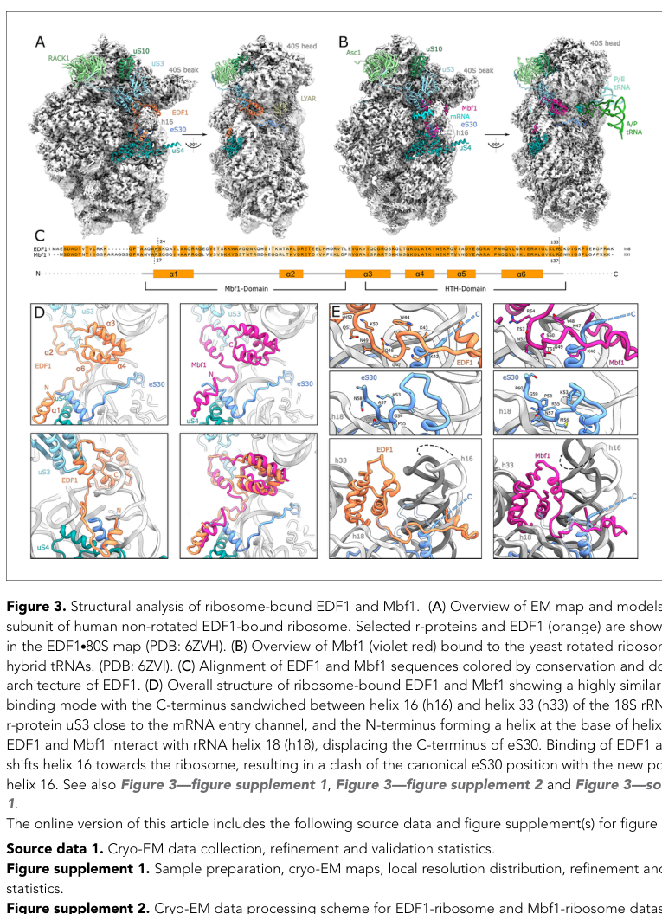

## Question

# Gene Research for Functional Annotation

## ⚠️ CRITICAL: Gene/Protein Identification Context

**BEFORE YOU BEGIN RESEARCH:** You MUST verify you are researching the CORRECT gene/protein. Gene symbols can be ambiguous, especially for less well-characterized genes from non-model organisms.

### Target Gene/Protein Identity (from UniProt):
- **UniProt Accession:** O60869
- **Protein Description:** RecName: Full=Endothelial differentiation-related factor 1; Short=EDF-1; AltName: Full=Multiprotein-bridging factor 1; Short=MBF1;
- **Gene Information:** Name=EDF1;
- **Organism (full):** Homo sapiens (Human).
- **Protein Family:** Not specified in UniProt
- **Key Domains:** Cro/C1-type_HTH. (IPR001387); Lambda_DNA-bd_dom_sf. (IPR010982); MBF1_N. (IPR013729); HTH_3 (PF01381); MBF1 (PF08523)

### MANDATORY VERIFICATION STEPS:

1. **Check if the gene symbol "EDF1" matches the protein description above**
2. **Verify the organism is correct:** Homo sapiens (Human).
3. **Check if protein family/domains align with what you find in literature**
4. **If you find literature for a DIFFERENT gene with the same or similar symbol, STOP**

### If Gene Symbol is Ambiguous or You Cannot Find Relevant Literature:

**DO NOT PROCEED WITH RESEARCH ON A DIFFERENT GENE.** Instead:
- State clearly: "The gene symbol 'EDF1' is ambiguous or literature is limited for this specific protein"
- Explain what you found (e.g., "Found extensive literature on a different gene with the same symbol in a different organism")
- Describe the protein based ONLY on the UniProt information provided above
- Suggest that the protein function can be inferred from domain/family information

### Research Target:

Please provide a comprehensive research report on the gene **EDF1** (gene ID: EDF1, UniProt: O60869) in human.

The research report should be a detailed narrative explaining the function, biological processes, and localization of the gene product. Citations should be given for all claims.

You should prioritize authoritative reviews and primary scientific literature when conducting research. You can supplement
this with annotations you find in gene/protein databases, but these can be outdated or inaccurate.

We are specifically interested in the primary function of the gene - for enzymes, what reaction is catalyzed, and what is the substrate specificity? For transporters, what is the substrate? For structural proteins or adapters, what is the broader structural role? For signaling molecules, what is the role in the pathway.

We are interested in where in or outside the cell the gene product carries out its function.

We are also interested in the signaling or biochemical pathways in which the gene functions. We are less interested in broad pleiotropic effects, except where these elucidate the precise role.

Include evidence where possible. We are interested in both experimental evidence as well as inference from structure, evolution, or bioinformatic analysis. Precise studies should be prioritized over high-throughput, where available.

## Output

Question: You are an expert researcher providing comprehensive, well-cited information.

Provide detailed information focusing on:
1. Key concepts and definitions with current understanding
2. Recent developments and latest research (prioritize 2023-2024 sources)
3. Current applications and real-world implementations
4. Expert opinions and analysis from authoritative sources
5. Relevant statistics and data from recent studies

Format as a comprehensive research report with proper citations. Include URLs and publication dates where available.
Always prioritize recent, authoritative sources and provide specific citations for all major claims.

# Gene Research for Functional Annotation

## ⚠️ CRITICAL: Gene/Protein Identification Context

**BEFORE YOU BEGIN RESEARCH:** You MUST verify you are researching the CORRECT gene/protein. Gene symbols can be ambiguous, especially for less well-characterized genes from non-model organisms.

### Target Gene/Protein Identity (from UniProt):
- **UniProt Accession:** O60869
- **Protein Description:** RecName: Full=Endothelial differentiation-related factor 1; Short=EDF-1; AltName: Full=Multiprotein-bridging factor 1; Short=MBF1;
- **Gene Information:** Name=EDF1;
- **Organism (full):** Homo sapiens (Human).
- **Protein Family:** Not specified in UniProt
- **Key Domains:** Cro/C1-type_HTH. (IPR001387); Lambda_DNA-bd_dom_sf. (IPR010982); MBF1_N. (IPR013729); HTH_3 (PF01381); MBF1 (PF08523)

### MANDATORY VERIFICATION STEPS:

1. **Check if the gene symbol "EDF1" matches the protein description above**
2. **Verify the organism is correct:** Homo sapiens (Human).
3. **Check if protein family/domains align with what you find in literature**
4. **If you find literature for a DIFFERENT gene with the same or similar symbol, STOP**

### If Gene Symbol is Ambiguous or You Cannot Find Relevant Literature:

**DO NOT PROCEED WITH RESEARCH ON A DIFFERENT GENE.** Instead:
- State clearly: "The gene symbol 'EDF1' is ambiguous or literature is limited for this specific protein"
- Explain what you found (e.g., "Found extensive literature on a different gene with the same symbol in a different organism")
- Describe the protein based ONLY on the UniProt information provided above
- Suggest that the protein function can be inferred from domain/family information

### Research Target:

Please provide a comprehensive research report on the gene **EDF1** (gene ID: EDF1, UniProt: O60869) in human.

The research report should be a detailed narrative explaining the function, biological processes, and localization of the gene product. Citations should be given for all claims.

You should prioritize authoritative reviews and primary scientific literature when conducting research. You can supplement
this with annotations you find in gene/protein databases, but these can be outdated or inaccurate.

We are specifically interested in the primary function of the gene - for enzymes, what reaction is catalyzed, and what is the substrate specificity? For transporters, what is the substrate? For structural proteins or adapters, what is the broader structural role? For signaling molecules, what is the role in the pathway.

We are interested in where in or outside the cell the gene product carries out its function.

We are also interested in the signaling or biochemical pathways in which the gene functions. We are less interested in broad pleiotropic effects, except where these elucidate the precise role.

Include evidence where possible. We are interested in both experimental evidence as well as inference from structure, evolution, or bioinformatic analysis. Precise studies should be prioritized over high-throughput, where available.

## Comprehensive research report: Human **EDF1** (UniProt **O60869**) — functional annotation

### 0) Target verification (critical disambiguation)
The literature summarized here is specifically for **human EDF1** (gene symbol **EDF1**), whose protein product is also known as **multiprotein-bridging factor 1 (MBF1)** and **endothelial differentiation-related factor 1**. A primary cloning/functional study explicitly states **human MBF1α is identical to EDF-1** and characterizes its coactivator activity (https://doi.org/10.1074/jbc.274.48.34196; published Nov 1999) (kabe1999theroleof pages 2-3, kabe1999theroleof pages 1-1). The major recent mechanistic study of ribosome collisions uses **human EDF1 (UniProt O60869)** and reports it as a **~16.4 kDa** two-domain protein (N-terminal MBF1 domain; C-terminal Cro/C1-type HTH) (https://doi.org/10.7554/eLife.58828; published Aug 2020) (sinha2020edf1coordinatescellular pages 17-19, sinha2020edf1coordinatescellular pages 10-12). These features align with the UniProt identity provided in the prompt.

### 1) Key concepts and current understanding (definitions and primary function)

#### 1.1 EDF1 as a ribosome-collision response factor (current dominant mechanistic model)
**Ribosome collisions** occur when translating ribosomes stall and are rear-ended by trailing ribosomes, forming “disomes” that trigger **ribosome-associated quality control (RQC)** and related stress signaling pathways. A central current concept is that **EDF1 functions as an early collision-associated factor (“sensor/adaptor”)** that binds a conserved site on the **40S subunit near the mRNA entry channel** at or near the collision interface and then helps coordinate downstream responses (sinha2020edf1coordinatescellular pages 1-2, sinha2020edf1coordinatescellular pages 2-4).

Experimentally, EDF1 is **robustly recruited to polysomes under collision-inducing conditions** and is **required for efficient recruitment of translational repressors** that prevent new initiation on defective mRNAs (sinha2020edf1coordinatescellular pages 19-20, sinha2020edf1coordinatescellular pages 2-4). In this model EDF1 is not an enzyme or transporter; it is a **protein–protein / protein–ribosome adaptor** that couples a physical state (ribosome collision) to signaling and translation repression.

Key partners and pathways supported by primary evidence include:
- **GIGYF2 and EIF4E2 (4EHP)**: EDF1 promotes their recruitment to collided ribosomes, initiating a negative-feedback loop that represses new rounds of initiation on problematic mRNAs (sinha2020edf1coordinatescellular pages 19-20).
- **ZNF598**: EDF1 is not required for collision-dependent ribosomal ubiquitylation, but it **facilitates** ZNF598 action and/or recruitment, since EDF1 loss reduces collision-stimulated ubiquitylation of ribosomal proteins **eS10 and uS10** and causes a modest (~10–20%) decrease in ZNF598 recruitment under collision conditions (sinha2020edf1coordinatescellular pages 9-10, sinha2020edf1coordinatescellular pages 17-19).
- **ZAKα→p38 signaling**: EDF1 depletion reduces collision-triggered p38 phosphorylation, linking EDF1 to the ribotoxic stress response arm downstream of collisions (sinha2020edf1coordinatescellular pages 9-10, sinha2020edf1coordinatescellular pages 17-19).

#### 1.2 EDF1 as a transcriptional coactivator (classical model; still relevant in specific contexts)
Historically, EDF1/MBF1 was characterized as a **transcriptional coactivator**—a “bridging factor” that can connect sequence-specific transcription factors to components of the basal transcription machinery. In vitro binding and cell-based reporter assays showed that human MBF1/EDF1 interacts with:
- **TBP (TATA-binding protein)**
- The nuclear receptor **Ad4BP/SF-1**
- bZIP/AP-1-family factors including **ATF1**, and binding was also detected with **CREB/CREBP1, c-Jun, c-Fos** (https://doi.org/10.1074/jbc.274.48.34196; Nov 1999) (kabe1999theroleof pages 1-2, kabe1999theroleof pages 5-6).

Functionally, EDF1/MBF1 increased **Ad4BP/SF-1-dependent transcription** and **ATF1-dependent transcription** in transient transfection assays; a central region (aa ~69–108) was implicated in interactions, and activation was on the order of **~3.5–4-fold** for Ad4BP/SF-1-driven transcription in the reported conditions (kabe1999theroleof pages 5-6). Importantly, subcellular localization was **regulated**: EDF1/MBF1 was primarily **cytoplasmic when expressed alone**, but coexpression with nuclear Ad4BP/SF-1 induced **nuclear accumulation**, consistent with partner-driven nuclear localization (kabe1999theroleof pages 1-1, kabe1999theroleof pages 6-7).

A modern synthesis is that EDF1 is best supported as a **cytoplasmic ribosome-collision factor** under translational stress, while also having **context-dependent nuclear/coactivator roles** supported by earlier cell-based transcription assays and by signaling-regulated translocation studies (sinha2020edf1coordinatescellular pages 17-19, mariotti2000interactionbetweenendothelial pages 2-4).

### 2) Molecular function, interactions, and subcellular localization (evidence-based)

#### 2.1 Subcellular localization: cytoplasm ↔ nucleus, and why the literature differs
Different experimental paradigms report different EDF1 localization behaviors:
- **Collision/RQC-focused work**: EDF1 is described as **largely absent from polysomes in rapidly growing cells** but **robustly recruited** to polysomes during collision induction; it binds ribosomes on the **40S mRNA entry channel** (sinha2020edf1coordinatescellular pages 17-19, sinha2020edf1coordinatescellular pages 2-4).
- **Recent ISR-focused work (2024)**: subcellular fractionation in the context of ISR induction reports that human **EDF1 “exclusively resides in the cytoplasm”** and that this does not change with stress in their tested conditions (https://doi.org/10.1016/j.molcel.2024.10.029; Dec 2024) (kim2024multiproteinbridgingfactor pages 10-11).
- **Classical transcription-coactivator literature**: EDF1/MBF1 is cytoplasmic in baseline conditions in some cell systems but can undergo **nuclear translocation** when signaling is activated (e.g., phorbol ester) or when nuclear partners are co-expressed (mariotti2000interactionbetweenendothelial pages 2-4, kabe1999theroleof pages 1-1).

These results can be reconciled by a model in which EDF1 is a **high-copy cytoplasmic factor** with a principal role at ribosomes (especially during collisions), while **regulated nuclear enrichment** can occur in certain signaling contexts and/or via binding to specific nuclear proteins (kim2024multiproteinbridgingfactor pages 10-11, mariotti2000interactionbetweenendothelial pages 2-4).

#### 2.2 Signaling-linked binding partners: calmodulin and phosphorylation
EDF1 has an experimentally supported **calmodulin (CaM) interaction** that is regulated by phosphorylation and calcium:
- EDF1 binds CaM **in vitro and in vivo**; treatment with a phorbol ester (TPA) stimulates EDF1 phosphorylation in endothelial cells, and **PKC phosphorylation prevents CaM binding**. A phosphomimetic substitution at **Thr-91 (T91→D)** disrupted CaM binding, demonstrating a mechanistic phosphorylation switch (https://doi.org/10.1074/jbc.M001928200; Aug 2000) (mariotti2000interactionbetweenendothelial pages 2-4).
- A subsequent study reports EDF1 is phosphorylated by **PKA in vitro and in vivo**, that PKA modulates EDF1/CaM interaction, and that signaling (TPA; forskolin) increases nuclear-associated EDF1, reinforcing the concept of a signaling-regulated cytosolic↔nuclear functional duality (https://doi.org/10.1007/s00018-004-4016-0; Apr 2004) (mariotti2004thedualrole pages 1-2).

### 3) Structural biology and mechanistic details (high-confidence functional inference)
A key mechanistic anchor is cryo-EM structural evidence showing EDF1 bound to the ribosome:
- Cryo-EM resolved EDF1 bound to a **non-rotated human 80S complex at 2.9 Å**, with a near-complete model spanning **Ser-24 to Arg-133** (sinha2020edf1coordinatescellular pages 10-12).
- EDF1’s **C-terminal HTH domain** is positioned between **18S rRNA helices h16 and h33**, while an N-terminal α-helix contacts the base of h16 and ribosomal proteins **uS4 and eS30**. EDF1 also engages **h18** and contacts **uS3** near the mRNA entry channel (sinha2020edf1coordinatescellular pages 10-12).
- Conserved sequence motifs (including a **KKW** motif and a **GQNKQ** motif) contribute to a “clamp/headlock” over the mRNA path, consistent with a role in stabilizing collided ribosome states and limiting frameshifting under stall/collision conditions (sinha2020edf1coordinatescellular pages 10-12).

Image evidence supporting the binding site and contacts is available from the cryo-EM figure (Figure 3) highlighting EDF1 at the 40S entry channel and showing labeled interactions with uS3/uS4/eS30 and rRNA helices h16/h18/h33 (sinha2020edf1coordinatescellular media d3d9604d).

### 4) Recent developments (prioritizing 2023–2024)

#### 4.1 2024: EDF1/Mbf1 links collided ribosomes to the integrated stress response (ISR)
A 2024 Molecular Cell paper on Mbf1 (yeast) and its human homologue EDF1 argues that EDF1 acts at collided ribosomes to promote robust ISR signaling, and reports **EDF1 is exclusively cytoplasmic** by fractionation in their system (https://doi.org/10.1016/j.molcel.2024.10.029; Dec 2024) (kim2024multiproteinbridgingfactor pages 10-11). The same work concludes that Mbf1/EDF1 plays **little to no direct role in transcriptional coactivation** of Gcn4 during ISR, reinforcing a ribosome-centric model for stress adaptation (kim2024multiproteinbridgingfactor pages 10-11).

#### 4.2 2024: EDF1 in metabolic disease-related transcriptional ribonucleoprotein complexes
A 2024 review of lncRNAs in diet-induced metabolic diseases describes a liver transcriptional complex comprising **lncRNA Blnc1 + EDF1 + LXRα**, which **induces lipogenic genes including Srebp1c**, a regulator of de novo lipogenesis and triglyceride synthesis (https://doi.org/10.3390/ijms25115678; May 2024) (brandt2024longnoncodingrnas pages 4-5, brandt2024longnoncodingrnas pages 9-10). The review further summarizes that liver-specific Blnc1 knockout reduces high-fat-diet-associated weight gain, steatosis, and insulin resistance in mice, contextualizing EDF1 as a participant in a clinically relevant metabolic gene-regulatory module (brandt2024longnoncodingrnas pages 9-10).

#### 4.3 2023–2024: EDF1 depletion observed in a ribosome-rescue genetic disease context (retinal dystrophy)
A human genetic disease study of **HBS1L deficiency** (a ribosomal rescue factor) reports that in a mouse model and patient, retinal dystrophy is associated with broad proteomic disruption and includes changes in the collision-response protein EDF1:
- In the **2024 peer-reviewed** article, **Edf1 protein was downregulated in 4-week-old Hbs1l hypomorph mouse retinas by quantitative proteomics and validated by western blot**, while at 2 weeks Edf1 appeared similar, suggesting Edf1 decrease may be secondary to photoreceptor loss or progressive proteostasis impairment (https://doi.org/10.1242/dmm.050557; Jul 2024) (luo2024hbs1ldeficiencycauses pages 8-9, luo2024hbs1ldeficiencycauses pages 4-5).
- A **2023 preprint** provides detailed quantitative statistics: TMT proteomics quantified **8114 retinal proteins** (FDR <1%), identifying **169 increased** and **480 decreased** proteins (with fold-change and p-value cutoffs); EDF1 was among decreased proteins. The same work reports retinal thinning by OCT/histology (e.g., outer retina **55.56 ± 19.77 μm vs 93.92 ± 30.72 μm**) and increased photoreceptor apoptosis at 2 weeks (**105 ± 87 vs 17 ± 3, P=0.0012**) (https://doi.org/10.1101/2023.10.18.562924; Oct 2023) (luo2023geneticdeficiencyof pages 6-8).

### 5) Current applications and real-world implementations

#### 5.1 EDF1 as a mechanistic node and potential target in translational stress/RQC
EDF1 sits at an actionable interface: it is early-recruited to collided ribosomes and promotes recruitment of translational repressors (GIGYF2/EIF4E2), suggesting that perturbing EDF1 function could modulate how cells **prioritize repression vs rescue** during translational stress (sinha2020edf1coordinatescellular pages 19-20). While direct EDF1-targeted therapies are not established in the cited sources, EDF1’s positioning upstream of translational repression and stress signaling provides a rationale for considering it in diseases with proteostasis or translational stress components.

#### 5.2 EDF1 in metabolic gene regulation via LXRα/lncRNA complexes
In liver metabolism, EDF1 is described as part of a **Blnc1–EDF1–LXRα** ribonucleoprotein transcriptional complex that drives lipogenic transcriptional programs (Srebp1c) (brandt2024longnoncodingrnas pages 4-5). This provides a concrete implementation of EDF1 as a **co-regulator in a nuclear receptor pathway** relevant to MASLD/NAFLD-like phenotypes, albeit primarily in mouse in vivo contexts summarized by review (brandt2024longnoncodingrnas pages 9-10).

#### 5.3 Clinical association and biomarker contexts
OpenTargets lists low-to-moderate evidence associations for EDF1 with broad disease categories including **neoplasm** and **neurodegenerative disease**, but these are not yet strong or specific enough in the retrieved evidence to claim EDF1 as a validated clinical biomarker or causal gene (OpenTargets Search: -EDF1). In clinical-trial-scale proteomics, the MAGMA trial demonstrates the feasibility of large plasma-proteome endpoints (7596 proteins) in a cardiovascular/metabolic population with significant imaging outcome differences; EDF1 is mentioned in the retrieved snippet set as part of the broader proteomic context but EDF1-specific quantitative changes were not available from accessible text chunks (https://doi.org/10.1161/CIRCULATIONAHA.123.067620; Aug 2024) (rajagopalan2024mineralocorticoidreceptorantagonism pages 1-3).

### 6) Expert analysis and synthesis (authoritative interpretations)
A coherent, evidence-weighted interpretation is:
1. **Highest-confidence primary function**: EDF1 is a **cytoplasmic ribosome-associated collision response factor** that binds the 40S mRNA entry channel on stalled/collided ribosomes and coordinates downstream translation repression and signaling (sinha2020edf1coordinatescellular pages 17-19, sinha2020edf1coordinatescellular pages 10-12).
2. **Mechanistic breadth**: EDF1’s binding position and recruitment behavior support a role in **collision-state stabilization**, **frameshift suppression**, and **adaptor-mediated recruitment** of repression factors (GIGYF2/EIF4E2) (sinha2020edf1coordinatescellular pages 10-12, sinha2020edf1coordinatescellular pages 19-20).
3. **Transcriptional coactivator evidence remains real but context-dependent**: older but direct experiments support TBP and transcription factor binding and reporter activation, and show partner-driven nuclear enrichment (kabe1999theroleof pages 1-2, kabe1999theroleof pages 5-6). However, newer ISR-focused work finds little direct promoter coactivation role in their tested system and reports EDF1 as exclusively cytoplasmic, suggesting the nuclear coactivator role may not be universal across stresses/cell types (kim2024multiproteinbridgingfactor pages 10-11).
4. **Signaling and shuttling**: CaM binding and phosphorylation-dependent modulation provide a plausible biochemical basis for conditional redistribution and function switching, especially in endothelial contexts (mariotti2000interactionbetweenendothelial pages 2-4, mariotti2004thedualrole pages 1-2).

### 7) Key statistics and data points (from the most relevant studies)
- **Structural resolution**: EDF1-bound human 80S cryo-EM structure at **2.9 Å**, model spanning **Ser-24 to Arg-133** (2020) (sinha2020edf1coordinatescellular pages 10-12).
- **ZNF598 recruitment effect size**: EDF1 loss caused **~10–20% decrease** in ZNF598 recruitment under collision conditions (2020) (sinha2020edf1coordinatescellular pages 9-10).
- **Transcriptional coactivation magnitude**: EDF1/MBF1 increased Ad4BP/SF-1-dependent transcription **~3.5–4-fold** in the reported assay context (1999) (kabe1999theroleof pages 5-6).
- **Retinal dystrophy proteomics (HBS1L deficiency)**: 8114 proteins quantified; **169 up** and **480 down** (FDR <1%); EDF1 among downregulated proteins (2023) (luo2023geneticdeficiencyof pages 6-8).
- **Retinal thinning (mouse model)**: outer retina **55.56 ± 19.77 μm vs 93.92 ± 30.72 μm** (mutant vs control), with extensive apoptosis at 2 weeks (**105 ± 87 vs 17 ± 3**, P=0.0012) (2023) (luo2023geneticdeficiencyof pages 6-8).
- **MAGMA trial imaging endpoints**: PWV change **7.1 ± 10.7% vs 0.87 ± 10.0% (p=0.028)**; ΔTWV **1.2 ± 1.7 cm³ vs 0.037 ± 1.9 cm³ (p=0.022)**; LV mass **+3.1 ± 8.4 g vs −5.8 ± 8.4 g (p=0.001)**; native T1 **+26.0 ± 41.9 ms vs −10.1 ± 36.3 ms (p=6.33×10⁻4)** (2024) (rajagopalan2024mineralocorticoidreceptorantagonism pages 1-3).

---

## Evidence table
The following table consolidates EDF1 functions, partners, localization, and key evidence:

| Functional role/Process | Mechanism & key partners | Subcellular location | Evidence type (assay/structure) | Key quantitative/structural details | Primary sources (with year, journal, URL) |
|---|---|---|---|---|---|
| Ribosome collision sensor/adaptor in ribosome-associated quality control | EDF1 is recruited to collided ribosomes independently of ZNF598 but promotes downstream recruitment of GIGYF2/EIF4E2 (4EHP) to repress new initiation on defective mRNAs; facilitates efficient ZNF598-dependent eS10/uS10 ubiquitylation and contributes to collision-triggered p38/ZAKα signaling; recruitment depends on RACK1. (sinha2020edf1coordinatescellular pages 9-10, sinha2020edf1coordinatescellular pages 19-20, sinha2020edf1coordinatescellular pages 1-2, sinha2020edf1coordinatescellular pages 2-4) | Predominantly cytoplasmic; accumulates on polysomes/collided ribosomes during translational distress. (sinha2020edf1coordinatescellular pages 9-10, sinha2020edf1coordinatescellular pages 17-19) | Sucrose-gradient polysome fractionation, TMT proteomics, KO/depletion, immunoblotting, cryo-EM. (sinha2020edf1coordinatescellular pages 9-10, sinha2020edf1coordinatescellular pages 10-12) | Human EDF1 is ~16.4 kDa; EDF1 loss caused a modest ~10–20% decrease in ZNF598 recruitment; cryo-EM resolved EDF1 bound to non-rotated human 80S at 2.9 Å near the 40S mRNA entry channel. (sinha2020edf1coordinatescellular pages 9-10, sinha2020edf1coordinatescellular pages 10-12) | Sinha et al. 2020, *eLife*, https://doi.org/10.7554/eLife.58828 (sinha2020edf1coordinatescellular pages 9-10, sinha2020edf1coordinatescellular pages 10-12) |
| Transcriptional coactivator bridging basal and sequence-specific transcription factors | hMBF1α is identical to EDF1 and binds TBP plus gene-specific activators including Ad4BP/SF-1 and ATF1/bZIP-family factors (ATF1, CREB/CREBP, c-Jun, c-Fos); enhances DNA binding of some partners and mediates Ad4BP/SF-1- and ATF1-dependent transcription. Nuclear accumulation is induced by coexpression with nuclear Ad4BP/SF-1. (kabe1999theroleof pages 7-8, kabe1999theroleof pages 1-2, kabe1999theroleof pages 1-1, kabe1999theroleof pages 6-7, kabe1999theroleof pages 5-6, kabe1999theroleof pages 2-3) | Cytoplasmic when expressed alone; nuclear enrichment upon interaction with nuclear partners such as Ad4BP/SF-1. (kabe1999theroleof pages 2-3, kabe1999theroleof pages 1-1, kabe1999theroleof pages 1-2) | GST pull-downs, co-immunoprecipitation, EMSA/DNA-binding assays, transient reporter assays, immunofluorescence. (kabe1999theroleof pages 7-8, kabe1999theroleof pages 2-3, kabe1999theroleof pages 1-2, kabe1999theroleof pages 5-6) | hMBF1a/b increased Ad4BP/SF-1-dependent transcription by ~3.5–4-fold; central region aa 69–108 required for interaction; basic-region contacts mapped on Ad4BP/SF-1 and bZIP factors. (kabe1999theroleof pages 5-6) | Kabe et al. 1999, *J Biol Chem*, https://doi.org/10.1074/jbc.274.48.34196 (kabe1999theroleof pages 7-8, kabe1999theroleof pages 5-6) |
| CaM-binding signaling-responsive shuttling factor | EDF1 binds calmodulin (CaM) in vitro and in vivo; PKC phosphorylation disrupts CaM binding, and PKA phosphorylation modulates EDF1/CaM interaction and correlates with signaling-dependent nuclear accumulation; native and PKC-phosphorylated EDF1 can still interact with TBP, supporting a cytosol-to-nucleus switch between CaM-associated and coactivator states. (mariotti2004thedualrole pages 1-2, mariotti2000interactionbetweenendothelial pages 2-4) | Basal distribution in cytosol and nucleus; TPA and forskolin increase nuclear-associated EDF1. (mariotti2004thedualrole pages 1-2, mariotti2000interactionbetweenendothelial pages 2-4) | In vitro/in vivo phosphorylation assays, CaM-binding assays, co-immunoprecipitation, localization studies in HUVEC/COS cells. (mariotti2004thedualrole pages 1-2, mariotti2000interactionbetweenendothelial pages 2-4) | Thr91→Asp phosphomimetic abolished CaM binding; PKC and PKA both regulate EDF1 localization/function; TPA stimulated EDF1 phosphorylation and nuclear translocation. (mariotti2004thedualrole pages 1-2, mariotti2000interactionbetweenendothelial pages 2-4) | Mariotti et al. 2000, *J Biol Chem*, https://doi.org/10.1074/jbc.M001928200; Mariotti et al. 2004, *Cell Mol Life Sci*, https://doi.org/10.1007/s00018-004-4016-0 (mariotti2004thedualrole pages 1-2, mariotti2000interactionbetweenendothelial pages 2-4) |
| Collision-coupled integrated stress response (ISR) activator / frameshift suppressor | Recent work argues EDF1/Mbf1 acts primarily at collided ribosomes, not as a direct nuclear coactivator in ISR; recruitment to collided ribosomes promotes upstream GCN2 pathway activation and eIF2α phosphorylation (shown mechanistically in yeast, inferred conserved for human EDF1), while Mbf1/EDF1 contacts rRNA, ribosomal proteins, and mRNA to prevent frameshifting. (kim2024multiproteinbridgingfactor pages 10-11) | Cytoplasmic; 2024 study reports human EDF1 “exclusively resides in the cytoplasm,” with no stress-induced relocalization detected. (kim2024multiproteinbridgingfactor pages 10-11) | Subcellular fractionation, promoter occupancy/ChIP analyses, collision/ISR assays, comparative mechanistic inference with structural data. (kim2024multiproteinbridgingfactor pages 10-11) | Yeast/human Mbf1-EDF1 present at concentrations orders of magnitude above typical transcription factors; supports stoichiometric ribosome-associated role rather than classical limiting nuclear coactivator role. (kim2024multiproteinbridgingfactor pages 10-11) | Kim et al. 2024, *Molecular Cell*, https://doi.org/10.1016/j.molcel.2024.10.029 (kim2024multiproteinbridgingfactor pages 10-11) |
| Structural basis of EDF1 domain function | EDF1 contains an N-terminal MBF1 domain and C-terminal Cro/C1-type HTH domain; on collided ribosomes, the HTH domain sits between h16 and h33, while the N-terminal helix contacts h16/uS4/eS30; EDF1 also engages h18 and uS3, consistent with UniProt domain annotation and a direct ribosome-binding mechanism. (sinha2020edf1coordinatescellular pages 17-19, sinha2020edf1coordinatescellular pages 10-12, sinha2020edf1coordinatescellular media d3d9604d) | 40S subunit mRNA entry channel on stalled/collided 80S ribosomes. (sinha2020edf1coordinatescellular pages 10-12, sinha2020edf1coordinatescellular media d3d9604d) | Cryo-EM structural modeling. (sinha2020edf1coordinatescellular pages 10-12, sinha2020edf1coordinatescellular media d3d9604d) | Near-complete human model built for Ser24–Arg133; conserved GQNKQ and KKW motifs contribute to rRNA/mRNA-path contacts; interface includes uS3, uS4, eS30 and rRNA helices h16, h18, h33. (sinha2020edf1coordinatescellular pages 10-12, sinha2020edf1coordinatescellular media d3d9604d) | Sinha et al. 2020, *eLife*, https://doi.org/10.7554/eLife.58828 (sinha2020edf1coordinatescellular pages 17-19, sinha2020edf1coordinatescellular pages 10-12, sinha2020edf1coordinatescellular media d3d9604d) |

*Table: This table consolidates the main experimentally supported functions of human EDF1/MBF1 (UniProt O60869), emphasizing both the classical transcriptional coactivator literature and the newer ribosome-collision quality-control model. It is useful for reconciling EDF1’s localization, partners, mechanisms, and strongest primary evidence.*

---

## Key figure (structural localization)
A cryo-EM figure showing EDF1 bound at the 40S mRNA entry channel with labeled interacting ribosomal proteins and rRNA helices is available (sinha2020edf1coordinatescellular media d3d9604d).

References

1. (kabe1999theroleof pages 2-3): Yasuaki Kabe, Masahide Goto, Daisuke Shima, Takeshi Imai, Tadashi Wada, Ken-ichirou Morohashi, Masahiro Shirakawa, Susumu Hirose, and Hiroshi Handa. The role of human mbf1 as a transcriptional coactivator*. The Journal of Biological Chemistry, 274:34196-34202, Nov 1999. URL: https://doi.org/10.1074/jbc.274.48.34196, doi:10.1074/jbc.274.48.34196. This article has 117 citations.

2. (kabe1999theroleof pages 1-1): Yasuaki Kabe, Masahide Goto, Daisuke Shima, Takeshi Imai, Tadashi Wada, Ken-ichirou Morohashi, Masahiro Shirakawa, Susumu Hirose, and Hiroshi Handa. The role of human mbf1 as a transcriptional coactivator*. The Journal of Biological Chemistry, 274:34196-34202, Nov 1999. URL: https://doi.org/10.1074/jbc.274.48.34196, doi:10.1074/jbc.274.48.34196. This article has 117 citations.

3. (sinha2020edf1coordinatescellular pages 17-19): Niladri K Sinha, Alban Ordureau, Katharina Best, James A Saba, Boris Zinshteyn, Elayanambi Sundaramoorthy, Amit Fulzele, Danielle M Garshott, Timo Denk, Matthias Thoms, Joao A Paulo, J Wade Harper, Eric J Bennett, Roland Beckmann, and Rachel Green. Edf1 coordinates cellular responses to ribosome collisions. eLife, Aug 2020. URL: https://doi.org/10.7554/elife.58828, doi:10.7554/elife.58828. This article has 200 citations and is from a domain leading peer-reviewed journal.

4. (sinha2020edf1coordinatescellular pages 10-12): Niladri K Sinha, Alban Ordureau, Katharina Best, James A Saba, Boris Zinshteyn, Elayanambi Sundaramoorthy, Amit Fulzele, Danielle M Garshott, Timo Denk, Matthias Thoms, Joao A Paulo, J Wade Harper, Eric J Bennett, Roland Beckmann, and Rachel Green. Edf1 coordinates cellular responses to ribosome collisions. eLife, Aug 2020. URL: https://doi.org/10.7554/elife.58828, doi:10.7554/elife.58828. This article has 200 citations and is from a domain leading peer-reviewed journal.

5. (sinha2020edf1coordinatescellular pages 1-2): Niladri K Sinha, Alban Ordureau, Katharina Best, James A Saba, Boris Zinshteyn, Elayanambi Sundaramoorthy, Amit Fulzele, Danielle M Garshott, Timo Denk, Matthias Thoms, Joao A Paulo, J Wade Harper, Eric J Bennett, Roland Beckmann, and Rachel Green. Edf1 coordinates cellular responses to ribosome collisions. eLife, Aug 2020. URL: https://doi.org/10.7554/elife.58828, doi:10.7554/elife.58828. This article has 200 citations and is from a domain leading peer-reviewed journal.

6. (sinha2020edf1coordinatescellular pages 2-4): Niladri K Sinha, Alban Ordureau, Katharina Best, James A Saba, Boris Zinshteyn, Elayanambi Sundaramoorthy, Amit Fulzele, Danielle M Garshott, Timo Denk, Matthias Thoms, Joao A Paulo, J Wade Harper, Eric J Bennett, Roland Beckmann, and Rachel Green. Edf1 coordinates cellular responses to ribosome collisions. eLife, Aug 2020. URL: https://doi.org/10.7554/elife.58828, doi:10.7554/elife.58828. This article has 200 citations and is from a domain leading peer-reviewed journal.

7. (sinha2020edf1coordinatescellular pages 19-20): Niladri K Sinha, Alban Ordureau, Katharina Best, James A Saba, Boris Zinshteyn, Elayanambi Sundaramoorthy, Amit Fulzele, Danielle M Garshott, Timo Denk, Matthias Thoms, Joao A Paulo, J Wade Harper, Eric J Bennett, Roland Beckmann, and Rachel Green. Edf1 coordinates cellular responses to ribosome collisions. eLife, Aug 2020. URL: https://doi.org/10.7554/elife.58828, doi:10.7554/elife.58828. This article has 200 citations and is from a domain leading peer-reviewed journal.

8. (sinha2020edf1coordinatescellular pages 9-10): Niladri K Sinha, Alban Ordureau, Katharina Best, James A Saba, Boris Zinshteyn, Elayanambi Sundaramoorthy, Amit Fulzele, Danielle M Garshott, Timo Denk, Matthias Thoms, Joao A Paulo, J Wade Harper, Eric J Bennett, Roland Beckmann, and Rachel Green. Edf1 coordinates cellular responses to ribosome collisions. eLife, Aug 2020. URL: https://doi.org/10.7554/elife.58828, doi:10.7554/elife.58828. This article has 200 citations and is from a domain leading peer-reviewed journal.

9. (kabe1999theroleof pages 1-2): Yasuaki Kabe, Masahide Goto, Daisuke Shima, Takeshi Imai, Tadashi Wada, Ken-ichirou Morohashi, Masahiro Shirakawa, Susumu Hirose, and Hiroshi Handa. The role of human mbf1 as a transcriptional coactivator*. The Journal of Biological Chemistry, 274:34196-34202, Nov 1999. URL: https://doi.org/10.1074/jbc.274.48.34196, doi:10.1074/jbc.274.48.34196. This article has 117 citations.

10. (kabe1999theroleof pages 5-6): Yasuaki Kabe, Masahide Goto, Daisuke Shima, Takeshi Imai, Tadashi Wada, Ken-ichirou Morohashi, Masahiro Shirakawa, Susumu Hirose, and Hiroshi Handa. The role of human mbf1 as a transcriptional coactivator*. The Journal of Biological Chemistry, 274:34196-34202, Nov 1999. URL: https://doi.org/10.1074/jbc.274.48.34196, doi:10.1074/jbc.274.48.34196. This article has 117 citations.

11. (kabe1999theroleof pages 6-7): Yasuaki Kabe, Masahide Goto, Daisuke Shima, Takeshi Imai, Tadashi Wada, Ken-ichirou Morohashi, Masahiro Shirakawa, Susumu Hirose, and Hiroshi Handa. The role of human mbf1 as a transcriptional coactivator*. The Journal of Biological Chemistry, 274:34196-34202, Nov 1999. URL: https://doi.org/10.1074/jbc.274.48.34196, doi:10.1074/jbc.274.48.34196. This article has 117 citations.

12. (mariotti2000interactionbetweenendothelial pages 2-4): Massino Mariotti, Lorenza De Benedictis, Eugenia Avon, and Jeanette A.M. Maier. Interaction between endothelial differentiation-related factor-1 and calmodulin in vitro and in vivo *. The Journal of Biological Chemistry, 275:24047-24051, Aug 2000. URL: https://doi.org/10.1074/jbc.m001928200, doi:10.1074/jbc.m001928200. This article has 57 citations.

13. (kim2024multiproteinbridgingfactor pages 10-11): Kyusik Q. Kim, Jeffrey J. Li, Ankanahalli N. Nanjaraj Urs, Miguel E. Pacheco, Victor Lasehinde, Timo Denk, Petr Tesina, Shota Tomomatsu, Yoshitaka Matsuo, Elesa McDonald, Roland Beckmann, Toshifumi Inada, Rachel Green, and Hani S. Zaher. Multiprotein bridging factor 1 is required for robust activation of the integrated stress response on collided ribosomes. Dec 2024. URL: https://doi.org/10.1016/j.molcel.2024.10.029, doi:10.1016/j.molcel.2024.10.029. This article has 13 citations and is from a highest quality peer-reviewed journal.

14. (mariotti2004thedualrole pages 1-2): M. Mariotti, L. De Benedictis, J. A. M. Maier, and E. Ballabio. The dual role of endothelial differentiation-related factor-1 in the cytosol and nucleus: modulation by protein kinase a. Cellular and Molecular Life Sciences CMLS, 61:1069-1074, Apr 2004. URL: https://doi.org/10.1007/s00018-004-4016-0, doi:10.1007/s00018-004-4016-0. This article has 38 citations.

15. (sinha2020edf1coordinatescellular media d3d9604d): Niladri K Sinha, Alban Ordureau, Katharina Best, James A Saba, Boris Zinshteyn, Elayanambi Sundaramoorthy, Amit Fulzele, Danielle M Garshott, Timo Denk, Matthias Thoms, Joao A Paulo, J Wade Harper, Eric J Bennett, Roland Beckmann, and Rachel Green. Edf1 coordinates cellular responses to ribosome collisions. eLife, Aug 2020. URL: https://doi.org/10.7554/elife.58828, doi:10.7554/elife.58828. This article has 200 citations and is from a domain leading peer-reviewed journal.

16. (brandt2024longnoncodingrnas pages 4-5): Annette Brandt and Florian Kopp. Long noncoding rnas in diet-induced metabolic diseases. International Journal of Molecular Sciences, 25:5678, May 2024. URL: https://doi.org/10.3390/ijms25115678, doi:10.3390/ijms25115678. This article has 7 citations.

17. (brandt2024longnoncodingrnas pages 9-10): Annette Brandt and Florian Kopp. Long noncoding rnas in diet-induced metabolic diseases. International Journal of Molecular Sciences, 25:5678, May 2024. URL: https://doi.org/10.3390/ijms25115678, doi:10.3390/ijms25115678. This article has 7 citations.

18. (luo2024hbs1ldeficiencycauses pages 8-9): Shiyu Luo, Bilal Alwattar, Qifei Li, Kiran Bora, Alexandra K. Blomfield, Jasmine Lin, Anne B. Fulton, Jing Chen, and Pankaj B. Agrawal. Hbs1l deficiency causes retinal dystrophy in a child and in a mouse model associated with defective development of photoreceptor cells. Disease Models &amp; Mechanisms, Jul 2024. URL: https://doi.org/10.1242/dmm.050557, doi:10.1242/dmm.050557. This article has 2 citations and is from a domain leading peer-reviewed journal.

19. (luo2024hbs1ldeficiencycauses pages 4-5): Shiyu Luo, Bilal Alwattar, Qifei Li, Kiran Bora, Alexandra K. Blomfield, Jasmine Lin, Anne B. Fulton, Jing Chen, and Pankaj B. Agrawal. Hbs1l deficiency causes retinal dystrophy in a child and in a mouse model associated with defective development of photoreceptor cells. Disease Models &amp; Mechanisms, Jul 2024. URL: https://doi.org/10.1242/dmm.050557, doi:10.1242/dmm.050557. This article has 2 citations and is from a domain leading peer-reviewed journal.

20. (luo2023geneticdeficiencyof pages 6-8): Shiyu Luo, Bilal Alwattar, Qifei Li, Kiran Bora, Alexandra K. Blomfield, Jasmine Lin, Anne B. Fulton, Jing Chen, and Pankaj B. Agrawal. Genetic deficiency of ribosomal rescue factor hbs1l causes retinal dystrophy associated with pelota and edf1 depletion. bioRxiv, Oct 2023. URL: https://doi.org/10.1101/2023.10.18.562924, doi:10.1101/2023.10.18.562924. This article has 1 citations.

21. (OpenTargets Search: -EDF1): Open Targets Query (-EDF1, 5 results). Buniello, A. et al. (2025). Open Targets Platform: facilitating therapeutic hypotheses building in drug discovery. Nucleic Acids Research.

22. (rajagopalan2024mineralocorticoidreceptorantagonism pages 1-3): Sanjay Rajagopalan, Mirela Dobre, Jean-Eudes Dazard, Armando Vergara-Martel, Kim Connelly, Michael E. Farkouh, Juan Gaztanaga, Heather Conger, Ann Dever, Laleh Razavi-Nematollahi, Anas Fares, Gabriel Pereira, Jonnelle Edwards-Glenn, Mark Cameron, Cheryl Cameron, Sadeer Al-Kindi, Robert D. Brook, Bertram Pitt, and Matthew Weir. Mineralocorticoid receptor antagonism prevents aortic plaque progression and reduces left ventricular mass and fibrosis in patients with type 2 diabetes and chronic kidney disease: the magma trial. Circulation, 150:663-676, Aug 2024. URL: https://doi.org/10.1161/circulationaha.123.067620, doi:10.1161/circulationaha.123.067620. This article has 21 citations and is from a highest quality peer-reviewed journal.

23. (kabe1999theroleof pages 7-8): Yasuaki Kabe, Masahide Goto, Daisuke Shima, Takeshi Imai, Tadashi Wada, Ken-ichirou Morohashi, Masahiro Shirakawa, Susumu Hirose, and Hiroshi Handa. The role of human mbf1 as a transcriptional coactivator*. The Journal of Biological Chemistry, 274:34196-34202, Nov 1999. URL: https://doi.org/10.1074/jbc.274.48.34196, doi:10.1074/jbc.274.48.34196. This article has 117 citations.

## Artifacts

- [Edison artifact artifact-00](EDF1-deep-research-falcon_artifacts/artifact-00.md)

## Citations

1. kabe1999theroleof pages 5-6
2. kim2024multiproteinbridgingfactor pages 10-11
3. mariotti2000interactionbetweenendothelial pages 2-4
4. mariotti2004thedualrole pages 1-2
5. brandt2024longnoncodingrnas pages 9-10
6. luo2023geneticdeficiencyof pages 6-8
7. brandt2024longnoncodingrnas pages 4-5
8. rajagopalan2024mineralocorticoidreceptorantagonism pages 1-3
9. kabe1999theroleof pages 2-3
10. kabe1999theroleof pages 1-1
11. kabe1999theroleof pages 1-2
12. kabe1999theroleof pages 6-7
13. kabe1999theroleof pages 7-8
14. https://doi.org/10.1074/jbc.274.48.34196;
15. https://doi.org/10.7554/eLife.58828;
16. https://doi.org/10.1016/j.molcel.2024.10.029;
17. https://doi.org/10.1074/jbc.M001928200;
18. https://doi.org/10.1007/s00018-004-4016-0;
19. https://doi.org/10.3390/ijms25115678;
20. https://doi.org/10.1242/dmm.050557;
21. https://doi.org/10.1101/2023.10.18.562924;
22. https://doi.org/10.1161/CIRCULATIONAHA.123.067620;
23. https://doi.org/10.7554/eLife.58828
24. https://doi.org/10.1074/jbc.274.48.34196
25. https://doi.org/10.1007/s00018-004-4016-0
26. https://doi.org/10.1016/j.molcel.2024.10.029
27. https://doi.org/10.1074/jbc.274.48.34196,
28. https://doi.org/10.7554/elife.58828,
29. https://doi.org/10.1074/jbc.m001928200,
30. https://doi.org/10.1016/j.molcel.2024.10.029,
31. https://doi.org/10.1007/s00018-004-4016-0,
32. https://doi.org/10.3390/ijms25115678,
33. https://doi.org/10.1242/dmm.050557,
34. https://doi.org/10.1101/2023.10.18.562924,
35. https://doi.org/10.1161/circulationaha.123.067620,