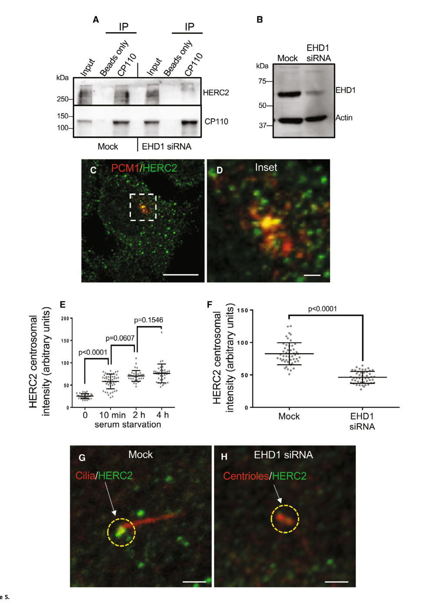

## Question

# Gene Research for Functional Annotation

## ⚠️ CRITICAL: Gene/Protein Identification Context

**BEFORE YOU BEGIN RESEARCH:** You MUST verify you are researching the CORRECT gene/protein. Gene symbols can be ambiguous, especially for less well-characterized genes from non-model organisms.

### Target Gene/Protein Identity (from UniProt):
- **UniProt Accession:** Q9H4M9
- **Protein Description:** RecName: Full=EH domain-containing protein 1 {ECO:0000312|HGNC:HGNC:3242}; AltName: Full=PAST homolog 1 {ECO:0000303|PubMed:9253601}; Short=hPAST1 {ECO:0000303|PubMed:9253601}; AltName: Full=Testilin {ECO:0000312|EMBL:AAD45866.1};
- **Gene Information:** Name=EHD1 {ECO:0000312|HGNC:HGNC:3242}; Synonyms=PAST {ECO:0000303|PubMed:9253601}, PAST1 {ECO:0000312|HGNC:HGNC:3242}; ORFNames=CDABP0131;
- **Organism (full):** Homo sapiens (Human).
- **Protein Family:** Belongs to the TRAFAC class dynamin-like GTPase
- **Key Domains:** DUF5600. (IPR040990); Dynamin_N. (IPR045063); EF-hand-dom_pair. (IPR011992); EF_Hand_1_Ca_BS. (IPR018247); EF_hand_dom. (IPR002048)

### MANDATORY VERIFICATION STEPS:

1. **Check if the gene symbol "EHD1" matches the protein description above**
2. **Verify the organism is correct:** Homo sapiens (Human).
3. **Check if protein family/domains align with what you find in literature**
4. **If you find literature for a DIFFERENT gene with the same or similar symbol, STOP**

### If Gene Symbol is Ambiguous or You Cannot Find Relevant Literature:

**DO NOT PROCEED WITH RESEARCH ON A DIFFERENT GENE.** Instead:
- State clearly: "The gene symbol 'EHD1' is ambiguous or literature is limited for this specific protein"
- Explain what you found (e.g., "Found extensive literature on a different gene with the same symbol in a different organism")
- Describe the protein based ONLY on the UniProt information provided above
- Suggest that the protein function can be inferred from domain/family information

### Research Target:

Please provide a comprehensive research report on the gene **EHD1** (gene ID: EHD1, UniProt: Q9H4M9) in human.

The research report should be a detailed narrative explaining the function, biological processes, and localization of the gene product. Citations should be given for all claims.

You should prioritize authoritative reviews and primary scientific literature when conducting research. You can supplement
this with annotations you find in gene/protein databases, but these can be outdated or inaccurate.

We are specifically interested in the primary function of the gene - for enzymes, what reaction is catalyzed, and what is the substrate specificity? For transporters, what is the substrate? For structural proteins or adapters, what is the broader structural role? For signaling molecules, what is the role in the pathway.

We are interested in where in or outside the cell the gene product carries out its function.

We are also interested in the signaling or biochemical pathways in which the gene functions. We are less interested in broad pleiotropic effects, except where these elucidate the precise role.

Include evidence where possible. We are interested in both experimental evidence as well as inference from structure, evolution, or bioinformatic analysis. Precise studies should be prioritized over high-throughput, where available.

## Output

Question: You are an expert researcher providing comprehensive, well-cited information.

Provide detailed information focusing on:
1. Key concepts and definitions with current understanding
2. Recent developments and latest research (prioritize 2023-2024 sources)
3. Current applications and real-world implementations
4. Expert opinions and analysis from authoritative sources
5. Relevant statistics and data from recent studies

Format as a comprehensive research report with proper citations. Include URLs and publication dates where available.
Always prioritize recent, authoritative sources and provide specific citations for all major claims.

# Gene Research for Functional Annotation

## ⚠️ CRITICAL: Gene/Protein Identification Context

**BEFORE YOU BEGIN RESEARCH:** You MUST verify you are researching the CORRECT gene/protein. Gene symbols can be ambiguous, especially for less well-characterized genes from non-model organisms.

### Target Gene/Protein Identity (from UniProt):
- **UniProt Accession:** Q9H4M9
- **Protein Description:** RecName: Full=EH domain-containing protein 1 {ECO:0000312|HGNC:HGNC:3242}; AltName: Full=PAST homolog 1 {ECO:0000303|PubMed:9253601}; Short=hPAST1 {ECO:0000303|PubMed:9253601}; AltName: Full=Testilin {ECO:0000312|EMBL:AAD45866.1};
- **Gene Information:** Name=EHD1 {ECO:0000312|HGNC:HGNC:3242}; Synonyms=PAST {ECO:0000303|PubMed:9253601}, PAST1 {ECO:0000312|HGNC:HGNC:3242}; ORFNames=CDABP0131;
- **Organism (full):** Homo sapiens (Human).
- **Protein Family:** Belongs to the TRAFAC class dynamin-like GTPase
- **Key Domains:** DUF5600. (IPR040990); Dynamin_N. (IPR045063); EF-hand-dom_pair. (IPR011992); EF_Hand_1_Ca_BS. (IPR018247); EF_hand_dom. (IPR002048)

### MANDATORY VERIFICATION STEPS:

1. **Check if the gene symbol "EHD1" matches the protein description above**
2. **Verify the organism is correct:** Homo sapiens (Human).
3. **Check if protein family/domains align with what you find in literature**
4. **If you find literature for a DIFFERENT gene with the same or similar symbol, STOP**

### If Gene Symbol is Ambiguous or You Cannot Find Relevant Literature:

**DO NOT PROCEED WITH RESEARCH ON A DIFFERENT GENE.** Instead:
- State clearly: "The gene symbol 'EHD1' is ambiguous or literature is limited for this specific protein"
- Explain what you found (e.g., "Found extensive literature on a different gene with the same symbol in a different organism")
- Describe the protein based ONLY on the UniProt information provided above
- Suggest that the protein function can be inferred from domain/family information

### Research Target:

Please provide a comprehensive research report on the gene **EHD1** (gene ID: EHD1, UniProt: Q9H4M9) in human.

The research report should be a detailed narrative explaining the function, biological processes, and localization of the gene product. Citations should be given for all claims.

You should prioritize authoritative reviews and primary scientific literature when conducting research. You can supplement
this with annotations you find in gene/protein databases, but these can be outdated or inaccurate.

We are specifically interested in the primary function of the gene - for enzymes, what reaction is catalyzed, and what is the substrate specificity? For transporters, what is the substrate? For structural proteins or adapters, what is the broader structural role? For signaling molecules, what is the role in the pathway.

We are interested in where in or outside the cell the gene product carries out its function.

We are also interested in the signaling or biochemical pathways in which the gene functions. We are less interested in broad pleiotropic effects, except where these elucidate the precise role.

Include evidence where possible. We are interested in both experimental evidence as well as inference from structure, evolution, or bioinformatic analysis. Precise studies should be prioritized over high-throughput, where available.

# Human EHD1: functional annotation and research report

## Identity and central conclusion

**The target is human EHD1, UniProt [Q9H4M9](https://www.uniprot.org/uniprotkb/Q9H4M9/entry), not EHD2, EHD4, or a plant or *Entamoeba* protein also called EHD1.** The supplied UniProt record names it EH domain-containing protein 1 and lists PAST, PAST1, and testilin as aliases. Mammalian EHD1 belongs to a four-member family of dynamin-related membrane-remodeling proteins, EHD1–EHD4. Although its nucleotide-binding domain resembles that of dynamin GTPases, **EHD1 is an ATPase, not a conventional GTPase**. Its best-supported primary function is to remodel and sever endosomal membrane tubules so that internalized receptors can be returned to the cell surface. It also helps organize membranes and protein delivery during early primary-cilium assembly. (grant2008mechanismsofehdrme‐1 pages 1-2, bhattacharyya2020cellularfunctionsand pages 1-2, deo2018atpdependentmembraneremodeling pages 1-2, sharma2009micall1linksehd1 pages 1-2)

## Molecular activity, domains, and substrate specificity

EHD1 has an N-terminal dynamin-related nucleotide-binding domain, intervening membrane-interacting helical regions, and a **C-terminal Eps15-homology (EH) domain**. This architecture agrees with the dynamin-like and EH/EF-hand-related domain annotations in the supplied record; an EF-hand-like annotation should not, by itself, be interpreted as proof that calcium binding is EHD1’s principal activity. The EH domain provides a means to engage protein partners bearing asparagine–proline–phenylalanine (**NPF**) motifs, including the Rab-associated endosomal scaffold MICAL-L1. EHD proteins’ G-domain fold binds adenine nucleotides rather than functioning as a dynamin-like GTPase. A nucleotide-selectivity argument based on a particular G4-region **methionine** comes from EHD2 and must not be assigned specifically to EHD1, whose corresponding residue differs. (bhattacharyya2020cellularfunctionsand pages 4-5, sharma2009micall1linksehd1 pages 1-2)

The catalyzed biochemical reaction is **ATP + H₂O → ADP + inorganic phosphate**. ATP is the nucleotide substrate; phosphatidylserine (PS)-containing, curved membranes are **binding surfaces and stimulators of ATPase activity, not substrates chemically hydrolyzed by EHD1**. With liposomes containing 40% PS, recombinant EHD1’s ATP hydrolysis increased approximately **16-fold**, to approximately **6 min⁻¹** under the reported assay conditions. ATP binding promotes membrane association; ATP hydrolysis and protein assembly remodel membrane tubes into bulges separated by thinned regions. In reconstitution, this produced fission of tubes with starting radii **below 25 nm**. Mutations affecting ATP binding or hydrolysis, membrane association, or stable membrane scaffolding impaired recycling or fission in the corresponding experimental systems. These results support a **mechanochemical membrane-fission ATPase**, rather than an ATP-dependent transporter of receptors or lipids. (deo2018atpdependentmembraneremodeling pages 1-2, deo2018atpdependentmembraneremodeling pages 10-11, deo2018atpdependentmembraneremodeling pages 4-5)

The identity of the lipid-handling enzyme is important: **ATP8A1**, a different P4-type ATPase, flips PS toward the cytosolic leaflet of recycling endosomes. This PS-enriched surface recruits EHD1. Depleting ATP8A1 displaced EHD1 from those endosomes and produced elongated, apparently fission-resistant tubules; impaired PS synthesis also prevented EHD1 membrane localization. Thus EHD1 responds to membrane lipid composition but **is not the PS flippase**. (lee2015transportthroughrecycling pages 1-2, lee2015transportthroughrecycling pages 2-3)

## Localization and trafficking pathways

**Endosomes are the principal site of the established recycling function.** EHD1 associates with tubular and vesicular membranes of the perinuclear endocytic recycling compartment and with sorting/early endosomes, while exchanging with a cytoplasmic pool. At recycling tubules, MICAL-L1 recruits EHD1 and links it to the Rab8a trafficking machinery. MICAL-L1 depletion removes both EHD1 and Rab8a from these tubules and disrupts efficient recycling. EHD1’s EH-domain interactions also connect it to Rab-associated effectors, helping position membrane remodeling within receptor-trafficking pathways rather than making EHD1 itself a Rab GTPase. Experimentally investigated recycling cargo includes transferrin and its receptor, MHC class I and integrin receptors; the evidence is for regulation of carrier production and cargo traffic, **not direct enzymatic recognition of each receptor as an EHD1 substrate**. (naslavsky2011ehdproteinskey pages 2-4, lee2015transportthroughrecycling pages 2-3, sharma2009micall1linksehd1 pages 1-2)

Recruitment is compartment-dependent. At sorting endosomes, the **distinct paralog EHD4** preferentially associates with EHD1; EHD4 depletion reduces EHD1 recruitment and enlarges sorting endosomes. Rabenosyn-5, syndapin-2, and MICAL-L1 also contribute to recruitment in this system. These findings explain why EHD1 can participate in fission at more than one endosomal stage without implying that EHD4 and EHD1 have interchangeable biochemical activities. (deo2018atpdependentmembraneremodeling pages 1-2, jones2020eps15homologydomain pages 1-2)

A second, experimentally supported trafficking context is **endosome-to-Golgi retrieval**. EHD1 associates with the retromer machinery, including VPS35/VPS26-containing complexes; EHD1 depletion destabilized sorting nexin SNX1-positive tubules and impaired retrieval of a cation-independent mannose-6-phosphate-receptor reporter. The observed retromer association did **not** require the tested VPS35 NPF motif or EHD1 EH domain, so it should not be reduced to the MICAL-L1-style NPF-binding mechanism. This retrograde role is established but is less central to the functional annotation than endosomal recycling. (gokool2007ehd1interactswith pages 1-2, gokool2007ehd1interactswith pages 5-6)

## Primary cilium assembly and signaling

A distinct EHD1 pool localizes to **preciliary membranes, the mother-centriole/basal-body region, and the ciliary pocket**. In the intracellular route to ciliogenesis, EHD1 and EHD3 help remodel smaller distal-appendage vesicles into a ciliary vesicle. EHD1-associated SNAP29 is implicated in this vesicle-assembly step; removal of the mother-centriole cap protein CP110 permits subsequent ciliary growth and the Rab11–Rabin8–Rab8 trafficking program. In human RPE-1 experiments, depletion of EHD1 or its centrosomal recruiter MICAL-L1 reduced the fraction of serum-starved cells forming a cilium from approximately **50% to 20%**. These findings place EHD1 at an **early membrane-organization step**, not as a general-purpose enzyme within the mature ciliary axoneme. (xie2023ehd1promotescp110 pages 1-2, xie2019micall1coordinatesciliogenesis pages 1-4, lu2015earlystepsin pages 1-2)

**A 2023 mechanistic advance** connected this membrane-trafficking role to mother-centriole uncapping: EHD1 supports movement of centriolar satellites bearing the E3 ligase **HERC2** toward the mother centriole. In RPE-1 cells, EHD1 depletion reduced centrosomal HERC2 and detectable HERC2–CP110 association; HERC2 depletion impeded CP110 removal and ciliogenesis. This supports a pathway from EHD1-dependent satellite delivery to **HERC2-associated CP110 ubiquitination and degradation**, rather than identifying EHD1 itself as a ubiquitin ligase. The study’s Figure 5 provides imaging and quantification of reduced centrosomal HERC2 following EHD1 depletion. [Xie, Naslavsky and Caplan, *EMBO Reports*, published online **19 April 2023**](https://doi.org/10.15252/embr.202256317). (xie2023ehd1promotescp110 pages 1-2, xie2023ehd1promotescp110 media 83bec799, xie2023ehd1promotescp110 pages 6-8)

**Signaling consequences are context-dependent.** In mouse embryonic fibroblasts, EHD1 interacted with and accompanied the Hedgehog-pathway receptor **Smoothened** during its trafficking into cilia; Ehd1-null embryos had abnormal cilia and altered Sonic hedgehog pathway readouts. This supports a role in regulating ciliary signaling through membrane organization and receptor traffic, **not direct catalysis of Hedgehog signaling**. Separately, 2024 expansion microscopy used EHD1-GFP as a ciliary-pocket reference marker alongside Numb in mouse NIH3T3 cells; that localization experiment should not be mistaken for evidence that EHD1 performs Numb’s demonstrated PTCH1-endocytosis function. (bhattacharyya2016endocyticrecyclingprotein pages 19-20, liu2024numbpositivelyregulates pages 3-5)

## Developments in 2024 and interpretation

A **November 2024** study refined how endosomal scaffolding might coordinate fission. In human-cell experiments, MICAL-L1 recruited **FCHSD2**, which supported ARP2/3-dependent branched actin, endosome fission, and transferrin/MHC-I recycling. Because MICAL-L1 also recruits EHD1, the authors propose an ordered process: **actin-assisted budding/constriction followed by EHD1-associated ATP-dependent fission**. The FCHSD2 perturbations establish the upstream actin mechanism; they do not independently visualize every proposed temporal transition or show that EHD1 itself nucleates actin. [Frisby and colleagues, *Molecular Biology of the Cell*, **1 November 2024**](https://doi.org/10.1091/mbc.e24-07-0324). (frisby2024endosomalactinbranching pages 1-3, frisby2024endosomalactinbranching pages 6-9, frisby2024endosomalactinbranching pages 9-10)

The following table consolidates the principal experiments and separates EHD1’s activity from the functions of its recruitment partners and paralogs.

| Molecular context/site | EHD1’s precise role and evidence | Key experimentally supported observation/number | Study year, DOI, and citation |
|---|---|---|---|
| Tubular recycling endosome; reconstituted anionic membrane tubes | ATP-dependent mechanochemical ATPase: ATP binding recruits EHD1, while hydrolysis promotes scaffold assembly, membrane bulging, local thinning, and fission. | With 40% phosphatidylserine liposomes, ATPase activity increased approximately 16-fold to ~6 min⁻¹; scission occurred preferentially on tubes <25 nm in radius. | Deo et al., 2018; [10.1038/s41467-018-07586-z](https://doi.org/10.1038/s41467-018-07586-z) (deo2018atpdependentmembraneremodeling pages 1-2) |
| Phosphatidylserine-rich recycling-endosome membrane | EHD1 is the recruited fission ATPase, not the lipid flippase. ATP8A1 is the P4-ATPase that translocates phosphatidylserine to the cytosolic leaflet, enabling EHD1 recruitment. | ATP8A1 depletion disrupted phosphatidylserine asymmetry, displaced EHD1, and generated elongated, apparently fission-resistant endosomal tubules; defective phosphatidylserine synthesis also abolished EHD1 membrane localization. | Lee et al., 2015; [10.15252/embj.201489703](https://doi.org/10.15252/embj.201489703) (lee2015transportthroughrecycling pages 1-2, lee2015transportthroughrecycling pages 2-3) |
| MICAL-L1-positive tubular recycling endosomes | MICAL-L1’s NPF motifs engage the EHD1 EH domain and link EHD1 with Rab8a on pre-existing membrane tubules, supporting receptor recycling. | MICAL-L1 depletion removed EHD1 and Rab8a from tubular membranes, disrupted their association, and impaired recycling. | Sharma et al., 2009; [10.1091/mbc.e09-06-0535](https://doi.org/10.1091/mbc.e09-06-0535) (sharma2009micall1linksehd1 pages 1-2) |
| Rab5-positive sorting or early endosomes | EHD4 preferentially dimerizes with EHD1 and is required to recruit EHD1 into an endosomal fission complex; Rabenosyn-5, Syndapin2, and MICAL-L1 also contribute. | EHD4 depletion by siRNA, shRNA, or CRISPR impaired EHD1 recruitment and enlarged sorting endosomes, consistent with defective fission. | Jones et al., 2020; [10.1371/journal.pone.0239657](https://doi.org/10.1371/journal.pone.0239657) (jones2020eps15homologydomain pages 1-2) |
| Nascent cilium and mother centriole in human RPE-1 cells | Centrosome-anchored MICAL-L1 recruits EHD1; EHD1 interacts with SNAP29 to support preciliary-vesicle fusion and promotes CP110 removal before axoneme extension. | EHD1 or MICAL-L1 depletion reduced serum-starvation-induced ciliogenesis from ~50% to ~20%; MICAL-L1 loss prevented basal-body localization of EHD1 and CP110 removal. | Xie et al., 2019; [10.1242/jcs.233973](https://doi.org/10.1242/jcs.233973) (xie2019micall1coordinatesciliogenesis pages 1-4) |
| Centriolar satellites and mother centriole in human RPE-1 cells | EHD1 promotes movement of HERC2-bearing centriolar satellites to the mother centriole, facilitating CP110 ubiquitination, degradation, and ciliogenesis. | EHD1 depletion abolished detectable CP110–HERC2 co-immunoprecipitation and significantly reduced centrosomal HERC2; HERC2 depletion impaired CP110 removal and primary-cilium formation. | Xie et al., 2023; [10.15252/embr.202256317](https://doi.org/10.15252/embr.202256317) (xie2023ehd1promotescp110 pages 6-8, xie2023ehd1promotescp110 pages 1-2, xie2023ehd1promotescp110 media 83bec799) |
| MICAL-L1-positive endosomal fission sites | Current model: MICAL-L1 first recruits FCHSD2 for ARP2/3-mediated actin branching and constriction, then recruits EHD1 for the later ATP-hydrolysis-dependent fission step. The temporal ordering is a supported model rather than direct visualization of every transition. | FCHSD2 loss reduced branched actin, enlarged tubular endosomes, and delayed transferrin and MHC-I recycling; wild-type FCHSD2 substantially rescued these phenotypes. | Frisby et al., 2024; [10.1091/mbc.e24-07-0324](https://doi.org/10.1091/mbc.e24-07-0324) (frisby2024endosomalactinbranching pages 1-3, frisby2024endosomalactinbranching pages 6-9, frisby2024endosomalactinbranching pages 9-10) |
| Human proximal renal tubule and inner ear | Homozygous EHD1 p.R398W causes an autosomal-recessive syndrome involving defective proximal-tubular receptor-mediated endocytosis and sensorineural hearing loss. | Six patients, ages 5–33 years, had predominantly low-molecular-weight proteinuria of 0.7–2.1 g/day and high-frequency hearing impairment. Direct full-text extraction was unavailable; details derive from the original abstract and later recapitulations. Male infertility was demonstrated in knock-in and knockout mice, not established in affected humans. | Issler et al., 2022, [10.1681/ASN.2021101312](https://doi.org/10.1681/ASN.2021101312); Meindl et al., 2023, [10.3389/fcell.2023.1240558](https://doi.org/10.3389/fcell.2023.1240558); Sakakibara and Nozu, 2025, [10.1007/s00467-025-06745-x](https://doi.org/10.1007/s00467-025-06745-x) (meindl2023amissensemutation pages 1-2, sakakibara2025tubularproteinuriadue pages 2-5) |

*Table: Key biochemical, trafficking, ciliogenesis, and clinical evidence for human EHD1, with quantitative findings and source limitations. The table distinguishes direct EHD1 observations from upstream factors, paralog-dependent mechanisms, and mouse-only phenotypes.*

## Human genetics and real-world relevance

**Clinical evidence strengthens the endocytic-trafficking annotation.** A 2022 report identified **six people, ages 5–33 years**, homozygous for **EHD1 c.1192C>T (p.R398W)**, with high-frequency sensorineural hearing impairment and predominantly low-molecular-weight proteinuria reported at **0.7–2.1 g/day**. The renal pattern is consistent with defective receptor-mediated protein reabsorption in proximal tubules. Knock-in and knockout animal models also showed defective proximal-tubule uptake and hearing abnormalities; notably, obvious cilia defects were **not** found in the examined patients’ kidneys or corresponding mouse models. These observations caution against treating *all* EHD1-dependent disease as a ciliogenesis defect. The patient numbers, ages, and measurements are reported in the original article’s available abstract; its retrieved full-text file was mismatched, so the clinical details were cross-checked against later literature rather than represented as independently re-extracted from its full text. [Issler and colleagues, *Journal of the American Society of Nephrology*, **2022**](https://doi.org/10.1681/ASN.2021101312). (meindl2023amissensemutation pages 1-2, sakakibara2025tubularproteinuriadue pages 2-5)

In a **2023** study of the corresponding **mouse** p.R398W knock-in, homozygous males were infertile and showed disrupted spermatid/acrosome development, while much of the sperm-tail axoneme remained intact. This implicates EHD1-dependent membrane or organelle trafficking during mouse spermiogenesis; **human male infertility has not thereby been established**. [Meindl and colleagues, *Frontiers in Cell and Developmental Biology*, **October 2023**](https://doi.org/10.3389/fcell.2023.1240558). (meindl2023amissensemutation pages 15-16, meindl2023amissensemutation pages 1-2, meindl2023amissensemutation pages 12-13)

The immediately supported application is **functional interpretation of rare EHD1 variants**, particularly when tubular proteinuria accompanies hearing loss, and use of ATPase, endosomal-fission, and ciliogenesis assays to investigate mechanism—not an established EHD1-directed therapy. A **July 2024** small-molecule screening study targeted **EHD4’s**, not EHD1’s, liposome-stimulated ATPase; its inhibitor cannot be described as a validated EHD1-specific drug. [Mohd and colleagues, *PLOS ONE*, **29 July 2024**](https://doi.org/10.1371/journal.pone.0302704). (mohd2024identificationofdruglike pages 1-2, mohd2024identificationofdruglike pages 15-16)

**Overall assessment:** Human EHD1 is best annotated as an **ATP-driven, lipid- and partner-recruited membrane-remodeling/fission protein** acting chiefly on the cytosolic face of endosomal recycling membranes, with additional localized functions at sorting endosomes, retromer-associated tubules, and preciliary/basal-body membranes. Its substrate specificity is for **ATP as a nucleotide**, while membrane curvature, anionic lipids, and EH-domain binding partners specify *where* and *when* its mechanical activity is deployed. Clinical genetics confirms that this trafficking function matters in human renal tubules and the inner ear, but the molecular lesion linking individual EHD1 variants to every tissue phenotype remains incompletely resolved. (deo2018atpdependentmembraneremodeling pages 1-2, lee2015transportthroughrecycling pages 1-2, sharma2009micall1linksehd1 pages 1-2, sakakibara2025tubularproteinuriadue pages 2-5, frisby2024endosomalactinbranching pages 1-3)

References

1. (grant2008mechanismsofehdrme‐1 pages 1-2): Barth D. Grant and Steve Caplan. Mechanisms of ehd/rme‐1 protein function in endocytic transport. Traffic, 9:2043-2052, Dec 2008. URL: https://doi.org/10.1111/j.1600-0854.2008.00834.x, doi:10.1111/j.1600-0854.2008.00834.x. This article has 193 citations and is from a peer-reviewed journal.

2. (bhattacharyya2020cellularfunctionsand pages 1-2): Soumya Bhattacharyya and Thomas J. Pucadyil. Cellular functions and intrinsic attributes of the <scp>atp</scp>‐binding eps15 homology domain‐containing proteins. Apr 2020. URL: https://doi.org/10.1002/pro.3860, doi:10.1002/pro.3860. This article has 13 citations and is from a peer-reviewed journal.

3. (deo2018atpdependentmembraneremodeling pages 1-2): Raunaq Deo, Manish S. Kushwah, Sukrut C. Kamerkar, Nagesh Y. Kadam, Srishti Dar, Kavita Babu, Anand Srivastava, and Thomas J. Pucadyil. Atp-dependent membrane remodeling links ehd1 functions to endocytic recycling. Nature Communications, Dec 2018. URL: https://doi.org/10.1038/s41467-018-07586-z, doi:10.1038/s41467-018-07586-z. This article has 79 citations and is from a highest quality peer-reviewed journal.

4. (sharma2009micall1linksehd1 pages 1-2): Mahak Sharma, Sai Srinivas Panapakkam Giridharan, Juliati Rahajeng, Naava Naslavsky, and Steve Caplan. Mical-l1 links ehd1 to tubular recycling endosomes and regulates receptor recycling. Molecular biology of the cell, 20 24:5181-94, Dec 2009. URL: https://doi.org/10.1091/mbc.e09-06-0535, doi:10.1091/mbc.e09-06-0535. This article has 217 citations and is from a domain leading peer-reviewed journal.

5. (bhattacharyya2020cellularfunctionsand pages 4-5): Soumya Bhattacharyya and Thomas J. Pucadyil. Cellular functions and intrinsic attributes of the <scp>atp</scp>‐binding eps15 homology domain‐containing proteins. Apr 2020. URL: https://doi.org/10.1002/pro.3860, doi:10.1002/pro.3860. This article has 13 citations and is from a peer-reviewed journal.

6. (deo2018atpdependentmembraneremodeling pages 10-11): Raunaq Deo, Manish S. Kushwah, Sukrut C. Kamerkar, Nagesh Y. Kadam, Srishti Dar, Kavita Babu, Anand Srivastava, and Thomas J. Pucadyil. Atp-dependent membrane remodeling links ehd1 functions to endocytic recycling. Nature Communications, Dec 2018. URL: https://doi.org/10.1038/s41467-018-07586-z, doi:10.1038/s41467-018-07586-z. This article has 79 citations and is from a highest quality peer-reviewed journal.

7. (deo2018atpdependentmembraneremodeling pages 4-5): Raunaq Deo, Manish S. Kushwah, Sukrut C. Kamerkar, Nagesh Y. Kadam, Srishti Dar, Kavita Babu, Anand Srivastava, and Thomas J. Pucadyil. Atp-dependent membrane remodeling links ehd1 functions to endocytic recycling. Nature Communications, Dec 2018. URL: https://doi.org/10.1038/s41467-018-07586-z, doi:10.1038/s41467-018-07586-z. This article has 79 citations and is from a highest quality peer-reviewed journal.

8. (lee2015transportthroughrecycling pages 1-2): Shoken Lee, Yasunori Uchida, Jiao Wang, Tatsuyuki Matsudaira, Takatoshi Nakagawa, Takuma Kishimoto, Kojiro Mukai, Takehiko Inaba, Toshihide Kobayashi, Robert S Molday, Tomohiko Taguchi, and Hiroyuki Arai. Transport through recycling endosomes requires ehd1 recruitment by a phosphatidylserine translocase. The EMBO Journal, 34:669-688, Jan 2015. URL: https://doi.org/10.15252/embj.201489703, doi:10.15252/embj.201489703. This article has 160 citations.

9. (lee2015transportthroughrecycling pages 2-3): Shoken Lee, Yasunori Uchida, Jiao Wang, Tatsuyuki Matsudaira, Takatoshi Nakagawa, Takuma Kishimoto, Kojiro Mukai, Takehiko Inaba, Toshihide Kobayashi, Robert S Molday, Tomohiko Taguchi, and Hiroyuki Arai. Transport through recycling endosomes requires ehd1 recruitment by a phosphatidylserine translocase. The EMBO Journal, 34:669-688, Jan 2015. URL: https://doi.org/10.15252/embj.201489703, doi:10.15252/embj.201489703. This article has 160 citations.

10. (naslavsky2011ehdproteinskey pages 2-4): Naava Naslavsky and Steve Caplan. Ehd proteins: key conductors of endocytic transport. Trends in cell biology, 21 2:122-31, Feb 2011. URL: https://doi.org/10.1016/j.tcb.2010.10.003, doi:10.1016/j.tcb.2010.10.003. This article has 297 citations and is from a domain leading peer-reviewed journal.

11. (jones2020eps15homologydomain pages 1-2): Tyler Jones, Naava Naslavsky, and Steve Caplan. Eps15 homology domain protein 4 (ehd4) is required for eps15 homology domain protein 1 (ehd1)-mediated endosomal recruitment and fission. PLoS ONE, 15:e0239657, Sep 2020. URL: https://doi.org/10.1371/journal.pone.0239657, doi:10.1371/journal.pone.0239657. This article has 27 citations and is from a peer-reviewed journal.

12. (gokool2007ehd1interactswith pages 1-2): Suzanne Gokool, Daniel Tattersall, and Matthew N. J. Seaman. Ehd1 interacts with retromer to stabilize snx1 tubules and facilitate endosome‐to‐golgi retrieval. Traffic, 8:1873-1886, Dec 2007. URL: https://doi.org/10.1111/j.1600-0854.2007.00652.x, doi:10.1111/j.1600-0854.2007.00652.x. This article has 158 citations and is from a peer-reviewed journal.

13. (gokool2007ehd1interactswith pages 5-6): Suzanne Gokool, Daniel Tattersall, and Matthew N. J. Seaman. Ehd1 interacts with retromer to stabilize snx1 tubules and facilitate endosome‐to‐golgi retrieval. Traffic, 8:1873-1886, Dec 2007. URL: https://doi.org/10.1111/j.1600-0854.2007.00652.x, doi:10.1111/j.1600-0854.2007.00652.x. This article has 158 citations and is from a peer-reviewed journal.

14. (xie2023ehd1promotescp110 pages 1-2): Shuwei Xie, Naava Naslavsky, and Steve Caplan. Ehd1 promotes cp110 ubiquitination by centriolar satellite delivery of herc2 to the mother centriole. EMBO Reports, Apr 2023. URL: https://doi.org/10.15252/embr.202256317, doi:10.15252/embr.202256317. This article has 22 citations and is from a highest quality peer-reviewed journal.

15. (xie2019micall1coordinatesciliogenesis pages 1-4): Shuwei Xie, Trey Farmer, Naava Naslavsky, and Steve Caplan. Mical-l1 coordinates ciliogenesis by recruiting ehd1 to the primary cilium. Journal of Cell Science, Nov 2019. URL: https://doi.org/10.1242/jcs.233973, doi:10.1242/jcs.233973. This article has 36 citations and is from a domain leading peer-reviewed journal.

16. (lu2015earlystepsin pages 1-2): Quanlong Lu, Christine Insinna, Carolyn Ott, Jimmy Stauffer, Petra A. Pintado, Juliati Rahajeng, Ulrich Baxa, Vijay Walia, Adrian Cuenca, Yoo-Seok Hwang, Ira O. Daar, Susana Lopes, Jennifer Lippincott-Schwartz, Peter K. Jackson, Steve Caplan, and Christopher J. Westlake. Early steps in primary cilium assembly require ehd1/ehd3-dependent ciliary vesicle formation. Feb 2015. URL: https://doi.org/10.1038/ncb3109, doi:10.1038/ncb3109. This article has 403 citations and is from a highest quality peer-reviewed journal.

17. (xie2023ehd1promotescp110 media 83bec799): Shuwei Xie, Naava Naslavsky, and Steve Caplan. Ehd1 promotes cp110 ubiquitination by centriolar satellite delivery of herc2 to the mother centriole. EMBO Reports, Apr 2023. URL: https://doi.org/10.15252/embr.202256317, doi:10.15252/embr.202256317. This article has 22 citations and is from a highest quality peer-reviewed journal.

18. (xie2023ehd1promotescp110 pages 6-8): Shuwei Xie, Naava Naslavsky, and Steve Caplan. Ehd1 promotes cp110 ubiquitination by centriolar satellite delivery of herc2 to the mother centriole. EMBO Reports, Apr 2023. URL: https://doi.org/10.15252/embr.202256317, doi:10.15252/embr.202256317. This article has 22 citations and is from a highest quality peer-reviewed journal.

19. (bhattacharyya2016endocyticrecyclingprotein pages 19-20): Sohinee Bhattacharyya, Mark A Rainey, Priyanka Arya, Bhopal C. Mohapatra, Insha Mushtaq, Samikshan Dutta, Manju George, Matthew D. Storck, Rodney D. McComb, David Muirhead, Gordon L. Todd, Karen Gould, Kaustubh Datta, Janee Gelineau-van Waes, Vimla Band, and Hamid Band. Endocytic recycling protein ehd1 regulates primary cilia morphogenesis and shh signaling during neural tube development. Scientific Reports, Feb 2016. URL: https://doi.org/10.1038/srep20727, doi:10.1038/srep20727. This article has 45 citations and is from a peer-reviewed journal.

20. (liu2024numbpositivelyregulates pages 3-5): Xiaoliang Liu, Patricia T. Yam, Sabrina Schlienger, Eva Cai, Jingyi Zhang, Wei-Ju Chen, Oscar Torres Gutierrez, Vanesa Jimenez Amilburu, Vasanth Ramamurthy, Alice Y. Ting, Tess C. Branon, Michel Cayouette, Risako Gen, Tessa Marks, Jennifer H. Kong, Frédéric Charron, and Xuecai Ge. Numb positively regulates hedgehog signaling at the ciliary pocket. Nature Communications, Apr 2024. URL: https://doi.org/10.1038/s41467-024-47244-1, doi:10.1038/s41467-024-47244-1. This article has 38 citations and is from a highest quality peer-reviewed journal.

21. (frisby2024endosomalactinbranching pages 1-3): Devin Frisby, Ajay B. Murakonda, Bazella Ashraf, Kanika Dhawan, Leonardo Almeida-Souza, Naava Naslavsky, and Steve Caplan. Endosomal actin branching, fission, and receptor recycling require fchsd2 recruitment by mical-l1. Molecular Biology of the Cell, Nov 2024. URL: https://doi.org/10.1091/mbc.e24-07-0324, doi:10.1091/mbc.e24-07-0324. This article has 0 citations and is from a domain leading peer-reviewed journal.

22. (frisby2024endosomalactinbranching pages 6-9): Devin Frisby, Ajay B. Murakonda, Bazella Ashraf, Kanika Dhawan, Leonardo Almeida-Souza, Naava Naslavsky, and Steve Caplan. Endosomal actin branching, fission, and receptor recycling require fchsd2 recruitment by mical-l1. Molecular Biology of the Cell, Nov 2024. URL: https://doi.org/10.1091/mbc.e24-07-0324, doi:10.1091/mbc.e24-07-0324. This article has 0 citations and is from a domain leading peer-reviewed journal.

23. (frisby2024endosomalactinbranching pages 9-10): Devin Frisby, Ajay B. Murakonda, Bazella Ashraf, Kanika Dhawan, Leonardo Almeida-Souza, Naava Naslavsky, and Steve Caplan. Endosomal actin branching, fission, and receptor recycling require fchsd2 recruitment by mical-l1. Molecular Biology of the Cell, Nov 2024. URL: https://doi.org/10.1091/mbc.e24-07-0324, doi:10.1091/mbc.e24-07-0324. This article has 0 citations and is from a domain leading peer-reviewed journal.

24. (meindl2023amissensemutation pages 1-2): Katrin Meindl, Naomi Issler, Sara Afonso, Alberto Cebrian-Serrano, Karin Müller, Christina Sterner, Helga Othmen, Ines Tegtmeier, Ralph Witzgall, Enriko Klootwijk, Benjamin Davies, Robert Kleta, and Richard Warth. A missense mutation in ehd1 associated with defective spermatogenesis and male infertility. Frontiers in Cell and Developmental Biology, Oct 2023. URL: https://doi.org/10.3389/fcell.2023.1240558, doi:10.3389/fcell.2023.1240558. This article has 5 citations.

25. (sakakibara2025tubularproteinuriadue pages 2-5): Nana Sakakibara and Kandai Nozu. Tubular proteinuria due to hereditary endocytic receptor disorder of the proximal tubule: dent disease and chronic benign proteinuria. Pediatric nephrology, Mar 2025. URL: https://doi.org/10.1007/s00467-025-06745-x, doi:10.1007/s00467-025-06745-x. This article has 10 citations and is from a domain leading peer-reviewed journal.

26. (meindl2023amissensemutation pages 15-16): Katrin Meindl, Naomi Issler, Sara Afonso, Alberto Cebrian-Serrano, Karin Müller, Christina Sterner, Helga Othmen, Ines Tegtmeier, Ralph Witzgall, Enriko Klootwijk, Benjamin Davies, Robert Kleta, and Richard Warth. A missense mutation in ehd1 associated with defective spermatogenesis and male infertility. Frontiers in Cell and Developmental Biology, Oct 2023. URL: https://doi.org/10.3389/fcell.2023.1240558, doi:10.3389/fcell.2023.1240558. This article has 5 citations.

27. (meindl2023amissensemutation pages 12-13): Katrin Meindl, Naomi Issler, Sara Afonso, Alberto Cebrian-Serrano, Karin Müller, Christina Sterner, Helga Othmen, Ines Tegtmeier, Ralph Witzgall, Enriko Klootwijk, Benjamin Davies, Robert Kleta, and Richard Warth. A missense mutation in ehd1 associated with defective spermatogenesis and male infertility. Frontiers in Cell and Developmental Biology, Oct 2023. URL: https://doi.org/10.3389/fcell.2023.1240558, doi:10.3389/fcell.2023.1240558. This article has 5 citations.

28. (mohd2024identificationofdruglike pages 1-2): Saif Mohd, Andreas Oder, Edgar Specker, Martin Neuenschwander, Jens Peter Von Kries, and Oliver Daumke. Identification of drug-like molecules targeting the atpase activity of dynamin-like ehd4. Jul 2024. URL: https://doi.org/10.1371/journal.pone.0302704, doi:10.1371/journal.pone.0302704. This article has 2 citations and is from a peer-reviewed journal.

29. (mohd2024identificationofdruglike pages 15-16): Saif Mohd, Andreas Oder, Edgar Specker, Martin Neuenschwander, Jens Peter Von Kries, and Oliver Daumke. Identification of drug-like molecules targeting the atpase activity of dynamin-like ehd4. Jul 2024. URL: https://doi.org/10.1371/journal.pone.0302704, doi:10.1371/journal.pone.0302704. This article has 2 citations and is from a peer-reviewed journal.

## Artifacts

- [Edison artifact artifact-00](EHD1-deep-research-falcon_artifacts/artifact-00.md)

## Citations

1. deo2018atpdependentmembraneremodeling pages 1-2
2. bhattacharyya2020cellularfunctionsand pages 1-2
3. bhattacharyya2020cellularfunctionsand pages 4-5
4. deo2018atpdependentmembraneremodeling pages 10-11
5. deo2018atpdependentmembraneremodeling pages 4-5
6. lee2015transportthroughrecycling pages 1-2
7. lee2015transportthroughrecycling pages 2-3
8. naslavsky2011ehdproteinskey pages 2-4
9. lu2015earlystepsin pages 1-2
10. bhattacharyya2016endocyticrecyclingprotein pages 19-20
11. liu2024numbpositivelyregulates pages 3-5
12. frisby2024endosomalactinbranching pages 1-3
13. frisby2024endosomalactinbranching pages 6-9
14. frisby2024endosomalactinbranching pages 9-10
15. meindl2023amissensemutation pages 1-2
16. sakakibara2025tubularproteinuriadue pages 2-5
17. meindl2023amissensemutation pages 15-16
18. meindl2023amissensemutation pages 12-13
19. mohd2024identificationofdruglike pages 1-2
20. mohd2024identificationofdruglike pages 15-16
21. Q9H4M9
22. Xie, Naslavsky and Caplan, *EMBO Reports*, published online **19 April 2023**
23. Frisby and colleagues, *Molecular Biology of the Cell*, **1 November 2024**
24. 10.1038/s41467-018-07586-z
25. 10.15252/embj.201489703
26. 10.1091/mbc.e09-06-0535
27. 10.1371/journal.pone.0239657
28. 10.1242/jcs.233973
29. 10.15252/embr.202256317
30. 10.1091/mbc.e24-07-0324
31. 10.1681/ASN.2021101312
32. 10.3389/fcell.2023.1240558
33. 10.1007/s00467-025-06745-x
34. Issler and colleagues, *Journal of the American Society of Nephrology*, **2022**
35. Meindl and colleagues, *Frontiers in Cell and Developmental Biology*, **October 2023**
36. Mohd and colleagues, *PLOS ONE*, **29 July 2024**
37. https://www.uniprot.org/uniprotkb/Q9H4M9/entry
38. https://doi.org/10.15252/embr.202256317
39. https://doi.org/10.1091/mbc.e24-07-0324
40. https://doi.org/10.1038/s41467-018-07586-z
41. https://doi.org/10.15252/embj.201489703
42. https://doi.org/10.1091/mbc.e09-06-0535
43. https://doi.org/10.1371/journal.pone.0239657
44. https://doi.org/10.1242/jcs.233973
45. https://doi.org/10.1681/ASN.2021101312
46. https://doi.org/10.3389/fcell.2023.1240558
47. https://doi.org/10.1007/s00467-025-06745-x
48. https://doi.org/10.1371/journal.pone.0302704
49. https://doi.org/10.1111/j.1600-0854.2008.00834.x,
50. https://doi.org/10.1002/pro.3860,
51. https://doi.org/10.1038/s41467-018-07586-z,
52. https://doi.org/10.1091/mbc.e09-06-0535,
53. https://doi.org/10.15252/embj.201489703,
54. https://doi.org/10.1016/j.tcb.2010.10.003,
55. https://doi.org/10.1371/journal.pone.0239657,
56. https://doi.org/10.1111/j.1600-0854.2007.00652.x,
57. https://doi.org/10.15252/embr.202256317,
58. https://doi.org/10.1242/jcs.233973,
59. https://doi.org/10.1038/ncb3109,
60. https://doi.org/10.1038/srep20727,
61. https://doi.org/10.1038/s41467-024-47244-1,
62. https://doi.org/10.1091/mbc.e24-07-0324,
63. https://doi.org/10.3389/fcell.2023.1240558,
64. https://doi.org/10.1007/s00467-025-06745-x,
65. https://doi.org/10.1371/journal.pone.0302704,