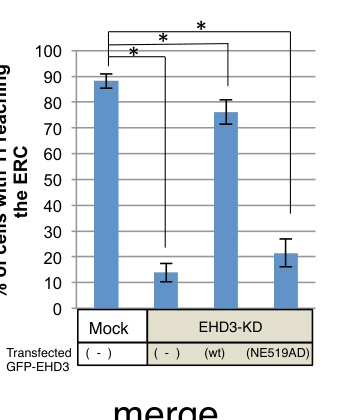

## Question

# Gene Research for Functional Annotation

## ⚠️ CRITICAL: Gene/Protein Identification Context

**BEFORE YOU BEGIN RESEARCH:** You MUST verify you are researching the CORRECT gene/protein. Gene symbols can be ambiguous, especially for less well-characterized genes from non-model organisms.

### Target Gene/Protein Identity (from UniProt):
- **UniProt Accession:** Q9NZN3
- **Protein Description:** RecName: Full=EH domain-containing protein 3 {ECO:0000305}; AltName: Full=PAST homolog 3 {ECO:0000305};
- **Gene Information:** Name=EHD3 {ECO:0000312|HGNC:HGNC:3244}; Synonyms=EHD2 {ECO:0000303|PubMed:10673336}, PAST3 {ECO:0000312|HGNC:HGNC:3244};
- **Organism (full):** Homo sapiens (Human).
- **Protein Family:** Belongs to the TRAFAC class dynamin-like GTPase
- **Key Domains:** DUF5600. (IPR040990); Dynamin_N. (IPR045063); EF-hand-dom_pair. (IPR011992); EF_Hand_1_Ca_BS. (IPR018247); EF_hand_dom. (IPR002048)

### MANDATORY VERIFICATION STEPS:

1. **Check if the gene symbol "EHD3" matches the protein description above**
2. **Verify the organism is correct:** Homo sapiens (Human).
3. **Check if protein family/domains align with what you find in literature**
4. **If you find literature for a DIFFERENT gene with the same or similar symbol, STOP**

### If Gene Symbol is Ambiguous or You Cannot Find Relevant Literature:

**DO NOT PROCEED WITH RESEARCH ON A DIFFERENT GENE.** Instead:
- State clearly: "The gene symbol 'EHD3' is ambiguous or literature is limited for this specific protein"
- Explain what you found (e.g., "Found extensive literature on a different gene with the same symbol in a different organism")
- Describe the protein based ONLY on the UniProt information provided above
- Suggest that the protein function can be inferred from domain/family information

### Research Target:

Please provide a comprehensive research report on the gene **EHD3** (gene ID: EHD3, UniProt: Q9NZN3) in human.

The research report should be a detailed narrative explaining the function, biological processes, and localization of the gene product. Citations should be given for all claims.

You should prioritize authoritative reviews and primary scientific literature when conducting research. You can supplement
this with annotations you find in gene/protein databases, but these can be outdated or inaccurate.

We are specifically interested in the primary function of the gene - for enzymes, what reaction is catalyzed, and what is the substrate specificity? For transporters, what is the substrate? For structural proteins or adapters, what is the broader structural role? For signaling molecules, what is the role in the pathway.

We are interested in where in or outside the cell the gene product carries out its function.

We are also interested in the signaling or biochemical pathways in which the gene functions. We are less interested in broad pleiotropic effects, except where these elucidate the precise role.

Include evidence where possible. We are interested in both experimental evidence as well as inference from structure, evolution, or bioinformatic analysis. Precise studies should be prioritized over high-throughput, where available.

## Output

Question: You are an expert researcher providing comprehensive, well-cited information.

Provide detailed information focusing on:
1. Key concepts and definitions with current understanding
2. Recent developments and latest research (prioritize 2023-2024 sources)
3. Current applications and real-world implementations
4. Expert opinions and analysis from authoritative sources
5. Relevant statistics and data from recent studies

Format as a comprehensive research report with proper citations. Include URLs and publication dates where available.
Always prioritize recent, authoritative sources and provide specific citations for all major claims.

# Gene Research for Functional Annotation

## ⚠️ CRITICAL: Gene/Protein Identification Context

**BEFORE YOU BEGIN RESEARCH:** You MUST verify you are researching the CORRECT gene/protein. Gene symbols can be ambiguous, especially for less well-characterized genes from non-model organisms.

### Target Gene/Protein Identity (from UniProt):
- **UniProt Accession:** Q9NZN3
- **Protein Description:** RecName: Full=EH domain-containing protein 3 {ECO:0000305}; AltName: Full=PAST homolog 3 {ECO:0000305};
- **Gene Information:** Name=EHD3 {ECO:0000312|HGNC:HGNC:3244}; Synonyms=EHD2 {ECO:0000303|PubMed:10673336}, PAST3 {ECO:0000312|HGNC:HGNC:3244};
- **Organism (full):** Homo sapiens (Human).
- **Protein Family:** Belongs to the TRAFAC class dynamin-like GTPase
- **Key Domains:** DUF5600. (IPR040990); Dynamin_N. (IPR045063); EF-hand-dom_pair. (IPR011992); EF_Hand_1_Ca_BS. (IPR018247); EF_hand_dom. (IPR002048)

### MANDATORY VERIFICATION STEPS:

1. **Check if the gene symbol "EHD3" matches the protein description above**
2. **Verify the organism is correct:** Homo sapiens (Human).
3. **Check if protein family/domains align with what you find in literature**
4. **If you find literature for a DIFFERENT gene with the same or similar symbol, STOP**

### If Gene Symbol is Ambiguous or You Cannot Find Relevant Literature:

**DO NOT PROCEED WITH RESEARCH ON A DIFFERENT GENE.** Instead:
- State clearly: "The gene symbol 'EHD3' is ambiguous or literature is limited for this specific protein"
- Explain what you found (e.g., "Found extensive literature on a different gene with the same symbol in a different organism")
- Describe the protein based ONLY on the UniProt information provided above
- Suggest that the protein function can be inferred from domain/family information

### Research Target:

Please provide a comprehensive research report on the gene **EHD3** (gene ID: EHD3, UniProt: Q9NZN3) in human.

The research report should be a detailed narrative explaining the function, biological processes, and localization of the gene product. Citations should be given for all claims.

You should prioritize authoritative reviews and primary scientific literature when conducting research. You can supplement
this with annotations you find in gene/protein databases, but these can be outdated or inaccurate.

We are specifically interested in the primary function of the gene - for enzymes, what reaction is catalyzed, and what is the substrate specificity? For transporters, what is the substrate? For structural proteins or adapters, what is the broader structural role? For signaling molecules, what is the role in the pathway.

We are interested in where in or outside the cell the gene product carries out its function.

We are also interested in the signaling or biochemical pathways in which the gene functions. We are less interested in broad pleiotropic effects, except where these elucidate the precise role.

Include evidence where possible. We are interested in both experimental evidence as well as inference from structure, evolution, or bioinformatic analysis. Precise studies should be prioritized over high-throughput, where available.

# Human EHD3 (UniProt Q9NZN3): functional annotation research report

## Identity and molecular function

The target is **human EHD3**, also called PAST3 in the supplied UniProt record—not the distinct, currently named **EHD2** protein. Original work mapped human *EHD3* to chromosome 2p22–23 and identified its protein on intracellular recycling tubules and vesicles. By contrast, experimental localization places EHD2 predominantly at plasma-membrane caveolae. The supplied record’s historical “EHD2” synonym must therefore not be used to transfer EHD2-specific caveolar functions to EHD3. The accession Q9NZN3 is supplied in the question; the retrieved papers identify the human gene as *EHD3* but do not independently link that accession to it. (galperin2002ehd3aprotein pages 1-2, moren2012ehd2regulatescaveolar pages 2-3)

**Principal function:** EHD3 is a dynamin-related, ATP-dependent membrane-remodeling and protein-interaction factor that maintains tubular endosomal membranes and enables selected traffic through the **early/sorting endosome → recycling-endosome** pathway. This is a membrane-organization and cargo-trafficking role, not a transporter with a single transported small-molecule substrate. Its N-terminal dynamin-like nucleotide-binding module and central helical region support assembly on membranes; its C-terminal Eps15-homology (**EH**) domain selects protein partners bearing **NPF (Asn–Pro–Phe)** motifs. Although the supplied domain annotation places it in a dynamin-like GTPase structural family and lists EF-hand-related signatures, the EHD family preferentially uses **ATP rather than GTP**: a family-level structural analysis attributes this discrimination to the nucleotide-binding pocket. Neither those domain labels nor association with calcium-channel trafficking establishes that EHD3 binds calcium as its principal activity. The expected chemical reaction for an EHD ATPase is **ATP + H₂O → ADP + inorganic phosphate**; the sources reviewed do **not** establish EHD3-specific kinetic constants or a comprehensive comparison of its nucleotide-substrate specificity. Detailed catalytic mechanisms established for EHD1 or EHD2 should not be represented as measurements on human EHD3. (bhattacharyya2020cellularfunctionsand pages 4-5, naslavsky2011ehdproteinskey pages 5-7, cai2013differentialrolesof pages 2-3, naslavsky2006interactionsbetweenehd pages 6-7, galperin2002ehd3aprotein pages 2-5)

## Mechanism, pathways and site of action

EHD3 acts on the **cytoplasmic surface of endosomal membranes**, especially peripheral sorting endosomes and microtubule-associated tubules extending from the pericentriolar endocytic recycling compartment (ERC). In human-cell experiments, tagged EHD3 occupied transferrin-positive recycling vesicles and tubules, while endogenous EHD3 and EHD1 were detected as distinct proteins in HeLa cells. Thus, EHD3 is predominantly an *intracellular, membrane-associated* regulator, not a secreted protein or the transferrin receptor itself. (galperin2002ehd3aprotein pages 1-2, naslavsky2006interactionsbetweenehd pages 6-7, naslavsky2006interactionsbetweenehd pages 1-2)

**Entry into the recycling pathway.** EHD3 binds the Rab11 effector **Rab11-FIP2** through an EH-domain–NPF interaction; this links EHD3 to Rab11-associated recycling membranes rather than establishing EHD3 as a Rab GTPase. EHD3 knockdown prevented internalized transferrin and early-endosomal proteins from reaching the pericentriolar ERC and left Rab11 and Rab11-FIP2 at peripheral structures. Nucleotide-binding-defective EHD3 also disrupted EHD oligomerization and Rab11-FIP2 localization. These loss-of-function and interaction experiments place EHD3 primarily at an **early-endosome-to-ERC delivery/organization step**, whereas EHD1 has a stronger established role in carrier exit from the ERC. [Naslavsky *et al.*, *Molecular Biology of the Cell*, January 2006; https://doi.org/10.1091/mbc.e05-05-0466.] (naslavsky2006interactionsbetweenehd pages 1-2, naslavsky2006interactionsbetweenehd pages 6-7, naslavsky2006interactionsbetweenehd pages 3-4)

**Tubule maintenance, rather than obligatory initiation or fission.** In a reconstitution using semipermeabilized human cells, added EHD3 favored **tubulation** of MICAL-L1-positive recycling membranes; EHD1 and EHD4 instead favored **vesiculation**. Under the reported purified-liposome conditions, EHD3 did not vesiculate PC/PS/PI(4,5)P₂ liposomes as EHD1 did. A later synchronized-regrowth experiment resolved an important distinction: newly formed tubules could appear after acute EHD3 depletion, but were maintained for only **1–2 hours**; prolonged depletion eliminated detectable tubules. Accordingly, EHD3’s best-supported specific assignment is **stabilization/maintenance of tubular recycling endosomes**, not sole responsibility for their initial formation or an EHD1-like scission reaction. [Cai *et al.*, *Journal of Biological Chemistry*, October 2013; https://doi.org/10.1074/jbc.M113.488627. Bahl *et al.*, *Journal of Biological Chemistry*, June 2016; https://doi.org/10.1074/jbc.M116.716407.] (cai2013differentialrolesof pages 7-8, cai2013differentialrolesof pages 2-3, bahl2016ehd3proteinis pages 7-8)

Partner selection makes this division of labor molecularly plausible. EHD3 and EHD1 share approximately **86% amino-acid identity** and interact with the tubule-associated proteins **MICAL-L1** and **syndapin-2/PACSIN2**; nevertheless, EHD3 does not normally bind the EHD1-selective partner **Rabankyrin-5**. Substituting EHD3 **N519/E520** with the EHD1-like residues **A/D** permitted Rabankyrin-5 binding but did *not* restore normal transferrin delivery in EHD3-depleted cells. In the reported imaging assay, ERC-localized transferrin was seen in approximately **90%** of controls, **<15%** after EHD3 knockdown, **75%** after wild-type EHD3 rescue and **20%** after mutant rescue. These are percentages of cells meeting an imaging criterion, **not** percentages of all transferrin molecules recycled. [Bahl *et al.*, June 2016; https://doi.org/10.1074/jbc.M116.716407.] (bahl2016ehd3proteinis pages 6-7, bahl2016ehd3proteinis pages 7-8, bahl2016ehd3proteinis media 521a00a3)

EHD3 localization and function can also be modified: EHD3 was SUMOylated in vitro and in cells, and experiments implicate **K315 and K511** in its localization to ERC tubules. SUMOylation-deficient constructs disrupted tubular localization and delayed transferrin return to the cell surface without abolishing dimerization. This supports a regulatory mechanism for endosomal recruitment, although mutant-expression experiments do not establish its quantitative contribution in every tissue. [Cabasso *et al.*, *PLOS ONE*, **30 July 2015**; https://doi.org/10.1371/journal.pone.0134053.] (cabasso2015sumoylationofehd3 pages 1-2)

**A second sorting-endosome output: retrograde transport.** EHD3 is also required in cell-based experiments for efficient **early-endosome-to-Golgi** traffic. Depleting EHD3 or its associated early-endosomal factor **rabenosyn-5** accumulated sorting nexin-1 on enlarged early endosomes, impaired Shiga-toxin B delivery to the Golgi, and mislocalized the mannose-6-phosphate receptor. Golgi AP-1 γ-adaptin recruitment declined and Golgi stacks dispersed, while tested VSV-G secretion was largely spared. The data support selective involvement in retrograde/endolysosomal sorting, **not** a claim that EHD3 is a universal Golgi secretory protein or a proven direct retromer subunit. [Naslavsky *et al.*, *Journal of Cell Science*, February 2009; https://doi.org/10.1242/jcs.037051.] (naslavsky2009ehd3regulatesearlyendosometogolgi pages 1-2)

## Context-dependent locations and physiological evidence

**Early primary-cilium construction.** Beyond established endosomes, EHD3 and EHD1 were localized to **preciliary membranes at the mother centriole and the ciliary pocket**. Experiments place EHD-dependent membrane shaping with the Rab11–Rab8 trafficking cascade and SNAP29-associated fusion during conversion of small distal-appendage vesicles into a larger ciliary vesicle. This precedes basal-body maturation and subsequent Rab8-dependent ciliary growth. This is a mechanistically relevant application of EHD membrane remodeling, but experiments that implicate *both* paralogs do not make every reported EHD1-specific downstream mechanism an EHD3 mechanism. [Lu *et al.*, *Nature Cell Biology*, February 2015; https://doi.org/10.1038/ncb3109.] (bhattacharyya2020cellularfunctionsand pages 4-5)

**Cardiac membrane targeting.** Mouse cardiomyocyte genetic experiments connect EHD3-dependent endosomal trafficking to the **sarcolemmal localization** of the sodium–calcium exchanger **NCX1** and the L-type calcium channel **CaV1.2**. EHD3 interacts with the targeting scaffold **ankyrin-B**; its deletion perturbed ankyrin-B/channel localization and reduced NCX current by approximately **47%** in globally deficient myocytes, while cardiomyocyte-specific deletion reduced NCX current approximately **43%** and L-type calcium current approximately **53%**. In the conditional-knockout mice, ejection fraction was **47.39 ± 2.81%**, compared with **65.41 ± 2.14%** in controls; rhythm and adrenergic-response abnormalities were also reported. These channels and NCX1 are **trafficking cargo**, not substrates hydrolyzed by EHD3. Separate atrial experiments implicated EHD3 in surface targeting and function of the **CaV3.1 and CaV3.2 T-type channels**, with reduced T-type current and conduction abnormalities on cardiac deletion. These are compelling *mouse* mechanistic findings, not demonstrations of the same current deficits in human EHD3 deficiency. [Curran *et al.*, *Circulation Research*, June 2014; https://doi.org/10.1161/CIRCRESAHA.115.304149; and *Journal of Biological Chemistry*, May 2015; https://doi.org/10.1074/jbc.M115.646893.] (curran2014ehd3dependentendosomepathway pages 7-9, curran2014ehd3dependentendosomepathway pages 30-30, curran2015eps15homologydomaincontaining pages 1-2, curran2015endosomebasedproteintrafficking pages 2-3)

**Glomerular endothelium and VEGF-receptor trafficking.** In the kidney, mouse immunostaining enriched EHD3 in **glomerular endothelial cells rather than podocytes**. Loss of *Ehd3* alone did not produce an overt renal phenotype; EHD4 increased, consistent with compensation. Combined *Ehd3/Ehd4* deletion, however, altered endothelial **VEGFR2** expression and localization, increased apoptosis, reduced fenestrations, produced proteinuria and thrombotic-microangiopathy-like lesions, and caused death between **3 and 24 weeks**. VEGFR2 recycling is a biologically plausible interpretation, but receptor-trafficking kinetics and an EHD3-only renal requirement are not established by this double-knockout phenotype. [George *et al.*, *PLOS ONE*, **9 March 2011**; https://doi.org/10.1371/journal.pone.0017838.] (george2011renalthromboticmicroangiopathy pages 1-2, george2011renalthromboticmicroangiopathy pages 2-3)

## Recent research and implementation relevance

A **2024 human vascular-cell atlas** integrated samples from **19 organs and tissues, approximately 67,000 vascular cells and 62 donors** and identified *EHD3* expression as part of the distinctive **glomerular endothelial** signature. This provides recent, independent human cell-type evidence for where EHD3 is expressed, complementing the mechanistic kidney experiments in mice. Transcript identification, however, does not by itself prove EHD3 protein abundance, ATP turnover, fenestra formation or therapeutic efficacy in human kidneys. [Barnett *et al.*, *Nature Medicine*, 2024, volume 30, pp. 3468–3481; https://doi.org/10.1038/s41591-024-03376-x.] (barnett2024anorganotypicatlas pages 7-8, barnett2024anorganotypicatlas pages 4-5)

Human failing-heart specimens and several animal heart-failure models showed **increased EHD3 abundance**, accompanied by increased NCX1, while experimental analyses implicated oxidative-stress/angiotensin-II signaling in EHD3 regulation. This is a disease-associated expression and pathway finding, **not evidence that increased EHD3 causes heart failure**. [Gudmundsson *et al.*, *Journal of Molecular and Cellular Cardiology*, May 2012; https://doi.org/10.1016/j.yjmcc.2012.02.008.] (gudmundsson2012differentialregulationof pages 1-2)

As of the cited research, the clearest **real-world uses** of EHD3 are as a molecular marker for glomerular endothelial-cell identification and as an experimental handle for studying receptor recycling, cilium assembly and cardiac ion-channel targeting; the evidence above does not establish an EHD3-directed clinical intervention. Source discrimination is particularly important for recent publications: a 2024 cardiomyocyte membrane-curvature/junctophilin study experimentally investigated **EHD1, EHD2 and EHD4**, not EHD3, so its proposed EHD–junctophilin mechanism should **not** be annotated as demonstrated for Q9NZN3. [Barnett *et al.*, 2024; https://doi.org/10.1038/s41591-024-03376-x. Yang *et al.*, *Nature Cell Biology*, September 2024; https://doi.org/10.1038/s41556-024-01511-x.] (barnett2024anorganotypicatlas pages 7-8, yang2024membranecurvaturepromotes pages 14-17)

**Annotation conclusion:** Assign high confidence to EHD3’s **intracellular, EH-partner-directed stabilization of recycling-endosome tubules and early-endosome sorting**, with additional experimentally supported roles in retrograde transport and context-specific ciliary and cardiac trafficking. Describe its ATPase identity as strongly supported by EHD-family structure and nucleotide-dependent cell biology, while flagging the absence of retrieved **EHD3-specific catalytic kinetics**. Keep EHD1 scission findings, EHD2 caveolae biology, EHD4-inhibitor studies and combined EHD3/EHD4 knockout phenotypes explicitly separate from functions proven for EHD3 alone. (naslavsky2006interactionsbetweenehd pages 1-2, cai2013differentialrolesof pages 2-3, bahl2016ehd3proteinis pages 7-8, bhattacharyya2020cellularfunctionsand pages 4-5, moren2012ehd2regulatescaveolar pages 2-3, george2011renalthromboticmicroangiopathy pages 1-2)

The following evidence table separates direct observations, experimental species and inference limits.

| Biological process / localization | Decisive primary experiment and result | Species / evidence caveat | Study date and DOI |
|---|---|---|---|
| **Early endosome → pericentriolar endocytic recycling compartment (ERC); Rab11 pathway** | EHD3 bound the Rab11 effector Rab11-FIP2 through EH–NPF interactions. EHD3 depletion prevented internalized transferrin and early-endosomal proteins from reaching the ERC and retained Rab11/Rab11-FIP2 peripherally; nucleotide-binding-defective EHD3 disrupted oligomerization and Rab11-FIP2 localization. (naslavsky2006interactionsbetweenehd pages 1-2, naslavsky2006interactionsbetweenehd pages 6-7, naslavsky2006interactionsbetweenehd pages 3-4) | Human HeLa-cell perturbation and tagged-protein interaction evidence; establishes EHD3’s principal trafficking step but not direct cargo binding. | **January 2006** — [10.1091/mbc.e05-05-0466](https://doi.org/10.1091/mbc.e05-05-0466) |
| **Tubular recycling endosome (TRE) stabilization; transferrin recycling** | Acute EHD3 depletion did not prevent TRE generation but limited stability to **1–2 h**; chronic depletion eliminated detectable TREs. In the transferrin assay, ERC delivery occurred in ~**90%** of controls, **<15%** after EHD3 knockdown, ~**75%** after wild-type rescue, and ~**20%** after rescue with partner-selectivity mutant NE519AD. (bahl2016ehd3proteinis pages 6-7, bahl2016ehd3proteinis pages 7-8, bahl2016ehd3proteinis media 521a00a3) | Human cultured cells. The result distinguishes EHD3’s tubule-maintenance role from EHD1-mediated vesiculation; EHD1 and EHD3 share ~86% identity but are not functionally interchangeable. | **June 2016** — [10.1074/jbc.M116.716407](https://doi.org/10.1074/jbc.M116.716407) |
| **Early-endosome → Golgi retrograde transport; Golgi organization** | EHD3 or rabenosyn-5 knockdown redistributed SNX1 to enlarged early endosomes, blocked internalized Shiga-toxin B transport to Golgi, retained mannose-6-phosphate receptor peripherally, trapped cathepsin D at Golgi, reduced Golgi AP-1 γ-adaptin, and fragmented Golgi stacks; VSV-G secretion was largely preserved. (naslavsky2009ehd3regulatesearlyendosometogolgi pages 1-2) | Human HeLa-cell siRNA evidence. Supports selective retrograde/endolysosomal trafficking rather than a general secretory defect. | **February 2009** — [10.1242/jcs.037051](https://doi.org/10.1242/jcs.037051) |
| **Distal-appendage/preciliary membranes and ciliary pocket; early ciliogenesis** | EHD1 and EHD3 localized to preciliary membranes and the ciliary pocket; depletion studies placed EHD-dependent membrane tubulation and SNAP29-mediated fusion upstream of distal-appendage-vesicle conversion into a ciliary vesicle, mother-centriole–basal-body transformation, transition-zone/IFT20 recruitment, and Rab8 activation. (bhattacharyya2020cellularfunctionsand pages 4-5) | Mammalian cultured-cell study with EHD1/EHD3 overlap; not all phenotypes were uniquely assignable to EHD3, so EHD1-only mechanistic findings must not be attributed to Q9NZN3. | **February 2015** — [10.1038/ncb3109](https://doi.org/10.1038/ncb3109) |
| **Cardiomyocyte endosomal trafficking of NCX1 and CaV1.2; sarcolemma and excitation–contraction coupling** | Global and cardiomyocyte-specific Ehd3 deletion reduced NCX current by ~**47%** and ~**43%**, respectively, and cardiac-specific deletion reduced L-type Ca²⁺ current by ~**53%**; NCX1/CaV1.2 and ankyrin-B targeting was disrupted. Conditional-knockout ejection fraction was **47.39 ± 2.81%** versus **65.41 ± 2.14%** in controls. (curran2014ehd3dependentendosomepathway pages 7-9, curran2014ehd3dependentendosomepathway pages 30-30, curran2014ehd3dependentendosomepathway pages 1-2) | Mouse genetic/electrophysiological evidence, not direct human functional validation. EHD1 changed compensatorily and was not the deleted gene. | **June 2014** — [10.1161/CIRCRESAHA.115.304149](https://doi.org/10.1161/CIRCRESAHA.115.304149) |
| **Atrial endosomal trafficking of CaV3.1/CaV3.2 T-type Ca²⁺ channels** | Cardiac-specific Ehd3 loss reduced atrial CaV3.1/CaV3.2 expression and membrane targeting, markedly reduced T-type Ca²⁺ current, and caused heart-rate variability, sinus pauses, and atrioventricular block; EHD3 co-immunoprecipitated with both channels. (curran2015eps15homologydomaincontaining pages 1-2) | Mouse cardiac knockout plus biochemical association; channels are trafficking substrates, not enzymatic substrates of EHD3. | **May 2015** — [10.1074/jbc.M115.646893](https://doi.org/10.1074/jbc.M115.646893) |
| **Glomerular endothelial endocytic recycling; VEGFR2 localization and filtration-barrier maintenance** | Ehd3-null mice alone lacked overt renal pathology because EHD4 increased; combined **Ehd3/Ehd4** deletion altered VEGFR2 expression/localization, increased apoptosis, caused endothelial swelling and fenestra loss, proteinuria and thrombotic-microangiopathy-like lesions, and death at **3–24 weeks**. (george2011renalthromboticmicroangiopathy pages 1-2, george2011renalthromboticmicroangiopathy pages 2-3) | Mouse double-knockout evidence demonstrates EHD3/EHD4 redundancy, not an EHD3-only phenotype. EHD4 loss is essential to the severe result. | **March 2011** — [10.1371/journal.pone.0017838](https://doi.org/10.1371/journal.pone.0017838) |
| **Human glomerular endothelial-cell identity** | Integrated single-cell transcriptomes from **19 organs/tissues**, ~**67,000 vascular cells**, and **62 donors** resolved 42 vascular states; EHD3 was a defining transcript of glomerular endothelial cells and was interpreted as encoding an endosomal transport protein involved in fenestrae formation and filtration. (barnett2024anorganotypicatlas pages 4-5, barnett2024anorganotypicatlas pages 7-8) | Direct human expression evidence but observational: it establishes cell-type localization, not causality or EHD3 enzymatic mechanism. | **November 2024 online; December 2024 issue** — [10.1038/s41591-024-03376-x](https://doi.org/10.1038/s41591-024-03376-x) |
| **ATP-dependent membrane remodeling — confidence boundary** | EHD3 contains the conserved nucleotide-binding/dynamin-like module, and nucleotide-binding mutants impair oligomerization and endosomal association; however, the retrieved primary evidence provides **no EHD3-specific ATP-hydrolysis kinetics or substrate-specificity constants**. Purified remodeling distinguishes EHD3 as a tubulator that fails to vesiculate PC/PS/PIP₂ liposomes under conditions where EHD1 does. (cai2013differentialrolesof pages 7-8, naslavsky2011ehdproteinskey pages 5-7, cai2013differentialrolesof pages 2-3, naslavsky2006interactionsbetweenehd pages 6-7) | Classification as a dynamin-related **ATPase**, not a GTPase, is strongly supported at family/structural level. Detailed catalytic measurements derive mainly from EHD1/EHD2/EHD4 and must not be presented as direct Q9NZN3 kinetics. | **October 2013** — [10.1074/jbc.M113.488627](https://doi.org/10.1074/jbc.M113.488627) |

*Table: Primary evidence linking human EHD3/Q9NZN3 to endosomal remodeling, ciliogenesis and tissue-specific trafficking, with quantitative findings and species limitations. The table explicitly separates EHD3-specific results from EHD1/EHD4 evidence and family-level ATPase inference.*

References

1. (galperin2002ehd3aprotein pages 1-2): Emilia Galperin, Sigi Benjamin, Debora Rapaport, Rinat Rotem‐Yehudar, Sandra Tolchinsky, and Mia Horowitz. Ehd3: a protein that resides in recycling tubular and vesicular membrane structures and interacts with ehd1. Traffic, 3:575-589, Aug 2002. URL: https://doi.org/10.1034/j.1600-0854.2002.30807.x, doi:10.1034/j.1600-0854.2002.30807.x. This article has 105 citations and is from a peer-reviewed journal.

2. (moren2012ehd2regulatescaveolar pages 2-3): Björn Morén, Claudio Shah, Mark T. Howes, Nicole L. Schieber, Harvey T. McMahon, Robert G. Parton, Oliver Daumke, and Richard Lundmark. Ehd2 regulates caveolar dynamics via atp-driven targeting and oligomerization. Molecular Biology of the Cell, 23:1316-1329, Apr 2012. URL: https://doi.org/10.1091/mbc.e11-09-0787, doi:10.1091/mbc.e11-09-0787. This article has 256 citations and is from a domain leading peer-reviewed journal.

3. (bhattacharyya2020cellularfunctionsand pages 4-5): Soumya Bhattacharyya and Thomas J. Pucadyil. Cellular functions and intrinsic attributes of the <scp>atp</scp>‐binding eps15 homology domain‐containing proteins. Apr 2020. URL: https://doi.org/10.1002/pro.3860, doi:10.1002/pro.3860. This article has 13 citations and is from a peer-reviewed journal.

4. (naslavsky2011ehdproteinskey pages 5-7): Naava Naslavsky and Steve Caplan. Ehd proteins: key conductors of endocytic transport. Trends in cell biology, 21 2:122-31, Feb 2011. URL: https://doi.org/10.1016/j.tcb.2010.10.003, doi:10.1016/j.tcb.2010.10.003. This article has 297 citations and is from a domain leading peer-reviewed journal.

5. (cai2013differentialrolesof pages 2-3): Bishuang Cai, Sai Srinivas Panapakkam Giridharan, Jing Zhang, Sugandha Saxena, Kriti Bahl, John A. Schmidt, Paul L. Sorgen, Wei Guo, Naava Naslavsky, and Steve Caplan. Differential roles of c-terminal eps15 homology domain proteins as vesiculators and tubulators of recycling endosomes. Oct 2013. URL: https://doi.org/10.1074/jbc.m113.488627, doi:10.1074/jbc.m113.488627. This article has 74 citations and is from a domain leading peer-reviewed journal.

6. (naslavsky2006interactionsbetweenehd pages 6-7): Naava Naslavsky, Juliati Rahajeng, Mahak Sharma, Marko Jović, and Steve Caplan. Interactions between ehd proteins and rab11-fip2: a role for ehd3 in early endosomal transport. Jan 2006. URL: https://doi.org/10.1091/mbc.e05-05-0466, doi:10.1091/mbc.e05-05-0466. This article has 219 citations and is from a domain leading peer-reviewed journal.

7. (galperin2002ehd3aprotein pages 2-5): Emilia Galperin, Sigi Benjamin, Debora Rapaport, Rinat Rotem‐Yehudar, Sandra Tolchinsky, and Mia Horowitz. Ehd3: a protein that resides in recycling tubular and vesicular membrane structures and interacts with ehd1. Traffic, 3:575-589, Aug 2002. URL: https://doi.org/10.1034/j.1600-0854.2002.30807.x, doi:10.1034/j.1600-0854.2002.30807.x. This article has 105 citations and is from a peer-reviewed journal.

8. (naslavsky2006interactionsbetweenehd pages 1-2): Naava Naslavsky, Juliati Rahajeng, Mahak Sharma, Marko Jović, and Steve Caplan. Interactions between ehd proteins and rab11-fip2: a role for ehd3 in early endosomal transport. Jan 2006. URL: https://doi.org/10.1091/mbc.e05-05-0466, doi:10.1091/mbc.e05-05-0466. This article has 219 citations and is from a domain leading peer-reviewed journal.

9. (naslavsky2006interactionsbetweenehd pages 3-4): Naava Naslavsky, Juliati Rahajeng, Mahak Sharma, Marko Jović, and Steve Caplan. Interactions between ehd proteins and rab11-fip2: a role for ehd3 in early endosomal transport. Jan 2006. URL: https://doi.org/10.1091/mbc.e05-05-0466, doi:10.1091/mbc.e05-05-0466. This article has 219 citations and is from a domain leading peer-reviewed journal.

10. (cai2013differentialrolesof pages 7-8): Bishuang Cai, Sai Srinivas Panapakkam Giridharan, Jing Zhang, Sugandha Saxena, Kriti Bahl, John A. Schmidt, Paul L. Sorgen, Wei Guo, Naava Naslavsky, and Steve Caplan. Differential roles of c-terminal eps15 homology domain proteins as vesiculators and tubulators of recycling endosomes. Oct 2013. URL: https://doi.org/10.1074/jbc.m113.488627, doi:10.1074/jbc.m113.488627. This article has 74 citations and is from a domain leading peer-reviewed journal.

11. (bahl2016ehd3proteinis pages 7-8): Kriti Bahl, Shuwei Xie, Gaelle Spagnol, Paul Sorgen, Naava Naslavsky, and Steve Caplan. Ehd3 protein is required for tubular recycling endosome stabilization, and an asparagine-glutamic acid residue pair within its eps15 homology (eh) domain dictates its selective binding to npf peptides. Jun 2016. URL: https://doi.org/10.1074/jbc.m116.716407, doi:10.1074/jbc.m116.716407. This article has 35 citations and is from a domain leading peer-reviewed journal.

12. (bahl2016ehd3proteinis pages 6-7): Kriti Bahl, Shuwei Xie, Gaelle Spagnol, Paul Sorgen, Naava Naslavsky, and Steve Caplan. Ehd3 protein is required for tubular recycling endosome stabilization, and an asparagine-glutamic acid residue pair within its eps15 homology (eh) domain dictates its selective binding to npf peptides. Jun 2016. URL: https://doi.org/10.1074/jbc.m116.716407, doi:10.1074/jbc.m116.716407. This article has 35 citations and is from a domain leading peer-reviewed journal.

13. (bahl2016ehd3proteinis media 521a00a3): Kriti Bahl, Shuwei Xie, Gaelle Spagnol, Paul Sorgen, Naava Naslavsky, and Steve Caplan. Ehd3 protein is required for tubular recycling endosome stabilization, and an asparagine-glutamic acid residue pair within its eps15 homology (eh) domain dictates its selective binding to npf peptides. Jun 2016. URL: https://doi.org/10.1074/jbc.m116.716407, doi:10.1074/jbc.m116.716407. This article has 35 citations and is from a domain leading peer-reviewed journal.

14. (cabasso2015sumoylationofehd3 pages 1-2): Or Cabasso, Olga Pekar, and Mia Horowitz. Sumoylation of ehd3 modulates tubulation of the endocytic recycling compartment. PLoS ONE, 10:e0134053, Jul 2015. URL: https://doi.org/10.1371/journal.pone.0134053, doi:10.1371/journal.pone.0134053. This article has 10 citations and is from a peer-reviewed journal.

15. (naslavsky2009ehd3regulatesearlyendosometogolgi pages 1-2): Naava Naslavsky, Jenna McKenzie, Nihal Altan-Bonnet, David Sheff, and Steve Caplan. Ehd3 regulates early-endosome-to-golgi transport and preserves golgi morphology. Journal of Cell Science, 122:389-400, Feb 2009. URL: https://doi.org/10.1242/jcs.037051, doi:10.1242/jcs.037051. This article has 109 citations and is from a domain leading peer-reviewed journal.

16. (curran2014ehd3dependentendosomepathway pages 7-9): Jerry Curran, Michael A. Makara, Sean C. Little, Hassan Musa, Bin Liu, Xiangqiong Wu, Iuliia Polina, Joseph S. Alecusan, Patrick Wright, Jingdong Li, George E. Billman, Penelope A. Boyden, Sandor Gyorke, Hamid Band, Thomas J. Hund, and Peter J. Mohler. Ehd3-dependent endosome pathway regulates cardiac membrane excitability and physiology. Circulation Research, 115:68–78, Jun 2014. URL: https://doi.org/10.1161/circresaha.115.304149, doi:10.1161/circresaha.115.304149. This article has 53 citations and is from a highest quality peer-reviewed journal.

17. (curran2014ehd3dependentendosomepathway pages 30-30): Jerry Curran, Michael A. Makara, Sean C. Little, Hassan Musa, Bin Liu, Xiangqiong Wu, Iuliia Polina, Joseph S. Alecusan, Patrick Wright, Jingdong Li, George E. Billman, Penelope A. Boyden, Sandor Gyorke, Hamid Band, Thomas J. Hund, and Peter J. Mohler. Ehd3-dependent endosome pathway regulates cardiac membrane excitability and physiology. Circulation Research, 115:68–78, Jun 2014. URL: https://doi.org/10.1161/circresaha.115.304149, doi:10.1161/circresaha.115.304149. This article has 53 citations and is from a highest quality peer-reviewed journal.

18. (curran2015eps15homologydomaincontaining pages 1-2): Jerry Curran, Hassan Musa, Crystal F. Kline, Michael A. Makara, Sean C. Little, John D. Higgins, Thomas J. Hund, Hamid Band, and Peter J. Mohler. Eps15 homology domain-containing protein 3 regulates cardiac t-type ca2+ channel targeting and function in the atria. May 2015. URL: https://doi.org/10.1074/jbc.m115.646893, doi:10.1074/jbc.m115.646893. This article has 24 citations and is from a domain leading peer-reviewed journal.

19. (curran2015endosomebasedproteintrafficking pages 2-3): Jerry Curran, Michael A. Makara, and Peter J. Mohler. Endosome-based protein trafficking and ca2+ homeostasis in the heart. Frontiers in Physiology, Feb 2015. URL: https://doi.org/10.3389/fphys.2015.00034, doi:10.3389/fphys.2015.00034. This article has 16 citations.

20. (george2011renalthromboticmicroangiopathy pages 1-2): Manju George, Mark A. Rainey, Mayumi Naramura, Kirk W. Foster, Melissa S. Holzapfel, Laura L. Willoughby, GuoGuang Ying, Rasna M. Goswami, Channabasavaiah B. Gurumurthy, Vimla Band, Simon C. Satchell, and Hamid Band. Renal thrombotic microangiopathy in mice with combined deletion of endocytic recycling regulators ehd3 and ehd4. PLoS ONE, 6:e17838, Mar 2011. URL: https://doi.org/10.1371/journal.pone.0017838, doi:10.1371/journal.pone.0017838. This article has 66 citations and is from a peer-reviewed journal.

21. (george2011renalthromboticmicroangiopathy pages 2-3): Manju George, Mark A. Rainey, Mayumi Naramura, Kirk W. Foster, Melissa S. Holzapfel, Laura L. Willoughby, GuoGuang Ying, Rasna M. Goswami, Channabasavaiah B. Gurumurthy, Vimla Band, Simon C. Satchell, and Hamid Band. Renal thrombotic microangiopathy in mice with combined deletion of endocytic recycling regulators ehd3 and ehd4. PLoS ONE, 6:e17838, Mar 2011. URL: https://doi.org/10.1371/journal.pone.0017838, doi:10.1371/journal.pone.0017838. This article has 66 citations and is from a peer-reviewed journal.

22. (barnett2024anorganotypicatlas pages 7-8): Sam N Barnett, Ana-Maria Cujba, Lu Yang, Ana Raquel Maceiras, Shuang Li, Veronika Kedlian, J Patrick Pett, Krzysztof Polanski, Antonio MA Miranda, Chuan Xu, James Cranley, Kazumasa Kanemaru, Michael Lee, Lukas Mach, Shani Perera, Catherine Tudor, Philomeena D Joseph, Sophie Pritchard, Rebecca Toscano-Rivalta, Kelvin Tuong, Liam Bolt, Robert Petryszak, Martin Prete, Batuhan Cakir, Alik Huseynov, Ioannis Sarropoulos, Rasheda A Chowdhury, Rasa Elmentaite, Elo Madissoon, Amanda Oliver, Lia Campos, Agnieska Brazovskaja, Tomás Gomes, Barbara Treutlein, Chang N Kim, Tomasz J Nowakowski, Kerstin B Meyer, Anna M Randi, Michela Noseda, and Sarah A Teichmann. An organotypic atlas of human vascular cells. JournalArticle, Nov 2024. URL: https://doi.org/10.17863/cam.113880, doi:10.17863/cam.113880. This article has 152 citations.

23. (barnett2024anorganotypicatlas pages 4-5): Sam N Barnett, Ana-Maria Cujba, Lu Yang, Ana Raquel Maceiras, Shuang Li, Veronika Kedlian, J Patrick Pett, Krzysztof Polanski, Antonio MA Miranda, Chuan Xu, James Cranley, Kazumasa Kanemaru, Michael Lee, Lukas Mach, Shani Perera, Catherine Tudor, Philomeena D Joseph, Sophie Pritchard, Rebecca Toscano-Rivalta, Kelvin Tuong, Liam Bolt, Robert Petryszak, Martin Prete, Batuhan Cakir, Alik Huseynov, Ioannis Sarropoulos, Rasheda A Chowdhury, Rasa Elmentaite, Elo Madissoon, Amanda Oliver, Lia Campos, Agnieska Brazovskaja, Tomás Gomes, Barbara Treutlein, Chang N Kim, Tomasz J Nowakowski, Kerstin B Meyer, Anna M Randi, Michela Noseda, and Sarah A Teichmann. An organotypic atlas of human vascular cells. JournalArticle, Nov 2024. URL: https://doi.org/10.17863/cam.113880, doi:10.17863/cam.113880. This article has 152 citations.

24. (gudmundsson2012differentialregulationof pages 1-2): Hjalti Gudmundsson, Jerry Curran, Farshid Kashef, Jedidiah S. Snyder, Sakima A. Smith, Pedro Vargas-Pinto, Ingrid M. Bonilla, Robert M. Weiss, Mark E. Anderson, Philip Binkley, Robert B. Felder, Cynthia A. Carnes, Hamid Band, Thomas J. Hund, and Peter J. Mohler. Differential regulation of ehd3 in human and mammalian heart failure. Journal of molecular and cellular cardiology, 52 5:1183-90, May 2012. URL: https://doi.org/10.1016/j.yjmcc.2012.02.008, doi:10.1016/j.yjmcc.2012.02.008. This article has 44 citations and is from a domain leading peer-reviewed journal.

25. (yang2024membranecurvaturepromotes pages 14-17): Yang Yang, Luis A. Valencia, Chih-Hao Lu, Melissa L. Nakamoto, Ching-Ting Tsai, Chun Liu, Huaxiao Yang, Wei Zhang, Zeinab Jahed, Wan-Ru Lee, Francesca Santoro, Jen Liou, Joseph C. Wu, and Bianxiao Cui. Membrane curvature promotes er-pm contact formation via junctophilin-ehd interactions. Jul 2024. URL: https://doi.org/10.1101/2024.06.29.601287, doi:10.1101/2024.06.29.601287. This article has 0 citations.

26. (curran2014ehd3dependentendosomepathway pages 1-2): Jerry Curran, Michael A. Makara, Sean C. Little, Hassan Musa, Bin Liu, Xiangqiong Wu, Iuliia Polina, Joseph S. Alecusan, Patrick Wright, Jingdong Li, George E. Billman, Penelope A. Boyden, Sandor Gyorke, Hamid Band, Thomas J. Hund, and Peter J. Mohler. Ehd3-dependent endosome pathway regulates cardiac membrane excitability and physiology. Circulation Research, 115:68–78, Jun 2014. URL: https://doi.org/10.1161/circresaha.115.304149, doi:10.1161/circresaha.115.304149. This article has 53 citations and is from a highest quality peer-reviewed journal.

## Artifacts

- [Edison artifact artifact-00](EHD3-deep-research-falcon_artifacts/artifact-00.md)

## Citations

1. bhattacharyya2020cellularfunctionsand pages 4-5
2. gudmundsson2012differentialregulationof pages 1-2
3. naslavsky2011ehdproteinskey pages 5-7
4. cai2013differentialrolesof pages 2-3
5. naslavsky2006interactionsbetweenehd pages 6-7
6. naslavsky2006interactionsbetweenehd pages 1-2
7. naslavsky2006interactionsbetweenehd pages 3-4
8. cai2013differentialrolesof pages 7-8
9. curran2015endosomebasedproteintrafficking pages 2-3
10. george2011renalthromboticmicroangiopathy pages 1-2
11. george2011renalthromboticmicroangiopathy pages 2-3
12. barnett2024anorganotypicatlas pages 7-8
13. barnett2024anorganotypicatlas pages 4-5
14. yang2024membranecurvaturepromotes pages 14-17
15. Naslavsky *et al.*, *Molecular Biology of the Cell*, January 2006; https://doi.org/10.1091/mbc.e05-05-0466.
16. Cai *et al.*, *Journal of Biological Chemistry*, October 2013; https://doi.org/10.1074/jbc.M113.488627. Bahl *et al.*, *Journal of Biological Chemistry*, June 2016; https://doi.org/10.1074/jbc.M116.716407.
17. Bahl *et al.*, June 2016; https://doi.org/10.1074/jbc.M116.716407.
18. Cabasso *et al.*, *PLOS ONE*, **30 July 2015**; https://doi.org/10.1371/journal.pone.0134053.
19. Naslavsky *et al.*, *Journal of Cell Science*, February 2009; https://doi.org/10.1242/jcs.037051.
20. Lu *et al.*, *Nature Cell Biology*, February 2015; https://doi.org/10.1038/ncb3109.
21. Curran *et al.*, *Circulation Research*, June 2014; https://doi.org/10.1161/CIRCRESAHA.115.304149; and *Journal of Biological Chemistry*, May 2015; https://doi.org/10.1074/jbc.M115.646893.
22. George *et al.*, *PLOS ONE*, **9 March 2011**; https://doi.org/10.1371/journal.pone.0017838.
23. Barnett *et al.*, *Nature Medicine*, 2024, volume 30, pp. 3468–3481; https://doi.org/10.1038/s41591-024-03376-x.
24. Gudmundsson *et al.*, *Journal of Molecular and Cellular Cardiology*, May 2012; https://doi.org/10.1016/j.yjmcc.2012.02.008.
25. Barnett *et al.*, 2024; https://doi.org/10.1038/s41591-024-03376-x. Yang *et al.*, *Nature Cell Biology*, September 2024; https://doi.org/10.1038/s41556-024-01511-x.
26. 10.1091/mbc.e05-05-0466
27. 10.1074/jbc.M116.716407
28. 10.1242/jcs.037051
29. 10.1038/ncb3109
30. 10.1161/CIRCRESAHA.115.304149
31. 10.1074/jbc.M115.646893
32. 10.1371/journal.pone.0017838
33. 10.1038/s41591-024-03376-x
34. 10.1074/jbc.M113.488627
35. https://doi.org/10.1091/mbc.e05-05-0466.]
36. https://doi.org/10.1074/jbc.M113.488627.
37. https://doi.org/10.1074/jbc.M116.716407.]
38. https://doi.org/10.1371/journal.pone.0134053.]
39. https://doi.org/10.1242/jcs.037051.]
40. https://doi.org/10.1038/ncb3109.]
41. https://doi.org/10.1161/CIRCRESAHA.115.304149;
42. https://doi.org/10.1074/jbc.M115.646893.]
43. https://doi.org/10.1371/journal.pone.0017838.]
44. https://doi.org/10.1038/s41591-024-03376-x.]
45. https://doi.org/10.1016/j.yjmcc.2012.02.008.]
46. https://doi.org/10.1038/s41591-024-03376-x.
47. https://doi.org/10.1038/s41556-024-01511-x.]
48. https://doi.org/10.1091/mbc.e05-05-0466
49. https://doi.org/10.1074/jbc.M116.716407
50. https://doi.org/10.1242/jcs.037051
51. https://doi.org/10.1038/ncb3109
52. https://doi.org/10.1161/CIRCRESAHA.115.304149
53. https://doi.org/10.1074/jbc.M115.646893
54. https://doi.org/10.1371/journal.pone.0017838
55. https://doi.org/10.1038/s41591-024-03376-x
56. https://doi.org/10.1074/jbc.M113.488627
57. https://doi.org/10.1034/j.1600-0854.2002.30807.x,
58. https://doi.org/10.1091/mbc.e11-09-0787,
59. https://doi.org/10.1002/pro.3860,
60. https://doi.org/10.1016/j.tcb.2010.10.003,
61. https://doi.org/10.1074/jbc.m113.488627,
62. https://doi.org/10.1091/mbc.e05-05-0466,
63. https://doi.org/10.1074/jbc.m116.716407,
64. https://doi.org/10.1371/journal.pone.0134053,
65. https://doi.org/10.1242/jcs.037051,
66. https://doi.org/10.1161/circresaha.115.304149,
67. https://doi.org/10.1074/jbc.m115.646893,
68. https://doi.org/10.3389/fphys.2015.00034,
69. https://doi.org/10.1371/journal.pone.0017838,
70. https://doi.org/10.17863/cam.113880,
71. https://doi.org/10.1016/j.yjmcc.2012.02.008,
72. https://doi.org/10.1101/2024.06.29.601287,