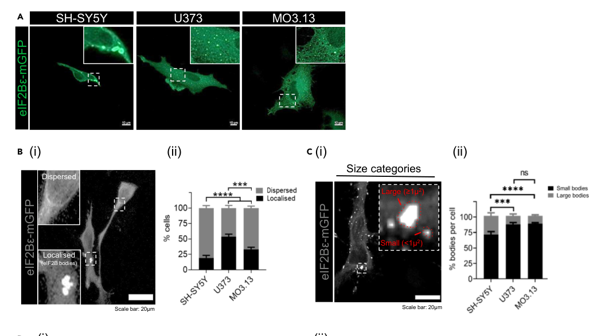

## Question

# Gene Research for Functional Annotation

## ⚠️ CRITICAL: Gene/Protein Identification Context

**BEFORE YOU BEGIN RESEARCH:** You MUST verify you are researching the CORRECT gene/protein. Gene symbols can be ambiguous, especially for less well-characterized genes from non-model organisms.

### Target Gene/Protein Identity (from UniProt):
- **UniProt Accession:** Q9UI10
- **Protein Description:** RecName: Full=Translation initiation factor eIF2B subunit delta; AltName: Full=eIF2B GDP-GTP exchange factor subunit delta;
- **Gene Information:** Name=EIF2B4; Synonyms=EIF2BD;
- **Organism (full):** Homo sapiens (Human).
- **Protein Family:** Belongs to the eIF-2B alpha/beta/delta subunits family.
- **Key Domains:** IF-2B-related. (IPR000649); IF_2B-like_C. (IPR042529); NagB/RpiA_transferase-like. (IPR037171); IF-2B (PF01008)

### MANDATORY VERIFICATION STEPS:

1. **Check if the gene symbol "EIF2B4" matches the protein description above**
2. **Verify the organism is correct:** Homo sapiens (Human).
3. **Check if protein family/domains align with what you find in literature**
4. **If you find literature for a DIFFERENT gene with the same or similar symbol, STOP**

### If Gene Symbol is Ambiguous or You Cannot Find Relevant Literature:

**DO NOT PROCEED WITH RESEARCH ON A DIFFERENT GENE.** Instead:
- State clearly: "The gene symbol 'EIF2B4' is ambiguous or literature is limited for this specific protein"
- Explain what you found (e.g., "Found extensive literature on a different gene with the same symbol in a different organism")
- Describe the protein based ONLY on the UniProt information provided above
- Suggest that the protein function can be inferred from domain/family information

### Research Target:

Please provide a comprehensive research report on the gene **EIF2B4** (gene ID: EIF2B4, UniProt: Q9UI10) in human.

The research report should be a detailed narrative explaining the function, biological processes, and localization of the gene product. Citations should be given for all claims.

You should prioritize authoritative reviews and primary scientific literature when conducting research. You can supplement
this with annotations you find in gene/protein databases, but these can be outdated or inaccurate.

We are specifically interested in the primary function of the gene - for enzymes, what reaction is catalyzed, and what is the substrate specificity? For transporters, what is the substrate? For structural proteins or adapters, what is the broader structural role? For signaling molecules, what is the role in the pathway.

We are interested in where in or outside the cell the gene product carries out its function.

We are also interested in the signaling or biochemical pathways in which the gene functions. We are less interested in broad pleiotropic effects, except where these elucidate the precise role.

Include evidence where possible. We are interested in both experimental evidence as well as inference from structure, evolution, or bioinformatic analysis. Precise studies should be prioritized over high-throughput, where available.

## Output

Question: You are an expert researcher providing comprehensive, well-cited information.

Provide detailed information focusing on:
1. Key concepts and definitions with current understanding
2. Recent developments and latest research (prioritize 2023-2024 sources)
3. Current applications and real-world implementations
4. Expert opinions and analysis from authoritative sources
5. Relevant statistics and data from recent studies

Format as a comprehensive research report with proper citations. Include URLs and publication dates where available.
Always prioritize recent, authoritative sources and provide specific citations for all major claims.

# Gene Research for Functional Annotation

## ⚠️ CRITICAL: Gene/Protein Identification Context

**BEFORE YOU BEGIN RESEARCH:** You MUST verify you are researching the CORRECT gene/protein. Gene symbols can be ambiguous, especially for less well-characterized genes from non-model organisms.

### Target Gene/Protein Identity (from UniProt):
- **UniProt Accession:** Q9UI10
- **Protein Description:** RecName: Full=Translation initiation factor eIF2B subunit delta; AltName: Full=eIF2B GDP-GTP exchange factor subunit delta;
- **Gene Information:** Name=EIF2B4; Synonyms=EIF2BD;
- **Organism (full):** Homo sapiens (Human).
- **Protein Family:** Belongs to the eIF-2B alpha/beta/delta subunits family.
- **Key Domains:** IF-2B-related. (IPR000649); IF_2B-like_C. (IPR042529); NagB/RpiA_transferase-like. (IPR037171); IF-2B (PF01008)

### MANDATORY VERIFICATION STEPS:

1. **Check if the gene symbol "EIF2B4" matches the protein description above**
2. **Verify the organism is correct:** Homo sapiens (Human).
3. **Check if protein family/domains align with what you find in literature**
4. **If you find literature for a DIFFERENT gene with the same or similar symbol, STOP**

### If Gene Symbol is Ambiguous or You Cannot Find Relevant Literature:

**DO NOT PROCEED WITH RESEARCH ON A DIFFERENT GENE.** Instead:
- State clearly: "The gene symbol 'EIF2B4' is ambiguous or literature is limited for this specific protein"
- Explain what you found (e.g., "Found extensive literature on a different gene with the same symbol in a different organism")
- Describe the protein based ONLY on the UniProt information provided above
- Suggest that the protein function can be inferred from domain/family information

### Research Target:

Please provide a comprehensive research report on the gene **EIF2B4** (gene ID: EIF2B4, UniProt: Q9UI10) in human.

The research report should be a detailed narrative explaining the function, biological processes, and localization of the gene product. Citations should be given for all claims.

You should prioritize authoritative reviews and primary scientific literature when conducting research. You can supplement
this with annotations you find in gene/protein databases, but these can be outdated or inaccurate.

We are specifically interested in the primary function of the gene - for enzymes, what reaction is catalyzed, and what is the substrate specificity? For transporters, what is the substrate? For structural proteins or adapters, what is the broader structural role? For signaling molecules, what is the role in the pathway.

We are interested in where in or outside the cell the gene product carries out its function.

We are also interested in the signaling or biochemical pathways in which the gene functions. We are less interested in broad pleiotropic effects, except where these elucidate the precise role.

Include evidence where possible. We are interested in both experimental evidence as well as inference from structure, evolution, or bioinformatic analysis. Precise studies should be prioritized over high-throughput, where available.

## Research Report: Human **EIF2B4** (UniProt **Q9UI10**) — Functional Annotation, Pathway Biology, Disease Links, and Translational Landscape

### 0) Target verification (mandatory)
The research target is **human EIF2B4**, encoding **translation initiation factor eIF2B subunit delta (eIF2Bδ)** (UniProt **Q9UI10**)—a regulatory/scaffold component of the heterodecameric **eIF2B** complex. Multiple sources consistently describe eIF2B as a decamer composed of **two copies of each of five subunits (α–ε)** and place **δ (EIF2B4)** among the **regulatory subunits (α/β/δ)** rather than the catalytic subunits (γ/ε). (wortham2014analysisofthe pages 9-10, hanson2024eif2blocalizationand pages 1-2)

### 1) Key concepts and definitions (current understanding)

#### 1.1 eIF2B as the eIF2 guanine nucleotide exchange factor (GEF)
**eIF2B** is the **GEF for eIF2**, recycling **inactive eIF2–GDP** to **active eIF2–GTP**, thereby replenishing the pool of eIF2 needed to form the ternary complex (eIF2–GTP·Met-tRNAi) and initiate translation. (wek2023survivingandadapting pages 1-2)

Mechanistically, eIF2B’s catalytic function is mainly attributed to the **γ and ε subunits**, while **α/β/δ** enhance full activity and provide regulatory control, including stress sensitivity. (hanson2023theroleof pages 38-42, hanson2024eif2blocalizationand pages 1-2)

#### 1.2 Integrated stress response (ISR) and how eIF2B is inhibited
The **integrated stress response (ISR)** is a conserved translational control pathway in which stress-activated kinases phosphorylate **eIF2α at Ser51**; phosphorylated eIF2α inhibits eIF2B, reducing eIF2–GTP and lowering ternary complex levels, producing a global reduction in translation while permitting selective translation of ISR mRNAs (e.g., ATF4). (hanson2024eif2blocalizationand pages 1-2, wek2023survivingandadapting pages 1-2)

A key mechanistic concept relevant to EIF2B4 is that **phosphorylated eIF2α binds eIF2B in a way that blocks productive engagement of eIF2γ with the catalytic ε subunit**, suppressing nucleotide exchange. (hanson2024eif2blocalizationand pages 1-2, ghahnavieh2024therapeuticpotentialof pages 34-38)

#### 1.3 What EIF2B4 (eIF2Bδ) contributes
EIF2B4/eIF2Bδ is best understood as a **regulatory/scaffold subunit** that:
- participates in **assembly and stabilization** of the full decameric eIF2B complex (wortham2014analysisofthe pages 9-10, wortham2014analysisofthe pages 4-5)
- contributes to the **β/δ “core”** that supports higher-order assembly of eIF2B and is central to allosteric regulation by small molecules (ghahnavieh2024therapeuticpotentialof pages 34-38, hanson2023theroleof pages 45-50)
- is implicated in the **inhibitory interface** for phospho-eIF2α, with mechanistic summaries placing phospho-eIF2α binding at an interface that includes **eIF2Bδ (EIF2B4)** (ghahnavieh2024therapeuticpotentialof pages 34-38)

### 2) Recent developments and latest research (prioritizing 2023–2024)

#### 2.1 Cell-type-specific localization of eIF2B and EIF2B4 in cytoplasmic “eIF2B bodies” (2024)
A 2024 peer-reviewed study reported that eIF2B localizes to discrete cytoplasmic foci called **eIF2B bodies**, which are interpreted as **sites of eIF2B GEF activity** and exhibit **cell-type-specific composition** in neuronal and glial cell lines. (hanson2024eif2blocalizationand pages 1-2, hanson2024eif2blocalizationand pages 2-4)

In these data, **eIF2Bδ inclusion** differs by body size and cell type. Baseline co-localization of δ with **small eIF2B bodies** was reported as **20.83% (SH-SY5Y)**, **10.63% (U373)**, and **9.03% (MO3.13)**; for **large eIF2B bodies**, δ co-localization was **62.39% (SH-SY5Y)**, **67.48% (U373)**, and **65.00% (MO3.13)**. (hanson2024eif2blocalizationand pages 2-4, hanson2024eif2blocalizationand media e26945f7)

Primary figure evidence for eIF2B bodies, quantification of δ inclusion, and a working model of body composition/regulation are shown in the retrieved figure set. (hanson2024eif2blocalizationand media e26945f7)

#### 2.2 eIF2Bδ in cancer stress adaptation and metastasis (2023)
A 2023 PNAS study reported that breast cancer stem cells (CSCs) have reduced miR-183, which increases **eIF2Bδ protein**. Elevated eIF2Bδ was reported to suppress strong ISR induction via preferential interaction with phospho-eIF2α and was required for CSC invasion/metastasis in animal models, highlighting EIF2B4/eIF2Bδ as a functional node connecting translational control to cancer progression. (gupta2023eif2bδblocksthe pages 1-2)

#### 2.3 ISR reviews consolidating consensus mechanisms (2023)
A 2023 review in *Antioxidants & Redox Signaling* provides an authoritative synthesis: eIF2α phosphorylation blocks eIF2B exchange activity, lowering eIF2–GTP and inhibiting pre-initiation complex formation, while enabling preferential translation of specific stress-responsive mRNAs. (wek2023survivingandadapting pages 1-2)

### 3) Current applications and real-world implementations

#### 3.1 Diagnostics and genetic testing for EIF2B-related leukodystrophies
Recent clinical genetics continues to identify EIF2B4 variants in leukodystrophy diagnostic workflows. A 2023 pediatric cohort study (genetic white matter disorders) included **EIF2B4 variants (n=2)** and reported a **novel splice-site variant** **EIF2B4 c.885+2T>G**. (dong2023genotypicandphenotypic pages 2-4)

#### 3.2 Therapeutic modulation of eIF2B/ISR as a drug strategy
Small-molecule **eIF2B activators** such as **ISRIB** (and related compounds like **2BAct**) are described as agents that bind eIF2B and reduce sensitivity to phospho-eIF2α, thereby restoring translation under ISR conditions. (wek2023survivingandadapting pages 5-6)

Mechanistically relevant to EIF2B4, ISRIB is described as binding at a symmetric interface involving **β and δ** and promoting higher-order assembly (octamer/decamer) that increases available GEF activity. (hanson2023theroleof pages 45-50)

#### 3.3 Clinical-trial “real-world” translation for VWM-spectrum disorders
ClinicalTrials.gov listings indicate individualized interventional efforts for Cree leukoencephalopathy / vanishing white matter disease:
- **NCT07272525** (Early Phase 1; enrollment 1; active not recruiting): https://clinicaltrials.gov/study/NCT07272525 (OpenTargets Search: -EIF2B4)
- **NCT07300397** (Interventional; enrollment 1; active not recruiting): https://clinicaltrials.gov/study/NCT07300397 (OpenTargets Search: -EIF2B4)

These are not EIF2B4-specific trials in the retrieved registry excerpts, but they represent real-world therapeutic attempts in the eIF2B-related leukodystrophy space. (OpenTargets Search: -EIF2B4)

### 4) Expert opinions and analysis (authoritative synthesis)

#### 4.1 EIF2B4 as a regulator/scaffold rather than catalytic enzyme
Across mechanistic sources, the dominant view is that **EIF2B4/eIF2Bδ is not the catalytic GEF subunit** (γ/ε are catalytic) but is crucial for:
- forming/stabilizing the **decameric holoenzyme** needed for full physiological function (wortham2014analysisofthe pages 9-10)
- enabling the complex’s proper **regulatory behavior** under stress (inhibition by phospho-eIF2α and allosteric modulation by ISRIB-class ligands) (hanson2024eif2blocalizationand pages 1-2, hanson2023theroleof pages 45-50)

This delineation explains why many disease and pharmacology effects arise from “noncatalytic” subunits: they govern assembly/state equilibria and inhibitor/activator sensitivity. (wortham2014analysisofthe pages 9-10, hanson2023theroleof pages 45-50)

#### 4.2 Localization-based regulation as a cell-type-specific layer (2024)
The 2024 eIF2B-body study advances a framework in which eIF2B is organized into cytoplasmic “bodies” whose subunit composition (including δ) varies by cell type and stress state, providing a plausible explanation for tissue/cell-type selectivity in eIF2B-pathies (e.g., glial vulnerability in VWM). (hanson2024eif2blocalizationand pages 2-4, hanson2024eif2blocalizationand media e26945f7)

### 5) Statistics and data from recent studies

#### 5.1 Ovarioleukodystrophy (VWM spectrum) — systematic review statistics (2024)
A 2024 systematic review and case report compiled **20 ovarioleukodystrophy cases worldwide** from **14 reports**, with **median onset 19 years (range 0.6–40)**. Ovarian presentations were reported as **premature ovarian failure (60%)**, **primary amenorrhea (15%)**, **secondary amenorrhea (15%)**, and **ovarian dysgenesis (5%)**. Neurologic manifestations included **pyramidal/gait disturbance (45%)** and **epilepsy (~30–35%)**. **Frontal horn cystic degeneration** on MRI was reported in **45%** of cases. EIF2B4 and EIF2B5 were highlighted among the more frequently implicated genes in this phenotype. (escobarpacheco2024ovarioleukodystrophydueto pages 1-2, escobarpacheco2024ovarioleukodystrophydueto pages 2-4, escobarpacheco2024ovarioleukodystrophydueto pages 8-10)

The same 2024 paper reports a new case with a homozygous **EIF2B4 c.725C>T (p.Pro242Leu)** variant, supporting direct EIF2B4 involvement in ovarioleukodystrophy/VWM-spectrum disease. (escobarpacheco2024ovarioleukodystrophydueto pages 2-4)

#### 5.2 Pediatric cohort counts (2023)
A 2023 cohort of 13 Chinese pediatric patients with genetic white matter disorders included **EIF2B4 in 2 patients**, and described a **novel EIF2B4 splice-site** variant **c.885+2T>G**. (dong2023genotypicandphenotypic pages 2-4)

#### 5.3 Database-level disease associations (Open Targets)
Open Targets lists EIF2B4 associations with **leukoencephalopathy with vanishing white matter**, **CACH syndrome**, and **ovarioleukodystrophy**, providing a curated evidence complement to the primary literature (association scores and evidence counts are database metrics rather than case frequencies). (OpenTargets Search: -EIF2B4)

### 6) Subcellular localization and where EIF2B4 acts in the cell
The available primary evidence supports **cytoplasmic** function, including localization to **eIF2B bodies**. In mammalian cells, eIF2B bodies are heterogeneous; larger bodies are more likely to include regulatory subunits such as δ, whereas smaller bodies are enriched for catalytic subunits, implying multiple functional pools of eIF2B complexes that may differ in GEF output and stress sensitivity. (hanson2024eif2blocalizationand pages 2-4, hanson2024eif2blocalizationand media e26945f7)

### 7) Pathways and biochemical roles (substrates, reaction, specificity)
EIF2B’s biochemical role is **GDP→GTP exchange** on **eIF2**, and thus its functional “substrate” is **eIF2 (GDP-bound after initiation)**; ISR regulation acts by converting phosphorylated eIF2 into an inhibitor of this exchange reaction. (hanson2024eif2blocalizationand pages 1-2, wek2023survivingandadapting pages 1-2)

EIF2B4/eIF2Bδ contributes to this pathway primarily through **complex assembly/state regulation and inhibitory interactions** rather than direct catalysis. (wortham2014analysisofthe pages 9-10, hanson2024eif2blocalizationand pages 1-2)

### 8) Translational pharmacology specific to EIF2B4 (delta) where available
While most ISRIB literature treats eIF2B as a complex-level target, EIF2B4-specific pharmacology is supported by evidence that δ residues sit near allosteric ligand sites and that δ mutations can alter responses to eIF2B-targeting compounds. For example, an EIF2B4 **L180F** mutant background altered sensitivity to an eIF2B inhibitory compound series and abolished ISRIB-mediated reversal of its activity, demonstrating that δ can be a determinant of drug response at the complex interface. (shilliday2025amolecularstabiliser pages 11-14)

### 9) Evidence tables (for rapid review)
The following tables consolidate the key evidence:

| Aspect | Key points | Evidence (cite IDs) |
|---|---|---|
| Gene/protein identity | **EIF2B4** encodes the human **translation initiation factor eIF2B subunit delta (eIF2Bδ)**, corresponding to **UniProt Q9UI10**; it is a noncatalytic/regulatory component of the eIF2B complex in **Homo sapiens**. | (OpenTargets Search: -EIF2B4, wortham2014analysisofthe pages 9-10) |
| Role in eIF2B complex | eIF2B is a **heterodecamer** with two copies each of α, β, γ, δ, and ε. **EIF2B4/eIF2Bδ** belongs to the **regulatory subunits (α/β/δ)**, contributes to **holocomplex assembly**, and participates in the **β/δ core** that supports formation of the active complex. | (hanson2023theroleof pages 38-42, wortham2014analysisofthe pages 9-10, ghahnavieh2024therapeuticpotentialof pages 34-38) |
| Structural/assembly role | Experimental MS, pulldown, and SEC studies support a structural role for δ in **decamer assembly** and inter-subcomplex organization; βδ-containing assemblies are lower-activity intermediates relative to the full holoenzyme. | (wortham2014analysisofthe pages 9-10, wortham2014analysisofthe pages 4-5, wortham2014analysisofthe pages 10-11) |
| Biochemical function of the complex | The **eIF2B complex** is the **guanine nucleotide exchange factor (GEF)** for **eIF2**, catalyzing **GDP→GTP exchange** to regenerate active eIF2-GTP for ternary complex formation and translation initiation. Catalytic activity resides mainly in **γ/ε**, while δ enhances full activity through regulation and assembly. | (hanson2023theroleof pages 38-42, hanson2024eif2blocalizationand pages 1-2, wek2023survivingandadapting pages 1-2) |
| ISR inhibition mechanism | During stress, **eIF2α Ser51 phosphorylation** converts eIF2 into an inhibitor of eIF2B. Structural/mechanistic summaries place **phospho-eIF2α** at an interface **between eIF2B1 (α) and eIF2B4 (δ)**, which **blocks productive engagement of eIF2γ with catalytic eIF2Bε**, suppressing nucleotide exchange and global translation. | (ghahnavieh2024therapeuticpotentialof pages 34-38, hanson2024eif2blocalizationand pages 1-2, wek2023survivingandadapting pages 1-2) |
| Subcellular localization | eIF2B localizes in the **cytoplasm** in discrete **eIF2B bodies**, which are sites of GEF activity. In mammalian cells, **small bodies** are enriched for catalytic subunits, whereas **large bodies** more often contain all subunits and are consistent with decameric complexes. | (hanson2024eif2blocalizationand pages 2-4, hanson2024eif2blocalizationand pages 1-2, hanson2023theroleof pages 114-120, hanson2024eif2blocalizationand media e26945f7) |
| eIF2Bδ inclusion in bodies | Baseline eIF2Bδ inclusion is **cell-type specific**. Reported co-localization of δ with **small bodies**: **SH-SY5Y 20.83%**, **U373 10.63%**, **MO3.13 9.03%**; with **large bodies**: **SH-SY5Y 62.39%**, **U373 67.48%**, **MO3.13 65.00%**. Acute ER stress redistributes δ toward small bodies. | (hanson2024eif2blocalizationand pages 2-4, hanson2024eif2blocalizationand media e26945f7) |
| Isoforms | eIF2Bδ has at least **long and short alternatively spliced isoforms**. The **long isoform** is associated with **attenuated ISR signaling** and **impaired binding to phospho-eIF2α**, whereas the **short isoform** preserves stress-induced translational inhibition and is associated with stronger ISR marker induction. Complex integrity is retained. | (hanson2023theroleof pages 42-45) |
| Pathway context | EIF2B4 functions in the **translation initiation pathway** and the **integrated stress response (ISR)**, where changes in eIF2B activity tune global protein synthesis and selective translation of stress-responsive mRNAs such as **ATF4**. | (hanson2023theroleof pages 38-42, hanson2024eif2blocalizationand pages 1-2, wek2023survivingandadapting pages 1-2) |
| Disease link | Pathogenic **EIF2B4** variants are linked to **vanishing white matter disease (VWM/CACH)** and **ovarioleukodystrophy**. Open Targets lists associations with **leukoencephalopathy with vanishing white matter**, **CACH syndrome**, and **ovarioleukodystrophy**. | (OpenTargets Search: -EIF2B4, escobarpacheco2024ovarioleukodystrophydueto pages 1-2, escobarpacheco2024ovarioleukodystrophydueto pages 2-4) |
| Recent disease statistics relevant to EIF2B4 | A 2024 systematic review of EIF2B-related **ovarioleukodystrophy** compiled **20 cases worldwide**, with **median onset 19 years**; ovarian presentations included **premature ovarian failure (60%)**, **secondary amenorrhea (15%)**, **primary amenorrhea (15%)**, and **ovarian dysgenesis (5%)**. **EIF2B4 and EIF2B5** were highlighted among the more frequently implicated genes in this phenotype. | (escobarpacheco2024ovarioleukodystrophydueto pages 1-2, escobarpacheco2024ovarioleukodystrophydueto pages 2-4, escobarpacheco2024ovarioleukodystrophydueto pages 8-10) |

*Table: This table summarizes the verified identity, molecular function, ISR mechanism, localization, isoform behavior, and disease relevance of human EIF2B4/eIF2Bδ. It is designed as a compact evidence map for functional annotation with direct context-ID citations.*

| Citation (author, year) | Publication date/month | Venue | Main finding relevant to EIF2B4 | URL | Evidence IDs |
|---|---|---|---|---|---|
| Wek et al., 2023 | Aug 2023 | *Antioxidants & Redox Signaling* | Authoritative ISR review: eIF2B is the GEF for eIF2; phosphorylation of eIF2α inhibits eIF2B-mediated GDP→GTP exchange, lowering ternary-complex formation and reprogramming translation. While not EIF2B4-specific, it provides current consensus framework for the regulatory role of eIF2Bδ within ISR control. | https://doi.org/10.1089/ars.2022.0123 | (wek2023survivingandadapting pages 1-2, wek2023survivingandadapting pages 5-6) |
| Hanson et al., 2024 | Sep 2024 | *iScience* | Peer-reviewed cell-biology study showing eIF2B localizes to cytoplasmic eIF2B bodies with cell-type-specific composition; eIF2Bδ is present in both small and large bodies, and its redistribution changes with stress and ISRIB treatment, supporting a localization-dependent regulatory role for EIF2B4 in neurons and glia. | https://doi.org/10.1016/j.isci.2024.110851 | (hanson2024eif2blocalizationand pages 2-4, hanson2024eif2blocalizationand pages 1-2, hanson2024eif2blocalizationand media e26945f7) |
| Gupta et al., 2023 | Apr 2023 | *Proceedings of the National Academy of Sciences of the USA (PNAS)* | Demonstrates that overexpression of eIF2Bδ in breast cancer stem cells suppresses strong ISR induction through preferential interaction with phospho-eIF2α, sustaining eIF2B activity and promoting invasion/metastasis; identifies EIF2B4/eIF2Bδ as functionally important in cancer stress adaptation. | https://doi.org/10.1073/pnas.2207898120 | (gupta2023eif2bδblocksthe pages 1-2) |
| Escobar-Pacheco et al., 2024 | Jul 2024 | *Cureus* | Systematic review and case report on ovarioleukodystrophy due to EIF2B genes: 20 worldwide cases compiled, median onset 19 years, with missense variants predominating and EIF2B4/EIF2B5 notably represented; supports the clinical relevance of EIF2B4 in adult and adolescent VWM-spectrum disease. | https://doi.org/10.7759/cureus.64497 | (escobarpacheco2024ovarioleukodystrophydueto pages 1-2, escobarpacheco2024ovarioleukodystrophydueto pages 2-4, escobarpacheco2024ovarioleukodystrophydueto pages 8-10, escobarpacheco2024ovarioleukodystrophydueto pages 10-11) |
| Dong et al., 2023 | Nov 2023 | *Italian Journal of Pediatrics* | Pediatric white-matter-disorder cohort identifying EIF2B4 among causal genes, including a novel splice-site variant c.885+2T>G; supports ongoing discovery of pathogenic EIF2B4 alleles in leukodystrophy diagnostics. | https://doi.org/10.1186/s13052-023-01555-z | (dong2023genotypicandphenotypic pages 2-4) |
| Wortham et al., 2014 | May 2014 | *The FASEB Journal* | Foundational structural/biochemical study showing eIF2B is a heterodecamer and placing eIF2Bδ among the α/β/δ regulatory subunits that support decamer assembly and full holoenzyme function; provides key experimental basis for interpreting EIF2B4’s scaffold/regulatory role. | https://doi.org/10.1096/fj.13-243329 | (wortham2014analysisofthe pages 9-10, wortham2014analysisofthe pages 4-5, wortham2014analysisofthe pages 10-11, wortham2014analysisofthe pages 11-12) |

*Table: This table summarizes core recent and foundational publications needed to interpret human EIF2B4/eIF2Bδ function, localization, ISR biology, and disease relevance. It is useful as a citation-ready literature map for the final research report.*

| Phenotype | Gene(s) | Study (year) | Sample size | Key stats | Notes/limitations | URL | Evidence IDs |
|---|---|---|---:|---|---|---|---|
| Ovarioleukodystrophy / vanishing white matter disease (aggregate review) | EIF2B1-5, with EIF2B4 and EIF2B5 frequently implicated by missense variants | Escobar-Pacheco et al. (2024) | 20 cases worldwide compiled from 14 reports | Median age at onset 19 years (range 0.6-40); ovarian manifestations: premature ovarian failure 60%, primary amenorrhea 15%, secondary amenorrhea 15%, ovarian dysgenesis 5%; neurologic findings included pyramidal/gait disturbance 45%, epilepsy ~30-35%; frontal horn cystic degeneration on MRI in 45% | Ultra-rare phenotype; statistics are aggregate across all EIF2B genes, not EIF2B4-only; small case numbers limit genotype-specific inference | https://doi.org/10.7759/cureus.64497 | (escobarpacheco2024ovarioleukodystrophydueto pages 1-2, escobarpacheco2024ovarioleukodystrophydueto pages 2-4, escobarpacheco2024ovarioleukodystrophydueto pages 8-10, escobarpacheco2024ovarioleukodystrophydueto pages 10-11) |
| Ovarioleukodystrophy case with explicit EIF2B4 variant | EIF2B4 | Escobar-Pacheco et al. (2024) | 1 new case within the above review | Homozygous EIF2B4 c.725C>T (p.Pro242Leu) identified by NGS; supports causal association of EIF2B4 with ovarioleukodystrophy/VWM spectrum | Single case; useful for gene-specific confirmation but not for prevalence estimation | https://doi.org/10.7759/cureus.64497 | (escobarpacheco2024ovarioleukodystrophydueto pages 2-4) |
| Pediatric genetic white matter disorders cohort | EIF2B3, EIF2B4, EIF2B5 among other genes | Dong et al. (2023) | 13 total patients | EIF2B4 represented in 2 patients; EIF2B3 n=2, EIF2B4 n=2, EIF2B5 n=2; EIF2B4 splice-site variant c.885+2T>G reported as novel; EIF2B-related cases showed bilateral white matter hyperintensities and cystic degeneration noted for EIF2B4/EIF2B5 carriers in the paper summary | Small single-center pediatric cohort; not specific to one phenotype and not designed for prevalence estimates | https://doi.org/10.1186/s13052-023-01555-z | (dong2023genotypicandphenotypic pages 2-4) |
| EIF2B4 disease-target association: leukoencephalopathy with vanishing white matter | EIF2B4 | Open Targets platform (accessed in current evidence context) | Association evidence size = 5 | Disease association reported for leukoencephalopathy with vanishing white matter, leukoencephalopathy with vanishing white matter 1, leukoencephalopathy with vanishing white matter 4, and CACH syndrome; highest listed aggregate score in returned set was 0.8301 for "leukoencephalopathy with vanishing white matter" | Platform-level association evidence, not a clinical cohort; evidence size/score are database metrics rather than patient counts | https://platform.opentargets.org | (OpenTargets Search: -EIF2B4) |
| EIF2B4 disease-target association: ovarioleukodystrophy | EIF2B4 | Open Targets platform (accessed in current evidence context) | Association evidence size = 5 | Association reported for ovarioleukodystrophy with score 0.6093 in returned results | Database evidence complements literature but does not provide phenotype frequency or natural-history statistics | https://platform.opentargets.org | (OpenTargets Search: -EIF2B4) |

*Table: This table summarizes recent clinical and database evidence linking EIF2B4 to vanishing white matter disease and ovarioleukodystrophy, emphasizing available case counts, phenotype frequencies, and key limitations. It is useful for quickly separating aggregate EIF2B-family statistics from the more limited gene-specific evidence for EIF2B4.*

| Modality/compound | Target/mechanism | Evidence of involvement of β/δ core or EIF2B4 | Application area | Development stage | Key quantitative data | URL | Evidence IDs |
|---|---|---|---|---|---|---|---|
| ISRIB | Small-molecule eIF2B activator; binds the symmetric interface of eIF2B and stabilizes the active A-state, making eIF2B GEF activity less sensitive to phospho-eIF2α and restoring translation | Directly engages the eIF2B β/δ interface and bridges opposing βδ-containing tetramers into higher-order octamer/decamer assemblies; described as acting through the β/δ core and as a site functionally linked to eIF2Bδ/EIF2B4 (ghahnavieh2024therapeuticpotentialof pages 34-38, hanson2023theroleof pages 45-50, gupta2023eif2bδblocksthe pages 1-2, wek2023survivingandadapting pages 5-6) | Preclinical cancer therapy; neuroprotection/cognitive rescue; VWM model rescue (ghahnavieh2024therapeuticpotentialof pages 34-38, hanson2023theroleof pages 45-50) | Preclinical research tool/drug lead | No single EC50 reported in the cited 2023–2024 summaries here; reported to promote octamer/decamer assembly and enhance GEF activity in lysates; efficacy depends on presence of ISR signaling/p-eIF2α in tumors (ghahnavieh2024therapeuticpotentialof pages 34-38, hanson2023theroleof pages 45-50) | https://doi.org/10.1073/pnas.2207898120 ; https://doi.org/10.1089/ars.2022.0123 | (ghahnavieh2024therapeuticpotentialof pages 34-38, hanson2023theroleof pages 45-50, gupta2023eif2bδblocksthe pages 1-2, wek2023survivingandadapting pages 5-6) |
| 2BAct | eIF2B activator identified with ISRIB-class molecules; blocks inhibitory phospho-eIF2 binding and functionally renders eIF2B more resistant to ISR suppression | Acts on eIF2B allosterically in the same therapeutic space as ISRIB; cited as an eIF2B activator with relevance to assembly/state control, though β/δ contact details are less explicit in the cited excerpts than for ISRIB (hanson2023theroleof pages 45-50, wek2023survivingandadapting pages 5-6) | VWMD/neuropathy and broader ISR-modulation applications (hanson2023theroleof pages 45-50, wek2023survivingandadapting pages 5-6) | Preclinical | In a VWMD mouse model carrying eIF2Bε R191H/R191H, 2BAct reversed neuropathology; no EC50 given in the cited excerpts (hanson2023theroleof pages 45-50) | https://doi.org/10.1089/ars.2022.0123 | (hanson2023theroleof pages 45-50, wek2023survivingandadapting pages 5-6) |
| ISRAC / Compound A-(S) | Small-molecule eIF2B inhibitor class that stabilizes the inactive I-state and promotes the inhibitory eIF2B–eIF2(αP) complex, thereby activating the ISR | Binds an overlapping regulatory pocket near eIF2Bδ L179 and eIF2Bβ N162; can bridge βγδε tetramers and favor the inhibitory conformation rather than the active one (shilliday2025amolecularstabiliser pages 11-14) | Chemical-biology tool; proposed opportunities in cancer sensitization, antiviral strategies, and protein-misfolding diseases (shilliday2025amolecularstabiliser pages 11-14, shilliday2025amolecularstabiliser pages 1-6) | Preclinical / preprint-stage discovery | Compound B (a related symmetric derivative) showed EC50 ~10 µM; enrichment/elimination in DEL screening depended on eIF2(αP) complex formation and ISRIB competition (shilliday2025amolecularstabiliser pages 11-14, shilliday2025amolecularstabiliser pages 1-6) | https://doi.org/10.1101/2025.09.25.678332 | (shilliday2025amolecularstabiliser pages 11-14, shilliday2025amolecularstabiliser pages 1-6) |
| ISRAC / Compound B | Symmetric derivative of Compound A-(S); attenuates eIF2B GEF activity and reduces translation by stabilizing the inhibitory eIF2B–eIF2(αP) state | Direct evidence for EIF2B4 involvement: effect mapped to the ISRIB/β-δ pocket neighborhood; EIF2B4 L180F mutant cells showed reduced sensitivity and lost ISRIB-mediated reversal, demonstrating δ-subunit-dependent pharmacology (shilliday2025amolecularstabiliser pages 11-14) | ISR activation as an experimental therapeutic strategy; proposed use in cancer combination therapy and antiviral/proteostasis settings (shilliday2025amolecularstabiliser pages 11-14) | Preclinical / preprint-stage discovery | EC50 ~10 µM overall; in EIF2B4 L180F mutant cells EC50 shifted from 15 µM to 22.63 µM; ISRIB reversal of Compound B action was lost in the mutant (shilliday2025amolecularstabiliser pages 11-14) | https://doi.org/10.1101/2025.09.25.678332 | (shilliday2025amolecularstabiliser pages 11-14) |
| eIF2Bδ overexpression axis in breast cancer stem cells | Not a drug itself, but a translationally relevant target state: elevated eIF2Bδ suppresses strong ISR induction by preferential interaction with phospho-eIF2α, sustaining eIF2B activity | Directly implicates EIF2B4/eIF2Bδ in metastasis biology and identifies δ as a functional site of ISRIB action in CSCs (gupta2023eif2bδblocksthe pages 1-2) | Breast cancer stem cell survival, invasion, metastasis (gupta2023eif2bδblocksthe pages 1-2) | Preclinical target validation | No EC50 reported; biological effect includes requirement of elevated eIF2Bδ for CSC expansion and metastasis in animal models (gupta2023eif2bδblocksthe pages 1-2) | https://doi.org/10.1073/pnas.2207898120 | (gupta2023eif2bδblocksthe pages 1-2) |
| NCT07272525 | Single-patient investigational treatment for Cree leukoencephalopathy/vanishing white matter disease | Real-world implementation relevant to EIF2B-pathies/VWM; trial listing indicates translational movement toward individualized intervention, though mechanism/intervention details are not provided in the retrieved excerpt (OpenTargets Search: -EIF2B4) | Cree leukoencephalopathy / VWM | Active, not recruiting; Early Phase 1; interventional | Enrollment: 1 participant (OpenTargets Search: -EIF2B4) | https://clinicaltrials.gov/study/NCT07272525 | (OpenTargets Search: -EIF2B4) |
| NCT07300397 | Single-patient investigational treatment for Cree leukoencephalopathy | Real-world implementation relevant to EIF2B-related white matter disease; retrieved clinical-trial summary supports existence of individualized translational efforts, but no β/δ-core mechanistic detail is available in the excerpt (OpenTargets Search: -EIF2B4) | Cree leukoencephalopathy / VWM-related disease context | Active, not recruiting; interventional | Enrollment: 1 participant (OpenTargets Search: -EIF2B4) | https://clinicaltrials.gov/study/NCT07300397 | (OpenTargets Search: -EIF2B4) |

*Table: This table summarizes translational and real-world applications of eIF2B/ISR modulation relevant to EIF2B4, including activators, ISR-activating compounds, and individualized clinical-trial efforts in VWM-related disease. It highlights where the β/δ core or EIF2B4 specifically informs mechanism, drug response, and disease relevance.*

### 10) Limitations of the current evidence set
- The provided evidence set robustly supports EIF2B4’s **regulatory/scaffold role** in the eIF2B complex, ISR control, and VWM-spectrum disease associations, with strong 2023–2024 coverage for localization (2024), ISR overview (2023), cancer biology (2023), and ovarioleukodystrophy statistics (2024). (hanson2024eif2blocalizationand pages 2-4, wek2023survivingandadapting pages 1-2, escobarpacheco2024ovarioleukodystrophydueto pages 2-4, gupta2023eif2bδblocksthe pages 1-2)
- Detailed, EIF2B4-only genotype–phenotype frequency breakdowns (beyond the specific cases identified) were not available in the retrieved 2024 systematic review excerpts; conclusions about “EIF2B4 is most frequent” are therefore treated qualitatively rather than as precise EIF2B4-specific proportions. (escobarpacheco2024ovarioleukodystrophydueto pages 8-10, escobarpacheco2024ovarioleukodystrophydueto pages 10-11)

### 11) Key URLs (with publication dates)
- Hanson et al., **Sep 2024**, iScience: https://doi.org/10.1016/j.isci.2024.110851 (hanson2024eif2blocalizationand pages 1-2)
- Escobar-Pacheco et al., **Jul 2024**, Cureus: https://doi.org/10.7759/cureus.64497 (escobarpacheco2024ovarioleukodystrophydueto pages 1-2)
- Wek et al., **Aug 2023**, Antioxidants & Redox Signaling: https://doi.org/10.1089/ars.2022.0123 (wek2023survivingandadapting pages 1-2)
- Gupta et al., **Apr 2023**, PNAS: https://doi.org/10.1073/pnas.2207898120 (gupta2023eif2bδblocksthe pages 1-2)
- Dong et al., **Nov 2023**, Italian Journal of Pediatrics: https://doi.org/10.1186/s13052-023-01555-z (dong2023genotypicandphenotypic pages 2-4)
- Wortham et al., **May 2014**, FASEB J (foundational): https://doi.org/10.1096/fj.13-243329 (wortham2014analysisofthe pages 9-10)
- ClinicalTrials.gov: **NCT07272525** https://clinicaltrials.gov/study/NCT07272525; **NCT07300397** https://clinicaltrials.gov/study/NCT07300397 (OpenTargets Search: -EIF2B4)

References

1. (wortham2014analysisofthe pages 9-10): Noel C. Wortham, Magdalena Martinez, Yuliya Gordiyenko, Carol V. Robinson, and Christopher G. Proud. Analysis of the subunit organization of the eif2b complex reveals new insights into its structure and regulation. The FASEB Journal, 28:2225-2237, May 2014. URL: https://doi.org/10.1096/fj.13-243329, doi:10.1096/fj.13-243329. This article has 82 citations.

2. (hanson2024eif2blocalizationand pages 1-2): Filipe M. Hanson, Madalena I. Ribeiro de Oliveira, Alison K. Cross, K. Elizabeth Allen, and Susan G. Campbell. Eif2b localization and its regulation during the integrated stress response is cell-type specific. Sep 2024. URL: https://doi.org/10.1016/j.isci.2024.110851, doi:10.1016/j.isci.2024.110851. This article has 6 citations and is from a peer-reviewed journal.

3. (wek2023survivingandadapting pages 1-2): Ronald C. Wek, Tracy G. Anthony, and Kirk A. Staschke. Surviving and adapting to stress: translational control and the integrated stress response. Antioxidants &amp; Redox Signaling, 39:351-373, Aug 2023. URL: https://doi.org/10.1089/ars.2022.0123, doi:10.1089/ars.2022.0123. This article has 87 citations and is from a domain leading peer-reviewed journal.

4. (hanson2023theroleof pages 38-42): FM da Silva Hanson. The role of eif2b localisation in cell-specific stress responses. ArXiv, 2023. URL: https://doi.org/10.7190/shu-thesis-00555, doi:10.7190/shu-thesis-00555. This article has 0 citations.

5. (ghahnavieh2024therapeuticpotentialof pages 34-38): L Ebrahimi Ghahnavieh. Therapeutic potential of targeting eukaryotic translation initiation factor (eif2b) in mutant kras lung cancer. Unknown journal, 2024.

6. (wortham2014analysisofthe pages 4-5): Noel C. Wortham, Magdalena Martinez, Yuliya Gordiyenko, Carol V. Robinson, and Christopher G. Proud. Analysis of the subunit organization of the eif2b complex reveals new insights into its structure and regulation. The FASEB Journal, 28:2225-2237, May 2014. URL: https://doi.org/10.1096/fj.13-243329, doi:10.1096/fj.13-243329. This article has 82 citations.

7. (hanson2023theroleof pages 45-50): FM da Silva Hanson. The role of eif2b localisation in cell-specific stress responses. ArXiv, 2023. URL: https://doi.org/10.7190/shu-thesis-00555, doi:10.7190/shu-thesis-00555. This article has 0 citations.

8. (hanson2024eif2blocalizationand pages 2-4): Filipe M. Hanson, Madalena I. Ribeiro de Oliveira, Alison K. Cross, K. Elizabeth Allen, and Susan G. Campbell. Eif2b localization and its regulation during the integrated stress response is cell-type specific. Sep 2024. URL: https://doi.org/10.1016/j.isci.2024.110851, doi:10.1016/j.isci.2024.110851. This article has 6 citations and is from a peer-reviewed journal.

9. (hanson2024eif2blocalizationand media e26945f7): Filipe M. Hanson, Madalena I. Ribeiro de Oliveira, Alison K. Cross, K. Elizabeth Allen, and Susan G. Campbell. Eif2b localization and its regulation during the integrated stress response is cell-type specific. Sep 2024. URL: https://doi.org/10.1016/j.isci.2024.110851, doi:10.1016/j.isci.2024.110851. This article has 6 citations and is from a peer-reviewed journal.

10. (gupta2023eif2bδblocksthe pages 1-2): Malavika Gupta, Beth A. Walters, Olga Katsara, Karol Granados Blanco, Phillip A. Geter, and Robert J. Schneider. Eif2bδ blocks the integrated stress response and maintains eif2b activity and cancer metastasis by overexpression in breast cancer stem cells. Proceedings of the National Academy of Sciences of the United States of America, Apr 2023. URL: https://doi.org/10.1073/pnas.2207898120, doi:10.1073/pnas.2207898120. This article has 15 citations and is from a highest quality peer-reviewed journal.

11. (dong2023genotypicandphenotypic pages 2-4): Liling Dong, Li Shang, Caiyan Liu, Chenhui Mao, Xinying Huang, Shanshan Chu, Bin Peng, Liying Cui, and Jing Gao. Genotypic and phenotypic heterogeneity among chinese pediatric genetic white matter disorders. Italian Journal of Pediatrics, Nov 2023. URL: https://doi.org/10.1186/s13052-023-01555-z, doi:10.1186/s13052-023-01555-z. This article has 2 citations and is from a peer-reviewed journal.

12. (wek2023survivingandadapting pages 5-6): Ronald C. Wek, Tracy G. Anthony, and Kirk A. Staschke. Surviving and adapting to stress: translational control and the integrated stress response. Antioxidants &amp; Redox Signaling, 39:351-373, Aug 2023. URL: https://doi.org/10.1089/ars.2022.0123, doi:10.1089/ars.2022.0123. This article has 87 citations and is from a domain leading peer-reviewed journal.

13. (OpenTargets Search: -EIF2B4): Open Targets Query (-EIF2B4, 5 results). Buniello, A. et al. (2025). Open Targets Platform: facilitating therapeutic hypotheses building in drug discovery. Nucleic Acids Research.

14. (escobarpacheco2024ovarioleukodystrophydueto pages 1-2): Mariana Escobar-Pacheco, Mariana Luna-Álvarez, David Dávila-Ortiz de Montellano, Petra Yescas-Gómez, and Miguel Á Ramírez-García. Ovarioleukodystrophy due to eif2b genes: systematic review and case report. Cureus, Jul 2024. URL: https://doi.org/10.7759/cureus.64497, doi:10.7759/cureus.64497. This article has 4 citations.

15. (escobarpacheco2024ovarioleukodystrophydueto pages 2-4): Mariana Escobar-Pacheco, Mariana Luna-Álvarez, David Dávila-Ortiz de Montellano, Petra Yescas-Gómez, and Miguel Á Ramírez-García. Ovarioleukodystrophy due to eif2b genes: systematic review and case report. Cureus, Jul 2024. URL: https://doi.org/10.7759/cureus.64497, doi:10.7759/cureus.64497. This article has 4 citations.

16. (escobarpacheco2024ovarioleukodystrophydueto pages 8-10): Mariana Escobar-Pacheco, Mariana Luna-Álvarez, David Dávila-Ortiz de Montellano, Petra Yescas-Gómez, and Miguel Á Ramírez-García. Ovarioleukodystrophy due to eif2b genes: systematic review and case report. Cureus, Jul 2024. URL: https://doi.org/10.7759/cureus.64497, doi:10.7759/cureus.64497. This article has 4 citations.

17. (shilliday2025amolecularstabiliser pages 11-14): Fiona Shilliday, Miguel Gancedo-Rodrigo, Ginto George, Santosh Adhikari, Syedah Neha Ashraf, Evelyne J. C. Barrey, Paolo A. Centrella, Damian Crowther, Paige Dickson, Diana Gikunju, Marie-Aude Guié, John P. Guilinger, Anders Gunnarsson, Heather P. Harding, Christopher D. Hupp, Rachael Jetson, Anthony D. Keefe, JeeSoo Monica Kim, Richard J. Lewis, Taiana Maia de Oliveira, Jennifer Le-Marshall, Usha Narayanan, Katherine A. Nugai, Dušan Petrović, Emma Rivers, David Ron, Daisy Stringfellow, Karl Syson, Lewis Ward, John T. S. Yeoman, Yan Yu, Ying Zhang, Alisa Zyryanova, David Baker, Perla Breccia, and John Linley. A molecular stabiliser of an inhibitory eif2b-eif2(αp) complex activates the integrated stress response. BioRxiv, Sep 2025. URL: https://doi.org/10.1101/2025.09.25.678332, doi:10.1101/2025.09.25.678332. This article has 1 citations.

18. (wortham2014analysisofthe pages 10-11): Noel C. Wortham, Magdalena Martinez, Yuliya Gordiyenko, Carol V. Robinson, and Christopher G. Proud. Analysis of the subunit organization of the eif2b complex reveals new insights into its structure and regulation. The FASEB Journal, 28:2225-2237, May 2014. URL: https://doi.org/10.1096/fj.13-243329, doi:10.1096/fj.13-243329. This article has 82 citations.

19. (hanson2023theroleof pages 114-120): FM da Silva Hanson. The role of eif2b localisation in cell-specific stress responses. ArXiv, 2023. URL: https://doi.org/10.7190/shu-thesis-00555, doi:10.7190/shu-thesis-00555. This article has 0 citations.

20. (hanson2023theroleof pages 42-45): FM da Silva Hanson. The role of eif2b localisation in cell-specific stress responses. ArXiv, 2023. URL: https://doi.org/10.7190/shu-thesis-00555, doi:10.7190/shu-thesis-00555. This article has 0 citations.

21. (escobarpacheco2024ovarioleukodystrophydueto pages 10-11): Mariana Escobar-Pacheco, Mariana Luna-Álvarez, David Dávila-Ortiz de Montellano, Petra Yescas-Gómez, and Miguel Á Ramírez-García. Ovarioleukodystrophy due to eif2b genes: systematic review and case report. Cureus, Jul 2024. URL: https://doi.org/10.7759/cureus.64497, doi:10.7759/cureus.64497. This article has 4 citations.

22. (wortham2014analysisofthe pages 11-12): Noel C. Wortham, Magdalena Martinez, Yuliya Gordiyenko, Carol V. Robinson, and Christopher G. Proud. Analysis of the subunit organization of the eif2b complex reveals new insights into its structure and regulation. The FASEB Journal, 28:2225-2237, May 2014. URL: https://doi.org/10.1096/fj.13-243329, doi:10.1096/fj.13-243329. This article has 82 citations.

23. (shilliday2025amolecularstabiliser pages 1-6): Fiona Shilliday, Miguel Gancedo-Rodrigo, Ginto George, Santosh Adhikari, Syedah Neha Ashraf, Evelyne J. C. Barrey, Paolo A. Centrella, Damian Crowther, Paige Dickson, Diana Gikunju, Marie-Aude Guié, John P. Guilinger, Anders Gunnarsson, Heather P. Harding, Christopher D. Hupp, Rachael Jetson, Anthony D. Keefe, JeeSoo Monica Kim, Richard J. Lewis, Taiana Maia de Oliveira, Jennifer Le-Marshall, Usha Narayanan, Katherine A. Nugai, Dušan Petrović, Emma Rivers, David Ron, Daisy Stringfellow, Karl Syson, Lewis Ward, John T. S. Yeoman, Yan Yu, Ying Zhang, Alisa Zyryanova, David Baker, Perla Breccia, and John Linley. A molecular stabiliser of an inhibitory eif2b-eif2(αp) complex activates the integrated stress response. BioRxiv, Sep 2025. URL: https://doi.org/10.1101/2025.09.25.678332, doi:10.1101/2025.09.25.678332. This article has 1 citations.

## Artifacts

- [Edison artifact artifact-00](EIF2B4-deep-research-falcon_artifacts/artifact-00.md)
- [Edison artifact artifact-01](EIF2B4-deep-research-falcon_artifacts/artifact-01.md)
- [Edison artifact artifact-02](EIF2B4-deep-research-falcon_artifacts/artifact-02.md)
- [Edison artifact artifact-03](EIF2B4-deep-research-falcon_artifacts/artifact-03.md)

## Citations

1. wek2023survivingandadapting pages 1-2
2. ghahnavieh2024therapeuticpotentialof pages 34-38
3. dong2023genotypicandphenotypic pages 2-4
4. wek2023survivingandadapting pages 5-6
5. hanson2023theroleof pages 45-50
6. wortham2014analysisofthe pages 9-10
7. escobarpacheco2024ovarioleukodystrophydueto pages 2-4
8. shilliday2025amolecularstabiliser pages 11-14
9. hanson2023theroleof pages 42-45
10. escobarpacheco2024ovarioleukodystrophydueto pages 1-2
11. hanson2023theroleof pages 38-42
12. wortham2014analysisofthe pages 4-5
13. escobarpacheco2024ovarioleukodystrophydueto pages 8-10
14. wortham2014analysisofthe pages 10-11
15. hanson2023theroleof pages 114-120
16. escobarpacheco2024ovarioleukodystrophydueto pages 10-11
17. wortham2014analysisofthe pages 11-12
18. shilliday2025amolecularstabiliser pages 1-6
19. https://clinicaltrials.gov/study/NCT07272525
20. https://clinicaltrials.gov/study/NCT07300397
21. https://doi.org/10.1089/ars.2022.0123
22. https://doi.org/10.1016/j.isci.2024.110851
23. https://doi.org/10.1073/pnas.2207898120
24. https://doi.org/10.7759/cureus.64497
25. https://doi.org/10.1186/s13052-023-01555-z
26. https://doi.org/10.1096/fj.13-243329
27. https://platform.opentargets.org
28. https://doi.org/10.1101/2025.09.25.678332
29. https://clinicaltrials.gov/study/NCT07272525;
30. https://doi.org/10.1096/fj.13-243329,
31. https://doi.org/10.1016/j.isci.2024.110851,
32. https://doi.org/10.1089/ars.2022.0123,
33. https://doi.org/10.7190/shu-thesis-00555,
34. https://doi.org/10.1073/pnas.2207898120,
35. https://doi.org/10.1186/s13052-023-01555-z,
36. https://doi.org/10.7759/cureus.64497,
37. https://doi.org/10.1101/2025.09.25.678332,