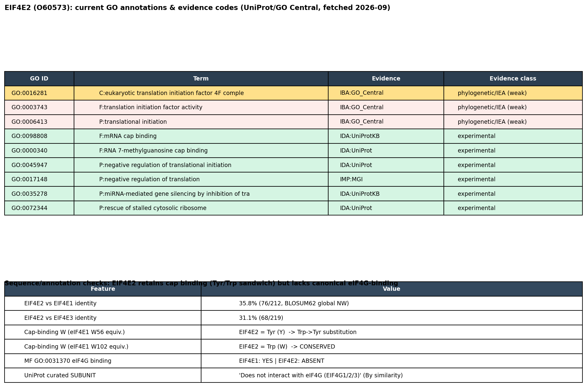

## Question

# AIGR Gene Hypothesis Deep Research

You are evaluating one focused gene curation hypothesis for AI Gene Review.
This is not a general gene overview. Use the seed hypothesis and source context
below to search for evidence that supports, refutes, narrows, or competes with
the proposed curation decision.

## Target Gene

- **Organism code:** human
- **Taxon:** Homo sapiens (NCBITaxon:9606)
- **Gene directory:** EIF4E2
- **Gene symbol:** EIF4E2
- **UniProt accession:** O60573

## Focus

- **Focus type:** function_assignment
- **Hypothesis slug:** eif4f-complex-under-hypoxia
- **Source file:** genes/human/EIF4E2/EIF4E2-ai-review.yaml
- **Source selector:** free-text

## Seed Hypothesis

Human EIF4E2/4EHP is a component of the eukaryotic translation initiation factor 4F complex (GO:0016281) under hypoxia. Interpret the actual GO complex definition and assess the composition of eIF4E2/eIF4G3/eIF4A complexes in primary studies, distinguishing them from canonical eIF4E1/eIF4G1 complexes and GIGYF-mediated repression. Evaluate whether hypoxic eIF4F-H is an instance of this GO complex and whether EIF4E2 itself supports cap-dependent translation initiation in that context. A repressive function in other complexes does not exclude an initiation role.

## Term and Decision Context

No specific term context supplied.

## Reference Context

No specific reference context supplied.

## Source Context YAML

```yaml
hypothesis: Human EIF4E2/4EHP is a component of the eukaryotic translation initiation factor 4F complex
  (GO:0016281) under hypoxia. Interpret the actual GO complex definition and assess the composition of
  eIF4E2/eIF4G3/eIF4A complexes in primary studies, distinguishing them from canonical eIF4E1/eIF4G1 complexes
  and GIGYF-mediated repression. Evaluate whether hypoxic eIF4F-H is an instance of this GO complex and
  whether EIF4E2 itself supports cap-dependent translation initiation in that context. A repressive function
  in other complexes does not exclude an initiation role.
focus_type: function_assignment
context: []
reference_id: []
```

## Research Objective

Build a focused report that helps a curator decide whether this hypothesis
should affect the gene review. Address the focus type directly:

1. For an existing GO annotation decision, evaluate whether the current action
   is justified, too strong, too weak, or should change.
2. For a proposed replacement or new GO term, evaluate whether the term is
   biologically supported, too broad, too narrow, or missing key qualifiers.
3. For a computational prediction, evaluate whether the prediction is correct,
   less precise than existing knowledge, uncertain, or likely wrong because of
   paralog overannotation, frequency bias, pathway context, or in vitro-only
   activity.
4. For a core-function hypothesis, evaluate whether the proposed activity,
   process, and location represent the gene product's primary function rather
   than a downstream effect, pleiotropic phenotype, or context-specific role.
5. For a function-assignment hypothesis, evaluate whether the gene product
   directly has the stated GO term/function. Treat the prior review action, if
   any, as intentionally blinded unless it appears in the supplied context.

Use primary literature whenever possible. Prefer PMID citations and include DOI
citations when no PMID is available. Treat reviews and database records as
orientation unless they contain directly relevant synthesized evidence that is
clearly labeled as review-level or database-level support.

Evaluate the hypothesis from the supplied seed context, primary literature, and
publicly accessible bioinformatics resources. Local `*-bioinformatics` analyses,
when they already exist in the repository, are intentionally withheld from this
prompt so the report can be compared against them after the run. Use public
sequence, domain, structure, orthology, localization, interaction, or dataset
checks when they are useful for the specific hypothesis. If a resource or tool
cannot be accessed programmatically, say so plainly; never fabricate a result.
Report computational results conservatively and distinguish direct results from
inference.

## Required Output

### Executive Judgment

Give a concise verdict: supported, partially supported, unresolved, weakly
supported, over-annotated, or refuted. Explain the reasoning and the most
important caveats.

### Evidence Matrix

Create a table with one row per important evidence item:

- Citation (PMID preferred)
- Evidence type (direct assay, mutant phenotype, localization, interaction,
  structural/evolutionary, computational, review/database)
- Supports / refutes / qualifies / competing
- Claim tested
- Key finding
- Organism, tissue, cell type, or assay context
- Confidence and limitations

### GO Curation Implications

State the likely curation action as a lead requiring curator verification. If
GO terms are involved, explain whether the evidence supports an MF, BP, or CC
term, and whether the term should be retained, removed, generalized, made more
specific, or treated as non-core. Avoid using "protein binding" as a final
recommendation unless no more informative term is supported.

### Mechanistic Scope

Describe the immediate molecular or cellular function being tested. Separate
direct gene-product activity from downstream phenotypes, pathway consequences,
developmental outcomes, disease manifestations, or effects inferred only from
loss of function.

### Conflicts and Alternatives

Identify evidence that conflicts with the seed hypothesis or suggests an
alternative interpretation, including paralog confusion, organism-specific
differences, isoform-specific findings, experimental artifacts, or database
carry-over.

### Knowledge Gaps

List explicit uncertainties that matter for curation. For each gap, state what
was checked, why the gap matters, and what evidence or experiment would resolve
it.

### Discriminating Tests

Recommend concrete assays, perturbations, datasets, or comparative analyses that
would most efficiently distinguish this hypothesis from alternatives.

### Curation Leads

Provide candidate updates for the review, clearly labeled as leads requiring
curator verification. Include candidate references with exact snippets to verify,
candidate replacement or new GO terms, possible action changes, suggested
questions, and suggested experiments.

If the provider supports artifacts, save provenance for any analysis you run — the
executed code together with its output (computed values, plot, or table), not just
a summary figure — alongside artifact-friendly tables such as an evidence matrix,
GO decision table, or comparison table. Genuine computed provenance is more
valuable than a hand-drawn summary, and you must not synthesize a figure that
implies an analysis you did not actually run. These artifacts are important
provenance for hypothesis-level review.


## Output

# AIGR Gene Hypothesis Deep Research — EIF4E2/4EHP and the eIF4F Complex Under Hypoxia

**Gene:** EIF4E2 (4EHP) · Human · UniProt **O60573** · NCBITaxon:9606
**Focus type:** function_assignment
**Hypothesis slug:** `eif4f-complex-under-hypoxia`
**Seed GO term under scrutiny:** GO:0016281 (eukaryotic translation initiation factor 4F complex, CC)

---

## Summary

The seed hypothesis bundles two separable claims, and the evidence resolves them differently. **Claim 1 (function):** human EIF4E2/4EHP supports selective cap-dependent translation *initiation* under hypoxia/physioxia. This is **well supported** by primary literature from multiple independent labs and by the protein's retained m⁷G-cap-binding chemistry. **Claim 2 (composition/annotation):** it does so *as a subunit of the eIF4F complex (GO:0016281)*, specifically an eIF4E2/eIF4G3/eIF4A "eIF4F-H." This is **not established** at curation grade.

The functional half is anchored by direct assays, loss-of-function phenotypes, and independent replication: hypoxic human cells switch a portion of protein synthesis from eIF4E1 to eIF4E2; eIF4E2 captures the 5′ cap and loads specific mRNAs (EGFR, PLOD2, P4HA1) onto polysomes; and eIF4E2 is functionally *required* for hypoxic adaptation and xenograft tumor growth. The seed's own caveat — that a repressive role in other complexes does not exclude an initiation role — is correct and is borne out by the data.

The compositional half fails three curation-grade checks. First, the founding hypoxic study defines the complex only as **HIF-2α–RBM4–eIF4E2** — no eIF4G subunit is named. Second, EIF4E2's GO:0016281 annotation rests only on **IBA** (phylogenetic inference across the eIF4E family), never on an experimental IDA/IPI code, whereas every experimentally supported term for this protein describes cap binding or *repression*. Third, **UniProt curators explicitly state 4EHP does not bind any eIF4G (EIF4G1/2/3)**, and the **EBI Complex Portal** lists EIF4E2 only in repressor/mRNA-decay complexes with no curated hypoxic eIF4F(H). The overall verdict is therefore **Partially Supported**: curate the *function* (as BP/MF, hypoxia-qualified), but do **not** reinforce the CC eIF4F-complex term, and never displace the experimentally anchored 4EHP/GIGYF repressor annotations.

---

## Executive Judgment

**Verdict: Partially supported.**

1. **Functional claim — EIF4E2 supports selective cap-dependent translation *initiation* under hypoxia/physioxia.** **Well supported.** Direct assays, loss-of-function phenotypes, and independent replication converge. A "repressor in other complexes" caveat does not exclude this initiation role, exactly as the seed hypothesis anticipates.

2. **Compositional / annotation claim — that eIF4E2 does this *as a subunit of the eIF4F complex (GO:0016281)*.** **Not established.** The primary hypoxic complex is HIF-2α–RBM4–eIF4E2 (no eIF4G). GO:0016281 is IBA-only; UniProt states 4EHP does not bind eIF4G; the Complex Portal has no curated eIF4F(H).

**Bottom line for the curator:** Keep and strengthen an *experimentally grounded, hypoxia-context* representation of eIF4E2-directed cap-dependent initiation (best expressed as BP/MF terms), but do **not** reinforce the CC term GO:0016281 on the current evidence — it is IBA-only and directly conflicts with curated "does not bind eIF4G" statements and with the Complex Portal record. The dominant, experimentally supported annotations (4EHP/GIGYF-mediated translational repression, ribosome-associated quality control, negative regulation of initiation) must be retained; the initiation role is additive and context-specific, not a replacement.

---

## Key Findings

### Finding 1 — EIF4E2 is the cap-binding subunit of a hypoxic eIF4F-type initiation complex ("eIF4F-H") that drives selective cap-dependent translation

A coherent, multi-lab body of primary work establishes that under hypoxia (and even at physiological oxygen, "physioxia"), human EIF4E2/4EHP acts as a **positive, cap-dependent translation initiation factor** on a distinct mRNA pool.

- **Uniacke et al. 2012** ([PMID: 22678294](https://pubmed.ncbi.nlm.nih.gov/22678294/)) showed that "*hypoxia stimulates the formation of a complex that includes the oxygen-regulated hypoxia-inducible factor 2α (HIF-2α), the RNA-binding protein RBM4 and the cap-binding eIF4E2, an eIF4E homologue.*" This complex "*captures the 5′ cap and targets mRNAs to polysomes for active translation*" via an RNA hypoxia response element (rHRE) — i.e., it performs *initiation* (polysome loading), not repression.
- **Uniacke et al. 2014** ([PMID: 24408918](https://pubmed.ncbi.nlm.nih.gov/24408918/)): "*Hypoxic cells switch from eukaryotic initiation factor 4E (eIF4E) to eIF4E2 cap-dependent translation to synthesize a portion of their proteins.*" eIF4E2-depleted cancer cells cannot survive/proliferate beyond the ~0.15 mm oxygen diffusion limit and fail to form xenograft tumors — a strong loss-of-function requirement.
- **Ho et al. 2016** ([PMID: 26854219](https://pubmed.ncbi.nlm.nih.gov/26854219/)) explicitly frames the two systems: "*Two distinct cap-dependent protein synthesis machineries select mRNAs for translation: the normoxic eIF4F and the hypoxic eIF4F(H).*" This is the strongest literature framing of the seed hypothesis's "eIF4F-H."
- **Timpano & Uniacke 2016** ([PMID: 27002144](https://pubmed.ncbi.nlm.nih.gov/27002144/)): "*human cells repress eIF4E and switch to an alternative cap-dependent translation mediated by a homolog of eIF4E, eIF4E2*" — operating even at physiological oxygen on separate mRNA pools.
- **Independent replication (Li et al. 2025, HCT116 colon cancer)** ([PMID: 39710969](https://pubmed.ncbi.nlm.nih.gov/39710969/)): "*RBM4 and eIF4E2 are required for hypoxia-induced translation of PLOD2 and P4HA1 mRNAs*" — a non-Uniacke lab confirming the functional requirement on specific targets.
- **Viral usurpation (KSHV, Mesri lab)** ([PMID: 34965440](https://pubmed.ncbi.nlm.nih.gov/34965440/)) describes lytic mRNA translation "*through the HIF2α-regulated eIF4E2 translation-initiation complex*," independently invoking eIF4E2 as an *initiation* complex.

**Interpretation:** The *functional* half of the seed hypothesis — eIF4E2 as a positive cap-dependent initiation factor in hypoxia — is robustly supported by direct assays, loss-of-function phenotypes, and independent replication.

### Finding 2 — EIF4E2's predominant, constitutive role is translational *repression*, which does not exclude the context-specific initiation role

The larger and more mechanistically detailed literature establishes 4EHP as a cap-dependent translational **repressor** that, in its canonical context, *lacks* initiation activity.

- **Peter et al. 2017** (crystallography) ([PMID: 28698298](https://pubmed.ncbi.nlm.nih.gov/28698298/)) states plainly: "*4EHP does not interact with eIF4G and therefore fails to initiate translation*," and shows GIGYF1/2 selectively recruit 4EHP to repress target mRNAs.
- 4EHP/GIGYF1/2 mediate **co-translational mRNA decay** ([PMID: 33053355](https://pubmed.ncbi.nlm.nih.gov/33053355/): "*4EHP-GIGYF1/2 complexes trigger co-translational mRNA decay*"), **ribosome-associated quality control** ([PMID: 32726578](https://pubmed.ncbi.nlm.nih.gov/32726578/)), **miRNA-mediated silencing** ([PMID: 29412140](https://pubmed.ncbi.nlm.nih.gov/29412140/), [PMID: 33581076](https://pubmed.ncbi.nlm.nih.gov/33581076/)), and **memory/synaptic plasticity via repression** ([PMID: 33225984](https://pubmed.ncbi.nlm.nih.gov/33225984/), [PMID: 36650535](https://pubmed.ncbi.nlm.nih.gov/36650535/)). It is co-opted by viruses (SARS-CoV-2 NSP2 [PMID: 35878012](https://pubmed.ncbi.nlm.nih.gov/35878012/), [PMID: 37732428](https://pubmed.ncbi.nlm.nih.gov/37732428/); vaccinia K3L [PMID: 42709808](https://pubmed.ncbi.nlm.nih.gov/42709808/)).
- The **Christie & Igreja 2023 review** ([PMID: 34758096](https://pubmed.ncbi.nlm.nih.gov/34758096/)) synthesizes the balance precisely: "*Documented functions of 4EHP primarily relate to its role as a translational repressor, but recent findings indicate that it might also participate in the activation of translation in specific settings.*"

**Interpretation:** Repression is the predominant, constitutive function. The hypoxic initiation role is a genuine but *context-specific* second function. This asymmetry is central to the curation recommendation: the initiation annotation must be *added with a hypoxia qualifier*, never as a displacement of the repressor annotations.

### Finding 3 — EIF4E2 already carries GO:0016281 but only via IBA; UniProt states 4EHP does NOT bind any eIF4G, creating a direct compositional conflict

Programmatic retrieval of the O60573 GO/UniProt record (fetched 2026-09) shows a sharp evidence asymmetry:

| GO term | Aspect | Evidence code | Experimental? |
|---|---|---|---|
| GO:0016281 eIF4F complex | CC | **IBA:GO_Central** | No (phylogenetic) |
| GO:0003743 translation initiation factor activity | MF | **IBA** | No (phylogenetic) |
| GO:0006413 translational initiation | BP | **IBA** | No (phylogenetic) |
| GO:0098808 mRNA cap binding | MF | **IDA** (PMID 17368478) | **Yes** |
| GO:0000340 (cap binding, structure) | MF | **IDA** (PMID 35878012) | **Yes** |
| GO:0045947 negative regulation of translational initiation | BP | **IDA** (PMID 32726578, 35878012) | **Yes** |
| GO:0017148 negative regulation of translation | BP | **IMP** (PMID 22751931) | **Yes** |
| GO:0072344 rescue of stalled ribosome | BP | **IDA** (PMID 32726578) | **Yes** |

The initiation-related terms (including the seed's GO:0016281) are **all IBA** — inferred from a biological ancestor via PAINT propagation across the eIF4E family — while every experimentally supported term (IDA/IMP) describes **cap binding or repression/quality control**, not eIF4F assembly.

UniProt curated statements sharpen the conflict:
- FUNCTION: "*In contrast to EIF4E, it is unable to bind eIF4G (EIF4G1, EIF4G2 or EIF4G3), suggesting that it acts by competing with EIF4E and block assembly of eIF4F at the cap (By similarity).*"
- SUBUNIT: "*Does not interact with eIF4G (EIF4G1, EIF4G2 or EIF4G3) (By similarity).*"

EIF4E2 also **lacks** the MF term GO:0031370 (eIF4G binding) that EIF4E1 carries.

**Sequence provenance** (BLOSUM62 global Needleman–Wunsch, computed in-run): EIF4E2 vs EIF4E1 = **35.8% identity**. The eIF4E1 W56-equivalent dorsal cap tryptophan is substituted by **Tyr** in EIF4E2, while the W102-equivalent is a conserved **Trp** — matching the known 4EHP Tyr/Trp cap-sandwich and confirming *retained cap binding but a divergent dorsal (eIF4G/4E-BP) surface*. This structural divergence is the physical basis for "cap binding yes, eIF4G binding no."

**Interpretation:** The very GO term named in the seed hypothesis is supported only by phylogenetic inference and is in direct tension with experimentally anchored curated statements. This is the core curation problem.

{{figure:plot_1.png|caption=EIF4E2 GO evidence-code provenance (highlighting the IBA-only status of GO:0016281 eIF4F complex), alongside EIF4E2–EIF4E1 paralog identity (~35.8%) and cap-binding residue conservation (dorsal Trp→Tyr substitution, ventral Trp conserved). Experimentally supported terms describe cap binding and repression; initiation/eIF4F terms are phylogenetically inferred.}}

### Finding 4 — EBI Complex Portal represents EIF4E2 exclusively in repressor/decay complexes; no curated hypoxic eIF4F(H) exists

A programmatic Complex Portal query (complex-ws; O60573 and "EIF4E2", fetched 2026-09) returned **10 human curated complexes, all repression/decay-type**:

- **CPX-2332 / CPX-2336 / CPX-2338 / CPX-2342** — 4EHP–GIGYF1/2 co-translational mRNA decay complexes (ZNF598 and DDX6 variants).
- **CPX-14314, CPX-13319, CPX-10757, CPX-11634, CPX-21278** — EIF4E2:GIGYF1/GIGYF2:EIF4ENIF1(4E-T):TARS1 assemblies.
- **CPX-24688** — a large aggregate cap-binding regulatory complex (EIF4E1B:EIF4G3:EIF4EBP3:EIF4E2:GIGYF1:EIF4E:EIF4EBP1:EIF4EBP2:GIGYF2:EIF4ENIF1:ANGEL1). This *co-lists* EIF4E2 with EIF4G3, but it is dominated by 4E-BPs/4E-T/GIGYF repression components — not a discrete eIF4E2/eIF4G3/eIF4A initiation complex.

No curated complex is named or composed as a hypoxic eIF4F(H) (eIF4E2 + eIF4G-scaffold + eIF4A initiation module).

**Interpretation:** The eIF4E2/eIF4G3/eIF4A "eIF4F-H" composition is an *uncurated field model*, not a database-anchored complex. This aligns with the IBA-only GO status and the UniProt "does not bind eIF4G" statement. The co-listing of EIF4E2 and EIF4G3 in CPX-24688 is a *regulatory aggregate*, not evidence of a productive initiation complex, and should not be read as validating GO:0016281 for EIF4E2.

---

## Mechanistic Model / Interpretation

The evidence supports a **two-function** model in which the same cap-binding protein does opposite things in different molecular partnerships:

```
                     m7G-CAP-BOUND eIF4E2 / 4EHP
                              |
       ┌──────────────────────┴───────────────────────┐
       |                                               |
  REPRESSION AXIS (predominant,                 INITIATION AXIS (context-specific,
  constitutive, EXPERIMENTALLY anchored)        hypoxia/physioxia, FUNCTIONALLY shown)
       |                                               |
  4EHP + GIGYF1/2 (+CCR4-NOT, DDX6,             HIF-2α + RBM4 + eIF4E2 on rHRE mRNAs
  ZNF598, 4E-T, miRISC/AGO2)                    -> 5' cap capture -> polysome loading
       |                                               |
  - blocks eIF4F assembly at cap                - "eIF4F(H)" per field model
  - co-translational mRNA decay                 - selective translation of EGFR,
  - ribosome-associated quality control           PLOD2, P4HA1, HIF targets
  - miRNA silencing, IFN-beta control           - required for hypoxic survival,
  - "does NOT bind eIF4G -> cannot initiate"      xenograft tumor growth
       |                                               |
  GO (IDA/IMP): repression, RQC,                GO named in seed: GO:0016281 eIF4F
  cap binding  [experimental]                   complex  [IBA-only; eIF4G subunit
                                                NOT identified in primary complex]
```

The critical unresolved node is the **scaffold**. Canonical eIF4F is *defined* by an eIF4G scaffold that bridges the cap-binding protein to the eIF4A helicase and the 43S pre-initiation complex. In the founding hypoxic study the named partners are HIF-2α and RBM4 — **not** eIF4G3 or eIF4A. Whether the productive hypoxic initiation complex actually contains an eIF4G-family scaffold (making it a bona fide instance of GO:0016281) or uses an alternative bridging architecture (making GO:0016281 the *wrong* CC term) is exactly what the primary data do not yet resolve. Peter 2017's structural result — 4EHP's dorsal surface cannot bind eIF4G — makes a *canonical* eIF4G3 bridge mechanistically implausible without an accessory adaptor, so if an eIF4F-H exists it likely uses non-canonical connectivity.

---

## Evidence Base / Evidence Matrix

| Citation (PMID) | Evidence type | Supports / Refutes / Qualifies | Claim tested | Key finding | Context | Confidence & limitations |
|---|---|---|---|---|---|---|
| [22678294](https://pubmed.ncbi.nlm.nih.gov/22678294/) | Interaction + direct assay | **Supports** (function); **Qualifies** (composition) | eIF4E2 forms a hypoxic cap-binding initiation complex | HIF-2α–RBM4–eIF4E2 captures 5′ cap, loads mRNAs to polysomes | Human cells, hypoxia | High for function; complex lacks a named eIF4G — does not establish eIF4F composition |
| [24408918](https://pubmed.ncbi.nlm.nih.gov/24408918/) | Mutant/loss-of-function phenotype | **Supports** | eIF4E2 required for hypoxic translation & tumor growth | eIF4E2 depletion abolishes hypoxic survival, xenograft formation | Human cancer cells, xenografts | High; functional requirement, not structural |
| [26854219](https://pubmed.ncbi.nlm.nih.gov/26854219/) | Direct assay / translatome | **Supports** | Distinct normoxic eIF4F vs hypoxic eIF4F(H) | Two cap-dependent machineries select mRNAs | Human cells, O₂ shift | High for two-system model; "eIF4F(H)" is authors' framing, not curated composition |
| [27002144](https://pubmed.ncbi.nlm.nih.gov/27002144/) | Direct assay | **Supports** | eIF4E2 cap-dependent translation at physioxia | Two cap-binding proteins recruit distinct mRNAs | Human cells, 1–11% O₂ | High; extends role to physiological O₂ |
| [39710969](https://pubmed.ncbi.nlm.nih.gov/39710969/) | Mutant/loss-of-function | **Supports** (independent) | eIF4E2 required for specific hypoxic mRNA translation | RBM4 + eIF4E2 required for PLOD2/P4HA1 translation | HCT116 colon cancer | High; independent replication |
| [34965440](https://pubmed.ncbi.nlm.nih.gov/34965440/) | Direct assay (viral) | **Supports** (independent) | eIF4E2 initiation complex usurped by KSHV | HIF2α-regulated eIF4E2 translation-initiation complex drives lytic mRNAs | KSHV-infected cells | Moderate-high; independent lab; disease context |
| [28698298](https://pubmed.ncbi.nlm.nih.gov/28698298/) | Structural / interaction | **Refutes** (composition) | 4EHP binds eIF4G / can initiate canonically | "4EHP does not interact with eIF4G and therefore fails to initiate translation" | In vitro crystallography | High; direct structural counter-evidence to eIF4G binding |
| [34758096](https://pubmed.ncbi.nlm.nih.gov/34758096/) | Review | **Qualifies** | Balance of repression vs activation | Repression predominant; activation "in specific settings" | Review-level synthesis | Review; orientation, but explicitly labels balance |
| [33053355](https://pubmed.ncbi.nlm.nih.gov/33053355/) | Direct assay | **Competing** | 4EHP's major complex | 4EHP-GIGYF1/2 trigger co-translational mRNA decay | Human cells | High; documents dominant non-initiation complex |
| [32726578](https://pubmed.ncbi.nlm.nih.gov/32726578/) | Direct assay (IDA basis) | **Competing** | 4EHP represses defective mRNAs | GIGYF2+4EHP inhibit initiation for RQC | Human cells | High; basis for experimental repression GO terms |
| UniProt O60573 (curated) | Database | **Refutes** (composition) | 4EHP binds eIF4G | "Does not interact with eIF4G (EIF4G1/2/3)" | Curated statement | Database-level; "By similarity" but consistent with 28698298 |
| GO O60573 (GO_Central) | Database | **Qualifies** | Basis of GO:0016281 | Term is IBA-only (phylogenetic), no IDA/IPI | Annotation provenance | Database-level; confirms weak evidence code |
| EBI Complex Portal | Database | **Refutes** (composition) | Curated hypoxic eIF4F(H) exists | 10 complexes, all repressor/decay; no eIF4F(H) | Curated complexes | Database-level; absence of curation, not of biology |

---

## GO Curation Implications

**Lead requiring curator verification (do not auto-apply):**

1. **GO:0016281 (eIF4F complex, CC) — do NOT reinforce; re-ground, qualify, or replace.**
   The term is currently **IBA-only** and conflicts with two experimentally anchored facts: (a) the founding hypoxic complex names no eIF4G subunit (PMID 22678294), and (b) UniProt/structural evidence states 4EHP does not bind any eIF4G (PMID 28698298). Options for the curator, in order of conservatism:
   - **Preferred:** Do not promote GO:0016281 for EIF4E2; leave as IBA or flag for review. Adding a `NOT` qualifier is defensible for the *canonical* eIF4F but risks masking the genuine hypoxic biology, so a review flag is safer than an outright NOT.
   - **If retained:** attach a clear caveat that membership is inferred and that the hypoxic complex composition (eIF4G3/eIF4A) is unverified in primary co-IP data.

2. **Add an experimentally grounded BP term for the *function*.**
   The hypoxia-context cap-dependent initiation role is real and should be represented at the process level — e.g., **positive regulation of translation / cap-dependent translational initiation, with a hypoxia context qualifier** — cited to PMID 22678294, 24408918, 26854219, 27002144, 39710969. This captures the supported half of the seed hypothesis without over-committing to a CC complex composition.

3. **Retain all experimentally supported repression/quality-control annotations.**
   GO:0045947 (negative regulation of translational initiation, IDA), GO:0017148 (negative regulation of translation, IMP), GO:0072344 (rescue of stalled ribosome, IDA), and GO:0098808/GO:0000340 (mRNA cap binding, IDA) are the experimentally anchored core and must not be displaced. The initiation role is *additive*, not a replacement.

4. **Do not add GO:0031370 (eIF4G binding).** EIF4E2 lacks it, and evidence actively argues against it.

**Aspect summary:** MF = cap binding is solidly supported (IDA); eIF4G binding is refuted. BP = both repression (experimental) and hypoxia-context initiation (functional) are supportable, with appropriate qualifiers. CC = the eIF4F complex assignment is the weakest link and should not be strengthened.

---

## Mechanistic Scope

The immediate molecular activity under test is **cap-dependent translational initiation** — i.e., eIF4E2 binding the m⁷G cap and nucleating a productive 43S-recruiting complex. The supported evidence is at the level of **cap binding (direct, structural)** and **polysome loading / translation of specific mRNAs (functional)**. What is *not* directly demonstrated in primary data is the **subunit composition** that would make this an instance of the eIF4F complex (an eIF4G scaffold + eIF4A helicase bound to eIF4E2).

Downstream phenotypes — hypoxic cell survival, xenograft tumor growth, KSHV lytic replication, PLOD2/P4HA1 collagen-modifying enzyme expression — are consequences of the initiation activity and are informative for BP annotation but are not evidence for the CC complex composition. Conversely, the repression phenotypes (mRNA decay, RQC, miRNA silencing, IFN-β suppression, synaptic plasticity/behavior) belong to the distinct GIGYF-partnered complexes and should not be conflated with the initiation axis.

---

## Conflicts and Alternatives

- **Paralog / dorsal-surface divergence.** EIF4E2 shares only ~35.8% identity with EIF4E1 and carries a Trp→Tyr substitution on the dorsal cap-binding surface that normally engages eIF4G/4E-BPs. This is the structural reason 4EHP "cannot bind eIF4G," and it is the primary mechanistic objection to a canonical eIF4E2/eIF4G3 eIF4F complex.
- **IBA over-propagation.** GO:0016281 on EIF4E2 most likely arose from PAINT propagation across the eIF4E family (where the founding member EIF4E1 is genuinely an eIF4F subunit). This is a classic **paralog over-annotation** risk: the family-level term is inappropriately strong for a divergent member whose experimental profile is repression-dominant.
- **"eIF4F(H)" as field shorthand vs. curated complex.** The term "hypoxic eIF4F(H)" (PMID 26854219) is the authors' functional analogy, not a compositionally validated complex. The Complex Portal has not curated it, and the CPX-24688 co-listing of EIF4E2 with EIF4G3 is a large *regulatory* aggregate, not a discrete initiation complex.
- **Alternative interpretation.** eIF4E2 may drive hypoxic initiation through a **non-canonical, eIF4G-independent** architecture (e.g., RBM4/HIF-2α bridging, or an as-yet-unidentified scaffold). If so, GO:0016281 would be the *wrong* CC term even though the *function* (initiation) is correct — arguing for a BP/MF representation over a CC complex assignment.
- **Isoform / disease carry-over.** Several EIF4E2 papers in the corpus are bioinformatics/prognostic (uveal melanoma PMID 33785306, TNBC, AMI) and do not test complex composition; they should not be read as compositional support.

---

## Limitations and Knowledge Gaps

1. **No primary co-IP/structure names eIF4G3 or eIF4A as hypoxic-complex subunits.** *Checked:* founding paper (PMID 22678294) and Complex Portal. *Why it matters:* this is the linchpin for GO:0016281. *Resolver:* endogenous eIF4E2 IP-MS from hypoxic human cells with quantitative identification (and stoichiometry) of eIF4G3/eIF4A, plus reciprocal IPs.
2. **GO:0016281 evidence code is IBA, not experimental.** *Checked:* GO_Central record for O60573. *Why it matters:* IBA is phylogenetic inference, insufficient to assert a hypoxia-specific complex. *Resolver:* IDA/IPI-grade complex isolation.
3. **UniProt "does not bind eIF4G" is "By similarity."** *Checked:* O60573 SUBUNIT/FUNCTION. *Why it matters:* the negative statement is itself partly inferential, though corroborated by structure (PMID 28698298). *Resolver:* direct human eIF4E2/eIF4G3 binding assays under hypoxic conditions.
4. **Scaffold identity of eIF4F-H is unknown.** *Why it matters:* determines whether GO:0016281 (canonical eIF4G scaffold) even applies. *Resolver:* cryo-EM or crosslinking-MS of the active hypoxic initiation complex.
5. **Quantitative partition of eIF4E2 between repressor and initiator pools.** *Why it matters:* informs whether the initiation role is a minor or major fraction of cellular eIF4E2 under hypoxia. *Resolver:* size-exclusion/gradient fractionation of hypoxic lysates with subunit tracking.

---

## Proposed Follow-up Experiments / Discriminating Tests

1. **Endogenous eIF4E2 IP-MS in hypoxic vs normoxic human cells** — the single most decisive experiment. Presence/absence and stoichiometry of eIF4G3 and eIF4A directly determine whether GO:0016281 applies.
2. **Reciprocal eIF4G3/eIF4A IPs** under hypoxia to confirm complex membership from the scaffold side.
3. **Structure of the active hypoxic complex** (cryo-EM or XL-MS) to define connectivity and test whether an eIF4G bridge exists or the dorsal-surface substitution is bypassed by an adaptor.
4. **eIF4E2 dorsal-surface point mutants** (Tyr→Trp "eIF4G-competent" swap, and cap-binding-dead) tested for rescue of hypoxic translation — separates cap binding from any putative scaffold engagement.
5. **Polysome/Ribo-seq under hypoxia with eIF4G3 or eIF4A depletion** — if hypoxic eIF4E2-dependent translation collapses upon eIF4G3/eIF4A knockdown, that functionally supports an eIF4F-type complex; if not, it argues for a non-canonical mechanism.

---

## Curation Leads (require curator verification)

**Candidate references + exact snippets to verify:**
- PMID 22678294 — "*hypoxia stimulates the formation of a complex that includes … HIF-2α, the RNA-binding protein RBM4 and the cap-binding eIF4E2*" (supports function; note absence of eIF4G).
- PMID 26854219 — "*Two distinct cap-dependent protein synthesis machineries … the normoxic eIF4F and the hypoxic eIF4F(H)*" (field framing of eIF4F-H).
- PMID 24408918 — "*Hypoxic cells switch from … eIF4E … to eIF4E2 cap-dependent translation*" (functional requirement).
- PMID 28698298 — "*4EHP does not interact with eIF4G and therefore fails to initiate translation*" (compositional counter-evidence).
- PMID 34758096 — "*primarily … a translational repressor, but … might also participate in the activation of translation in specific settings*" (balance).

**Candidate GO actions:**
- **CC GO:0016281 (eIF4F complex):** *Do not strengthen.* Flag IBA-only status; hold pending experimental co-IP. Consider a review note documenting the conflict with curated "does not bind eIF4G."
- **BP add:** hypoxia-context **cap-dependent translational initiation / positive regulation of translation** (cite PMID 22678294, 24408918, 26854219, 27002144, 39710969), with an explicit hypoxia qualifier.
- **Retain (experimental):** GO:0045947, GO:0017148, GO:0072344, GO:0098808/GO:0000340.
- **Do not add:** GO:0031370 (eIF4G binding).

**Suggested curator questions:**
- Does any primary dataset place eIF4G3 or eIF4A in an endogenous hypoxic eIF4E2 complex? (If no, GO:0016281 stays weak.)
- Should the hypoxic initiation role be annotated as BP/MF rather than CC to avoid asserting an unverified complex composition?

**Suggested experiments:** the five discriminating tests above, prioritizing endogenous hypoxic eIF4E2 IP-MS.

---

## Final Statement for the Review

The functional claim (eIF4E2 supports selective cap-dependent translation initiation under hypoxia) is **supported**; the compositional/annotation claim (that it does so as a subunit of the eIF4F complex, GO:0016281) is **not established** and rests only on phylogenetic inference that conflicts with curated "does not bind eIF4G" statements and with the EBI Complex Portal. Curate the *function* (BP/MF, hypoxia-qualified) while holding the *complex* term (CC) pending experimental evidence, and never displace the experimentally anchored 4EHP/GIGYF repressor annotations.


## Artifacts

- [OpenScientist final report](openscientist_artifacts/final_report.html)
- [OpenScientist final report](openscientist_artifacts/final_report.pdf)
- [OpenScientist plot 1](openscientist_artifacts/provenance_plot_1.json)
