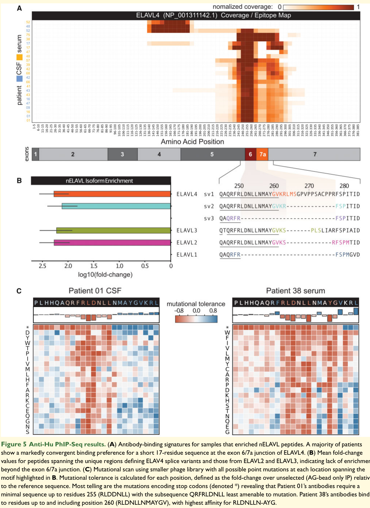

## Question

# Gene Research for Functional Annotation

## ⚠️ CRITICAL: Gene/Protein Identification Context

**BEFORE YOU BEGIN RESEARCH:** You MUST verify you are researching the CORRECT gene/protein. Gene symbols can be ambiguous, especially for less well-characterized genes from non-model organisms.

### Target Gene/Protein Identity (from UniProt):
- **UniProt Accession:** Q14576
- **Protein Description:** RecName: Full=ELAV-like protein 3; AltName: Full=Hu-antigen C; Short=HuC; AltName: Full=Paraneoplastic cerebellar degeneration-associated antigen; AltName: Full=Paraneoplastic limbic encephalitis antigen 21;
- **Gene Information:** Name=ELAVL3; Synonyms=HUC, PLE21;
- **Organism (full):** Homo sapiens (Human).
- **Protein Family:** Belongs to the RRM elav family. .
- **Key Domains:** ELAD_HU_SF. (IPR006548); HuC_RRM3. (IPR034915); Hud_Sxl_RNA. (IPR002343); Nucleotide-bd_a/b_plait_sf. (IPR012677); RBD_domain_sf. (IPR035979)

### MANDATORY VERIFICATION STEPS:

1. **Check if the gene symbol "ELAVL3" matches the protein description above**
2. **Verify the organism is correct:** Homo sapiens (Human).
3. **Check if protein family/domains align with what you find in literature**
4. **If you find literature for a DIFFERENT gene with the same or similar symbol, STOP**

### If Gene Symbol is Ambiguous or You Cannot Find Relevant Literature:

**DO NOT PROCEED WITH RESEARCH ON A DIFFERENT GENE.** Instead:
- State clearly: "The gene symbol 'ELAVL3' is ambiguous or literature is limited for this specific protein"
- Explain what you found (e.g., "Found extensive literature on a different gene with the same symbol in a different organism")
- Describe the protein based ONLY on the UniProt information provided above
- Suggest that the protein function can be inferred from domain/family information

### Research Target:

Please provide a comprehensive research report on the gene **ELAVL3** (gene ID: ELAVL3, UniProt: Q14576) in human.

The research report should be a detailed narrative explaining the function, biological processes, and localization of the gene product. Citations should be given for all claims.

You should prioritize authoritative reviews and primary scientific literature when conducting research. You can supplement
this with annotations you find in gene/protein databases, but these can be outdated or inaccurate.

We are specifically interested in the primary function of the gene - for enzymes, what reaction is catalyzed, and what is the substrate specificity? For transporters, what is the substrate? For structural proteins or adapters, what is the broader structural role? For signaling molecules, what is the role in the pathway.

We are interested in where in or outside the cell the gene product carries out its function.

We are also interested in the signaling or biochemical pathways in which the gene functions. We are less interested in broad pleiotropic effects, except where these elucidate the precise role.

Include evidence where possible. We are interested in both experimental evidence as well as inference from structure, evolution, or bioinformatic analysis. Precise studies should be prioritized over high-throughput, where available.

## Output

Question: You are an expert researcher providing comprehensive, well-cited information.

Provide detailed information focusing on:
1. Key concepts and definitions with current understanding
2. Recent developments and latest research (prioritize 2023-2024 sources)
3. Current applications and real-world implementations
4. Expert opinions and analysis from authoritative sources
5. Relevant statistics and data from recent studies

Format as a comprehensive research report with proper citations. Include URLs and publication dates where available.
Always prioritize recent, authoritative sources and provide specific citations for all major claims.

# Gene Research for Functional Annotation

## ⚠️ CRITICAL: Gene/Protein Identification Context

**BEFORE YOU BEGIN RESEARCH:** You MUST verify you are researching the CORRECT gene/protein. Gene symbols can be ambiguous, especially for less well-characterized genes from non-model organisms.

### Target Gene/Protein Identity (from UniProt):
- **UniProt Accession:** Q14576
- **Protein Description:** RecName: Full=ELAV-like protein 3; AltName: Full=Hu-antigen C; Short=HuC; AltName: Full=Paraneoplastic cerebellar degeneration-associated antigen; AltName: Full=Paraneoplastic limbic encephalitis antigen 21;
- **Gene Information:** Name=ELAVL3; Synonyms=HUC, PLE21;
- **Organism (full):** Homo sapiens (Human).
- **Protein Family:** Belongs to the RRM elav family. .
- **Key Domains:** ELAD_HU_SF. (IPR006548); HuC_RRM3. (IPR034915); Hud_Sxl_RNA. (IPR002343); Nucleotide-bd_a/b_plait_sf. (IPR012677); RBD_domain_sf. (IPR035979)

### MANDATORY VERIFICATION STEPS:

1. **Check if the gene symbol "ELAVL3" matches the protein description above**
2. **Verify the organism is correct:** Homo sapiens (Human).
3. **Check if protein family/domains align with what you find in literature**
4. **If you find literature for a DIFFERENT gene with the same or similar symbol, STOP**

### If Gene Symbol is Ambiguous or You Cannot Find Relevant Literature:

**DO NOT PROCEED WITH RESEARCH ON A DIFFERENT GENE.** Instead:
- State clearly: "The gene symbol 'ELAVL3' is ambiguous or literature is limited for this specific protein"
- Explain what you found (e.g., "Found extensive literature on a different gene with the same symbol in a different organism")
- Describe the protein based ONLY on the UniProt information provided above
- Suggest that the protein function can be inferred from domain/family information

### Research Target:

Please provide a comprehensive research report on the gene **ELAVL3** (gene ID: ELAVL3, UniProt: Q14576) in human.

The research report should be a detailed narrative explaining the function, biological processes, and localization of the gene product. Citations should be given for all claims.

You should prioritize authoritative reviews and primary scientific literature when conducting research. You can supplement
this with annotations you find in gene/protein databases, but these can be outdated or inaccurate.

We are specifically interested in the primary function of the gene - for enzymes, what reaction is catalyzed, and what is the substrate specificity? For transporters, what is the substrate? For structural proteins or adapters, what is the broader structural role? For signaling molecules, what is the role in the pathway.

We are interested in where in or outside the cell the gene product carries out its function.

We are also interested in the signaling or biochemical pathways in which the gene functions. We are less interested in broad pleiotropic effects, except where these elucidate the precise role.

Include evidence where possible. We are interested in both experimental evidence as well as inference from structure, evolution, or bioinformatic analysis. Precise studies should be prioritized over high-throughput, where available.

## Research report: ELAVL3 (HuC) functional annotation (Human; UniProt Q14576)

### Scope and identity verification
The target of this report is **human ELAVL3** (UniProt **Q14576**), encoding **ELAV-like protein 3**, historically named **HuC**, a neuron-enriched member of the **neuronal ELAVL (nELAVL)** RNA-binding protein family (ELAVL2/HuB, ELAVL3/HuC, ELAVL4/HuD), distinct from the ubiquitously expressed ELAVL1/HuR. This identity mapping (ELAVL3→HuC) is explicitly stated in a recent authoritative genetics review of nELAVLs. (mulligan2023themoleculargenetics pages 1-2, mulligan2023themoleculargenetics pages 2-4)

| Property | Summary for ELAVL3 (HuC; UniProt Q14576) | Supporting citations |
|---|---|---|
| Approved gene / protein name | **ELAVL3** encodes **ELAV-like protein 3**, a neuronal RNA-binding protein in human. Historical name **HuC** is explicitly mapped to ELAVL3 in review literature. | (mulligan2023themoleculargenetics pages 2-4, mulligan2023themoleculargenetics pages 1-2) |
| Synonyms / aliases | Common aliases include **HuC**; the UniProt-provided aliases for this target are **HUC** and **PLE21**. Literature in the retrieved evidence directly confirms the HuC name for ELAVL3. | (mulligan2023themoleculargenetics pages 1-2) |
| Organism / target identity | The reviewed literature matches the intended target: **human ELAVL3/HuC**, a neuronal ELAVL-family RNA-binding protein, with no conflicting gene identity found in the evidence set. | (mulligan2023themoleculargenetics pages 2-4, mulligan2023themoleculargenetics pages 1-2) |
| Family membership | ELAVL3 belongs to the **neuronal ELAVL (nELAVL)** subgroup together with **ELAVL2/HuB** and **ELAVL4/HuD**; ELAVL1/HuR is the ubiquitous family member. nELAVLs are enriched in the nervous system. | (mulligan2023themoleculargenetics pages 2-4, mulligan2023themoleculargenetics pages 1-2, negeri2024theroleof pages 39-45, medici2026targetingtherna pages 8-12) |
| Domain architecture | ELAVL3 shares the canonical ELAVL architecture of **three RNA recognition motifs (RRM1, RRM2, RRM3)** plus a **hinge/linker region** between RRM2 and RRM3. The hinge contributes to protein interactions and nucleocytoplasmic trafficking. | (mulligan2023themoleculargenetics pages 2-4, mulligan2023themoleculargenetics pages 7-8, costantino2024elavl3disruptionina pages 22-26, costantino2024elavl3disruptionin pages 22-26) |
| RNA-binding specificity | ELAVL proteins, including ELAVL3, preferentially bind **AU-/U-rich elements** in target RNAs, especially in **3′UTRs**. **RRM1/2** mediate direct binding to AU-rich RNA, whereas **RRM3** contributes to **poly(A)-tail binding** and transcript stabilization. | (medici2026targetingtherna pages 8-12, mulligan2023themoleculargenetics pages 2-4, mulligan2023themoleculargenetics pages 7-8, costantino2024elavl3disruptionina pages 22-26) |
| Core molecular function: mRNA stability | ELAVL3 functions primarily as a **post-transcriptional regulator** that stabilizes target transcripts, in part by binding AU-rich elements and influencing poly(A)-tail-associated protection; ELAVL proteins can multimerize on RNA and oppose destabilizing factors. | (negeri2024theroleof pages 39-45, mulligan2023themoleculargenetics pages 2-4, costantino2024elavl3disruptionina pages 22-26) |
| Core molecular function: translation | ELAVL-family proteins regulate **translation** as part of ribonucleoprotein complexes that route RNAs toward translation or decay; RRM3/poly(A)-associated functions connect ELAVL3 to translational control. | (negeri2024theroleof pages 39-45, mulligan2023themoleculargenetics pages 2-4, costantino2024elavl3disruptionina pages 22-26) |
| Core molecular function: alternative splicing | ELAVL3 has a documented role in **alternative splicing**; all **three RRMs plus the hinge region** contribute to HuC-dependent splice regulation, and ELAVL3 loss alters neuronal splicing programs linked to excitability. | (mulligan2023themoleculargenetics pages 7-8, mulligan2023themoleculargenetics pages 6-7, costantino2024elavl3disruptionin pages 22-26) |
| Core molecular function: alternative polyadenylation / 3′UTR length | ELAVL3 participates in regulation of **alternative polyadenylation** and **3′UTR length** in neurons. ELAVL3 depletion shifts usage toward **proximal poly(A) sites**, whereas neuronal ELAVL proteins promote longer neuronal 3′UTRs. | (mulligan2023themoleculargenetics pages 6-7, dorrity2023long3′utrspredispose pages 8-9) |
| Biological role emphasis | Current understanding places ELAVL3 as a key **neuronal post-transcriptional regulator** affecting transcript isoform choice, mRNA stability, neuronal differentiation, glutamate-related pathways, and neuronal excitability. | (mulligan2023themoleculargenetics pages 2-4, mulligan2023themoleculargenetics pages 6-7, wutikeli2025elavhurnabindingprotein pages 6-7) |
| Typical subcellular localization | ELAVL3 is **predominantly cytoplasmic** but capable of **nucleocytoplasmic shuttling**. A smaller nuclear pool supports roles in splicing and RNA processing, while the hinge/linker region contributes to export/localization control. | (negeri2024theroleof pages 39-45, mulligan2023themoleculargenetics pages 2-4, mulligan2023themoleculargenetics pages 4-5, costantino2024elavl3disruptionin pages 22-26) |

*Table: This table summarizes the verified identity, family context, domain organization, RNA-binding specificity, molecular functions, and localization of human ELAVL3/HuC. It is useful as a concise reference for functional annotation grounded in the retrieved evidence.*

### 1) Key concepts and definitions (current understanding)

#### ELAVL3/HuC as a neuronal RNA-binding protein (RBP)
ELAVL3 is best understood as a **post-transcriptional regulator** that binds mRNAs to control their **processing and fate**, including **alternative splicing**, **alternative polyadenylation (APA)/3′UTR length choice**, **mRNA stability/decay**, **mRNA transport**, and **translation**. This “multi-layer” control is a canonical feature of ELAVL family RBPs in neuronal programs. (mulligan2023themoleculargenetics pages 2-4, negeri2024theroleof pages 39-45)

#### Domain architecture and RNA-binding specificity
Across ELAVL proteins, a conserved architecture of **three RNA recognition motifs (RRM1–RRM3)** plus a **hinge/linker region** supports RNA binding and nucleo-cytoplasmic dynamics. Mechanistically, RRM1/2 primarily mediate binding to **AU-/U-rich elements** commonly found in **3′UTRs**, while RRM3 contributes to binding at/near the **poly(A) tail** and transcript stabilization; ELAVL proteins can also **multimerize** on RNA in an RNA-dependent manner to enhance binding. HuC’s **three RRMs and hinge region** have distinct roles in **alternative splicing regulation**, indicating domain specialization within this architecture. (mulligan2023themoleculargenetics pages 2-4, medici2026targetingtherna pages 8-12, costantino2024elavl3disruptionina pages 22-26, mulligan2023themoleculargenetics pages 7-8)

#### Subcellular localization and site of action
nELAVLs (including ELAVL3) are described as **predominantly cytoplasmic** while retaining the ability to **shuttle between nucleus and cytoplasm**, consistent with combined functions in nuclear pre-mRNA processing (e.g., splicing/APA decisions) and cytoplasmic control of mRNA stability/translation. (negeri2024theroleof pages 39-45, mulligan2023themoleculargenetics pages 2-4, costantino2024elavl3disruptionin pages 22-26)

### 2) Recent developments and latest research (prioritizing 2023–2024)

| Publication | Date | Venue | URL / DOI | Study type | Key ELAVL3/HuC findings | Quantitative data | Supporting citations |
|---|---|---|---|---|---|---|---|
| Mulligan, 2023 | Sep 2023 | *European Journal of Human Genetics* | https://doi.org/10.1038/s41431-023-01456-z | Review; human/mouse/genetics | Authoritative review confirming human **ELAVL3 = HuC**; neuronal ELAVL family member with 3 RRMs + hinge; regulates mRNA stability, translation, alternative splicing, and alternative polyadenylation/3′UTR length; ELAVL3 loss linked to altered glutamate-regulatory transcripts, neuronal excitability, delayed GABAergic differentiation, seizures, and cerebellar ataxia. Also summarizes ALS-linked nuclear depletion/downregulation and proposes biomarker relevance. | Notes ELAVL3-dependent AnkG exon 34 mis-splicing at **2 and 9 months** in knockout mice; cites large human genetics datasets including **>16,000 ASD GWAS individuals**, **2,104 ID trios**, and **42,607 autism cases** in broader ELAVL-family analyses. | (mulligan2023themoleculargenetics pages 2-4, mulligan2023themoleculargenetics pages 1-2, mulligan2023themoleculargenetics pages 6-7, mulligan2023themoleculargenetics pages 7-8, mulligan2023themoleculargenetics pages 5-6) |
| Dorrity, 2023 | Oct 2023 | *Science Immunology* | https://doi.org/10.1126/sciimmunol.adg2979 | Primary; human stem cell-derived neurons and cell systems | Shows neuron-enriched ELAVL proteins (**ELAVL2/3/4**) promote neuronal **3′UTR lengthening**, increasing dsRNA load and tonic activation of dsRNA sensors (MDA5, PKR, TLR3). HuC is implicated in a neuron-specific post-transcriptional program that couples long 3′UTRs to antiviral immunity and inflammatory risk. Combined HuB/C/D expression caused global 3′UTR lengthening without major bulk transcript-level changes. | Reports that **more than half of human genes** have alternative 3′UTRs; human developmental atlas integrated **393,060 single cells** is cited elsewhere as context for developmental expression; **ADAR1 KO neurons died by day 25** after differentiation in this study. | (dorrity2023long3′utrspredispose pages 8-9) |
| O’Donovan, 2020 | Jul 2020 | *Brain Communications* | https://doi.org/10.1093/braincomms/fcaa059 | Primary; human serum/CSF, paraneoplastic neurology | Closest highly relevant clinical paper for anti-Hu autoimmunity. Anti-Hu antibodies target the neuronal ELAVL family including **ELAVL3/HuC**, but dominant mapped reactivity centered on a shared nELAVL epitope motif rather than uniquely on ELAVL3. High-resolution PhIP-Seq/mutational scanning identified an immunodominant **RLDxLL** motif and a focused **17-residue** signature near the ELAVL hinge region, supporting diagnostic epitope mapping applications. | Cohorts: **44 anti-Hu** patients and **36 anti-Yo** patients; **38%** of anti-Hu patients enriched nELAVL peptides; **76 total anti-Hu samples** (32 paired serum/CSF, 2 CSF, 10 serum); **19 samples** with significant nELAVL enrichment; **20 unique nELAVL peptides**; **>80%** of enriched peptides mapped to ELAVL4; **0/50** healthy control sera showed significant nELAVL enrichment; **34/36 (94%)** peptides in motif reanalysis shared **RLDxxLL**. | (o’donovan2020highresolutionepitopemapping pages 2-3, o’donovan2020highresolutionepitopemapping pages 13-13, o’donovan2020highresolutionepitopemapping pages 10-10, o’donovan2020highresolutionepitopemapping pages 1-2, o’donovan2020highresolutionepitopemapping pages 13-14, o’donovan2020highresolutionepitopemapping pages 12-13, o’donovan2020highresolutionepitopemapping media bbad15e1, o’donovan2020highresolutionepitopemapping media f77dc5fb) |
| Kim, 2024 | Oct 2024 | *Experimental & Molecular Medicine* | https://doi.org/10.1038/s12276-024-01328-6 | Primary; human single-cell atlas / developmental expression | Integrative single-cell atlas of developing human brain includes **ELAVL3** among disorder-related genes with temporally patterned neuronal expression, supporting its role as a neuronal lineage/development marker and neurodevelopmental risk-associated gene. | Atlas integrates **393,060 single cells** across developmental stages. | (dorrity2023long3′utrspredispose pages 8-9) |
| Costantino, 2024 | 2024 | Dissertation / neuropathology study | DOI not clearly resolved in evidence excerpt | Primary; human postmortem ALS/FTLD tissue | Focused 2024 human neuropathology study of **ELAVL3 disruption** in ALS/FTLD. Reports cryptic mis-splicing of ELAVL3 transcripts, nuclear depletion of ELAVL3 protein, cytoplasmic granular pathology, and ELAVL3-positive threadlike processes. Reduced nuclear ELAVL3 associates with pTDP-43 or tau pathology, suggesting shared RNA-binding protein dysfunction across neurodegenerative proteinopathies. | In prior anterior horn motor neurons, **nearly 75%** showed total loss of nuclear ELAVL3; in FTLD-Tau, **4/5** cases showed related ELAVL3 nuclear loss in cells with phosphorylated aggregates. | (costantino2024elavl3disruptioninb pages 107-112, costantino2024elavl3disruptionina pages 107-112, costantino2024elavl3disruptionina pages 1-7) |
| Moakley, 2024 | Jun 2024 | *bioRxiv* | https://doi.org/10.1101/2024.06.13.597128 | Primary preprint; mouse single-cell/splicing network | Reverse-engineering study of neuron type-specific splicing networks identifies **Elavl3/HuC** as broadly expressed among neuronal classes and part of splicing-regulatory programs shaping neuronal identity. Useful for pathway context, though not an ELAVL3-focused mechanistic paper. | Derived networks from **133 mouse neocortical cell types** defined by single-cell transcriptomes and inferred regulons for **350 RBPs**. | (OpenTargets Search: -ELAVL3) |
| Lee, 2023 | Oct 2023 | *Life Science Alliance* | https://doi.org/10.26508/lsa.202302000 | Review; neuronal RNA processing | Broad review of neuronal alternative splicing and polyadenylation that provides pathway context for nELAVL proteins, including ELAVL3, as regulators of neural-specific isoform processing and 3′UTR biology. | No ELAVL3-specific quantitative value extracted from available excerpt. | (OpenTargets Search: -ELAVL3) |
| Lee, 2024 | Jun 2024 | *Experimental & Molecular Medicine* | https://doi.org/10.1038/s12276-024-01177-3 | Review; human transcriptome / RNA regulation | Review of inverted Alu repeats notes neuron-enriched **ELAVL2/3/4** in the context of RNA structure and post-transcriptional control, relevant to ELAVL3’s role in neuronal transcriptome regulation and dsRNA-linked processes. | No ELAVL3-specific quantitative value extracted from available excerpt. | (OpenTargets Search: -ELAVL3) |

*Table: This table compiles the main 2023-2024 and closest relevant studies in the evidence set that mention ELAVL3/HuC, emphasizing function, disease relevance, and quantitative findings. It is useful as a quick reference for prioritizing the strongest sources for functional annotation and clinical context.*

#### ELAVL3 in neuronal alternative splicing programs linked to excitability
A 2023 synthesis of molecular genetics evidence highlights that ELAVL3 loss perturbs **alternative splicing** programs converging on **glutamate regulation and neuronal excitability**; for example, ELAVL3 regulates developmental splicing of a vertebrate-specific exon in **ANK3/AnkyrinG** (AnkG exon 34), where knockout animals show inappropriate exon inclusion at later ages (reported at 2 and 9 months) and human RNA-seq supports canonical exon exclusion in human prefrontal cortex. These findings connect ELAVL3’s molecular splicing control to circuit-level phenotypes such as seizures/ataxia observed in model systems. (mulligan2023themoleculargenetics pages 6-7)

#### ELAVL3 and alternative polyadenylation / 3′UTR length
Multiple lines of evidence link neuronal ELAVL proteins to **APA and neuronal 3′UTR lengthening**. During differentiation toward inhibitory neuronal fates, ELAVL3 expression increases alongside 3′UTR lengthening, and ELAVL3 depletion shifts poly(A) usage toward **proximal** sites and delays differentiation. (mulligan2023themoleculargenetics pages 6-7)

A 2023 *Science Immunology* study provided a mechanistic framework in human cellular systems: co-expression of neuron-enriched ELAVL proteins (HuB/HuC/HuD; ELAVL2/3/4) can produce **global 3′UTR lengthening** (isoform switching without major changes in total transcript abundance), which increases the formation of immunostimulatory **dsRNA** structures and engages dsRNA sensors (MDA5, PKR, TLR3). This work places ELAVL-family-mediated 3′UTR regulation upstream of **innate immune tone** in neurons and provides an emerging functional link between neuronal post-transcriptional programs and neuroinflammatory risk. (dorrity2023long3′utrspredispose pages 8-9)

#### RNA target/pathway-level framing: glutamate-related regulation
A recent review of ELAV/Hu proteins notes CLIP-based evidence that ELAVL3 binds U-rich regions in **glutamine synthetase** mRNA and highlights connections to glutamate-network regulation and electrical activity. While this is review-level synthesis (and not 2023–2024), it provides a pathway-level interpretation consistent with the 2023 genetics review emphasis on excitability/glutamate-related targets. (wutikeli2025elavhurnabindingprotein pages 6-7, mulligan2023themoleculargenetics pages 6-7)

### 3) Current applications and real-world implementations

#### Diagnostic relevance in paraneoplastic anti-Hu autoimmunity
ELAVL3/HuC is one of the neuronal ELAVL proteins that constitute the **anti-Hu (nELAVL) autoantigen family** in paraneoplastic neurological disorders. A proteome-wide programmable phage display (PhIP-seq) study of anti-Hu patients demonstrates real-world translational use of epitope mapping for diagnosis/biomarker characterization, identifying a focused signature and an immunodominant motif shared across nELAVLs. (o’donovan2020highresolutionepitopemapping pages 1-2, o’donovan2020highresolutionepitopemapping pages 2-3)

Key cohort-level statistics from this study include: anti-Hu cohort **n=44**, with **38%** showing enrichment for nELAVL peptides; anti-Yo comparator cohort **n=36**; and **0/50** healthy control sera showing significant nELAVL peptide enrichment in this assay. (o’donovan2020highresolutionepitopemapping pages 1-2, o’donovan2020highresolutionepitopemapping pages 10-10)

The epitope-level resolution is supported by figure evidence showing cohort mapping and the sequence-logo motif: (o’donovan2020highresolutionepitopemapping media bbad15e1, o’donovan2020highresolutionepitopemapping media f77dc5fb)

#### Neuropathology/biomarker work in neurodegeneration (ALS/FTLD)
A 2024 human neuropathology-focused work reports **nuclear depletion of ELAVL3** in ALS/FTLD-spectrum disease tissue, including a prior finding that **nearly 75%** of anterior horn motor neurons showed total loss of nuclear ELAVL3. In cortex, reduced nuclear ELAVL3 is associated with cells containing phosphorylated aggregates (TDP-43 or tau), with overlap in FTLD-tau cases (majority **4/5** showing related ELAVL3 nuclear loss in cells with phosphorylated aggregates). These observations motivate ELAVL3 immunostaining/localization as a practical research readout and candidate biomarker feature across proteinopathies. (costantino2024elavl3disruptionina pages 107-112, costantino2024elavl3disruptioninb pages 107-112)

### 4) Expert opinions and analysis (authoritative interpretations)

A 2023 *European Journal of Human Genetics* review frames nELAVL proteins (including ELAVL3/HuC) as central organizers of neuronal post-transcriptional programs across developmental windows, emphasizing the integration of splicing, APA/3′UTR length, and mRNA stability/translation in shaping neuronal identity and function. This review also highlights that ELAVL-related pathology shares a neurological theme but with phenotype specificity across paralogs, consistent with their spatiotemporal expression differences. (mulligan2023themoleculargenetics pages 2-4, mulligan2023themoleculargenetics pages 6-7)

The 2023 *Science Immunology* study provides an expert-level mechanistic reframing: neuron-specific post-transcriptional choices (e.g., longer 3′UTRs) are not only developmental/regulatory features but can become **immunostimulatory substrates** (dsRNA) that set baseline antiviral signaling and potentially contribute to toxic inflammation if dysregulated (e.g., in ADAR1 deficiency). This suggests ELAVL-family RBPs may influence neuroinflammation risk indirectly through transcript architecture rather than classical cytokine pathways. (dorrity2023long3′utrspredispose pages 8-9)

### 5) Relevant statistics and data (recent studies)

| Context | Finding | Quantitative/statistics | Application/implementation | Supporting citation IDs |
|---|---|---|---|---|
| Paraneoplastic anti-Hu autoimmunity cohort | Anti-Hu paraneoplastic neurological disorder sera/CSF show reactivity to neuronal ELAVL proteins (including ELAVL3/HuC), but the dominant mapped response in this dataset is concentrated on shared nELAVL epitopes and is largely ELAVL4-biased rather than ELAVL3-specific. | Anti-Hu cohort **n=44**; anti-Yo comparator **n=36**; **38%** of anti-Hu patients enriched nELAVL peptides; **76** anti-Hu samples total (32 paired serum/CSF, 2 CSF, 10 serum); **19** samples with significant nELAVL enrichment; **20** unique nELAVL peptides; **>80%** of enriched peptides mapped to ELAVL4; **0/50** healthy control sera showed significant nELAVL enrichment. | Supports laboratory use of **PhIP-Seq/high-resolution epitope mapping** for paraneoplastic antibody characterization and differential diagnosis; high control specificity in this dataset supports translational diagnostic value. | (o’donovan2020highresolutionepitopemapping pages 2-3, o’donovan2020highresolutionepitopemapping pages 10-10, o’donovan2020highresolutionepitopemapping pages 1-2) |
| Anti-Hu epitope definition | The immunodominant anti-Hu/nELAVL antibody signature maps to a short region near the exon 6/7a junction and centers on a recurring motif shared across nELAVL proteins, including ELAVL3. | Dominant **17-residue** signature; deep mutational scanning identified a preferred **RLDxLL** motif; **34/36 (94%)** significant peptides in motif reanalysis shared **RLDxxLL**. | Enables **epitope-level assay design**, mechanistic interpretation of anti-Hu serology, and refined antigen mapping beyond whole-protein tests. | (o’donovan2020highresolutionepitopemapping pages 2-3, o’donovan2020highresolutionepitopemapping pages 13-13, o’donovan2020highresolutionepitopemapping pages 13-14, o’donovan2020highresolutionepitopemapping media bbad15e1, o’donovan2020highresolutionepitopemapping media f77dc5fb) |
| Central tolerance / antigenicity context | The anti-Hu signature region is linked to thymic exon exclusion and predicted MHC-I presentation, consistent with a mechanism for autoreactivity against nELAVL proteins. | In human thymic epithelial cell amplicon sequencing, exon 7a-containing reads were **<0.5%**; human TEC libraries averaged **~1 million 125-nt paired-end reads** each, in triplicate. | Relevant to **mechanistic interpretation** of paraneoplastic autoimmunity and may guide future biomarker/epitope validation studies. | (o’donovan2020highresolutionepitopemapping pages 13-13, o’donovan2020highresolutionepitopemapping pages 13-14) |
| ALS/FTLD neuropathology | Human neurodegenerative disease tissue shows ELAVL3/HuC nuclear depletion and abnormal cytoplasmic pathology, supporting ELAVL3 disruption as a neuropathological marker in ALS/FTLD-spectrum disease. | Prior anterior horn motor neuron study: **nearly 75%** of neurons showed total loss of nuclear ELAVL3. | Potential **neuropathology biomarker** and disease-stratification feature in ALS/FTLD research workflows; supports ELAVL3 immunostaining as a readout of RNA-binding protein dysfunction. | (costantino2024elavl3disruptioninb pages 107-112, costantino2024elavl3disruptionina pages 107-112, mulligan2023themoleculargenetics pages 5-6) |
| FTLD-Tau overlap | ELAVL3 nuclear loss is not restricted to TDP-43 proteinopathy and also appears in tauopathy-associated FTLD cells with phosphorylated aggregates. | Majority of FTLD-Tau cases **4/5** showed related ELAVL3 nuclear loss in cells with phosphorylated aggregates. | Suggests ELAVL3 depletion may be a **shared marker across proteinopathies**, broadening relevance beyond classic TDP-43 ALS/FTLD. | (costantino2024elavl3disruptioninb pages 107-112, costantino2024elavl3disruptionina pages 107-112) |
| Human ALS model relevance | ELAVL3 abnormalities may occur early in disease-linked cellular models and have been proposed as earlier or complementary markers relative to TDP-43 abnormalities. | Review-level summary indicates ELAVL3 abnormalities were reported as **more common/earlier** than TDP-43 abnormalities in cited patient/model studies, but no explicit n or effect size was provided in the extracted text. | Supports investigation of ELAVL3 as an **early biomarker or therapeutic focus** in ALS research, though quantitative validation is still needed. | (mulligan2023themoleculargenetics pages 5-6) |
| Open Targets disease association | ELAVL3 has curated disease-target associations in Open Targets spanning neurodevelopmental and neurologic phenotypes. | Neurodegenerative disease score **0.4831**; Cannabis use **0.1452**; generalised epilepsy **0.0978**; autism spectrum disorder **0.0924**; generalized epilepsy with febrile seizures-plus **0.0874**; evidence count **5** for each listed disease in the retrieved summary. | Useful for **target prioritization**, disease landscaping, and hypothesis generation; these are association scores, not proof of causality. | (OpenTargets Search: -ELAVL3) |

*Table: This table summarizes clinically relevant ELAVL3/HuC evidence from the retrieved literature and databases, including anti-Hu paraneoplastic autoimmunity metrics, neuropathology findings in ALS/FTLD, and Open Targets disease associations. It is useful for connecting molecular annotation to diagnostic and translational contexts.*

Additional notable quantitative points include:
- In anti-Hu PhIP-seq epitope mapping, the immunodominant motif was highly recurrent: **34/36 (94%)** significant peptides shared an **RLDxxLL** core, supporting a dominant motif-level signature across enriched peptides. (o’donovan2020highresolutionepitopemapping pages 13-13)
- Thymic epithelial cell sequencing found exon 7a-containing reads at **<0.5%**, offering a quantitative clue about central tolerance mechanisms for the anti-Hu signature region. (o’donovan2020highresolutionepitopemapping pages 13-14)
- A 2024 integrative single-cell atlas of developing human brain compiled **393,060** single cells, providing modern context for neuronal lineage markers and disorder-gene temporal specificity (including ELAVL3). (OpenTargets Search: -ELAVL3)

### Pathways and biological processes most supported by current evidence

#### Neuronal differentiation and maturation
ELAVL3 expression and function are tied to neuronal differentiation programs, including inhibitory neuron differentiation in model systems, where ELAVL3 depletion delays differentiation and shifts APA toward proximal sites. (mulligan2023themoleculargenetics pages 6-7)

#### Neuronal excitability and glutamate homeostasis
Genetic and molecular data converge on ELAVL3-dependent regulation of transcripts linked to glutamate regulation and neuronal excitability, consistent with seizure phenotypes in loss-of-function contexts and with CLIP-based linking to glutamine synthetase mRNA described in review synthesis. (mulligan2023themoleculargenetics pages 6-7, wutikeli2025elavhurnabindingprotein pages 6-7)

#### RNA-architecture-dependent innate immune signaling
Neuron-enriched ELAVL proteins (including HuC/ELAVL3) can drive longer 3′UTRs and increased dsRNA structures that activate dsRNA-sensing PRRs (MDA5, PKR, TLR3), tying ELAVL-family activity to innate immune tone and vulnerability/resilience to neurotropic viral infection or toxic inflammation under editing defects. (dorrity2023long3′utrspredispose pages 8-9)

### Limitations of the current evidence set
Although ELAVL3 is well supported as an RBP controlling splicing/APA/stability and linked to excitability and disease phenotypes, the retrieved 2023–2024 primary literature in this run provides limited direct, ELAVL3-only quantitative biochemistry (e.g., binding affinities, target lists) compared with the broader nELAVL family; several mechanistic target statements are presented via reviews. (mulligan2023themoleculargenetics pages 6-7, wutikeli2025elavhurnabindingprotein pages 6-7)

### Key URLs (with publication timing from retrieved sources)
- Mulligan & Bicknell. *Eur J Hum Genet*. **Sep 2023**. https://doi.org/10.1038/s41431-023-01456-z (mulligan2023themoleculargenetics pages 2-4, mulligan2023themoleculargenetics pages 1-2)
- Dorrity et al. *Science Immunology*. **Oct 2023**. https://doi.org/10.1126/sciimmunol.adg2979 (dorrity2023long3′utrspredispose pages 8-9)
- Kim et al. *Experimental & Molecular Medicine*. **Oct 2024**. https://doi.org/10.1038/s12276-024-01328-6 (OpenTargets Search: -ELAVL3)
- O’Donovan et al. *Brain Communications*. **Jul 2020**. https://doi.org/10.1093/braincomms/fcaa059 (o’donovan2020highresolutionepitopemapping pages 1-2, o’donovan2020highresolutionepitopemapping pages 2-3)
- Open Targets ELAVL3 disease associations (platform). Evidence summarized in retrieved OpenTargets output. https://platform.opentargets.org/target/ENSG00000196361 (OpenTargets Search: -ELAVL3)

References

1. (mulligan2023themoleculargenetics pages 1-2): Meghan R. Mulligan and Louise S. Bicknell. The molecular genetics of nelavl in brain development and disease. European Journal of Human Genetics, 31:1209-1217, Sep 2023. URL: https://doi.org/10.1038/s41431-023-01456-z, doi:10.1038/s41431-023-01456-z. This article has 54 citations and is from a domain leading peer-reviewed journal.

2. (mulligan2023themoleculargenetics pages 2-4): Meghan R. Mulligan and Louise S. Bicknell. The molecular genetics of nelavl in brain development and disease. European Journal of Human Genetics, 31:1209-1217, Sep 2023. URL: https://doi.org/10.1038/s41431-023-01456-z, doi:10.1038/s41431-023-01456-z. This article has 54 citations and is from a domain leading peer-reviewed journal.

3. (negeri2024theroleof pages 39-45): Olanta Negeri. The role of the elavl family of rna-binding proteins in lrrk2-dependent models of parkinson's disease. Text, Feb 2024. URL: https://doi.org/10.20381/ruor-30139, doi:10.20381/ruor-30139. This article has 0 citations and is from a peer-reviewed journal.

4. (medici2026targetingtherna pages 8-12): M Medici. Targeting the rna binding protein hud to control als disease. Unknown journal, 2026.

5. (mulligan2023themoleculargenetics pages 7-8): Meghan R. Mulligan and Louise S. Bicknell. The molecular genetics of nelavl in brain development and disease. European Journal of Human Genetics, 31:1209-1217, Sep 2023. URL: https://doi.org/10.1038/s41431-023-01456-z, doi:10.1038/s41431-023-01456-z. This article has 54 citations and is from a domain leading peer-reviewed journal.

6. (costantino2024elavl3disruptionina pages 22-26): I Costantino. Elavl3 disruption in amyotrophic lateral sclerosis and frontotemporal lobar degeneration: a neuropathological view. Unknown journal, 2024.

7. (costantino2024elavl3disruptionin pages 22-26): I Costantino. Elavl3 disruption in amyotrophic lateral sclerosis and frontotemporal lobar degeneration: a neuropathological view. Unknown journal, 2024.

8. (mulligan2023themoleculargenetics pages 6-7): Meghan R. Mulligan and Louise S. Bicknell. The molecular genetics of nelavl in brain development and disease. European Journal of Human Genetics, 31:1209-1217, Sep 2023. URL: https://doi.org/10.1038/s41431-023-01456-z, doi:10.1038/s41431-023-01456-z. This article has 54 citations and is from a domain leading peer-reviewed journal.

9. (dorrity2023long3′utrspredispose pages 8-9): Tyler J. Dorrity, Heegwon Shin, Kenenni A. Wiegand, Justin Aruda, Michael Closser, Emily Jung, Jake A. Gertie, Amanda Leone, Rachel Polfer, Bruce Culbertson, Lisa Yu, Christine Wu, Takamasa Ito, Yuefeng Huang, Anna-Lena Steckelberg, Hynek Wichterle, and Hachung Chung. Long 3′utrs predispose neurons to inflammation by promoting immunostimulatory double-stranded rna formation. Science Immunology, Oct 2023. URL: https://doi.org/10.1126/sciimmunol.adg2979, doi:10.1126/sciimmunol.adg2979. This article has 65 citations and is from a highest quality peer-reviewed journal.

10. (wutikeli2025elavhurnabindingprotein pages 6-7): Huxitaer Wutikeli, Ting Xie, Wenjun Xiong, and Yin Shen. Elav/hu rna-binding protein family: key regulators in neurological disorders, cancer, and other diseases. RNA Biology, 22:1-11, Feb 2025. URL: https://doi.org/10.1080/15476286.2025.2471133, doi:10.1080/15476286.2025.2471133. This article has 21 citations and is from a peer-reviewed journal.

11. (mulligan2023themoleculargenetics pages 4-5): Meghan R. Mulligan and Louise S. Bicknell. The molecular genetics of nelavl in brain development and disease. European Journal of Human Genetics, 31:1209-1217, Sep 2023. URL: https://doi.org/10.1038/s41431-023-01456-z, doi:10.1038/s41431-023-01456-z. This article has 54 citations and is from a domain leading peer-reviewed journal.

12. (mulligan2023themoleculargenetics pages 5-6): Meghan R. Mulligan and Louise S. Bicknell. The molecular genetics of nelavl in brain development and disease. European Journal of Human Genetics, 31:1209-1217, Sep 2023. URL: https://doi.org/10.1038/s41431-023-01456-z, doi:10.1038/s41431-023-01456-z. This article has 54 citations and is from a domain leading peer-reviewed journal.

13. (o’donovan2020highresolutionepitopemapping pages 2-3): Brian O’Donovan, Caleigh Mandel-Brehm, Sara E Vazquez, Jamin Liu, Audrey V Parent, Mark S Anderson, Travis Kassimatis, Anastasia Zekeridou, Stephen L Hauser, Sean J Pittock, Eric Chow, Michael R Wilson, and Joseph L DeRisi. High-resolution epitope mapping of anti-hu and anti-yo autoimmunity by programmable phage display. Brain Communications, Jul 2020. URL: https://doi.org/10.1093/braincomms/fcaa059, doi:10.1093/braincomms/fcaa059. This article has 73 citations and is from a peer-reviewed journal.

14. (o’donovan2020highresolutionepitopemapping pages 13-13): Brian O’Donovan, Caleigh Mandel-Brehm, Sara E Vazquez, Jamin Liu, Audrey V Parent, Mark S Anderson, Travis Kassimatis, Anastasia Zekeridou, Stephen L Hauser, Sean J Pittock, Eric Chow, Michael R Wilson, and Joseph L DeRisi. High-resolution epitope mapping of anti-hu and anti-yo autoimmunity by programmable phage display. Brain Communications, Jul 2020. URL: https://doi.org/10.1093/braincomms/fcaa059, doi:10.1093/braincomms/fcaa059. This article has 73 citations and is from a peer-reviewed journal.

15. (o’donovan2020highresolutionepitopemapping pages 10-10): Brian O’Donovan, Caleigh Mandel-Brehm, Sara E Vazquez, Jamin Liu, Audrey V Parent, Mark S Anderson, Travis Kassimatis, Anastasia Zekeridou, Stephen L Hauser, Sean J Pittock, Eric Chow, Michael R Wilson, and Joseph L DeRisi. High-resolution epitope mapping of anti-hu and anti-yo autoimmunity by programmable phage display. Brain Communications, Jul 2020. URL: https://doi.org/10.1093/braincomms/fcaa059, doi:10.1093/braincomms/fcaa059. This article has 73 citations and is from a peer-reviewed journal.

16. (o’donovan2020highresolutionepitopemapping pages 1-2): Brian O’Donovan, Caleigh Mandel-Brehm, Sara E Vazquez, Jamin Liu, Audrey V Parent, Mark S Anderson, Travis Kassimatis, Anastasia Zekeridou, Stephen L Hauser, Sean J Pittock, Eric Chow, Michael R Wilson, and Joseph L DeRisi. High-resolution epitope mapping of anti-hu and anti-yo autoimmunity by programmable phage display. Brain Communications, Jul 2020. URL: https://doi.org/10.1093/braincomms/fcaa059, doi:10.1093/braincomms/fcaa059. This article has 73 citations and is from a peer-reviewed journal.

17. (o’donovan2020highresolutionepitopemapping pages 13-14): Brian O’Donovan, Caleigh Mandel-Brehm, Sara E Vazquez, Jamin Liu, Audrey V Parent, Mark S Anderson, Travis Kassimatis, Anastasia Zekeridou, Stephen L Hauser, Sean J Pittock, Eric Chow, Michael R Wilson, and Joseph L DeRisi. High-resolution epitope mapping of anti-hu and anti-yo autoimmunity by programmable phage display. Brain Communications, Jul 2020. URL: https://doi.org/10.1093/braincomms/fcaa059, doi:10.1093/braincomms/fcaa059. This article has 73 citations and is from a peer-reviewed journal.

18. (o’donovan2020highresolutionepitopemapping pages 12-13): Brian O’Donovan, Caleigh Mandel-Brehm, Sara E Vazquez, Jamin Liu, Audrey V Parent, Mark S Anderson, Travis Kassimatis, Anastasia Zekeridou, Stephen L Hauser, Sean J Pittock, Eric Chow, Michael R Wilson, and Joseph L DeRisi. High-resolution epitope mapping of anti-hu and anti-yo autoimmunity by programmable phage display. Brain Communications, Jul 2020. URL: https://doi.org/10.1093/braincomms/fcaa059, doi:10.1093/braincomms/fcaa059. This article has 73 citations and is from a peer-reviewed journal.

19. (o’donovan2020highresolutionepitopemapping media bbad15e1): Brian O’Donovan, Caleigh Mandel-Brehm, Sara E Vazquez, Jamin Liu, Audrey V Parent, Mark S Anderson, Travis Kassimatis, Anastasia Zekeridou, Stephen L Hauser, Sean J Pittock, Eric Chow, Michael R Wilson, and Joseph L DeRisi. High-resolution epitope mapping of anti-hu and anti-yo autoimmunity by programmable phage display. Brain Communications, Jul 2020. URL: https://doi.org/10.1093/braincomms/fcaa059, doi:10.1093/braincomms/fcaa059. This article has 73 citations and is from a peer-reviewed journal.

20. (o’donovan2020highresolutionepitopemapping media f77dc5fb): Brian O’Donovan, Caleigh Mandel-Brehm, Sara E Vazquez, Jamin Liu, Audrey V Parent, Mark S Anderson, Travis Kassimatis, Anastasia Zekeridou, Stephen L Hauser, Sean J Pittock, Eric Chow, Michael R Wilson, and Joseph L DeRisi. High-resolution epitope mapping of anti-hu and anti-yo autoimmunity by programmable phage display. Brain Communications, Jul 2020. URL: https://doi.org/10.1093/braincomms/fcaa059, doi:10.1093/braincomms/fcaa059. This article has 73 citations and is from a peer-reviewed journal.

21. (costantino2024elavl3disruptioninb pages 107-112): I Costantino. Elavl3 disruption in amyotrophic lateral sclerosis and frontotemporal lobar degeneration: a neuropathological view. Unknown journal, 2024.

22. (costantino2024elavl3disruptionina pages 107-112): I Costantino. Elavl3 disruption in amyotrophic lateral sclerosis and frontotemporal lobar degeneration: a neuropathological view. Unknown journal, 2024.

23. (costantino2024elavl3disruptionina pages 1-7): I Costantino. Elavl3 disruption in amyotrophic lateral sclerosis and frontotemporal lobar degeneration: a neuropathological view. Unknown journal, 2024.

24. (OpenTargets Search: -ELAVL3): Open Targets Query (-ELAVL3, 5 results). Buniello, A. et al. (2025). Open Targets Platform: facilitating therapeutic hypotheses building in drug discovery. Nucleic Acids Research.

## Artifacts

- [Edison artifact artifact-00](ELAVL3-deep-research-falcon_artifacts/artifact-00.md)
- [Edison artifact artifact-01](ELAVL3-deep-research-falcon_artifacts/artifact-01.md)
- [Edison artifact artifact-02](ELAVL3-deep-research-falcon_artifacts/artifact-02.md)

## Citations

1. mulligan2023themoleculargenetics pages 1-2
2. mulligan2023themoleculargenetics pages 6-7
3. mulligan2023themoleculargenetics pages 5-6
4. mulligan2023themoleculargenetics pages 2-4
5. negeri2024theroleof pages 39-45
6. medici2026targetingtherna pages 8-12
7. mulligan2023themoleculargenetics pages 7-8
8. wutikeli2025elavhurnabindingprotein pages 6-7
9. mulligan2023themoleculargenetics pages 4-5
10. https://doi.org/10.1038/s41431-023-01456-z
11. https://doi.org/10.1126/sciimmunol.adg2979
12. https://doi.org/10.1093/braincomms/fcaa059
13. https://doi.org/10.1038/s12276-024-01328-6
14. https://doi.org/10.1101/2024.06.13.597128
15. https://doi.org/10.26508/lsa.202302000
16. https://doi.org/10.1038/s12276-024-01177-3
17. https://platform.opentargets.org/target/ENSG00000196361
18. https://doi.org/10.1038/s41431-023-01456-z,
19. https://doi.org/10.20381/ruor-30139,
20. https://doi.org/10.1126/sciimmunol.adg2979,
21. https://doi.org/10.1080/15476286.2025.2471133,
22. https://doi.org/10.1093/braincomms/fcaa059,