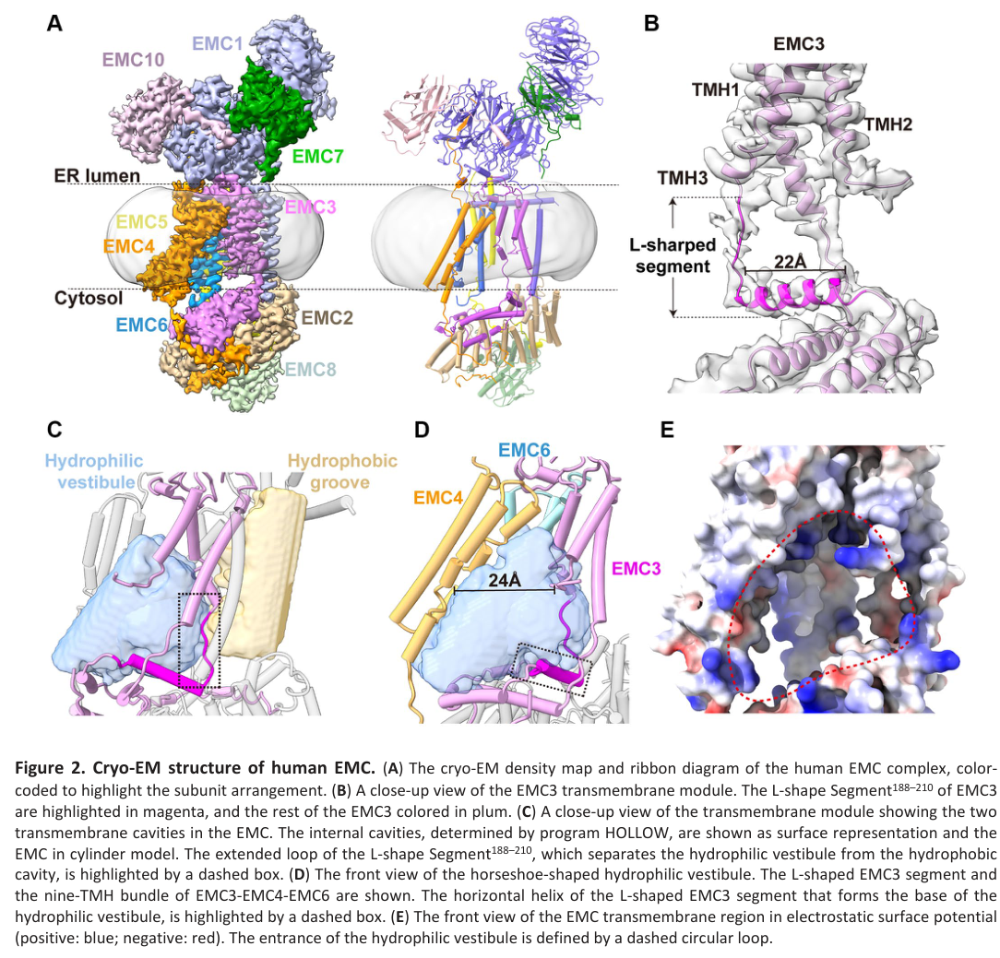

## Question

# Gene Research for Functional Annotation

## ⚠️ CRITICAL: Gene/Protein Identification Context

**BEFORE YOU BEGIN RESEARCH:** You MUST verify you are researching the CORRECT gene/protein. Gene symbols can be ambiguous, especially for less well-characterized genes from non-model organisms.

### Target Gene/Protein Identity (from UniProt):
- **UniProt Accession:** Q8N766
- **Protein Description:** RecName: Full=ER membrane protein complex subunit 1; Flags: Precursor;
- **Gene Information:** Name=EMC1; Synonyms=KIAA0090; ORFNames=PSEC0263;
- **Organism (full):** Homo sapiens (Human).
- **Protein Family:** Belongs to the EMC1 family. .
- **Key Domains:** Beta-prop_EMC1_1st. (IPR058545); EMC1. (IPR026895); EMC1_C. (IPR011678); Quinoprotein_ADH-like_sf. (IPR011047); WD40/YVTN_repeat-like_dom_sf. (IPR015943)

### MANDATORY VERIFICATION STEPS:

1. **Check if the gene symbol "EMC1" matches the protein description above**
2. **Verify the organism is correct:** Homo sapiens (Human).
3. **Check if protein family/domains align with what you find in literature**
4. **If you find literature for a DIFFERENT gene with the same or similar symbol, STOP**

### If Gene Symbol is Ambiguous or You Cannot Find Relevant Literature:

**DO NOT PROCEED WITH RESEARCH ON A DIFFERENT GENE.** Instead:
- State clearly: "The gene symbol 'EMC1' is ambiguous or literature is limited for this specific protein"
- Explain what you found (e.g., "Found extensive literature on a different gene with the same symbol in a different organism")
- Describe the protein based ONLY on the UniProt information provided above
- Suggest that the protein function can be inferred from domain/family information

### Research Target:

Please provide a comprehensive research report on the gene **EMC1** (gene ID: EMC1, UniProt: Q8N766) in human.

The research report should be a detailed narrative explaining the function, biological processes, and localization of the gene product. Citations should be given for all claims.

You should prioritize authoritative reviews and primary scientific literature when conducting research. You can supplement
this with annotations you find in gene/protein databases, but these can be outdated or inaccurate.

We are specifically interested in the primary function of the gene - for enzymes, what reaction is catalyzed, and what is the substrate specificity? For transporters, what is the substrate? For structural proteins or adapters, what is the broader structural role? For signaling molecules, what is the role in the pathway.

We are interested in where in or outside the cell the gene product carries out its function.

We are also interested in the signaling or biochemical pathways in which the gene functions. We are less interested in broad pleiotropic effects, except where these elucidate the precise role.

Include evidence where possible. We are interested in both experimental evidence as well as inference from structure, evolution, or bioinformatic analysis. Precise studies should be prioritized over high-throughput, where available.

## Output

Question: You are an expert researcher providing comprehensive, well-cited information.

Provide detailed information focusing on:
1. Key concepts and definitions with current understanding
2. Recent developments and latest research (prioritize 2023-2024 sources)
3. Current applications and real-world implementations
4. Expert opinions and analysis from authoritative sources
5. Relevant statistics and data from recent studies

Format as a comprehensive research report with proper citations. Include URLs and publication dates where available.
Always prioritize recent, authoritative sources and provide specific citations for all major claims.

# Gene Research for Functional Annotation

## ⚠️ CRITICAL: Gene/Protein Identification Context

**BEFORE YOU BEGIN RESEARCH:** You MUST verify you are researching the CORRECT gene/protein. Gene symbols can be ambiguous, especially for less well-characterized genes from non-model organisms.

### Target Gene/Protein Identity (from UniProt):
- **UniProt Accession:** Q8N766
- **Protein Description:** RecName: Full=ER membrane protein complex subunit 1; Flags: Precursor;
- **Gene Information:** Name=EMC1; Synonyms=KIAA0090; ORFNames=PSEC0263;
- **Organism (full):** Homo sapiens (Human).
- **Protein Family:** Belongs to the EMC1 family. .
- **Key Domains:** Beta-prop_EMC1_1st. (IPR058545); EMC1. (IPR026895); EMC1_C. (IPR011678); Quinoprotein_ADH-like_sf. (IPR011047); WD40/YVTN_repeat-like_dom_sf. (IPR015943)

### MANDATORY VERIFICATION STEPS:

1. **Check if the gene symbol "EMC1" matches the protein description above**
2. **Verify the organism is correct:** Homo sapiens (Human).
3. **Check if protein family/domains align with what you find in literature**
4. **If you find literature for a DIFFERENT gene with the same or similar symbol, STOP**

### If Gene Symbol is Ambiguous or You Cannot Find Relevant Literature:

**DO NOT PROCEED WITH RESEARCH ON A DIFFERENT GENE.** Instead:
- State clearly: "The gene symbol 'EMC1' is ambiguous or literature is limited for this specific protein"
- Explain what you found (e.g., "Found extensive literature on a different gene with the same symbol in a different organism")
- Describe the protein based ONLY on the UniProt information provided above
- Suggest that the protein function can be inferred from domain/family information

### Research Target:

Please provide a comprehensive research report on the gene **EMC1** (gene ID: EMC1, UniProt: Q8N766) in human.

The research report should be a detailed narrative explaining the function, biological processes, and localization of the gene product. Citations should be given for all claims.

You should prioritize authoritative reviews and primary scientific literature when conducting research. You can supplement
this with annotations you find in gene/protein databases, but these can be outdated or inaccurate.

We are specifically interested in the primary function of the gene - for enzymes, what reaction is catalyzed, and what is the substrate specificity? For transporters, what is the substrate? For structural proteins or adapters, what is the broader structural role? For signaling molecules, what is the role in the pathway.

We are interested in where in or outside the cell the gene product carries out its function.

We are also interested in the signaling or biochemical pathways in which the gene functions. We are less interested in broad pleiotropic effects, except where these elucidate the precise role.

Include evidence where possible. We are interested in both experimental evidence as well as inference from structure, evolution, or bioinformatic analysis. Precise studies should be prioritized over high-throughput, where available.

## Research report: Human EMC1 (UniProt Q8N766) functional annotation

### 0) Target verification (critical)
The literature surveyed corresponds to **human EMC1 (ER membrane protein complex subunit 1)**, a core component of the **endoplasmic reticulum (ER) membrane protein complex (EMC)**. This matches the provided UniProt record **Q8N766** (gene **EMC1**, synonym **KIAA0090**) in organism **Homo sapiens**, and the functional/structural descriptions are consistent with an EMC1-family, ER-localized, large luminal/TM subunit that participates in membrane-protein biogenesis rather than catalyzing a biochemical reaction itself. (alzayed2024tribalfounderemc1 pages 1-2, li2024structuralinsightsinto pages 1-3)

### 1) Key concepts and definitions (current understanding)

#### 1.1 The ER membrane protein complex (EMC)
The **EMC** is a conserved, multi-subunit ER membrane machine involved in **membrane protein biogenesis**, particularly for proteins whose transmembrane helices (TMHs) are “challenging” to integrate into the bilayer (e.g., relatively low hydrophobicity or containing polar/charged residues). (hegde2022thefunctionstructure pages 4-6, tian2019proteomicanalysisidentifies pages 6-8)

A key modern framing is that the EMC has **more than one functional mode**:
* an **insertase** mode that facilitates TMH insertion/topogenesis; and
* a broader **chaperone/holdase** mode supporting folding, topology, and assembly of membrane proteins (including large multipass proteins and complexes). (chen2023emcchaperone–cavstructure pages 1-3, hegde2022thefunctionstructure pages 20-22)

#### 1.2 What EMC1 is (and is not)
**EMC1** is not an enzyme with a defined small-molecule substrate; rather, it is a **structural and client-engagement subunit** in the EMC. EMC1 contributes a large luminal architecture (β-propeller/WD-like fold described in structural work on EMC) and participates in client-binding interfaces and conformational transitions associated with client loading. (bai2020structureofthe pages 2-4, chen2023emcchaperone–cavstructure pages 8-9)

#### 1.3 “Client” definition in this context
In EMC biology, a **client** is a membrane protein whose successful biogenesis (insertion, topology, folding, assembly, stability/trafficking) depends on EMC activity. Client dependence is often operationalized experimentally as **reduced steady-state abundance**, defective insertion/topology, or impaired functional surface expression in EMC-deficient cells. (tian2019proteomicanalysisidentifies pages 6-8, tian2019proteomicanalysisidentifies pages 8-10)

### 2) Subcellular localization and structural organization

#### 2.1 Cellular localization
EMC is an **ER membrane complex** with luminal, membrane, and cytosolic modules. Human EMC can also be observed in a state bound to **VDAC1** that is interpreted to occur at **mitochondria–ER contact sites** (a functional setting consistent with ER–mitochondria crosstalk roles attributed to EMC). (li2024structuralinsightsinto pages 1-3)

#### 2.2 Structural context for EMC1
Recent structural work on human EMC (cryo-EM) supports a **tripartite architecture** (luminal/membrane/cytosolic). In a 2024 study, apo human EMC and VDAC-bound EMC were resolved at **3.47 Å** and **3.32 Å**, respectively, providing a near-atomic framework for EMC conformational states relevant to function and disease interpretation. (li2024structuralinsightsinto pages 1-3, li2024structuralinsightsinto media 0ce687aa)

### 3) Molecular function and mechanism (with emphasis on 2023–2024)

#### 3.1 Insertase/topogenesis: hydrophilic vestibule and selectivity filter (2023)
A 2023 mechanistic study described how the EMC limits mistargeting and misinsertion of tail-anchored (TA) proteins. The EMC contains a **hydrophilic vestibule** that serves as a path for insertion, and **positively charged residues at the vestibule entrance** act as a **selectivity filter**: charge-based exclusion limits insertion of mitochondrial TA proteins and supports correct topology of multipass proteins by enforcing the “positive-inside” rule. (pleiner2023aselectivityfilter pages 1-2)

#### 3.2 EMC1 as part of a client-binding “dock” for ion-channel assembly intermediates (2023)
A 2023 cryo-EM study provided the first direct structure of a mammalian **EMC–client complex** by solving an ~0.6 MDa complex comprising **human EMC** bound to a **CaV1.2–CaVβ3** assembly intermediate (and comparing with the assembled CaV1.2–CaVβ3–CaVα2δ-1 channel). This work defines distinct EMC client interaction regions including a **transmembrane (TM) dock** and **cytoplasmic (Cyto) dock**, and supports a model in which EMC functions as a **holdase** that stabilizes a partly assembled channel complex. (chen2023emcchaperone–cavstructure pages 1-3, chen2023emcchaperone–cavstructure pages 11-13)

Mechanistically, EMC binding remodels CaV elements (including partial extraction/rearrangement of pore-associated components) and appears to prepare the channel for later assembly steps (handoff to CaVα2δ). Importantly, EMC and CaVα2δ binding are **mutually exclusive**, consistent with an **ordered handoff** model rather than simultaneous binding. (chen2023emcchaperone–cavstructure pages 8-9)

Within this complex, **EMC1** contributes to the TM dock/brace-crossbar system that engages CaV1.2 VSD I; the paper highlights EMC1 residues implicated in client interactions (e.g., interactions involving EMC1 residues including **Asp961** and **Arg981** in the described interface). (chen2023emcchaperone–cavstructure pages 11-13)

#### 3.3 Regulation of the insertion pocket by a “gating plug” and VDAC-bound state (2024)
A 2024 cryo-EM study of human EMC in **apo** and **VDAC-bound** states identified a **“gating plug”** (formed by a segment of EMC3) that occupies/modifies the **hydrophilic vestibule** (the insertion pocket). Structural comparison suggests that in the VDAC1-bound state, EMC is **unlikely to be actively inserting substrates** (i.e., the state may represent a different EMC functional mode). (li2024structuralinsightsinto pages 1-3, li2024structuralinsightsinto media 0ce687aa)

Figure-level structural evidence for the gating plug and VDAC-bound architecture is shown in the cropped figures extracted from the paper (li2024structuralinsightsinto media 0ce687aa, li2024structuralinsightsinto media 4246d006, li2024structuralinsightsinto media aca990f2, li2024structuralinsightsinto media 530c47e8).

### 4) Client/substrate scope and representative examples (biological meaning)

#### 4.1 General client features
Proteomics and mutational tests support that EMC clients are enriched for **multipass transporters/ion channels** and other membrane proteins containing at least one TMH with **polar/charged residues**, which are energetically unfavorable for insertion into the lipid bilayer without dedicated machinery. (tian2019proteomicanalysisidentifies pages 6-8, tian2019proteomicanalysisidentifies pages 8-10)

#### 4.2 Examples with direct experimental support
A quantitative proteomics study in human cells identified a stringent list of **36 EMC-dependent** and **171 EMC-independent** transmembrane proteins, and performed mechanistic mutagenesis demonstrating that altering polarity within a TMH can switch EMC dependence. Specific examples include:
* **FDFT1/SQS**: mutating four polar residues in its C-terminal TMH converted it to EMC-independent (and WT expression was diminished in EMC-deficient lines). (tian2019proteomicanalysisidentifies pages 6-8)
* **ZFPL1** and **CD9**: reducing polar/charged residues in specific TM segments converted them to EMC-independent. (tian2019proteomicanalysisidentifies pages 6-8)
* **ERGIC3** and **SEC61A1**: introducing polar residues could render otherwise EMC-independent proteins EMC-dependent. (tian2019proteomicanalysisidentifies pages 6-8, tian2019proteomicanalysisidentifies pages 8-10)

A 2023 structural study adds **CaV1.2** (a high-voltage activated calcium channel) as a mechanistically detailed EMC client in an assembly intermediate state, where EMC (including EMC1 interfaces) stabilizes a partially assembled channel complex and influences later trafficking/assembly steps. (chen2023emcchaperone–cavstructure pages 1-3, chen2023emcchaperone–cavstructure pages 8-9)

### 5) Pathways and biological processes (mechanism-first interpretation)

#### 5.1 Membrane protein biogenesis and proteostasis
The most precise functional annotation for EMC1 is as part of an ER-resident complex that maintains proteostasis of challenging membrane proteins by coordinating insertion/topogenesis and stabilizing partially assembled states. This includes roles that intersect with **quality control** and avoidance of degradation (e.g., protecting partial assemblies from ERAD/proteasome pathways), as illustrated mechanistically in the CaV assembly intermediate study. (chen2023emcchaperone–cavstructure pages 11-13, tian2019proteomicanalysisidentifies pages 8-10)

#### 5.2 ER–mitochondria contact biology (emerging mechanistic direction)
The 2024 human EMC–VDAC interaction supports a model in which EMC can engage certain mitochondrial outer-membrane precursors or contact-site biology, and that binding partners (like VDAC1) may correspond to a distinct EMC conformational/functional state rather than a canonical insertase state. (li2024structuralinsightsinto pages 1-3)

### 6) Human disease genetics and phenotypes (real-world relevance)

#### 6.1 EMC1-associated neurodevelopmental disorder (CAVIPMR)
Human genetics supports EMC1 as essential for neurodevelopment. A 2024 cohort report describes biallelic EMC1 variation causing **CAVIPMR** (cerebellar atrophy, visual impairment, psychomotor retardation; OMIM #616875). In 8 affected individuals from 5 Kuwaiti families harboring a homozygous EMC1 variant **c.245C>T (p.Thr82Met)**, reported frequencies included:
* global developmental delay **8/8**,
* microcephaly **8/8**,
* truncal hypotonia **8/8**,
* visual impairment **7/7**,
* failure to thrive **7/7**,
* epilepsy **4/8**,
* chorea **3/8**,
* cerebellar atrophy **4/7** and cerebral atrophy **3/6** on imaging.
These frequencies provide quantitative phenotype anchoring for clinical interpretation and variant prioritization. (alzayed2024tribalfounderemc1 pages 1-2)

#### 6.2 Retinal vascular disease context
A 2023 review of rare pediatric retinal vascular diseases notes that variants in **EMC1** have been linked to **FEVR-like phenotypes**, consistent with the concept that disrupted ER membrane protein biogenesis can have tissue-specific manifestations in retina/vasculature even if EMC1 is not itself a canonical Wnt/Norrin signaling protein. (le2023mechanismsunderlyingrare pages 8-10, le2023mechanismsunderlyingrare pages 10-12)

### 7) Recent developments (prioritizing 2023–2024) and expert analysis

#### 7.1 2023–2024 highlights
* **Client-bound structural biology emerges**: the 2023 EMC–CaV1.2–CaVβ3 structures provide a direct mechanistic snapshot of EMC acting as a **holdase** and define docking interfaces involving EMC1. (chen2023emcchaperone–cavstructure pages 1-3, chen2023emcchaperone–cavstructure pages 11-13)
* **Error prevention and topology control**: 2023 evidence that EMC includes a **selectivity filter** that reduces misinsertion (particularly important because ER- and mitochondria-directed TA proteins can have overlapping TMH hydrophobicity). (pleiner2023aselectivityfilter pages 1-2)
* **Conformational regulation of the vestibule**: 2024 structures identify a **gating plug** within the vestibule and show state-specific remodeling upon VDAC binding, suggesting functional switching between insertion and other roles (e.g., at contact sites). (li2024structuralinsightsinto pages 1-3, li2024structuralinsightsinto media 0ce687aa)

#### 7.2 Expert synthesis from authoritative review literature
A widely cited expert review emphasizes that EMC function extends beyond simple insertion and likely includes roles in later folding/assembly steps. The review further points out that substrate identification via steady-state proteomics can undercount true EMC substrates because failed biogenesis may trigger rapid degradation, and because EMC effects can be client- and domain-specific (including contributions from the luminal portions of EMC1). (hegde2022thefunctionstructure pages 20-22, hegde2022thefunctionstructure pages 19-20)

### 8) Applications and real-world implementations

#### 8.1 Variant interpretation and diagnosis
EMC1 is already used in real-world genomic diagnostics for neurodevelopmental disorders; the 2024 case series explicitly supports targeted testing for a recurrent EMC1 variant in a defined population context, illustrating **clinical implementation** (gene-panel/exome follow-up and variant segregation). (alzayed2024tribalfounderemc1 pages 1-2)

#### 8.2 Mechanistic frameworks for membrane-protein biogenesis and drug response
The EMC–CaV structural work provides a mechanistic framework relevant to ion-channel biology and pharmacology because the study also relates assembly to the CaVα2δ interaction site that is targeted by gabapentinoid drugs, and proposes how EMC-to-CaVα2δ handoff could be perturbed by mutations or drugs that affect assembly/trafficking. (chen2023emcchaperone–cavstructure pages 1-3)

### Summary table
The following table consolidates key functional-annotation points, mechanistic evidence, and quantitative findings.

| Aspect | Key evidence/statement | Key sources with year and DOI URL |
|---|---|---|
| Identity | Human **EMC1** matches UniProt **Q8N766** as **ER membrane protein complex subunit 1**, a core subunit of the conserved ER membrane protein complex (EMC) involved in membrane protein biogenesis; EMC1 is a large luminal/transmembrane structural subunit rather than an enzyme or transporter itself. (alzayed2024tribalfounderemc1 pages 1-2, hegde2022thefunctionstructure pages 4-6) | Hegde 2022, *Annu Rev Biochem*, https://doi.org/10.1146/annurev-biochem-032620-104553; Alzayed et al. 2024, *Neurol Genet*, https://doi.org/10.1212/NXG.0000000000200156 |
| Localization | EMC resides in the **endoplasmic reticulum membrane** with tripartite organization (ER lumen, membrane, cytosol); EMC1 is predominantly **luminal**, contributes a **transmembrane helix**, and helps form/stabilize the transmembrane region. Human EMC also forms a **VDAC-associated state at mitochondria-ER contact sites**. (bai2020structureofthe pages 2-4, li2024structuralinsightsinto pages 1-3) | Bai et al. 2020, *Nature*, https://doi.org/10.1038/s41586-020-2389-3; Li et al. 2024, *Aging (Albany NY)*, https://doi.org/10.18632/aging.205660 |
| Molecular function | Primary function is **structural and chaperone/insertase support** within EMC: EMC catalyzes or facilitates **energy-independent insertion of low-hydrophobicity transmembrane helices** and supports folding/assembly of multipass and some tail-anchored membrane proteins; EMC1 contributes to client handling beyond the core insertase pocket. (alzayed2024tribalfounderemc1 pages 1-2, hegde2022thefunctionstructure pages 20-22, pleiner2023aselectivityfilter pages 1-2) | Alzayed et al. 2024, *Neurol Genet*, https://doi.org/10.1212/NXG.0000000000200156; Hegde 2022, *Annu Rev Biochem*, https://doi.org/10.1146/annurev-biochem-032620-104553; Pleiner et al. 2023, *J Cell Biol*, https://doi.org/10.1083/jcb.202212007 |
| Mechanism | EMC captures client TMDs via **cytosolic methionine-rich loops** and inserts them through a **hydrophilic vestibule**; positive charges at the vestibule entrance act as a **selectivity filter** that excludes many mitochondrial TA proteins and enforces the **positive-inside rule** for topology. EMC1 luminal regions and TM-associated surfaces also participate in client-specific chaperoning/holdase functions. (pleiner2023aselectivityfilter pages 1-2, chen2023emcchaperone–cavstructure pages 11-13, chen2023emcchaperone–cavstructure pages 8-9) | Pleiner et al. 2023, *J Cell Biol*, https://doi.org/10.1083/jcb.202212007; Chen et al. 2023, *Nature*, https://doi.org/10.1038/s41586-023-06175-5 |
| EMC1-specific mechanism | In the CaV assembly intermediate, **EMC1 forms part of the TM dock/brace-crossbar system** that binds CaV1.2 VSD I; EMC1 residues including **Asp961** and **Arg981** contribute to client interaction, and client binding shifts the EMC1 luminal brace/crossbar helix into an **up conformation**, consistent with a client-loaded holdase state. (chen2023emcchaperone–cavstructure pages 11-13, chen2023emcchaperone–cavstructure pages 8-9) | Chen et al. 2023, *Nature*, https://doi.org/10.1038/s41586-023-06175-5 |
| Client/substrate examples | EMC-dependent proteins are enriched for **multipass transporters/ion channels** containing **polar/charged TMD residues**. Examples discussed experimentally include **FDFT1/SQS**, **ZFPL1**, **CD9**, **ERGIC3** (engineered to become EMC-dependent), **SEC61A1** (engineered EMC dependence), and EMC-supported ion channel assembly such as **CaV1.2**. (tian2019proteomicanalysisidentifies pages 6-8, tian2019proteomicanalysisidentifies pages 8-10, chen2023emcchaperone–cavstructure pages 1-3) | Tian et al. 2019, *Cell Rep*, https://doi.org/10.1016/j.celrep.2019.08.006; Chen et al. 2023, *Nature*, https://doi.org/10.1038/s41586-023-06175-5 |
| Structural insights 2023 | A 2023 cryo-EM study provided the first direct **EMC-client complex** for a mammalian ion channel assembly intermediate: EMC binds **CaV1.2–CaVβ3**, partially extracts pore elements, and is **mutually exclusive with CaVα2δ**, supporting a **handoff model** during channel assembly. (chen2023emcchaperone–cavstructure pages 1-3, chen2023emcchaperone–cavstructure pages 8-9) | Chen et al. 2023, *Nature*, https://doi.org/10.1038/s41586-023-06175-5 |
| Structural insights 2024 | Human EMC cryo-EM structures in **apo** and **VDAC-bound** states at **3.47 Å** and **3.32 Å** identified an **EMC3 gating plug** in the hydrophilic vestibule; conformational changes suggest the VDAC-bound state is unlikely to be actively inserting clients and may represent another EMC functional mode at ER-mitochondria contacts. (li2024structuralinsightsinto pages 1-3, li2024structuralinsightsinto media 0ce687aa) | Li et al. 2024, *Aging (Albany NY)*, https://doi.org/10.18632/aging.205660 |
| Structural architecture relevant to EMC1 | EMC1 contains a large luminal domain including an **eight-bladed WD/β-propeller-like fold**; in human EMC, a second β-propeller has been noted in review literature. EMC1 also contains a membrane-proximal/brace helix and contributes one TM helix to the complex architecture. (bai2020structureofthe pages 2-4, hegde2022thefunctionstructure pages 4-6) | Bai et al. 2020, *Nature*, https://doi.org/10.1038/s41586-020-2389-3; Hegde 2022, *Annu Rev Biochem*, https://doi.org/10.1146/annurev-biochem-032620-104553 |
| Disease genetics/phenotypes | Pathogenic human **EMC1** variants cause **CAVIPMR** (cerebellar atrophy, visual impairment, psychomotor retardation) and related neurodevelopmental phenotypes. In a 2024 Kuwaiti founder-variant series (**p.Thr82Met**), major features were **global developmental delay 8/8**, **microcephaly 8/8**, **truncal hypotonia 8/8**, **visual impairment 7/7**, **failure to thrive 7/7**, **epilepsy 4/8**, **chorea 3/8**, **cerebellar atrophy 4/7**, **cerebral atrophy 3/6**. (alzayed2024tribalfounderemc1 pages 1-2) | Alzayed et al. 2024, *Neurol Genet*, https://doi.org/10.1212/NXG.0000000000200156 |
| Disease relevance to retinal biology | Reviews of inherited retinal vascular disease note **EMC1** among newer genes linked to **FEVR-like retinal phenotypes**, likely through effects on ER biogenesis of transmembrane proteins rather than as a canonical Norrin-pathway signaling protein itself. (le2023mechanismsunderlyingrare pages 8-10, le2023mechanismsunderlyingrare pages 10-12) | Le et al. 2023, *Cells*, https://doi.org/10.3390/cells12212579 |
| Quantitative stats | Yeast EMC cryo-EM map reached **3.0 Å** and the complex measured about **160 × 100 × 80 Å**; human EMC apo and VDAC-bound structures were solved at **3.47 Å** and **3.32 Å**; Tian et al. identified **36 EMC-dependent** and **171 EMC-independent** transmembrane proteins under stringent criteria; Klose et al. later reported **506 enriched interactors**, including **>200 transmembrane proteins**. (bai2020structureofthe pages 2-4, li2024structuralinsightsinto pages 1-3, tian2019proteomicanalysisidentifies pages 6-8, klose2025theemcacts pages 1-2) | Bai et al. 2020, *Nature*, https://doi.org/10.1038/s41586-020-2389-3; Li et al. 2024, *Aging (Albany NY)*, https://doi.org/10.18632/aging.205660; Tian et al. 2019, *Cell Rep*, https://doi.org/10.1016/j.celrep.2019.08.006; Klose et al. 2025, *Nat Commun*, https://doi.org/10.1038/s41467-025-62109-x |
| Functional interpretation for annotation | Best-supported annotation for human EMC1: **ER-resident luminal/transmembrane scaffold and client-engagement subunit of the EMC**, required for **biogenesis, topology control, folding, and assembly of challenging membrane proteins**, especially those with **low-hydrophobicity or polar TMDs**; disease likely arises from impaired proteostasis of critical client proteins in nervous system and eye. (hegde2022thefunctionstructure pages 20-22, pleiner2023aselectivityfilter pages 1-2, chen2023emcchaperone–cavstructure pages 11-13, alzayed2024tribalfounderemc1 pages 1-2) | Hegde 2022, *Annu Rev Biochem*, https://doi.org/10.1146/annurev-biochem-032620-104553; Pleiner et al. 2023, *J Cell Biol*, https://doi.org/10.1083/jcb.202212007; Chen et al. 2023, *Nature*, https://doi.org/10.1038/s41586-023-06175-5; Alzayed et al. 2024, *Neurol Genet*, https://doi.org/10.1212/NXG.0000000000200156 |

*Table: This table summarizes verified identity, localization, function, mechanism, structural biology, client examples, and disease evidence for human EMC1 (UniProt Q8N766). It is designed as a concise functional-annotation aid with direct source links and context-ID citations.*

### Key references (with publication dates and URLs)
* Chen Z. et al. **“EMC chaperone–CaV structure reveals an ion channel assembly intermediate.”** *Nature* (May 2023; published in volume July 2023). https://doi.org/10.1038/s41586-023-06175-5 (chen2023emcchaperone–cavstructure pages 1-3)
* Pleiner T. et al. **“A selectivity filter in the ER membrane protein complex limits protein misinsertion at the ER.”** *J Cell Biol* (May 2023). https://doi.org/10.1083/jcb.202212007 (pleiner2023aselectivityfilter pages 1-2)
* Li M. et al. **“Structural insights into human EMC and its interaction with VDAC.”** *Aging (Albany NY)* (Published **March 15, 2024**; received Nov 6 2023; accepted Feb 8 2024). https://doi.org/10.18632/aging.205660 (li2024structuralinsightsinto pages 1-3)
* Alzayed N.T. et al. **“Tribal Founder EMC1 Variant in 5 Kuwaiti Families Expands Phenotypic Spectrum of EMC1-Related Disorder.”** *Neurology Genetics* (June 2024). https://doi.org/10.1212/NXG.0000000000200156 (alzayed2024tribalfounderemc1 pages 1-2)
* Tian S. et al. **“Proteomic Analysis Identifies Membrane Proteins Dependent on the ER Membrane Protein Complex.”** *Cell Reports* (Sept 3, 2019). https://doi.org/10.1016/j.celrep.2019.08.006 (tian2019proteomicanalysisidentifies pages 6-8)
* Hegde R.S. **“The Function, Structure, and Origins of the ER Membrane Protein Complex.”** *Annual Review of Biochemistry* (June 2022). https://doi.org/10.1146/annurev-biochem-032620-104553 (hegde2022thefunctionstructure pages 4-6)

References

1. (alzayed2024tribalfounderemc1 pages 1-2): Nada T. Alzayed, Abdullah H. Alzuabi, Reem A. Alqusaimi, Ehab A. El-Anany, Abdullah Alholle, Ashraf H. Aboelanine, Sherief Omar, Rasha Alsafi, Alaa A. Elmonairy, Fatemah J. Alali, Ahmad Alahmad, Hind Alsharhan, Buthaina Albash, and Dana Marafi. Tribal founder <i>emc1</i> variant in 5 kuwaiti families expands phenotypic spectrum of <i>emc1</i> -related disorder. Neurology Genetics, Jun 2024. URL: https://doi.org/10.1212/nxg.0000000000200156, doi:10.1212/nxg.0000000000200156. This article has 3 citations.

2. (li2024structuralinsightsinto pages 1-3): Mingyue Li, Chunli Zhang, Yuntao Xu, Shaobai Li, Chenhui Huang, Jian Wu, and Ming Lei. Structural insights into human emc and its interaction with vdac. Aging (Albany NY), 16:5501-5525, Mar 2024. URL: https://doi.org/10.18632/aging.205660, doi:10.18632/aging.205660. This article has 6 citations.

3. (hegde2022thefunctionstructure pages 4-6): Ramanujan S. Hegde. The function, structure, and origins of the er membrane protein complex. Annual Review of Biochemistry, 91:651-678, Jun 2022. URL: https://doi.org/10.1146/annurev-biochem-032620-104553, doi:10.1146/annurev-biochem-032620-104553. This article has 65 citations and is from a domain leading peer-reviewed journal.

4. (tian2019proteomicanalysisidentifies pages 6-8): Songhai Tian, Quan Wu, Bo Zhou, Mei Yuk Choi, Bo Ding, Wei Yang, and Min Dong. Proteomic analysis identifies membrane proteins dependent on the er membrane protein complex. Cell reports, 28:2517-2526.e5, Sep 2019. URL: https://doi.org/10.1016/j.celrep.2019.08.006, doi:10.1016/j.celrep.2019.08.006. This article has 79 citations and is from a highest quality peer-reviewed journal.

5. (chen2023emcchaperone–cavstructure pages 1-3): Zhou Chen, Abhisek Mondal, Fayal Abderemane-Ali, Seil Jang, Sangeeta Niranjan, José L. Montaño, Balyn W. Zaro, and Daniel L. Minor. Emc chaperone–cav structure reveals an ion channel assembly intermediate. Nature, 619:410-419, May 2023. URL: https://doi.org/10.1038/s41586-023-06175-5, doi:10.1038/s41586-023-06175-5. This article has 77 citations and is from a highest quality peer-reviewed journal.

6. (hegde2022thefunctionstructure pages 20-22): Ramanujan S. Hegde. The function, structure, and origins of the er membrane protein complex. Annual Review of Biochemistry, 91:651-678, Jun 2022. URL: https://doi.org/10.1146/annurev-biochem-032620-104553, doi:10.1146/annurev-biochem-032620-104553. This article has 65 citations and is from a domain leading peer-reviewed journal.

7. (bai2020structureofthe pages 2-4): Lin Bai, Qinglong You, Xiang Feng, Amanda Kovach, and Huilin Li. Structure of the er membrane complex, a transmembrane-domain insertase. Jun 2020. URL: https://doi.org/10.1038/s41586-020-2389-3, doi:10.1038/s41586-020-2389-3. This article has 164 citations and is from a highest quality peer-reviewed journal.

8. (chen2023emcchaperone–cavstructure pages 8-9): Zhou Chen, Abhisek Mondal, Fayal Abderemane-Ali, Seil Jang, Sangeeta Niranjan, José L. Montaño, Balyn W. Zaro, and Daniel L. Minor. Emc chaperone–cav structure reveals an ion channel assembly intermediate. Nature, 619:410-419, May 2023. URL: https://doi.org/10.1038/s41586-023-06175-5, doi:10.1038/s41586-023-06175-5. This article has 77 citations and is from a highest quality peer-reviewed journal.

9. (tian2019proteomicanalysisidentifies pages 8-10): Songhai Tian, Quan Wu, Bo Zhou, Mei Yuk Choi, Bo Ding, Wei Yang, and Min Dong. Proteomic analysis identifies membrane proteins dependent on the er membrane protein complex. Cell reports, 28:2517-2526.e5, Sep 2019. URL: https://doi.org/10.1016/j.celrep.2019.08.006, doi:10.1016/j.celrep.2019.08.006. This article has 79 citations and is from a highest quality peer-reviewed journal.

10. (li2024structuralinsightsinto media 0ce687aa): Mingyue Li, Chunli Zhang, Yuntao Xu, Shaobai Li, Chenhui Huang, Jian Wu, and Ming Lei. Structural insights into human emc and its interaction with vdac. Aging (Albany NY), 16:5501-5525, Mar 2024. URL: https://doi.org/10.18632/aging.205660, doi:10.18632/aging.205660. This article has 6 citations.

11. (pleiner2023aselectivityfilter pages 1-2): Tino Pleiner, Masami Hazu, Giovani Pinton Tomaleri, Vy N. Nguyen, Kurt Januszyk, and Rebecca M. Voorhees. A selectivity filter in the er membrane protein complex limits protein misinsertion at the er. The Journal of Cell Biology, May 2023. URL: https://doi.org/10.1083/jcb.202212007, doi:10.1083/jcb.202212007. This article has 28 citations.

12. (chen2023emcchaperone–cavstructure pages 11-13): Zhou Chen, Abhisek Mondal, Fayal Abderemane-Ali, Seil Jang, Sangeeta Niranjan, José L. Montaño, Balyn W. Zaro, and Daniel L. Minor. Emc chaperone–cav structure reveals an ion channel assembly intermediate. Nature, 619:410-419, May 2023. URL: https://doi.org/10.1038/s41586-023-06175-5, doi:10.1038/s41586-023-06175-5. This article has 77 citations and is from a highest quality peer-reviewed journal.

13. (li2024structuralinsightsinto media 4246d006): Mingyue Li, Chunli Zhang, Yuntao Xu, Shaobai Li, Chenhui Huang, Jian Wu, and Ming Lei. Structural insights into human emc and its interaction with vdac. Aging (Albany NY), 16:5501-5525, Mar 2024. URL: https://doi.org/10.18632/aging.205660, doi:10.18632/aging.205660. This article has 6 citations.

14. (li2024structuralinsightsinto media aca990f2): Mingyue Li, Chunli Zhang, Yuntao Xu, Shaobai Li, Chenhui Huang, Jian Wu, and Ming Lei. Structural insights into human emc and its interaction with vdac. Aging (Albany NY), 16:5501-5525, Mar 2024. URL: https://doi.org/10.18632/aging.205660, doi:10.18632/aging.205660. This article has 6 citations.

15. (li2024structuralinsightsinto media 530c47e8): Mingyue Li, Chunli Zhang, Yuntao Xu, Shaobai Li, Chenhui Huang, Jian Wu, and Ming Lei. Structural insights into human emc and its interaction with vdac. Aging (Albany NY), 16:5501-5525, Mar 2024. URL: https://doi.org/10.18632/aging.205660, doi:10.18632/aging.205660. This article has 6 citations.

16. (le2023mechanismsunderlyingrare pages 8-10): Vincent Le, Gabrielle Abdelmessih, Wendy A Dailey, Cecille Pinnock, Victoria Jobczyk, Revati Rashingkar, Kimberly A Drenser, and Kenneth P Mitton. Mechanisms underlying rare inherited pediatric retinal vascular diseases: fevr, norrie disease, persistent fetal vascular syndrome. Cells, Nov 2023. URL: https://doi.org/10.3390/cells12212579, doi:10.3390/cells12212579. This article has 30 citations.

17. (le2023mechanismsunderlyingrare pages 10-12): Vincent Le, Gabrielle Abdelmessih, Wendy A Dailey, Cecille Pinnock, Victoria Jobczyk, Revati Rashingkar, Kimberly A Drenser, and Kenneth P Mitton. Mechanisms underlying rare inherited pediatric retinal vascular diseases: fevr, norrie disease, persistent fetal vascular syndrome. Cells, Nov 2023. URL: https://doi.org/10.3390/cells12212579, doi:10.3390/cells12212579. This article has 30 citations.

18. (hegde2022thefunctionstructure pages 19-20): Ramanujan S. Hegde. The function, structure, and origins of the er membrane protein complex. Annual Review of Biochemistry, 91:651-678, Jun 2022. URL: https://doi.org/10.1146/annurev-biochem-032620-104553, doi:10.1146/annurev-biochem-032620-104553. This article has 65 citations and is from a domain leading peer-reviewed journal.

19. (klose2025theemcacts pages 1-2): Carolin J Klose, Kevin M Meighen-Berger, M. Kulke, Marina Parr, Barbara Steigenberger, Martin Zacharias, Dmitrij Frishman, and Matthias Feige. The emc acts as a chaperone for membrane proteins. Nature Communications, Aug 2025. URL: https://doi.org/10.1038/s41467-025-62109-x, doi:10.1038/s41467-025-62109-x. This article has 6 citations and is from a highest quality peer-reviewed journal.

## Artifacts

- [Edison artifact artifact-00](EMC1-deep-research-falcon_artifacts/artifact-00.md)

## Citations

1. li2024structuralinsightsinto pages 1-3
2. pleiner2023aselectivityfilter pages 1-2
3. tian2019proteomicanalysisidentifies pages 6-8
4. hegde2022thefunctionstructure pages 4-6
5. hegde2022thefunctionstructure pages 20-22
6. bai2020structureofthe pages 2-4
7. tian2019proteomicanalysisidentifies pages 8-10
8. le2023mechanismsunderlyingrare pages 8-10
9. le2023mechanismsunderlyingrare pages 10-12
10. hegde2022thefunctionstructure pages 19-20
11. klose2025theemcacts pages 1-2
12. https://doi.org/10.1146/annurev-biochem-032620-104553;
13. https://doi.org/10.1212/NXG.0000000000200156
14. https://doi.org/10.1038/s41586-020-2389-3;
15. https://doi.org/10.18632/aging.205660
16. https://doi.org/10.1212/NXG.0000000000200156;
17. https://doi.org/10.1083/jcb.202212007
18. https://doi.org/10.1083/jcb.202212007;
19. https://doi.org/10.1038/s41586-023-06175-5
20. https://doi.org/10.1016/j.celrep.2019.08.006;
21. https://doi.org/10.1146/annurev-biochem-032620-104553
22. https://doi.org/10.3390/cells12212579
23. https://doi.org/10.18632/aging.205660;
24. https://doi.org/10.1038/s41467-025-62109-x
25. https://doi.org/10.1038/s41586-023-06175-5;
26. https://doi.org/10.1016/j.celrep.2019.08.006
27. https://doi.org/10.1212/nxg.0000000000200156,
28. https://doi.org/10.18632/aging.205660,
29. https://doi.org/10.1146/annurev-biochem-032620-104553,
30. https://doi.org/10.1016/j.celrep.2019.08.006,
31. https://doi.org/10.1038/s41586-023-06175-5,
32. https://doi.org/10.1038/s41586-020-2389-3,
33. https://doi.org/10.1083/jcb.202212007,
34. https://doi.org/10.3390/cells12212579,
35. https://doi.org/10.1038/s41467-025-62109-x,