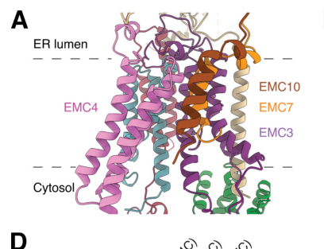

## Question

# Gene Research for Functional Annotation

## ⚠️ CRITICAL: Gene/Protein Identification Context

**BEFORE YOU BEGIN RESEARCH:** You MUST verify you are researching the CORRECT gene/protein. Gene symbols can be ambiguous, especially for less well-characterized genes from non-model organisms.

### Target Gene/Protein Identity (from UniProt):
- **UniProt Accession:** Q5UCC4
- **Protein Description:** RecName: Full=ER membrane protein complex subunit 10; AltName: Full=Hematopoietic signal peptide-containing membrane domain-containing protein 1; Flags: Precursor;
- **Gene Information:** Name=EMC10; Synonyms=C19orf63, INM02; ORFNames=UNQ764/PRO1556;
- **Organism (full):** Homo sapiens (Human).
- **Protein Family:** Belongs to the EMC10 family. .
- **Key Domains:** ECM10 (PF21203)

### MANDATORY VERIFICATION STEPS:

1. **Check if the gene symbol "EMC10" matches the protein description above**
2. **Verify the organism is correct:** Homo sapiens (Human).
3. **Check if protein family/domains align with what you find in literature**
4. **If you find literature for a DIFFERENT gene with the same or similar symbol, STOP**

### If Gene Symbol is Ambiguous or You Cannot Find Relevant Literature:

**DO NOT PROCEED WITH RESEARCH ON A DIFFERENT GENE.** Instead:
- State clearly: "The gene symbol 'EMC10' is ambiguous or literature is limited for this specific protein"
- Explain what you found (e.g., "Found extensive literature on a different gene with the same symbol in a different organism")
- Describe the protein based ONLY on the UniProt information provided above
- Suggest that the protein function can be inferred from domain/family information

### Research Target:

Please provide a comprehensive research report on the gene **EMC10** (gene ID: EMC10, UniProt: Q5UCC4) in human.

The research report should be a detailed narrative explaining the function, biological processes, and localization of the gene product. Citations should be given for all claims.

You should prioritize authoritative reviews and primary scientific literature when conducting research. You can supplement
this with annotations you find in gene/protein databases, but these can be outdated or inaccurate.

We are specifically interested in the primary function of the gene - for enzymes, what reaction is catalyzed, and what is the substrate specificity? For transporters, what is the substrate? For structural proteins or adapters, what is the broader structural role? For signaling molecules, what is the role in the pathway.

We are interested in where in or outside the cell the gene product carries out its function.

We are also interested in the signaling or biochemical pathways in which the gene functions. We are less interested in broad pleiotropic effects, except where these elucidate the precise role.

Include evidence where possible. We are interested in both experimental evidence as well as inference from structure, evolution, or bioinformatic analysis. Precise studies should be prioritized over high-throughput, where available.

## Output

Question: You are an expert researcher providing comprehensive, well-cited information.

Provide detailed information focusing on:
1. Key concepts and definitions with current understanding
2. Recent developments and latest research (prioritize 2023-2024 sources)
3. Current applications and real-world implementations
4. Expert opinions and analysis from authoritative sources
5. Relevant statistics and data from recent studies

Format as a comprehensive research report with proper citations. Include URLs and publication dates where available.
Always prioritize recent, authoritative sources and provide specific citations for all major claims.

# Gene Research for Functional Annotation

## ⚠️ CRITICAL: Gene/Protein Identification Context

**BEFORE YOU BEGIN RESEARCH:** You MUST verify you are researching the CORRECT gene/protein. Gene symbols can be ambiguous, especially for less well-characterized genes from non-model organisms.

### Target Gene/Protein Identity (from UniProt):
- **UniProt Accession:** Q5UCC4
- **Protein Description:** RecName: Full=ER membrane protein complex subunit 10; AltName: Full=Hematopoietic signal peptide-containing membrane domain-containing protein 1; Flags: Precursor;
- **Gene Information:** Name=EMC10; Synonyms=C19orf63, INM02; ORFNames=UNQ764/PRO1556;
- **Organism (full):** Homo sapiens (Human).
- **Protein Family:** Belongs to the EMC10 family. .
- **Key Domains:** ECM10 (PF21203)

### MANDATORY VERIFICATION STEPS:

1. **Check if the gene symbol "EMC10" matches the protein description above**
2. **Verify the organism is correct:** Homo sapiens (Human).
3. **Check if protein family/domains align with what you find in literature**
4. **If you find literature for a DIFFERENT gene with the same or similar symbol, STOP**

### If Gene Symbol is Ambiguous or You Cannot Find Relevant Literature:

**DO NOT PROCEED WITH RESEARCH ON A DIFFERENT GENE.** Instead:
- State clearly: "The gene symbol 'EMC10' is ambiguous or literature is limited for this specific protein"
- Explain what you found (e.g., "Found extensive literature on a different gene with the same symbol in a different organism")
- Describe the protein based ONLY on the UniProt information provided above
- Suggest that the protein function can be inferred from domain/family information

### Research Target:

Please provide a comprehensive research report on the gene **EMC10** (gene ID: EMC10, UniProt: Q5UCC4) in human.

The research report should be a detailed narrative explaining the function, biological processes, and localization of the gene product. Citations should be given for all claims.

You should prioritize authoritative reviews and primary scientific literature when conducting research. You can supplement
this with annotations you find in gene/protein databases, but these can be outdated or inaccurate.

We are specifically interested in the primary function of the gene - for enzymes, what reaction is catalyzed, and what is the substrate specificity? For transporters, what is the substrate? For structural proteins or adapters, what is the broader structural role? For signaling molecules, what is the role in the pathway.

We are interested in where in or outside the cell the gene product carries out its function.

We are also interested in the signaling or biochemical pathways in which the gene functions. We are less interested in broad pleiotropic effects, except where these elucidate the precise role.

Include evidence where possible. We are interested in both experimental evidence as well as inference from structure, evolution, or bioinformatic analysis. Precise studies should be prioritized over high-throughput, where available.

## Research Report: Human **EMC10** (UniProt **Q5UCC4**) — Functional Annotation and Biological Context

### Executive summary
Human **EMC10** encodes **ER membrane protein complex subunit 10**, a single-pass, ER-associated protein that forms part of the **endoplasmic reticulum membrane protein complex (EMC)**, a conserved membrane-protein biogenesis machine that facilitates insertion/topogenesis and quality control of select membrane-protein transmembrane domains (TMDs). Structural work places EMC10 in the **ER-lumenal module** of the complex (with EMC1/EMC4/EMC7), with a **flexible single TMD** that is not part of the catalytic insertase core. Separately, multiple studies report **secreted/soluble EMC10-related products** (notably **HSS1/EMC10-2**) with paracrine signaling activities in cancer and cardiac repair contexts. Recent 2023–2024 cryo-EM studies significantly advanced mechanistic understanding of EMC function and conformational states, providing the most current framework for interpreting EMC10’s role. (pleiner2020structuralbasisfor pages 1-3, volkmar2020squaringtheemc pages 10-11, pleiner2023aselectivityfilter pages 1-2, chen2023emcchaperone–cavstructure pages 1-3, li2024structuralinsightsinto pages 1-3)

### 1) Target identity verification (critical disambiguation)
The literature used here matches the requested target:

* **hHSS1** (human hematopoietic signal peptide-containing secreted 1) has been explicitly identified as **EMC10 (ER membrane protein complex subunit 10)** in a glioma-focused study, and **C19orf63** appears as a keyword/synonym in that same paper, aligning with UniProt synonyms provided in the prompt. Publication date: **2014-12**; URL: http://www.biomedcentral.com/1471-2407/14/920 (junesgill2014humanhematopoieticsignal pages 1-2)
* High-resolution human EMC structural studies explicitly include **EMC10** as one of the subunits modeled within the **nine-subunit human EMC**. Publication date: **2020-07**; URL: https://doi.org/10.1126/science.abb5008 (pleiner2020structuralbasisfor pages 1-3)

No conflicting gene symbol usage was encountered in retrieved materials; all “EMC10” references examined correspond to the human ER membrane protein complex subunit 10 context. (junesgill2014humanhematopoieticsignal pages 1-2, pleiner2020structuralbasisfor pages 1-3)

### 2) Key concepts and definitions (current understanding)

#### The ER membrane protein complex (EMC)
The **EMC** is an ER-resident multi-subunit assembly that acts as an **insertase and chaperone/holdase** supporting membrane-protein biogenesis, particularly for **low-hydrophobicity TMDs** (e.g., many tail-anchored proteins and certain multipass proteins). (pleiner2023aselectivityfilter pages 1-2, li2024structuralinsightsinto pages 1-3)

A key mechanistic concept is the **hydrophilic vestibule** within the membrane (primarily formed by core transmembrane subunits such as EMC3/EMC6, and supported by other subunits) that lowers the energetic barrier for integrating challenging TMDs and translocating short polar segments. (pleiner2020structuralbasisfor pages 1-3, pleiner2023aselectivityfilter pages 1-2)

#### Where EMC10 fits
EMC10 is best understood as an **auxiliary/scaffold-like subunit** in the **lumenal module** of the EMC, rather than as the catalytic insertase core.

* In a 3.4 Å cryo-EM structure of the **human nine-subunit EMC in lipid nanodiscs**, EMC10 is positioned in the **lumenal, L-shaped region** together with EMC1/EMC4/EMC7; the lumenal domain of EMC10 was built into the density map. Publication date: **2020-07**; URL: https://doi.org/10.1126/science.abb5008 (pleiner2020structuralbasisfor pages 1-3)
* Weak/flexible density was observed for putative transmembrane helices associated with EMC4/EMC7/EMC10, consistent with a relatively dynamic membrane-proximal architecture for EMC10. (pleiner2020structuralbasisfor pages 1-3)

Thus, for functional annotation, EMC10’s “primary function” is most defensibly described as **participation in a membrane protein biogenesis/quality-control complex**, not an enzyme reaction or substrate transporter in its own right. (pleiner2020structuralbasisfor pages 1-3, millervedam2020structuralandmechanistic pages 18-21)

### 3) Molecular function, subcellular localization, and topology

#### Subcellular localization
Structural evidence places EMC10 on the **ER-lumenal side** of the EMC (i.e., lumen-facing domain) with a membrane anchor.

* In human EMC cryo-EM, EMC10 is part of the lumenal region adjacent to EMC1 and EMC7. (pleiner2020structuralbasisfor pages 1-3)
* In a client-bound EMC structure (EMC–CaV complex), the **lumenal domain comprising EMC1, EMC4, EMC7, and EMC10** undergoes a measurable conformational change during client engagement (movement/tilt of lumenal module). Publication date: **2023-07**; URL: https://doi.org/10.1038/s41586-023-06175-5 (chen2023emcchaperone–cavstructure pages 8-9)

#### Membrane topology
An improved cryo-EM model explicitly depicts the single-pass topology of EMC10:

* A cropped panel from **Pleiner et al. (J Cell Biol, 2023-05)** Figure 3A labels the **single TMDs of EMC7 and EMC10** in the human EMC model, providing direct visual support for EMC10’s single-pass membrane topology in the complex. Publication date: **2023-05**; URL: https://doi.org/10.1083/jcb.202212007 (pleiner2023aselectivityfilter media 41b09963)

#### Molecular function (as distinct from complex function)
No specific enzymatic or transporter activity is attributed to EMC10 itself in the cited primary structural studies. Instead, EMC10 is best classified as a **non-catalytic structural subunit** within a multi-subunit insertase/chaperone system.

* The 2020 Science structure emphasizes EMC’s insertase mechanism via an enclosed hydrophilic vestibule within the membrane formed mainly by core subunits (not EMC10), while EMC10 contributes to the lumenal module architecture. (pleiner2020structuralbasisfor pages 1-3)
* Additional structural analysis describes EMC10 as part of the lumenal scaffold-like region together with EMC1/EMC7, consistent with an architectural/support role. (millervedam2020structuralandmechanistic pages 18-21)

### 4) Recent developments and latest research (prioritizing 2023–2024)

#### 4.1. 2023: EMC selectivity filter and topology enforcement
A major 2023 mechanistic advance was identification of a **selectivity filter** at the EMC that helps prevent misinsertion and enforces correct topology.

* Pleiner et al. (J Cell Biol, **2023-05**) used improved structural modeling plus mutagenesis/crosslinking to map TA-protein engagement and showed that positively charged residues at the hydrophilic vestibule entrance provide charge-based discrimination, limiting misinsertion of mitochondrial TA proteins and enforcing the “positive-inside” rule for some multipass substrates. URL: https://doi.org/10.1083/jcb.202212007 (pleiner2023aselectivityfilter pages 1-2, pleiner2023aselectivityfilter pages 10-11)

Although this paper is not EMC10-specific mechanistically, it is directly relevant to EMC10 annotation because it employs an improved EMC structural model that includes EMC10 topology and emphasizes that certain subunits (including EMC10) have **dynamic TMDs** providing a protected environment during insertion decisions. (pleiner2023aselectivityfilter pages 10-11, pleiner2023aselectivityfilter media 41b09963)

#### 4.2. 2023: First structural view of an EMC–client complex (holdase/chaperone mode)
A landmark 2023 Nature study solved cryo-EM structures of EMC bound to a voltage-gated calcium channel assembly intermediate, providing direct evidence for EMC’s **holdase/chaperone** roles.

* Chen et al. (Nature, **2023-07**) present EMC–client cryo-EM structures and report that binding causes a conformational change in the EMC lumenal domain (EMC1/EMC4/EMC7/EMC10), supporting a model where distinct EMC conformations may correspond to client-loaded states. URL: https://doi.org/10.1038/s41586-023-06175-5 (chen2023emcchaperone–cavstructure pages 1-3, chen2023emcchaperone–cavstructure pages 8-9)

This strengthens the interpretation that EMC10, as part of the lumenal module, may contribute to **conformational coupling** and/or stabilization during client engagement, even if it is not the catalytic insertase element. (chen2023emcchaperone–cavstructure pages 8-9, millervedam2020structuralandmechanistic pages 18-21)

#### 4.3. 2024: EMC structural states at mitochondria–ER contact sites (VDAC-bound)
A 2024 paper provided additional EMC structural states relevant to multifunctionality.

* Li et al. (Aging (Albany NY), **2024-03-15**) report apo- and VDAC-bound human EMC cryo-EM structures and describe a “gating plug” inside the EMC hydrophilic vestibule. They propose that in the VDAC1-bound state, EMC is unlikely to act as an insertase, suggesting state-dependent functional switching. URL: https://doi.org/10.18632/aging.205660 (li2024structuralinsightsinto pages 1-3)

While not focused on EMC10 specifically, this contributes to current expert interpretation: EMC10 should be annotated within a complex that is **conformationally and functionally versatile**, with EMC10 embedded in the lumenal module that can move during client interactions. (li2024structuralinsightsinto pages 1-3, chen2023emcchaperone–cavstructure pages 8-9)

### 5) Secreted/soluble EMC10 forms (“moonlighting” biology) and signaling
A recurring theme in EMC10 literature is the existence of **secreted or soluble EMC10-related products**, raising an annotation challenge: separating the EMC-bound subunit role from a secreted signaling factor.

#### 5.1. Secreted splice variant (HSS1/EMC10-2)
A review synthesis reports that EMC10 exists both as a full-length, membrane-bound EMC subunit and as a splice variant **EMC10-2 (HSS1)** lacking a discernible TMD and being secreted. (volkmar2020squaringtheemc pages 10-11)

#### 5.2. Glioma-related studies (HSS1) and quantitative statistics
In glioma-derived cell models:

* Junes-Gill et al. (BMC Cancer, **2014-12**) report that U87 cells overexpressing hHSS1 showed reduced G0/G1 and increased S and G2/M phases (**P < 0.05**), reduced migration (**P < 0.001**) and invasion (**P < 0.01**), and that purified hHSS1 inhibited HUVEC tube formation. They also report TCGA correlations (e.g., **BRCA2 r = −0.224, P < 0.0005**). URL: http://www.biomedcentral.com/1471-2407/14/920 (junesgill2014humanhematopoieticsignal pages 1-2)

These results support biological activity of a secreted EMC10-related factor in vitro, but they do not establish the mechanism of action or receptor identity, and they likely relate specifically to the secreted HSS1/EMC10-2 product rather than the EMC-incorporated subunit. (volkmar2020squaringtheemc pages 10-11, junesgill2014humanhematopoieticsignal pages 1-2)

#### 5.3. Myocardial infarction repair: Emc10 as a secreted angiogenic growth factor
A key in vivo translational study reports secreted Emc10 after MI.

* Reboll et al. (Circulation, **2017-11-07**) identify Emc10 as a bone marrow-derived angiogenic growth factor in mice after myocardial infarction. They report that circulating plasma Emc10 increases after MI, that Emc10 is secreted into supernatants of isolated inflammatory cells, and that **85±2%** of Emc10+ cells in infarct region coexpress macrophage marker F4/80. Recombinant Emc10 treatment (osmotic minipumps) enhanced border-zone capillarization and improved remodeling outcomes in a heart-failure-prone mouse strain. URL: https://doi.org/10.1161/CIRCULATIONAHA.117.029980 (reboll2017emc10(endoplasmicreticulum pages 1-2, reboll2017emc10(endoplasmicreticulum pages 9-10)

This study provides one of the strongest “real-world implementation” examples: **recombinant protein delivery** as a therapy concept in an animal model. (reboll2017emc10(endoplasmicreticulum pages 1-2, reboll2017emc10(endoplasmicreticulum pages 9-10)

### 6) Disease associations and human genetics
Direct, EMC10-specific disease mechanisms are still emerging, but authoritative association resources implicate EMC10 in neurodevelopmental phenotypes.

* Open Targets lists EMC10 associations with **Neurodevelopmental disorder** and a more specific phenotype label “**neurodevelopmental disorder with dysmorphic facies and variable seizures**,” along with broader “genetic disorder” and “hypertension” associations. (OpenTargets Search: -EMC10)

These associations should be interpreted as **gene–disease evidence links** rather than definitive mechanistic proof; nonetheless, they prioritize EMC10 for deeper human genetics follow-up (variant interpretation, functional assays). (OpenTargets Search: -EMC10)

### 7) Current applications and real-world implementations

1. **Structural biology and mechanistic modeling of membrane-protein biogenesis**: EMC10 is routinely treated as part of the EMC lumenal module in cryo-EM and mechanistic studies, enabling modeling of insertase/chaperone cycles and topology enforcement. (pleiner2020structuralbasisfor pages 1-3, pleiner2023aselectivityfilter pages 1-2, chen2023emcchaperone–cavstructure pages 8-9)
2. **Therapeutic concept (preclinical)**: recombinant Emc10 delivery improved post-MI angiogenesis/remodeling in mice, representing a direct application of EMC10-related biology. (reboll2017emc10(endoplasmicreticulum pages 1-2, reboll2017emc10(endoplasmicreticulum pages 9-10)
3. **Cancer biology exploratory applications**: hHSS1/EMC10-2 was proposed as a potential therapeutic factor for malignant glioblastoma based on in vitro activity and transcriptional/network effects, but remains preclinical and mechanistically unresolved. (junesgill2014humanhematopoieticsignal pages 1-2)

### 8) Expert analysis and interpretive synthesis (authoritative sources)

**Consensus interpretation from structural and mechanistic studies:** EMC10 is best annotated primarily as an **ER membrane complex subunit** contributing to EMC architecture and conformational states during client handling, rather than directly binding substrates as the catalytic insertase element.

* The human EMC structure positions EMC10 in the lumenal module with a flexible TMD, consistent with an accessory role. (pleiner2020structuralbasisfor pages 1-3)
* The 2023 selectivity-filter study integrates improved structural modeling with functional discrimination at the vestibule entrance and explicitly depicts EMC10 as a single-pass component of a dynamic transmembrane region (supporting a role in creating a protected insertion environment rather than dictating substrate selectivity itself). (pleiner2023aselectivityfilter pages 10-11, pleiner2023aselectivityfilter media 41b09963)
* The 2023 client-bound structure shows movement of the lumenal module (including EMC10), indicating that the region EMC10 occupies participates in client-induced conformational changes and may help communicate “client-loaded” states. (chen2023emcchaperone–cavstructure pages 8-9)

**Important caveat for annotation:** A substantial portion of the EMC10 literature concerns **secreted EMC10-related factors (HSS1/EMC10-2)**. Functional claims about angiogenesis or tumor suppression likely refer to **soluble products** and should not be conflated with the **EMC-incorporated EMC10 subunit** unless isoform usage is experimentally clarified. (volkmar2020squaringtheemc pages 10-11, junesgill2014humanhematopoieticsignal pages 1-2, reboll2017emc10(endoplasmicreticulum pages 1-2)

### 9) Summary table of key findings
| Aspect | Key findings | Evidence type | Key sources (date; URL) | Citeable context IDs |
|---|---|---|---|---|
| Identity / synonyms | • Verified target is **human EMC10** = **ER membrane protein complex subunit 10** • UniProt Q5UCC4 matches literature aliases **HSM1/HSS1/C19orf63** • Literature distinguishes membrane-bound EMC10 from secreted **HSS1/EMC10-2** splice product | Literature cross-mapping; review synthesis; structural papers | Pleiner et al., *Science* (2020 Jul); https://doi.org/10.1126/science.abb5008 • Volkmar & Christianson, *J Cell Sci* (2020 Apr); https://doi.org/10.1242/jcs.243519 • Junes-Gill et al., *BMC Cancer* (2014 Dec); http://www.biomedcentral.com/1471-2407/14/920 | (pleiner2020structuralbasisfor pages 1-3, volkmar2020squaringtheemc pages 10-11, junesgill2014humanhematopoieticsignal pages 1-2) |
| Localization / topology | • EMC10 is an **ER-associated EMC subunit** positioned on the **ER-lumenal face** • Human cryo-EM places EMC10 in the **lumenal L-shaped region** with EMC1/EMC7 • EMC10 has a **single, flexible TMD**; improved cryo-EM explicitly visualized/labeled EMC10 TMD topology | Cryo-EM structure; image/figure inspection | Pleiner et al., *Science* (2020 Jul); https://doi.org/10.1126/science.abb5008 • Pleiner et al., *J Cell Biol* (2023 May); https://doi.org/10.1083/jcb.202212007 | (pleiner2020structuralbasisfor pages 1-3, pleiner2023aselectivityfilter media 41b09963) |
| Role in EMC complex | • EMC10 is a **non-catalytic accessory/scaffold-like lumenal subunit**, not the insertase core • Contacts/positions near EMC1 and EMC7 on the lumenal side • EMC7 loss can lead to loss of EMC10 from assembled complex, supporting an auxiliary stabilizing role | Cryo-EM; mutational/assembly analysis; review synthesis | Miller-Vedam et al., *eLife* (2020 Sep); https://doi.org/10.1101/2020.09.02.280008 • Pleiner et al., *Science* (2020 Jul); https://doi.org/10.1126/science.abb5008 | (millervedam2020structuralandmechanistic pages 18-21, pleiner2020structuralbasisfor pages 1-3) |
| Primary molecular function | • No enzyme or transporter activity has been established for EMC10 itself • Best-supported primary function is as a **structural/auxiliary EMC subunit** supporting **membrane protein biogenesis** • Functional effect is indirect, through the EMC machinery that inserts or stabilizes select membrane-protein TMDs | Structural inference; complex-level functional studies | Pleiner et al., *Science* (2020 Jul); https://doi.org/10.1126/science.abb5008 • Bai & Li, *FEBS J* (2022 Mar); https://doi.org/10.1111/febs.15786 • Li et al., *Aging (Albany NY)* (2024 Mar 15); https://doi.org/10.18632/aging.205660 | (pleiner2020structuralbasisfor pages 1-3, li2024structuralinsightsinto pages 1-3) |
| Insertase / chaperone mechanism context | • EMC core insertase activity resides mainly in **EMC3/EMC6** hydrophilic vestibule, with EMC10 peripheral to this core • 2023 work defined a **selectivity filter** at the EMC that rejects misinserted positively charged TA substrates and enforces topology • 2023 client-bound structure supports EMC **holdase/chaperone** function for CaV channel assembly; lumenal module including EMC10 shifts during client engagement | Cryo-EM; mutagenesis; client-bound structural biology | Pleiner et al., *J Cell Biol* (2023 May); https://doi.org/10.1083/jcb.202212007 • Chen et al., *Nature* (2023 Jul); https://doi.org/10.1038/s41586-023-06175-5 • Li et al., *Aging (Albany NY)* (2024 Mar 15); https://doi.org/10.18632/aging.205660 | (pleiner2023aselectivityfilter pages 1-2, pleiner2023aselectivityfilter pages 10-11, chen2023emcchaperone–cavstructure pages 1-3, chen2023emcchaperone–cavstructure pages 8-9, li2024structuralinsightsinto pages 1-3) |
| Secreted isoform / soluble form | • Alternative splice variant **EMC10-2 / HSS1** lacks a discernible TMD and is **secreted** • Secreted EMC10/HSS1 showed reported anti-glioma/anti-angiogenic effects in glioma assays • A separate cardiovascular study identified **secreted EMC10/Emc10** from bone marrow-derived monocytes/macrophages as a **pro-angiogenic growth factor** after MI, indicating context/isoform-dependent biology | Cell culture functional assays; recombinant protein; mouse MI models | Junes-Gill et al., *BMC Cancer* (2014 Dec); http://www.biomedcentral.com/1471-2407/14/920 • Reboll et al., *Circulation* (2017 Nov); https://doi.org/10.1161/CIRCULATIONAHA.117.029980 • Volkmar & Christianson, *J Cell Sci* (2020 Apr); https://doi.org/10.1242/jcs.243519 | (junesgill2014humanhematopoieticsignal pages 1-2, reboll2017emc10(endoplasmicreticulum pages 1-2, reboll2017emc10(endoplasmicreticulum pages 9-10, volkmar2020squaringtheemc pages 10-11) |
| Signaling linked to soluble EMC10 | • In endothelial/cardiac repair studies, Emc10 signaled via **small GTPases, PAK, p38 MAPK, and MK2** to promote actin polymerization and migration • In glioma-related studies, overexpression altered cell-cycle/tumorigenic transcriptional programs and reduced migration/invasion • These signaling findings concern the **soluble/secreted form**, not necessarily the EMC-bound ER subunit | Recombinant protein; cell migration assays; transcriptomics; mouse infarct explants | Reboll et al., *Circulation* (2017 Nov); https://doi.org/10.1161/CIRCULATIONAHA.117.029980 • Junes-Gill et al., *BMC Cancer* (2014 Dec); http://www.biomedcentral.com/1471-2407/14/920 | (reboll2017emc10(endoplasmicreticulum pages 1-2, reboll2017emc10(endoplasmicreticulum pages 9-10, junesgill2014humanhematopoieticsignal pages 1-2) |
| Disease / phenotype associations | • Open Targets lists associations with **neurodevelopmental disorder**, including **neurodevelopmental disorder with dysmorphic facies and variable seizures**, plus broader genetic disorder/hypertension links • EMC as a complex is implicated in neurological disease, diabetes, cancer, and membrane-protein proteostasis defects • Evidence is stronger at the **gene-disease association** level than for a fully resolved EMC10-specific molecular mechanism in these disorders | Database association; literature synthesis | Open Targets association context (retrieved current database evidence) • Li et al., *Aging (Albany NY)* (2024 Mar 15); https://doi.org/10.18632/aging.205660 | (OpenTargets Search: -EMC10, li2024structuralinsightsinto pages 1-3) |
| Quantitative phenotype highlights | • Glioma study: hHSS1 overexpression changed cell-cycle distribution (**G0/G1 down, S and G2/M up; P<0.05**) and reduced migration/invasion (**P<0.001 to P<0.01**) • TCGA correlations reported for **BRCA2 r = -0.224 (P<0.0005)**, **ADAMTS1 r = -0.132 (P<0.01)**, **endostatin r = 0.141 (P<0.005)** • MI study: **85±2%** of Emc10+ cells in infarct region coexpressed **F4/80** macrophage marker | Cell biology assays; TCGA correlation; mouse histology | Junes-Gill et al., *BMC Cancer* (2014 Dec); http://www.biomedcentral.com/1471-2407/14/920 • Reboll et al., *Circulation* (2017 Nov); https://doi.org/10.1161/CIRCULATIONAHA.117.029980 | (junesgill2014humanhematopoieticsignal pages 1-2, reboll2017emc10(endoplasmicreticulum pages 9-10) |
| Applications / translation | • EMC biology is relevant to **membrane-protein biogenesis**, affecting ion channels, receptors, transporters, and viral proteins—important because many drug targets are membrane proteins • Secreted Emc10 showed **proof-of-concept therapeutic benefit** in mouse post-MI repair when delivered by osmotic minipump • EMC machinery is being considered in virus-host biology and protein-quality-control research, but there is **no EMC10-targeted approved therapy** | Structural biology; translational mouse model; review | Pleiner et al., *Science* (2020 Jul); https://doi.org/10.1126/science.abb5008 • Reboll et al., *Circulation* (2017 Nov); https://doi.org/10.1161/CIRCULATIONAHA.117.029980 • Woo et al., *J Cell Sci* (2023 Jul); https://doi.org/10.1242/jcs.261121 | (pleiner2020structuralbasisfor pages 1-3, reboll2017emc10(endoplasmicreticulum pages 1-2, reboll2017emc10(endoplasmicreticulum pages 9-10) |

*Table: This table summarizes the best-supported functional annotation for human EMC10/Q5UCC4, separating its likely primary role as an ER-lumenal accessory EMC subunit from reported biology of secreted EMC10/HSS1 isoforms. It also highlights recent 2023–2024 structural advances, disease links, and quantitative findings useful for downstream annotation.*

### 10) Conclusion
Human EMC10 (UniProt Q5UCC4) is most strongly supported as a **single-pass, ER-associated subunit of the EMC**, residing in the **lumenal module** and contributing structurally to a versatile insertase/holdase machine that controls insertion and topology of select membrane proteins. The most important recent advances (2023–2024) strengthen a model in which EMC10 participates in **client-induced conformational changes** and a **dynamic transmembrane environment**, while core substrate discrimination is mediated by conserved charge features within the EMC’s hydrophilic vestibule. In parallel, secreted EMC10-related isoforms (e.g., HSS1/EMC10-2) have been implicated in signaling and tissue repair, including proof-of-concept recombinant protein therapy in a mouse MI model, but the relationship between these soluble forms and the canonical EMC subunit role remains an active area for clarification. (pleiner2023aselectivityfilter media 41b09963, chen2023emcchaperone–cavstructure pages 8-9, li2024structuralinsightsinto pages 1-3, reboll2017emc10(endoplasmicreticulum pages 1-2)

References

1. (pleiner2020structuralbasisfor pages 1-3): Tino Pleiner, Giovani Pinton Tomaleri, Kurt Januszyk, Alison J. Inglis, Masami Hazu, and Rebecca M. Voorhees. Structural basis for membrane insertion by the human er membrane protein complex. Jul 2020. URL: https://doi.org/10.1126/science.abb5008, doi:10.1126/science.abb5008. This article has 192 citations and is from a highest quality peer-reviewed journal.

2. (volkmar2020squaringtheemc pages 10-11): Norbert Volkmar and John C. Christianson. Squaring the emc – how promoting membrane protein biogenesis impacts cellular functions and organismal homeostasis. Journal of Cell Science, Apr 2020. URL: https://doi.org/10.1242/jcs.243519, doi:10.1242/jcs.243519. This article has 59 citations and is from a domain leading peer-reviewed journal.

3. (pleiner2023aselectivityfilter pages 1-2): Tino Pleiner, Masami Hazu, Giovani Pinton Tomaleri, Vy N. Nguyen, Kurt Januszyk, and Rebecca M. Voorhees. A selectivity filter in the er membrane protein complex limits protein misinsertion at the er. The Journal of Cell Biology, May 2023. URL: https://doi.org/10.1083/jcb.202212007, doi:10.1083/jcb.202212007. This article has 28 citations.

4. (chen2023emcchaperone–cavstructure pages 1-3): Zhou Chen, Abhisek Mondal, Fayal Abderemane-Ali, Seil Jang, Sangeeta Niranjan, José L. Montaño, Balyn W. Zaro, and Daniel L. Minor. Emc chaperone–cav structure reveals an ion channel assembly intermediate. Nature, 619:410-419, May 2023. URL: https://doi.org/10.1038/s41586-023-06175-5, doi:10.1038/s41586-023-06175-5. This article has 77 citations and is from a highest quality peer-reviewed journal.

5. (li2024structuralinsightsinto pages 1-3): Mingyue Li, Chunli Zhang, Yuntao Xu, Shaobai Li, Chenhui Huang, Jian Wu, and Ming Lei. Structural insights into human emc and its interaction with vdac. Aging (Albany NY), 16:5501-5525, Mar 2024. URL: https://doi.org/10.18632/aging.205660, doi:10.18632/aging.205660. This article has 6 citations.

6. (junesgill2014humanhematopoieticsignal pages 1-2): Katiana S Junes-Gill, Chris E Lawrence, Christopher J Wheeler, Ryan Cordner, Tristan G Gill, Vernon Mar, Liron Shiri, and Lena A Basile. Human hematopoietic signal peptide-containing secreted 1 (hhss1) modulates genes and pathways in glioma: implications for the regulation of tumorigenicity and angiogenesis. BMC Cancer, Dec 2014. URL: https://doi.org/10.1186/1471-2407-14-920, doi:10.1186/1471-2407-14-920. This article has 46 citations and is from a peer-reviewed journal.

7. (millervedam2020structuralandmechanistic pages 18-21): Lakshmi E. Miller-Vedam, Bastian Bräuning, Katerina D. Popova, Nicole T. Schirle Oakdale, Jessica L. Bonnar, Jesuraj Rajan Prabu, Elizabeth A. Boydston, Natalia Sevillano, Matthew J. Shurtleff, Robert M. Stroud, Charles S. Craik, Brenda A. Schulman, Adam Frost, and Jonathan S. Weissman. Structural and mechanistic basis of the emc-dependent biogenesis of distinct transmembrane clients. eLife, Sep 2020. URL: https://doi.org/10.1101/2020.09.02.280008, doi:10.1101/2020.09.02.280008. This article has 102 citations and is from a domain leading peer-reviewed journal.

8. (chen2023emcchaperone–cavstructure pages 8-9): Zhou Chen, Abhisek Mondal, Fayal Abderemane-Ali, Seil Jang, Sangeeta Niranjan, José L. Montaño, Balyn W. Zaro, and Daniel L. Minor. Emc chaperone–cav structure reveals an ion channel assembly intermediate. Nature, 619:410-419, May 2023. URL: https://doi.org/10.1038/s41586-023-06175-5, doi:10.1038/s41586-023-06175-5. This article has 77 citations and is from a highest quality peer-reviewed journal.

9. (pleiner2023aselectivityfilter media 41b09963): Tino Pleiner, Masami Hazu, Giovani Pinton Tomaleri, Vy N. Nguyen, Kurt Januszyk, and Rebecca M. Voorhees. A selectivity filter in the er membrane protein complex limits protein misinsertion at the er. The Journal of Cell Biology, May 2023. URL: https://doi.org/10.1083/jcb.202212007, doi:10.1083/jcb.202212007. This article has 28 citations.

10. (pleiner2023aselectivityfilter pages 10-11): Tino Pleiner, Masami Hazu, Giovani Pinton Tomaleri, Vy N. Nguyen, Kurt Januszyk, and Rebecca M. Voorhees. A selectivity filter in the er membrane protein complex limits protein misinsertion at the er. The Journal of Cell Biology, May 2023. URL: https://doi.org/10.1083/jcb.202212007, doi:10.1083/jcb.202212007. This article has 28 citations.

11. (reboll2017emc10(endoplasmicreticulum pages 1-2): Marc R. Reboll, Mortimer Korf-Klingebiel, Stefanie Klede, Felix Polten, Eva Brinkmann, Ines Reimann, Hans-Joachim Schönfeld, Maria Bobadilla, Jan Faix, George Kensah, Ina Gruh, Michael Klintschar, Matthias Gaestel, Hans W. Niessen, Andreas Pich, Johann Bauersachs, Joseph A. Gogos, Yong Wang, and Kai C. Wollert. Emc10 (endoplasmic reticulum membrane protein complex subunit 10) is a bone marrow–derived angiogenic growth factor promoting tissue repair after myocardial infarction. Circulation, 136:1809–1823, Nov 2017. URL: https://doi.org/10.1161/circulationaha.117.029980, doi:10.1161/circulationaha.117.029980. This article has 55 citations and is from a highest quality peer-reviewed journal.

12. (reboll2017emc10(endoplasmicreticulum pages 9-10): Marc R. Reboll, Mortimer Korf-Klingebiel, Stefanie Klede, Felix Polten, Eva Brinkmann, Ines Reimann, Hans-Joachim Schönfeld, Maria Bobadilla, Jan Faix, George Kensah, Ina Gruh, Michael Klintschar, Matthias Gaestel, Hans W. Niessen, Andreas Pich, Johann Bauersachs, Joseph A. Gogos, Yong Wang, and Kai C. Wollert. Emc10 (endoplasmic reticulum membrane protein complex subunit 10) is a bone marrow–derived angiogenic growth factor promoting tissue repair after myocardial infarction. Circulation, 136:1809–1823, Nov 2017. URL: https://doi.org/10.1161/circulationaha.117.029980, doi:10.1161/circulationaha.117.029980. This article has 55 citations and is from a highest quality peer-reviewed journal.

13. (OpenTargets Search: -EMC10): Open Targets Query (-EMC10, 5 results). Buniello, A. et al. (2025). Open Targets Platform: facilitating therapeutic hypotheses building in drug discovery. Nucleic Acids Research.

## Artifacts

- [Edison artifact artifact-00](EMC10-deep-research-falcon_artifacts/artifact-00.md)

## Citations

1. junesgill2014humanhematopoieticsignal pages 1-2
2. pleiner2020structuralbasisfor pages 1-3
3. millervedam2020structuralandmechanistic pages 18-21
4. li2024structuralinsightsinto pages 1-3
5. volkmar2020squaringtheemc pages 10-11
6. pleiner2023aselectivityfilter pages 1-2
7. pleiner2023aselectivityfilter pages 10-11
8. http://www.biomedcentral.com/1471-2407/14/920
9. https://doi.org/10.1126/science.abb5008
10. https://doi.org/10.1038/s41586-023-06175-5
11. https://doi.org/10.1083/jcb.202212007
12. https://doi.org/10.18632/aging.205660
13. https://doi.org/10.1161/CIRCULATIONAHA.117.029980
14. https://doi.org/10.1242/jcs.243519
15. https://doi.org/10.1101/2020.09.02.280008
16. https://doi.org/10.1111/febs.15786
17. https://doi.org/10.1242/jcs.261121
18. https://doi.org/10.1126/science.abb5008,
19. https://doi.org/10.1242/jcs.243519,
20. https://doi.org/10.1083/jcb.202212007,
21. https://doi.org/10.1038/s41586-023-06175-5,
22. https://doi.org/10.18632/aging.205660,
23. https://doi.org/10.1186/1471-2407-14-920,
24. https://doi.org/10.1101/2020.09.02.280008,
25. https://doi.org/10.1161/circulationaha.117.029980,