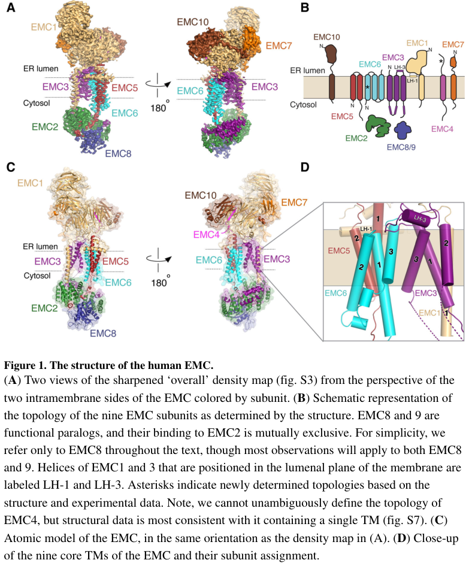

## Question

# Gene Research for Functional Annotation

## ⚠️ CRITICAL: Gene/Protein Identification Context

**BEFORE YOU BEGIN RESEARCH:** You MUST verify you are researching the CORRECT gene/protein. Gene symbols can be ambiguous, especially for less well-characterized genes from non-model organisms.

### Target Gene/Protein Identity (from UniProt):
- **UniProt Accession:** Q15006
- **Protein Description:** RecName: Full=ER membrane protein complex subunit 2 {ECO:0000305}; AltName: Full=Tetratricopeptide repeat protein 35 {ECO:0000312|HGNC:HGNC:28963}; Short=TPR repeat protein 35 {ECO:0000312|HGNC:HGNC:28963};
- **Gene Information:** Name=EMC2 {ECO:0000312|HGNC:HGNC:28963}; Synonyms=KIAA0103 {ECO:0000312|EMBL:BAA03493.1}, TTC35 {ECO:0000312|HGNC:HGNC:28963};
- **Organism (full):** Homo sapiens (Human).
- **Protein Family:** Belongs to the EMC2 family. .
- **Key Domains:** EMC2-like. (IPR039856); TPR-like_helical_dom_sf. (IPR011990); TPR_EMC2. (IPR055217); TPR_rpt. (IPR019734); TPR_EMC2 (PF22890)

### MANDATORY VERIFICATION STEPS:

1. **Check if the gene symbol "EMC2" matches the protein description above**
2. **Verify the organism is correct:** Homo sapiens (Human).
3. **Check if protein family/domains align with what you find in literature**
4. **If you find literature for a DIFFERENT gene with the same or similar symbol, STOP**

### If Gene Symbol is Ambiguous or You Cannot Find Relevant Literature:

**DO NOT PROCEED WITH RESEARCH ON A DIFFERENT GENE.** Instead:
- State clearly: "The gene symbol 'EMC2' is ambiguous or literature is limited for this specific protein"
- Explain what you found (e.g., "Found extensive literature on a different gene with the same symbol in a different organism")
- Describe the protein based ONLY on the UniProt information provided above
- Suggest that the protein function can be inferred from domain/family information

### Research Target:

Please provide a comprehensive research report on the gene **EMC2** (gene ID: EMC2, UniProt: Q15006) in human.

The research report should be a detailed narrative explaining the function, biological processes, and localization of the gene product. Citations should be given for all claims.

You should prioritize authoritative reviews and primary scientific literature when conducting research. You can supplement
this with annotations you find in gene/protein databases, but these can be outdated or inaccurate.

We are specifically interested in the primary function of the gene - for enzymes, what reaction is catalyzed, and what is the substrate specificity? For transporters, what is the substrate? For structural proteins or adapters, what is the broader structural role? For signaling molecules, what is the role in the pathway.

We are interested in where in or outside the cell the gene product carries out its function.

We are also interested in the signaling or biochemical pathways in which the gene functions. We are less interested in broad pleiotropic effects, except where these elucidate the precise role.

Include evidence where possible. We are interested in both experimental evidence as well as inference from structure, evolution, or bioinformatic analysis. Precise studies should be prioritized over high-throughput, where available.

## Output

Question: You are an expert researcher providing comprehensive, well-cited information.

Provide detailed information focusing on:
1. Key concepts and definitions with current understanding
2. Recent developments and latest research (prioritize 2023-2024 sources)
3. Current applications and real-world implementations
4. Expert opinions and analysis from authoritative sources
5. Relevant statistics and data from recent studies

Format as a comprehensive research report with proper citations. Include URLs and publication dates where available.
Always prioritize recent, authoritative sources and provide specific citations for all major claims.

# Gene Research for Functional Annotation

## ⚠️ CRITICAL: Gene/Protein Identification Context

**BEFORE YOU BEGIN RESEARCH:** You MUST verify you are researching the CORRECT gene/protein. Gene symbols can be ambiguous, especially for less well-characterized genes from non-model organisms.

### Target Gene/Protein Identity (from UniProt):
- **UniProt Accession:** Q15006
- **Protein Description:** RecName: Full=ER membrane protein complex subunit 2 {ECO:0000305}; AltName: Full=Tetratricopeptide repeat protein 35 {ECO:0000312|HGNC:HGNC:28963}; Short=TPR repeat protein 35 {ECO:0000312|HGNC:HGNC:28963};
- **Gene Information:** Name=EMC2 {ECO:0000312|HGNC:HGNC:28963}; Synonyms=KIAA0103 {ECO:0000312|EMBL:BAA03493.1}, TTC35 {ECO:0000312|HGNC:HGNC:28963};
- **Organism (full):** Homo sapiens (Human).
- **Protein Family:** Belongs to the EMC2 family. .
- **Key Domains:** EMC2-like. (IPR039856); TPR-like_helical_dom_sf. (IPR011990); TPR_EMC2. (IPR055217); TPR_rpt. (IPR019734); TPR_EMC2 (PF22890)

### MANDATORY VERIFICATION STEPS:

1. **Check if the gene symbol "EMC2" matches the protein description above**
2. **Verify the organism is correct:** Homo sapiens (Human).
3. **Check if protein family/domains align with what you find in literature**
4. **If you find literature for a DIFFERENT gene with the same or similar symbol, STOP**

### If Gene Symbol is Ambiguous or You Cannot Find Relevant Literature:

**DO NOT PROCEED WITH RESEARCH ON A DIFFERENT GENE.** Instead:
- State clearly: "The gene symbol 'EMC2' is ambiguous or literature is limited for this specific protein"
- Explain what you found (e.g., "Found extensive literature on a different gene with the same symbol in a different organism")
- Describe the protein based ONLY on the UniProt information provided above
- Suggest that the protein function can be inferred from domain/family information

### Research Target:

Please provide a comprehensive research report on the gene **EMC2** (gene ID: EMC2, UniProt: Q15006) in human.

The research report should be a detailed narrative explaining the function, biological processes, and localization of the gene product. Citations should be given for all claims.

You should prioritize authoritative reviews and primary scientific literature when conducting research. You can supplement
this with annotations you find in gene/protein databases, but these can be outdated or inaccurate.

We are specifically interested in the primary function of the gene - for enzymes, what reaction is catalyzed, and what is the substrate specificity? For transporters, what is the substrate? For structural proteins or adapters, what is the broader structural role? For signaling molecules, what is the role in the pathway.

We are interested in where in or outside the cell the gene product carries out its function.

We are also interested in the signaling or biochemical pathways in which the gene functions. We are less interested in broad pleiotropic effects, except where these elucidate the precise role.

Include evidence where possible. We are interested in both experimental evidence as well as inference from structure, evolution, or bioinformatic analysis. Precise studies should be prioritized over high-throughput, where available.

## Research Report: Human **EMC2** (UniProt **Q15006**; gene **EMC2**; aliases **TTC35**, **KIAA0103**)

### Executive summary
Human **EMC2** encodes a cytosolic-facing subunit of the **endoplasmic reticulum (ER) membrane protein complex (EMC)**, a conserved machine that promotes **membrane protein biogenesis**. The best-supported primary function of EMC2 is **architectural/assembly scaffolding** of the EMC cytosolic “basket,” positioning other EMC elements (notably the EMC3/EMC6 membrane vestibule and EMC3 cytosolic loop) that directly execute **insertase and topology-control** activities for selected membrane proteins. Recent work (2023–2024) has refined EMC mechanisms for **selectivity filtering** (preventing misinsertion and enforcing topogenesis rules) and **post-translational topology rectification** for multipass clients; these advances update how EMC2’s scaffold role is interpreted in pathway context. (pleiner2020structuralbasisfor pages 1-3, pleiner2023aselectivityfilter pages 8-10, wu2024emcrectifiesthe pages 7-9)

### 1) Target identity verification (critical disambiguation)
Authoritative EMC structural and mechanistic papers explicitly identify **human EMC2** as a ~35 kDa, cytosolic EMC subunit (also called **TTC35**) that is part of the ER membrane protein complex. This matches the provided UniProt identity (Q15006: “ER membrane protein complex subunit 2”; synonyms TTC35/KIAA0103) and places the protein in ER membrane protein biogenesis rather than in an unrelated pathway. (chitwood2019theroleof pages 2-4, pleiner2020structuralbasisfor pages 1-3)

### 2) Key concepts and definitions (current understanding)

#### 2.1 The ER membrane protein complex (EMC)
The EMC is a multi-subunit ER complex implicated in **insertion, folding, and assembly** of membrane proteins. It has an established insertase role for certain transmembrane domains (TMDs) and additional roles in later steps of membrane protein maturation. (hegde2022thefunctionstructure pages 4-6, odonnell2020thearchitectureof pages 1-2)

#### 2.2 “Insertase,” “topogenesis,” and “selectivity filter”
* **Insertase:** A factor that facilitates insertion of TMDs into the lipid bilayer in an energy-independent or low-energy manner. Purified EMC can catalyze insertion of select tail-anchored (TA) TMDs in vitro, supporting the idea that EMC itself is an insertase. (odonnell2020thearchitectureof pages 1-2, odonnell2020thearchitectureof pages 2-4)
* **Topogenesis:** The establishment of correct membrane protein topology (cytosolic vs luminal orientation) during biogenesis. EMC has been shown to be required for accurate membrane protein topogenesis and to prevent misinsertion/mistopology. (pleiner2023aselectivityfilter pages 1-2, wu2024emcrectifiesthe pages 7-9)
* **Selectivity filter (2023):** A mechanistic feature of EMC that limits inappropriate insertion events (e.g., misinsertion of mitochondrial TA proteins into the ER) and helps enforce topology rules (e.g., “positive-inside”). (pleiner2023aselectivityfilter pages 8-10, pleiner2023aselectivityfilter pages 1-2)

### 3) EMC2: subcellular localization and complex membership

#### 3.1 Localization
EMC2 is **cytosolic-facing** and resides as part of the **ER-resident EMC**, rather than acting as a free cytosolic chaperone. In the human EMC cryo-EM model, EMC2 sits in the cytosolic region adjacent to other cytosolic and membrane subunits that create the substrate-entry vestibule. (pleiner2020structuralbasisfor pages 1-3, hegde2022thefunctionstructure pages 4-6)

#### 3.2 Complex membership and paralog relationships
Human EMC contains cytosolic subunits **EMC2** plus **EMC8 and/or EMC9**. Structural/biochemical work indicates EMC2 forms stable complexes with EMC8/9 that can be **mutually exclusive** in assembly contexts, consistent with functional substitution by paralogs in some settings. (pleiner2020structuralbasisfor pages 7-11, odonnell2020thearchitectureof pages 2-4)

### 4) Primary molecular function of EMC2 (mechanism-level annotation)

#### 4.1 Architectural scaffold for the EMC cytosolic domain
High-resolution structural work indicates EMC2 is an **architectural scaffold** that organizes the cytosolic portion of EMC. In the human EMC cryo-EM structure, EMC2 “acts as an architectural scaffold for EMC8 and the cytosolic regions of EMC3, 5, and 1,” consistent with EMC2 being central for EMC integrity. (pleiner2020structuralbasisfor pages 1-3)

Mechanistically, EMC2:
* forms an **α-solenoid** that binds the **three-helix bundle** formed by the coiled-coil and C-terminus of **EMC3**; (pleiner2020structuralbasisfor pages 1-3)
* clamps around **EMC8** via an extensive hydrophobic surface; (pleiner2020structuralbasisfor pages 1-3)
* contributes to composite interfaces that accommodate the **C-terminal tail of EMC5**, which traverses through the center of EMC2 to the cytosolic face. (pleiner2020structuralbasisfor pages 1-3)

Mutations at EMC2 interfaces disrupt subunit binding/assembly in vitro, supporting a non-redundant structural role. (pleiner2020structuralbasisfor pages 1-3, pleiner2020structuralbasisfor pages 7-11)

#### 4.2 EMC2 and the substrate-entry vestibule
In the architecture model, the cytosolic vestibule that initially receives TMDs includes EMC2 (in complex with EMC8/9). EMC2 contributes conserved basic residues at the entry region (e.g., Arg26, Arg91) that may participate in substrate filtering, disfavoring passage of highly basic segments toward the intramembrane groove and thereby contributing to selectivity. (odonnell2020thearchitectureof pages 14-15)

### 5) Pathway context: how EMC2 fits into EMC-mediated membrane protein biogenesis

#### 5.1 Co- and post-translational insertion and topology enforcement
The EMC is described as a **co- and post-translational insertase** at the ER. In the human structure, the membrane insertion pathway proceeds via an enclosed **hydrophilic vestibule** within the membrane formed by **EMC3 and EMC6**, with a methionine-rich cytosolic loop implicated in substrate capture. EMC2 scaffolding helps position these elements within a functional assembly. (pleiner2020structuralbasisfor pages 1-3)

#### 5.2 Cotranslational engagement of multipass clients
Proteomics and ribosome profiling indicate EMC engages a range of multipass membrane proteins cotranslationally, with enrichment for transporters and other challenging substrates (e.g., TMDs with charged residues). This is a complex-level activity, but EMC2 depletion can destabilize EMC subunits, consistent with EMC2 being required for these functions by maintaining complex integrity. (shurtleff2018theermembrane pages 8-10, chitwood2019theroleof pages 2-4)

### 6) Recent developments (prioritizing 2023–2024)

#### 6.1 2023: EMC selectivity filter limits misinsertion and enforces topogenesis
Pleiner et al. (Journal of Cell Biology; **May 2023**) report that EMC limits misinsertion at the ER via a **positively charged, hydrophilic vestibule** that functions as a selectivity filter. Charge repulsion disfavors translocation of positively charged segments and contributes to enforcing “positive-inside” topology rules; altering key EMC3 residues can increase misinsertion (e.g., mislocalization of RHOT1). The work used split-GFP topology reporters, glycosylation assays, and crosslinking approaches to map substrate contacts through the vestibule. (pleiner2023aselectivityfilter pages 8-10, pleiner2023aselectivityfilter pages 2-4)

Importantly for EMC2 annotation, the study ties correct assembly/biogenesis of the insertase-competent module to cytosolic-domain interactions: deletion of EMC4’s cytosolic EMC2-binding site impaired biogenesis of a canonical EMC-dependent TA client (SQS/FDFT1), supporting the functional importance of EMC2-mediated assembly interfaces even when the “catalytic” insertion module is primarily EMC3/6. (pleiner2023aselectivityfilter pages 4-6)

#### 6.2 2024: EMC rectifies topology of multipass membrane proteins post-translationally
Wu et al. (Nature Structural & Molecular Biology; **Nov 2024**) report that EMC can mediate **post-translational insertion/rectification** of certain TMDs near the C-terminus of multipass membrane proteins, exemplified by the final TMD insertion of SOAT1. The authors propose that some substrates are released from the ribosome–translocon in an incompletely inserted state and require EMC to rectify topology and evade quality control. The paper estimates **~250 new putative EMC substrates**, indicating broader client scope than previously recognized for this topology-rectification role. (wu2024emcrectifiesthe pages 7-9)

### 7) Current applications and real-world implementations

#### 7.1 Pharmacological pathway dissection: Sec61 inhibitor resistance and EMC dependence
O’Keefe et al. (Communications Biology; **Jul 2021**) show that **type III single-pass membrane proteins** (including viral **HIV Vpu**) can integrate into the ER via an EMC-mediated pathway that is **resistant to Sec61 inhibitors** such as **ipomoeassin F** (Ipom-F) and mycolactone. In their assays, multiple type III TMPs retained N-glycosylation in 1 µM Ipom-F, and siRNA knockdown of **EMC2** (and EMC5) was used to probe EMC’s contribution and destabilized the wider EMC without broadly disrupting OST activity. This provides a practical strategy used in cell biology/pharmacology: combining Sec61 inhibitors with EMC depletion to separate Sec61- versus EMC-dependent membrane insertion routes. (o’keefe2021analternativepathway pages 1-2, o’keefe2021analternativepathway pages 2-3)

#### 7.2 Virology (2024 synthesis): EMC as a host factor in flavivirus biogenesis
A 2024 review of ER involvement in flavivirus infection summarizes evidence that dengue virus multipass proteins **NS4A/NS4B** depend on EMC for biogenesis: EMC interacts with NS4B during ER translocation and supports its folding/correct topology, with context dependence on upstream NS4A. The review also notes an EMC4 role in phosphatidylserine transfer at ER–endosome contacts, impacting entry steps (fusion/RNA release). While this review discusses “EMC” rather than EMC2 specifically, EMC2 is required for complex integrity and thus is part of the host machinery underlying these phenotypes. (verhaegen2024theendoplasmicreticulum pages 3-4, chitwood2019theroleof pages 2-4)

### 8) Relevant statistics and data (recent and foundational)

#### 8.1 Proteome-wide client surveys (quantitative)
* Shurtleff et al. (eLife; **May 2018**) used unbiased SILAC proteomics in mammalian cells with CRISPRi depletion of EMC (targeting EMC2 or EMC4). They report **37 total decreased proteins**, and among **11 proteins decreased ≥2-fold** in both EMC2- and EMC4-depleted cells, **10** contained at least one TMD, consistent with membrane protein-specific dependence. (shurtleff2018theermembrane pages 8-10)
* Tian et al. (Cell Reports; **Sep 2019**) quantified **971 UniProt-annotated transmembrane proteins** and identified **36 EMC-dependent** (~3.7%) and **171 EMC-independent** (~17.6%) membrane proteins under their criteria. Their TMT workflow identified **5,570** proteins total, retained **4,446** for analysis, and found **81 significantly changed proteins** in EMC6-KO vs WT (**17 up**, **64 down**, p<0.01). (tian2019proteomicanalysisidentifies pages 5-6, tian2019proteomicanalysisidentifies pages 3-5)

These studies provide an empirical scope estimate: EMC dependence is substantial but not universal across the transmembrane proteome, and specific client features (e.g., polar/charged TMD residues) contribute to dependence. (tian2019proteomicanalysisidentifies pages 1-3)

#### 8.2 Quantitative substrate-scope estimate from 2024 mechanism work
Wu et al. (2024) estimate that their sequential co-/post-translational mechanism may apply to **~250 diverse multipass proteins**, including pentameric ion channel family subunits relevant for neurotransmission. (wu2024emcrectifiesthe pages 7-9)

### 9) Disease and phenotype links (interpretation with caution)

#### 9.1 Association-level disease links
Open Targets lists association evidence linking EMC2 (ENSG00000104412) to traits/diseases including **neurodegenerative disease**, **asthma**, and **gastroesophageal reflux disease**, among others. These are association-level signals and should not be interpreted as definitive causal mechanisms without gene-level functional validation and variant-to-function mapping. (OpenTargets Search: -EMC2)

#### 9.2 Mechanistic plausibility (expert synthesis)
Given that EMC supports the biogenesis/topology of many multipass membrane proteins—many of which are receptors, channels, and transporters—perturbations of EMC integrity (including EMC2 disruption) plausibly impact signaling and homeostasis broadly via membrane proteostasis failure; however, the most reliable gene-level statements for EMC2 remain those tied to **complex assembly/stability and substrate handling** demonstrated in structural and depletion studies. (chitwood2019theroleof pages 2-4, pleiner2020structuralbasisfor pages 1-3)

### 10) Evidence-supported functional annotation statement (recommended)
**EMC2 (Q15006)** is best annotated as a **cytosolic scaffold subunit of the ER membrane protein complex (EMC)** that is required for EMC assembly and organization of the cytosolic vestibule. Through this architectural role, EMC2 enables EMC’s insertase/topogenesis functions that promote the correct insertion, topology, and stability of subsets of TA, type III, and multipass membrane proteins, including those with challenging biophysical features (e.g., low hydrophobicity or polar/charged residues in TMDs). (pleiner2020structuralbasisfor pages 1-3, odonnell2020thearchitectureof pages 14-15, tian2019proteomicanalysisidentifies pages 1-3)

### Supporting figure evidence
The EMC architecture and EMC2’s cytosolic placement/interfaces within the human complex are illustrated in the Pleiner et al. (Science 2020) cryo-EM figures. (pleiner2020structuralbasisfor media 452a27e0, pleiner2020structuralbasisfor media afa23ddb, pleiner2020structuralbasisfor media 9fea6c09)

---

## Summary table (evidence map)
| Aspect | Key findings | Supporting citations |
|---|---|---|
| Identity / aliases | Human **EMC2** encodes **ER membrane protein complex subunit 2**, also known as **TTC35/KIAA0103**; literature consistently identifies it as a **cytosolic EMC subunit** in the human ER membrane protein complex, matching UniProt Q15006. It is ~35 kDa and part of the conserved EMC core. | (chitwood2019theroleof pages 2-4, pleiner2020structuralbasisfor pages 1-3, hegde2022thefunctionstructure pages 4-6) |
| Localization | EMC2 is **cytosolic-facing** but tightly associated with the **ER-resident EMC** rather than being a free soluble factor. It sits in the **cytosolic domain/vestibule** of the complex adjacent to membrane subunits that form the insertase core. | (pleiner2020structuralbasisfor pages 1-3, odonnell2020thearchitectureof pages 14-15, odonnell2020thearchitectureof pages 1-2) |
| Complex membership | Human EMC is a **9-10 subunit** complex depending on annotation/study context; EMC2 associates with membrane subunits plus **EMC8 or EMC9** in a mutually exclusive or paralog-substitutable manner. EMC2 knockdown destabilizes other EMC components, supporting a core assembly role. | (odonnell2020thearchitectureof pages 2-4, odonnell2020thearchitectureof pages 1-2, chitwood2019theroleof pages 2-4) |
| Structural role | EMC2 forms an **α-solenoid/TPR-like helical scaffold** that organizes the cytosolic region. It contacts **EMC3, EMC5, EMC1, and EMC8/9**, and mutations at these interfaces disrupt assembly, showing EMC2 is primarily an **architectural scaffold** rather than the membrane-embedded catalytic insertase element. | (pleiner2020structuralbasisfor pages 1-3, pleiner2020structuralbasisfor pages 7-11) |
| Mechanistic role in insertion | EMC as a whole is a **co- and post-translational insertase** for selected low/moderate-hydrophobicity TMDs; EMC2 helps form the **cytosolic vestibule** that initially receives substrate TMDs before transfer to the **EMC3/EMC6 hydrophilic vestibule** in the membrane. Conserved basic residues at/near the EMC2-containing vestibule likely contribute to substrate filtering against positively charged segments. | (pleiner2020structuralbasisfor pages 1-3, odonnell2020thearchitectureof pages 14-15, odonnell2020thearchitectureof pages 1-2) |
| Recent 2023-2024 developments | **2023:** EMC was shown to contain a **selectivity filter** that limits ER misinsertion, using a positively charged vestibule and methionine-rich capture loops; EMC4’s EMC2-binding site was functionally important for assembly. **2024:** EMC was shown to **rectify topology post-translationally** for some multipass proteins, with an estimated **~250 new putative substrates**. | (pleiner2023aselectivityfilter pages 8-10, pleiner2023aselectivityfilter pages 4-6, wu2024emcrectifiesthe pages 7-9) |
| Known client protein classes / examples | EMC-dependent proteins are enriched for **multipass transporters**, **ATPases**, some **tail-anchored proteins**, and selected **type III membrane proteins**. Example clients/contexts include **SQS/FDFT1**, **ATP6V0A1**, **FZD family proteins**, **CB5**, **SGPL1**, and viral or host type III TMPs such as **HIV Vpu**, **SMAGP**, **BCMA**, **Syt1**; flaviviral **NS4A/NS4B** biogenesis also depends on EMC contextually. | (chitwood2019theroleof pages 2-4, tian2019proteomicanalysisidentifies pages 5-6, o’keefe2021analternativepathway pages 1-2, verhaegen2024theendoplasmicreticulum pages 3-4) |
| Quantitative stats | In unbiased mammalian proteomics, **36 of 971** transmembrane proteins were classified as EMC-dependent (~**3.7%**), while **171 of 971** were EMC-independent (~**17.6%**). Tian et al. identified **5,570** proteins total, retained **4,446** for analysis, with **81** significantly changed in EMC6-KO vs WT (**17 up**, **64 down**). Shurtleff et al. found **37** decreased proteins, and among **11** proteins decreased ≥2-fold in both EMC2- and EMC4-depleted cells, **10** were transmembrane proteins. | (tian2019proteomicanalysisidentifies pages 5-6, tian2019proteomicanalysisidentifies pages 3-5, shurtleff2018theermembrane pages 8-10) |
| Experimental systems | EMC2/EMC function has been studied using **cryo-EM**, **mutagenesis**, **co-immunoprecipitation**, **SEC-MALS**, **site-specific crosslinking**, **reconstituted proteoliposome insertion assays**, **split-GFP topology reporters**, **glycosylation assays**, **SILAC/TMT proteomics**, **ribosome profiling**, and **siRNA/CRISPRi depletion** in human cell systems plus in vitro rough microsomes/reticulocyte lysates. | (pleiner2020structuralbasisfor pages 1-3, pleiner2023aselectivityfilter pages 2-4, shurtleff2018theermembrane pages 8-10, tian2019proteomicanalysisidentifies pages 3-5, o’keefe2021analternativepathway pages 1-2) |
| Disease / phenotype associations | Direct, gene-specific human disease causality for **EMC2** remains limited relative to complex-level biology, but EMC perturbation affects membrane-protein homeostasis, ER stress, and client stability. Experimental evidence links EMC biology to **viral infection** (e.g., DENV NS4A/NS4B, HIV Vpu), **proteostasis**, and cancer-related phenotypes in broader EMC studies; Open Targets lists low-to-moderate evidence associations for EMC2 to traits/diseases such as **neurodegenerative disease**, **asthma**, and **gastroesophageal reflux disease**, which should be interpreted cautiously as association-level rather than definitive mechanism. | (chitwood2019theroleof pages 2-4, OpenTargets Search: -EMC2, verhaegen2024theendoplasmicreticulum pages 3-4) |

*Table: This table summarizes the verified identity, localization, structural role, mechanism, recent advances, client scope, quantitative data, methods, and disease relevance of human EMC2 (UniProt Q15006). It is useful as a compact evidence map linking EMC2 specifically to the ER membrane protein complex and membrane-protein biogenesis.*

---

## Key sources (URLs and publication dates)
* Pleiner T et al. **Structural basis for membrane insertion by the human ER membrane protein complex**. *Science* (Published **Jul 2020**). https://doi.org/10.1126/science.abb5008 (pleiner2020structuralbasisfor pages 1-3)
* O’Donnell JP et al. **The architecture of EMC reveals a path for membrane protein insertion**. *eLife* (Published **May 2020**). https://doi.org/10.7554/eLife.57887 (odonnell2020thearchitectureof pages 2-4)
* Pleiner T et al. **A selectivity filter in the ER membrane protein complex limits protein misinsertion at the ER**. *J Cell Biol* (Published **May 2023**). https://doi.org/10.1083/jcb.202212007 (pleiner2023aselectivityfilter pages 8-10)
* Wu H et al. **EMC rectifies the topology of multipass membrane proteins**. *Nat Struct Mol Biol* (Issue **Nov 2024**). https://doi.org/10.1038/s41594-023-01120-6 (wu2024emcrectifiesthe pages 7-9)
* Tian S et al. **Proteomic Analysis Identifies Membrane Proteins Dependent on the ER Membrane Protein Complex**. *Cell Reports* (Published **Sep 2019**). https://doi.org/10.1016/j.celrep.2019.08.006 (tian2019proteomicanalysisidentifies pages 5-6)
* Shurtleff MJ et al. **The ER membrane protein complex interacts cotranslationally to enable biogenesis of multipass membrane proteins**. *eLife* (Published **May 2018**). https://doi.org/10.7554/eLife.37018 (shurtleff2018theermembrane pages 8-10)
* Hegde RS. **The Function, Structure, and Origins of the ER Membrane Protein Complex**. *Annual Review of Biochemistry* (Published **Jun 2022**). https://doi.org/10.1146/annurev-biochem-032620-104553 (hegde2022thefunctionstructure pages 4-6)
* Verhaegen M, Vermeire K. **The endoplasmic reticulum (ER): a crucial cellular hub in flavivirus infection and potential target site for antiviral interventions**. *npj Viruses* (Published **Jun 2024**). https://doi.org/10.1038/s44298-024-00031-7 (verhaegen2024theendoplasmicreticulum pages 3-4)

References

1. (pleiner2020structuralbasisfor pages 1-3): Tino Pleiner, Giovani Pinton Tomaleri, Kurt Januszyk, Alison J. Inglis, Masami Hazu, and Rebecca M. Voorhees. Structural basis for membrane insertion by the human er membrane protein complex. Jul 2020. URL: https://doi.org/10.1126/science.abb5008, doi:10.1126/science.abb5008. This article has 192 citations and is from a highest quality peer-reviewed journal.

2. (pleiner2023aselectivityfilter pages 8-10): Tino Pleiner, Masami Hazu, Giovani Pinton Tomaleri, Vy N. Nguyen, Kurt Januszyk, and Rebecca M. Voorhees. A selectivity filter in the er membrane protein complex limits protein misinsertion at the er. The Journal of Cell Biology, May 2023. URL: https://doi.org/10.1083/jcb.202212007, doi:10.1083/jcb.202212007. This article has 28 citations.

3. (wu2024emcrectifiesthe pages 7-9): Haoxi Wu, Luka Smalinskaitė, and Ramanujan S. Hegde. Emc rectifies the topology of multipass membrane proteins. Nature Structural & Molecular Biology, 31:32-41, Nov 2024. URL: https://doi.org/10.1038/s41594-023-01120-6, doi:10.1038/s41594-023-01120-6. This article has 41 citations and is from a highest quality peer-reviewed journal.

4. (chitwood2019theroleof pages 2-4): Patrick J. Chitwood and Ramanujan S. Hegde. The role of emc during membrane protein biogenesis. Trends in cell biology, 29 5:371-384, May 2019. URL: https://doi.org/10.1016/j.tcb.2019.01.007, doi:10.1016/j.tcb.2019.01.007. This article has 97 citations and is from a domain leading peer-reviewed journal.

5. (hegde2022thefunctionstructure pages 4-6): Ramanujan S. Hegde. The function, structure, and origins of the er membrane protein complex. Annual Review of Biochemistry, 91:651-678, Jun 2022. URL: https://doi.org/10.1146/annurev-biochem-032620-104553, doi:10.1146/annurev-biochem-032620-104553. This article has 65 citations and is from a domain leading peer-reviewed journal.

6. (odonnell2020thearchitectureof pages 1-2): John P O'Donnell, Ben P Phillips, Yuichi Yagita, Szymon Juszkiewicz, Armin Wagner, Duccio Malinverni, Robert J Keenan, Elizabeth A Miller, and Ramanujan S Hegde. The architecture of emc reveals a path for membrane protein insertion. May 2020. URL: https://doi.org/10.7554/elife.57887, doi:10.7554/elife.57887. This article has 121 citations and is from a domain leading peer-reviewed journal.

7. (odonnell2020thearchitectureof pages 2-4): John P O'Donnell, Ben P Phillips, Yuichi Yagita, Szymon Juszkiewicz, Armin Wagner, Duccio Malinverni, Robert J Keenan, Elizabeth A Miller, and Ramanujan S Hegde. The architecture of emc reveals a path for membrane protein insertion. May 2020. URL: https://doi.org/10.7554/elife.57887, doi:10.7554/elife.57887. This article has 121 citations and is from a domain leading peer-reviewed journal.

8. (pleiner2023aselectivityfilter pages 1-2): Tino Pleiner, Masami Hazu, Giovani Pinton Tomaleri, Vy N. Nguyen, Kurt Januszyk, and Rebecca M. Voorhees. A selectivity filter in the er membrane protein complex limits protein misinsertion at the er. The Journal of Cell Biology, May 2023. URL: https://doi.org/10.1083/jcb.202212007, doi:10.1083/jcb.202212007. This article has 28 citations.

9. (pleiner2020structuralbasisfor pages 7-11): Tino Pleiner, Giovani Pinton Tomaleri, Kurt Januszyk, Alison J. Inglis, Masami Hazu, and Rebecca M. Voorhees. Structural basis for membrane insertion by the human er membrane protein complex. Jul 2020. URL: https://doi.org/10.1126/science.abb5008, doi:10.1126/science.abb5008. This article has 192 citations and is from a highest quality peer-reviewed journal.

10. (odonnell2020thearchitectureof pages 14-15): John P O'Donnell, Ben P Phillips, Yuichi Yagita, Szymon Juszkiewicz, Armin Wagner, Duccio Malinverni, Robert J Keenan, Elizabeth A Miller, and Ramanujan S Hegde. The architecture of emc reveals a path for membrane protein insertion. May 2020. URL: https://doi.org/10.7554/elife.57887, doi:10.7554/elife.57887. This article has 121 citations and is from a domain leading peer-reviewed journal.

11. (shurtleff2018theermembrane pages 8-10): Matthew J Shurtleff, Daniel N Itzhak, Jeffrey A Hussmann, Nicole T Schirle Oakdale, Elizabeth A Costa, Martin Jonikas, Jimena Weibezahn, Katerina D Popova, Calvin H Jan, Pavel Sinitcyn, Shruthi S Vembar, Hilda Hernandez, Jürgen Cox, Alma L Burlingame, Jeffrey L Brodsky, Adam Frost, Georg HH Borner, and Jonathan S Weissman. The er membrane protein complex interacts cotranslationally to enable biogenesis of multipass membrane proteins. eLife, May 2018. URL: https://doi.org/10.7554/elife.37018, doi:10.7554/elife.37018. This article has 257 citations and is from a domain leading peer-reviewed journal.

12. (pleiner2023aselectivityfilter pages 2-4): Tino Pleiner, Masami Hazu, Giovani Pinton Tomaleri, Vy N. Nguyen, Kurt Januszyk, and Rebecca M. Voorhees. A selectivity filter in the er membrane protein complex limits protein misinsertion at the er. The Journal of Cell Biology, May 2023. URL: https://doi.org/10.1083/jcb.202212007, doi:10.1083/jcb.202212007. This article has 28 citations.

13. (pleiner2023aselectivityfilter pages 4-6): Tino Pleiner, Masami Hazu, Giovani Pinton Tomaleri, Vy N. Nguyen, Kurt Januszyk, and Rebecca M. Voorhees. A selectivity filter in the er membrane protein complex limits protein misinsertion at the er. The Journal of Cell Biology, May 2023. URL: https://doi.org/10.1083/jcb.202212007, doi:10.1083/jcb.202212007. This article has 28 citations.

14. (o’keefe2021analternativepathway pages 1-2): Sarah O’Keefe, Guanghui Zong, Kwabena B. Duah, Lauren E. Andrews, Wei Q. Shi, and Stephen High. An alternative pathway for membrane protein biogenesis at the endoplasmic reticulum. Communications Biology, Jul 2021. URL: https://doi.org/10.1038/s42003-021-02363-z, doi:10.1038/s42003-021-02363-z. This article has 61 citations and is from a peer-reviewed journal.

15. (o’keefe2021analternativepathway pages 2-3): Sarah O’Keefe, Guanghui Zong, Kwabena B. Duah, Lauren E. Andrews, Wei Q. Shi, and Stephen High. An alternative pathway for membrane protein biogenesis at the endoplasmic reticulum. Communications Biology, Jul 2021. URL: https://doi.org/10.1038/s42003-021-02363-z, doi:10.1038/s42003-021-02363-z. This article has 61 citations and is from a peer-reviewed journal.

16. (verhaegen2024theendoplasmicreticulum pages 3-4): Marijke Verhaegen and Kurt Vermeire. The endoplasmic reticulum (er): a crucial cellular hub in flavivirus infection and potential target site for antiviral interventions. npj Viruses, Jun 2024. URL: https://doi.org/10.1038/s44298-024-00031-7, doi:10.1038/s44298-024-00031-7. This article has 37 citations.

17. (tian2019proteomicanalysisidentifies pages 5-6): Songhai Tian, Quan Wu, Bo Zhou, Mei Yuk Choi, Bo Ding, Wei Yang, and Min Dong. Proteomic analysis identifies membrane proteins dependent on the er membrane protein complex. Cell reports, 28:2517-2526.e5, Sep 2019. URL: https://doi.org/10.1016/j.celrep.2019.08.006, doi:10.1016/j.celrep.2019.08.006. This article has 79 citations and is from a highest quality peer-reviewed journal.

18. (tian2019proteomicanalysisidentifies pages 3-5): Songhai Tian, Quan Wu, Bo Zhou, Mei Yuk Choi, Bo Ding, Wei Yang, and Min Dong. Proteomic analysis identifies membrane proteins dependent on the er membrane protein complex. Cell reports, 28:2517-2526.e5, Sep 2019. URL: https://doi.org/10.1016/j.celrep.2019.08.006, doi:10.1016/j.celrep.2019.08.006. This article has 79 citations and is from a highest quality peer-reviewed journal.

19. (tian2019proteomicanalysisidentifies pages 1-3): Songhai Tian, Quan Wu, Bo Zhou, Mei Yuk Choi, Bo Ding, Wei Yang, and Min Dong. Proteomic analysis identifies membrane proteins dependent on the er membrane protein complex. Cell reports, 28:2517-2526.e5, Sep 2019. URL: https://doi.org/10.1016/j.celrep.2019.08.006, doi:10.1016/j.celrep.2019.08.006. This article has 79 citations and is from a highest quality peer-reviewed journal.

20. (OpenTargets Search: -EMC2): Open Targets Query (-EMC2, 5 results). Buniello, A. et al. (2025). Open Targets Platform: facilitating therapeutic hypotheses building in drug discovery. Nucleic Acids Research.

21. (pleiner2020structuralbasisfor media 452a27e0): Tino Pleiner, Giovani Pinton Tomaleri, Kurt Januszyk, Alison J. Inglis, Masami Hazu, and Rebecca M. Voorhees. Structural basis for membrane insertion by the human er membrane protein complex. Jul 2020. URL: https://doi.org/10.1126/science.abb5008, doi:10.1126/science.abb5008. This article has 192 citations and is from a highest quality peer-reviewed journal.

22. (pleiner2020structuralbasisfor media afa23ddb): Tino Pleiner, Giovani Pinton Tomaleri, Kurt Januszyk, Alison J. Inglis, Masami Hazu, and Rebecca M. Voorhees. Structural basis for membrane insertion by the human er membrane protein complex. Jul 2020. URL: https://doi.org/10.1126/science.abb5008, doi:10.1126/science.abb5008. This article has 192 citations and is from a highest quality peer-reviewed journal.

23. (pleiner2020structuralbasisfor media 9fea6c09): Tino Pleiner, Giovani Pinton Tomaleri, Kurt Januszyk, Alison J. Inglis, Masami Hazu, and Rebecca M. Voorhees. Structural basis for membrane insertion by the human er membrane protein complex. Jul 2020. URL: https://doi.org/10.1126/science.abb5008, doi:10.1126/science.abb5008. This article has 192 citations and is from a highest quality peer-reviewed journal.

## Artifacts

- [Edison artifact artifact-00](EMC2-deep-research-falcon_artifacts/artifact-00.md)

## Citations

1. pleiner2020structuralbasisfor pages 1-3
2. odonnell2020thearchitectureof pages 14-15
3. pleiner2023aselectivityfilter pages 4-6
4. wu2024emcrectifiesthe pages 7-9
5. shurtleff2018theermembrane pages 8-10
6. tian2019proteomicanalysisidentifies pages 1-3
7. odonnell2020thearchitectureof pages 2-4
8. pleiner2023aselectivityfilter pages 8-10
9. tian2019proteomicanalysisidentifies pages 5-6
10. hegde2022thefunctionstructure pages 4-6
11. verhaegen2024theendoplasmicreticulum pages 3-4
12. chitwood2019theroleof pages 2-4
13. odonnell2020thearchitectureof pages 1-2
14. pleiner2023aselectivityfilter pages 1-2
15. pleiner2020structuralbasisfor pages 7-11
16. pleiner2023aselectivityfilter pages 2-4
17. tian2019proteomicanalysisidentifies pages 3-5
18. https://doi.org/10.1126/science.abb5008
19. https://doi.org/10.7554/eLife.57887
20. https://doi.org/10.1083/jcb.202212007
21. https://doi.org/10.1038/s41594-023-01120-6
22. https://doi.org/10.1016/j.celrep.2019.08.006
23. https://doi.org/10.7554/eLife.37018
24. https://doi.org/10.1146/annurev-biochem-032620-104553
25. https://doi.org/10.1038/s44298-024-00031-7
26. https://doi.org/10.1126/science.abb5008,
27. https://doi.org/10.1083/jcb.202212007,
28. https://doi.org/10.1038/s41594-023-01120-6,
29. https://doi.org/10.1016/j.tcb.2019.01.007,
30. https://doi.org/10.1146/annurev-biochem-032620-104553,
31. https://doi.org/10.7554/elife.57887,
32. https://doi.org/10.7554/elife.37018,
33. https://doi.org/10.1038/s42003-021-02363-z,
34. https://doi.org/10.1038/s44298-024-00031-7,
35. https://doi.org/10.1016/j.celrep.2019.08.006,