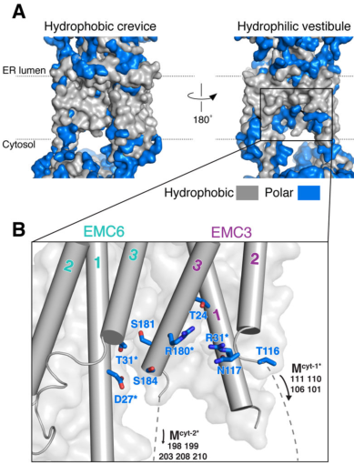

## Question

# Gene Research for Functional Annotation

## ⚠️ CRITICAL: Gene/Protein Identification Context

**BEFORE YOU BEGIN RESEARCH:** You MUST verify you are researching the CORRECT gene/protein. Gene symbols can be ambiguous, especially for less well-characterized genes from non-model organisms.

### Target Gene/Protein Identity (from UniProt):
- **UniProt Accession:** Q9P0I2
- **Protein Description:** RecName: Full=ER membrane protein complex subunit 3; AltName: Full=Transmembrane protein 111;
- **Gene Information:** Name=EMC3; Synonyms=TMEM111;
- **Organism (full):** Homo sapiens (Human).
- **Protein Family:** Belongs to the EMC3 family. .
- **Key Domains:** EMC3. (IPR008568); EMC3/TMCO1. (IPR002809); EMC3_TMCO1 (PF01956)

### MANDATORY VERIFICATION STEPS:

1. **Check if the gene symbol "EMC3" matches the protein description above**
2. **Verify the organism is correct:** Homo sapiens (Human).
3. **Check if protein family/domains align with what you find in literature**
4. **If you find literature for a DIFFERENT gene with the same or similar symbol, STOP**

### If Gene Symbol is Ambiguous or You Cannot Find Relevant Literature:

**DO NOT PROCEED WITH RESEARCH ON A DIFFERENT GENE.** Instead:
- State clearly: "The gene symbol 'EMC3' is ambiguous or literature is limited for this specific protein"
- Explain what you found (e.g., "Found extensive literature on a different gene with the same symbol in a different organism")
- Describe the protein based ONLY on the UniProt information provided above
- Suggest that the protein function can be inferred from domain/family information

### Research Target:

Please provide a comprehensive research report on the gene **EMC3** (gene ID: EMC3, UniProt: Q9P0I2) in human.

The research report should be a detailed narrative explaining the function, biological processes, and localization of the gene product. Citations should be given for all claims.

You should prioritize authoritative reviews and primary scientific literature when conducting research. You can supplement
this with annotations you find in gene/protein databases, but these can be outdated or inaccurate.

We are specifically interested in the primary function of the gene - for enzymes, what reaction is catalyzed, and what is the substrate specificity? For transporters, what is the substrate? For structural proteins or adapters, what is the broader structural role? For signaling molecules, what is the role in the pathway.

We are interested in where in or outside the cell the gene product carries out its function.

We are also interested in the signaling or biochemical pathways in which the gene functions. We are less interested in broad pleiotropic effects, except where these elucidate the precise role.

Include evidence where possible. We are interested in both experimental evidence as well as inference from structure, evolution, or bioinformatic analysis. Precise studies should be prioritized over high-throughput, where available.

## Output

Question: You are an expert researcher providing comprehensive, well-cited information.

Provide detailed information focusing on:
1. Key concepts and definitions with current understanding
2. Recent developments and latest research (prioritize 2023-2024 sources)
3. Current applications and real-world implementations
4. Expert opinions and analysis from authoritative sources
5. Relevant statistics and data from recent studies

Format as a comprehensive research report with proper citations. Include URLs and publication dates where available.
Always prioritize recent, authoritative sources and provide specific citations for all major claims.

# Gene Research for Functional Annotation

## ⚠️ CRITICAL: Gene/Protein Identification Context

**BEFORE YOU BEGIN RESEARCH:** You MUST verify you are researching the CORRECT gene/protein. Gene symbols can be ambiguous, especially for less well-characterized genes from non-model organisms.

### Target Gene/Protein Identity (from UniProt):
- **UniProt Accession:** Q9P0I2
- **Protein Description:** RecName: Full=ER membrane protein complex subunit 3; AltName: Full=Transmembrane protein 111;
- **Gene Information:** Name=EMC3; Synonyms=TMEM111;
- **Organism (full):** Homo sapiens (Human).
- **Protein Family:** Belongs to the EMC3 family. .
- **Key Domains:** EMC3. (IPR008568); EMC3/TMCO1. (IPR002809); EMC3_TMCO1 (PF01956)

### MANDATORY VERIFICATION STEPS:

1. **Check if the gene symbol "EMC3" matches the protein description above**
2. **Verify the organism is correct:** Homo sapiens (Human).
3. **Check if protein family/domains align with what you find in literature**
4. **If you find literature for a DIFFERENT gene with the same or similar symbol, STOP**

### If Gene Symbol is Ambiguous or You Cannot Find Relevant Literature:

**DO NOT PROCEED WITH RESEARCH ON A DIFFERENT GENE.** Instead:
- State clearly: "The gene symbol 'EMC3' is ambiguous or literature is limited for this specific protein"
- Explain what you found (e.g., "Found extensive literature on a different gene with the same symbol in a different organism")
- Describe the protein based ONLY on the UniProt information provided above
- Suggest that the protein function can be inferred from domain/family information

### Research Target:

Please provide a comprehensive research report on the gene **EMC3** (gene ID: EMC3, UniProt: Q9P0I2) in human.

The research report should be a detailed narrative explaining the function, biological processes, and localization of the gene product. Citations should be given for all claims.

You should prioritize authoritative reviews and primary scientific literature when conducting research. You can supplement
this with annotations you find in gene/protein databases, but these can be outdated or inaccurate.

We are specifically interested in the primary function of the gene - for enzymes, what reaction is catalyzed, and what is the substrate specificity? For transporters, what is the substrate? For structural proteins or adapters, what is the broader structural role? For signaling molecules, what is the role in the pathway.

We are interested in where in or outside the cell the gene product carries out its function.

We are also interested in the signaling or biochemical pathways in which the gene functions. We are less interested in broad pleiotropic effects, except where these elucidate the precise role.

Include evidence where possible. We are interested in both experimental evidence as well as inference from structure, evolution, or bioinformatic analysis. Precise studies should be prioritized over high-throughput, where available.

# Research Report: Human **EMC3** (UniProt **Q9P0I2**, gene **EMC3**, synonym **TMEM111**) — Functional Annotation

## 1) Gene/protein identity verification (mandatory)
The literature retrieved and synthesized here matches the UniProt identity provided: **Homo sapiens EMC3 (Q9P0I2)**, annotated as **ER membrane protein complex subunit 3**, also referred to as **TMEM111**, and described as an evolutionarily conserved membrane protein in the **Oxa1/YidC/Alb3 (Oxa1) superfamily** that forms the conserved core of the ER membrane protein complex (EMC) together with EMC6. This identity is consistently stated in authoritative structural and review sources describing **human EMC** and its **EMC3–EMC6** core insertase module. (hegde2022thefunctionstructure pages 1-2, pleiner2020structuralbasisfor pages 1-3, odonnell2020thearchitectureof pages 1-2)

## 2) Key concepts, definitions, and current understanding
### 2.1 What is the ER membrane protein complex (EMC)?
The **EMC** is a conserved multi-subunit assembly in the **endoplasmic reticulum (ER)** that functions in membrane protein biogenesis. A central conclusion from review and structural work is that EMC has an established role as a **co- and post-translational transmembrane-domain (TMD) insertase** for a subset of membrane proteins, with additional roles proposed in later folding/assembly steps for some clients. (hegde2022thefunctionstructure pages 1-2, hegde2022thefunctionstructure pages 20-22)

### 2.2 What is EMC3’s primary molecular function?
**EMC3 is not an enzyme**; rather, it is a core **membrane insertase-like** subunit that contributes directly to the EMC’s insertion pathway. In the human EMC structure, **substrate insertion occurs via a membrane-embedded, enclosed “hydrophilic vestibule” formed by EMC3 and EMC6**, and the complex uses **local membrane thinning** and a **positively charged patch** to reduce the energetic barrier of inserting challenging TMDs. (pleiner2020structuralbasisfor pages 1-3)

A key architectural/mechanistic framing is that EMC presents a cytosolic vestibule for initial TMD binding and a lipid-exposed intramembrane groove enabling **energy-independent insertion** following a **hydrophobicity gradient** from vestibule to membrane. (odonnell2020thearchitectureof pages 1-2, odonnell2020thearchitectureof pages 14-15)

### 2.3 Structural/biophysical determinants contributed by EMC3
Across human and yeast EMC structures and interpretation in authoritative reviews, EMC3:
- is structurally related to **bacterial YidC** (Oxa1 superfamily), consistent with insertase activity; (bai2020structureofthe pages 2-4, hegde2022thefunctionstructure pages 13-14)
- contains conserved basic residues within/near the vestibule whose mutation impairs insertion; (hegde2022thefunctionstructure pages 14-16)
- includes a **methionine-rich cytosolic loop** implicated in substrate capture/transfer into the vestibule; (pleiner2020structuralbasisfor pages 1-3)
- forms a **three-helix domain** (unusually extended vs many Oxa1-family proteins) that binds the cytosolic EMC scaffold subunit **EMC2**; (hegde2022thefunctionstructure pages 14-16)
These features support EMC3 being a principal functional element of the insertase machinery rather than a peripheral structural component.

## 3) Recent developments and latest research (prioritizing 2023–2024)
### 3.1 2023: A charge-based selectivity filter centered on EMC3 prevents misinsertion and enforces topology
Pleiner et al. (Journal of Cell Biology; **May 2023**; https://doi.org/10.1083/jcb.202212007) proposed and tested a **selectivity filter** in the EMC that protects ER proteome integrity by using **charge repulsion at the vestibule entrance**. Their model emphasizes that a substrate’s TMD is transiently captured while its adjacent polar tail “probes” a **positively charged hydrophilic vestibule**; positively charged tails are repelled, increasing the likelihood of substrate rejection and reducing inappropriate ER insertion. (pleiner2023aselectivityfilter pages 10-11, pleiner2023aselectivityfilter pages 8-10)

Mechanistically and specifically for EMC3, they identify **two conserved positively charged EMC3 residues (R31 and R180)** as forming the charge barrier at the vestibule entrance (in the Oxa1 superfamily context), and show that changing vestibule charge (e.g., introducing negative charge) increases ER misinsertion of mitochondrial tail-anchored proteins and incorrect topology in multipass substrates. (pleiner2023aselectivityfilter pages 10-11, pleiner2023aselectivityfilter pages 8-10, pleiner2023aselectivityfilter pages 4-6)

This 2023 framework advances EMC3 annotation from “insertase subunit” to an active **fidelity determinant**: EMC3’s vestibule electrostatics contribute to **client discrimination**, **TA protein sorting (ER vs mitochondria)**, and **positive-inside topology enforcement**. (pleiner2023aselectivityfilter pages 10-11, pleiner2023aselectivityfilter pages 8-10)

### 3.2 2024: EMC-mediated post-translational “topology rectification” expands EMC client scope
Wu et al. (Nature Structural & Molecular Biology; **Nov 2024**; https://doi.org/10.1038/s41594-023-01120-6) report that, in mammalian cells, **some terminal TMDs near the C-terminus of multipass proteins are not fully inserted co-translationally** and instead require a **post-translational insertion step mediated by EMC** to “rectify” topology after ribosome release. (wu2024emcrectifiesthe pages 1-2, wu2024emcrectifiesthe pages 7-9)

They estimate this sequential co-/post-translational mechanism may apply to roughly **~250** multipass proteins (new putative EMC-sensitive substrates), broadening the functional scope of EMC beyond classical TA insertion and selected co-translational events. (wu2024emcrectifiesthe pages 1-2, wu2024emcrectifiesthe pages 7-9)

The work also provides mechanistic constraints: EMC cannot access substrates very near a Sec61-bound ribosome exit tunnel, implying EMC acts after diffusion/partial release, consistent with an **assembly/rectification** role at late biogenesis steps for specific membrane-protein regions. (wu2024emcrectifiesthe pages 7-9)

## 4) Molecular function in pathways and cellular context
### 4.1 Pathway context: ER membrane protein biogenesis and quality control
EMC3 functions in the ER membrane biogenesis network that includes Sec61-mediated translocation/insertion. The EMC is positioned as a parallel/auxiliary insertase for “difficult” TMDs (e.g., with polar/charged residues) and may also intersect with quality control pathways by preventing misinsertion (2023 selectivity filter) and helping complete topogenesis of multipass proteins (2024 rectification). (odonnell2020thearchitectureof pages 1-2, pleiner2023aselectivityfilter pages 8-10, wu2024emcrectifiesthe pages 1-2)

### 4.2 Substrates/clients: what types of proteins depend on EMC (and thus EMC3)
A major empirical theme is that EMC clients often contain at least one TMD with **polar/charged residues**, and altering these residues can shift EMC dependence.

- In an unbiased quantitative proteomics study (Cell Reports; **Sep 2019**; https://doi.org/10.1016/j.celrep.2019.08.006), Tian et al. identified **36 EMC-dependent** membrane proteins and **171 EMC-independent** membrane proteins using stringent reproducibility criteria; EMC-dependent proteins were enriched among multipass proteins and were characterized by polar/charged residues in TMDs. (tian2019proteomicanalysisidentifies pages 1-3, tian2019proteomicanalysisidentifies pages 5-6)
- Representative EMC-dependent proteins in that study include **FDFT1/SQS** (tail-anchored-like topology with low hydrophobicity), **FZD6**, **ATP6V0A1**, and **SLC43A3**; proteasome inhibition could rescue levels of some EMC-dependent proteins in EMC-deficient backgrounds, indicating failure of biogenesis leads to degradation. (tian2019proteomicanalysisidentifies pages 3-5, tian2019proteomicanalysisidentifies pages 5-6)
- In structural/functional assays of human EMC, reporter substrates used to separate EMC-dependent insertion include **SQS/FDFT1**, **VAMP2** (comparatively EMC-independent), and multipass reporters such as **OPRK1** and **TRAM2**. (pleiner2020structuralbasisfor pages 7-11, pleiner2023aselectivityfilter pages 8-10)

## 5) Current applications and real-world implementations
### 5.1 Biomedical relevance via membrane-protein drug targets
Because a large fraction of therapeutics target integral membrane proteins, mechanisms governing membrane-protein biogenesis (including EMC3-dependent insertion) are relevant to broad biomedical contexts. The cryo-EM structure paper frames membrane protein biogenesis defects as underlying diverse human diseases and highlights the biomedical importance of understanding EMC-mediated insertion. (pleiner2020structuralbasisfor pages 7-11)

### 5.2 In vivo functional relevance demonstrated in mammalian retina
Although the report’s focus is human EMC3, mammalian in vivo models provide strong functional evidence for EMC3-dependent biogenesis of critical neural membrane proteins:
- Conditional loss of **Emc3** in mouse photoreceptors leads to **rhodopsin mislocalization** and death of rod and cone photoreceptors, consistent with EMC3’s role in early biosynthesis/handling of a key multipass GPCR-like membrane protein in vivo. (xiong2020ercomplexproteins pages 1-2, xiong2020ercomplexproteins pages 10-13)
- Bipolar-cell conditional knockout shows progressive dysfunction and degeneration with quantitative electrophysiology and histology changes (below), offering a “real-world” physiological implementation of EMC3-dependent membrane-protein maintenance in a defined neural circuit. (zhu2020lossofthe pages 4-6)

### 5.3 Limitations of evidence for direct clinical implementation
Within the retrieved evidence set, there were **no direct, clinically deployed therapies** that specifically target EMC3 or EMC insertase activity, and no human clinical trials were identified in this run. Translational relevance is therefore best supported currently through (i) mechanistic understanding of membrane-protein biogenesis and (ii) disease/phenotype models consistent with failure of EMC-dependent membrane-protein homeostasis.

## 6) Expert opinions and authoritative synthesis
The Annual Review of Biochemistry article by Hegde (Annual Review of Biochemistry; **Jun 2022**; https://doi.org/10.1146/annurev-biochem-032620-104553) provides an authoritative synthesis emphasizing:
- EMC is built around a conserved **EMC3–EMC6** core; EMC3 is an Oxa1 superfamily member; (hegde2022thefunctionstructure pages 1-2)
- EMC has an established role in **TMD insertion** with additional less well understood roles in later folding/assembly; (hegde2022thefunctionstructure pages 1-2)
- key mechanistic questions remain about how EMC’s multiple putative substrate-handling modes relate (insertase versus chaperone-like effects), motivating careful substrate-specific topology/folding assays. (hegde2022thefunctionstructure pages 20-22)

This review perspective aligns with the trajectory of 2023–2024 primary research: EMC3 has clearly defined insertion and fidelity roles (2023), and EMC’s role in post-translational topology completion suggests an expanded functional repertoire consistent with “multifunctional molecular machine” models. (pleiner2023aselectivityfilter pages 8-10, wu2024emcrectifiesthe pages 1-2)

## 7) Relevant statistics and quantitative data (recent studies emphasized where available)
### 7.1 Structural/biophysical quantitative measures
- The human EMC cryo-EM structure was determined at ~**3.4 Å** overall resolution and includes a membrane region with **12** transmembrane helices (nine forming an ordered core) and a cytosolic basket (EMC2/EMC8). (pleiner2020structuralbasisfor pages 1-3)

### 7.2 Proteomics-defined EMC client set size
Tian et al. (Cell Reports; **Sep 2019**) quantified **5,570** proteins total; **4,446** were quantified with ≥2 peptides; **3,188** were membrane-associated by GO-CC; **971** carried UniProt “Transmembrane” annotation; among these, **36** were classified as EMC-dependent versus **171** as EMC-independent. (tian2019proteomicanalysisidentifies pages 3-5, tian2019proteomicanalysisidentifies pages 5-6)

### 7.3 2024 client-scope estimate for topology rectification
Wu et al. (NSMB; **Nov 2024**) estimated their sequential co-/post-translational rectification mechanism may apply to **~250** multipass proteins (new putative EMC substrates). (wu2024emcrectifiesthe pages 1-2, wu2024emcrectifiesthe pages 7-9)

### 7.4 Quantitative in vivo phenotype data linked to EMC3 loss
In a bipolar-cell-specific Emc3 conditional knockout in mice (PLoS ONE; **Sep 2020**; https://doi.org/10.1371/journal.pone.0238435):
- recombination affected ~**75%** of bipolar cells, with Emc3 expression reduced ~**40–45%** by RT-PCR; (zhu2020lossofthe pages 4-6)
- at 12 months, scotopic ERG **b-wave amplitudes decreased ~50%** and photopic b-waves **~30%**, while a-waves were unchanged (post-receptoral defect); (zhu2020lossofthe pages 4-6)
- oscillatory potentials decreased to ~**51–62%** depending on flash intensity; (zhu2020lossofthe pages 4-6)
- ~**50%** loss of PKCα+ rod bipolar cells and INL thickness reduced to ~**55%** of control. (zhu2020lossofthe pages 4-6)

## 8) Visual structural evidence (EMC3/EMC6 vestibule)
Cryo-EM figures from Pleiner et al. (Science; **Jul 2020**; https://doi.org/10.1126/science.abb5008) depict the EMC membrane region and highlight the **hydrophilic vestibule** formed by **EMC3 and EMC6**, including a cutaway/space-filling view of the conduit spanning the membrane—directly supporting the mechanistic annotation of EMC3 as part of an intramembrane insertion vestibule. (pleiner2020structuralbasisfor media a4fc15a7, pleiner2020structuralbasisfor media 72e4d409)

## 9) Summary of functional annotation (concise)
Human **EMC3 (Q9P0I2; TMEM111)** is an ER-resident, Oxa1/YidC-like core subunit of the EMC insertase. Its **primary function** is to participate directly in **selective insertion and topogenesis** of a subset of membrane proteins by forming (with EMC6) a **hydrophilic intramembrane vestibule**; EMC3’s cytosolic loops mediate substrate capture, and its conserved vestibule charges enforce **selectivity** to prevent misinsertion and help implement the **positive-inside** topology rule. Recent work indicates EMC (and thus EMC3) also supports post-translational **topology rectification** for a substantial set of multipass proteins, consistent with a broader role in late-stage membrane-protein biogenesis and proteostasis. (pleiner2020structuralbasisfor pages 1-3, pleiner2023aselectivityfilter pages 8-10, pleiner2023aselectivityfilter pages 4-6, wu2024emcrectifiesthe pages 1-2)

---

## Evidence summary table
| Aspect | Evidence | Key sources (with year) | URL |
|---|---|---|---|
| Identity/domains | Human EMC3 corresponds to UniProt Q9P0I2, also called ER membrane protein complex subunit 3/TMEM111; it is a core transmembrane subunit of the ER membrane protein complex and belongs to the Oxa1/YidC/Alb3 insertase superfamily, consistent with EMC3-family/domain annotation (hegde2022thefunctionstructure pages 1-2, pleiner2020structuralbasisfor pages 1-3, odonnell2020thearchitectureof pages 1-2) | Hegde 2022; Pleiner et al. 2020; O'Donnell et al. 2020 | https://doi.org/10.1146/annurev-biochem-032620-104553 ; https://doi.org/10.1126/science.abb5008 ; https://doi.org/10.7554/elife.57887 |
| Localization | EMC3 is an ER membrane protein within the multi-subunit EMC; structurally it sits in the membrane core with EMC6 and contributes to the membrane-embedded insertase. In Drosophila retina, EMC3 co-localizes with the ER marker calnexin, supporting ER localization in vivo (hegde2022thefunctionstructure pages 13-14, pleiner2020structuralbasisfor pages 7-11, xiong2020ercomplexproteins pages 7-10) | Pleiner et al. 2020; Hegde 2022; Xiong et al. 2020 | https://doi.org/10.1126/science.abb5008 ; https://doi.org/10.1146/annurev-biochem-032620-104553 ; https://doi.org/10.1038/s41418-019-0378-6 |
| Molecular function/mechanism | EMC3 is a core insertase subunit that, together with EMC6, forms a hydrophilic intramembrane vestibule for insertion of selected transmembrane domains, especially tail-anchored proteins and some N-terminal or terminal helices of multipass proteins. EMC-mediated insertion is energy-independent and aided by membrane thinning and a positively charged patch that lower the energetic barrier for insertion (hegde2022thefunctionstructure pages 14-16, pleiner2020structuralbasisfor pages 7-11, odonnell2020thearchitectureof pages 1-2, pleiner2020structuralbasisfor pages 1-3) | Pleiner et al. 2020; O'Donnell et al. 2020; Hegde 2022 | https://doi.org/10.1126/science.abb5008 ; https://doi.org/10.7554/elife.57887 ; https://doi.org/10.1146/annurev-biochem-032620-104553 |
| EMC3-specific structural elements | EMC3 is a three-transmembrane, YidC-like bundle that abuts EMC6 at the complex midline; it has a methionine-rich cytosolic loop required for substrate capture/insertion, a conserved hydrophilic vestibule with key basic residues, lumenal-plane helices that may remodel bilayer properties, and a C-terminal three-helix bundle that binds the cytosolic scaffold EMC2 (hegde2022thefunctionstructure pages 13-14, hegde2022thefunctionstructure pages 14-16, pleiner2020structuralbasisfor pages 1-3, pleiner2023aselectivityfilter pages 4-6) | Pleiner et al. 2020; Hegde 2022; Pleiner et al. 2023 | https://doi.org/10.1126/science.abb5008 ; https://doi.org/10.1146/annurev-biochem-032620-104553 ; https://doi.org/10.1083/jcb.202212007 |
| Client/substrate examples | EMC-dependent clients include tail-anchored SQS/FDFT1 and multipass proteins such as OPRK1, TRAM2, ATP6V0A1, FZD6, SLC43A3, CD9, and SEC61A1; EMC dependence correlates with polar/charged residues in at least one transmembrane domain, and mutagenesis can switch proteins between EMC-dependent and EMC-independent states (pleiner2020structuralbasisfor pages 7-11, tian2019proteomicanalysisidentifies pages 1-3, tian2019proteomicanalysisidentifies pages 3-5, tian2019proteomicanalysisidentifies pages 5-6, tian2019proteomicanalysisidentifies pages 8-10) | Pleiner et al. 2020; Tian et al. 2019 | https://doi.org/10.1126/science.abb5008 ; https://doi.org/10.1016/j.celrep.2019.08.006 |
| 2023-2024 key advances | 2023 work showed that EMC selectivity is enforced by a vestibule-entry charge filter centered on conserved EMC3 residues R31 and R180, which repel positively charged tails to reduce ER misinsertion of mitochondrial TA proteins and help enforce the positive-inside rule. 2024 work showed EMC can post-translationally rectify topology of multipass proteins by inserting C-terminal TMDs after ribosome release, expanding EMC function beyond earlier co-/post-translational insertion models (pleiner2023aselectivityfilter pages 10-11, pleiner2023aselectivityfilter pages 8-10, pleiner2023aselectivityfilter pages 2-4, pleiner2023aselectivityfilter pages 4-6, wu2024emcrectifiesthe pages 1-2, wu2024emcrectifiesthe pages 7-9, wu2024emcrectifiesthe pages 2-3) | Pleiner et al. 2023; Wu et al. 2024 | https://doi.org/10.1083/jcb.202212007 ; https://doi.org/10.1038/s41594-023-01120-6 |
| Phenotypes/disease relevance | In vivo loss of Emc3 impairs rhodopsin biogenesis and photoreceptor survival across species and causes retinal degeneration phenotypes. In mouse photoreceptors, Emc3 deletion caused rhodopsin mislocalization and rod/cone death; in bipolar-cell conditional knockout mice, Emc3 loss caused age-dependent bipolar-cell degeneration, synaptic disorganization, reduced ERG b-waves, and reactive gliosis, indicating dependence of neural membrane-protein homeostasis on EMC3 (xiong2020ercomplexproteins pages 1-2, zhu2020lossofthe pages 6-9, xiong2020ercomplexproteins pages 10-13, zhu2020lossofthe pages 1-2, zhu2020lossofthe pages 9-11, zhu2020lossofthe pages 4-6) | Xiong et al. 2020; Zhu et al. 2020 | https://doi.org/10.1038/s41418-019-0378-6 ; https://doi.org/10.1371/journal.pone.0238435 |
| Quantitative statistics | Structural studies resolved human EMC at 3.4 Å overall resolution with ~12 TMs in the membrane region; proteomics identified 5,570 proteins total, 4,446 quantified, 3,188 membrane-associated, 971 with transmembrane annotation, and 36 EMC-dependent membrane proteins versus 171 EMC-independent ones. Recent topology work estimated ~250 new putative EMC-sensitive multipass substrates. In bipolar-cell cKO mice, Emc3 deletion affected ~75% of BCs, reduced Emc3 expression by ~40-45%, lowered scotopic b-waves by ~50%, photopic b-waves by ~30%, OPs to ~51-62% of control, caused ~50% loss of PKCα+ rod bipolar cells, and reduced INL thickness to ~55% of control at 12 months (pleiner2020structuralbasisfor pages 1-3, tian2019proteomicanalysisidentifies pages 3-5, tian2019proteomicanalysisidentifies pages 5-6, wu2024emcrectifiesthe pages 7-9, zhu2020lossofthe pages 9-11, zhu2020lossofthe pages 4-6) | Pleiner et al. 2020; Tian et al. 2019; Wu et al. 2024; Zhu et al. 2020 | https://doi.org/10.1126/science.abb5008 ; https://doi.org/10.1016/j.celrep.2019.08.006 ; https://doi.org/10.1038/s41594-023-01120-6 ; https://doi.org/10.1371/journal.pone.0238435 |

*Table: This table summarizes verified identity, mechanism, localization, key recent advances, representative clients, phenotypic relevance, and quantitative evidence for human EMC3 (UniProt Q9P0I2). It is useful as a compact evidence-based reference for functional annotation.*

References

1. (hegde2022thefunctionstructure pages 1-2): Ramanujan S. Hegde. The function, structure, and origins of the er membrane protein complex. Annual Review of Biochemistry, 91:651-678, Jun 2022. URL: https://doi.org/10.1146/annurev-biochem-032620-104553, doi:10.1146/annurev-biochem-032620-104553. This article has 65 citations and is from a domain leading peer-reviewed journal.

2. (pleiner2020structuralbasisfor pages 1-3): Tino Pleiner, Giovani Pinton Tomaleri, Kurt Januszyk, Alison J. Inglis, Masami Hazu, and Rebecca M. Voorhees. Structural basis for membrane insertion by the human er membrane protein complex. Jul 2020. URL: https://doi.org/10.1126/science.abb5008, doi:10.1126/science.abb5008. This article has 192 citations and is from a highest quality peer-reviewed journal.

3. (odonnell2020thearchitectureof pages 1-2): John P O'Donnell, Ben P Phillips, Yuichi Yagita, Szymon Juszkiewicz, Armin Wagner, Duccio Malinverni, Robert J Keenan, Elizabeth A Miller, and Ramanujan S Hegde. The architecture of emc reveals a path for membrane protein insertion. May 2020. URL: https://doi.org/10.7554/elife.57887, doi:10.7554/elife.57887. This article has 121 citations and is from a domain leading peer-reviewed journal.

4. (hegde2022thefunctionstructure pages 20-22): Ramanujan S. Hegde. The function, structure, and origins of the er membrane protein complex. Annual Review of Biochemistry, 91:651-678, Jun 2022. URL: https://doi.org/10.1146/annurev-biochem-032620-104553, doi:10.1146/annurev-biochem-032620-104553. This article has 65 citations and is from a domain leading peer-reviewed journal.

5. (odonnell2020thearchitectureof pages 14-15): John P O'Donnell, Ben P Phillips, Yuichi Yagita, Szymon Juszkiewicz, Armin Wagner, Duccio Malinverni, Robert J Keenan, Elizabeth A Miller, and Ramanujan S Hegde. The architecture of emc reveals a path for membrane protein insertion. May 2020. URL: https://doi.org/10.7554/elife.57887, doi:10.7554/elife.57887. This article has 121 citations and is from a domain leading peer-reviewed journal.

6. (bai2020structureofthe pages 2-4): Lin Bai, Qinglong You, Xiang Feng, Amanda Kovach, and Huilin Li. Structure of the er membrane complex, a transmembrane-domain insertase. Jun 2020. URL: https://doi.org/10.1038/s41586-020-2389-3, doi:10.1038/s41586-020-2389-3. This article has 164 citations and is from a highest quality peer-reviewed journal.

7. (hegde2022thefunctionstructure pages 13-14): Ramanujan S. Hegde. The function, structure, and origins of the er membrane protein complex. Annual Review of Biochemistry, 91:651-678, Jun 2022. URL: https://doi.org/10.1146/annurev-biochem-032620-104553, doi:10.1146/annurev-biochem-032620-104553. This article has 65 citations and is from a domain leading peer-reviewed journal.

8. (hegde2022thefunctionstructure pages 14-16): Ramanujan S. Hegde. The function, structure, and origins of the er membrane protein complex. Annual Review of Biochemistry, 91:651-678, Jun 2022. URL: https://doi.org/10.1146/annurev-biochem-032620-104553, doi:10.1146/annurev-biochem-032620-104553. This article has 65 citations and is from a domain leading peer-reviewed journal.

9. (pleiner2023aselectivityfilter pages 10-11): Tino Pleiner, Masami Hazu, Giovani Pinton Tomaleri, Vy N. Nguyen, Kurt Januszyk, and Rebecca M. Voorhees. A selectivity filter in the er membrane protein complex limits protein misinsertion at the er. The Journal of Cell Biology, May 2023. URL: https://doi.org/10.1083/jcb.202212007, doi:10.1083/jcb.202212007. This article has 28 citations.

10. (pleiner2023aselectivityfilter pages 8-10): Tino Pleiner, Masami Hazu, Giovani Pinton Tomaleri, Vy N. Nguyen, Kurt Januszyk, and Rebecca M. Voorhees. A selectivity filter in the er membrane protein complex limits protein misinsertion at the er. The Journal of Cell Biology, May 2023. URL: https://doi.org/10.1083/jcb.202212007, doi:10.1083/jcb.202212007. This article has 28 citations.

11. (pleiner2023aselectivityfilter pages 4-6): Tino Pleiner, Masami Hazu, Giovani Pinton Tomaleri, Vy N. Nguyen, Kurt Januszyk, and Rebecca M. Voorhees. A selectivity filter in the er membrane protein complex limits protein misinsertion at the er. The Journal of Cell Biology, May 2023. URL: https://doi.org/10.1083/jcb.202212007, doi:10.1083/jcb.202212007. This article has 28 citations.

12. (wu2024emcrectifiesthe pages 1-2): Haoxi Wu, Luka Smalinskaitė, and Ramanujan S. Hegde. Emc rectifies the topology of multipass membrane proteins. Nature Structural & Molecular Biology, 31:32-41, Nov 2024. URL: https://doi.org/10.1038/s41594-023-01120-6, doi:10.1038/s41594-023-01120-6. This article has 41 citations and is from a highest quality peer-reviewed journal.

13. (wu2024emcrectifiesthe pages 7-9): Haoxi Wu, Luka Smalinskaitė, and Ramanujan S. Hegde. Emc rectifies the topology of multipass membrane proteins. Nature Structural & Molecular Biology, 31:32-41, Nov 2024. URL: https://doi.org/10.1038/s41594-023-01120-6, doi:10.1038/s41594-023-01120-6. This article has 41 citations and is from a highest quality peer-reviewed journal.

14. (tian2019proteomicanalysisidentifies pages 1-3): Songhai Tian, Quan Wu, Bo Zhou, Mei Yuk Choi, Bo Ding, Wei Yang, and Min Dong. Proteomic analysis identifies membrane proteins dependent on the er membrane protein complex. Cell reports, 28:2517-2526.e5, Sep 2019. URL: https://doi.org/10.1016/j.celrep.2019.08.006, doi:10.1016/j.celrep.2019.08.006. This article has 79 citations and is from a highest quality peer-reviewed journal.

15. (tian2019proteomicanalysisidentifies pages 5-6): Songhai Tian, Quan Wu, Bo Zhou, Mei Yuk Choi, Bo Ding, Wei Yang, and Min Dong. Proteomic analysis identifies membrane proteins dependent on the er membrane protein complex. Cell reports, 28:2517-2526.e5, Sep 2019. URL: https://doi.org/10.1016/j.celrep.2019.08.006, doi:10.1016/j.celrep.2019.08.006. This article has 79 citations and is from a highest quality peer-reviewed journal.

16. (tian2019proteomicanalysisidentifies pages 3-5): Songhai Tian, Quan Wu, Bo Zhou, Mei Yuk Choi, Bo Ding, Wei Yang, and Min Dong. Proteomic analysis identifies membrane proteins dependent on the er membrane protein complex. Cell reports, 28:2517-2526.e5, Sep 2019. URL: https://doi.org/10.1016/j.celrep.2019.08.006, doi:10.1016/j.celrep.2019.08.006. This article has 79 citations and is from a highest quality peer-reviewed journal.

17. (pleiner2020structuralbasisfor pages 7-11): Tino Pleiner, Giovani Pinton Tomaleri, Kurt Januszyk, Alison J. Inglis, Masami Hazu, and Rebecca M. Voorhees. Structural basis for membrane insertion by the human er membrane protein complex. Jul 2020. URL: https://doi.org/10.1126/science.abb5008, doi:10.1126/science.abb5008. This article has 192 citations and is from a highest quality peer-reviewed journal.

18. (xiong2020ercomplexproteins pages 1-2): Liangyao Xiong, Lin Zhang, Yeming Yang, Na Li, Wenjia Lai, Fengchao Wang, Xianjun Zhu, and Tao Wang. Er complex proteins are required for rhodopsin biosynthesis and photoreceptor survival in drosophila and mice. Cell Death and Differentiation, 27:646-661, Jul 2020. URL: https://doi.org/10.1038/s41418-019-0378-6, doi:10.1038/s41418-019-0378-6. This article has 45 citations and is from a domain leading peer-reviewed journal.

19. (xiong2020ercomplexproteins pages 10-13): Liangyao Xiong, Lin Zhang, Yeming Yang, Na Li, Wenjia Lai, Fengchao Wang, Xianjun Zhu, and Tao Wang. Er complex proteins are required for rhodopsin biosynthesis and photoreceptor survival in drosophila and mice. Cell Death and Differentiation, 27:646-661, Jul 2020. URL: https://doi.org/10.1038/s41418-019-0378-6, doi:10.1038/s41418-019-0378-6. This article has 45 citations and is from a domain leading peer-reviewed journal.

20. (zhu2020lossofthe pages 4-6): Xiong Zhu, Xin Qi, Yeming Yang, Wanli Tian, Wenjing Liu, Zhilin Jiang, Shuzhen Li, and Xianjun Zhu. Loss of the er membrane protein complex subunit emc3 leads to retinal bipolar cell degeneration in aged mice. PLoS ONE, 15:e0238435, Sep 2020. URL: https://doi.org/10.1371/journal.pone.0238435, doi:10.1371/journal.pone.0238435. This article has 16 citations and is from a peer-reviewed journal.

21. (pleiner2020structuralbasisfor media a4fc15a7): Tino Pleiner, Giovani Pinton Tomaleri, Kurt Januszyk, Alison J. Inglis, Masami Hazu, and Rebecca M. Voorhees. Structural basis for membrane insertion by the human er membrane protein complex. Jul 2020. URL: https://doi.org/10.1126/science.abb5008, doi:10.1126/science.abb5008. This article has 192 citations and is from a highest quality peer-reviewed journal.

22. (pleiner2020structuralbasisfor media 72e4d409): Tino Pleiner, Giovani Pinton Tomaleri, Kurt Januszyk, Alison J. Inglis, Masami Hazu, and Rebecca M. Voorhees. Structural basis for membrane insertion by the human er membrane protein complex. Jul 2020. URL: https://doi.org/10.1126/science.abb5008, doi:10.1126/science.abb5008. This article has 192 citations and is from a highest quality peer-reviewed journal.

23. (xiong2020ercomplexproteins pages 7-10): Liangyao Xiong, Lin Zhang, Yeming Yang, Na Li, Wenjia Lai, Fengchao Wang, Xianjun Zhu, and Tao Wang. Er complex proteins are required for rhodopsin biosynthesis and photoreceptor survival in drosophila and mice. Cell Death and Differentiation, 27:646-661, Jul 2020. URL: https://doi.org/10.1038/s41418-019-0378-6, doi:10.1038/s41418-019-0378-6. This article has 45 citations and is from a domain leading peer-reviewed journal.

24. (tian2019proteomicanalysisidentifies pages 8-10): Songhai Tian, Quan Wu, Bo Zhou, Mei Yuk Choi, Bo Ding, Wei Yang, and Min Dong. Proteomic analysis identifies membrane proteins dependent on the er membrane protein complex. Cell reports, 28:2517-2526.e5, Sep 2019. URL: https://doi.org/10.1016/j.celrep.2019.08.006, doi:10.1016/j.celrep.2019.08.006. This article has 79 citations and is from a highest quality peer-reviewed journal.

25. (pleiner2023aselectivityfilter pages 2-4): Tino Pleiner, Masami Hazu, Giovani Pinton Tomaleri, Vy N. Nguyen, Kurt Januszyk, and Rebecca M. Voorhees. A selectivity filter in the er membrane protein complex limits protein misinsertion at the er. The Journal of Cell Biology, May 2023. URL: https://doi.org/10.1083/jcb.202212007, doi:10.1083/jcb.202212007. This article has 28 citations.

26. (wu2024emcrectifiesthe pages 2-3): Haoxi Wu, Luka Smalinskaitė, and Ramanujan S. Hegde. Emc rectifies the topology of multipass membrane proteins. Nature Structural & Molecular Biology, 31:32-41, Nov 2024. URL: https://doi.org/10.1038/s41594-023-01120-6, doi:10.1038/s41594-023-01120-6. This article has 41 citations and is from a highest quality peer-reviewed journal.

27. (zhu2020lossofthe pages 6-9): Xiong Zhu, Xin Qi, Yeming Yang, Wanli Tian, Wenjing Liu, Zhilin Jiang, Shuzhen Li, and Xianjun Zhu. Loss of the er membrane protein complex subunit emc3 leads to retinal bipolar cell degeneration in aged mice. PLoS ONE, 15:e0238435, Sep 2020. URL: https://doi.org/10.1371/journal.pone.0238435, doi:10.1371/journal.pone.0238435. This article has 16 citations and is from a peer-reviewed journal.

28. (zhu2020lossofthe pages 1-2): Xiong Zhu, Xin Qi, Yeming Yang, Wanli Tian, Wenjing Liu, Zhilin Jiang, Shuzhen Li, and Xianjun Zhu. Loss of the er membrane protein complex subunit emc3 leads to retinal bipolar cell degeneration in aged mice. PLoS ONE, 15:e0238435, Sep 2020. URL: https://doi.org/10.1371/journal.pone.0238435, doi:10.1371/journal.pone.0238435. This article has 16 citations and is from a peer-reviewed journal.

29. (zhu2020lossofthe pages 9-11): Xiong Zhu, Xin Qi, Yeming Yang, Wanli Tian, Wenjing Liu, Zhilin Jiang, Shuzhen Li, and Xianjun Zhu. Loss of the er membrane protein complex subunit emc3 leads to retinal bipolar cell degeneration in aged mice. PLoS ONE, 15:e0238435, Sep 2020. URL: https://doi.org/10.1371/journal.pone.0238435, doi:10.1371/journal.pone.0238435. This article has 16 citations and is from a peer-reviewed journal.

## Artifacts

- [Edison artifact artifact-00](EMC3-deep-research-falcon_artifacts/artifact-00.md)

## Citations

1. pleiner2020structuralbasisfor pages 1-3
2. hegde2022thefunctionstructure pages 14-16
3. wu2024emcrectifiesthe pages 7-9
4. pleiner2020structuralbasisfor pages 7-11
5. zhu2020lossofthe pages 4-6
6. hegde2022thefunctionstructure pages 1-2
7. hegde2022thefunctionstructure pages 20-22
8. odonnell2020thearchitectureof pages 1-2
9. odonnell2020thearchitectureof pages 14-15
10. bai2020structureofthe pages 2-4
11. hegde2022thefunctionstructure pages 13-14
12. pleiner2023aselectivityfilter pages 10-11
13. pleiner2023aselectivityfilter pages 8-10
14. pleiner2023aselectivityfilter pages 4-6
15. wu2024emcrectifiesthe pages 1-2
16. tian2019proteomicanalysisidentifies pages 1-3
17. tian2019proteomicanalysisidentifies pages 5-6
18. tian2019proteomicanalysisidentifies pages 3-5
19. xiong2020ercomplexproteins pages 1-2
20. xiong2020ercomplexproteins pages 10-13
21. xiong2020ercomplexproteins pages 7-10
22. tian2019proteomicanalysisidentifies pages 8-10
23. pleiner2023aselectivityfilter pages 2-4
24. wu2024emcrectifiesthe pages 2-3
25. zhu2020lossofthe pages 6-9
26. zhu2020lossofthe pages 1-2
27. zhu2020lossofthe pages 9-11
28. https://doi.org/10.1083/jcb.202212007
29. https://doi.org/10.1038/s41594-023-01120-6
30. https://doi.org/10.1016/j.celrep.2019.08.006
31. https://doi.org/10.1146/annurev-biochem-032620-104553
32. https://doi.org/10.1371/journal.pone.0238435
33. https://doi.org/10.1126/science.abb5008
34. https://doi.org/10.7554/elife.57887
35. https://doi.org/10.1038/s41418-019-0378-6
36. https://doi.org/10.1146/annurev-biochem-032620-104553,
37. https://doi.org/10.1126/science.abb5008,
38. https://doi.org/10.7554/elife.57887,
39. https://doi.org/10.1038/s41586-020-2389-3,
40. https://doi.org/10.1083/jcb.202212007,
41. https://doi.org/10.1038/s41594-023-01120-6,
42. https://doi.org/10.1016/j.celrep.2019.08.006,
43. https://doi.org/10.1038/s41418-019-0378-6,
44. https://doi.org/10.1371/journal.pone.0238435,