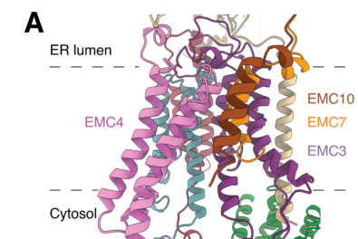

## Question

# Gene Research for Functional Annotation

## ⚠️ CRITICAL: Gene/Protein Identification Context

**BEFORE YOU BEGIN RESEARCH:** You MUST verify you are researching the CORRECT gene/protein. Gene symbols can be ambiguous, especially for less well-characterized genes from non-model organisms.

### Target Gene/Protein Identity (from UniProt):
- **UniProt Accession:** Q5J8M3
- **Protein Description:** RecName: Full=ER membrane protein complex subunit 4; AltName: Full=Cell proliferation-inducing gene 17 protein; AltName: Full=Transmembrane protein 85;
- **Gene Information:** Name=EMC4; Synonyms=TMEM85; ORFNames=HSPC184, PIG17;
- **Organism (full):** Homo sapiens (Human).
- **Protein Family:** Belongs to the EMC4 family. .
- **Key Domains:** TMEM85/Emc4. (IPR009445); EMC4 (PF06417)

### MANDATORY VERIFICATION STEPS:

1. **Check if the gene symbol "EMC4" matches the protein description above**
2. **Verify the organism is correct:** Homo sapiens (Human).
3. **Check if protein family/domains align with what you find in literature**
4. **If you find literature for a DIFFERENT gene with the same or similar symbol, STOP**

### If Gene Symbol is Ambiguous or You Cannot Find Relevant Literature:

**DO NOT PROCEED WITH RESEARCH ON A DIFFERENT GENE.** Instead:
- State clearly: "The gene symbol 'EMC4' is ambiguous or literature is limited for this specific protein"
- Explain what you found (e.g., "Found extensive literature on a different gene with the same symbol in a different organism")
- Describe the protein based ONLY on the UniProt information provided above
- Suggest that the protein function can be inferred from domain/family information

### Research Target:

Please provide a comprehensive research report on the gene **EMC4** (gene ID: EMC4, UniProt: Q5J8M3) in human.

The research report should be a detailed narrative explaining the function, biological processes, and localization of the gene product. Citations should be given for all claims.

You should prioritize authoritative reviews and primary scientific literature when conducting research. You can supplement
this with annotations you find in gene/protein databases, but these can be outdated or inaccurate.

We are specifically interested in the primary function of the gene - for enzymes, what reaction is catalyzed, and what is the substrate specificity? For transporters, what is the substrate? For structural proteins or adapters, what is the broader structural role? For signaling molecules, what is the role in the pathway.

We are interested in where in or outside the cell the gene product carries out its function.

We are also interested in the signaling or biochemical pathways in which the gene functions. We are less interested in broad pleiotropic effects, except where these elucidate the precise role.

Include evidence where possible. We are interested in both experimental evidence as well as inference from structure, evolution, or bioinformatic analysis. Precise studies should be prioritized over high-throughput, where available.

## Output

Question: You are an expert researcher providing comprehensive, well-cited information.

Provide detailed information focusing on:
1. Key concepts and definitions with current understanding
2. Recent developments and latest research (prioritize 2023-2024 sources)
3. Current applications and real-world implementations
4. Expert opinions and analysis from authoritative sources
5. Relevant statistics and data from recent studies

Format as a comprehensive research report with proper citations. Include URLs and publication dates where available.
Always prioritize recent, authoritative sources and provide specific citations for all major claims.

# Gene Research for Functional Annotation

## ⚠️ CRITICAL: Gene/Protein Identification Context

**BEFORE YOU BEGIN RESEARCH:** You MUST verify you are researching the CORRECT gene/protein. Gene symbols can be ambiguous, especially for less well-characterized genes from non-model organisms.

### Target Gene/Protein Identity (from UniProt):
- **UniProt Accession:** Q5J8M3
- **Protein Description:** RecName: Full=ER membrane protein complex subunit 4; AltName: Full=Cell proliferation-inducing gene 17 protein; AltName: Full=Transmembrane protein 85;
- **Gene Information:** Name=EMC4; Synonyms=TMEM85; ORFNames=HSPC184, PIG17;
- **Organism (full):** Homo sapiens (Human).
- **Protein Family:** Belongs to the EMC4 family. .
- **Key Domains:** TMEM85/Emc4. (IPR009445); EMC4 (PF06417)

### MANDATORY VERIFICATION STEPS:

1. **Check if the gene symbol "EMC4" matches the protein description above**
2. **Verify the organism is correct:** Homo sapiens (Human).
3. **Check if protein family/domains align with what you find in literature**
4. **If you find literature for a DIFFERENT gene with the same or similar symbol, STOP**

### If Gene Symbol is Ambiguous or You Cannot Find Relevant Literature:

**DO NOT PROCEED WITH RESEARCH ON A DIFFERENT GENE.** Instead:
- State clearly: "The gene symbol 'EMC4' is ambiguous or literature is limited for this specific protein"
- Explain what you found (e.g., "Found extensive literature on a different gene with the same symbol in a different organism")
- Describe the protein based ONLY on the UniProt information provided above
- Suggest that the protein function can be inferred from domain/family information

### Research Target:

Please provide a comprehensive research report on the gene **EMC4** (gene ID: EMC4, UniProt: Q5J8M3) in human.

The research report should be a detailed narrative explaining the function, biological processes, and localization of the gene product. Citations should be given for all claims.

You should prioritize authoritative reviews and primary scientific literature when conducting research. You can supplement
this with annotations you find in gene/protein databases, but these can be outdated or inaccurate.

We are specifically interested in the primary function of the gene - for enzymes, what reaction is catalyzed, and what is the substrate specificity? For transporters, what is the substrate? For structural proteins or adapters, what is the broader structural role? For signaling molecules, what is the role in the pathway.

We are interested in where in or outside the cell the gene product carries out its function.

We are also interested in the signaling or biochemical pathways in which the gene functions. We are less interested in broad pleiotropic effects, except where these elucidate the precise role.

Include evidence where possible. We are interested in both experimental evidence as well as inference from structure, evolution, or bioinformatic analysis. Precise studies should be prioritized over high-throughput, where available.

## Research report: Human **EMC4** (UniProt **Q5J8M3**; gene **EMC4**; synonyms **TMEM85**, **PIG17**) — functional annotation

### 0) Target verification (mandatory)
The literature and database evidence retrieved here consistently match the UniProt-provided identity: **human EMC4 = “ER membrane protein complex subunit 4”**, encoded by **EMC4 (Ensembl ENSG00000128463)**, and functioning as a subunit of the **ER membrane protein complex (EMC)**. This aligns with UniProt Q5J8M3 (ER membrane protein complex subunit 4; TMEM85/ PIG17) and with Open Targets target metadata. (OpenTargets Search: -EMC4)

---

### 1) Key concepts and current understanding

#### 1.1 What is EMC and what does it do?
The **endoplasmic reticulum membrane protein complex (EMC)** is an **ER-localized, multi-subunit membrane protein biogenesis factor** that acts as a **co- and post-translational insertase** for certain transmembrane helices (TMDs). Structural and biochemical evidence supports a model in which EMC provides a **hydrophilic vestibule** within the bilayer to reduce the energetic barrier for insertion of challenging TMDs (e.g., weakly hydrophobic tail-anchors), while also supporting later steps of folding/assembly for complex multipass clients. (pleiner2020structuralbasisfor pages 7-11, pleiner2020structuralbasisfor pages 1-3, odonnell2020thearchitectureof pages 1-2)

A central mechanistic concept is that EMC contains intramembrane cavities/surfaces that engage substrate TMDs and provide an “energy-independent” insertion route without nucleotide-binding domains. (odonnell2020thearchitectureof pages 1-2, odonnell2020thearchitectureof pages 2-4)

#### 1.2 What is EMC4 specifically?
**EMC4** is a membrane-embedded EMC subunit that (i) contributes to the architecture enclosing the insertase vestibule and (ii) participates in EMC’s client-facing surfaces.

A major update from 2023 is that improved cryo-EM maps **unambiguously assign three transmembrane domains (TMDs) in human EMC4**; EMC4, together with the single TMDs of EMC7 and EMC10, helps enclose the insertase vestibule. (pleiner2023aselectivityfilter pages 4-6)

Mechanistically, EMC4 is not merely a passive scaffold: EMC4 is found at the client-interaction environment (vestibule side) and can be crosslinked to substrates, consistent with a direct role in substrate handling. (pleiner2023aselectivityfilter pages 2-4, pleiner2023aselectivityfilter pages 19-23)

---

### 2) Structure, localization, and mechanistic role of EMC4

#### 2.1 Subcellular localization
EMC (including EMC4) is localized to the **endoplasmic reticulum membrane**. This is directly supported by multiple human EMC structural studies performed on purified/reconstituted complexes and by functional assays in cells where EMC supports ER membrane insertion events. (pleiner2020structuralbasisfor pages 7-11, pleiner2020structuralbasisfor pages 1-3, odonnell2020thearchitectureof pages 1-2)

#### 2.2 EMC architecture and where EMC4 sits
High-resolution cryo-EM defines the EMC as a **tripartite assembly** with cytosolic, membrane, and lumenal domains. In one foundational structure, the human EMC map was reported at **~3.4 Å** overall resolution, with a prominent intramembrane **hydrophilic vestibule** formed by the conserved insertase core (EMC3/EMC6). (pleiner2020structuralbasisfor pages 1-3)

EMC4 is positioned adjacent to this insertase core and contributes to the vestibule enclosure:
* Pleiner et al. (J Cell Biol, **2023-05**) show that the hydrophilic vestibule is **partially enclosed by dynamic TMDs from EMC4/7/10**, and that **three EMC4 TMDs** can be assigned in an improved reconstruction. (pleiner2023aselectivityfilter pages 4-6)
* Li et al. (Aging, **2024-03**) likewise describe EMC4 as an **ordered three-TMH bundle** adjacent to EMC3/EMC6 that forms part of the **sidewall** of the hydrophilic vestibule, reinforcing EMC4’s direct role in shaping the substrate-binding/insertion environment. (li2024structuralinsightsinto pages 1-3)

#### 2.3 Insertase mechanism and the EMC4 contribution
The EMC insertase is centered on the EMC3/EMC6 module that provides a hydrophilic vestibule for insertion. (pleiner2020structuralbasisfor pages 1-3, pleiner2023aselectivityfilter pages 4-6)

EMC4 contributes in three experimentally supported ways:
1. **Vestibule enclosure and geometry**: the vestibule is “partially enclosed” by EMC4/7/10 TMDs; EMC4 loss can impair incorporation of EMC7 and EMC10 into EMC, consistent with EMC4’s architectural role. (pleiner2023aselectivityfilter pages 4-6)
2. **Direct substrate proximity**: in substrate mapping, site-specific photocrosslinking and disulfide crosslinking detect substrate contacts not only with EMC3 but also with **EMC4**, consistent with EMC4 forming part of the client-facing surface of the vestibule. (pleiner2023aselectivityfilter pages 2-4, pleiner2023aselectivityfilter pages 19-23)
3. **Functional requirement for tail-anchored biogenesis**: EMC4 is required for biogenesis/insertion of the tail-anchored substrate **squalene synthase (SQS/FDFT1)** in the Pleiner et al. reporter systems. (pleiner2023aselectivityfilter pages 19-23, pleiner2023aselectivityfilter pages 23-26)

#### 2.4 EMC selectivity filter (2023 mechanistic development)
Pleiner et al. (J Cell Biol, **2023-05**) propose that the EMC hydrophilic vestibule acts as a **selectivity filter** that limits misinsertion/mislocalization by using charge-based discrimination.

Key points supported by experiments:
* The vestibule is **positively charged** and can repel substrates with positively charged soluble domains, helping enforce correct topology (“positive-inside” considerations) and preventing inappropriate ER insertion of mitochondrial tail-anchored proteins. (pleiner2023aselectivityfilter pages 6-8, pleiner2023aselectivityfilter pages 8-10)
* This work includes a sequence-scale analysis of **709 human GPCR sequences**, and shows that **even one added positive charge** to an SQS reporter C-terminus can markedly reduce ER integration in cells and in vitro. (pleiner2023aselectivityfilter pages 6-8)

EMC4’s role here is primarily structural (enclosing the vestibule and contributing substrate-facing surfaces), whereas the most explicitly tested selectivity residues in text are on EMC3 (e.g., R31/R180). (pleiner2023aselectivityfilter pages 4-6, pleiner2023aselectivityfilter pages 8-10)

---

### 3) Recent developments (prioritizing 2023–2024)

#### 3.1 2023: EMC4 resolved as a 3-TMD vestibule-enclosing subunit and mapped in substrate crosslinking
The 2023 J Cell Biol study improved assignment of EMC4 TMDs and provides multiple crosslinking modalities showing substrates can contact EMC4 at the vestibule side. (pleiner2023aselectivityfilter pages 4-6, pleiner2023aselectivityfilter pages 2-4, pleiner2023aselectivityfilter pages 19-23)

#### 3.2 2023: EMC acts as a chaperone/holdase during CaV channel assembly; EMC4 participates
Chen et al. (Nature, **2023-05-**) determined cryo-EM structures of an EMC-bound assembly intermediate for **voltage-gated calcium channel CaV1.2**, concluding that EMC functions as a **holdase/chaperone** during assembly. The EMC–CaV1.2(ΔC)–CaVβ3 complex is reported as **~0.6 MDa** and solved at **3.4 Å and 3.3 Å** overall. (chen2023emcchaperone–cavstructure pages 3-4, chen2023emcchaperone–cavstructure pages 1-3)

EMC4 is part of EMC’s client-engaging architecture in this system:
* The **cytoplasmic chaperone module** that engages CaV includes **EMC2, EMC3, EMC4, EMC5 and EMC8**. (chen2023emcchaperone–cavstructure pages 3-4)
* A lumenal subassembly comprising **EMC1/EMC4/EMC7/EMC10** is implicated in supporting a transmembrane docking region during channel assembly. (chen2023emcchaperone–cavstructure pages 11-13)

#### 3.3 2024: EMC4 and ER–mitochondria contact-site biology (VDAC interaction)
Li et al. (Aging, **2024-03**) report cryo-EM structures of human EMC and a **VDAC-bound state**, suggesting EMC can engage VDAC proteins at **mitochondria–ER contact sites** and that a “gating plug” inside the vestibule changes conformation between apo and VDAC-bound conditions. In that analysis, EMC4 forms part of the ordered three-TMH bundle shaping the vestibule sidewall. (li2024structuralinsightsinto pages 1-3)

#### 3.4 2024: Lipid scrambling hypothesis—Emc4 implicated among insertases
Li et al. (PNAS, **2024-04**) propose that **lipid scrambling is a general feature of protein insertases**, and report coarse-grained MD evidence localizing EMC scrambling activity specifically to **Emc3 and Emc4**. They tested **>150 proteins/complexes** in silico and quantified lipid scrambling with an angular criterion (>125° for upper-leaflet lipids; <55° for lower-leaflet lipids). (li2024lipidscramblingis pages 3-5, li2024lipidscramblingis pages 7-8)

While this is not yet a definitive demonstration of *human EMC4* scramblase activity in cells, it is a mechanistically coherent proposal because the same hydrophilic pathway used for protein insertion could allow lipid flip-flop. (li2024lipidscramblingis pages 3-5)

---

### 4) Biological processes, pathways, and client/substrate classes (functional annotation)

#### 4.1 Primary function (best-supported)
The best-supported “primary” function for EMC4 is as a **structural and mechanistic subunit of the EMC insertase/chaperone machinery** that promotes **membrane protein biogenesis** in the ER by:
* shaping/enclosing the hydrophilic vestibule used for insertion, and
* participating in client engagement surfaces (crosslinking evidence), and
* enabling downstream folding/assembly steps for complex multipass clients (e.g., CaV channels). (pleiner2023aselectivityfilter pages 4-6, pleiner2023aselectivityfilter pages 2-4, chen2023emcchaperone–cavstructure pages 3-4)

EMC4 is **not an enzyme** with a known catalytic reaction; rather, it is a **membrane biogenesis factor** contributing to a proteinaceous insertion/chaperone environment.

#### 4.2 Substrate/client examples and classes
Across the retrieved sources, EMC clients include:
* **Tail-anchored proteins with weakly hydrophobic TMDs**, including **SQS/FDFT1** (a canonical EMC-dependent TA in multiple studies). (pleiner2020structuralbasisfor pages 7-11, pleiner2023aselectivityfilter pages 19-23)
* **Multipass membrane proteins**, enriched for transporters in proteomic datasets, and including ion channels. (shurtleff2018theermembrane pages 8-10, chen2023emcchaperone–cavstructure pages 3-4)
* **Voltage-gated calcium channels**: EMC binds an assembly intermediate and supports maturation/functional expression. (chen2023emcchaperone–cavstructure pages 3-4)

Quantitative proteomics in mammalian cells reported **11 proteins decreased ≥2-fold** upon both EMC2 and EMC4 depletion (10/11 with at least one TMD), consistent with an effect on a subset of membrane proteins rather than global translation changes. (shurtleff2018theermembrane pages 8-10)

---

### 5) Real-world applications and implementations

#### 5.1 Antiviral biology: EMC4 as a host dependency factor
Multiple viruses exploit ER biogenesis machinery. EMC4 is experimentally validated as a **proviral host factor** for several viruses:

**Flaviviruses (dengue, yellow fever, Zika)**
* EMC4 knockout/targeting reduces infectivity and virus production, with effects reported as **~5–20-fold** reductions in infectivity (YFV imaging assays) and **up to 3 log10** reduced extracellular YFV titers at 33.5 h post infection; for DENV2/DENV4, virus output fell **below detection** in EMC4 KO lines in the described assays. (barrows2019dualrolesfor pages 3-5)
* EMC4 depletion in a ZIKV replicon context reduced replicon RNA by **~54–55%** and EMC4 protein levels by **73% or 94%** (two siRNAs), with downstream reductions in multiple viral proteins. (barrows2019dualrolesfor pages 9-10)
* Biochemically, EMC4 is used for co-immunoprecipitation assays in which EMC associates with flavivirus non-structural multipass proteins such as NS4B, consistent with a direct role in viral membrane-protein biogenesis. (lin2019theermembrane pages 13-14)

**Polyomavirus SV40 entry**
EMC4 and EMC7 promote **late endosome-to-ER targeting** of SV40 during entry. EMC4 engages **Rab7** (late endosome) and **syntaxin18** (ER fusion machinery) and is proposed to act as a **tether** stabilizing LE–ER contacts that facilitate viral transport; EMC4-FLAG rescue experiments support specificity. (bagchi2020selectiveemcsubunits pages 1-2)

These findings create a plausible translational direction—targeting host insertion/trafficking dependencies—although the retrieved evidence does not yet provide a clinically validated EMC4-specific inhibitor or trial.

#### 5.2 Membrane-protein proteostasis engineering
Structural mechanistic definition of EMC (including EMC4’s vestibule enclosure and CaV chaperone role) informs biotechnological strategies aimed at improving expression/assembly of difficult multipass proteins (e.g., channels and GPCRs) in cell systems by modulating EMC function. (pleiner2023aselectivityfilter pages 4-6, chen2023emcchaperone–cavstructure pages 3-4)

---

### 6) Expert opinions / authoritative synthesis

A recurring expert view is that EMC is built around a deeply conserved insertase core and has additional roles in folding/assembly that extend beyond insertion alone. Structural and mechanistic studies emphasize that distinct EMC regions contribute to different client classes (tail-anchored vs multipass), consistent with EMC being a multifunctional membrane biogenesis machine. (millervedam2020structuralandmechanistic pages 7-10, pleiner2020structuralbasisfor pages 7-11, millervedam2020structuralandmechanistic pages 18-21)

In this context, EMC4 is best interpreted as a “peripheral-but-mechanistically-relevant” subunit: depletion of EMC4 may leave other EMC subunits largely stable (suggesting it is not the sole assembly scaffold), yet it is required for specific biogenesis functions and contributes to the vestibule/client interface. (shurtleff2018theermembrane pages 8-10, pleiner2023aselectivityfilter pages 4-6)

---

### 7) Disease associations and human genetics (current evidence limits)
Direct, well-established **monogenic human diseases caused by EMC4 variants** were not identified in the retrieved full-text evidence. However, aggregated evidence in Open Targets links EMC4 to multiple disease categories (including neurodegenerative diseases and dengue disease) with modest scores and **evidence size = 5** for each shown association; this should be interpreted as hypothesis-generating and often driven by functional genomics screens rather than causal human genetics. (OpenTargets Search: -EMC4)

---

### 8) Visual evidence supporting EMC4’s structural role
The following retrieved figure crops from Pleiner et al. (J Cell Biol, 2023) visually support the claim that **EMC4’s 3 TMDs enclose the EMC3/6 insertase core hydrophilic vestibule** and that EMC10 contributes additional enclosure density. (pleiner2023aselectivityfilter media 2fbee94e, pleiner2023aselectivityfilter media bf0f9cf4, pleiner2023aselectivityfilter media ac5195ae)

---

### Evidence map (compact summary)
| Topic | Key findings | Key quantitative/statistical details | Key sources with publication year and URL | Citation IDs |
|---|---|---|---|---|
| Identity / localization | Human EMC4 is ER membrane protein complex subunit 4, encoded by EMC4 (ENSG00000128463), matching UniProt Q5J8M3. EMC is an ER-localized multi-subunit insertase/chaperone complex required for membrane protein biogenesis. | Human EMC described as 9-subunit; complex dimensions reported at ~200 × 70 × 100 Å in one cryo-EM study. | Open Targets EMC4 target entry; Pleiner et al., 2020, Science, https://doi.org/10.1126/science.abb5008; O'Donnell et al., 2020, eLife, https://doi.org/10.7554/elife.57887 | (OpenTargets Search: -EMC4, pleiner2020structuralbasisfor pages 1-3, odonnell2020thearchitectureof pages 1-2) |
| Structure / topology of EMC4 | EMC4 is a membrane subunit adjacent to the EMC3/EMC6 insertase core. Improved human cryo-EM maps assigned 3 EMC4 transmembrane helices, and EMC4 also contributes a C-terminal β-strand that completes an EMC1 membrane-proximal β-propeller, indicating structural roles in both the membrane and lumenal domains. | 3 TMDs assigned to EMC4 in 2023 human structure; vestibule partly enclosed by 5 dynamic TMDs from EMC4/7/10. | Pleiner et al., 2023, J Cell Biol, https://doi.org/10.1083/jcb.202212007; Li et al., 2024, Aging (Albany NY), https://doi.org/10.18632/aging.205660; Pleiner et al., 2020, Science, https://doi.org/10.1126/science.abb5008 | (pleiner2023aselectivityfilter pages 4-6, pleiner2023aselectivityfilter pages 2-4, pleiner2023aselectivityfilter pages 19-23, li2024structuralinsightsinto pages 1-3, pleiner2020structuralbasisfor pages 1-3) |
| Insertase mechanism | EMC acts as a co- and post-translational insertase for transmembrane helices, especially weakly hydrophobic tail-anchored TMDs and some multipass membrane proteins. Mechanistically, EMC3/EMC6 form a hydrophilic vestibule that lowers the energetic barrier to membrane insertion, while EMC4 helps shape/enclose this insertion environment. | Cryo-EM resolutions reported at 3.4 Å overall for human EMC; vestibule includes conserved positive charges and a methionine-rich capture loop; membrane proteins comprise ~20–25% of eukaryotic/human genes according to review/background. | Pleiner et al., 2020, Science, https://doi.org/10.1126/science.abb5008; O'Donnell et al., 2020, eLife, https://doi.org/10.7554/elife.57887; Bai et al., 2020, Nature, https://doi.org/10.1038/s41586-020-2389-3; Hegde, 2022, Annu Rev Biochem, https://doi.org/10.1146/annurev-biochem-032620-104553 | (pleiner2020structuralbasisfor pages 7-11, pleiner2020structuralbasisfor pages 1-3, bai2020structureofthe pages 1-2, odonnell2020thearchitectureof pages 1-2) |
| EMC4 role in vestibule architecture / substrate contacts | EMC4 partially encloses only the hydrophilic vestibule side of EMC, and substrate photocrosslinking/disulfide-crosslinking showed contacts with EMC4 as well as EMC3. EMC4 loss also impairs incorporation of EMC7 and EMC10, indicating EMC4 helps assemble the vestibule-enclosing module. | Disulfide formation interpreted at ~3–5 Å proximity; crosslinking detected for EMC3 and EMC4; complete EMC4 loss impaired EMC7/EMC10 assembly. | Pleiner et al., 2023, J Cell Biol, https://doi.org/10.1083/jcb.202212007 | (pleiner2023aselectivityfilter pages 4-6, pleiner2023aselectivityfilter pages 2-4, pleiner2023aselectivityfilter pages 19-23) |
| Selectivity filter / topology control | EMC contains a positively charged hydrophilic vestibule that acts as a selectivity filter, repelling substrates with positively charged soluble domains and limiting misinsertion of mitochondrial TA proteins while helping enforce correct topology of multipass substrates. EMC4 contributes the sidewall/enclosure of this vestibule rather than the key charged residues themselves. | Analysis included 709 human GPCR sequences; even a single added positive charge to an SQS reporter strongly reduced ER insertion; electrostatic potential mapped from −3 to +3 kT/e; EMC3 R31/R180 mutants altered selectivity. | Pleiner et al., 2023, J Cell Biol, https://doi.org/10.1083/jcb.202212007 | (pleiner2023aselectivityfilter pages 4-6, pleiner2023aselectivityfilter pages 6-8, pleiner2023aselectivityfilter pages 8-10) |
| Chaperone / assembly role for multipass proteins | Beyond insertase activity, EMC also functions as a holdase/chaperone for complex multipass clients. In the CaV1.2 assembly intermediate, EMC4 participates in the EMC client-binding/chaperone architecture and in the lumenal EMC1/4/7/10 module that supports a transmembrane docking site during channel assembly. | EMC–CaV1.2(ΔC)–CaVβ3 complex mass ~0.6 MDa; cryo-EM maps at 3.4 Å and 3.3 Å; Cyto dock ~1,500 Ų with EMC8 site 962 Ų and EMC2 site 550 Ų. | Chen et al., 2023, Nature, https://doi.org/10.1038/s41586-023-06175-5; Miller-Vedam et al., 2020, eLife, https://doi.org/10.1101/2020.09.02.280008 | (chen2023emcchaperone–cavstructure pages 11-13, chen2023emcchaperone–cavstructure pages 3-4, chen2023emcchaperone–cavstructure pages 1-3, millervedam2020structuralandmechanistic pages 18-21) |
| Peripheral versus structural-essential subunit behavior | EMC4 is not as globally assembly-critical as EMC2, but it is not merely dispensable: EMC4 depletion leaves many other EMC subunits stable, yet phenocopies client defects and contributes directly to insertion/chaperone functions. Reviews and knockdown studies therefore place EMC4 among more peripheral subunits with specific mechanistic importance. | In one proteomic study, 11 proteins decreased ≥2-fold in both EMC2- and EMC4-depleted cells, and 10/11 had at least one TMD; EMC4 knockdown had no effect on abundance of other EMC members in that dataset. | Shurtleff et al., 2018, eLife, https://doi.org/10.7554/elife.37018; Chitwood & Hegde, 2019, Trends Cell Biol, https://doi.org/10.1016/j.tcb.2019.01.007 | (shurtleff2018theermembrane pages 8-10, chitwood2019theroleof pages 2-4) |
| Client/substrate classes and pathways | EMC/EMC4 support biogenesis of tail-anchored proteins (e.g., SQS/FDFT1), sterol-related enzymes, GPCRs, ion channels, and diverse multipass transporters/secretory membrane proteins. EMC-dependent biology therefore connects EMC4 to membrane protein proteostasis, sterol/cholesterol homeostasis, and ER quality-control pathways. | Yeast TMT proteomics identified 38 likely EMC clients; mammalian depletion studies found 11 proteins reduced ≥2-fold in both EMC2 and EMC4 knockdown backgrounds. | Bai et al., 2020, Nature, https://doi.org/10.1038/s41586-020-2389-3; Volkmar et al., 2019, J Cell Sci, https://doi.org/10.1242/jcs.223453; Shurtleff et al., 2018, eLife, https://doi.org/10.7554/elife.37018 | (bai2020structureofthe pages 1-2, shurtleff2018theermembrane pages 8-10) |
| Lipid scrambling hypothesis | Recent computational/biophysical work suggests lipid scrambling may be a general property of insertases and localizes EMC scrambling activity specifically to Emc3 and Emc4 in silico. This supports a model in which EMC4 helps create a hydrophilic pathway used for both protein insertion and lipid flip-flop. | >150 proteins/complexes tested in silico; scrambling criterion used lipid angle >125° (upper leaflet) or <55° (lower leaflet); BSA back-extraction assay typically reduced NBD fluorescence by ~50% (practically 35–45%). | Li et al., 2024, PNAS, https://doi.org/10.1073/pnas.2319476121 | (li2024lipidscramblingis pages 3-5, li2024lipidscramblingis pages 7-8, li2024lipidscramblingis pages 2-3) |
| Viral host-factor role: flaviviruses | EMC4 is a validated proviral host factor for dengue, yellow fever, and Zika viruses. EMC4 supports infection at least at two stages: an early step at or before uncoating and a later step in viral membrane-protein biogenesis, including NS4B-associated processes. | EMC4-targeting sgRNAs reduced YFV infectivity ~5–20-fold; EMC4 KO caused up to 3 log10 lower YFV titers by 33.5 hpi; DENV2/DENV4 production fell below detection; anti-EMC4 siRNAs reduced ZIKV replicon RNA by ~54–55% with 73% or 94% EMC4 knockdown. | Barrows et al., 2019, Sci Rep, https://doi.org/10.1038/s41598-019-45910-9; Lin et al., 2019, Cell Reports, https://doi.org/10.1016/j.celrep.2019.04.051; Verhaegen & Vermeire, 2024, npj Viruses, https://doi.org/10.1038/s44298-024-00031-7 | (barrows2019dualrolesfor pages 3-5, lin2019theermembrane pages 13-14, barrows2019dualrolesfor pages 1-2, barrows2019dualrolesfor pages 9-10) |
| Viral host-factor role: SV40 / organelle tethering | EMC4 also has a more selective EMC-independent or EMC-submodule-like role in SV40 entry, where EMC4 and EMC7 promote late endosome-to-ER transport. EMC4 engages Rab7 and syntaxin18 and was proposed to act as a molecular tether stabilizing LE–ER contacts needed for viral trafficking. | EMC4 knockdown blocked SV40 infection; siRNA-resistant EMC4-FLAG fully rescued infection in the reported assays. | Bagchi et al., 2020, Nat Commun, https://doi.org/10.1038/s41467-020-14967-w | (bagchi2020selectiveemcsubunits pages 1-2) |
| Disease / phenotype associations | Direct monogenic human disease attribution for EMC4 itself remains limited in the retrieved evidence, but EMC4 is linked through EMC biology to neurodegeneration-related screening signals, lysosomal storage disease, Alzheimer disease, Parkinson disease, and dengue disease in Open Targets evidence aggregation. Expert reviews emphasize broader EMC involvement in membrane-protein folding diseases and cholesterol-homeostasis phenotypes rather than EMC4-specific clinical syndromes. | Open Targets evidence sizes shown as 5 for the listed EMC4 disease associations; no clinical trials were retrieved. | Open Targets EMC4 associations; Hegde, 2022, Annu Rev Biochem, https://doi.org/10.1146/annurev-biochem-032620-104553; Volkmar et al., 2019, J Cell Sci, https://doi.org/10.1242/jcs.223453 | (OpenTargets Search: -EMC4, chitwood2019theroleof pages 2-4) |

*Table: This table summarizes the main experimentally supported roles of human EMC4 within the ER membrane protein complex, including structure, mechanism, client classes, and disease-relevant phenotypes. It is useful as a compact evidence map linking EMC4-specific findings to broader EMC biology.*

---

### Key source list (URLs; publication dates)
* Pleiner T. et al. **A selectivity filter in the ER membrane protein complex limits protein misinsertion at the ER**. *J Cell Biol* (published **2023-05**). https://doi.org/10.1083/jcb.202212007 (pleiner2023aselectivityfilter pages 4-6, pleiner2023aselectivityfilter pages 2-4, pleiner2023aselectivityfilter pages 6-8)
* Chen Z. et al. **EMC chaperone–CaV structure reveals an ion channel assembly intermediate**. *Nature* **619** (published **2023-05**). https://doi.org/10.1038/s41586-023-06175-5 (chen2023emcchaperone–cavstructure pages 3-4, chen2023emcchaperone–cavstructure pages 1-3)
* Li M. et al. **Structural insights into human EMC and its interaction with VDAC**. *Aging (Albany NY)* (published **2024-03**). https://doi.org/10.18632/aging.205660 (li2024structuralinsightsinto pages 1-3)
* Li D. et al. **Lipid scrambling is a general feature of protein insertases**. *PNAS* (published **2024-04**). https://doi.org/10.1073/pnas.2319476121 (li2024lipidscramblingis pages 3-5, li2024lipidscramblingis pages 7-8)
* Pleiner T. et al. **Structural basis for membrane insertion by the human ER membrane protein complex**. *Science* (published **2020-07**). https://doi.org/10.1126/science.abb5008 (pleiner2020structuralbasisfor pages 1-3)
* O’Donnell J.P. et al. **The architecture of EMC reveals a path for membrane protein insertion**. *eLife* (published **2020-05**). https://doi.org/10.7554/elife.57887 (odonnell2020thearchitectureof pages 1-2)
* Barrows N.J. et al. **Dual roles for the ER membrane protein complex in flavivirus infection: viral entry and protein biogenesis**. *Sci Rep* (published **2019-07**). https://doi.org/10.1038/s41598-019-45910-9 (barrows2019dualrolesfor pages 3-5, barrows2019dualrolesfor pages 9-10)
* Bagchi P. et al. **Selective EMC subunits act as molecular tethers of intracellular organelles exploited during viral entry**. *Nat Commun* (published **2020-02**). https://doi.org/10.1038/s41467-020-14967-w (bagchi2020selectiveemcsubunits pages 1-2)

References

1. (OpenTargets Search: -EMC4): Open Targets Query (-EMC4, 5 results). Buniello, A. et al. (2025). Open Targets Platform: facilitating therapeutic hypotheses building in drug discovery. Nucleic Acids Research.

2. (pleiner2020structuralbasisfor pages 7-11): Tino Pleiner, Giovani Pinton Tomaleri, Kurt Januszyk, Alison J. Inglis, Masami Hazu, and Rebecca M. Voorhees. Structural basis for membrane insertion by the human er membrane protein complex. Jul 2020. URL: https://doi.org/10.1126/science.abb5008, doi:10.1126/science.abb5008. This article has 192 citations and is from a highest quality peer-reviewed journal.

3. (pleiner2020structuralbasisfor pages 1-3): Tino Pleiner, Giovani Pinton Tomaleri, Kurt Januszyk, Alison J. Inglis, Masami Hazu, and Rebecca M. Voorhees. Structural basis for membrane insertion by the human er membrane protein complex. Jul 2020. URL: https://doi.org/10.1126/science.abb5008, doi:10.1126/science.abb5008. This article has 192 citations and is from a highest quality peer-reviewed journal.

4. (odonnell2020thearchitectureof pages 1-2): John P O'Donnell, Ben P Phillips, Yuichi Yagita, Szymon Juszkiewicz, Armin Wagner, Duccio Malinverni, Robert J Keenan, Elizabeth A Miller, and Ramanujan S Hegde. The architecture of emc reveals a path for membrane protein insertion. May 2020. URL: https://doi.org/10.7554/elife.57887, doi:10.7554/elife.57887. This article has 121 citations and is from a domain leading peer-reviewed journal.

5. (odonnell2020thearchitectureof pages 2-4): John P O'Donnell, Ben P Phillips, Yuichi Yagita, Szymon Juszkiewicz, Armin Wagner, Duccio Malinverni, Robert J Keenan, Elizabeth A Miller, and Ramanujan S Hegde. The architecture of emc reveals a path for membrane protein insertion. May 2020. URL: https://doi.org/10.7554/elife.57887, doi:10.7554/elife.57887. This article has 121 citations and is from a domain leading peer-reviewed journal.

6. (pleiner2023aselectivityfilter pages 4-6): Tino Pleiner, Masami Hazu, Giovani Pinton Tomaleri, Vy N. Nguyen, Kurt Januszyk, and Rebecca M. Voorhees. A selectivity filter in the er membrane protein complex limits protein misinsertion at the er. The Journal of Cell Biology, May 2023. URL: https://doi.org/10.1083/jcb.202212007, doi:10.1083/jcb.202212007. This article has 28 citations.

7. (pleiner2023aselectivityfilter pages 2-4): Tino Pleiner, Masami Hazu, Giovani Pinton Tomaleri, Vy N. Nguyen, Kurt Januszyk, and Rebecca M. Voorhees. A selectivity filter in the er membrane protein complex limits protein misinsertion at the er. The Journal of Cell Biology, May 2023. URL: https://doi.org/10.1083/jcb.202212007, doi:10.1083/jcb.202212007. This article has 28 citations.

8. (pleiner2023aselectivityfilter pages 19-23): Tino Pleiner, Masami Hazu, Giovani Pinton Tomaleri, Vy N. Nguyen, Kurt Januszyk, and Rebecca M. Voorhees. A selectivity filter in the er membrane protein complex limits protein misinsertion at the er. The Journal of Cell Biology, May 2023. URL: https://doi.org/10.1083/jcb.202212007, doi:10.1083/jcb.202212007. This article has 28 citations.

9. (li2024structuralinsightsinto pages 1-3): Mingyue Li, Chunli Zhang, Yuntao Xu, Shaobai Li, Chenhui Huang, Jian Wu, and Ming Lei. Structural insights into human emc and its interaction with vdac. Aging (Albany NY), 16:5501-5525, Mar 2024. URL: https://doi.org/10.18632/aging.205660, doi:10.18632/aging.205660. This article has 6 citations.

10. (pleiner2023aselectivityfilter pages 23-26): Tino Pleiner, Masami Hazu, Giovani Pinton Tomaleri, Vy N. Nguyen, Kurt Januszyk, and Rebecca M. Voorhees. A selectivity filter in the er membrane protein complex limits protein misinsertion at the er. The Journal of Cell Biology, May 2023. URL: https://doi.org/10.1083/jcb.202212007, doi:10.1083/jcb.202212007. This article has 28 citations.

11. (pleiner2023aselectivityfilter pages 6-8): Tino Pleiner, Masami Hazu, Giovani Pinton Tomaleri, Vy N. Nguyen, Kurt Januszyk, and Rebecca M. Voorhees. A selectivity filter in the er membrane protein complex limits protein misinsertion at the er. The Journal of Cell Biology, May 2023. URL: https://doi.org/10.1083/jcb.202212007, doi:10.1083/jcb.202212007. This article has 28 citations.

12. (pleiner2023aselectivityfilter pages 8-10): Tino Pleiner, Masami Hazu, Giovani Pinton Tomaleri, Vy N. Nguyen, Kurt Januszyk, and Rebecca M. Voorhees. A selectivity filter in the er membrane protein complex limits protein misinsertion at the er. The Journal of Cell Biology, May 2023. URL: https://doi.org/10.1083/jcb.202212007, doi:10.1083/jcb.202212007. This article has 28 citations.

13. (chen2023emcchaperone–cavstructure pages 3-4): Zhou Chen, Abhisek Mondal, Fayal Abderemane-Ali, Seil Jang, Sangeeta Niranjan, José L. Montaño, Balyn W. Zaro, and Daniel L. Minor. Emc chaperone–cav structure reveals an ion channel assembly intermediate. Nature, 619:410-419, May 2023. URL: https://doi.org/10.1038/s41586-023-06175-5, doi:10.1038/s41586-023-06175-5. This article has 77 citations and is from a highest quality peer-reviewed journal.

14. (chen2023emcchaperone–cavstructure pages 1-3): Zhou Chen, Abhisek Mondal, Fayal Abderemane-Ali, Seil Jang, Sangeeta Niranjan, José L. Montaño, Balyn W. Zaro, and Daniel L. Minor. Emc chaperone–cav structure reveals an ion channel assembly intermediate. Nature, 619:410-419, May 2023. URL: https://doi.org/10.1038/s41586-023-06175-5, doi:10.1038/s41586-023-06175-5. This article has 77 citations and is from a highest quality peer-reviewed journal.

15. (chen2023emcchaperone–cavstructure pages 11-13): Zhou Chen, Abhisek Mondal, Fayal Abderemane-Ali, Seil Jang, Sangeeta Niranjan, José L. Montaño, Balyn W. Zaro, and Daniel L. Minor. Emc chaperone–cav structure reveals an ion channel assembly intermediate. Nature, 619:410-419, May 2023. URL: https://doi.org/10.1038/s41586-023-06175-5, doi:10.1038/s41586-023-06175-5. This article has 77 citations and is from a highest quality peer-reviewed journal.

16. (li2024lipidscramblingis pages 3-5): Dazhi Li, Cristian Rocha-Roa, Matthew A. Schilling, Karin M. Reinisch, and Stefano Vanni. Lipid scrambling is a general feature of protein insertases. Proceedings of the National Academy of Sciences of the United States of America, Apr 2024. URL: https://doi.org/10.1073/pnas.2319476121, doi:10.1073/pnas.2319476121. This article has 70 citations and is from a highest quality peer-reviewed journal.

17. (li2024lipidscramblingis pages 7-8): Dazhi Li, Cristian Rocha-Roa, Matthew A. Schilling, Karin M. Reinisch, and Stefano Vanni. Lipid scrambling is a general feature of protein insertases. Proceedings of the National Academy of Sciences of the United States of America, Apr 2024. URL: https://doi.org/10.1073/pnas.2319476121, doi:10.1073/pnas.2319476121. This article has 70 citations and is from a highest quality peer-reviewed journal.

18. (shurtleff2018theermembrane pages 8-10): Matthew J Shurtleff, Daniel N Itzhak, Jeffrey A Hussmann, Nicole T Schirle Oakdale, Elizabeth A Costa, Martin Jonikas, Jimena Weibezahn, Katerina D Popova, Calvin H Jan, Pavel Sinitcyn, Shruthi S Vembar, Hilda Hernandez, Jürgen Cox, Alma L Burlingame, Jeffrey L Brodsky, Adam Frost, Georg HH Borner, and Jonathan S Weissman. The er membrane protein complex interacts cotranslationally to enable biogenesis of multipass membrane proteins. eLife, May 2018. URL: https://doi.org/10.7554/elife.37018, doi:10.7554/elife.37018. This article has 257 citations and is from a domain leading peer-reviewed journal.

19. (barrows2019dualrolesfor pages 3-5): Nicholas J. Barrows, Yesseinia Anglero-Rodriguez, Byungil Kim, Sharon F. Jamison, Caroline Le Sommer, Charles E. McGee, James L. Pearson, George Dimopoulos, Manuel Ascano, Shelton S. Bradrick, and Mariano A. Garcia-Blanco. Dual roles for the er membrane protein complex in flavivirus infection: viral entry and protein biogenesis. Scientific Reports, Jul 2019. URL: https://doi.org/10.1038/s41598-019-45910-9, doi:10.1038/s41598-019-45910-9. This article has 62 citations and is from a peer-reviewed journal.

20. (barrows2019dualrolesfor pages 9-10): Nicholas J. Barrows, Yesseinia Anglero-Rodriguez, Byungil Kim, Sharon F. Jamison, Caroline Le Sommer, Charles E. McGee, James L. Pearson, George Dimopoulos, Manuel Ascano, Shelton S. Bradrick, and Mariano A. Garcia-Blanco. Dual roles for the er membrane protein complex in flavivirus infection: viral entry and protein biogenesis. Scientific Reports, Jul 2019. URL: https://doi.org/10.1038/s41598-019-45910-9, doi:10.1038/s41598-019-45910-9. This article has 62 citations and is from a peer-reviewed journal.

21. (lin2019theermembrane pages 13-14): David L. Lin, Takamasa Inoue, Yu-Jie Chen, Aaron Chang, Billy Tsai, and Andrew W. Tai. The er membrane protein complex promotes biogenesis of dengue and zika virus non-structural multi-pass transmembrane proteins to support infection. Cell reports, 27:1666-1674.e4, May 2019. URL: https://doi.org/10.1016/j.celrep.2019.04.051, doi:10.1016/j.celrep.2019.04.051. This article has 115 citations and is from a highest quality peer-reviewed journal.

22. (bagchi2020selectiveemcsubunits pages 1-2): Parikshit Bagchi, Mauricio Torres, Ling Qi, and Billy Tsai. Selective emc subunits act as molecular tethers of intracellular organelles exploited during viral entry. Nature Communications, Feb 2020. URL: https://doi.org/10.1038/s41467-020-14967-w, doi:10.1038/s41467-020-14967-w. This article has 31 citations and is from a highest quality peer-reviewed journal.

23. (millervedam2020structuralandmechanistic pages 7-10): Lakshmi E. Miller-Vedam, Bastian Bräuning, Katerina D. Popova, Nicole T. Schirle Oakdale, Jessica L. Bonnar, Jesuraj Rajan Prabu, Elizabeth A. Boydston, Natalia Sevillano, Matthew J. Shurtleff, Robert M. Stroud, Charles S. Craik, Brenda A. Schulman, Adam Frost, and Jonathan S. Weissman. Structural and mechanistic basis of the emc-dependent biogenesis of distinct transmembrane clients. eLife, Sep 2020. URL: https://doi.org/10.1101/2020.09.02.280008, doi:10.1101/2020.09.02.280008. This article has 102 citations and is from a domain leading peer-reviewed journal.

24. (millervedam2020structuralandmechanistic pages 18-21): Lakshmi E. Miller-Vedam, Bastian Bräuning, Katerina D. Popova, Nicole T. Schirle Oakdale, Jessica L. Bonnar, Jesuraj Rajan Prabu, Elizabeth A. Boydston, Natalia Sevillano, Matthew J. Shurtleff, Robert M. Stroud, Charles S. Craik, Brenda A. Schulman, Adam Frost, and Jonathan S. Weissman. Structural and mechanistic basis of the emc-dependent biogenesis of distinct transmembrane clients. eLife, Sep 2020. URL: https://doi.org/10.1101/2020.09.02.280008, doi:10.1101/2020.09.02.280008. This article has 102 citations and is from a domain leading peer-reviewed journal.

25. (pleiner2023aselectivityfilter media 2fbee94e): Tino Pleiner, Masami Hazu, Giovani Pinton Tomaleri, Vy N. Nguyen, Kurt Januszyk, and Rebecca M. Voorhees. A selectivity filter in the er membrane protein complex limits protein misinsertion at the er. The Journal of Cell Biology, May 2023. URL: https://doi.org/10.1083/jcb.202212007, doi:10.1083/jcb.202212007. This article has 28 citations.

26. (pleiner2023aselectivityfilter media bf0f9cf4): Tino Pleiner, Masami Hazu, Giovani Pinton Tomaleri, Vy N. Nguyen, Kurt Januszyk, and Rebecca M. Voorhees. A selectivity filter in the er membrane protein complex limits protein misinsertion at the er. The Journal of Cell Biology, May 2023. URL: https://doi.org/10.1083/jcb.202212007, doi:10.1083/jcb.202212007. This article has 28 citations.

27. (pleiner2023aselectivityfilter media ac5195ae): Tino Pleiner, Masami Hazu, Giovani Pinton Tomaleri, Vy N. Nguyen, Kurt Januszyk, and Rebecca M. Voorhees. A selectivity filter in the er membrane protein complex limits protein misinsertion at the er. The Journal of Cell Biology, May 2023. URL: https://doi.org/10.1083/jcb.202212007, doi:10.1083/jcb.202212007. This article has 28 citations.

28. (bai2020structureofthe pages 1-2): Lin Bai, Qinglong You, Xiang Feng, Amanda Kovach, and Huilin Li. Structure of the er membrane complex, a transmembrane-domain insertase. Jun 2020. URL: https://doi.org/10.1038/s41586-020-2389-3, doi:10.1038/s41586-020-2389-3. This article has 164 citations and is from a highest quality peer-reviewed journal.

29. (chitwood2019theroleof pages 2-4): Patrick J. Chitwood and Ramanujan S. Hegde. The role of emc during membrane protein biogenesis. Trends in cell biology, 29 5:371-384, May 2019. URL: https://doi.org/10.1016/j.tcb.2019.01.007, doi:10.1016/j.tcb.2019.01.007. This article has 97 citations and is from a domain leading peer-reviewed journal.

30. (li2024lipidscramblingis pages 2-3): Dazhi Li, Cristian Rocha-Roa, Matthew A. Schilling, Karin M. Reinisch, and Stefano Vanni. Lipid scrambling is a general feature of protein insertases. Proceedings of the National Academy of Sciences of the United States of America, Apr 2024. URL: https://doi.org/10.1073/pnas.2319476121, doi:10.1073/pnas.2319476121. This article has 70 citations and is from a highest quality peer-reviewed journal.

31. (barrows2019dualrolesfor pages 1-2): Nicholas J. Barrows, Yesseinia Anglero-Rodriguez, Byungil Kim, Sharon F. Jamison, Caroline Le Sommer, Charles E. McGee, James L. Pearson, George Dimopoulos, Manuel Ascano, Shelton S. Bradrick, and Mariano A. Garcia-Blanco. Dual roles for the er membrane protein complex in flavivirus infection: viral entry and protein biogenesis. Scientific Reports, Jul 2019. URL: https://doi.org/10.1038/s41598-019-45910-9, doi:10.1038/s41598-019-45910-9. This article has 62 citations and is from a peer-reviewed journal.

## Artifacts

- [Edison artifact artifact-00](EMC4-deep-research-falcon_artifacts/artifact-00.md)

## Citations

1. pleiner2023aselectivityfilter pages 4-6
2. pleiner2020structuralbasisfor pages 1-3
3. li2024structuralinsightsinto pages 1-3
4. pleiner2023aselectivityfilter pages 6-8
5. li2024lipidscramblingis pages 3-5
6. shurtleff2018theermembrane pages 8-10
7. barrows2019dualrolesfor pages 3-5
8. barrows2019dualrolesfor pages 9-10
9. lin2019theermembrane pages 13-14
10. bagchi2020selectiveemcsubunits pages 1-2
11. odonnell2020thearchitectureof pages 1-2
12. pleiner2020structuralbasisfor pages 7-11
13. odonnell2020thearchitectureof pages 2-4
14. pleiner2023aselectivityfilter pages 2-4
15. pleiner2023aselectivityfilter pages 19-23
16. pleiner2023aselectivityfilter pages 23-26
17. pleiner2023aselectivityfilter pages 8-10
18. li2024lipidscramblingis pages 7-8
19. millervedam2020structuralandmechanistic pages 7-10
20. millervedam2020structuralandmechanistic pages 18-21
21. bai2020structureofthe pages 1-2
22. chitwood2019theroleof pages 2-4
23. li2024lipidscramblingis pages 2-3
24. barrows2019dualrolesfor pages 1-2
25. https://doi.org/10.1126/science.abb5008;
26. https://doi.org/10.7554/elife.57887
27. https://doi.org/10.1083/jcb.202212007;
28. https://doi.org/10.18632/aging.205660;
29. https://doi.org/10.1126/science.abb5008
30. https://doi.org/10.7554/elife.57887;
31. https://doi.org/10.1038/s41586-020-2389-3;
32. https://doi.org/10.1146/annurev-biochem-032620-104553
33. https://doi.org/10.1083/jcb.202212007
34. https://doi.org/10.1038/s41586-023-06175-5;
35. https://doi.org/10.1101/2020.09.02.280008
36. https://doi.org/10.7554/elife.37018;
37. https://doi.org/10.1016/j.tcb.2019.01.007
38. https://doi.org/10.1242/jcs.223453;
39. https://doi.org/10.7554/elife.37018
40. https://doi.org/10.1073/pnas.2319476121
41. https://doi.org/10.1038/s41598-019-45910-9;
42. https://doi.org/10.1016/j.celrep.2019.04.051;
43. https://doi.org/10.1038/s44298-024-00031-7
44. https://doi.org/10.1038/s41467-020-14967-w
45. https://doi.org/10.1146/annurev-biochem-032620-104553;
46. https://doi.org/10.1242/jcs.223453
47. https://doi.org/10.1038/s41586-023-06175-5
48. https://doi.org/10.18632/aging.205660
49. https://doi.org/10.1038/s41598-019-45910-9
50. https://doi.org/10.1126/science.abb5008,
51. https://doi.org/10.7554/elife.57887,
52. https://doi.org/10.1083/jcb.202212007,
53. https://doi.org/10.18632/aging.205660,
54. https://doi.org/10.1038/s41586-023-06175-5,
55. https://doi.org/10.1073/pnas.2319476121,
56. https://doi.org/10.7554/elife.37018,
57. https://doi.org/10.1038/s41598-019-45910-9,
58. https://doi.org/10.1016/j.celrep.2019.04.051,
59. https://doi.org/10.1038/s41467-020-14967-w,
60. https://doi.org/10.1101/2020.09.02.280008,
61. https://doi.org/10.1038/s41586-020-2389-3,
62. https://doi.org/10.1016/j.tcb.2019.01.007,