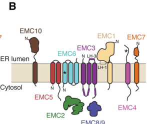

## Question

# Gene Research for Functional Annotation

## ⚠️ CRITICAL: Gene/Protein Identification Context

**BEFORE YOU BEGIN RESEARCH:** You MUST verify you are researching the CORRECT gene/protein. Gene symbols can be ambiguous, especially for less well-characterized genes from non-model organisms.

### Target Gene/Protein Identity (from UniProt):
- **UniProt Accession:** Q9BV81
- **Protein Description:** RecName: Full=ER membrane protein complex subunit 6; AltName: Full=Transmembrane protein 93;
- **Gene Information:** Name=EMC6; Synonyms=TMEM93;
- **Organism (full):** Homo sapiens (Human).
- **Protein Family:** Belongs to the EMC6 family. .
- **Key Domains:** Emc6. (IPR008504); EMC6-like. (IPR029008); EMC6 (PF07019)

### MANDATORY VERIFICATION STEPS:

1. **Check if the gene symbol "EMC6" matches the protein description above**
2. **Verify the organism is correct:** Homo sapiens (Human).
3. **Check if protein family/domains align with what you find in literature**
4. **If you find literature for a DIFFERENT gene with the same or similar symbol, STOP**

### If Gene Symbol is Ambiguous or You Cannot Find Relevant Literature:

**DO NOT PROCEED WITH RESEARCH ON A DIFFERENT GENE.** Instead:
- State clearly: "The gene symbol 'EMC6' is ambiguous or literature is limited for this specific protein"
- Explain what you found (e.g., "Found extensive literature on a different gene with the same symbol in a different organism")
- Describe the protein based ONLY on the UniProt information provided above
- Suggest that the protein function can be inferred from domain/family information

### Research Target:

Please provide a comprehensive research report on the gene **EMC6** (gene ID: EMC6, UniProt: Q9BV81) in human.

The research report should be a detailed narrative explaining the function, biological processes, and localization of the gene product. Citations should be given for all claims.

You should prioritize authoritative reviews and primary scientific literature when conducting research. You can supplement
this with annotations you find in gene/protein databases, but these can be outdated or inaccurate.

We are specifically interested in the primary function of the gene - for enzymes, what reaction is catalyzed, and what is the substrate specificity? For transporters, what is the substrate? For structural proteins or adapters, what is the broader structural role? For signaling molecules, what is the role in the pathway.

We are interested in where in or outside the cell the gene product carries out its function.

We are also interested in the signaling or biochemical pathways in which the gene functions. We are less interested in broad pleiotropic effects, except where these elucidate the precise role.

Include evidence where possible. We are interested in both experimental evidence as well as inference from structure, evolution, or bioinformatic analysis. Precise studies should be prioritized over high-throughput, where available.

## Output

Question: You are an expert researcher providing comprehensive, well-cited information.

Provide detailed information focusing on:
1. Key concepts and definitions with current understanding
2. Recent developments and latest research (prioritize 2023-2024 sources)
3. Current applications and real-world implementations
4. Expert opinions and analysis from authoritative sources
5. Relevant statistics and data from recent studies

Format as a comprehensive research report with proper citations. Include URLs and publication dates where available.
Always prioritize recent, authoritative sources and provide specific citations for all major claims.

# Gene Research for Functional Annotation

## ⚠️ CRITICAL: Gene/Protein Identification Context

**BEFORE YOU BEGIN RESEARCH:** You MUST verify you are researching the CORRECT gene/protein. Gene symbols can be ambiguous, especially for less well-characterized genes from non-model organisms.

### Target Gene/Protein Identity (from UniProt):
- **UniProt Accession:** Q9BV81
- **Protein Description:** RecName: Full=ER membrane protein complex subunit 6; AltName: Full=Transmembrane protein 93;
- **Gene Information:** Name=EMC6; Synonyms=TMEM93;
- **Organism (full):** Homo sapiens (Human).
- **Protein Family:** Belongs to the EMC6 family. .
- **Key Domains:** Emc6. (IPR008504); EMC6-like. (IPR029008); EMC6 (PF07019)

### MANDATORY VERIFICATION STEPS:

1. **Check if the gene symbol "EMC6" matches the protein description above**
2. **Verify the organism is correct:** Homo sapiens (Human).
3. **Check if protein family/domains align with what you find in literature**
4. **If you find literature for a DIFFERENT gene with the same or similar symbol, STOP**

### If Gene Symbol is Ambiguous or You Cannot Find Relevant Literature:

**DO NOT PROCEED WITH RESEARCH ON A DIFFERENT GENE.** Instead:
- State clearly: "The gene symbol 'EMC6' is ambiguous or literature is limited for this specific protein"
- Explain what you found (e.g., "Found extensive literature on a different gene with the same symbol in a different organism")
- Describe the protein based ONLY on the UniProt information provided above
- Suggest that the protein function can be inferred from domain/family information

### Research Target:

Please provide a comprehensive research report on the gene **EMC6** (gene ID: EMC6, UniProt: Q9BV81) in human.

The research report should be a detailed narrative explaining the function, biological processes, and localization of the gene product. Citations should be given for all claims.

You should prioritize authoritative reviews and primary scientific literature when conducting research. You can supplement
this with annotations you find in gene/protein databases, but these can be outdated or inaccurate.

We are specifically interested in the primary function of the gene - for enzymes, what reaction is catalyzed, and what is the substrate specificity? For transporters, what is the substrate? For structural proteins or adapters, what is the broader structural role? For signaling molecules, what is the role in the pathway.

We are interested in where in or outside the cell the gene product carries out its function.

We are also interested in the signaling or biochemical pathways in which the gene functions. We are less interested in broad pleiotropic effects, except where these elucidate the precise role.

Include evidence where possible. We are interested in both experimental evidence as well as inference from structure, evolution, or bioinformatic analysis. Precise studies should be prioritized over high-throughput, where available.

# Research report: Human **EMC6** (TMEM93) — functional annotation

## 0) Target verification (identity and scope)
The target protein is **ER membrane protein complex subunit 6 (EMC6)**, also known as **TMEM93**, in **Homo sapiens** (UniProt **Q9BV81**). The retrieved primary literature consistently uses “EMC6” to denote a **multi-pass transmembrane subunit of the ER membrane protein complex (EMC)** that forms a membrane-embedded functional core with EMC3, matching the UniProt description (pleiner2020structuralbasisfor pages 1-3, pleiner2020structuralbasisfor pages 7-11).

## 1) Key concepts, definitions, and current understanding

### 1.1 The ER membrane protein complex (EMC)
The **EMC** is a conserved, multi-subunit ER complex that functions as a **membrane protein biogenesis factor**, including **insertase** activity for certain transmembrane helices/domains (TMDs/TMHs) and broader **chaperone/holdase-like** roles during folding/assembly/quality control of membrane proteins (odonnell2020thearchitectureof pages 1-2, li2024structuralinsightsinto pages 1-3).

A central mechanistic concept is that EMC provides a **membrane-embedded “hydrophilic vestibule”** (a polar conduit partway through the bilayer) that reduces the energetic barrier to inserting **low-hydrophobicity or amphipathic TM helices**—a substrate class that can be difficult to insert via the canonical Sec61 lateral gate alone (pleiner2020structuralbasisfor pages 1-3, pleiner2020structuralbasisfor pages 7-11, li2024structuralinsightsinto pages 1-3).

### 1.2 What EMC6 is (molecular role)
**EMC6 is not an enzyme, receptor, or transporter**; it is a **structural and functional subunit** of the EMC insertase/chaperone machine.

In the foundational human EMC cryo-EM structure, EMC6 is an **integral membrane protein with three transmembrane helices**. Together with EMC3, EMC6 forms an **enclosed hydrophilic vestibule within the membrane** proposed to be the pathway for insertion of selected substrates (pleiner2020structuralbasisfor pages 1-3, pleiner2020structuralbasisfor pages 7-11). A figure-level view of EMC6’s transmembrane placement in the EMC core and vestibule is provided in Pleiner et al. 2020 (pleiner2020structuralbasisfor media 044a8aee).

## 2) Subcellular localization, topology, domains, and interaction partners

### 2.1 Localization
EMC6 functions as part of the **ER membrane-resident EMC complex**, consistent with studies purifying intact EMC from human cells and characterizing its role in ER membrane insertion (odonnell2020thearchitectureof pages 1-2, li2024structuralinsightsinto pages 1-3).

### 2.2 Topology/structural features
Human EMC6 contains **three transmembrane helices** and contributes directly to the **membrane-embedded core** of EMC (pleiner2020structuralbasisfor pages 1-3, pleiner2020structuralbasisfor pages 7-11). One EMC6 helix (TM1) is described as unusually weakly hydrophobic and becomes stably inserted upon assembly with EMC5, indicating **subunit–subunit assembly dependence** for proper EMC6 integration and/or stability (predicted insertion ΔG reported as **3.8**) (pleiner2020structuralbasisfor pages 1-3).

### 2.3 Key interaction partners (direct and contextual)
At minimum, EMC6’s core interaction partners are other EMC subunits, especially **EMC3**, with which EMC6 forms the hydrophilic vestibule required for insertase activity (pleiner2020structuralbasisfor pages 1-3, pleiner2020structuralbasisfor pages 7-11). In a 2024 cryo-EM study, EMC6 is again described as part of the **EMC3–EMC6 core**, with adjacent EMC4 forming a sidewall of the vestibule (li2024structuralinsightsinto pages 1-3).

In addition to insertase biology, human EMC has been observed in a state interacting with **VDAC** at **mitochondria–ER contact sites (MERCs)**; this context links EMC architecture to ER–mitochondria crosstalk, though EMC6’s role is described as part of the transmembrane core rather than the specific “gating plug” element in that paper (li2024structuralinsightsinto pages 1-3).

## 3) Primary molecular function: how EMC6 contributes to membrane protein biogenesis

### 3.1 Insertase core: the EMC3–EMC6 hydrophilic vestibule
The 2020 human EMC structure proposes that insertion occurs via an **enclosed hydrophilic vestibule** located within the membrane and **formed by EMC3 and EMC6** (pleiner2020structuralbasisfor pages 1-3, pleiner2020structuralbasisfor pages 7-11). The model includes local membrane remodeling (e.g., thinning) and electrostatic features that facilitate insertion of difficult TM segments (pleiner2020structuralbasisfor pages 7-11).

**Interpretation for functional annotation:** EMC6 is best annotated as a **core architectural subunit that shapes the substrate insertion conduit** (hydrophilic vestibule) together with EMC3.

### 3.2 Substrate routing and fidelity (2023: selectivity filter concept)
A 2023 mechanistic study describes a **selectivity filter** at the EMC hydrophilic vestibule entrance: positively charged residues at the vestibule entrance can **reject mitochondrial tail-anchored (TA) proteins** (with positively charged C-termini) and help enforce correct topology of multipass proteins (positive-inside rule) (Pleiner et al., *J Cell Biol*, 2023-05; https://doi.org/10.1083/jcb.202212007) (pleiner2023aselectivityfilter pages 1-2, pleiner2023aselectivityfilter pages 2-4). Although the crosslinking and mutagenesis emphasis in the retrieved text is largely on EMC3 and vestibule architecture, this work further consolidates the mechanistic framework in which the **EMC3/EMC6 vestibule is the insertion route** (pleiner2023aselectivityfilter pages 2-4).

### 3.3 Chaperone/holdase and client assembly (2023: EMC–CaV assembly intermediate)
A 2023 *Nature* client-bound structure captured an ~**0.6 MDa** complex between human EMC and a voltage-gated calcium channel (CaV1.2) assembly intermediate, providing direct structural evidence that EMC can function as a **holdase/chaperone** during complex membrane protein assembly (Chen et al., *Nature*, 2023-07; https://doi.org/10.1038/s41586-023-06175-5) (chen2023emcchaperone–cavstructure pages 1-3). This study reports distinct EMC client-binding sites (“TM and Cyto docks”) and shows EMC binding can reshape channel elements; it therefore supports the view that the EMC’s roles extend beyond simple insertion to **orchestrating assembly intermediates** (chen2023emcchaperone–cavstructure pages 1-3).

## 4) Recent developments (prioritizing 2023–2024)

### 4.1 2023 — selectivity filter and prevention of misinsertion at the ER
Pleiner et al. (2023-05) directly links EMC-mediated insertion to **proteostasis and compartment integrity** by explaining how charge-based discrimination at the vestibule limits misinsertion of mitochondrial TA proteins into the ER and enforces topology rules for multipass substrates (https://doi.org/10.1083/jcb.202212007) (pleiner2023aselectivityfilter pages 1-2).

### 4.2 2023 — first structural view of EMC bound to a multi-bundle client (CaV)
Chen et al. (2023-07) provides a structural “snapshot” of EMC engaged with a complex multipass client during assembly and supports an EMC “holdase” role important for functional channel biogenesis (https://doi.org/10.1038/s41586-023-06175-5) (chen2023emcchaperone–cavstructure pages 1-3).

### 4.3 2024 — EMC–VDAC interaction and a regulated hydrophilic vestibule state at MERCs
Li et al. (Received 2023-11-06; Published **2024-03-15**) reported human EMC structures in **apo (3.47 Å)** and **VDAC-bound (3.32 Å)** states and observed a **specific EMC–VDAC interaction at mitochondria–ER contact sites** (https://doi.org/10.18632/aging.205660) (li2024structuralinsightsinto pages 1-3). The work identifies a “gating plug” inside the hydrophilic vestibule and suggests that in the VDAC1-bound state the EMC is unlikely to function as an insertase, implying **state-dependent regulation of the vestibule** (li2024structuralinsightsinto pages 1-3).

## 5) Current applications and real-world implementations

### 5.1 Interpreting membrane protein biogenesis and proteostasis mechanisms
Because many therapeutically relevant targets are membrane proteins, a practical application of EMC/EMC6 biology is improving mechanistic understanding of how membrane proteins are inserted and assembled, and how insertion fidelity prevents mislocalization (pleiner2023aselectivityfilter pages 1-2, pleiner2023aselectivityfilter pages 2-4).

### 5.2 Structural frameworks enabling rational hypotheses about disease-linked phenotypes
Li et al. (2024) explicitly frames EMC multifunctionality as relevant to pathological phenotypes (including cancer, metabolic and neurological contexts) and emphasizes that EMC client diversity motivates disease associations (li2024structuralinsightsinto pages 1-3). While this does not prove EMC6 causality, it motivates using EMC6/EMC genetics and proteostasis assays to interpret disease mechanisms.

### 5.3 Knowledgebase-driven translational mapping (Open Targets)
Open Targets reports disease–target association evidence connecting **EMC6** to multiple cancer-related entities (e.g., glioblastoma multiforme, lung adenocarcinoma, gastric cancer) and Blackfan–Diamond anemia, each with small evidence counts and modest overall association scores; these should be treated as **hypothesis-generating** rather than definitive mechanistic proof (OpenTargets Search: -EMC6).

## 6) Relevant statistics and data points from cited studies

* **Human EMC cryo-EM resolution:** ~**3.4 Å** for the human EMC structure enabling near-complete atomic modeling; EMC6 contributes three TM helices to the core (Pleiner et al., 2020-07; https://doi.org/10.1126/science.abb5008) (pleiner2020structuralbasisfor pages 1-3).
* **EMC6 hydrophobicity metric:** EMC6 TM1 predicted insertion ΔG **= 3.8**, with insertion stabilized upon EMC assembly (with EMC5) (pleiner2020structuralbasisfor pages 1-3).
* **Yeast Emc3/4/6 knockout proteomics:** **38** membrane proteins significantly reduced in Emc3/4/6 knockouts (with additional validation described) (Bai et al., 2020-06; https://doi.org/10.1038/s41586-020-2389-3) (bai2020structureofthe pages 1-2).
* **Client-bound complex size:** EMC–CaV assembly intermediate reported as ~**0.6 MDa** (Chen et al., 2023-07; https://doi.org/10.1038/s41586-023-06175-5) (chen2023emcchaperone–cavstructure pages 1-3).
* **2024 EMC structures with VDAC:** apo **3.47 Å**; VDAC-bound **3.32 Å** (Li et al., 2024-03-15; https://doi.org/10.18632/aging.205660) (li2024structuralinsightsinto pages 1-3).

## 7) Expert synthesis and analysis (evidence-weighted)

1. **Most strongly supported primary function:** EMC6 is best characterized as a **core membrane subunit of the EMC insertase**, structurally partnering with EMC3 to form the **hydrophilic vestibule** that provides a favorable path for insertion of difficult TM helices (pleiner2020structuralbasisfor pages 1-3, pleiner2020structuralbasisfor pages 7-11, pleiner2020structuralbasisfor media 044a8aee).
2. **Topology and assembly constraint are key to EMC6 biology:** EMC6’s **three-TM architecture** and the observation that one TM is weakly hydrophobic (ΔG = 3.8) emphasize that EMC6 is likely **stabilized by complex assembly**, consistent with a role as an obligate component of a multi-subunit membrane machine rather than a stand-alone factor (pleiner2020structuralbasisfor pages 1-3).
3. **Where the field is moving (2023–2024):** EMC is increasingly viewed as a **regulated multifunctional machine**: (i) it ensures insertion fidelity (selectivity filter) and topology enforcement (pleiner2023aselectivityfilter pages 1-2), (ii) it can bind complex clients during assembly (CaV intermediate) (chen2023emcchaperone–cavstructure pages 1-3), and (iii) it adopts alternative functional states at organelle contact sites (VDAC-bound state at MERCs) that may be incompatible with insertase activity (li2024structuralinsightsinto pages 1-3). EMC6 appears consistently as part of the **core EMC3–EMC6 vestibule module** across these structural states (li2024structuralinsightsinto pages 1-3).

## 8) Structured summary of key sources

| Publication | Date | URL / DOI | Study type | EMC6-relevant findings | Quantitative data |
|---|---|---|---|---|---|
| Pleiner et al., 2020, *Science* | Jul 2020 | https://doi.org/10.1126/science.abb5008 | Human cryo-EM structure / mechanism | Human EMC6 is an integral membrane subunit with **3 transmembrane helices**; EMC6 and EMC3 form an enclosed **hydrophilic vestibule** within the membrane that supports substrate insertion. EMC6 TM1 is unusually weakly hydrophobic and inserts efficiently only upon assembly with EMC5, linking EMC6 to EMC assembly/stability. Figure summaries identify EMC6 in the core TM module and vestibule with EMC3. (pleiner2020structuralbasisfor pages 1-3, pleiner2020structuralbasisfor pages 7-11, pleiner2020structuralbasisfor media 044a8aee) | Cryo-EM resolution **~3.4 Å**; EMC particle **~200 × 70 × 100 Å**; EMC6 TM1 predicted insertion **ΔG = 3.8**; structure **PDB 6WW7**. (pleiner2020structuralbasisfor pages 1-3) |
| O'Donnell et al., 2020, *eLife* | May 2020 | https://doi.org/10.7554/elife.57887 | Architecture / biochemical mechanism | Places EMC6 among the mammalian EMC membrane subunits in a stable ER insertase complex. EMC contains a cytosolic vestibule leading into a lumenally sealed, lipid-exposed intramembrane groove for TMD insertion; EMC6 contributes as part of the membrane subcomplex required for overall EMC integrity and function. Purified EMC is sufficient for insertion of terminal TMDs in vitro. (odonnell2020thearchitectureof pages 1-2, odonnell2020thearchitectureof pages 2-4) | Mammalian EMC described as **10 subunits** with **7 membrane subunits** including EMC6 and **12 predicted TM helices** across the membrane subcomplex. (odonnell2020thearchitectureof pages 1-2) |
| Bai et al., 2020, *Nature* | Jun 2020 | https://doi.org/10.1038/s41586-020-2389-3 | Cryo-EM structure / insertase mechanism | In yeast EMC, Emc6 is a transmembrane scaffold subunit contributing to the membrane region of the insertase. The EMC transmembrane region includes Emc4, Emc5 and Emc6 plus TMDs of Emc1 and Emc3, supporting evolutionary conservation of EMC6’s role in the insertase membrane core relevant to human EMC6. (bai2020structureofthe pages 1-2) | EMC knockout phenotypes: knockout of any single Emc subunit recapitulated EMC-null growth defect at **37°C**; proteomics of **Emc3/4/6 KO** cells found **38** significantly reduced membrane proteins, with **9** validated as markedly downregulated in Emc3 KO; structure **PDB 6WB9 / EMD-21587**. (bai2020structureofthe pages 1-2) |
| Bai & Li, 2022, *FEBS Journal* | Mar 2022 | https://doi.org/10.1111/febs.15786 | Review | Review synthesizing EMC structural work and current model: EMC is a membrane insertase for less-hydrophobic/amphipathic helices, with a consensus substrate-binding pocket and architectural conservation from yeast to humans. For EMC6 specifically, the review supports its placement in the conserved membrane-embedded insertase core. (paper search result) | Review notes mammalian EMC as a **9-subunit complex (EMC1–7, 8/9, 10 context-dependent naming in review summary)** and emphasizes the conserved client TMH-binding pocket; no EMC6-specific numerical assay readout provided in gathered evidence. (paper search result) |
| Pleiner et al., 2023, *Journal of Cell Biology* | May 2023 | https://doi.org/10.1083/jcb.202212007 | Mechanistic / selectivity filter | Defines a **selectivity filter** in EMC that limits protein misinsertion at the ER and enforces topology of multipass membrane proteins. The EMC3/6 insertase core remains central, but the gathered evidence indicates **mutations in EMC6 had only mild effects** relative to stronger EMC3 effects in the tested selectivity-filter context. EMC6 remains part of the partially enclosed vestibule with surrounding dynamic subunits. (paper search result) | Improved human EMC cryo-EM reconstruction reported; exact numerical resolution and EMC6-specific effect sizes not available in gathered evidence. EMC6 mutation effects described qualitatively as **mild**. (paper search result) |
| Chen et al., 2023, *Nature* | May 2023 | https://doi.org/10.1038/s41586-023-06175-5 | Client-bound structure / chaperone mechanism | EMC–CaV structure reveals a membrane-protein assembly intermediate and supports an EMC **chaperone** mode in addition to insertase activity. Gathered evidence specifically notes an **EMC6-gated transmembrane cavity** proposed to participate in client engagement during CaV biogenesis, placing EMC6 directly in the client-handling path. (paper search result) | The study reports an **~0.6 MDa** EMC–client complex. Additional EMC6-specific interface measurements were not available in gathered evidence. (paper search result) |
| Li et al., 2024, *Aging (Albany NY)* | Mar 2024 | https://doi.org/10.18632/aging.205660 | Human cryo-EM structure / interaction with VDAC | Human EMC structures in apo and VDAC-bound states identify a conserved EMC–VDAC interaction at **mitochondria–ER contact sites (MERCs)**. EMC6 is part of the **EMC3–EMC6 core**; an ordered EMC4 three-TMH bundle sits adjacent to this core to form a sidewall of the hydrophilic vestibule. The reported **gating plug** is assigned to EMC3 rather than EMC6, so EMC6’s role here is structural/core rather than the plug itself. (li2024structuralinsightsinto pages 1-3) | Apo structure **3.47 Å**; VDAC-bound structure **3.32 Å**. No EMC6-specific buried surface area or mutation phenotype was provided in gathered evidence. (li2024structuralinsightsinto pages 1-3) |
| Klose et al., 2025, *Nature Communications* | Aug 2025 | https://doi.org/10.1038/s41467-025-62109-x | Chaperone mechanism / interactomics | Although outside the user-prioritized 2023–2024 window, this recent mechanistic study is useful context: EMC6 is named as part of a **lipid-filled cavity** formed by EMC1, EMC3, EMC5 and EMC6, distinct from the canonical insertase site, supporting a broader EMC chaperone/quality-control role. (klose2025theemcacts pages 1-2) | Crosslinking IP–MS found **506** enriched interactors, including **>200** transmembrane proteins; about **50%** of single-pass hits had signal peptides, **~1/3** had terminal TM helices, and **~2/3** of multipass hits had predicted Ncyto orientation. (klose2025theemcacts pages 1-2) |

*Table: This table summarizes key structural and mechanistic studies relevant to human EMC6/TMEM93 within the ER membrane protein complex, emphasizing recent 2023–2024 work while anchoring interpretations in foundational 2020 structures. It highlights EMC6’s role in the EMC3/EMC6 insertase core, assembly/stability, client handling, and emerging interaction contexts such as VDAC at MERCs.*

## 9) Limitations of current evidence specifically for EMC6
Within the retrieved corpus, **most mechanistic mutations and substrate-contact mapping** are described for **EMC3** and/or the EMC complex as a whole; there is comparatively **less direct EMC6-only functional perturbation** evidence (e.g., EMC6 point mutants with quantified client effects) available in the captured text excerpts (pleiner2023aselectivityfilter pages 2-4). Disease associations for EMC6 in knowledgebases (Open Targets) are not, by themselves, mechanistic proof and require follow-up in primary genetics and functional assays (OpenTargets Search: -EMC6).

References

1. (pleiner2020structuralbasisfor pages 1-3): Tino Pleiner, Giovani Pinton Tomaleri, Kurt Januszyk, Alison J. Inglis, Masami Hazu, and Rebecca M. Voorhees. Structural basis for membrane insertion by the human er membrane protein complex. Jul 2020. URL: https://doi.org/10.1126/science.abb5008, doi:10.1126/science.abb5008. This article has 192 citations and is from a highest quality peer-reviewed journal.

2. (pleiner2020structuralbasisfor pages 7-11): Tino Pleiner, Giovani Pinton Tomaleri, Kurt Januszyk, Alison J. Inglis, Masami Hazu, and Rebecca M. Voorhees. Structural basis for membrane insertion by the human er membrane protein complex. Jul 2020. URL: https://doi.org/10.1126/science.abb5008, doi:10.1126/science.abb5008. This article has 192 citations and is from a highest quality peer-reviewed journal.

3. (odonnell2020thearchitectureof pages 1-2): John P O'Donnell, Ben P Phillips, Yuichi Yagita, Szymon Juszkiewicz, Armin Wagner, Duccio Malinverni, Robert J Keenan, Elizabeth A Miller, and Ramanujan S Hegde. The architecture of emc reveals a path for membrane protein insertion. May 2020. URL: https://doi.org/10.7554/elife.57887, doi:10.7554/elife.57887. This article has 121 citations and is from a domain leading peer-reviewed journal.

4. (li2024structuralinsightsinto pages 1-3): Mingyue Li, Chunli Zhang, Yuntao Xu, Shaobai Li, Chenhui Huang, Jian Wu, and Ming Lei. Structural insights into human emc and its interaction with vdac. Aging (Albany NY), 16:5501-5525, Mar 2024. URL: https://doi.org/10.18632/aging.205660, doi:10.18632/aging.205660. This article has 6 citations.

5. (pleiner2020structuralbasisfor media 044a8aee): Tino Pleiner, Giovani Pinton Tomaleri, Kurt Januszyk, Alison J. Inglis, Masami Hazu, and Rebecca M. Voorhees. Structural basis for membrane insertion by the human er membrane protein complex. Jul 2020. URL: https://doi.org/10.1126/science.abb5008, doi:10.1126/science.abb5008. This article has 192 citations and is from a highest quality peer-reviewed journal.

6. (pleiner2023aselectivityfilter pages 1-2): Tino Pleiner, Masami Hazu, Giovani Pinton Tomaleri, Vy N. Nguyen, Kurt Januszyk, and Rebecca M. Voorhees. A selectivity filter in the er membrane protein complex limits protein misinsertion at the er. The Journal of Cell Biology, May 2023. URL: https://doi.org/10.1083/jcb.202212007, doi:10.1083/jcb.202212007. This article has 28 citations.

7. (pleiner2023aselectivityfilter pages 2-4): Tino Pleiner, Masami Hazu, Giovani Pinton Tomaleri, Vy N. Nguyen, Kurt Januszyk, and Rebecca M. Voorhees. A selectivity filter in the er membrane protein complex limits protein misinsertion at the er. The Journal of Cell Biology, May 2023. URL: https://doi.org/10.1083/jcb.202212007, doi:10.1083/jcb.202212007. This article has 28 citations.

8. (chen2023emcchaperone–cavstructure pages 1-3): Zhou Chen, Abhisek Mondal, Fayal Abderemane-Ali, Seil Jang, Sangeeta Niranjan, José L. Montaño, Balyn W. Zaro, and Daniel L. Minor. Emc chaperone–cav structure reveals an ion channel assembly intermediate. Nature, 619:410-419, May 2023. URL: https://doi.org/10.1038/s41586-023-06175-5, doi:10.1038/s41586-023-06175-5. This article has 77 citations and is from a highest quality peer-reviewed journal.

9. (OpenTargets Search: -EMC6): Open Targets Query (-EMC6, 5 results). Buniello, A. et al. (2025). Open Targets Platform: facilitating therapeutic hypotheses building in drug discovery. Nucleic Acids Research.

10. (bai2020structureofthe pages 1-2): Lin Bai, Qinglong You, Xiang Feng, Amanda Kovach, and Huilin Li. Structure of the er membrane complex, a transmembrane-domain insertase. Nature, 584:475-478, Jun 2020. URL: https://doi.org/10.1038/s41586-020-2389-3, doi:10.1038/s41586-020-2389-3. This article has 164 citations and is from a highest quality peer-reviewed journal.

11. (odonnell2020thearchitectureof pages 2-4): John P O'Donnell, Ben P Phillips, Yuichi Yagita, Szymon Juszkiewicz, Armin Wagner, Duccio Malinverni, Robert J Keenan, Elizabeth A Miller, and Ramanujan S Hegde. The architecture of emc reveals a path for membrane protein insertion. May 2020. URL: https://doi.org/10.7554/elife.57887, doi:10.7554/elife.57887. This article has 121 citations and is from a domain leading peer-reviewed journal.

12. (klose2025theemcacts pages 1-2): Carolin J Klose, Kevin M Meighen-Berger, M. Kulke, Marina Parr, Barbara Steigenberger, Martin Zacharias, Dmitrij Frishman, and Matthias Feige. The emc acts as a chaperone for membrane proteins. Nature Communications, Aug 2025. URL: https://doi.org/10.1038/s41467-025-62109-x, doi:10.1038/s41467-025-62109-x. This article has 6 citations and is from a highest quality peer-reviewed journal.

## Artifacts

- [Edison artifact artifact-00](EMC6-deep-research-falcon_artifacts/artifact-00.md)

## Citations

1. pleiner2020structuralbasisfor pages 1-3
2. li2024structuralinsightsinto pages 1-3
3. pleiner2020structuralbasisfor pages 7-11
4. pleiner2023aselectivityfilter pages 2-4
5. pleiner2023aselectivityfilter pages 1-2
6. bai2020structureofthe pages 1-2
7. odonnell2020thearchitectureof pages 1-2
8. klose2025theemcacts pages 1-2
9. odonnell2020thearchitectureof pages 2-4
10. https://doi.org/10.1083/jcb.202212007
11. https://doi.org/10.1038/s41586-023-06175-5
12. https://doi.org/10.18632/aging.205660
13. https://doi.org/10.1126/science.abb5008
14. https://doi.org/10.1038/s41586-020-2389-3
15. https://doi.org/10.7554/elife.57887
16. https://doi.org/10.1111/febs.15786
17. https://doi.org/10.1038/s41467-025-62109-x
18. https://doi.org/10.1126/science.abb5008,
19. https://doi.org/10.7554/elife.57887,
20. https://doi.org/10.18632/aging.205660,
21. https://doi.org/10.1083/jcb.202212007,
22. https://doi.org/10.1038/s41586-023-06175-5,
23. https://doi.org/10.1038/s41586-020-2389-3,
24. https://doi.org/10.1038/s41467-025-62109-x,